> [!success] Mastery Check
> - [ ] **Studied Well**
> - [ ] **Can explain the concept without notes**
> - [ ] **Can answer interview questions confidently**
> - [ ] **Can implement it in a real project**


# 4.138 — Refresh Token Pattern: Rotation, Storage, and Revocation

---

## PART 0 — Navigation & Context

### Where This Topic Sits in the ASP.NET Core Domain

```
ASP.NET Core Mastery
│
├── Host & Lifecycle
├── Configuration
├── Logging
├── Dependency Injection
├── Middleware Pipeline
├── Routing
├── Minimal APIs / MVC
│
├── ◉ Authentication  ◄─── YOU ARE HERE
│   ├── 4.134 — Authentication Architecture
│   ├── 4.136 — JWT Bearer Authentication (AddJwtBearer + Validation)
│   ├── 4.137 — Generating JWT Access Tokens with Claims
│   ├── 4.138 — Refresh Token Pattern: Rotation, Storage, Revocation ◄─
│   ├── 4.150 — Token Storage Security (HttpOnly Cookie vs Authorization Header)
│   └── 4.211 — Data Protection API (IDataProtector)
│
├── Authorization
├── Validation
├── Error Handling
├── Caching
│   └── 4.188 — Redis as IDistributedCache
├── Security
└── ...
```

### What You Need Before This

| Prerequisite | Why You Need It |
|---|---|
| [[4.134 — Authentication Architecture]] | The refresh token flow is a specialization of token-based auth; you must understand `IAuthenticationService`, schemes, and `HttpContext.User` first |
| [[4.136 — JWT Bearer Authentication: AddJwtBearer and Token Validation]] | Access tokens are JWTs; knowing how `JwtBearerMiddleware` validates them tells you why you need refresh tokens at all (expiry, revocation impossibility) |
| [[4.137 — Generating JWT Access Tokens with Claims]] | The refresh endpoint is the only place that calls your token generation logic; you must understand `JwtSecurityTokenHandler` and claim embedding |
| [[4.150 — Token Storage Security: HttpOnly Cookies vs Authorization Header]] | Refresh tokens stored in HttpOnly cookies require a different endpoint contract than Authorization-header patterns |

### What This Unlocks After

| Next Topic | How This Enables It |
|---|---|
| [[4.188 — Redis as IDistributedCache]] | Redis is the production storage backend for refresh tokens in multi-pod deployments; understanding token lifecycle tells you what to cache and for how long |
| [[4.211 — Data Protection API: IDataProtector]] | Encrypting refresh tokens at rest before writing to database or Redis is the natural follow-on security hardening step |
| Multi-tenant token isolation patterns | Token families and per-tenant revocation are direct extensions of the family/rotation concept |
| OAuth 2.0 / OIDC integration | Refresh token flow in Auth0, Azure AD B2C, and custom IdentityServer is this exact pattern at a larger scale |

### Why This Topic Matters in Production

> **Refresh token rotation with server-side revocation is the only mechanism that prevents indefinite session persistence after credential theft in a stateless JWT architecture — without it, a stolen access token grants access for its full lifetime with no recourse.**

A system without a proper refresh token pattern is forced into a false choice: either make access tokens long-lived (hours/days) and accept that theft is catastrophic, or make them short-lived and force users to re-authenticate constantly. Refresh tokens solve this at the cost of a small amount of server-side state — the canonical compromise in every real-world token auth system.

---

## PART 1 — The Core Mental Model

### The Fundamental Rule

> **A refresh token is a one-time-use credential stored server-side that grants the right to obtain a new short-lived access token; rotation means every use produces a brand-new refresh token and invalidates the old one, so any replay of an already-used token immediately signals theft and triggers full-family revocation.**

### The Plain-Language Analogy

Imagine a hotel key card system with two types of cards. The **access card** opens room doors but expires every 15 minutes — short enough that a thief who finds it in the hallway can do limited damage before it stops working. The **refresh card** is kept in your wallet, never handed to anyone, and is the card you take to the front desk when your room card expires. The desk clerk tears up the old refresh card, gives you a new one, and prints you a fresh room card — this is token rotation.

Now, here is what makes the system robust: if the desk clerk sees someone try to use a refresh card that was **already torn up and replaced yesterday**, they know that card was stolen. They immediately deactivate **every card associated with that room** — the thief's card, your replacement card, everything — and page security. This is token family / reuse detection. The concurrent request problem? If two people simultaneously try to use the same refresh card, only one succeeds; the other's attempt is treated as a reuse attack.

In ASP.NET Core: the "room card" is the JWT access token validated by `JwtBearerMiddleware`. The "refresh card" is the opaque token stored in the `RefreshTokens` database table (hashed). The "front desk clerk" is your `POST /auth/refresh` endpoint. The "security page" is the family revocation that sets `RevokedAt` on every token in the chain.

### The Taxonomy Diagram

```mermaid
graph TD
    A["Token-Based Authentication"] --> B["Access Tokens (short-lived)"]
    A --> C["Refresh Tokens (long-lived)"]

    B --> B1["JWT Bearer\n(stateless, signed, 15min–1h)"]
    B --> B2["Opaque Access Token\n(server-side lookup, uncommon)"]

    C --> C1["Storage Backend"]
    C --> C2["Lifecycle Operations"]
    C --> C3["Rotation Strategy"]
    C --> C4["Revocation Scope"]

    C1 --> C1A["SQL Database\n(AuthRefreshToken table)"]
    C1 --> C1B["Redis / IDistributedCache\n(multi-pod, fast lookup)"]
    C1 --> C1C["HttpOnly Cookie\n(browser clients, CSRF-protected)"]

    C2 --> C2A["Issue: generate + hash + store"]
    C2 --> C2B["Validate: hash + compare + check expiry"]
    C2 --> C2C["Rotate: revoke old + issue new"]
    C2 --> C2D["Revoke: set RevokedAt on family"]

    C3 --> C3A["Absolute Rotation\nnew token every refresh (always)"]
    C3 --> C3B["Sliding Expiration\nextend ExpiresAt on each use"]
    C3 --> C3C["Absolute Max Lifetime\nhard ceiling regardless of sliding"]

    C4 --> C4A["Single Token Revocation\n(logout current device)"]
    C4 --> C4B["Family Revocation\n(theft detection - revoke all)"]
    C4 --> C4C["Global Revocation\n(all user sessions, admin action)"]

    style A fill:#2d4a7a,color:#fff
    style B fill:#1a5276,color:#fff
    style C fill:#1e8449,color:#fff
    style C1 fill:#145a32,color:#fff
    style C2 fill:#145a32,color:#fff
    style C3 fill:#145a32,color:#fff
    style C4 fill:#145a32,color:#fff
    style B1 fill:#154360,color:#fff
    style B2 fill:#154360,color:#fff
```



---

## PART 2 — Deep Mechanics

### 2.1 — The Access/Refresh Token Pair: Lifecycle and Asymmetry

```
──► ExceptionHandler ──► HSTS ──► StaticFiles ──► Routing ──► Auth ──► Authorization ──► Endpoints
                                                               │
                                                    [JwtBearerMiddleware]
                                                    validates access token
                                                    populates HttpContext.User
                                                               │
                                                    [POST /auth/refresh]  ◄── handled here
                                                    accepts refresh token
                                                    issues new access+refresh pair
                                                    (does NOT require Bearer header)
```

The core asymmetry is intentional and non-negotiable:

| Property | Access Token (JWT) | Refresh Token (Opaque) |
|---|---|---|
| Lifetime | 15 minutes – 1 hour | 7 – 30 days |
| Storage (server) | **None** — stateless | Database / Redis row |
| Storage (client) | Memory / Authorization header | HttpOnly cookie / secure storage |
| Revocable? | **No** — must expire naturally | Yes — `RevokedAt` column |
| Validated by | `JwtBearerMiddleware` (signature + claims) | Your application code (hash lookup) |
| Sent on every request? | Yes — `Authorization: Bearer <jwt>` | No — only on `POST /auth/refresh` |
| Compromise damage | Limited to token lifetime | Mitigated by rotation + reuse detection |

**Why the access token cannot be revoked:** `JwtBearerMiddleware` validates JWTs cryptographically using the signing key and `TokenValidationParameters`. There is no round-trip to any store. The token is valid if the signature checks out and the claims (especially `exp`) pass. Adding revocation to JWTs requires a blocklist lookup per request — at that point you have recreated server-side sessions with extra steps. The correct answer is: keep access tokens short-lived and accept that theft grants access for at most that window.

**HTTP Wire Format — Full Auth Flow:**
```
// Step 1: Login (obtain both tokens)
// POST /auth/login HTTP/1.1
// Content-Type: application/json
// {"email":"user@payments.com","password":"..."}
//
// HTTP/1.1 200 OK
// Content-Type: application/json
// Set-Cookie: refresh_token=<opaque_plaintext>; HttpOnly; Secure; SameSite=Strict; Max-Age=2592000
// {"accessToken":"eyJhbGci...","expiresIn":900}

// Step 2: Use access token
// GET /api/payments/42 HTTP/1.1
// Authorization: Bearer eyJhbGci...
//
// HTTP/1.1 200 OK  (or 401 if expired)

// Step 3: Access token expired — silent refresh
// POST /auth/refresh HTTP/1.1
// Cookie: refresh_token=<opaque_plaintext>
// (no Authorization header needed)
//
// HTTP/1.1 200 OK
// Set-Cookie: refresh_token=<new_opaque_plaintext>; HttpOnly; Secure; ...
// {"accessToken":"eyJhbGci...<new>","expiresIn":900}

// Step 4: Reuse attack detected (old token replayed)
// POST /auth/refresh HTTP/1.1
// Cookie: refresh_token=<old_already_rotated_token>
//
// HTTP/1.1 401 Unauthorized
// {"error":"invalid_grant","message":"Refresh token reuse detected. All sessions revoked."}
```

**Runtime Cost:** ~1 DB round-trip per refresh operation (hash lookup by `Token` column). Access token validation is zero-allocation signature verification in-process. The asymmetry is the performance design: thousands of access token validations happen with no I/O; refresh operations happen at most once per session lifetime.

---

### 2.2 — Token Rotation and Family Tracking

Token rotation is the cornerstone security property. On every successful refresh:
1. The incoming refresh token is marked `RevokedAt = UtcNow` and `ReplacedByToken = newTokenHash`
2. A new refresh token is generated, hashed, and stored as a child in the family
3. The new plaintext token is returned to the client

The **token family** is a linked list of refresh tokens connected by `ReplacedByToken`. Every member shares a common ancestor (the first-ever token issued for that session). This structure enables:
- **Single-use enforcement**: if a token's `IsActive = false`, it has already been used → treat as reuse
- **Reuse detection**: if a non-active token (already rotated) is presented, traverse up to find all family members and revoke them all
- **Selective logout**: revoke only the current session's token, not others

**Database Schema:**

```sql
CREATE TABLE RefreshTokens (
    Id          UNIQUEIDENTIFIER PRIMARY KEY DEFAULT NEWID(),
    UserId      NVARCHAR(450)    NOT NULL,   -- FK to AspNetUsers
    TokenHash   NVARCHAR(64)     NOT NULL,   -- SHA256(plaintext_token) as hex
    CreatedAt   DATETIMEOFFSET   NOT NULL DEFAULT SYSUTCDATETIME(),
    ExpiresAt   DATETIMEOFFSET   NOT NULL,
    RevokedAt   DATETIMEOFFSET   NULL,
    ReplacedByTokenHash NVARCHAR(64) NULL,  -- NULL for current/leaf node
    FamilyId    UNIQUEIDENTIFIER NOT NULL,   -- shared across rotations
    DeviceId    NVARCHAR(128)    NULL,       -- optional device fingerprint
    CreatedByIp NVARCHAR(45)     NULL,

    INDEX IX_RefreshTokens_TokenHash (TokenHash),
    INDEX IX_RefreshTokens_UserId    (UserId),
    INDEX IX_RefreshTokens_FamilyId  (FamilyId)
);
```

**The `IsActive` computed property** (C# model, not DB column):
```csharp
// Never stored — always derived from the two nullable timestamps
public bool IsActive => RevokedAt == null && DateTimeOffset.UtcNow < ExpiresAt;
```

**Rotation State Machine:**
```
                     ┌─────────────────────────────────────────┐
                     │           Token Family (FamilyId)        │
                     └─────────────────────────────────────────┘
                                         │
            ┌────────────────────────────┼────────────────────────────┐
            │                            │                            │
    ┌───────▼────────┐          ┌────────▼───────┐          ┌────────▼───────┐
    │  Token-A       │          │  Token-B       │          │  Token-C       │
    │  (root)        │          │  (rotation 1)  │          │  (rotation 2)  │
    │  RevokedAt=T1  │──────────│  RevokedAt=T2  │──────────│  RevokedAt=null│
    │  Replaced=B    │          │  Replaced=C    │          │  Replaced=null │
    │  IsActive=false│          │  IsActive=false│          │  IsActive=true │
    └────────────────┘          └────────────────┘          └────────────────┘

    If Token-A is presented now:
    → IsActive = false (RevokedAt is set)
    → This is a REUSE ATTACK
    → Revoke ALL tokens in FamilyId
    → Return 401
```

**ASP.NET Core Internally (approximate):** The `POST /auth/refresh` endpoint is a regular minimal API or controller endpoint — there is no built-in ASP.NET Core infrastructure for refresh token rotation. It runs after `UseAuthentication` / `UseAuthorization` but does NOT require a valid Bearer token (the refresh token is the credential). The endpoint calls your `IRefreshTokenService` which is Scoped and injected per request.

**Runtime Cost:** One `SELECT` by `TokenHash` index (O(log n) B-tree lookup), one `UPDATE` to set `RevokedAt`, one `INSERT` for the new token. Total: 2 DB round-trips minimum, or 1 batch operation. Use `IDbContextFactory<T>` if calling from a Singleton-scoped service.

---

### 2.3 — Token Generation and Hashing

Never store the plaintext refresh token. The threat model: if your database is breached, the attacker should not obtain usable tokens.

**Generation Strategy:**
```
Client receives:  RandomBytes(64) → Base64Url encode → "dGhpcyBpcyBhIHRlc3Q..."
Database stores:  SHA256("dGhpcyBpcyBhIHRlc3Q...") → "3f786850e387550fdab836ed7e6dc881de23001b..."
```

This is not encryption — it is one-way hashing. SHA256 is appropriate here because:
1. The token is 512 bits of cryptographic randomness (no brute-force feasibility)
2. We only need equality comparison, not decryption
3. Hashing is O(1) with negligible cost

**For higher security:** Use the [[4.211 — Data Protection API: IDataProtector]] to generate tokens via `IDataProtector.Protect()` and store the protected payload. This adds algorithm agility, key rotation, and a purpose chain. The tradeoff is that protected tokens are encrypted (not hashed), so the comparison must decrypt first — slightly more expensive but enables server-initiated token invalidation by rotating data protection keys.

**ASP.NET Core Internally (approximate):**
```csharp
// ASP.NET Core internally: RandomNumberGenerator is the correct source
// DO NOT use Guid.NewGuid() — only 122 bits of entropy, not random
// DO NOT use Random — not cryptographically secure

// What ASP.NET Core Data Protection uses internally (source: DataProtectionExtensions.cs):
// CryptographicRandom.GetBytes(256/8) → IDataProtector.Protect()
// For refresh tokens, replicate the randomness, skip the encryption overhead
```

**HTTP Wire Format — Token in HttpOnly Cookie vs Body:**
```
// HttpOnly Cookie approach (browser SPAs — preferred):
// POST /auth/login HTTP/1.1
//
// HTTP/1.1 200 OK
// Set-Cookie: refresh_token=dGhpcyBpcyBhIHRlc3Q...; Path=/auth/refresh; HttpOnly; Secure; SameSite=Strict; Max-Age=2592000
// Content-Type: application/json
// {"accessToken":"eyJhbGci...","expiresIn":900,"tokenType":"Bearer"}

// Authorization header approach (mobile native apps — also valid):
// POST /auth/login HTTP/1.1
//
// HTTP/1.1 200 OK
// Content-Type: application/json
// {
//   "accessToken":   "eyJhbGci...",
//   "refreshToken":  "dGhpcyBpcyBhIHRlc3Q...",  // returned in body for native
//   "expiresIn":     900,
//   "tokenType":     "Bearer"
// }
```

**Runtime Cost:** `RandomNumberGenerator.GetBytes(64)` = ~1 allocation, negligible CPU. `SHA256.HashData(tokenBytes)` = zero-allocation in .NET 7+ (static method, stack-allocated internally for small inputs).

---

### 2.4 — Sliding Expiration vs Absolute Max Lifetime

Two expiration concepts that must coexist:

**Sliding expiration:** Each successful refresh extends `ExpiresAt` by the configured window (e.g., 30 days from now). A user who refreshes every day never needs to log in again.

**Absolute maximum lifetime:** A hard ceiling on how long any session can live, regardless of activity. Prevents perpetual sessions that accumulate over months/years. Stored as a separate `AbsoluteExpiry` or derived from `FamilyId`'s `CreatedAt + MaxLifetime`.

```
Timeline example (30-day sliding, 90-day absolute max):

Day 0:    Token-A issued     ExpiresAt = Day 30   AbsoluteMax = Day 90
Day 5:    Token-B issued     ExpiresAt = Day 35   AbsoluteMax = Day 90
Day 35:   Token-C issued     ExpiresAt = Day 65   AbsoluteMax = Day 90
Day 65:   Token-D issued     ExpiresAt = Day 95   BUT AbsoluteMax = Day 90
                             → Cap ExpiresAt at Day 90
Day 90:   Token-E attempt    AbsoluteMax reached → FORCE RE-LOGIN
```

**ASP.NET Core internally:** There is no built-in sliding expiration for refresh tokens. You implement this in your `IRefreshTokenService.RotateAsync()`:

```csharp
// Pipeline position: inside POST /auth/refresh endpoint handler
// Runs after: UseAuthentication, UseAuthorization (auth NOT required for this endpoint)
// Runs before: Response serialization

var familyCreatedAt = existingToken.FamilyCreatedAt; // stored on first issuance
var absoluteExpiry = familyCreatedAt.AddDays(_options.AbsoluteLifetimeDays); // e.g., 90
var slidingExpiry = DateTimeOffset.UtcNow.AddDays(_options.SlidingWindowDays); // e.g., 30
var newExpiry = slidingExpiry < absoluteExpiry ? slidingExpiry : absoluteExpiry;
```

**HTTP Wire Format — Expired Token:**
```
// POST /auth/refresh HTTP/1.1
// Cookie: refresh_token=<expired_token>
//
// HTTP/1.1 401 Unauthorized
// Content-Type: application/problem+json
// {
//   "type":   "https://tools.ietf.org/html/rfc6750#section-3.1",
//   "title":  "Unauthorized",
//   "status": 401,
//   "detail": "Refresh token has expired. Please log in again.",
//   "code":   "refresh_token_expired"
//  }
```

**Runtime Cost:** Computing expiry = O(1), zero allocations. The DB `UPDATE` to set `RevokedAt` and `INSERT` for the new token is the dominant cost at ~2–5ms for SQL Server on the same datacenter network.

---

### 2.5 — Reuse Detection and Family Revocation

This is the most critical security mechanism. When a compromised token is replayed:

```
Sequence of events when Token-B (already rotated → Token-C) is replayed:

┌──────────────────────────────────────────────────────────────────────┐
│ POST /auth/refresh (Cookie: refresh_token=Token-B-plaintext)         │
│                                                                      │
│ 1. Hash incoming token → TokenHash-B                                 │
│ 2. SELECT * FROM RefreshTokens WHERE TokenHash = 'hash-of-B'         │
│ 3. Found! But: RevokedAt IS NOT NULL (already rotated to Token-C)    │
│ 4. IsActive = FALSE                                                  │
│                                                                      │
│ ══ REUSE ATTACK DETECTED ══                                          │
│                                                                      │
│ 5. SELECT * FROM RefreshTokens WHERE FamilyId = token.FamilyId       │
│ 6. UPDATE RefreshTokens SET RevokedAt = UtcNow                       │
│    WHERE FamilyId = token.FamilyId AND RevokedAt IS NULL             │
│    -- Revokes Token-C (the current legitimate token), and any others │
│                                                                      │
│ 7. Return HTTP 401                                                   │
│ 8. Optional: emit security audit event, alert, rate-limit IP         │
└──────────────────────────────────────────────────────────────────────┘
```

**What this achieves:** Even if an attacker stole Token-B and successfully rotated it to Token-C before the legitimate user tried to use Token-B, the legitimate user's next attempt with Token-B triggers family revocation. The attacker's Token-C is now dead. The legitimate user is forced to re-authenticate, which is the correct outcome — their session was compromised.

**The concurrent refresh race condition:** In multi-pod deployments, two requests might simultaneously try to rotate the same refresh token. Only the first `UPDATE ... WHERE RevokedAt IS NULL` wins (due to row-level locking in SQL Server). The second sees `RevokedAt IS NOT NULL` and must decide: reuse attack or legitimate race? Mitigation: use a short **reuse grace window** (2–5 seconds) — if `RevokedAt` was set within the last N seconds, return 200 with the `ReplacedByToken` instead of treating it as theft. This is the approach used by Auth0's implementation.

**Runtime Cost:** 1 SELECT + 1 batch UPDATE on the FamilyId index. In Redis, this is a Lua script executed atomically. O(k) where k = number of tokens in the family (typically 1–3 for normal users, bounded by cleanup jobs).

---

### 2.6 — HttpOnly Cookie Setup and CSRF Considerations

```
──► ExceptionHandler ──► HSTS ──► StaticFiles ──► Routing ──► Auth ──► Authorization ──► Endpoints
                                                                                           │
                                                                                  POST /auth/refresh
                                                                                  reads Cookie header
                                                                                  sets Set-Cookie header
```

```csharp
// Pipeline position: endpoint handler for POST /auth/refresh
// Cookie options for browser SPA clients

response.Cookies.Append("refresh_token", plaintextToken, new CookieOptions
{
    HttpOnly  = true,                          // XSS cannot read via document.cookie
    Secure    = true,                          // HTTPS only — enforced in production
    SameSite  = SameSiteMode.Strict,           // CSRF protection: cookie not sent cross-site
    Path      = "/auth/refresh",               // scoped: ONLY sent to refresh endpoint
    Expires   = DateTimeOffset.UtcNow.AddDays(30),
    IsEssential = true                         // not consent-gated (auth is essential)
});
```

**SameSite=Strict vs SameSite=Lax trade-off:**
- `Strict`: Cookie is never sent with cross-site requests (not even GET). Safest for refresh tokens but breaks OAuth flows where the IdP redirects back to your site.
- `Lax`: Cookie sent with top-level navigation GET requests. Safe for most apps. Use `Strict` for pure SPA scenarios with no OAuth redirects.

**Path scoping to `/auth/refresh`:** This is critical. Without it, the browser sends the refresh token cookie to **every request** to your API. With `Path=/auth/refresh`, the browser only attaches it when calling the refresh endpoint. This is defense in depth against accidental exposure in CORS-misconfigured APIs.

**HTTP Wire Format — Cookie-based Refresh:**
```
// Automatic browser behavior — user code calls fetch('/auth/refresh') with no manual headers:
// POST /auth/refresh HTTP/1.1
// Host: api.payments.com
// Cookie: refresh_token=dGhpcyBpcyBhIHRlc3Q...
// Origin: https://app.payments.com
// Referer: https://app.payments.com/checkout

// HTTP/1.1 200 OK
// Set-Cookie: refresh_token=<new_token>; Path=/auth/refresh; HttpOnly; Secure; SameSite=Strict; Max-Age=2592000
// Content-Type: application/json
// {"accessToken":"eyJhbGciOiJIUzI1NiIsInR5cCI6IkpXVCJ9...","expiresIn":900}
```

**Runtime Cost:** Cookie parsing is handled by the ASP.NET Core cookie infrastructure (`IRequestCookieCollection`) — O(n) header parsing where n = number of Set-Cookie headers, negligible for single cookie. Setting the response cookie adds one `Set-Cookie` header to the response — ~1 allocation for the `SetCookieHeaderValue` object.

---

## PART 3 — Production Code Patterns

### Pattern 1: The Immutable Refresh Token Entity with Computed IsActive

The `AuthRefreshToken` entity must make it structurally impossible to accidentally store unvalidated tokens and must expose `IsActive` as a computed property — not a mutable field that can drift out of sync.

```csharp
// Domain: Payment platform user authentication
// File: src/PaymentPlatform.Auth/Entities/AuthRefreshToken.cs

namespace PaymentPlatform.Auth.Entities;

/// <summary>
/// Represents a single refresh token in a rotation chain.
/// FamilyId groups all rotations from a single login event.
/// Never stored as plaintext — TokenHash is SHA256(plaintext).
/// </summary>
public sealed class AuthRefreshToken
{
    // ✅ CORRECT: Private setters + factory method enforces invariants at creation
    public Guid   Id                  { get; private set; }
    public string UserId              { get; private set; } = default!;
    public string TokenHash           { get; private set; } = default!; // SHA256 hex
    public Guid   FamilyId            { get; private set; }  // shared across rotations
    public DateTimeOffset CreatedAt   { get; private set; }
    public DateTimeOffset ExpiresAt   { get; private set; }
    public DateTimeOffset? RevokedAt  { get; private set; }
    public string? ReplacedByTokenHash { get; private set; }
    public string? CreatedByIp        { get; private set; }

    // Computed — never stored in DB
    public bool IsActive => RevokedAt == null && DateTimeOffset.UtcNow < ExpiresAt;
    public bool IsExpired => DateTimeOffset.UtcNow >= ExpiresAt;
    public bool IsRevoked => RevokedAt != null;

    // EF Core requires a parameterless constructor (private)
    private AuthRefreshToken() { }

    /// <summary>Factory for the first token in a new family (issued on login)</summary>
    public static AuthRefreshToken CreateRoot(string userId, string tokenHash,
        DateTimeOffset expiresAt, string? createdByIp = null)
    {
        return new AuthRefreshToken
        {
            Id            = Guid.NewGuid(),
            UserId        = userId,
            TokenHash     = tokenHash,
            FamilyId      = Guid.NewGuid(), // new family for each login
            CreatedAt     = DateTimeOffset.UtcNow,
            ExpiresAt     = expiresAt,
            CreatedByIp   = createdByIp
        };
    }

    /// <summary>Factory for a rotated token (child in an existing family)</summary>
    public static AuthRefreshToken CreateRotation(string userId, string tokenHash,
        Guid familyId, DateTimeOffset expiresAt, string? createdByIp = null)
    {
        return new AuthRefreshToken
        {
            Id          = Guid.NewGuid(),
            UserId      = userId,
            TokenHash   = tokenHash,
            FamilyId    = familyId, // inherit the family
            CreatedAt   = DateTimeOffset.UtcNow,
            ExpiresAt   = expiresAt,
            CreatedByIp = createdByIp
        };
    }

    /// <summary>Marks this token as used, replaced by a new one</summary>
    public void Revoke(string? replacedByTokenHash = null)
    {
        RevokedAt           = DateTimeOffset.UtcNow;
        ReplacedByTokenHash = replacedByTokenHash;
    }
}
```

---

### Pattern 2: The Rotation-First Token Service with Reuse Detection

The service is the heart of the refresh token flow. It must be **Scoped** (one instance per HTTP request), must hash before any DB operation, and must handle the reuse attack atomically.

```csharp
// Domain: Payment platform authentication service
// File: src/PaymentPlatform.Auth/Services/RefreshTokenService.cs

namespace PaymentPlatform.Auth.Services;

public interface IRefreshTokenService
{
    Task<AuthRefreshToken> IssueAsync(string userId, string ipAddress, CancellationToken ct = default);
    Task<TokenRotationResult> RotateAsync(string plaintextToken, string ipAddress, CancellationToken ct = default);
    Task RevokeAllForUserAsync(string userId, CancellationToken ct = default);
}

public sealed record TokenRotationResult(
    bool   Success,
    string? NewPlaintextToken,
    string? ErrorCode,          // "reuse_detected" | "expired" | "not_found"
    bool   FamilyRevoked = false
);

public sealed class RefreshTokenService : IRefreshTokenService
{
    private readonly PaymentAuthDbContext _db;
    private readonly RefreshTokenOptions _options;
    private readonly ILogger<RefreshTokenService> _logger;

    public RefreshTokenService(
        PaymentAuthDbContext db,
        IOptions<RefreshTokenOptions> options,
        ILogger<RefreshTokenService> logger)
    {
        _db      = db;
        _options = options.Value;
        _logger  = logger;
    }

    public async Task<AuthRefreshToken> IssueAsync(string userId, string ipAddress,
        CancellationToken ct = default)
    {
        var (plaintext, hash) = GenerateToken();

        var slidingExpiry   = DateTimeOffset.UtcNow.AddDays(_options.SlidingDays);
        var token = AuthRefreshToken.CreateRoot(userId, hash, slidingExpiry, ipAddress);

        _db.RefreshTokens.Add(token);
        await _db.SaveChangesAsync(ct);

        // Return plaintext only — never persisted, sent to client once
        token = token with { }; // satisfy compiler; plaintext is a separate local
        return token; // caller must combine with GenerateToken() result — see Pattern 3
    }

    public async Task<TokenRotationResult> RotateAsync(string plaintextToken, string ipAddress,
        CancellationToken ct = default)
    {
        var hash = HashToken(plaintextToken);

        // Single query — find token by hash, include nothing (we'll query family separately)
        var existing = await _db.RefreshTokens
            .AsTracking()               // needed for state change to trigger EF change tracking
            .FirstOrDefaultAsync(t => t.TokenHash == hash, ct);

        if (existing is null)
        {
            _logger.LogWarning("Refresh token not found. Hash: {Hash}", hash[..8]); // log prefix only
            return new TokenRotationResult(false, null, "not_found");
        }

        // REUSE ATTACK: token was already rotated (RevokedAt is set)
        if (!existing.IsActive)
        {
            _logger.LogWarning(
                "Refresh token reuse detected for user {UserId}, family {FamilyId}",
                existing.UserId, existing.FamilyId);

            // Revoke the ENTIRE family — the legitimate session is now compromised
            await RevokeEntireFamilyAsync(existing.FamilyId, ct);

            return new TokenRotationResult(false, null, "reuse_detected", FamilyRevoked: true);
        }

        // Generate the replacement token
        var (newPlaintext, newHash) = GenerateToken();

        // Compute new expiry (sliding, capped by absolute max)
        var familyAge        = DateTimeOffset.UtcNow - existing.CreatedAt;
        var remainingAbsMax  = TimeSpan.FromDays(_options.AbsoluteMaxDays) - familyAge;
        var slidingWindow    = TimeSpan.FromDays(_options.SlidingDays);
        var newExpiry        = DateTimeOffset.UtcNow + (slidingWindow < remainingAbsMax
            ? slidingWindow : remainingAbsMax);

        if (newExpiry <= DateTimeOffset.UtcNow)
        {
            // Absolute max lifetime reached — force re-login
            existing.Revoke();
            await _db.SaveChangesAsync(ct);
            return new TokenRotationResult(false, null, "absolute_max_reached");
        }

        // Create child token, revoke parent
        var replacement = AuthRefreshToken.CreateRotation(
            existing.UserId, newHash, existing.FamilyId, newExpiry, ipAddress);

        existing.Revoke(newHash);      // link parent → child
        _db.RefreshTokens.Add(replacement);

        await _db.SaveChangesAsync(ct); // atomic: revoke + insert in one transaction

        return new TokenRotationResult(true, newPlaintext, null);
    }

    public async Task RevokeAllForUserAsync(string userId, CancellationToken ct = default)
    {
        // Global logout: revoke every active token for this user
        await _db.RefreshTokens
            .Where(t => t.UserId == userId && t.RevokedAt == null)
            .ExecuteUpdateAsync(s => s.SetProperty(t => t.RevokedAt, DateTimeOffset.UtcNow), ct);
    }

    private async Task RevokeEntireFamilyAsync(Guid familyId, CancellationToken ct)
    {
        await _db.RefreshTokens
            .Where(t => t.FamilyId == familyId && t.RevokedAt == null)
            .ExecuteUpdateAsync(s => s.SetProperty(t => t.RevokedAt, DateTimeOffset.UtcNow), ct);
    }

    private static (string plaintext, string hash) GenerateToken()
    {
        // 64 bytes = 512 bits of entropy — cannot be brute-forced
        var bytes     = RandomNumberGenerator.GetBytes(64);
        var plaintext = Convert.ToBase64String(bytes); // URL-safe Base64 for cookies
        var hash      = HashToken(plaintext);
        return (plaintext, hash);
    }

    private static string HashToken(string plaintext)
    {
        var bytes = SHA256.HashData(Encoding.UTF8.GetBytes(plaintext));
        return Convert.ToHexString(bytes).ToLowerInvariant();
    }
}

// Options class — registered via IOptions<RefreshTokenOptions>
public sealed class RefreshTokenOptions
{
    public const string SectionName = "Auth:RefreshToken";
    public int SlidingDays     { get; init; } = 30;   // extend expiry on each refresh
    public int AbsoluteMaxDays { get; init; } = 90;   // hard ceiling
}
```

```json
// appsettings.json (payment platform)
{
  "Auth": {
    "RefreshToken": {
      "SlidingDays": 30,
      "AbsoluteMaxDays": 90
    }
  }
}
```

---

### Pattern 3: The POST /auth/refresh Minimal API Endpoint

The refresh endpoint has no `[Authorize]` attribute — the refresh token IS the credential. It must:
1. Read the token from the cookie (or body for native apps)
2. Call the rotation service
3. Return a new access token + set a new cookie
4. Handle all error cases with proper HTTP semantics

```csharp
// Domain: Payment platform — refresh endpoint
// File: src/PaymentPlatform.Auth/Endpoints/AuthEndpoints.cs

namespace PaymentPlatform.Auth.Endpoints;

public static class AuthEndpoints
{
    public static void MapAuthEndpoints(this IEndpointRouteBuilder app)
    {
        var group = app.MapGroup("/auth").WithTags("Authentication");

        group.MapPost("/login",   LoginAsync);
        group.MapPost("/refresh", RefreshAsync);  // NO [Authorize] — token is the credential
        group.MapPost("/logout",  LogoutAsync).RequireAuthorization(); // needs valid Bearer
    }

    // POST /auth/refresh
    private static async Task<IResult> RefreshAsync(
        HttpContext           context,
        IRefreshTokenService  refreshTokenService,
        IJwtTokenService      jwtTokenService,
        IOptions<RefreshTokenOptions> options,
        CancellationToken     ct)
    {
        // ✅ CORRECT: Read from HttpOnly cookie (browser) — falls back to body (native apps)
        var refreshToken = context.Request.Cookies["refresh_token"]
            ?? await TryReadFromBodyAsync(context, ct);

        if (string.IsNullOrWhiteSpace(refreshToken))
        {
            return Results.Problem(
                title:      "Missing refresh token",
                detail:     "Provide refresh token in HttpOnly cookie or request body.",
                statusCode: 400);
        }

        var ipAddress = context.Connection.RemoteIpAddress?.ToString() ?? "unknown";
        var result    = await refreshTokenService.RotateAsync(refreshToken, ipAddress, ct);

        if (!result.Success)
        {
            // Different error codes → different HTTP responses
            return result.ErrorCode switch
            {
                "reuse_detected"       => Results.Problem(
                    title:  "Token reuse detected",
                    detail: "A previously used refresh token was presented. All sessions have been revoked for security.",
                    statusCode: 401,
                    extensions: new Dictionary<string, object?> { ["code"] = "reuse_detected" }),
                "expired"              => Results.Problem(title: "Refresh token expired", statusCode: 401,
                    extensions: new Dictionary<string, object?> { ["code"] = "token_expired" }),
                "absolute_max_reached" => Results.Problem(title: "Session expired", detail: "Maximum session lifetime reached. Please log in again.",
                    statusCode: 401,
                    extensions: new Dictionary<string, object?> { ["code"] = "session_expired" }),
                _                      => Results.Problem(title: "Invalid refresh token", statusCode: 401,
                    extensions: new Dictionary<string, object?> { ["code"] = "invalid_grant" })
            };
        }

        // Get the user to build a new access token with fresh claims
        // (e.g., roles may have changed since last login)
        var accessTokenResult = await jwtTokenService.IssueForUserAsync(result.NewPlaintextToken!, ct);

        // Set the rotated refresh token as a new HttpOnly cookie
        context.Response.Cookies.Append("refresh_token", result.NewPlaintextToken!, new CookieOptions
        {
            HttpOnly  = true,
            Secure    = true,
            SameSite  = SameSiteMode.Strict,
            Path      = "/auth/refresh",    // scoped to refresh endpoint only
            Expires   = DateTimeOffset.UtcNow.AddDays(options.Value.SlidingDays)
        });

        return Results.Ok(new
        {
            accessToken = accessTokenResult.Token,
            expiresIn   = accessTokenResult.ExpiresInSeconds,
            tokenType   = "Bearer"
        });
    }

    private static async Task<string?> TryReadFromBodyAsync(HttpContext ctx, CancellationToken ct)
    {
        // Native app sends JSON body: {"refreshToken": "..."}
        if (!ctx.Request.HasJsonContentType()) return null;
        try
        {
            var body = await ctx.Request.ReadFromJsonAsync<RefreshRequest>(ct);
            return body?.RefreshToken;
        }
        catch { return null; }
    }

    private sealed record RefreshRequest(string RefreshToken);
}
```

```
// HTTP wire format (correct path — browser SPA):
// POST /auth/refresh HTTP/1.1
// Host: api.payments.com
// Cookie: refresh_token=<valid_token>
//
// HTTP/1.1 200 OK
// Set-Cookie: refresh_token=<new_token>; Path=/auth/refresh; HttpOnly; Secure; SameSite=Strict; Max-Age=2592000
// Content-Type: application/json
// {"accessToken":"eyJ...","expiresIn":900,"tokenType":"Bearer"}

// HTTP wire format (reuse attack detected):
// POST /auth/refresh HTTP/1.1
// Cookie: refresh_token=<already_rotated_token>
//
// HTTP/1.1 401 Unauthorized
// Content-Type: application/problem+json
// {"title":"Token reuse detected","status":401,"code":"reuse_detected",
//  "detail":"A previously used refresh token was presented. All sessions have been revoked."}
```

---

### Pattern 4: Redis-Backed Refresh Token Storage for Multi-Pod Deployments

When running 3+ pods in Kubernetes, SQL-based refresh token storage introduces a hot table with 2 writes per refresh. Redis with `IDistributedCache` provides sub-millisecond lookups and TTL-based expiration, eliminating the need for a cleanup job.

```csharp
// Domain: High-throughput order management platform (multi-pod deployment)
// File: src/OrderPlatform.Auth/Services/RedisRefreshTokenStore.cs

namespace OrderPlatform.Auth.Services;

public sealed class RedisRefreshTokenStore : IRefreshTokenStore
{
    private readonly IDistributedCache _cache;
    private readonly ILogger<RedisRefreshTokenStore> _logger;

    // Key structure:
    // refresh:{hash}           → token metadata JSON (TTL = ExpiresAt)
    // family:{familyId}:active → Set<tokenHash> of active tokens in family
    // user:{userId}:families   → Set<familyId> for global logout

    private const string TokenKeyPrefix  = "refresh:";
    private const string FamilyKeyPrefix = "family:";
    private const string UserKeyPrefix   = "user:";

    public RedisRefreshTokenStore(IDistributedCache cache, ILogger<RedisRefreshTokenStore> logger)
    {
        _cache  = cache;
        _logger = logger;
    }

    public async Task StoreAsync(RefreshTokenData data, CancellationToken ct = default)
    {
        var json    = JsonSerializer.SerializeToUtf8Bytes(data);
        var options = new DistributedCacheEntryOptions
        {
            // TTL drives automatic cleanup — no background job needed
            AbsoluteExpiration = data.ExpiresAt
        };

        await _cache.SetAsync(TokenKeyPrefix + data.TokenHash, json, options, ct);

        _logger.LogDebug("Stored refresh token for user {UserId}, family {FamilyId}",
            data.UserId, data.FamilyId);
    }

    public async Task<RefreshTokenData?> GetByHashAsync(string tokenHash, CancellationToken ct = default)
    {
        var bytes = await _cache.GetAsync(TokenKeyPrefix + tokenHash, ct);
        if (bytes is null) return null;
        return JsonSerializer.Deserialize<RefreshTokenData>(bytes);
    }

    public async Task RevokeAsync(string tokenHash, CancellationToken ct = default)
    {
        // Mark as revoked by removing from cache — it's effectively dead
        // For reuse detection, we need a short-lived tombstone
        var tombstone = new RefreshTokenData
        {
            TokenHash = tokenHash,
            IsRevoked = true,
            RevokedAt = DateTimeOffset.UtcNow,
            ExpiresAt = DateTimeOffset.UtcNow.AddMinutes(5) // tombstone TTL for reuse window
        };
        var json    = JsonSerializer.SerializeToUtf8Bytes(tombstone);
        var options = new DistributedCacheEntryOptions
        {
            AbsoluteExpiration = tombstone.ExpiresAt
        };
        await _cache.SetAsync(TokenKeyPrefix + tokenHash, json, options, ct);
    }

    // NOTE: IDistributedCache doesn't support set operations.
    // For family revocation, use IConnectionMultiplexer (StackExchange.Redis) directly
    // to maintain family membership sets. This is a known limitation of the abstraction.
}

public sealed record RefreshTokenData
{
    public string  TokenHash   { get; init; } = "";
    public string  UserId      { get; init; } = "";
    public Guid    FamilyId    { get; init; }
    public DateTimeOffset CreatedAt { get; init; }
    public DateTimeOffset ExpiresAt { get; init; }
    public bool    IsRevoked   { get; init; }
    public DateTimeOffset? RevokedAt { get; init; }
    public string? ReplacedByHash { get; init; }
}
```

```
// HTTP wire format: identical to SQL-backed version
// The difference is operational: Redis lookup = ~0.5ms, SQL lookup = ~2-5ms at p50
// At 1000 concurrent refreshes/sec, this is meaningful
```

> [!TIP]
> **`IDistributedCache` vs `IConnectionMultiplexer`:** `IDistributedCache` is sufficient for single-token operations (get/set/remove). For set operations needed by family revocation (enumerate all tokens in a family, atomic batch revoke), you need `IConnectionMultiplexer` directly. Register both and use `IDistributedCache` for the hot path and `IConnectionMultiplexer` only for revocation.

---

### Pattern 5: The Silent Refresh Pattern for SPAs

SPAs must refresh the access token before it expires without interrupting the user. The pattern: set a timer when the access token is received, fire 60 seconds before expiry, call `/auth/refresh` in the background.

```csharp
// Domain: E-commerce checkout SPA — this is TypeScript/JavaScript running in the browser
// Shown here as C# Blazor WebAssembly equivalent

// File: src/CheckoutApp.Client/Auth/SilentRefreshService.cs

namespace CheckoutApp.Client.Auth;

/// <summary>
/// Runs as a singleton in the Blazor WASM client.
/// Proactively refreshes access tokens 60 seconds before expiry.
/// Uses a timer to avoid unnecessary polling.
/// </summary>
public sealed class SilentRefreshService : IAsyncDisposable
{
    private readonly HttpClient       _authClient;
    private readonly IAccessTokenStore _tokenStore;
    private readonly ILogger<SilentRefreshService> _logger;
    private Timer?  _refreshTimer;

    // Refresh 60 seconds before the access token expires
    // This handles: network latency, clock drift, single retry on failure
    private const int RefreshBeforeExpirySeconds = 60;

    public SilentRefreshService(
        IHttpClientFactory httpClientFactory,
        IAccessTokenStore  tokenStore,
        ILogger<SilentRefreshService> logger)
    {
        _authClient = httpClientFactory.CreateClient("AuthClient");
        _tokenStore = tokenStore;
        _logger     = logger;
    }

    public void ScheduleRefresh(DateTimeOffset accessTokenExpiry)
    {
        _refreshTimer?.Dispose();

        var delay = accessTokenExpiry - DateTimeOffset.UtcNow
            - TimeSpan.FromSeconds(RefreshBeforeExpirySeconds);

        if (delay <= TimeSpan.Zero)
        {
            // Already expired or about to — refresh immediately
            _ = RefreshNowAsync();
            return;
        }

        _refreshTimer = new Timer(
            callback: _ => _ = RefreshNowAsync(),
            state:    null,
            dueTime:  delay,
            period:   Timeout.InfiniteTimeSpan); // fire once only

        _logger.LogDebug("Scheduled silent refresh in {Delay:g}", delay);
    }

    private async Task RefreshNowAsync()
    {
        try
        {
            // Cookie is sent automatically by the browser — no manual header needed
            // HttpClient in WASM respects the browser's cookie jar
            var response = await _authClient.PostAsync("/auth/refresh", content: null);

            if (!response.IsSuccessStatusCode)
            {
                // 401 = session expired or reuse detected → redirect to login
                _logger.LogWarning("Silent refresh failed: {StatusCode}", response.StatusCode);
                await _tokenStore.ClearAsync();
                // NavigationManager.NavigateTo("/login") — called by subscriber
                return;
            }

            var result = await response.Content.ReadFromJsonAsync<TokenResponse>();
            if (result is not null)
            {
                await _tokenStore.StoreAsync(result.AccessToken, result.ExpiresIn);
                ScheduleRefresh(DateTimeOffset.UtcNow.AddSeconds(result.ExpiresIn));
            }
        }
        catch (Exception ex)
        {
            _logger.LogError(ex, "Silent refresh encountered an exception");
        }
    }

    public async ValueTask DisposeAsync()
    {
        if (_refreshTimer is not null)
            await _refreshTimer.DisposeAsync();
    }
}

private sealed record TokenResponse(string AccessToken, int ExpiresIn);
```

```
// HTTP wire format (silent refresh — invisible to user):
// POST /auth/refresh HTTP/1.1
// Host: api.checkout.com
// Cookie: refresh_token=<current_token>  ← browser sends automatically
// Origin: https://checkout.com
//
// HTTP/1.1 200 OK
// Set-Cookie: refresh_token=<rotated_token>; HttpOnly; Secure; SameSite=Strict
// {"accessToken":"eyJ...","expiresIn":900}
// (No UI interrupt — user continues shopping normally)
```

---

### Pattern 6: DI Registration and EF Core Configuration

```csharp
// Domain: Payment platform — startup wiring
// File: src/PaymentPlatform.Auth/DependencyInjection/AuthServiceExtensions.cs

namespace PaymentPlatform.Auth.DependencyInjection;

public static class AuthServiceExtensions
{
    public static IServiceCollection AddRefreshTokenInfrastructure(
        this IServiceCollection services,
        IConfiguration configuration)
    {
        // Options — validated at startup (fail-fast)
        services.AddOptions<RefreshTokenOptions>()
            .Bind(configuration.GetSection(RefreshTokenOptions.SectionName))
            .ValidateDataAnnotations()
            .ValidateOnStart();

        // ✅ CORRECT: IRefreshTokenService is SCOPED — one per HTTP request
        // It depends on DbContext which is also Scoped — no captive dependency risk
        services.AddScoped<IRefreshTokenService, RefreshTokenService>();

        // ⚠️ WRONG: Do NOT register as Singleton — DbContext is Scoped
        // services.AddSingleton<IRefreshTokenService, RefreshTokenService>();
        // This would inject a captive dependency and cause DbContext reuse across requests

        return services;
    }
}

// EF Core entity configuration
// File: src/PaymentPlatform.Auth/Data/Configurations/AuthRefreshTokenConfiguration.cs

public sealed class AuthRefreshTokenConfiguration : IEntityTypeConfiguration<AuthRefreshToken>
{
    public void Configure(EntityTypeBuilder<AuthRefreshToken> builder)
    {
        builder.ToTable("RefreshTokens", schema: "auth");
        builder.HasKey(t => t.Id);

        builder.Property(t => t.TokenHash)
            .HasMaxLength(64)
            .IsRequired();

        builder.Property(t => t.UserId)
            .HasMaxLength(450)
            .IsRequired();

        // Critical index: every validation is a lookup by hash
        builder.HasIndex(t => t.TokenHash)
            .IsUnique()
            .HasDatabaseName("IX_RefreshTokens_TokenHash");

        // For family revocation: bulk UPDATE by FamilyId
        builder.HasIndex(t => t.FamilyId)
            .HasDatabaseName("IX_RefreshTokens_FamilyId");

        // For global user logout: UPDATE WHERE UserId = ?
        builder.HasIndex(t => new { t.UserId, t.RevokedAt })
            .HasDatabaseName("IX_RefreshTokens_UserId_Active");

        // IsActive is never stored — exclude from mapping
        builder.Ignore(t => t.IsActive);
        builder.Ignore(t => t.IsExpired);
        builder.Ignore(t => t.IsRevoked);
    }
}
```

---

### Pattern 7: Token Cleanup Background Service

Expired and revoked tokens must be periodically purged. Using a `BackgroundService` with `IServiceScopeFactory` correctly (not injecting `DbContext` directly into the Singleton service).

```csharp
// Domain: Payment platform — token maintenance
// File: src/PaymentPlatform.Auth/BackgroundServices/RefreshTokenCleanupService.cs

namespace PaymentPlatform.Auth.BackgroundServices;

/// <summary>
/// Removes expired refresh tokens from the database every 6 hours.
/// Must use IServiceScopeFactory — BackgroundService is Singleton,
/// DbContext is Scoped. Direct injection would be a captive dependency.
/// </summary>
public sealed class RefreshTokenCleanupService : BackgroundService
{
    private readonly IServiceScopeFactory _scopeFactory;
    private readonly ILogger<RefreshTokenCleanupService> _logger;
    private static readonly TimeSpan CleanupInterval = TimeSpan.FromHours(6);

    public RefreshTokenCleanupService(
        IServiceScopeFactory scopeFactory,
        ILogger<RefreshTokenCleanupService> logger)
    {
        _scopeFactory = scopeFactory;
        _logger       = logger;
    }

    protected override async Task ExecuteAsync(CancellationToken stoppingToken)
    {
        _logger.LogInformation("Refresh token cleanup service started");

        while (!stoppingToken.IsCancellationRequested)
        {
            await Task.Delay(CleanupInterval, stoppingToken);

            try
            {
                await CleanupExpiredTokensAsync(stoppingToken);
            }
            catch (OperationCanceledException) when (stoppingToken.IsCancellationRequested)
            {
                break; // graceful shutdown
            }
            catch (Exception ex)
            {
                // Log but do not crash — missing cleanup is a space issue, not a security issue
                _logger.LogError(ex, "Error during refresh token cleanup");
            }
        }
    }

    private async Task CleanupExpiredTokensAsync(CancellationToken ct)
    {
        // ✅ CORRECT: Create a scope for the Scoped DbContext
        await using var scope = _scopeFactory.CreateAsyncScope();
        var db = scope.ServiceProvider.GetRequiredService<PaymentAuthDbContext>();

        var cutoff = DateTimeOffset.UtcNow;

        // Bulk delete — no entity load, no change tracking, one SQL DELETE
        var deleted = await db.RefreshTokens
            .Where(t => t.ExpiresAt < cutoff || t.RevokedAt != null)
            .ExecuteDeleteAsync(ct); // EF Core 7+ bulk delete

        _logger.LogInformation("Cleaned up {Count} expired/revoked refresh tokens", deleted);
    }
}
```

```csharp
// Registration in Program.cs
builder.Services.AddHostedService<RefreshTokenCleanupService>();
// ✅ AddHostedService registers as Singleton automatically
// The service uses IServiceScopeFactory internally to safely access Scoped services
```

---

## PART 4 — Gotchas & Anti-Patterns

### Gotcha 1: Storing the Plaintext Refresh Token in the Database

The wrong mental model assumes that refresh tokens need to be decryptable (like passwords) or that hashing is optional complexity. Experienced engineers sometimes skip hashing "for simplicity" during initial implementation and never revisit it.

```csharp
// ⚠️ WRONG CODE:
public async Task<string> IssueAsync(string userId)
{
    var token = Convert.ToBase64String(RandomNumberGenerator.GetBytes(64));
    _db.RefreshTokens.Add(new AuthRefreshToken
    {
        UserId    = userId,
        TokenHash = token, // storing plaintext labelled "hash" — catastrophic naming confusion
        ExpiresAt = DateTimeOffset.UtcNow.AddDays(30)
    });
    await _db.SaveChangesAsync();
    return token;
}

// HTTP consequence (wrong path):
// When database is breached (SQL injection, backup leak, insider access):
// SELECT Token FROM RefreshTokens → attacker has all active refresh tokens
// → Attacker can refresh → get valid access tokens for all users
// → No detection possible — tokens appear legitimate
```

```csharp
// ✅ CORRECT CODE:
public async Task<string> IssueAsync(string userId)
{
    var plaintext = Convert.ToBase64String(RandomNumberGenerator.GetBytes(64));
    var hash      = Convert.ToHexString(SHA256.HashData(Encoding.UTF8.GetBytes(plaintext)))
                          .ToLowerInvariant();

    _db.RefreshTokens.Add(new AuthRefreshToken
    {
        UserId    = userId,
        TokenHash = hash,    // SHA256 — one-way, cannot produce plaintext from this
        ExpiresAt = DateTimeOffset.UtcNow.AddDays(30)
    });
    await _db.SaveChangesAsync();

    return plaintext; // only returned here; never persisted
}

// HTTP consequence (correct path):
// Database breach exposes only hashes — useless without preimage attack
// 512-bit random tokens have no rainbow table attack surface
// Legitimate clients still present plaintext → hashed for comparison → match
```

```
// WHY: SHA256 of a cryptographically random 512-bit token is computationally infeasible
// to reverse. Unlike passwords (which have low entropy), refresh tokens have enough
// entropy that hashing without salt is secure. The hash enables equality comparison
// without storing the recoverable secret.
```

---

### Gotcha 2: Not Scoping the Refresh Endpoint Path on the Cookie

Engineers set up the HttpOnly cookie correctly but forget to scope it to the refresh endpoint path. The browser then sends the refresh token cookie to EVERY request on the API domain — exposing it to CORS misconfigurations, logging middleware, and accidental reflection in error responses.

```csharp
// ⚠️ WRONG CODE:
response.Cookies.Append("refresh_token", token, new CookieOptions
{
    HttpOnly = true,
    Secure   = true,
    SameSite = SameSiteMode.Strict
    // No Path specified → defaults to "/"
});

// HTTP consequence (wrong path):
// GET /api/payment/orders HTTP/1.1
// Host: api.payments.com
// Cookie: refresh_token=<secret_token>   ← sent to EVERY endpoint
// Authorization: Bearer eyJ...
//
// If any middleware logs request headers (common in diagnostics),
// the refresh token appears in log files and distributed traces.
// If an API endpoint reflects headers in error responses, the token leaks.
```

```csharp
// ✅ CORRECT CODE:
response.Cookies.Append("refresh_token", token, new CookieOptions
{
    HttpOnly = true,
    Secure   = true,
    SameSite = SameSiteMode.Strict,
    Path     = "/auth/refresh"    // browser ONLY sends cookie to this exact path
});

// HTTP consequence (correct path):
// GET /api/payment/orders HTTP/1.1
// Host: api.payments.com
// (no Cookie header — browser respects Path scoping)
//
// POST /auth/refresh HTTP/1.1
// Cookie: refresh_token=<token>  ← only sent here
```

```
// WHY: The browser's cookie Path attribute causes the user-agent to only include
// the cookie in requests where the request URL path starts with the cookie's Path.
// This is enforced by the browser, not by the server, but it's reliable for all
// modern browsers and significantly reduces the cookie's attack surface.
```

---

### Gotcha 3: Not Treating Reuse of an Already-Rotated Token as a Security Event

The wrong mental model: "if an old token is used, just return 401 and move on." Experienced engineers implement revocation of the specific token but fail to revoke the entire family, leaving the attacker with the freshly-rotated token (Token-C) while the legitimate user gets a 401.

```csharp
// ⚠️ WRONG CODE:
public async Task<TokenRotationResult> RotateAsync(string plaintextToken)
{
    var hash    = HashToken(plaintextToken);
    var existing = await _db.RefreshTokens.FirstOrDefaultAsync(t => t.TokenHash == hash);

    if (existing is null || !existing.IsActive)
    {
        // WRONG: just return 401 without revoking the family
        return new TokenRotationResult(false, null, "invalid_token");
    }
    // ... rotation logic
}

// HTTP consequence (wrong path):
// Attacker steals Token-B, rotates it to Token-C (Token-B is now RevokedAt=set)
// Legitimate user tries Token-B → gets 401
// Attacker continues using Token-C → gets access INDEFINITELY
// Legitimate user is confused by 401 but attacker wins silently
```

```csharp
// ✅ CORRECT CODE:
public async Task<TokenRotationResult> RotateAsync(string plaintextToken)
{
    var hash     = HashToken(plaintextToken);
    var existing = await _db.RefreshTokens.FirstOrDefaultAsync(t => t.TokenHash == hash);

    if (existing is null)
        return new TokenRotationResult(false, null, "not_found");

    if (!existing.IsActive)
    {
        // CORRECT: revoke the ENTIRE family — the session is compromised
        await _db.RefreshTokens
            .Where(t => t.FamilyId == existing.FamilyId && t.RevokedAt == null)
            .ExecuteUpdateAsync(s => s.SetProperty(t => t.RevokedAt, DateTimeOffset.UtcNow));

        _logger.LogWarning("Token reuse — full family revocation. User={User} Family={Family}",
            existing.UserId, existing.FamilyId);

        return new TokenRotationResult(false, null, "reuse_detected", FamilyRevoked: true);
    }
    // ... rotation logic
}

// HTTP consequence (correct path):
// HTTP/1.1 401 Unauthorized
// {"code":"reuse_detected","detail":"All sessions revoked."}
// Attacker's Token-C is now also revoked — attacker loses access immediately
// Legitimate user is asked to log in again — correct security outcome
```

```
// WHY: Token rotation creates a chain; if any link in the chain is replayed, the
// entire chain is suspect because we cannot know which end is the attacker.
// Revoking the family is the conservative, correct response that guarantees
// the attacker cannot benefit from the stolen token.
```

---

### Gotcha 4: Registering IRefreshTokenService as Singleton

Engineers new to the lifetime mismatch problem see `IRefreshTokenService` as a stateless service and register it as Singleton for "performance." The `DbContext` dependency immediately becomes a captive dependency, causing thread-safety violations and data corruption under concurrent load.

```csharp
// ⚠️ WRONG CODE:
builder.Services.AddDbContext<PaymentAuthDbContext>(options => ...);
builder.Services.AddSingleton<IRefreshTokenService, RefreshTokenService>();
// RefreshTokenService constructor: (PaymentAuthDbContext db, ...)
// DbContext is Scoped — injected into Singleton = captive dependency

// HTTP consequence (wrong path):
// Under concurrent load (10+ simultaneous refresh requests):
// - Multiple threads share the same DbContext instance
// - DbContext is NOT thread-safe
// - Race conditions in change tracker → InvalidOperationException
// - Data corruption possible in some scenarios
// Stack trace: "A second operation started on this context before a previous operation completed"
```

```csharp
// ✅ CORRECT CODE:
builder.Services.AddDbContext<PaymentAuthDbContext>(options => ...);
builder.Services.AddScoped<IRefreshTokenService, RefreshTokenService>();
// One RefreshTokenService per HTTP request = one DbContext per HTTP request
// No sharing, no thread-safety issues

// HTTP consequence (correct path):
// Each POST /auth/refresh gets its own DbContext scope
// Concurrent requests process independently with isolated change trackers
// HTTP/1.1 200 OK for each valid concurrent refresh
```

```
// WHY: DbContext tracks entities in an in-memory dictionary that is explicitly
// not thread-safe. ASP.NET Core's request pipeline creates a new DI scope for
// every request (via IServiceScopeFactory in the hosting infrastructure). Scoped
// services live within that scope. Injecting a Scoped service into a Singleton
// bypasses the scope boundary, causing the Singleton to capture the first request's
// DbContext instance and reuse it for all subsequent requests — a thread-safety disaster.
```

---

### Gotcha 5: Accepting a Refresh Token Without Validating the Token Has Not Been Used (Missing IsActive Check)

Engineers who implement token lookup correctly still sometimes check only `ExpiresAt` and forget to check `RevokedAt`. This means a rotated (used) token can be reused indefinitely as long as the timestamp has not expired — completely defeating rotation.

```csharp
// ⚠️ WRONG CODE:
public async Task<TokenRotationResult> RotateAsync(string plaintextToken)
{
    var hash     = HashToken(plaintextToken);
    var existing = await _db.RefreshTokens
        .FirstOrDefaultAsync(t => t.TokenHash == hash
            && t.ExpiresAt > DateTimeOffset.UtcNow); // only checks expiry!

    if (existing is null)
        return new TokenRotationResult(false, null, "invalid");

    // WRONG: does not check RevokedAt — an already-rotated token passes this check
    // if it hasn't expired yet (30-day window = large attack surface)
    var (newPlaintext, newHash) = GenerateToken();
    existing.Revoke(newHash);
    // ... creates another rotation from an already-rotated token
    // This creates a FORK in the rotation chain — now two valid tokens exist
}

// HTTP consequence (wrong path):
// Token-B already rotated to Token-C (Token-B.RevokedAt is set)
// Token-B presented again → passes ExpiresAt check (still within 30 days)
// Service rotates Token-B AGAIN → creates Token-D
// Now Token-C and Token-D both exist as "current" tokens
// Two active sessions for one login event — attacker and user both have access
```

```csharp
// ✅ CORRECT CODE:
public async Task<TokenRotationResult> RotateAsync(string plaintextToken)
{
    var hash     = HashToken(plaintextToken);
    var existing = await _db.RefreshTokens
        .FirstOrDefaultAsync(t => t.TokenHash == hash); // fetch without filter first

    if (existing is null)
        return new TokenRotationResult(false, null, "not_found");

    // ✅ Check BOTH expiry AND revocation via the IsActive computed property
    if (!existing.IsActive)
    {
        // Could be expired OR already rotated — treat both as reuse/invalid
        if (!existing.IsExpired && existing.IsRevoked)
        {
            // This is a reuse of an already-rotated token → security event
            await RevokeEntireFamilyAsync(existing.FamilyId, CancellationToken.None);
            return new TokenRotationResult(false, null, "reuse_detected", FamilyRevoked: true);
        }
        return new TokenRotationResult(false, null, "expired");
    }
    // existing.IsActive == true → safe to rotate
}

// HTTP consequence (correct path):
// Presented already-rotated token → detected, family revoked, HTTP 401
// Presented expired token → HTTP 401 with "token_expired" code
// Presented valid active token → HTTP 200, new token issued
```

```
// WHY: IsActive = (RevokedAt == null) AND (UtcNow < ExpiresAt). The RevokedAt check
// is what enforces single-use semantics. Forgetting it turns rotation into an illusion
// — tokens can be used multiple times and you get a branching chain of "valid" tokens,
// completely undermining the security model.
```

---

## PART 5 — Performance Implications

### Request Pipeline Characteristics Table

| Scenario | Pipeline Depth | Allocations Per Request | Approx Latency Impact | Recommendation |
|---|---|---|---|---|
| JWT access token validation (in-memory) | ExceptionHandler → Auth middleware → Handler | ~3-5 (token parse + claims array + ClaimsPrincipal) | < 1ms P99 | Baseline — accept this cost |
| POST /auth/refresh (SQL, token found, active) | Full pipeline → Endpoint | ~8-12 (DbContext scope + query materialization + new token crypto) | 3-8ms P99 (local SQL) | Use connection pooling, index on TokenHash |
| POST /auth/refresh (Redis) | Full pipeline → Endpoint | ~6-10 (less EF overhead, serialization instead) | 0.5-2ms P99 | Preferred for >500 RPS auth |
| Reuse detection + family revocation (SQL) | Full pipeline → bulk UPDATE | ~10-15 (additional SELECT + ExecuteUpdateAsync) | 5-15ms P99 | Rare path — acceptable, emit alert |
| SHA256 token hashing | CPU only, in-process | 0 (static method, Span-based in .NET 7+) | < 0.01ms | Free — no optimization needed |
| RandomNumberGenerator.GetBytes(64) | CPU only, OS call | 1 (byte array) | < 0.1ms | Free — do not cache or reuse |
| Cookie parsing (HttpOnly refresh cookie) | ASP.NET Core request parsing | 1 (CookieCollection entry) | < 0.05ms | Free — framework overhead |
| Refresh token cleanup (EF bulk delete) | Background service, no pipeline | 1-2 (query + result) | Runs every 6h, non-blocking | Use ExecuteDeleteAsync (EF 7+) |
| Global user logout (all sessions revoked) | Full pipeline → bulk UPDATE | ~8 (query + batch update) | 5-20ms depending on token count | Index on UserId+RevokedAt IS NULL |
| Sliding expiry calculation (in-memory) | Inside endpoint handler | 0 (DateTimeOffset arithmetic) | Nanoseconds | Free — simple arithmetic |

### BenchmarkDotNet: Refresh Token Operation Costs

```csharp
// Domain: Payment platform performance analysis
// File: benchmarks/PaymentPlatform.Auth.Benchmarks/RefreshTokenBenchmarks.cs

using BenchmarkDotNet.Attributes;
using BenchmarkDotNet.Running;
using System.Security.Cryptography;
using System.Text;

namespace PaymentPlatform.Auth.Benchmarks;

[MemoryDiagnoser]
[RankColumn]
public class RefreshTokenBenchmarks
{
    private string _plaintextToken = default!;
    private byte[] _tokenBytes     = default!;

    [GlobalSetup]
    public void Setup()
    {
        _tokenBytes     = RandomNumberGenerator.GetBytes(64);
        _plaintextToken = Convert.ToBase64String(_tokenBytes);
    }

    // ⚠️ NAIVE: Using Guid.NewGuid() as a token — poor entropy, predictable structure
    [Benchmark(Baseline = true)]
    public string GenerateToken_Naive_Guid()
    {
        return Guid.NewGuid().ToString("N"); // 128 bits, not cryptographically random
    }

    // OPTIMIZED: RandomNumberGenerator + Base64 (current recommended approach)
    [Benchmark]
    public string GenerateToken_Optimized_RNG()
    {
        var bytes = RandomNumberGenerator.GetBytes(64);
        return Convert.ToBase64String(bytes);
    }

    // OPTIMAL: Reuse the buffer with ArrayPool (avoids allocation for bytes array)
    [Benchmark]
    public string GenerateToken_Optimal_ArrayPool()
    {
        const int tokenSize = 64;
        var buffer = System.Buffers.ArrayPool<byte>.Shared.Rent(tokenSize);
        try
        {
            RandomNumberGenerator.Fill(buffer.AsSpan(0, tokenSize));
            return Convert.ToBase64String(buffer, 0, tokenSize);
        }
        finally
        {
            System.Buffers.ArrayPool<byte>.Shared.Return(buffer, clearArray: true);
        }
    }

    // Hashing approaches
    [Benchmark]
    public string HashToken_Allocating()
    {
        // Old pattern — allocates a new SHA256 instance
        using var sha = SHA256.Create();
        var bytes = sha.ComputeHash(Encoding.UTF8.GetBytes(_plaintextToken));
        return Convert.ToHexString(bytes).ToLowerInvariant();
    }

    // ✅ OPTIMAL: Static SHA256.HashData — zero extra allocation in .NET 7+
    [Benchmark]
    public string HashToken_Static_ZeroAlloc()
    {
        // .NET 7+ — static method using Span internally
        var bytes = SHA256.HashData(Encoding.UTF8.GetBytes(_plaintextToken));
        return Convert.ToHexString(bytes).ToLowerInvariant();
    }

    // Realistic combined operation: generate + hash (what happens at login)
    [Benchmark]
    public (string plaintext, string hash) GenerateAndHash_Realistic()
    {
        var bytes     = RandomNumberGenerator.GetBytes(64);
        var plaintext = Convert.ToBase64String(bytes);
        var hashBytes = SHA256.HashData(Encoding.UTF8.GetBytes(plaintext));
        var hash      = Convert.ToHexString(hashBytes).ToLowerInvariant();
        return (plaintext, hash);
    }
}

// Expected output (approximate, .NET 8, x64, Windows, Release mode):
// | Method                          |       Mean |   Error |  StdDev | Rank |   Gen0 | Allocated |
// |---------------------------------|-----------:|--------:|--------:|-----:|-------:|----------:|
// | GenerateToken_Naive_Guid        |   98.3 ns  | 0.8 ns  | 0.7 ns  |    1 |      - |      40 B |
// | GenerateToken_Optimized_RNG     |  412.1 ns  | 3.2 ns  | 2.8 ns  |    3 | 0.0153 |     128 B |
// | GenerateToken_Optimal_ArrayPool |  389.4 ns  | 2.1 ns  | 1.9 ns  |    2 |      - |      88 B |
// | HashToken_Allocating            |  248.6 ns  | 1.8 ns  | 1.7 ns  |    2 | 0.0229 |     192 B |
// | HashToken_Static_ZeroAlloc      |  201.3 ns  | 1.4 ns  | 1.3 ns  |    1 |      - |      32 B |
// | GenerateAndHash_Realistic       |  621.8 ns  | 4.1 ns  | 3.8 ns  |    1 | 0.0381 |     320 B |
//
// Notes:
// - Guid generation looks fast but is cryptographically weak — don't optimize for it
// - Static SHA256.HashData saves ~160 bytes vs SHA256.Create() pattern
// - ArrayPool optimization is meaningful only at >10k RPS where GC pressure matters
// - Real bottleneck is database I/O, not crypto — focus optimization there

// Profiling note:
// For HTTP-level profiling of the /auth/refresh endpoint:
// dotnet-trace collect --process-id <pid> --providers "Microsoft-AspNetCore-HttpConnections"
// dotnet-counters monitor --process-id <pid> --counters Microsoft.AspNetCore.Hosting
// MiniProfiler.AspNetCore: shows DB query time per request in development
```

### When to Care / When to Ignore

#### When This Costs You

- **High-throughput user-facing APIs (>1,000 refresh calls/sec):** Each refresh is 2+ DB round-trips. At this scale, Redis-backed storage (0.5ms vs 3-5ms) can halve your refresh endpoint P99 latency. Use `IDistributedCache` with Redis.
- **Mobile apps with aggressive background refresh:** iOS/Android apps may all refresh simultaneously on app foreground (millions of devices waking at the same time). Implement jitter on client-side refresh scheduling (`delay = targetDelay + Random(0, 30_seconds)`) and ensure your refresh endpoint is horizontally scalable.
- **Token cleanup at scale:** If you have 10M users with 30-day tokens, the `RefreshTokens` table grows to tens of millions of rows. Without a proper cleanup job and index on `(ExpiresAt, RevokedAt)`, the cleanup query becomes a full table scan. Partition the table by `ExpiresAt` month in SQL Server.
- **Family revocation under concurrent load:** If many concurrent refreshes happen from the same FamilyId (the concurrent race condition), the `ExecuteUpdateAsync` with `WHERE FamilyId = ?` can cause lock contention. Use `WITH (UPDLOCK, ROWLOCK)` hints or switch to Redis with a Lua atomic script.

#### When This Doesn't Matter

- **Internal service-to-service APIs:** Machine clients using client credentials flow do not use refresh tokens — they re-authenticate when needed with a simple secret. Refresh token infrastructure adds complexity with zero benefit here.
- **Admin panels with low traffic (<100 users):** The DB overhead of refresh token validation is negligible. Optimize elsewhere — spend engineering time on caching query results, not refresh token micro-optimizations.
- **Short-lived CLI tools or batch jobs:** These authenticate once per invocation. Refresh token rotation adds no value.
- **Prototypes and development environments:** The full rotation pattern adds significant infrastructure. During early development, use simple long-lived access tokens (1 hour) and implement rotation before the first production deployment, not before the first demo.

---

## PART 6 — Interview Arsenal

### A. The Question Bank

---

**Question 1: Why do we need refresh tokens if we already have JWTs for authentication?**

**Average Answer:** "JWTs expire quickly, and refresh tokens let users stay logged in without re-entering their password."

**Why That's Insufficient:** It explains the user experience but not the security architecture — specifically why JWTs cannot be revoked and what threat refresh tokens actually mitigate.

> **Great Answer:** "The core problem is that JWT access tokens are stateless — once issued, the server can't invalidate them without building a blocklist, which is essentially re-inventing server-side sessions. So I keep access tokens very short-lived, 15 minutes in our payment API, which limits the damage window if one is stolen. But I don't want users to re-authenticate every 15 minutes — that's terrible UX. The refresh token solves this: it's a long-lived opaque credential stored server-side that can be revoked at any time. On every use, it's rotated — the old one is invalidated and a new one issued. This means a stolen refresh token can only be used once before the legitimate client's next refresh triggers family revocation. The HTTP client sees a 401 with a 'reuse_detected' code and knows their session has been compromised. I get short-lived access tokens for security posture AND long-lived sessions for UX, at the cost of one server-side token record per active session."

---

**Question 2: What is token rotation and why is it important?**

**Average Answer:** "Token rotation means you issue a new refresh token every time the old one is used, so the old one can't be reused."

**Why That's Insufficient:** Correct but doesn't explain the theft detection mechanism — the most important property of rotation.

> **Great Answer:** "Rotation gives us theft detection, not just single-use enforcement. Here's the scenario I care about: suppose an attacker gets access to our database backup and steals a refresh token hash — or they sit on the network and capture the cookie. With rotation, the stolen token is only usable once. But more importantly, if the attacker uses it first, when the legitimate user's client tries to refresh, it presents a token that's already been marked as rotated. My service detects this — the token exists in the database but `IsActive` is false — and immediately revokes the entire token family. The attacker's freshly-issued token is now dead. The legitimate user gets a 401 and is asked to log in again, which is the correct security outcome. Without rotation, a stolen refresh token is valid for 30 days with no detection. On the wire, the reuse response is a 401 with a specific `code: reuse_detected` in the problem detail, so the client can present appropriate UI — 'Your session was accessed from another device. Please log in again.'"

---

**Question 3: How do you store refresh tokens securely?**

**Average Answer:** "Store them in an HttpOnly cookie and hash them before saving to the database."

**Why That's Insufficient:** Correct surface but doesn't explain the threat model for each decision or the failure modes.

> **Great Answer:** "There are two layers to this. For browser clients, I store the plaintext token in an HttpOnly cookie scoped to the refresh endpoint path — `Path=/auth/refresh`. HttpOnly prevents XSS from reading it via JavaScript; the path scoping means the browser only sends it to the refresh endpoint, not to every API call, which reduces exposure to logging middleware and CORS mismatches. For the server side, I store `SHA256(plaintext_token)` in the database, never the plaintext. The threat model is database breach — SQL injection, backup leak, insider access. A 512-bit random token has enough entropy that SHA256 without salt is secure against preimage attacks, unlike passwords. On validation, I compute the hash of whatever the client presents and look up by the hash column, which has a unique index. For multi-pod Kubernetes deployments, I move the store to Redis — the hash becomes the key, the token metadata becomes the value, and TTL handles expiry cleanup automatically. The hash lookup is O(1) in Redis at sub-millisecond latency compared to 3-5ms for SQL Server."

---

**Question 4: How do you handle logout and session revocation?**

**Average Answer:** "On logout, delete the refresh token from the database."

**Why That's Insufficient:** Doesn't address multi-device scenarios, access token invalidation impossibility, or the family concept.

> **Great Answer:** "Logout has two distinct cases. For single-device logout, I revoke only the current session's token family — set `RevokedAt` on all tokens in that family. The access token for that device is still technically valid until it expires — usually 15 minutes — and there's nothing I can do about that without a blocklist. I accept this as a known limitation and ensure my access tokens are short-lived enough that the window is acceptable. For global logout — 'log me out everywhere,' which users often request after a suspected breach — I run `UPDATE RefreshTokens SET RevokedAt = UtcNow WHERE UserId = ? AND RevokedAt IS NULL`. All sessions across all devices are dead on their next refresh attempt. The HTTP response to the client's next `GET /api/orders` with the expired access token will be a 401, at which point the client tries to refresh and gets another 401 because the refresh token is revoked. The client shows the login screen. The key insight is: you cannot revoke a JWT access token that hasn't expired yet without a distributed blocklist, so your security model must accept the access token's remaining lifetime as the revocation lag."

---

**Question 5: What is the concurrent refresh race condition and how do you handle it?**

**Average Answer:** "If two requests come in at the same time with the same refresh token, you could have a problem."

**Why That's Insufficient:** No solution, no HTTP consequence, no production context.

> **Great Answer:** "This happens in practice with mobile apps. The user background-refreshes in one tab, and a push notification handler also triggers a refresh simultaneously. Both requests arrive within milliseconds of each other, both presenting the same valid refresh token. In SQL Server, the first `UPDATE RefreshTokens SET RevokedAt = ? WHERE TokenHash = ? AND RevokedAt IS NULL` acquires a row lock and succeeds. The second request, when it reads the same token, finds `IsActive = false` — technically a reuse scenario. Without special handling, it would trigger family revocation, which is wrong — this isn't a theft, it's a race condition. The mitigation I use is a reuse grace window: if `RevokedAt` was set within the last 5 seconds, I don't treat it as theft — I return the `ReplacedByToken` value as the new token instead. Auth0's implementation uses this approach. The HTTP response is a 200 with the correct token, and the race condition is transparent to the user. I document this behavior explicitly and set the grace window to be shorter than any realistic network round-trip from an attacker, making it a non-exploitable window."

---

### B. The Trick Questions

**Trick Question 1: "Can you revoke a JWT access token immediately after it's issued?"**

**The Trap:** Candidates say "yes, add it to a blocklist" and stop there — missing the fact that this destroys the scalability benefit of JWTs.

**Correct Answer:** Technically yes — maintain a Redis SET of revoked JWI (`jti` claim) and check it in `JwtBearerEvents.OnTokenValidated`. But this turns every access token validation into a Redis round-trip, eliminating the stateless advantage. The correct engineering answer is: "Stateless JWT validation without a blocklist is O(1) and requires no shared state across pods. A blocklist reintroduces shared state and a round-trip for every authenticated request — you've recreated sessions with extra steps. The correct design is short-lived access tokens where the revocation lag is the token TTL — 15 minutes — which is acceptable for most use cases. If 15 minutes is unacceptable, the business requirement needs to drive whether the server-side overhead is worth it."

---

**Trick Question 2: "If a user logs in from two devices, how many refresh tokens exist?"**

**The Trap:** Candidates say "one" or "the most recent one."

**Correct Answer:** Two — one token family per login event. Each device has its own root token, its own rotation chain, and its own FamilyId. They are entirely independent. Revoking one family (logout on device A) does not affect the other. This is why the `FamilyId` is generated fresh on each `POST /auth/login`, not derived from the user's ID. Two simultaneous valid sessions = two separate, active families in the database. This also means the `RefreshTokens` table can have O(active_sessions) rows per user, not one.

---

**Trick Question 3: "Is the refresh token sent with every API request?"**

**The Trap:** Candidates conflate the access token (sent every request) with the refresh token (sent only to the refresh endpoint).

**Correct Answer:** No. With proper cookie Path scoping (`Path=/auth/refresh`), the browser only attaches the refresh token cookie to requests targeting `/auth/refresh`. Every other API call carries only the `Authorization: Bearer <jwt>` header. The refresh token is invisible to your order, payment, and inventory API endpoints. This is critical: if the refresh token were sent with every request, an XSS vulnerability that can read request headers would also capture the refresh token — defeating the HttpOnly protection.

---

**Trick Question 4: "What happens if the sliding expiration would extend beyond the absolute maximum lifetime?"**

**The Trap:** Candidates say "extend to the sliding window" or "throw an error."

**Correct Answer:** Cap the expiry at the absolute maximum, not the sliding window. The implementation: `newExpiry = Min(UtcNow + slidingDays, familyCreatedAt + absoluteMaxDays)`. If `newExpiry <= UtcNow` (absolute max has passed), reject the refresh with a `session_expired` error and force re-login. The HTTP response is 401 with `"code": "session_expired"` to distinguish from a stolen/revoked token. The client shows "Your session has expired after 90 days. Please log in again." This is intentional — it forces periodic re-authentication for all users regardless of activity.

---

**Trick Question 5: "Why do we hash the refresh token instead of encrypting it?"**

**The Trap:** "Because hashing is faster" — partially right but misses the architectural reason.

**Correct Answer:** Because we only need equality comparison, not recovery. Encryption is reversible — if the database is breached AND the encryption key is compromised (stored near the data), the attacker decrypts all tokens. Hashing is one-way — no key to steal, no decryption path. Since refresh tokens have 512 bits of cryptographic entropy, there's no preimage attack feasibility even without salt. We compare `SHA256(client_presented_token) == stored_hash` — this works without ever recovering the plaintext. Use the Data Protection API (encryption) only if you need to encode claims inside the token itself, as DPAPI tokens do. For pure opaque tokens used as lookup keys, hashing is architecturally superior and computationally cheaper.

---

### C. Red Flags to Avoid

| Red Flag | Why It Gets You Scored Down |
|---|---|
| "Store the refresh token in localStorage" | localStorage is XSS-accessible. Any JS on your page — including malicious injected scripts — can steal it. HttpOnly cookie is the correct answer for browser clients. |
| "JWT refresh tokens" | Refresh tokens are opaque by design — they should NOT be JWTs. A JWT refresh token self-describes its claims (including expiry), which means a client can inspect it and potentially exploit timing. Opaque tokens have no structure the client can read. |
| "Just use a long JWT expiry instead of refresh tokens" | This is the same as "just never log the user out." Long-lived JWTs cannot be revoked, are catastrophic if stolen, and give users no way to terminate sessions. |
| "The refresh token prevents the access token from expiring" | Completely backwards. The access token expires normally; the refresh token enables getting a NEW access token without re-entering credentials. The access token's short life is a feature. |
| "Use `RevokedAt IS NULL` as the only active check" | Misses the expiry check. A token where `ExpiresAt < UtcNow` but `RevokedAt IS NULL` is expired and must be rejected. Always check BOTH conditions. |
| "The refresh endpoint needs Authorization middleware" | No — the refresh token IS the authorization credential. Adding `[Authorize]` means you need a valid access token to get a new access token — which defeats the entire purpose when the access token has expired. |
| "Refresh token rotation is optional for security" | Rotation is what enables reuse detection. Without it, a stolen refresh token is valid for its full lifetime with zero detection capability. It is not optional for production security. |
| "Use the same refresh token for all a user's devices" | A single shared token means logging out on one device logs out all devices. Multi-device requires independent token families per login event. |

---

## PART 7 — Decision Framework

```mermaid
flowchart TD
    A["Need to implement\nlong-lived user sessions\nwithout re-authentication?"]

    A --> B{"Client type?"}

    B -->|Browser SPA| C["HttpOnly Cookie\nSameSite=Strict\nPath=/auth/refresh"]
    B -->|Mobile native app| D["Store in OS secure enclave\n(Keychain/Keystore)\nReturn in JSON body"]
    B -->|Machine-to-machine| E["Use Client Credentials\n(no refresh tokens needed)"]

    C --> F{"Multi-pod\ndeployment?"}
    D --> F

    F -->|Single server or few pods| G["SQL Database\nRefreshTokens table\nIndexed by TokenHash + FamilyId"]
    F -->|Kubernetes / many pods| H["Redis via IDistributedCache\nHash = key, metadata = value\nTTL = ExpiresAt"]

    G --> I{"Revocation scope?"}
    H --> I

    I -->|Single device logout| J["Revoke current FamilyId\nRevokedAt = UtcNow\nWHERE FamilyId = ?"]
    I -->|All user devices logout| K["Revoke all user tokens\nWHERE UserId = ? AND RevokedAt IS NULL"]
    I -->|Theft detected (reuse)| L["Revoke entire family\nFamilyId WHERE RevokedAt IS NULL\nReturn 401 reuse_detected"]

    J --> M["Access token still valid\nuntil natural expiry\n(15min max lag)"]
    K --> M
    L --> M

    M --> N{"Need immediate\naccess token revocation?"}
    N -->|Yes — regulatory / security requirement| O["Add JTI blocklist\nin Redis (check on every request)\nAccept performance cost"]
    N -->|No — 15min lag acceptable| P["Accept natural expiry\nKeep access tokens ≤15 min\nNo extra infrastructure needed"]

    style A fill:#2c3e50,color:#fff
    style E fill:#7f8c8d,color:#fff
    style G fill:#1a5276,color:#fff
    style H fill:#1a5276,color:#fff
    style J fill:#145a32,color:#fff
    style K fill:#145a32,color:#fff
    style L fill:#922b21,color:#fff
    style O fill:#784212,color:#fff
    style P fill:#145a32,color:#fff
    style M fill:#4a235a,color:#fff
```

---

## PART 8 — Self-Check

### A. Conceptual Questions

1. **What is the fundamental difference between an access token and a refresh token in terms of server-side state?** (Hint: stateless vs stateful, and what each implies for scalability and revocability)

2. **What happens to the HTTP request when a client presents an expired JWT access token?** Walk through which middleware runs, what HTTP status code is returned, what response headers are set, and what the client should do next.

3. **Why is the `FamilyId` concept necessary? What attack does it prevent that simple single-use rotation does not?** Consider the scenario where an attacker steals Token-B after the user has already rotated to Token-C.

4. **What happens to the HTTP response if the refresh endpoint is registered with `[Authorize]` but the user's access token has expired?** Which middleware intercepts the request, what challenge is issued, and why is this a design error?

5. **Why does cookie `Path=/auth/refresh` improve security for browser clients?** What attack surface does it reduce, and is this enforced by the server or the browser?

6. **What is the difference between sliding expiration and absolute maximum lifetime for refresh tokens?** Why must both coexist, and what happens when a sliding extension would exceed the absolute max?

7. **If you register `IRefreshTokenService` as Singleton and it injects `DbContext` in its constructor, what is the observable runtime failure?** Under what load conditions does it manifest, and what exception message would you see?

8. **What is the concurrent refresh race condition and how does a reuse grace window solve it without opening a security vulnerability?** What is the maximum safe duration for the grace window?

9. **Why should refresh tokens not be JWTs?** What information leakage risk do JWT refresh tokens introduce that opaque tokens do not?

10. **In a multi-device scenario, how many rows exist in the `RefreshTokens` table for a user who has logged in from 3 devices and refreshed 10 times on each?** What is the `FamilyId` relationship across these rows?

---

### B. Code Puzzles

**Puzzle 1: The Missing Revocation Check**

```csharp
// Payment platform — what is the security vulnerability?
public async Task<bool> IsRefreshTokenValidAsync(string plaintext)
{
    var hash = Convert.ToHexString(SHA256.HashData(Encoding.UTF8.GetBytes(plaintext)));
    var token = await _db.RefreshTokens
        .FirstOrDefaultAsync(t => t.TokenHash == hash.ToLowerInvariant()
                               && t.ExpiresAt > DateTimeOffset.UtcNow);
    return token is not null;
}
```

What security property does this code fail to enforce? What is the HTTP consequence of using this validation in the rotation endpoint?

<details>
<summary>Answer</summary>

**Bug:** The query checks `ExpiresAt > UtcNow` (not expired) but does NOT check `RevokedAt IS NULL`. A token that has already been used and rotated — where `RevokedAt` is set — passes this validation as long as it hasn't expired yet (up to 30 days).

**HTTP Consequence:** An attacker who steals Token-B can replay it after the legitimate user has already rotated to Token-C:
- Token-B has `RevokedAt` set but `ExpiresAt` is still 28 days away
- `IsRefreshTokenValidAsync` returns `true` — the token appears valid
- The rotation endpoint generates Token-D from Token-B
- Now Token-C (legitimate user) and Token-D (attacker) both exist as "current" tokens
- The rotation chain is forked — two simultaneous sessions from one login event
- No reuse detection fires because the code never checked `RevokedAt`

**Fix:**
```csharp
&& t.ExpiresAt > DateTimeOffset.UtcNow
&& t.RevokedAt == null  // MUST add this check
```

Or use the `IsActive` computed property which combines both conditions.

</details>

---

**Puzzle 2: The Wrong Singleton Registration**

```csharp
// Logistics tracking platform — spot the problem
var builder = WebApplication.CreateBuilder(args);
builder.Services.AddDbContext<LogisticsAuthDbContext>(o =>
    o.UseSqlServer(builder.Configuration.GetConnectionString("Auth")));
builder.Services.AddSingleton<IRefreshTokenService, RefreshTokenService>();
// RefreshTokenService constructor: (LogisticsAuthDbContext db, ILogger<> logger)

var app = builder.Build();
app.MapPost("/auth/refresh", async (IRefreshTokenService svc, HttpContext ctx) =>
{
    var token = ctx.Request.Cookies["refresh_token"];
    return await svc.RotateAsync(token!, ctx.Connection.RemoteIpAddress!.ToString());
});
```

What runtime behavior does this produce under concurrent load? What is the exception message? How do you fix it?

<details>
<summary>Answer</summary>

**Bug:** `RefreshTokenService` is registered as **Singleton**. `LogisticsAuthDbContext` is registered as **Scoped** (by `AddDbContext`). When ASP.NET Core's DI container resolves `IRefreshTokenService` the first time, it injects the `DbContext` from the initial scope — and captures it permanently in the Singleton.

**Consequence:** All subsequent requests share the same `DbContext` instance. `DbContext` is explicitly not thread-safe. Under concurrent load (e.g., 10 simultaneous refresh requests):
- Multiple threads access the same `ChangeTracker` concurrently
- EF Core throws: `"A second operation was started on this context instance before a previous operation completed. This is usually caused by different threads concurrently using the same instance of DbContext."`
- Or worse: silent data corruption in the change tracker producing wrong query results

**Fix option 1 — Change to Scoped (simplest):**
```csharp
builder.Services.AddScoped<IRefreshTokenService, RefreshTokenService>();
```

**Fix option 2 — If Singleton is required for some reason, use `IServiceScopeFactory`:**
```csharp
public sealed class RefreshTokenService : IRefreshTokenService
{
    private readonly IServiceScopeFactory _scopeFactory;
    public RefreshTokenService(IServiceScopeFactory scopeFactory) => _scopeFactory = scopeFactory;

    public async Task<TokenRotationResult> RotateAsync(string token, string ip, CancellationToken ct)
    {
        await using var scope = _scopeFactory.CreateAsyncScope();
        var db = scope.ServiceProvider.GetRequiredService<LogisticsAuthDbContext>();
        // ... use db
    }
}
```

</details>

---

**Puzzle 3: The Cookie That Goes Everywhere**

```csharp
// Order management platform — what is the security exposure?
app.MapPost("/auth/login", async (LoginRequest req, IAuthService auth, HttpResponse response) =>
{
    var result = await auth.LoginAsync(req.Email, req.Password);
    if (!result.Success) return Results.Unauthorized();

    response.Cookies.Append("refresh_token", result.RefreshToken, new CookieOptions
    {
        HttpOnly = true,
        Secure   = true,
        SameSite = SameSiteMode.Strict,
        Expires  = DateTimeOffset.UtcNow.AddDays(30)
        // Path deliberately omitted
    });

    return Results.Ok(new { result.AccessToken });
});
```

What HTTP header is missing? What is the behavioral consequence for every subsequent API request? What is the fix?

<details>
<summary>Answer</summary>

**Missing:** `Path = "/auth/refresh"` in `CookieOptions`.

**Without Path:** The cookie's `Path` defaults to `/` — the root. The browser includes this cookie in **every request** to the domain.

**Consequence:**
```
GET /api/orders/42 HTTP/1.1
Host: api.orders.com
Authorization: Bearer eyJ...
Cookie: refresh_token=dGhpcyBpcyBhIHRlc3Q...   ← sent to every endpoint!
```

This means:
1. Every middleware that logs request cookies sees the refresh token (leaked to logs, traces, APM)
2. If any API endpoint reflects request headers in error responses, the token leaks to the response body
3. CORS-misconfigured endpoints could expose the refresh token to cross-origin reads
4. Request size increases by ~100 bytes for every API call — minor but measurable at scale

**Fix:**
```csharp
response.Cookies.Append("refresh_token", result.RefreshToken, new CookieOptions
{
    HttpOnly = true,
    Secure   = true,
    SameSite = SameSiteMode.Strict,
    Expires  = DateTimeOffset.UtcNow.AddDays(30),
    Path     = "/auth/refresh"   // ← scope cookie to refresh endpoint only
});
```

Now the browser only attaches the cookie to `POST /auth/refresh`, and no other endpoint ever sees it.

</details>

---

**Puzzle 4: The Refresh Endpoint That Requires Authorization**

```csharp
// Payment gateway — what is the fatal design flaw?
var authGroup = app.MapGroup("/auth").RequireAuthorization(); // applied to group

authGroup.MapPost("/login",   LoginAsync);    // ← has implicit RequireAuthorization
authGroup.MapPost("/refresh", RefreshAsync);  // ← has implicit RequireAuthorization
authGroup.MapPost("/logout",  LogoutAsync);
```

What HTTP response does a client receive when their access token has expired and they call `POST /auth/refresh`? Why? What is the correct fix?

<details>
<summary>Answer</summary>

**What happens:**
1. Client's access token expires (15 min up)
2. Client calls `POST /auth/refresh` with valid refresh token in cookie
3. `UseAuthorization` middleware intercepts the request
4. `JwtBearerMiddleware` validates the Bearer token in the Authorization header
5. Token is expired → `JwtBearerMiddleware` sets `WWW-Authenticate: Bearer error="invalid_token", error_description="The token expired at..."`
6. `AuthorizationMiddleware` calls `ChallengeAsync` → JWT handler returns `HTTP 401 Unauthorized`
7. The refresh endpoint handler is **never reached**
8. The client is stuck: needs a new access token to refresh, needs to refresh to get a new access token — infinite loop / forced logout

**HTTP Wire:**
```
POST /auth/refresh HTTP/1.1
Cookie: refresh_token=<valid_token>

HTTP/1.1 401 Unauthorized
WWW-Authenticate: Bearer error="invalid_token",error_description="The token expired..."
```

**Fix:** The refresh endpoint must NOT require authorization. The refresh token IS the credential:
```csharp
var authGroup = app.MapGroup("/auth");  // No RequireAuthorization on the group

authGroup.MapPost("/login",   LoginAsync);
authGroup.MapPost("/refresh", RefreshAsync);  // Anonymous — refresh token is the credential
authGroup.MapPost("/logout",  LogoutAsync).RequireAuthorization(); // Only logout needs valid Bearer
```

</details>

---

**Puzzle 5: The Atomic Rotation Violation**

```csharp
// Inventory platform — what is the concurrency bug?
public async Task<TokenRotationResult> RotateAsync(string plaintext, string ip, CancellationToken ct)
{
    var hash     = HashToken(plaintext);
    var existing = await _db.RefreshTokens.AsNoTracking()  // ← AsNoTracking
        .FirstOrDefaultAsync(t => t.TokenHash == hash, ct);

    if (existing is null || !existing.IsActive)
        return new TokenRotationResult(false, null, "invalid");

    var (newPlaintext, newHash) = GenerateToken();
    var newToken = AuthRefreshToken.CreateRotation(existing.UserId, newHash,
        existing.FamilyId, DateTimeOffset.UtcNow.AddDays(30), ip);

    // Revoke old token
    var oldToken = await _db.RefreshTokens  // second query!
        .FirstOrDefaultAsync(t => t.TokenHash == hash, ct);
    oldToken!.Revoke(newHash);
    _db.RefreshTokens.Add(newToken);
    await _db.SaveChangesAsync(ct);

    return new TokenRotationResult(true, newPlaintext, null);
}
```

What is the concurrency bug? What is the HTTP consequence under concurrent requests?

<details>
<summary>Answer</summary>

**Two bugs:**

**Bug 1 — `AsNoTracking` on the validation query:** The first query reads the token with `AsNoTracking`, so EF Core doesn't track it. Then a second query fetches the same entity (tracked this time) for modification. Between the two queries, another request may have modified the token — the first query's `IsActive` check is stale.

**Bug 2 — TOCTOU (Time-Of-Check-To-Time-Of-Use) race:** Between the `IsActive` check (first query) and the `Revoke()` call (second query), another concurrent request could have already rotated the token. The second request's `oldToken!.Revoke(newHash)` runs on an entity that another thread already revoked — the `SaveChangesAsync` succeeds (EF doesn't know the DB row changed), creating a second rotation chain from the same token.

**HTTP Consequence:** Two simultaneous `POST /auth/refresh` requests with the same token:
- Request A reads token → IsActive=true ✓
- Request B reads token → IsActive=true ✓ (before A has saved)
- Request A rotates → Token-A-rotated, new Token-B issued, SaveChangesAsync succeeds
- Request B rotates → Token-A-rotated AGAIN (ignoring A's write), new Token-C issued, SaveChangesAsync succeeds
- Both clients get a 200 with different tokens (B and C)
- Now TWO active tokens exist — forked rotation chain
- Next theft detection is broken because the family has unexpected topology

**Fix:**
```csharp
// Single query, AsTracking (default), validated for optimistic concurrency
var existing = await _db.RefreshTokens  // AsTracking — default, no need to specify
    .FirstOrDefaultAsync(t => t.TokenHash == hash, ct);

if (existing is null || !existing.IsActive)
    return new TokenRotationResult(false, null, "invalid");

// Rotate using the tracked entity (no second query)
existing.Revoke(newHash);  // modifies the tracked entity
_db.RefreshTokens.Add(newToken);
await _db.SaveChangesAsync(ct);  // single atomic transaction: UPDATE + INSERT
```

For true atomic safety in high-concurrency scenarios, add a database-level unique constraint on `(FamilyId, RevokedAt IS NULL)` or use `ExecuteUpdateAsync` with a `WHERE RevokedAt IS NULL` predicate to detect concurrent revocation races.

</details>

---

## PART 9 — Connections & Resources

### A. Related Topics Table

| Topic | Why It Connects |
|---|---|
| [[4.136 — JWT Bearer Authentication: AddJwtBearer and Token Validation]] | Access tokens are JWTs validated by `JwtBearerMiddleware`; understanding JWT validation pipeline explains why access tokens cannot be revoked and why refresh tokens exist as a complement |
| [[4.137 — Generating JWT Access Tokens with Claims]] | The `POST /auth/refresh` endpoint calls your JWT generation service to issue a new access token with fresh claims; the refresh token validates identity, then your JWT issuer builds the new stateless credential |
| [[4.134 — Authentication Architecture]] | `IAuthenticationService`, `AuthenticationMiddleware`, scheme selection, and `ChallengeAsync`/`ForbidAsync` all affect how expired access tokens are rejected when the refresh endpoint is misconfigured |
| [[4.150 — Token Storage Security: HttpOnly Cookies vs Authorization Header]] | Refresh tokens are paradigm-defining examples of HttpOnly cookie security — the choice between cookie and Authorization header determines the refresh token's attack surface and XSS exposure |
| [[4.188 — Redis as IDistributedCache]] | Redis-backed refresh token storage enables sub-millisecond validation in multi-pod Kubernetes deployments; the token hash is the cache key, token metadata is the value, TTL handles expiry cleanup |
| [[4.211 — Data Protection API: IDataProtector]] | Alternative to hashing: use `IDataProtector.Protect()` to generate refresh tokens with built-in key rotation, algorithm agility, and purpose isolation; revoke tokens system-wide by rotating Data Protection keys |
| [[4.134 — Authentication Architecture]] | The token family model is a specialization of the authentication scheme model where the "credential" changes on every use |

### B. Books

| Book | Chapters | Why These Chapters |
|---|---|---|
| **"ASP.NET Core Security" by Christian Wenz** | Ch. 5 (Token-Based Auth), Ch. 6 (OAuth 2.0 Flows) | Directly covers JWT + refresh token architecture in ASP.NET Core with production patterns |
| **"OAuth 2.0 in Action" by Justin Richer & Antonio Sanso** | Ch. 2 (OAuth dance), Ch. 12 (Token Introspection & Revocation), Ch. 14 (Refresh Tokens) | The canonical reference for refresh token security properties, rotation rationale, and revocation semantics — technology-agnostic but directly applicable |
| **"The Web Application Hacker's Handbook" (2nd Ed)** | Ch. 6 (Attacking Authentication), Ch. 13 (Session Management Vulnerabilities) | Explains the attack vectors that refresh token rotation specifically defends against — understanding the attack makes the defense design obvious |
| **"Designing Distributed Systems" by Brendan Burns** | Ch. 5 (Replicated Load-Balanced Services) | Relevant for understanding why refresh token storage must be external to the ASP.NET Core process in multi-pod deployments — Redis section maps directly to the distributed token store pattern |

### C. Essential Articles & Docs

1. **Microsoft Docs — Refresh tokens in the Microsoft identity platform**
   `https://learn.microsoft.com/en-us/entra/identity-platform/refresh-tokens`
   Canonical Microsoft documentation covering refresh token lifetime, revocation, and sliding window behavior in Azure AD — directly informs production configuration decisions.

2. **IETF RFC 6749 — The OAuth 2.0 Authorization Framework (Section 6: Refreshing an Access Token)**
   `https://datatracker.ietf.org/doc/html/rfc6749#section-6`
   The protocol specification for the refresh token grant — defines the exact `grant_type=refresh_token` request format and the server's obligations.

3. **Auth0 Blog — Refresh Token Rotation**
   `https://auth0.com/docs/secure/tokens/refresh-tokens/refresh-token-rotation`
   Auth0's production implementation of refresh token rotation and reuse detection — the reuse grace window concept (2-5 second window) comes from this implementation.

4. **Andrew Lock — Introduction to JWT refresh tokens in ASP.NET Core**
   `https://andrewlock.net/introduction-to-jwt-refresh-tokens-in-aspnetcore/`
   Deep dive into implementing the full token lifecycle in ASP.NET Core with EF Core storage, covering the same patterns described in this note.

5. **IETF RFC 6819 — OAuth 2.0 Threat Model and Security Considerations (Section 4.4.2)**
   `https://datatracker.ietf.org/doc/html/rfc6819#section-4.4.2`
   The official threat model for refresh token attacks — explains token theft, replay attacks, and why rotation was adopted as the defense mechanism.

6. **David Fowler (ASP.NET Core architect) — GitHub discussion on authentication middleware ordering**
   `https://github.com/dotnet/aspnetcore/issues/`
   (Search for "authentication middleware order" in ASP.NET Core GitHub) — architectural decisions about why `UseAuthentication` must precede `UseAuthorization` directly affect where the refresh endpoint sits in the pipeline.

---

### D. Template Meta-Note

> [!NOTE]
> **What each part of this note is for:**
> - **Part 0 (Navigation):** Orients you in the ASP.NET Core hierarchy before reading a line of content — prerequisites and what this unlocks
> - **Part 1 (Core Mental Model):** One defensible rule + a physical analogy that maps to the HTTP pipeline + a full taxonomy diagram
> - **Part 2 (Deep Mechanics):** What ASP.NET Core is actually doing — pipeline position, HTTP wire format, framework source behavior, cost labels, and edge cases that bite production teams
> - **Part 3 (Production Code Patterns):** 5-7 named patterns with production-quality C# in real enterprise domains — ready to paste into a real codebase
> - **Part 4 (Gotchas):** 5 bugs that experienced ASP.NET Core engineers still make — wrong code → HTTP consequence → correct code → pipeline reason
> - **Part 5 (Performance):** Pipeline characteristics table + BenchmarkDotNet comparison + when the performance actually matters vs when to ignore it
> - **Part 6 (Interview Arsenal):** Full Q&A with great answers written to be spoken aloud + trick questions + red flags that score you down
> - **Part 7 (Decision Framework):** A Mermaid flowchart answering "when do I use X vs Y" — usable as a cheat sheet in a live interview
> - **Part 8 (Self-Check):** 10 conceptual questions + 5 code puzzles with hidden answers — verify you understood the topic, not just read it
> - **Part 9 (Connections):** Wiki links with specific relationship explanations + books with specific chapters + official articles only — no SEO tutorial spam
