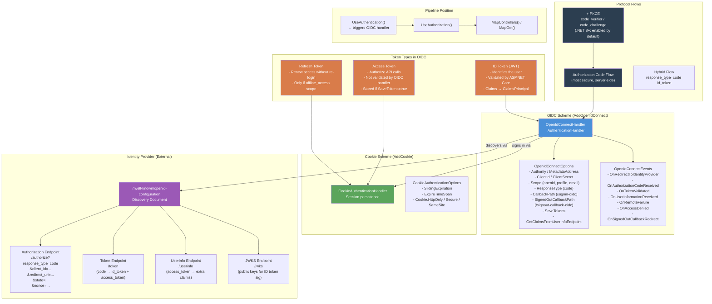
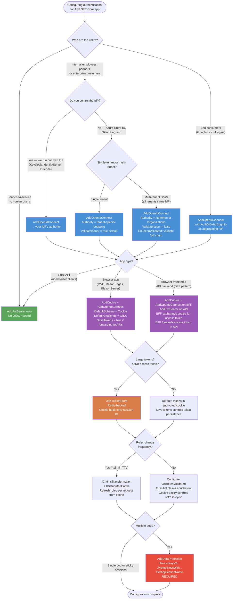

# 4.140 — OpenID Connect: AddOpenIdConnect and Identity Provider Integration

---

## PART 0 — Navigation & Context

### Where This Topic Lives in the ASP.NET Core Domain Hierarchy

```
ASP.NET Core Mastery
│
├── J. Authentication  (4.134–4.153)
│   │
│   ├── 4.134  Authentication Architecture: Schemes, Handlers, Middleware   ← foundation
│   ├── 4.135  Cookie Authentication: AddCookie, SignInAsync                ← OIDC uses cookie for the session
│   ├── 4.136  JWT Bearer Authentication: AddJwtBearer                      ← contrast: resource server vs identity layer
│   ├── 4.137  Generating JWT Access Tokens                                 ← access tokens issued by the IdP
│   ├── 4.138  Refresh Token Pattern                                        ← OIDC refresh flow uses this
│   ├── 4.139  OAuth 2.0: Authorization Code and PKCE Flow                  ← OIDC sits on top of OAuth 2.0
│   ├── ► 4.140  OpenID Connect: AddOpenIdConnect and IdP Integration        ← YOU ARE HERE
│   ├── 4.141  External Login Providers: Google, GitHub, Microsoft          ← concrete OIDC IdPs
│   ├── 4.142  ASP.NET Core Identity: UserManager, RoleManager              ← often combined with OIDC
│   ├── 4.147  Authentication Events: OnTokenValidated                      ← event hooks into OIDC flow
│   ├── 4.148  Multiple Authentication Schemes: JWT + Cookie                ← OIDC + JWT parallel
│   └── 4.149  Claims Transformation: IClaimsTransformation                 ← enriching the OIDC principal
│
└── K. Authorization  (4.154–4.166)
    └── 4.156  Policy-Based Authorization                                   ← consumes claims from OIDC principal
```

### What You Need Before This

- **[[4.134 — Authentication Architecture]]** — OIDC is one more scheme in the same scheme/handler/middleware model; that mental model must be solid first.
- **[[4.139 — OAuth 2.0: Authorization Code and PKCE Flow]]** — OIDC is OAuth 2.0 plus an identity layer. Understanding the authorization code flow is a hard prerequisite.
- **[[4.135 — Cookie Authentication]]** — OIDC in ASP.NET Core signs the user in with a cookie after receiving the ID token. Understanding `SignInAsync` and the cookie ticket is necessary.
- **[[4.052 — Middleware Ordering: The Canonical Order]]** — OIDC middleware participates in the standard `UseAuthentication` → `UseAuthorization` order.

### What This Unlocks After

- **[[4.141 — External Login Providers]]** — Google, GitHub, and Microsoft are OIDC/OAuth IdPs; this topic is the substrate.
- **[[4.142 — ASP.NET Core Identity]]** — Identity can use OIDC as an external login and provision local user accounts from the claims.
- **[[4.148 — Multiple Authentication Schemes]]** — OIDC for browser users running alongside JWT Bearer for API clients is the most common multi-scheme pattern.
- **[[4.149 — Claims Transformation]]** — After OIDC signs the user in, `IClaimsTransformation` enriches the principal with roles or tenant data from the application database.

### Why This Topic Matters at Production Scale

OpenID Connect is the dominant identity federation protocol in enterprise systems — every major cloud provider (Azure AD/Entra, AWS Cognito, Google Workspace, Okta, Auth0, Keycloak) exposes an OIDC endpoint. In an ASP.NET Core application, `AddOpenIdConnect` collapses the entire authorization code + token exchange + session establishment flow into a single middleware configuration, but the dozens of configurable options, the callback URL lifecycle, the token storage decisions, and the session cookie relationship are exactly where authentication vulnerabilities and session management bugs surface at scale.

---

## PART 1 — The Core Mental Model

### The Fundamental Rule

> **OpenID Connect in ASP.NET Core is an authentication scheme that executes the authorization code flow on the server: it redirects the browser to the Identity Provider, receives the authorization code on the callback URL, exchanges it for an ID token and access token, validates the ID token's signature and claims, builds a `ClaimsPrincipal` from the token claims, and then delegates session persistence to a paired Cookie authentication scheme — all before a single line of your application code runs.**

### The Plain-Language Analogy

Think of OIDC middleware as a hotel concierge who handles all guest identity checks on your behalf. When a guest (HTTP request) arrives without a key card (session cookie), the concierge doesn't verify their identity themselves — instead, they escort the guest to the passport control office (Identity Provider), wait while the guest proves who they are, receive an official certified document (ID token) from passport control, stamp it with your hotel's stamp (transform claims), give the guest a key card (issue a cookie), and only then let the guest into your hotel. On every subsequent visit the concierge just checks the key card — the passport office never sees the guest again.

The analogy holds for the hard cases: if the key card expires (`cookie.SlidingExpiration`), the concierge re-escorts the guest to passport control. If the passport office is down (IdP unavailable), the concierge cannot issue key cards — the whole check-in process fails with a 500. If the guest refuses to go to passport control (`[AllowAnonymous]`), the concierge stands aside. If two guests try to use the same key card slot simultaneously (`state` parameter mismatch), the concierge rejects the second one with a correlation failure.

### The Taxonomy Diagram



---

## PART 2 — Deep Mechanics

### 2.1 The Discovery Document: How OIDC Finds Its Endpoints

Every OIDC integration starts with discovery. When the ASP.NET Core application starts, `OpenIdConnectHandler` fetches the discovery document from the configured `Authority`:

```
// HTTP wire format (approximate) — startup time:
// GET https://login.example.com/.well-known/openid-configuration HTTP/1.1
// Host: login.example.com
//
// HTTP/1.1 200 OK
// Content-Type: application/json
//
// {
//   "issuer": "https://login.example.com",
//   "authorization_endpoint": "https://login.example.com/authorize",
//   "token_endpoint": "https://login.example.com/token",
//   "userinfo_endpoint": "https://login.example.com/userinfo",
//   "jwks_uri": "https://login.example.com/.well-known/jwks.json",
//   "response_types_supported": ["code", "token", "id_token", "code token", "code id_token"],
//   "scopes_supported": ["openid", "profile", "email", "offline_access"],
//   "id_token_signing_alg_values_supported": ["RS256"],
//   "claims_supported": ["sub", "iss", "email", "name", "roles"]
// }
```

**Pipeline position:**

```
Application startup (Build phase)
──► OpenIdConnectHandler ──► fetch /.well-known/openid-configuration ──► cache ConfigurationManager<OpenIdConnectConfiguration>
    (done once; refreshed automatically via ConfigurationManager's refresh interval)
```

**ASP.NET Core internally (approximate — `OpenIdConnectHandler.EnsureConfigurationAsync`):**

```csharp
// Internal source path: Microsoft.AspNetCore.Authentication.OpenIdConnect
// OpenIdConnectHandler.HandleChallengeAsync → EnsureConfigurationAsync
//
// Internally uses OpenIdConnectConfigurationRetriever via IConfigurationManager<OpenIdConnectConfiguration>
// The configuration manager caches the discovery document and refreshes it after
// Options.ConfigurationManager.AutomaticRefreshInterval (default: 12 hours)

var configuration = await Options.ConfigurationManager.GetConfigurationAsync(Context.RequestAborted);
// configuration.AuthorizationEndpoint, configuration.TokenEndpoint, etc.
```

**Runtime cost:** `~0 allocations per request` after startup (document cached); `~1 HTTP round-trip at startup`; JWK key set cached and refreshed automatically on signature validation failure.

**Edge case:** If the discovery document is unavailable at startup, the application starts but authentication fails at runtime. There is no fail-fast mechanism by default. Use `builder.Services.PostConfigure<OpenIdConnectOptions>` with a health check to detect this.

---

### 2.2 The Authorization Code Flow: The Full Request Journey

The complete OIDC round-trip for a new unauthenticated user hitting a protected endpoint:

```
Phase 1: Challenge (no cookie, hitting protected endpoint)
──► Kestrel receives: GET /orders HTTP/1.1 (no cookie)
──► UseAuthentication: CookieHandler.Authenticate → no ticket → returns NoResult
──► UseAuthorization: sees no authenticated user → calls ChallengeAsync
──► OpenIdConnectHandler.HandleChallengeAsync runs:
    ├── Generates state parameter (random, encrypted, stored in cookie)
    ├── Generates nonce (random, encrypted, stored in cookie or session)
    ├── (In .NET 8+ with UsePkce=true) Generates code_verifier, computes code_challenge
    └── Redirects browser to IdP authorization endpoint

// HTTP wire format — Phase 1 response:
// HTTP/1.1 302 Found
// Location: https://login.example.com/authorize
//         ?response_type=code
//         &client_id=my-app
//         &redirect_uri=https%3A%2F%2Fmyapp.com%2Fsignin-oidc
//         &scope=openid+profile+email
//         &state=CfDJ8...encrypted...
//         &nonce=CfDJ8...encrypted...
//         &code_challenge=E9Melhoa...
//         &code_challenge_method=S256
// Set-Cookie: .AspNetCore.Correlation.state=CfDJ8...; SameSite=None; Secure; HttpOnly
// Set-Cookie: .AspNetCore.OpenIdConnect.Nonce.nonce=CfDJ8...; SameSite=None; Secure; HttpOnly
```

```
Phase 2: Callback (user authenticated at IdP, redirected back with code)
──► Kestrel receives: GET /signin-oidc?code=abc123&state=CfDJ8... HTTP/1.1
──► UseAuthentication: OpenIdConnectHandler intercepts /signin-oidc (its CallbackPath)
──► OpenIdConnectHandler.HandleRemoteAuthenticateAsync:
    ├── Reads state cookie, validates state parameter (CSRF protection)
    ├── Reads nonce cookie, validates nonce (replay protection)
    ├── POSTs to token endpoint with code + code_verifier (PKCE)
    ├── Receives id_token + access_token (+ optionally refresh_token)
    ├── Validates id_token: signature (JWK), issuer, audience, expiry, nonce
    ├── Extracts claims from id_token → builds ClaimsPrincipal
    ├── (If GetClaimsFromUserInfoEndpoint=true) GETs /userinfo, merges claims
    ├── Raises OnTokenValidated event (custom logic here)
    └── Calls CookieHandler.SignInAsync(principal) → sets session cookie

// HTTP wire format — Phase 2 token endpoint (internal server-to-server call):
// POST https://login.example.com/token HTTP/1.1
// Content-Type: application/x-www-form-urlencoded
//
// grant_type=authorization_code
// &code=abc123
// &redirect_uri=https%3A%2F%2Fmyapp.com%2Fsignin-oidc
// &client_id=my-app
// &client_secret=my-secret
// &code_verifier=dBjftJeZ4CVP...  (PKCE)
//
// HTTP/1.1 200 OK
// {"id_token":"eyJ...","access_token":"eyJ...","token_type":"Bearer","expires_in":3600}

// HTTP wire format — Phase 2 response to browser:
// HTTP/1.1 302 Found
// Location: /orders  (the original URL, stored in state)
// Set-Cookie: .AspNetCore.Cookies=CfDJ8...; Path=/; HttpOnly; Secure; SameSite=Lax
// (state and nonce cookies are deleted)
```

```
Phase 3: Subsequent requests (cookie present)
──► Kestrel receives: GET /orders HTTP/1.1 Cookie: .AspNetCore.Cookies=CfDJ8...
──► UseAuthentication: CookieHandler.Authenticate → decrypts cookie → builds ClaimsPrincipal
──► OpenIdConnectHandler is NOT involved at all
──► UseAuthorization: sees authenticated ClaimsPrincipal → allows endpoint
    ~0 allocations from OIDC handler; all overhead is cookie decryption
```

**Runtime cost:** Phase 1: `~3 allocations + 1 async redirect`; Phase 2: `~2 HTTP round-trips (token endpoint + optional userinfo) + ~5 allocations`; Phase 3: `~2 allocations (cookie decryption via DataProtection)`.

**Edge case that bites teams:** `SameSite=None` must be set on the correlation and nonce cookies for the OIDC flow to work when the IdP is on a different domain and the browser sends a cross-site redirect. If your reverse proxy strips the `SameSite=None; Secure` attributes, the correlation cookie is never sent back, and every OIDC callback fails with "Correlation failed."

---

### 2.3 ID Token Validation: What ASP.NET Core Actually Checks

The ID token is a JWT. `OpenIdConnectHandler` delegates validation to `JwtSecurityTokenHandler` (or `JsonWebTokenHandler` in newer versions) with parameters sourced from the discovery document:

**ASP.NET Core internally (approximate — `OpenIdConnectHandler.ValidateTokenAsync`):**

```csharp
// Source path: OpenIdConnectHandler.cs → ValidateTokenAsync
// Uses TokenValidationParameters built from:
//   - Options.TokenValidationParameters (user-configured)
//   - configuration.IssuerSigningKeys (JWKs from IdP's jwks_uri)
//   - configuration.Issuer (from discovery document)

var validationParameters = Options.TokenValidationParameters.Clone();
validationParameters.IssuerSigningKeys = configuration.SigningKeys;
validationParameters.ValidIssuer = configuration.Issuer; // overrides any user config

// The handler validates:
// 1. Signature        — using JWK from IdP's jwks_uri (RS256 public key)
// 2. Issuer           — must match discovery document issuer
// 3. Audience         — must match ClientId (Options.ClientId)
// 4. Expiry (exp)     — with ClockSkew tolerance (default: 5 minutes)
// 5. Not Before (nbf) — token not valid yet
// 6. Nonce            — matches the nonce stored in the cookie (replay protection)
// 7. at_hash          — access token hash (if present in id_token)

// After validation:
// Options.TokenValidationParameters.NameClaimType = "name"   (not "sub" by default in OIDC)
// The principal's Name identity comes from the "name" claim
```

**Failure mode diagram:**

```
ID token validation failure paths:

Signature invalid (key rollover):
  Handler checks if kid (key ID) is known → if not, refreshes JWKS from jwks_uri → retries
  If still fails → RemoteFailure event → 500 or custom error page
  HTTP consequence: 302 → /error  (or RemoteFailure handler response)

Nonce mismatch (replay / cookie loss):
  "Nonce mismatch" exception raised
  HTTP consequence: RemoteFailure → 400 or redirect to error path
  Common cause: Load balancer without sticky sessions + nonce stored in session

Audience mismatch:
  Token issued for different ClientId
  HTTP consequence: RemoteFailure → 500
  Common cause: Wrong ClientId in AddOpenIdConnect options

Expired token:
  exp claim < now - ClockSkew
  HTTP consequence: RemoteFailure
  Less common because IdPs rarely issue already-expired tokens; more relevant for cached tokens
```

---

### 2.4 The State Parameter and Correlation: CSRF Prevention in the OIDC Flow

The `state` parameter is how ASP.NET Core prevents CSRF attacks during the OIDC callback. It is not just a round-trip value — it carries the original return URL and the correlation ID:

```
State lifecycle:
1. HandleChallengeAsync:
   ├── Generate random correlationId
   ├── Encrypt: state = DataProtector.Protect(correlationId + returnUrl + properties)
   ├── Store correlationId in cookie: .AspNetCore.Correlation.{scheme}.{correlationId}
   └── Send state in /authorize URL

2. HandleRemoteAuthenticateAsync (callback):
   ├── Decrypt state → extract correlationId
   ├── Look for .AspNetCore.Correlation.{scheme}.{correlationId} cookie
   ├── If cookie missing or value mismatch → "Correlation failed." exception
   │   HTTP consequence: 500 or RemoteFailure event
   └── Delete correlation cookie (one-time use)

// What "Correlation failed." means in production:
// - User navigated back in browser after completing login (state cookie deleted)
// - Distributed app without Data Protection key sharing → state encrypted by instance A,
//   callback hits instance B → decryption fails
// - Proxy stripping cookies on the callback redirect
// - User has cookies disabled
```

**Runtime cost of state generation:** `~1 DataProtection encryption call per challenge (~1 allocation + cryptographic operation)`.

**The critical production issue:** In a multi-instance deployment, every instance must share the same Data Protection key ring. If each pod has its own keys, the correlation cookie encrypted by pod A cannot be decrypted by pod B when the OIDC callback lands. Configure `builder.Services.AddDataProtection().PersistKeysToAzureBlobStorage(...)` or `.PersistKeysToStackExchangeRedis(...)`.

---

### 2.5 SaveTokens and Token Lifetime Management

```csharp
// When SaveTokens = true, the OIDC handler stores tokens in the authentication cookie:
// - id_token (as "id_token")
// - access_token (as "access_token")
// - refresh_token (as "refresh_token") — only if offline_access scope requested
// - expires_at (as "expires_at") — ISO 8601 string of access token expiry
//
// Retrieving tokens in controllers/middleware:
var accessToken = await HttpContext.GetTokenAsync("access_token");
var idToken     = await HttpContext.GetTokenAsync("id_token");
var expiresAt   = await HttpContext.GetTokenAsync("expires_at");
```

**The cookie bloat problem:**

```
Base64(id_token)     ≈ 1–3 KB
Base64(access_token) ≈ 1–3 KB
Base64(refresh_token) ≈ 0.5 KB
DataProtection overhead ≈ 0.5 KB
Total cookie size: 3–7 KB

Browser cookie limit: 4 KB per cookie
ASP.NET Core splits into chunks (.AspNetCore.Cookies.Chunks.{n}) automatically,
but each chunk is an HTTP header — adds latency to every request.

// Production recommendation for large token environments:
// Store tokens server-side (IDistributedCache, database) keyed by session ID.
// Store only the session ID in the cookie.
// Implement via ITicketStore (SessionStore option on CookieAuthenticationOptions).
```

---

### 2.6 Single Sign-Out: The Often-Forgotten Half

OIDC defines front-channel and back-channel logout. ASP.NET Core supports both:

```
Front-channel logout (RP-initiated):
1. App calls: await HttpContext.SignOutAsync("Cookies");
              await HttpContext.SignOutAsync("oidc");
   (Both schemes must be signed out — cookie first is the typical order)
2. OIDC handler redirects browser to:
   GET https://login.example.com/logout
       ?id_token_hint=eyJ...
       &post_logout_redirect_uri=https%3A%2F%2Fmyapp.com%2Fsignout-callback-oidc

3. IdP signs out, redirects browser back to /signout-callback-oidc
4. OIDC handler handles SignedOutCallbackPath, redirects to SignedOutRedirectUri

Back-channel logout (.NET 8+):
// IdP POSTs a logout token directly to the app (no browser involved)
// app.MapPost("/backchannel-logout", ...) — manual implementation required
// ASP.NET Core does not ship a built-in back-channel logout handler
```

**HTTP consequence of signing out only the cookie (the common mistake):**

```
// ⚠️ Wrong:
await HttpContext.SignOutAsync(CookieAuthenticationDefaults.AuthenticationScheme);
// Cookie deleted → user appears signed out from the app
// BUT: IdP session still active → next attempt to access protected resource
// → OIDC challenge → IdP sees active session → re-issues tokens silently
// → User is "signed out" but immediately signed back in

// ✅ Correct:
await HttpContext.SignOutAsync(CookieAuthenticationDefaults.AuthenticationScheme);
await HttpContext.SignOutAsync(OpenIdConnectDefaults.AuthenticationScheme);
// Second call redirects to IdP /end_session endpoint
```

---

## PART 3 — Production Code Patterns

### Pattern 1: The Enterprise IdP Integration — Azure Entra ID (Auth Code + PKCE)

The most common OIDC configuration in enterprise: Azure Entra ID as the IdP, ASP.NET Core web app as the relying party.

```csharp
// Program.cs — Payment Portal SPA Backend (serves as auth host for React frontend)

var builder = WebApplication.CreateBuilder(args);

// The authentication pipeline requires both Cookie and OIDC schemes.
// Cookie = session persistence (what the browser holds)
// OIDC   = the flow that establishes the session (one-time use per login)
builder.Services.AddAuthentication(options =>
{
    // Default scheme for all operations — the cookie handles day-to-day auth
    options.DefaultScheme = CookieAuthenticationDefaults.AuthenticationScheme;
    // Default challenge scheme — when unauthenticated, trigger OIDC flow
    options.DefaultChallengeScheme = OpenIdConnectDefaults.AuthenticationScheme;
})
.AddCookie(CookieAuthenticationDefaults.AuthenticationScheme, options =>
{
    options.Cookie.Name = ".PaymentPortal.Session";
    options.Cookie.HttpOnly = true;
    options.Cookie.Secure = true;
    options.Cookie.SameSite = SameSiteMode.Lax; // Lax works for same-site redirects
    options.SlidingExpiration = true;
    options.ExpireTimeSpan = TimeSpan.FromHours(8);

    // Redirect login to OIDC challenge rather than a local /Account/Login page
    options.Events.OnRedirectToLogin = context =>
    {
        // For API requests (Accept: application/json), return 401 instead of redirect
        if (context.Request.IsAjaxRequest() || context.Request.IsApiRequest())
        {
            context.Response.StatusCode = 401;
            return Task.CompletedTask;
        }
        context.Response.Redirect(context.RedirectUri);
        return Task.CompletedTask;
    };
})
.AddOpenIdConnect(OpenIdConnectDefaults.AuthenticationScheme, options =>
{
    // Authority = the IdP base URL. ASP.NET Core will fetch:
    //   {Authority}/.well-known/openid-configuration
    options.Authority = builder.Configuration["Oidc:Authority"];
    // e.g. "https://login.microsoftonline.com/{tenantId}/v2.0"

    options.ClientId = builder.Configuration["Oidc:ClientId"];
    options.ClientSecret = builder.Configuration["Oidc:ClientSecret"]; // not needed for PKCE-only

    // code = authorization code flow. Never use "token" or "id_token" here (implicit flow — deprecated)
    options.ResponseType = OpenIdConnectResponseType.Code;

    // PKCE is ON by default in .NET 8. For .NET 6/7, set explicitly:
    // options.UsePkce = true;

    // Scopes to request. "openid" is mandatory for OIDC.
    options.Scope.Clear();
    options.Scope.Add("openid");
    options.Scope.Add("profile");
    options.Scope.Add("email");
    options.Scope.Add("offline_access"); // request refresh_token

    // Save tokens in the cookie — needed if you forward access_token to downstream APIs.
    // WARNING: increases cookie size. Use ITicketStore for large token payloads.
    options.SaveTokens = true;

    // Fetch additional user claims from the /userinfo endpoint.
    // Set to true only if the ID token doesn't include all needed claims.
    // Each request hits the userinfo endpoint — adds ~50–200ms to login flow.
    options.GetClaimsFromUserInfoEndpoint = true;

    // Map the preferred_username claim to the Name identity
    options.TokenValidationParameters = new TokenValidationParameters
    {
        NameClaimType = "preferred_username",
        RoleClaimType = "roles" // Entra ID returns roles in this claim
    };

    // Callback path must match the Redirect URI registered in the IdP app registration
    options.CallbackPath = "/signin-oidc";          // default — keep it unless you need to change
    options.SignedOutCallbackPath = "/signout-callback-oidc"; // default

    options.Events = new OpenIdConnectEvents
    {
        // Called after ID token validated, before cookie is written.
        // Use this to add custom claims or perform local user provisioning.
        OnTokenValidated = async context =>
        {
            var userService = context.HttpContext.RequestServices
                .GetRequiredService<IPaymentPortalUserService>();

            var externalUserId = context.Principal!.FindFirstValue("sub")
                ?? throw new InvalidOperationException("sub claim missing from ID token");

            // Provision or update local user account from IdP claims
            var localUser = await userService.GetOrProvisionAsync(
                externalUserId,
                context.Principal.FindFirstValue("preferred_username"),
                context.Principal.FindFirstValue("email"));

            // Append local claims (tenant ID, payment permissions) to the principal
            var additionalClaims = new List<Claim>
            {
                new("tenant_id", localUser.TenantId.ToString()),
                new("payment_tier", localUser.PaymentTier)
            };

            var newIdentity = new ClaimsIdentity(additionalClaims);
            context.Principal!.AddIdentity(newIdentity);
        },

        // Handle IdP errors gracefully (user cancelled, account locked, etc.)
        OnRemoteFailure = context =>
        {
            var logger = context.HttpContext.RequestServices
                .GetRequiredService<ILogger<OpenIdConnectEvents>>();
            logger.LogWarning("OIDC remote failure: {Error}", context.Failure?.Message);

            // Redirect to a friendly error page rather than 500
            context.Response.Redirect("/auth/error?message=" +
                Uri.EscapeDataString(context.Failure?.Message ?? "Authentication failed"));
            context.HandleResponse();
            return Task.CompletedTask;
        }
    };
});

builder.Services.AddAuthorization();

var app = builder.Build();

// Pipeline position: must follow this exact order
app.UseRouting();
app.UseAuthentication(); // ← OIDC middleware registers /signin-oidc and /signout-callback-oidc here
app.UseAuthorization();
app.MapControllers();
app.MapRazorPages();

app.Run();
```

```
// HTTP wire format — successful login flow:
// Step 1: Browser → GET /payments (no cookie)
// Step 2: App → 302 → https://login.microsoftonline.com/{tenant}/oauth2/v2.0/authorize
//                       ?response_type=code&client_id=...&scope=openid+profile+email+offline_access
//                       &redirect_uri=https%3A%2F%2Fmyapp.com%2Fsignin-oidc
//                       &state=CfDJ8...&nonce=CfDJ8...&code_challenge=...&code_challenge_method=S256
// Step 3: User logs in at Microsoft
// Step 4: Microsoft → 302 → https://myapp.com/signin-oidc?code=abc123&state=CfDJ8...
// Step 5: App ↔ token endpoint: POST /token (server-side)
// Step 6: App → 302 → /payments (original URL)
//         Set-Cookie: .PaymentPortal.Session=CfDJ8...; HttpOnly; Secure; SameSite=Lax
```

---

### Pattern 2: The ITicketStore Pattern — Keeping the Cookie Small

For production systems where access tokens are large (Entra ID tokens with 50+ claims can reach 3–4 KB):

```csharp
// OrderManagementService — solving the "cookie too large" problem with Redis-backed sessions

// Session store implementation — stores the auth ticket server-side
public sealed class RedisTicketStore : ITicketStore
{
    private readonly IConnectionMultiplexer _redis;
    private readonly IDataProtector _protector;
    private const string KeyPrefix = "auth-ticket:";

    public RedisTicketStore(IConnectionMultiplexer redis, IDataProtectionProvider protection)
    {
        _redis = redis;
        // Use a purpose-specific protector so ticket data is isolated from other protected data
        _protector = protection.CreateProtector("OrderManagementService.AuthTickets");
    }

    public async Task<string> StoreAsync(AuthenticationTicket ticket)
    {
        var sessionId = Guid.NewGuid().ToString("N");
        await SetTicketAsync(sessionId, ticket);
        return sessionId; // This session ID goes in the cookie — small!
    }

    public async Task RenewAsync(string key, AuthenticationTicket ticket)
        => await SetTicketAsync(key, ticket);

    public async Task<AuthenticationTicket?> RetrieveAsync(string key)
    {
        var db = _redis.GetDatabase();
        var data = await db.StringGetAsync(KeyPrefix + key);
        if (data.IsNullOrEmpty) return null;

        var bytes = Convert.FromBase64String(data!);
        var unprotected = _protector.Unprotect(bytes);
        return TicketSerializer.Default.Deserialize(unprotected);
    }

    public async Task RemoveAsync(string key)
    {
        var db = _redis.GetDatabase();
        await db.KeyDeleteAsync(KeyPrefix + key);
    }

    private async Task SetTicketAsync(string key, AuthenticationTicket ticket)
    {
        var db = _redis.GetDatabase();
        var bytes = TicketSerializer.Default.Serialize(ticket);
        var protectedBytes = _protector.Protect(bytes);
        var expiry = ticket.Properties.ExpiresUtc?.Subtract(DateTimeOffset.UtcNow)
            ?? TimeSpan.FromHours(8);
        await db.StringSetAsync(KeyPrefix + key, Convert.ToBase64String(protectedBytes), expiry);
    }
}

// Registration:
builder.Services.AddSingleton<ITicketStore, RedisTicketStore>();

builder.Services.AddAuthentication(...)
.AddCookie(options =>
{
    // Wire up the Redis ticket store
    // Cookie will only contain the session ID (≈ 32 bytes) instead of the full ticket
    options.SessionStore = builder.Services.BuildServiceProvider()
        .GetRequiredService<ITicketStore>();
    // Alternatively: use PostConfigure to set SessionStore after DI is built
});
```

```
// HTTP consequence — before ITicketStore:
// Cookie: .AspNetCore.Cookies=CfDJ8[3-7KB base64 encrypted ticket]
//         Split into: .AspNetCore.Cookies.Chunks.1=...
//                     .AspNetCore.Cookies.Chunks.2=...  (multiple Set-Cookie headers)

// HTTP consequence — after ITicketStore:
// Cookie: .AspNetCore.Cookies=CfDJ8[32 bytes session ID]
//         Single Set-Cookie header, sub-100-byte cookie value
//         All per-request headers are smaller → measurable latency reduction at scale
```

---

### Pattern 3: The Keycloak Integration — Self-Hosted OIDC IdP

Same protocol, different IdP — demonstrates configuration portability and a common gotcha with claim name mapping:

```csharp
// ShipmentTrackingService — using Keycloak as IdP
// Keycloak uses non-standard claim names that differ from Entra ID

builder.Services.AddAuthentication(options =>
{
    options.DefaultScheme = CookieAuthenticationDefaults.AuthenticationScheme;
    options.DefaultChallengeScheme = "keycloak";
})
.AddCookie(options =>
{
    options.Cookie.Name = ".Shipment.Session";
    options.Cookie.HttpOnly = true;
    options.Cookie.Secure = true;
    options.ExpireTimeSpan = TimeSpan.FromHours(4);
})
.AddOpenIdConnect("keycloak", options =>
{
    // Keycloak realm URL is the authority
    options.Authority = "https://auth.internal.company.com/realms/shipment";

    options.ClientId = "shipment-tracking-app";
    options.ClientSecret = builder.Configuration["Keycloak:ClientSecret"];
    options.ResponseType = OpenIdConnectResponseType.Code;

    options.Scope.Clear();
    options.Scope.Add("openid");
    options.Scope.Add("profile");
    options.Scope.Add("email");
    options.Scope.Add("shipment_roles"); // Keycloak custom scope

    options.SaveTokens = true;

    // Keycloak uses different claim names than Microsoft
    // Without this mapping, User.Identity.Name and role checks will be null
    options.TokenValidationParameters = new TokenValidationParameters
    {
        // Keycloak puts username in "preferred_username", not "name"
        NameClaimType = "preferred_username",
        // Keycloak realm roles are in "realm_access.roles" (nested JSON)
        // Keycloak client roles are in "resource_access.{client_id}.roles"
        // We handle this in OnTokenValidated, not here
        RoleClaimType = ClaimTypes.Role
    };

    // Keycloak puts roles in a nested structure — flatten them into individual role claims
    options.Events = new OpenIdConnectEvents
    {
        OnTokenValidated = context =>
        {
            // Keycloak ID token example:
            // { "realm_access": { "roles": ["driver", "dispatcher"] },
            //   "resource_access": { "shipment-app": { "roles": ["admin"] } } }

            var principal = context.Principal!;
            var identity = (ClaimsIdentity)principal.Identity!;

            // Extract realm roles
            var realmAccessJson = principal.FindFirstValue("realm_access");
            if (realmAccessJson != null)
            {
                var realmAccess = JsonSerializer.Deserialize<KeycloakRealmAccess>(realmAccessJson);
                foreach (var role in realmAccess?.Roles ?? [])
                    identity.AddClaim(new Claim(ClaimTypes.Role, role));
            }

            // Extract client-specific roles
            var resourceAccessJson = principal.FindFirstValue("resource_access");
            if (resourceAccessJson != null)
            {
                var resourceAccess = JsonSerializer.Deserialize<Dictionary<string, KeycloakRealmAccess>>(
                    resourceAccessJson);
                var clientRoles = resourceAccess?.GetValueOrDefault("shipment-tracking-app");
                foreach (var role in clientRoles?.Roles ?? [])
                    identity.AddClaim(new Claim(ClaimTypes.Role, role));
            }

            return Task.CompletedTask;
        }
    };
});

// Supporting types
internal sealed record KeycloakRealmAccess(
    [property: JsonPropertyName("roles")] string[] Roles
);
```

---

### Pattern 4: The Multi-Tenant OIDC — Validating Tenant at the OIDC Boundary

In SaaS multi-tenant applications where all tenants use the same IdP (e.g., Azure Entra ID multi-tenant app):

```csharp
// InventoryManagementSaaS — multi-tenant OIDC with per-tenant validation

builder.Services.AddAuthentication(...)
.AddOpenIdConnect(options =>
{
    // For Azure multi-tenant: use /common/ endpoint (accepts all tenants)
    // or /organizations/ for work/school accounts only
    options.Authority = "https://login.microsoftonline.com/common/v2.0";

    options.ClientId = "my-inventory-saas-app";
    options.ClientSecret = builder.Configuration["Oidc:ClientSecret"];
    options.ResponseType = OpenIdConnectResponseType.Code;

    options.Scope.Clear();
    options.Scope.Add("openid");
    options.Scope.Add("profile");
    options.Scope.Add("email");

    // IMPORTANT: For multi-tenant apps, the issuer in the ID token will be
    // https://login.microsoftonline.com/{tenant_guid}/v2.0
    // NOT the common endpoint. Standard issuer validation would fail.
    // Disable automatic issuer validation and handle it manually:
    options.TokenValidationParameters = new TokenValidationParameters
    {
        ValidateIssuer = false, // We validate manually in OnTokenValidated
        NameClaimType = "preferred_username"
    };

    options.Events = new OpenIdConnectEvents
    {
        OnTokenValidated = async context =>
        {
            var tenantService = context.HttpContext.RequestServices
                .GetRequiredService<ITenantRegistrationService>();

            // The "tid" claim is the tenant ID in Azure Entra ID tokens
            var tenantId = context.Principal!.FindFirstValue("tid");
            if (tenantId == null)
            {
                // Reject: no tenant claim → personal Microsoft account or malformed token
                context.Fail("Multi-tenant SaaS requires an organizational account (tid claim).");
                return;
            }

            // Validate that this tenant is a registered customer
            var tenant = await tenantService.GetByExternalTenantIdAsync(tenantId);
            if (tenant == null)
            {
                // 403-style rejection at the OIDC boundary
                context.Fail($"Tenant {tenantId} is not registered with Inventory Management SaaS.");
                return;
            }

            if (!tenant.IsActive)
            {
                context.Fail($"Tenant {tenantId} has been suspended.");
                return;
            }

            // Inject the internal tenant context into the principal
            var identity = (ClaimsIdentity)context.Principal!.Identity!;
            identity.AddClaim(new Claim("internal_tenant_id", tenant.InternalId.ToString()));
            identity.AddClaim(new Claim("tenant_plan", tenant.SubscriptionPlan));
        },

        OnRemoteFailure = context =>
        {
            // context.Failure may contain the "Tenant not registered" message
            var message = context.Failure?.Message ?? "Authentication failed";
            context.Response.Redirect($"/auth/tenant-error?reason={Uri.EscapeDataString(message)}");
            context.HandleResponse();
            return Task.CompletedTask;
        }
    };
});
```

```
// HTTP consequence — unregistered tenant login attempt:
// 1. Browser redirected to /authorize with valid credentials
// 2. Microsoft issues valid ID token for tenant XYZ
// 3. OnTokenValidated: tenantService.GetByExternalTenantIdAsync("XYZ") → null
// 4. context.Fail("Tenant XYZ is not registered...")
// 5. OnRemoteFailure fires
// 6. Browser receives: 302 → /auth/tenant-error?reason=Tenant+XYZ+is+not+registered...
// No 500, no stack trace, no information leakage about the system
```

---

### Pattern 5: The Refresh Token Flow — Proactive Token Renewal Without Re-Login

```csharp
// PaymentGatewayApp — proactive access token refresh to call downstream payment APIs

// Middleware that runs on every authenticated request, refreshes token if close to expiry
public sealed class TokenRefreshMiddleware : IMiddleware
{
    private readonly IHttpClientFactory _httpClientFactory;

    public TokenRefreshMiddleware(IHttpClientFactory httpClientFactory)
        => _httpClientFactory = httpClientFactory;

    public async Task InvokeAsync(HttpContext context, RequestDelegate next)
    {
        if (context.User.Identity?.IsAuthenticated == true)
        {
            var expiresAtString = await context.GetTokenAsync("expires_at");
            if (expiresAtString != null
                && DateTimeOffset.TryParse(expiresAtString, out var expiresAt)
                && expiresAt < DateTimeOffset.UtcNow.AddMinutes(5)) // refresh 5 min before expiry
            {
                await RefreshAccessTokenAsync(context);
            }
        }

        await next(context);
    }

    private async Task RefreshAccessTokenAsync(HttpContext context)
    {
        var refreshToken = await context.GetTokenAsync("refresh_token");
        if (refreshToken == null) return; // no refresh token → can't refresh silently

        var client = _httpClientFactory.CreateClient("OidcTokenEndpoint");

        // POST to token endpoint with refresh_token grant
        var response = await client.PostAsync("/token", new FormUrlEncodedContent(
        [
            new("grant_type", "refresh_token"),
            new("refresh_token", refreshToken),
            new("client_id", "payment-gateway-app"),
            new("client_secret", "<from-config>")
        ]));

        if (!response.IsSuccessStatusCode)
        {
            // Refresh failed (revoked token, network error) → sign out and re-challenge
            await context.SignOutAsync(CookieAuthenticationDefaults.AuthenticationScheme);
            await context.SignOutAsync(OpenIdConnectDefaults.AuthenticationScheme);
            return;
        }

        var tokenResponse = await response.Content.ReadFromJsonAsync<TokenResponse>();

        // Update the tokens stored in the authentication cookie
        var authenticateResult = await context.AuthenticateAsync(
            CookieAuthenticationDefaults.AuthenticationScheme);

        if (authenticateResult.Succeeded)
        {
            var properties = authenticateResult.Properties!;
            properties.UpdateTokenValue("access_token", tokenResponse!.AccessToken);
            properties.UpdateTokenValue("refresh_token",
                tokenResponse.RefreshToken ?? refreshToken); // use new refresh token if rotated
            properties.UpdateTokenValue("expires_at",
                DateTimeOffset.UtcNow.AddSeconds(tokenResponse.ExpiresIn).ToString("o"));

            await context.SignInAsync(
                CookieAuthenticationDefaults.AuthenticationScheme,
                authenticateResult.Principal!,
                properties);
        }
    }

    private sealed record TokenResponse(
        [property: JsonPropertyName("access_token")] string AccessToken,
        [property: JsonPropertyName("refresh_token")] string? RefreshToken,
        [property: JsonPropertyName("expires_in")] int ExpiresIn
    );
}

// Registration:
builder.Services.AddScoped<TokenRefreshMiddleware>();
app.UseAuthentication();
app.UseMiddleware<TokenRefreshMiddleware>(); // after UseAuthentication, before UseAuthorization
app.UseAuthorization();
```

---

### Pattern 6: The Prompt Hint and ACR Values — Forcing Re-Authentication for Sensitive Operations

```csharp
// OrderManagementService — requiring step-up authentication for large refunds

[HttpPost("orders/{orderId}/refund")]
[Authorize]
public async Task<IActionResult> ProcessRefund(Guid orderId, [FromBody] RefundRequest request)
{
    if (request.Amount > 10_000m)
    {
        // For large refunds, require the user to have authenticated recently
        // (within the last 15 minutes) and using MFA
        var authTime = User.FindFirstValue("auth_time");
        var acrValues = User.FindFirstValue("acr");

        bool isRecentAuth = authTime != null
            && DateTimeOffset.FromUnixTimeSeconds(long.Parse(authTime))
                > DateTimeOffset.UtcNow.AddMinutes(-15);

        bool hasMfa = acrValues != null && acrValues.Contains("mfa");

        if (!isRecentAuth || !hasMfa)
        {
            // Challenge with specific parameters — force re-authentication with MFA
            var properties = new AuthenticationProperties
            {
                RedirectUri = Request.Path + Request.QueryString
            };

            // Set OIDC-specific challenge parameters via items
            properties.Items["prompt"] = "login";                   // force re-login
            properties.Items["acr_values"] = "urn:mfa";             // require MFA

            await HttpContext.ChallengeAsync(
                OpenIdConnectDefaults.AuthenticationScheme, properties);

            return new EmptyResult(); // response already started by ChallengeAsync
        }
    }

    // ... process refund
    return Ok();
}
```

```
// HTTP consequence — step-up challenge for large refund:
// POST /orders/{id}/refund with large amount
// → 302 → https://login.example.com/authorize
//           ?prompt=login
//           &acr_values=urn%3Amfa
//           &...rest of OIDC parameters...
// User must re-authenticate with MFA
// Redirected back to /orders/{id}/refund
// → refund processed

// This is the correct pattern for PSD2/SCA compliance in payment APIs
```

---

## PART 4 — Gotchas & Anti-Patterns

### Gotcha 1: Signing Out of Only One Scheme Causes Silent Re-Login

The most common OIDC bug — developers sign out of the cookie but forget the OIDC scheme, so the IdP session persists and the user is silently re-authenticated on the next navigation.

```csharp
// ⚠️ WRONG:
[HttpPost("logout")]
public async Task<IActionResult> Logout()
{
    await HttpContext.SignOutAsync(CookieAuthenticationDefaults.AuthenticationScheme);
    return Redirect("/");
}
// HTTP consequence (wrong path):
// POST /logout → cookie deleted → browser redirected to /
// User clicks "orders" → no cookie → OIDC challenge fires
// IdP sees active session for user → immediately issues new tokens without login prompt
// Set-Cookie: .AspNetCore.Cookies=new-ticket
// User is "logged back in" 2 seconds after logging out — silent auth bypass
```

```csharp
// ✅ CORRECT:
[HttpPost("logout")]
public async Task<IActionResult> Logout()
{
    // Cookie must be cleared first, then OIDC challenge redirects to IdP end_session
    await HttpContext.SignOutAsync(CookieAuthenticationDefaults.AuthenticationScheme);
    return SignOut(
        new AuthenticationProperties { RedirectUri = "/" },
        OpenIdConnectDefaults.AuthenticationScheme);
    // OR equivalently:
    // await HttpContext.SignOutAsync(OpenIdConnectDefaults.AuthenticationScheme, properties);
    // return new EmptyResult(); // OIDC sign-out already redirected the browser
}
// HTTP consequence (correct path):
// POST /logout
// → Delete cookie
// → 302 → https://login.example.com/end_session?id_token_hint=...&post_logout_redirect_uri=...
// → IdP clears its session → 302 → /signout-callback-oidc → 302 → /
// User is fully signed out — next OIDC challenge requires interactive login
```

**WHY:** `SignOutAsync(CookieScheme)` deletes the local session cookie. `SignOutAsync(OidcScheme)` calls `OpenIdConnectHandler.HandleSignOutAsync`, which builds the `end_session_endpoint` URL from the discovery document and redirects the browser there. Only the combination terminates both the local and federated sessions.

---

### Gotcha 2: "Correlation Failed." in Multi-Instance Deployments Without Key Ring Sharing

Senior engineers deploy the app to multiple pods and immediately see "Correlation failed." errors because Data Protection keys are not shared across instances.

```csharp
// ⚠️ WRONG (default in a multi-pod Kubernetes deployment):
builder.Services.AddAuthentication()
.AddOpenIdConnect(options =>
{
    options.Authority = "https://login.example.com";
    options.ClientId = "my-app";
    // No Data Protection key sharing configured
    // Each pod generates its own key ring at startup
});
// HTTP consequence (wrong path):
// Pod A handles /authorize redirect → encrypts state + nonce with Pod A's key
// Pod B handles /signin-oidc callback → tries to decrypt state with Pod B's key → FAILS
// HTTP/1.1 500 Internal Server Error (or OnRemoteFailure fires)
// Error: "Correlation failed. The response was not from the expected endpoint."
```

```csharp
// ✅ CORRECT (Kubernetes deployment with Azure Blob key ring):
builder.Services.AddDataProtection()
    .PersistKeysToAzureBlobStorage(
        new Uri(builder.Configuration["DataProtection:BlobUri"]!),
        new DefaultAzureCredential())
    .ProtectKeysWithAzureKeyVault(
        new Uri(builder.Configuration["DataProtection:KeyVaultKeyUri"]!),
        new DefaultAzureCredential())
    .SetApplicationName("inventory-service"); // same name across all instances

builder.Services.AddAuthentication()
.AddOpenIdConnect(options => { /* ... */ });
// HTTP consequence (correct path):
// Pod A encrypts state with shared key ring stored in Azure Blob
// Pod B decrypts state using the same key ring → correlation succeeds
```

**WHY:** The OIDC handler encrypts the `state` parameter and the `nonce` using ASP.NET Core's Data Protection API. In a multi-instance deployment, each instance gets its own ephemeral key ring unless explicitly shared. The shared key ring must be the same across all instances AND must be persistent across restarts.

---

### Gotcha 3: GetClaimsFromUserInfoEndpoint With Stale Claims After Roles Change

When `GetClaimsFromUserInfoEndpoint = true`, claims are fetched once at login and cached in the cookie. Role changes at the IdP are invisible until the cookie expires.

```csharp
// ⚠️ WRONG (for systems with frequently changing roles):
options.GetClaimsFromUserInfoEndpoint = true;
options.SaveTokens = true;
// Cookie expires in 8 hours. If the user's roles change in Entra ID,
// the cookie still carries the old roles for up to 8 hours.
// HTTP consequence:
// User demoted from "admin" to "user" at 10:00 AM
// User's cookie (with "admin" role) valid until 6:00 PM
// User can still access admin endpoints until 6:00 PM — authorization bypass window

// ✅ CORRECT — for sensitive role changes, set a shorter sliding window
// OR re-validate roles on each request via IClaimsTransformation from cache:
builder.Services.AddScoped<IClaimsTransformation, RoleCacheClaimsTransformer>();
// RoleCacheClaimsTransformer fetches from IDistributedCache (TTL: 5 min)
// and falls back to DB if cache miss
// HTTP consequence: role changes propagate within 5 minutes
```

**WHY:** `GetClaimsFromUserInfoEndpoint` makes a call to the IdP's `/userinfo` endpoint at login time and merges the returned claims into the ClaimsPrincipal. This principal is then serialized into the authentication cookie. The cookie is not re-fetched on subsequent requests — it is deserialized from the cookie. Any out-of-band role change at the IdP is invisible until the cookie ticket expires or the user re-logs in. `IClaimsTransformation` runs on every authenticated request and can re-hydrate roles from a short-TTL cache.

---

### Gotcha 4: Nonce Stored in Session Breaks in Cookie-Only Deployments

By default in recent ASP.NET Core versions, the nonce is stored in a cookie (`UseTokenLifetime = true` variant). Some engineers explicitly enable session storage, then break OIDC in environments where sessions are unavailable.

```csharp
// ⚠️ WRONG (mixing nonce storage with session):
builder.Services.AddSession(options =>
{
    options.Cookie.HttpOnly = true;
    options.IdleTimeout = TimeSpan.FromMinutes(30);
});

options.ProtocolValidator = new OpenIdConnectProtocolValidator
{
    RequireNonce = true
    // Some configurations accidentally route nonce through Session which
    // is not populated until AddSession middleware runs — if UseSession() is
    // placed after UseAuthentication(), nonce cannot be stored/retrieved:
};

app.UseAuthentication(); // ← OIDC fires here, needs session
app.UseSession();        // ← session not yet available — nonce storage fails
app.UseAuthorization();

// HTTP consequence (wrong path):
// /signin-oidc callback: nonce lookup in session → session not yet initialized
// → "Nonce validation failed" or null reference exception
// HTTP/1.1 500 Internal Server Error
```

```csharp
// ✅ CORRECT (cookie-based nonce, no dependency on session):
// Default behavior — nonce stored in cookie (HttpOnly, Secure, SameSite=None)
// No UseSession() needed for OIDC nonce
// Correct pipeline order:
app.UseRouting();
app.UseAuthentication(); // nonce cookie issued by OIDC, independent of session
app.UseAuthorization();
app.UseSession(); // if you need session, it comes after auth
// HTTP consequence (correct path): nonce stored in dedicated nonce cookie, no session dependency
```

**WHY:** ASP.NET Core's OIDC handler defaults to cookie-based nonce storage. The nonce cookie is named `.AspNetCore.OpenIdConnect.Nonce.{nonce}` and is set in Phase 1 (challenge) then deleted in Phase 2 (callback). It does not depend on `ISession`. Mixing session-based nonce storage with incorrect middleware ordering creates a race condition where the nonce cannot be stored or retrieved.

---

### Gotcha 5: The ResponseType Implicit Flow Still Compiling in Old Code

Teams upgrading from .NET 5 or legacy applications sometimes inherit `ResponseType = "id_token"` or `ResponseType = "token id_token"` — the implicit flow — which is deprecated in OAuth 2.1 and produces tokens in the browser's URL fragment, exposing them to JavaScript and browser history.

```csharp
// ⚠️ WRONG (implicit flow — deprecated, insecure):
options.ResponseType = OpenIdConnectResponseType.IdToken; // "id_token"
// or
options.ResponseType = "token id_token"; // access token + id token in fragment

// HTTP consequence (wrong path):
// Authorization response arrives via URL fragment (or POST in form_post mode):
// GET /signin-oidc#id_token=eyJ...&token_type=Bearer
// The ID token is in the browser URL — logged in server access logs, stored in browser history,
// visible to JavaScript on the page, accessible by XSS attacks.
// No PKCE, no code exchange, no server-to-server token fetch.
// Modern IdPs (Entra ID, Auth0, Okta) are DEPRECATING implicit flow responses.
// Some have already blocked it for new app registrations.

// ✅ CORRECT (authorization code flow + PKCE):
options.ResponseType = OpenIdConnectResponseType.Code; // "code"
// In .NET 8+, PKCE is enabled automatically (options.UsePkce defaults to true)
// HTTP consequence (correct path):
// Authorization response: GET /signin-oidc?code=abc123&state=...
// Code is short-lived (60 seconds), single-use, and useless without client_secret/verifier
// ID token never appears in the URL or browser history
```

**WHY:** The authorization code flow (`response_type=code`) keeps all tokens server-side. The browser only ever sees an opaque, short-lived authorization code. The OIDC handler exchanges the code for tokens in a server-to-server POST to the token endpoint. This is the only flow that should be used for server-rendered web applications in 2024+.

---

## PART 5 — Performance Implications

### Request Pipeline Characteristics Table

|Scenario|Pipeline Depth|Allocations Per Request|Approx Latency Impact|Recommendation|
|---|---|---|---|---|
|Authenticated request (cookie present)|Cookie handler only — OIDC not invoked|~2–4 (cookie decrypt + ClaimsPrincipal build)|~0.1–0.5ms|Baseline; acceptable for all scales|
|OIDC challenge redirect (no cookie)|Cookie handler + OIDC handler (challenge path)|~8–12 (state encrypt, correlation cookie, redirect)|~2–5ms|One-time per session; not in hot path|
|OIDC callback (code exchange)|OIDC handler handles /signin-oidc — 2 HTTP round-trips|~20–40 + 2 network round-trips|~100–800ms|Token endpoint + optional userinfo endpoint; outside critical path|
|GetClaimsFromUserInfoEndpoint=true|Extra HTTP call to /userinfo per login|~+5 allocations + 1 network call|+50–200ms (login only)|Disable if ID token already has needed claims|
|SaveTokens=true with large tokens|Cookie serialization + encryption of all tokens|~+5–10 (serialization overhead)|~+0.5–1ms per request (decrypt)|Use ITicketStore to keep cookie small|
|ITicketStore (Redis-backed session)|Cookie handler + Redis GET per request|~+2–3 (Redis call)|~+0.5–2ms (Redis RTT)|Preferred at scale; eliminates cookie bloat|
|Token refresh middleware (near expiry)|Middleware + 1 HTTP call to /token|~+10 + 1 network call|~+200–600ms (once per expiry cycle)|Stagger refresh 5 min before expiry; background refresh preferred|
|Claims transformation on every request|IClaimsTransformation + optional cache lookup|~+2–5 (cache hit) or ~+10 + DB call (miss)|~+0.1ms (cache hit) / ~5–20ms (DB miss)|Cache with 5-min TTL in IDistributedCache|
|Multi-tenant OIDC validation in event|Service resolution + DB lookup in OnTokenValidated|~+5 + DB call (login only)|~+10–50ms (login only)|One-time per session; use async with cancellation|
|Discovery document refresh|Background HTTP call to /.well-known/openid-configuration|0 per request (background)|Negligible|Auto-refreshed every 12h by default|

### BenchmarkDotNet Benchmark

```csharp
// OrderServiceAuthBenchmarks.cs
// Measures the authentication-layer overhead per request at different cookie scenarios

using BenchmarkDotNet.Attributes;
using BenchmarkDotNet.Running;
using Microsoft.AspNetCore.Authentication;
using Microsoft.AspNetCore.Authentication.Cookies;
using Microsoft.AspNetCore.DataProtection;
using Microsoft.AspNetCore.Http;

[MemoryDiagnoser]
[SimpleJob(launchCount: 1, warmupCount: 3, iterationCount: 10)]
public class OidcCookieAuthBenchmarks
{
    private readonly IDataProtector _protector;
    private readonly AuthenticationTicket _smallTicket;  // no tokens saved
    private readonly AuthenticationTicket _largeTicket;  // tokens saved (3KB)
    private byte[] _smallEncryptedTicket = [];
    private byte[] _largeEncryptedTicket = [];

    public OidcCookieAuthBenchmarks()
    {
        var provider = DataProtectionProvider.Create("Benchmark");
        _protector = provider.CreateProtector(
            "Microsoft.AspNetCore.Authentication.Cookies.CookieAuthenticationMiddleware",
            "Cookies",
            "v2");

        var smallIdentity = new ClaimsIdentity(
            new[] { new Claim(ClaimTypes.NameIdentifier, "user-123"),
                    new Claim("email", "user@example.com"),
                    new Claim(ClaimTypes.Role, "operator") },
            "Cookies");
        _smallTicket = new AuthenticationTicket(
            new ClaimsPrincipal(smallIdentity), "Cookies");

        // Simulate SaveTokens=true with realistic token sizes
        var largeProps = new AuthenticationProperties();
        largeProps.StoreTokens(new[]
        {
            new AuthenticationToken { Name = "id_token",     Value = new string('A', 1200) },
            new AuthenticationToken { Name = "access_token", Value = new string('B', 1800) },
            new AuthenticationToken { Name = "refresh_token",Value = new string('C', 500)  },
            new AuthenticationToken { Name = "expires_at",   Value = DateTimeOffset.UtcNow.AddHours(1).ToString("o") }
        });
        var largeIdentity = new ClaimsIdentity(smallIdentity.Claims, "Cookies");
        _largeTicket = new AuthenticationTicket(new ClaimsPrincipal(largeIdentity), largeProps, "Cookies");
    }

    [GlobalSetup]
    public void Setup()
    {
        var serializer = TicketSerializer.Default;
        _smallEncryptedTicket = _protector.Protect(serializer.Serialize(_smallTicket));
        _largeEncryptedTicket = _protector.Protect(serializer.Serialize(_largeTicket));
    }

    [Benchmark(Baseline = true, Description = "Deserialize small cookie (no tokens)")]
    public ClaimsPrincipal DeserializeSmallCookie()
    {
        var bytes = _protector.Unprotect(_smallEncryptedTicket);
        var ticket = TicketSerializer.Default.Deserialize(bytes)!;
        return ticket.Principal;
    }

    [Benchmark(Description = "Deserialize large cookie (tokens saved, 3.5KB)")]
    public ClaimsPrincipal DeserializeLargeCookie()
    {
        var bytes = _protector.Unprotect(_largeEncryptedTicket);
        var ticket = TicketSerializer.Default.Deserialize(bytes)!;
        return ticket.Principal;
    }

    [Benchmark(Description = "Cookie encrypt (challenge, small ticket)")]
    public byte[] EncryptSmallTicket()
    {
        var bytes = TicketSerializer.Default.Serialize(_smallTicket);
        return _protector.Protect(bytes);
    }

    [Benchmark(Description = "Cookie encrypt (challenge, large ticket + tokens)")]
    public byte[] EncryptLargeTicket()
    {
        var bytes = TicketSerializer.Default.Serialize(_largeTicket);
        return _protector.Protect(bytes);
    }
}

// Expected output (approximate, .NET 8, x64, no network):
// | Method                                        | Mean     | Allocated |
// |-----------------------------------------------|----------|-----------|
// | Deserialize small cookie (no tokens)          | 12.4 μs  | 4.2 KB    |
// | Deserialize large cookie (tokens saved, 3.5KB)| 38.7 μs  | 11.8 KB   |
// | Cookie encrypt (small ticket)                 | 9.8 μs   | 3.1 KB    |
// | Cookie encrypt (large ticket + tokens)        | 31.2 μs  | 9.6 KB    |
//
// Key insight: SaveTokens=true causes 3x more allocation and 3x more CPU
// per request for cookie deserialization. At 5,000 req/s this is ~60MB/s
// of extra allocation → GC pressure. Use ITicketStore at this scale.

// For real HTTP profiling alongside BenchmarkDotNet:
// dotnet-counters monitor --counters "System.Runtime,Microsoft.AspNetCore.Hosting"
// Look for: requests-per-second, gc-heap-size, working-set
// For detailed auth timing: app.Use(next => async ctx => {
//     using var activity = new System.Diagnostics.Activity("auth");
//     activity.Start(); await next(ctx); activity.Stop();
// });
// Or: MiniProfiler.For.AspNetCore() with .AddEntityFramework() shows auth timing in response
```

### When to Care / When to Ignore

**When this costs you:**

- High-throughput portals (>5k req/s): Cookie deserialization with `SaveTokens=true` adds ~30μs and ~10KB per request to GC pressure. Switch to `ITicketStore` at this scale.
- Multi-pod Kubernetes without shared Data Protection keys: 100% of OIDC logins fail with correlation errors. Fix before first production deployment.
- UserInfo endpoint enabled for every login: At 1,000 logins/minute, this is 1,000 extra HTTP calls to the IdP per minute — most IdPs rate-limit this and it adds 100–200ms to every login.
- Session cookie bloat with HTTP/1.1: Large cookies split across multiple `Cookie` headers. Nginx default `proxy_buffer_size` (4KB) truncates them → 502 Bad Gateway on OIDC callbacks.

**When this doesn't matter:**

- Internal employee-facing portals with <100 concurrent users and simple tokens — small cookie overhead is imperceptible.
- One-time login flows for infrequent admin tools — the 300ms OIDC round-trip at login is irrelevant when users log in once a day.
- Microservices that only accept JWT Bearer tokens and never use OIDC directly — the OIDC overhead lives in the identity frontend, not the API tier.

---

## PART 6 — Interview Arsenal

### A. The Question Bank

**Question 1:** "Can you walk me through what actually happens when a user hits a protected endpoint in an ASP.NET Core app configured with OpenID Connect and they don't have a session yet?"

**Average Answer:** The user gets redirected to the identity provider, logs in, and gets redirected back with a token that creates a session.

**Why That's Insufficient:** It treats the OIDC flow as a black box and doesn't mention the state/correlation mechanism, the code exchange, ID token validation, or the relationship between the OIDC scheme and the cookie scheme.

> **Great Answer:** When the request hits `UseAuthentication`, the Cookie handler tries to authenticate from the cookie but finds nothing. `UseAuthorization` then sees an unauthenticated principal and calls `ChallengeAsync`. Because the default challenge scheme is OIDC, `OpenIdConnectHandler.HandleChallengeAsync` runs. It generates an encrypted `state` parameter containing a correlation ID and the original URL, stores the correlation ID in a short-lived HttpOnly cookie, optionally generates a PKCE code verifier, and then 302-redirects the browser to the IdP's authorization endpoint. The user authenticates at the IdP, which redirects back to our app's `/signin-oidc` callback with an authorization code and the state parameter. Our handler intercepts that path, validates the state cookie to prevent CSRF, POSTs the code to the token endpoint in a server-to-server call, receives the ID token and access token, validates the ID token's signature using the IdP's JWK set, verifies the issuer, audience, expiry, and nonce, builds a ClaimsPrincipal from the claims, fires `OnTokenValidated` for any custom logic, and then calls `CookieHandler.SignInAsync` to persist the principal as a cookie. Subsequent requests skip the entire OIDC flow — the cookie handler decrypts the ticket and builds the principal directly.

---

**Question 2:** "What is the difference between an ID token and an access token in OIDC?"

**Average Answer:** The ID token tells you who the user is, and the access token lets you call APIs.

**Why That's Insufficient:** Doesn't explain the validation asymmetry — ASP.NET Core validates the ID token but not the access token — and doesn't address the storage implications.

> **Great Answer:** The ID token is the identity assertion — it's a JWT signed by the IdP, and ASP.NET Core's OIDC handler validates every aspect of it: signature via JWK, issuer, audience matching the ClientId, expiry, nonce. The claims in the ID token become the ClaimsPrincipal. The access token is an authorization credential for downstream APIs — the OIDC handler doesn't validate it at all. The client application should treat it as an opaque string and forward it in `Authorization: Bearer` headers to resource servers. In practice, the consequences of this split matter when the ID token and access token have different expiries. The ID token might be valid for 1 hour while the access token expires in 15 minutes. If I'm using `SaveTokens = true` and forwarding access tokens to my payment processing API, I need to actively check `expires_at` and refresh the access token with the refresh token before it expires — the OIDC handler won't do this for me. The ID token expiry controls the authentication cookie, while access token expiry controls what the downstream APIs will accept.

---

**Question 3:** "We're deploying to Kubernetes with three pods. OIDC logins work from some pods but fail with 'Correlation failed.' from others. What's wrong and how do you fix it?"

**Average Answer:** There might be a configuration issue with the redirect URI or the client secret.

**Why That's Insufficient:** Completely misses the Data Protection key sharing issue that is the definitive cause.

> **Great Answer:** This is a Data Protection key sharing problem. The OIDC handler encrypts the `state` parameter and the nonce using ASP.NET Core's Data Protection API — specifically using the application's key ring. Each pod generates its own ephemeral key ring at startup. When pod A handles the `/authorize` redirect, it encrypts the correlation state with pod A's key. When the IdP redirects back to `/signin-oidc`, the request might land on pod B, which cannot decrypt the state encrypted with pod A's key — hence "Correlation failed." The fix is to configure Data Protection with a shared, persistent key ring across all pods. In Kubernetes on Azure, I'd use `AddDataProtection().PersistKeysToAzureBlobStorage(...).ProtectKeysWithAzureKeyVault(...)` with Managed Identity. On AWS, I'd use Parameter Store or Secrets Manager. The critical thing is that `SetApplicationName` must be identical across all instances, and the key ring storage must be accessible from all pods.

---

### B. The Trick Questions

**Trick 1:** "If I configure `AddOpenIdConnect` without also calling `AddCookie`, what happens when a user successfully authenticates?"

**The trap:** Assuming the cookie is automatically created as part of OIDC.

**Correct answer:** The OIDC handler successfully validates the ID token and builds a ClaimsPrincipal. But when it calls `context.Properties.RedirectUri` and tries to sign in via `SignInAsync` using the `SignInScheme`, it will use the configured `SignInScheme` (which defaults to `Cookies`). If the Cookie scheme isn't registered, `SignInAsync` throws an `InvalidOperationException: No sign-in authentication handler is registered for the scheme 'Cookies'`. The HTTP consequence is a 500 error on the `/signin-oidc` callback. The OIDC handler depends on a paired sign-in scheme — by default Cookie — to persist the session.

---

**Trick 2:** "A user complains they keep getting redirected to the IdP even though they just logged in 5 minutes ago. What are the top 3 causes?"

**The trap:** Assuming the issue is with the OIDC configuration.

**Correct answer:** The three most common causes are: (1) Cookie `SameSite=Strict` combined with the IdP being on a different domain — the browser doesn't send the session cookie on the OIDC callback redirect because it's a cross-site request, so the cookie is never stored; (2) `Cookie.Secure = true` with the app running over HTTP (e.g., behind a terminating proxy that strips HTTPS) — the browser discards Secure cookies over HTTP; (3) The reverse proxy is running on a different domain and the `CookiePath` doesn't match the application root. All three result in the cookie being issued but immediately rejected or not sent, causing the app to think the user has no session.

---

**Trick 3:** "Can I use `[Authorize(AuthenticationSchemes = "oidc")]` on an action to force OIDC re-authentication?"

**The trap:** Assuming specifying the OIDC scheme as the authenticate scheme works like the cookie scheme.

**Correct answer:** Not the way you might expect. Specifying `AuthenticationSchemes = "oidc"` on `[Authorize]` means the authorization middleware will call `AuthenticateAsync("oidc")` instead of the default scheme. `OpenIdConnectHandler.AuthenticateAsync` doesn't maintain session state — it only reads the OIDC-related cookies (nonce, correlation) which don't exist on a normal authenticated request. It will return `NoResult` or `AuthenticationResult.Fail`. The authorization middleware will then call `ForbidAsync` or `ChallengeAsync` for the OIDC scheme. If you want to force re-authentication, you should use `ChallengeAsync` with `prompt=login` in the properties, or clear the session cookie and let the default challenge mechanism handle it. The correct schema for "require MFA for this endpoint" is `await HttpContext.ChallengeAsync(OidcScheme, new AuthenticationProperties { Items = { ["acr_values"] = "mfa" } })`.

---

**Trick 4:** "Does `GetClaimsFromUserInfoEndpoint = true` affect every request or just login?"

**The trap:** Engineers who work with JWT Bearer assume the claims are re-fetched on every request.

**Correct answer:** Only at login time — once per OIDC authentication flow. The UserInfo endpoint is called during the `/signin-oidc` callback, the returned claims are merged into the ClaimsPrincipal, and that principal is serialized into the authentication cookie. On every subsequent request, the claims are deserialized from the cookie — the UserInfo endpoint is never called again. This means role changes at the IdP are invisible until the cookie expires or the user re-logs in. For systems where roles change frequently, use `IClaimsTransformation` with a short-TTL distributed cache to re-hydrate fresh claims on every request.

---

### C. Red Flags to Avoid

1. **"I just configure AddOpenIdConnect and it handles everything."** Never say this — the interviewer hears "I don't know about the cookie scheme dependency, key ring sharing, or the callback lifecycle." OIDC in ASP.NET Core is a two-scheme system.
    
2. **"Tokens are stored in cookies."** Imprecise and gets you marked down. The authentication ticket (containing the ClaimsPrincipal and optionally the tokens) is encrypted and stored in the cookie. The distinction matters because `ITicketStore` separates the ticket storage from the cookie.
    
3. **"I use implicit flow because it's simpler."** The implicit flow (`response_type=id_token` or `response_type=token id_token`) is deprecated in OAuth 2.1 and actively being blocked by major IdPs. Saying this in an interview in 2025 signals you haven't kept up with the security landscape.
    
4. **"OIDC is basically the same as JWT Bearer."** They solve different problems. OIDC is a full authentication flow — it establishes identity via an IdP interaction. JWT Bearer is a stateless verification mechanism — it validates a credential already in the request. OIDC produces a principal via redirect flows; JWT Bearer validates a token on every request. Conflating them is a fundamental misunderstanding.
    
5. **"I set ValidateIssuer=false to make it work."** Disabling issuer validation is a serious security vulnerability — it allows tokens from any OIDC provider to be accepted. The correct fix for multi-tenant apps is custom issuer validation in `OnTokenValidated`. Saying you disabled it without explaining why signals security unawareness.
    
6. **"The refresh token is handled automatically."** It is not. ASP.NET Core's OIDC handler does not automatically refresh expired access tokens. You must implement refresh logic — either via middleware that checks `expires_at` or by using `IOptionsMonitor` to configure `OnAccessTokenExpired` events (not built-in). Claiming it's automatic is wrong.
    
7. **"I sign out with SignOutAsync(CookieScheme) and I'm done."** If you don't sign out of the OIDC scheme, the IdP session remains active. Next navigation triggers a silent re-authentication. This is the most common OIDC logout bug.
    
8. **"My app works fine without shared Data Protection keys."** Only works when running a single instance. The moment you scale to two pods without shared keys, all OIDC logins from cross-pod callbacks fail. Not knowing this is a production reliability gap.
    

---

## PART 7 — Decision Framework



---

## PART 8 — Self-Check

### A. Conceptual Questions

1. What is the difference between `AddOpenIdConnect` and `AddJwtBearer`, and why might you need both in the same application?
2. Why does `AddOpenIdConnect` require a paired cookie scheme? What happens to the ClaimsPrincipal without it?
3. What HTTP request does ASP.NET Core make on application startup when OIDC is configured, and what would happen if the IdP was unreachable at that point?
4. What happens to the HTTP request when a user hits a `[Authorize]` endpoint with no session cookie and the pipeline has `UseAuthentication` before `UseAuthorization`? Trace every middleware call.
5. What is the purpose of the `state` parameter in the OIDC authorization code flow, and how does ASP.NET Core use it for CSRF protection?
6. A user changes their role in Azure Entra ID. When does the ASP.NET Core application reflect this change, and what would you do to reduce the delay?
7. What is the `nonce` parameter used for in OIDC, and what attack does it prevent?
8. If `SaveTokens = true` and a user's access token expires, what does ASP.NET Core do automatically? What do you have to implement yourself?
9. In a multi-tenant OIDC configuration where `ValidateIssuer = false`, what specific validation must you perform in `OnTokenValidated` to prevent a tenant from authenticating against another tenant's account?
10. What middleware ordering violation causes CORS preflight requests to fail when OIDC is configured, and what specific HTTP consequence does the browser see?

### B. Code Puzzles

**Puzzle 1:** What is wrong with this code and what HTTP response does a user see when they try to log out?

```csharp
[HttpPost("logout")]
[ValidateAntiForgeryToken]
public async Task<IActionResult> Logout()
{
    await HttpContext.SignOutAsync(CookieAuthenticationDefaults.AuthenticationScheme);
    return Redirect("/home");
}
```

<details> <summary>Answer</summary>

**Bug:** Only the Cookie authentication scheme is signed out. The OIDC scheme is not. `SignOutAsync(OidcScheme)` must also be called to terminate the Identity Provider session.

**HTTP response (wrong path):**

```
POST /logout
→ HTTP/1.1 302 Found
  Location: /home
  Set-Cookie: .AspNetCore.Cookies=; expires=Thu, 01 Jan 1970 00:00:00 GMT (cookie deleted)
```

The local session cookie is deleted. But the IdP session is still alive. When the user navigates to `/home` and then clicks any protected link, the OIDC challenge fires, the IdP sees an active session for the user, and silently re-issues tokens. The user is logged back in within 2–3 seconds without any login prompt — effectively a silent authentication bypass.

**HTTP response (correct path):**

```csharp
await HttpContext.SignOutAsync(CookieAuthenticationDefaults.AuthenticationScheme);
return SignOut(
    new AuthenticationProperties { RedirectUri = "/home" },
    OpenIdConnectDefaults.AuthenticationScheme);
```

```
POST /logout
→ HTTP/1.1 302 Found
  Location: https://login.example.com/end_session?id_token_hint=eyJ...&post_logout_redirect_uri=...
  Set-Cookie: .AspNetCore.Cookies=; expires=... (deleted)
```

IdP clears its session → redirects to `/signout-callback-oidc` → app redirects to `/home`. Full logout.

</details>

---

**Puzzle 2:** This app is deployed to 4 Kubernetes pods. What happens when 100% of OIDC logins fail with "Correlation failed." in production, even though they work in development?

```csharp
// Program.cs (Kubernetes deployment, 4 replicas)
builder.Services.AddDataProtection();
// ... No PersistKeys or SetApplicationName configured

builder.Services.AddAuthentication(opts =>
{
    opts.DefaultScheme = CookieAuthenticationDefaults.AuthenticationScheme;
    opts.DefaultChallengeScheme = OpenIdConnectDefaults.AuthenticationScheme;
})
.AddCookie()
.AddOpenIdConnect(opts =>
{
    opts.Authority = "https://login.example.com";
    opts.ClientId = "my-app";
    opts.ResponseType = OpenIdConnectResponseType.Code;
});
```

<details> <summary>Answer</summary>

**Root cause:** `AddDataProtection()` without `PersistKeysTo*` generates a per-instance, in-memory key ring. Each of the 4 pods has its own unique key ring.

**Flow of the failure:**

1. Browser hits pod A → `HandleChallengeAsync` runs → generates correlation cookie encrypted with **pod A's key** → 302 to IdP.
2. User authenticates at IdP → IdP redirects to `/signin-oidc?code=...&state=...` → load balancer routes callback to **pod B**.
3. Pod B tries to decrypt the `state` parameter (which was encrypted with pod A's key) → decryption fails → **"Correlation failed."** exception.

**Works in development:** Single pod, keys are consistent within the single running process. Cross-pod decryption never occurs.

**Fix:**

```csharp
builder.Services.AddDataProtection()
    .PersistKeysToStackExchangeRedis(
        builder.Services.BuildServiceProvider()
            .GetRequiredService<IConnectionMultiplexer>(),
        "DataProtection-Keys")
    .SetApplicationName("my-app"); // MUST be identical on all pods
```

**HTTP consequence (unfixed):** All pods: `HTTP/1.1 500 Internal Server Error` or `OnRemoteFailure` redirect to error page.

**HTTP consequence (fixed):** All pods share the same key ring. Pod B successfully decrypts pod A's state → login succeeds.

</details>

---

**Puzzle 3:** What does the HTTP response look like when `OnTokenValidated` calls `context.Fail("Tenant not registered.")`?

```csharp
options.Events = new OpenIdConnectEvents
{
    OnTokenValidated = async context =>
    {
        var tenantId = context.Principal!.FindFirstValue("tid");
        var tenant = await tenantService.GetByExternalIdAsync(tenantId);
        if (tenant == null)
            context.Fail("Tenant not registered.");
    }
    // No OnRemoteFailure handler configured
};
```

<details> <summary>Answer</summary>

**What happens:** `context.Fail()` sets the `Result` on the remote authenticate result to a failure. The OIDC handler propagates this to `HandleRemoteAuthenticateAsync`, which calls the registered `RemoteFailure` event. Since no `OnRemoteFailure` handler is configured, the default behavior runs.

**HTTP consequence:**

```
GET /signin-oidc?code=abc123&state=...
→ HTTP/1.1 500 Internal Server Error
   (or 302 to /authentication/login-failed if RemoteAuthenticationOptions.ErrorUri is set)
```

Without a custom `OnRemoteFailure` handler, the failure surfaces as an unhandled exception in the OIDC callback path, which the exception handling middleware catches and returns as a 500.

**Better production behavior:**

```csharp
OnRemoteFailure = context =>
{
    var message = context.Failure?.Message ?? "Authentication failed";
    context.Response.Redirect($"/auth/error?reason={Uri.EscapeDataString(message)}");
    context.HandleResponse(); // prevents the default exception propagation
    return Task.CompletedTask;
}
```

HTTP consequence with handler:

```
→ HTTP/1.1 302 Found
  Location: /auth/error?reason=Tenant+not+registered.
```

Graceful error with no stack trace exposed to the user.

</details>

---

**Puzzle 4:** What is the HTTP status code returned to the browser when this action is hit by an authenticated user who does NOT have the "admin" role?

```csharp
// Startup configuration:
// options.DefaultScheme = CookieAuthenticationDefaults.AuthenticationScheme;
// options.DefaultChallengeScheme = OpenIdConnectDefaults.AuthenticationScheme;
// options.DefaultForbidScheme = CookieAuthenticationDefaults.AuthenticationScheme;

[HttpGet("admin/orders")]
[Authorize(Roles = "admin")]
public IActionResult AdminOrders() => Ok("admin data");
```

<details> <summary>Answer</summary>

**What happens:**

1. User is authenticated (cookie present → valid ClaimsPrincipal), but `User.IsInRole("admin")` is false.
2. `UseAuthorization` evaluates the `[Authorize(Roles = "admin")]` policy.
3. Policy fails (user doesn't have the role) → `IAuthorizationMiddlewareResultHandler` calls `ForbidAsync`.
4. `ForbidAsync` uses `DefaultForbidScheme` which is `CookieAuthenticationDefaults.AuthenticationScheme`.
5. `CookieAuthenticationHandler.HandleForbidAsync` runs.

**HTTP consequence:**

```
HTTP/1.1 302 Found
Location: /Account/AccessDenied?ReturnUrl=%2Fadmin%2Forders
```

The Cookie handler's default `AccessDeniedPath` is `/Account/AccessDenied`. It redirects the browser — not 403.

**If this is an API (not a browser app):** The `OnForbidden` event should check if the request is an API request and return 403:

```csharp
options.Events.OnRedirectToAccessDenied = context =>
{
    if (context.Request.IsApiRequest())
    {
        context.Response.StatusCode = 403;
        return Task.CompletedTask;
    }
    context.Response.Redirect(context.RedirectUri);
    return Task.CompletedTask;
};
```

**Key insight:** Cookie authentication's Forbid is a redirect, not a 403. JWT Bearer's Forbid is a 403 with `WWW-Authenticate` header. The scheme determines the HTTP response shape for authorization failures.

</details>

---

**Puzzle 5 (The Common Misunderstanding Puzzle):** Two engineers debate whether OIDC or Cookie is the "real" authentication scheme. One says "OIDC is the auth scheme — remove Cookie and it'll be cleaner." What breaks if `AddCookie` is removed?

```csharp
// ⚠️ WRONG — one engineer's proposed simplification:
builder.Services.AddAuthentication(options =>
{
    options.DefaultScheme = OpenIdConnectDefaults.AuthenticationScheme;
    options.DefaultChallengeScheme = OpenIdConnectDefaults.AuthenticationScheme;
})
.AddOpenIdConnect(options => { /* ... */ });
// No .AddCookie() call
```

<details> <summary>Answer</summary>

**What breaks immediately:** The OIDC handler, after successfully validating the ID token, calls `context.HttpContext.SignInAsync(options.SignInScheme, principal, properties)`. `options.SignInScheme` defaults to `CookieAuthenticationDefaults.AuthenticationScheme`. With no Cookie scheme registered, this throws:

```
InvalidOperationException: No sign-in authentication handler is registered for the scheme 'Cookies'.
Make sure your authentication handler supports the sign-in operation.
```

**HTTP consequence:**

```
GET /signin-oidc?code=abc123&state=...
→ HTTP/1.1 500 Internal Server Error
```

**Why it happens:** OIDC is a remote authentication scheme — its `CanSignIn` property returns `false`. It can verify an identity (via the IdP interaction) but cannot persist it. Persisting the established identity is the Cookie scheme's job. OIDC delegates to `SignInScheme` (Cookie) to issue the session. The two schemes are architecturally co-dependent: OIDC authenticates once, Cookie persists the result for subsequent requests. Removing Cookie breaks all OIDC logins.

**The correct mental model:** OIDC = identity establishment (one-time per login). Cookie = session management (every subsequent request). Both are required for browser-facing OIDC apps.

</details>

---

## PART 9 — Connections & Resources

### A. Related Topics Table

|Topic|Why It Connects|
|---|---|
|[[4.134 — Authentication Architecture: Schemes, Handlers, and the Middleware]]|OIDC is one scheme in the multi-scheme architecture; `DefaultScheme`, `DefaultChallengeScheme`, and `SignInScheme` are the architectural concepts that make OIDC + Cookie co-operation possible|
|[[4.139 — OAuth 2.0 in ASP.NET Core: Authorization Code and PKCE Flow]]|OIDC is OAuth 2.0 plus an identity layer (`openid` scope + ID token); the authorization code + PKCE flow is the underlying mechanism that `AddOpenIdConnect` executes|
|[[4.135 — Cookie Authentication: AddCookie, SignInAsync, and ClaimsPrincipal]]|OIDC delegates session persistence to the Cookie scheme via `SignInScheme`; `AddCookie` is not optional for browser-facing OIDC apps|
|[[4.136 — JWT Bearer Authentication: AddJwtBearer and Token Validation Pipeline]]|OIDC produces ID tokens (validated by the OIDC handler) and access tokens (validated by `AddJwtBearer` at the resource server); the two schemes serve different layers of the same request|
|[[4.148 — Multiple Authentication Schemes: Parallel JWT + Cookie Selection]]|OIDC + Cookie for browser users running alongside JWT Bearer for API clients is the BFF pattern; this topic explains the scheme selection mechanics|
|[[4.149 — Claims Transformation: IClaimsTransformation for Principal Enrichment]]|`IClaimsTransformation` runs after OIDC builds the principal and is the correct place to add application-specific claims (tenant ID, permissions) that weren't in the ID token|
|[[4.147 — Authentication Events: OnTokenValidated and OnAuthenticationFailed]]|`OpenIdConnectEvents` has 10+ event hooks; `OnTokenValidated` is the most important for enriching claims and rejecting logins; `OnRemoteFailure` is critical for graceful error handling|
|[[4.141 — External Login Providers: Google, GitHub, Microsoft via OAuth]]|Google, GitHub, Microsoft, and other providers are concrete OIDC/OAuth IdPs; `AddGoogle` and `AddMicrosoftAccount` are thin wrappers around `AddOpenIdConnect`|
|[[4.211 — Data Protection API: IDataProtector, Purpose Strings, and Payloads]]|OIDC state and nonce cookies are encrypted via Data Protection; in multi-pod deployments, shared Data Protection key rings are a hard requirement for OIDC to function|
|[[4.142 — ASP.NET Core Identity: UserManager, RoleManager, IdentityDbContext]]|Identity is commonly combined with OIDC: OIDC authenticates, Identity manages the local user account database and roles; `OnTokenValidated` provisions or updates the local user|
|[[4.138 — Refresh Token Pattern: Rotation, Secure Storage, and Revocation]]|OIDC can return refresh tokens (with `offline_access` scope); access token refresh is not automatic in ASP.NET Core and requires manual implementation in middleware or event handlers|
|[[4.052 — Middleware Ordering: The Canonical Order and Why It Matters]]|`UseAuthentication` must precede `UseAuthorization`; CORS (`UseCors`) must precede `UseAuthentication` or IdP preflight OPTIONS requests receive 401; ordering errors are a common OIDC configuration bug|
|[[2.14 — Async/Await Internals]]|The OIDC flow is a chain of async event handlers and HTTP calls; understanding ValueTask, ConfigureAwait, and cancellation is required for writing correct `OnTokenValidated` event handlers|

### B. Books

|Book|Chapters|Why These Chapters|
|---|---|---|
|**Pro ASP.NET Core Identity** — Andrew Lock|Ch. 12: OpenID Connect Integration; Ch. 13: External Authentication Providers; Ch. 14: Multi-Scheme Authentication|The only book-length treatment of ASP.NET Core OIDC at the production depth needed for senior roles; covers the exact topics in this note|
|**ASP.NET Core Security** — Christian Wenz|Ch. 7: OAuth 2.0 and OpenID Connect; Ch. 8: Tokens in Practice|Strong on the protocol-to-code mapping; explains ID token validation steps that the ASP.NET Core handler performs|
|**Identity and Data Security for Web Development** — Jonathan LeBlanc & Tim Messerschmidt|Ch. 5: OpenID Connect; Ch. 6: Federation and Single Sign-On|Strong conceptual foundation for the protocol; helps build the mental model before diving into ASP.NET Core specifics|
|**Designing APIs with Swagger and OpenAPI** — Joshua S. Ponelat & Lukas Rosenstock|Ch. 9: Security Schemes|Useful context for how OIDC appears in OpenAPI documentation and the security scheme `openIdConnect` type in API specs|

### C. Essential Articles & Docs

- **Microsoft Docs — Overview of ASP.NET Core authentication:** https://docs.microsoft.com/en-us/aspnet/core/security/authentication/
- **Microsoft Docs — Use OpenID Connect with ASP.NET Core:** https://docs.microsoft.com/en-us/aspnet/core/security/authentication/configure-oidc-web-authentication
- **Microsoft Docs — Data Protection in ASP.NET Core (key sharing):** https://docs.microsoft.com/en-us/aspnet/core/security/data-protection/
- **Andrew Lock — "How to use multiple Authentication schemes in ASP.NET Core":** https://andrewlock.net/a-closer-look-at-how-scheme-selection-works-in-aspnet-core-authentication/
- **Andrew Lock — "OAuth2 and OpenID Connect flows explained":** https://andrewlock.net/exploring-the-eventsource-for-aspnetcore/
- **RFC 8414 — OAuth 2.0 Authorization Server Metadata (discovery):** https://tools.ietf.org/html/rfc8414
- **OpenID Connect Core 1.0 Specification — Token Validation:** https://openid.net/specs/openid-connect-core-1_0.html#TokenValidation

### D. Template Meta-Note

> [!NOTE] **What each part of this note is for:**
> 
> - **Part 0 — Navigation:** Where this topic sits in the ASP.NET Core domain; what to read before and after; why it matters at scale.
> - **Part 1 — Core Mental Model:** One sentence that pins the topic; a physical analogy that survives edge cases; a complete taxonomy Mermaid diagram.
> - **Part 2 — Deep Mechanics:** What the framework actually does — discovery, the full OIDC round-trip HTTP trace, ID token validation internals, state/correlation, token storage, sign-out. Every block has a pipeline position diagram and runtime cost label.
> - **Part 3 — Production Code Patterns:** 6 annotated, domain-realistic patterns (Azure Entra, ITicketStore, Keycloak, multi-tenant, token refresh, step-up auth) with HTTP wire effects.
> - **Part 4 — Gotchas:** 5 production bugs with wrong→right→why format: partial sign-out, multi-pod key ring, stale claims, nonce/session ordering, implicit flow legacy code.
> - **Part 5 — Performance:** Pipeline cost table (10 rows), BenchmarkDotNet comparing cookie sizes, when to care (>5k req/s, multi-pod) vs when to ignore (low-traffic portals).
> - **Part 6 — Interview Arsenal:** 3 deep Q&A pairs with average/great answers, 4 trick questions, 8 red flags — all grounded in HTTP consequences and pipeline behavior.
> - **Part 7 — Decision Framework:** Mermaid flowchart from user type → IdP type → single vs multi-tenant → app type → token size → role volatility → multi-pod key sharing.
> - **Part 8 — Self-Check:** 10 conceptual questions + 5 code puzzles (including the common misunderstanding: removing AddCookie from an OIDC setup) with collapsed answers.
> - **Part 9 — Connections:** 13 wiki-linked related topics with specific pipeline relationship explanations; 4 books with chapter-level precision; 7 essential docs/articles.