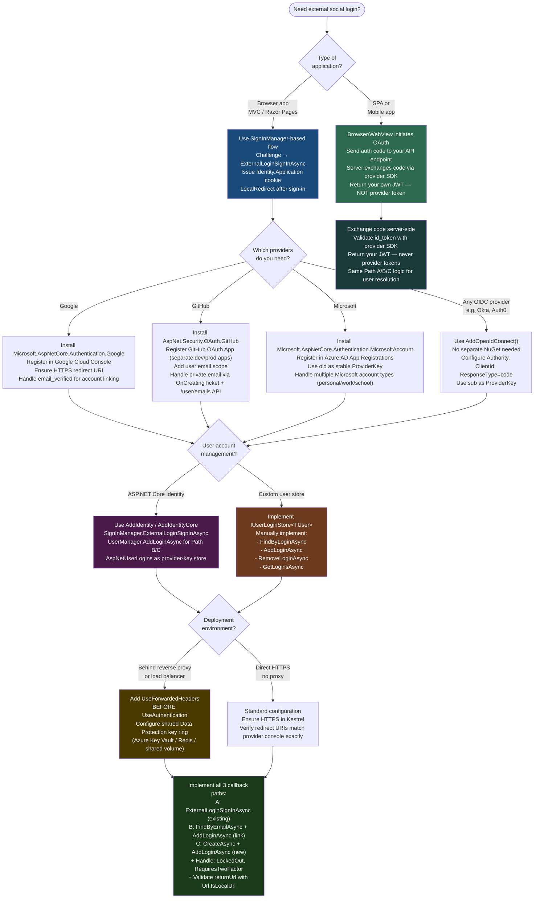

# 4.141 — External Login Providers: Google, GitHub, Microsoft via OAuth

---

## PART 0 — Navigation & Context

### Where This Topic Lives

```
ASP.NET Core Mastery
│
├── J. Authentication (4.134–4.153)
│   ├── 4.134 — Authentication Architecture: Schemes, Handlers, Middleware
│   ├── 4.135 — Cookie Authentication
│   ├── 4.136 — JWT Bearer Authentication
│   ├── 4.137 — Generating JWT Access Tokens
│   ├── 4.138 — Refresh Token Pattern
│   ├── 4.139 — OAuth 2.0: Authorization Code + PKCE         ← prerequisite
│   ├── 4.140 — OpenID Connect: AddOpenIdConnect             ← prerequisite
│   ├── ► 4.141 — External Login Providers: Google, GitHub, Microsoft  ◄ YOU ARE HERE
│   ├── 4.142 — ASP.NET Core Identity: UserManager, RoleManager        ← connects
│   ├── 4.143 — Identity: Password Hashing, Lockout, 2FA
│   ├── 4.144 — Custom User Store and IUserStore<T>
│   ├── 4.145 — API Key Authentication Handler
│   ├── 4.148 — Multiple Authentication Schemes              ← connects
│   ├── 4.149 — Claims Transformation                        ← connects
│   └── ...
│
└── (Also connects to)
    ├── K. Authorization (4.154–4.166)
    └── B. Configuration (4.013 — User Secrets)
```

### What You Need Before This

- **[[4.139 — OAuth 2.0 in ASP.NET Core: Authorization Code and PKCE Flow]]** — external providers implement OAuth 2.0; the redirect dance, authorization codes, and token exchange must be understood before adding providers adds meaning
- **[[4.134 — Authentication Architecture: Schemes, Handlers, and the Middleware]]** — each external provider registers as a named authentication scheme; understanding scheme selection, Challenge, and the handler lifecycle is required
- **[[4.135 — Cookie Authentication: AddCookie, SignInAsync, ClaimsPrincipal]]** — after an external login succeeds, the external claims are transferred to a local cookie via `SignInAsync`; you must understand the cookie scheme to understand the post-login flow
- **[[4.142 — ASP.NET Core Identity: UserManager, RoleManager, and IdentityDbContext]]** — external logins store provider/key pairs in `AspNetUserLogins`; `SignInManager.ExternalLoginSignInAsync` and `UserManager.AddLoginAsync` are the integration points

### What This Unlocks After

- **[[4.148 — Multiple Authentication Schemes]]** — external providers are additional schemes layered alongside local password auth; managing scheme selection at the endpoint level follows naturally
- **[[4.149 — Claims Transformation]]** — claims arriving from Google/GitHub often need normalization (different claim URIs, missing standard fields); `IClaimsTransformation` handles post-authentication enrichment
- **[[4.138 — Refresh Token Pattern]]** — some providers (Google, Microsoft) return a refresh token alongside the access token; storing and rotating it is the next concern after login succeeds
- **[[4.144 — Custom User Store]]** — when `IdentityDbContext` is replaced, `IUserLoginStore<TUser>` must be implemented to persist the provider/key pairs that external login depends on

### Why This Matters at Scale

External login providers are the dominant authentication path for consumer-facing applications — the majority of users prefer "Sign in with Google" over managing another password. The OAuth redirect flow involves three parties (your server, the user's browser, and the provider), two state round-trips (CSRF protection), a server-to-server token exchange, and a claims mapping step — every one of which can fail silently or in security-relevant ways. Getting the callback URL, state parameter, and `AspNetUserLogins` record management wrong produces either broken login flows or, worse, account takeover via provider-key collision.

---

## PART 1 — The Core Mental Model

### The Fundamental Rule

> **ASP.NET Core external login works in two phases: the Challenge phase redirects the user's browser to the provider (Google/GitHub/Microsoft) carrying a CSRF state cookie, and the Callback phase receives the authorization code, exchanges it for tokens server-to-server, extracts the `ExternalLoginInfo`, and then your application decides whether to sign in an existing linked account or create a new local user in `AspNetUserLogins`. The HTTP pipeline never contacts the provider directly on behalf of the user — it only processes the redirect back.**

### The Plain-Language Analogy

Think of the external login flow as a nightclub with a VIP guest list managed by a partner venue. When you arrive (the user hits your login page), the bouncer (Challenge middleware) hands you a wristband with a secret code (the CSRF state) and sends you to the partner venue (Google/GitHub) to verify your identity. The partner venue checks your ID, stamps your wrist with their own stamp (the authorization code), and sends you back. At the door again, your bouncer calls the partner venue's back office (server-to-server token exchange) to confirm the stamp is genuine. If confirmed, the partner venue tells your bouncer your name, email, and VIP status (the claims in the ID token). The bouncer then looks you up in the local VIP list (`AspNetUserLogins`) — if your name is there, you're in. If not, the bouncer asks if you want to create a new entry.

This analogy holds under the failure cases: if the CSRF wristband code doesn't match (state mismatch), you're turned away regardless of what the partner said. If the partner venue is down during the back-office call (token endpoint unreachable), you get a network error, not a 401. If the user denies consent at the partner venue, the partner sends back an error parameter instead of a code — no authorization code arrives and the callback handler returns an error result.

### The Taxonomy Diagram

```mermaid
graph TD
    subgraph Providers["External Identity Providers"]
        G["Google\nOAuth 2.0 + OIDC\nPkg: Google.Apis.Auth +\nMicrosoft.AspNetCore.Authentication.Google"]
        GH["GitHub\nOAuth 2.0 only\nPkg: AspNet.Security.OAuth.GitHub\n(community - AspNet.Security.OAuth.Providers)"]
        MS["Microsoft\nOAuth 2.0 + OIDC\nPkg: Microsoft.AspNetCore.Authentication.MicrosoftAccount"]
        OIDC["Generic OIDC Provider\nAny compliant IdP\nAddOpenIdConnect()"]
    end

    subgraph ASPNetCore["ASP.NET Core Authentication Pipeline"]
        ChallengeStep["Challenge Step\nHttpContext.ChallengeAsync(provider)\n→ 302 redirect to provider authorize endpoint\n+ state (CSRF) + nonce (OIDC) cookie"]
        CallbackStep["Callback Step\nGET /signin-google or /signin-github\n← authorization code in query string\n← state cookie verified\n→ server-to-server: POST /token\n→ ExternalLoginInfo built from claims"]
        SignInStep["SignIn / Link Step\nSignInManager.ExternalLoginSignInAsync()\n  → found in AspNetUserLogins → sign in\n  → not found → create user OR link to existing\nUserManager.AddLoginAsync(user, info)"]
    end

    subgraph Storage["Identity Storage (AspNetUserLogins)"]
        UL["AspNetUserLogins\n- LoginProvider (\"Google\", \"GitHub\")\n- ProviderKey (provider's user ID)\n- ProviderDisplayName\n- UserId (FK → AspNetUsers)"]
    end

    subgraph CookieSchemes["Cookie Schemes"]
        ExtCookie["Identity.External cookie\n(temporary — survives callback only)\nStores ExternalLoginInfo\nuntil local account linked"]
        AppCookie["Identity.Application cookie\n(permanent session cookie)\nIssued after SignInAsync()"]
    end

    G --> ChallengeStep
    GH --> ChallengeStep
    MS --> ChallengeStep
    OIDC --> ChallengeStep

    ChallengeStep --> CallbackStep
    CallbackStep --> SignInStep
    CallbackStep --> ExtCookie

    ExtCookie -->|"passed to"| SignInStep
    SignInStep -->|"lookup / write"| UL
    SignInStep -->|"issues"| AppCookie

    style Providers fill:#1a4a7a,color:#fff
    style ASPNetCore fill:#2d6a4f,color:#fff
    style Storage fill:#6b3a1f,color:#fff
    style CookieSchemes fill:#4a1a4a,color:#fff
```

---

## PART 2 — Deep Mechanics

### 2.1 — The OAuth Redirect Dance: What Happens in the HTTP Pipeline

This is not a single HTTP request. External login is a three-leg round-trip across two domains. Understanding each leg prevents the class of bugs where "it works in dev but not in prod."

**Leg 1 — Challenge (browser to provider):**

```
POST /auth/external-login?provider=Google&returnUrl=/dashboard
    └── ChallengeResult("Google", new AuthenticationProperties { RedirectUri = "/auth/callback" })
            └── GoogleHandler.HandleChallengeAsync()
                    ├── Builds authorize URL:
                    │   https://accounts.google.com/o/oauth2/v2/auth
                    │   ?client_id=YOUR_CLIENT_ID
                    │   &redirect_uri=https://yourapp.com/signin-google
                    │   &response_type=code
                    │   &scope=openid%20email%20profile
                    │   &state=BASE64(correlationId + returnUrl)   ← CSRF token
                    ├── Sets .AspNetCore.Correlation.Google.{correlationId} cookie
                    └── Returns HTTP 302 to browser
```

```
// HTTP wire format (Leg 1 response):
HTTP/1.1 302 Found
Location: https://accounts.google.com/o/oauth2/v2/auth?client_id=...&state=xyz...
Set-Cookie: .AspNetCore.Correlation.Google.xyz=N; path=/signin-google; secure; httponly; samesite=none
```

**Leg 2 — User consents at provider (browser to provider, provider to browser):** This happens entirely at the provider. Your server is not involved. The provider redirects the browser back to your `redirect_uri` with an authorization code.

```
// Browser receives from Google after consent:
HTTP/1.1 302 Found
Location: https://yourapp.com/signin-google
    ?code=4/0AX4XfWh...          ← authorization code (short-lived, single-use)
    &state=BASE64(correlationId + returnUrl)  ← same state sent in Leg 1
```

**Leg 3 — Callback (your server to provider's token endpoint, server-to-server):**

```
Pipeline position (Leg 3):
GET /signin-google?code=4/0AX4XfWh...&state=xyz
    └── GoogleHandler.HandleRequestAsync()
            ├── 1. Validate state cookie vs state param (CSRF check)
            │       → missing/mismatch → 400 Bad Request (correlation failed)
            ├── 2. POST https://oauth2.googleapis.com/token
            │       client_id=...&client_secret=...&code=4/0AX4...&grant_type=authorization_code
            │       → returns: { access_token, id_token, expires_in, refresh_token? }
            ├── 3. GET https://www.googleapis.com/oauth2/v3/userinfo (or parse id_token)
            │       Authorization: Bearer {access_token}
            │       → returns: { sub, email, name, picture, email_verified }
            ├── 4. Build ClaimsPrincipal from userinfo claims
            │       sub → NameIdentifier (the stable ProviderKey)
            │       email → ClaimTypes.Email
            │       name → ClaimTypes.Name
            ├── 5. Issue Identity.External cookie (temporary)
            │       Contains ExternalLoginInfo (provider, key, claims)
            └── 6. Redirect to returnUrl (your callback controller action)
```

```
// HTTP wire format (Leg 3 response to browser):
HTTP/1.1 302 Found
Location: /auth/external-callback
Set-Cookie: .AspNetCore.Identity.External=CfDJ8...; path=/; secure; httponly; samesite=lax
// (the correlation cookie is deleted)
Set-Cookie: .AspNetCore.Correlation.Google.xyz=; expires=Thu, 01 Jan 1970...
```

**Runtime cost**: Leg 3 involves two outbound HTTP requests from your server to the provider (token exchange + userinfo). Each is a network round-trip. At Google latency from a US data center: ~60–120ms total. This is why the callback endpoint must have a generous timeout and should not run on the same thread pool budget as API endpoints.

**The `ProviderKey` — what it is and why it matters:**

The `sub` claim from Google (or `id` from GitHub) is the provider's stable, immutable user ID. This is what goes into `AspNetUserLogins.ProviderKey`. It does NOT change if the user changes their Google email. This is the correct identifier for linking the external account — never use email as the ProviderKey because users can change their email at the provider.

---

### 2.2 — Provider Registration: NuGet Packages and Configuration

Each provider needs a NuGet package and credentials registered in `appsettings` or User Secrets.

**Package matrix:**

```
Google:    Microsoft.AspNetCore.Authentication.Google   (in-box, ships with ASP.NET Core)
Microsoft: Microsoft.AspNetCore.Authentication.MicrosoftAccount (in-box)
GitHub:    AspNet.Security.OAuth.GitHub                 (community: aspnet-contrib)
Twitter:   AspNet.Security.OAuth.Twitter                (community: aspnet-contrib)
Facebook:  Microsoft.AspNetCore.Authentication.Facebook (in-box)
Generic:   Microsoft.AspNetCore.Authentication.OpenIdConnect (for any OIDC-compliant IdP)
```

**Registration in Program.cs:**

```csharp
// Pipeline position: builder.Services — before app.Build()
// Domain: E-commerce platform with social login

builder.Services
    .AddAuthentication(options =>
    {
        // Local Identity.Application cookie remains the primary session mechanism
        options.DefaultScheme          = IdentityConstants.ApplicationScheme;
        options.DefaultSignInScheme    = IdentityConstants.ExternalScheme;
        // DefaultChallengeScheme not set — each provider is challenged explicitly
    })
    .AddCookie(IdentityConstants.ApplicationScheme)
    .AddCookie(IdentityConstants.ExternalScheme, options =>
    {
        // External cookie is temporary — only needs to survive the callback round-trip
        // Short expiry prevents orphaned external cookies if user abandons the flow
        options.ExpireTimeSpan = TimeSpan.FromMinutes(5);
    })
    .AddGoogle(options =>
    {
        // Credentials from Google Cloud Console → APIs & Services → Credentials
        options.ClientId     = builder.Configuration["Authentication:Google:ClientId"]!;
        options.ClientSecret = builder.Configuration["Authentication:Google:ClientSecret"]!;
        
        // Request additional scopes beyond openid + email + profile
        options.Scope.Add("https://www.googleapis.com/auth/calendar.readonly");
        
        // Save tokens so you can use Google API on behalf of user
        options.SaveTokens = true;
        
        // Callback path — must match what you registered in Google Cloud Console
        // Default: /signin-google — only change if you have routing conflicts
        // options.CallbackPath = "/auth/google/callback";
    })
    .AddMicrosoftAccount(options =>
    {
        options.ClientId     = builder.Configuration["Authentication:Microsoft:ClientId"]!;
        options.ClientSecret = builder.Configuration["Authentication:Microsoft:ClientSecret"]!;
    })
    .AddGitHub(options =>  // AspNet.Security.OAuth.GitHub package
    {
        options.ClientId     = builder.Configuration["Authentication:GitHub:ClientId"]!;
        options.ClientSecret = builder.Configuration["Authentication:GitHub:ClientSecret"]!;
        options.Scope.Add("user:email"); // GitHub requires explicit email scope
        options.CallbackPath = "/signin-github";
    });
```

**User Secrets for development (never in appsettings.json for production):**

```json
// dotnet user-secrets set "Authentication:Google:ClientId" "your-id"
// dotnet user-secrets set "Authentication:Google:ClientSecret" "your-secret"
{
  "Authentication": {
    "Google": {
      "ClientId": "123456789-abc.apps.googleusercontent.com",
      "ClientSecret": "GOCSPX-..."
    },
    "GitHub": {
      "ClientId": "Iv1.abc123",
      "ClientSecret": "abcdef1234567890"
    }
  }
}
```

**Edge cases at registration:**

- Google requires HTTPS for the redirect URI even in development. Run `dotnet dev-certs https --trust` and use `https://localhost:PORT/signin-google` in the Cloud Console.
- GitHub OAuth apps have a single callback URL — if you register `https://yourapp.com/signin-github`, local dev will fail unless you create a separate OAuth app for development.
- Microsoft requires a "redirect URI" that exactly matches — trailing slashes, HTTP vs HTTPS, port number. A mismatch produces a `AADSTS50011` error at the provider level, not a .NET exception.

---

### 2.3 — ExternalLoginInfo: The Post-Callback Payload

After the callback redirect, `ExternalLoginInfo` is the object that carries everything from the provider into your application's local account flow.

**Framework source behavior (approximate):**

```csharp
// SignInManager<TUser>.GetExternalLoginInfoAsync():
// Source: Microsoft.AspNetCore.Identity/SignInManager.cs

public virtual async Task<ExternalLoginInfo?> GetExternalLoginInfoAsync(string? expectedXsrf = null)
{
    // Step 1: Authenticate against the External cookie scheme
    var auth = await _contextAccessor.HttpContext!.AuthenticateAsync(
        IdentityConstants.ExternalScheme);
    
    if (!auth.Succeeded) return null; // External cookie missing or expired
    
    // Step 2: Extract the provider name and stable ProviderKey (the "sub" claim)
    var providerKey = auth.Principal.FindFirstValue(ClaimTypes.NameIdentifier);
    var provider    = auth.Properties?.Items[".AuthScheme"]; // e.g., "Google"
    
    if (providerKey is null || provider is null) return null;
    
    // Step 3: Get the provider display name (human-readable, e.g., "Google")
    var providerDisplayName = GetProviderDisplayName(provider);
    
    return new ExternalLoginInfo(auth.Principal, provider, providerKey, providerDisplayName)
    {
        AuthenticationTokens = auth.Properties?.GetTokens()
        // Contains access_token, id_token, refresh_token, expires_at if SaveTokens = true
    };
}
```

**The ExternalLoginInfo fields that matter:**

```
ExternalLoginInfo.LoginProvider      → "Google", "GitHub", "Microsoft"
ExternalLoginInfo.ProviderKey        → stable user ID at provider (Google: sub, GitHub: id)
ExternalLoginInfo.ProviderDisplayName → human label for UI ("Google", "GitHub")
ExternalLoginInfo.Principal          → ClaimsPrincipal with provider claims
ExternalLoginInfo.AuthenticationTokens → access_token, id_token, refresh_token (if SaveTokens=true)
```

**HTTP wire consequence of stale External cookie:**

```
// User clicks "Sign in with Google", completes flow, but browser is slow
// and External cookie (5-minute expiry) has expired before hitting /external-callback

// GET /auth/external-callback (more than 5 minutes after starting the flow)
// → SignInManager.GetExternalLoginInfoAsync() returns null
// → Application code: if (info == null) return BadRequest("External login expired.")
// HTTP/1.1 400 Bad Request
// {"message":"External login expired. Please try again."}
```

---

### 2.4 — Linking External Login to Local Account: The Three Scenarios

After `GetExternalLoginInfoAsync()` succeeds, there are exactly three paths. Missing any one produces a broken user experience.

**Pipeline position (in your callback controller):**

```
GET /auth/external-callback
    └── SignInManager.GetExternalLoginInfoAsync()
            └── ExternalLoginInfo (provider, key, claims)
                    ├── Path A: Existing linked account
                    │   → SignInManager.ExternalLoginSignInAsync(provider, key, false, true)
                    │   → Found in AspNetUserLogins → Signs in → 302 to returnUrl
                    │
                    ├── Path B: Email matches existing local account (link it)
                    │   → UserManager.FindByEmailAsync(info.Principal.FindFirstValue(ClaimTypes.Email))
                    │   → User found → UserManager.AddLoginAsync(user, info) → Sign in
                    │
                    └── Path C: No matching account (new user)
                        → Create ApplicationUser from info claims
                        → UserManager.CreateAsync(user) (no password — external-only account)
                        → UserManager.AddLoginAsync(user, info) → Sign in
```

**`SignInManager.ExternalLoginSignInAsync` internally:**

```csharp
// ASP.NET Core internally (approximate):
// Queries AspNetUserLogins WHERE LoginProvider = "Google" AND ProviderKey = "1234567890"
// If found → loads user → checks lockout, email confirmation → issues Identity.Application cookie
// If not found → returns SignInResult.Failed (NOT an exception)
```

**Failure mode diagram:**

```
ExternalLoginSignInAsync result states:
    SignInResult.Success          → Cookie issued, redirect to returnUrl
    SignInResult.Failed           → No record in AspNetUserLogins — proceed to Path B/C
    SignInResult.LockedOut        → User exists but is locked out — show error
    SignInResult.NotAllowed       → Email not confirmed (if RequireConfirmedEmail=true)
    SignInResult.TwoFactorRequired → Linked account has 2FA enabled — start 2FA flow
```

**The `TwoFactorRequired` path is frequently forgotten.** When `ExternalLoginSignInAsync` returns `TwoFactorRequired`, the external login succeeded but the local account requires 2FA. The external claims are stored in the `TwoFactorUserId` cookie (a third temporary cookie scheme). Your callback handler must check for this result and redirect to the 2FA prompt, not to an error page.

---

### 2.5 — Claims Mapping Differences by Provider

The claims coming from each provider use different names. This is the most common cause of "email is null" or "name is missing" bugs after a login appears to succeed.

```
Google (via OIDC):
    ClaimTypes.NameIdentifier  → user's stable Google ID (sub)
    ClaimTypes.Email           → email address
    ClaimTypes.Name            → display name
    "urn:google:name"          → full name (sometimes)
    "picture"                  → profile picture URL (not a standard ClaimType)

GitHub (OAuth 2.0 — NOT OIDC — no id_token):
    ClaimTypes.NameIdentifier  → GitHub user ID (numeric, stable)
    ClaimTypes.Name            → login username (not the display name)
    ClaimTypes.Email           → null by default if email is private!
                                 Must request "user:email" scope AND make
                                 a separate call to /user/emails API
    "urn:github:name"          → display name (custom mapping needed)
    "urn:github:url"           → profile URL

Microsoft:
    ClaimTypes.NameIdentifier  → "oid" claim (object ID in Azure AD)
    ClaimTypes.Email           → "preferred_username" or "email"
    ClaimTypes.Name            → display name
    "http://schemas.xmlsoap.org/ws/2005/05/identity/claims/emailaddress"
                               → actual email (different URI than ClaimTypes.Email)
```

**GitHub's email problem is a production gotcha.** GitHub allows users to set their email as private. When you request the `user` scope (which is the default), private emails return null. You must add the `user:email` scope AND call the `GET /user/emails` API endpoint in an `OnCreatingTicket` event to retrieve verified email addresses. Without this, `FindByEmailAsync(null)` in Path B silently falls through to Path C and creates a duplicate account.

```csharp
.AddGitHub(options =>
{
    options.ClientId     = builder.Configuration["Authentication:GitHub:ClientId"]!;
    options.ClientSecret = builder.Configuration["Authentication:GitHub:ClientSecret"]!;
    options.Scope.Add("user:email");
    
    // Handle private email — fetch from GitHub email API
    options.Events.OnCreatingTicket = async context =>
    {
        // If no email claim exists, query GitHub's email endpoint
        if (context.Principal!.FindFirstValue(ClaimTypes.Email) is null)
        {
            // context.Backchannel is the pre-configured HttpClient for this provider
            var request = new HttpRequestMessage(HttpMethod.Get,
                "https://api.github.com/user/emails");
            request.Headers.Authorization =
                new AuthenticationHeaderValue("Bearer", context.AccessToken);
            request.Headers.Add("User-Agent", "YourAppName");
            
            var response = await context.Backchannel.SendAsync(request);
            if (response.IsSuccessStatusCode)
            {
                var emails = await response.Content
                    .ReadFromJsonAsync<GitHubEmail[]>();
                var primary = emails?.FirstOrDefault(e => e.Primary && e.Verified);
                if (primary is not null)
                {
                    // Add the email claim to the principal being built
                    var identity = (ClaimsIdentity)context.Principal.Identity!;
                    identity.AddClaim(new Claim(ClaimTypes.Email, primary.Email));
                }
            }
        }
    };
})
```

---

## PART 3 — Production Code Patterns

### Pattern 1: The Complete External Login Controller (All Three Paths)

A full callback controller for an e-commerce platform handling the sign-in, link, and create paths with proper error handling.

```csharp
// Domain: E-commerce platform — social login with account linking
// Pipeline position: Endpoint reached after browser returns from provider

[ApiController]
[Route("auth")]
public class ExternalAuthController : ControllerBase
{
    private readonly SignInManager<ShopUser> _signInManager;
    private readonly UserManager<ShopUser> _userManager;
    private readonly ILogger<ExternalAuthController> _logger;

    public ExternalAuthController(
        SignInManager<ShopUser> signInManager,
        UserManager<ShopUser> userManager,
        ILogger<ExternalAuthController> logger)
    {
        _signInManager = signInManager;
        _userManager   = userManager;
        _logger        = logger;
    }

    /// <summary>
    /// Step 1: Initiate the OAuth redirect.
    /// The browser is sent to the provider — this endpoint returns immediately.
    /// </summary>
    [HttpPost("external-login")]
    public IActionResult ExternalLogin([FromBody] ExternalLoginRequest request)
    {
        // The redirect URL where the browser lands after the provider callback
        var redirectUrl = Url.Action(nameof(ExternalCallback), "ExternalAuth",
            new { returnUrl = request.ReturnUrl });

        // ChallengeAsync builds the provider URL and returns 302 to browser
        var properties = _signInManager.ConfigureExternalAuthenticationProperties(
            request.Provider, redirectUrl);

        return Challenge(properties, request.Provider);
        // HTTP/1.1 302 Found
        // Location: https://accounts.google.com/o/oauth2/v2/auth?...
    }

    /// <summary>
    /// Step 2: Provider redirected browser here with authorization code.
    /// This is a GET — the browser navigated here, so no [FromBody].
    /// </summary>
    [HttpGet("external-callback")]
    public async Task<IActionResult> ExternalCallback(
        string? returnUrl = null,
        string? remoteError = null)
    {
        // Provider reported an error (user denied consent, or provider error)
        if (remoteError is not null)
        {
            _logger.LogWarning("External login provider error: {Error}", remoteError);
            return BadRequest(new { message = $"Provider error: {remoteError}" });
        }

        // Reads the Identity.External cookie to get provider claims
        // Returns null if cookie expired or was never set
        var info = await _signInManager.GetExternalLoginInfoAsync();
        if (info is null)
        {
            _logger.LogWarning("External login info was null — cookie may have expired");
            return BadRequest(new { message = "External login expired. Please try again." });
        }

        // PATH A: Existing linked account
        // Queries AspNetUserLogins by (LoginProvider, ProviderKey)
        var signInResult = await _signInManager.ExternalLoginSignInAsync(
            info.LoginProvider,
            info.ProviderKey,
            isPersistent:         false,
            bypassTwoFactor:      false); // respect 2FA on linked accounts

        if (signInResult.Succeeded)
        {
            _logger.LogInformation(
                "User signed in via {Provider}", info.LoginProvider);
            return LocalRedirect(returnUrl ?? "/");
        }

        if (signInResult.IsLockedOut)
            return StatusCode(423, new { message = "Account is locked out." });

        if (signInResult.RequiresTwoFactor)
            // 2FA token is stored in TwoFactorUserId cookie — redirect to 2FA page
            return RedirectToAction("TwoFactorLogin", new { returnUrl });

        // PATH B: Email matches existing local account — link it
        var email = info.Principal.FindFirstValue(ClaimTypes.Email);
        if (email is not null)
        {
            var existingUser = await _userManager.FindByEmailAsync(email);
            if (existingUser is not null)
            {
                // Link the external provider to the existing local account
                var addLoginResult = await _userManager.AddLoginAsync(existingUser, info);
                if (addLoginResult.Succeeded)
                {
                    await _signInManager.SignInAsync(existingUser, isPersistent: false);
                    _logger.LogInformation(
                        "Linked {Provider} to existing account {UserId}",
                        info.LoginProvider, existingUser.Id);
                    return LocalRedirect(returnUrl ?? "/");
                }
            }
        }

        // PATH C: No matching account — create new user
        var newUser = new ShopUser
        {
            UserName = email ?? $"{info.LoginProvider}_{info.ProviderKey}",
            Email    = email,
            // Mark email confirmed if provider asserts it is verified
            // Google includes email_verified: true in the id_token
            EmailConfirmed = info.Principal
                .FindFirstValue("email_verified")
                ?.Equals("true", StringComparison.OrdinalIgnoreCase) ?? false
        };

        var createResult = await _userManager.CreateAsync(newUser);
        if (!createResult.Succeeded)
        {
            _logger.LogError(
                "Failed to create user from {Provider}: {Errors}",
                info.LoginProvider,
                string.Join(", ", createResult.Errors.Select(e => e.Code)));
            return StatusCode(500, new { message = "Could not create account." });
        }

        // Persist the provider link in AspNetUserLogins
        await _userManager.AddLoginAsync(newUser, info);
        await _signInManager.SignInAsync(newUser, isPersistent: false);

        _logger.LogInformation(
            "Created new account {UserId} via {Provider}",
            newUser.Id, info.LoginProvider);

        return LocalRedirect(returnUrl ?? "/onboarding");
    }
}

// HTTP wire formats:
// Step 1: POST /auth/external-login {"provider":"Google","returnUrl":"/dashboard"}
//         HTTP/1.1 302 Found → https://accounts.google.com/o/oauth2/v2/auth?...
//
// Step 2 (success, existing account):
//         GET /auth/external-callback?code=4/0AX4...&state=xyz
//         HTTP/1.1 302 Found → /dashboard
//         Set-Cookie: .AspNetCore.Identity.Application=CfDJ8...; httponly; secure
//
// Step 2 (provider denied):
//         GET /auth/external-callback?error=access_denied&state=xyz
//         HTTP/1.1 400 Bad Request
//         {"message":"Provider error: access_denied"}
```

---

### Pattern 2: Protecting the Callback Path Against Open Redirect

The `returnUrl` parameter in the callback is an open redirect vector if not validated. A malicious link sends the user to `/auth/external-callback?returnUrl=https://evil.com` and after successful OAuth, the user is redirected to the attacker's site.

```csharp
// Domain: Any application with external login

// ⚠️ WRONG: returnUrl is passed directly to redirect without validation
return Redirect(returnUrl ?? "/");
// HTTP consequence (wrong path):
// Attacker sends: /auth/external-callback?returnUrl=https://evil.com
// → After successful Google login: HTTP/1.1 302 Found → Location: https://evil.com
// → User is redirected off your site after authenticating (phishing vector)

// ✅ CORRECT: Use LocalRedirect which validates the URL is local
return LocalRedirect(returnUrl ?? "/");
// LocalRedirect throws InvalidOperationException if returnUrl is absolute
// → Attacker's URL https://evil.com → InvalidOperationException → 500
// → Safer pattern: validate before reaching LocalRedirect

// ✅ EVEN BETTER: Validate explicitly and fall back to safe default
private IActionResult SafeRedirect(string? returnUrl)
{
    if (string.IsNullOrEmpty(returnUrl) || !Url.IsLocalUrl(returnUrl))
        return LocalRedirect("/");
    return LocalRedirect(returnUrl);
}
// Url.IsLocalUrl returns false for:
//   - Absolute URLs (https://evil.com)
//   - Protocol-relative URLs (//evil.com)
//   - URLs with embedded newlines (CRLF injection)
```

---

### Pattern 3: Saving and Retrieving Provider Tokens (Google API Access)

Some applications need to call provider APIs (read Google Calendar, create GitHub issues) on behalf of the logged-in user. This requires saving the access token and refresh token at login time.

```csharp
// Domain: Project management SaaS — create GitHub issues from within the app

// Registration: SaveTokens = true persists tokens to AspNetUserTokens
.AddGitHub(options =>
{
    options.ClientId     = builder.Configuration["Authentication:GitHub:ClientId"]!;
    options.ClientSecret = builder.Configuration["Authentication:GitHub:ClientSecret"]!;
    options.Scope.Add("repo");  // scope for creating issues
    options.SaveTokens = true;  // stores access_token in AspNetUserTokens
});

// After login — retrieving the stored GitHub token for API calls
[HttpPost("github/issues")]
[Authorize]
public async Task<IActionResult> CreateGitHubIssue(
    [FromBody] CreateIssueRequest request)
{
    var user = await _userManager.GetUserAsync(User);
    if (user is null) return Unauthorized();

    // Retrieve stored OAuth access token from AspNetUserTokens
    // Table: LoginProvider="GitHub", Name="access_token"
    var token = await _userManager.GetAuthenticationTokenAsync(
        user, "GitHub", "access_token");

    if (string.IsNullOrEmpty(token))
        return BadRequest(new { message = "No GitHub token found. Please re-link your account." });

    // Use the token to call GitHub API on behalf of the user
    _httpClient.DefaultRequestHeaders.Authorization =
        new AuthenticationHeaderValue("Bearer", token);
    _httpClient.DefaultRequestHeaders.Add("User-Agent", "ProjectManagementSaaS");

    var response = await _httpClient.PostAsJsonAsync(
        $"https://api.github.com/repos/{request.Owner}/{request.Repo}/issues",
        new { title = request.Title, body = request.Body });

    if (!response.IsSuccessStatusCode)
        return StatusCode((int)response.StatusCode);

    return Ok();
}

// HTTP consequence:
// POST /github/issues {"owner":"acme","repo":"backend","title":"Bug #1","body":"..."}
// Authorization: Bearer {session-cookie-or-jwt}
// → Retrieves GitHub token from AspNetUserTokens (1 DB SELECT)
// → POST https://api.github.com/repos/acme/backend/issues Authorization: Bearer {github-token}
// → HTTP/1.1 201 Created
```

---

### Pattern 4: Preventing Duplicate Account Creation (Email-Based Deduplication)

When a user has a local account with `alice@gmail.com` and later tries "Sign in with Google" (whose email is also `alice@gmail.com`), Path B in the callback must link — not create a new account. But if email confirmation is required, you must verify ownership before linking.

```csharp
// Domain: Healthcare portal — strict account linking policy
// Problem: If we link any matching email automatically, a malicious provider
//          could create a fake Google account with alice's email and hijack her account.
// Solution: Only auto-link if provider asserts email_verified = true

private async Task<IActionResult> HandleExternalCallbackInternal(
    ExternalLoginInfo info, string? returnUrl)
{
    var email = info.Principal.FindFirstValue(ClaimTypes.Email);
    var emailVerified = info.Principal
        .FindFirstValue("email_verified")
        ?.Equals("true", StringComparison.OrdinalIgnoreCase) ?? false;

    // PATH B safeguard: only auto-link if provider has verified the email
    // This prevents a malicious OAuth provider from hijacking an existing account
    if (email is not null && emailVerified)
    {
        var existingUser = await _userManager.FindByEmailAsync(email);
        if (existingUser is not null)
        {
            // Check if this provider is already linked (idempotent add)
            var logins = await _userManager.GetLoginsAsync(existingUser);
            if (logins.Any(l => l.LoginProvider == info.LoginProvider))
            {
                // Already linked — just sign in
                await _signInManager.SignInAsync(existingUser, isPersistent: false);
                return LocalRedirect(returnUrl ?? "/");
            }

            // Link and sign in
            await _userManager.AddLoginAsync(existingUser, info);
            await _signInManager.SignInAsync(existingUser, isPersistent: false);
            return LocalRedirect(returnUrl ?? "/");
        }
    }
    else if (email is not null && !emailVerified)
    {
        // Provider did not verify the email — don't auto-link; require explicit confirmation
        // Store the ExternalLoginInfo in TempData or a short-lived token
        // and show a "Confirm your email to link accounts" page
        _logger.LogWarning(
            "External login {Provider} presented unverified email {Email} — not auto-linking",
            info.LoginProvider, email);
        // Redirect to a confirmation page
        return RedirectToAction("ConfirmExternalEmail",
            new { provider = info.LoginProvider, returnUrl });
    }

    // PATH C: create new account (email unknown or unverified, no existing match)
    // ... create user as in Pattern 1
    return LocalRedirect(returnUrl ?? "/onboarding");
}
```

---

### Pattern 5: Listing and Removing Linked Providers from Account Settings

An account management page must show which providers are linked and allow removing them — but only if the user won't lose all authentication methods.

```csharp
// Domain: SaaS user account management page

[HttpGet("account/logins")]
[Authorize]
public async Task<IActionResult> GetLinkedLogins()
{
    var user = await _userManager.GetUserAsync(User);
    if (user is null) return Unauthorized();

    // Returns all rows from AspNetUserLogins for this user
    var logins = await _userManager.GetLoginsAsync(user);

    // Determine available providers for "Add login" UI
    var availableProviders = (await _signInManager.GetExternalAuthenticationSchemesAsync())
        .Where(s => logins.All(l => l.LoginProvider != s.Name))
        .Select(s => new { s.Name, s.DisplayName });

    return Ok(new
    {
        LinkedProviders = logins.Select(l => new
        {
            l.LoginProvider,
            l.ProviderDisplayName,
            l.ProviderKey
        }),
        AvailableProviders = availableProviders,
        HasLocalPassword = await _userManager.HasPasswordAsync(user)
    });
}

[HttpDelete("account/logins/{loginProvider}")]
[Authorize]
public async Task<IActionResult> RemoveLogin([FromRoute] string loginProvider)
{
    var user = await _userManager.GetUserAsync(User);
    if (user is null) return Unauthorized();

    var logins = await _userManager.GetLoginsAsync(user);
    var hasPassword = await _userManager.HasPasswordAsync(user);

    // Guard: prevent removing the last authentication method
    // If user has no password and this is their only provider, they'd be locked out
    if (!hasPassword && logins.Count == 1)
        return BadRequest(new { message = "Cannot remove your only login method." });

    var login = logins.FirstOrDefault(l => l.LoginProvider == loginProvider);
    if (login is null)
        return NotFound(new { message = "Provider not linked." });

    var result = await _userManager.RemoveLoginAsync(user, login.LoginProvider, login.ProviderKey);
    if (!result.Succeeded)
        return StatusCode(500, new { message = "Failed to remove login." });

    return NoContent();

    // HTTP wire format:
    // DELETE /account/logins/Google
    // Authorization: Bearer {token}
    // → DELETE FROM AspNetUserLogins WHERE UserId=... AND LoginProvider='Google'
    // HTTP/1.1 204 No Content
}
```

---

### Pattern 6: External Login for a JWT API (No Cookie Session)

When your app is a stateless JWT API (mobile clients, SPAs with token storage), you cannot use the cookie-based `SignInManager` flow directly. The external login must end with a JWT token, not a cookie.

```csharp
// Domain: Mobile app backend — OAuth flow ends with JWT issuance, not cookie

// The mobile client initiates the OAuth flow in a WebView or browser,
// receives the authorization code, and sends it to your API directly.
// Your API exchanges the code for tokens server-side and returns a JWT.

[HttpPost("auth/google/token")]
public async Task<IActionResult> ExchangeGoogleCode([FromBody] GoogleCodeRequest request)
{
    // Exchange authorization code for Google tokens server-to-server
    // using Google's token endpoint directly (no ASP.NET Core middleware involved here)
    var googleTokens = await ExchangeCodeWithGoogle(
        request.Code,
        request.RedirectUri,  // must match what was used in the authorize URL
        _configuration["Authentication:Google:ClientId"]!,
        _configuration["Authentication:Google:ClientSecret"]!);

    if (googleTokens is null)
        return Unauthorized(new { message = "Failed to exchange code with Google." });

    // Validate the id_token (JWT from Google) — do not trust without verification
    // Google.Apis.Auth package: GoogleJsonWebSignature.ValidateAsync
    GoogleJsonWebSignature.Payload payload;
    try
    {
        payload = await GoogleJsonWebSignature.ValidateAsync(
            googleTokens.IdToken,
            new GoogleJsonWebSignature.ValidationSettings
            {
                Audience = new[] { _configuration["Authentication:Google:ClientId"] }
            });
    }
    catch (InvalidJwtException ex)
    {
        _logger.LogWarning("Invalid Google id_token: {Error}", ex.Message);
        return Unauthorized(new { message = "Invalid Google token." });
    }

    // Now we have verified: sub (stable ID), email, email_verified, name
    // Run the same Path A/B/C logic as the cookie flow
    var user = await FindOrCreateUserFromGoogle(payload);
    if (user is null)
        return StatusCode(500, new { message = "Could not establish account." });

    // Issue your application's JWT (not Google's token — never pass Google tokens to clients)
    var appToken = _jwtService.GenerateToken(user);

    return Ok(new { token = appToken, expiresIn = 900 });

    // HTTP wire format:
    // POST /auth/google/token {"code":"4/0AX4...","redirectUri":"myapp://callback"}
    // HTTP/1.1 200 OK
    // {"token":"eyJhbGci...","expiresIn":900}
}

// CRITICAL: Never return Google's access_token to your mobile client.
// The client should only receive YOUR application's JWT.
// Google's access_token scoped to your backend should stay server-side.
```

---

## PART 4 — Gotchas & Anti-Patterns

### Gotcha 1: Missing Redirect URI Registration Causes Silent 400 from Provider

The redirect URI your ASP.NET Core app uses must be registered exactly in the provider's developer console. A mismatch is caught by the provider — not by your code — and returns an error to the browser, not an exception in your logs.

```csharp
// ⚠️ WRONG: Using default callback path but registering wrong URL in Google Console
.AddGoogle(options =>
{
    options.ClientId     = "...";
    options.ClientSecret = "...";
    // Default CallbackPath = "/signin-google"
    // Registered in Google Console: https://yourapp.com/auth/google/callback ← different!
});
```

```
// HTTP consequence (wrong path — browser-visible, server-invisible):
// Redirect_uri_mismatch error at Google:
// GET https://accounts.google.com/o/oauth2/v2/auth?redirect_uri=https://yourapp.com/signin-google
// → Google returns: 400 redirect_uri_mismatch
// → Browser shows Google error page, NOT your application
// → Your server logs show NOTHING because the request never reached your server
```

```csharp
// ✅ CORRECT: Either match your app's CallbackPath to what's registered, OR register both
// Option A: Register https://yourapp.com/signin-google in Google Console (match default)
// Option B: Override CallbackPath and register the custom path
.AddGoogle(options =>
{
    options.CallbackPath = "/auth/google/callback"; // match what's in Google Console
});
```

```
// HTTP consequence (correct path):
// GET /auth/google/callback?code=4/0AX4...&state=xyz
// → GoogleHandler processes callback, issues External cookie
// → 302 redirect to returnUrl
```

**WHY**: The redirect URI is a security feature. The provider validates it against your registered list before returning the authorization code. Your server never sees the error — it's entirely between the browser and the provider. Always check provider error pages first, not your application logs, when the OAuth flow breaks at Leg 2.

---

### Gotcha 2: GitHub Email Is Null When User Has a Private Email Address

GitHub users can hide their email. Without explicit handling, `email` is null in the claims, Path B (email matching) silently skips, and Path C creates a new account on every login — producing duplicate users in your database.

```csharp
// ⚠️ WRONG: Trusting that GitHub always provides email
.AddGitHub(options =>
{
    options.ClientId     = "...";
    options.ClientSecret = "...";
    // Scope defaults to "read:user" — email may be null
});

// In callback:
var email = info.Principal.FindFirstValue(ClaimTypes.Email); // can be null for GitHub!
var existingUser = await _userManager.FindByEmailAsync(email!); // NullReferenceException
```

```
// HTTP consequence (wrong path):
// User "bob" on GitHub has private email
// First login → Path C creates user with UserName="GitHub_12345678", Email=null
// Second login → email still null → Path B skipped → Path C tries CreateAsync again
// → IdentityResult.Failed: DuplicateUserName (UserName="GitHub_12345678" already exists)
// → HTTP/1.1 500 Internal Server Error (unhandled CreateAsync failure)
// OR: succeeds in creating a SECOND user row if UserName is slightly different
```

```csharp
// ✅ CORRECT: Request user:email scope and fetch from /user/emails API
.AddGitHub(options =>
{
    options.ClientId     = "...";
    options.ClientSecret = "...";
    options.Scope.Add("user:email");
    options.Events.OnCreatingTicket = async ctx =>
    {
        if (ctx.Principal!.FindFirstValue(ClaimTypes.Email) is null)
        {
            var req = new HttpRequestMessage(HttpMethod.Get, "https://api.github.com/user/emails");
            req.Headers.Authorization = new AuthenticationHeaderValue("Bearer", ctx.AccessToken);
            req.Headers.Add("User-Agent", "YourApp/1.0");
            var res = await ctx.Backchannel.SendAsync(req);
            if (res.IsSuccessStatusCode)
            {
                var emails = await res.Content.ReadFromJsonAsync<GitHubEmail[]>();
                var primary = emails?.FirstOrDefault(e => e.Primary && e.Verified);
                if (primary is not null)
                    ((ClaimsIdentity)ctx.Principal.Identity!)
                        .AddClaim(new Claim(ClaimTypes.Email, primary.Email));
            }
        }
    };
});
```

```
// HTTP consequence (correct path):
// GitHub user with private email logs in
// OnCreatingTicket fetches /user/emails → adds verified primary email to claims
// Path B matches existing account by email OR Path C creates user with correct email
// HTTP/1.1 302 Found → /dashboard
```

**WHY**: GitHub's OAuth 2.0 implementation does not include email in the user profile endpoint by default when the email is set to private. Unlike Google (which always returns email when you request the `email` scope), GitHub requires a separate API call to `/user/emails` for users with private emails. `ClaimTypes.Email` will genuinely be absent in the claims principal without this extra call.

---

### Gotcha 3: Using Email (Not ProviderKey) as the Link Identifier

Some engineers store the provider email in `AspNetUserLogins.ProviderKey` instead of the provider's stable user ID (`sub` for Google, `id` for GitHub). This breaks when the user changes their email at the provider.

```csharp
// ⚠️ WRONG: Storing email as ProviderKey in a manual login flow
var loginInfo = new UserLoginInfo(
    loginProvider:       "Google",
    providerKey:         googleEmail,           // ← WRONG: email is mutable
    displayName:         "Google");
await _userManager.AddLoginAsync(user, loginInfo);
```

```
// HTTP consequence (wrong path):
// User changes their Google email from alice@old.com to alice@new.com
// Next login → Google sends sub=10285234, email=alice@new.com
// Your callback builds ExternalLoginInfo with ProviderKey=alice@new.com
// ExternalLoginSignInAsync looks for ProviderKey=alice@new.com in AspNetUserLogins
// → Not found (stored as alice@old.com) → SignInResult.Failed
// → Path B tries FindByEmailAsync(alice@new.com) → may not find local account
// → Path C creates a duplicate account
// → User appears to have lost their account (still exists under old email)
```

```csharp
// ✅ CORRECT: ProviderKey MUST be the provider's stable, immutable user ID
// Google: sub claim (string numeric ID like "102852340123456789")
// GitHub: ClaimTypes.NameIdentifier (GitHub's numeric user ID)
// Microsoft: oid claim (GUID, unchanging)

// The ASP.NET Core provider handlers do this correctly automatically —
// ExternalLoginInfo.ProviderKey is always set from ClaimTypes.NameIdentifier
// which maps to the stable ID, not the email.

// Only an issue if you're building ExternalLoginInfo manually.
var providerKey = info.Principal.FindFirstValue(ClaimTypes.NameIdentifier); // ✅ stable ID
```

**WHY**: `ClaimTypes.NameIdentifier` in the principal built by ASP.NET Core's Google/GitHub/Microsoft handlers maps to `sub` (Google), `id` (GitHub), and `oid` (Microsoft) — all stable, permanent identifiers. Email is presented as a convenience in the claims but must never be used as a primary identifier because users can change it at the provider without any notification to your application.

---

### Gotcha 4: Not Handling the TwoFactorRequired Result from ExternalLoginSignInAsync

Teams implementing external login often test with accounts that have no 2FA and forget that returning users may have 2FA enabled on their local Identity account. `ExternalLoginSignInAsync` returns `TwoFactorRequired` — not `Failed` — in this case.

```csharp
// ⚠️ WRONG: Only handling Success and treating everything else as an error
var result = await _signInManager.ExternalLoginSignInAsync(
    info.LoginProvider, info.ProviderKey, false, false);

if (result.Succeeded) return LocalRedirect(returnUrl ?? "/");
// Falls through to generic error for TwoFactorRequired
return BadRequest(new { message = "Login failed." });
```

```
// HTTP consequence (wrong path):
// User has 2FA enabled on their account, tries to sign in with Google
// → ExternalLoginSignInAsync returns SignInResult.TwoFactorRequired
// → Code falls through to BadRequest
// HTTP/1.1 400 Bad Request {"message":"Login failed."}
// → User cannot sign in via their linked Google account — permanent lockout
```

```csharp
// ✅ CORRECT: Handle all SignInResult states
var result = await _signInManager.ExternalLoginSignInAsync(
    info.LoginProvider, info.ProviderKey,
    isPersistent: false, bypassTwoFactor: false);

if (result.Succeeded)
    return LocalRedirect(returnUrl ?? "/");

if (result.IsLockedOut)
    return StatusCode(423, new { message = "Account locked out." });

if (result.RequiresTwoFactor)
{
    // External claims stored in Identity.TwoFactorUserId cookie
    // Redirect to 2FA verification page with returnUrl preserved
    return RedirectToAction("TwoFactorLogin", "Auth",
        new { returnUrl, rememberMe = false });
}
// Only reach here if ProviderKey not in AspNetUserLogins → Path B/C
```

**WHY**: `ExternalLoginSignInAsync` uses the Identity pipeline including lockout and 2FA checks. When `bypassTwoFactor: false`, the method returns `TwoFactorRequired` before issuing the application cookie. ASP.NET Core stores the user identity temporarily in the `Identity.TwoFactorUserId` cookie. If your callback ignores `RequiresTwoFactor`, the user is stranded — they authenticated with Google successfully but can't proceed past the 2FA gate they set up.

---

### Gotcha 5: The HTTPS/SameSite Correlation Cookie Breaks in Reverse Proxy Environments

The OAuth correlation cookie (`.AspNetCore.Correlation.{Provider}.{id}`) uses `SameSite=None; Secure` to survive the cross-origin redirect back from the provider. In reverse proxy setups (nginx, YARP, Azure Front Door) where TLS is terminated at the proxy, the application sees HTTP internally, and `Secure` cookie requirements fail.

```csharp
// ⚠️ WRONG: No ForwardedHeaders middleware, app runs behind nginx with HTTPS offloaded
// ASPNETCORE_URLS = http://+:8080 (no HTTPS in the container)
// Nginx terminates TLS and forwards X-Forwarded-Proto: https

app.UseAuthentication(); // runs before ForwardedHeaders is applied
// Correlation cookie was set with Secure flag, but browser sends it over
// the connection it perceives as HTTPS; server rejects because Request.IsHttps = false
```

```
// HTTP consequence (wrong path):
// Google redirects back to https://yourapp.com/signin-google
// → Nginx proxy forwards to http://container:8080/signin-google
// → GoogleHandler: validates state cookie but Request.IsHttps is false
// → Correlation cookie was set with SameSite=None;Secure but server side
//   sees non-HTTPS request → state validation fails
// HTTP/1.1 500 Internal Server Error (or 400)
// "An error was encountered while handling the remote login."
// Server log: "The oauth state was missing or invalid."
```

```csharp
// ✅ CORRECT: Apply ForwardedHeaders middleware BEFORE UseAuthentication
app.UseForwardedHeaders(new ForwardedHeadersOptions
{
    ForwardedHeaders = ForwardedHeaders.XForwardedFor | ForwardedHeaders.XForwardedProto
});
// Now Request.IsHttps = true (forwarded from nginx X-Forwarded-Proto: https)
// Correlation cookie validation succeeds

app.UseAuthentication();
app.UseAuthorization();
```

**WHY**: The OAuth correlation cookie uses `SameSite=None; Secure` because it must survive a cross-site redirect (from Google's domain back to yours). When the application runs behind a TLS-terminating proxy without `UseForwardedHeaders`, `HttpContext.Request.IsHttps` returns false, and the cookie security validation rejects the correlation. This is the single most common "works in dev, broken in production" external login failure in containerized deployments.

---

## PART 5 — Performance Implications

### 5.1 — Request Pipeline Characteristics Table

|Scenario|Pipeline Depth|Allocations Per Request|Approx Latency Impact|Recommendation|
|---|---|---|---|---|
|Challenge (initiate redirect)|Shallow — builds URL and returns 302|~5-8|< 1ms server processing|Negligible; browser round-trip dominates|
|State cookie generation|In-memory PRNG + cookie write|~3|< 0.5ms|No concern|
|Token exchange (Leg 3, server-to-server)|1 outbound POST to provider token endpoint|~10-15|60-200ms (network, provider-side)|Add timeout (5s); provider outage = login outage|
|Userinfo API call (GitHub, no OIDC)|1 outbound GET to /user endpoint|~8-12|30-100ms|GitHub: combine with email API call in OnCreatingTicket|
|ExternalLoginSignInAsync (hit)|1 SELECT AspNetUserLogins + 1 SELECT AspNetUsers|~15-20|2-8ms|Indexed lookup; fast path|
|ExternalLoginSignInAsync (miss, Path B email match)|2 SELECT (logins + user by email)|~20-25|3-10ms|Email index lookup|
|UserManager.CreateAsync (Path C, new user)|Validate + INSERT + INSERT AspNetUserLogins|~25-30|5-15ms|Rare (only on first-ever login)|
|GetExternalLoginInfoAsync (External cookie decode)|Cookie decrypt + claims deserialization|~8-10|< 1ms|ASP.NET Core Data Protection decrypt|
|GetLoginsAsync (account settings page)|1 SELECT AspNetUserLogins WHERE UserId|~10|2-5ms|Infrequent admin operation|
|SaveTokens = true (token persistence)|1 UPSERT AspNetUserTokens|~10|2-5ms per token|Only on login; subsequent requests read token from DB if needed|

### 5.2 — BenchmarkDotNet: Measuring the Token Exchange Cost

```csharp
// Note: The dominant cost of external login is always the provider round-trip
// (Leg 3 token exchange + userinfo call). This is network latency to Google/GitHub/Microsoft.
// BenchmarkDotNet cannot measure live network calls reliably — use k6 or NBomber
// for real-world measurement. The benchmark below measures the local in-process costs.

using BenchmarkDotNet.Attributes;
using Microsoft.AspNetCore.Authentication;
using Microsoft.AspNetCore.DataProtection;

// Run: dotnet run -c Release
// Profile real OAuth login latency:
//   k6 run --vus 50 --duration 30s oauth_login.js
// Profile DB operations in callback:
//   dotnet-counters monitor --counters System.Runtime,Microsoft.AspNetCore.Hosting
// For SQL query times: use EF Core logging with LogLevel.Information

[MemoryDiagnoser]
[Orderer(BenchmarkDotNet.Order.SummaryOrderPolicy.FastestToSlowest)]
public class ExternalLoginBenchmarks
{
    private IDataProtector _protector = null!;
    private byte[] _correlationValue = null!;
    private string _correlationProtected = null!;

    [GlobalSetup]
    public void Setup()
    {
        // Simulate the Data Protection used for state/correlation cookies
        var services = new ServiceCollection()
            .AddDataProtection()
            .Services.BuildServiceProvider();
        var factory = services.GetRequiredService<IDataProtectionProvider>();
        _protector  = factory.CreateProtector("ExternalLogin.Correlation");
        
        _correlationValue    = Guid.NewGuid().ToByteArray();
        _correlationProtected = _protector.Protect(
            Convert.ToBase64String(_correlationValue));
    }

    [Benchmark(Baseline = true)]
    public string ProtectCorrelationValue()
        => _protector.Protect(Convert.ToBase64String(_correlationValue));
    // Purpose: shows cost of state cookie creation on Challenge

    [Benchmark]
    public string UnprotectCorrelationValue()
        => _protector.Unprotect(_correlationProtected);
    // Purpose: shows cost of state cookie validation on Callback

    [Benchmark]
    public ClaimsPrincipal BuildExternalClaimsPrincipal()
    {
        // Simulate building the ClaimsPrincipal from provider claims
        var identity = new ClaimsIdentity("Google");
        identity.AddClaim(new Claim(ClaimTypes.NameIdentifier, "102852340123456789"));
        identity.AddClaim(new Claim(ClaimTypes.Email, "alice@gmail.com"));
        identity.AddClaim(new Claim(ClaimTypes.Name, "Alice Smith"));
        identity.AddClaim(new Claim("email_verified", "true"));
        return new ClaimsPrincipal(identity);
    }
    // Purpose: shows cost of ClaimsPrincipal construction (happens per login callback)
}

// Expected output (approximate, .NET 8, x64):
// |                          Method |        Mean | Allocated |
// |-------------------------------- |------------:|----------:|
// |      BuildExternalClaimsPrincipal|    312 ns   |   1.2 KB  |
// |         ProtectCorrelationValue  |  4,200 ns   |   0.8 KB  |
// |       UnprotectCorrelationValue  |  3,800 ns   |   0.6 KB  |
//
// Key insight: ALL local processing is microseconds.
// Provider network round-trip (60-200ms) dominates by 4 orders of magnitude.
// Optimize the network path (provider choice, region, timeout config) not the code.
```

### 5.3 — When to Care / When to Ignore

**When this costs you:**

- **Provider API outage** — if Google/GitHub/Microsoft has an incident, your entire login flow is broken. Every external-only user cannot sign in. Mitigation: always allow local password as a fallback for production-critical apps. Monitor provider status pages.
- **Slow token exchange at global scale** — provider endpoints have regional routing. An app hosted in Asia calling `oauth2.googleapis.com` may see higher latency than one hosted in the US. Use latency monitoring on the callback endpoint.
- **GitHub rate limits on userinfo/email API** — if many users log in simultaneously via GitHub, each login triggers a GitHub API call. GitHub rate-limits by client IP for unauthenticated calls; authenticated calls get 5,000/hour per token. At >83 logins/minute via GitHub, you can hit rate limits. Cache the email lookup result.
- **Database connection pool during burst logins** — each callback creates a Scoped `IdentityDbContext`. At high login rates (>100/second), this opens and closes many DB connections. Tune `ConnectionPoolSize` in the connection string.
- **SaveTokens = true with token refresh** — storing and refreshing access tokens adds 1-2 DB round-trips per login. At scale, consider a dedicated token store (Redis) for provider tokens rather than `AspNetUserTokens`.

**When this doesn't matter:**

- Internal tools with a fixed set of enterprise users (< 100 total). Latency is invisible.
- Applications where only one provider is supported and its availability is out of scope.
- Development and staging environments — provider latency is irrelevant to correctness testing.
- Applications where external login is a secondary path and the primary path (local password) handles the majority of logins.

---

## PART 6 — Interview Arsenal

### A. The Question Bank

**Question 1:** "Walk me through the OAuth external login flow in ASP.NET Core. What happens on the server at each step?"

**Average Answer**: "The user clicks 'Sign in with Google', gets redirected to Google, logs in there, and gets redirected back to your app with a code you exchange for a token."

**Why That's Insufficient**: Misses the CSRF protection mechanism (state cookie), the server-to-server token exchange (Leg 3), where the claims come from, the External cookie role, and the three paths in the callback handler.

> **Great Answer**: "There are three legs. Leg 1: when the user clicks 'Sign in with Google', my server generates a CSRF state token, stores it in an httponly correlation cookie, and returns a 302 redirect to Google's authorize endpoint with the state embedded in the URL. Leg 2 happens entirely at Google — my server isn't involved. Google redirects the browser back to my callback URL with an authorization code and the same state value. Leg 3 is where the real work happens server-side: my server validates the state cookie matches the state parameter — this prevents CSRF — then makes a server-to-server POST to Google's token endpoint with the code to get an access token and id_token. It then either parses the id_token or calls the userinfo endpoint to get the claims: sub, email, name. These become an ExternalLoginInfo stored in a temporary External cookie. My callback controller then runs through three paths: if the ProviderKey already exists in AspNetUserLogins, sign in immediately. If not, try to match by email and link the providers. If no match, create a new user and call AddLoginAsync to record the provider/key pair. The whole flow involves two HTTP redirects and one server-to-server call per login — the network latency to the provider's token endpoint (60-200ms) dominates all other costs."

---

**Question 2:** "What is stored in `AspNetUserLogins` and why is it important?"

**Average Answer**: "It maps users to their external login providers so they can sign in with Google or GitHub."

**Why That's Insufficient**: Doesn't explain the ProviderKey or what happens if you use the wrong field as the identifier.

> **Great Answer**: "AspNetUserLogins stores three key fields: LoginProvider (the scheme name like 'Google' or 'GitHub'), ProviderKey (the provider's stable, immutable user ID), and UserId (the foreign key to AspNetUsers). The ProviderKey is critical — it must be the provider's internal user ID, not the email address. Google's stable ID is the `sub` claim in the id_token. For GitHub it's the numeric user ID in ClaimTypes.NameIdentifier. If you mistakenly use email as the ProviderKey, the user loses access to their account the moment they change their email at the provider because ExternalLoginSignInAsync queries by ProviderKey and will no longer find a match. ASP.NET Core's built-in handlers do this correctly automatically, setting ProviderKey from ClaimTypes.NameIdentifier. It only becomes an issue if you build ExternalLoginInfo manually."

---

**Question 3:** "Why does external login break in production behind a load balancer but work in development?"

**Average Answer**: "Something to do with HTTPS and cookies."

**Why That's Insufficient**: Doesn't name the specific mechanism (ForwardedHeaders, state cookie SameSite=None, or Data Protection key ring distribution).

> **Great Answer**: "There are two common failure modes in load-balanced production environments. The first is the ForwardedHeaders issue: if TLS is terminated at the load balancer or reverse proxy, the application sees HTTP internally while the browser sees HTTPS. The OAuth correlation cookie is set with SameSite=None and Secure. Without UseForwardedHeaders middleware, HttpContext.Request.IsHttps returns false, and the state cookie validation fails during the callback with 'oauth state was missing or invalid'. Fix: add UseForwardedHeaders before UseAuthentication. The second failure mode is Data Protection key ring: the correlation and external cookies are encrypted with ASP.NET Core Data Protection. If each pod in a Kubernetes deployment has its own key ring, a user who makes the challenge request to pod A but the callback goes to pod B gets a decryption failure because pod B can't decrypt pod A's keys. Fix: configure a shared Data Protection key store (Azure Key Vault, Redis, or a shared file mount) so all pods use the same keys."

---

**Question 4:** "GitHub users can have private emails. How do you handle this in your external login implementation?"

**Average Answer**: "Add the user:email scope and the email will be included."

**Why That's Insufficient**: Adding the scope is necessary but not sufficient — private emails still require a separate API call.

> **Great Answer**: "Adding the user:email scope to the GitHub OAuth configuration is step one, but it's not enough for users who have marked their email as private on GitHub. For those users, the GitHub userinfo endpoint returns null for the email field even with the scope. The correct approach is to hook into OnCreatingTicket in the GitHub options and check whether the email claim is present. If it's absent, use the Backchannel HttpClient — which is pre-configured with the GitHub base URL and the current access token — to call GET /user/emails. That endpoint returns an array of email objects with primary and verified flags. I take the first email where both primary and verified are true, and I add it as a ClaimTypes.Email claim to the identity being built. Without this, my callback would treat every GitHub user with a private email as a new user on every login, creating duplicate accounts because FindByEmailAsync would always receive null."

---

### B. The Trick Questions

**Trick 1:** "The user clicks 'Sign in with Google', completes the Google flow, and is redirected back to `/signin-google`. Your server returns a 500. Your application logs show nothing. What's wrong?"

**The Trap**: Engineers look in application logs, but the error may be invisible to your server.

**Correct Answer**: The 500 could be a correlation cookie mismatch — the state in the URL doesn't match the cookie. But if logs show nothing at all, the error may have occurred at the provider side, not yours. The browser hit Google's authorize endpoint and Google returned an error page (wrong redirect URI, wrong client ID, invalid scope) before ever reaching your server. Check the browser network tab: if the last request before the callback was to `accounts.google.com` and returned an HTML error page, the problem is the provider registration — redirect URI mismatch, incorrect client ID, or the OAuth app is in testing mode with an unregistered test user. Your server never receives the callback because the browser showed Google's error page instead.

---

**Trick 2:** "A user signed up with Google, then later sets a local password and signs in with their password. They then try to sign in with Google again. What happens?"

**The Trap**: You might think Google login and password login are separate and don't interact.

**Correct Answer**: The second Google login attempts `ExternalLoginSignInAsync`. Since the user initially signed up via Google, the `AspNetUserLogins` row exists — ProviderKey matches. ExternalLoginSignInAsync succeeds and signs them in with the same application account they use for password login. Both login methods share the same `UserId`. The `AspNetUserLogins` table is simply an additional authentication method pointing to the same local account — not a separate account. `GetLoginsAsync` would return one entry (Google), and `HasPasswordAsync` would return true. Both paths are valid authentication methods for the same account.

---

**Trick 3:** "You call `ExternalLoginSignInAsync` and it returns `SignInResult.Failed`. Does this mean the OAuth flow failed? Is the user unauthenticated?"

**The Trap**: `Failed` sounds like a failure, but it has a specific narrow meaning.

**Correct Answer**: No — `SignInResult.Failed` from `ExternalLoginSignInAsync` only means no row was found in `AspNetUserLogins` matching that `(LoginProvider, ProviderKey)` pair. The OAuth flow itself succeeded completely: the user authenticated at Google, the token exchange worked, `GetExternalLoginInfoAsync` returned valid claims, and the External cookie is present. The user is, in a sense, authenticated by Google — but not yet linked to a local account. `SignInResult.Failed` is the signal to proceed to Path B (email matching) or Path C (account creation). It is not an error to handle with a 400; it is a normal state meaning "new user, proceed to registration."

---

**Trick 4:** "The `SaveTokens = true` option is set for Google. Where are the tokens stored, and how do you retrieve them?"

**The Trap**: Engineers often assume they're stored in the session or in-memory.

**Correct Answer**: When `SaveTokens = true`, ASP.NET Core Identity stores the tokens in `AspNetUserTokens` — the sixth Identity table. Each token is a row with `UserId`, `LoginProvider` (e.g., "Google"), `Name` ("access_token", "refresh_token", "id_token", "expires_at"), and `Value`. To retrieve them after login, you call `UserManager.GetAuthenticationTokenAsync(user, "Google", "access_token")` which runs a SELECT on that table. The tokens are protected at rest by ASP.NET Core Data Protection (encrypted before insertion). This means you need a stable Data Protection key ring in production — without it, tokens inserted on one deployment cannot be decrypted after a re-deploy.

---

### C. Red Flags to Avoid

1. **"I use the user's email as the ProviderKey"** — email is mutable at the provider; using it as ProviderKey breaks all existing users if they change their email. Score down.
    
2. **"The external login flow is just one redirect"** — there are three legs (challenge → provider consent → callback with token exchange). Not knowing Leg 3 (server-to-server token exchange) signals you've only used external login as a black box. Score down.
    
3. **"I don't need to handle TwoFactorRequired from ExternalLoginSignInAsync"** — this silently breaks 2FA users who attempt to sign in via an external provider. Score down.
    
4. **"External login is stateless"** — it uses three temporary cookies (correlation, External, TwoFactorUserId) across the redirect flow. External login is fundamentally stateful across the redirect legs. Score down.
    
5. **"I return the Google access token to the client"** — the Google access token is scoped to your backend. Returning it to the client exposes it to XSS and allows the client to call Google APIs with your app's authorization. Always return your own JWT/session token. Score down.
    
6. **"I call UseAuthentication after UseForwardedHeaders... or I don't use UseForwardedHeaders at all behind a proxy"** — will silently break state validation in production containerized deployments. Score down.
    
7. **"I use LocalRedirect without validating the returnUrl"** — `LocalRedirect` does validate, but mentioning raw `Redirect(returnUrl)` without validation is an open redirect vulnerability. Score down.
    
8. **"GitHub always returns an email address with the user:email scope"** — GitHub users with private emails return null even with the scope. Not knowing this signals you haven't shipped GitHub login to real users. Score down.
    

---

## PART 7 — Decision Framework



---

## PART 8 — Self-Check

### A. Conceptual Questions

1. Describe the three legs of the OAuth redirect flow in ASP.NET Core external login. Which legs involve your server, and which does not?
    
2. What is the `IdentityConstants.ExternalScheme` cookie (`Identity.External`) and how long should it live? What happens if it expires before the user reaches your callback endpoint?
    
3. What happens at the HTTP pipeline level when `ExternalLoginSignInAsync` returns `SignInResult.Failed`? Is this an error? What should your callback controller do next?
    
4. Why must `UseForwardedHeaders` be called before `UseAuthentication` in a containerized deployment behind a TLS-terminating reverse proxy? What specific failure occurs if it is not?
    
5. A user has a local Identity account with a password and email `alice@shop.com`. They click "Sign in with Google" where their Google account also uses `alice@shop.com`. What database operations occur in your callback controller to handle this correctly?
    
6. What is the difference between the `LoginProvider` and the `ProviderKey` in `AspNetUserLogins`? What value should be used as `ProviderKey` for Google? For GitHub? For Microsoft?
    
7. `SaveTokens = true` is set for Google. Six months later, the user's Google access token expires and they log in again. Where is the new access token stored, and what happens to the old one?
    
8. Why should you never pass a provider's access token (e.g., Google's `access_token`) directly to your API client? What should you return instead?
    
9. What is `remoteError` in the callback endpoint signature, and under what conditions is it non-null? Does a non-null `remoteError` mean your server did something wrong?
    
10. A GitHub user has 2FA enabled on their local Identity account. They initiate a GitHub OAuth login, complete consent at GitHub, and reach your callback. What does `ExternalLoginSignInAsync` return, and what should happen next?
    

---

### B. Code Puzzles

**Puzzle 1: What is the HTTP response?**

```csharp
// Configuration:
.AddGoogle(options =>
{
    options.ClientId     = "client-id";
    options.ClientSecret = "client-secret";
    // CallbackPath defaults to "/signin-google"
});

// Google Cloud Console has registered: https://myapp.com/auth/callback

// User clicks Sign in with Google.
// What is the HTTP response the user sees after completing Google consent?
// (Assume Google consent succeeds and user is redirected back)
```

<details> <summary>Answer</summary>

**The user sees a Google error page** (not your application's error page).

After the user completes Google consent, Google attempts to redirect to `https://myapp.com/signin-google` (the default `CallbackPath`). But Google only allows redirects to registered URIs. The registered URI is `https://myapp.com/auth/callback` — which does not match `/signin-google`.

Google returns a `redirect_uri_mismatch` error page to the browser **before the request ever reaches your server**. Your application logs show nothing. The browser displays Google's error page.

Fix: Either change `CallbackPath` to `/auth/callback` in `AddGoogle`, or register `https://myapp.com/signin-google` in Google Cloud Console. This is the single most common external login setup mistake.

</details>

---

**Puzzle 2: What happens to the user's account?**

```csharp
// User "bob" has a local account: email=bob@corp.com, no external logins
// User "bob" also has a Google account with email=bob@corp.com

// Callback controller (simplified):
var info = await _signInManager.GetExternalLoginInfoAsync();
// info.LoginProvider = "Google"
// info.ProviderKey = "102852340123456789"  (Google sub)
// info.Principal has ClaimTypes.Email = "bob@corp.com"

var result = await _signInManager.ExternalLoginSignInAsync(
    info.LoginProvider, info.ProviderKey, false, false);
// result = SignInResult.Failed (no row in AspNetUserLogins yet)

var email = info.Principal.FindFirstValue(ClaimTypes.Email); // "bob@corp.com"
var existingUser = await _userManager.FindByEmailAsync(email); // finds bob's local account

await _userManager.AddLoginAsync(existingUser, info);
await _signInManager.SignInAsync(existingUser, isPersistent: false);
return LocalRedirect("/");

// Q1: How many rows are now in AspNetUserLogins for bob?
// Q2: What is the LoginProvider and ProviderKey of that row?
// Q3: If bob signs in with Google next time, which path does ExternalLoginSignInAsync take?
```

<details> <summary>Answer</summary>

**Q1**: 1 row in `AspNetUserLogins` for bob.

**Q2**: `LoginProvider = "Google"`, `ProviderKey = "102852340123456789"` (Google's stable sub claim). The email is NOT stored in `AspNetUserLogins` — it's not a column. Only `LoginProvider`, `ProviderKey`, and `ProviderDisplayName` are stored alongside the `UserId` FK.

**Q3**: Next time bob signs in with Google, `ExternalLoginSignInAsync` queries `AspNetUserLogins WHERE LoginProvider='Google' AND ProviderKey='102852340123456789'`. The row exists → **Path A** → `SignInResult.Success` → application cookie issued → 302 to returnUrl. The `FindByEmailAsync` and `AddLoginAsync` calls are not executed. Bob's single local account now has two valid authentication methods: local password and Google OAuth.

</details>

---

**Puzzle 3: What's the bug and what's the HTTP consequence?**

```csharp
// Program.cs
app.UseAuthentication();
app.UseForwardedHeaders(new ForwardedHeadersOptions
{
    ForwardedHeaders = ForwardedHeaders.XForwardedFor | ForwardedHeaders.XForwardedProto
});
app.UseAuthorization();

// Deployed behind nginx which sets X-Forwarded-Proto: https
// App runs on HTTP internally (ASPNETCORE_URLS=http://+:8080)
// User attempts to sign in with Google.
```

<details> <summary>Answer</summary>

**Bug**: `UseForwardedHeaders` is called **after** `UseAuthentication`. The middleware pipeline runs in registration order. When `UseAuthentication` processes the Google callback, `HttpContext.Request.IsHttps` is still `false` (nginx's X-Forwarded-Proto header hasn't been applied yet). The OAuth correlation cookie was set with `SameSite=None; Secure` requirements. The state validation in the Google handler compares the state cookie to the state query parameter, but because the request appears to be HTTP, cookie security validation fails.

**HTTP consequence**:

```
GET /signin-google?code=4/0AX4...&state=xyz
→ GoogleHandler.HandleRequestAsync()
→ State correlation validation: validates cookie vs state parameter
→ Validation fails (Request.IsHttps = false, correlation cookie was Secure-flagged)
→ HandleRemoteAuthenticateAsync returns AuthenticateResult.Fail("...")
→ UseAuthentication sets HttpContext.User = anonymous
→ Callback controller: GetExternalLoginInfoAsync() returns null
→ return BadRequest(new { message = "External login expired. Please try again." })
// HTTP/1.1 400 Bad Request
```

**Fix**: Move `UseForwardedHeaders` to before `UseAuthentication`:

```csharp
app.UseForwardedHeaders(...); // FIRST
app.UseAuthentication();
app.UseAuthorization();
```

</details>

---

**Puzzle 4: How many database queries execute for a returning Google user?**

```csharp
// User bob has a Google account linked (row in AspNetUserLogins)
// Bob has no 2FA, no lockout, email is confirmed
// RequireConfirmedEmail = false

// Callback controller after GetExternalLoginInfoAsync():
var result = await _signInManager.ExternalLoginSignInAsync(
    "Google", "102852340123456789", false, false);
// result = SignInResult.Success

await _signInManager.SignInAsync(user, false); // NOT called — ExternalLoginSignInAsync does this
return LocalRedirect("/dashboard");

// How many database round-trips occurred in ExternalLoginSignInAsync for SignInResult.Success?
```

<details> <summary>Answer</summary>

**3 database round-trips** (approximate, may vary slightly by Identity version):

1. `SELECT FROM AspNetUserLogins WHERE LoginProvider='Google' AND ProviderKey='102852...'` → finds the UserId FK
2. `SELECT FROM AspNetUsers WHERE Id = {UserId}` → loads the ApplicationUser entity (to check lockout, email confirmed, security stamp)
3. `SELECT FROM AspNetUserRoles + AspNetRoles WHERE UserId = {UserId}` → loads roles for the ClaimsPrincipal (included in the `UserClaimsPrincipalFactory.CreateAsync` call inside SignInAsync)

Then the application cookie is issued (no DB write — the cookie is encrypted client-side with Data Protection).

For contrast, a first-time user hitting Path C (CreateAsync + AddLoginAsync) would be: 1 (logins lookup — miss) + 1 (email lookup — miss) + 1 (validate: check unique email) + 1 (INSERT AspNetUsers) + 1 (INSERT AspNetUserLogins) + 1 (load user for sign-in) + 1 (load roles) = **7 round-trips**.

The JWT-based approach that bakes claims in the token has **0 per-request** DB round-trips after login.

</details>

---

**Puzzle 5: The most common External Login misunderstanding — what's the bug?**

```csharp
// E-commerce platform, external login configured
// User "carol" signs in with GitHub for the first time
// carol's GitHub account has a private email (email_verified not set, email is null)

// GitHub options:
.AddGitHub(options =>
{
    options.ClientId     = "...";
    options.ClientSecret = "...";
    options.Scope.Add("user:email"); // added, but email is still null for private email
    // No OnCreatingTicket handler
});

// Callback controller:
var info = await _signInManager.GetExternalLoginInfoAsync();
// info.LoginProvider = "GitHub"
// info.ProviderKey = "9876543"
// info.Principal claims: ClaimTypes.Name="carol", ClaimTypes.Email=null (private!)

// ExternalLoginSignInAsync: Failed (no row in AspNetUserLogins)
var email = info.Principal.FindFirstValue(ClaimTypes.Email); // null!
var existingUser = email != null
    ? await _userManager.FindByEmailAsync(email)
    : null; // null because email is null

if (existingUser is null)
{
    // Path C: create new user
    var newUser = new ShopUser { UserName = "GitHub_9876543", Email = email }; // Email=null
    var createResult = await _userManager.CreateAsync(newUser);
    // createResult.Succeeded = true (Email is nullable in Identity by default)
    await _userManager.AddLoginAsync(newUser, info);
    await _signInManager.SignInAsync(newUser, false);
    return LocalRedirect("/onboarding");
}

// Carol logs in again the next day.
// What happens and what is the HTTP response?
```

<details> <summary>Answer</summary>

**What happens on second login:**

The second login hits `ExternalLoginSignInAsync("GitHub", "9876543", false, false)`. The row exists in `AspNetUserLogins` (inserted during first login). `SignInResult.Success` is returned. Carol signs in successfully. **Path A works correctly on repeat logins.**

BUT: the real bug surfaces when carol later updates her GitHub email to public (or you add `OnCreatingTicket` to fetch it): you now have a user account with `Email = null` in `AspNetUsers`. This causes:

- `FindByEmailAsync` cannot find her — her account is invisible to email lookup
- Password reset is impossible (no email to send reset link to)
- `RequireConfirmedEmail` logic breaks (null email cannot be confirmed)
- If you add Google login later with the same email, Path B won't find her account, and a duplicate account is created

The HTTP consequence of the second login is actually `302 Found → /dashboard` — it looks correct. The bug is latent and surfaces only when email-dependent features are attempted:

```
POST /account/forgot-password {"email":"carol@email.com"}
→ FindByEmailAsync("carol@email.com") → null (Carol's account has Email=null)
→ HTTP/1.1 400 Bad Request {"message":"User not found"}
```

**Fix**: Add `OnCreatingTicket` to fetch GitHub's `/user/emails` API when `ClaimTypes.Email` is null, as shown in Part 2.5 and Pattern 1. Never create a user account with a null email in a production application.

</details>

---

## PART 9 — Connections & Resources

### A. Related Topics Table

|Topic|Why It Connects|
|---|---|
|[[4.134 — Authentication Architecture: Schemes, Handlers, and the Middleware]]|Each external provider IS an authentication scheme; the Challenge/Authenticate/SignIn/Forbid operations the handler performs are defined by the authentication architecture|
|[[4.139 — OAuth 2.0 in ASP.NET Core: Authorization Code and PKCE Flow]]|External login IS the Authorization Code flow; the redirect dance, authorization code exchange, and token endpoint POST are the same mechanics explained in that topic|
|[[4.140 — OpenID Connect: AddOpenIdConnect and Identity Provider Integration]]|Google and Microsoft use OIDC on top of OAuth 2.0; the `id_token`, `sub` claim, nonce, and discovery document are all OIDC concepts that explain how Google provides user identity|
|[[4.135 — Cookie Authentication: AddCookie, SignInAsync, ClaimsPrincipal]]|The External cookie (temporary) and Application cookie (session) are both cookie authentication schemes; SignInAsync and the ClaimsPrincipal construction are the same operations|
|[[4.142 — ASP.NET Core Identity: UserManager, RoleManager, and IdentityDbContext]]|`UserManager.AddLoginAsync` writes to `AspNetUserLogins`; `SignInManager.ExternalLoginSignInAsync` reads from it; the entire callback flow uses these APIs|
|[[4.148 — Multiple Authentication Schemes: Scheme Selection at Endpoint Level]]|External providers add schemes; selecting which scheme to challenge at specific endpoints (e.g., force Google for `/admin`) is the multi-scheme selection problem|
|[[4.149 — Claims Transformation: IClaimsTransformation for Principal Enrichment]]|Claims from Google/GitHub use different URIs than your app expects; `IClaimsTransformation` normalizes them (e.g., GitHub's `urn:github:name` → `ClaimTypes.Name`) after authentication|
|[[4.138 — Refresh Token Pattern: Rotation, Storage, and Revocation]]|When `SaveTokens = true`, providers may return a refresh token; managing its rotation and revocation follows the same patterns as local refresh tokens but via `GetAuthenticationTokenAsync`|
|[[4.211 — Data Protection API: IDataProtector, Purpose Strings, and Payloads]]|The correlation cookie, External cookie, and saved provider tokens are all encrypted by ASP.NET Core Data Protection; shared key ring configuration is required for multi-instance deployments|
|[[4.013 — User Secrets: Development-Time Secret Management]]|Provider ClientId and ClientSecret must never be in `appsettings.json`; User Secrets is the development storage mechanism for these credentials|
|[[4.329 — Reverse Proxy Configuration: X-Forwarded Headers Middleware]]|The ForwardedHeaders middleware is a prerequisite for external login to work correctly behind nginx, YARP, or any TLS-terminating proxy|

---

### B. Books

|Book|Chapters|Why These Chapters|
|---|---|---|
|_ASP.NET Core in Action, 3rd ed._ — Andrew Lock|Ch. 23 (Authentication), Ch. 24 (Identity)|Lock covers the external login flow step-by-step with the controller actions, all three callback paths, and provider registration in production-ready detail|
|_Pro ASP.NET Core Identity_ — Adam Freeman|Ch. 22–25 (External Authentication)|Dedicated chapters on Google, Microsoft, and GitHub providers, including the account linking flow, token storage, and customization hooks like OnCreatingTicket|
|_ASP.NET Core Security_ — Christian Wenz|Ch. 5 (OAuth and External Providers)|Focuses on the security aspects: state parameter CSRF protection, token handling, and the open redirect risks in callback endpoints|
|_Designing Distributed Systems_ (general) — Brendan Burns|Ch. 7–8 (Patterns for distributed auth)|Context for understanding why provider availability affects your login SLA and how to design resilient auth flows with local fallback|

---

### C. Essential Articles & Docs

- **Microsoft Docs — External provider authentication (Google, Facebook, etc.)**: https://learn.microsoft.com/en-us/aspnet/core/security/authentication/social/ — official walkthrough for registering providers with `AddGoogle`, `AddFacebook`, callback flow, and account management
- **Microsoft Docs — Persist additional claims and tokens from external providers**: https://learn.microsoft.com/en-us/aspnet/core/security/authentication/social/additional-claims — covers `SaveTokens`, `OnCreatingTicket`, and storing custom claims from providers
- **Andrew Lock — Social Login with ASP.NET Core and Identity**: https://andrewlock.net/introduction-to-authentication-with-asp-net-core/ — practical deep-dive with the ExternalLoginInfo flow and account linking patterns
- **aspnet-contrib/AspNet.Security.OAuth.Providers GitHub**: https://github.com/aspnet-contrib/AspNet.Security.OAuth.Providers — the community package for GitHub, Twitter, Slack, Apple, and 80+ other providers; source code shows how each provider maps claims
- **Google Identity Platform — OAuth 2.0 for Server-Side Apps**: https://developers.google.com/identity/protocols/oauth2/web-server — the authoritative source for Google's token endpoint, id_token claims (sub, email_verified), and scopes
- **GitHub Docs — Authorizing OAuth Apps**: https://docs.github.com/en/apps/oauth-apps/building-oauth-apps/authorizing-oauth-apps — explains GitHub's OAuth flow including the private email behavior and the /user/emails endpoint

---

### D. Template Meta-Note

> [!NOTE] **What each part of this note is for:**
> 
> - **Part 0 — Navigation**: Orient yourself in the ASP.NET Core domain hierarchy; know what to read before and after this note
> - **Part 1 — Core Mental Model**: The single rule + analogy + taxonomy to anchor the whole topic in memory
> - **Part 2 — Deep Mechanics**: What ASP.NET Core is actually doing internally — the three-leg redirect flow, provider registration, ExternalLoginInfo internals, the three callback paths, and provider claims mapping differences
> - **Part 3 — Production Code Patterns**: 6 real-world patterns: complete callback controller, open redirect protection, token persistence, account-linking security, provider management UI, and JWT API mode
> - **Part 4 — Gotchas**: 5 production bugs — redirect URI mismatch (silent provider-side error), GitHub private email (null email duplicate accounts), ProviderKey email mutation, missing TwoFactorRequired handling, and proxy HTTPS correlation cookie failure
> - **Part 5 — Performance**: Cost table emphasizing network dominance + benchmark measuring local processing + when provider availability becomes your login SLA
> - **Part 6 — Interview Arsenal**: 4 question bank entries with great answers + 4 trick questions + 8 red flags
> - **Part 7 — Decision Framework**: Flowchart covering browser vs SPA/mobile, provider selection, Identity vs custom store, and proxy deployment
> - **Part 8 — Self-Check**: 10 conceptual questions + 5 code puzzles (redirect URI mismatch, account linking paths, proxy middleware ordering, DB query count, GitHub private email latent bug)
> - **Part 9 — Connections**: 11 wiki-linked related topics, 4 books with chapters, 6 authoritative docs