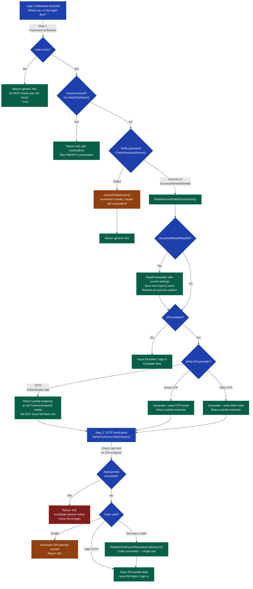

---

## PART 0 — Navigation & Context

```
ASP.NET Core Mastery
│
├── A. Host & Lifecycle         (4.001–4.010)
├── B. Configuration            (4.011–4.022)
├── C. Logging                  (4.023–4.033)
├── D. Dependency Injection     (4.034–4.048)
├── E. Middleware Pipeline      (4.049–4.063)
├── F. Routing                  (4.064–4.077)
├── G. Minimal APIs             (4.078–4.097)
├── H. MVC & Controllers        (4.098–4.122)
├── I. HTTP Fundamentals        (4.123–4.133)
│
└── J. Authentication           (4.134–4.153)
    ├── 4.134 — Authentication Architecture
    ├── 4.135 — Cookie Authentication
    ├── 4.136 — JWT Bearer Authentication
    ├── 4.137 — Generating JWT Access Tokens
    ├── 4.138 — Refresh Token Pattern
    ├── 4.139 — OAuth 2.0 Flow
    ├── 4.140 — OpenID Connect
    ├── 4.141 — External Login Providers
    ├── 4.142 — Identity: UserManager, RoleManager, IdentityDbContext
    ├── 4.143 — ★ Identity: Password Hashing, Lockout, Two-Factor  ◄ YOU ARE HERE
    ├── 4.144 — Identity: Custom User Store
    ├── 4.145 — API Key Authentication Handler
    ├── 4.146 — Certificate Authentication (mTLS)
    ├── 4.147 — Authentication Events
    ├── 4.148 — Multiple Authentication Schemes
    └── ...
```

### What you need before this

- [[4.142 — ASP.NET Core Identity: UserManager, RoleManager, and IdentityDbContext]] — `UserManager<TUser>` is the API surface for all hashing and lockout operations; you must understand its lifetime and how it wraps the underlying stores
- [[4.134 — Authentication Architecture: Schemes, Handlers, and the Middleware]] — Identity plugs into cookie and JWT authentication schemes; the middleware order affects when and how `ClaimsPrincipal` is set
- [[4.135 — Cookie Authentication: AddCookie, SignInAsync, and ClaimsPrincipal]] — `SignInManager.PasswordSignInAsync` ultimately calls `HttpContext.SignInAsync` to issue the auth cookie; the 2FA partial sign-in also uses a separate cookie
- [[4.211 — Data Protection API: IDataProtector, Purpose Strings, and Payloads]] — Identity uses the Data Protection API to encrypt the 2FA partial cookie and to protect email/phone verification tokens

### What this unlocks after

- [[4.144 — ASP.NET Core Identity: Custom User Store and IUserStore<T>]] — custom stores must implement `IUserLockoutStore<TUser>` and `IUserTwoFactorStore<TUser>` to support lockout and 2FA; understanding the contract here is prerequisite
- [[4.148 — Multiple Authentication Schemes: Parallel JWT + Cookie Selection]] — production APIs often issue JWTs after password+2FA verification; understanding the full credential flow leads directly to the token-issuance pattern
- [[4.218 — OWASP Top 10 Applied to ASP.NET Core APIs]] — brute force, credential stuffing, and account takeover map directly to lockout configuration and 2FA enforcement choices made here

### Why this topic matters at scale

At any meaningful traffic level, the password verification and 2FA flows are your primary defense against account takeover at scale — getting the `AccessFailedAsync` / `ResetAccessFailedCountAsync` pair wrong silently disables brute-force protection for every user on the platform, and choosing the wrong iteration count exposes every password hash in your database the moment a breach occurs.

---

## PART 1 — The Core Mental Model

### The Fundamental Rule

> **ASP.NET Core Identity's credential security is a three-layer system: `IPasswordHasher<TUser>` verifies whether the input matches the stored PBKDF2 hash, `UserManager<TUser>` enforces lockout policy around each verification attempt and is the only caller that should do so, and `SignInManager<TUser>` orchestrates the multi-step 2FA flow using a short-lived Data Protection–encrypted cookie to bridge the gap between password success and second-factor completion. The practical consequence is that any code path that verifies a password without calling `AccessFailedAsync` on failure and `ResetAccessFailedCountAsync` on success silently breaks brute-force protection for every account that path handles.**

### The Plain-Language Analogy

Picture a bank vault with a two-stage security system. The first stage is a combination lock (password hashing) — the teller doesn't know your combination; they check the lock's feedback. But the vault also has a manager (UserManager/lockout) who keeps a written log of how many failed attempts have been made, and after five failures he physically covers the lock with a steel plate for five minutes, regardless of whether the next person trying has the right combination. If you bypass the manager's log and go straight to the lock, someone can stand there all day guessing combinations — the steel plate never appears. The two-factor safe (2FA) works differently: even after you open the first lock, a second door remains shut until a timed code from your phone matches the vault's clock. The manager creates a temporary visitor badge (the `Identity.TwoFactorUserId` cookie) when you pass the first lock, so you can walk to the second door — but that badge expires quickly and only works at that second door.

The analogy holds for concurrent requests: if two logins hit simultaneously, the manager's log has a race condition. This is why distributed deployments with lockout need awareness of database-level row locking on the `AccessFailedCount` column — the last writer wins, potentially under-counting failures.

### The Taxonomy Diagram

```mermaid
graph TD
    classDef hashing fill:#2563eb,color:#fff,stroke:#1d4ed8
    classDef lockout fill:#7c3aed,color:#fff,stroke:#6d28d9
    classDef twofa fill:#059669,color:#fff,stroke:#047857
    classDef result fill:#d97706,color:#fff,stroke:#b45309
    classDef infra fill:#374151,color:#fff,stroke:#1f2937

    A["Identity Security Subsystem<br/>(UserManager + SignInManager)"]:::infra

    A --> B["Password Hashing"]:::hashing
    A --> C["Lockout"]:::lockout
    A --> D["Two-Factor Auth"]:::twofa

    B --> B1["IPasswordHasher&lt;TUser&gt;"]:::hashing
    B1 --> B2["HashPassword(user, plaintext)"]:::hashing
    B1 --> B3["VerifyHashedPassword()"]:::hashing
    B --> B4["PasswordHasherOptions"]:::hashing
    B4 --> B5["CompatibilityMode<br/>V2 (SHA1/1k) | V3 (SHA256/10k+)"]:::hashing
    B4 --> B6["IterationCount<br/>(default: 10,000)"]:::hashing
    B --> B7["PasswordVerificationResult"]:::result
    B7 --> B8["Failed"]:::result
    B7 --> B9["Success"]:::result
    B7 --> B10["SuccessRehashNeeded"]:::result

    C --> C1["LockoutOptions"]:::lockout
    C1 --> C2["MaxFailedAccessAttempts<br/>(default: 5)"]:::lockout
    C1 --> C3["DefaultLockoutTimeSpan<br/>(default: 5 min)"]:::lockout
    C1 --> C4["AllowedForNewUsers<br/>(default: true)"]:::lockout
    C --> C5["UserManager Methods"]:::lockout
    C5 --> C6["IsLockedOutAsync()"]:::lockout
    C5 --> C7["AccessFailedAsync()"]:::lockout
    C5 --> C8["ResetAccessFailedCountAsync()"]:::lockout
    C5 --> C9["SetLockoutEndDateAsync()"]:::lockout

    D --> D1["Token Providers"]:::twofa
    D1 --> D2["AuthenticatorTokenProvider<br/>TOTP — RFC 6238"]:::twofa
    D1 --> D3["EmailTokenProvider"]:::twofa
    D1 --> D4["PhoneNumberTokenProvider"]:::twofa
    D --> D5["UserManager 2FA Methods"]:::twofa
    D5 --> D6["GetAuthenticatorKeyAsync()"]:::twofa
    D5 --> D7["ResetAuthenticatorKeyAsync()"]:::twofa
    D5 --> D8["VerifyTwoFactorTokenAsync()"]:::twofa
    D5 --> D9["GenerateNewTwoFactorRecoveryCodesAsync()"]:::twofa
    D5 --> D10["RedeemTwoFactorRecoveryCodeAsync()"]:::twofa
    D --> D11["SignInManager 2FA Methods"]:::twofa
    D11 --> D12["PasswordSignInAsync() → SignInResult"]:::twofa
    D11 --> D13["CheckPasswordSignInAsync()"]:::twofa
    D11 --> D14["TwoFactorAuthenticatorSignInAsync()"]:::twofa
    D11 --> D15["GetTwoFactorAuthenticationUserAsync()"]:::twofa

    D --> D16["SignInResult"]:::result
    D16 --> D17[".Succeeded"]:::result
    D16 --> D18[".RequiresTwoFactor"]:::result
    D16 --> D19[".IsLockedOut"]:::result
    D16 --> D20[".IsNotAllowed"]:::result
```



---

## PART 2 — Deep Mechanics

### 2.1 — IPasswordHasher<TUser>: The PBKDF2 Engine

Password hashing is not middleware. It happens inside your endpoint handler (the login action), downstream of the authentication middleware. The authentication middleware runs the configured scheme handlers (cookie or JWT validation) — it does not verify passwords. Password verification is your endpoint's job, delegated to `UserManager`.

```
──► ExceptionHandler ──► HSTS ──► Routing ──► UseAuthentication ──► UseAuthorization ──► [LoginEndpoint]
                                                       │                                          │
                                              Validates existing             UserManager.CheckPasswordAsync()
                                              cookie/JWT (not               └── IPasswordHasher.VerifyHashedPassword()
                                              this login request)               └── PBKDF2-HMAC-SHA256 derivation
                                                                                    └── Constant-time compare
```

**V2 vs V3 hash format:**

Identity stores the hash as a Base64 string. The raw bytes reveal which version was used:

```
V2 format (CompatibilityMode.IdentityV2):
  byte[0]       = 0x00                   — format version marker
  byte[1-20]    = PBKDF2-HMAC-SHA1       — 160-bit key derivation
  iterations    = 1,000 (hardcoded)
  salt          = 16 bytes (random)
  output        = 32 bytes subkey
  Total Base64  ≈ 68 characters

V3 format (CompatibilityMode.IdentityV3, the default):
  byte[0]       = 0x01                   — format version marker
  byte[1-4]     = KeyDerivationPrf       — 2 = HMACSHA256 (uint, big-endian)
  byte[5-8]     = iteration count        — e.g., 10,000 (uint, big-endian)
  byte[9-12]    = salt length            — 16 (uint, big-endian)
  byte[13-28]   = 16-byte random salt
  byte[29-60]   = 32-byte derived key
  Total Base64  ≈ 84 characters
```

> [!WARNING] The **default iteration count of 10,000** is significantly below OWASP's 2023 recommendation of **600,000 iterations for PBKDF2-HMAC-SHA256**. On modern hardware, 10,000 iterations can be verified in under 5ms — a GPU cluster can try billions of password candidates per second against a stolen hash file. Configure `PasswordHasherOptions.IterationCount` to at minimum 100,000 for any production system handling real user credentials.

**ASP.NET Core internally (approximate) — PasswordHasher<TUser>.HashPassword:**

```csharp
// Located: Microsoft.AspNetCore.Identity / PasswordHasher.cs
// Called by: UserManager.CreateAsync, UserManager.ChangePasswordAsync

public string HashPassword(TUser user, string password)
{
    // 1. Generate 128-bit cryptographically random salt
    byte[] salt = RandomNumberGenerator.GetBytes(SaltSize); // 16 bytes

    // 2. Derive key via PBKDF2
    byte[] subkey = KeyDerivation.Pbkdf2(
        password: password,
        salt: salt,
        prf: KeyDerivationPrf.HMACSHA256,     // V3 default
        iterationCount: _iterationCount,       // PasswordHasherOptions.IterationCount
        numBytesRequested: SubkeyLength        // 32 bytes
    );

    // 3. Build output buffer: [version | prf | iterations | saltLen | salt | subkey]
    byte[] outputBytes = new byte[13 + salt.Length + subkey.Length];
    outputBytes[0] = 0x01; // V3 marker
    // ... write prf, iterationCount, saltLen as big-endian uints
    Buffer.BlockCopy(salt, 0, outputBytes, 13, salt.Length);
    Buffer.BlockCopy(subkey, 0, outputBytes, 13 + SaltSize, subkey.Length);

    return Convert.ToBase64String(outputBytes);
    // Cost: ~1 allocation (outputBytes) + PBKDF2 computation (~5–50ms depending on iteration count)
}
```

**PasswordVerificationResult — the three outcomes:**

```csharp
// VerifyHashedPassword returns one of three values:

// Failed (0): derived key doesn't match stored key
//   → caller MUST call AccessFailedAsync(user)
//   → caller MUST NOT reveal whether username or password was wrong

// Success (1): derived key matches, algorithm/params match current settings
//   → caller MUST call ResetAccessFailedCountAsync(user)

// SuccessRehashNeeded (2): derived key matches but hash uses old params
//   → happens when: V2 hash on a V3 system, or when IterationCount was increased
//   → caller MUST rehash with current settings and save to the store
//   → STILL call ResetAccessFailedCountAsync(user)
```

**HTTP wire format:**

```http
// Request:
POST /api/auth/login HTTP/1.1
Content-Type: application/json

{"email":"alice@fintechpay.io","password":"Tr0ub4dor&3"}

// Response — correct credentials, no 2FA:
HTTP/1.1 200 OK
Content-Type: application/json

{"accessToken":"eyJhbGciOiJSUzI1NiIsInR5cCI6IkpXVCJ9...","expiresIn":3600}

// Response — wrong credentials (after AccessFailedAsync, 3 of 5 attempts used):
HTTP/1.1 401 Unauthorized
Content-Type: application/problem+json

{"type":"https://tools.ietf.org/html/rfc9110#section-15.5.2","title":"Authentication failed","status":401,"detail":"Invalid credentials."}

// Response — account locked (IsLockedOutAsync returned true):
HTTP/1.1 401 Unauthorized
Content-Type: application/problem+json

{"type":"https://tools.ietf.org/html/rfc9110#section-15.5.2","title":"Account locked","status":401,"detail":"Account is temporarily locked. Try again after 2026-06-10T15:30:00Z.","lockoutEnd":"2026-06-10T15:30:00Z"}
```

**Runtime cost:** One PBKDF2 derivation per login attempt. At 10,000 iterations: ~3–8ms on modern hardware (CPU-bound, single-threaded). At 100,000 iterations: ~30–80ms. This is intentional — it makes password cracking expensive. It also means a login endpoint can become a CPU bottleneck at scale; dedicated auth microservices with horizontal scaling are common at >500 logins/second.

---

### 2.2 — Lockout Mechanics: The AccessFailed Counter

Lockout state lives in two columns of the `AspNetUsers` table: `AccessFailedCount` (int) and `LockoutEnd` (DateTimeOffset?). The lockout subsystem is driven entirely by `UserManager` — there is no lockout middleware.

```
Login Request Arrives
        │
        ▼
UserManager.FindByEmailAsync(email)         ← one DB round-trip
        │
        ├── null → return generic 401       ← don't reveal "user not found"
        ▼
UserManager.IsLockedOutAsync(user)          ← checks LockoutEnd > UtcNow
        │                                   ← one DB round-trip if LockoutEnabled=true
        ├── true  → return 401 + LockoutEnd timestamp
        ▼
IPasswordHasher.VerifyHashedPassword()      ← CPU-bound PBKDF2 (~5–80ms)
        │
        ├── Failed → UserManager.AccessFailedAsync(user)
        │                │
        │                ├── Increments AccessFailedCount
        │                └── If count >= MaxFailedAccessAttempts:
        │                    SetLockoutEndDate(UtcNow + DefaultLockoutTimeSpan)
        │            → return generic 401
        │
        └── Success/SuccessRehashNeeded → UserManager.ResetAccessFailedCountAsync(user)
                    │                                   ← Resets AccessFailedCount to 0
                    │                                   ← Does NOT clear LockoutEnd
                    └── Continue to 2FA check or token issuance
```

**ASP.NET Core internally (approximate) — UserManager.AccessFailedAsync:**

```csharp
// Located: Microsoft.AspNetCore.Identity / UserManager.cs
public async virtual Task<IdentityResult> AccessFailedAsync(TUser user)
{
    var store = GetLockoutStore(); // IUserLockoutStore<TUser>

    // Increment the count — this is NOT atomic at the DB level by default
    // Race condition exists in multi-instance deployments
    var count = await store.IncrementAccessFailedCountAsync(user, CancellationToken);

    if (count >= Options.Lockout.MaxFailedAccessAttempts)
    {
        // Set lockout end date
        await store.SetLockoutEndDateAsync(
            user,
            DateTimeOffset.UtcNow.Add(Options.Lockout.DefaultLockoutTimeSpan),
            CancellationToken);
        // Reset count so attempts AFTER lockout expiry are tracked fresh
        await store.ResetAccessFailedCountAsync(user, CancellationToken);
    }

    return await UpdateUserAsync(user); // saves to DB — one round-trip
    // Total cost: 2 DB round-trips (increment + update user)
}
```

> [!DANGER] **Race condition in distributed deployments:** `AccessFailedAsync` reads the current count, increments it in memory, then writes. If two failed login attempts arrive simultaneously across two pods, both read count=3, both write count=4 — the actual failed count becomes 4 instead of 5, and the account never locks. This is EF Core's optimistic concurrency by default. For high-security applications (banking, healthcare), use a `ROWVERSION` concurrency token on `AspNetUsers` or serialize lockout checks per user via a distributed lock.

**Permanent lockout:**

```csharp
// Permanently lock a compromised or suspended account
await _userManager.SetLockoutEnabledAsync(user, true);
await _userManager.SetLockoutEndDateAsync(user, DateTimeOffset.MaxValue);
// HTTP consequence: every login attempt returns 401, lockoutEnd: "9999-12-31T..."
// To unlock: SetLockoutEndDateAsync(user, null)
```

**Runtime cost:** 2–3 database round-trips per login attempt (find user, check lockout, increment or reset). In EF Core with connection pooling, ~1–5ms latency in addition to PBKDF2 computation.

---

### 2.3 — Two-Factor Authentication Architecture (TOTP)

TOTP (Time-based One-Time Password, RFC 6238) uses a shared secret between the server and the authenticator app. Every 30 seconds, both sides compute the same 6-digit code from `HMAC-SHA1(secret, floor(unixTime / 30))` and truncate to 6 digits. The server accepts ±1 time step (90-second validity window) to accommodate clock drift.

**The 2FA state machine:**

```
Step 1 — Credential Verification
──────────────────────────────────────────────────────────────────────────────
POST /api/auth/login
         │
         ▼
SignInManager.PasswordSignInAsync()   ← handles lockout + verify + 2FA check
     ├── SignInResult.IsLockedOut     → 401
     ├── SignInResult.Failed          → 401 (AccessFailedAsync already called)
     └── SignInResult.RequiresTwoFactor
              │
              ├── [Cookie-based app] Sets Identity.TwoFactorUserId cookie
              │   HTTP/1.1 302 Found
              │   Location: /account/two-factor
              │   Set-Cookie: Identity.TwoFactorUserId=<DataProtected>; HttpOnly; Secure; SameSite=Strict
              │
              └── [JWT API] Return partial response with short-lived 2FA session token

Step 2 — Second Factor Verification
──────────────────────────────────────────────────────────────────────────────
POST /api/auth/verify-2fa
         │
         ▼
SignInManager.GetTwoFactorAuthenticationUserAsync()
    └── Reads Identity.TwoFactorUserId cookie
    └── Decrypts userId via IDataProtector
    └── Returns the pending user
         │
         ▼
UserManager.VerifyTwoFactorTokenAsync(user, providerName, code)
    └── AuthenticatorTokenProvider.ValidateAsync()
        └── GetAuthenticatorKeyAsync() → Base32-encoded shared secret from DB
        └── TotpHelper.Compute(secret, timeStep - 1)  ← check previous window
        └── TotpHelper.Compute(secret, timeStep)      ← check current window
        └── TotpHelper.Compute(secret, timeStep + 1)  ← check next window
        └── Constant-time compare with provided code
         │
         ├── Invalid → return 401
         └── Valid → full sign-in (issue JWT or auth cookie)
                   → Identity.TwoFactorUserId cookie is deleted
```

**Authenticator key storage:**

The TOTP shared secret is stored in `AspNetUserTokens`:

```
AspNetUserTokens
├── UserId:       <guid>
├── LoginProvider: "[AspNetUserStore]"
├── Name:          "AuthenticatorKey"
└── Value:         "JBSWY3DPEB3W64TMMQQQ..."   ← Base32-encoded random bytes
```

The QR code URI format (shown to user during enrollment):

```
otpauth://totp/FintechPay:{email}?secret={base32Secret}&issuer=FintechPay&digits=6&algorithm=SHA1&period=30
```

> [!NOTE] `UserManager.GetAuthenticatorKeyAsync(user)` returns `null` if no key has been generated. Call `UserManager.ResetAuthenticatorKeyAsync(user)` to generate the initial key (this also updates the security stamp, invalidating existing sessions — intentional).

**Recovery codes:**

Recovery codes allow account access when the authenticator app is unavailable (lost phone, app deleted). Identity stores them **hashed** (SHA256, unkeyed) in `AspNetUserTokens`, one record per batch, concatenated with `;`:

```
AspNetUserTokens
├── LoginProvider: "[AspNetUserStore]"
├── Name:          "RecoveryCodes"
└── Value:         "<sha256(code1)>;<sha256(code2)>;..."   ← up to 10 codes
```

`RedeemTwoFactorRecoveryCodeAsync(user, code)` hashes the input, finds the matching stored hash, removes it from the list, and saves. Each code is single-use.

**HTTP wire format — 2FA required response (JWT API):**

```http
// Step 1 response: credentials valid but 2FA required
HTTP/1.1 200 OK
Content-Type: application/json

{"requiresTwoFactor":true,"twoFactorSessionToken":"<short-lived-signed-token>"}

// Step 2 request:
POST /api/auth/verify-2fa HTTP/1.1
Content-Type: application/json

{"twoFactorSessionToken":"<token-from-step-1>","code":"847291"}

// Step 2 response: full access token issued
HTTP/1.1 200 OK
Content-Type: application/json

{"accessToken":"eyJhbGciOiJSUzI1NiIsInR5cCI6IkpXVCJ9...","expiresIn":3600,"refreshToken":"..."}
```

**Runtime cost:** TOTP verification is ~microseconds (pure in-memory HMAC computation). The bottleneck is the DB reads (fetch authenticator key from `AspNetUserTokens`, update recovery codes on redemption). One extra round-trip compared to password-only auth.

---

### 2.4 — The SecurityStamp: Session Invalidation After Security Events

`SecurityStamp` is a GUID column in `AspNetUsers` that changes whenever a security-sensitive operation occurs. It acts as a "generation counter" — all existing sessions that were issued with an older security stamp are invalidated.

```
SecurityStamp changes on:
  ├── UserManager.ChangePasswordAsync()
  ├── UserManager.RemovePasswordAsync()
  ├── UserManager.AddLoginAsync() / RemoveLoginAsync()
  ├── UserManager.SetTwoFactorEnabledAsync()
  ├── UserManager.ResetAuthenticatorKeyAsync()
  ├── UserManager.GenerateNewTwoFactorRecoveryCodesAsync()
  └── UserManager.UpdateSecurityStampAsync()   ← explicit invalidation

SecurityStamp is validated by:
  └── SecurityStampValidator<TUser>
      └── Runs every CookieAuthenticationOptions.ValidationInterval (default: 30 min)
      └── If stamp in cookie ≠ stamp in DB → SignOutAsync() → 401/redirect to login
```

**ASP.NET Core internally (approximate) — SecurityStampValidator:**

```csharp
// Called on every cookie authentication event per ValidationInterval
public async virtual Task ValidateAsync(CookieValidatePrincipalContext context)
{
    var user = await VerifySecurityStamp(context.Principal);
    if (user == null)
    {
        // Stamp mismatch — revoke the cookie
        context.RejectPrincipal();
        await context.HttpContext.SignOutAsync(IdentityConstants.ApplicationScheme);
        // HTTP consequence: next request gets 401 or redirect to /login
    }
    else
    {
        // Refresh the principal with current claims from DB
        context.ReplacePrincipal(await ClaimsFactory.CreateAsync(user));
        context.ShouldRenew = true;
    }
}
```

> [!IMPORTANT] **JWT APIs do not benefit from SecurityStamp validation** by default. JWT tokens are self-contained and stateless — changing the security stamp does not invalidate existing tokens unless you build a token revocation check (database lookup, Redis blacklist, or short token lifetime). This is a fundamental trade-off of JWT vs cookie auth: cookies can be revoked within one `ValidationInterval`, JWTs cannot without additional infrastructure.

---

## PART 3 — Production Code Patterns

### Pattern 1 — The Complete JWT Login Gate with Lockout (FintechPay Auth Service)

```csharp
// AuthController.cs — FintechPay payment API authentication endpoint
// Uses UserManager directly (not SignInManager) because this is a JWT API, not cookie-based
// SignInManager.PasswordSignInAsync creates cookies; wrong tool for APIs

[ApiController]
[Route("api/auth")]
public class AuthController : ControllerBase
{
    private readonly UserManager<PaymentUser> _userManager;
    private readonly IJwtTokenService _jwtService;
    private readonly ILogger<AuthController> _logger;

    [HttpPost("login")]
    public async Task<IActionResult> Login(
        [FromBody] LoginRequest request,
        CancellationToken ct)
    {
        // Step 1: Find user — use constant-time path even for non-existent users
        // to prevent timing attacks that reveal whether an email exists
        var user = await _userManager.FindByEmailAsync(request.Email);

        // Step 2: Check lockout BEFORE password verification
        // Why before: avoids wasting PBKDF2 computation on locked accounts
        // AND avoids incrementing the failed count against an already-locked account
        if (user == null || await _userManager.IsLockedOutAsync(user))
        {
            // Return the same error for "user not found" and "account locked"
            // to prevent username enumeration. Log separately for monitoring.
            _logger.LogWarning("Login attempt for {Email}: user not found or locked", request.Email);
            return Unauthorized(new ProblemDetails
            {
                Title = "Authentication failed",
                Detail = "Invalid credentials or account temporarily unavailable.",
                Status = StatusCodes.Status401Unauthorized
            });
        }

        // Step 3: Verify password
        var result = await _userManager.CheckPasswordAsync(user, request.Password);

        if (!result)
        {
            // CRITICAL: Must call AccessFailedAsync; CheckPasswordAsync does NOT do this.
            // This is the most common lockout bug in JWT APIs.
            await _userManager.AccessFailedAsync(user);

            _logger.LogWarning("Failed login attempt for UserId={UserId}", user.Id);
            return Unauthorized(new ProblemDetails
            {
                Title = "Authentication failed",
                Detail = "Invalid credentials.",
                Status = StatusCodes.Status401Unauthorized
            });
        }

        // Step 4: Reset failed count on success
        // CRITICAL: Must call this; CheckPasswordAsync does NOT do this either.
        await _userManager.ResetAccessFailedCountAsync(user);

        // Step 5: Check if 2FA is required before issuing token
        if (await _userManager.GetTwoFactorEnabledAsync(user))
        {
            // Issue a short-lived, signed 2FA session token
            // Don't issue the full JWT yet — 2FA hasn't been verified
            var twoFactorToken = _jwtService.IssueTwoFactorSessionToken(user.Id, expiresIn: TimeSpan.FromMinutes(5));
            return Ok(new { RequiresTwoFactor = true, TwoFactorSessionToken = twoFactorToken });
        }

        // Step 6: All checks passed — issue full access token
        var accessToken = await _jwtService.IssueAccessTokenAsync(user);
        return Ok(new { AccessToken = accessToken, ExpiresIn = 3600 });
    }
}
```

```http
// HTTP wire format — successful login requiring 2FA:
POST /api/auth/login HTTP/1.1
Content-Type: application/json

{"email":"alice@fintechpay.io","password":"Tr0ub4dor&3"}

HTTP/1.1 200 OK
Content-Type: application/json

{"requiresTwoFactor":true,"twoFactorSessionToken":"eyJhbGciOiJIUzI1NiJ9..."}
```

---

### Pattern 2 — TOTP Enrollment Flow (PatientPortal Healthcare)

```csharp
// TwoFactorSetupController.cs — PatientPortal patient authentication
// Enrolling the authenticator app for a patient account

[ApiController]
[Route("api/security/2fa")]
[Authorize] // Must be authenticated (password verified) before enrolling 2FA
public class TwoFactorSetupController : ControllerBase
{
    private readonly UserManager<PatientUser> _userManager;
    private readonly UrlEncoder _urlEncoder;

    [HttpGet("authenticator-setup")]
    public async Task<IActionResult> GetAuthenticatorSetup()
    {
        var user = await _userManager.GetUserAsync(User);
        if (user == null) return Unauthorized();

        // GetAuthenticatorKeyAsync returns null if no key exists yet
        var key = await _userManager.GetAuthenticatorKeyAsync(user);
        if (key == null)
        {
            // ResetAuthenticatorKeyAsync generates a new key AND updates SecurityStamp
            // Updating SecurityStamp invalidates all existing sessions — good security hygiene
            await _userManager.ResetAuthenticatorKeyAsync(user);
            key = await _userManager.GetAuthenticatorKeyAsync(user);
        }

        // Build the standard otpauth URI for QR code generation
        // The client renders this as a QR code for the authenticator app to scan
        var email = _urlEncoder.Encode(await _userManager.GetEmailAsync(user));
        var issuer = _urlEncoder.Encode("PatientPortal");
        var authenticatorUri = $"otpauth://totp/{issuer}:{email}?secret={key}&issuer={issuer}&digits=6&period=30";

        return Ok(new
        {
            SharedKey = FormatKey(key),      // Human-readable: JBSW Y3DP EB3W 64TM
            AuthenticatorUri = authenticatorUri
        });
    }

    [HttpPost("authenticator-verify")]
    public async Task<IActionResult> VerifyAndEnable([FromBody] VerifyAuthenticatorRequest request)
    {
        var user = await _userManager.GetUserAsync(User);
        if (user == null) return Unauthorized();

        // Verify the code from the authenticator app BEFORE enabling 2FA
        // Never enable 2FA without this step — the patient might have scanned wrong key
        var isValid = await _userManager.VerifyTwoFactorTokenAsync(
            user,
            _userManager.Options.Tokens.AuthenticatorTokenProvider,
            request.Code.Replace(" ", "").Replace("-", ""));

        if (!isValid)
        {
            return BadRequest(new ProblemDetails
            {
                Title = "Verification failed",
                Detail = "The code from your authenticator app is incorrect.",
                Status = StatusCodes.Status400BadRequest
            });
        }

        await _userManager.SetTwoFactorEnabledAsync(user, true);

        // Always generate recovery codes at enrollment time
        var recoveryCodes = await _userManager.GenerateNewTwoFactorRecoveryCodesAsync(user, count: 8);

        _logger.LogInformation("2FA enabled for PatientId={PatientId}", user.Id);

        // Show recovery codes ONCE — they are not retrievable after this response
        return Ok(new
        {
            Message = "Two-factor authentication enabled.",
            RecoveryCodes = recoveryCodes  // Client must display and prompt user to save these
        });
    }

    private static string FormatKey(string unformattedKey)
    {
        // Format as groups of 4 for readability: "JBSW Y3DP EB3W 64TM"
        return string.Join(" ", Enumerable.Range(0, unformattedKey.Length / 4)
            .Select(i => unformattedKey.Substring(i * 4, Math.Min(4, unformattedKey.Length - i * 4))));
    }
}
```

---

### Pattern 3 — The TOTP Verification Step (Order Management Admin)

```csharp
// AdminAuthController.cs — OrderManagement admin portal
// Second-factor verification after password success (JWT API pattern)

[ApiController]
[Route("api/admin/auth")]
public class AdminTwoFactorController : ControllerBase
{
    private readonly UserManager<AdminUser> _userManager;
    private readonly IJwtTokenService _jwtService;
    private readonly IMemoryCache _twoFactorAttemptCache;

    [HttpPost("verify-2fa")]
    public async Task<IActionResult> VerifyTwoFactor([FromBody] TwoFactorRequest request)
    {
        // Validate the short-lived 2FA session token from step 1
        if (!_jwtService.TryValidateTwoFactorSessionToken(request.TwoFactorSessionToken, out var userId))
        {
            return Unauthorized(new ProblemDetails
            {
                Title = "Session expired",
                Detail = "Two-factor session has expired. Please log in again.",
                Status = StatusCodes.Status401Unauthorized
            });
        }

        var user = await _userManager.FindByIdAsync(userId);
        if (user == null) return Unauthorized();

        // Guard against TOTP brute force — TOTP has only 1,000,000 possible codes
        // Check attempt count separately from password lockout
        var attemptKey = $"2fa-attempts:{userId}";
        var attempts = _twoFactorAttemptCache.GetOrCreate(attemptKey, entry =>
        {
            entry.AbsoluteExpirationRelativeToNow = TimeSpan.FromMinutes(10);
            return 0;
        });

        if (attempts >= 5)
        {
            return StatusCode(429, new ProblemDetails
            {
                Title = "Too many attempts",
                Detail = "Too many 2FA verification attempts. Please wait.",
                Status = StatusCodes.Status429TooManyRequests
            });
        }

        // Support both authenticator app codes and recovery codes
        bool isValid;
        bool usedRecoveryCode = false;

        if (request.IsRecoveryCode)
        {
            var redemptionResult = await _userManager.RedeemTwoFactorRecoveryCodeAsync(user, request.Code);
            isValid = redemptionResult.Succeeded;
            usedRecoveryCode = isValid;
        }
        else
        {
            isValid = await _userManager.VerifyTwoFactorTokenAsync(
                user,
                _userManager.Options.Tokens.AuthenticatorTokenProvider,
                request.Code);
        }

        if (!isValid)
        {
            _twoFactorAttemptCache.Set(attemptKey, attempts + 1,
                TimeSpan.FromMinutes(10));
            return Unauthorized(new ProblemDetails
            {
                Title = "Invalid code",
                Detail = "The verification code is incorrect.",
                Status = StatusCodes.Status401Unauthorized
            });
        }

        // Clear attempt counter on success
        _twoFactorAttemptCache.Remove(attemptKey);

        if (usedRecoveryCode)
        {
            _logger.LogWarning("AdminId={AdminId} used a recovery code — may have lost authenticator device", user.Id);
        }

        var accessToken = await _jwtService.IssueAccessTokenAsync(user, requireTwoFactor: true);
        return Ok(new { AccessToken = accessToken, ExpiresIn = 3600 });
    }
}
```

---

### Pattern 4 — Custom IPasswordHasher for Legacy Migration (Bcrypt → PBKDF2)

```csharp
// LegacyBcryptPasswordHasher.cs — migrating from a legacy system that used bcrypt
// Used when acquiring another company's user database with bcrypt-hashed passwords

// ⚠️ WRONG: Replacing IPasswordHasher<AppUser> entirely causes all PBKDF2 hashes to fail
// services.AddSingleton<IPasswordHasher<AppUser>, BCryptPasswordHasher<AppUser>>();

// ✅ CORRECT: Adapter that falls back to bcrypt for legacy hashes, PBKDF2 for new ones

public class MigratingPasswordHasher<TUser> : IPasswordHasher<TUser> where TUser : class
{
    private readonly PasswordHasher<TUser> _identityHasher;

    public MigratingPasswordHasher()
    {
        // Configure the identity hasher with production-grade iteration count
        _identityHasher = new PasswordHasher<TUser>(Options.Create(
            new PasswordHasherOptions { IterationCount = 100_000 }));
    }

    public string HashPassword(TUser user, string password)
    {
        // New passwords always use the current (PBKDF2) algorithm
        return _identityHasher.HashPassword(user, password);
    }

    public PasswordVerificationResult VerifyHashedPassword(
        TUser user, string hashedPassword, string providedPassword)
    {
        // Detect bcrypt hash: they start with "$2" ($2a, $2b, $2y variants)
        if (hashedPassword.StartsWith("$2"))
        {
            // Verify using bcrypt
            bool bcryptValid = BCrypt.Net.BCrypt.Verify(providedPassword, hashedPassword);

            if (!bcryptValid) return PasswordVerificationResult.Failed;

            // Return SuccessRehashNeeded — caller will upgrade to PBKDF2 on next save
            // This is the transparent migration: user logs in once, hash silently upgrades
            return PasswordVerificationResult.SuccessRehashNeeded;
        }

        // Standard PBKDF2 hash — delegate to Identity's hasher
        return _identityHasher.VerifyHashedPassword(user, hashedPassword, providedPassword);
    }
}

// Registration in Program.cs:
builder.Services.AddSingleton<IPasswordHasher<AppUser>, MigratingPasswordHasher<AppUser>>();
```

```csharp
// The rehash-on-success handler — call this after successful VerifyHashedPassword
// when the result is SuccessRehashNeeded

private async Task UpgradeHashIfNeededAsync(AppUser user, string providedPassword,
    PasswordVerificationResult verificationResult)
{
    if (verificationResult == PasswordVerificationResult.SuccessRehashNeeded)
    {
        // Generate new PBKDF2 hash using the current settings (100k iterations)
        var newHash = _passwordHasher.HashPassword(user, providedPassword);
        user.PasswordHash = newHash;
        await _userManager.UpdateAsync(user);
        // HTTP consequence: transparent to the user — same response, hash upgraded in background
        _logger.LogInformation("Password hash upgraded for UserId={UserId}", user.Id);
    }
}
```

---

### Pattern 5 — Forced 2FA Policy for Privileged Users (Financial Admin Portal)

```csharp
// RequireTwoFactorAttribute.cs — enforce 2FA completion for sensitive endpoints
// Used in a financial reporting portal where admin users MUST have 2FA enabled

public class RequiresTwoFactorPolicy : IAuthorizationRequirement { }

public class RequiresTwoFactorHandler : AuthorizationHandler<RequiresTwoFactorPolicy>
{
    private readonly UserManager<FinancialAdminUser> _userManager;

    protected override async Task HandleRequirementAsync(
        AuthorizationHandlerContext context,
        RequiresTwoFactorPolicy requirement)
    {
        var userId = context.User.FindFirstValue(ClaimTypes.NameIdentifier);
        if (userId == null) { context.Fail(); return; }

        var user = await _userManager.FindByIdAsync(userId);
        if (user == null) { context.Fail(); return; }

        // Check that 2FA is enabled on the account
        if (!await _userManager.GetTwoFactorEnabledAsync(user))
        {
            context.Fail(new AuthorizationFailureReason(this,
                "Two-factor authentication is required for this resource."));
            return;
        }

        // Check that the current token was issued after 2FA verification
        // Look for a custom claim that the JWT service sets after full 2FA sign-in
        var twoFactorVerified = context.User.HasClaim("amr", "mfa");
        if (!twoFactorVerified)
        {
            context.Fail(new AuthorizationFailureReason(this,
                "This token was not issued after two-factor verification."));
            return;
        }

        context.Succeed(requirement);
    }
}

// Registration:
builder.Services.AddAuthorizationBuilder()
    .AddPolicy("RequiresTwoFactor", policy =>
        policy.Requirements.Add(new RequiresTwoFactorPolicy()));

builder.Services.AddScoped<IAuthorizationHandler, RequiresTwoFactorHandler>();

// Usage on sensitive endpoints:
[Authorize(Policy = "RequiresTwoFactor")]
[HttpGet("api/financial-reports/quarterly")]
public async Task<IActionResult> GetQuarterlyReport() { ... }
```

```http
// HTTP consequence when 2FA not completed but trying to access protected endpoint:
GET /api/financial-reports/quarterly HTTP/1.1
Authorization: Bearer <token-issued-without-2fa>

HTTP/1.1 403 Forbidden
Content-Type: application/problem+json

{"type":"https://httpstatuses.com/403","title":"Forbidden","status":403,"detail":"Two-factor authentication is required for this resource."}
```

---

### Pattern 6 — SecurityStamp-Based Session Invalidation After Security Events

```csharp
// SecurityEventService.cs — logistics shipment tracker admin
// Immediately invalidate all active sessions after suspicious activity

public class SecurityEventService
{
    private readonly UserManager<LogisticsAdminUser> _userManager;
    private readonly ILogger<SecurityEventService> _logger;

    // Called when: suspicious login from new country, failed 2FA burst, admin escalation
    public async Task InvalidateAllSessionsAsync(string userId, string reason)
    {
        var user = await _userManager.FindByIdAsync(userId);
        if (user == null) return;

        // Rotating the security stamp invalidates:
        //   - All cookie-based sessions (within next ValidationInterval, ~30min)
        //   - All DataProtector-based tokens (email verification, password reset)
        // Does NOT invalidate: JWTs (they are stateless — need separate revocation)
        await _userManager.UpdateSecurityStampAsync(user);

        _logger.LogWarning(
            "Security stamp rotated for UserId={UserId}. Reason={Reason}. " +
            "All cookie sessions will be invalidated within {ValidationInterval}",
            userId, reason, TimeSpan.FromMinutes(30));
    }

    // Called after a password change — ensures all other sessions are terminated
    public async Task OnPasswordChangedAsync(LogisticsAdminUser user)
    {
        // ChangePasswordAsync internally calls UpdateSecurityStamp
        // But if you're calling UpdatePasswordHash directly on the store,
        // you must manually rotate the stamp
        var result = await _userManager.ChangePasswordAsync(
            user, currentPassword: ..., newPassword: ...);

        if (result.Succeeded)
        {
            // Also reset 2FA if this was triggered by a breach response
            await _userManager.ResetAuthenticatorKeyAsync(user); // forces re-enrollment
            _logger.LogInformation("Password changed and 2FA reset for UserId={UserId}", user.Id);
        }
    }
}
```

---

## PART 4 — Gotchas & Anti-Patterns

### Gotcha 1: Forgetting ResetAccessFailedCountAsync When Using UserManager Directly

Developers who reach for `UserManager.CheckPasswordAsync` instead of `SignInManager.PasswordSignInAsync` don't realize that `CheckPasswordAsync` is _just_ a password check — it touches neither the lockout counter on failure nor resets it on success. Over time, every user who logs in through a JWT endpoint gradually accumulates failed-count residue that eventually locks them out even though they've never actually failed.

```csharp
// ⚠️ WRONG: CheckPasswordAsync does nothing to lockout counters
var isValid = await _userManager.CheckPasswordAsync(user, password);
if (!isValid) return Unauthorized();
// Generates valid JWT
var token = _jwtService.Issue(user);
return Ok(token);

// HTTP consequence (wrong path):
// After a few failed attempts (maybe during a brief network issue),
// user logs in successfully but AccessFailedCount is never reset.
// Next time they fail once, count hits 5 and they're locked out.
// HTTP/1.1 401 Unauthorized  ← even with correct password
// {"detail":"Account temporarily unavailable."}  ← user has no idea why
```

```csharp
// ✅ CORRECT: Explicitly bracket password verification with lockout calls
if (!await _userManager.CheckPasswordAsync(user, password))
{
    await _userManager.AccessFailedAsync(user);  // increment + possibly lock
    return Unauthorized(...);
}
await _userManager.ResetAccessFailedCountAsync(user);  // reset on success

// HTTP consequence (correct path):
// Counter resets to 0 after every successful login.
// Users only get locked after MaxFailedAccessAttempts consecutive failures.
```

```
// WHY: CheckPasswordAsync is documented as "check only." The AccessFailed/ResetAccessFailed
// calls are contracts that only UserManager understands — they must be called explicitly
// by any code that bypasses SignInManager. SignInManager.PasswordSignInAsync handles
// these internally; CheckPasswordAsync deliberately does not.
```

---

### Gotcha 2: Using SignInManager.PasswordSignInAsync in a JWT API

APIs that issue JWTs have no use for cookies. `PasswordSignInAsync` calls `HttpContext.SignInAsync` internally, which creates the `Identity.ApplicationScheme` cookie and writes `Set-Cookie` response headers — all of which are silently ignored by API clients. You pay the cookie creation overhead, you write unnecessary headers, and you confuse monitoring tools.

```csharp
// ⚠️ WRONG: PasswordSignInAsync creates cookies — wrong for JSON APIs
[HttpPost("login")]
public async Task<IActionResult> Login(LoginRequest req)
{
    var result = await _signInManager.PasswordSignInAsync(
        req.Email, req.Password, isPersistent: false, lockoutOnFailure: true);

    if (!result.Succeeded) return Unauthorized();
    var token = _jwtService.Issue(/* ... */);
    return Ok(new { AccessToken = token });
}

// HTTP consequence (wrong path):
// HTTP/1.1 200 OK
// Set-Cookie: .AspNetCore.Identity.Application=<encrypted ticket>; HttpOnly; Secure
// Content-Type: application/json
// {"accessToken":"eyJ..."}
// ← Unnecessary cookie in response, client ignores it, security scanning flags it
```

```csharp
// ✅ CORRECT: CheckPasswordSignInAsync for JWT flows
public async Task<IActionResult> Login(LoginRequest req)
{
    var user = await _userManager.FindByEmailAsync(req.Email);
    if (user == null || await _userManager.IsLockedOutAsync(user)) return Unauthorized(...);

    var result = await _signInManager.CheckPasswordSignInAsync(
        user, req.Password, lockoutOnFailure: true);
    // CheckPasswordSignInAsync DOES handle AccessFailed/ResetAccessFailed internally
    // It does NOT create cookies.

    if (!result.Succeeded) return Unauthorized(...);
    var token = await _jwtService.IssueAsync(user);
    return Ok(new { AccessToken = token });
}

// HTTP consequence (correct path):
// HTTP/1.1 200 OK
// Content-Type: application/json
// {"accessToken":"eyJ..."}  ← clean response, no unwanted cookies
```

```
// WHY: SignInManager has two verification methods. PasswordSignInAsync is for
// cookie-based apps (MVC, Razor Pages) — it verifies AND signs in. CheckPasswordSignInAsync
// is for token-based flows — it verifies (including lockout) without writing cookies.
// Note: CheckPasswordSignInAsync still requires the user object to be fetched first.
```

---

### Gotcha 3: Not Rotating the Authenticator Key After a Security Breach

When a user's account is compromised (credentials found in a breach, suspicious login detected), developers typically force a password reset. But they don't touch the TOTP authenticator key. If an attacker previously enrolled their own authenticator app (account takeover), the old key is still valid even after the password is changed.

```csharp
// ⚠️ WRONG: Password reset without resetting 2FA
public async Task HandleBreachAsync(string userId)
{
    var user = await _userManager.FindByIdAsync(userId);
    await _userManager.RemovePasswordAsync(user);
    await _userManager.AddPasswordAsync(user, GenerateTemporaryPassword());
    // SecurityStamp is updated, all cookies invalidated — but...
    // The TOTP secret in AspNetUserTokens is unchanged.
    // If the attacker enrolled their phone, they still have valid 2FA access.
}

// HTTP consequence (wrong path):
// Attacker still passes 2FA with their authenticator app.
// HTTP/1.1 200 OK ← attacker receives valid JWT
```

```csharp
// ✅ CORRECT: Reset authenticator key AND disable 2FA, forcing re-enrollment
public async Task HandleBreachAsync(string userId)
{
    var user = await _userManager.FindByIdAsync(userId);
    await _userManager.RemovePasswordAsync(user);
    await _userManager.AddPasswordAsync(user, GenerateTemporaryPassword());

    // Invalidate the TOTP secret — attacker's phone no longer generates valid codes
    await _userManager.ResetAuthenticatorKeyAsync(user);

    // Disable 2FA — user must re-enroll after verifying their identity through recovery
    await _userManager.SetTwoFactorEnabledAsync(user, false);

    // Revoke existing recovery codes
    await _userManager.GenerateNewTwoFactorRecoveryCodesAsync(user, 0);
}

// HTTP consequence (correct path):
// Attacker's authenticator app codes fail.
// HTTP/1.1 401 Unauthorized ← TOTP verification fails for attacker
```

```
// WHY: ResetAuthenticatorKeyAsync generates a new random Base32 secret in AspNetUserTokens
// and updates the SecurityStamp. The attacker's authenticator app is seeded with the OLD
// secret — it generates codes for a secret that no longer exists in the database.
// The legitimate user must re-scan a new QR code on their next login.
```

---

### Gotcha 4: The V2/V3 Compatibility Mode Loop in Mixed Environments

When the production environment has a mix of old and new API instances (blue/green deployment, gradual rollout), instances running V3 settings will call `SuccessRehashNeeded` and immediately rehash V2 hashes. But if a V2 instance then receives the next request for that user, it cannot verify the V3 hash at all — `VerifyHashedPassword` returns `Failed`.

```csharp
// ⚠️ WRONG: Mixing CompatibilityMode settings during a rolling deployment
// Instance A (old): PasswordHasherOptions { CompatibilityMode = IdentityV2 }
// Instance B (new): PasswordHasherOptions { CompatibilityMode = IdentityV3 }

// User logs in → hits Instance B → V2 hash detected → SuccessRehashNeeded
// → Hash is upgraded to V3 in DB
// → Next request routed to Instance A (old)
// → Instance A sees V3 hash (format byte = 0x01)
// → Instance A: "I only know V2 (0x00)" → PasswordVerificationResult.Failed
// → UserManager.AccessFailedAsync called → count increments
// → User gets locked out mid-deployment

// HTTP consequence (wrong path):
// HTTP/1.1 401 Unauthorized  ← for users whose hashes were upgraded by Instance B
```

```csharp
// ✅ CORRECT: V3 is backward-compatible — V3 instances can verify both V2 AND V3 hashes
// The fix is: always deploy with IdentityV3 before enabling rehashing

// Option 1: Disable rehashing during migration window
builder.Services.Configure<PasswordHasherOptions>(options =>
{
    options.CompatibilityMode = PasswordHasherCompatibilityMode.IdentityV3;
    // All instances can verify V2 and V3 hashes.
    // New hashes are written as V3.
    // V2 hashes are verified successfully (returns Success, not SuccessRehashNeeded)
    // if all instances are V3 — the rehash happens naturally on login.
});

// HTTP consequence (correct path):
// All instances handle both hash formats.
// No spurious lockouts during rolling deployments.
// V2 hashes gradually disappear as users log in.
```

```
// WHY: IdentityV3 mode reads the format byte from the stored hash.
// If format byte = 0x00 (V2), it falls back to PBKDF2-HMAC-SHA1 for verification
// and returns SuccessRehashNeeded. If format byte = 0x01 (V3), it uses PBKDF2-HMAC-SHA256.
// A V2 instance has no code path for format byte 0x01 and throws or returns Failed.
// The rule: always upgrade all instances before hashes start upgrading.
```

---

### Gotcha 5: 2FA Verification Endpoint Without Its Own Brute-Force Guard

The TOTP code space is only 1,000,000 possible values (000000–999999). With a 90-second validity window and no rate limiting on the `/verify-2fa` endpoint, an attacker who has already stolen valid credentials can brute-force the TOTP step in ~$1.2M / rate$ requests. Password lockout doesn't protect the 2FA endpoint because lockout is tracked against the primary credential, not the TOTP code.

```csharp
// ⚠️ WRONG: No rate limiting or attempt tracking on the 2FA endpoint
[HttpPost("verify-2fa")]
public async Task<IActionResult> VerifyTwoFactor([FromBody] TwoFactorRequest req)
{
    var user = GetUserFromSessionToken(req.SessionToken);
    var isValid = await _userManager.VerifyTwoFactorTokenAsync(
        user, TokenOptions.DefaultAuthenticatorProvider, req.Code);

    // No attempt limit — attacker can try all 1,000,000 codes
    return isValid ? Ok(new { AccessToken = ... }) : Unauthorized();
}

// HTTP consequence (wrong path):
// Attacker scripts requests to /verify-2fa at 100 req/s.
// In ~90 seconds they hit the valid code window.
// HTTP/1.1 200 OK  ← account compromised despite 2FA
```

```csharp
// ✅ CORRECT: Track 2FA failures separately, lock the 2FA session after N failures
[HttpPost("verify-2fa")]
public async Task<IActionResult> VerifyTwoFactor([FromBody] TwoFactorRequest req)
{
    if (!_jwtService.TryValidateTwoFactorSessionToken(req.SessionToken, out var userId))
        return Unauthorized();

    // Per-session attempt limit — stored in distributed cache keyed by session token hash
    var attemptKey = $"2fa:{Convert.ToHexString(SHA256.HashData(Encoding.UTF8.GetBytes(req.SessionToken)))}";
    var attempts = await _cache.GetOrSetAsync<int>(attemptKey, () => 0, TimeSpan.FromMinutes(10));

    if (attempts >= 5)
    {
        // Invalidate the 2FA session token entirely — force full re-login
        return StatusCode(429, new ProblemDetails
        {
            Title = "Too many attempts",
            Detail = "Please log in again to retry two-factor authentication.",
            Status = StatusCodes.Status429TooManyRequests
        });
    }

    var user = await _userManager.FindByIdAsync(userId);
    var isValid = await _userManager.VerifyTwoFactorTokenAsync(
        user, TokenOptions.DefaultAuthenticatorProvider, req.Code);

    if (!isValid)
    {
        await _cache.SetAsync(attemptKey, attempts + 1, TimeSpan.FromMinutes(10));
        return Unauthorized(...);
    }

    await _cache.RemoveAsync(attemptKey);
    return Ok(new { AccessToken = await _jwtService.IssueFullTokenAsync(user) });
}

// HTTP consequence (correct path):
// After 5 failed TOTP attempts, the session token is effectively burned.
// HTTP/1.1 429 Too Many Requests
// {"detail":"Please log in again to retry two-factor authentication."}
```

```
// WHY: TOTP codes are valid for 90 seconds across 3 time windows. An unrestricted
// endpoint allows brute force within a single window. The session token approach
// ties the attempt counter to the specific 2FA challenge session, not the user account,
// preventing an attacker from triggering account lockout for a legitimate user while
// also protecting against TOTP brute force.
```

---

## PART 5 — Performance Implications

### Request Pipeline Characteristics

|Scenario|Pipeline Depth|CPU Cost|DB Round-Trips|Approx Latency Impact|Recommendation|
|---|---|---|---|---|---|
|Login: user not found|Shallow — endpoint only|Negligible|1 (FindByEmail)|~2ms|Return same response as wrong password to prevent enumeration|
|Login: lockout check + wrong password|Endpoint|PBKDF2 derivation|3 (find, check lockout, access-failed)|~8ms + iteration cost|Check lockout BEFORE PBKDF2 to skip computation for locked accounts|
|Login: 10k iterations (V3 default)|Endpoint|~5ms CPU|3|~10ms total|Below OWASP minimum; increase to 100k for production|
|Login: 100k iterations|Endpoint|~50ms CPU|3|~55ms total|Good production balance for most threat models|
|Login: 600k iterations (OWASP 2023)|Endpoint|~300ms CPU|3|~305ms total|Maximum security; offload to dedicated auth service|
|TOTP verification (valid code)|Endpoint|Microseconds (HMAC-SHA1 × 3)|2 (fetch key, update token table)|~4ms total|Negligible; DB round-trips dominate|
|Recovery code redemption|Endpoint|SHA256 hash per code|2 (fetch codes, update codes)|~5ms|Linear scan of stored code hashes|
|SecurityStamp validation (cookie)|Auth middleware|Negligible|1 (every ValidationInterval)|~2ms every 30min|Default interval is fine; reduce only for high-security apps|
|Simultaneous logins, 500 req/s, 100k iterations|Auth service|CPU saturation at ~20 threads|3 each|P99 >500ms|Horizontal scale the auth service; cache lockout state|

### BenchmarkDotNet: Password Hashing Cost at Different Iteration Counts

```csharp
// PasswordHashingBenchmarks.cs
// Run: dotnet run -c Release
// Compares three iteration counts: 10k (default), 100k (recommended), 600k (OWASP 2023)

using BenchmarkDotNet.Attributes;
using BenchmarkDotNet.Running;
using Microsoft.AspNetCore.Identity;
using Microsoft.Extensions.Options;

[MemoryDiagnoser]
[SimpleJob(BenchmarkDotNet.Jobs.RuntimeMoniker.Net80)]
public class PasswordHashingBenchmarks
{
    private IPasswordHasher<IdentityUser> _hasher10k;
    private IPasswordHasher<IdentityUser> _hasher100k;
    private IPasswordHasher<IdentityUser> _hasher600k;
    private readonly IdentityUser _user = new IdentityUser { Id = "user-1" };
    private readonly string _password = "Tr0ub4dor&3";
    private string _hash10k;
    private string _hash100k;
    private string _hash600k;

    [GlobalSetup]
    public void Setup()
    {
        _hasher10k  = MakeHasher(10_000);
        _hasher100k = MakeHasher(100_000);
        _hasher600k = MakeHasher(600_000);

        _hash10k  = _hasher10k.HashPassword(_user, _password);
        _hash100k = _hasher100k.HashPassword(_user, _password);
        _hash600k = _hasher600k.HashPassword(_user, _password);
    }

    [Benchmark(Baseline = true)]
    public string Hash_10k_Iterations() => _hasher10k.HashPassword(_user, _password);

    [Benchmark]
    public string Hash_100k_Iterations() => _hasher100k.HashPassword(_user, _password);

    [Benchmark]
    public string Hash_600k_Iterations() => _hasher600k.HashPassword(_user, _password);

    [Benchmark]
    public PasswordVerificationResult Verify_10k() =>
        _hasher10k.VerifyHashedPassword(_user, _hash10k, _password);

    [Benchmark]
    public PasswordVerificationResult Verify_100k() =>
        _hasher100k.VerifyHashedPassword(_user, _hash100k, _password);

    [Benchmark]
    public PasswordVerificationResult Verify_600k() =>
        _hasher600k.VerifyHashedPassword(_user, _hash600k, _password);

    private static IPasswordHasher<IdentityUser> MakeHasher(int iterations) =>
        new PasswordHasher<IdentityUser>(Options.Create(new PasswordHasherOptions
        {
            CompatibilityMode = PasswordHasherCompatibilityMode.IdentityV3,
            IterationCount = iterations
        }));
}

// Expected output (approximate, .NET 8, x64, AMD Ryzen 5800X, single thread):
// | Method            | Mean      | Error    | StdDev   | Alloc  |
// |------------------ |----------:|---------:|---------:|-------:|
// | Hash_10k          |   5.12 ms |  0.10 ms |  0.09 ms |  168 B |
// | Hash_100k         |  51.4 ms  |  1.02 ms |  0.95 ms |  168 B |
// | Hash_600k         | 308.7 ms  |  6.14 ms |  5.44 ms |  168 B |
// | Verify_10k        |   5.09 ms |  0.09 ms |  0.08 ms |   72 B |
// | Verify_100k       |  51.3 ms  |  0.98 ms |  0.87 ms |   72 B |
// | Verify_600k       | 307.9 ms  |  5.88 ms |  5.21 ms |   72 ms|
//
// Interpretation: allocation is near-zero (168B for the hash string, 72B for temp buffers).
// The cost is entirely CPU time. At 100k iterations, one CPU thread handles ~20 logins/sec.
// A 4-core auth pod handles ~80 logins/sec before CPU saturation.

// Real HTTP profiling note:
// Use 'dotnet-counters monitor --name YourApp' for live allocation/CPU metrics.
// Use 'dotnet-trace collect --name YourApp --profile cpu-sampling' to capture flame graphs.
// MiniProfiler is NOT suitable for password verification (it adds overhead to async code paths);
// use dotnet-trace for accurate CPU cost attribution in the auth pipeline.
```

### When to Care / When to Ignore

**When this costs you:**

- **High-throughput login endpoints (>100 logins/sec per pod):** At 100k iterations, you can saturate a 4-core pod's CPU on login alone. Either cap iterations or run dedicated auth pods with autoscaling.
- **After a breach, when you increase iterations:** Existing users trigger PBKDF2 rehash on next login (read stored V3 at old count, returns SuccessRehashNeeded, compute new hash at new count, save). For a 1M user system, this means 1M 2× PBKDF2 operations spread across the login spike after the migration announcement.
- **Lockout state at scale with EF Core default transaction isolation:** Concurrent failed logins can under-count failures due to lost updates on `AccessFailedCount`. Use serializable isolation or a distributed lock for security-critical services.

**When this doesn't matter:**

- **Internal employee portals with <100 users:** 51ms per login at 100k iterations is imperceptible to a human and irrelevant to load.
- **B2B integration endpoints using API keys, mTLS, or service tokens:** These never touch `IPasswordHasher` at all.
- **Low-frequency admin panels:** Even at 600k iterations, if the admin panel sees 5 logins/day, the CPU impact is zero.

---

## PART 6 — Interview Arsenal

### A. The Question Bank

---

**Q1: "How does ASP.NET Core Identity prevent brute-force attacks on passwords?"**

**Average Answer:** It has a lockout feature. After a certain number of failed attempts, the account gets locked for a period of time.

**Why That's Insufficient:** It doesn't explain _who_ tracks the failures, _what mechanism does it_, or the critical edge case where the lockout is silently bypassed by developer code.

> **Great Answer:** "Identity's brute-force protection has two layers. The first is PBKDF2 key stretching — verification takes 5 to 300 milliseconds depending on iteration count, which makes dictionary attacks expensive even on stolen hashes. The second is the lockout subsystem in `UserManager`, which tracks failed attempts via `AccessFailedAsync` in the `AspNetUsers.AccessFailedCount` column and sets a `LockoutEnd` timestamp when the count hits `MaxFailedAccessAttempts`. The critical thing most engineers miss is that this only works if you're using `SignInManager.PasswordSignInAsync` or explicitly calling `AccessFailedAsync` yourself. If you reach for `UserManager.CheckPasswordAsync` directly — which is common in JWT APIs — you have to bracket it manually with `AccessFailedAsync` on failure and `ResetAccessFailedCountAsync` on success. I've seen codebases where the JWT login endpoint silently had zero brute-force protection because `CheckPasswordAsync` was used without those calls. In production at scale, there's also a race condition: two concurrent failed attempts can both read count=3, both write count=4, and the account never locks at 5. For high-security services, we serialize this via a distributed lock or use row-level locking."

---

**Q2: "Walk me through what happens server-side when a user with 2FA enabled submits their username and password."**

**Average Answer:** The server checks the password. If it's right, it checks if 2FA is enabled and sends a code to the user's phone.

**Why That's Insufficient:** It confuses SMS OTP with TOTP, misses the partial sign-in state mechanism, and doesn't explain the HTTP flow between steps.

> **Great Answer:** "After password verification succeeds and `ResetAccessFailedCountAsync` runs, `SignInManager` or my custom code checks `GetTwoFactorEnabledAsync`. For TOTP-based 2FA — which is what Google Authenticator and Authy use — there's no code sent anywhere. The shared secret was established at enrollment time and is stored in `AspNetUserTokens`. At this point, for a cookie-based app, `SignInManager` sets a short-lived `Identity.TwoFactorUserId` cookie encrypted by the Data Protection API — it holds the pending user's ID. The browser is redirected to the 2FA entry page. When the user submits their 6-digit code, the server reads that cookie to identify the pending user, then calls `VerifyTwoFactorTokenAsync`, which fetches the stored Base32 secret, computes `HMAC-SHA1(secret, floor(unixTime / 30))` for the current ±1 time windows, and compares to the submitted code. For JWT APIs, I replace the cookie with a short-lived signed token in the response body. One thing that catches teams is that the 2FA verification endpoint needs its own brute-force protection — TOTP has only 1 million possible codes, and the password lockout counter doesn't apply to TOTP failures."

---

**Q3: "What is PasswordVerificationResult.SuccessRehashNeeded and when should you act on it?"**

**Average Answer:** It means the password was correct but the hash is old and should be updated.

**Why That's Insufficient:** It doesn't explain _when_ it's returned, _what action to take_, or the V2/V3 compatibility implications in deployment.

> **Great Answer:** "`SuccessRehashNeeded` is returned by `IPasswordHasher.VerifyHashedPassword` in two cases: when a V3 instance verifies a V2 hash (HMAC-SHA1, 1000 iterations), and when the current `IterationCount` in `PasswordHasherOptions` is higher than what was used to generate the stored hash. In both cases the password was correct — authentication should succeed. But the action must be to call `HashPassword` again with the current settings and persist the new hash to the store. This creates a transparent migration path: on the user's next successful login, their hash silently upgrades to the current algorithm without any user interaction. The practical consequence is that if you increase `IterationCount` from 10,000 to 100,000, every user sees a slightly slower first login after the change — 10,000 + 100,000 iterations instead of just 100,000 — because you hash twice. The edge case that bites teams is rolling deployments with mixed compatibility modes. V3 instances upgrade V2 hashes. If the request then routes to a V2 instance, the V3 hash format byte (0x01) is unrecognized and verification returns `Failed`, causing spurious lockouts. The fix is always ensuring all instances run V3 mode before enabling rehashing."

---

**Q4: "How does changing a user's password invalidate their existing sessions in Identity?"**

**Average Answer:** The password is changed in the database so old credentials don't work.

**Why That's Insufficient:** It completely misses the SecurityStamp mechanism, which is the actual session invalidation mechanism — old passwords aren't replayed; cookies are.

> **Great Answer:** "Password changes don't affect session cookies directly — cookies hold a ClaimsPrincipal, not a password. The mechanism is the `SecurityStamp` column in `AspNetUsers`. Every cookie ticket includes the current security stamp. `UserManager.ChangePasswordAsync` generates a new GUID security stamp and saves it. On every authenticated cookie request, the `SecurityStampValidator` middleware runs (by default every 30 minutes). It compares the stamp in the cookie against the current stamp in the database. If they differ, it calls `SignOutAsync` and rejects the principal — the user's next request gets a 401 or redirect to login. The window between the password change and the next validation is up to 30 minutes by default. For high-security applications, reduce `CookieAuthenticationOptions.ValidationInterval`. For JWT APIs, this protection doesn't exist — JWTs are stateless. The only options are short token lifetimes, a token revocation blacklist in Redis, or including the security stamp as a JWT claim and validating it on each request, which reintroduces a database round-trip per request."

---

### B. Trick Questions

**Trick Q1: "If I call `UserManager.IsLockedOutAsync(user)` and it returns false, then the user provides a wrong password and I call `AccessFailedAsync(user)`, can the user be locked out before my method returns?"**

**The trap:** Most engineers say "no — I just checked IsLockedOut." But the call to `AccessFailedAsync` might trigger the lockout _during that same call_ if the failed count hits the threshold.

**Correct answer:** Yes. `AccessFailedAsync` internally calls `SetLockoutEndDateAsync` if the increment crosses `MaxFailedAccessAttempts`. By the time your method returns (after `AccessFailedAsync` awaits), the account is already locked. `IsLockedOut` was a snapshot — the lockout happened _during your own call_. This is correct behavior; the user is locked on this exact failure. The next login attempt will see `IsLockedOut = true`.

---

**Trick Q2: "Are recovery codes hashed in ASP.NET Core Identity's default implementation?"**

**The trap:** Developers assume recovery codes are stored as plaintext because "they're one-time use." The correct answer is they are hashed.

**Correct answer:** Yes — recovery codes are stored as SHA256 hashes (without salt, which is acceptable because recovery codes have sufficient entropy — typically 40+ bits per code). `UserManager.RedeemTwoFactorRecoveryCodeAsync` hashes the provided code and does a substring match against the stored value. This means a database breach doesn't expose recovery codes any more than it exposes passwords. The critical caveat: show the codes to the user exactly once during generation and never retrieve them after — they're unrecoverable from the stored hashes.

---

**Trick Q3: "Does updating the SecurityStamp immediately invalidate all active JWT tokens for that user?"**

**The trap:** Engineers who've learned that SecurityStamp invalidates sessions assume this applies to JWTs.

**Correct answer:** No. JWTs are stateless — the SecurityStamp is not checked during JWT validation by default. JWT validation only checks signature, issuer, audience, and expiry. The only ways to "revoke" a JWT are: let it expire (short lifetime), maintain a server-side revocation list (Redis blacklist), or include the security stamp as a JWT claim and validate it against the database on each request (effectively stateful JWT). SecurityStamp invalidation within `ValidationInterval` is a cookie-only mechanism.

---

**Trick Q4: "SignInManager.CheckPasswordSignInAsync — does it call AccessFailedAsync on failure?"**

**The trap:** Engineers confuse `CheckPasswordSignInAsync` with `CheckPasswordAsync`. One handles lockout, the other doesn't.

**Correct answer:** Yes — `CheckPasswordSignInAsync` DOES handle the lockout counter internally. It calls `AccessFailedAsync` on failure and `ResetAccessFailedCountAsync` on success. This is what distinguishes it from `UserManager.CheckPasswordAsync`, which is a bare hash verification with zero lockout handling. Use `SignInManager.CheckPasswordSignInAsync` for JWT APIs that want lockout without cookies. Use `UserManager.CheckPasswordAsync` only if you're managing lockout calls entirely yourself.

---

### C. Red Flags to Avoid

**"Identity handles all of this automatically."** — It only does if you use `SignInManager.PasswordSignInAsync`. Any direct `UserManager.CheckPasswordAsync` usage requires manual lockout management. Saying "automatically" signals you've never debugged a lockout bug.

**"We store passwords as SHA256/MD5/bcrypt."** — SHA256 and MD5 are cryptographic hashes, not KDFs; they have no key stretching. If you're migrating from bcrypt, that's fine, but saying this in an interview without noting the migration to PBKDF2 signals no understanding of why Identity chose PBKDF2.

**"The 2FA code is sent to the authenticator app."** — TOTP codes are not "sent" anywhere. The shared secret was established once at enrollment; both sides independently compute the same code at the same time. Confusing TOTP with SMS OTP signals you haven't worked with authenticator apps.

**"Recovery codes are stored encrypted so we can show them to users again."** — Identity hashes them one-way. You cannot retrieve a stored recovery code — only verify it. Saying this signals unfamiliarity with Identity's actual storage behavior.

**"The lockout is handled by the database."** — Lockout is tracked in the database but enforced by `UserManager` in application code. There is no database trigger or constraint that prevents a login; the check is always in application code. Getting this wrong signals you haven't traced the actual code path.

**"You can bypass 2FA if you have the password."** — This might reveal whether your 2FA verification endpoint is rate-limited (it should be). In an interview, saying "no, because Identity handles this" is wrong — Identity's lockout tracks password failures, not TOTP failures. You must build TOTP brute-force protection explicitly.

**"Increasing iteration count invalidates existing hashes."** — No. Existing hashes are still verifiable (they encode their own iteration count in the V3 format). `SuccessRehashNeeded` transparently upgrades them on first login. Saying hashes are "invalidated" signals a misunderstanding of the hash format.

**"I just check ModelState to validate passwords."** — Password complexity is validated by `PasswordOptions` via `UserManager.PasswordValidators`, not ModelState. ModelState checks data annotations on the request DTO (length, regex). Mixing these up signals you haven't debugged a password validation failure.

---

## PART 7 — Decision Framework



---

## PART 8 — Self-Check

### A. Conceptual Questions

1. `UserManager.CheckPasswordAsync` returns `true`. You issue the JWT. What brute-force protection mechanism have you now bypassed, and what specific call restores it?
    
2. What is the V3 password hash format? Name all fields encoded in the stored Base64 string and explain why each is necessary for verification on a different machine with different `PasswordHasherOptions`.
    
3. What happens to the HTTP response if a user's `SecurityStamp` changes while they have an active cookie session? At what point does the client observe the effect, and how does that window differ from JWT tokens?
    
4. A user's `AccessFailedCount` is 4 and `MaxFailedAccessAttempts` is 5. Two simultaneous requests arrive with wrong passwords from different pods. Both pods read count=4, both call `AccessFailedAsync`. What is the final count in the database, and does the account lock?
    
5. What is the difference between `PasswordSignInAsync` and `CheckPasswordSignInAsync`? When is each appropriate, and what does each return when 2FA is required?
    
6. An admin wants to immediately invalidate all cookie sessions for a user suspected of account compromise. What single method call achieves this, and what is the maximum time before the user is actually signed out?
    
7. Recovery codes are stored as SHA256 hashes. Why is it acceptable to use an unkeyed hash (no salt) for recovery codes, even though the same approach would be catastrophic for passwords?
    
8. A TOTP code submitted at second 29 of a 30-second window should fail if the server's clock is 31 seconds ahead of the user's phone. Does `VerifyTwoFactorTokenAsync` handle this? Why or why not?
    
9. What HTTP status code does `SignInManager.PasswordSignInAsync` produce when the result is `SignInResult.IsLockedOut`, and who actually writes that response to the HTTP pipeline?
    
10. You increase `PasswordHasherOptions.IterationCount` from 10,000 to 100,000 and deploy. A user who last logged in six months ago attempts to log in. Walk through every step of the password verification pipeline and identify what `VerifyHashedPassword` returns.
    

---

### B. Code Puzzles

**Puzzle 1: What does this return — and is it correct?**

```csharp
[HttpPost("login")]
public async Task<IActionResult> Login(LoginRequest req)
{
    var user = await _userManager.FindByEmailAsync(req.Email);
    if (user == null) return Unauthorized();

    var isValid = await _userManager.CheckPasswordAsync(user, req.Password);
    if (!isValid) return Unauthorized();

    await _userManager.ResetAccessFailedCountAsync(user);
    return Ok(new { Token = _jwtService.Issue(user) });
}
```

What's missing? What is the HTTP behavior after 10 failed attempts followed by a correct password?

<details> <summary>Answer</summary>

**Missing:** `AccessFailedAsync(user)` is never called when the password is wrong. `ResetAccessFailedCountAsync` resets the counter on success, but it can only reset something that was ever incremented.

**HTTP behavior:** After 10 failed attempts, the `AccessFailedCount` is still 0 because it was never incremented. The account never locks. The attacker can try unlimited passwords without any brute-force protection. On the correct password, `HTTP/1.1 200 OK` is returned with a JWT as if all those failures never happened.

**Fix:** Add `if (!isValid) { await _userManager.AccessFailedAsync(user); return Unauthorized(); }` — and also check `IsLockedOutAsync` before `CheckPasswordAsync`.

</details>

---

**Puzzle 2: What is the HTTP consequence of this middleware ordering?**

```csharp
app.UseAuthentication();
app.UseRouting();
app.UseAuthorization();
app.MapControllers();
```

Does the login endpoint work? Does a protected endpoint work?

<details> <summary>Answer</summary>

**Login endpoint:** Likely still works. The login endpoint is typically `[AllowAnonymous]` or has no `[Authorize]`, so authorization doesn't reject it. The password verification happens in your controller, not in middleware.

**Protected endpoint:** Broken in a subtle way. `UseAuthentication` runs before `UseRouting`, which means `HttpContext.GetEndpoint()` returns `null` during authentication. The authentication middleware cannot read endpoint metadata (like `[Authorize(AuthenticationSchemes = "Bearer")]`) to select the right scheme. For apps with multiple schemes (JWT + Cookie), scheme selection based on endpoint metadata fails silently — the wrong scheme may be attempted, producing spurious 401s or using cookie auth on an API endpoint.

**The rule:** `UseRouting` → `UseAuthentication` → `UseAuthorization`. Routing must resolve the endpoint first so authentication and authorization can read its metadata.

</details>

---

**Puzzle 3: What does VerifyTwoFactorTokenAsync return for this code submitted at 14:00:29?**

```csharp
// Server time: 14:00:29 UTC
// User's authenticator app time: 14:00:00 UTC (29 seconds behind)
// Authenticator app generated code "483921" at timeStep = floor(1718100000 / 30) = 57270000
// Server's current timeStep = floor(1718100029 / 30) = 57270000  (same window)

var isValid = await _userManager.VerifyTwoFactorTokenAsync(
    user, TokenOptions.DefaultAuthenticatorProvider, "483921");
```

What does this return, and why?

<details> <summary>Answer</summary>

**Returns:** `true` — verification succeeds.

**Why:** The server computes the TOTP code for three time steps: `timeStep - 1` (previous 30-second window), `timeStep` (current), and `timeStep + 1` (next). Both the user's phone (at 14:00:00) and the server (at 14:00:29) are within the same 30-second window (timeStep 57270000). The code "483921" was generated for timeStep 57270000. The server's current timeStep is also 57270000 — they match on the `timeStep` check.

Even if there were a clock skew of up to 30 seconds, the `timeStep ± 1` tolerance means codes from the adjacent windows are also accepted, giving a ±30 second tolerance on top of the 30-second window, for a total validity window of approximately 90 seconds.

</details>

---

**Puzzle 4: What is the security problem with this 2FA enrollment flow?**

```csharp
[HttpGet("setup-2fa")]
[Authorize]
public async Task<IActionResult> Setup2FA()
{
    var user = await _userManager.GetUserAsync(User);
    await _userManager.SetTwoFactorEnabledAsync(user, true);  // ← here
    var key = await _userManager.GetAuthenticatorKeyAsync(user);
    if (key == null)
    {
        await _userManager.ResetAuthenticatorKeyAsync(user);
        key = await _userManager.GetAuthenticatorKeyAsync(user);
    }
    return Ok(new { AuthenticatorUri = BuildUri(user, key) });
}
```

<details> <summary>Answer</summary>

**Problem:** `SetTwoFactorEnabledAsync(user, true)` is called **before** verifying that the user can actually generate a valid code. 2FA is enabled, the user is shown the QR code — but if they never scan it, close the browser, or scan it incorrectly, their account now has 2FA enabled with a secret their phone doesn't know. They will be permanently locked out of the 2FA step on next login.

**Fix:** Swap the order. Generate the key first, show the QR code, require the user to enter a valid TOTP code from their configured app, and only call `SetTwoFactorEnabledAsync(user, true)` after `VerifyTwoFactorTokenAsync` succeeds. The Pattern 2 example in Part 3 demonstrates the correct enrollment flow.

**HTTP consequence of the bug:** User successfully authenticates with password, reaches the 2FA step, calls `VerifyTwoFactorTokenAsync` with any code → always returns false because they never properly set up their app → account is stuck in a 2FA loop. `HTTP/1.1 401 Unauthorized` on every login attempt, with no path to recovery except admin intervention to call `SetTwoFactorEnabledAsync(user, false)`.

</details>

---

**Puzzle 5: Is this lockout check thread-safe, and what's the failure mode in a two-pod deployment?**

```csharp
// LoginService.cs running in Pod A and Pod B simultaneously
var user = await _userManager.FindByEmailAsync(email);  // returns user with AccessFailedCount=4
var locked = await _userManager.IsLockedOutAsync(user);  // returns false (count=4, max=5)

// Meanwhile, Pod B: same user, same count=4, same result

var valid = await _userManager.CheckPasswordAsync(user, wrongPassword);  // both fail

// Pod A calls:
await _userManager.AccessFailedAsync(user);  // reads count=4, writes count=5, sets LockoutEnd

// Pod B calls:
await _userManager.AccessFailedAsync(user);  // reads count=4 (stale!), writes count=5, sets LockoutEnd
```

<details> <summary>Answer</summary>

**Not thread-safe in the sense that matters.** The `AccessFailedAsync` call is not atomic. Both pods read `AccessFailedCount = 4`, both increment to 5 in memory, both write `5` to the database. The final count is 5 (not 6), and the account is locked — this is the _correct_ final state, just reached via a lost update.

**The actual failure mode is the inverse:** Consider count=3 and max=5. Pod A reads 3, writes 4. Pod B reads 3 (stale read from a cached EF tracking context or an uncommitted read), writes 4. The database ends up with 4, not 5. After two genuine failed attempts, the counter only advanced by one. An attacker can make `MaxFailedAttempts × (pod count - 1)` extra failed attempts before triggering lockout.

**Production fix:** For high-security services, either use EF Core's concurrency token (`[ConcurrencyCheck]` on `AccessFailedCount`) to detect and retry lost updates, or lock the row with `SELECT ... FOR UPDATE`, or use an atomic increment via a raw SQL statement. Alternatively, use Redis with `INCR` which is atomic by design. For most applications (internal tools, low-value targets), the default behavior is acceptable.

</details>

---

## PART 9 — Connections & Resources

### A. Related Topics

|Topic|Why It Connects|
|---|---|
|[[4.142 — ASP.NET Core Identity: UserManager, RoleManager, and IdentityDbContext]]|`UserManager<TUser>` is the primary API surface for all hashing and lockout operations; the store interface (`IUserLockoutStore`, `IUserTwoFactorStore`) persists the state described in this note|
|[[4.134 — Authentication Architecture: Schemes, Handlers, and the Middleware]]|The authentication middleware runs scheme handlers (Cookie, JWT) on every request; password verification and 2FA happen inside endpoint handlers, downstream of this middleware — understanding where in the pipeline each occurs prevents middleware ordering bugs|
|[[4.135 — Cookie Authentication: AddCookie, SignInAsync, and ClaimsPrincipal]]|`SignInManager.PasswordSignInAsync` eventually calls `HttpContext.SignInAsync` with the cookie scheme; the `Identity.TwoFactorUserId` partial cookie is also a cookie auth artifact encrypted by Data Protection|
|[[4.136 — JWT Bearer Authentication: AddJwtBearer and Token Validation Pipeline]]|JWT APIs use `CheckPasswordSignInAsync` rather than `PasswordSignInAsync`; the JWT issued after successful password+2FA verification carries claims built from the `ClaimsPrincipal` created by Identity|
|[[4.144 — ASP.NET Core Identity: Custom User Store and IUserStore<T>]]|Custom stores must implement `IUserLockoutStore<TUser>` (provides `IncrementAccessFailedCountAsync`, `ResetAccessFailedCountAsync`, `SetLockoutEndDateAsync`) and `IUserTwoFactorStore<TUser>` — the contracts that make the mechanics in this note possible|
|[[4.211 — Data Protection API: IDataProtector, Purpose Strings, and Payloads]]|The `Identity.TwoFactorUserId` cookie and the `DataProtectorTokenProvider<TUser>` (used for email/phone verification tokens) are both encrypted using the Data Protection API; key rotation affects existing tokens|
|[[4.049 — The Middleware Pipeline: Request Delegation Chain]]|Understanding that password verification happens inside the endpoint handler (not in middleware) is essential context for pipeline position diagrams in this note|
|[[4.052 — Middleware Ordering: The Canonical Order and Why It Matters]]|`UseAuthentication` must precede `UseAuthorization`, and both must follow `UseRouting`, so that scheme-specific authentication runs before the endpoint's policy is evaluated|
|[[4.202 — Rate Limiting (.NET 7+): Fixed Window, Sliding Window, Token Bucket]]|The login endpoint and the 2FA verification endpoint are prime candidates for per-IP or per-user rate limiting as a defense-in-depth layer on top of Identity's lockout|
|[[3.01 — DbContext: Lifecycle, Internals, and DI Scoping]]|`UserManager` and its underlying stores use `IdentityDbContext` which is a Scoped EF Core DbContext; understanding EF Core's tracking and the non-atomic nature of read-increment-write is required to reason about the lockout race condition|

### B. Books

|Book|Chapters|Why These Chapters|
|---|---|---|
|_Pro ASP.NET Core Identity_ — Adam Freeman (Apress)|Chapters 10–14 (Password Management), 18–19 (Two-Factor)|The only book-length treatment of Identity internals with source-level explanation of the hashing pipeline and 2FA flow|
|_ASP.NET Core Security_ — Christian Wenz (Manning)|Chapter 6 (Authentication), Chapter 8 (Account Security)|Covers brute-force protection, password policies, and 2FA from a security posture perspective rather than just API usage|
|_The Web Application Hacker's Handbook_ — Stuttard & Pinto|Chapter 6 (Attacking Authentication)|Essential attacker-perspective reading; understanding enumeration attacks, brute-force vectors, and 2FA bypass directly informs why the Identity decisions described in this note were made|
|_Cryptography Engineering_ — Ferguson, Schneier & Kohno|Chapter 6 (Hash Functions), Chapter 7 (MAC Functions)|PBKDF2 and TOTP are applied cryptography; understanding why iteration count matters and how HMAC-SHA1 is used in TOTP requires this foundation|

### C. Essential Articles & Docs

- **Microsoft Docs — Account confirmation and password recovery in ASP.NET Core:** https://learn.microsoft.com/en-us/aspnet/core/security/authentication/accconfirm — covers the full Identity email confirmation and password reset flow using `DataProtectorTokenProvider`
- **Microsoft Docs — Two-factor authentication with SMS in ASP.NET Core:** https://learn.microsoft.com/en-us/aspnet/core/security/authentication/2fa — official 2FA setup walkthrough with `UserManager` calls in the correct order
- **Microsoft Docs — PasswordHasherOptions and CompatibilityMode:** https://learn.microsoft.com/en-us/dotnet/api/microsoft.aspnetcore.identity.passwordhasheroptions — documents V2/V3 format and iteration count configuration
- **OWASP Password Storage Cheat Sheet:** https://cheatsheetseries.owasp.org/cheatsheets/Password_Storage_Cheat_Sheet.html — the authoritative source for iteration count recommendations (600k for PBKDF2-SHA256 as of 2023); use this to argue against the 10,000 default in code review
- **RFC 6238 — TOTP: Time-Based One-Time Password Algorithm:** https://tools.ietf.org/html/rfc6238 — the specification that `AuthenticatorTokenProvider` implements; reading the algorithm section explains exactly what `VerifyTwoFactorTokenAsync` computes
- **Andrew Lock — The Security Stamp in ASP.NET Core Identity:** https://andrewlock.net/the-aspnetcore-security-stamp — the deepest available analysis of SecurityStamp behavior, validation interval, and its interaction with cookie revocation

---

> [!NOTE] **Template Meta-Note — what each part of this note is for:**
> 
> - **Part 0** — Orient yourself in the domain hierarchy before reading any content; know prerequisites and what this unlocks
> - **Part 1** — The one-sentence rule and analogy to anchor everything; taxonomy diagram for complete classification
> - **Part 2** — What ASP.NET Core is actually doing internally; pipeline position, HTTP wire format, source code behavior, failure modes, and costs
> - **Part 3** — Production-grade code you can adapt directly; real domain names, HTTP consequences shown after every pattern
> - **Part 4** — The bugs experienced engineers actually ship; wrong → right → HTTP consequence format
> - **Part 5** — BenchmarkDotNet data and cost table to reason about scale; know when to care and when to ignore
> - **Part 6** — Interview preparation: question bank with great answers written to be spoken aloud, trick questions, and red flags
> - **Part 7** — Decision flowchart for live interview use: "how do I pick X vs Y" answered with named choices
> - **Part 8** — Self-check with pipeline-awareness questions and code puzzles; collapsed answers for spaced repetition
> - **Part 9** — Wiki-linked cross-references, books with specific chapters, and official/expert articles only