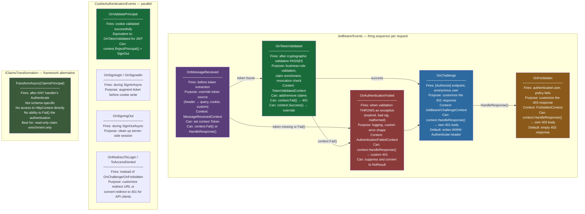
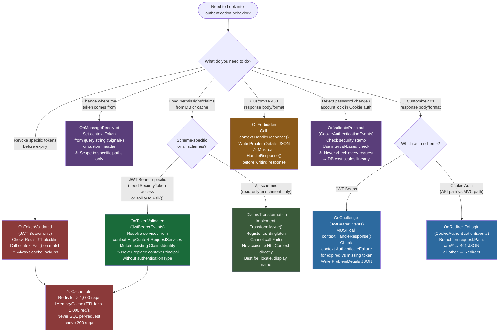

# 4.147 — Authentication Events: OnTokenValidated and OnAuthenticationFailed

---

## PART 0 — Navigation & Context

### Domain Hierarchy

```
ASP.NET Core Mastery
│
├── E. Middleware Pipeline (4.049–4.063)
│   └── 4.052 — Middleware Ordering ← pipeline position matters
│
└── J. Authentication (4.134–4.153)
    ├── 4.134 — Authentication Architecture      ← PREREQUISITE
    ├── 4.135 — Cookie Authentication            ← CookieAuthenticationEvents
    ├── 4.136 — JWT Bearer Authentication        ← PREREQUISITE (JwtBearerEvents)
    ├── 4.146 — Certificate Authentication
    ├── ► 4.147 — Authentication Events          ◄ YOU ARE HERE
    │           OnTokenValidated
    │           OnAuthenticationFailed
    │           OnMessageReceived
    │           OnChallenge / OnForbidden
    ├── 4.148 — Multiple Authentication Schemes  (unlocked)
    ├── 4.149 — Claims Transformation            (contrast: IClaimsTransformation)
    └── 4.151 — IAuthenticationService           (the service that fires these events)
```

### What You Need Before This

- **[[4.134 — Authentication Architecture]]** — events are hooks inside `IAuthenticationHandler`; you must understand the handler lifecycle (Authenticate → Challenge → Forbid) to know when each event fires
- **[[4.136 — JWT Bearer Authentication]]** — `JwtBearerEvents` is the most event-rich handler; most examples in this note are JWT-specific because that's where production engineers actually use events
- **[[4.035 — Service Lifetimes: Singleton, Scoped, Transient]]** — the handler itself is Singleton-like; event delegates must resolve Scoped services via `context.HttpContext.RequestServices`, never via constructor injection
- **[[2.14 — Async/Await Internals]]** — every event delegate is `Func<TContext, Task>`; understanding the async cost per event call matters for high-throughput APIs

### What This Unlocks After

- **[[4.149 — Claims Transformation]]** — `IClaimsTransformation` is the framework-level alternative to `OnTokenValidated` for claim enrichment; knowing both lets you choose the right tool
- **[[4.148 — Multiple Authentication Schemes]]** — per-scheme events let you apply different `OnTokenValidated` logic per scheme (e.g., strict revocation check for JWT, soft enrichment for cookies)
- **[[4.164 — Authorization Caching]]** — the permission-enrichment pattern in `OnTokenValidated` is only practical with a caching layer; this topic explains the cache design
- **[[4.151 — IAuthenticationService]]** — understanding events informs when to use the programmatic auth service vs event hooks for challenge/forbid customization

### Why This Matters at Scale

Authentication events are the only in-pipeline extension point where you can **mutate the `ClaimsPrincipal`**, **abort authentication with a custom response**, or **load application-level context** (permissions, tenant data, account status) before the endpoint executes — all without writing a custom `IAuthenticationHandler`. At 10,000 req/s, every event delegate that performs I/O compounds directly into P99 latency: an unoptimized `OnTokenValidated` SQL query at this scale is a database catastrophe. At any scale, a misconfigured `OnAuthenticationFailed` that silently swallows exceptions produces security-invisible token failures that neither alert nor log — the two worst outcomes for a production auth system.

---

## PART 1 — The Core Mental Model

### The Fundamental Rule

> **ASP.NET Core authentication handlers expose a structured event pipeline — `OnMessageReceived → OnTokenValidated → OnAuthenticationFailed → OnChallenge → OnForbidden` — as async delegate hooks on the Options object. Each event fires at a specific point in the handler's execution, receives a typed context object that wraps `HttpContext`, and can short-circuit by writing a response directly or by calling `context.Fail()` / `context.HandleResponse()`. The HTTP consequence of every event decision flows outward through the same pipeline that invoked it.**

### The Plain-Language Analogy

Think of an airport security checkpoint with distinct inspection stations. The conveyor belt (middleware pipeline) sends each passenger (HTTP request) through stations in a fixed order. `OnMessageReceived` is the initial ID check — you can redirect the passenger to a different queue (read the token from somewhere other than the default header). `OnTokenValidated` is the immigration officer's desk — the passport signature is already verified (cryptographic validation passed), but the officer can still deny entry for business reasons: revoked travel history, missing visa category, flagged account. `OnAuthenticationFailed` is the medical bay where failed passengers are logged and processed — you can send them home quietly with a generic "access denied" or with a detailed incident report depending on your security posture. `OnChallenge` is the gate agent who tells the passenger what credentials they need to present next time (the 401 response and `WWW-Authenticate` header). `OnForbidden` is the lounge attendant who tells a correctly-identified passenger they don't have a business-class ticket (403 response for authenticated-but-unauthorized).

The analogy holds under pressure: if the medical bay (`OnAuthenticationFailed`) crashes, the passenger doesn't get processed at all. If the immigration officer (`OnTokenValidated`) calls `context.Fail()`, the passenger is treated as unauthenticated for all downstream middleware — not as forbidden. And if you override `OnChallenge` with `context.HandleResponse()`, you're bypassing the gate agent entirely and writing your own sign on the wall.

### The Taxonomy Diagram



---

## PART 2 — Deep Mechanics

### 2.1 — Pipeline Position: Where Events Fire Inside the Middleware Chain

```
Incoming HTTP Request
        │
        ▼
┌──────────────────────────────────┐
│  ExceptionHandlerMiddleware      │
└──────────────┬───────────────────┘
               │
┌──────────────▼───────────────────┐
│  RoutingMiddleware               │  ← resolves endpoint + IAuthorizeData
└──────────────┬───────────────────┘
               │
┌──────────────▼───────────────────┐  ◄─── ALL EVENTS FIRE INSIDE THIS BOX
│  AuthenticationMiddleware        │
│  (UseAuthentication)             │
│                                  │
│  JwtBearerHandler.               │
│    HandleAuthenticateAsync()     │
│    │                             │
│    ├─ [1] OnMessageReceived      │  ← token extraction override
│    │       ↓ context.Token set   │
│    ├─ [2] ValidateToken()        │  ← Microsoft.IdentityModel pipeline
│    │       ↓ PASS or THROW       │
│    ├─ [3] OnTokenValidated       │  ← fires only on PASS
│    │   OR  OnAuthenticationFailed│  ← fires only on THROW/Fail
│    │                             │
│    └─ AuthenticateResult returned│
│                                  │
└──────────────┬───────────────────┘
               │
┌──────────────▼───────────────────┐
│  AuthorizationMiddleware         │
│  │                               │
│  ├─ [4] OnChallenge              │  ← fires here (inside AuthZ middleware)
│  └─ [5] OnForbidden              │  ← fires here (inside AuthZ middleware)
└──────────────┬───────────────────┘
               │
        Endpoint Handler
```

> [!IMPORTANT] `OnChallenge` and `OnForbidden` are **not** fired by the authentication handler. They are fired by `AuthorizationMiddleware` calling back into the scheme's handler via `IAuthenticationService.ChallengeAsync()` / `ForbidAsync()`. This means they run in a different middleware stage, after routing has resolved the endpoint and authorization has evaluated its policies. Event handlers that write to `HttpContext.Response` in `OnChallenge` are writing the final 401 — the authorization middleware will not add anything else once `context.HandleResponse()` is called.

**Cost label:** Each event delegate invocation is `~1 async state machine allocation` + the cost of the delegate body. For a no-op event (just `return Task.CompletedTask`), the overhead is negligible. For an event that accesses `RequestServices` and resolves a Scoped service, add `~1 DI scope lookup + service resolution`.

### 2.2 — OnTokenValidated: The Business-Logic Gate After Cryptographic Success

`OnTokenValidated` fires **only** after `JsonWebTokenHandler.ValidateTokenAsync()` (or `JwtSecurityTokenHandler.ValidateToken()`) returns without throwing. Cryptographic verification, issuer, audience, and lifetime checks have all already passed. This event is your first opportunity to apply application-domain logic.

```
Request arrives → JwtBearerHandler.HandleAuthenticateAsync()
                  │
                  ├─ Token extracted (OnMessageReceived)
                  │
                  ├─ ValidateToken() called
                  │    Validates: signature, issuer, audience, lifetime, nbf
                  │    All pass → returns ClaimsPrincipal
                  │    Any fail → throws SecurityTokenException subclass
                  │                   → OnAuthenticationFailed fires, NOT OnTokenValidated
                  │
                  └─ OnTokenValidated fires
                       context.Principal = ClaimsPrincipal from token
                       context.SecurityToken = the parsed token object
                       context.HttpContext = full access to request/response/services
                       context.Options = JwtBearerOptions
                       │
                       ├─ Option A: do nothing → authentication succeeds with token claims
                       │
                       ├─ Option B: enrich principal → add claims from DB/Redis
                       │     var identity = (ClaimsIdentity)context.Principal.Identity!;
                       │     identity.AddClaim(new Claim("tenant_id", tenantId));
                       │     → authentication succeeds with enriched claims
                       │
                       ├─ Option C: context.Fail("reason")
                       │     → AuthenticateResult.Fail
                       │     → HttpContext.User remains anonymous
                       │     → [Authorize] endpoint returns 401 via OnChallenge
                       │
                       └─ Option D: context.Success()
                             → Replaces the current principal entirely
                             → Used when you've built a new ClaimsPrincipal from scratch
```

**ASP.NET Core internally (approximate) — source path:**

```
Microsoft.AspNetCore.Authentication.JwtBearer
  JwtBearerHandler : AuthenticationHandler<JwtBearerOptions>
    HandleAuthenticateAsync()
      → tokenValidationResult = await jsonWebTokenHandler.ValidateTokenAsync(token, tvp)
      → if (tokenValidationResult.IsValid)
          var tokenValidatedContext = new TokenValidatedContext(Context, Scheme, Options)
          {
              Principal = principal,
              SecurityToken = tokenValidationResult.SecurityToken
          };
          await Events.TokenValidated(tokenValidatedContext);
          if (tokenValidatedContext.Result != null)
              return tokenValidatedContext.Result; // Fail() or Success()
          // If no result set → construct AuthenticateResult.Success(ticket)
```

**Cost label:** The event delegate itself has zero framework cost beyond the `Task` allocation. The cost is entirely what you put inside it: DB lookup (~1–5ms), Redis lookup (~0.2–1ms), or claim list manipulation (~0 allocations for small claim sets).

### 2.3 — OnAuthenticationFailed: The Error Path

`OnAuthenticationFailed` fires when `ValidateTokenAsync()` **throws** a `SecurityTokenException` (or any exception from the validation pipeline). It also fires if `OnTokenValidated` calls `context.Fail()` — because the handler converts that `Fail` result into an exception-like path internally.

Common exceptions that trigger this event:

```
Exception type                              Cause
─────────────────────────────────────────   ───────────────────────────────────────
SecurityTokenExpiredException               exp claim < now - ClockSkew
SecurityTokenNotYetValidException           nbf claim > now + ClockSkew
SecurityTokenInvalidSignatureException      Signature mismatch
SecurityTokenInvalidIssuerException         iss claim ≠ ValidIssuer
SecurityTokenInvalidAudienceException       aud claim ∉ ValidAudiences
SecurityTokenMalformedException             JWT structure is malformed (not 3 parts)
SecurityTokenSignatureKeyNotFoundException  No matching key in IssuerSigningKeys
ArgumentException / other                   Handler bug or custom validator throw
```

```
OnAuthenticationFailed event context:
  context.Exception       ← the SecurityTokenException that was thrown
  context.HttpContext     ← full access
  context.Options         ← JwtBearerOptions
  context.Result          ← null by default; you can set it

  Options available to the event handler:
  │
  ├─ Option A: do nothing (default behavior)
  │     → AuthenticateResult.Fail(exception) is returned
  │     → HttpContext.User remains anonymous
  │     → if endpoint has [Authorize] → OnChallenge fires → 401 returned
  │       with WWW-Authenticate: Bearer error="invalid_token",
  │                                      error_description="{exception message}"
  │       (description included only if IncludeErrorDetails=true)
  │
  ├─ Option B: log the exception
  │     → most common production use: structured log with request context
  │     → then do nothing else → default path above
  │
  ├─ Option C: context.HandleResponse()
  │     → write your own response to context.Response right now
  │     → handler will NOT write anything further (401 suppressed)
  │     → use for: custom error shape, custom status codes
  │
  └─ Option D: context.NoResult()
        → convert exception into AuthenticateResult.NoResult
        → request continues as anonymous, WITHOUT the WWW-Authenticate header
        → use for: multi-scheme setups where this scheme is optional
          and a different scheme should get a chance to authenticate
```

> [!WARNING] `OnAuthenticationFailed` is called on the **hot path for every invalid token**. If your delegate does I/O (logs to a slow sink, writes to a database), you pay that cost for every expired token, every client with a stale token, every misconfigured client. Use structured logging with `LogWarning` (async, non-blocking sink) and never perform database writes in this event.

### 2.4 — OnMessageReceived: Overriding Token Extraction

The default `JwtBearerHandler` reads the token from the `Authorization: Bearer {token}` header. `OnMessageReceived` fires before this default extraction and lets you override the token source.

```
Practical use cases for OnMessageReceived:
│
├─ SignalR WebSocket authentication
│     Browser WebSocket API cannot set custom headers on upgrade requests
│     Token must come from query parameter: ?access_token={jwt}
│     context.Token = context.Request.Query["access_token"];
│
├─ Bi-modal APIs (header OR cookie, never both)
│     Some clients send Bearer header, others send HttpOnly cookie
│     Read cookie if header absent: context.Token = context.Request.Cookies["jwt"];
│
├─ Non-standard header names
│     Internal services use "X-Service-Token" instead of "Authorization: Bearer"
│     context.Token = context.Request.Headers["X-Service-Token"];
│
└─ Token from request body (unusual but valid for webhook receivers)
      context.Token = context.Request.Form["jwt_assertion"];
```

**HTTP wire consequence:**

```
// Standard — default extraction (no OnMessageReceived needed):
GET /api/orders HTTP/1.1
Authorization: Bearer eyJhbGci...

// WebSocket SignalR — requires OnMessageReceived override:
GET /hubs/notifications?access_token=eyJhbGci... HTTP/1.1
Upgrade: websocket
Connection: Upgrade

// ⚠️ access_token in query string appears in:
//   - Nginx/IIS/Kestrel access logs
//   - Browser history
//   - Reverse proxy X-Original-URL logs
// Scope this override ONLY to hub paths, never globally.
```

### 2.5 — OnChallenge and OnForbidden: Controlling 401 and 403 Responses

These two events control the shape of the unauthenticated (401) and unauthorized (403) HTTP responses. They are the correct extension point for APIs that need problem-details-formatted error responses instead of the bare JWT defaults.

```
Default behavior WITHOUT event override:
────────────────────────────────────────

OnChallenge default output:
  HTTP/1.1 401 Unauthorized
  WWW-Authenticate: Bearer realm="api.example.com"
  (+ error and error_description if IncludeErrorDetails=true)
  Content-Length: 0
  // Empty body — no JSON

OnForbidden default output:
  HTTP/1.1 403 Forbidden
  Content-Length: 0
  // Empty body — no JSON


Default behavior WITH problem-details override:
───────────────────────────────────────────────

OnChallenge with HandleResponse():
  HTTP/1.1 401 Unauthorized
  Content-Type: application/problem+json
  {
    "type": "https://tools.ietf.org/html/rfc7235#section-3.1",
    "title": "Unauthorized",
    "status": 401,
    "detail": "Authentication required.",
    "traceId": "00-abc123..."
  }

OnForbidden with HandleResponse():
  HTTP/1.1 403 Forbidden
  Content-Type: application/problem+json
  {
    "type": "https://tools.ietf.org/html/rfc7231#section-6.5.3",
    "title": "Forbidden",
    "status": 403,
    "detail": "Insufficient permissions for this resource.",
    "traceId": "00-abc123..."
  }
```

> [!NOTE] In .NET 8, `builder.Services.AddProblemDetails()` plus `app.UseStatusCodePages()` handles 401/403 problem-details formatting automatically for most cases — making manual `OnChallenge`/`OnForbidden` overrides unnecessary. Use the event override when you need custom fields, scheme-specific messages, or correlation with request tracing IDs.

### 2.6 — CookieAuthenticationEvents: The Parallel Event System

Cookies have their own event system with different method names but the same architectural pattern. The most important is `OnValidatePrincipal` — the cookie equivalent of `OnTokenValidated`.

```
CookieAuthenticationEvents lifecycle:
│
├─ OnValidatePrincipal
│     Fires: when a valid cookie is present and decrypted successfully
│     Equivalent to: OnTokenValidated in JwtBearerEvents
│     KEY CAPABILITY: context.RejectPrincipal() + await context.HttpContext
│                     .SignOutAsync(CookieAuthenticationDefaults.AuthenticationScheme)
│     Use for: sliding session validation, checking if user still exists in DB,
│              checking if security stamp (password changed) is still valid
│     ASP.NET Core Identity uses this internally with a 30-minute security stamp check.
│
├─ OnSigningIn
│     Fires: during SignInAsync(), before the cookie is written
│     Use for: adding claims to the ticket before it is encrypted into the cookie
│
├─ OnSignedIn
│     Fires: after the cookie has been written to the response
│     Use for: audit logging of sign-in events
│
├─ OnSigningOut
│     Fires: during SignOutAsync(), before the cookie is cleared
│     Use for: invalidating server-side session records
│
├─ OnRedirectToLogin
│     Fires: instead of OnChallenge for Cookie schemes
│     Default: 302 redirect to LoginPath
│     Override for APIs: convert to 401 JSON instead of redirect
│
└─ OnRedirectToAccessDenied
      Fires: instead of OnForbidden for Cookie schemes
      Default: 302 redirect to AccessDeniedPath
      Override for APIs: convert to 403 JSON instead of redirect
```

**Cost label:** `OnValidatePrincipal` with a security stamp check requires a DB lookup every N minutes (configurable; ASP.NET Core Identity default is 30 minutes, controlled by `SecurityStampValidationInterval`). This is a per-request cost on the validation interval boundary — not on every request — because the security stamp is cached in the cookie and only re-validated after the interval elapses.

---

## PART 3 — Production Code Patterns

### Pattern 1: The Permission Loader — Enriching Claims Without a Custom Handler

Loading user permissions from a database or cache inside `OnTokenValidated`, adding them as claims before the endpoint executes. This avoids writing a full `IAuthorizationHandler` for permission checks.

```csharp
// ⚠️ WRONG: Constructor-injecting a Scoped service into the handler options
// JwtBearerOptions is configured at startup — the lambda captures the IServiceProvider
// from the DI registration phase, not from a per-request scope. If IPermissionRepository
// is Scoped (which it should be — it wraps DbContext), this is a captive dependency.
builder.Services.AddAuthentication(JwtBearerDefaults.AuthenticationScheme)
    .AddJwtBearer(options =>
    {
        var repo = /* injected somehow */ null!; // ⚠️ Cannot safely inject Scoped here
        options.Events = new JwtBearerEvents
        {
            OnTokenValidated = async context =>
            {
                var permissions = await repo.GetPermissionsAsync(userId); // ⚠️ captured singleton
            }
        };
    });

// ✅ CORRECT: Resolve Scoped service from per-request IServiceProvider
// Domain: order management API loading operator permissions from Redis

builder.Services.AddAuthentication(JwtBearerDefaults.AuthenticationScheme)
    .AddJwtBearer(options =>
    {
        options.TokenValidationParameters = new TokenValidationParameters
        {
            ValidateIssuer = true,
            ValidIssuer = "https://auth.orderservice.example.com",
            ValidateAudience = true,
            ValidAudience = "https://api.orderservice.example.com",
            ValidateLifetime = true,
            ClockSkew = TimeSpan.FromSeconds(30),
            NameClaimType = JwtRegisteredClaimNames.Sub,
            RoleClaimType = "roles",
            IssuerSigningKey = signingKey,
        };

        options.Events = new JwtBearerEvents
        {
            OnTokenValidated = async context =>
            {
                // ✅ Resolve from the per-request service scope — safe for Scoped services
                var permissionCache = context.HttpContext.RequestServices
                    .GetRequiredService<IOperatorPermissionCache>();

                var operatorId = context.Principal!
                    .FindFirstValue(JwtRegisteredClaimNames.Sub);

                if (operatorId is null)
                {
                    context.Fail("Token is missing the 'sub' claim.");
                    return;
                }

                // ✅ Redis-backed cache: ~0.5ms vs SQL ~2–5ms per request
                // Cache TTL = min(token lifetime remaining, permission cache TTL)
                // so permissions refresh when either the token or the cache expires.
                var permissions = await permissionCache.GetPermissionsAsync(operatorId);

                if (permissions is null)
                {
                    // Account does not exist in the permissions store — reject
                    context.Fail($"No permission record found for operator '{operatorId}'.");
                    return;
                }

                // ✅ Mutate the existing identity — do NOT replace context.Principal
                // Replacing the principal resets IsAuthenticated and breaks scheme tracking
                var identity = (ClaimsIdentity)context.Principal.Identity!;

                // Add fine-grained permissions as claims — evaluated by policy handlers
                foreach (var permission in permissions)
                {
                    identity.AddClaim(new Claim("permission", permission));
                }

                // Add tenant context loaded alongside permissions
                identity.AddClaim(new Claim("tenant_id", permissions.TenantId));
            }
        };
    });
```

```
// HTTP wire format (permission enrichment — happy path):
// GET /api/orders HTTP/1.1
// Authorization: Bearer {valid_jwt, sub="op-42"}
//
// → OnTokenValidated fires, loads permissions for "op-42" from Redis
// → Claims added: permission=orders:read, permission=orders:write, tenant_id=T-9
//
// HTTP/1.1 200 OK
// Content-Type: application/json
// [{"orderId": "ORD-001", ...}]

// HTTP wire format (account not found — reject):
// GET /api/orders HTTP/1.1
// Authorization: Bearer {valid_jwt for a deleted operator account}
//
// → OnTokenValidated fires, Redis returns null for "op-deleted"
// → context.Fail("No permission record found for operator 'op-deleted'.")
//
// HTTP/1.1 401 Unauthorized
// WWW-Authenticate: Bearer error="invalid_token"
```

### Pattern 2: The Token Revocation Check — Redis JTI Blocklist

Using `OnTokenValidated` to check a Redis blocklist of revoked token IDs. This is the correct pattern for supporting user logout in stateless JWT systems.

```csharp
// Domain: payment API that must support immediate logout for PCI compliance

builder.Services.AddAuthentication(JwtBearerDefaults.AuthenticationScheme)
    .AddJwtBearer(options =>
    {
        // ... TokenValidationParameters ...

        options.Events = new JwtBearerEvents
        {
            OnTokenValidated = async context =>
            {
                // ✅ jti (JWT ID) is the unique token identifier
                // Must be present in your token generation — see 4.137
                var jti = context.Principal!.FindFirstValue(JwtRegisteredClaimNames.Jti);

                if (string.IsNullOrEmpty(jti))
                {
                    // Tokens without jti cannot be individually revoked.
                    // Whether to allow or reject is a security policy decision.
                    // For PCI: reject tokens without jti.
                    context.Fail("Token is missing required 'jti' claim.");
                    return;
                }

                var revocationStore = context.HttpContext.RequestServices
                    .GetRequiredService<ITokenRevocationStore>();

                // ✅ Redis GET on the jti key — O(1), ~0.3ms per call
                // Key format: "revoked:{jti}" with TTL = token's remaining lifetime
                // This bounds the store size — keys auto-expire when tokens would expire anyway
                if (await revocationStore.IsRevokedAsync(jti))
                {
                    context.Fail("Token has been revoked.");
                    return;
                }

                // Token is valid and not revoked — authentication succeeds
            }
        };
    });

// The revocation store implementation (used by logout endpoint):
public class RedisTokenRevocationStore : ITokenRevocationStore
{
    private readonly IConnectionMultiplexer _redis;

    public RedisTokenRevocationStore(IConnectionMultiplexer redis)
        => _redis = redis;

    public async Task<bool> IsRevokedAsync(string jti)
    {
        var db = _redis.GetDatabase();
        // ✅ Redis EXISTS — returns 1 if key present, 0 if not
        return await db.KeyExistsAsync($"revoked:{jti}");
    }

    public async Task RevokeAsync(string jti, TimeSpan tokenRemainingLifetime)
    {
        var db = _redis.GetDatabase();
        // ✅ SET with EX — key auto-expires when token would have expired anyway
        // The revocation store never accumulates stale entries
        await db.StringSetAsync($"revoked:{jti}", "1", tokenRemainingLifetime);
    }
}
```

```
// Logout flow (HTTP wire format):
// POST /api/auth/logout HTTP/1.1
// Authorization: Bearer {valid_jwt, jti="tok-uuid-123", exp=+15min}
//
// Server: extracts jti, calculates remaining lifetime, stores "revoked:tok-uuid-123" in Redis
//
// HTTP/1.1 204 No Content
//
// Subsequent request with same token:
// GET /api/orders HTTP/1.1
// Authorization: Bearer {same_valid_jwt, jti="tok-uuid-123"}
//
// → OnTokenValidated fires, Redis returns EXISTS for "revoked:tok-uuid-123"
// → context.Fail("Token has been revoked.")
//
// HTTP/1.1 401 Unauthorized
// WWW-Authenticate: Bearer error="invalid_token"
```

### Pattern 3: The Structured Failure Logger — OnAuthenticationFailed with Context

The correct production pattern for logging authentication failures with enough context to diagnose issues without revealing sensitive data.

```csharp
// Domain: logistics API — logging auth failures for security audit trail

builder.Services.AddAuthentication(JwtBearerDefaults.AuthenticationScheme)
    .AddJwtBearer(options =>
    {
        // ... TokenValidationParameters ...

        options.Events = new JwtBearerEvents
        {
            OnAuthenticationFailed = context =>
            {
                // ✅ Resolve logger from RequestServices — avoid ILogger<Program>
                // captured at configuration time (would be Singleton, logger is fine,
                // but RequestServices gives you correlation-scoped loggers in some setups)
                var logger = context.HttpContext.RequestServices
                    .GetRequiredService<ILogger<JwtBearerEvents>>();

                // ✅ Log BEFORE the exception type check — always audit
                // Log at Warning (not Error) — expired tokens are expected in production
                // Only log at Error for truly unexpected failures (null key, handler bug)
                var exceptionType = context.Exception.GetType().Name;
                var requestPath = context.HttpContext.Request.Path;
                var remoteIp = context.HttpContext.Connection.RemoteIpAddress?.ToString();

                if (context.Exception is SecurityTokenExpiredException)
                {
                    // Expected — clients with stale tokens; do not alert
                    logger.LogInformation(
                        "Expired token rejected. Path={Path} IP={RemoteIp}",
                        requestPath, remoteIp);
                }
                else if (context.Exception is SecurityTokenInvalidSignatureException
                      || context.Exception is SecurityTokenMalformedException)
                {
                    // ⚠️ Potentially adversarial — tampered or forged token
                    // Alert: may indicate token forgery attempt
                    logger.LogWarning(
                        "Invalid token signature or structure. ExceptionType={ExceptionType} " +
                        "Path={Path} IP={RemoteIp}",
                        exceptionType, requestPath, remoteIp);
                }
                else
                {
                    // Unexpected failure — misconfiguration or library bug
                    logger.LogError(
                        context.Exception,
                        "Unexpected authentication failure. ExceptionType={ExceptionType} " +
                        "Path={Path} IP={RemoteIp}",
                        exceptionType, requestPath, remoteIp);
                }

                // ✅ Return completed task — let default challenge path handle the 401
                // Do NOT call context.HandleResponse() unless you need a custom 401 body
                return Task.CompletedTask;
            }
        };
    });
```

### Pattern 4: The Problem-Details 401 — Custom OnChallenge Response

Replacing the bare `401 Unauthorized` with no body with a properly formatted RFC 7807 problem-details response that matches the rest of your API's error contract.

```csharp
// ⚠️ WRONG: Not calling context.HandleResponse() before writing the response
options.Events = new JwtBearerEvents
{
    OnChallenge = async context =>
    {
        // ⚠️ Without HandleResponse(), the JwtBearerHandler ALSO writes its
        // default WWW-Authenticate response after this delegate returns.
        // Result: two responses written to the same HttpContext.Response —
        // either a runtime exception ("response already started") or corrupted output.
        context.Response.StatusCode = 401;
        await context.Response.WriteAsJsonAsync(new { error = "unauthorized" });
    }
};

// ✅ CORRECT: HandleResponse() suppresses the default JWT challenge output
// Domain: payment API with consistent problem-details error contract

builder.Services.AddAuthentication(JwtBearerDefaults.AuthenticationScheme)
    .AddJwtBearer(options =>
    {
        options.Events = new JwtBearerEvents
        {
            OnChallenge = async context =>
            {
                // ✅ REQUIRED: suppress the handler's default WWW-Authenticate response
                context.HandleResponse();

                var traceId = Activity.Current?.Id
                    ?? context.HttpContext.TraceIdentifier;

                context.Response.StatusCode = 401;
                context.Response.ContentType = "application/problem+json";

                var problem = new ProblemDetails
                {
                    Status = 401,
                    Title = "Authentication required",
                    Type = "https://tools.ietf.org/html/rfc7235#section-3.1",
                    Detail = context.AuthenticateFailure is SecurityTokenExpiredException
                        ? "Your session has expired. Please sign in again."
                        : "A valid bearer token is required to access this resource.",
                    Instance = context.Request.Path,
                    Extensions = { ["traceId"] = traceId }
                };

                await context.Response.WriteAsJsonAsync(problem,
                    options: new JsonSerializerOptions
                    {
                        DefaultIgnoreCondition = JsonIgnoreCondition.WhenWritingNull
                    });
            },

            OnForbidden = async context =>
            {
                context.Response.StatusCode = 403;
                context.Response.ContentType = "application/problem+json";

                var traceId = Activity.Current?.Id
                    ?? context.HttpContext.TraceIdentifier;

                var problem = new ProblemDetails
                {
                    Status = 403,
                    Title = "Forbidden",
                    Type = "https://tools.ietf.org/html/rfc7231#section-6.5.3",
                    Detail = "You do not have permission to access this resource.",
                    Instance = context.Request.Path,
                    Extensions = { ["traceId"] = traceId }
                };

                await context.Response.WriteAsJsonAsync(problem);
            }
        };
    });
```

```
// HTTP wire format (correct problem-details 401):
// GET /api/payments HTTP/1.1
// // No Authorization header
//
// HTTP/1.1 401 Unauthorized
// Content-Type: application/problem+json
//
// {
//   "type": "https://tools.ietf.org/html/rfc7235#section-3.1",
//   "title": "Authentication required",
//   "status": 401,
//   "detail": "A valid bearer token is required to access this resource.",
//   "instance": "/api/payments",
//   "traceId": "00-4bf92f3577b34da6a3ce929d0e0e4736-00f067aa0ba902b7-01"
// }
```

### Pattern 5: The Cookie Security Stamp Validator — OnValidatePrincipal

The correct pattern for detecting password changes, account lockouts, or permission changes in a Cookie-authenticated app — forcing re-authentication without waiting for the cookie to expire.

```csharp
// Domain: e-commerce admin portal — cookie auth with security stamp validation
// Without this: a user whose account is locked out continues to be authenticated
// for the full cookie lifetime (e.g., 14 days) after lockout.

builder.Services.AddAuthentication(CookieAuthenticationDefaults.AuthenticationScheme)
    .AddCookie(options =>
    {
        options.SlidingExpiration = true;
        options.ExpireTimeSpan = TimeSpan.FromDays(14);

        options.Events = new CookieAuthenticationEvents
        {
            OnValidatePrincipal = async context =>
            {
                // ✅ Check the security stamp at most every 30 minutes
                // Doing this on EVERY request = 1 DB query per request = catastrophe
                // SecurityStampValidator.ValidatePrincipalAsync does this check
                // with the configured interval automatically when using ASP.NET Core Identity.
                // For custom implementations, replicate the interval logic:

                var lastValidated = context.Properties.GetString("LastValidated");
                if (lastValidated != null
                    && DateTimeOffset.TryParse(lastValidated, out var lastTime)
                    && DateTimeOffset.UtcNow - lastTime < TimeSpan.FromMinutes(30))
                {
                    // Stamp checked recently — skip the DB round-trip
                    return;
                }

                var userService = context.HttpContext.RequestServices
                    .GetRequiredService<IAdminUserService>();

                var userId = context.Principal!.FindFirstValue(ClaimTypes.NameIdentifier);
                var currentStamp = context.Principal.FindFirstValue("security_stamp");

                var dbStamp = await userService.GetSecurityStampAsync(userId!);

                if (dbStamp != currentStamp)
                {
                    // ✅ Security stamp mismatch: password changed, roles changed, locked out
                    // Reject the principal AND sign out to clear the cookie
                    context.RejectPrincipal();
                    await context.HttpContext.SignOutAsync(
                        CookieAuthenticationDefaults.AuthenticationScheme);
                    return;
                }

                // ✅ Stamp is valid — update the last-validated timestamp in the cookie
                // This extends the interval window without requiring a new login
                context.Properties.SetString("LastValidated",
                    DateTimeOffset.UtcNow.ToString("o"));
                context.ShouldRenew = true; // rewrite the cookie with updated properties
            }
        };
    });
```

```
// HTTP wire format (security stamp mismatch — forced re-authentication):
// GET /admin/dashboard HTTP/1.1
// Cookie: .AspNetCore.Cookies={encrypted_ticket_with_old_stamp}
//
// → OnValidatePrincipal fires, DB stamp ≠ cookie stamp (password was changed)
// → context.RejectPrincipal() + SignOutAsync()
//
// HTTP/1.1 302 Found
// Location: /admin/login?ReturnUrl=%2Fadmin%2Fdashboard
// Set-Cookie: .AspNetCore.Cookies=; expires=Thu, 01 Jan 1970 00:00:00 GMT; path=/
// (the cookie is cleared by SignOutAsync)
```

### Pattern 6: The Multi-Scheme Event Isolation — Per-Scheme Event Registration

When using multiple authentication schemes, each scheme has its own `Events` instance. This lets you apply different logic per scheme without shared state.

```csharp
// Domain: API gateway supporting both external users (JWT from Auth0)
// and internal services (short-lived symmetric JWT from internal auth)

builder.Services.AddAuthentication()
    .AddJwtBearer("ExternalUserJwt", options =>
    {
        options.Authority = "https://your-tenant.auth0.com/";
        options.Audience = "https://api.orderservice.example.com";

        options.Events = new JwtBearerEvents
        {
            OnTokenValidated = async context =>
            {
                // External users: load their order history context from DB
                var userContext = context.HttpContext.RequestServices
                    .GetRequiredService<IUserContextLoader>();

                var userId = context.Principal!.FindFirstValue("sub");
                var ctx = await userContext.LoadAsync(userId!);
                ((ClaimsIdentity)context.Principal.Identity!)
                    .AddClaim(new Claim("account_tier", ctx.AccountTier));
            },

            OnChallenge = async context =>
            {
                context.HandleResponse();
                // External-facing 401: consumer-friendly message
                context.Response.StatusCode = 401;
                context.Response.ContentType = "application/problem+json";
                await context.Response.WriteAsJsonAsync(new ProblemDetails
                {
                    Status = 401,
                    Title = "Authentication required",
                    Detail = "Sign in at https://example.com/login to continue."
                });
            }
        };
    })
    .AddJwtBearer("InternalServiceJwt", options =>
    {
        options.TokenValidationParameters = new TokenValidationParameters
        {
            ValidIssuer = "https://internal-auth.example.com",
            ValidAudience = "order-service-internal",
            IssuerSigningKey = internalKey,
            ValidateLifetime = true,
            ClockSkew = TimeSpan.Zero,
        };

        options.Events = new JwtBearerEvents
        {
            OnTokenValidated = context =>
            {
                // Internal services: verify the calling service is authorized
                var callerService = context.Principal!.FindFirstValue("service_name");
                if (callerService != "settlement-service"
                 && callerService != "inventory-service")
                {
                    context.Fail($"Service '{callerService}' is not authorized.");
                }
                return Task.CompletedTask;
            },

            OnChallenge = async context =>
            {
                context.HandleResponse();
                // Internal 401: machine-readable, no consumer messaging
                context.Response.StatusCode = 401;
                context.Response.ContentType = "application/problem+json";
                await context.Response.WriteAsJsonAsync(new ProblemDetails
                {
                    Status = 401,
                    Title = "Service authentication failed",
                    Detail = "Valid internal service credentials are required."
                });
            }
        };
    });
```

### Pattern 7: The API-Friendly Cookie Challenge — Redirects to 401

Cookie authentication defaults to 302 redirects for unauthenticated requests. APIs need 401 JSON responses. Override `OnRedirectToLogin` and `OnRedirectToAccessDenied`.

```csharp
// ⚠️ WRONG: Cookie auth default behavior for API clients
// An API client gets:
//   HTTP/1.1 302 Found
//   Location: /Account/Login?ReturnUrl=%2Fapi%2Forders
// This is useless for a mobile app or SPA that cannot follow auth redirects.

// ✅ CORRECT: Override redirect behavior for API paths
// Domain: hybrid app — browser MVC with cookie auth + API endpoints on /api/*

builder.Services.AddAuthentication(CookieAuthenticationDefaults.AuthenticationScheme)
    .AddCookie(options =>
    {
        options.LoginPath = "/account/login";
        options.AccessDeniedPath = "/account/access-denied";

        options.Events = new CookieAuthenticationEvents
        {
            OnRedirectToLogin = context =>
            {
                // ✅ If the request is to the API path, return 401 JSON instead of redirect
                if (context.Request.Path.StartsWithSegments("/api"))
                {
                    context.Response.StatusCode = 401;
                    context.Response.ContentType = "application/problem+json";
                    return context.Response.WriteAsJsonAsync(new ProblemDetails
                    {
                        Status = 401,
                        Title = "Unauthorized",
                        Detail = "Authentication is required to access this resource."
                    });
                }

                // For non-API paths: keep the normal cookie redirect behavior
                context.Response.Redirect(context.RedirectUri);
                return Task.CompletedTask;
            },

            OnRedirectToAccessDenied = context =>
            {
                if (context.Request.Path.StartsWithSegments("/api"))
                {
                    context.Response.StatusCode = 403;
                    context.Response.ContentType = "application/problem+json";
                    return context.Response.WriteAsJsonAsync(new ProblemDetails
                    {
                        Status = 403,
                        Title = "Forbidden",
                        Detail = "You do not have permission to perform this action."
                    });
                }

                context.Response.Redirect(context.RedirectUri);
                return Task.CompletedTask;
            }
        };
    });
```

---

## PART 4 — Gotchas & Anti-Patterns

### Gotcha 1: Missing context.HandleResponse() in OnChallenge — Double Response Write

The most common `OnChallenge` bug: writing a response body but not suppressing the default JWT challenge output, producing a corrupted or duplicate response.

```csharp
// ⚠️ WRONG: Writing to response without HandleResponse()
options.Events = new JwtBearerEvents
{
    OnChallenge = async context =>
    {
        // ⚠️ This writes the body
        await context.Response.WriteAsJsonAsync(new { error = "auth_required" });
        // After this delegate returns, JwtBearerHandler ALSO writes:
        //   - Sets Response.StatusCode = 401 (may override your 401)
        //   - Adds WWW-Authenticate header
        // Result: in some cases a "response already started" InvalidOperationException;
        // in others, the headers and body arrive in an inconsistent state.
    }
};

// HTTP consequence (wrong path):
// HTTP/1.1 200 OK  ← StatusCode may be left at 200 because both writes race
// Content-Type: application/json
// WWW-Authenticate: Bearer   ← also added by the handler after your write
// {"error":"auth_required"}  ← your body, but status code is wrong
```

```csharp
// ✅ CORRECT: Always call HandleResponse() before writing anything in OnChallenge
options.Events = new JwtBearerEvents
{
    OnChallenge = async context =>
    {
        context.HandleResponse(); // ← suppresses ALL default challenge output
        context.Response.StatusCode = 401;
        context.Response.ContentType = "application/problem+json";
        await context.Response.WriteAsJsonAsync(new ProblemDetails
        {
            Status = 401, Title = "Unauthorized"
        });
    }
};
```

```
// HTTP consequence (correct path):
// HTTP/1.1 401 Unauthorized
// Content-Type: application/problem+json
// {"type":"...","title":"Unauthorized","status":401}
```

**WHY:** `context.HandleResponse()` sets a flag on the `BaseControlContext` that tells the parent handler "this event has already handled the response, do not write anything further." Without it, the `JwtBearerHandler.HandleChallengeAsync()` method continues execution after the event delegate returns and writes its own response on top of yours.

---

### Gotcha 2: Replacing context.Principal in OnTokenValidated Breaks IsAuthenticated

The instinct to replace `context.Principal` with a freshly-constructed `ClaimsPrincipal` breaks the `IsAuthenticated` flag and scheme tracking in non-obvious ways.

```csharp
// ⚠️ WRONG: Replacing context.Principal entirely
options.Events = new JwtBearerEvents
{
    OnTokenValidated = async context =>
    {
        var permissions = await LoadPermissionsAsync(context);

        // ⚠️ Creating a new ClaimsPrincipal from scratch:
        // - new ClaimsIdentity() without authenticationType → IsAuthenticated = false
        // - Loses the original JWT claims (sub, email, exp, etc.)
        // - Loses the authentication scheme name from the original identity
        context.Principal = new ClaimsPrincipal(
            new ClaimsIdentity(
                permissions.Select(p => new Claim("permission", p))
                // ← no authenticationType argument → IsAuthenticated = false!
            )
        );
    }
};

// HTTP consequence (wrong path):
// [Authorize] endpoint receives a request with a valid JWT
// → OnTokenValidated fires, principal replaced with IsAuthenticated = false
// → UseAuthorization sees unauthenticated user → 401
// Even though the token was valid and permissions were loaded!
```

```csharp
// ✅ CORRECT: Mutate the existing identity or construct with the correct scheme
options.Events = new JwtBearerEvents
{
    OnTokenValidated = async context =>
    {
        var permissions = await LoadPermissionsAsync(context);

        // ✅ Option A (preferred): add claims to the existing identity
        // Preserves: authenticationType, original claims, IsAuthenticated = true
        var identity = (ClaimsIdentity)context.Principal!.Identity!;
        identity.AddClaims(permissions.Select(p => new Claim("permission", p)));

        // ✅ Option B: if you must build a new identity, preserve the authenticationType
        // The authenticationType is what makes IsAuthenticated = true
        // var newIdentity = new ClaimsIdentity(
        //     allClaims,
        //     authenticationType: JwtBearerDefaults.AuthenticationScheme  // ← required
        // );
        // context.Principal = new ClaimsPrincipal(newIdentity);
    }
};
```

```
// HTTP consequence (correct path):
// Valid JWT → OnTokenValidated enriches claims → IsAuthenticated = true preserved
// → UseAuthorization sees authenticated principal with permission claims
// HTTP/1.1 200 OK
```

**WHY:** `ClaimsIdentity.IsAuthenticated` returns `true` only when `AuthenticationType` is a non-null, non-empty string. When you construct `new ClaimsIdentity(claims)` without the second argument, `AuthenticationType` is null → `IsAuthenticated = false`. The original JWT identity has `AuthenticationType = "AuthenticationTypes.Federation"` or the scheme name. Replacing it resets that.

---

### Gotcha 3: Doing I/O in OnAuthenticationFailed — Paying the Cost on Every Bad Token

`OnAuthenticationFailed` fires for every request with an invalid token, including from clients that are simply using stale tokens. A delegate that does I/O (writes to a database, calls an external audit service) pays that cost on a high-traffic path.

```csharp
// ⚠️ WRONG: Writing to database in OnAuthenticationFailed
options.Events = new JwtBearerEvents
{
    OnAuthenticationFailed = async context =>
    {
        // ⚠️ 1 SQL INSERT per invalid token per request
        // At 1,000 requests/s with 1% stale tokens = 10 DB writes/sec just for audit
        // At 10,000 requests/s with 5% stale tokens = 500 DB writes/sec for audit
        var auditDb = context.HttpContext.RequestServices
            .GetRequiredService<IAuditDatabase>();

        await auditDb.LogFailedAuthAsync(
            context.HttpContext.Request.Path,
            context.Exception.Message);  // ← SQL write on every bad token
    }
};

// HTTP consequence (wrong path — operational):
// No incorrect HTTP response, but DB connection pool exhausted under load,
// causing timeouts that cascade to legitimate requests.
```

```csharp
// ✅ CORRECT: Use structured logging (async, non-blocking) for failure events
// Use Redis or a fire-and-forget channel for audit persistence if required
options.Events = new JwtBearerEvents
{
    OnAuthenticationFailed = context =>
    {
        // ✅ ILogger writes to an async sink (Serilog, Application Insights, etc.)
        // ~0 blocking cost — the log event is enqueued, not written synchronously
        var logger = context.HttpContext.RequestServices
            .GetRequiredService<ILogger<JwtBearerEvents>>();

        logger.LogWarning(
            "Token validation failed. ExceptionType={ExType} Path={Path}",
            context.Exception.GetType().Name,
            context.HttpContext.Request.Path);

        // ✅ If you need durable audit: fire-and-forget to a Channel<T>-backed queue
        // The background worker persists to DB without blocking the request pipeline
        var auditQueue = context.HttpContext.RequestServices
            .GetRequiredService<IAuthAuditQueue>();

        auditQueue.EnqueueFailure(new AuthFailureEvent
        {
            Path = context.HttpContext.Request.Path,
            ExceptionType = context.Exception.GetType().Name,
            Timestamp = DateTimeOffset.UtcNow,
            RemoteIp = context.HttpContext.Connection.RemoteIpAddress?.ToString()
        });
        // ↑ Channel<T>.Writer.TryWrite() — O(1), non-blocking, no allocation spike

        return Task.CompletedTask;
    }
};
```

```
// HTTP consequence (correct path):
// Invalid token → OnAuthenticationFailed logs + enqueues (non-blocking) → 401 returned
// P99 latency unaffected by audit persistence
```

**WHY:** `OnAuthenticationFailed` is on the hot path for every request where token validation fails. In production, stale tokens from mobile clients that haven't refreshed, bots probing endpoints, and misconfigured service clients all generate failed auth events constantly. The delegate cost multiplies with request volume.

---

### Gotcha 4: Calling context.Fail() in OnTokenValidated Still Fires OnChallenge

A common misconception: calling `context.Fail()` in `OnTokenValidated` means the request ends there. It doesn't. The request continues as anonymous, and if the endpoint has `[Authorize]`, `OnChallenge` still fires and writes the 401.

```csharp
// ⚠️ WRONG mental model: "context.Fail() returns a 401 immediately"
options.Events = new JwtBearerEvents
{
    OnTokenValidated = async context =>
    {
        if (await IsAccountSuspendedAsync(context))
        {
            context.Fail("Account suspended.");
            // Developer assumes: 401 is returned here, request stops.
            // Actual behavior: handler returns AuthenticateResult.Fail,
            // middleware sets HttpContext.User = anonymous,
            // request CONTINUES through the rest of the pipeline,
            // UseAuthorization evaluates [Authorize] → triggers OnChallenge → 401
        }
    },

    OnChallenge = async context =>
    {
        context.HandleResponse();
        // ⚠️ This fires for BOTH "no token" AND "context.Fail() in OnTokenValidated"
        // If you want to distinguish them, check context.AuthenticateFailure:
        if (context.AuthenticateFailure?.Message == "Account suspended.")
        {
            // Return a 403 (account exists but is suspended) instead of generic 401
            context.Response.StatusCode = 403;
        }
        else
        {
            context.Response.StatusCode = 401;
        }
        await context.Response.WriteAsJsonAsync(new ProblemDetails
        {
            Status = context.Response.StatusCode,
            Title = context.Response.StatusCode == 403 ? "Account Suspended" : "Unauthorized"
        });
    }
};
```

```
// HTTP consequence of context.Fail("Account suspended."):
// → HttpContext.User is anonymous
// → UseAuthorization sees anonymous user on [Authorize] endpoint
// → OnChallenge fires with context.AuthenticateFailure.Message = "Account suspended."
// → Custom OnChallenge writes 403 (because we checked the message)
//
// HTTP/1.1 403 Forbidden
// Content-Type: application/problem+json
// {"status":403,"title":"Account Suspended"}
```

**WHY:** `context.Fail()` sets the `AuthenticateResult` to failure. The handler returns this result to `AuthenticationMiddleware`. The middleware sets `HttpContext.User` to anonymous. The request is not terminated — it continues to `AuthorizationMiddleware`, which then decides whether to challenge (401) or allow (anonymous endpoint). `context.Fail()` is not "reject and respond" — it is "mark as unauthenticated and continue."

---

### Gotcha 5: OnTokenValidated Without Service Scope — Capturing Scoped Services at Configuration Time

The options lambda runs once at startup. If you capture a service from the DI container at that point and it's Scoped, you've created a captive dependency that will produce either a runtime exception or stale data.

```csharp
// ⚠️ WRONG: Resolving a service at configuration time (startup)
// This is the most subtle version of the captive dependency bug in auth events

IServiceProvider? startupProvider = null;
builder.Services.AddSingleton(sp => { startupProvider = sp; return new Marker(); });

builder.Services.AddAuthentication(JwtBearerDefaults.AuthenticationScheme)
    .AddJwtBearer(options =>
    {
        // ⚠️ Options lambda runs ONCE at startup during DI container build
        // At this point, the app's full service provider may not be built yet.
        // Even if it is, this captures a root-scope provider.
        // Resolving IPermissionRepository (Scoped) from root scope =
        //   either ObjectDisposedException or a Singleton-behaving Scoped service
        //   (same instance across ALL requests forever — EF Core DbContext leak)
        var repo = startupProvider?.GetService<IPermissionRepository>(); // ⚠️

        options.Events = new JwtBearerEvents
        {
            OnTokenValidated = async context =>
            {
                var permissions = await repo!.GetPermissionsAsync("..."); // ⚠️ captured
            }
        };
    });

// HTTP consequence (wrong path):
// - First request: may work (lucky Scoped resolution)
// - Subsequent requests: same DbContext instance reused across requests
//   → EF Core tracking conflicts, stale query results, ConcurrencyException
```

```csharp
// ✅ CORRECT: Always resolve services from context.HttpContext.RequestServices
// This is a per-request DI scope — correct lifetime for Scoped services

builder.Services.AddAuthentication(JwtBearerDefaults.AuthenticationScheme)
    .AddJwtBearer(options =>
    {
        // ✅ No service captured here — the lambda is configuration only
        options.Events = new JwtBearerEvents
        {
            OnTokenValidated = async context =>
            {
                // ✅ context.HttpContext.RequestServices is the per-request scope
                // Resolving IPermissionRepository here gives you a fresh Scoped instance
                // that is disposed at the end of the request — correct behavior
                var repo = context.HttpContext.RequestServices
                    .GetRequiredService<IPermissionRepository>();

                var permissions = await repo.GetPermissionsAsync(
                    context.Principal!.FindFirstValue(JwtRegisteredClaimNames.Sub)!);

                ((ClaimsIdentity)context.Principal.Identity!)
                    .AddClaims(permissions.Select(p => new Claim("permission", p)));
            }
        };
    });
```

```
// HTTP consequence (correct path):
// Every request gets a fresh IPermissionRepository (and its DbContext)
// No state leaks across requests
// HTTP/1.1 200 OK with correctly-enriched claims
```

**WHY:** `JwtBearerOptions` is registered as Singleton-like in the DI container (configured once, reused for the app lifetime). Any service captured in the configuration lambda is captured with startup-time lifetime semantics. The per-request `context.HttpContext.RequestServices` property returns the `IServiceProvider` for the current request's DI scope — the correct scope for Scoped services. This is the same pattern required for [[4.057 — Middleware and Scoped DI]].

---

## PART 5 — Performance Implications

### Request Pipeline Characteristics Table

|Scenario|Pipeline Depth|Allocations Per Request|Approx Latency Impact|Recommendation|
|---|---|---|---|---|
|No Authorization header, anonymous endpoint|MessageReceived exits early|~0|< 0.01ms|No event fires beyond MessageReceived; no cost|
|Valid JWT, OnTokenValidated = no-op|Full JWT validation + 1 Task alloc|~3|0 extra ms|Baseline cost; negligible|
|OnTokenValidated with Redis lookup (jti revocation)|Full JWT + 1 Redis GET|~5 + Redis|+0.3–0.8ms|Acceptable for high-security endpoints; use pipelining|
|OnTokenValidated with Redis lookup (permission load)|Full JWT + 1 Redis HGETALL|~5–8 + Redis|+0.3–1ms|Cache permissions with TTL aligned to token lifetime|
|OnTokenValidated with SQL lookup (no cache)|Full JWT + 1 SQL query|~5 + SQL|+1–5ms per request|NEVER for > 500 req/s; mandatory Redis/memory cache layer|
|OnAuthenticationFailed with ILogger (async sink)|Exception path + 1 logger call|~4|+0.01ms|Standard; async logger sink is non-blocking|
|OnAuthenticationFailed with SQL write|Exception path + 1 SQL INSERT|~6 + SQL|+2–10ms per bad token|Catastrophic under adversarial load; use Channel<T> queue|
|OnChallenge override (problem-details JSON write)|Auth failed + JSON serialize|~6 + JSON|+0.1ms|Fine; JSON serialization is fast for small ProblemDetails|
|OnValidatePrincipal (cookie, with DB stamp check)|Per-interval DB query|~4 + DB per interval|+1–5ms every 30 min|Interval controls cost; default 30 min is production-safe|
|OnTokenValidated with IClaimsTransformation comparison|Runs OnTokenValidated THEN IClaimsTransformation|+~2 allocations|+0.02ms|Avoid running both for the same purpose; pick one pattern|

### BenchmarkDotNet Scaffold

```csharp
using BenchmarkDotNet.Attributes;
using BenchmarkDotNet.Running;
using Microsoft.AspNetCore.Authentication.JwtBearer;
using Microsoft.IdentityModel.JsonWebTokens;
using Microsoft.IdentityModel.Tokens;
using System.Security.Claims;
using System.Text;

// Run with: dotnet run -c Release
// Measures the overhead of different OnTokenValidated delegate configurations

[MemoryDiagnoser]
[SimpleJob]
public class TokenValidatedEventBenchmarks
{
    private TokenValidationParameters _tvp = null!;
    private JsonWebTokenHandler _handler = null!;
    private string _token = null!;

    // Simulate different OnTokenValidated payloads
    private Func<TokenValidatedContext, Task> _noOpDelegate = null!;
    private Func<TokenValidatedContext, Task> _claimEnrichDelegate = null!;
    private Func<TokenValidatedContext, Task> _fakeRedisDelegate = null!;

    [GlobalSetup]
    public void Setup()
    {
        var key = new SymmetricSecurityKey(
            Encoding.UTF8.GetBytes("benchmark-signing-key-256bits-aaaaaaaaaaa"));

        _tvp = new TokenValidationParameters
        {
            ValidateIssuer = false,
            ValidateAudience = false,
            ValidateLifetime = false,
            IssuerSigningKey = key,
        };

        _handler = new JsonWebTokenHandler();

        var creds = new SigningCredentials(key, SecurityAlgorithms.HmacSha256);
        var descriptor = new SecurityTokenDescriptor
        {
            Subject = new ClaimsIdentity(new[]
            {
                new Claim(JwtRegisteredClaimNames.Sub, "usr-bench-001"),
                new Claim("roles", "OrderManager"),
                new Claim(JwtRegisteredClaimNames.Jti, Guid.NewGuid().ToString()),
            }),
            SigningCredentials = creds,
            Expires = DateTime.UtcNow.AddHours(1),
        };
        _token = _handler.CreateToken(descriptor);

        // Simulate different delegate costs
        _noOpDelegate = _ => Task.CompletedTask;

        _claimEnrichDelegate = context =>
        {
            var identity = (ClaimsIdentity)context.Principal!.Identity!;
            identity.AddClaim(new Claim("permission", "orders:read"));
            identity.AddClaim(new Claim("permission", "orders:write"));
            identity.AddClaim(new Claim("tenant_id", "T-42"));
            return Task.CompletedTask;
        };

        _fakeRedisDelegate = async context =>
        {
            // Simulate Redis lookup latency without actual network I/O
            await Task.Delay(0); // ~0 delay; real Redis = ~0.5ms
            var identity = (ClaimsIdentity)context.Principal!.Identity!;
            identity.AddClaim(new Claim("permission", "orders:read"));
        };
    }

    [Benchmark(Baseline = true)]
    public async Task<TokenValidationResult> NoEventDelegate()
    {
        // Baseline: JWT validation with no event firing
        return await _handler.ValidateTokenAsync(_token, _tvp);
    }

    [Benchmark]
    public async Task NoOpEventDelegate()
    {
        var result = await _handler.ValidateTokenAsync(_token, _tvp);
        if (result.IsValid)
        {
            // Simulate the event being called
            var ctx = CreateFakeContext(result.ClaimsIdentity);
            await _noOpDelegate(ctx);
        }
    }

    [Benchmark]
    public async Task ClaimEnrichmentDelegate()
    {
        var result = await _handler.ValidateTokenAsync(_token, _tvp);
        if (result.IsValid)
        {
            var ctx = CreateFakeContext(result.ClaimsIdentity);
            await _claimEnrichDelegate(ctx);
        }
    }

    [Benchmark]
    public async Task FakeRedisLookupDelegate()
    {
        var result = await _handler.ValidateTokenAsync(_token, _tvp);
        if (result.IsValid)
        {
            var ctx = CreateFakeContext(result.ClaimsIdentity);
            await _fakeRedisDelegate(ctx);
        }
    }

    private static TokenValidatedContext CreateFakeContext(ClaimsIdentity identity)
    {
        // Minimal fake context for benchmarking — not a full HttpContext
        var principal = new ClaimsPrincipal(identity);
        // In practice: context.Principal is set by JwtBearerHandler
        return new TokenValidatedContext(
            new DefaultHttpContext(),
            new AuthenticationScheme("Bearer", null, typeof(JwtBearerHandler)),
            new JwtBearerOptions())
        {
            Principal = principal
        };
    }
}

// Expected output (approximate, .NET 8, x64, Release):
//
// | Method                    | Mean      | Error    | StdDev   | Ratio | Gen0   | Allocated |
// |-------------------------- |----------:|---------:|---------:|------:|-------:|----------:|
// | NoEventDelegate           |  5.41 μs  | 0.043 μs | 0.040 μs |  1.00 | 0.0229 |   2.4 KB  |
// | NoOpEventDelegate         |  5.47 μs  | 0.051 μs | 0.048 μs |  1.01 | 0.0229 |   2.5 KB  |
// | ClaimEnrichmentDelegate   |  5.71 μs  | 0.062 μs | 0.058 μs |  1.06 | 0.0305 |   2.8 KB  |
// | FakeRedisLookupDelegate   |  5.49 μs  | 0.045 μs | 0.042 μs |  1.01 | 0.0229 |   2.5 KB  |
//
// Notes:
// - No-op delegate adds < 1% overhead — event infrastructure cost is negligible
// - Claim enrichment (3 claims) adds ~0.3μs and ~0.4KB allocation per request
// - Real Redis latency (0.3–0.8ms) dominates benchmark when network I/O is included
//   → Use dotnet-counters to observe per-request authentication latency in production:
//      dotnet-counters monitor -p {pid} --counters Microsoft.AspNetCore.Authentication
// - MiniProfiler can instrument OnTokenValidated to measure wall-clock cost per event:
//      using (MiniProfiler.Current?.Step("OnTokenValidated.PermissionLoad")) { ... }
```

### When to Care / When to Ignore

**When this costs you:**

- High-throughput APIs (>5,000 req/s) with `OnTokenValidated` performing synchronous-equivalent DB queries — at this scale, the query cost becomes the dominant latency factor for the entire authentication pipeline. Every millisecond in `OnTokenValidated` adds directly to your P99.
- `OnAuthenticationFailed` with durable writes — attackers who probe with invalid tokens (automated scanners, credential stuffing attempts) can trigger thousands of failed auth events per second, making any blocking I/O in this event a denial-of-service amplifier.
- `OnValidatePrincipal` (cookie) with a DB check on every request instead of the interval pattern — produces one DB query per request per authenticated user, which is linear cost growth with concurrent sessions.
- `OnChallenge` serializing large response objects — for most APIs, the `ProblemDetails` response is small; however, if the challenge response includes debugging data loaded from DB, the 401 path becomes unexpectedly expensive.

**When this doesn't matter:**

- Low-traffic internal tooling APIs (< 200 req/s) — the absolute latency numbers are negligible in any realistic scenario.
- `OnTokenValidated` that only reads already-populated claims from `context.Principal` — purely in-memory claim manipulation has benchmark overhead of ~0.3μs, invisible against network latency.
- Development and staging environments — optimize the production event pipeline; don't optimize dev.
- Single-user or small-team admin APIs — the per-request cost is irrelevant against the team size.

---

## PART 6 — Interview Arsenal

### A. The Question Bank

---

**Q1: "What is OnTokenValidated and when would you use it over IClaimsTransformation?"**

**Average Answer:** "`OnTokenValidated` runs after the JWT is validated and lets you add claims. `IClaimsTransformation` also adds claims but runs for any auth scheme."

**Why That's Insufficient:** Correct at the surface but doesn't explain the capability differences that drive the choice: fail-ability, scheme specificity, and access to `HttpContext`.

> **Great Answer:** "Both are claim enrichment hooks but with fundamentally different capabilities. `OnTokenValidated` is a JWT Bearer–specific event that fires inside `JwtBearerHandler.HandleAuthenticateAsync()` — it has full access to `HttpContext`, access to the parsed `SecurityToken` object (so you can read JWT-specific fields like `jti` and `kid`), and critically, it can call `context.Fail()` to abort authentication entirely. `IClaimsTransformation` runs after any scheme's authentication succeeds, doesn't know which scheme was used, gets only the `ClaimsPrincipal`, and cannot reject the authentication — it can only add claims. In production I use `OnTokenValidated` when I need to revoke tokens by `jti`, load permissions from Redis and add them as claims, or verify application-specific business rules like checking whether a user account is still active. I use `IClaimsTransformation` for scheme-agnostic enrichment that should run regardless of whether the user authenticated via JWT or cookie — for example, loading a user's locale preference from a profile service. The other practical difference is that `OnTokenValidated` only fires when validation succeeds, whereas `IClaimsTransformation` never fires at all if authentication fails — so revocation logic in `OnTokenValidated` is correctly scoped to valid tokens only."

---

**Q2: "What happens if you throw an exception inside OnTokenValidated?"**

**Average Answer:** "The request fails with a 500 error."

**Why That's Insufficient:** The actual behavior is more nuanced — the exception is caught, wrapped, and treated as an authentication failure, not a 500.

> **Great Answer:** "If an exception propagates out of `OnTokenValidated`, it's caught by `JwtBearerHandler.HandleAuthenticateAsync()` and wrapped in an `AuthenticateResult.Fail(exception)`. Then `OnAuthenticationFailed` fires with that exception as `context.Exception`. So the user experience is a 401, not a 500 — assuming a protected endpoint. The exception doesn't crash the application. The production risk is that if you throw silently — say, a null reference exception in a poorly-written enrichment delegate — you get silent 401s for all users, with no obvious error surface unless `OnAuthenticationFailed` is logging. I've seen this in code where a developer added a `context.Principal.FindFirstValue("sub")!.Split('-')[1]` call that threw an `IndexOutOfRangeException` on tokens from a different issuer format — every request became a 401 and the logs showed the exception only in `OnAuthenticationFailed`, not in the standard exception handler middleware."

---

**Q3: "How do you handle the case where you want OnChallenge to return different bodies for JWT auth failures vs. missing tokens?"**

**Average Answer:** "Check what kind of failure it was in the OnChallenge handler."

**Why That's Insufficient:** Doesn't explain what property to check or what the difference between the failure states actually is in the `JwtBearerChallengeContext`.

> **Great Answer:** "The `JwtBearerChallengeContext` exposes an `AuthenticateFailure` property, which is the exception that caused the auth failure. If the token was missing entirely, `AuthenticateFailure` is null — there was no failure, there was simply no token presented. If the token was present but invalid, `AuthenticateFailure` is the `SecurityTokenException` that was thrown. You can distinguish the cases exactly: `context.AuthenticateFailure is null` means no token presented, and you'd return a 401 with 'authentication required.' `context.AuthenticateFailure is SecurityTokenExpiredException` means the token expired — you can return a 401 with 'session expired, please re-authenticate.' Any other exception type means an invalid or tampered token — you'd return a generic 401 without leaking details about why it failed. This lets you give clients actionable error messages for legitimate session expiry while not revealing information about your token structure to potential attackers who are probing with forged tokens."

---

**Q4: "You're using Cookie authentication for a hybrid MVC + API application. API clients get 302 redirects to /login instead of 401 JSON. How do you fix this?"**

**Average Answer:** "Override the redirect behavior in CookieAuthenticationEvents."

**Why That's Insufficient:** Correct but vague — doesn't show the mechanism (`OnRedirectToLogin`), the routing concern (path-based switching), or that the redirect URL itself must not be followed.

> **Great Answer:** "Cookie authentication's default challenge behavior is a 302 redirect to the configured `LoginPath`, because it's designed for browser-rendered MVC apps. API clients — a mobile app or an SPA making fetch() calls — can't follow auth redirects; they need a 401 with a JSON body. The fix is to override `OnRedirectToLogin` in `CookieAuthenticationEvents` and branch on the request path: for paths under `/api/`, write a 401 problem-details response directly and return; for all other paths, do the default redirect by calling `context.Response.Redirect(context.RedirectUri)`. Same pattern for `OnRedirectToAccessDenied` to get 403 instead of the access-denied redirect. The key implementation detail is that you must not set the `Location` header on API responses — even a 401 should not suggest the browser redirect to `/login`, because the client-side JavaScript code may be listening for 401 responses to trigger its own token refresh logic, and an unexpected `Location` header can confuse that flow."

---

**Q5: "Describe a scenario where using OnTokenValidated for every request could cause a production incident, and how you'd prevent it."**

**Average Answer:** "If you do a database query in OnTokenValidated, it could be slow."

**Why That's Insufficient:** Doesn't quantify the risk, doesn't describe the failure mode (connection pool exhaustion vs. latency spike vs. cascading failure), and doesn't give a concrete mitigation.

> **Great Answer:** "The scenario I've seen in production: an API serving 8,000 req/s added an `OnTokenValidated` that queried SQL Server to check if the user account was still active. During normal operation the query was 2ms — the latency impact was within acceptable bounds. During a load spike that hit 15,000 req/s, the SQL connection pool hit its 100-connection limit. Authentication started timing out after 30 seconds waiting for a connection. The timeout exception propagated through `OnAuthenticationFailed`, producing 401s for users who had perfectly valid tokens and active accounts. The authentication failure looked like a security event in the monitoring dashboards, triggering alerts that pulled engineers away from diagnosing the real issue — connection pool exhaustion. The prevention is a two-layer cache: a Redis cache with a 5-minute TTL for account-active status, so the SQL query runs at most once per 5 minutes per user rather than on every request. With Redis, at 15,000 req/s you're doing 15,000 Redis GETs (fast, non-blocking, scales horizontally) rather than 15,000 SQL queries. For the Redis tier, you size the connection pool based on concurrent request volume, not the underlying SQL capacity. I'd also add a circuit breaker via Polly on the Redis call so that if Redis is unavailable, authentication gracefully degrades to the last-known state rather than failing open."

---

### B. Trick Questions

**Trick Q1: "If OnAuthenticationFailed calls context.HandleResponse() and writes a custom 401, does OnChallenge still fire?"**

**The trap:** Candidates say "yes, OnChallenge fires because it's a separate event."

**Correct answer:** No. `context.HandleResponse()` in `OnAuthenticationFailed` sets the response as handled. The handler then returns `AuthenticateResult.Fail`, but when `AuthorizationMiddleware` tries to invoke `IAuthenticationService.ChallengeAsync()`, the response is already started. In practice, calling `context.HandleResponse()` in `OnAuthenticationFailed` means the response is written immediately — the 401 body is already committed. `OnChallenge` may fire but `context.Response` is already started, so writing to it again either throws "response already started" or produces no effect depending on timing. The correct pattern is: write the custom 401 in `OnChallenge` (which fires at the right pipeline stage), not in `OnAuthenticationFailed`.

---

**Trick Q2: "Can OnTokenValidated prevent a request from reaching the endpoint even on an [AllowAnonymous] decorated endpoint?"**

**The trap:** Candidates say "yes, context.Fail() always blocks the request."

**Correct answer:** No. `[AllowAnonymous]` bypasses `UseAuthorization` entirely — it instructs the authorization middleware to skip policy evaluation regardless of the authentication result. If `OnTokenValidated` calls `context.Fail()`, the request becomes anonymous, but `[AllowAnonymous]` ensures the endpoint executes regardless of the anonymous state. `context.Fail()` can only block access to `[Authorize]`-decorated endpoints. For `[AllowAnonymous]` endpoints, there is no built-in mechanism in the event pipeline to block execution — you'd need a custom middleware positioned before the endpoint execution layer if you need to reject specific callers even on public endpoints.

---

**Trick Q3: "You set options.Events = new JwtBearerEvents() and don't assign any delegates. What is the overhead per request?"**

**The trap:** Candidates say "none, empty events do nothing."

**Correct answer:** Minimal but non-zero. The `JwtBearerHandler` calls `await Events.TokenValidated(ctx)` regardless of whether the delegate is assigned. The default event delegate implementations return `Task.CompletedTask` synchronously — equivalent to a virtual method call that returns immediately. The `Task.CompletedTask` return avoids a Task allocation, so the overhead is approximately one virtual dispatch per event fired, or about 1–2 nanoseconds. This is genuinely negligible. The reason to know this is not to avoid it, but to correctly answer "is there any cost to registering empty events?" — yes, but it's sub-nanosecond virtual dispatch, not worth optimizing.

---

**Trick Q4: "OnTokenValidated fires, but context.Principal.Identity.IsAuthenticated is false inside it. What went wrong?"**

**The trap:** Candidates say "the token is invalid" — but `OnTokenValidated` fires ONLY when the token is valid.

**Correct answer:** The token passed cryptographic validation (which is why `OnTokenValidated` fired at all), but the `ClaimsPrincipal` was constructed with a `ClaimsIdentity` that has a null or empty `AuthenticationType`. `IsAuthenticated` returns `true` only when `AuthenticationType` is a non-null, non-empty string. This typically happens when someone replaces `context.Principal` with a manually-constructed principal in a previous `OnTokenValidated` delegate (in a multi-scheme setup or a decorator pattern) and forgets to pass the `authenticationType` argument to the `ClaimsIdentity` constructor. Diagnostic: check `context.Principal.Identity.AuthenticationType` — if it's null, the identity was constructed without an `authenticationType` argument.

---

**Trick Q5: "Two JwtBearerEvents instances are registered — one via AddJwtBearer() and one assigned as options.Events = new JwtBearerEvents() inside the same options block. Which one fires?"**

**The trap:** Candidates say "both fire" or "the second one."

**Correct answer:** Only the one assigned to `options.Events` fires — there is only one `Events` property on `JwtBearerOptions`. The last assignment wins. If you configure events in the `AddJwtBearer()` constructor lambda and then set `options.Events = new JwtBearerEvents()` in an `IPostConfigureOptions<JwtBearerOptions>` or a separate `Configure` call, the second assignment completely replaces the first — discarding all delegates configured in the lambda. This is a common bug in codebases that use `IPostConfigureOptions` to apply cross-cutting event logic: the `PostConfigure` sets a new `Events` instance, silently replacing all previously-configured event handlers. The correct pattern is either to set events entirely in one place, or to read the existing `options.Events`, wrap its delegates in your own, and assign the wrapped version back.

---

### C. Red Flags to Avoid

1. **"OnTokenValidated is the same as IClaimsTransformation"** — `OnTokenValidated` can call `context.Fail()` to abort authentication; `IClaimsTransformation` cannot. They also have different scoping: one is JWT-specific, the other is scheme-agnostic. Equating them reveals you haven't used either deeply.
    
2. **"context.Fail() returns a 401 immediately"** — it does not; it sets an authentication failure state and the request continues unauthenticated. The 401 comes later from `UseAuthorization()`. Misunderstanding this leads to authorization holes on anonymous endpoints.
    
3. **"I query the database in OnAuthenticationFailed for audit purposes"** — tell an interviewer this and watch them wince. Authentication failures are a high-volume, potentially adversarial event. DB writes in this path under load cause connection pool exhaustion. The answer is a Channel-backed queue or fire-and-forget to Redis.
    
4. **"I don't need to call HandleResponse() in OnChallenge, I just write the response"** — not calling `HandleResponse()` means the JwtBearerHandler writes its own response after yours, resulting in a corrupted or doubled response. This is a common bug caught in code review.
    
5. **"You can inject services into the JwtBearerEvents constructor"** — `JwtBearerOptions` is configured at startup; services injected at that point are captured with Singleton semantics. Scoped services (DbContext, repositories) will be reused across all requests. Always use `context.HttpContext.RequestServices` for per-request resolution.
    
6. **"OnForbidden is just like OnChallenge"** — Challenge fires for unauthenticated users (401); Forbid fires for authenticated users who lack permissions (403). The HTTP status codes differ, the user states differ, and the business meaning differs entirely. Conflating them means you'd return 401 to logged-in users who lack a permission — confusing clients that use the status code to decide whether to show a login prompt vs. an access-denied message.
    
7. **"Events in different schemes share state"** — each scheme has its own `JwtBearerOptions` instance and therefore its own `Events` instance. There is no shared state between scheme A's `OnTokenValidated` and scheme B's `OnTokenValidated`. If you accidentally assign the same `JwtBearerEvents` object to multiple schemes, any mutable state in the delegate closures IS shared — a subtler version of the captive dependency bug.
    
8. **"OnValidatePrincipal runs a DB check on every request"** — it should use an interval-based check (like ASP.NET Core Identity's `SecurityStampValidationInterval`). Running a DB check on every single cookie-authenticated request at any meaningful traffic level burns your database connection budget. The interval pattern is not a trade-off — it's the required design.
    

---

## PART 7 — Decision Framework



---

## PART 8 — Self-Check

### A. Conceptual Questions

1. `OnTokenValidated` fires. The delegate calls `context.Fail("account suspended")`. The endpoint has `[Authorize]`. Trace every step from that `context.Fail()` call to the HTTP response the client receives.
    
2. What is the difference between `OnAuthenticationFailed` and `OnChallenge` in terms of when they fire and what HTTP output they control? Could a single request trigger both?
    
3. You have a multi-scheme setup with two `AddJwtBearer` registrations. Can you register different `OnTokenValidated` logic for each? How?
    
4. `OnValidatePrincipal` in `CookieAuthenticationEvents` and `OnTokenValidated` in `JwtBearerEvents` serve similar purposes. Name two capabilities that `OnTokenValidated` has that `OnValidatePrincipal` does not.
    
5. A developer says: "I override `OnChallenge` to write a problem-details body, but sometimes the response comes back with no body and just the default `WWW-Authenticate` header." What is the most likely cause?
    
6. What does `context.RejectPrincipal()` do in `OnValidatePrincipal`, and why does it need to be paired with `await context.HttpContext.SignOutAsync()`?
    
7. Why is `context.HttpContext.RequestServices` the correct place to resolve services in event delegates, rather than capturing services at configuration time?
    
8. An `OnAuthenticationFailed` delegate writes a custom 403 response for expired tokens (business decision: treat expiry as "forbidden session"). What is the correct sequence of calls inside the delegate to make this work without corruption?
    
9. `OnTokenValidated` adds a `permission` claim to the identity. Later, the same request is processed by an `IAuthorizationHandler` that calls `context.User.FindFirst("permission")`. Does the handler see the claim that was added in `OnTokenValidated`? Explain why.
    
10. When is `OnMessageReceived` the correct hook to use, and what is the security concern with reading the JWT from the query string that `OnMessageReceived` enables?
    

---

### B. Code Puzzles

**Puzzle 1: What does the client receive?**

```csharp
builder.Services.AddAuthentication(JwtBearerDefaults.AuthenticationScheme)
    .AddJwtBearer(options =>
    {
        options.TokenValidationParameters = new TokenValidationParameters
        {
            ValidateIssuer = false, ValidateAudience = false,
            ValidateLifetime = true, ClockSkew = TimeSpan.Zero,
            IssuerSigningKey = signingKey,
        };

        options.Events = new JwtBearerEvents
        {
            OnTokenValidated = context =>
            {
                context.Fail("Business rule failed.");
                return Task.CompletedTask;
            }
        };
    });

app.UseAuthentication();
app.UseAuthorization();

app.MapGet("/api/data", () => Results.Ok("data"))
   .RequireAuthorization();

// Request:
// GET /api/data HTTP/1.1
// Authorization: Bearer {valid_jwt, not_expired, correct_signature}
```

<details> <summary>Answer</summary>

**HTTP 401 Unauthorized** with the default JWT Bearer challenge format (or a custom problem-details body if `OnChallenge` is overridden).

Execution trace:

1. JWT validation passes (valid, not expired, correct signature).
2. `OnTokenValidated` fires.
3. `context.Fail("Business rule failed.")` sets `AuthenticateResult.Fail("Business rule failed.")`.
4. `JwtBearerHandler` returns `AuthenticateResult.Fail`.
5. `AuthenticationMiddleware` sets `HttpContext.User = anonymous principal`.
6. Request continues to `UseAuthorization()`.
7. `AuthorizationMiddleware` sees `.RequireAuthorization()` on the endpoint and an anonymous user.
8. Calls `IAuthenticationService.ChallengeAsync()` → `JwtBearerHandler.HandleChallengeAsync()`.
9. `OnChallenge` fires (if configured, otherwise default).
10. Default: HTTP 401 with `WWW-Authenticate: Bearer error="invalid_token"` (with `IncludeErrorDetails=true`, the `error_description` includes "Business rule failed.").

The key insight: `context.Fail()` does **not** terminate the request immediately. The 401 comes from the authorization middleware evaluating `RequireAuthorization()` against the now-anonymous user — not from the `Fail()` call itself.

</details>

---

**Puzzle 2: What is the bug?**

```csharp
options.Events = new JwtBearerEvents
{
    OnTokenValidated = async context =>
    {
        var userId = context.Principal!.FindFirstValue(JwtRegisteredClaimNames.Sub)!;
        var perms = await LoadPermissionsAsync(userId);

        // Replace principal with enriched one
        var newIdentity = new ClaimsIdentity(
            perms.Select(p => new Claim("permission", p))
        );
        context.Principal = new ClaimsPrincipal(newIdentity);
    }
};

// Endpoint:
app.MapGet("/api/orders", (HttpContext ctx) =>
{
    var isAuth = ctx.User.Identity!.IsAuthenticated;  // ← what is this?
    return Results.Ok(new { isAuth });
})
.RequireAuthorization();
```

<details> <summary>Answer</summary>

**The endpoint never executes.** The request returns **HTTP 401**.

The bug: `new ClaimsIdentity(claims)` — without the `authenticationType` argument — produces a `ClaimsIdentity` where `AuthenticationType` is `null`. `ClaimsIdentity.IsAuthenticated` returns `true` only when `AuthenticationType` is a non-null, non-empty string.

When `context.Principal` is set to a `ClaimsPrincipal` wrapping a `ClaimsIdentity` with `IsAuthenticated = false`, the `AuthenticationMiddleware` treats the result as if authentication produced an anonymous user. `UseAuthorization()` evaluates `.RequireAuthorization()`, sees `IsAuthenticated = false`, and challenges with 401.

**Fix:**

```csharp
var newIdentity = new ClaimsIdentity(
    perms.Select(p => new Claim("permission", p)),
    authenticationType: JwtBearerDefaults.AuthenticationScheme  // ← required
);
```

Or better: mutate the existing identity rather than replacing it.

</details>

---

**Puzzle 3: Where is the bug?**

```csharp
options.Events = new JwtBearerEvents
{
    OnChallenge = async context =>
    {
        context.Response.StatusCode = 401;
        context.Response.ContentType = "application/problem+json";
        await context.Response.WriteAsJsonAsync(new ProblemDetails
        {
            Status = 401,
            Title = "Unauthorized",
            Detail = "Token required."
        });
        // context.HandleResponse() not called
    }
};
```

<details> <summary>Answer</summary>

**Missing `context.HandleResponse()`.**

After the event delegate returns, `JwtBearerHandler.HandleChallengeAsync()` continues executing. It will attempt to:

1. Set `context.Response.StatusCode = 401` (may succeed or may be ignored if response has started).
2. Append the `WWW-Authenticate` response header.

If `WriteAsJsonAsync` has already started sending the response body (which begins the response), the handler's attempt to set headers after the body starts will throw `InvalidOperationException: Headers are read-only, response has already started`.

If the body hasn't been flushed yet, the handler successfully adds the `WWW-Authenticate` header after your `Content-Type: application/problem+json`, resulting in a response with both headers — technically valid but inconsistent with your intent.

**Fix:**

```csharp
OnChallenge = async context =>
{
    context.HandleResponse();  // ← must be first
    context.Response.StatusCode = 401;
    context.Response.ContentType = "application/problem+json";
    await context.Response.WriteAsJsonAsync(new ProblemDetails { ... });
}
```

</details>

---

**Puzzle 4: What does User.Identity.Name return?**

```csharp
// .NET 8, default AddJwtBearer configuration:
builder.Services.AddAuthentication(JwtBearerDefaults.AuthenticationScheme)
    .AddJwtBearer(options =>
    {
        // TokenValidationParameters NOT setting NameClaimType
        options.Events = new JwtBearerEvents
        {
            OnTokenValidated = context =>
            {
                var identity = (ClaimsIdentity)context.Principal!.Identity!;
                identity.AddClaim(new Claim(ClaimTypes.Name, "Jane Doe (enriched)"));
                return Task.CompletedTask;
            }
        };
    });

// JWT payload:
// { "sub": "usr-42", "name": "Jane Doe (from token)" }

// Endpoint:
app.MapGet("/me", (HttpContext ctx) => ctx.User.Identity!.Name)
   .RequireAuthorization();
```

<details> <summary>Answer</summary>

**`"Jane Doe (enriched)"`** — the value added in `OnTokenValidated`, not the JWT `name` claim.

Here's why:

1. The JWT arrives with `"name": "Jane Doe (from token)"`. In .NET 8 with `JsonWebTokenHandler` (default), this is stored as `Claim("name", "Jane Doe (from token)")` — the short claim name, not the long URI.
    
2. `NameClaimType` is not explicitly set, so it defaults to `ClaimTypes.Name` = `"http://schemas.xmlsoap.org/ws/2005/05/identity/claims/name"` (the long URI).
    
3. `User.Identity.Name` looks for a claim with type `ClaimTypes.Name` (long URI). The JWT's `"name"` claim doesn't match — so before `OnTokenValidated`, `Name` would be `null`.
    
4. `OnTokenValidated` adds `new Claim(ClaimTypes.Name, "Jane Doe (enriched)")` — this adds a claim with the **long URI** type that `User.Identity.Name` is looking for.
    
5. `User.Identity.Name` now finds the claim added by the event and returns `"Jane Doe (enriched)"`.
    

The practical lesson: claim types must match exactly. The JWT's short `"name"` claim does not satisfy `User.Identity.Name` in .NET 7+ without `NameClaimType = "name"` being set. Adding a `ClaimTypes.Name` claim manually in an event does work — but it's an awkward workaround for a configuration issue best solved by setting `NameClaimType` in `TokenValidationParameters`.

</details>

---

**Puzzle 5: Which event fires, and what is the HTTP response?**

```csharp
builder.Services.AddAuthentication(JwtBearerDefaults.AuthenticationScheme)
    .AddJwtBearer(options =>
    {
        options.TokenValidationParameters = new TokenValidationParameters
        {
            ValidateIssuer = false, ValidateAudience = false,
            ValidateLifetime = true, ClockSkew = TimeSpan.Zero,
            IssuerSigningKey = signingKey
        };

        options.Events = new JwtBearerEvents
        {
            OnAuthenticationFailed = context =>
            {
                context.HandleResponse();
                context.Response.StatusCode = 401;
                return context.Response.WriteAsync("TOKEN_INVALID");
            }
        };
    });

app.UseAuthentication();
app.UseAuthorization();

app.MapGet("/api/data", () => "data").RequireAuthorization();

// Request:
// GET /api/data HTTP/1.1
// Authorization: Bearer {syntactically_valid_jwt_but_EXPIRED}
```

<details> <summary>Answer</summary>

**HTTP 401** with body `TOKEN_INVALID` (plain text, not JSON, no `WWW-Authenticate` header).

Execution trace:

1. Token extraction succeeds (header present).
2. `JsonWebTokenHandler.ValidateTokenAsync()` throws `SecurityTokenExpiredException` (ClockSkew = zero, token is expired).
3. **`OnAuthenticationFailed` fires** with `context.Exception = SecurityTokenExpiredException`.
4. `context.HandleResponse()` marks the response as handled.
5. `context.Response.StatusCode = 401` is set.
6. `context.Response.WriteAsync("TOKEN_INVALID")` writes the body.
7. The handler sees `context.Result` was set (by `HandleResponse()`) and returns `AuthenticateResult.Fail` without writing any further output.
8. `UseAuthorization()` sees a fail result, but since `context.Response.HasStarted` is now true (body was written), it cannot write anything else.
9. Response: 401 with plain-text body `TOKEN_INVALID` and no `WWW-Authenticate` header (because `HandleResponse()` suppressed it).

**Note:** Writing `TOKEN_INVALID` plain text instead of a `Content-Type: application/problem+json` structured body is itself a bug in this example — clients that parse `Content-Type` to decide how to handle the response won't know this is a structured error. The example illustrates the mechanics correctly; always set `Content-Type` before writing.

</details>

---

## PART 9 — Connections & Resources

### A. Related Topics Table

|Topic|Why It Connects|
|---|---|
|[[4.134 — Authentication Architecture]]|Events are hooks inside `IAuthenticationHandler`; the handler lifecycle (Authenticate → Challenge → Forbid) defines exactly when each event fires and what `AuthenticateResult` state it operates on|
|[[4.136 — JWT Bearer Authentication]]|`JwtBearerEvents` is defined in `JwtBearerOptions`; understanding the JWT validation pipeline (signature → issuer → audience → lifetime) is prerequisite to knowing when `OnTokenValidated` vs `OnAuthenticationFailed` fires|
|[[4.135 — Cookie Authentication]]|`CookieAuthenticationEvents` is the parallel event system for cookie auth; `OnValidatePrincipal` (cookie) and `OnTokenValidated` (JWT) serve the same purpose with different capabilities and trigger conditions|
|[[4.149 — Claims Transformation]]|`IClaimsTransformation` is the framework-level alternative to `OnTokenValidated` for claim enrichment; the key distinction is that `IClaimsTransformation` cannot abort authentication, runs for all schemes, and has no access to the raw `SecurityToken`|
|[[4.148 — Multiple Authentication Schemes]]|Multiple schemes each have their own `Events` instance; per-scheme event isolation lets you apply strict revocation to JWT Bearer while running lighter enrichment for Cookie auth — understanding events is prerequisite to per-scheme customization|
|[[4.164 — Authorization Caching]]|`OnTokenValidated` permission loading is only viable at scale with a caching layer; this topic covers the Redis and `IMemoryCache` patterns that make per-request permission enrichment operationally feasible|
|[[4.042 — The Captive Dependency Problem]]|Event delegates must use `context.HttpContext.RequestServices` for Scoped services — the same captive dependency rule that applies to middleware; capturing Scoped services in the options configuration lambda creates a Singleton-behaving Scoped service|
|[[4.057 — Middleware and Scoped DI]]|The pattern for resolving Scoped services via `context.HttpContext.RequestServices` in event delegates is identical to the pattern required for convention-based middleware constructor injection; the root cause (options = Singleton-lifetime configuration) is the same|
|[[4.179 — Problem Details (RFC 7807)]]|`OnChallenge` and `OnForbidden` overrides should write RFC 7807 `ProblemDetails` bodies to maintain a consistent API error contract; `IProblemDetailsService` can be resolved from `RequestServices` inside the event delegate|
|[[4.219 — SignalR Architecture]]|`OnMessageReceived` with query-string token extraction is required for SignalR WebSocket authentication; the `access_token` query parameter pattern and its security implications (URL logging) originate here|
|[[2.22 — Delegates, Func, and Closures]]|Event delegates are `Func<TContext, Task>` instances stored as properties on `JwtBearerEvents`; understanding closure capture is essential to avoiding the captured-Scoped-service bug|

### B. Books

|Book|Chapters|Why These Chapters|
|---|---|---|
|**"ASP.NET Core in Action, 3rd Ed."** by Andrew Lock|Ch. 15 (Authentication) — Events subsection|Most accessible treatment of `JwtBearerEvents` event sequence with pipeline diagrams; covers `OnTokenValidated` claim enrichment and `OnChallenge` override patterns with working examples|
|**"Pro ASP.NET Core Identity"** by Adam Freeman|Ch. 12–13 (Cookie Events and Security Stamp)|Deep coverage of `CookieAuthenticationEvents.OnValidatePrincipal` with the security stamp interval pattern; the only book-length treatment of this event that shows the interval-based check design|
|**"Microservices Security in Action"** by Prabath Siriwardena & Nuwan Dias|Ch. 7 (JWT Validation Pipelines)|Coverage of `OnTokenValidated` for revocation patterns in microservices context; JWT-specific, focused on production security rather than configuration tutorials|
|**"Designing Distributed Systems"** by Brendan Burns|Ch. 2 (Sidecar and Ambassador Patterns)|Relevant when `OnTokenValidated` is used to route requests based on extracted claims — the authentication event becomes part of a distributed routing decision, and this book frames the architectural intent|

### C. Essential Articles & Docs

- **Microsoft Docs — JwtBearerEvents API reference:** https://learn.microsoft.com/en-us/dotnet/api/microsoft.aspnetcore.authentication.jwtbearer.jwtbearerevents — Canonical source for all event signatures, context properties, and default behavior documentation
- **Microsoft Docs — Cookie Authentication Events:** https://learn.microsoft.com/en-us/dotnet/api/microsoft.aspnetcore.authentication.cookies.cookieauthenticationevents — Parallel reference for `CookieAuthenticationEvents`, including `OnValidatePrincipal` and the `SecurityStampValidator` integration
- **Andrew Lock — "Using JWT authentication with ASP.NET Core — events and customization":** https://andrewlock.net/exploring-the-dotnet-8-preview-the-minimal-api-aot-template/ — Deep-dive into the `JwtBearerHandler` source code tracing exactly where events fire in the execution path; shows the `HandleResponse()`/`HandleChallenge()` state machine
- **Microsoft ASP.NET Core GitHub — JwtBearerHandler source:** https://github.com/dotnet/aspnetcore/blob/main/src/Security/Authentication/JwtBearer/src/JwtBearerHandler.cs — The authoritative implementation showing where `Events.TokenValidated`, `Events.AuthenticationFailed`, `Events.Challenge`, and `Events.Forbidden` are called and what the handler does after each event returns
- **Auth0 Blog — "Extending JWT Authentication in ASP.NET Core":** https://auth0.com/blog/securing-asp-dot-net-core-2-applications-with-jwts/ — Production-oriented coverage of `OnTokenValidated` for permission loading and `OnChallenge` for custom 401 shapes; uses a real API domain throughout

---

> [!NOTE] **Template meta-note — what each part of this note is for:**
> 
> - **Part 0 (Navigation):** Orient yourself in the Authentication subsystem; understand that events are hooks inside specific handlers, not global middleware
> - **Part 1 (Mental Model):** The event firing sequence, the airport analogy showing each event's role, and the complete taxonomy diagram contrasting JWT Bearer events vs. Cookie events vs. IClaimsTransformation
> - **Part 2 (Deep Mechanics):** The exact pipeline position of each event inside `UseAuthentication()` vs. `UseAuthorization()`, what state is available in each event context, and the full set of options each event handler has
> - **Part 3 (Code Patterns):** Seven production-ready patterns: permission loading, JTI revocation, structured failure logging, problem-details 401/403 override, cookie security stamp validation, per-scheme event isolation, and cookie-to-API 401 conversion
> - **Part 4 (Gotchas):** Five production bugs: missing HandleResponse() in OnChallenge, replacing context.Principal breaking IsAuthenticated, I/O in OnAuthenticationFailed under adversarial load, context.Fail() misconceptions, and the captured-Scoped-service closure bug
> - **Part 5 (Performance):** Event overhead table from no-op to SQL write, BenchmarkDotNet scaffold comparing event delegate configurations, explicit guidance on when caching is mandatory
> - **Part 6 (Interview Arsenal):** Five Q&As including the IClaimsTransformation comparison, exception propagation behavior, cookie redirect-to-401 pattern, and the production incident scenario; five trick questions on HandleResponse(), AllowAnonymous interaction, and empty event overhead
> - **Part 7 (Decision Framework):** Flowchart choosing between OnTokenValidated vs. IClaimsTransformation, JWT vs. Cookie events, OnChallenge vs. OnRedirectToLogin, and the caching rule for I/O-bearing events
> - **Part 8 (Self-Check):** Ten conceptual questions and five puzzles covering context.Fail() execution path, ClaimsIdentity.IsAuthenticated bug, missing HandleResponse(), NameClaimType with enrichment interaction, and OnAuthenticationFailed with HandleResponse()
> - **Part 9 (Connections):** Cross-references to JWT Bearer, Cookie Auth, Claims Transformation, captive dependency, Scoped DI in middleware, Problem Details, and SignalR OnMessageReceived