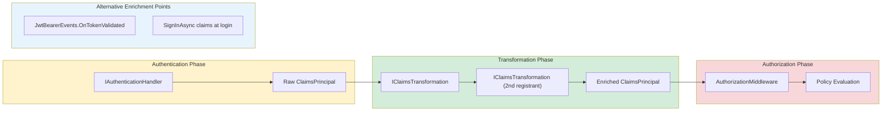
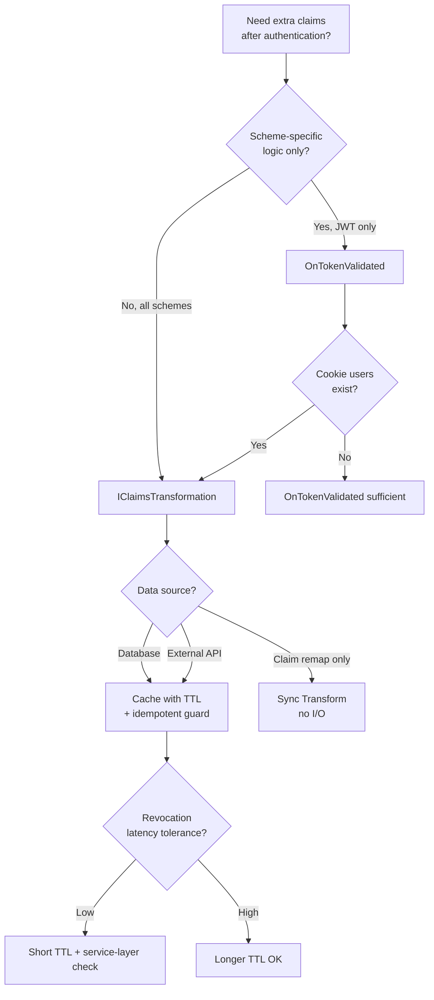

> [!success] Mastery Check
> - [ ] **Studied Well**
> - [ ] **Can explain the concept without notes**
> - [ ] **Can answer interview questions confidently**
> - [ ] **Can implement it in a real project**

# 4.149 — Claims Transformation: IClaimsTransformation for Principal Enrichment

---

## PART 0 — Navigation & Context

### Domain Hierarchy

```
ASP.NET Core Mastery
│
├── Authentication (4.134–4.153)
│   ├── 4.134 — Authentication Architecture
│   ├── 4.136 — JWT Bearer (claims from token)
│   ├── 4.147 — Authentication Events (OnTokenValidated alternative)
│   ├── 4.148 — Multiple Authentication Schemes
│   ├── ► 4.149 — Claims Transformation ◄ YOU ARE HERE
│   │           IClaimsTransformation
│   │           Principal enrichment before authorization
│   ├── 4.151 — IAuthenticationService
│   └── 4.152 — Multi-Scheme APIs
│
└── Authorization (4.154+)
    ├── 4.155 — Claims-Based Authorization ← consumes enriched claims
    └── 4.164 — Authorization Caching ← required at scale for DB enrichment
```

### What You Need Before This

- **[[4.134 — Authentication Architecture]]** — `ClaimsPrincipal`, `ClaimsIdentity`, and when `HttpContext.User` is set
- **[[4.136 — JWT Bearer Authentication]]** — JWT claim mapping (`sub` vs `NameIdentifier`) is the primary motivation for transformation
- **[[4.147 — Authentication Events]]** — `OnTokenValidated` is the per-scheme alternative; know when to use which
- **[[4.035 — Service Lifetimes]]** — `IClaimsTransformation` is registered Transient; DB access requires scoped resolution

### What This Unlocks After

- **[[4.155 — Claims-Based Authorization]]** — policies like `RequireClaim("permission", "orders:write")` need enriched claims
- **[[4.164 — Authorization Caching]]** — DB-backed claim loading must be cached inside transformation
- **[[4.161 — Permission-Based Authorization]]** — fine-grained permissions arrive via transformation, not JWT

### Why This Matters at Scale

> **JWTs should stay small and stale-tolerant; application permissions change hourly. `IClaimsTransformation` is the sanctioned pipeline hook that loads current roles and permissions into `HttpContext.User` after token validation but before authorization — skip caching here and you turn every API request into a database round-trip.**

---

## PART 1 — The Core Mental Model

### The Fundamental Rule

> **ASP.NET Core invokes every registered `IClaimsTransformation` after authentication succeeds and before the enriched `ClaimsPrincipal` is used for authorization. The practical consequence is that authorization policies read transformed claims, not raw token claims — and transformation runs on every authenticated request unless you cache internally.**

### The Plain-Language Analogy

Authentication hands you a **visitor badge** (JWT or cookie identity) with name and employee ID. Claims transformation is the **security desk that stamps additional access zones** (permissions, tenant ID, department) onto the badge before you reach the elevator (authorization). The badge from the turnstile doesn't change — a new stamped overlay is applied each visit. If the desk looks up permissions from a slow database without a cheat sheet (cache), the line at security becomes the building bottleneck. Concurrent visitors each get their own stamp pass; transformations don't share mutable state across requests.

### Taxonomy Diagram



---

## PART 2 — Deep Mechanics

### 2.1 — Pipeline Position and Invocation Timing

```
──► Routing ──► AuthenticationMiddleware ──► [AuthenticateAsync succeeds]
    ──► IClaimsTransformation.TransformAsync(principal)  ◄── HERE
    ──► HttpContext.User = enriched principal
    ──► AuthorizationMiddleware ──► Endpoint
```

**ASP.NET Core internally (approximate):**

```csharp
// DefaultAuthenticationService.AuthenticateAsync — after handler succeeds:
//   foreach (var transform in _transformations)
//       principal = await transform.TransformAsync(principal);
// Cost: O(n) transformations, each may await
```

**HTTP wire format:** Transformation does not alter HTTP — client still sends same `Authorization: Bearer` header. Server-side only mutation of `ClaimsPrincipal`.

**Runtime cost:** One `IClaimsTransformation` registration = one async call per authenticated request; ~1 async state machine allocation minimum.

**Edge case:** Transformation runs even when principal is from cookie sliding expiration refresh — not only on initial login.

---

### 2.2 — Registration and DI Lifetime

```csharp
// Built-in registration:
services.AddTransient<IClaimsTransformation, PermissionsClaimsTransformation>();
// Multiple registrations: ALL run in registration order
```

**Pipeline position:** Runs inside `IAuthenticationService`, not as middleware — no `next()` short-circuit.

**Captive dependency risk:** Transformation class is Transient but resolved per-call; injecting Scoped `DbContext` directly works because transformation is resolved within request scope. Injecting Scoped into Singleton wrapper does not.

**Runtime cost:** Transient resolution ~1 DI lookup per transformation per request.

---

### 2.3 — IClaimsTransformation vs OnTokenValidated

| Aspect | IClaimsTransformation | OnTokenValidated |
|---|---|---|
| Scope | All schemes uniformly | Per-scheme (JWT only if JWT handler) |
| Runs for cookie auth | Yes | Only if Cookie events configured |
| Pipeline position | After any handler success | Inside JwtBearerHandler |
| Multiple registrants | All `IClaimsTransformation` | One events object per scheme |

**HTTP consequence:** Cookie-authenticated MVC request gets permissions from `IClaimsTransformation`; JWT-only enrichment in `OnTokenValidated` leaves cookie users without permissions → **403 Forbidden** on `[Authorize(Policy = "CanEditOrders")]`.

---

### 2.4 — Mutating the Principal Correctly

**ASP.NET Core internally expects:**

```csharp
public async Task<ClaimsPrincipal> TransformAsync(ClaimsPrincipal principal)
{
    // Clone identity or add claims to existing ClaimsIdentity
    var identity = (ClaimsIdentity)principal.Identity!;
    if (!identity.HasClaim(c => c.Type == "permissions_loaded"))
    {
        var permissions = await LoadPermissionsAsync(principal);
        identity.AddClaims(permissions.Select(p => new Claim("permission", p)));
        identity.AddClaim(new Claim("permissions_loaded", "true"));
    }
    return principal; // same reference, mutated identity
}
```

**Failure mode:** Returning a new principal without preserving `AuthenticationType` → authorization may treat identity as unauthenticated.

**Runtime cost:** Each `AddClaim` ~1 allocation; prefer array batch or cached claim set.

---

### 2.5 — Failure and Exception Behavior

```
TransformAsync throws exception
    → Authentication fails (AuthenticateResult.Fail)
    → HTTP/1.1 401 Unauthorized (not 500, if caught by auth service)
    → Endpoint never executes
```

**Edge case:** Swallowing exceptions and returning under-enriched principal → silent **403** at authorization instead of **401** — harder to debug.

---

## PART 3 — Production Code Patterns

### Pattern 1: Permission Enrichment for E-Commerce Order API

```csharp
public sealed class OrderPermissionsClaimsTransformation : IClaimsTransformation
{
    private readonly IServiceScopeFactory _scopeFactory;
    private readonly IMemoryCache _cache;

    public OrderPermissionsClaimsTransformation(
        IServiceScopeFactory scopeFactory,
        IMemoryCache cache)
    {
        _scopeFactory = scopeFactory;
        _cache = cache;
    }

    public async Task<ClaimsPrincipal> TransformAsync(ClaimsPrincipal principal)
    {
        var userId = principal.FindFirstValue(ClaimTypes.NameIdentifier);
        if (userId is null) return principal;

        var cacheKey = $"perms:{userId}";
        if (!_cache.TryGetValue(cacheKey, out string[] permissions))
        {
            await using var scope = _scopeFactory.CreateAsyncScope();
            var repo = scope.ServiceProvider.GetRequiredService<IOrderPermissionsRepository>();
            permissions = await repo.GetPermissionsAsync(userId);
            _cache.Set(cacheKey, permissions, TimeSpan.FromMinutes(5));
        }

        var identity = (ClaimsIdentity)principal.Identity!;
        foreach (var perm in permissions)
            identity.AddClaim(new Claim("permission", perm));

        return principal;
    }
}

// HTTP wire format: unchanged request
// Authorization now sees permission claims → 200 on allowed actions, 403 on denied
```

### Pattern 2: Tenant Claim Injection for Multi-Tenant Logistics API

```csharp
// ✅ CORRECT: tenant from header validated against user's allowed tenants
public async Task<ClaimsPrincipal> TransformAsync(ClaimsPrincipal principal)
{
    var httpContext = _httpContextAccessor.HttpContext!;
    var requestedTenant = httpContext.Request.Headers["X-Tenant-Id"].ToString();
    var userId = principal.FindFirstValue(ClaimTypes.NameIdentifier)!;

    var allowedTenants = await _tenantService.GetUserTenantsAsync(userId);
    if (!allowedTenants.Contains(requestedTenant))
    {
        // Remove authentication effective for this tenant — fail authorization
        return new ClaimsPrincipal(new ClaimsIdentity());
    }

    ((ClaimsIdentity)principal.Identity!).AddClaim(new Claim("tenant_id", requestedTenant));
    return principal;
}

// HTTP: missing/invalid tenant → 403 on [Authorize(Policy = "TenantScoped")]
```

### Pattern 3: Anti-Pattern — DB Hit Every Request Without Cache

```csharp
// ⚠️ WRONG:
public async Task<ClaimsPrincipal> TransformAsync(ClaimsPrincipal principal)
{
    await using var scope = _scopeFactory.CreateAsyncScope();
    var db = scope.ServiceProvider.GetRequiredService<AppDbContext>();
    var roles = await db.UserRoles.Where(r => r.UserId == userId).ToListAsync();
    // ~1 DB round-trip per request at 10k req/s = catastrophe
}

// ✅ CORRECT: see Pattern 1 with IMemoryCache or HybridCache (4.196)
```

### Pattern 4: Normalize JWT `sub` to NameIdentifier

```csharp
public Task<ClaimsPrincipal> TransformAsync(ClaimsPrincipal principal)
{
    var identity = (ClaimsIdentity)principal.Identity!;
    var sub = identity.FindFirst("sub") ?? identity.FindFirst(JwtRegisteredClaimNames.Sub);
    if (sub is not null && identity.FindFirst(ClaimTypes.NameIdentifier) is null)
        identity.AddClaim(new Claim(ClaimTypes.NameIdentifier, sub.Value));
    return Task.FromResult(principal);
}

// HTTP: policies using User.FindFirstValue(ClaimTypes.NameIdentifier) now work with JWT
```

### Pattern 5: Idempotent Transformation Guard

```csharp
public async Task<ClaimsPrincipal> TransformAsync(ClaimsPrincipal principal)
{
    if (principal.HasClaim("transform_version", "v2"))
        return principal; // ~0 cost path for repeat calls within same auth pass

    // ... enrichment ...
    ((ClaimsIdentity)principal.Identity!).AddClaim(new Claim("transform_version", "v2"));
    return principal;
}
```

### Pattern 6: Healthcare Portal — Role Sync from External Directory

```csharp
// LDAP/Entra ID groups → application roles at request time
var directoryGroups = await _graphClient.GetMemberGroupsAsync(userId);
var appRoles = _roleMapping.MapGroupsToRoles(directoryGroups);
identity.AddClaims(appRoles.Select(r => new Claim(ClaimTypes.Role, r)));

// HTTP: [Authorize(Roles = "Physician")] succeeds after transform
// Token itself only contained group IDs in custom claim
```

### Pattern 7: Testing Transformation in Isolation

```csharp
[Fact]
public async Task Transform_Adds_Permission_Claims()
{
    var principal = new ClaimsPrincipal(new ClaimsIdentity(
        new[] { new Claim(ClaimTypes.NameIdentifier, "user-42") },
        authenticationType: "Bearer"));

    var sut = new OrderPermissionsClaimsTransformation(_scopeFactory, _cache);
    var result = await sut.TransformAsync(principal);

    Assert.Contains(result.Claims, c => c.Type == "permission" && c.Value == "orders:read");
}
```

---

## PART 4 — Gotchas & Anti-Patterns

### Gotcha 1: Enrichment Only in OnTokenValidated — Cookie Users Unprotected

```csharp
// ⚠️ WRONG: permissions only in JwtBearerEvents
o.Events.OnTokenValidated = async ctx => { /* add permissions */ };

// HTTP (cookie user):
// GET /orders → 403 Forbidden (no permission claims on cookie principal)
```

```csharp
// ✅ CORRECT: IClaimsTransformation for scheme-agnostic enrichment
services.AddTransient<IClaimsTransformation, OrderPermissionsClaimsTransformation>();
```

**WHY:** Cookie handler never fires JwtBearerEvents; authorization policies assume uniform claim shape.

---

### Gotcha 2: Returning New Principal Without AuthenticationType

```csharp
// ⚠️ WRONG:
return new ClaimsPrincipal(new ClaimsIdentity(claims)); // AuthenticationType = null

// HTTP: 401 or 403 — IsAuthenticated == false
```

```csharp
// ✅ CORRECT: mutate existing identity or preserve AuthenticationType
var identity = new ClaimsIdentity(claims, principal.Identity!.AuthenticationType);
```

---

### Gotcha 3: Unbounded Claim Growth on Every Request

```csharp
// ⚠️ WRONG: AddClaim without idempotency check — duplicate permission claims each request
foreach (var p in permissions) identity.AddClaim(new Claim("permission", p));

// HTTP: still 200 but memory bloat; policy eval slows O(n) on duplicate claims
```

```csharp
// ✅ CORRECT: guard with marker claim or replace identity claims atomically
```

---

### Gotcha 4: Scoped Service Injected into Singleton Transformation Wrapper

```csharp
// ⚠️ WRONG: captive dependency
services.AddSingleton<IClaimsTransformation, BadTransformation>();
// constructor takes AppDbContext (scoped)

// HTTP: ObjectDisposedException or stale context — intermittent 500
```

```csharp
// ✅ CORRECT: IServiceScopeFactory per TransformAsync call
```

---

### Gotcha 5: Throwing on Missing Optional Claim

```csharp
// ⚠️ WRONG:
if (userId is null) throw new InvalidOperationException("No user id");

// HTTP: 401 for anonymous endpoints that still run transformation
```

```csharp
// ✅ CORRECT:
if (userId is null) return principal; // pass through for anonymous
```

---

## PART 5 — Performance Implications

### Request Pipeline Characteristics Table

| Scenario | Pipeline Depth | Allocations Per Request | Approx Latency Impact | Recommendation |
|---|---|---|---|---|
| No-op transform (early return) | +1 async call | ~0–1 | <0.01 ms | Use idempotency guard |
| Cache hit (IMemoryCache) | +1 async call | ~2 | +0.05 ms | Target production path |
| Cache miss + DB | +1 async + DB RTT | ~10+ | +2–20 ms | TTL 5–15 min |
| 3 registered transformations | 3 sequential awaits | ~3 state machines | +0.1 ms + I/O | Consolidate to one |
| Graph API group lookup | +HTTP RTT | ~20+ | +50–200 ms | Cache aggressively |
| Add 50 permission claims | claim allocations | ~50 strings | +0.1 ms | Use claim compression / roles |
| Anonymous request | transform may still run | 0 if passthrough | 0 | Return early |
| Redis distributed cache | +1 RTT | ~5 | +1–5 ms | Multi-instance consistency |

### BenchmarkDotNet

```csharp
[MemoryDiagnoser]
public class ClaimsTransformBenchmarks
{
    private ClaimsPrincipal _principal = default!;
    private IMemoryCache _cache = default!;

    [GlobalSetup]
    public void Setup()
    {
        _principal = new ClaimsPrincipal(new ClaimsIdentity(
            new[] { new Claim(ClaimTypes.NameIdentifier, "u1") }, "Bearer"));
        _cache = new MemoryCache(new MemoryCacheOptions());
        _cache.Set("perms:u1", new[] { "orders:read", "orders:write" }, TimeSpan.FromMinutes(5));
    }

    [Benchmark(Baseline = true)]
    public ClaimsPrincipal NoOp() => _principal;

    [Benchmark]
    public ClaimsPrincipal CacheHitEnrichment()
    {
        var identity = (ClaimsIdentity)_principal.Identity!;
        if (_cache.TryGetValue("perms:u1", out string[] perms))
            foreach (var p in perms) identity.AddClaim(new Claim("permission", p));
        return _principal;
    }

    [Benchmark]
    public ClaimsPrincipal IdempotentGuard()
    {
        if (_principal.HasClaim("loaded", "true")) return _principal;
        return _principal;
    }
}

// Expected output (approximate, .NET 8):
// | NoOp              | 1 ns   | 0 B   |
// | IdempotentGuard   | 15 ns  | 0 B   |
// | CacheHitEnrichment| 180 ns | 256 B |
```

### When This Costs You

- Every authenticated request hits DB without cache at >1k req/s.
- Graph/LDAP directory calls inside transformation.
- Multiple transformation classes doing redundant work.

### When This Doesn't Matter

- Internal tools with roles embedded in JWT (<20 claims).
- Low-traffic admin APIs where 5ms DB lookup is acceptable.

---

## PART 6 — Interview Arsenal

### A. Question Bank

**Q1: What is IClaimsTransformation and when does it run?**

> **Great Answer:** It's a hook the authentication service calls after a handler successfully authenticates but before authorization evaluates policies. I use it to load permissions from a database or normalize JWT claims like `sub` into `NameIdentifier` so my policies work across Bearer and cookie schemes. The HTTP client doesn't see any difference — same Authorization header — but the server-side `User` object gains claims that drive 403 vs 200 decisions.

**Q2: How is it different from OnTokenValidated?**

> **Great Answer:** OnTokenValidated is JWT-specific and runs inside the Bearer handler. IClaimsTransformation runs for every scheme — critical when my MVC users authenticate via cookie and mobile users via JWT but both need the same permission claims. I've been burned putting enrichment only in JwtBearerEvents and wondering why browser users always got 403.

**Q3: How do you avoid a database call per request?**

> **Great Answer:** Idempotent guard claim plus IMemoryCache or HybridCache keyed by user ID with a short TTL. I accept eventual consistency — a revoked permission might live for five minutes in cache — and pair that with critical-action checks in the service layer for financial operations.

### B. Trick Questions

**T1: "Does transformation run for anonymous users?"** — Usually yes if authentication middleware invokes it; return principal unchanged if no user ID.

**T2: "Can I register two IClaimsTransformation?"** — Yes, both run sequentially.

**T3: "Does transformation change the JWT?"** — No, server-side principal only.

### C. Red Flags

1. "Transformation modifies the Authorization header" — wrong layer.
2. "It runs in authorization middleware" — wrong; runs in authentication service.
3. "Singleton DbContext in transformation" — captive dependency.
4. "Only needed for JWT apps" — cookie apps need it too.
5. "Throwing exceptions gives 500" — typically becomes auth failure 401.

---

## PART 7 — Decision Framework



---

## PART 8 — Self-Check

### Conceptual Questions

1. Where in the pipeline does `IClaimsTransformation` execute relative to `AuthorizationMiddleware`?
2. What happens to the HTTP response if `TransformAsync` throws?
3. Why is idempotency important within a single request?
4. How do multiple registered transformations compose?
5. What happens to the HTTP request if transformation strips all claims from the principal?
6. Does transformation run on every request or only at login?
7. How does caching interact with permission revocation?
8. What's the difference between adding claims and replacing the principal?
9. How does `IClaimsTransformation` interact with multiple authentication schemes?
10. When should enrichment move to the service layer instead?

### Code Puzzles

**Puzzle 1:** Transformation throws `SqlException`. Status code for authenticated endpoint?

<details><summary>Answer</summary>Typically **401 Unauthorized** — authentication treated as failed; endpoint not reached.</details>

**Puzzle 2:** Permissions added in `OnTokenValidated` only. Cookie user hits `[Authorize(Policy="CanShip")]`. Status?

<details><summary>Answer</summary>**403 Forbidden** — authenticated via cookie but missing permission claims.</details>

**Puzzle 3:** `return new ClaimsPrincipal(new ClaimsIdentity(claims))` without auth type. `User.Identity.IsAuthenticated`?

<details><summary>Answer</summary>**false** — leads to 401/403 at authorization.</details>

**Puzzle 4:** Idempotent guard present. Second call in same request adds duplicate claims?

<details><summary>Answer</summary>Transformation typically called once per auth pass — but if called twice without guard, duplicates accumulate. Guard prevents this.</details>

**Puzzle 5:** No cache, 10k req/s, 2ms DB query. Bottleneck?

<details><summary>Answer</summary>Database — 10k queries/s from transformation alone; P99 collapses. Cache required.</details>

---

## PART 9 — Connections & Resources

### Related Topics Table

| Topic | Why It Connects |
|---|---|
| [[4.147 — Authentication Events]] | Alternative enrichment point for JWT-specific logic |
| [[4.164 — Authorization Caching]] | Caching strategy for DB-backed transformation |
| [[4.155 — Claims-Based Authorization]] | Consumes enriched claims in policies |
| [[4.148 — Multiple Authentication Schemes]] | Transformation unifies claim shapes across schemes |
| [[4.186 — IMemoryCache]] | Primary cache backing for permission loading |
| [[2.35 — IDisposable and IAsyncDisposable]] | Scope disposal in transformation |

### Books

| Book | Chapters | Why |
|---|---|---|
| *ASP.NET Core in Action* | Ch 23 | Claims, identities, and authorization integration |
| *Pro ASP.NET Core* | Ch 15 | Security pipeline and claims |
| *Identity and Access Management* | Ch 8–9 | Permission models feeding transformation design |

### Essential Docs

- [IClaimsTransformation API](https://learn.microsoft.com/en-us/dotnet/api/microsoft.aspnetcore.authentication.iclaimstransformation)
- [Mapping, customizing, and transforming claims](https://learn.microsoft.com/en-us/aspnet/core/security/authentication/claims)
- [Andrew Lock — IClaimsTransformation deep dive](https://andrewlock.net/)

> [!NOTE]
> **Part 0** — context. **Part 1** — one-sentence rule. **Part 2** — pipeline timing and mutation rules. **Part 3** — production enrichment with cache. **Part 4** — scheme and lifetime bugs. **Part 5** — DB-per-request cost. **Part 6** — interview narratives. **Part 7** — transformation vs events decision. **Part 8** — puzzles. **Part 9** — links to caching and authorization.
