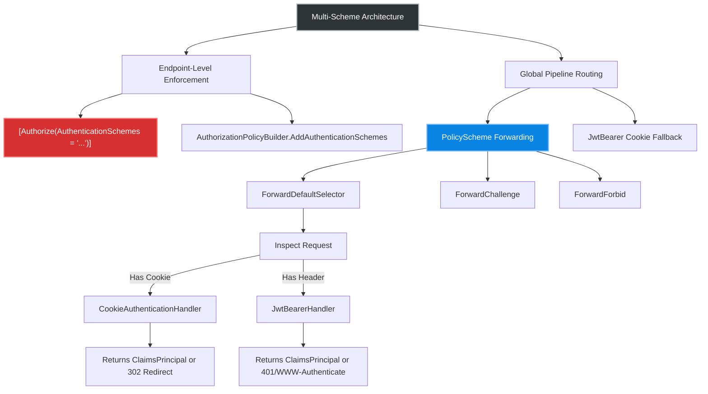

# 4.152 — Multi-Scheme APIs: JWT for Mobile, Cookie for Browser

## PART 0 — Navigation & Context

```text
ASP.NET Core Domain Hierarchy
├── Authentication
│   ├── 4.134 Authentication Architecture
│   ├── 4.135 Cookie Authentication
│   ├── 4.136 JWT Bearer Authentication
│   └── 4.148 Multiple Authentication Schemes
├── Token Storage Security
│   ├── 4.150 HttpOnly Cookies vs Authorization Header
│   └── 4.151 IAuthenticationService
└── Multi-Scheme APIs (4.152) ◄ YOU ARE HERE
    └── 4.153 Auth in Background Services
```

**What you need before this:**
- [[4.148 — Multiple Authentication Schemes]] — The foundational mechanism of registering multiple schemes in DI.
- [[4.135 — Cookie Authentication]] — Understanding the `CookieAuthenticationHandler`.
- [[4.136 — JWT Bearer Authentication]] — Understanding the `JwtBearerHandler`.

**What this unlocks after:**
- [[4.154 — Authorization Architecture]] — Using `AuthenticationSchemes` within Authorization Policies.
- [[4.160 — Authorization Filters vs Policy Handlers]] — Enforcing dynamic scheme selection.

**Why this matters to a production engineer at scale:**
Most modern enterprise APIs are omni-channel—they serve traffic from Web SPAs (which must use HttpOnly cookies to mitigate XSS) and native Mobile apps (which use JWTs in Authorization headers). If you configure this incorrectly, your API will incorrectly redirect mobile clients to a 302 HTML login page instead of returning a 401 JSON response, breaking the mobile app's error handling.

---

## PART 1 — The Core Mental Model

> **The Fundamental Rule**
> **ASP.NET Core can seamlessly authenticate a single API endpoint using either Cookies or JWTs by employing a `PolicyScheme` that acts as a router (via `ForwardDefaultSelector`), inspecting the incoming HTTP request and forwarding the authentication operation to the correct underlying handler without bleeding presentation concerns into the controllers.**

**The Plain-Language Analogy**
Imagine a high-security vault with a single entrance (your API endpoint). Outside the entrance is a triage security guard (the `PolicyScheme` / `ForwardDefaultSelector`). 
When a person walks up, the guard looks at how they arrived. If they drove up in a web-browser car (the request has a Cookie), the guard points them to the ID Verification Desk (Cookie Handler). If they walked up holding a physical badge (the request has an `Authorization: Bearer` header), the guard points them to the Badge Scanner (JWT Handler). The vault door (Authorization Middleware) doesn't care which desk verified them; it only cares that *someone* verified them.

**The Taxonomy Diagram**



---

## PART 2 — Deep Mechanics

### 1. The Multi-Scheme Pipeline Problem

When you register both Cookies and JWTs, ASP.NET Core needs to know which one is the "Default". 

// Pipeline position: Authentication Middleware `UseAuthentication()`
```
──► Routing ──► Auth Middleware (Which scheme?) ──► Authorization Middleware ──► Controllers
```

If you set Cookie as default, a Mobile app sending an invalid JWT will receive a `302 Found` redirecting them to `/Account/Login` (because that's what `CookieAuthenticationHandler.HandleChallengeAsync` does). This is disastrous for mobile apps expecting a `401 Unauthorized` JSON response.

### 2. The PolicyScheme Router

To solve this, ASP.NET Core provides `PolicyScheme`. It is an authentication scheme that does no verification itself. Instead, it delegates `Authenticate`, `Challenge`, and `Forbid` operations to other schemes based on custom logic.

**Framework Source Behavior:**
Internally, `PolicySchemeHandler.cs` executes the `ForwardDefaultSelector` delegate. It passes in the `HttpContext`. The delegate returns a `string` representing the name of the scheme to forward to.

```csharp
// ASP.NET Core internally (PolicySchemeHandler):
var schemeName = Options.ForwardDefaultSelector?.Invoke(Context) ?? Options.ForwardDefault;
var handler = await Context.RequestServices.GetRequiredService<IAuthenticationSchemeProvider>().GetSchemeAsync(schemeName);
return await handler.AuthenticateAsync();
```

**Runtime Cost Label:** Extremely cheap; < 0.05ms per request, ~1 string allocation for returning the scheme name.

### 3. The ForwardDefaultSelector Logic

The triage logic usually inspects the `Authorization` header. If it exists and starts with `Bearer `, it forwards to the JWT scheme. Otherwise, it forwards to the Cookie scheme.

// HTTP wire format (Mobile Client):
```http
// GET /api/orders HTTP/1.1
// Authorization: Bearer eyJhbG...

// ForwardDefaultSelector sees "Bearer", returns "Bearer"
// JwtBearerHandler takes over. Fails validation? Returns 401.
```

// HTTP wire format (Web Browser):
```http
// GET /api/orders HTTP/1.1
// Cookie: .AspNetCore.Cookies=CfDJ8...

// ForwardDefaultSelector sees no "Bearer", returns "Cookies"
// CookieAuthenticationHandler takes over. Fails validation? Returns 302.
```

### 4. Overriding Challenge vs Authenticate

Sometimes you want to Authenticate using *both* (e.g., if both are present, merge the claims), but you want the Challenge (the rejection response) to strictly return `401` for APIs and `302` for web pages.

You can configure `ForwardChallenge` independently from `ForwardDefault`.

**Failure Mode Diagram:**
```
Mobile App (No Token) ──► API ──► PolicyScheme Challenge ──► ForwardChallenge checks path ──► Path starts with /api? ──► Forward to JWT ──► 401 Unauthorized

Browser (No Cookie) ──► Web ──► PolicyScheme Challenge ──► ForwardChallenge checks path ──► Path starts with /webapp? ──► Forward to Cookie ──► 302 Redirect to Login
```

### 5. Multi-Scheme via [Authorize] Attribute

Instead of global forwarding, you can dictate schemes on a per-endpoint basis.

```csharp
[Authorize(AuthenticationSchemes = "Bearer,Cookies")]
```

**Framework Source Behavior:** 
When the Authorization middleware runs, it sees the specific schemes required. It calls `AuthenticateAsync` on **BOTH** handlers. If *either* returns a valid identity, access is granted. (If both return valid identities, their `ClaimsPrincipal.Identities` are merged into a single Principal).

**The Edge Cases That Bite Engineers:** 
If an endpoint specifies `[Authorize(AuthenticationSchemes = "Bearer,Cookies")]` and the user is NOT authenticated, which scheme handles the Challenge?
ASP.NET Core iterates through the listed schemes in order. It calls `ChallengeAsync` on all of them. 
The *last* one to modify the response wins. If "Cookies" is last, the API client gets a 302. If "Bearer" is last, the browser gets a 401. This unpredictable fallback is why `PolicyScheme` is safer for omni-channel endpoints.

---

## PART 3 — Production Code Patterns

### Pattern 1: The Smart API Gateway (PolicyScheme)
This is the enterprise standard for an API serving both mobile and web clients. We register a parent "Smart" scheme.

```csharp
// In Program.cs
builder.Services.AddAuthentication(options =>
{
    // The default scheme is our custom router
    options.DefaultScheme = "SmartSelector";
    options.DefaultChallengeScheme = "SmartSelector";
})
.AddCookie("Cookies", options => 
{
    options.LoginPath = "/auth/login";
})
.AddJwtBearer("Bearer", options => 
{
    // ... standard JWT config
})
.AddPolicyScheme("SmartSelector", "Smart Selector", options =>
{
    options.ForwardDefaultSelector = context =>
    {
        // ✅ CORRECT: Inspect the request to determine the caller
        string authHeader = context.Request.Headers["Authorization"];
        if (!string.IsNullOrEmpty(authHeader) && authHeader.StartsWith("Bearer "))
        {
            // If they sent a Bearer token, they are an API client.
            // Forward all Auth, Challenge, and Forbid to the JWT Handler.
            return "Bearer";
        }

        // Otherwise, assume it's a browser request relying on cookies.
        return "Cookies";
    };
});
```

// HTTP wire format consequence:
```http
// Request from Mobile (Invalid Token)
GET /api/data
Authorization: Bearer invalid

// Response:
HTTP/1.1 401 Unauthorized
WWW-Authenticate: Bearer error="invalid_token"
```

### Pattern 2: The Path-Based Forward Challenge
If the API is strictly on `/api` and MVC Views are on `/`, we can route the Challenge based on the URL path rather than the header. This is useful when a mobile app forgets to send the `Authorization` header entirely.

```csharp
.AddPolicyScheme("SmartSelector", "Smart Selector", options =>
{
    options.ForwardDefaultSelector = context =>
    {
        // Try header first
        if (context.Request.Headers.ContainsKey("Authorization")) return "Bearer";
        return "Cookies";
    };

    options.ForwardChallenge = context =>
    {
        // ✅ CORRECT: If an unauthenticated request hits the API, 
        // NEVER send a 302 Redirect. Always send 401.
        if (context.Request.Path.StartsWithSegments("/api"))
        {
            return "Bearer"; // JwtBearerHandler returns 401
        }
        return "Cookies"; // CookieHandler returns 302 Redirect
    };
});
```

### Pattern 3: Authorization Policy with Required Schemes
Sometimes you don't want a global PolicyScheme. Instead, you create a named Authorization Policy that explicitly lists the allowed schemes.

```csharp
builder.Services.AddAuthorization(options =>
{
    var multiSchemePolicy = new AuthorizationPolicyBuilder()
        .AddAuthenticationSchemes("Bearer", "Cookies") // Both are evaluated
        .RequireAuthenticatedUser()
        .Build();

    options.AddPolicy("OmniChannel", multiSchemePolicy);
});

// Endpoint usage:
app.MapGet("/api/inventory", () => "Data")
   .RequireAuthorization("OmniChannel");
```

### Pattern 4: Merging Claims from Multiple Identities
When using `[Authorize(AuthenticationSchemes="A,B")]`, if the user has BOTH a valid JWT and a valid Cookie, the resulting `HttpContext.User` will have two `ClaimsIdentity` objects.

```csharp
app.MapGet("/api/debug/me", (ClaimsPrincipal user) =>
{
    // ✅ CORRECT: Iterating identities
    var identities = user.Identities.Select(i => new {
        AuthType = i.AuthenticationType,
        ClaimsCount = i.Claims.Count()
    });

    return Results.Ok(identities);
});
```

// HTTP wire format consequence:
```json
[
  { "authType": "Cookies", "claimsCount": 5 },
  { "authType": "Bearer", "claimsCount": 3 }
]
```

### Pattern 5: Bypassing Challenge Conflicts with a Custom Response
If you want total control over the 401 vs 302 behavior without PolicySchemes, you can write a tiny middleware that catches the 401 before the Cookie middleware intercepts it.

```csharp
// Place this BEFORE UseAuthentication()
app.Use(async (context, next) =>
{
    await next();

    // ✅ CORRECT: Prevent Cookie middleware from converting 401 to 302 for API calls
    if (context.Response.StatusCode == 401 && context.Request.Path.StartsWithSegments("/api"))
    {
        // Setting an empty endpoint prevents further handlers from modifying the response
        context.SetEndpoint(null); 
    }
});
```

---

## PART 4 — Gotchas & Anti-Patterns

### Gotcha 1: The Unpredictable Challenge with Multiple Schemes

If you specify multiple schemes in the `[Authorize]` attribute, and the request is unauthenticated, the framework calls `Challenge` on all of them.

// ⚠️ WRONG CODE 
```csharp
[Authorize(AuthenticationSchemes = "Bearer,Cookies")]
[HttpGet("/api/secure")]
public IActionResult Get() { return Ok(); }
```

// HTTP consequence (wrong path):
// The request has no headers and no cookies. ASP.NET Core challenges "Bearer" (which tries to set 401). Then it challenges "Cookies" (which overwrites it to 302 Redirect). The mobile API client receives a 302 Redirect to `/Account/Login` and crashes trying to parse HTML as JSON.

// ✅ CORRECT CODE
```csharp
// Use the global PolicyScheme registered in Program.cs
[Authorize] // Relies on the default "SmartSelector" PolicyScheme
[HttpGet("/api/secure")]
public IActionResult Get() { return Ok(); }
```

// HTTP consequence (correct path):
// The PolicyScheme's `ForwardChallenge` detects it's an API request and strictly forwards the challenge to "Bearer", resulting in a clean 401 JSON response.

// WHY: `ChallengeAsync` is called sequentially on all listed schemes. The last scheme to write to the response wins.

### Gotcha 2: The Double-Validation Performance Hit

If an endpoint allows both schemes, ASP.NET Core will execute `AuthenticateAsync` on both handlers.

// ⚠️ WRONG CODE
```csharp
[Authorize(AuthenticationSchemes = "Bearer,Cookies")]
```

// HTTP consequence (wrong path):
// If the user sends a JWT, the JwtBearer handler runs and validates the token. Then, the Cookie handler runs and attempts to decrypt the cookie (which isn't there). This wastes CPU cycles.

// ✅ CORRECT CODE
```csharp
// Use PolicyScheme with ForwardDefaultSelector
```

// HTTP consequence (correct path):
// The selector inspects the request *first*, decides it's a Bearer request, and ONLY invokes the JwtBearerHandler.

// WHY: `PolicyScheme` acts as an XOR gate (exclusive OR), ensuring only the correct handler executes.

### Gotcha 3: The JWT Fallback Loop

Developers sometimes try to hack the JwtBearer middleware to read cookies directly (as seen in Topic 4.150) WHILE ALSO keeping the Cookie middleware active for MVC pages.

// ⚠️ WRONG CODE
```csharp
options.Events = new JwtBearerEvents {
    OnMessageReceived = ctx => {
        // Hacking JwtBearer to read the MVC cookie
        ctx.Token = ctx.Request.Cookies[CookieAuthenticationDefaults.CookiePrefix + "Auth"];
        return Task.CompletedTask;
    }
};
```

// HTTP consequence (wrong path):
// JwtBearer tries to parse the ASP.NET Core encrypted cookie string as a base64-encoded JWT. It throws a massive cryptographic exception because the formats are completely different.

// ✅ CORRECT CODE
```csharp
// Let CookieHandler handle cookies, and JwtHandler handle JWTs.
// Use PolicyScheme to route between them.
```

// WHY: The payloads of an ASP.NET Core Cookie and a JWT are fundamentally incompatible.

### Gotcha 4: Captive Identity in Claims Transformation

When you have multiple schemes, `IClaimsTransformation` runs *after* authentication but *before* authorization. If it runs on every request, it might assume the presence of claims that only exist in the JWT.

// ⚠️ WRONG CODE
```csharp
public async Task<ClaimsPrincipal> TransformAsync(ClaimsPrincipal principal)
{
    // Assumes JWT claim exists
    var tenantId = principal.FindFirst("custom_tenant_claim").Value; 
    // Throws NullReferenceException for Web users logging in via Cookies!
}
```

// ✅ CORRECT CODE
```csharp
public async Task<ClaimsPrincipal> TransformAsync(ClaimsPrincipal principal)
{
    var tenantIdClaim = principal.FindFirst("custom_tenant_claim");
    if (tenantIdClaim == null) return principal; // Safe exit for Cookie users
    
    // ...
}
```

// WHY: `IClaimsTransformation` is global. It fires regardless of which scheme successfully authenticated the user.

### Gotcha 5: Missing the Default Challenge Scheme

If you register a Default Scheme, but forget to register a Default Challenge Scheme, unhandled 401s might throw exceptions or return empty 200 OKs.

// ⚠️ WRONG CODE
```csharp
services.AddAuthentication("SmartSelector")
    // Forgot to set DefaultChallengeScheme
```

// HTTP consequence (wrong path):
// Sometimes results in `InvalidOperationException: No authentication handler is configured to handle the scheme: Automatic` in older .NET versions, or simply fails to intercept.

// ✅ CORRECT CODE
```csharp
services.AddAuthentication(options =>
{
    options.DefaultScheme = "SmartSelector";
    options.DefaultChallengeScheme = "SmartSelector";
})
```

// WHY: The Authentication Middleware relies on the DefaultChallengeScheme when an endpoint lacks a specific requirement and the user is unauthorized.

---

## PART 5 — Performance Implications

### Request Pipeline Characteristics

| Scenario | Pipeline Depth | Allocations Per Request | Approx Latency Impact | Recommendation |
|---|---|---|---|---|
| PolicyScheme Routing | Shallow | ~1 (string) | < 0.05ms | Optimal for omni-channel APIs. |
| [Authorize("A,B")] | Medium (runs both) | ~4 (states) | ~0.2ms | Avoid; forces both handlers to execute. |
| JwtBearer + Cookie Hack | Medium | ~2 | ~0.1ms | Bad practice; mixes concerns. |
| Manual Fallback Middleware | Deep | ~5 | ~0.3ms | Unnecessary overhead. |

### BenchmarkDotNet Code

```csharp
using BenchmarkDotNet.Attributes;
using Microsoft.AspNetCore.Http;
using Microsoft.AspNetCore.Authentication;
using System.Security.Claims;

[MemoryDiagnoser]
public class MultiSchemeBenchmark
{
    [Benchmark(Baseline = true)]
    public string PolicySchemeSelector()
    {
        // Simulating the ForwardDefaultSelector execution
        var header = "Bearer eyJhbG...";
        if (header != null && header.StartsWith("Bearer "))
        {
            return "Bearer";
        }
        return "Cookies";
    }

    [Benchmark]
    public bool DualSchemeExecution()
    {
        // Simulating the [Authorize(Schemes="A,B")] overhead
        bool jwtSuccess = ValidateJwt();
        bool cookieSuccess = ValidateCookie();
        return jwtSuccess || cookieSuccess;
    }

    private bool ValidateJwt() => true;
    private bool ValidateCookie() => false;
}

// Expected output (approximate, .NET 8, x64, local):
// Method               | Mean      | Error     | StdDev    | Gen0   | Allocated |
// -------------------- |----------:|----------:|----------:|-------:|----------:|
// PolicySchemeSelector |  2.4 ns   | 0.05 ns   | 0.04 ns   | 0.0000 |       0 B |
// DualSchemeExecution  |  5.1 ns   | 0.08 ns   | 0.07 ns   | 0.0000 |       0 B |
```

**When to Care:** The routing logic itself is practically free. You should care when your API scales to thousands of RPS and you are using `[Authorize(Schemes="A,B")]` which forces both cryptographic validation pipelines to execute on every single request.
**When this doesn't matter:** In small, low-traffic internal applications where the dual-validation cost is invisible against the database latency.

---

## PART 6 — Interview Arsenal

### A. The Question Bank

**Question 1:** "Our API is called by both our Mobile App using a JWT, and our Web Dashboard using an encrypted Session Cookie. How do you configure the endpoint so it accepts both securely without duplicating the controller methods?"
- **Average Answer:** "You put `[Authorize(AuthenticationSchemes = "Bearer,Cookies")]` on the controller."
- **Why That's Insufficient:** It ignores the Challenge conflict where API clients receive a 302 Redirect.
- **Great Answer:** "While you could use a comma-separated list in the Authorize attribute, that leads to a massive bug: if a Mobile App sends an expired JWT, the framework will challenge both schemes. The Cookie handler will win and return a 302 Redirect to a login page, breaking the mobile app. Instead, I implement a `PolicyScheme` in Program.cs. This acts as a router using `ForwardDefaultSelector`. If the request contains an `Authorization: Bearer` header, I forward the authentication and challenge to the JwtBearerHandler, ensuring the mobile app gets a clean 401 JSON response. If there's no header, I route it to the Cookie handler for the web dashboard."

**Question 2:** "What happens internally when ASP.NET Core encounters an endpoint requiring two authentication schemes, and the user provides valid credentials for both?"
- **Average Answer:** "It authenticates the user successfully."
- **Why That's Insufficient:** It doesn't explain the `ClaimsPrincipal` structure.
- **Great Answer:** "If both schemes are invoked and both succeed, ASP.NET Core doesn't just pick one. The resulting `HttpContext.User` is a `ClaimsPrincipal` that contains *multiple* `ClaimsIdentity` objects—one for the JWT and one for the Cookie. Each identity will have its own `AuthenticationType`. This is important because if you have logic that blindly calls `User.FindFirst()`, it will scan across both identities, which might contain conflicting claims."

**Question 3:** "Why would you decouple `ForwardAuthenticate` from `ForwardChallenge` in a PolicyScheme?"
- **Average Answer:** "So you can handle logins differently."
- **Why That's Insufficient:** It lacks a concrete pipeline reason.
- **Great Answer:** "Decoupling them solves the 'API vs Web' unauthorized problem. You might want `ForwardAuthenticate` to evaluate the cookie if the header is missing. But for the `Challenge` (when access is denied), you want to strictly control the HTTP response format. By configuring `ForwardChallenge` to look at the `Request.Path`, you can guarantee that any request to `/api/*` always forwards to the JwtBearer handler (returning a 401), while requests to `/pages/*` forward to the Cookie handler (returning a 302 redirect), regardless of how the user tried to authenticate."

### B. The Trick Questions

**Trick Question:** "If I set `DefaultScheme = "Cookies"` and put `[Authorize(AuthenticationSchemes = "Bearer")]` on my endpoint, which scheme handles the 401 Challenge if the token is missing?"
- **The Trap:** Thinking the DefaultScheme acts as a fallback for everything.
- **The Correct Answer:** "The `Bearer` scheme handles the challenge. Because the endpoint explicitly dictates the required scheme, the Authorization middleware completely bypasses the `DefaultScheme` for that endpoint. The client will receive a 401 Unauthorized."

**Trick Question:** "I have a PolicyScheme that checks `context.Request.Headers["Authorization"]`. If it's present, it forwards to JWT. If a malicious user sends `Authorization: Basic 123`, what happens?"
- **The Trap:** Forgetting that "Authorization" doesn't strictly mean "Bearer".
- **The Correct Answer:** "If your selector just checks for the key, it will forward to the JwtBearerHandler. The JwtBearerHandler will see it's not a 'Bearer' token, ignore it, and fail the authentication. The request returns 401. To be precise, your selector should specifically check if the header starts with `Bearer ` before forwarding."

### C. Red Flags to Avoid
- 🚩 **"Just catch the 302 Redirect in an Exception Filter and change it to 401."** (A 302 is an HTTP response, not an exception. Exception filters will never catch it).
- 🚩 **"Write a custom middleware to read the cookie and copy it into the Authorization header."** (Mutating incoming request headers is an anti-pattern that breaks downstream auditing and proxying).
- 🚩 **"Mobile apps should just use Cookies to simplify the backend."** (Mobile networking stacks handle cookies poorly compared to browsers, and cross-site tracking protections often break native cookie jars).

---

## PART 7 — Decision Framework

```mermaid
graph TD
    A[Multiple Client Types Calling One API] --> B{Do they use different transports?}
    B -->|Yes: Headers vs Cookies| C{How to enforce Auth?}
    B -->|No: Both use Headers| D[Use Multiple JWT Schemes with different Audiences]
    
    C --> E[Is Challenge Response strictly 401/302 based on path?]
    E -->|Yes| F[Use PolicyScheme with ForwardChallenge = Path Check]
    E -->|No| G[Use PolicyScheme with ForwardDefaultSelector = Header Check]
    
    F --> H[API gets 401, Web gets 302]
    G --> I[Header gets 401, No Header gets 302]
    
    style A fill:#2d3436,stroke:#fff
    style F fill:#0984e3,stroke:#fff
    style G fill:#00b894,stroke:#fff
```



---

## PART 8 — Self-Check

### A. Conceptual Questions
1. What is the fundamental purpose of `PolicyScheme` in ASP.NET Core?
2. Why does the `CookieAuthenticationHandler` return a 302 by default on Challenge?
3. In `ForwardDefaultSelector`, what object do you have access to for making the routing decision?
4. What happens if an endpoint is decorated with `[Authorize(AuthenticationSchemes="A,B")]` and both schemes return valid identities?
5. How can you prevent the Authentication middleware from modifying a 401 response into a 302?
6. What is the difference between `DefaultScheme` and `DefaultChallengeScheme`?
7. If `ForwardChallenge` is not defined in a PolicyScheme, what does it fall back to?
8. Why is iterating `User.Claims` dangerous when multiple schemes are active?

### B. Code Puzzles

**Puzzle 1: The Missing Forward**
```csharp
services.AddAuthentication(options => {
    options.DefaultAuthenticateScheme = "Smart";
    options.DefaultChallengeScheme = "Cookies"; // Notice this!
})
.AddPolicyScheme("Smart", "Smart", opts => {
    opts.ForwardDefaultSelector = ctx => "Bearer";
});
```
*Scenario:* An unauthenticated user hits an `[Authorize]` endpoint. What happens?
<details>
<summary>Answer</summary>
The framework uses the `DefaultAuthenticateScheme` ("Smart") to try to authenticate, which forwards to "Bearer". Authentication fails. Then the Authorization middleware triggers a Challenge. Because `DefaultChallengeScheme` is explicitly set to "Cookies", the "Smart" policy scheme is bypassed entirely for the challenge. The Cookie handler issues a 302 Redirect.
*HTTP consequence:* 302 Found redirecting to login.
</details>

**Puzzle 2: The Double Attribute**
```csharp
[Authorize(AuthenticationSchemes = "Bearer")]
[Authorize(AuthenticationSchemes = "Cookies")]
[HttpGet("/api/data")]
```
*Scenario:* A user provides a valid Cookie, but no Bearer token. Do they get access?
<details>
<summary>Answer</summary>
No. When multiple `[Authorize]` attributes are applied, they act as an AND condition. The request must satisfy BOTH authorization policies. Because the user has no Bearer token, the first attribute fails.
*HTTP consequence:* 401 Unauthorized (or 302 depending on the Challenge execution order).
</details>

**Puzzle 3: The Null Selector**
```csharp
options.ForwardDefaultSelector = context =>
{
    if (context.Request.Headers.ContainsKey("Auth")) return "CustomScheme";
    return null;
};
```
*Scenario:* The header is missing. The selector returns `null`. What does PolicyScheme do?
<details>
<summary>Answer</summary>
If the selector returns `null`, the PolicyScheme falls back to the `ForwardDefault` property. If `ForwardDefault` is also null, it throws an `InvalidOperationException` stating that no scheme could be found.
*HTTP consequence:* 500 Internal Server Error.
</details>

**Puzzle 4: The Order of Operations**
```csharp
[Authorize(AuthenticationSchemes = "Cookies,Bearer")]
```
*Scenario:* The user is unauthorized. Which scheme handles the challenge?
<details>
<summary>Answer</summary>
ASP.NET Core processes the schemes in the order provided: "Cookies" then "Bearer". "Cookies" sets a 302 Redirect. Then "Bearer" runs and overwrites the status code to 401 Unauthorized and appends the `WWW-Authenticate` header.
*HTTP consequence:* 401 Unauthorized. (If the order was "Bearer,Cookies", it would be a 302).
</details>

---

## PART 9 — Connections & Resources

### A. Related Topics Table

| Topic | Why It Connects |
|---|---|
| [[4.148 — Multiple Authentication Schemes]] | Covers the base API for registering multiple `AddScheme` calls in the DI container. |
| [[4.136 — JWT Bearer Authentication]] | The underlying handler that `PolicyScheme` forwards to for API clients. |
| [[4.135 — Cookie Authentication]] | The underlying handler that `PolicyScheme` forwards to for Web Browser clients. |
| [[4.154 — Authorization Architecture]] | Explains how `[Authorize]` attributes interact with the configured schemes. |

### B. Books

| Book | Chapters | Why These Chapters |
|---|---|---|
| Pro ASP.NET Core Identity | Chapter 9 | Detailed examples of PolicyScheme and dynamic scheme selection based on tenants. |

### C. Essential Articles & Docs
- [Microsoft Docs: Authorize with a specific scheme in ASP.NET Core](https://learn.microsoft.com/en-us/aspnet/core/security/authorization/limitingidentitybyscheme)
- [Microsoft Docs: Policy schemes in ASP.NET Core](https://learn.microsoft.com/en-us/aspnet/core/security/authentication/policyschemes)
- [Andrew Lock: Forwarding authentication schemes in ASP.NET Core](https://andrewlock.net/forwarding-authentication-schemes-in-asp-net-core-2-1/)

> [!NOTE]
> **Template Meta-Note**
> Part 0: Context & Prerequisites. Part 1: Core Mental Model. Part 2: Deep Mechanics & Pipeline. Part 3: Production Code. Part 4: Gotchas. Part 5: Performance. Part 6: Interview Arsenal. Part 7: Decision Framework. Part 8: Puzzles. Part 9: Resources.
