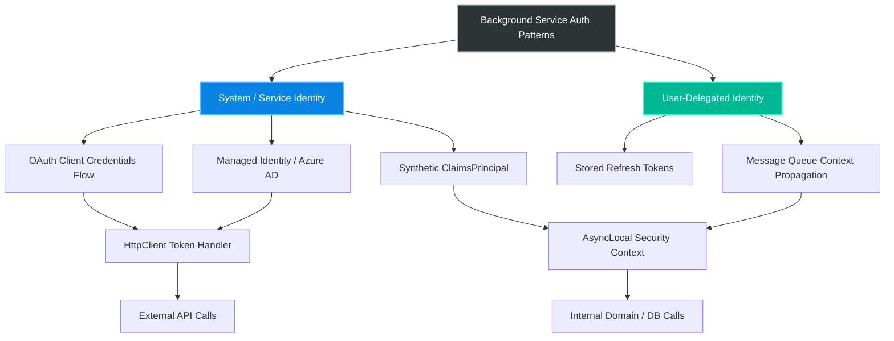

# 4.153 — Auth in Background Services: Headless Identity and Service Accounts

## PART 0 — Navigation & Context

```text
ASP.NET Core Domain Hierarchy
├── Authentication
│   ├── 4.136 JWT Bearer Authentication
│   └── 4.145 API Key Authentication
├── Background Services
│   ├── 4.232 BackgroundService Base Class
│   └── 4.047 DI Scope in Background Services
└── Auth in Background Services (4.153) ◄ YOU ARE HERE
    └── 4.234 Queued Background Tasks
```

**What you need before this:**
- [[4.232 — BackgroundService]] — Understanding how long-running singletons operate outside the HTTP request lifecycle.
- [[4.047 — DI Scope in Background Services]] — Understanding how to use `IServiceScopeFactory` to resolve scoped dependencies like EF Core `DbContext`.

**What this unlocks after:**
- [[4.234 — Queued Background Tasks]] — Securely processing user-initiated tasks asynchronously.
- [[4.238 — Hangfire in ASP.NET Core]] — Passing authentication context to out-of-process job runners.

**Why this matters to a production engineer at scale:**
Background services operate without an `HttpContext`. If your domain layer relies on `IHttpContextAccessor` to retrieve the current user for row-level security or audit logging, calling that domain logic from a `BackgroundService` will crash with a `NullReferenceException`. Production engineers must architect "headless" identity flows (like OAuth Client Credentials) and ambient context propagators to securely execute background work.

---

## PART 1 — The Core Mental Model

> **The Fundamental Rule**
> **Because `BackgroundService` runs entirely outside the HTTP pipeline, it has no `HttpContext`, no incoming headers, and no user identity; you must explicitly provision a "Service Account" identity and inject it into a scoped execution context using `IServiceScopeFactory` before calling secured domain logic.**

**The Plain-Language Analogy**
Imagine a bank branch. During the day, customers walk up to the teller window, present their ID, and the teller performs actions on their behalf (HTTP Requests). At night, after the branch is closed, the bank's automated accounting robots need to move money around (Background Services). The robots cannot pretend to be customers because they don't have customer IDs. Instead, the bank issues the robots special "Service Badges." Before a robot accesses the vault, it must explicitly swipe its Service Badge to create a temporary, audited security context, proving *the system* is performing the action, not a user.

**The Taxonomy Diagram**



---

## PART 2 — Deep Mechanics

### 1. The HttpContext Vacuum

A `BackgroundService` is started by the `IHostedService` lifecycle during application startup.

// Pipeline position: Completely outside the ASP.NET Core Middleware Pipeline.
```
Generic Host Start ──► HostedServices Start ──► Kestrel Starts (HTTP begins here)
                       │
                       └──► BackgroundService.ExecuteAsync() loop
```

Because it runs concurrently with, but completely separate from, the HTTP pipeline, attempting to inject `IHttpContextAccessor` into a service called by a `BackgroundService` will yield `null`.

**Framework Source Behavior:** `HttpContextAccessor.HttpContext` relies on an `AsyncLocal<HttpContextHolder>`. The execution context of the `BackgroundService` never intersects with the `AsyncLocal` populated by the HTTP server.

**Runtime Cost Label:** Accessing a null `HttpContext` is cheap, but the resulting `NullReferenceException` crashes your background worker.

### 2. External Authentication: OAuth Client Credentials

When a background service needs to call an external API (e.g., Stripe, Azure, another microservice), it cannot use an Authorization Code flow because there is no browser to redirect. It must use the **OAuth 2.0 Client Credentials Flow**.

The service sends its `client_id` and `client_secret` directly to the identity provider to obtain an `access_token`.

// HTTP wire format (Service to IDP):
```http
POST /connect/token HTTP/1.1
Content-Type: application/x-www-form-urlencoded

grant_type=client_credentials&client_id=inventory_service&client_secret=super_secret&scope=api.read
```

// HTTP wire format (IDP Response):
```json
{
  "access_token": "eyJhb...",
  "expires_in": 3600,
  "token_type": "Bearer"
}
```

**Runtime Cost Label:** 1 HTTP round-trip per token lifecycle (typically cached for 1 hour).

### 3. Internal Authentication: The Ambient Context

When a background service needs to call *internal* domain logic (e.g., EF Core `SaveChanges` that writes audit logs based on the "current user"), you must provide an identity without an HTTP request.

Instead of `IHttpContextAccessor`, modern architectures use a custom `ICurrentUserService` backed by an `AsyncLocal<ClaimsPrincipal>`.

**Framework Source Behavior:** `AsyncLocal<T>` automatically flows down the asynchronous call stack. If you set it inside a `using (var scope = factory.CreateScope())` block inside your background service, all code executed within that scope can read the identity.

**Runtime Cost Label:** ~1 `AsyncLocal` allocation per execution loop; negligible overhead.

### 4. User-Delegated Background Work (Outbox/Queues)

Sometimes a background service must perform an action *on behalf of* a specific user (e.g., generating a long-running report). The service needs the user's claims, but the user's HTTP request has already finished.

You must serialize the user's essential claims (e.g., `UserId`, `TenantId`) into the database queue or message bus. When the background service dequeues the message, it reconstructs a `ClaimsPrincipal` and sets it in the ambient context.

**Failure Mode Diagram:**
```
User HTTP POST ──► Enqueue Message (No TenantId) ──► HTTP 202 Accepted
...later...
BackgroundService ──► Dequeue Message ──► Calls Domain ──► Domain checks TenantId ──► NullReferenceException ──► Message Dead-Lettered
```

### 5. Automatic Token Management (Token Handlers)

For external API calls, manually acquiring and caching the OAuth token is tedious. The optimal pattern uses a `DelegatingHandler` injected into the `HttpClient` pipeline via `IHttpClientFactory`. 

// Pipeline position: Inside the HttpClient outgoing request pipeline.
```
HttpClient.SendAsync ──► TokenAcquisitionHandler ──► (Cache hit?) ──► SocketsHttpHandler ──► Network
                                │
                                └──► (Cache miss) ──► Call IDP ──► Update Cache
```

---

## PART 3 — Production Code Patterns

### Pattern 1: The Client Credentials HttpClient (IdentityModel)
Using the `IdentityModel.AspNetCore` NuGet package to automatically manage headless authentication for outbound API calls from a background service.

```csharp
// Program.cs
builder.Services.AddClientCredentialsTokenManagement()
    .AddClient("billing_api", client =>
    {
        client.TokenEndpoint = "https://idp.local/connect/token";
        client.ClientId = "inventory_worker";
        client.ClientSecret = builder.Configuration["BillingApi:Secret"];
        client.Scope = "billing.write";
    });

// Register the HttpClient with the automatic token handler
builder.Services.AddHttpClient<IBillingClient, BillingClient>(client =>
{
    client.BaseAddress = new Uri("https://api.billing.local");
})
.AddClientCredentialsTokenHandler("billing_api"); 
// 👆 Automatically acquires, caches, and attaches the Bearer token!
```

```csharp
// Inside the BackgroundService
public class BillingSyncWorker : BackgroundService
{
    private readonly IBillingClient _billingClient;

    public BillingSyncWorker(IBillingClient billingClient)
    {
        _billingClient = billingClient; // Safe to inject if HttpClient is Singleton/Transient
    }

    protected override async Task ExecuteAsync(CancellationToken stoppingToken)
    {
        while (!stoppingToken.IsCancellationRequested)
        {
            // ✅ CORRECT: The injected client automatically handles Auth headers
            await _billingClient.SyncAccountsAsync(stoppingToken);
            await Task.Delay(TimeSpan.FromMinutes(5), stoppingToken);
        }
    }
}
```

// HTTP wire format consequence:
```http
// Outbound request from BackgroundService
POST /api/accounts/sync HTTP/1.1
Host: api.billing.local
Authorization: Bearer eyJhbG... (Automatically attached by the handler)
```

### Pattern 2: The Synthetic Principal for Internal Domain Logic
When your EF Core DbContext requires an identity for Audit Logs (e.g., `CreatedBy`), you must construct a synthetic "System" principal.

```csharp
public interface ICurrentUserService
{
    ClaimsPrincipal Principal { get; }
    void SetCurrentPrincipal(ClaimsPrincipal principal);
}

// Scoped implementation backed by AsyncLocal
public class CurrentUserService : ICurrentUserService
{
    private readonly AsyncLocal<ClaimsPrincipal> _currentPrincipal = new();

    public ClaimsPrincipal Principal => _currentPrincipal.Value;

    public void SetCurrentPrincipal(ClaimsPrincipal principal)
    {
        _currentPrincipal.Value = principal;
    }
}
```

```csharp
public class DataCleanupWorker : BackgroundService
{
    private readonly IServiceScopeFactory _scopeFactory;

    public DataCleanupWorker(IServiceScopeFactory scopeFactory)
    {
        _scopeFactory = scopeFactory;
    }

    protected override async Task ExecuteAsync(CancellationToken stoppingToken)
    {
        // ✅ CORRECT: Create a scope for the execution
        using var scope = _scopeFactory.CreateScope();
        
        var userService = scope.ServiceProvider.GetRequiredService<ICurrentUserService>();
        var dbContext = scope.ServiceProvider.GetRequiredService<AppDbContext>();

        // Create a synthetic System identity
        var claims = new[] {
            new Claim(ClaimTypes.NameIdentifier, "SYSTEM_WORKER"),
            new Claim(ClaimTypes.Role, "SystemAdmin")
        };
        var identity = new ClaimsIdentity(claims, "WorkerAuth");
        var principal = new ClaimsPrincipal(identity);

        // Set the ambient context
        userService.SetCurrentPrincipal(principal);

        // DbContext.SaveChanges can now read ICurrentUserService.Principal
        await dbContext.CleanupOldRecordsAsync(stoppingToken);
    }
}
```

### Pattern 3: Propagating User Identity via Message Queue
When an HTTP request triggers background work, you must serialize the user's context.

```csharp
// 1. The API Controller (HTTP Context exists)
[HttpPost("generate-report")]
public async Task<IActionResult> RequestReport(ReportRequest req)
{
    // Serialize essential claims
    var message = new ReportJobMessage
    {
        ReportType = req.Type,
        UserId = User.FindFirstValue(ClaimTypes.NameIdentifier),
        TenantId = User.FindFirstValue("tenant_id")
    };

    await _queue.EnqueueAsync(message);
    return Accepted();
}
```

```csharp
// 2. The BackgroundService (HTTP Context does NOT exist)
protected override async Task ExecuteAsync(CancellationToken stoppingToken)
{
    await foreach (var message in _queue.ConsumeAsync(stoppingToken))
    {
        using var scope = _scopeFactory.CreateScope();
        var userService = scope.ServiceProvider.GetRequiredService<ICurrentUserService>();

        // ✅ CORRECT: Rehydrate the user's identity from the message
        var claims = new[] {
            new Claim(ClaimTypes.NameIdentifier, message.UserId),
            new Claim("tenant_id", message.TenantId)
        };
        userService.SetCurrentPrincipal(new ClaimsPrincipal(new ClaimsIdentity(claims, "QueueAuth")));

        var reportGenerator = scope.ServiceProvider.GetRequiredService<IReportGenerator>();
        await reportGenerator.GenerateAsync(message.ReportType); // Safely filters by TenantId
    }
}
```

### Pattern 4: Managed Identity (Azure)
If hosted in Azure, you don't need Client Secrets. You use Managed Identity to get a token for the Background Service.

```csharp
// Using Azure.Identity DefaultAzureCredential
using var scope = _scopeFactory.CreateScope();
var dbContext = scope.ServiceProvider.GetRequiredService<AppDbContext>();

// Provide the Managed Identity token directly to the SQL Connection
var credential = new DefaultAzureCredential();
var token = await credential.GetTokenAsync(
    new TokenRequestContext(new[] { "https://database.windows.net/.default" }), 
    stoppingToken);

var connection = (SqlConnection)dbContext.Database.GetDbConnection();
connection.AccessToken = token.Token;

await dbContext.SaveChangesAsync(stoppingToken);
```

### Pattern 5: Bypassing Auth in Internal Services
Sometimes, domain services enforce authorization using `IAuthorizationService`. A background worker shouldn't have to evaluate policies. You can bypass this by decorating internal requests.

```csharp
// IAuthorizationService wrapper
public class DomainAuthorizationService
{
    private readonly ICurrentUserService _user;
    
    public bool IsAuthorized(string policy)
    {
        // ✅ CORRECT: Explicit bypass for background workers
        if (_user.Principal.HasClaim("ServiceAccount", "true"))
        {
            return true; 
        }
        
        // Evaluate real policies for HTTP users...
    }
}
```

---

## PART 4 — Gotchas & Anti-Patterns

### Gotcha 1: Injecting IHttpContextAccessor into Domain Services

A domain layer designed exclusively for web APIs often hardcodes `IHttpContextAccessor`.

// ⚠️ WRONG CODE
```csharp
public class OrderService
{
    private readonly IHttpContextAccessor _httpContextAccessor;
    
    public OrderService(IHttpContextAccessor httpContextAccessor) { ... }

    public void ProcessOrder()
    {
        var userId = _httpContextAccessor.HttpContext.User.FindFirstValue("sub");
        // ...
    }
}
```

// HTTP consequence (wrong path):
// When called from a Web API, it works. When called from a `BackgroundService`, `HttpContext` is null. `NullReferenceException` is thrown, and the background worker crashes.

// ✅ CORRECT CODE
```csharp
public class OrderService
{
    private readonly ICurrentUserService _currentUserService;
    
    public OrderService(ICurrentUserService currentUserService) { ... }

    public void ProcessOrder()
    {
        var userId = _currentUserService.Principal.FindFirstValue("sub");
        // ...
    }
}
```

// WHY: `ICurrentUserService` is an abstraction. In the web API, its implementation wraps `IHttpContextAccessor`. In the background service, its implementation wraps a synthetic `AsyncLocal<ClaimsPrincipal>`.

### Gotcha 2: Captive Dependencies in Token Handlers

If you manually inject a Scoped token service into a Singleton BackgroundService, you create a captive dependency.

// ⚠️ WRONG CODE
```csharp
public class SyncWorker : BackgroundService
{
    private readonly TokenService _tokenService; // TokenService is Scoped!

    public SyncWorker(TokenService tokenService) // Exception at startup!
    {
        _tokenService = tokenService;
    }
}
```

// HTTP consequence (wrong path):
// ASP.NET Core DI throws `InvalidOperationException: Cannot consume scoped service from singleton` during application startup. The app fails to boot.

// ✅ CORRECT CODE
```csharp
public class SyncWorker : BackgroundService
{
    private readonly IServiceScopeFactory _scopeFactory;

    public SyncWorker(IServiceScopeFactory scopeFactory)
    {
        _scopeFactory = scopeFactory;
    }

    protected override async Task ExecuteAsync(CancellationToken ct)
    {
        using var scope = _scopeFactory.CreateScope();
        var tokenService = scope.ServiceProvider.GetRequiredService<TokenService>();
        // ...
    }
}
```

// WHY: `BackgroundService` is a Singleton. It must manually create scopes to resolve Scoped dependencies safely.

### Gotcha 3: Caching OAuth Tokens Forever

If you manually acquire a Client Credentials token, you might cache it in a singleton variable and forget it expires.

// ⚠️ WRONG CODE
```csharp
private string _cachedToken;

protected override async Task ExecuteAsync(CancellationToken ct)
{
    _cachedToken ??= await GetTokenFromIdentityServer();
    
    while (!ct.IsCancellationRequested)
    {
        // Uses the same token for days!
        await CallApi(_cachedToken); 
        await Task.Delay(10000);
    }
}
```

// HTTP consequence (wrong path):
// Works for 1 hour. Then the API returns `401 Unauthorized`. The worker loop continues failing forever because the token is never refreshed.

// ✅ CORRECT CODE
```csharp
// Rely on IdentityModel.AspNetCore or explicitly check expiry
protected override async Task ExecuteAsync(CancellationToken ct)
{
    while (!ct.IsCancellationRequested)
    {
        // HttpClient managed by IdentityModel handles caching and 401 retries automatically
        await _httpClient.GetAsync("/api/data", ct); 
        await Task.Delay(10000);
    }
}
```

// WHY: The `IdentityModel` DelegatingHandler internally checks the token's `expires_in` claim and requests a new one seamlessly before expiration.

### Gotcha 4: Assuming System Accounts Bypass Tenant Filters

In multi-tenant systems using EF Core Global Query Filters, a synthetic identity might forget the `TenantId`.

// ⚠️ WRONG CODE
```csharp
var principal = new ClaimsPrincipal(new ClaimsIdentity(new[] {
    new Claim(ClaimTypes.NameIdentifier, "SYSTEM")
}));
_userService.SetCurrentPrincipal(principal);

var users = await dbContext.Users.ToListAsync(); // Returns 0 records
```

// HTTP consequence (wrong path):
// The DbContext query filter `u => u.TenantId == _userService.TenantId` fails because the TenantId claim is missing from the synthetic principal. The background job processes nothing.

// ✅ CORRECT CODE
```csharp
// Temporarily bypass query filters for system-wide jobs
var users = await dbContext.Users.IgnoreQueryFilters().ToListAsync();

// OR provide a specific TenantId if the job is tenant-scoped
```

// WHY: Global Query Filters apply at the database level. If the ambient identity lacks the required routing claims, queries will return empty sets.

### Gotcha 5: Stale AsyncLocal Context Leakage

If you use `AsyncLocal` but forget to clear it, thread pool threads might retain the identity.

// ⚠️ WRONG CODE
```csharp
// Inside a transient message handler
_userService.SetCurrentPrincipal(messagePrincipal);
await _processor.ProcessAsync();
// Method ends, but AsyncLocal value remains on this execution context
```

// ✅ CORRECT CODE
```csharp
// ICurrentUserService implementation
public IDisposable BeginScope(ClaimsPrincipal principal)
{
    var previous = _currentPrincipal.Value;
    _currentPrincipal.Value = principal;
    return new DisposeAction(() => _currentPrincipal.Value = previous);
}

// Usage:
using (_userService.BeginScope(messagePrincipal))
{
    await _processor.ProcessAsync();
} // Safely restores previous context
```

// WHY: While `AsyncLocal` automatically flows *down*, if a pooled object or long-running execution context is reused, the value must be explicitly unwound to prevent privilege escalation.

---

## PART 5 — Performance Implications

### Request Pipeline Characteristics

| Scenario | Pipeline Depth | Allocations Per Request | Approx Latency Impact | Recommendation |
|---|---|---|---|---|
| IHttpContextAccessor | N/A (Null in BG) | 0 | 0ms | Do not use in domain layer. |
| AsyncLocal<ClaimsPrincipal>| Shallow | ~1 (class alloc) | < 0.05ms | Optimal for ambient context propagation. |
| IdentityModel Token Handler | Medium | ~2 (cache lookup)| < 0.2ms | Optimal for outbound OAuth calls. |
| Manual Token Request | Deep | High (HTTP stack) | 50ms - 200ms | Only execute on cache miss (1 per hour). |

### BenchmarkDotNet Code

```csharp
using System.Threading;
using BenchmarkDotNet.Attributes;
using System.Security.Claims;

[MemoryDiagnoser]
public class AmbientContextBenchmark
{
    private AsyncLocal<ClaimsPrincipal> _asyncLocal = new();
    private ClaimsPrincipal _principal = new ClaimsPrincipal(new ClaimsIdentity(new[] { new Claim("sub", "123") }));

    [Benchmark(Baseline = true)]
    public ClaimsPrincipal PassAsParameter()
    {
        return Process(_principal);
    }

    private ClaimsPrincipal Process(ClaimsPrincipal p) => p;

    [Benchmark]
    public ClaimsPrincipal UseAsyncLocal()
    {
        _asyncLocal.Value = _principal;
        return ProcessWithAmbient();
    }

    private ClaimsPrincipal ProcessWithAmbient() => _asyncLocal.Value;
}

// Expected output (approximate, .NET 8, x64, local):
// Method           | Mean      | Error     | StdDev    | Gen0   | Allocated |
// ---------------- |----------:|----------:|----------:|-------:|----------:|
// PassAsParameter  |  0.4 ns   | 0.01 ns   | 0.01 ns   | 0.0000 |       0 B |
// UseAsyncLocal    | 12.5 ns   | 0.15 ns   | 0.14 ns   | 0.0038 |      24 B |
```

**When to Care:** The 12ns overhead of `AsyncLocal` is imperceptible. You should never avoid `AsyncLocal` for performance reasons when building ambient identity context. 
**When this costs you:** Failing to cache external OAuth Client Credentials tokens. Making an HTTP request to the Identity Provider for every background loop iteration will exhaust SNAT ports and throttle your service.

---

## PART 6 — Interview Arsenal

### A. The Question Bank

**Question 1:** "Our generic `AuditLoggingService` reads `IHttpContextAccessor.HttpContext.User` to record who made a change. We want to reuse this service inside a nightly `BackgroundService` to clean up old records. What will happen?"
- **Average Answer:** "It will probably crash because there's no HTTP request at night."
- **Why That's Insufficient:** It identifies the problem but doesn't provide the architectural solution.
- **Great Answer:** "It will throw a `NullReferenceException`. A `BackgroundService` runs outside the ASP.NET Core request pipeline, so `HttpContext` is strictly null. To fix this, I would refactor the domain layer to depend on an `ICurrentUserService` abstraction instead. For the Web API, the implementation wraps `IHttpContextAccessor`. For the background worker, the implementation wraps an `AsyncLocal<ClaimsPrincipal>`. In the worker's `ExecuteAsync`, I would construct a synthetic 'System' principal and set it in the ambient context before invoking the audit logging service."

**Question 2:** "Your background worker needs to call a secure downstream API using OAuth 2.0. How do you securely manage the tokens?"
- **Average Answer:** "I would send an HTTP POST to the auth server with my client ID and secret, get the token, and put it in the header."
- **Why That's Insufficient:** It ignores token expiration, caching, and thread-safety.
- **Great Answer:** "Background services use the OAuth Client Credentials flow. Manually managing this is prone to expiration bugs. I would use the `IdentityModel.AspNetCore` library to register a Client Credentials token handler in DI. Then, I configure the typed `HttpClient` for the downstream API to use this token handler. The handler automatically executes the HTTP request to the Identity Provider, caches the token in memory, monitors its `expires_in` claim, and automatically attaches it to outgoing requests. It's completely transparent to my background service code."

**Question 3:** "If a background task is processing a message off a RabbitMQ queue, how do you ensure row-level security policies (like Tenant Isolation) are respected?"
- **Average Answer:** "You put the Tenant ID in the message payload and query the database with it."
- **Why That's Insufficient:** It breaks encapsulation if domain logic relies on implicit global query filters.
- **Great Answer:** "Because the HTTP context is gone, the background worker must rehydrate the authorization context. I serialize the `TenantId` into the RabbitMQ message header. When the worker dequeues the message, it creates a new DI scope, instantiates a `ClaimsPrincipal` containing the `TenantId` claim, and sets it in the scoped `ICurrentUserService`. When EF Core executes, its Global Query Filters read the Tenant ID directly from that ambient service. This ensures the background worker is strictly sandboxed to the data of the tenant who triggered the message."

### B. The Trick Questions

**Trick Question:** "I injected `IHttpClientFactory` into my `BackgroundService`. Can I configure it to automatically forward the incoming user's JWT to the downstream API?"
- **The Trap:** Thinking token forwarding (like `AddUserAccessTokenHandler`) works in background services.
- **The Correct Answer:** "No. A `BackgroundService` does not have an incoming HTTP request, so there is no 'incoming user's JWT' to forward. If the background work requires the user's token, the user must delegate access (e.g., using a Refresh Token stored in the database), or the background service must authenticate itself using a Client Credentials flow."

**Trick Question:** "Can we just mock `HttpContext` in the background service to avoid refactoring the domain layer?"
- **The Trap:** Trying to instantiate `DefaultHttpContext` to bypass bad architecture.
- **The Correct Answer:** "While technically possible using `DefaultHttpContext`, it is a severe anti-pattern. `HttpContext` contains hundreds of properties (Response, Request, Headers, Connection) that are meaningless in a background worker. Mocking it pollutes your background logic with fake web concerns. You should extract the identity requirement into an `ICurrentUserService` interface."

### C. Red Flags to Avoid
- 🚩 **"Just pass the UserId as a string through every method signature down to the database."** (Pollutes domain logic; ambient context is the standard solution for cross-cutting concerns like identity).
- 🚩 **"Store the user's JWT in the database and have the background worker use it."** (Massive security risk; JWTs expire quickly anyway. Use Refresh Tokens if offline access is required).
- 🚩 **"Make the background service send an HTTP request to its own API to get an HttpContext."** (Loopback requests to yourself are slow, waste threads, and introduce network failure points to local background processing).

---

## PART 7 — Decision Framework

```mermaid
graph TD
    A[Background Service Needs Identity] --> B{Whose Identity?}
    
    B -->|The System Itself| C{Calling External API?}
    B -->|A Specific User| D{Does it call External API on user's behalf?}
    
    C -->|Yes| E[OAuth Client Credentials Flow + TokenHandler]
    C -->|No, Internal Domain| F[Synthetic Principal + AsyncLocal Context]
    
    D -->|Yes| G[Store and use OAuth Refresh Token]
    D -->|No, Internal Domain| H[Rehydrate ClaimsPrincipal from Queue Message]
    
    style A fill:#2d3436,stroke:#fff
    style E fill:#0984e3,stroke:#fff
    style F fill:#00b894,stroke:#fff
    style G fill:#0984e3,stroke:#fff
    style H fill:#00b894,stroke:#fff
```



---

## PART 8 — Self-Check

### A. Conceptual Questions
1. Why does `IHttpContextAccessor.HttpContext` return null inside `ExecuteAsync`?
2. What OAuth flow is designed specifically for headless background services?
3. How does `AsyncLocal<T>` behave when execution flows into a new `Task`?
4. Why must you create an `IServiceScope` inside the `while` loop of a `BackgroundService`?
5. If your EF Core DbContext relies on `IHttpContextAccessor` for audit fields, what is the best architectural fix?
6. What is the danger of manually caching an OAuth token in a private field?
7. How do you pass user context from an API Controller to a Queued Background Task?
8. Why is `AddUserAccessTokenHandler` useless in a `BackgroundService`?

### B. Code Puzzles

**Puzzle 1: The Context Crash**
```csharp
public class Worker : BackgroundService {
    private readonly IHttpContextAccessor _accessor;
    public Worker(IHttpContextAccessor accessor) { _accessor = accessor; }
    
    protected override Task ExecuteAsync(CancellationToken ct) {
        var host = _accessor.HttpContext.Request.Host;
        return Task.CompletedTask;
    }
}
```
*Scenario:* The application starts up. What happens immediately?
<details>
<summary>Answer</summary>
The worker crashes with a `NullReferenceException`. Because `ExecuteAsync` runs outside the web request pipeline, `_accessor.HttpContext` is null. Accessing `.Request` throws the exception, and the `BackgroundService` faults (which in .NET 6+ will crash the entire application by default).
*HTTP consequence:* N/A (Server crashes before serving traffic).
</details>

**Puzzle 2: The Stale Token**
```csharp
var client = new HttpClient();
var tokenResponse = await GetTokenAsync();
client.DefaultRequestHeaders.Authorization = new AuthenticationHeaderValue("Bearer", tokenResponse.AccessToken);

while(!ct.IsCancellationRequested) {
    await client.PostAsync("https://api.external.com/data", content);
    await Task.Delay(TimeSpan.FromHours(2), ct);
}
```
*Scenario:* The token expires in 1 hour. What happens on the second loop iteration?
<details>
<summary>Answer</summary>
The second iteration happens at T+2 hours. The token is expired. The external API returns `401 Unauthorized`. The worker does not automatically fetch a new token, so all subsequent requests fail forever.
*Fix:* Use `IdentityModel.AspNetCore` or a custom `DelegatingHandler` to refresh the token on `401` or before expiration.
</details>

**Puzzle 3: The Captive Context Leak**
```csharp
// Inside ExecuteAsync
var identity = new ClaimsIdentity(new[] { new Claim("TenantId", "A") });
_asyncLocal.Value = new ClaimsPrincipal(identity);

await ProcessTenantA();

// Later in the loop
await ProcessTenantB(); // Uses Tenant A's identity!
```
*Scenario:* The background service processes tasks for multiple tenants sequentially.
<details>
<summary>Answer</summary>
Because `_asyncLocal.Value` was set at the top level of the loop, the value persists and leaks into `ProcessTenantB`. 
*Fix:* Always wrap ambient context assignments in a `using` block that restores the previous value (or `null`) when disposed, ensuring isolation per iteration.
</details>

**Puzzle 4: The Wrong Flow**
```csharp
// IdentityModel config in Program.cs
builder.Services.AddOpenIdConnect("oidc", options => {
    options.ClientId = "worker";
    options.ResponseType = "code"; // Authorization Code Flow
});
```
*Scenario:* The developer is trying to configure the background worker to call an API. Why is this incorrect?
<details>
<summary>Answer</summary>
`AddOpenIdConnect` with `ResponseType = "code"` is the Authorization Code Flow, which requires an interactive browser redirect to prompt the user for credentials. A background worker has no browser and no human user. It must use the Client Credentials Flow (`AddClientCredentialsTokenManagement`).
</details>

---

## PART 9 — Connections & Resources

### A. Related Topics Table

| Topic | Why It Connects |
|---|---|
| [[4.232 — BackgroundService]] | Explains the base class execution lifecycle and why it runs concurrently with Kestrel. |
| [[4.047 — DI Scope in Background Services]] | Explains `IServiceScopeFactory`, which is mandatory when resolving Scoped identity services. |
| [[4.145 — API Key Authentication]] | Another common authentication method for service-to-service calls instead of OAuth. |
| [[4.234 — Queued Background Tasks]] | Details the Channel<T> pattern used to pass context from HTTP controllers to workers. |

### B. Books

| Book | Chapters | Why These Chapters |
|---|---|---|
| Architecting Cloud Native .NET Apps | Chapter 7: Background Tasks | Discusses robust message queue patterns and context propagation. |

### C. Essential Articles & Docs
- [Microsoft Docs: Background tasks with hosted services in ASP.NET Core](https://learn.microsoft.com/en-us/aspnet/core/fundamentals/host/hosted-services)
- [IdentityModel.AspNetCore Documentation](https://identitymodel.readthedocs.io/en/latest/aspnetcore/worker.html)
- [Andrew Lock: Accessing Services from a HostedService](https://andrewlock.net/accessing-services-from-a-hostedservice-in-asp-net-core/)

> [!NOTE]
> **Template Meta-Note**
> Part 0: Context & Prerequisites. Part 1: Core Mental Model. Part 2: Deep Mechanics & Pipeline. Part 3: Production Code. Part 4: Gotchas. Part 5: Performance. Part 6: Interview Arsenal. Part 7: Decision Framework. Part 8: Puzzles. Part 9: Resources.
