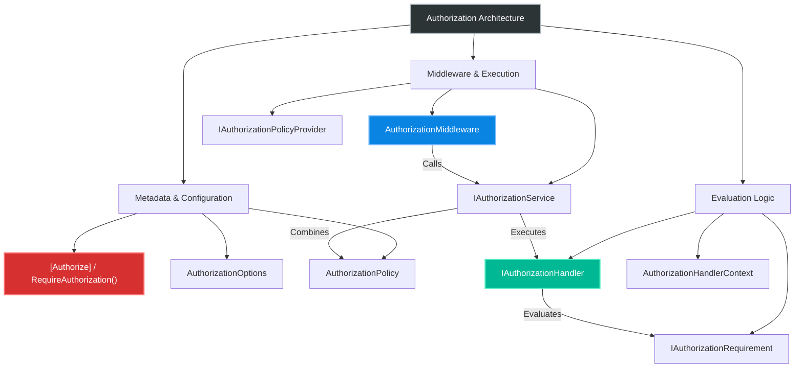

# 4.154 — Authorization Architecture: Middleware, Policy Evaluation, and Requirements

## PART 0 — Navigation & Context

```text
ASP.NET Core Domain Hierarchy
├── HTTP Fundamentals
├── Authentication
│   └── 4.134 Authentication Architecture
├── Authorization
│   ├── 4.154 Authorization Architecture ◄ YOU ARE HERE
│   ├── 4.155 Role-Based and Claims-Based
│   ├── 4.156 Policy-Based Authorization
│   ├── 4.157 IAuthorizationHandler
│   └── 4.158 Resource-Based Authorization
└── Routing
```

**What you need before this:**
- [[4.134 — Authentication Architecture]] — Understand how `AuthenticationMiddleware` populates `HttpContext.User`.
- [[4.052 — Middleware Ordering]] — Know why `UseRouting` must precede `UseAuthorization`.

**What this unlocks after:**
- [[4.156 — Policy-Based Authorization]] — Building complex domain rules.
- [[4.157 — IAuthorizationHandler]] — Implementing the logic for the requirements discussed here.

**Why this matters to a production engineer at scale:**
Authorization in ASP.NET Core is not a simple if/else statement; it is a highly decoupled pipeline consisting of declarative metadata (`[Authorize]`), a policy builder, and an execution engine (`IAuthorizationService`). If you do not understand this separation, you will bleed security logic into your controllers, making your API impossible to audit, test, or secure consistently at an enterprise scale.

---

## PART 1 — The Core Mental Model

> **The Fundamental Rule**
> **Authentication answers "Who are you?", but Authorization answers "Are you allowed to do this?" through an evaluation engine (`IAuthorizationService`) that matches the endpoint's metadata (`IAuthorizeData`) against configured Policies, returning a 401 Challenge if unauthenticated or a 403 Forbid if unauthorized.**

**The Plain-Language Analogy**
Imagine a secure government facility. 
**Authentication** is the ID checker at the front gate. They look at your passport and give you a visitor badge with your name and clearance level (Claims). 
**Authorization** happens at the door to the Server Room. The door has a sign (Metadata) that says "Only Level 5 Clearance or IT Staff." When you swipe your badge, the electronic lock (the `IAuthorizationService`) reads your badge, reads the door's requirements, and evaluates the rule (the Handler). If you fail because you don't have a badge, security kicks you out of the building (401 Challenge). If you fail because your badge is only Level 3, the door flashes red and denies entry (403 Forbid).

**The Taxonomy Diagram**



---

## PART 2 — Deep Mechanics

### 1. The Canonical Middleware Order

Authorization requires an endpoint (to know *what* to authorize) and an identity (to know *who* is asking). Therefore, its position in the pipeline is rigid.

// Pipeline position: Immediately before endpoint execution.
```
──► UseRouting ──► UseAuthentication ──► UseAuthorization ──► UseEndpoints / MapControllers
```

1. **Routing** parses the URL and selects the `Endpoint`. The `Endpoint` holds metadata (like the `[Authorize]` attribute).
2. **Authentication** reads the HTTP Request (Cookies/Headers) and populates `HttpContext.User`.
3. **Authorization** reads the `Endpoint` metadata, reads `HttpContext.User`, and decides if the request proceeds.

**Failure Mode Diagram:**
If the order is wrong (e.g., AuthZ before Routing), AuthZ cannot find the Endpoint metadata, so it blindly allows the request through. The controllers execute without security checks.

### 2. The Anatomy of an Authorization Policy

A Policy is a named collection of `IAuthorizationRequirement` objects.

```csharp
// ASP.NET Core internally (approximate representation):
public class AuthorizationPolicy 
{
    public IList<IAuthorizationRequirement> Requirements { get; }
    public IList<string> AuthenticationSchemes { get; }
}
```

When you define a policy in `Program.cs`:
```csharp
builder.Services.AddAuthorization(options => {
    options.AddPolicy("SeniorEngineers", policy => 
        policy.RequireClaim("Level", "Senior")
              .RequireRole("Engineering"));
});
```
This creates an `AuthorizationPolicy` containing two requirements: a `ClaimsAuthorizationRequirement` and a `RolesAuthorizationRequirement`.

**Runtime Cost Label:** Policy evaluation is $O(R \times H)$ where R is the number of requirements and H is the number of handlers. Usually < 0.1ms.

### 3. IAuthorizationService and the Evaluation Engine

The core engine is `IAuthorizationService`. The `AuthorizationMiddleware` asks this service to evaluate the policies against the user.

```csharp
// Framework Source Behavior (DefaultAuthorizationService.cs):
public async Task<AuthorizationResult> AuthorizeAsync(ClaimsPrincipal user, object? resource, IEnumerable<IAuthorizationRequirement> requirements)
{
    var authContext = new AuthorizationHandlerContext(requirements, user, resource);
    
    foreach (var handler in _handlers) {
        await handler.HandleAsync(authContext);
    }
    
    if (authContext.HasSucceeded) { return AuthorizationResult.Success(); }
    return AuthorizationResult.Failed();
}
```

**How Handlers Vote:**
- `context.Succeed(requirement)`: Votes YES for that specific requirement.
- `context.Fail()`: Immediately aborts evaluation and forces a deny, overriding any successes.
- Doing nothing: Votes "Abstain". If a requirement has no successes, it is treated as a failure.

### 4. Challenge (401) vs Forbid (403)

If `IAuthorizationService` returns `Failed`, the middleware must translate this into an HTTP response.

// HTTP wire format (Unauthenticated):
```http
// Scenario: User has no token (User.Identity.IsAuthenticated = false)
HTTP/1.1 401 Unauthorized
WWW-Authenticate: Bearer
```

// HTTP wire format (Unauthorized):
```http
// Scenario: User has a token, but lacks the "Senior" claim
HTTP/1.1 403 Forbidden
```

**Framework Source Behavior:**
```csharp
// Inside AuthorizationMiddleware.cs (approximate)
if (!result.Succeeded)
{
    if (user.Identity == null || !user.Identity.IsAuthenticated) {
        await context.ChallengeAsync(); // Results in 401
    } else {
        await context.ForbidAsync(); // Results in 403
    }
}
```

### 5. IAuthorizeData and Endpoint Metadata

How does the middleware know which policy to execute? It looks for `IAuthorizeData` in the Endpoint's metadata.
The `[Authorize]` attribute implements `IAuthorizeData`.

```csharp
[Authorize(Policy = "AdminOnly")]
[HttpGet("/api/reports")]
```
When Routing builds the endpoint graph, it attaches the `[Authorize]` attribute as metadata. The `AuthorizationMiddleware` extracts it using `context.GetEndpoint()?.Metadata.GetOrderedMetadata<IAuthorizeData>()`.

---

## PART 3 — Production Code Patterns

### Pattern 1: Global RequireAuthenticatedUser Policy
In enterprise applications, "secure by default" is the standard. Instead of remembering to put `[Authorize]` on every controller, apply a global fallback policy, and explicitly opt-out using `[AllowAnonymous]`.

```csharp
// Program.cs
// ✅ CORRECT: Secure by default architecture
builder.Services.AddAuthorizationBuilder()
    .SetFallbackPolicy(new AuthorizationPolicyBuilder()
        .RequireAuthenticatedUser()
        .Build());

var app = builder.Build();
// ...
app.UseRouting();
app.UseAuthentication();
app.UseAuthorization();

// This endpoint requires auth implicitly due to the Fallback Policy
app.MapGet("/api/secure-data", () => "Secret Data");

// Explicit opt-out
app.MapGet("/api/health", () => "Healthy").AllowAnonymous();
```

// HTTP wire format consequence (Hitting /api/secure-data without token):
```http
HTTP/1.1 401 Unauthorized
```

### Pattern 2: Multi-Scheme Policy Definitions
When an API supports both Mobile (JWT) and Web (Cookie) clients, the authorization policy must explicitly state which schemes it trusts, preventing cross-contamination (e.g., a low-security cookie accessing a high-security API endpoint).

```csharp
// Program.cs
builder.Services.AddAuthorization(options =>
{
    options.AddPolicy("StrictApiOnly", policy =>
    {
        // ✅ CORRECT: Explicitly limit this policy to the JWT scheme
        policy.AuthenticationSchemes.Add(JwtBearerDefaults.AuthenticationScheme);
        policy.RequireAuthenticatedUser();
        policy.RequireClaim("client_type", "api");
    });
});

[Authorize(Policy = "StrictApiOnly")]
[HttpPost("/api/financials/transfer")]
public IActionResult Transfer() { ... }
```

### Pattern 3: Customizing the Authorization Middleware Result
Sometimes, a 403 Forbidden isn't descriptive enough. You want to return a ProblemDetails JSON response explaining *why* authorization failed. You can replace the default `IAuthorizationMiddlewareResultHandler`.

```csharp
public class CustomAuthResultHandler : IAuthorizationMiddlewareResultHandler
{
    private readonly AuthorizationMiddlewareResultHandler _defaultHandler = new();

    public async Task HandleAsync(
        RequestDelegate next, HttpContext context, 
        AuthorizationPolicy policy, PolicyAuthorizationResult authorizeResult)
    {
        // ✅ CORRECT: Intercept the Forbid and write custom JSON
        if (authorizeResult.Forbidden)
        {
            context.Response.StatusCode = StatusCodes.Status403Forbidden;
            context.Response.ContentType = "application/json";
            await context.Response.WriteAsJsonAsync(new 
            { 
                Error = "Authorization Failed",
                RequiredSchemes = policy.AuthenticationSchemes
            });
            return; // Short-circuit
        }

        // Fallback to default behavior for success or Challenge
        await _defaultHandler.HandleAsync(next, context, policy, authorizeResult);
    }
}

// In Program.cs
builder.Services.AddSingleton<IAuthorizationMiddlewareResultHandler, CustomAuthResultHandler>();
```

// HTTP wire format consequence:
```http
HTTP/1.1 403 Forbidden
Content-Type: application/json

{
  "error": "Authorization Failed",
  "requiredSchemes": ["Bearer"]
}
```

### Pattern 4: Manual IAuthorizationService Execution
If authorization depends on business logic (e.g., "Can the user edit *this specific* document?"), you cannot use the `[Authorize]` attribute because the document ID isn't known until the controller executes. You must inject and call `IAuthorizationService` manually.

```csharp
[ApiController]
[Route("api/[controller]")]
public class DocumentsController : ControllerBase
{
    private readonly IAuthorizationService _authz;
    private readonly IDocumentRepository _repo;

    public DocumentsController(IAuthorizationService authz, IDocumentRepository repo)
    {
        _authz = authz;
        _repo = repo;
    }

    [HttpGet("{id}")]
    public async Task<IActionResult> Get(int id)
    {
        var document = await _repo.GetByIdAsync(id);
        if (document == null) return NotFound();

        // ✅ CORRECT: Imperative authorization against a specific resource
        var authResult = await _authz.AuthorizeAsync(User, document, "EditDocumentPolicy");
        
        if (!authResult.Succeeded)
        {
            // Returns 403 Forbidden
            return Forbid(); 
        }

        return Ok(document);
    }
}
```

### Pattern 5: Combining Multiple Authorize Attributes
When multiple `[Authorize]` attributes are placed on a class/method, they act as a logical **AND**. The user must satisfy ALL of them.

```csharp
// Scenario: HR System
[Authorize(Roles = "HR_Staff")] // Requirement 1
[ApiController]
[Route("api/[controller]")]
public class PayrollController : ControllerBase
{
    // ✅ CORRECT: Logical AND. User must be HR_Staff AND satisfy HighSecurityPolicy
    [Authorize(Policy = "HighSecurityPolicy")] // Requirement 2
    [HttpPost("adjust-salary")]
    public IActionResult AdjustSalary() { ... }
}
```

---

## PART 4 — Gotchas & Anti-Patterns

### Gotcha 1: The Middleware Order Disaster
The single most common bug for beginners is putting `UseAuthorization` in the wrong place.

// ⚠️ WRONG CODE
```csharp
app.UseAuthorization();  // Runs first
app.UseAuthentication(); // Runs second
app.UseRouting();        // Runs third
app.MapControllers();
```

// HTTP consequence (wrong path):
// The client sends a valid JWT. The Authorization middleware runs, but `HttpContext.User` is empty because Authentication hasn't run yet. Furthermore, Routing hasn't run, so there is no Endpoint metadata to check. The Authorization middleware assumes nothing is required and passes the request down. The API is completely unsecured. 200 OK.

// ✅ CORRECT CODE
```csharp
app.UseRouting();
app.UseAuthentication();
app.UseAuthorization();
app.MapControllers();
```

// HTTP consequence (correct path):
// 401 Unauthorized or 403 Forbidden as expected.

// WHY: The pipeline is sequential. AuthZ depends on the outputs of Routing (Endpoint metadata) and AuthN (ClaimsPrincipal).

### Gotcha 2: Returning 401 instead of 403 on Failure
Developers often throw exceptions or manually return 401s in their controllers when a user is forbidden, breaking the HTTP semantic contract.

// ⚠️ WRONG CODE
```csharp
if (user.Department != "Finance") {
    // 401 means "Unauthenticated". But the user IS logged in!
    return Unauthorized("You are not in finance"); 
}
```

// HTTP consequence (wrong path):
// HTTP 401. The client app's interceptor sees 401 and aggressively logs the user out, clearing their token, causing a terrible UX.

// ✅ CORRECT CODE
```csharp
if (user.Department != "Finance") {
    return Forbid(); 
}
```

// HTTP consequence (correct path):
// HTTP 403. The client app sees 403, keeps the user logged in, and displays a "Permission Denied" toast notification.

// WHY: 401 is an Authentication failure (identity unknown). 403 is an Authorization failure (identity known, but lacks clearance).

### Gotcha 3: The "OR" Policy Misconception
Developers often put multiple `[Authorize]` attributes on an endpoint thinking it creates an "OR" condition.

// ⚠️ WRONG CODE
```csharp
[Authorize(Roles = "Admin")]
[Authorize(Roles = "Manager")]
public IActionResult Get() { ... }
```

// HTTP consequence (wrong path):
// The developer thinks "Admins OR Managers can access this." In reality, the framework requires the user to be BOTH an Admin AND a Manager simultaneously. If they are only an Admin, they get a 403 Forbidden.

// ✅ CORRECT CODE
```csharp
[Authorize(Roles = "Admin,Manager")] // Comma-separated list creates an OR condition for Roles
public IActionResult Get() { ... }
```

// WHY: Multiple `IAuthorizeData` metadata attributes are evaluated sequentially by the middleware. All must pass.

### Gotcha 4: Forgetting the Fallback vs Default Policy Distinction
In `Program.cs`, `DefaultPolicy` and `FallbackPolicy` are two different things that behave completely differently.

// ⚠️ WRONG CODE
```csharp
builder.Services.AddAuthorization(options => {
    // Developer thinks this secures all endpoints automatically
    options.DefaultPolicy = new AuthorizationPolicyBuilder().RequireRole("Admin").Build();
});

// Endpoint without [Authorize]
app.MapGet("/api/open", () => "Data");
```

// HTTP consequence (wrong path):
// A guest user requests `/api/open`. Because there is no `[Authorize]` attribute on the endpoint, the `DefaultPolicy` is NEVER evaluated. The guest gets 200 OK.

// ✅ CORRECT CODE
```csharp
builder.Services.AddAuthorization(options => {
    // FallbackPolicy applies when NO [Authorize] attribute is present
    options.FallbackPolicy = new AuthorizationPolicyBuilder().RequireRole("Admin").Build();
});
```

// HTTP consequence (correct path):
// The guest user requests `/api/open` and receives a 401/403.

// WHY: `DefaultPolicy` is the policy used when you type `[Authorize]` with no arguments. `FallbackPolicy` is the policy used when you type nothing at all.

### Gotcha 5: Handlers Calling Fail() Aggressively
When writing an `IAuthorizationHandler`, calling `context.Fail()` causes immediate, irreversible rejection of the entire policy.

// ⚠️ WRONG CODE
```csharp
protected override Task HandleRequirementAsync(AuthorizationHandlerContext context, AgeRequirement req)
{
    if (context.User.GetAge() < 18) {
        context.Fail(); // Aggressive rejection
    } else {
        context.Succeed(req);
    }
    return Task.CompletedTask;
}
```

// HTTP consequence (wrong path):
// If you have multiple handlers for `AgeRequirement` (perhaps another handler checks if they have parental consent), the `context.Fail()` prevents the second handler from ever granting access. 403 Forbidden.

// ✅ CORRECT CODE
```csharp
protected override Task HandleRequirementAsync(AuthorizationHandlerContext context, AgeRequirement req)
{
    if (context.User.GetAge() >= 18) {
        context.Succeed(req);
    }
    // Just return without doing anything if the condition isn't met (Abstain)
    return Task.CompletedTask;
}
```

// WHY: Handlers should generally only vote YES (`Succeed`) or ABSTAIN (return). Only call `Fail()` if the presence of a condition is a massive security violation that must override all other handlers.

---

## PART 5 — Performance Implications

### Request Pipeline Characteristics

| Scenario | Pipeline Depth | Allocations Per Request | Approx Latency Impact | Recommendation |
|---|---|---|---|---|
| [AllowAnonymous] | Shallow | 0 | 0ms | Bypasses AuthorizationMiddleware entirely. |
| Role/Claim Check | Medium | ~2 | < 0.05ms | Standard; highly optimized by .NET. |
| Multiple Handlers | Medium | ~2 per handler | ~0.1ms | Keep handlers purely CPU-bound. |
| DB Check in Handler | Deep | High | 10ms - 50ms | Use caching (`IMemoryCache`) inside the handler! |

### BenchmarkDotNet Code

```csharp
using BenchmarkDotNet.Attributes;
using Microsoft.AspNetCore.Authorization;
using System.Security.Claims;

[MemoryDiagnoser]
public class AuthorizationBenchmark
{
    private IAuthorizationService _authService;
    private ClaimsPrincipal _principal;
    private AuthorizationPolicy _policy;

    [GlobalSetup]
    public void Setup()
    {
        // Setup DI, Policy, and User
        var services = new ServiceCollection();
        services.AddAuthorization(o => o.AddPolicy("Test", p => p.RequireClaim("Admin", "true")));
        var sp = services.BuildServiceProvider();
        _authService = sp.GetRequiredService<IAuthorizationService>();
        _policy = sp.GetRequiredService<IAuthorizationPolicyProvider>().GetPolicyAsync("Test").Result;
        
        _principal = new ClaimsPrincipal(new ClaimsIdentity(new[] { new Claim("Admin", "true") }));
    }

    [Benchmark]
    public async Task<bool> EvaluatePolicy()
    {
        var result = await _authService.AuthorizeAsync(_principal, null, "Test");
        return result.Succeeded;
    }
}

// Expected output (approximate, .NET 8, x64, local):
// Method         | Mean      | Error     | StdDev    | Gen0   | Allocated |
// -------------- |----------:|----------:|----------:|-------:|----------:|
// EvaluatePolicy | 450.2 ns  |  8.12 ns  |  7.59 ns  | 0.0315 |     200 B |
```

**When to Care:** If your `IAuthorizationHandler` executes database queries (e.g., checking if a user ID is still active in a SQL table). Because authorization runs on every request, this adds a database roundtrip to every API call.
**When this doesn't matter:** Standard claim and role checks (which just inspect the in-memory `ClaimsPrincipal`) are measured in nanoseconds and are basically free.

---

## PART 6 — Interview Arsenal

### A. The Question Bank

**Question 1:** "Describe the difference between Authentication and Authorization in ASP.NET Core, and how they communicate."
- **Average Answer:** "Authentication is logging in, Authorization is permissions. They use the `[Authorize]` attribute."
- **Why That's Insufficient:** Explains the concepts but misses the framework mechanics.
- **Great Answer:** "Authentication establishes identity. The Authentication middleware reads the incoming token or cookie, validates it, and constructs a `ClaimsPrincipal` which it assigns to `HttpContext.User`. That's its only job. Later in the pipeline, the Authorization middleware executes. It reads the metadata on the matched Endpoint (like an `[Authorize]` attribute), pulls the `ClaimsPrincipal` created by the auth step, and asks the `IAuthorizationService` to evaluate the required policies. If evaluation fails, it translates the failure into a 401 or 403 HTTP response."

**Question 2:** "If a user is logged in but receives a 401 Unauthorized instead of a 403 Forbidden when accessing an endpoint they don't have access to, what architectural mistake was made?"
- **Average Answer:** "The middleware returned the wrong status code."
- **Why That's Insufficient:** Doesn't explain *why* the middleware made that decision.
- **Great Answer:** "This happens because the Authorization middleware thinks the user is not authenticated. It checks `HttpContext.User.Identity.IsAuthenticated`. If that is false, it issues a Challenge (401). If it's true, it issues a Forbid (403). If a logged-in user is getting a 401, it means the `UseAuthentication` middleware either didn't run, ran *after* `UseAuthorization` (an ordering bug), or the endpoint was configured to require an authentication scheme that didn't match the one the user logged in with (e.g., `[Authorize(AuthenticationSchemes="Bearer")]` but the user has a Cookie)."

**Question 3:** "Why should you avoid querying the database directly inside an `IAuthorizationHandler`?"
- **Average Answer:** "Because it makes the application slow."
- **Why That's Insufficient:** Doesn't explain the frequency of execution or the alternative.
- **Great Answer:** "The `IAuthorizationHandler` executes on every single HTTP request that hits the secured endpoint. If you put a database query inside the handler, you are adding a mandatory database roundtrip to the critical path of your API, severely limiting request throughput and hammering your connection pool. Instead, you should cache those authorization rules using `IMemoryCache` or `IDistributedCache` inside the handler, or bake the necessary permissions directly into the JWT claims during login so the handler is purely CPU-bound."

### B. The Trick Questions

**Trick Question:** "If I put `[AllowAnonymous]` on a method, and `[Authorize(Roles="Admin")]` on the Controller class, what happens if a non-admin hits the method?"
- **The Trap:** Thinking the class-level attribute overrides or runs first.
- **The Correct Answer:** "The request succeeds with 200 OK. `[AllowAnonymous]` acts as a definitive short-circuit for the Authorization middleware. When the middleware sees that metadata on the endpoint, it completely bypasses policy evaluation, ignoring any class-level `[Authorize]` attributes."

**Trick Question:** "If an endpoint has no authorization attributes, and `DefaultPolicy` requires the 'Admin' role, who can access it?"
- **The Trap:** Confusing `DefaultPolicy` with `FallbackPolicy`.
- **The Correct Answer:** "Anyone can access it. `DefaultPolicy` is only evaluated when an endpoint has an `[Authorize]` attribute with no specified policy. To secure endpoints that have no attributes at all, you must configure the `FallbackPolicy`."

### C. Red Flags to Avoid
- 🚩 **"I put my authorization logic in a custom ActionFilter."** (Filters run too late in the MVC lifecycle; proper Authorization Middleware runs earlier, protecting the entire routing tree, including Minimal APIs and Static Files).
- 🚩 **"I just use `if (!User.IsInRole('Admin')) return Unauthorized();` in my controllers."** (Returns the wrong status code (401 instead of 403) and leaks security logic into business endpoints).
- 🚩 **"If they fail auth, I call `context.Fail()` in my handler."** (Calling `Fail()` explicitly kills the evaluation, preventing other handlers from potentially succeeding the requirement. Handlers should abstain by returning `Task.CompletedTask`).

---

## PART 7 — Decision Framework

```mermaid
graph TD
    A[How to Apply Authorization?] --> B{Does it apply to the whole API?}
    B -->|Yes| C[Configure FallbackPolicy in Program.cs]
    B -->|No| D{Does the rule depend on the requested Resource?}
    
    D -->|Yes e.g., 'Can I edit this article?'| E[Imperative: Inject IAuthorizationService into Controller]
    D -->|No e.g., 'Is the user an Admin?'| F{Is it a simple claim or role?}
    
    F -->|Yes| G[Declarative: Use AuthorizeAttribute with Roles/Policies]
    F -->|No, complex business logic| H[Create an IAuthorizationRequirement and Handler]
    
    style A fill:#2d3436,stroke:#fff
    style C fill:#0984e3,stroke:#fff
    style E fill:#00b894,stroke:#fff
    style G fill:#0984e3,stroke:#fff
    style H fill:#d63031,stroke:#fff
```



---

## PART 8 — Self-Check

### A. Conceptual Questions
1. What three pieces of information does `AuthorizationMiddleware` need to make a decision?
2. What is the difference between `ChallengeAsync` and `ForbidAsync`?
3. How does `UseRouting` enable `UseAuthorization`?
4. If a policy contains three requirements, how many must succeed for the policy to pass?
5. Why does putting `UseAuthorization` before `UseAuthentication` fail open (allow access)?
6. How do you override the default 403 HTML response to return JSON?
7. What is the difference between `DefaultPolicy` and `FallbackPolicy`?
8. When should an `IAuthorizationHandler` call `context.Fail()`?

### B. Code Puzzles

**Puzzle 1: The Leaky Endpoint**
```csharp
app.UseRouting();
app.UseAuthorization();
app.UseAuthentication();

app.MapGet("/api/secret", () => "Gold").RequireAuthorization();
```
*Scenario:* A user sends a request with no token. Do they get the gold?
<details>
<summary>Answer</summary>
No, they get a 401 Unauthorized. Wait, actually, let's trace it. AuthZ runs before AuthN. AuthZ looks at `HttpContext.User`. It is unauthenticated. The endpoint requires authorization. AuthZ issues a Challenge. However, because AuthN runs *after*, it might not intercept the challenge to return the 401/302! The HTTP response might just be a blank 200 or an unhandled exception depending on the server. The order is catastrophically wrong.
*HTTP consequence:* Unpredictable behavior, likely an empty response or server error, but access to the endpoint is blocked by the AuthZ middleware issuing an unhandled Challenge.
</details>

**Puzzle 2: The Double Handler**
```csharp
public class HandlerA : AuthorizationHandler<MyReq> {
    protected override Task HandleRequirementAsync(AuthorizationHandlerContext ctx, MyReq req) {
        ctx.Succeed(req);
        return Task.CompletedTask;
    }
}
public class HandlerB : AuthorizationHandler<MyReq> {
    protected override Task HandleRequirementAsync(AuthorizationHandlerContext ctx, MyReq req) {
        ctx.Fail();
        return Task.CompletedTask;
    }
}
```
*Scenario:* Both handlers are registered in DI. Does the policy pass?
<details>
<summary>Answer</summary>
No. The `IAuthorizationService` executes both. HandlerA succeeds it. HandlerB explicitly calls `Fail()`. An explicit `Fail()` overrides any and all successes, forcing the authorization result to be False.
*HTTP consequence:* 403 Forbidden.
</details>

**Puzzle 3: The Forgotten Attribute**
```csharp
// Program.cs
builder.Services.AddAuthorization(options => {
    options.DefaultPolicy = new AuthorizationPolicyBuilder().RequireRole("Admin").Build();
});

[ApiController]
[Route("[controller]")]
public class DataController : ControllerBase {
    [HttpGet] public IActionResult Get() => Ok();
}
```
*Scenario:* A non-admin user calls GET `/data`. What happens?
<details>
<summary>Answer</summary>
They get 200 OK. The `DataController` and the `Get` action lack the `[Authorize]` attribute. Without it, the endpoint has no `IAuthorizeData` metadata. The Authorization middleware ignores the request, and the `DefaultPolicy` is never evaluated.
</details>

**Puzzle 4: The Multiple Roles**
```csharp
[Authorize(Roles = "Manager")]
[Authorize(Roles = "Admin")]
public IActionResult Delete() { ... }
```
*Scenario:* A user with the "Manager" role (but not "Admin") calls Delete. Do they succeed?
<details>
<summary>Answer</summary>
No. Multiple `[Authorize]` attributes form a logical AND. The user must be both a Manager and an Admin. To make it an OR condition, it must be `[Authorize(Roles = "Manager,Admin")]`.
*HTTP consequence:* 403 Forbidden.
</details>

---

## PART 9 — Connections & Resources

### A. Related Topics Table

| Topic | Why It Connects |
|---|---|
| [[4.052 — Middleware Ordering]] | Dictates exactly where `UseAuthorization` sits relative to Routing and CORS. |
| [[4.134 — Authentication Architecture]] | Provides the `ClaimsPrincipal` that this architecture evaluates. |
| [[4.156 — Policy-Based Authorization]] | Explains how to build the `AuthorizationPolicy` objects evaluated by the service. |
| [[4.157 — IAuthorizationHandler]] | Details how to write the specific logic that votes on the requirements. |

### B. Books

| Book | Chapters | Why These Chapters |
|---|---|---|
| ASP.NET Core in Action, 3rd Ed | Chapter 16: Authorization | Excellent visual diagrams of the IAuthorizationService evaluation loop. |
| Pro ASP.NET Core Identity | Chapter 10 | Deep dive into creating custom requirements and handlers. |

### C. Essential Articles & Docs
- [Microsoft Docs: Introduction to authorization in ASP.NET Core](https://learn.microsoft.com/en-us/aspnet/core/security/authorization/introduction)
- [Microsoft Docs: Policy-based authorization in ASP.NET Core](https://learn.microsoft.com/en-us/aspnet/core/security/authorization/policies)
- [Microsoft Docs: Customize the behavior of AuthorizationMiddleware](https://learn.microsoft.com/en-us/aspnet/core/security/authorization/customizingauthorizationmiddlewareresponse)

> [!NOTE]
> **Template Meta-Note**
> Part 0: Context & Prerequisites. Part 1: Core Mental Model. Part 2: Deep Mechanics & Pipeline. Part 3: Production Code. Part 4: Gotchas. Part 5: Performance. Part 6: Interview Arsenal. Part 7: Decision Framework. Part 8: Puzzles. Part 9: Resources.
