# 4.155 — Role-Based and Claims-Based Authorization

## PART 0 — Navigation & Context

```text
ASP.NET Core Domain Hierarchy
├── Authentication
│   └── 4.142 ASP.NET Core Identity
├── Authorization
│   ├── 4.154 Authorization Architecture
│   ├── 4.155 Role & Claims Authorization ◄ YOU ARE HERE
│   ├── 4.156 Policy-Based Authorization
│   └── 4.161 Permission-Based Authorization
└── MVC & Controllers
```

**What you need before this:**
- [[4.154 — Authorization Architecture]] — Understanding how the `[Authorize]` attribute maps to the `AuthorizationMiddleware`.
- [[4.142 — ASP.NET Core Identity]] — Knowing how Roles and Claims are assigned to a user in the database and serialized into a cookie or JWT.

**What this unlocks after:**
- [[4.156 — Policy-Based Authorization]] — When roles and claims are too simplistic, you build policies.
- [[4.161 — Permission-Based Authorization]] — Deconstructing monolithic roles into fine-grained permissions.

**Why this matters to a production engineer at scale:**
Role-based access control (RBAC) is the oldest and simplest way to secure an API, but it scales poorly in complex enterprise domains where "Admin" means something different in every department. Claims-based authorization shifts the paradigm from "What role is the user?" to "What facts do we know about the user?", providing a much more robust and granular security boundary that avoids massive `if/else` role checks in your controllers.

---

## PART 1 — The Core Mental Model

> **The Fundamental Rule**
> **Role-based authorization checks if a user belongs to a specific group, whereas Claims-based authorization checks if a specific fact about the user exists (and optionally matches a value), with both being syntactically sugar-coated over ASP.NET Core's underlying Policy engine.**

**The Plain-Language Analogy**
Imagine entering a bar. 
**Role-based authorization** is the bouncer asking, "Are you on the VIP list?" (Role = VIP). It groups people into broad categories. If the bar creates a "SuperVIP" level, the bouncer needs a new list.
**Claims-based authorization** is the bouncer checking your ID and verifying, "Is your Date of Birth before 2005?" (Claim = DateOfBirth, Value < 2005). The bouncer doesn't care what "group" you belong to; they just verify a factual claim about your identity. It's infinitely more flexible.

**The Taxonomy Diagram**

```mermaid
graph TD
    A[Basic Authorization] --> B[Role-Based (RBAC)]
    A --> C[Claims-Based (CBAC)]
    
    B --> B1["[Authorize(Roles = 'Admin')]"]
    B --> B2[User.IsInRole('Admin')]
    
    C --> C1[Policy RequireClaim]
    C --> C2[User.HasClaim(c => ...)]
    
    B1 --> D[Translated to Policies Internally]
    C1 --> D
    
    D --> E[AuthorizationMiddleware]
    
    style A fill:#2d3436,stroke:#b2bec3,stroke-width:2px,color:#fff
    style B fill:#0984e3,stroke:#74b9ff,stroke-width:2px,color:#fff
    style C fill:#00b894,stroke:#55efc4,stroke-width:2px,color:#fff
    style D fill:#d63031,stroke:#ff7675,stroke-width:2px,color:#fff
```

---

## PART 2 — Deep Mechanics

### 1. The Role Mechanism Internals

When you use `[Authorize(Roles = "Admin")]`, it feels like a special feature. It isn't. ASP.NET Core translates this into a requirement on the fly.

// Pipeline position: Execution inside AuthorizationMiddleware
```
──► UseRouting ──► UseAuthentication ──► UseAuthorization ──► [Controller]
                                             │
                                             └──► Parses [Authorize(Roles="Admin")] 
                                             └──► Executes RolesAuthorizationRequirement
```

**Framework Source Behavior:**
How does the framework know what a "Role" is? A Role is literally just a Claim with a specific type. By default, ASP.NET Core looks for a claim of type `ClaimTypes.Role` (`http://schemas.microsoft.com/ws/2008/06/identity/claims/role`).
If `User.IsInRole("Admin")` is called, it translates to:
`User.HasClaim(ClaimTypes.Role, "Admin")`

### 2. The Claim Mechanism Internals

A Claim is a key-value pair. 
```json
{
  "sub": "12345",
  "department": "Finance",
  "clearance_level": "TopSecret"
}
```

Claims-based authorization checks the `ClaimsPrincipal` (populated by the Authentication middleware) to see if a specific key exists, and optionally, if its value matches an allowed set.

Unlike Roles, there is no `[Authorize(Claims = "department:Finance")]` attribute. Claims-based authorization **must** be implemented by defining a Policy in `Program.cs`.

### 3. Role vs Claim Mapping in Tokens

When you receive a JWT, the claims might look like:
`"role": ["Admin", "User"]`

When `JwtBearerHandler` parses this, it maps it to `.NET` `Claim` objects. 
**The Edge Cases That Bite Engineers:** By default, Microsoft maps standard JWT claims to proprietary SOAP XML schema URIs. 
`"role"` becomes `http://schemas.microsoft.com/ws/2008/06/identity/claims/role`.
If your authorization policy looks for exactly `"role"`, it will fail because the key was renamed during authentication!

### 4. HTTP Failure Paths

If the user lacks the Role or Claim:

// HTTP wire format (Unauthenticated - No Token):
```http
HTTP/1.1 401 Unauthorized
```

// HTTP wire format (Unauthorized - Has Token, lacks Role/Claim):
```http
HTTP/1.1 403 Forbidden
```

**Runtime Cost Label:** Both Role and Claim checks execute in $O(N)$ time relative to the number of claims on the identity. Because claims are kept in memory (usually < 20 claims), this is $O(1)$ practically, costing < 0.01ms.

---

## PART 3 — Production Code Patterns

### Pattern 1: Role-Based Authorization (The Legacy Approach)
The simplest way to restrict an endpoint.

```csharp
[ApiController]
[Route("api/[controller]")]
public class ReportsController : ControllerBase
{
    // ✅ CORRECT: OR condition. User must be Admin OR Manager
    [Authorize(Roles = "Admin,Manager")]
    [HttpGet("financials")]
    public IActionResult GetFinancials() { ... }

    // ✅ CORRECT: AND condition. User must be Admin AND HR
    [Authorize(Roles = "Admin")]
    [Authorize(Roles = "HR")]
    [HttpPost("adjust-payroll")]
    public IActionResult AdjustPayroll() { ... }
}
```

### Pattern 2: Claims-Based Authorization via Policies (The Modern Approach)
Roles are too broad. Instead of an "HR" role, we check the user's "Department" claim. This is configured in `Program.cs` and applied via `[Authorize(Policy)]`.

```csharp
// Program.cs
builder.Services.AddAuthorization(options =>
{
    // ✅ CORRECT: Checking if a claim exists and has a specific value
    options.AddPolicy("FinanceOnly", policy => 
        policy.RequireClaim("department", "Finance", "Accounting"));
        
    // ✅ CORRECT: Checking if a claim exists at all, regardless of value
    options.AddPolicy("EmployeeOnly", policy => 
        policy.RequireClaim("employee_id"));
});

// Controller
[Authorize(Policy = "FinanceOnly")]
[HttpGet("/api/budget")]
public IActionResult GetBudget() { ... }
```

### Pattern 3: Imperative Role/Claim Checks inside the Controller
Sometimes you want to let the user in, but change the UI or return different data based on their role/claims.

```csharp
[Authorize] // Require login, but any role
[HttpGet("/api/dashboard")]
public IActionResult GetDashboard()
{
    var data = new DashboardDto();
    
    // ✅ CORRECT: Imperative Role Check
    if (User.IsInRole("Admin"))
    {
        data.ShowAdminSettings = true;
    }

    // ✅ CORRECT: Imperative Claim Check
    var clearanceClaim = User.FindFirst("clearance_level");
    if (clearanceClaim != null && int.Parse(clearanceClaim.Value) > 3)
    {
        data.ShowTopSecretWidgets = true;
    }

    return Ok(data);
}
```

### Pattern 4: Preventing JWT Claim Mapping
To ensure your claims-based policies match the exact keys in your JWT, disable the legacy SOAP schema mapping globally.

```csharp
// Program.cs - Place this BEFORE AddAuthentication
using System.IdentityModel.Tokens.Jwt;

// ✅ CORRECT: Disables default Microsoft claim type mapping
JwtSecurityTokenHandler.DefaultInboundClaimTypeMap.Clear();

builder.Services.AddAuthentication()
    .AddJwtBearer(options => { ... });

builder.Services.AddAuthorization(options => {
    // Now you can query exactly the claim name present in the JWT
    options.AddPolicy("AdminRole", p => p.RequireClaim("role", "admin"));
});
```

---

## PART 4 — Gotchas & Anti-Patterns

### Gotcha 1: The AND vs OR Role Confusion

Developers often misunderstand how multiple roles are evaluated on controllers.

// ⚠️ WRONG CODE
```csharp
// Developer wants "Admin OR HR" to access this method
[Authorize(Roles = "Admin")]
[Authorize(Roles = "HR")]
public IActionResult ViewSalaries() { ... }
```

// HTTP consequence (wrong path):
// A user with only the "Admin" role hits the endpoint. The first attribute passes. The second attribute fails. The user gets a 403 Forbidden. The framework executed a logical AND.

// ✅ CORRECT CODE
```csharp
[Authorize(Roles = "Admin,HR")] // Comma separated = OR
public IActionResult ViewSalaries() { ... }
```

// HTTP consequence (correct path):
// The user has "Admin", which satisfies the comma-separated list. 200 OK.

// WHY: Multiple `[Authorize]` attributes are stacked sequentially in the pipeline. All of them must pass independently. A single attribute with a comma-separated list evaluates internally using `.Any()`.

### Gotcha 2: The Inflexible Role Explosion

As a system grows, roles become unmanageable.

// ⚠️ WRONG CODE
```csharp
// We need HR to see this, but also IT Admins, and also Regional Managers...
[Authorize(Roles = "HR,IT_Admin,RegionalManager,GlobalManager,VP_Finance")]
public IActionResult ViewEmployeeRecords() { ... }
```

// HTTP consequence (wrong path):
// Code becomes tightly coupled to organizational structure. Every time a new job title is created, the application must be recompiled and deployed.

// ✅ CORRECT CODE
```csharp
// Program.cs
options.AddPolicy("CanViewEmployeeRecords", p => 
    p.RequireClaim("permission", "employee_records.read"));

// Controller
[Authorize(Policy = "CanViewEmployeeRecords")]
public IActionResult ViewEmployeeRecords() { ... }
```

// WHY: Claims-based (or permission-based) authorization decouples the *intent* of the endpoint from the *identity* of the user. The mapping of job titles to the `employee_records.read` claim happens in the Identity Provider, not the API code.

### Gotcha 3: The Claim Type Mapping Trap

A user logs in with a JWT containing `"role": "Admin"`. The endpoint requires the Admin role. The user gets 403 Forbidden.

// ⚠️ WRONG CODE
```csharp
[Authorize(Roles = "Admin")]
public IActionResult SecureAction() { ... }
```

// HTTP consequence (wrong path):
// 403 Forbidden. The JWT has `"role": "Admin"`. ASP.NET Core is looking for `http://schemas.microsoft.com/ws/2008/06/identity/claims/role`. It doesn't find it.

// ✅ CORRECT CODE
```csharp
// In Program.cs
JwtSecurityTokenHandler.DefaultInboundClaimTypeMap.Clear();

builder.Services.AddAuthentication(JwtBearerDefaults.AuthenticationScheme)
    .AddJwtBearer(options =>
    {
        // Tell the framework which claim type holds the roles
        options.TokenValidationParameters.RoleClaimType = "role";
    });
```

// HTTP consequence (correct path):
// The `JwtBearerHandler` successfully identifies `"role"` as the role claim. `User.IsInRole("Admin")` succeeds. 200 OK.

// WHY: Microsoft's legacy WIF (Windows Identity Foundation) mappings try to "help" by normalizing claims to massive XML namespace URIs. Disabling it and explicitly setting `RoleClaimType` restores sanity.

### Gotcha 4: RequireClaim vs Hardcoded String Logic

When writing custom requirements, developers recreate `RequireClaim`.

// ⚠️ WRONG CODE
```csharp
options.AddPolicy("Adult", policy => 
    policy.RequireAssertion(context => 
        context.User.HasClaim(c => c.Type == "Age" && int.Parse(c.Value) >= 18)));
```

// HTTP consequence (wrong path):
// If the user lacks the "Age" claim entirely, `int.Parse(null)` or `int.Parse(string.Empty)` throws a `FormatException` or `ArgumentNullException`. 500 Internal Server Error.

// ✅ CORRECT CODE
```csharp
options.AddPolicy("Adult", policy => 
    policy.RequireAssertion(context => 
        context.User.HasClaim(c => c.Type == "Age") && 
        int.TryParse(context.User.FindFirst("Age").Value, out int age) && 
        age >= 18));
```

// WHY: Claims are untyped strings. You must always defensively check for existence and parsability before evaluating them.

### Gotcha 5: Assuming Claims Auto-Update

If an admin changes a user's department in the database from "Sales" to "Finance", the user still has the "Sales" claim.

// ⚠️ WRONG CODE
```csharp
// User logs in on Monday, gets a JWT valid for 7 days.
// On Tuesday, Admin fires user.
// User uses the 7-day JWT to delete database records on Wednesday.
```

// HTTP consequence (wrong path):
// The API trusts the token. 200 OK.

// ✅ CORRECT CODE
```csharp
// For JWTs: Use short expiration times (e.g., 15 minutes) and Refresh Tokens.
// For Cookies: Hook into `SecurityStampValidator` to re-validate claims against the DB every X minutes.
```

// WHY: Claims represent a snapshot of identity *at the time of authentication*. They do not automatically sync with the database on every request.

---

## PART 5 — Performance Implications

### Request Pipeline Characteristics

| Scenario | Pipeline Depth | Allocations Per Request | Approx Latency Impact | Recommendation |
|---|---|---|---|---|
| `[Authorize(Roles="A,B")]` | Shallow | ~1 | < 0.05ms | Best for simple apps. |
| `RequireClaim("dept", "A")`| Shallow | ~1 | < 0.05ms | Highly efficient, minimal overhead. |
| Imperative `User.IsInRole` | N/A (Controller) | 0 | 0ms | Instant lookup in dictionary/list. |

### BenchmarkDotNet Code

```csharp
using BenchmarkDotNet.Attributes;
using System.Security.Claims;
using Microsoft.AspNetCore.Authorization.Infrastructure;

[MemoryDiagnoser]
public class ClaimsBenchmark
{
    private ClaimsPrincipal _principal;
    private RolesAuthorizationRequirement _roleReq;
    private ClaimsAuthorizationRequirement _claimReq;

    [GlobalSetup]
    public void Setup()
    {
        var claims = Enumerable.Range(0, 50).Select(i => new Claim($"Claim{i}", "Value")).ToList();
        claims.Add(new Claim(ClaimTypes.Role, "Admin"));
        claims.Add(new Claim("department", "Finance"));
        
        _principal = new ClaimsPrincipal(new ClaimsIdentity(claims));
        
        _roleReq = new RolesAuthorizationRequirement(new[] { "Admin" });
        _claimReq = new ClaimsAuthorizationRequirement("department", new[] { "Finance" });
    }

    [Benchmark(Baseline = true)]
    public bool ImperativeRoleCheck() => _principal.IsInRole("Admin");

    [Benchmark]
    public bool ImperativeClaimCheck() => _principal.HasClaim("department", "Finance");
}

// Expected output (approximate, .NET 8, x64, local):
// Method               | Mean      | Error     | StdDev    | Gen0   | Allocated |
// -------------------- |----------:|----------:|----------:|-------:|----------:|
// ImperativeRoleCheck  | 14.5 ns   | 0.12 ns   | 0.11 ns   | 0.0000 |       0 B |
// ImperativeClaimCheck | 22.8 ns   | 0.20 ns   | 0.18 ns   | 0.0000 |       0 B |
```

**When to Care:** Never. Role and Claim evaluations are CPU-bound and operate on in-memory collections of fewer than 100 items. 
**When this doesn't matter:** Everywhere. Do not optimize claim lookups.

---

## PART 6 — Interview Arsenal

### A. The Question Bank

**Question 1:** "What is the difference between Role-based and Claims-based authorization, and which do you prefer for a new enterprise microservice?"
- **Average Answer:** "Roles group users, claims are key-values. I prefer claims because they are newer."
- **Why That's Insufficient:** Doesn't articulate the architectural benefit of decoupling.
- **Great Answer:** "Roles bundle permissions together into a job title (e.g., 'Admin'), which creates fragile, tightly coupled code when business definitions change. Claims represent facts about the user (e.g., 'department: finance'). I prefer Claims-based authorization (specifically mapped to permissions) for enterprise APIs because it decouples the security policy from the organizational structure. If a 'Manager' role suddenly loses access to a feature, RBAC requires a code change to the controller's `[Authorize]` attribute. CBAC allows you to just remove the claim from the Manager's profile in the identity provider, requiring zero code changes."

**Question 2:** "If a user has a JWT with the payload `{\"role\": \"Admin\"}`, but `[Authorize(Roles = \"Admin\")]` returns 403 Forbidden, what is the most likely cause?"
- **Average Answer:** "The JWT is expired or invalid."
- **Why That's Insufficient:** If it were invalid, it would return 401, not 403.
- **Great Answer:** "Because it's returning a 403, we know authentication succeeded but authorization failed. The most likely cause is the inbound claim type mapping. ASP.NET Core maps standard JWT claims to massive XML SOAP schemas by default. The middleware is looking for `http://schemas.microsoft.com/ws/2008/06/identity/claims/role`, but the token only contains `role`. To fix this, you either clear the `DefaultInboundClaimTypeMap` or explicitly configure `TokenValidationParameters.RoleClaimType = \"role\"`."

**Question 3:** "How would you implement an endpoint where a user must be in the 'Finance' department OR the 'IT' department, but using Claims instead of Roles?"
- **Average Answer:** "Create two policies and put both attributes on the controller."
- **Why That's Insufficient:** Stacking attributes creates an AND condition, not an OR condition.
- **Great Answer:** "I would define a single Policy in `Program.cs`. Using the `AuthorizationPolicyBuilder`, I would call `.RequireClaim(\"department\", \"Finance\", \"IT\")`. The `RequireClaim` method accepts a `params string[]` of allowed values. If the user possesses the claim and its value matches *any* of the strings in the list, the policy evaluates to true."

### B. The Trick Questions

**Trick Question:** "Can I use `[Authorize(Claims = "department=Finance")]` on my controller?"
- **The Trap:** Assuming `[Authorize]` supports claims directly like it supports roles.
- **The Correct Answer:** "No. The `[Authorize]` attribute only has properties for `Roles`, `Policy`, and `AuthenticationSchemes`. To use Claims-based authorization on a controller, you must define an Authorization Policy in your startup code and reference it by name: `[Authorize(Policy = \"FinancePolicy\")]`."

**Trick Question:** "If I change a user's role in the database from 'User' to 'Admin', do they immediately gain access to `[Authorize(Roles=\"Admin\")]` endpoints?"
- **The Trap:** Assuming authorization queries the database.
- **The Correct Answer:** "No. Authorization evaluates the `ClaimsPrincipal` created by the Authentication middleware. If they are using a JWT, the 'User' role is cryptographically signed inside the token, which won't change until they acquire a new token. If they are using Cookies, it won't change until the `SecurityStampValidator` executes (usually every 30 minutes) or they log out and log back in."

### C. Red Flags to Avoid
- 🚩 **"I use Roles because Policies are too much boilerplate."** (Policies take 3 lines of code in `Program.cs` and save thousands of lines of technical debt).
- 🚩 **"If they fail the role check, I redirect them to a custom error page from the controller."** (You can't do this from the controller if the `[Authorize]` attribute blocks execution; it must be handled globally by the auth middleware).

---

## PART 7 — Decision Framework

```mermaid
graph TD
    A[Choosing Authorization Model] --> B{Is the rule a simple group?}
    B -->|Yes| C{Will the group definition change?}
    
    C -->|No, very rigid e.g. 'Admin'| D[Use Role-Based Authorization]
    C -->|Yes, fluid organizational roles| E[Use Permission Claims]
    
    B -->|No, it relies on specific facts| F[Use Claims-Based Authorization]
    
    D --> G["[Authorize(Roles='Admin')]"]
    F --> H["RequireClaim('Age', '18')"]
    E --> I["RequireClaim('Permission', 'Orders.Read')"]
    
    style A fill:#2d3436,stroke:#fff
    style D fill:#0984e3,stroke:#fff
    style F fill:#00b894,stroke:#fff
    style E fill:#00b894,stroke:#fff
```



---

## PART 8 — Self-Check

### A. Conceptual Questions
1. How does ASP.NET Core internally evaluate an `[Authorize(Roles = "X")]` attribute?
2. What is the fundamental difference between `RequireClaim("Dept")` and `RequireClaim("Dept", "IT")`?
3. Why does `JwtSecurityTokenHandler.DefaultInboundClaimTypeMap.Clear()` exist?
4. What happens when multiple `[Authorize(Roles = "...")]` attributes are placed on an endpoint?
5. How does a comma-separated list in `Roles="A,B"` differ from stacking attributes?
6. How do you check a claim imperatively inside a controller action?
7. What HTTP status code is returned if an authenticated user fails a claim check?
8. Why is it dangerous to assume Claims reflect the real-time database state?

### B. Code Puzzles

**Puzzle 1: The Invisible Claim**
```csharp
options.AddPolicy("SuperUser", p => p.RequireClaim(ClaimTypes.Role, "Admin"));
```
*Scenario:* The JWT contains `"role": "Admin"`. Inbound claim mapping is cleared. Does the user pass?
<details>
<summary>Answer</summary>
No. Because claim mapping is cleared, the claim in the `ClaimsPrincipal` is named `"role"`. The policy is looking for `ClaimTypes.Role` (which is `http://schemas.../role`). The names don't match. 
*Fix:* Use `p.RequireClaim("role", "Admin")`.
</details>

**Puzzle 2: The OR Policy**
```csharp
// Program.cs
options.AddPolicy("Manager", p => p.RequireClaim("level", "tier1", "tier2"));

// Controller
[Authorize(Policy = "Manager")]
```
*Scenario:* A user has the claim `"level": "tier2"`. Do they get access?
<details>
<summary>Answer</summary>
Yes. `RequireClaim` with multiple values acts as an OR condition. If the user's claim matches any of the provided values, the requirement succeeds.
</details>

**Puzzle 3: The Null Value Trap**
```csharp
var principal = new ClaimsPrincipal(new ClaimsIdentity(new[] {
    new Claim("department", "") // Empty string value
}));

options.AddPolicy("HasDept", p => p.RequireClaim("department"));
```
*Scenario:* Does the user pass the "HasDept" policy?
<details>
<summary>Answer</summary>
Yes. `RequireClaim(string claimType)` only checks for the *presence* of the claim key. It does not evaluate the value, even if it is an empty string. As long as the claim exists in the principal, it passes.
</details>

**Puzzle 4: The Typo**
```csharp
[Authorize(Roles = "Admin, Manager")] // Notice the space!
public IActionResult Get() { ... }
```
*Scenario:* A user with the role "Manager" (exact string) calls the endpoint. What happens?
<details>
<summary>Answer</summary>
403 Forbidden. The framework splits the string by the comma, but it does NOT trim whitespace. It looks for the role `"Admin"` or `" Manager"` (with a leading space). Since the user has `"Manager"`, it fails.
*Fix:* Remove the spaces: `[Authorize(Roles = "Admin,Manager")]`.
</details>

---

## PART 9 — Connections & Resources

### A. Related Topics Table

| Topic | Why It Connects |
|---|---|
| [[4.154 — Authorization Architecture]] | Explains how Policies execute behind the scenes. |
| [[4.156 — Policy-Based Authorization]] | The mechanism used to configure Claims-based authorization. |
| [[4.142 — ASP.NET Core Identity]] | Shows how to assign Claims and Roles to users in EF Core. |
| [[4.161 — Permission-Based Authorization]] | A specific, highly scalable implementation of Claims-based authorization. |

### B. Books

| Book | Chapters | Why These Chapters |
|---|---|---|
| ASP.NET Core in Action, 3rd Ed | Chapter 16: Authorization | Clear examples of transforming Roles into Claims. |
| Programming ASP.NET Core | Chapter 15: Security | Detailed breakdown of the ClaimsPrincipal object. |

### C. Essential Articles & Docs
- [Microsoft Docs: Role-based authorization in ASP.NET Core](https://learn.microsoft.com/en-us/aspnet/core/security/authorization/roles)
- [Microsoft Docs: Claims-based authorization in ASP.NET Core](https://learn.microsoft.com/en-us/aspnet/core/security/authorization/claims)
- [Andrew Lock: Introduction to Authorization in ASP.NET Core](https://andrewlock.net/introduction-to-authorization-in-asp-net-core/)

> [!NOTE]
> **Template Meta-Note**
> Part 0: Context & Prerequisites. Part 1: Core Mental Model. Part 2: Deep Mechanics & Pipeline. Part 3: Production Code. Part 4: Gotchas. Part 5: Performance. Part 6: Interview Arsenal. Part 7: Decision Framework. Part 8: Puzzles. Part 9: Resources.
