# 4.158 — Resource-Based Authorization: Passing Domain Objects to Handlers

## PART 0 — Navigation & Context

```text
ASP.NET Core Domain Hierarchy
├── Authorization
│   ├── 4.154 Authorization Architecture
│   ├── 4.155 Role-Based and Claims-Based
│   ├── 4.156 Policy-Based Authorization
│   ├── 4.157 IAuthorizationHandler
│   └── 4.158 Resource-Based Authorization ◄ YOU ARE HERE
└── MVC & Controllers
```

**What you need before this:**
- [[4.154 — Authorization Architecture]] — Understanding the `IAuthorizationService`.
- [[4.157 — IAuthorizationHandler]] — Writing standard handlers that only look at the `ClaimsPrincipal`.

**What this unlocks after:**
- Multi-tenant data isolation patterns.
- Attribute-based access control (ABAC) where business rules dictate security.

**Why this matters to a production engineer at scale:**
Declarative authorization (`[Authorize(Policy="Editor")]`) is fundamentally limited because it only knows about the *user*, not the *data*. In a real enterprise system, an "Editor" cannot edit *every* document; they can only edit documents *they created* or documents belonging to *their tenant*. Resource-based authorization bridges the gap between the HTTP pipeline and your Domain Layer, allowing you to execute imperative security checks against the actual database entity before mutating it.

---

## PART 1 — The Core Mental Model

> **The Fundamental Rule**
> **When authorization depends on the data being accessed (the "Resource"), declarative attributes (`[Authorize]`) cannot be used; instead, the controller must fetch the resource from the database and imperatively invoke `IAuthorizationService.AuthorizeAsync(User, resource, policy)` to pass the domain object into a specialized `IAuthorizationHandler<TRequirement, TResource>`.**

**The Plain-Language Analogy**
Imagine a parking garage with reserved spots. 
Declarative authorization (`[Authorize]`) is the gate at the entrance verifying "You have a parking pass." It lets you into the building. 
Resource-based authorization is the specific parking spot. You can't just slap a sticker on the car that says "Can Park in Spot 42" because you don't know which spot they want until they drive up to it. When the driver arrives at Spot 42 (the Resource), the attendant (the Controller) checks the driver's ID against the name painted on that specific spot (the Handler). The attendant must *look at the spot* before making the decision.

**The Taxonomy Diagram**

```mermaid
graph TD
    A[Authorization Service Execution] --> B[Declarative Attribute]
    A --> C[Imperative Resource-Based]
    
    B --> B1[No Resource Known]
    B --> B2[Evaluates only ClaimsPrincipal]
    
    C --> C1[Fetch Entity from DB]
    C1 --> C2["AuthorizeAsync(User, Entity, Policy)"]
    C2 --> C3["IAuthorizationHandler<TReq, TRes>"]
    
    C3 --> C3a[Reads User ID]
    C3 --> C3b[Reads Entity Owner ID]
    C3a -.-> D{Compare}
    C3b -.-> D
    D -->|Match| E[context.Succeed()]
    D -->|No Match| F[Return 403 Forbid]
    
    style A fill:#2d3436,stroke:#b2bec3,stroke-width:2px,color:#fff
    style C fill:#0984e3,stroke:#74b9ff,stroke-width:2px,color:#fff
    style C3 fill:#00b894,stroke:#55efc4,stroke-width:2px,color:#fff
```

---

## PART 2 — Deep Mechanics

### 1. The Imperative Execution Pipeline

With Resource-Based authorization, the `AuthorizationMiddleware` still runs to verify the user is logged in (Authentication), but the actual *Policy* execution is deferred into the Endpoint handler.

// Pipeline position: Inside the Controller Action / Minimal API Endpoint.
```
──► Middleware (AuthN) ──► Controller Action 
                             │
                             ├──► 1. Repo.GetById(id)
                             ├──► 2. IAuthService.AuthorizeAsync(User, document, "Edit")
                             └──► 3. Handler Executes
```

**Framework Source Behavior:**
When you call `_authService.AuthorizeAsync(User, resource, requirement)`, the `DefaultAuthorizationService` packages the resource into the `AuthorizationHandlerContext`.
```csharp
// ASP.NET Core internally:
var authContext = new AuthorizationHandlerContext(requirements, user, resource);
foreach (var handler in _handlers) {
    await handler.HandleAsync(authContext);
}
```

### 2. The Generic Handler

ASP.NET Core provides a specialized base class: `AuthorizationHandler<TRequirement, TResource>`.

When `HandleAsync` is called by the service, the base class attempts to cast the `context.Resource` to `TResource`. If it matches, it calls your strongly-typed `HandleRequirementAsync` method. If the resource is the wrong type (or null), the handler quietly skips execution (abstains).

**Runtime Cost Label:** 1 generic type cast per handler. Extremely cheap (< 0.05ms). The real cost is fetching the resource from the database.

### 3. Failure Mode: Unhandled Forbid

If the imperative `AuthorizeAsync` returns `result.Succeeded == false`, it is the *Controller's* responsibility to return an HTTP response. The middleware is already done executing.

```csharp
// Inside Controller:
if (!authResult.Succeeded) {
    return Forbid(); // Triggers the Auth middleware to return a 403 on the way back out
}
```

If the developer forgets this `if` block, the API will execute the mutation logic regardless of the authorization failure!

### 4. Operations as Requirements

Instead of creating dozens of specific requirements (`EditDocumentRequirement`, `DeleteDocumentRequirement`), ASP.NET Core provides `OperationAuthorizationRequirement` out of the box. This allows you to write a single handler for an entity that switches on the operation name (e.g., "Create", "Read", "Update", "Delete").

```csharp
public static class Operations
{
    public static OperationAuthorizationRequirement Create = new() { Name = nameof(Create) };
    public static OperationAuthorizationRequirement Read   = new() { Name = nameof(Read) };
}
```

---

## PART 3 — Production Code Patterns

### Pattern 1: The Standard Resource Owner Handler
This is the canonical pattern for "Users can only edit their own data."

```csharp
// 1. The Domain Entity
public class Document 
{
    public int Id { get; set; }
    public string OwnerUserId { get; set; } // The critical security field
    public string Content { get; set; }
}

// 2. The Handler
public class DocumentOwnerAuthorizationHandler 
    : AuthorizationHandler<OperationAuthorizationRequirement, Document>
{
    protected override Task HandleRequirementAsync(
        AuthorizationHandlerContext context,
        OperationAuthorizationRequirement requirement,
        Document resource)
    {
        var userId = context.User.FindFirstValue(ClaimTypes.NameIdentifier);

        // ✅ CORRECT: The core resource security check
        if (resource.OwnerUserId == userId)
        {
            context.Succeed(requirement);
        }
        else if (context.User.IsInRole("Admin"))
        {
            // Admins bypass the ownership check
            context.Succeed(requirement);
        }

        // Abstain if not owner and not admin
        return Task.CompletedTask; 
    }
}
```

### Pattern 2: The Imperative Controller Action
Executing the handler defined above inside a controller.

```csharp
[ApiController]
[Route("api/[controller]")]
[Authorize] // 1. Middleware ensures User is authenticated
public class DocumentsController : ControllerBase
{
    private readonly IAuthorizationService _authService;
    private readonly ApplicationDbContext _db;

    public DocumentsController(IAuthorizationService authService, ApplicationDbContext db)
    {
        _authService = authService;
        _db = db;
    }

    [HttpPut("{id}")]
    public async Task<IActionResult> UpdateDocument(int id, [FromBody] DocumentUpdateDto dto)
    {
        // 2. Fetch the resource first
        var document = await _db.Documents.FindAsync(id);
        if (document == null) return NotFound();

        // 3. Imperative Authorization
        // ✅ CORRECT: Passing the specific document as the Resource
        var authResult = await _authService.AuthorizeAsync(
            User, 
            document, 
            Operations.Update); // Using standard CRUD requirement

        if (!authResult.Succeeded)
        {
            // ✅ CORRECT: Returning 403
            return Forbid(); 
        }

        // 4. Mutation logic executes safely
        document.Content = dto.Content;
        await _db.SaveChangesAsync();
        return Ok(document);
    }
}
```

// HTTP wire format consequence (Failure):
```http
HTTP/1.1 403 Forbidden
```

### Pattern 3: Resource Authorization in Minimal APIs
Minimal APIs follow the exact same imperative pattern.

```csharp
app.MapPut("/api/documents/{id}", async (
    int id, 
    DocumentUpdateDto dto, 
    ClaimsPrincipal user, 
    IAuthorizationService authService, 
    ApplicationDbContext db) =>
{
    var document = await db.Documents.FindAsync(id);
    if (document == null) return Results.NotFound();

    var authResult = await authService.AuthorizeAsync(user, document, Operations.Update);
    
    if (!authResult.Succeeded)
    {
        return Results.Forbid();
    }

    document.Content = dto.Content;
    await db.SaveChangesAsync();
    return Results.Ok(document);
})
.RequireAuthorization(); // Ensure AuthN runs first
```

### Pattern 4: List Filtering (AuthZ at the Database Level)
A major limitation of `IAuthorizationService` is that it works on *single entities in memory*. If a user requests a list of 10,000 documents, you cannot fetch all 10,000, loop over them with `AuthorizeAsync`, and return the successes. That will OOM your server. 

Resource authorization for lists MUST be pushed into the database query via EF Core.

```csharp
[HttpGet]
public async Task<IActionResult> GetAllDocuments()
{
    var userId = User.FindFirstValue(ClaimTypes.NameIdentifier);
    var isAdmin = User.IsInRole("Admin");

    // ✅ CORRECT: Projecting the Resource Authorization rule into SQL
    var query = _db.Documents.AsQueryable();

    if (!isAdmin)
    {
        query = query.Where(d => d.OwnerUserId == userId);
    }

    var documents = await query.ToListAsync();
    return Ok(documents);
}
```

### Pattern 5: Multi-Tenant Resource Handlers
In B2B SaaS, ownership is usually at the Tenant level, not the User level.

```csharp
public class TenantResourceHandler : AuthorizationHandler<OperationAuthorizationRequirement, ITenantResource>
{
    protected override Task HandleRequirementAsync(
        AuthorizationHandlerContext context, 
        OperationAuthorizationRequirement requirement, 
        ITenantResource resource)
    {
        // User's tenant ID from JWT Claim
        var userTenantId = context.User.FindFirstValue("TenantId");

        // ✅ CORRECT: Verifying the domain entity belongs to the user's tenant
        if (resource.TenantId.ToString() == userTenantId)
        {
            context.Succeed(requirement);
        }

        return Task.CompletedTask;
    }
}
```

---

## PART 4 — Gotchas & Anti-Patterns

### Gotcha 1: Forgetting to Return Forbid()
Because imperative authorization looks like a standard method call, developers forget to abort the request.

// ⚠️ WRONG CODE
```csharp
var authResult = await _authService.AuthorizeAsync(User, document, Operations.Update);

// Developer logs it, but forgets to return!
if (!authResult.Succeeded) {
    _logger.LogWarning("Unauthorized attempt!");
}

document.Content = "Hacked!";
await _db.SaveChangesAsync();
```

// HTTP consequence (wrong path):
// The request succeeds. The database is modified. 200 OK. The security check was completely bypassed.

// ✅ CORRECT CODE
```csharp
if (!authResult.Succeeded) {
    _logger.LogWarning("Unauthorized attempt!");
    return Forbid();
}
```

// WHY: The Authorization Middleware isn't magical; it only knows about `[Authorize]`. If you evaluate policies manually inside the controller, you assume total responsibility for returning the correct HTTP result.

### Gotcha 2: The Double Database Hit
Developers sometimes write an `IAuthorizationHandler` that executes a database query to look up the resource, ignoring the `TResource` generic.

// ⚠️ WRONG CODE
```csharp
// Inside the Handler
protected override async Task HandleRequirementAsync(context, requirement, int documentId)
{
    // Re-fetching the document!
    var doc = await _db.Documents.FindAsync(documentId);
    if (doc.OwnerId == context.User.Id) context.Succeed(requirement);
}
```

// HTTP consequence (wrong path):
// The Controller fetches the Document to return it. The Handler fetches it to authorize it. 2 DB queries per request. High latency.

// ✅ CORRECT CODE
```csharp
// Controller
var doc = await _db.Documents.FindAsync(id);
await _authService.AuthorizeAsync(User, doc, requirement); // Pass the already-fetched entity!

// Handler
protected override Task HandleRequirementAsync(context, requirement, Document doc)
{
    if (doc.OwnerId == context.User.Id) context.Succeed(requirement);
    return Task.CompletedTask; // Pure CPU-bound!
}
```

// WHY: The entire purpose of `TResource` is to allow the controller to pass the already-hydrated domain object to the handler, keeping the handler purely CPU-bound and synchronous.

### Gotcha 3: Calling AuthorizeAsync on a Null Resource
If a user tries to access `/api/documents/999` and document 999 doesn't exist, how do you handle it?

// ⚠️ WRONG CODE
```csharp
var document = await _db.Documents.FindAsync(999);
// Passes null to the authorization service
var result = await _authService.AuthorizeAsync(User, document, Operations.Update);
if (!result.Succeeded) return Forbid();
```

// HTTP consequence (wrong path):
// If `document` is null, the handler's `TResource` cast fails. It abstains. Authorization fails. The API returns 403 Forbidden. This is a subtle information leak: an attacker now thinks document 999 exists but they don't have access to it, rather than knowing it doesn't exist at all.

// ✅ CORRECT CODE
```csharp
var document = await _db.Documents.FindAsync(id);
if (document == null) return NotFound(); // Check existence FIRST!

var result = await _authService.AuthorizeAsync(User, document, Operations.Update);
if (!result.Succeeded) return Forbid();
```

// WHY: Existence checks (404) must always precede authorization checks (403) for RESTful consistency.

### Gotcha 4: In-Memory List Authorization
As mentioned in Pattern 4, trying to use `IAuthorizationService` on a list is disastrous.

// ⚠️ WRONG CODE
```csharp
var allDocs = await _db.Documents.ToListAsync();
var allowedDocs = new List<Document>();

foreach(var doc in allDocs) {
    // 💥 O(N) authorization evaluations inside memory!
    if ((await _authService.AuthorizeAsync(User, doc, Operations.Read)).Succeeded) {
        allowedDocs.Add(doc);
    }
}
return Ok(allowedDocs);
```

// HTTP consequence (wrong path):
// CPU spikes, memory limits exceeded, massive latency for large datasets.

// ✅ CORRECT CODE
```csharp
// Project rules into SQL via EF Core Where() clauses.
var allowedDocs = await _db.Documents.Where(d => d.OwnerId == User.Id).ToListAsync();
```

// WHY: `IAuthorizationService` is designed for single-entity mutation evaluation, not bulk read filtering.

### Gotcha 5: Misusing TResource Interface Inheritance
If your handler is `AuthorizationHandler<Req, IResource>`, but you pass a concrete `Document : IResource` to `AuthorizeAsync`, it works. BUT, if you register multiple handlers for different interfaces, predicting execution order is tricky.

// ⚠️ WRONG CODE
```csharp
// Handler A listens for IDocument
// Handler B listens for ITenantEntity
// Document implements both. Both run! If A says Succeed, but B says Fail()...
```

// ✅ CORRECT CODE
```csharp
// Use specific, non-overlapping handlers for specific resource types unless 
// you explicitly design a global interface (like ITenantEntity) for global rules.
```

---

## PART 5 — Performance Implications

### Request Pipeline Characteristics

| Scenario | Pipeline Depth | Allocations Per Request | Approx Latency Impact | Recommendation |
|---|---|---|---|---|
| Declarative `[Authorize]` | Shallow | ~1 | < 0.05ms | Use for coarse-grained checks. |
| Imperative `AuthorizeAsync` | Medium | ~4 (Context allocs) | < 0.1ms | Standard for Resource Auth. |
| DB Query inside Handler | Deep | High (EF Tracking) | 10ms - 50ms | Anti-pattern; pass hydrated objects. |
| Memory List Auth (N items) | N/A | N * 4 | High | Anti-pattern; use SQL `Where()`. |

### BenchmarkDotNet Code

```csharp
using BenchmarkDotNet.Attributes;
using Microsoft.AspNetCore.Authorization;
using Microsoft.AspNetCore.Authorization.Infrastructure;
using System.Security.Claims;

[MemoryDiagnoser]
public class ResourceAuthBenchmark
{
    private IAuthorizationService _authService;
    private ClaimsPrincipal _principal;
    private Document _resource;

    public class Document { public string OwnerId { get; set; } }

    public class DocHandler : AuthorizationHandler<OperationAuthorizationRequirement, Document>
    {
        protected override Task HandleRequirementAsync(AuthorizationHandlerContext ctx, OperationAuthorizationRequirement req, Document res)
        {
            if (res.OwnerId == "123") ctx.Succeed(req);
            return Task.CompletedTask;
        }
    }

    [GlobalSetup]
    public void Setup()
    {
        var services = new ServiceCollection();
        services.AddLogging();
        services.AddAuthorization();
        services.AddSingleton<IAuthorizationHandler, DocHandler>();
        
        _authService = services.BuildServiceProvider().GetRequiredService<IAuthorizationService>();
        _principal = new ClaimsPrincipal(new ClaimsIdentity(new[] { new Claim(ClaimTypes.NameIdentifier, "123") }));
        _resource = new Document { OwnerId = "123" };
    }

    [Benchmark]
    public async Task<bool> AuthorizeResourceAsync()
    {
        var result = await _authService.AuthorizeAsync(_principal, _resource, Operations.Update);
        return result.Succeeded;
    }
}

// Expected output (approximate, .NET 8, x64, local):
// Method                 | Mean      | Error     | StdDev    | Gen0   | Allocated |
// ---------------------- |----------:|----------:|----------:|-------:|----------:|
// AuthorizeResourceAsync | 610.4 ns  | 11.2 ns   | 10.5 ns   | 0.0458 |     288 B |
```

**When to Care:** If you are building a highly optimized minimal API that processes 50,000 RPS, the ~300 bytes of allocation per `AuthorizeAsync` call might trigger more frequent garbage collection. In these extreme scenarios, developers often bypass `IAuthorizationService` entirely and just write `if (document.OwnerId != User.Id) return Results.Forbid();`.
**When this doesn't matter:** Standard APIs. The cost of fetching the resource from EF Core dwarfs the 600ns cost of the authorization service execution.

---

## PART 6 — Interview Arsenal

### A. The Question Bank

**Question 1:** "We have an API where users can edit blog posts. However, a user should only be able to edit a post if they are the author of that post. How do you implement this in ASP.NET Core?"
- **Average Answer:** "I would check the user's ID against the post's author ID in the controller."
- **Why That's Insufficient:** While functional, it hardcodes security logic into the controller and bypasses the framework's extensible policy engine.
- **Great Answer:** "Because the authorization rule depends on the data (the specific blog post), we cannot use the `[Authorize]` attribute. Instead, I use Resource-Based Authorization. I write a custom `AuthorizationHandler<OperationAuthorizationRequirement, BlogPost>` that compares the user's ID claim with the `BlogPost.AuthorId` property. In the controller, I fetch the `BlogPost` from the database, and imperatively call `_authorizationService.AuthorizeAsync(User, blogPost, Operations.Update)`. If it returns false, I return a 403 Forbid. This keeps security rules centralized and testable."

**Question 2:** "If you need to return a list of 1,000 documents to a user, and they are only authorized to see 200 of them based on a complex ownership rule, should you use `IAuthorizationService`?"
- **Average Answer:** "Yes, you loop through the 1,000 documents and call AuthorizeAsync on each one."
- **Why That's Insufficient:** That's an N+1 authorization trap that will destroy server memory and CPU.
- **Great Answer:** "No, absolutely not. `IAuthorizationService` is designed to evaluate a single domain entity in memory, typically during a mutation (PUT/DELETE) request. For queries returning lists, resource-based authorization must be pushed down to the database layer. I would apply the authorization rules directly into the EF Core LINQ query using a `Where` clause (e.g., `Where(d => d.OwnerId == userId)`) so the database only returns the 200 authorized records. Executing in-memory authorization on large datasets is a severe performance anti-pattern."

**Question 3:** "In a resource-based handler, you implement `AuthorizationHandler<TRequirement, TResource>`. What happens if the `AuthorizeAsync` method is called with a resource of a different type?"
- **Average Answer:** "It throws a casting exception."
- **Why That's Insufficient:** Misunderstands the non-crashing, pipeline nature of ASP.NET Core handlers.
- **Great Answer:** "It does not throw an exception. The base class `AuthorizationHandler` safely attempts to cast the incoming resource to `TResource` using the `is` operator. If it doesn't match, or if the resource is null, the handler simply returns without calling your specific `HandleRequirementAsync` method. It essentially 'abstains' from voting. This allows you to register dozens of handlers for different resources in the same DI container without them tripping over each other."

### B. The Trick Questions

**Trick Question:** "I wrote my resource-based authorization code in the controller, and `AuthorizeAsync` returns `false`. But when I test the API, the database record is still deleted! Why?"
- **The Trap:** Thinking `AuthorizeAsync` acts like an ActionFilter that automatically halts the request.
- **The Correct Answer:** "Because `AuthorizeAsync` is an imperative method call, it merely returns a boolean result (wrapped in an `AuthorizationResult` object). It doesn't magically stop the execution of your controller method. You must explicitly write `if (!result.Succeeded) { return Forbid(); }`. If you forget the `if` statement, the controller continues executing the deletion code."

**Trick Question:** "Can I use `IHttpContextAccessor` inside my `AuthorizationHandler<TReq, TRes>` to get the route parameters instead of passing a resource object?"
- **The Trap:** Using HTTP context tightly coupling security to routing.
- **The Correct Answer:** "You can, but you shouldn't. If you pull route parameters inside the handler, the handler must now hit the database to hydrate the resource before it can evaluate it. This leads to duplicate database queries (one in the handler, one in the controller). The entire purpose of Resource-Based Authorization is to decouple the handler from the HTTP request, allowing the controller to hydrate the domain object once and pass it purely as a C# object to the handler."

### C. Red Flags to Avoid
- 🚩 **"I just put `[Authorize(Policy="DocumentOwner")]` on the controller method."** (Impossible. A declarative policy cannot evaluate an un-fetched database entity).
- 🚩 **"I throw an UnauthorizedAccessException in the handler."** (Handlers should return `Task.CompletedTask` or call `context.Fail()`. Throwing exceptions crashes the middleware pipeline instead of gracefully returning a 403).

---

## PART 7 — Decision Framework

```mermaid
graph TD
    A[Authorization Requirement] --> B{Does it depend on the data?}
    
    B -->|No, just user role/claim| C[Use Declarative Attribute]
    C --> C1["[Authorize(Policy='Admin')]"]
    
    B -->|Yes, data ownership| D{Is it a single item or a list?}
    
    D -->|Single Item Mutation| E[Use Imperative Resource-Based Auth]
    E --> E1["Fetch Resource -> AuthorizeAsync() -> Check Result"]
    
    D -->|List Query| F[Use Database Query Filtering]
    F --> F1["query.Where(r => r.OwnerId == userId)"]
    
    style A fill:#2d3436,stroke:#fff
    style C fill:#0984e3,stroke:#fff
    style E fill:#00b894,stroke:#fff
    style F fill:#d63031,stroke:#fff
```



---

## PART 8 — Self-Check

### A. Conceptual Questions
1. Why can't the `[Authorize]` attribute perform resource-based authorization?
2. What are the three parameters required when calling `IAuthorizationService.AuthorizeAsync`?
3. What happens if an `AuthorizationHandler<TReq, TRes>` receives a resource of type `TWrong`?
4. Why is `OperationAuthorizationRequirement` useful?
5. If `AuthorizeAsync` returns `result.Succeeded == false`, what must the developer manually do?
6. Why is resource-based authorization on an `IEnumerable<T>` an anti-pattern?
7. Should a resource authorization handler execute database queries? Why or why not?
8. In what order should a controller execute: `AuthorizeAsync`, `FindAsync()`, and `if(null) return NotFound()`?

### B. Code Puzzles

**Puzzle 1: The Missing Abort**
```csharp
[HttpDelete("{id}")]
public async Task<IActionResult> Delete(int id) {
    var doc = await _db.Docs.FindAsync(id);
    var auth = await _auth.AuthorizeAsync(User, doc, Operations.Delete);
    
    if (auth.Succeeded) {
        _logger.LogInfo("Auth success");
    }

    _db.Docs.Remove(doc);
    await _db.SaveChangesAsync();
    return Ok();
}
```
*Scenario:* An attacker calls this endpoint to delete a document they do not own. What happens?
<details>
<summary>Answer</summary>
The document is deleted successfully. 200 OK. The developer logged a success message if `auth.Succeeded` was true, but utterly failed to return early if it was false. The code continues executing right through to `_db.Docs.Remove()`.
*Fix:* Add `if (!auth.Succeeded) return Forbid();` before the remove operation.
</details>

**Puzzle 2: The Double Query**
```csharp
public class DocHandler : AuthorizationHandler<OpReq, int> {
    private readonly DbContext _db;
    protected override async Task HandleRequirementAsync(ctx, req, int docId) {
        var doc = await _db.Docs.FindAsync(docId);
        if (doc.OwnerId == ctx.User.Id) ctx.Succeed(req);
    }
}
```
*Scenario:* The controller passes the route parameter `id` directly into `AuthorizeAsync(User, id, req)`. Why is this bad?
<details>
<summary>Answer</summary>
It forces the authorization handler to perform a database query. Because the controller almost certainly needs the document *again* to update or return it, this results in two database queries for the exact same entity within a single HTTP request.
*Fix:* The controller should fetch the document, and pass the `Document` object to the handler, keeping the handler purely CPU-bound.
</details>

**Puzzle 3: The Ghost Document**
```csharp
var doc = await _db.Docs.FindAsync(id);
var auth = await _auth.AuthorizeAsync(User, doc, Operations.Read);
if (!auth.Succeeded) return Forbid();
if (doc == null) return NotFound();
return Ok(doc);
```
*Scenario:* User queries a document ID that does not exist.
<details>
<summary>Answer</summary>
They get 403 Forbidden. `doc` is null. `AuthorizeAsync` is called with a null resource. The handler's type casting fails, so it abstains. The policy fails, and `Forbid()` is returned. This leaks information by returning 403 instead of 404 for non-existent IDs.
*Fix:* Swap the `NotFound()` check to occur *before* the `AuthorizeAsync` check.
</details>

**Puzzle 4: The Interface Trap**
```csharp
public class TenantHandler : AuthorizationHandler<OpReq, ITenanted> { ... }
public class DocHandler : AuthorizationHandler<OpReq, Document> { ... }

// Document implements ITenanted.
```
*Scenario:* You pass a `Document` to `AuthorizeAsync`. Which handler executes?
<details>
<summary>Answer</summary>
Both execute. ASP.NET Core `IAuthorizationService` iterates through ALL registered handlers. Because `Document` implements `ITenanted`, the `TenantHandler` type check passes, and the `DocHandler` type check passes. 
*HTTP consequence:* If either calls `context.Fail()`, access is denied. If neither fails, but one succeeds, access is granted. This is usually intended behavior (checking both Tenant security and Document-specific security).
</details>

---

## PART 9 — Connections & Resources

### A. Related Topics Table

| Topic | Why It Connects |
|---|---|
| [[4.154 — Authorization Architecture]] | Defines the core `IAuthorizationService` engine used here. |
| [[4.157 — IAuthorizationHandler]] | Provides the mechanics of writing the handlers that execute the resource check. |
| [[4.052 — Middleware Ordering]] | Shows why imperative checks happen *after* the middleware pipeline finishes. |

### B. Books

| Book | Chapters | Why These Chapters |
|---|---|---|
| ASP.NET Core in Action, 3rd Ed | Chapter 16: Authorization | Specifically section 16.3 on Resource-based authorization. |

### C. Essential Articles & Docs
- [Microsoft Docs: Resource-based authorization in ASP.NET Core](https://learn.microsoft.com/en-us/aspnet/core/security/authorization/resourcebased)
- [Microsoft Docs: Authorization handlers](https://learn.microsoft.com/en-us/aspnet/core/security/authorization/policies#authorization-handlers)
- [Andrew Lock: Resource-based authorization in ASP.NET Core](https://andrewlock.net/resource-based-authorization-in-asp-net-core/)

> [!NOTE]
> **Template Meta-Note**
> Part 0: Context & Prerequisites. Part 1: Core Mental Model. Part 2: Deep Mechanics & Pipeline. Part 3: Production Code. Part 4: Gotchas. Part 5: Performance. Part 6: Interview Arsenal. Part 7: Decision Framework. Part 8: Puzzles. Part 9: Resources.
