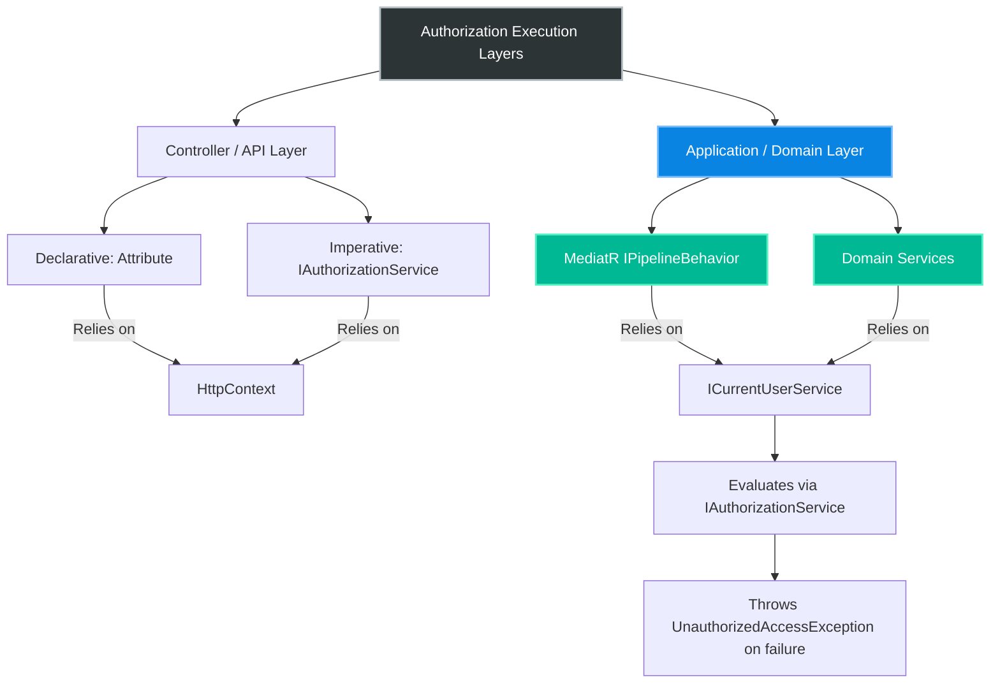

# 4.159 — IAuthorizationService: Programmatic Authorization in Service Layer

## PART 0 — Navigation & Context

```text
ASP.NET Core Domain Hierarchy
├── Authorization
│   ├── 4.154 Authorization Architecture
│   ├── 4.156 Policy-Based Authorization
│   ├── 4.158 Resource-Based Authorization
│   └── 4.159 IAuthorizationService in Service Layer ◄ YOU ARE HERE
├── DI & Architecture
│   └── 4.042 The Captive Dependency Problem
└── Background Services
    └── 4.153 Auth in Background Services
```

**What you need before this:**
- [[4.154 — Authorization Architecture]] — Understanding how the `IAuthorizationService` evaluates policies and handlers.
- [[4.158 — Resource-Based Authorization]] — Understanding how to pass domain objects into `AuthorizeAsync`.

**What this unlocks after:**
- Domain-Driven Design (DDD) security boundaries where authorization lives in the business layer, entirely decoupled from ASP.NET Core HTTP controllers.
- Secure message consumers (RabbitMQ/Kafka) that enforce authorization without an HTTP request.

**Why this matters to a production engineer at scale:**
As an application grows from a simple API into a modular monolith or a complex CQRS architecture (like using MediatR), relying on `[Authorize]` attributes on Controllers becomes insufficient. Controllers are just one entry point. If a background worker, a gRPC service, or a GraphQL endpoint calls your domain layer, the domain layer must enforce its own security. Injecting `IAuthorizationService` directly into your business services or MediatR behaviors allows you to enforce ASP.NET Core's powerful policy engine completely independent of the HTTP pipeline.

---

## PART 1 — The Core Mental Model

> **The Fundamental Rule**
> **Authorization is a business concern, not an HTTP concern; by injecting `IAuthorizationService` and `ICurrentUserService` into your domain services, you can imperatively enforce ASP.NET Core policies deep within your architecture, ensuring security regardless of whether the entry point was a REST API, a message queue, or a background job.**

**The Plain-Language Analogy**
Imagine a bank. 
Declarative `[Authorize]` attributes are like the security guard at the front door. They check your ID when you walk in from the street (the HTTP request). 
But what if money needs to be transferred via an automated wire system (a background job), or through the drive-thru (a gRPC endpoint)? If security is *only* at the front door, the automated systems bypass it. 
Programmatic authorization in the service layer is like putting the security check directly on the vault door. It doesn't matter how you got into the building; before the vault opens, the system verifies your clearance.

**The Taxonomy Diagram**



---

## PART 2 — Deep Mechanics

### 1. The Disconnect from HttpContext

The `AuthorizationMiddleware` is coupled to `HttpContext`. When it fails, it calls `context.ForbidAsync()`, which writes a `403` to the HTTP response.

When you use `IAuthorizationService` in the domain layer, there is no HTTP response to write to. You are simply executing C# logic.

```csharp
// Framework Source Behavior (IAuthorizationService interface):
Task<AuthorizationResult> AuthorizeAsync(ClaimsPrincipal user, object? resource, string policyName);
```

Notice that `AuthorizeAsync` takes a `ClaimsPrincipal`, **not** an `HttpContext`. This means the authorization engine itself is completely decoupled from the web layer.

### 2. Providing the Identity (ICurrentUserService)

To pass the `ClaimsPrincipal` to the service, you need to know who the current user is. You cannot inject `IHttpContextAccessor` into the domain layer because it violates Clean Architecture and breaks background workers.

You must create an `ICurrentUserService` abstraction.

// Pipeline position: Anywhere in the application.
```
Any Entry Point ──► Sets ICurrentUserService.Principal ──► Calls Domain Service ──► Domain Service reads ICurrentUserService.Principal ──► Passes to IAuthorizationService
```

### 3. Handling the Failure Mode

If `_authService.AuthorizeAsync()` returns `false` inside a Domain Service, what do you do? You cannot return `IActionResult` (like `Forbid()`). 
You must throw an exception or return a Domain Error pattern (like a `Result<T>` object).

If you throw an exception (e.g., `UnauthorizedAccessException`), it bubbles up. If the entry point was a Controller, a global exception filter catches it and translates it to a `403 Forbidden`. If the entry point was a Kafka consumer, the consumer logs the security violation and dead-letters the message.

**Runtime Cost Label:** Throwing exceptions is expensive (~2ms), but authorization failures should be exceptional. The success path is purely CPU-bound (< 0.1ms).

### 4. The Double-Evaluation Risk

If you have an `[Authorize(Policy="Admin")]` on your controller, AND your domain service also evaluates the `Admin` policy, the `IAuthorizationService` runs twice. 
This is usually acceptable for simple policies, but if the policy involves database lookups inside its handlers, you are doubling your DB hits. Caching inside the handlers is critical when doing defense-in-depth.

---

## PART 3 — Production Code Patterns

### Pattern 1: The Ambient Identity Abstraction
To make programmatic authorization work across all entry points, define an interface for the current user.

```csharp
// Domain Layer
public interface ICurrentUserService
{
    ClaimsPrincipal Principal { get; }
    string UserId { get; }
}

// Web Layer Implementation
public class WebCurrentUserService : ICurrentUserService
{
    private readonly IHttpContextAccessor _accessor;
    public WebCurrentUserService(IHttpContextAccessor accessor) => _accessor = accessor;
    
    public ClaimsPrincipal Principal => _accessor.HttpContext?.User 
                                     ?? new ClaimsPrincipal(new ClaimsIdentity());
                                     
    public string UserId => Principal.FindFirstValue(ClaimTypes.NameIdentifier);
}
```

### Pattern 2: Programmatic Authorization in a Domain Service
Using `IAuthorizationService` inside a business logic class, throwing an exception on failure.

```csharp
public class DocumentManagementService
{
    private readonly IAuthorizationService _authService;
    private readonly ICurrentUserService _currentUser;
    private readonly ApplicationDbContext _db;

    public DocumentManagementService(
        IAuthorizationService authService, 
        ICurrentUserService currentUser, 
        ApplicationDbContext db)
    {
        _authService = authService;
        _currentUser = currentUser;
        _db = db;
    }

    public async Task PublishDocumentAsync(int documentId)
    {
        var doc = await _db.Documents.FindAsync(documentId);
        if (doc == null) throw new KeyNotFoundException("Document not found");

        // ✅ CORRECT: Programmatic, resource-based authorization in the service layer
        var authResult = await _authService.AuthorizeAsync(
            _currentUser.Principal, 
            doc, 
            "CanPublishDocument");

        if (!authResult.Succeeded)
        {
            // ✅ CORRECT: Throw a domain exception, not an HTTP response
            throw new UnauthorizedAccessException("You do not have permission to publish this document.");
        }

        doc.Status = "Published";
        await _db.SaveChangesAsync();
    }
}
```

### Pattern 3: The Global Exception Handler for 403s
To translate the domain's `UnauthorizedAccessException` back into a proper HTTP response when called from a web endpoint.

```csharp
public class SecurityExceptionMiddleware
{
    private readonly RequestDelegate _next;

    public SecurityExceptionMiddleware(RequestDelegate next) => _next = next;

    public async Task InvokeAsync(HttpContext context)
    {
        try
        {
            await _next(context);
        }
        catch (UnauthorizedAccessException ex)
        {
            // ✅ CORRECT: Translate the domain exception to HTTP 403
            context.Response.StatusCode = StatusCodes.Status403Forbidden;
            context.Response.ContentType = "application/json";
            
            await context.Response.WriteAsJsonAsync(new { 
                Error = "Forbidden", 
                Message = ex.Message 
            });
        }
    }
}
```

// HTTP wire format consequence:
```http
HTTP/1.1 403 Forbidden
Content-Type: application/json

{
  "error": "Forbidden",
  "message": "You do not have permission to publish this document."
}
```

### Pattern 4: MediatR IPipelineBehavior for Authorization
If you use CQRS with MediatR, you can enforce authorization declaratively on the Command objects, but execute it programmatically in the pipeline before the handler runs.

```csharp
// 1. The custom attribute
[AttributeUsage(AttributeTargets.Class)]
public class AuthorizeCommandAttribute : Attribute
{
    public string Policy { get; }
    public AuthorizeCommandAttribute(string policy) => Policy = policy;
}

// 2. The Command
[AuthorizeCommand("RequireFinanceRole")]
public class ProcessPaymentCommand : IRequest<bool> { ... }

// 3. The MediatR Behavior
public class AuthorizationBehavior<TRequest, TResponse> : IPipelineBehavior<TRequest, TResponse>
{
    private readonly IAuthorizationService _authService;
    private readonly ICurrentUserService _currentUser;

    public async Task<TResponse> Handle(TRequest request, RequestHandlerDelegate<TResponse> next, CancellationToken ct)
    {
        var authAttributes = request.GetType().GetCustomAttributes<AuthorizeCommandAttribute>();

        foreach (var attr in authAttributes)
        {
            // ✅ CORRECT: Intercepting the command and evaluating the policy programmatically
            var authResult = await _authService.AuthorizeAsync(_currentUser.Principal, request, attr.Policy);
            if (!authResult.Succeeded)
            {
                throw new UnauthorizedAccessException($"Failed requirement for policy: {attr.Policy}");
            }
        }

        return await next(); // Proceed to the actual handler
    }
}
```

### Pattern 5: Authorization in a Background Worker
When a RabbitMQ consumer receives a message, it sets up the ambient identity, and the Domain Service's authorization checks work flawlessly without knowing they are in a background worker.

```csharp
protected override async Task ExecuteAsync(CancellationToken stoppingToken)
{
    await foreach(var message in _queue.ConsumeAsync())
    {
        using var scope = _scopeFactory.CreateScope();
        
        // 1. Setup Identity
        var userService = scope.ServiceProvider.GetRequiredService<ICurrentUserService>();
        userService.SetPrincipalFromMessage(message.UserId);

        // 2. Call Domain Service
        var domainService = scope.ServiceProvider.GetRequiredService<DocumentManagementService>();
        
        try 
        {
            // 3. Domain service calls IAuthorizationService internally!
            await domainService.PublishDocumentAsync(message.DocId);
        }
        catch (UnauthorizedAccessException) 
        {
            // The user who triggered the message is no longer authorized.
            _logger.LogWarning("Security violation in background worker.");
        }
    }
}
```

---

## PART 4 — Gotchas & Anti-Patterns

### Gotcha 1: Injecting IHttpContextAccessor into the Domain
The most common mistake when trying to get the `ClaimsPrincipal` inside a domain service.

// ⚠️ WRONG CODE
```csharp
public class PaymentService
{
    private readonly IHttpContextAccessor _httpContextAccessor;
    private readonly IAuthorizationService _authService;

    public PaymentService(IHttpContextAccessor http, IAuthorizationService auth) { ... }

    public async Task Pay()
    {
        var user = _httpContextAccessor.HttpContext.User;
        await _authService.AuthorizeAsync(user, null, "CanPay");
    }
}
```

// HTTP consequence (wrong path):
// Works perfectly in the Web API. Crashes with `NullReferenceException` when `PaymentService` is reused in a background worker or unit test.

// ✅ CORRECT CODE
```csharp
public class PaymentService
{
    private readonly ICurrentUserService _currentUser;
    // ...
}
```

// WHY: `HttpContext` is an infrastructural detail of Kestrel/IIS. Domain logic must never depend on infrastructure.

### Gotcha 2: Returning HTTP ActionResults from Domain Services
Developers try to make their Domain Services return `IActionResult` so they can easily return `Forbid()`.

// ⚠️ WRONG CODE
```csharp
public async Task<IActionResult> PublishDocument()
{
    var authResult = await _authService.AuthorizeAsync(User, doc, "Edit");
    if (!authResult.Succeeded) return new ForbidResult(); // 💥 MVC reference in Domain!
}
```

// HTTP consequence (wrong path):
// The Domain project now requires a NuGet reference to `Microsoft.AspNetCore.Mvc.Core`. Background workers now have to deal with MVC action results.

// ✅ CORRECT CODE
```csharp
// Return Domain constructs, not HTTP constructs
if (!authResult.Succeeded) throw new UnauthorizedAccessException();
// OR use a Result pattern:
// if (!authResult.Succeeded) return Result.Forbidden();
```

// WHY: The Domain layer must be agnostic to the presentation layer.

### Gotcha 3: The Double-Authorization Trap
If a Controller has `[Authorize(Policy="Admin")]` and calls a Domain Service that imperatively calls `AuthorizeAsync(..., "Admin")`.

// ⚠️ WRONG CODE
```csharp
[Authorize(Policy = "Admin")]
public IActionResult DoWork() 
{
    _domainService.DoWork(); // Domain service also checks "Admin" policy internally
}
```

// HTTP consequence (wrong path):
// The policy is evaluated twice. If the policy relies on a database lookup (e.g., checking an active subscription), you hit the DB twice.

// ✅ CORRECT CODE
```csharp
// Prefer defense-in-depth, but optimize the handlers.
// Use IMemoryCache inside the IAuthorizationHandler so the second evaluation is a 0ms cache hit.
```

// WHY: Defense-in-depth is good. The Domain Service *should* secure itself. But you must design the handlers to be idempotent and extremely fast (cached) to survive double-execution.

### Gotcha 4: Bypassing Auth in System/Admin Contexts
When the system itself (a cron job) needs to call the Domain Service, it might not satisfy the "Admin" policy because it lacks a human identity.

// ⚠️ WRONG CODE
```csharp
// Nightly cron job runs
var user = new ClaimsPrincipal(); // Empty user
_currentUser.SetPrincipal(user);
await _domainService.PublishDocumentAsync(); // Throws UnauthorizedAccessException!
```

// HTTP consequence (wrong path):
// Nightly jobs fail because they don't have human permissions.

// ✅ CORRECT CODE
```csharp
// In the cron job:
var systemClaims = new[] { new Claim("SystemAccount", "true") };
_currentUser.SetPrincipal(new ClaimsPrincipal(new ClaimsIdentity(systemClaims)));

// In the IAuthorizationHandler:
protected override Task HandleRequirementAsync(...)
{
    if (context.User.HasClaim("SystemAccount", "true")) {
        context.Succeed(requirement); // Bypass logic for system workers
    }
}
```

// WHY: Policies must explicitly account for non-human "Service" identities when authorization is moved into the domain layer.

### Gotcha 5: Assuming Policies Auto-Register in Non-Web Projects
If you have a separate Console App or Worker Service, you must explicitly configure the Authorization services.

// ⚠️ WRONG CODE
```csharp
// Worker Service Program.cs
// Developer adds the Domain Service but forgets Auth services
services.AddTransient<DocumentManagementService>();
```

// HTTP consequence (wrong path):
// When the domain service requests `IAuthorizationService`, the DI container throws `InvalidOperationException: No service for type 'IAuthorizationService' has been registered.`

// ✅ CORRECT CODE
```csharp
// Worker Service Program.cs
services.AddAuthorization(options => {
    options.AddPolicy("CanPublishDocument", ...);
});
// Need to add default handlers if you don't call AddControllers/AddAuthentication
services.AddLogging();
services.AddOptions();
```

// WHY: The Kestrel `WebApplicationBuilder` adds core authorization services automatically. A generic `Host.CreateDefaultBuilder` for background workers requires you to register the `AddAuthorization()` policies explicitly.

---

## PART 5 — Performance Implications

### Request Pipeline Characteristics

| Scenario | Pipeline Depth | Allocations Per Request | Approx Latency Impact | Recommendation |
|---|---|---|---|---|
| Domain `AuthorizeAsync` (Success) | Medium | ~4 (Context allocs) | < 0.1ms | Negligible overhead for defense-in-depth. |
| Domain `AuthorizeAsync` (Failure) | Medium | ~4 + Exception | ~2.0ms | Exceptions are slow, but failures are rare. |
| MediatR Pipeline Auth | Medium | ~10 (Reflection) | ~0.2ms | Standard pattern for CQRS security. |

### BenchmarkDotNet Code

```csharp
using BenchmarkDotNet.Attributes;
using Microsoft.AspNetCore.Authorization;
using System.Security.Claims;

[MemoryDiagnoser]
public class ServiceAuthBenchmark
{
    private IAuthorizationService _authService;
    private ClaimsPrincipal _principal;

    [GlobalSetup]
    public void Setup()
    {
        var services = new ServiceCollection();
        services.AddLogging();
        services.AddAuthorization(o => o.AddPolicy("AdminOnly", p => p.RequireClaim("Role", "Admin")));
        _authService = services.BuildServiceProvider().GetRequiredService<IAuthorizationService>();
        _principal = new ClaimsPrincipal(new ClaimsIdentity(new[] { new Claim("Role", "Admin") }));
    }

    [Benchmark(Baseline = true)]
    public async Task<bool> DirectBusinessLogic()
    {
        // No auth check
        return true;
    }

    [Benchmark]
    public async Task<bool> AuthorizedBusinessLogic()
    {
        var result = await _authService.AuthorizeAsync(_principal, null, "AdminOnly");
        if (!result.Succeeded) throw new UnauthorizedAccessException();
        return true;
    }
}

// Expected output (approximate, .NET 8, x64, local):
// Method                  | Mean      | Error     | StdDev    | Gen0   | Allocated |
// ----------------------- |----------:|----------:|----------:|-------:|----------:|
// DirectBusinessLogic     |  0.1 ns   | 0.01 ns   | 0.01 ns   | 0.0000 |       0 B |
// AuthorizedBusinessLogic | 350.5 ns  |  5.1 ns   |  4.8 ns   | 0.0250 |     180 B |
```

**When to Care:** If a domain service loops over 10,000 items and calls `_authService.AuthorizeAsync` inside the loop. That adds 3.5ms of overhead and 1.8MB of garbage collection allocation.
**When this doesn't matter:** When evaluating the policy once at the entry point of the domain method. The 350ns cost is invisible.

---

## PART 6 — Interview Arsenal

### A. The Question Bank

**Question 1:** "We have a monolithic application where Controllers use `[Authorize]` attributes. We are now adding a gRPC service and a background worker that both need to call our `PaymentService` class. How do we ensure the `PaymentService` is secure?"
- **Average Answer:** "Just check the user's role inside the `PaymentService`."
- **Why That's Insufficient:** Doesn't leverage the framework's policy engine and likely implies injecting `IHttpContextAccessor`.
- **Great Answer:** "Because multiple entry points—some without HTTP context—now access the domain, relying on `[Authorize]` attributes on controllers is insufficient. We must push authorization down into the domain layer. I would inject `IAuthorizationService` and a custom `ICurrentUserService` directly into the `PaymentService`. Before executing the payment logic, the service imperatively calls `_authService.AuthorizeAsync` using the ambient principal. If it fails, it throws a domain exception like `UnauthorizedAccessException`, which the specific entry point (REST, gRPC, or worker) translates into its respective protocol's error response."

**Question 2:** "If you inject `IAuthorizationService` into a class library project (your Domain layer), what dependency issues might you face?"
- **Average Answer:** "You have to add ASP.NET Core to your class library."
- **Why That's Insufficient:** Misses the nuance of the `Microsoft.AspNetCore.Authorization` package.
- **Great Answer:** "You don't need the entire web framework. The `IAuthorizationService` lives in the `Microsoft.AspNetCore.Authorization` NuGet package, which is completely decoupled from HTTP and MVC. It only depends on `Microsoft.Extensions` and `System.Security.Claims`. By referencing just this targeted package in your Domain layer, you keep your domain pure from Kestrel/HTTP concerns while still leveraging Microsoft's robust policy evaluation engine."

**Question 3:** "In a CQRS architecture using MediatR, where is the best place to put programmatic authorization?"
- **Average Answer:** "Inside the MediatR handler."
- **Why That's Insufficient:** Violates the Single Responsibility Principle and duplicates code.
- **Great Answer:** "The best place is an `IPipelineBehavior`. By writing an `AuthorizationBehavior`, you can intercept every Command before it reaches its handler. You decorate your Commands with custom attributes indicating the required Policy. The behavior reads the attribute, uses `ICurrentUserService` to get the principal, and executes `IAuthorizationService.AuthorizeAsync`. This centralizes security, ensuring developers cannot forget to call authorization inside their specific command handlers."

### B. The Trick Questions

**Trick Question:** "If an `IAuthorizationHandler` fails, it normally triggers a 403 response. If I call it from my domain service, why do I get a 200 OK instead?"
- **The Trap:** Believing the `IAuthorizationService` inherently manipulates the HTTP response.
- **The Correct Answer:** "The `IAuthorizationService` only returns a boolean-like `AuthorizationResult`. It is the `AuthorizationMiddleware` in the HTTP pipeline that normally intercepts that result and writes the 403. When you call the service imperatively in the domain layer, you bypass the middleware. If you forget to explicitly check `result.Succeeded` and throw an exception, the code continues executing and the web layer eventually returns a 200 OK."

**Trick Question:** "Can I use `ForbidResult` from my Domain Service if I install the `Microsoft.AspNetCore.Mvc.Core` package?"
- **The Trap:** Encouraging terrible architecture just because it compiles.
- **The Correct Answer:** "You can, but it is a massive anti-pattern. A Domain Service should never return HTTP-specific action results. It couples your business logic to MVC. If you try to call that service from a background worker, what is the worker supposed to do with an `IActionResult`? The domain should return domain results (like an enum, a `Result<T>`, or throw an exception)."

### C. Red Flags to Avoid
- 🚩 **"I just pass `HttpContext` down to my service methods as a parameter."** (Ties the domain layer to the web layer, destroying testability and background worker compatibility).
- 🚩 **"I recreate the role checking logic manually inside the domain service."** (Reinvents the wheel and splits security rules. Keep the rules centralized in Policies).
- 🚩 **"I catch the `UnauthorizedAccessException` in my controller and return a 400 Bad Request."** (Security violations are not validation errors. Return 403 Forbidden).

---

## PART 7 — Decision Framework

```mermaid
graph TD
    A[Where to put Authorization?] --> B{Who calls the Domain Logic?}
    
    B -->|Only ASP.NET Core Controllers| C[Declarative AuthZ is fine]
    C --> C1["[Authorize(Policy='Admin')] on Controller"]
    
    B -->|Controllers, Workers, gRPC, etc.| D[Push AuthZ to Domain]
    
    D --> E{Using MediatR / CQRS?}
    E -->|Yes| F[Use IPipelineBehavior for AuthZ]
    E -->|No| G[Inject IAuthService into Domain Classes]
    
    F --> H[Decorate Commands with custom attributes]
    G --> I[Imperatively call AuthorizeAsync() and throw on fail]
    
    style A fill:#2d3436,stroke:#fff
    style C fill:#0984e3,stroke:#fff
    style F fill:#00b894,stroke:#fff
    style G fill:#00b894,stroke:#fff
```

---

## PART 8 — Self-Check

### A. Conceptual Questions
1. Why is `IAuthorizationService` located in a separate NuGet package from MVC?
2. What happens if you inject `IHttpContextAccessor` into a service called by a RabbitMQ consumer?
3. How do you map a domain-level `UnauthorizedAccessException` to an HTTP 403 response globally?
4. Why is throwing an exception preferable to returning an `IActionResult` in a Domain Service?
5. What is the role of `ICurrentUserService`?
6. If both the Controller and the Domain Service evaluate the "Admin" policy, what performance risk exists?
7. How does a MediatR Pipeline Behavior intercept a command?
8. How do you bypass domain authorization when a nightly cron job needs to execute a service?

### B. Code Puzzles

**Puzzle 1: The Missing Exception**
```csharp
public async Task UpdateData() {
    var result = await _authService.AuthorizeAsync(_user.Principal, null, "Manager");
    if (result.Succeeded) {
        _db.UpdateData();
        await _db.SaveChangesAsync();
    }
}
```
*Scenario:* An unauthorized user calls this service method. The API returns a 200 OK. Why?
<details>
<summary>Answer</summary>
The authorization failed, so the `if` block is skipped. The method finishes executing. Because no exception was thrown and no value was returned, the calling Controller assumes everything went perfectly and returns a 200 OK. The data wasn't updated, but the client thinks it was.
*Fix:* Throw an exception if `!result.Succeeded`.
</details>

**Puzzle 2: The Infrastructure Leak**
```csharp
public class ReportService {
    private readonly HttpContext _context;
    public ReportService(IHttpContextAccessor acc) => _context = acc.HttpContext;

    public void Run() {
        if (!_context.User.IsInRole("Admin")) throw new Exception("Denied");
    }
}
```
*Scenario:* Write a unit test for `ReportService.Run()`.
<details>
<summary>Answer</summary>
Writing the unit test requires mocking `IHttpContextAccessor`, instantiating a `DefaultHttpContext`, setting the `User` property, and passing it in. It is overly complex. If it used an `ICurrentUserService`, the mock would be a single line. Furthermore, `_context` will be null if resolved from DI outside a web request, causing a crash.
</details>

**Puzzle 3: The Double DB Hit**
```csharp
// In the IAuthorizationHandler
var userStatus = await _db.Users.FindAsync(context.User.Id);

// In the Domain Service
await _authService.AuthorizeAsync(...);
var userStatus = await _db.Users.FindAsync(_currentUser.UserId);
```
*Scenario:* A single API request executes this logic.
<details>
<summary>Answer</summary>
The database is queried twice for the exact same user record. First by the Auth handler, then by the Domain logic. 
*Fix:* Cache the user status in `IMemoryCache` for a few seconds within the handler, OR fetch the user status in the domain service and pass it as the `resource` to `AuthorizeAsync`.
</details>

**Puzzle 4: The System Identity**
```csharp
// Inside a BackgroundWorker
var systemPrincipal = new ClaimsPrincipal(); 
_currentUser.SetPrincipal(systemPrincipal);
await _domainService.ProcessBatchAsync();
```
*Scenario:* The background worker runs and crashes with UnauthorizedAccessException.
<details>
<summary>Answer</summary>
The `systemPrincipal` has no claims. When the domain service calls `AuthorizeAsync(..., "AdminPolicy")`, it fails because the system principal doesn't have the "Admin" role. 
*Fix:* Add a "System" claim to the principal, and modify the policy handlers to explicitly succeed if the user is a "System".
</details>

---

## PART 9 — Connections & Resources

### A. Related Topics Table

| Topic | Why It Connects |
|---|---|
| [[4.154 — Authorization Architecture]] | The core engine used programmatically in this pattern. |
| [[4.153 — Auth in Background Services]] | The primary reason programmatic, context-free authorization is required. |
| [[4.042 — The Captive Dependency Problem]] | Relevant when resolving Scoped `ICurrentUserService` in Singletons. |
| [[4.177 — Exception Handling Middleware]] | How to translate the domain exceptions back into 403 HTTP responses. |

### B. Books

| Book | Chapters | Why These Chapters |
|---|---|---|
| Clean Architecture (Robert C. Martin) | Chapter 16: Independence | The theoretical foundation for decoupling security rules from the web delivery mechanism. |
| ASP.NET Core in Action, 3rd Ed | Chapter 16: Authorization | Covers using IAuthorizationService imperatively. |

### C. Essential Articles & Docs
- [Microsoft Docs: Imperative authorization](https://learn.microsoft.com/en-us/aspnet/core/security/authorization/imperative)
- [Jimmy Bogard: MediatR Pipeline Behaviors](https://jimmybogard.com/mediatr-pipeline-behaviors/)
- [Andrew Lock: An Introduction to IAuthorizationService](https://andrewlock.net/introduction-to-authorization-in-asp-net-core/)

> [!NOTE]
> **Template Meta-Note**
> Part 0: Context & Prerequisites. Part 1: Core Mental Model. Part 2: Deep Mechanics & Pipeline. Part 3: Production Code. Part 4: Gotchas. Part 5: Performance. Part 6: Interview Arsenal. Part 7: Decision Framework. Part 8: Puzzles. Part 9: Resources.
