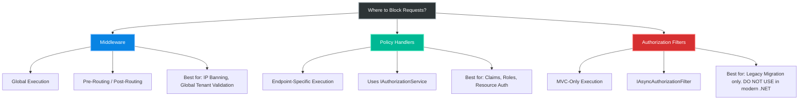

# 4.160 — Authorization Filters vs Policy Handlers vs Middleware: When Each

## PART 0 — Navigation & Context

```text
ASP.NET Core Domain Hierarchy
├── Middleware
│   └── 4.050 Writing Middleware
├── MVC & Controllers
│   └── 4.110 MVC Filter Pipeline
└── Authorization
    ├── 4.154 Authorization Architecture
    ├── 4.157 IAuthorizationHandler
    └── 4.160 Filters vs Handlers vs Middleware ◄ YOU ARE HERE
```

**What you need before this:**
- [[4.154 — Authorization Architecture]] — The canonical policy evaluation engine.
- [[4.110 — MVC Filter Pipeline]] — How filters execute before action methods.
- [[4.050 — Writing Middleware]] — How to write global request interception.

**What this unlocks after:**
- Multi-tenant architecture design.
- Optimizing high-performance request pipelines by failing fast.

**Why this matters to a production engineer at scale:**
There are three distinct places to block an unauthorized request in ASP.NET Core: in a global Middleware, in a Policy Handler, or in an MVC Authorization Filter. Knowing when to use which separates seniors from juniors. If you put global IP restrictions in a Policy Handler, you waste CPU cycles routing requests. If you put resource-based authorization in Middleware, you couple network infrastructure to your database domain. If you write custom MVC Authorization Filters in .NET 8+, you are likely building legacy code that breaks Minimal APIs.

---

## PART 1 — The Core Mental Model

> **The Fundamental Rule**
> **Middleware protects the *entire* HTTP pipeline unconditionally (fail fast), Policy Handlers protect *specific* endpoints by executing complex domain-aware security logic, and MVC Authorization Filters are a legacy construct from ASP.NET MVC that should be entirely replaced by Policy Handlers in modern ASP.NET Core applications.**

**The Plain-Language Analogy**
Imagine a secure office building. 
**Middleware** is the front gate security guard. They check if you have a company badge and if you're on the global IP ban list. They don't know who you are visiting or what room you are going to; they just protect the perimeter.
**Policy Handlers** are the electronic locks on specific doors inside the building. When you try to enter the "Finance Room" (the Endpoint), the lock evaluates your badge (Claims) against the room's specific rules (Policies). 
**Authorization Filters** were an older generation of electronic locks that only worked on specific brands of doors (MVC Controllers) but failed completely if you installed a new type of door (Minimal APIs or gRPC).

**The Taxonomy Diagram**



---

## PART 2 — Deep Mechanics

### 1. Middleware: The Global Perimeter

Middleware executes sequentially. If you write an Authorization Middleware, it runs on *every single request* (static files, health checks, APIs, WebSockets).

// Pipeline position: Early in the pipeline.
```
──► UseMiddleware<IpBlocker> ──► UseRouting ──► UseAuth ──► Endpoints
```

**Mechanics:** Middleware only has access to the `HttpContext`. If placed before `UseRouting`, it doesn't know which endpoint is going to execute. If placed before `UseAuthentication`, `HttpContext.User` is null. 

**Runtime Cost Label:** Extremely cheap to short-circuit. < 0.05ms. Saves all downstream processing costs.

### 2. Policy Handlers: The Endpoint Guardian

Policy Handlers (`IAuthorizationHandler`) execute only when an endpoint dictates they must (via `[Authorize(Policy="...")]`), OR when explicitly configured via a Fallback Policy.

// Pipeline position: Executed by UseAuthorization, right before the Endpoint.
```
──► Routing ──► Auth ──► UseAuthorization (Executes Policy Handlers) ──► Endpoint
```

**Mechanics:** By the time a Policy Handler runs, Routing has completed. The `HttpContext.GetEndpoint()` is populated. Authentication has completed, so `HttpContext.User` is populated. You have full context.

**Runtime Cost Label:** Moderate. ~0.1ms. The framework evaluates all handlers associated with the policy.

### 3. MVC Authorization Filters: The Legacy Artifact

`IAsyncAuthorizationFilter` is part of the MVC Filter Pipeline. It runs *after* Middleware, *after* Routing, and *after* Endpoint Selection, but *before* Model Binding.

// Pipeline position: Inside the MVC Execution engine.
```
──► UseAuthorization ──► [MVC Endpoint Executes] ──► Auth Filter ──► Resource Filter ──► Action
```

**Mechanics:** Filters are coupled to the `Microsoft.AspNetCore.Mvc` namespace. They run inside the MVC invocation pipeline.

**Why they are obsolete:** With the introduction of Endpoint Routing in ASP.NET Core 3.0, authorization was extracted from MVC and moved into the global middleware (`UseAuthorization`). If you use Minimal APIs, gRPC, or SignalR, MVC Filters **do not execute**. Securing an application with MVC Filters leaves Minimal APIs completely exposed.

---

## PART 3 — Production Code Patterns

### Pattern 1: Middleware for Global Network Security (IP Whitelisting)
When you want to block requests based on infrastructure or network context (not identity), use Middleware before anything else.

```csharp
public class IpSafelistMiddleware
{
    private readonly RequestDelegate _next;
    private readonly string _safeIpBytes; // Simplified

    public IpSafelistMiddleware(RequestDelegate next, IConfiguration config)
    {
        _next = next;
        _safeIpBytes = config["SafeIp"];
    }

    public async Task Invoke(HttpContext context)
    {
        var remoteIp = context.Connection.RemoteIpAddress;
        
        // ✅ CORRECT: Pure infrastructure check in Middleware
        if (remoteIp?.ToString() != _safeIpBytes)
        {
            context.Response.StatusCode = StatusCodes.Status403Forbidden;
            return; // Short-circuit the entire application!
        }

        await _next(context);
    }
}

// Program.cs
app.UseMiddleware<IpSafelistMiddleware>(); // Put this very early!
app.UseRouting();
```

// HTTP wire format consequence:
```http
// Attacker from bad IP sends request to /api/data
HTTP/1.1 403 Forbidden
```

### Pattern 2: Middleware for Global Multi-Tenant Validation
If your architecture dictates that a valid Tenant ID header MUST be present on every API request, evaluate it in Middleware.

```csharp
app.Use(async (context, next) =>
{
    // Ignore health checks
    if (context.Request.Path.StartsWithSegments("/health")) {
        await next(context);
        return;
    }

    if (!context.Request.Headers.ContainsKey("X-Tenant-Id"))
    {
        // ✅ CORRECT: Global structural validation before Auth
        context.Response.StatusCode = StatusCodes.Status400BadRequest;
        await context.Response.WriteAsJsonAsync(new { Error = "Missing Tenant Context" });
        return;
    }

    await next(context);
});
```

### Pattern 3: Policy Handlers for Business Rules
When authorization depends on who the user is or what role they have, use Policy Handlers. This keeps the rule tied to the `[Authorize]` attribute.

```csharp
public class RequiresSubscriptionHandler : AuthorizationHandler<SubscriptionRequirement>
{
    private readonly ApplicationDbContext _db;

    public RequiresSubscriptionHandler(ApplicationDbContext db) => _db = db;

    protected override async Task HandleRequirementAsync(
        AuthorizationHandlerContext context, SubscriptionRequirement requirement)
    {
        var userId = context.User.FindFirstValue(ClaimTypes.NameIdentifier);
        
        // ✅ CORRECT: Business logic evaluation in a Handler
        var isActive = await _db.Subscriptions.AnyAsync(s => s.UserId == userId && s.IsActive);
        
        if (isActive) {
            context.Succeed(requirement);
        }
    }
}
```

### Pattern 4: Refactoring Legacy Auth Filters to Policy Handlers
If you find `IAsyncAuthorizationFilter` in an old codebase, rewrite it.

// ⚠️ WRONG (Legacy MVC Filter):
```csharp
public class LegacyCustomAuthFilter : IAsyncAuthorizationFilter
{
    public async Task OnAuthorizationAsync(AuthorizationFilterContext context)
    {
        if (!context.HttpContext.User.HasClaim("Admin", "true"))
        {
            // MVC specific result
            context.Result = new ForbidResult(); 
        }
    }
}
```

// ✅ CORRECT (Modern Policy Handler):
```csharp
public class ModernAdminHandler : AuthorizationHandler<AdminRequirement>
{
    protected override Task HandleRequirementAsync(
        AuthorizationHandlerContext context, AdminRequirement requirement)
    {
        if (context.User.HasClaim("Admin", "true"))
        {
            context.Succeed(requirement);
        }
        return Task.CompletedTask;
    }
}
```

### Pattern 5: Bypassing Middleware on Specific Endpoints
A downside of Middleware is it runs everywhere. You can use Endpoint Metadata to bypass it cleanly without hardcoding paths.

```csharp
// 1. Define a marker attribute
public class AllowPublicIpAttribute : Attribute { }

// 2. The Middleware
public async Task Invoke(HttpContext context)
{
    var endpoint = context.GetEndpoint();
    
    // ✅ CORRECT: Using Endpoint Metadata inside Middleware to opt-out
    if (endpoint?.Metadata.GetMetadata<AllowPublicIpAttribute>() != null)
    {
        await _next(context); // Bypass IP check
        return;
    }

    // ... run IP check ...
}

// 3. The Endpoint
[AllowPublicIp]
app.MapGet("/api/public-webhook", () => ...);
```

---

## PART 4 — Gotchas & Anti-Patterns

### Gotcha 1: Reading Body Data in Middleware for Auth
If you write Middleware to read the JSON body to perform authorization (e.g., checking a property inside the POST payload), you break the request for the controllers.

// ⚠️ WRONG CODE
```csharp
public async Task Invoke(HttpContext context)
{
    using var reader = new StreamReader(context.Request.Body);
    var body = await reader.ReadToEndAsync();
    if (body.Contains("Hacked")) { context.Response.StatusCode = 403; return; }
    
    await _next(context); // The stream is at the end!
}
```

// HTTP consequence (wrong path):
// The request passes to the controller. Model Binding attempts to read the body. It gets an empty string. The controller receives a `null` object. 400 Bad Request or NullReferenceException.

// ✅ CORRECT CODE
```csharp
// If you MUST read the body in middleware (not recommended for AuthZ):
context.Request.EnableBuffering();
using var reader = new StreamReader(context.Request.Body, leaveOpen: true);
var body = await reader.ReadToEndAsync();
context.Request.Body.Position = 0; // Reset for downstream
```

// WHY: The `HttpRequest.Body` is a forward-only, unbuffered stream. If Middleware consumes it, Model Binding starves. Use Resource-Based Authorization inside the controller instead of Middleware to authorize based on payload data.

### Gotcha 2: Custom Auth Filters in a Mixed Application
If a team migrates from MVC to Minimal APIs but relies on custom `IAsyncAuthorizationFilter` classes, they will create massive security holes.

// ⚠️ WRONG CODE
```csharp
// Legacy filter applied via global MVC options
services.AddControllers(options => {
    options.Filters.Add<MyCustomSecurityFilter>();
});

// A new minimal API added by a junior developer
app.MapGet("/api/secret", () => "Gold"); 
```

// HTTP consequence (wrong path):
// The `/api/secret` endpoint executes. The `MyCustomSecurityFilter` NEVER runs because Minimal APIs do not use the MVC pipeline. The secret is exposed. 200 OK.

// ✅ CORRECT CODE
```csharp
// Use standard Policies via UseAuthorization middleware, which secures ALL endpoints.
app.MapGet("/api/secret", () => "Gold").RequireAuthorization("MyCustomSecurityPolicy");
```

// WHY: MVC Filters are tightly coupled to the `Microsoft.AspNetCore.Mvc` execution context. `UseAuthorization` middleware sits higher up the stack.

### Gotcha 3: Checking `User` in Middleware before `UseAuthentication`
If you write an authorization middleware and place it too early, you'll be evaluating an anonymous user.

// ⚠️ WRONG CODE
```csharp
app.UseMiddleware<MyCustomAuthMiddleware>(); // Checks context.User!
app.UseRouting();
app.UseAuthentication();
```

// HTTP consequence (wrong path):
// All requests are rejected as unauthenticated because `context.User.Identity.IsAuthenticated` is always false at this stage of the pipeline.

// ✅ CORRECT CODE
```csharp
app.UseRouting();
app.UseAuthentication();
app.UseMiddleware<MyCustomAuthMiddleware>(); // Now context.User is populated
```

### Gotcha 4: Returning 401 instead of Calling _next
In Custom Middleware, failing to call `_next` short-circuits the pipeline. But developers often manually write 401s instead of leveraging the framework's challenge mechanism.

// ⚠️ WRONG CODE
```csharp
if (!hasAccess) {
    context.Response.StatusCode = 401; // Manual 401
    return;
}
```

// HTTP consequence (wrong path):
// The client receives a bare 401. If this is a Web application relying on cookies, the user is NOT redirected to the login page because the `CookieAuthenticationHandler`'s Challenge logic was bypassed.

// ✅ CORRECT CODE
```csharp
if (!hasAccess) {
    await context.ChallengeAsync(); // Invokes the auth handler's challenge logic
    return;
}
```

// WHY: `ChallengeAsync()` signals the active Authentication Scheme to handle the unauthorized state (e.g., adding `WWW-Authenticate` headers or redirecting to `/Account/Login`).

### Gotcha 5: Middleware Doing DB Lookups on Static Files
If you put DB-heavy authorization in global Middleware, it runs for *everything*.

// ⚠️ WRONG CODE
```csharp
public async Task Invoke(HttpContext context)
{
    var isActive = await _db.Users.AnyAsync(u => u.Id == context.User.Id); // DB Hit!
    await _next(context);
}

// Pipeline:
app.UseAuthentication();
app.UseMiddleware<DbAuthMiddleware>();
app.UseStaticFiles(); // Serves site.css, logo.png
```

// HTTP consequence (wrong path):
// A browser loads index.html, which requests 10 CSS/JS/image files. Your middleware executes 11 database queries just to load the homepage.

// ✅ CORRECT CODE
```csharp
// Use Policy Handlers! They only run on endpoints explicitly decorated with [Authorize].
// Static files (which have no endpoint metadata) bypass Policy Handlers completely.
```

---

## PART 5 — Performance Implications

### Request Pipeline Characteristics

| Scenario | Pipeline Depth | Allocations Per Request | Approx Latency Impact | Recommendation |
|---|---|---|---|---|
| Middleware (Short-circuit) | Shallow | ~0 | < 0.01ms | The fastest way to reject traffic. |
| Middleware (Pass-through) | Shallow | ~1 | < 0.05ms | Adds slight overhead to ALL requests. |
| Policy Handler | Medium | ~3 | ~0.10ms | Best balance of performance and security. |
| MVC Auth Filter | Deep | High | ~0.20ms | Legacy. Do not use. |

### BenchmarkDotNet Code

```csharp
using BenchmarkDotNet.Attributes;
using Microsoft.AspNetCore.Http;
using System.Threading.Tasks;

[MemoryDiagnoser]
public class PipelineInterceptionBenchmark
{
    private HttpContext _context = new DefaultHttpContext();
    private RequestDelegate _next = (ctx) => Task.CompletedTask;

    [Benchmark(Baseline = true)]
    public async Task MiddlewarePassThrough()
    {
        // Simulating a fast middleware check
        if (_context.Request.Headers.ContainsKey("X-Block")) { return; }
        await _next(_context);
    }

    [Benchmark]
    public async Task MiddlewareShortCircuit()
    {
        _context.Request.Headers["X-Block"] = "true";
        if (_context.Request.Headers.ContainsKey("X-Block")) 
        { 
            _context.Response.StatusCode = 403;
            return; 
        }
        await _next(_context);
    }
}

// Expected output (approximate, .NET 8, x64, local):
// Method                  | Mean      | Error     | StdDev    | Gen0   | Allocated |
// ----------------------- |----------:|----------:|----------:|-------:|----------:|
// MiddlewarePassThrough   |  8.2 ns   | 0.10 ns   | 0.09 ns   | 0.0000 |       0 B |
// MiddlewareShortCircuit  | 14.5 ns   | 0.15 ns   | 0.12 ns   | 0.0000 |       0 B |
```

**When to Care:** If your application is under DDoS attack or heavy scraping, Custom Middleware that checks IP addresses or rate limits is thousands of times faster than letting the request reach an MVC Controller. Fail as early as possible.
**When this doesn't matter:** For standard business logic rules. Don't push business authorization into Middleware just to save 0.1ms. The maintainability cost of Middleware is high.

---

## PART 6 — Interview Arsenal

### A. The Question Bank

**Question 1:** "If you need to ensure that a user has a specific subscription level to access an endpoint, would you implement this in Custom Middleware, an Authorization Filter, or a Policy Handler?"
- **Average Answer:** "I would write a Custom Middleware to check their subscription."
- **Why That's Insufficient:** Shows a lack of understanding of pipeline scoping. Middleware runs globally.
- **Great Answer:** "I would use a Policy Handler. Custom Middleware runs on every single request, including static files and health checks, meaning we'd execute subscription database lookups for `favicon.ico`. Authorization Filters are an obsolete MVC construct that won't protect Minimal APIs. A Policy Handler is the correct choice because it integrates with the `[Authorize]` attribute, meaning it only executes on exactly the endpoints that require the subscription."

**Question 2:** "Why did Microsoft deprecate MVC Authorization Filters in favor of `UseAuthorization` middleware in ASP.NET Core 3.0+?"
- **Average Answer:** "Because Minimal APIs were introduced."
- **Why That's Insufficient:** Minimal APIs were introduced in .NET 6, not 3.0. Endpoint Routing is the real answer.
- **Great Answer:** "In earlier versions, routing and authorization were trapped inside the MVC framework. This meant if you used SignalR or pure middleware endpoints, you had to invent your own security models. In ASP.NET Core 3.0, Microsoft introduced Endpoint Routing. They pulled the concept of an 'Endpoint' down to the core framework level. By moving Authorization out of MVC Filters and into `UseAuthorization` middleware, ASP.NET Core can secure *any* endpoint—MVC, Minimal APIs, gRPC, or SignalR Hubs—using the exact same Policy engine."

**Question 3:** "When is Custom Middleware the absolute best choice for Authorization?"
- **Average Answer:** "When you want to block people."
- **Why That's Insufficient:** Too vague. Policy handlers block people too.
- **Great Answer:** "Custom Middleware is the best choice when the authorization rule is global, structural, and identity-agnostic. For example, validating that a required `X-Client-Id` header is present on every single API request, or blocking traffic from a specific IP subnet. Middleware fails fast, saving the server from allocating routing and authentication resources for fundamentally invalid requests."

### B. The Trick Questions

**Trick Question:** "I wrote a Policy Handler that checks if `context.User.Identity.IsAuthenticated` is true, but it's never being hit for anonymous users. Why?"
- **The Trap:** Thinking Policy Handlers evaluate Authentication.
- **The Correct Answer:** "If a user is completely anonymous, the `AuthorizationMiddleware` short-circuits and issues a Challenge (401) before it even bothers executing your custom Handlers. Your Handler will never execute for an anonymous user unless the Policy explicitly allows it or you use `[AllowAnonymous]`."

**Trick Question:** "Can an MVC `IAsyncAuthorizationFilter` access the HTTP Request Body to check the payload data?"
- **The Trap:** Assuming filters can easily read the body stream.
- **The Correct Answer:** "It can, but it is highly dangerous. The Request Body is a forward-only stream. If the Authorization Filter reads it, the stream pointer moves to the end. When the MVC Model Binder subsequently tries to parse the JSON into a C# object, the stream is empty, resulting in a null object. If you must authorize based on payload data, you should use Imperative Resource-Based Authorization inside the controller action *after* model binding occurs."

### C. Red Flags to Avoid
- 🚩 **"I use Action Filters for Authorization."** (Action Filters run *after* Model Binding. If the payload is 50MB, the server allocates 50MB of memory parsing it before realizing the user is unauthorized. Massive DoS vulnerability).
- 🚩 **"I write all my security checks in Custom Middleware."** (Reinvents the wheel, bypasses the `[Authorize]` ecosystem, and applies expensive logic to static files).

---

## PART 7 — Decision Framework

```mermaid
graph TD
    A[Where to put Security Logic?] --> B{Does it apply to ALL requests?}
    
    B -->|Yes| C{Does it depend on the User Identity?}
    C -->|No e.g. IP Blocker| D[Use Custom Middleware BEFORE Auth]
    C -->|Yes e.g. Global Tenant Check| E[Use Custom Middleware AFTER Auth]
    
    B -->|No, only specific endpoints| F{Are you using legacy ASP.NET MVC 5?}
    F -->|Yes| G[Use MVC Authorization Filters]
    F -->|No, modern ASP.NET Core| H{Does rule depend on payload data?}
    
    H -->|Yes e.g. Edit specific doc| I[Imperative Resource-Based Auth in Controller]
    H -->|No e.g. Require 'Admin'| J[Declarative Policy Handlers via Attribute]
    
    style A fill:#2d3436,stroke:#fff
    style D fill:#0984e3,stroke:#fff
    style E fill:#0984e3,stroke:#fff
    style G fill:#d63031,stroke:#fff
    style I fill:#00b894,stroke:#fff
    style J fill:#00b894,stroke:#fff
```



---

## PART 8 — Self-Check

### A. Conceptual Questions
1. Why is `IAsyncAuthorizationFilter` considered obsolete for new applications?
2. At what exact point in the pipeline does `UseAuthorization` execute?
3. If Custom Middleware checks `HttpContext.User`, where MUST it be placed in `Program.cs`?
4. Why is IP whitelisting better suited for Middleware than a Policy Handler?
5. What happens if Middleware reads `context.Request.Body` without enabling buffering?
6. How does Endpoint Routing allow Middleware to know which endpoint is about to execute?
7. What is the difference between failing an MVC Filter (`context.Result = new ForbidResult()`) and failing a Middleware (`context.Response.StatusCode = 403`)?
8. Why are Action Filters a terrible place to perform Authorization?

### B. Code Puzzles

**Puzzle 1: The Null User**
```csharp
app.UseMiddleware<TenantValidationMiddleware>();
app.UseAuthentication();
app.UseAuthorization();

// Inside TenantValidationMiddleware
var tenant = context.User.FindFirst("TenantId");
```
*Scenario:* The application starts, a user sends a valid JWT, but `tenant` is always null. Why?
<details>
<summary>Answer</summary>
The Middleware is placed before `UseAuthentication`. At this point in the pipeline, the JWT hasn't been parsed yet, and `context.User` is an unauthenticated identity with no claims. 
*Fix:* Move `UseMiddleware<TenantValidationMiddleware>()` below `UseAuthentication()`.
</details>

**Puzzle 2: The Action Filter Attack**
```csharp
public class AuthActionFilter : IAsyncActionFilter {
    public async Task OnActionExecutionAsync(context, next) {
        if (!context.HttpContext.User.IsInRole("Admin")) {
            context.Result = new UnauthorizedResult();
            return;
        }
        await next();
    }
}
```
*Scenario:* An attacker uploads a 2GB file to an endpoint protected by this Action Filter.
<details>
<summary>Answer</summary>
Action Filters run *after* Model Binding. ASP.NET Core will buffer and process the 2GB file upload before the filter executes. The attacker can easily exhaust server memory and cause a Denial of Service, even though they don't have the Admin role.
*Fix:* Use Policy Handlers (which run before Model Binding).
</details>

**Puzzle 3: The Short-Circuit Loop**
```csharp
public async Task Invoke(HttpContext context) {
    if (IsBanned(context.Connection.RemoteIpAddress)) {
        context.Response.Redirect("/banned.html");
        return;
    }
    await _next(context);
}
```
*Scenario:* A banned IP visits the site. The browser shows an "ERR_TOO_MANY_REDIRECTS" loop. Why?
<details>
<summary>Answer</summary>
The middleware executes on *every* request, including the request for `/banned.html`. When the user is redirected to `/banned.html`, the middleware intercepts it, sees they are banned, and redirects them to `/banned.html` again. Infinite loop.
*Fix:* Add `if (context.Request.Path == "/banned.html") { await _next(context); return; }`
</details>

**Puzzle 4: Mixed Paradigms**
```csharp
app.MapGet("/api/data", () => "Data").AddEndpointFilter(async (ctx, next) => {
    if (!ctx.HttpContext.User.Identity.IsAuthenticated) return Results.Unauthorized();
    return await next(ctx);
});
```
*Scenario:* Is this Minimal API Endpoint Filter safe to use for Authorization?
<details>
<summary>Answer</summary>
It works, but it's an anti-pattern. Minimal API `EndpointFilters` are the equivalent of MVC Action Filters. They run after the routing and pipeline. While safer in Minimal APIs than MVC (less model binding overhead), it bypasses the `IAuthorizationService` engine, making security rules invisible to swagger/OpenAPI and impossible to unit test centrally. Use `.RequireAuthorization()` instead.
</details>

---

## PART 9 — Connections & Resources

### A. Related Topics Table

| Topic | Why It Connects |
|---|---|
| [[4.050 — Writing Middleware]] | Explains how to author the Custom Middleware discussed in this note. |
| [[4.154 — Authorization Architecture]] | Explains the Policy Engine that powers Handlers. |
| [[4.110 — MVC Filter Pipeline]] | Details the execution order of MVC filters (Auth -> Resource -> Action). |

### B. Books

| Book | Chapters | Why These Chapters |
|---|---|---|
| ASP.NET Core in Action, 3rd Ed | Chapter 16: Authorization | Clear discussion on why MVC Auth filters are legacy. |
| Pro ASP.NET Core 6 | Chapter 18: Filters | Details the migration from Filters to Endpoint Routing. |

### C. Essential Articles & Docs
- [Microsoft Docs: Filters in ASP.NET Core](https://learn.microsoft.com/en-us/aspnet/core/mvc/controllers/filters)
- [Microsoft Docs: ASP.NET Core Middleware](https://learn.microsoft.com/en-us/aspnet/core/fundamentals/middleware/)
- [Andrew Lock: Comparing Middleware and Filters](https://andrewlock.net/comparing-middleware-and-filters-in-asp-net-core/)

> [!NOTE]
> **Template Meta-Note**
> Part 0: Context & Prerequisites. Part 1: Core Mental Model. Part 2: Deep Mechanics & Pipeline. Part 3: Production Code. Part 4: Gotchas. Part 5: Performance. Part 6: Interview Arsenal. Part 7: Decision Framework. Part 8: Puzzles. Part 9: Resources.
