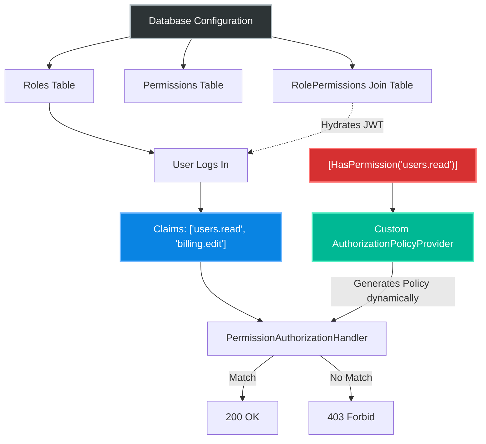

# 4.161 — Permission-Based Authorization: Fine-Grained Action Permissions

## PART 0 — Navigation & Context

```text
ASP.NET Core Domain Hierarchy
├── Authentication
│   └── 4.142 ASP.NET Core Identity
├── Authorization
│   ├── 4.154 Authorization Architecture
│   ├── 4.155 Role-Based and Claims-Based
│   ├── 4.156 Policy-Based Authorization
│   └── 4.161 Permission-Based Authorization ◄ YOU ARE HERE
└── Advanced Security
```

**What you need before this:**
- [[4.155 — Role-Based and Claims-Based Authorization]] — Understanding the severe limitations of RBAC in large applications.
- [[4.156 — Policy-Based Authorization]] — The engine that enables Permission-Based systems.

**What this unlocks after:**
- Multi-tenant enterprise SaaS applications.
- Dynamic permission grids driven by database configuration.

**Why this matters to a production engineer at scale:**
When you build a B2B SaaS product, your customers will inevitably ask for custom roles. "I want a role that can manage users but cannot see billing." If your code is littered with `[Authorize(Roles="Admin")]`, you are stuck. You have to hardcode a new role and recompile. Permission-Based Authorization separates *what the endpoint does* (e.g., `Permissions.Users.Read`) from *who has access to it*. By building a custom `IAuthorizationPolicyProvider`, you can secure your endpoints with elegant attributes like `[HasPermission("users.read")]` and manage the role-to-permission mapping entirely in the database without ever recompiling your code.

---

## PART 1 — The Core Mental Model

> **The Fundamental Rule**
> **Endpoints should be secured by specific, immutable Actions (Permissions), while Roles should simply be mutable collections of those Actions managed in a database; this is achieved by dynamically generating Policies using an `IAuthorizationPolicyProvider` that checks if the user possesses the required Permission claim.**

**The Plain-Language Analogy**
Imagine a hotel.
**Role-Based Authorization** hardcodes the locks: "This door opens for Managers." If the owner wants to give the Janitor access to the Manager's closet, they have to rip out the lock and install a new one that says "Opens for Managers AND Janitors."
**Permission-Based Authorization** hardcodes the *key teeth*: "This door opens for any key that has the `closet.read` groove." The endpoints never change. If the owner wants the Janitor to enter, they just use a key-cutting machine (the database UI) to add the `closet.read` groove to the Janitor's master key. The locks (API endpoints) don't care about the job title, only the groove (the Permission).

**The Taxonomy Diagram**



---

## PART 2 — Deep Mechanics

### 1. The Limitation of Standard Policies

If you use standard ASP.NET Core Policies, you have to register every single permission in `Program.cs`.

```csharp
// The Nightmare Scenario in Program.cs
options.AddPolicy("Users.Read", p => p.RequireClaim("Permission", "Users.Read"));
options.AddPolicy("Users.Write", p => p.RequireClaim("Permission", "Users.Write"));
options.AddPolicy("Billing.Read", p => p.RequireClaim("Permission", "Billing.Read"));
// ... 500 lines later ...
```
This is a maintenance nightmare. Developers will forget to register policies, causing the application to crash at startup or silently fail open depending on configuration.

### 2. The Custom Policy Provider

ASP.NET Core uses the `IAuthorizationPolicyProvider` interface to resolve policies from strings. The default implementation looks up the string in an in-memory dictionary populated by `options.AddPolicy()`.

By overriding this provider, we can **dynamically generate** a policy on the fly when the framework asks for it.

// Pipeline position: Execution at application startup / endpoint initialization.
```
Endpoint Metadata [Authorize(Policy="Permission:Users.Read")] 
                      │
                      └──► Calls PolicyProvider.GetPolicyAsync("Permission:Users.Read")
                               │
                               └──► Extracts "Users.Read"
                               └──► Returns new Policy requiring that claim dynamically
```

**Runtime Cost Label:** Policy providers are aggressively cached by ASP.NET Core internally. It only executes once per unique policy string during the application's lifetime. < 0.1ms at startup.

### 3. The Claims Hydration Problem

If Permissions live in the database, how do they get into the `ClaimsPrincipal`?

**Option A: Stuffing the JWT.**
When the user logs in, query the database for all their roles, then query for all permissions mapped to those roles, and add 50 claims to the JWT payload.
*Danger:* The JWT becomes massive (Header too large errors).

**Option B: The Claims Transformation.**
Keep the JWT small (just `UserId` and `RoleId`). Hook into ASP.NET Core's `IClaimsTransformation` interface. On every HTTP request, intercept the JWT, query the database (or a fast Redis cache) for the permissions, and append them to the `ClaimsPrincipal` in memory.

### 4. The strongly-typed constant system

Magic strings cause typos (`"user.read"` vs `"users.read"`). A permission system must be backed by a strongly typed constants class or enum to ensure compile-time safety across controllers and frontend UI logic.

---

## PART 3 — Production Code Patterns

### Pattern 1: The Custom Permission Attribute
Instead of typing `[Authorize(Policy = "Permission:Users.Read")]`, create a custom attribute.

```csharp
// 1. The Constants
public static class Permissions
{
    public const string UsersRead = "users.read";
    public const string UsersWrite = "users.write";
}

// 2. The Attribute
public class HasPermissionAttribute : AuthorizeAttribute
{
    public HasPermissionAttribute(string permission)
        : base(policy: $"Permission:{permission}") // Encodes the requirement into the policy name
    {
    }
}

// 3. Usage on Controller
[ApiController]
[Route("api/[controller]")]
public class UsersController : ControllerBase
{
    [HasPermission(Permissions.UsersRead)] // Clean, type-safe!
    [HttpGet]
    public IActionResult Get() { ... }
}
```

### Pattern 2: The Dynamic Policy Provider
This is the heart of the system. It intercepts the framework's request for a policy, parses the encoded name, and builds the requirement dynamically.

```csharp
public class PermissionPolicyProvider : IAuthorizationPolicyProvider
{
    // Fallback to the default provider for standard policies like "AdminOnly"
    private readonly DefaultAuthorizationPolicyProvider _fallback;

    public PermissionPolicyProvider(IOptions<AuthorizationOptions> options)
    {
        _fallback = new DefaultAuthorizationPolicyProvider(options);
    }

    public Task<AuthorizationPolicy> GetDefaultPolicyAsync() => _fallback.GetDefaultPolicyAsync();
    public Task<AuthorizationPolicy> GetFallbackPolicyAsync() => _fallback.GetFallbackPolicyAsync();

    public Task<AuthorizationPolicy> GetPolicyAsync(string policyName)
    {
        // ✅ CORRECT: Dynamically handling our custom policy syntax
        if (policyName.StartsWith("Permission:", StringComparison.OrdinalIgnoreCase))
        {
            var permission = policyName.Substring("Permission:".Length);
            
            var policy = new AuthorizationPolicyBuilder()
                .AddRequirements(new PermissionRequirement(permission))
                .Build();
                
            return Task.FromResult(policy);
        }

        // Fallback to standard policies configured in Program.cs
        return _fallback.GetPolicyAsync(policyName);
    }
}
```

### Pattern 3: The Permission Handler
The handler that evaluates the dynamically created requirement against the user's claims.

```csharp
public class PermissionRequirement : IAuthorizationRequirement
{
    public string Permission { get; }
    public PermissionRequirement(string permission) => Permission = permission;
}

public class PermissionAuthorizationHandler : AuthorizationHandler<PermissionRequirement>
{
    protected override Task HandleRequirementAsync(
        AuthorizationHandlerContext context, 
        PermissionRequirement requirement)
    {
        // ✅ CORRECT: Checking if the user possesses the specific permission claim
        var hasPermission = context.User.HasClaim(
            c => c.Type == "Permission" && c.Value == requirement.Permission);

        if (hasPermission)
        {
            context.Succeed(requirement);
        }

        return Task.CompletedTask;
    }
}
```

### Pattern 4: Registering the Infrastructure
You must wire up the custom provider in `Program.cs`.

```csharp
// 1. Register the custom provider
builder.Services.AddSingleton<IAuthorizationPolicyProvider, PermissionPolicyProvider>();

// 2. Register the handler
builder.Services.AddSingleton<IAuthorizationHandler, PermissionAuthorizationHandler>();

// 3. Add default authorization services
builder.Services.AddAuthorization();
```

### Pattern 5: Database Claims Transformation (Avoid Fat JWTs)
If a user has 100 permissions, do not put them in the JWT. Add them on the fly.

```csharp
public class PermissionClaimsTransformation : IClaimsTransformation
{
    private readonly IServiceProvider _serviceProvider;

    // Use IServiceProvider to avoid captive dependency on Scoped DbContext in a Transient service
    public PermissionClaimsTransformation(IServiceProvider serviceProvider)
    {
        _serviceProvider = serviceProvider;
    }

    public async Task<ClaimsPrincipal> TransformAsync(ClaimsPrincipal principal)
    {
        if (principal.HasClaim(c => c.Type == "Permission")) {
            return principal; // Already transformed
        }

        var userId = principal.FindFirstValue(ClaimTypes.NameIdentifier);
        if (userId == null) return principal;

        using var scope = _serviceProvider.CreateScope();
        var cache = scope.ServiceProvider.GetRequiredService<IMemoryCache>();
        var db = scope.ServiceProvider.GetRequiredService<ApplicationDbContext>();

        // ✅ CORRECT: Cache permissions to avoid DB hit on every HTTP request
        var permissions = await cache.GetOrCreateAsync($"perms_{userId}", async entry =>
        {
            entry.AbsoluteExpirationRelativeToNow = TimeSpan.FromMinutes(15);
            
            // Complex EF Core query joining User -> Roles -> RolePermissions -> Permissions
            return await db.Users
                .Where(u => u.Id == userId)
                .SelectMany(u => u.Roles)
                .SelectMany(r => r.Permissions)
                .Select(p => p.Name)
                .ToListAsync();
        });

        // Clone the identity and append claims
        var clone = principal.Clone();
        var newIdentity = (ClaimsIdentity)clone.Identity;

        foreach (var p in permissions)
        {
            newIdentity.AddClaim(new Claim("Permission", p));
        }

        return clone;
    }
}

// In Program.cs
builder.Services.AddTransient<IClaimsTransformation, PermissionClaimsTransformation>();
```

---

## PART 4 — Gotchas & Anti-Patterns

### Gotcha 1: Hardcoding Database Queries in the Authorization Handler
Developers often put the EF Core database lookup directly inside `PermissionAuthorizationHandler`.

// ⚠️ WRONG CODE
```csharp
protected override async Task HandleRequirementAsync(context, requirement)
{
    var userId = context.User.FindFirstValue(ClaimTypes.NameIdentifier);
    var hasPerm = await _db.UserPermissions.AnyAsync(p => p.UserId == userId && p.Name == requirement.Permission);
    if (hasPerm) context.Succeed(requirement);
}
```

// HTTP consequence (wrong path):
// If a Controller action has 3 `[HasPermission]` attributes, this handler hits the database 3 times sequentially.

// ✅ CORRECT CODE
```csharp
// Use IClaimsTransformation with caching (Pattern 5) to load ALL permissions ONCE into memory.
// The Handler should be purely CPU-bound, inspecting the in-memory ClaimsPrincipal.
```

// WHY: `IClaimsTransformation` executes exactly once per HTTP request, immediately after Authentication. Handlers execute once *per policy*. Moving I/O out of the handler prevents N+1 query problems.

### Gotcha 2: The Prefix Collision in Policy Providers
When writing a custom `IAuthorizationPolicyProvider`, if you don't call the fallback provider, standard policies break.

// ⚠️ WRONG CODE
```csharp
public Task<AuthorizationPolicy> GetPolicyAsync(string policyName)
{
    // Blindly assumes ALL policies are permission policies
    var policy = new AuthorizationPolicyBuilder()
        .AddRequirements(new PermissionRequirement(policyName))
        .Build();
    return Task.FromResult(policy);
}
```

// HTTP consequence (wrong path):
// If the app relies on default Identity features or Swagger requiring `[Authorize]`, it crashes or evaluates incorrectly because the system tries to evaluate "SwaggerAuth" as a permission name.

// ✅ CORRECT CODE
```csharp
// Always use a prefix like "Permission:" and fallback if it doesn't match
if (policyName.StartsWith("Permission:")) { ... }
return _fallback.GetPolicyAsync(policyName);
```

### Gotcha 3: Caching Stale Permissions
When you cache permissions in `IClaimsTransformation`, you introduce a race condition with security updates.

// ⚠️ WRONG CODE
```csharp
// Cache set for 24 hours
entry.AbsoluteExpirationRelativeToNow = TimeSpan.FromHours(24);
```

// HTTP consequence (wrong path):
// An admin fires a rogue employee and removes all their permissions in the UI. The employee can still execute API actions for 24 hours because the cache is stale.

// ✅ CORRECT CODE
```csharp
// Use short memory cache (e.g., 5 minutes) or use a Distributed Cache (Redis)
// and actively invalidate the cache key when the admin updates permissions in the UI.
await _redis.KeyDeleteAsync($"perms_{userId}");
```

// WHY: Security invalidation is a distributed systems problem. Cache invalidation must be built into your User Management domain services.

### Gotcha 4: Captive Dependency in IClaimsTransformation
`IClaimsTransformation` is registered as `Transient`, but it is injected into the Authentication middleware pipeline which can act somewhat like a Singleton/Scoped hybrid depending on the host.

// ⚠️ WRONG CODE
```csharp
public class PermissionClaimsTransformation : IClaimsTransformation
{
    private readonly ApplicationDbContext _db; // Scoped dependency

    // DI Exception: Cannot consume scoped service from singleton (if injected wrong)
    public PermissionClaimsTransformation(ApplicationDbContext db) => _db = db;
}
```

// ✅ CORRECT CODE
```csharp
// Use IServiceProvider to manually resolve the scoped DbContext within the method
using var scope = _serviceProvider.CreateScope();
var db = scope.ServiceProvider.GetRequiredService<ApplicationDbContext>();
```

### Gotcha 5: Enum Refactoring Nightmares
Developers sometimes use C# `enum` for permissions.

// ⚠️ WRONG CODE
```csharp
public enum Permissions { ReadUsers = 1, WriteUsers = 2 }
[HasPermission(Permissions.ReadUsers)] // Enum mapped to int in DB
```

// HTTP consequence (wrong path):
// A developer adds a new enum value in the middle, shifting the integer values. The database still has the old integers. Suddenly everyone's permissions are randomized. Security catastrophe.

// ✅ CORRECT CODE
```csharp
// Use string constants. Strings are immutable and survive refactoring.
public const string UsersRead = "users.read";
```

---

## PART 5 — Performance Implications

### Request Pipeline Characteristics

| Scenario | Pipeline Depth | Allocations Per Request | Approx Latency Impact | Recommendation |
|---|---|---|---|---|
| JWT bloated with 100 perms | Early | High | 10ms (Network transfer) | Anti-pattern; avoid large HTTP headers. |
| Uncached Claims Transform | Early | Medium (EF Core) | 10ms - 50ms | Anti-pattern; destroys DB under load. |
| Cached Claims Transform | Early | Low | < 0.2ms | Standard pattern for enterprise APIs. |
| Permission Policy Evaluation| Medium | ~1 | < 0.05ms | Negligible. |

### BenchmarkDotNet Code

```csharp
using BenchmarkDotNet.Attributes;
using System.Security.Claims;
using Microsoft.Extensions.Caching.Memory;

[MemoryDiagnoser]
public class ClaimsTransformBenchmark
{
    private IMemoryCache _cache = new MemoryCache(new MemoryCacheOptions());
    private ClaimsPrincipal _principal;
    private string _userId = "123";

    [GlobalSetup]
    public void Setup()
    {
        _principal = new ClaimsPrincipal(new ClaimsIdentity(new[] { new Claim(ClaimTypes.NameIdentifier, _userId) }));
        _cache.Set($"perms_{_userId}", new List<string> { "users.read", "billing.edit" });
    }

    [Benchmark]
    public ClaimsPrincipal TransformWithCache()
    {
        var perms = _cache.Get<List<string>>($"perms_{_userId}");
        var clone = _principal.Clone();
        var identity = (ClaimsIdentity)clone.Identity;
        
        foreach (var p in perms) {
            identity.AddClaim(new Claim("Permission", p));
        }
        return clone;
    }
}

// Expected output (approximate, .NET 8, x64, local):
// Method              | Mean      | Error     | StdDev    | Gen0   | Allocated |
// ------------------- |----------:|----------:|----------:|-------:|----------:|
// TransformWithCache  | 420.5 ns  |  8.2 ns   |  7.6 ns   | 0.0620 |     392 B |
```

**When to Care:** If an API takes 10,000 RPS, allocating 400 bytes per request in the transformation pipeline generates 4MB of garbage per second. This is well within modern .NET GC capabilities, but if you query the DB instead of the cache, you will bring down your SQL server instantly.

---

## PART 6 — Interview Arsenal

### A. The Question Bank

**Question 1:** "Our application has grown to 50 endpoints and 10 custom roles. Customers are complaining that our roles don't match their internal corporate structure. How do we fix this architecturally?"
- **Average Answer:** "Create a UI to let them create custom roles and map endpoints to those roles."
- **Why That's Insufficient:** You cannot dynamically map endpoints to roles if the endpoints have hardcoded `[Authorize(Roles="X")]` attributes.
- **Great Answer:** "We need to migrate from Role-Based to Permission-Based Authorization. First, we remove all `Roles=` attributes from our controllers and replace them with specific action strings like `[HasPermission('invoice.approve')]`. Second, we create a database schema linking Users to Roles, and Roles to Permissions. Third, we implement a custom `IAuthorizationPolicyProvider` to dynamically generate policies based on those strings, and an `IClaimsTransformation` to hydrate the user's permissions from the database into the `ClaimsPrincipal` on each request. This completely decouples the API code from the customer's organizational structure."

**Question 2:** "If we have 500 unique permissions in our application, should we include them in the JWT token payload when the user logs in?"
- **Average Answer:** "Yes, so we don't have to query the database."
- **Why That's Insufficient:** A JWT with 500 strings will exceed HTTP header size limits (usually 8KB in IIS/Kestrel), causing random HTTP 431 errors.
- **Great Answer:** "No, placing 500 claims into a JWT will cause Token Bloat. It increases network latency on every request and will likely exceed Kestrel's maximum header size, causing HTTP 431 Request Header Fields Too Large errors. Instead, the JWT should only contain the `UserId` and `TenantId`. We should implement `IClaimsTransformation` to read the `UserId` from the token, fetch the 500 permissions from a Redis cache, and attach them to the `ClaimsPrincipal` server-side, keeping the wire payload extremely small."

**Question 3:** "Why do we write a custom `IAuthorizationPolicyProvider` instead of just using a `foreach` loop to register all 500 permissions in `Program.cs`?"
- **Average Answer:** "Because a foreach loop makes the startup file too long."
- **Why That's Insufficient:** Misses the dynamic nature of permissions.
- **Great Answer:** "If we register them statically in `Program.cs`, the application has to know every single permission string at startup. If a developer adds a new `[HasPermission("new.feature")]` attribute to a controller but forgets to update the registration loop or enum, the application fails to authorize it. A custom `IAuthorizationPolicyProvider` parses the policy string from the attribute *on the fly* the first time the endpoint is hit. It dynamically generates the policy. This eliminates the registration step entirely, preventing developer error."

### B. The Trick Questions

**Trick Question:** "If I use `IClaimsTransformation` to add a 'SuperAdmin' claim, but my Custom Authorization Middleware placed before `UseAuthentication` checks for it, why does it fail?"
- **The Trap:** Misunderstanding the execution order of claims transformation.
- **The Correct Answer:** "`IClaimsTransformation` is executed by the Authentication Middleware (`UseAuthentication`). If your custom middleware runs *before* authentication, the claims transformation hasn't run yet, so the 'SuperAdmin' claim does not exist in the principal. The pipeline must be strictly ordered."

**Trick Question:** "Is `IClaimsTransformation` called once per HTTP request, or once per lifetime of the JWT?"
- **The Trap:** Confusing JWT validation with the ASP.NET Core request pipeline.
- **The Correct Answer:** "It is called exactly **once per HTTP request** by the authentication handler upon successful validation of the token. It does not modify the JWT itself; it only modifies the transient `ClaimsPrincipal` constructed in server memory for the duration of that specific HTTP request."

### C. Red Flags to Avoid
- 🚩 **"I just query the database in the controller `if (_db.Permissions.Any(...))`."** (Massive duplication of code. Inconsistent security application).
- 🚩 **"We use a giant bitmask (integer flags) to store permissions."** (Bitmasks are efficient but max out at 64 permissions for a `long`. Enterprise apps easily surpass this, rendering bitmasks useless).

---

## PART 7 — Decision Framework

```mermaid
graph TD
    A[Authorization Complexity] --> B{Do users have static job titles?}
    
    B -->|Yes| C[Use Role-Based Auth]
    B -->|No, customers demand custom roles| D[Use Permission-Based Auth]
    
    D --> E{How many permissions?}
    E -->|< 20| F[Embed in JWT Claims]
    E -->|> 20| G[Use IClaimsTransformation]
    
    G --> H[Hydrate from Database]
    H --> I[Cache aggressively in Memory/Redis]
    
    I --> J[Evaluate via Custom PolicyProvider]
    
    style A fill:#2d3436,stroke:#fff
    style C fill:#0984e3,stroke:#fff
    style G fill:#00b894,stroke:#fff
    style J fill:#d63031,stroke:#fff
```



---

## PART 8 — Self-Check

### A. Conceptual Questions
1. Why is Role-Based Authorization insufficient for B2B multi-tenant applications?
2. What is the specific purpose of the `IAuthorizationPolicyProvider` interface?
3. Why does `GetPolicyAsync` in a custom provider require a fallback mechanism?
4. What happens if you put 500 string claims inside a JWT payload?
5. When is `IClaimsTransformation.TransformAsync` executed in the ASP.NET Core pipeline?
6. Why should you avoid querying the database directly inside an `IAuthorizationHandler`?
7. What is the danger of using C# Enums for database-backed permissions?
8. How does `IClaimsTransformation` interact with `IMemoryCache`?

### B. Code Puzzles

**Puzzle 1: The String Splitter**
```csharp
[Authorize(Policy = "Permission-Users.Read")]
// ...
public Task<AuthorizationPolicy> GetPolicyAsync(string name) {
    if (name.StartsWith("Permission-")) {
        var p = name.Split('-')[1]; // Extracts "Users.Read"
        return Task.FromResult(new AuthorizationPolicyBuilder().AddRequirements(new Req(p)).Build());
    }
    return _fallback.GetPolicyAsync(name);
}
```
*Scenario:* A developer adds `[Authorize(Policy = "Permission-Admin-Access")]`. Does the policy generate correctly?
<details>
<summary>Answer</summary>
No. The `Split('-')` method yields `["Permission", "Admin", "Access"]`. Index `[1]` is just `"Admin"`. The policy is generated for the permission `"Admin"`, ignoring `"Access"`. 
*Fix:* Use `Substring` with the exact prefix length, or `Split(new[] {'-'}, 2)`.
</details>

**Puzzle 2: The Double Transform**
```csharp
public async Task<ClaimsPrincipal> TransformAsync(ClaimsPrincipal principal) {
    var clone = principal.Clone();
    ((ClaimsIdentity)clone.Identity).AddClaim(new Claim("Perm", "Read"));
    return clone;
}
```
*Scenario:* In some complex setups, `TransformAsync` might be called multiple times in a single request. What happens here?
<details>
<summary>Answer</summary>
If called twice, it adds the "Perm" claim twice. This leads to duplicate claims in the principal, which can cause unexpected behavior in policies.
*Fix:* Always check if the transformation has already occurred: `if (principal.HasClaim(c => c.Type == "Perm")) return principal;`
</details>

**Puzzle 3: The Missing Prefix**
```csharp
public class HasPermissionAttribute : AuthorizeAttribute {
    public HasPermissionAttribute(string perm) : base(perm) { } // Oops!
}
```
*Scenario:* Developer uses `[HasPermission("users.read")]`.
<details>
<summary>Answer</summary>
The `AuthorizeAttribute` constructor takes the policy name. The developer passed the raw permission `"users.read"`. The `IAuthorizationPolicyProvider` looks for `policyName.StartsWith("Permission:")`. It fails to find the prefix, falls back to the default provider, and crashes because `"users.read"` wasn't registered in `Program.cs`.
*Fix:* `: base($"Permission:{perm}")`
</details>

**Puzzle 4: The Caching Trap**
```csharp
var perms = await _cache.GetOrCreateAsync("perms", async e => {
    return await _db.Permissions.Where(p => p.UserId == User.Id).ToListAsync();
});
```
*Scenario:* Bob logs in, hits the API. Alice logs in, hits the API.
<details>
<summary>Answer</summary>
The cache key is exactly `"perms"`. Bob caches his permissions under this global key. When Alice hits the API, the cache returns BOB's permissions to ALICE. Massive security breach.
*Fix:* The cache key must include the user identifier: `$"perms_{User.Id}"`.
</details>

---

## PART 9 — Connections & Resources

### A. Related Topics Table

| Topic | Why It Connects |
|---|---|
| [[4.156 — Policy-Based Authorization]] | Explains the underlying Builder mechanics used dynamically here. |
| [[4.154 — Authorization Architecture]] | Shows where `IAuthorizationPolicyProvider` fits into the global engine. |
| [[4.142 — ASP.NET Core Identity]] | The system typically used to manage the Users and Roles tables in EF Core. |
| [[4.158 — Resource-Based Authorization]] | A complementary pattern. Permissions determine *if* you can act; Resource auth determines *which specific items* you can act on. |

### B. Books

| Book | Chapters | Why These Chapters |
|---|---|---|
| ASP.NET Core in Action, 3rd Ed | Chapter 16: Authorization | Covers creating custom authorization policy providers. |
| Clean Architecture | Chapter 16: Independence | Discusses decoupling domain rules from external identity providers. |

### C. Essential Articles & Docs
- [Microsoft Docs: Custom Authorization Policy Providers](https://learn.microsoft.com/en-us/aspnet/core/security/authorization/iauthorizationpolicyprovider)
- [Microsoft Docs: Claims Transformation](https://learn.microsoft.com/en-us/aspnet/core/security/authentication/claims#claims-transformation)
- [Andrew Lock: Customising Authorization Policies](https://andrewlock.net/custom-authorization-policies-and-requirements-in-asp-net-core/)

> [!NOTE]
> **Template Meta-Note**
> Part 0: Context & Prerequisites. Part 1: Core Mental Model. Part 2: Deep Mechanics & Pipeline. Part 3: Production Code. Part 4: Gotchas. Part 5: Performance. Part 6: Interview Arsenal. Part 7: Decision Framework. Part 8: Puzzles. Part 9: Resources.
