# 4.162 — Hierarchical Roles and Dynamic Policy Building

## PART 0 — Navigation & Context

```text
ASP.NET Core Domain Hierarchy
├── Security & Identity
│   ├── 4.155 Role-Based and Claims-Based Authorization
│   ├── 4.161 Permission-Based Authorization
│   ├── 4.162 Hierarchical Roles and Dynamic Policy Building ◄ YOU ARE HERE
│   └── 4.164 Authorization Caching
└── Advanced Middleware
```

**What you need before this:**
- Strong understanding of standard flat role authorization (`[Authorize(Roles="Admin")]`) [[4.155 — Role-Based and Claims-Based Authorization]].
- Familiarity with how `IClaimsTransformation` operates within the ASP.NET Core request pipeline [[4.149 — Claims Transformation: IClaimsTransformation for Principal Enrichment]].
- Knowledge of standard policy definitions via `options.AddPolicy` [[4.156 — Policy-Based Authorization: AddPolicy, IAuthorizationRequirement]].

**What this unlocks after:**
- Moving beyond hardcoded roles to enterprise-scale identity architectures.
- Providing SaaS customers the ability to define their own custom roles and permissions at runtime.
- Creating policies dynamically from a database without requiring application restarts.

**Why this matters to a production engineer at scale:**
Out of the box, ASP.NET Core assumes a flat hierarchy for roles. If you decorate an endpoint with `[Authorize(Roles = "Analyst")]`, the framework checks if the user has a claim exactly matching the string "Analyst". 
But the real world is hierarchical. An organization has `Director > Manager > Analyst`. If a Director logs in, they naturally expect to have all the permissions of an Analyst. In native ASP.NET Core, if the Director *only* has the "Director" claim, they will be blocked (HTTP 403) from accessing the "Analyst" endpoint.
Furthermore, in modern multi-tenant SaaS applications, you cannot hardcode authorization policies in `Program.cs` like `options.AddPolicy("CanEdit", ...)`. Tenants want to create their own roles, name them, and map them to custom policies dynamically while the application is running.
Solving the hierarchy problem (Flattening) and solving the hardcoded policy problem (`IAuthorizationPolicyProvider`) are two of the most critical advanced identity patterns you must master to build enterprise SaaS.

---

## PART 1 — The Core Mental Model

> **The Fundamental Rule**
> **ASP.NET Core has zero understanding of Role Inheritance. Role checks are strict string equality checks. To support hierarchies, you must "flatten" the hierarchy into individual claims at token issuance or during `IClaimsTransformation`. To support dynamic policies created at runtime, you must replace the default policy provider with a custom `IAuthorizationPolicyProvider` that builds policies on the fly.**

**The Plain-Language Analogy**
Imagine a high-security military base (Your API).
**The Hierarchy Problem:**
You are a General. You approach a door labeled "Sergeants Only" (`[Authorize(Roles="Sergeant")]`). You hand the guard your ID that says "General". The guard looks at the ID, looks at the door, and says "You are a General, not a Sergeant. Access Denied." The guard has no brain; he only compares strings. To fix this, when you are issued your ID badge, the badge maker must explicitly print: "General, Colonel, Major, Captain, Lieutenant, Sergeant" on the back of your badge. (This is Role Flattening).
**The Dynamic Policy Problem:**
Usually, the Base Commander prints a rulebook on Monday morning (`Program.cs AddPolicy`). If a new room is built on Wednesday, the Commander has to shut down the entire base to print a new rulebook. 
With Dynamic Policies, the Commander hands the guard a radio (`IAuthorizationPolicyProvider`). When someone approaches a completely new, unrecognized door, the guard radios headquarters: "What are the rules for this new door?" Headquarters looks it up in the database, replies with the rules, and the guard writes it down on his clipboard for next time (Caching).

**The Taxonomy Diagram**

```mermaid
graph TD
    A[Incoming HTTP Request] --> B{Authentication Middleware}
    
    B -->|Identity Established| C[IClaimsTransformation]
    C -->|Reads 'Director' Claim| D[Flattening Logic]
    D -->|Injects 'Manager', 'Analyst'| E[Enriched ClaimsPrincipal]
    
    E --> F{Endpoint Routing / Authorization}
    F -->|Sees [Authorize(Policy='Dynamic123')]| G[IAuthorizationPolicyProvider]
    
    G --> H{Does policy exist in Cache?}
    H -->|Yes| I[Evaluate cached rules]
    H -->|No| J[Query Database / Configuration]
    
    J --> K[Build AuthorizationPolicy dynamically]
    K --> L[Cache and Evaluate]
    
    L -->|Pass| M[HTTP 200 OK]
    L -->|Fail| N[HTTP 403 Forbidden]
    
    style A fill:#2d3436,stroke:#b2bec3,stroke-width:2px,color:#fff
    style C fill:#0984e3,stroke:#74b9ff,stroke-width:2px,color:#fff
    style G fill:#d63031,stroke:#ff7675,stroke-width:2px,color:#fff
    style N fill:#d63031,stroke:#ff7675,stroke-width:2px,color:#fff
```

---

## PART 2 — Deep Mechanics

### 2.1 — The Absence of Role Inheritance
In classic .NET Framework (pre-Core), there were some legacy identity providers that tried to handle role hierarchies. In ASP.NET Core, Microsoft stripped this out completely for performance reasons.
When you use `[Authorize(Roles = "Analyst")]`, the framework ultimately calls `ClaimsPrincipal.IsInRole("Analyst")`. This method simply iterates through all `ClaimTypes.Role` on the identity and does a case-sensitive string comparison. It performs no database lookups, no graph traversals, and no logic.

### 2.2 — Resolving Hierarchy via Flattening
Because the framework only does string matching, the solution is mathematically simple: if a user is a Director, their `ClaimsPrincipal` must physically contain three separate Role claims: `Director`, `Manager`, and `Analyst`.
**Where does this happen?**
1. **At Token Issuance (Identity Provider):** Best practice. If you use Auth0 or IdentityServer, you configure the hierarchy there. When the JWT is minted, the `roles` array contains `["Director", "Manager", "Analyst"]`.
2. **At Runtime (`IClaimsTransformation`):** If the JWT only contains `["Director"]` to save space, you must intercept the request in ASP.NET Core, look up the hierarchy graph in memory, and dynamically append `Manager` and `Analyst` claims to the principal before the Authorization Middleware executes.

### 2.3 — Dynamic Policies via `IAuthorizationPolicyProvider`
Normally, policies are hardcoded:
```csharp
builder.Services.AddAuthorization(options => {
    options.AddPolicy("CanEdit", p => p.RequireClaim("Permission", "Edit"));
});
```
When `[Authorize(Policy = "CanEdit")]` is hit, the framework asks the default `IAuthorizationPolicyProvider` for the rules associated with "CanEdit". The default provider just looks it up in a dictionary populated at startup.
If a user hits `[Authorize(Policy = "Tenant_55_CustomRole")]`, the dictionary lookup fails, and ASP.NET Core throws a massive exception: `InvalidOperationException: The AuthorizationPolicy named: 'Tenant_55_CustomRole' was not found.`
To fix this, you implement a custom `IAuthorizationPolicyProvider`. When the framework asks for a policy, your custom provider can parse the requested string, query a database, dynamically construct an `AuthorizationPolicy` object using a builder, and return it.

---

## PART 4 — Gotchas & Anti-Patterns

### Gotcha 1: Database Lookups in IClaimsTransformation
`IClaimsTransformation` executes on *every single authenticated HTTP request*.

// ⚠️ WRONG CODE
```csharp
public async Task<ClaimsPrincipal> TransformAsync(ClaimsPrincipal principal)
{
    // ❌ DISASTER: Hitting SQL Server on every single HTTP GET for a CSS file
    var hierarchy = await _dbContext.Roles.Include(r => r.Children).ToListAsync();
    // ... logic
}
```

// HTTP consequence (wrong path):
// The application will work locally. In production, your database CPU will hit 100%, thread pools will exhaust, and the API will collapse under latency spikes.
// **Rule:** The hierarchy dictionary MUST be cached in memory (Singleton) and accessed synchronously, or lookups must use an ultra-fast `IMemoryCache`.

### Gotcha 2: Returning Null from the Policy Provider
When implementing a custom `IAuthorizationPolicyProvider`, you must handle the fallback to default policies correctly.

// ⚠️ WRONG CODE
```csharp
public async Task<AuthorizationPolicy?> GetPolicyAsync(string policyName)
{
    var policy = await FetchFromDatabaseAsync(policyName);
    return policy; // If not in DB, returns null
}
```

// THE GOTCHA:
// If you return `null` when a policy isn't found, the ASP.NET Core framework assumes the policy is completely invalid and throws the `InvalidOperationException` pipeline crash. Furthermore, you just broke standard policies like `[Authorize]` without a policy name.
// **Rule:** You must inject `DefaultAuthorizationPolicyProvider` via a "Fallback" pattern, and call `await _fallback.GetPolicyAsync(policyName)` if your dynamic logic cannot resolve it.

### Gotcha 3: Caching Dynamic Policies per User
This is a critical security vulnerability.

// ⚠️ WRONG CODE
```csharp
public async Task<AuthorizationPolicy?> GetPolicyAsync(string policyName)
{
    // ❌ SECURITY FLAW: Building a policy based on the CURRENT user's state
    var currentUserId = _httpContextAccessor.HttpContext.User.FindFirst("sub").Value;
    var builder = new AuthorizationPolicyBuilder();
    builder.RequireClaim("AllowedId", currentUserId);
    return builder.Build();
}
```

// THE GOTCHA:
// The ASP.NET Core routing engine caches policies by their **Name**, not by the User. If User A hits `[Authorize(Policy="DynamicFileAccess")]`, the provider builds a policy requiring User A's ID and caches it globally under the name "DynamicFileAccess". 
// When User B hits the exact same endpoint, the routing engine uses the cached policy. User B fails authorization because the cached policy strictly requires User A's ID!
// **Rule:** `IAuthorizationPolicyProvider` builds GLOBAL rules for a policy name. It must NEVER inspect the current HTTP Request or the current User.

### Gotcha 4: JWT Bloat via Flattening
If you choose to flatten the hierarchy at the Identity Provider (Auth0/Azure AD) to avoid writing `IClaimsTransformation`, be careful with deep hierarchies.

// THE GOTCHA:
// If an "Enterprise Admin" inherits 450 distinct permissions/roles, embedding all 450 strings into the JWT `roles` array will result in a massive JWT (e.g., 8KB+). 
// When the browser sends this JWT in the `Authorization` header, Kestrel or the Reverse Proxy (Nginx/IIS) might reject the request with HTTP 431 Request Header Fields Too Large.
// **Fix:** Use `IClaimsTransformation` on the API side to expand a single "Enterprise Admin" claim into the 450 claims in memory, keeping the network payload tiny.

---

## PART 3 — Production Code Patterns

### Pattern 1: Role Flattening via `IClaimsTransformation`
This pattern intercepts the authenticated user, reads their roles, and expands them based on an in-memory dictionary.

```csharp
// 1. The Transformation Service
public sealed class RoleHierarchyTransformation : IClaimsTransformation
{
    // In production, this dictionary could be periodically refreshed from a DB via a BackgroundService.
    // For performance, it MUST be readable purely in memory.
    private static readonly Dictionary<string, string[]> Hierarchy = new()
    {
        ["Director"] = ["Director", "Manager", "Analyst"],
        ["Manager"] = ["Manager", "Analyst"],
        ["Analyst"] = ["Analyst"]
    };

    public Task<ClaimsPrincipal> TransformAsync(ClaimsPrincipal principal)
    {
        // 1. You cannot modify the existing identity directly if it's read-only.
        // We clone it to be safe, or cast it if we know the auth handler (like JWT) creates a mutable ClaimsIdentity.
        var identity = principal.Identity as ClaimsIdentity;
        
        if (identity == null || !identity.IsAuthenticated)
            return Task.FromResult(principal);

        var assignedRoles = principal.FindAll(ClaimTypes.Role).Select(c => c.Value).ToList();
        
        foreach (var role in assignedRoles)
        {
            if (!Hierarchy.TryGetValue(role, out var expandedRoles)) 
                continue;

            foreach (var effectiveRole in expandedRoles)
            {
                // Only add the claim if they don't already have it
                if (!principal.IsInRole(effectiveRole))
                {
                    identity.AddClaim(new Claim(ClaimTypes.Role, effectiveRole));
                }
            }
        }

        // Return the mutated principal. It now has the flattened roles.
        return Task.FromResult(principal);
    }
}

// 2. Program.cs Registration
// It must be registered as Transient or Scoped.
builder.Services.AddTransient<IClaimsTransformation, RoleHierarchyTransformation>();
```

**Outcome:** A user authenticates with `["Director"]`. When the Controller executes, `User.IsInRole("Analyst")` returns `true`.

### Pattern 2: Building Dynamic Policies from Configuration (IOptions)
Instead of hardcoding policies, we load them from `appsettings.json` so DevOps can add new authorization rules without recompiling the C# code.

```json
// appsettings.json
{
  "AuthorizationRules": [
    {
      "PolicyName": "TreasuryRead",
      "RequiredRoles": ["CFO", "FinanceAdmin"],
      "RequiredClaims": { "Department": "Finance" }
    }
  ]
}
```

```csharp
// 1. Configuration Models
public class AuthRuleConfig
{
    public string PolicyName { get; set; } = string.Empty;
    public string[] RequiredRoles { get; set; } = Array.Empty<string>();
    public Dictionary<string, string> RequiredClaims { get; set; } = new();
}

// 2. The Custom Policy Provider
public class ConfigurationPolicyProvider : IAuthorizationPolicyProvider
{
    private readonly DefaultAuthorizationPolicyProvider _fallbackPolicyProvider;
    private readonly IOptionsMonitor<List<AuthRuleConfig>> _options;

    // We inject IOptions<AuthorizationOptions> specifically to pass it to the fallback provider
    public ConfigurationPolicyProvider(
        IOptions<AuthorizationOptions> defaultOptions,
        IOptionsMonitor<List<AuthRuleConfig>> options)
    {
        _fallbackPolicyProvider = new DefaultAuthorizationPolicyProvider(defaultOptions);
        _options = options;
    }

    // Required by the interface: Returns the default policy for [Authorize] with no name
    public Task<AuthorizationPolicy> GetDefaultPolicyAsync() 
        => _fallbackPolicyProvider.GetDefaultPolicyAsync();

    // Required by the interface: Returns the fallback policy (usually null)
    public Task<AuthorizationPolicy?> GetFallbackPolicyAsync() 
        => _fallbackPolicyProvider.GetFallbackPolicyAsync();

    // The Magic Method
    public async Task<AuthorizationPolicy?> GetPolicyAsync(string policyName)
    {
        // 1. Check if the policy exists in our JSON configuration
        var configRule = _options.CurrentValue.FirstOrDefault(r => r.PolicyName == policyName);

        if (configRule != null)
        {
            // 2. Build the policy dynamically based on the JSON rules
            var builder = new AuthorizationPolicyBuilder();

            if (configRule.RequiredRoles.Any())
            {
                builder.RequireRole(configRule.RequiredRoles);
            }

            foreach (var kvp in configRule.RequiredClaims)
            {
                builder.RequireClaim(kvp.Key, kvp.Value);
            }

            return builder.Build();
        }

        // 3. Fallback: If not in JSON, check the hardcoded policies in Program.cs
        return await _fallbackPolicyProvider.GetPolicyAsync(policyName);
    }
}

// 3. Program.cs
builder.Services.Configure<List<AuthRuleConfig>>(builder.Configuration.GetSection("AuthorizationRules"));
builder.Services.AddSingleton<IAuthorizationPolicyProvider, ConfigurationPolicyProvider>();
```

### Pattern 3: Prefix-Based Dynamic Policies
A very powerful pattern is using policy *prefixes* to parse rules directly out of the attribute itself, completely removing the need for a database lookup for simple policies.

```csharp
// Controller usage:
[Authorize(Policy = "AgeOver:21")]
public IActionResult BuyBeer() => Ok();

[Authorize(Policy = "AgeOver:65")]
public IActionResult GetSeniorDiscount() => Ok();
```

```csharp
public class PrefixPolicyProvider : IAuthorizationPolicyProvider
{
    private readonly DefaultAuthorizationPolicyProvider _fallback = new(...);
    const string POLICY_PREFIX = "AgeOver:";

    public Task<AuthorizationPolicy> GetDefaultPolicyAsync() => _fallback.GetDefaultPolicyAsync();
    public Task<AuthorizationPolicy?> GetFallbackPolicyAsync() => _fallback.GetFallbackPolicyAsync();

    public async Task<AuthorizationPolicy?> GetPolicyAsync(string policyName)
    {
        if (policyName.StartsWith(POLICY_PREFIX, StringComparison.OrdinalIgnoreCase))
        {
            // Parse the "21" out of "AgeOver:21"
            if (int.TryParse(policyName.Substring(POLICY_PREFIX.Length), out int ageParam))
            {
                var builder = new AuthorizationPolicyBuilder();
                
                // Add a custom requirement passing the parsed integer
                builder.AddRequirements(new MinimumAgeRequirement(ageParam));
                
                return builder.Build();
            }
        }

        return await _fallback.GetPolicyAsync(policyName);
    }
}
```
*(This allows developers to create infinite variations of the Age policy without registering a single one in `Program.cs`!)*

---

## PART 5 — Performance Implications

### Request Pipeline Characteristics

| Subsystem | Performance Impact | Optimization Strategy |
|---|---|---|
| `IClaimsTransformation` | Very High (Runs per-request) | Must be purely in-memory (O(1) Dictionary lookup). Never perform IO/Network calls here. |
| `IAuthorizationPolicyProvider` | Very Low (Cached) | The framework caches the resulting `AuthorizationPolicy` object by name. `GetPolicyAsync` is usually only called ONCE per policy name during the application lifecycle. |
| Flat `IsInRole` checks | Near Zero | Iterating through claims in memory is imperceptible. |
| Token Bloat (Identity Provider) | Moderate | Too many flattened roles in a JWT increases network transit time and CPU decryption time on every request. |

### The `IOptionsMonitor` Cache Invalidation Trap
In Pattern 2, we used `IOptionsMonitor` to read rules from `appsettings.json`. If a DevOps engineer edits `appsettings.json`, `IOptionsMonitor` immediately reflects the new rules. 
**HOWEVER:** The ASP.NET Core framework has already cached the `AuthorizationPolicy` object under the policy name. Even though the JSON changed, the authorization engine won't ask your provider to rebuild the policy!
To fix this, if you need true "Hot Reload" of dynamic policies, you must clear the authorization cache when `IOptionsMonitor.OnChange` fires, or bypass the default caching mechanism entirely (advanced).

---

## PART 6 — Interview Arsenal

### A. The Question Bank

**Question 1:** "Our application has an endpoint protected by `[Authorize(Roles = "Employee")]`. We just added a new 'Manager' role. Managers should have access to this endpoint, but currently, they are getting HTTP 403 Forbidden. Without modifying the Controller code or the endpoint, how do we grant them access?"
- **Average Answer:** "Just add the Employee role to their user in the database."
- **Why That's Insufficient:** While technically true, it ignores the architectural concept of role flattening and identity management.
- **Great Answer:** "ASP.NET Core's `IsInRole` performs strict string equality checks and has no concept of inheritance. To solve this without touching the Controller, we must ensure the `ClaimsPrincipal` physically contains the 'Employee' claim when evaluated. We can do this in two ways: architecturally, we update our Identity Provider (like Azure AD) to include 'Employee' in the JWT alongside 'Manager' at token issuance. Alternatively, we can implement an `IClaimsTransformation` service in ASP.NET Core to intercept the request, detect the 'Manager' role, and dynamically inject the 'Employee' claim into the principal's identity before the Authorization Middleware executes."

**Question 2:** "We are building a multi-tenant SaaS where tenants can create their own custom policy names in a UI (e.g., 'TenantB_SuperAdmin'). If we try to use `[Authorize(Policy = "TenantB_SuperAdmin")]` on a dynamic route, the application throws an exception saying the policy is not found. How do we support dynamically named policies?"
- **Average Answer:** "You load them from the database in `Program.cs`."
- **Why That's Insufficient:** `Program.cs` only runs at startup. If a tenant creates a policy at 2:00 PM, they would have to restart your web server to register it.
- **Great Answer:** "We must implement a custom `IAuthorizationPolicyProvider`. The default provider only knows about policies explicitly registered at startup. By replacing it, we can intercept the framework's request for the 'TenantB_SuperAdmin' policy. Inside our custom provider's `GetPolicyAsync` method, we can query the tenant's database to find the rules for that specific policy name, use an `AuthorizationPolicyBuilder` to construct the policy object dynamically, and return it. The framework will then cache it for future use."

**Question 3:** "In an `IAuthorizationPolicyProvider`, why is it a critical security vulnerability to inspect the `HttpContext.User` inside the `GetPolicyAsync` method?"
- **Average Answer:** "Because it's the wrong layer."
- **Why That's Insufficient:** Doesn't explain the caching mechanism and the resulting cross-user data leakage.
- **Great Answer:** "It is a severe security vulnerability because `IAuthorizationPolicyProvider` does not build policies per-request or per-user; it builds global rules that are bound to the policy *name*, and the framework caches the result. If User A hits the endpoint, the provider might build a policy specifically tailoring the rules to User A, and the framework caches those rules under the string 'MyDynamicPolicy'. When User B hits the same endpoint, the framework skips the provider, retrieves the cached 'MyDynamicPolicy', and evaluates User B against User A's specific rules. Policies must be universally applicable rules; user-specific evaluation must happen inside an `AuthorizationHandler`, not the Policy Provider."

### B. The Trick Questions

**Trick Question:** "I wrote an `IClaimsTransformation` that queries SQL Server to figure out the user's hierarchical permissions. It works great locally, but production CPU is at 100%. Why is my database crashing?"
- **The Trap:** Thinking authentication only happens once per session.
- **The Correct Answer:** "`IClaimsTransformation` executes on *every single authenticated HTTP request*. If a browser requests the HTML page, 5 CSS files, 3 JS files, and 4 API calls, your transformation just queried SQL Server 13 times for a single page load. You must use an `IMemoryCache` to cache the database results per user, or better yet, load the entire hierarchy map into a Singleton dictionary that can be read instantly without I/O."

### C. Red Flags to Avoid
- 🚩 **"I created a massive base controller that overrides `OnActionExecuting` to do all my role hierarchy checks."** (This is an anti-pattern. You are reinventing the Authorization middleware and bypassing the highly optimized, built-in identity primitives. Use `IClaimsTransformation`).

---

## PART 7 — Decision Framework

```mermaid
graph TD
    A[Authorization Requirement] --> B{Do you need Hierarchical Roles?}
    
    B -->|Yes| C{Who controls the JWT?}
    C -->|Identity Provider Auth0| D[Configure flattening at the IDP]
    C -->|Internal API / Minimal JWT| E[Implement IClaimsTransformation]
    
    B -->|No| F{Do you need dynamic rules at runtime?}
    
    F -->|No| G[Hardcode AddPolicy in Program.cs]
    F -->|Yes| H{Are the rules defined by external config/DB?}
    
    H -->|Yes| I[Implement IAuthorizationPolicyProvider]
    I --> J[Return Policy dynamically based on Policy Name]
    
    H -->|No, based on URL parameters e.g. AgeOver:21| K[Implement IAuthorizationPolicyProvider with string parsing]
    
    style A fill:#2d3436,stroke:#fff
    style D fill:#00b894,stroke:#fff
    style E fill:#00b894,stroke:#fff
    style G fill:#0984e3,stroke:#fff
    style I fill:#0984e3,stroke:#fff
    style K fill:#00b894,stroke:#fff
```



---

## PART 8 — Self-Check

### A. Conceptual Questions
1. Why does `[Authorize(Roles="Analyst")]` fail for a user with only the "Director" claim?
2. What is the definition of "Role Flattening"?
3. At what stage of the ASP.NET Core request pipeline does `IClaimsTransformation` execute?
4. Why is performing database queries inside `IClaimsTransformation` highly discouraged?
5. What exception does ASP.NET Core throw if you request a policy name that hasn't been registered?
6. What is the primary responsibility of `IAuthorizationPolicyProvider`?
7. Why must you inject `DefaultAuthorizationPolicyProvider` into your custom policy provider?
8. Explain the caching vulnerability associated with inspecting `HttpContext` inside `GetPolicyAsync`.

### B. Code Puzzles

**Puzzle 1: The Infinite Loop**
```csharp
public async Task<AuthorizationPolicy?> GetPolicyAsync(string policyName)
{
    var policy = await LoadFromDbAsync(policyName);
    if (policy != null) return policy;
    
    // I don't have the DefaultAuthorizationPolicyProvider, so I'll just ask the DI container!
    var provider = _serviceProvider.GetRequiredService<IAuthorizationPolicyProvider>();
    return await provider.GetPolicyAsync(policyName);
}
```
*Scenario:* What happens when this fallback logic executes?
<details>
<summary>Answer</summary>
A `StackOverflowException`. By asking the DI container for `IAuthorizationPolicyProvider`, the container resolves *this exact custom class* again. It calls `GetPolicyAsync`, which fails to find it in the DB, which asks the DI container again, looping infinitely until the server crashes. You must instantiate `DefaultAuthorizationPolicyProvider` directly using the `IOptions` constructor.
</details>

**Puzzle 2: The Forgotten Identity**
```csharp
public Task<ClaimsPrincipal> TransformAsync(ClaimsPrincipal principal)
{
    var newIdentity = new ClaimsIdentity();
    newIdentity.AddClaim(new Claim(ClaimTypes.Role, "FlattenedRole"));
    principal.AddIdentity(newIdentity);
    return Task.FromResult(principal);
}
```
*Scenario:* The user was authenticated via JWT. After this transformation, `User.Identity.IsAuthenticated` suddenly returns `false` in the controller. Why?
<details>
<summary>Answer</summary>
When you added the `new ClaimsIdentity()`, you didn't pass an `authenticationType` string to the constructor. An identity without an authentication type is considered unauthenticated by ASP.NET Core. 
*Fix:* `new ClaimsIdentity(principal.Identity.AuthenticationType)`. Alternatively, safely cast and mutate the existing identity as shown in Pattern 1.
</details>

**Puzzle 3: The Empty Requirement**
```csharp
var builder = new AuthorizationPolicyBuilder();
// ... no requirements added ...
return builder.Build();
```
*Scenario:* A custom policy provider builds and returns a completely empty policy. Does `[Authorize(Policy="Empty")]` allow Anonymous users?
<details>
<summary>Answer</summary>
No. The `AuthorizationPolicyBuilder` implicitly requires an authenticated user by default. An empty policy essentially behaves exactly like `[Authorize]` with no parameters—it rejects anonymous users, but allows any authenticated user regardless of their roles or claims.
</details>

---

## PART 9 — Connections & Resources

### A. Related Topics Table

| Topic | Why It Connects |
|---|---|
| [[4.155 — Role-Based and Claims-Based Authorization]] | The foundation of how `ClaimsPrincipal` evaluates the roles we are flattening. |
| [[4.149 — Claims Transformation: IClaimsTransformation for Principal Enrichment]] | Deep dive into the interface used to inject the flattened claims. |
| [[4.156 — Policy-Based Authorization: AddPolicy, IAuthorizationRequirement]] | Understanding standard policies is required before building them dynamically. |

### B. Books

| Book | Chapters | Why These Chapters |
|---|---|---|
| ASP.NET Core in Action, 3rd Ed | Chapter 15: Advanced Authorization | Covers custom policy providers and dynamic rules. |
| Pro ASP.NET Core 6 | Chapter 21: Advanced Security | Explains the underlying mechanics of `DefaultAuthorizationPolicyProvider`. |

### C. Essential Articles & Docs
- [Microsoft Docs: Custom Authorization Policy Providers](https://learn.microsoft.com/en-us/aspnet/core/security/authorization/iauthorizationpolicyprovider)
- [Microsoft Docs: Claims Transformation](https://learn.microsoft.com/en-us/aspnet/core/security/authentication/claims)
- [Andrew Lock: Creating dynamic authorization policies using a custom IAuthorizationPolicyProvider](https://andrewlock.net/custom-authorization-policies-and-requirements-in-asp-net-core/)

> [!NOTE]
> **Template Meta-Note**
> Part 0: Context & Prerequisites. Part 1: Core Mental Model. Part 2: Deep Mechanics & Pipeline. Part 3: Production Code. Part 4: Gotchas. Part 5: Performance. Part 6: Interview Arsenal. Part 7: Decision Framework. Part 8: Puzzles. Part 9: Resources.
