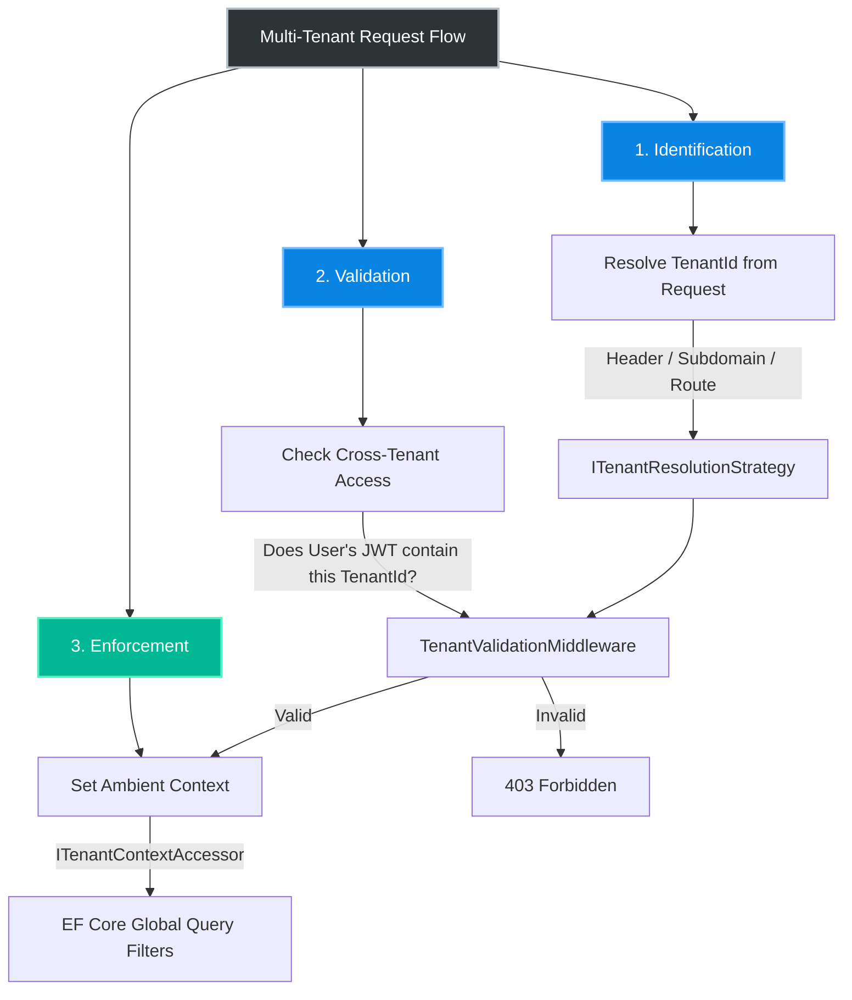

# 4.162 — Multi-Tenant Authorization Patterns

## PART 0 — Navigation & Context

```text
ASP.NET Core Domain Hierarchy
├── Database & EF Core
│   └── 4.103 EF Core Global Query Filters
├── Authorization
│   ├── 4.158 Resource-Based Authorization
│   ├── 4.161 Permission-Based Authorization
│   └── 4.162 Multi-Tenant Authorization Patterns ◄ YOU ARE HERE
└── Architecture
    └── 4.250 SaaS Application Patterns
```

**What you need before this:**
- [[4.160 — Authorization Filters vs Policy Handlers vs Middleware When Each]] — Knowing how to use Middleware for global validation.
- [[4.158 — Resource-Based Authorization Passing Domain Objects to Handlers]] — Knowing how to check data ownership.
- [[4.103 — EF Core Global Query Filters]] — Knowing how to automatically append `WHERE TenantId = X` to SQL queries.

**What this unlocks after:**
- Building highly scalable B2B SaaS applications (Software as a Service).
- Cross-tenant impersonation architectures for support teams.

**Why this matters to a production engineer at scale:**
If a user from Company A views the invoice data of Company B, your B2B SaaS company will be on the front page of HackerNews, you will lose your SOC2 compliance, and you will likely be fired. Multi-tenant authorization is the most critical security boundary in a SaaS application. It cannot be left to individual developers remembering to type `Where(x => x.TenantId == myId)` in every controller. It must be woven into the fabric of the HTTP pipeline, the dependency injection container, and the ORM.

---

## PART 1 — The Core Mental Model

> **The Fundamental Rule**
> **Multi-tenant authorization is a two-phased lock: Phase 1 (Middleware) establishes and validates the ambient "Current Tenant Context" from the HTTP request, and Phase 2 (ORM/Domain) strictly enforces that every read and write operation is inextricably bound to that established Context, making cross-tenant data access architecturally impossible.**

**The Plain-Language Analogy**
Imagine a giant storage facility with hundreds of storage units (Tenants).
When a customer arrives at the main gate, the security guard checks their ID and determines they own Unit 42. The guard gives them a special green wristband with "42" printed on it (the **Tenant Context resolved in Middleware**).
Inside the facility, there are no individual locks on the doors. Instead, the facility relies on robotic forklifts (the **ORM / Global Query Filters**) that are programmed to *only* operate in the zone matching the driver's wristband. Even if the driver intentionally tries to navigate to Unit 99, the forklift simply refuses to acknowledge Unit 99 exists. The security is ambient and unavoidable.

**The Taxonomy Diagram**



---

## PART 2 — Deep Mechanics

### 1. Tenant Resolution Strategies

Before you can authorize a tenant request, you must know which tenant the user is trying to access. There are three common mechanisms, evaluated in early middleware:

1. **Header-based:** Client sends `X-Tenant-Id: 123`. (Best for SPAs and Mobile APIs).
2. **Subdomain-based:** Client requests `tenant123.myapp.com`. (Best for traditional Web Apps).
3. **Route-based:** Client requests `/api/tenants/123/invoices`. (Clean REST, but verbose).

**The Architectural Constraint:** The resolution must happen *before* database access, so you cannot rely on looking up a record in the database to figure out the tenant.

### 2. The Identity Mismatch Problem

The fundamental security vulnerability in SaaS occurs when **Requested Tenant $\neq$ Authorized Tenant**.
A user authenticates successfully (Valid JWT). They belong to Tenant A. They craft a malicious request: `GET /api/invoices` with `X-Tenant-Id: Tenant_B`. 

If your authorization architecture relies purely on the standard `[Authorize]` attribute, the user passes (because they are authenticated). If your database relies on the `X-Tenant-Id` header to query data, the user successfully steals Tenant B's invoices!

### 3. The Validation Middleware

To solve the mismatch, the framework must intercept the request, compare the Requested Tenant against the User's Claims, and fail fast.

// Pipeline position: Immediately after Authentication.
```
──► UseRouting ──► UseAuthentication ──► UseTenantValidationMiddleware ──► UseAuthorization ──► [Controller]
```

**Framework Source Behavior:** This is a custom middleware you must write. It reads `HttpContext.User`, extracts the allowed tenant claims, reads the requested tenant from the `HttpContext.Request`, and compares them. If they mismatch, it immediately returns `403 Forbidden` and short-circuits.

### 4. Ambient Tenant Context

Once validated, the Tenant ID must be made available to the rest of the application (especially the domain layer and EF Core) without polluting every method signature. 

Just like `IHttpContextAccessor` provides ambient access to the HTTP request, we build an `ITenantContextAccessor` backed by an `AsyncLocal<T>`.

**Runtime Cost Label:** `AsyncLocal` incurs a tiny allocation penalty (~24 bytes, 15ns) but is vastly superior to passing `tenantId` through 15 layers of method calls.

---

## PART 3 — Production Code Patterns

### Pattern 1: The Ambient Context Abstraction
Defining the core services that hold the tenant state for the lifetime of the request.

```csharp
public interface ITenantContextAccessor
{
    string CurrentTenantId { get; set; }
}

// Scoped lifecycle (recommended over AsyncLocal for web apps)
public class TenantContextAccessor : ITenantContextAccessor
{
    public string CurrentTenantId { get; set; }
}

// Register in Program.cs
builder.Services.AddScoped<ITenantContextAccessor, TenantContextAccessor>();
```

### Pattern 2: The Resolution and Validation Middleware
This middleware resolves the requested tenant, validates it against the user's JWT, and sets the ambient context.

```csharp
public class TenantValidationMiddleware
{
    private readonly RequestDelegate _next;

    public TenantValidationMiddleware(RequestDelegate next) => _next = next;

    public async Task InvokeAsync(HttpContext context, ITenantContextAccessor tenantAccessor)
    {
        // 1. Skip validation for anonymous endpoints (like /login)
        var endpoint = context.GetEndpoint();
        if (endpoint?.Metadata.GetMetadata<IAllowAnonymous>() != null) {
            await _next(context);
            return;
        }

        // 2. Resolve requested tenant
        if (!context.Request.Headers.TryGetValue("X-Tenant-Id", out var requestedTenant))
        {
            context.Response.StatusCode = StatusCodes.Status400BadRequest;
            await context.Response.WriteAsync("X-Tenant-Id header is required.");
            return;
        }

        // 3. Validate against User Claims
        // JWT payload: { "tenants": ["tenant_A", "tenant_B"] }
        var userTenants = context.User.FindAll("tenant").Select(c => c.Value);
        
        // ✅ CORRECT: Strict cross-tenant access prevention
        if (!userTenants.Contains(requestedTenant.ToString()))
        {
            context.Response.StatusCode = StatusCodes.Status403Forbidden;
            await context.Response.WriteAsync("You do not have access to the requested tenant.");
            return;
        }

        // 4. Set Ambient Context
        tenantAccessor.CurrentTenantId = requestedTenant;

        await _next(context);
    }
}
```

// Pipeline setup in Program.cs:
```csharp
app.UseRouting();
app.UseAuthentication();
app.UseMiddleware<TenantValidationMiddleware>(); // MUST be after AuthN!
app.UseAuthorization();
app.MapControllers();
```

### Pattern 3: EF Core Global Query Filter Enforcement
The ultimate defense-in-depth. EF Core reads the ambient context and modifies every SQL query automatically.

```csharp
public class ApplicationDbContext : DbContext
{
    private readonly ITenantContextAccessor _tenantAccessor;

    // Inject the ambient context
    public ApplicationDbContext(
        DbContextOptions<ApplicationDbContext> options, 
        ITenantContextAccessor tenantAccessor) : base(options)
    {
        _tenantAccessor = tenantAccessor;
    }

    public DbSet<Invoice> Invoices { get; set; }

    protected override void OnModelCreating(ModelBuilder modelBuilder)
    {
        // ✅ CORRECT: Applies to EVERY LINQ query against Invoices
        modelBuilder.Entity<Invoice>().HasQueryFilter(
            i => i.TenantId == _tenantAccessor.CurrentTenantId);
            
        base.OnModelCreating(modelBuilder);
    }

    public override Task<int> SaveChangesAsync(CancellationToken cancellationToken = default)
    {
        // ✅ CORRECT: Force TenantId on all new records to prevent data contamination
        foreach (var entry in ChangeTracker.Entries<ITenantEntity>().Where(e => e.State == EntityState.Added))
        {
            entry.Entity.TenantId = _tenantAccessor.CurrentTenantId;
        }
        
        return base.SaveChangesAsync(cancellationToken);
    }
}
```

### Pattern 4: Cross-Tenant Impersonation (Super Admins)
Sometimes internal support staff need to view data across any tenant without having the specific tenant claim in their JWT.

```csharp
// Update the Middleware validation logic:
var isSuperAdmin = context.User.HasClaim("Role", "SystemAdmin");
var hasTenantClaim = userTenants.Contains(requestedTenant.ToString());

// ✅ CORRECT: Explicit bypass for impersonation
if (!hasTenantClaim && !isSuperAdmin)
{
    context.Response.StatusCode = StatusCodes.Status403Forbidden;
    return;
}

// If SuperAdmin, they bypass the claim check. The requestedTenant becomes their ambient context.
tenantAccessor.CurrentTenantId = requestedTenant;
```

### Pattern 5: Resource-Based Auth for Multi-Tenant Updates
Even with Global Query Filters, you might want to explicitly authorize mutations using `IAuthorizationService` to prevent complex IDOR (Insecure Direct Object Reference) attacks on related entities.

```csharp
public class TenantOwnershipHandler : AuthorizationHandler<OperationAuthorizationRequirement, ITenantEntity>
{
    private readonly ITenantContextAccessor _tenantAccessor;

    public TenantOwnershipHandler(ITenantContextAccessor tenantAccessor)
    {
        _tenantAccessor = tenantAccessor;
    }

    protected override Task HandleRequirementAsync(
        AuthorizationHandlerContext context, 
        OperationAuthorizationRequirement req, 
        ITenantEntity resource)
    {
        // ✅ CORRECT: Verifies the loaded entity belongs to the current ambient tenant
        if (resource.TenantId == _tenantAccessor.CurrentTenantId)
        {
            context.Succeed(req);
        }
        return Task.CompletedTask;
    }
}
```

---

## PART 4 — Gotchas & Anti-Patterns

### Gotcha 1: The Null Tenant Identity Leak
If a developer forgets to send the `X-Tenant-Id` header, and the validation middleware is configured loosely, the ambient context might be `null`.

// ⚠️ WRONG CODE
```csharp
// Middleware
var requestedTenant = context.Request.Headers["X-Tenant-Id"].FirstOrDefault();
// Fails to abort if requestedTenant is null!
tenantAccessor.CurrentTenantId = requestedTenant; 
```

// HTTP consequence (wrong path):
// EF Core evaluates the Query Filter: `WHERE TenantId = NULL`. Depending on your data, this might return 0 records, or worse, if `TenantId` is nullable, it might return system-wide global records to an unauthorized user!

// ✅ CORRECT CODE
```csharp
// Ensure the ambient context throws or blocks if accessed without being explicitly set.
// Make TenantId non-nullable in the database.
```

### Gotcha 2: Ignoring Global Query Filters (IgnoreQueryFilters)
EF Core allows you to bypass the filter using `.IgnoreQueryFilters()`. Developers use this to implement "Admin Dashboards."

// ⚠️ WRONG CODE
```csharp
[HttpGet("admin/all-invoices")]
public async Task<IActionResult> GetAllInvoices()
{
    // Developer disables tenant filter to get cross-tenant data
    var data = await _db.Invoices.IgnoreQueryFilters().ToListAsync();
    return Ok(data);
}
```

// HTTP consequence (wrong path):
// If the controller isn't rigorously secured with `[Authorize(Roles="SystemAdmin")]`, a standard tenant user can hit this endpoint and download the entire database.

// ✅ CORRECT CODE
```csharp
// Only use IgnoreQueryFilters inside internal background workers. 
// For APIs, SuperAdmins should still supply an X-Tenant-Id header to impersonate ONE tenant at a time, keeping the Global Query Filter active.
```

### Gotcha 3: Single-Tenant User Inference
A common "optimization" is assuming that because a user only belongs to one tenant, the API doesn't need them to send the `X-Tenant-Id` header; it can just read it from their token.

// ⚠️ WRONG CODE
```csharp
// Middleware infers tenant
var userTenant = context.User.FindFirstValue("tenant");
tenantAccessor.CurrentTenantId = userTenant;
```

// HTTP consequence (wrong path):
// This breaks immediately when the business model changes and users can belong to multiple tenants (e.g., a consultant managing 3 company accounts). The API has no way to know *which* of the 3 tenants the consultant is trying to act upon in this specific HTTP request.

// ✅ CORRECT CODE
```csharp
// ALWAYS require the client to explicitly request a specific tenant via Header or Route.
// The server then validates that explicit request against the allowed claims.
```

### Gotcha 4: Scoped Service Resolution in Background Tasks
When setting up `ITenantContextAccessor` as a Scoped service, background workers (which run in Singletons) cannot access it directly.

// ⚠️ WRONG CODE
```csharp
public class ReportWorker : BackgroundService {
    private readonly ITenantContextAccessor _tenant; // Throws captive dependency exception!
}
```

// HTTP consequence (wrong path):
// App crashes on startup.

// ✅ CORRECT CODE
```csharp
// Use IServiceScopeFactory in the worker, resolve the ITenantContextAccessor, and set the CurrentTenantId manually for the duration of the task.
```

### Gotcha 5: Caching Cross-Tenant Data
When using `IMemoryCache` or `IDistributedCache`, forgetting to include the Tenant ID in the cache key.

// ⚠️ WRONG CODE
```csharp
var settings = await _cache.GetOrCreateAsync("AppSettings", async entry => {
    return await _db.Settings.FirstOrDefaultAsync(); // Filtered by current tenant
});
```

// HTTP consequence (wrong path):
// Tenant A requests settings. EF Core filters and returns Tenant A's settings. It is cached under the key "AppSettings". Tenant B requests settings. The cache returns Tenant A's settings. Massive data leak.

// ✅ CORRECT CODE
```csharp
// ALWAYS include the ambient tenant ID in the cache key.
var settings = await _cache.GetOrCreateAsync($"AppSettings_{_tenantAccessor.CurrentTenantId}", ...);
```

---

## PART 5 — Performance Implications

### Request Pipeline Characteristics

| Scenario | Pipeline Depth | Allocations Per Request | Approx Latency Impact | Recommendation |
|---|---|---|---|---|
| Tenant Middleware Check | Early | ~2 | < 0.05ms | Mandatory for SaaS. Fails fast. |
| Global Query Filters | Deep | ~0 | 0ms | Handled efficiently by EF Core SQL translation. |
| DB SaveChanges Intercept | Deep | Low (ChangeTracker) | < 0.5ms | Necessary for data integrity. |

### BenchmarkDotNet Code

```csharp
using BenchmarkDotNet.Attributes;
using Microsoft.EntityFrameworkCore;
using System.Linq;

[MemoryDiagnoser]
public class MultiTenantBenchmark
{
    private ApplicationDbContext _db;
    private ITenantContextAccessor _accessor;

    [GlobalSetup]
    public void Setup()
    {
        var options = new DbContextOptionsBuilder<ApplicationDbContext>()
            .UseInMemoryDatabase("TenantTest")
            .Options;
            
        _accessor = new TenantContextAccessor { CurrentTenantId = "T1" };
        _db = new ApplicationDbContext(options, _accessor);
        
        _db.Invoices.Add(new Invoice { Id = 1, TenantId = "T1" });
        _db.Invoices.Add(new Invoice { Id = 2, TenantId = "T2" });
        _db.SaveChanges();
    }

    [Benchmark(Baseline = true)]
    public int ExplicitWhereClause()
    {
        return _db.Invoices.IgnoreQueryFilters().Where(i => i.TenantId == "T1").Count();
    }

    [Benchmark]
    public int GlobalQueryFilter()
    {
        return _db.Invoices.Count(); // Automatically appends WHERE TenantId = T1
    }
}

// Expected output (approximate, .NET 8, x64, local):
// Method              | Mean      | Error     | StdDev    | Gen0   | Allocated |
// ------------------- |----------:|----------:|----------:|-------:|----------:|
// ExplicitWhereClause | 2.12 us   | 0.04 us   | 0.04 us   | 0.2312 |     976 B |
// GlobalQueryFilter   | 2.15 us   | 0.05 us   | 0.05 us   | 0.2312 |     976 B |
```

**When to Care:** Never. Global Query Filters are translated to SQL `WHERE` clauses at compile time by EF Core's query generator. There is zero runtime evaluation penalty compared to typing `.Where(...)` manually.
**When this saves you:** It prevents developers from accidentally doing `_db.Invoices.ToList()` and leaking the entire multi-tenant table into memory.

---

## PART 6 — Interview Arsenal

### A. The Question Bank

**Question 1:** "You are building a multi-tenant API. A user's JWT contains a list of 5 tenant IDs they belong to. How do you ensure that when they request data for Tenant A, they don't accidentally receive data for Tenant B?"
- **Average Answer:** "I check their JWT in the controller and then add a `.Where(t => t.TenantId == A)` to my database queries."
- **Why That's Insufficient:** It relies on developer discipline (which always fails eventually) and doesn't explain how the API knows the user is requesting Tenant A.
- **Great Answer:** "We must build an ambient tenant context architecture. First, the client must explicitly specify the requested tenant in an HTTP header (e.g., `X-Tenant-Id`). Second, a custom Middleware runs immediately after authentication. It compares the requested header against the claims in the JWT. If it doesn't match, it returns a 403. If it matches, it sets an `ITenantContextAccessor` (a Scoped service). Finally, the `ApplicationDbContext` reads this accessor and applies a Global Query Filter to all entities. This guarantees that all SQL queries are strictly isolated to the requested tenant, completely eliminating cross-tenant data leaks."

**Question 2:** "If a system administrator needs to view all invoices across all tenants to generate a global report, how do you bypass the tenant security securely?"
- **Average Answer:** "I use `IgnoreQueryFilters()` in EF Core when the user is an Admin."
- **Why That's Insufficient:** Disabling query filters on web endpoints is highly dangerous and can lead to massive accidental data exposure.
- **Great Answer:** "Instead of breaking the multi-tenant architecture with `IgnoreQueryFilters`, I prefer 'Impersonation.' The administrator selects a specific tenant from a dropdown in their UI. The UI sends the `X-Tenant-Id` header. The Middleware detects the user has the 'SuperAdmin' role and bypasses the cross-tenant claim check, explicitly setting the ambient context to the requested tenant. The administrator acts within the boundaries of that single tenant safely. For global aggregations across *all* tenants, this should not be done via standard API endpoints; it should be offloaded to a Data Warehouse or a secure background worker where `IgnoreQueryFilters` can be used safely outside the HTTP context."

**Question 3:** "Why should `ITenantContextAccessor` be registered as a `Scoped` service instead of a `Singleton` using `AsyncLocal`?"
- **Average Answer:** "Because scoped is for web requests."
- **Why That's Insufficient:** Doesn't explain the dangers of `AsyncLocal` state leakage.
- **Great Answer:** "In a web application, ASP.NET Core creates a DI Scope per HTTP request. Registering the accessor as Scoped guarantees that the tenant context is bound perfectly to the lifetime of the request, and will be cleanly garbage collected when the request ends. If you use a Singleton backed by `AsyncLocal<string>`, you risk thread-pool state leakage. If a developer forgets to clear the `AsyncLocal` at the end of a request, and that thread is reused by Kestrel for a different request, the new request might accidentally inherit the previous request's Tenant ID."

### B. The Trick Questions

**Trick Question:** "If I put `[Authorize(Roles = "TenantUser")]` on my controller, does it prevent cross-tenant access?"
- **The Trap:** Believing standard Roles have any concept of data segregation.
- **The Correct Answer:** "No, absolutely not. The `[Authorize]` attribute only verifies the user is authenticated and possesses a specific string claim. It has zero knowledge of the `X-Tenant-Id` header or the data in the database. A user could have the 'TenantUser' role for Company A, request Company B's data, and pass the authorization attribute perfectly. You must implement custom validation middleware or Resource-Based authorization to achieve data segregation."

**Trick Question:** "If EF Core Global Query filters secure my reads, do they also secure my writes (Updates/Deletes)?"
- **The Trap:** Misunderstanding how EF Core change tracking works.
- **The Correct Answer:** "Indirectly, yes for Updates/Deletes, because you must query the record before updating it. If the query filter blocks you from finding Tenant B's record, you can't update it. However, it does NOT secure Inserts (Adds). A user could manually post a JSON payload with `\"tenantId\": \"Tenant_B\"`, and EF Core will insert it. You must intercept `SaveChangesAsync` and forcefully overwrite the `TenantId` property on all `Added` entities with the ambient `ITenantContextAccessor` value to prevent cross-tenant writes."

### C. Red Flags to Avoid
- 🚩 **"I just pass the `tenantId` as a parameter to all my repositories and services."** (Creates massive parameter pollution, developers will inevitably hardcode or pass the wrong variable).
- 🚩 **"My API assumes the user is only in one tenant, so I read the Tenant ID directly from the JWT in the controller."** (Fails the moment a B2B customer requests multi-org access for their consultants. Always separate Identity from Intended Action).

---

## PART 7 — Decision Framework

```mermaid
graph TD
    A[Multi-Tenant Resolution] --> B{How does client specify context?}
    
    B -->|Path: /api/t1/users| C[Route-Based]
    B -->|Header: X-Tenant-Id| D[Header-Based]
    B -->|Host: t1.app.com| E[Subdomain-Based]
    
    C --> F[Resolve in Middleware]
    D --> F
    E --> F
    
    F --> G{Does JWT authorize this tenant?}
    G -->|No| H[Return 403 Forbidden]
    G -->|Yes| I[Set Ambient Scoped Context]
    
    I --> J[EF Core Global Query Filters read Context]
    
    style A fill:#2d3436,stroke:#fff
    style G fill:#0984e3,stroke:#fff
    style I fill:#00b894,stroke:#fff
    style J fill:#00b894,stroke:#fff
    style H fill:#d63031,stroke:#fff
```



---

## PART 8 — Self-Check

### A. Conceptual Questions
1. What is the fundamental security vulnerability when Requested Tenant $\neq$ Authorized Tenant?
2. Why must Tenant Validation occur in a global Middleware rather than an MVC Action Filter?
3. How do you prevent cross-tenant Inserts in EF Core?
4. What happens if `ITenantContextAccessor` is null when EF Core executes a query?
5. Why should SuperAdmins impersonate specific tenants rather than disabling query filters?
6. How does caching interact dangerously with ambient tenant contexts?
7. What is the danger of relying on `AsyncLocal` for tenant state in a Kestrel web app?
8. Why can't you resolve the tenant by querying the database for a unique username?

### B. Code Puzzles

**Puzzle 1: The Missing Write Protection**
```csharp
[HttpPost]
public async Task<IActionResult> CreateInvoice(InvoiceDto dto) {
    var invoice = new Invoice { 
        Amount = dto.Amount, 
        TenantId = dto.TargetTenantId // Attacker controls this!
    };
    _db.Invoices.Add(invoice);
    await _db.SaveChangesAsync();
    return Ok();
}
```
*Scenario:* An attacker in Tenant A sends `TargetTenantId = "B"`.
<details>
<summary>Answer</summary>
The invoice is created in Tenant B's account. Global query filters do not prevent Inserts.
*Fix:* Remove `TargetTenantId` from the DTO. In `ApplicationDbContext.SaveChangesAsync()`, forcefully override the `TenantId` of all Added entities using the ambient context.
</details>

**Puzzle 2: The Endpoint Bypass**
```csharp
app.UseRouting();
app.UseTenantValidation();
app.UseAuthentication();
```
*Scenario:* Middleware order bug.
<details>
<summary>Answer</summary>
`UseTenantValidation` runs before `UseAuthentication`. The `HttpContext.User` is completely empty. The validation logic cannot read the user's allowed tenants from their JWT, so it fails every request with a 403.
*Fix:* Swap the order. AuthN must precede Tenant Validation.
</details>

**Puzzle 3: The Cache Leak**
```csharp
[HttpGet("config")]
public async Task<IActionResult> GetConfig() {
    var config = await _cache.GetOrCreateAsync("GlobalConfig", async entry => {
        return await _db.TenantConfigs.FirstOrDefaultAsync();
    });
    return Ok(config);
}
```
*Scenario:* Tenant A calls `/config`, then Tenant B calls `/config`.
<details>
<summary>Answer</summary>
Tenant B receives Tenant A's configuration. The cache key `"GlobalConfig"` is static, but the data generated by the EF Core query is tenant-specific due to global query filters. 
*Fix:* Change the cache key to `$"GlobalConfig_{_tenantAccessor.CurrentTenantId}"`.
</details>

**Puzzle 4: The Impersonation Trap**
```csharp
// Inside Middleware
if (user.IsInRole("Admin")) {
    tenantAccessor.CurrentTenantId = "ALL";
}
```
*Scenario:* Admin hits an endpoint that does `_db.Invoices.ToList()`.
<details>
<summary>Answer</summary>
EF Core runs `WHERE TenantId = 'ALL'`. It returns zero records (unless a tenant literally has the ID 'ALL'). Setting the tenant ID to a magic string does not bypass the query filter.
*Fix:* To bypass query filters, the query must explicitly use `.IgnoreQueryFilters()`. Magic strings don't disable SQL generation.
</details>

---

## PART 9 — Connections & Resources

### A. Related Topics Table

| Topic | Why It Connects |
|---|---|
| [[4.103 — EF Core Global Query Filters]] | The mechanism that translates the ambient context into SQL security. |
| [[4.050 — Writing Middleware]] | How to build the interceptor that validates the headers. |
| [[4.158 — Resource-Based Authorization]] | Complementary pattern for fine-grained mutation checks. |

### B. Books

| Book | Chapters | Why These Chapters |
|---|---|---|
| Architecting Cloud Native .NET Apps | Chapter 8: Multi-Tenancy | Covers tenant resolution and isolation strategies. |
| Entity Framework Core in Action | Chapter 10: Query Filters | Deep dive into configuring isolated EF contexts. |

### C. Essential Articles & Docs
- [Microsoft Docs: Global query filters](https://learn.microsoft.com/en-us/ef/core/querying/filters)
- [Gunnar Peipman: Building Multi-Tenant ASP.NET Core Applications](https://gunnarpeipman.com/aspnet-core-multi-tenant-architecture/)
- [Ben Foster: Multi-tenant ASP.NET Core](https://benfoster.io/blog/asp-net-core-multi-tenancy-deep-dive/)

> [!NOTE]
> **Template Meta-Note**
> Part 0: Context & Prerequisites. Part 1: Core Mental Model. Part 2: Deep Mechanics & Pipeline. Part 3: Production Code. Part 4: Gotchas. Part 5: Performance. Part 6: Interview Arsenal. Part 7: Decision Framework. Part 8: Puzzles. Part 9: Resources.
