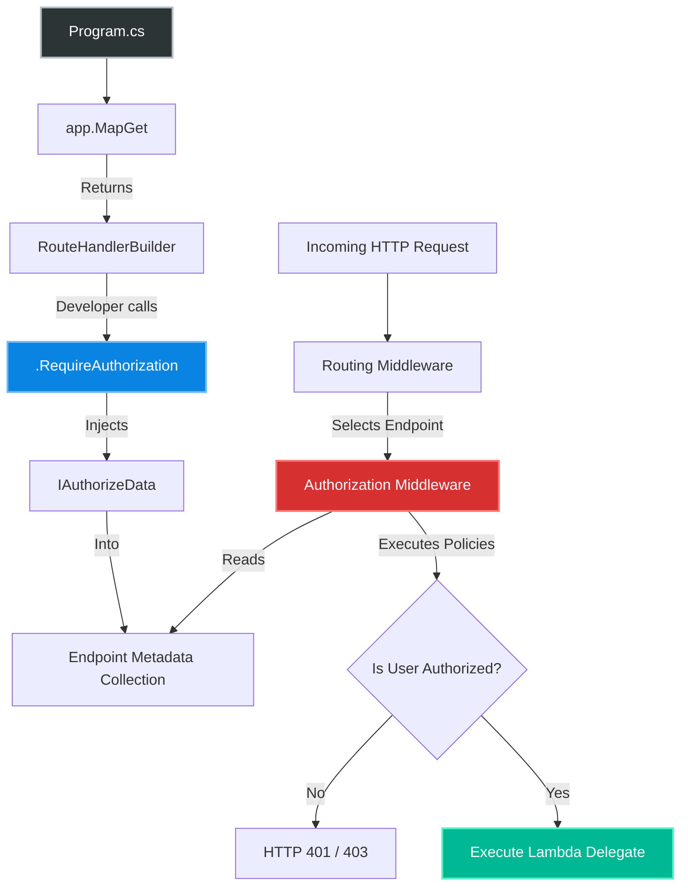

# 4.163 — Authorization in Minimal APIs: RequireAuthorization and Metadata

## PART 0 — Navigation & Context

```text
ASP.NET Core Domain Hierarchy
├── Routing & Endpoints
│   ├── 4.078 Minimal APIs Architecture
│   └── 4.079 Defining Endpoints (MapGet, MapPost)
├── Security & Identity
│   ├── 4.154 Authorization Architecture
│   ├── 4.163 Authorization in Minimal APIs ◄ YOU ARE HERE
│   └── 4.165 [AllowAnonymous]
```

**What you need before this:**
- Understanding of the global ASP.NET Core Authorization Middleware pipeline [[4.154 — Authorization Architecture: Middleware, Policy Evaluation, and Requirements]].
- Familiarity with defining standard Minimal API endpoints [[4.079 — Defining Endpoints: MapGet, MapPost, and Route Handlers]].
- Knowledge of standard MVC authorization using the `[Authorize]` attribute to understand what Minimal APIs are replacing.

**What this unlocks after:**
- Building robust, secure-by-default microservices using `MapGroup` hierarchies.
- Safely migrating legacy MVC Controllers with deep attribute routing to high-performance Minimal APIs.
- Setting up Zero-Trust network configurations using the `FallbackPolicy`.

**Why this matters to a production engineer at scale:**
In the legacy MVC era, securing an endpoint was done strictly via Attributes (`[Authorize]`). The ASP.NET Core framework would use Reflection at runtime to inspect the Controller class, read the attributes, and feed them to the Authorization Middleware.
Minimal APIs represent a paradigm shift. They are not classes. They are raw lambda functions mapped to URLs. You cannot put an `[Authorize]` attribute on a lambda expression elegantly, and even if you could, using Reflection to read it violates the high-performance, Native AOT-friendly architecture of Minimal APIs.
Instead, Minimal APIs use a **Fluent API** (extension methods) to push security rules directly into the Endpoint's **Metadata**. If you forget to chain `.RequireAuthorization()` onto a Minimal API, that endpoint is silently open to the public internet by default. Conversely, understanding how to apply these rules to a `RouteGroupBuilder` allows you to secure hundreds of endpoints with a single line of code, creating API surfaces that are massively more readable and secure-by-default than legacy MVC controllers.

---

## PART 1 — The Core Mental Model

> **The Fundamental Rule**
> **Minimal APIs secure endpoints by attaching `IAuthorizeData` to the Endpoint's Metadata collection via the `.RequireAuthorization()` extension method. The `AuthorizationMiddleware` reads this exact same metadata. Therefore, the underlying security engine is exactly the same as MVC, but the delivery mechanism (Fluent API vs Attributes) is entirely different.**

**The Plain-Language Analogy**
Imagine a VIP Nightclub (The API).
**MVC (The Old Way):** Every guest (Endpoint) wears a physical name tag with a sticker that says "VIP" (The `[Authorize]` Attribute). The bouncer looks at the physical sticker on their shirt.
**Minimal APIs (The New Way):** Guests don't wear name tags. Instead, when the club is organized, the manager types a list into a computer: "Table 4 is VIP only." (The `.RequireAuthorization()` method). When a guest tries to sit at Table 4, the bouncer checks the computer (Endpoint Metadata). 
Furthermore, Minimal APIs allow the manager to say "The entire 2nd Floor is VIP only" (`MapGroup.RequireAuthorization`). Now, the bouncer automatically checks the computer for any guest trying to access any table on the 2nd floor, without needing to label every single table individually.

**The Taxonomy Diagram**



---

## PART 2 — Deep Mechanics

### 2.1 — The Endpoint Metadata Collection
Every mapped route in ASP.NET Core results in an `Endpoint` object. This object contains a `Metadata` property, which is simply an `IList<object>`. 
When you call `.RequireAuthorization()`, the framework creates an instance of `AuthorizeAttribute` (yes, the exact same class used in MVC!) and adds it to that `IList<object>`. 
Because the `AuthorizationMiddleware` just asks the `Endpoint` for its `Metadata`, it doesn't care if the metadata was extracted via Reflection (MVC) or pushed via a Fluent API (Minimal APIs). The pipeline execution is identical.

### 2.2 — RouteGroupBuilder (Inheritance)
The true power of Minimal APIs lies in `MapGroup`. When you create a group and call `.RequireAuthorization()`, that group becomes a `RouteGroupBuilder`. Any endpoint mapped *inside* that group automatically inherits all metadata from the parent group.
If the Parent Group requires the "Admin" policy, and the Child Endpoint requires the "Billing" policy, the metadata collection contains BOTH policies. The `AuthorizationMiddleware` will evaluate both, effectively applying an **AND** operation. The user must satisfy both policies to gain access.

### 2.3 — The Fallback Policy
By default, if an endpoint has zero authorization metadata, ASP.NET Core assumes it is public. 
In enterprise environments, this "secure by omission" approach is dangerous. If a developer forgets `.RequireAuthorization()`, data leaks.
You can configure a global `FallbackPolicy` in `Program.cs`. When set, the `AuthorizationMiddleware` applies this policy to *every single endpoint* that does not have explicit authorization metadata. If you set the fallback to require an authenticated user, the entire application becomes completely locked down by default, and you must explicitly opt-out public endpoints using `.AllowAnonymous()`.

### 2.4 — Authentication Schemes
Just like MVC, you can specify exactly which Authentication Scheme an endpoint should accept. This is critical for APIs that serve both Mobile Apps (JWT) and Web Browsers (Cookies).

```csharp
app.MapGet("/api/secure", () => "Secret")
   .RequireAuthorization(new AuthorizeAttribute { 
       AuthenticationSchemes = "Bearer" 
   });
```

---

## PART 3 — Production Code Patterns

### Pattern 1: Basic Endpoint Protection
Securing single endpoints using default policies, named policies, and role requirements.

```csharp
var app = builder.Build();

// 1. Default Authorization (Must be authenticated, any scheme)
app.MapGet("/api/profile", () => "User Profile")
   .RequireAuthorization();

// 2. Named Policy (Must satisfy the "AdminOnly" policy defined in AddAuthorization)
app.MapDelete("/api/users/{id}", (int id) => $"Deleted {id}")
   .RequireAuthorization("AdminOnly");

// 3. Inline Policy Builder (Defining the policy directly on the route)
app.MapPost("/api/reports", () => "Report Generated")
   .RequireAuthorization(policy => policy.RequireRole("Manager", "Director"));

app.Run();
```

### Pattern 2: The Secure-By-Default Group (Industry Standard)
Instead of chaining `.RequireAuthorization()` to 50 individual endpoints, create a secured group and map your endpoints to it.

```csharp
// Define the group and secure it
var ordersApi = app.MapGroup("/api/orders")
                   .RequireAuthorization("RequireActiveSubscription");

// ALL endpoints in this group inherit the "RequireActiveSubscription" policy
ordersApi.MapGet("/", () => "List Orders");
ordersApi.MapGet("/{id}", (int id) => $"Get Order {id}");
ordersApi.MapPost("/", (OrderDto dto) => "Order Created");

// This endpoint requires "RequireActiveSubscription" AND "RefundPermissions"
ordersApi.MapPost("/{id}/refund", (int id) => "Refunded")
         .RequireAuthorization("RefundPermissions");
```

### Pattern 3: The Zero-Trust Fallback Policy
Configuring the application so that every single route requires authentication by default, forcing developers to explicitly opt-in to public routes.

```csharp
var builder = WebApplication.CreateBuilder(args);

// 1. Configure the Fallback Policy
builder.Services.AddAuthorization(options =>
{
    // If an endpoint has no metadata, fallback to this:
    options.FallbackPolicy = new AuthorizationPolicyBuilder()
        .RequireAuthenticatedUser()
        .Build();
});

var app = builder.Build();

// ❌ Needs Token: Will return 401 Unauthorized
app.MapGet("/api/data", () => "Sensitive Data"); 

// ✅ Public: Explicitly opted out of the Fallback Policy
app.MapGet("/health", () => "Healthy")
   .AllowAnonymous(); 

// ✅ Public: Webhook endpoints must be public so Stripe/GitHub can hit them
app.MapPost("/webhooks/stripe", () => "Webhook Received")
   .AllowAnonymous();
```

### Pattern 4: Resource-Based Authorization inside the Delegate
Sometimes you cannot authorize a user based on the route alone. You need to read a record from the database to see if the user *owns* the record. You cannot do this with `.RequireAuthorization()`. You must do it imperatively inside the lambda.

```csharp
app.MapPut("/api/documents/{id}", async (
    int id, 
    DocumentUpdateDto dto, 
    HttpContext context,
    IAuthorizationService authService,
    AppDbContext db) =>
{
    var document = await db.Documents.FindAsync(id);
    if (document == null) return Results.NotFound();

    // Imperative check: Pass the actual data object to the Authorization Service
    var authResult = await authService.AuthorizeAsync(context.User, document, "DocumentOwnerPolicy");
    
    if (!authResult.Succeeded)
    {
        return Results.Forbid();
    }

    document.Content = dto.Content;
    await db.SaveChangesAsync();
    return Results.Ok(document);
})
.RequireAuthorization(); // Ensure they are logged in first!
```

---

## PART 4 — Gotchas & Anti-Patterns

### Gotcha 1: Mixing MVC Filters with Minimal APIs
Developers migrating from MVC often try to use custom `IAsyncAuthorizationFilter` implementations on Minimal APIs.

// ⚠️ WRONG CODE
```csharp
// ❌ FAILS SILENTLY: MVC Filters do not execute in the Minimal API pipeline!
app.MapGet("/api/secure", () => "Secret")
   .AddEndpointFilter<MyOldMvcAuthFilter>(); 
```

// THE GOTCHA:
// The MVC Filter pipeline is fundamentally incompatible with Endpoint Routing. If you attach an MVC filter to a Minimal API, ASP.NET Core will either throw a startup exception or completely ignore it, leaving the endpoint unprotected.
// **Rule:** You must rewrite legacy `IAsyncAuthorizationFilter` logic as standard `IAuthorizationRequirement` / `AuthorizationHandler` policies and apply them using `.RequireAuthorization()`.

### Gotcha 2: Webhooks with FallbackPolicy Enabled
As shown in Pattern 3, enabling the `FallbackPolicy` secures the entire application.

// ⚠️ WRONG CODE
```csharp
// Developer adds a Stripe webhook integration
app.MapPost("/webhooks/stripe", async (HttpRequest req) => {
    var signature = req.Headers["Stripe-Signature"];
    // ... verify signature ...
});
```

// HTTP consequence (wrong path):
// Stripe sends a POST request to your webhook. Because Stripe is not an authenticated user with a Bearer Token, and the `FallbackPolicy` is enabled, the ASP.NET Core `AuthorizationMiddleware` immediately rejects the request with HTTP 401 Unauthorized before your lambda even executes. Stripe thinks your server is broken.
// **Rule:** Webhooks verify payloads via cryptographic signatures, not JWTs. You MUST append `.AllowAnonymous()` to all webhook endpoints if a `FallbackPolicy` is active.

### Gotcha 3: The Order of Middleware vs MapGroup
In `Program.cs`, the order of `UseAuthentication` and `UseAuthorization` is strictly enforced relative to where you map your endpoints.

// ⚠️ WRONG CODE
```csharp
app.MapGet("/api/data", () => "Data").RequireAuthorization();

app.UseAuthentication();
app.UseAuthorization();
```

// THE GOTCHA:
// In .NET 6/7, putting the routing mapping *before* the middleware registration could cause pipeline anomalies. In .NET 8, the framework is smarter, but best practice dictates that all `Use*` middleware should be registered before any `Map*` endpoint definitions to guarantee the pipeline is constructed sequentially.

### Gotcha 4: Chaining Multiple `RequireAuthorization`
If you chain the method multiple times, it does not overwrite the previous policy; it *appends* to it.

```csharp
app.MapGet("/api/reports", () => "Reports")
   .RequireAuthorization("HasPremiumLicense")
   .RequireAuthorization("IsAdmin");
```
// HTTP consequence:
// The user MUST satisfy BOTH policies. If you intended for the user to be either a Premium user OR an Admin, you cannot achieve this by chaining `.RequireAuthorization()`. You must create a single compound policy in `AddAuthorization` and reference that single policy name.

---

## PART 5 — Performance Implications

### Request Pipeline Characteristics

| Execution Type | Latency | Explanation |
|---|---|---|
| Metadata Push | Zero | `.RequireAuthorization()` executes exactly once at Application Startup to build the metadata tree. |
| AuthorizationMiddleware | ~0.1ms | Evaluates the metadata during the HTTP request. Extremely fast. |
| Imperative Auth (`AuthorizeAsync`) | High | If you query a database inside the lambda to evaluate ownership (Pattern 4), you incur network I/O latency. |

### The Startup Tax
Mapping 10,000 individual Minimal API endpoints with `.RequireAuthorization()` chained to every single one will consume slightly more memory and CPU during application startup than using `MapGroup` or MVC controllers.
**Optimization:** Always use `MapGroup` to apply metadata hierarchically. The routing engine builds a highly optimized Trie (prefix tree) and shares metadata references across children, drastically reducing memory allocations at startup.

---

## PART 6 — Interview Arsenal

### A. The Question Bank

**Question 1:** "In traditional MVC, we use the `[Authorize]` attribute to secure a controller. How do we secure a Minimal API endpoint, and how does the underlying pipeline differ?"
- **Average Answer:** "You use `.RequireAuthorization()` instead of the attribute. The pipeline is the same."
- **Why That's Insufficient:** Doesn't explain the metadata collection, which is the core concept of Endpoint Routing.
- **Great Answer:** "Instead of using attributes, Minimal APIs use a Fluent API extension method called `.RequireAuthorization()`. Under the hood, this method instantiates an `IAuthorizeData` object (like an `AuthorizeAttribute`) and pushes it into the Endpoint's Metadata collection at application startup. The underlying pipeline does not differ at all. When an HTTP request arrives, the `AuthorizationMiddleware` simply asks the Endpoint for its metadata collection. It doesn't care whether MVC Reflection populated the metadata or a Minimal API Fluent extension populated it. If the policies in the metadata fail, it returns a 401 or 403 before the route delegate executes."

**Question 2:** "What is the `FallbackPolicy` in ASP.NET Core, and what critical mistake do developers make when implementing third-party webhooks while it is enabled?"
- **Average Answer:** "The fallback policy locks down the app. Developers forget to unlock webhooks."
- **Why That's Insufficient:** Needs to explicitly name the solution and the HTTP consequence.
- **Great Answer:** "The `FallbackPolicy` is a zero-trust configuration that applies an authorization policy (usually requiring authentication) to every single endpoint that lacks explicit authorization metadata. If a developer integrates a third-party webhook (like Stripe or GitHub), the third party will send anonymous POST requests relying on payload signatures for security, not Bearer tokens. Because of the `FallbackPolicy`, the ASP.NET Core Authorization Middleware will reject the webhook with an HTTP 401 Unauthorized before the signature verification code even runs. To fix this, developers MUST explicitly chain `.AllowAnonymous()` to the webhook's Minimal API endpoint to bypass the fallback."

**Question 3:** "If I create a `MapGroup` requiring the 'Manager' role, and inside that group I map an endpoint requiring the 'Analyst' role, what roles must the user have to access the child endpoint?"
- **Average Answer:** "Just Analyst, because it overrides the parent."
- **Why That's Insufficient:** Incorrect assumption of inheritance mechanics.
- **Great Answer:** "The user must have BOTH the 'Manager' and 'Analyst' roles. In Endpoint Routing, child endpoints inherit all metadata from their parent groups. The `AuthorizationMiddleware` combines all `IAuthorizeData` attributes found in the endpoint's metadata hierarchy. It applies a logical AND operation. If the user lacks either role, the middleware will return an HTTP 403 Forbidden."

### B. The Trick Questions

**Trick Question:** "I added an `IAsyncAuthorizationFilter` to my ASP.NET Core application to check a custom HTTP header. It works perfectly on my MVC Controllers. I added it to my Minimal API using `AddEndpointFilter`, but it's not blocking unauthorized users. Why?"
- **The Trap:** Conflating MVC Filters with Minimal API Endpoint Filters.
- **The Correct Answer:** "MVC Filters (`IAsyncAuthorizationFilter`) are specific to the MVC pipeline and absolutely do not execute on Minimal APIs. While Minimal APIs have their own `AddEndpointFilter` construct, those filters run *after* the global `AuthorizationMiddleware`. If you want authorization logic to run correctly and uniformly across both Minimal APIs and MVC, you must abandon filters entirely and implement an `IAuthorizationRequirement` with an `AuthorizationHandler`, which the global middleware evaluates via policies."

### C. Red Flags to Avoid
- 🚩 **"I just put an `if(User.Identity.IsAuthenticated)` at the top of every Minimal API lambda."** (This is imperative, procedural security. It is unreadable, prone to being forgotten, breaks OpenAPI documentation generation, and bypasses the entire policy pipeline. Always use `.RequireAuthorization()`).

---

## PART 7 — Decision Framework

```mermaid
graph TD
    A[New Minimal API Endpoint] --> B{Does it require security?}
    
    B -->|No, it's public| C{Is FallbackPolicy enabled in Program.cs?}
    C -->|Yes| D[Append .AllowAnonymous]
    C -->|No| E[Map endpoint normally]
    
    B -->|Yes| F{Can the security rule be evaluated globally?}
    
    F -->|Yes e.g. Has Role, Has Claim| G{Are there multiple endpoints with the same rule?}
    G -->|Yes| H[Create a MapGroup, call RequireAuthorization on the group]
    G -->|No| I[Call RequireAuthorization directly on the endpoint]
    
    F -->|No, it depends on resource ownership| J[Call RequireAuthorization to enforce login]
    J --> K[Inside the lambda, call IAuthorizationService.AuthorizeAsync]
    
    style A fill:#2d3436,stroke:#fff
    style D fill:#00b894,stroke:#fff
    style E fill:#00b894,stroke:#fff
    style H fill:#0984e3,stroke:#fff
    style I fill:#0984e3,stroke:#fff
    style K fill:#d63031,stroke:#fff
```



---

## PART 8 — Self-Check

### A. Conceptual Questions
1. What object does `.RequireAuthorization()` push into the Endpoint Metadata collection?
2. How does the `AuthorizationMiddleware` treat metadata generated by Minimal APIs versus metadata generated by MVC Reflection?
3. What happens if a user hits an endpoint that belongs to a secured `MapGroup` but the user lacks the required policy?
4. How do you bypass a global `FallbackPolicy` for a specific route?
5. Why should webhook endpoints use `.AllowAnonymous()` instead of attempting to parse headers in a custom authorization policy?
6. If you chain `.RequireAuthorization("A").RequireAuthorization("B")`, does the user need Policy A, Policy B, or both?
7. How do you specify an authentication scheme (like JWT vs Cookie) via the Fluent API?
8. Why is it an anti-pattern to use an MVC `IAsyncAuthorizationFilter` on a Minimal API?

### B. Code Puzzles

**Puzzle 1: The Anonymous Contradiction**
```csharp
var group = app.MapGroup("/api").RequireAuthorization("AdminOnly");

group.MapGet("/public", () => "Hello").AllowAnonymous();
group.MapGet("/private", () => "Secret").RequireAuthorization("SuperAdmin");
```
*Scenario:* A user with NO token (Anonymous) requests `/api/public`. A user with the "SuperAdmin" token (but NOT the "AdminOnly" token) requests `/api/private`. What are the HTTP responses?
<details>
<summary>Answer</summary>
- `/api/public`: **HTTP 200 OK**. `.AllowAnonymous()` strictly bypasses ALL authorization metadata, including metadata inherited from the parent group.
- `/api/private`: **HTTP 403 Forbidden**. The user satisfies "SuperAdmin", but the endpoint inherited "AdminOnly" from the group. They must satisfy BOTH.
</details>

**Puzzle 2: The Missing Method**
```csharp
// Program.cs
app.MapGet("/secure", () => "Classified Data");
```
*Scenario:* The developer forgot `.RequireAuthorization()`. The `FallbackPolicy` is NOT configured. A malicious attacker sends a GET request. What happens?
<details>
<summary>Answer</summary>
The endpoint returns **HTTP 200 OK** and the classified data is leaked. Without explicit metadata or a fallback policy, ASP.NET Core endpoints are entirely public. This is the primary reason enterprise applications configure the `FallbackPolicy`.
</details>

**Puzzle 3: The Delegate Dilemma**
```csharp
app.MapDelete("/api/users/{id}", (int id, ClaimsPrincipal user) => {
    if (!user.IsInRole("Admin")) {
        return Results.Unauthorized();
    }
    return Results.Ok("Deleted");
});
```
*Scenario:* This works, but what are two architectural problems with doing authorization inside the delegate like this?
<details>
<summary>Answer</summary>
1. **Wrong HTTP Status:** Returning `Results.Unauthorized()` generates an HTTP 401. However, if the user is logged in but lacks a role, the correct status is HTTP 403 Forbidden. `AuthorizationMiddleware` handles this distinction automatically.
2. **OpenAPI Generation:** Swagger/OpenAPI generators inspect Endpoint Metadata to draw the "Padlock" icon on the UI. Because the security rule is hidden inside the imperative C# code, Swagger assumes the endpoint is public, confusing frontend developers.
*Fix:* Use `.RequireAuthorization(p => p.RequireRole("Admin"))`.
</details>

---

## PART 9 — Connections & Resources

### A. Related Topics Table

| Topic | Why It Connects |
|---|---|
| [[4.079 — Defining Endpoints: MapGet, MapPost, and Route Handlers]] | Understanding how `RouteGroupBuilder` works is required to apply authorization cleanly. |
| [[4.154 — Authorization Architecture: Middleware, Policy Evaluation, and Requirements]] | The middleware that actually executes the metadata injected by Minimal APIs. |
| [[4.165 — [AllowAnonymous]: Bypassing Global Authorization Cleanly]] | The exact opposite of RequireAuthorization, used to punch holes in secure groups. |

### B. Books

| Book | Chapters | Why These Chapters |
|---|---|---|
| ASP.NET Core in Action, 3rd Ed | Chapter 15: Advanced Authorization | Covers Fluent Authorization patterns and Fallback Policies. |
| Pro ASP.NET Core 6 | Chapter 21 | Detailed breakdown of Endpoint Metadata collections. |

### C. Essential Articles & Docs
- [Microsoft Docs: Authentication and authorization in Minimal APIs](https://learn.microsoft.com/en-us/aspnet/core/fundamentals/minimal-apis/security)
- [Microsoft Docs: MapGroup and Route Groups](https://learn.microsoft.com/en-us/aspnet/core/fundamentals/minimal-apis/route-handlers#route-groups)

> [!NOTE]
> **Template Meta-Note**
> Part 0: Context & Prerequisites. Part 1: Core Mental Model. Part 2: Deep Mechanics & Pipeline. Part 3: Production Code. Part 4: Gotchas. Part 5: Performance. Part 6: Interview Arsenal. Part 7: Decision Framework. Part 8: Puzzles. Part 9: Resources.
