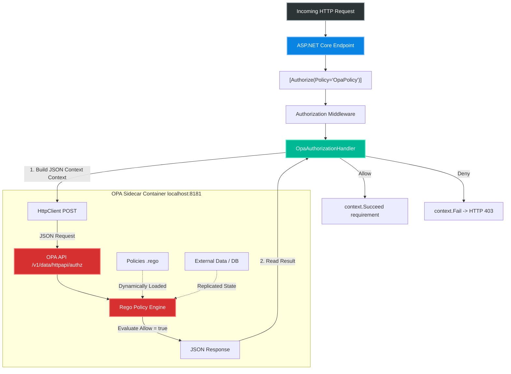

# 4.163 — Open Policy Agent (OPA) Integration

## PART 0 — Navigation & Context

```text
ASP.NET Core Domain Hierarchy
├── Security & Identity
│   ├── 4.154 Authorization Architecture
│   ├── 4.156 Policy-Based Authorization
│   ├── 4.161 Permission-Based Authorization
│   └── 4.163 Open Policy Agent (OPA) Integration ◄ YOU ARE HERE
└── Cloud Native Architecture
    └── Microservices Security
```

**What you need before this:**
- Thorough understanding of ASP.NET Core's `IAuthorizationHandler` pipeline and how custom policies evaluate HTTP contexts [[4.154 — Authorization Architecture: Middleware, Policy Evaluation, and Requirements]].
- Familiarity with the `HttpClient` factory patterns to safely make external HTTP calls [[4.250 — Named and Typed HTTP Clients: AddHttpClient Registration Patterns]].
- Basic knowledge of REST APIs and JSON payload formatting.

**What this unlocks after:**
- Architecting polyglot microservice environments where Authorization rules are shared seamlessly between .NET, Node.js, and Go implementations.
- Decoupling security policy updates from application deployments (Updating rules without restarting the API).
- Implementing advanced Cloud-Native authorization patterns within Kubernetes service meshes (e.g., Envoy integration).

**Why this matters to a production engineer at scale:**
In a sprawling, enterprise microservice architecture, hardcoding authorization logic (`User.IsInRole("Admin")`) into individual C# APIs creates a massive governance problem. If the Chief Security Officer mandates a new global rule—for instance, "No wire transfers above $10,000 outside of business hours unless the user is a VIP"—you would have to update, recompile, and redeploy 50 different microservices across 4 different programming languages.
Open Policy Agent (OPA) solves this by extracting the *decision-making logic* out of your C# code entirely. Your ASP.NET Core API simply acts as an enforcer. It gathers the HTTP context and user claims, formats them into a JSON request, and hands them to an external OPA sidecar. OPA evaluates its decoupled policies (written in a language called Rego) and returns a definitive True/False response. You can update enterprise security policies globally in milliseconds without touching a single line of C#. Understanding OPA is the gateway to Senior Architecture in modern Kubernetes environments.

---

## PART 1 — The Core Mental Model

> **The Fundamental Rule**
> **Instead of writing C# `IAuthorizationHandler` logic to evaluate complex business rules, ASP.NET Core delegates the decision. It sends a JSON payload containing the User, the Request, and the requested Resource to a local Open Policy Agent (OPA) sidecar. OPA evaluates policies written in Rego and returns a definitive Allow/Deny response that the C# handler blindly enforces.**

**The Plain-Language Analogy**
Imagine a bouncer at an exclusive nightclub (your ASP.NET Core API). 
**The Old Way:** The club owner gives the bouncer a physical rulebook: "Must be 21, no sneakers, VIPs skip the line." The bouncer memorizes the rules (C# Handlers). If the owner changes the rules at 11:00 PM, they have to pull the bouncer off the door to retrain them (recompile/redeploy the app).
**The OPA Way:** The bouncer memorizes nothing. When a guest arrives, the bouncer takes a picture of the guest's ID and shoes, and radios the Head of Security sitting in the back office (the OPA sidecar). The Head of Security looks at the master, ever-changing digital rulebook (Rego), makes the decision, and radios back "Let them in" or "Kick them out." The bouncer just executes the decision.

**The Taxonomy Diagram**



---

## PART 2 — Deep Mechanics

### 2.1 — The Rego Language (OPA)
OPA policies are written in a specialized, declarative query language called Rego. Rego queries JSON data. It is explicitly designed to operate over structured graphs of information.

```rego
# example.rego
package httpapi.authz

# By default, deny all requests
default allow = false

# Rule 1: Allow if the user has the "Admin" role claim
allow {
    input.user.roles[_] == "Admin"
}

# Rule 2: Allow if it's a GET request to their own data
allow {
    input.request.method == "GET"
    input.request.path[0] == "users"
    input.request.path[1] == input.user.id
}
```

The ASP.NET Core application knows absolutely nothing about Rego. It only knows how to construct the `input` JSON object and parse the boolean `allow` output.

### 2.2 — The OPA Sidecar Architecture (Crucial Detail)
OPA is a lightweight binary (written in Go) designed to run as a **sidecar container** or a host-level daemon.
You do **not** call a centralized OPA server across the network. Calling a centralized server would add 30-50ms of network latency to every single API request, crippling your system's throughput.
Instead, you deploy one OPA instance alongside every single ASP.NET Core instance. They share a Pod in Kubernetes. ASP.NET Core calls `http://localhost:8181`.
**Runtime Cost:** Because OPA runs on localhost (often sharing the same Linux network namespace in Kubernetes), the HTTP call to OPA takes `< 1ms`.

### 2.3 — The ASP.NET Core Integration Point
To integrate OPA, you create a custom class implementing `AuthorizationHandler<TRequirement>`. Instead of evaluating business rules, this handler collects the `HttpContext` and `ClaimsPrincipal`, serializes them into an `OpaInput` C# object, serializes that to JSON, and sends an HTTP POST to the local OPA instance.

```json
// The conceptual JSON payload sent from ASP.NET Core to OPA
{
  "input": {
    "request": {
      "method": "POST",
      "path": ["api", "transfer"]
    },
    "user": {
      "sub": "12345",
      "department": "Finance",
      "roles": ["Manager"]
    }
  }
}
```

### 2.4 — Handling OPA Network Failures (Fail-Closed)
Because authorization is now a distributed network call (even if local over the loopback adapter), network failures or container crashes can occur. 
If the OPA sidecar crashes, the ASP.NET Core `HttpClient` will throw an `HttpRequestException`.
**The Fail-Closed Principle:** If OPA cannot be reached, the handler MUST fail the requirement, resulting in a 403 Forbidden (or 500 Internal Server Error). It must *never* fail-open (allow access) when the security engine goes offline.

---

## PART 3 — Production Code Patterns

### Pattern 1: The OPA Input Model
You must map the ASP.NET Core `HttpContext` and `ClaimsPrincipal` into a clean POCO that serializes exactly into the JSON structure your Rego policies expect.

```csharp
public class OpaInput
{
    public RequestInput Request { get; set; } = new();
    public UserInput User { get; set; } = new();
}

public class RequestInput
{
    public string Method { get; set; } = string.Empty;
    public string[] Path { get; set; } = Array.Empty<string>();
    public Dictionary<string, string> Headers { get; set; } = new();
}

public class UserInput
{
    public string? Name { get; set; }
    public string[] Claims { get; set; } = Array.Empty<string>();
}

public class OpaRequest
{
    // OPA expects the root element to be named "input"
    public OpaInput Input { get; set; } = new();
}

public class OpaResponse
{
    // The specific shape depends on your Rego policy output.
    // Usually, it's an object containing a boolean property called "allow".
    public OpaResult Result { get; set; } = new();
}

public class OpaResult
{
    public bool Allow { get; set; }
}
```

### Pattern 2: The OPA Authorization Handler
This handler executes on every request that requires OPA evaluation. It builds the payload, sends it to localhost, and strictly enforces the result.

```csharp
// 1. The Dummy Requirement
public class OpaRequirement : IAuthorizationRequirement { }

// 2. The Handler
public class OpaAuthorizationHandler : AuthorizationHandler<OpaRequirement>
{
    private readonly HttpClient _httpClient;
    private readonly IHttpContextAccessor _httpContextAccessor;
    private readonly ILogger<OpaAuthorizationHandler> _logger;

    public OpaAuthorizationHandler(
        IHttpClientFactory httpClientFactory, 
        IHttpContextAccessor httpContextAccessor,
        ILogger<OpaAuthorizationHandler> logger)
    {
        // Must be configured in DI to point to localhost:8181
        _httpClient = httpClientFactory.CreateClient("OpaClient"); 
        _httpContextAccessor = httpContextAccessor;
        _logger = logger;
    }

    protected override async Task HandleRequirementAsync(
        AuthorizationHandlerContext context, OpaRequirement requirement)
    {
        var httpContext = _httpContextAccessor.HttpContext;
        
        // Fail closed if not in a web request context
        if (httpContext == null) return; 

        // 1. Build the Input Payload
        var input = new OpaRequest
        {
            Input = new OpaInput
            {
                Request = new RequestInput
                {
                    Method = httpContext.Request.Method,
                    // Convert "/api/users" -> ["api", "users"]
                    Path = httpContext.Request.Path.Value?.Trim('/').Split('/') ?? Array.Empty<string>()
                },
                User = new UserInput
                {
                    Name = context.User.Identity?.Name,
                    // Flatten claims to simple strings for Rego
                    Claims = context.User.Claims.Select(c => $"{c.Type}:{c.Value}").ToArray()
                }
            }
        };

        try
        {
            // 2. Send to OPA Sidecar
            // The URL path matches the Rego package: 
            // package httpapi.authz -> /v1/data/httpapi/authz
            var response = await _httpClient.PostAsJsonAsync("v1/data/httpapi/authz", input);
            
            if (response.IsSuccessStatusCode)
            {
                var opaResponse = await response.Content.ReadFromJsonAsync<OpaResponse>();
                
                // 3. Evaluate the result
                if (opaResponse?.Result?.Allow == true)
                {
                    // Success!
                    context.Succeed(requirement);
                    return;
                }
                else
                {
                    _logger.LogInformation("OPA explicitly denied access to user {User}", context.User.Identity?.Name);
                }
            }
            else
            {
                _logger.LogWarning("OPA returned non-success status code: {StatusCode}", response.StatusCode);
            }
        }
        catch (Exception ex)
        {
            _logger.LogError(ex, "Failed to contact OPA sidecar. Failing closed.");
            // Falls through to the implicit context.Fail() state
        }
    }
}
```

### Pattern 3: Wiring OPA into the ASP.NET Core Pipeline
Register the dependencies and set the OPA policy as the default fallback for all endpoints in `Program.cs`.

```csharp
// 1. Configure the HttpClient to point to the local sidecar
builder.Services.AddHttpClient("OpaClient", client =>
{
    client.BaseAddress = new Uri("http://localhost:8181/");
    // Critical: Fail extremely fast. Do not let threads block if the sidecar dies.
    client.Timeout = TimeSpan.FromMilliseconds(500); 
});

// 2. Register the Handler
builder.Services.AddSingleton<IAuthorizationHandler, OpaAuthorizationHandler>();
builder.Services.AddHttpContextAccessor(); // Required to read the Request

// 3. Set the Fallback Policy
builder.Services.AddAuthorization(options =>
{
    var opaPolicy = new AuthorizationPolicyBuilder()
        .AddRequirements(new OpaRequirement())
        .Build();

    // ✅ CORRECT: Every single endpoint defaults to asking OPA unless explicitly overridden
    options.FallbackPolicy = opaPolicy; 
});
```

### Pattern 4: Resource-Based Auth with OPA (Data Filtering vs Evaluation)
If you want OPA to decide if a user can edit a *specific* document, you cannot pass the whole 5MB document to OPA in the JSON request. Instead, there are two primary patterns:
1. **Partial Evaluation:** Ask OPA for the *rules*, and translate the Rego rules directly into an Entity Framework Core `IQueryable` (Extremely complex, requires advanced parsers).
2. **Metadata Passing (Standard):** Pass only the critical Resource Metadata to OPA in the HTTP request.

```csharp
// 1. Modify OpaInput to include Resource Metadata
public class ResourceInput 
{
    public string Type { get; set; } = string.Empty;
    public string OwnerId { get; set; } = string.Empty;
    public string Classification { get; set; } = string.Empty;
}

// 2. In the Handler, extract metadata if a resource was passed
if (context.Resource is HttpContext httpCtx && httpCtx.Items.TryGetValue("ResourceMetadata", out var rawMeta))
{
    if (rawMeta is DocumentMetadata docMeta)
    {
        input.Input.Resource = new ResourceInput { 
            Type = "Document", 
            OwnerId = docMeta.OwnerUserId,
            Classification = docMeta.SecurityLevel
        };
    }
}

// 3. In Rego:
/*
allow {
    input.request.method == "PUT"
    input.resource.Type == "Document"
    input.resource.ownerId == input.user.sub
}
*/
```

---

## PART 4 — Gotchas & Anti-Patterns

### Gotcha 1: Centralized OPA Server Latency
Developers new to OPA often deploy a single centralized OPA server for their entire cluster and configure the ASP.NET Core `HttpClient` to call `http://opa-service.default.svc.cluster.local`.

// ⚠️ WRONG CODE
```csharp
client.BaseAddress = new Uri("http://central-opa.internal.net/");
```

// HTTP consequence (wrong path):
// Every single HTTP request to your C# API now incurs a network hop to the central OPA server. If your API handles 5,000 RPS, you are hammering the central OPA server with 5,000 RPS. Physical network latency adds 10-50ms to every request. If the network hiccups, the entire API cluster goes down.

// ✅ CORRECT CODE
```csharp
client.BaseAddress = new Uri("http://localhost:8181/");
```

// THE FIX:
// OPA is explicitly designed to run as a local sidecar (1 per API instance). It caches policies in memory. The local network hop over the loopback adapter takes < 0.5ms. The Control Plane (like Styra) pushes the Rego policies down to the local sidecars asynchronously.

### Gotcha 2: Bloating the OPA JSON Payload
Sending the entire HTTP request body (e.g., a massive JSON payload or file upload) to OPA to authorize based on the payload contents.

// ⚠️ WRONG CODE
```csharp
input.Request.Body = await new StreamReader(httpContext.Request.Body).ReadToEndAsync();
```

// HTTP consequence (wrong path):
// JSON serialization overhead skyrockets. The 5MB payload is serialized, sent over local HTTP, parsed by OPA, evaluated, and thrown away. Furthermore, the ASP.NET Core Model Binder breaks immediately because the Request Body stream was consumed and not reset.

// ✅ CORRECT CODE
// ONLY send identity claims, request routing metadata (path/method), and minimal resource metadata. Do not send HTTP request payloads. If you must inspect the payload, validate it in C# FluentValidation, not OPA.

### Gotcha 3: Infinite Loops with IHttpContextAccessor
If your API serves static files, or Swagger UI, and you set OPA as the `FallbackPolicy`, OPA will be called for `/swagger/v1/swagger.json` and `/css/site.css`.
If you forget to write Rego rules allowing these paths, the app will appear totally broken, returning 403s for static assets.

// ⚠️ WRONG CODE
```rego
# Rego policy missing static file rules
default allow = false
allow { input.user.roles[_] == "Admin" }
```

// ✅ CORRECT CODE
```rego
# Rego policy explicitly allowing public assets
allow { input.request.path[0] == "swagger" }
allow { input.request.path[0] == "css" }
```
OR, use `[AllowAnonymous]` explicitly on those endpoints in ASP.NET Core to bypass the OPA handler entirely.

### Gotcha 4: Forgetting the Timeout
If the OPA sidecar container hangs or goes offline, the C# `HttpClient` will wait for 100 seconds (the default) before failing.

// ⚠️ WRONG CODE
```csharp
builder.Services.AddHttpClient("OpaClient", client => {
    client.BaseAddress = new Uri("http://localhost:8181/");
    // Danger: Uses default 100s timeout
});
```

// HTTP consequence (wrong path):
// All C# thread pool threads block waiting for OPA. Thread starvation occurs rapidly. The entire ASP.NET Core node crashes under load within seconds.

// ✅ CORRECT CODE
```csharp
builder.Services.AddHttpClient("OpaClient", client => {
    client.BaseAddress = new Uri("http://localhost:8181/");
    client.Timeout = TimeSpan.FromMilliseconds(500); // Fail fast!
});
```

### Gotcha 5: Not Caching OPA Responses Internally
If a single API request hits 3 different endpoints internally (e.g., via middleware or composite components) or executes multiple policies, it will call OPA 3 times.

// ✅ CORRECT CODE
```csharp
// Use ASP.NET Core HttpContext.Items to cache the OPA response for the duration of the request
if (httpContext.Items.TryGetValue("OpaResult", out var cachedResult)) {
    if ((bool)cachedResult) context.Succeed(requirement);
    return;
}
// ... call OPA ...
httpContext.Items["OpaResult"] = opaResponse.Result.Allow;
```

---

## PART 5 — Performance Implications

### Request Pipeline Characteristics

| Scenario | Pipeline Depth | Allocations Per Request | Approx Latency Impact | Recommendation |
|---|---|---|---|---|
| C# Native Policy Handler | Medium | Low | < 0.1ms | Fastest. Best for Monoliths. |
| OPA Sidecar (Localhost) | Deep | High (JSON parsing) | 0.5ms - 2.0ms | Standard for OPA. Highly acceptable for Microservices. |
| OPA Central Server | Deep | High | 10ms - 50ms | Anti-pattern. Avoid. |

### BenchmarkDotNet Conceptualization

```csharp
// Expected output (approximate overhead excluding network, .NET 8, x64):
// Method           | Mean      | Error     | StdDev    | Gen0   | Allocated |
// ---------------- |----------:|----------:|----------:|-------:|----------:|
// NativeHandler    |  0.1 ns   | 0.01 ns   | 0.01 ns   | 0.0000 |       0 B |
// OpaSidecarCall   |  1.5 us   | 0.05 us   | 0.04 us   | 1.2500 |    5200 B |
```

**When to Care:** Calling an external process requires JSON serialization, which allocates memory (approx 5KB per request). At 10,000 RPS, this generates 50MB of garbage per second. Kestrel and the .NET GC handle this easily, but it is substantially heavier than native C# authorization. 
**When this saves you:** The developer hours saved by decoupling authorization logic across 100 polyglot microservices vastly outweighs the compute cost of running the sidecar.

---

## PART 6 — Interview Arsenal

### A. The Question Bank

**Question 1:** "We have 20 microservices written in .NET, Go, and Node.js. How do we ensure they all enforce the exact same authorization rules without duplicating logic in 3 different languages?"
- **Average Answer:** "Write a shared library in each language."
- **Why That's Insufficient:** Keeping libraries in sync across languages is impossible. It requires recompiling and redeploying every single service whenever rules change.
- **Great Answer:** "We should extract authorization logic entirely from the application code using Open Policy Agent (OPA). Each microservice acts only as a policy enforcement point. When a request arrives, the ASP.NET Core, Go, or Node app extracts the user claims and HTTP metadata, and sends it to a local OPA sidecar. The sidecar evaluates policies written in Rego and returns Allow or Deny. This centralizes the *logic* in Rego files, while decentralizing the *enforcement*, allowing us to update enterprise security rules dynamically without redeploying any microservices."

**Question 2:** "If OPA runs in a sidecar container, how does it know about database state? For example, if a user's specific account subscription expires, how does OPA know to deny access to premium endpoints?"
- **Average Answer:** "OPA queries the SQL database during the evaluation."
- **Why That's Insufficient:** OPA is designed to be ultra-fast and memory-bound. Having OPA execute raw SQL queries adds latency and tight coupling.
- **Great Answer:** "OPA shouldn't query the SQL database directly on every request. There are two standard approaches. **1. Overloading the Input:** The ASP.NET Core API queries the database, retrieves the user's subscription status, and includes that specific metadata in the JSON payload sent to OPA. **2. Data Replication (Bundle API):** OPA periodically pulls JSON bundles containing necessary state (like a list of expired subscriptions) from a centralized control plane, storing it in-memory. Rego policies evaluate against this in-memory data, ensuring sub-millisecond latency."

**Question 3:** "In ASP.NET Core, where exactly do you integrate the call to OPA?"
- **Average Answer:** "In a Custom Middleware."
- **Why That's Insufficient:** Custom Middleware runs too early and bypasses the `[Authorize]` attribute system, breaking endpoint-specific routing logic and failing to integrate with OpenAPI.
- **Great Answer:** "You integrate OPA by writing a custom `IAuthorizationHandler`. This allows OPA to participate natively in the ASP.NET Core Policy engine. You can apply the OPA policy globally as a `FallbackPolicy`, or selectively using `[Authorize(Policy='OpaPolicy')]` on specific controllers. Because it runs after routing and authentication, the handler has access to the fully hydrated `ClaimsPrincipal` and endpoint metadata to build the precise JSON input payload."

### B. The Trick Questions

**Trick Question:** "If the OPA sidecar crashes, should our `IAuthorizationHandler` catch the exception and allow the request through so the API stays available?"
- **The Trap:** Prioritizing Availability over Security.
- **The Correct Answer:** "Absolutely not. This violates the Fail-Closed security principle. If the authorization engine cannot be reached, the system must assume the worst and deny access. The handler must catch the `HttpRequestException`, log a critical error, and either return `Task.CompletedTask` (abstaining, resulting in failure) or explicitly call `context.Fail()`. Allowing access when OPA is down would create a catastrophic security bypass vulnerability."

**Trick Question:** "Does OPA replace the need for ASP.NET Core Authentication (`JwtBearerHandler`)?"
- **The Trap:** Confusing Authentication (AuthN) with Authorization (AuthZ).
- **The Correct Answer:** "No. OPA is strictly an Authorization engine. ASP.NET Core must still run the Authentication middleware to validate the JWT signature, verify the cryptographic issuer, check expiration, and construct the `ClaimsPrincipal`. OPA entirely trusts the ASP.NET Core app to provide it with verified identity claims in the input JSON payload. OPA does not verify signatures."

### C. Red Flags to Avoid
- 🚩 **"I use OPA to validate my JWT signatures."** (OPA *can* technically do this using `io.jwt.decode_verify`, but ASP.NET Core does it natively and much faster at the pipeline level. Let C# handle AuthN, let OPA handle AuthZ).
- 🚩 **"I call OPA using `new HttpClient()` inside my handler."** (This will cause socket exhaustion. Always use `IHttpClientFactory` via DI).

---

## PART 7 — Decision Framework

```mermaid
graph TD
    A[Authorization Logic Location] --> B{How many Microservices do you have?}
    
    B -->|1-3 Monoliths| C[Use C# Native Policy Handlers]
    B -->|> 10 Microservices| D{Are they Polyglot different languages?}
    
    D -->|No, all .NET| E[Shared NuGet Package for Auth Handlers]
    D -->|Yes, Node/Go/.NET| F[Use Open Policy Agent OPA]
    
    F --> G[Extract logic to declarative Rego]
    F --> H[Deploy OPA as Sidecar in Kubernetes]
    F --> I[Write ASP.NET Core Handler to POST to Local Sidecar]
    
    style A fill:#2d3436,stroke:#fff
    style C fill:#0984e3,stroke:#fff
    style E fill:#0984e3,stroke:#fff
    style F fill:#00b894,stroke:#fff
```



---

## PART 8 — Self-Check

### A. Conceptual Questions
1. What is the fundamental architectural difference between OPA and C# Policy Handlers?
2. Why must OPA be deployed as a local sidecar rather than a central API across the network?
3. What language are OPA rules written in?
4. How do you map the `ClaimsPrincipal` into OPA's expected JSON format?
5. Why is configuring `IHttpClientFactory` crucial when writing the OPA Authorization Handler?
6. What is the Fail-Closed principle and how does it apply to OPA networking errors?
7. If an API handles 10,000 RPS, what is the primary performance bottleneck of using OPA?
8. How does OPA evaluate authorization data that lives in a SQL database?

### B. Code Puzzles

**Puzzle 1: The Infinite Timeout**
```csharp
var client = _httpClientFactory.CreateClient();
client.BaseAddress = new Uri("http://localhost:8181/");
var response = await client.PostAsJsonAsync("v1/data/authz", input);
```
*Scenario:* The sidecar container crashes. The HTTP call hangs. What happens to the .NET API?
<details>
<summary>Answer</summary>
The default `HttpClient` timeout is 100 seconds. Every incoming API request will block a thread pool thread for 100 seconds waiting for OPA. The server will succumb to thread starvation in seconds and crash under load.
*Fix:* Configure a tight timeout on the named client during registration: `client.Timeout = TimeSpan.FromMilliseconds(500);`
</details>

**Puzzle 2: The Missing Await**
```csharp
protected override Task HandleRequirementAsync(...) {
    var response = _httpClient.PostAsJsonAsync("...", input).Result;
    if (response.IsSuccessStatusCode) context.Succeed(req);
    return Task.CompletedTask;
}
```
*Scenario:* A developer uses sync-over-async in the authorization pipeline.
<details>
<summary>Answer</summary>
Calling `.Result` blocks the executing thread while waiting for the network I/O to localhost. This causes thread pool starvation under high concurrency.
*Fix:* Use `await` and change the method signature to `async Task`.
</details>

**Puzzle 3: Exposing the Raw JWT**
```csharp
input.Request.Headers.Add("Authorization", httpContext.Request.Headers["Authorization"]);
```
*Scenario:* The developer passes the raw Bearer token string to OPA so OPA can parse it directly.
<details>
<summary>Answer</summary>
While OPA has JWT decoding functions, passing the raw token forces OPA to repeat the parsing work ASP.NET Core just finished doing in the Authentication middleware. More importantly, it needlessly exposes raw, sensitive tokens to OPA's decision logs, creating a security risk.
*Fix:* Just map the parsed, safe claims from `context.User.Claims` into the JSON payload.
</details>

**Puzzle 4: The Fallback Anomaly**
```csharp
if (opaResponse?.Result?.Allow == true) {
    context.Succeed(requirement);
} else {
    // Missing context.Fail() or return?
}
```
*Scenario:* The developer doesn't explicitly call `context.Fail()` when OPA denies.
<details>
<summary>Answer</summary>
In ASP.NET Core, if no handler calls `Succeed()`, the requirement fails by default. So leaving the `else` block blank (abstaining) is functionally identical to denying, *unless* there is another handler registered for the same requirement that might subsequently succeed. Since this is OPA, there is usually only one handler, so abstaining is safe and correct, though `context.Fail()` is more explicit.
</details>

---

## PART 9 — Connections & Resources

### A. Related Topics Table

| Topic | Why It Connects |
|---|---|
| [[4.154 — Authorization Architecture: Middleware, Policy Evaluation, and Requirements]] | OPA integration is simply a custom `IAuthorizationHandler` plugging into the native engine. |
| [[4.156 — Policy-Based Authorization: AddPolicy, IAuthorizationRequirement]] | Shows how to configure the Fallback Policy that forces all traffic to OPA. |
| [[4.250 — Named and Typed HTTP Clients: AddHttpClient Registration Patterns]] | The correct DI mechanism used to reliably communicate with the OPA sidecar. |

### B. Books

| Book | Chapters | Why These Chapters |
|---|---|---|
| Microservices Security in Action | Chapter 7: Using OPA | The definitive guide on moving from monolith security to sidecar OPA architectures. |
| Kubernetes in Action | (Various) | Explains sidecar container patterns and networking namespaces. |

### C. Essential Articles & Docs
- [Open Policy Agent Documentation](https://www.openpolicyagent.org/docs/latest/)
- [Microsoft Docs: Custom Authorization Handlers](https://learn.microsoft.com/en-us/aspnet/core/security/authorization/policies#authorization-handlers)
- [Styra: OPA ASP.NET Core Integration Guide](https://www.styra.com/)

> [!NOTE]
> **Template Meta-Note**
> Part 0: Context & Prerequisites. Part 1: Core Mental Model. Part 2: Deep Mechanics & Pipeline. Part 3: Production Code. Part 4: Gotchas. Part 5: Performance. Part 6: Interview Arsenal. Part 7: Decision Framework. Part 8: Puzzles. Part 9: Resources.
