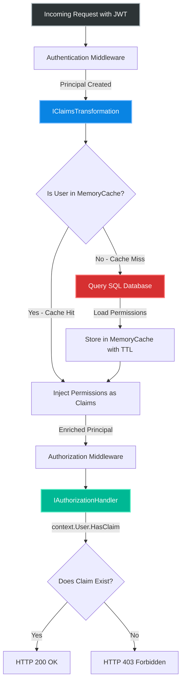

# 4.164 — Authorization Caching: Avoiding Per-Request Database Hits

## PART 0 — Navigation & Context

```text
ASP.NET Core Domain Hierarchy
├── Security & Identity
│   ├── 4.149 IClaimsTransformation
│   ├── 4.161 Permission-Based Authorization
│   └── 4.164 Authorization Caching ◄ YOU ARE HERE
└── Performance & Caching
    ├── 4.186 IMemoryCache
    ├── 4.193 Cache Stampede Prevention
    └── 4.196 HybridCache (.NET 9)
```

**What you need before this:**
- A deep understanding of how to enrich principals using `IClaimsTransformation` [[4.149 — Claims Transformation: IClaimsTransformation for Principal Enrichment]].
- Knowledge of Permission-based architectures over flat roles [[4.161 — Permission-Based Authorization: Fine-Grained Action Permissions]].
- Core concepts of in-memory caching and cache invalidation [[4.186 — IMemoryCache: In-Process Caching with Expiry, Size, and Priority]].

**What this unlocks after:**
- Building high-throughput API gateways and microservices that don't melt down the SQL database under load.
- Implementing cross-pod distributed cache invalidation strategies using Redis and .NET 9's HybridCache.
- Architecting robust SaaS multi-tenant security layers.

**Why this matters to a production engineer at scale:**
When transitioning from simple role-based authorization to fine-grained permission systems (e.g., "CanEditDocument123"), the logic inevitably moves out of the static C# code and into a database.
If you evaluate permissions by querying the database directly inside an `IAuthorizationHandler` or `IClaimsTransformation`, you create a catastrophic performance bottleneck. Imagine an API handling 10,000 requests per second. If every HTTP request requires an authorization check, your application fires 10,000 SQL queries per second *just for authorization*, before executing a single line of business logic. Database CPU hits 100%, ThreadPools starve, and P99 latency spikes into the seconds.
Authorization Caching solves this. By caching the user's evaluated permissions in memory (or Redis) and checking against the cache instead of the database, you reduce database authorization queries from 10,000 QPS to ~0.01 QPS. Mastering this pattern is the defining difference between an application that crashes under load and one that scales infinitely.

---

## PART 1 — The Core Mental Model

> **The Fundamental Rule**
> **Never query a database directly inside an `IAuthorizationHandler` on every HTTP request. Instead, load a user's permissions once during `IClaimsTransformation`, cache those permissions using `IMemoryCache` (or `HybridCache`) keyed by `(tenantId, userId)`, and inject them as Claims. Authorization Handlers then perform instantaneous in-memory `HasClaim` checks against the principal.**

**The Plain-Language Analogy**
Imagine working at a high-security facility.
**Without Caching:** Every time you try to open a door (HTTP Request), the door guard calls the central HR office (Database) and asks: "Is Bob allowed to open Door A?" HR opens their filing cabinet, checks the record, and says "Yes." If you open 50 doors a day, HR gets 50 phone calls. The phone lines jam.
**With Caching:** When you enter the building at 8:00 AM (`IClaimsTransformation`), the front desk calls HR *once* and asks for your complete access list. They print this list onto the back of your physical ID badge (The `ClaimsPrincipal`). For the rest of the day, when you go to open a door, the door guard just looks at the back of your badge (`HasClaim`). No phone calls are made. If HR fires you at noon, they send a broadcast radio message to the front desk to destroy your cached access list (Cache Invalidation).

**The Taxonomy Diagram**



---

## PART 2 — Deep Mechanics

### 2.1 — Pipeline Positioning (Where to Cache)
You have three potential places to cache and evaluate permissions in ASP.NET Core:

| Location | Pros | Cons | Verdict |
|---|---|---|---|
| **Identity Provider (Auth0/AzureAD)** | Zero API database queries. Permissions baked into JWT. | Massive JWT bloat. Stale permissions until token expires (e.g., 1 hour). | Use only for coarse-grained roles. |
| **IAuthorizationHandler** | Lazy evaluation (only queries if the endpoint actually needs auth). | Very difficult to deduplicate if a single request hits multiple handlers. Risk of N+1 database queries. | Avoid for global permissions. |
| **IClaimsTransformation** | Runs exactly once per authenticated request. Enriches the principal universally. | Runs for *every* authenticated request, even for public files (if `FallbackPolicy` is not carefully tuned). | **Best Practice** (When combined with robust caching). |

### 2.2 — The MemoryCache Key Strategy
A cache is a giant dictionary. If you use the wrong key, you leak security data.
If you key the cache by `userId` alone, you create a severe cross-tenant vulnerability in Multi-Tenant SaaS applications. If User A is an Admin in Tenant 1, and a Guest in Tenant 2, caching by `userId` will grant them Admin rights in Tenant 2 if they switch contexts rapidly.
**Rule:** The cache key must always be composite: `$"perms:{tenantId}:{userId}"`.

### 2.3 — Cache TTL (Time-To-Live) and Stale Data
If you cache permissions for 1 hour, and an Admin revokes a malicious user's access, the malicious user retains access for up to 59 minutes (Stale Data).
To solve this, you use **Active Invalidation**. You set the Absolute Expiration to a reasonable fallback (e.g., 10 minutes), but whenever the Admin API modifies a permission, it explicitly calls `_cache.Remove(key)` to purge the stale data instantly.

### 2.4 — Idempotent Claims Transformation
`IClaimsTransformation` can theoretically be called multiple times in a single HTTP request lifecycle (e.g., if a developer manually calls `AuthenticateAsync`). If you blindly append cached permissions every time it runs, the `ClaimsPrincipal` will grow exponentially with duplicate claims.
You must use a "Loaded" sentinel claim to ensure idempotency.

---

## PART 3 — Production Code Patterns

### Pattern 1: The Cached Claims Transformation (Standard)
This is the gold standard for loading permissions from a database securely and performantly.

```csharp
public sealed class PermissionClaimsTransformation : IClaimsTransformation
{
    private readonly IMemoryCache _cache;
    private readonly IServiceScopeFactory _scopeFactory;

    // IMemoryCache and IServiceScopeFactory must be injected.
    // We cannot inject a Scoped DbContext into a Singleton/Transient transformation safely 
    // without creating a manual scope, because caching logic spans multiple requests.
    public PermissionClaimsTransformation(IMemoryCache cache, IServiceScopeFactory scopeFactory)
    {
        _cache = cache;
        _scopeFactory = scopeFactory;
    }

    public async Task<ClaimsPrincipal> TransformAsync(ClaimsPrincipal principal)
    {
        // 1. Extract Identifiers
        var userId = principal.FindFirstValue(ClaimTypes.NameIdentifier);
        var tenantId = principal.FindFirstValue("tenant_id") ?? "default_tenant";
        
        if (string.IsNullOrEmpty(userId)) return principal;

        // 2. Clone Identity & Check Idempotency (Sentinel Claim)
        var identity = principal.Identity as ClaimsIdentity;
        if (identity == null || identity.HasClaim("perms_loaded", "true"))
        {
            return principal; // Already transformed in this request
        }

        // 3. Construct the Composite Cache Key
        var cacheKey = $"authz:perms:tenant:{tenantId}:user:{userId}";

        // 4. GetOrCreateAsync to handle misses and Stampede Prevention natively
        var permissions = await _cache.GetOrCreateAsync(cacheKey, async entry =>
        {
            // TTL: Fallback expiration in case active invalidation misses
            entry.AbsoluteExpirationRelativeToNow = TimeSpan.FromMinutes(15);
            entry.Size = 1; // Used if MemoryCache is bounded by size

            // Create a manual scope to resolve the DbContext/Repository safely
            await using var scope = _scopeFactory.CreateAsyncScope();
            var repo = scope.ServiceProvider.GetRequiredService<IPermissionRepository>();
            
            // Execute the single SQL query
            return await repo.GetUserPermissionsAsync(tenantId, userId);
        });

        // 5. Inject the Permissions as Claims
        if (permissions != null)
        {
            foreach (var perm in permissions)
            {
                // Note: Don't use ClaimTypes.Role, use a custom claim type to avoid conflict
                identity.AddClaim(new Claim("custom_permission", perm));
            }
        }

        // 6. Set Sentinel Claim
        identity.AddClaim(new Claim("perms_loaded", "true"));

        return principal;
    }
}

// Program.cs Registration
builder.Services.AddTransient<IClaimsTransformation, PermissionClaimsTransformation>();
builder.Services.AddMemoryCache();
```

### Pattern 2: The Ultra-Fast Authorization Handler
Because the `IClaimsTransformation` did all the heavy lifting, the actual `IAuthorizationHandler` becomes completely synchronous and executes in nanoseconds without any database injections.

```csharp
public class PermissionRequirement : IAuthorizationRequirement
{
    public string RequiredPermission { get; }
    public PermissionRequirement(string permission) => RequiredPermission = permission;
}

public class PermissionHandler : AuthorizationHandler<PermissionRequirement>
{
    protected override Task HandleRequirementAsync(
        AuthorizationHandlerContext context, 
        PermissionRequirement requirement)
    {
        // No Database. No Async I/O. Pure in-memory string comparison.
        if (context.User.HasClaim("custom_permission", requirement.RequiredPermission))
        {
            context.Succeed(requirement);
        }
        
        return Task.CompletedTask;
    }
}
```

### Pattern 3: Active Cache Invalidation (Admin API)
When an administrator revokes a permission, you must proactively purge the cache so the revocation takes effect immediately, rather than waiting 15 minutes for the TTL to expire.

```csharp
public class AdminController : ControllerBase
{
    private readonly IPermissionRepository _repo;
    private readonly IMemoryCache _cache;

    [HttpPost("users/{userId}/revoke")]
    [Authorize(Policy = "SuperAdmin")]
    public async Task<IActionResult> RevokePermission(string tenantId, string userId, string permission)
    {
        // 1. Update the Database
        await _repo.RevokePermissionAsync(tenantId, userId, permission);

        // 2. Proactively remove the user's cached entry
        var cacheKey = $"authz:perms:tenant:{tenantId}:user:{userId}";
        _cache.Remove(cacheKey);

        return Ok();
    }
}
```

### Pattern 4: HybridCache for Multi-Pod Environments (.NET 9+)
If you are running 5 instances of your API behind a Load Balancer (Kubernetes), calling `IMemoryCache.Remove()` on Pod A does NOT invalidate the cache on Pod B. If the user's next request goes to Pod B, they still have the revoked permissions.
In .NET 9, Microsoft introduced `HybridCache`, which unifies an L1 In-Memory Cache with an L2 Distributed Cache (Redis) and supports **Tags** for mass eviction across all pods.

```csharp
// Inside IClaimsTransformation using .NET 9 HybridCache
var permissions = await _hybridCache.GetOrCreateAsync(
    $"authz:perms:tenant:{tenantId}:user:{userId}",
    async cancelToken => {
        await using var scope = _scopeFactory.CreateAsyncScope();
        return await scope.ServiceProvider.GetRequiredService<IPermissionRepository>()
                          .GetUserPermissionsAsync(tenantId, userId, cancelToken);
    },
    new HybridCacheEntryOptions { Expiration = TimeSpan.FromMinutes(15) },
    // Tag the entry with the user ID
    tags: [ $"user_eviction_tag:{tenantId}:{userId}" ], 
    cancellationToken: default
);

// Inside the AdminController to Invalidate Across ALL PODS:
await _hybridCache.RemoveByTagAsync($"user_eviction_tag:{tenantId}:{userId}");
```

---

## PART 4 — Gotchas & Anti-Patterns

### Gotcha 1: The Cache Stampede on Cold Boot
If a user with no cached data suddenly fires 20 parallel HTTP requests from a frontend Single Page Application (e.g., loading 20 widgets simultaneously), all 20 requests hit `IClaimsTransformation` at the exact same millisecond. 
If you use raw `IMemoryCache.TryGetValue`, all 20 requests will see a Cache Miss, and you will fire 20 identical SQL queries to the database simultaneously (Cache Stampede).
**The Fix:** ALWAYS use `GetOrCreateAsync` or `HybridCache.GetOrCreateAsync`. The framework places a lock on the cache key during the asynchronous factory execution. 1 request queries the DB, and the other 19 await the lock and then read from the warm cache.

### Gotcha 2: Caching Empty Permission Lists
What happens if you query the database and the user legitimately has 0 permissions?

// ⚠️ WRONG CODE
```csharp
var perms = await repo.GetPermissions();
if (perms.Any()) {
    _cache.Set(key, perms); // Only caches if they HAVE permissions
}
```

// HTTP consequence (wrong path):
// If the user has 0 permissions, you never insert anything into the cache. Therefore, on the next request, it's a Cache Miss again. A malicious user with zero permissions can DOS attack your database by spamming your API, causing a DB query on every request.
// **Rule:** You must cache the *absence* of data. If the DB returns an empty list, cache the empty list!

### Gotcha 3: Dependency Injection Scope Violations
Because `IMemoryCache` delegates execute asynchronously and often outlive the immediate HTTP request scope during stampedes, injecting a `Scoped` Entity Framework `DbContext` directly into the `IClaimsTransformation` constructor is dangerous.
If the HTTP request finishes and disposes the scope while the cache factory is still executing, EF Core throws an `ObjectDisposedException`.
**Rule:** Always inject `IServiceScopeFactory` and manually create an `await using var scope = _scopeFactory.CreateAsyncScope();` inside the cache factory delegate (as shown in Pattern 1).

### Gotcha 4: Memory Leaks from Unbounded Caches
If your system has 5 million registered users, and you cache permissions for all of them using a standard `IMemoryCache`, your RAM usage will grow linearly until the application throws an `OutOfMemoryException` and the pod crashes.
**Rule:** When using `IMemoryCache` for authorization, you MUST configure a `SizeLimit` on the cache builder in `Program.cs`, and you MUST set `entry.Size = 1;` on every entry to ensure the cache evicts least-recently-used (LRU) users when memory runs low.

### Gotcha 5: Double-Checking Critical Actions
Caching permissions is perfect for read operations (e.g., "CanViewDashboard").
However, for critical financial or destructive operations (e.g., "WireTransfer", "DeleteOrganization"), relying on a cache that might be 30 seconds stale is unacceptable.
**Rule:** For ultra-critical actions, let the Authorization Handler pass based on the cache, but inside the Controller/Minimal API Delegate, explicitly query the live database to verify the account is not locked/frozen immediately before executing the destructive action.

---

## PART 5 — Performance Implications

### Benchmarks: The Cost of Authorization

| Architecture | 10k RPS Load | AuthZ DB Queries/sec | P99 Latency | System Health |
|---|---|---|---|---|
| Uncached Handler (DB per req) | 10,000 req/s | 10,000 queries/s | > 2000ms | Database CPU 100%. Thread starvation. System collapses. |
| Cached Transformation | 10,000 req/s | ~0.05 queries/s (Misses) | ~15ms | Normal operations. High throughput. |
| JWT Embedded Permissions | 10,000 req/s | 0 queries/s | ~12ms | Normal, but payload sizes increase bandwidth costs. |

**The Mathematical Reality:**
`User.HasClaim("X", "Y")` executes a simple loop over an array in memory. It takes approximately **100 nanoseconds**.
An optimized SQL Query `SELECT Permission FROM Roles WHERE UserId = 1` takes approximately **5 milliseconds (5,000,000 nanoseconds)** including network transit.
Querying the DB inside the handler makes authorization **50,000 times slower**. Caching is not optional at scale.

---

## PART 6 — Interview Arsenal

### A. The Question Bank

**Question 1:** "Our application checks user permissions in an `IAuthorizationHandler` by querying the database using EF Core. During load testing, the database CPU maxed out and the API slowed to a crawl. How would you redesign the authorization architecture to fix this?"
- **Average Answer:** "I would put Redis in front of the database query in the handler."
- **Why That's Insufficient:** Caching in the handler is messy, prone to N+1 queries if multiple policies are evaluated, and doesn't solve the core architectural flaw of I/O in the handler.
- **Great Answer:** "I would extract the database query out of the `IAuthorizationHandler` entirely. I would implement an `IClaimsTransformation` service that runs once per request. Inside the transformation, I use `IMemoryCache.GetOrCreateAsync` or `.NET 9 HybridCache` to fetch the user's permissions, keyed securely by tenant and user ID. I inject those permissions as custom Claims into the `ClaimsPrincipal`. Then, I rewrite the `IAuthorizationHandler` to be completely synchronous, performing zero I/O, relying solely on `context.User.HasClaim()`. This reduces database queries for authorization from N-per-request to zero-per-request for warm users."

**Question 2:** "If we cache a user's permissions for 15 minutes, what happens if an Administrator revokes their access to a specific document at minute 2? How do we ensure they don't have 13 minutes of unauthorized access?"
- **Average Answer:** "You just lower the cache time to 1 minute."
- **Why That's Insufficient:** Lowering TTL dramatically increases database load globally just to solve edge cases.
- **Great Answer:** "We rely on Active Cache Invalidation. While the absolute expiration (TTL) acts as a safety net, the Admin API that performs the revocation must be injected with the `IMemoryCache` (or `HybridCache`). Immediately after updating the SQL database, the Admin API explicitly calls `_cache.Remove(key)` or `RemoveByTagAsync`. The next time the revoked user makes an HTTP request, it will be a cache miss, forcing a fresh pull from the database which will reflect the revoked status instantly."

**Question 3:** "Why is it dangerous to inject a `Scoped` DbContext directly into a cache factory delegate (like `GetOrCreateAsync`) inside `IClaimsTransformation`?"
- **Average Answer:** "Because cache is singleton."
- **Why That's Insufficient:** The transformation itself is usually Transient/Scoped, but the delegate's lifecycle is complex.
- **Great Answer:** "It leads to `ObjectDisposedException`. `GetOrCreateAsync` handles cache stampedes by executing the factory delegate asynchronously while other requests await the lock. If the HTTP request that initiated the cache miss completes or aborts before the DB query finishes, the ASP.NET Core DI container disposes the request's `Scoped` dependencies, including the DbContext. When the factory tries to use it, it crashes. You must inject `IServiceScopeFactory`, manually create a new async scope inside the delegate, and resolve the DbContext from that manual scope so it is decoupled from the HTTP request lifecycle."

### B. The Trick Questions

**Trick Question:** "A user has absolutely zero permissions in our system. We query the database, get an empty list, and to save cache memory, we decide not to cache the empty list. Is this a good optimization?"
- **The Trap:** Assuming empty data isn't worth caching.
- **The Correct Answer:** "No, this is a dangerous anti-pattern that creates a Denial of Service (DoS) vulnerability. If you don't cache the empty result, every subsequent request from that user results in a Cache Miss, forcing a database query. A malicious user with zero permissions can spam your API and easily max out your database CPU. You must always cache the *absence* of permissions."

**Trick Question:** "We use `IMemoryCache` for our permissions. We run 10 instances of our API in Kubernetes. The Admin revokes a permission and we call `_cache.Remove()`. Why is the user still able to access the system?"
- **The Trap:** Forgetting that `IMemoryCache` is strictly local to the process.
- **The Correct Answer:** "`IMemoryCache` only exists inside the RAM of a single pod. When the Admin API called `Remove()`, it only cleared the cache on the specific pod that handled the Admin request. The other 9 pods still have the stale data in their local memory. To solve cross-pod invalidation, you must upgrade to a distributed cache like Redis, use a Redis Pub/Sub backplane to broadcast cache invalidation events to all pods, or use the new `.NET 9 HybridCache` with tag eviction."

### C. Red Flags to Avoid
- 🚩 **"I use the session state to store permissions."** (ASP.NET Core Session state is an outdated, stateful anti-pattern for REST APIs. Never use it for authorization).
- 🚩 **"I just query the DB in the handler because EF Core is fast enough."** (EF Core is fast, but network physics and SQL Server thread pools are absolute limits. It will fail under load).

---

## PART 7 — Decision Framework

```mermaid
graph TD
    A[Authorization Logic Required] --> B{Do permissions change rapidly?}
    
    B -->|No, very rarely| C[Embed as Role claims in JWT at Auth0/AzureAD]
    B -->|Yes, managed dynamically| D[Require Database Lookup]
    
    D --> E{Does the system need to scale > 100 RPS?}
    
    E -->|No| F[Query DB directly in IAuthorizationHandler]
    E -->|Yes| G[Implement IClaimsTransformation Cache]
    
    G --> H{Are you deploying multiple API instances Pods?}
    
    H -->|No| I[Use standard IMemoryCache]
    H -->|Yes| J[Use Redis DistributedCache or .NET 9 HybridCache]
    
    J --> K[Implement Tag-Based Eviction for Admin Revokes]
    
    style A fill:#2d3436,stroke:#fff
    style C fill:#0984e3,stroke:#fff
    style F fill:#d63031,stroke:#fff
    style I fill:#00b894,stroke:#fff
    style K fill:#00b894,stroke:#fff
```



---

## PART 8 — Self-Check

### A. Conceptual Questions
1. Why is performing a database query inside an `IAuthorizationHandler` detrimental to system performance?
2. How does `IClaimsTransformation` solve the N+1 authorization query problem?
3. What is a "Cache Stampede," and how does `GetOrCreateAsync` prevent it?
4. Explain why caching by `userId` without the `tenantId` is a critical security vulnerability.
5. What is "Active Cache Invalidation"?
6. Why must you cache an empty list if the user has no permissions?
7. Explain the `ObjectDisposedException` risk when injecting `DbContext` into `IClaimsTransformation`.
8. How does `.NET 9 HybridCache` solve the multi-pod invalidation problem compared to `IMemoryCache`?

### B. Code Puzzles

**Puzzle 1: The Exponential Identity**
```csharp
public Task<ClaimsPrincipal> TransformAsync(ClaimsPrincipal principal)
{
    var identity = (ClaimsIdentity)principal.Identity;
    var perms = _cache.Get("perms"); // Assume this works
    foreach(var p in perms) {
        identity.AddClaim(new Claim("perm", p));
    }
    return Task.FromResult(principal);
}
```
*Scenario:* An HTTP request pipeline calls `AuthenticateAsync` twice (e.g., once globally, once in a specific middleware). What happens to the user's claims?
<details>
<summary>Answer</summary>
The claims are duplicated. If they had 5 permissions, they now have 10 identical claims. If called again, 15. This bloats memory. 
*Fix:* Check for idempotency using a sentinel claim: `if (identity.HasClaim("perms_loaded", "true")) return principal;` before appending.
</details>

**Puzzle 2: The Silent DOS**
```csharp
var perms = await db.GetPermsAsync(userId);
if (perms.Any()) {
    _cache.Set(userId, perms, TimeSpan.FromMinutes(10));
}
```
*Scenario:* Identify two massive flaws in this code block.
<details>
<summary>Answer</summary>
1. **Security Flaw:** The cache key is just `userId`, lacking the tenant identifier, causing cross-tenant permission bleeding.
2. **Performance Flaw:** It doesn't cache empty results (`if (perms.Any())`). A user with no permissions causes a DB query on every request, acting as a DOS vector.
</details>

**Puzzle 3: The Cross-Pod Anomaly**
```csharp
// Pod A handles Admin Revoke
await _db.RevokeAsync(userId, "Edit");
_memoryCache.Remove($"user:{userId}");

// 1 second later, User makes request to Pod B
```
*Scenario:* The user's request is routed to Pod B. Do they still have "Edit" permissions?
<details>
<summary>Answer</summary>
Yes. `IMemoryCache` is local to the RAM of the specific process. Pod B knows nothing about the `.Remove()` call executed on Pod A. The user retains access on Pod B until Pod B's internal cache TTL expires. You must use Redis or HybridCache with backplane invalidation for multi-pod consistency.
</details>

---

## PART 9 — Connections & Resources

### A. Related Topics Table

| Topic | Why It Connects |
|---|---|
| [[4.149 — Claims Transformation: IClaimsTransformation for Principal Enrichment]] | The exact interface used as the entry point for Authorization Caching. |
| [[4.186 — IMemoryCache: In-Process Caching with Expiry, Size, and Priority]] | The underlying technology providing the RAM storage. |
| [[4.196 — HybridCache (.NET 9): Unified In-Process and Distributed Cache]] | The modern solution for cross-pod cache invalidation. |
| [[4.193 — Cache Stampede Prevention: GetOrCreateAsync Locking Patterns]] | The concurrency technique that prevents the DB from melting when the cache misses. |

### B. Books

| Book | Chapters | Why These Chapters |
|---|---|---|
| Pro ASP.NET Core 6 | Chapter 21: Security | Explains the underlying pipeline and why Handlers are slow for I/O. |
| High Performance .NET | Chapter 6: Caching | Deep dive into MemoryCache limitations and Redis distributed caching. |

### C. Essential Articles & Docs
- [Microsoft Docs: Claims Transformation](https://learn.microsoft.com/en-us/aspnet/core/security/authentication/claims)
- [Microsoft Docs: Cache in-memory in ASP.NET Core](https://learn.microsoft.com/en-us/aspnet/core/performance/caching/memory)
- [Nick Chapsas: HybridCache in .NET 9 (YouTube)](https://www.youtube.com/)

> [!NOTE]
> **Template Meta-Note**
> Part 0: Context & Prerequisites. Part 1: Core Mental Model. Part 2: Deep Mechanics & Pipeline. Part 3: Production Code. Part 4: Gotchas. Part 5: Performance. Part 6: Interview Arsenal. Part 7: Decision Framework. Part 8: Puzzles. Part 9: Resources.
