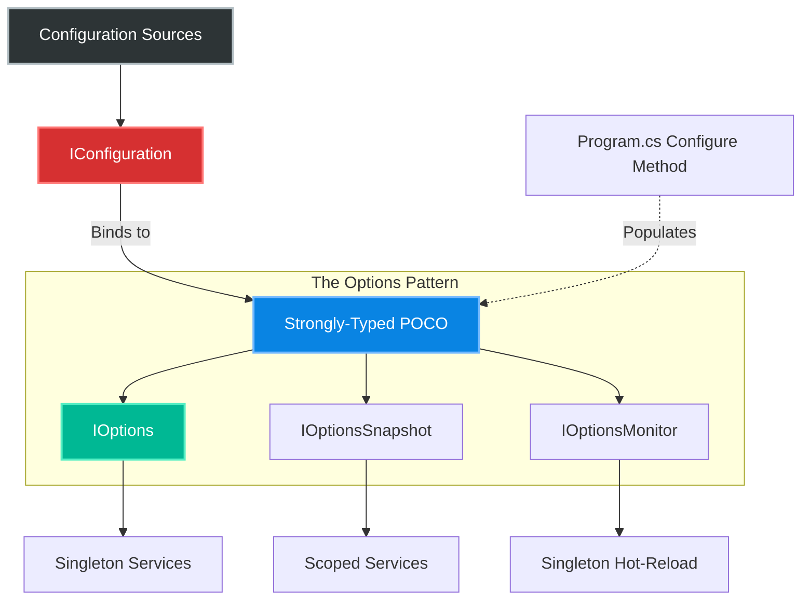

# 4.164 — Configuration: The Options Pattern

## PART 0 — Navigation & Context

```text
ASP.NET Core Domain Hierarchy
├── Configuration Fundamentals
│   ├── 4.004 appsettings.json Hierarchy
│   └── 4.032 Configuration Providers
├── The Options Pattern
│   ├── 4.164 The Options Pattern ◄ YOU ARE HERE
│   ├── 4.165 IOptions Interfaces (Snapshot vs Monitor)
│   └── 4.166 Options Validation
└── Dependency Injection
```

**What you need before this:**
- [[4.004 — appsettings.json Hierarchy]] — Knowing how JSON objects map to configuration key-value pairs.
- [[4.032 — Configuration Providers]] — Understanding that `IConfiguration` aggregates Environment Variables, User Secrets, and JSON files.

**What this unlocks after:**
- [[4.165 — IOptions vs IOptionsSnapshot vs IOptionsMonitor]] — Handling hot-reloads when configuration changes at runtime.
- [[4.166 — Options Validation]] — Throwing exceptions at startup if required configuration (like API Keys) is missing.

**Why this matters to a production engineer at scale:**
Injecting `IConfiguration` directly into your business services is a massive violation of the Interface Segregation Principle (ISP). If your `StripePaymentService` needs a single API key, injecting `IConfiguration` gives it access to database connection strings, JWT secrets, and AWS keys. This makes unit testing a nightmare because you have to mock the entire configuration tree. The Options Pattern solves this by binding configuration sections to strongly-typed POCOs (Plain Old CLR Objects) and injecting only what the specific class needs.

---

## PART 1 — The Core Mental Model

> **The Fundamental Rule**
> **Never inject `IConfiguration` into a Domain or Service class; instead, bind specific configuration sections to strongly-typed classes at startup, and inject those classes using `IOptions<T>` to enforce strong typing, encapsulation, and validation.**

**The Plain-Language Analogy**
Imagine an employee (your Service) who needs to know the company Wi-Fi password to do their job. 
Injecting `IConfiguration` is like handing the employee the Master Safe combination that contains the Wi-Fi password, but also contains the CEO's salary, the bank account routing numbers, and the alarm codes. The employee has to dig through the safe to find the Wi-Fi password.
The Options Pattern is the HR department opening the safe, copying the Wi-Fi password onto a small Post-It note labeled `WiFiOptions`, and handing *only* that note to the employee. The employee gets what they need, and nothing more.

**The Taxonomy Diagram**



---

## PART 2 — Deep Mechanics

### 1. The Binder Engine

The transition from string-based configuration keys (`"PaymentGateway:ApiKey"`) to a C# property (`options.ApiKey`) is performed by the **ConfigurationBinder**.

It uses reflection to:
1. Find public settable properties on the target class.
2. Match them (case-insensitively) to the configuration keys.
3. Perform type conversion (e.g., string `"True"` to `bool true`, `"10"` to `int 10`).

```json
// appsettings.json
{
  "Stripe": {
    "ApiKey": "sk_test_123",
    "TimeoutMs": 5000,
    "RetryEnabled": true
  }
}
```

### 2. The IOptions<T> Wrapper

When you register Options in `Program.cs`, ASP.NET Core does not put your POCO directly into the DI container. It registers an `IOptions<T>` wrapper.

```csharp
// Framework Source Behavior (OptionsManager<T>)
public class OptionsManager<TOptions> : IOptions<TOptions> where TOptions : class
{
    private readonly IOptionsFactory<TOptions> _factory;
    private TOptions _value;

    public TOptions Value
    {
        get
        {
            // Instantiates and binds the class the first time it is requested
            if (_value == null) { _value = _factory.Create(Options.DefaultName); }
            return _value;
        }
    }
}
```

Because `IOptions<T>` is registered as a **Singleton**, the binding process only happens *once*. The first time a class requests `IOptions<StripeOptions>`, the binder reads the JSON, creates the object, and caches it forever.

### 3. Separation of Concerns

By using the Options pattern, your service layers have absolutely no dependency on `Microsoft.Extensions.Configuration`. They only depend on `Microsoft.Extensions.Options` (a much lighter library) and your own POCOs.

### 4. Named Options

If you have multiple APIs that both require `HttpClientOptions` (e.g., one for Stripe, one for PayPal), you can bind the exact same C# class to different configuration sections using **Named Options**. You request them using `IOptionsSnapshot<T>.Get("Stripe")`.

---

## PART 3 — Production Code Patterns

### Pattern 1: Basic Options Binding
The most common and standard way to implement the pattern.

```csharp
// 1. The POCO (Options Class)
// ✅ CORRECT: Pure C# class, no ASP.NET dependencies
public class StripeOptions
{
    // The constant prevents magic string typos in Program.cs
    public const string SectionName = "Stripe"; 

    public string ApiKey { get; set; } = string.Empty;
    public int TimeoutMs { get; set; } = 3000; // Default value
    public bool RetryEnabled { get; set; }
}

// 2. Program.cs Registration
builder.Services.Configure<StripeOptions>(
    builder.Configuration.GetSection(StripeOptions.SectionName));

// 3. Service Injection
public class PaymentProcessor
{
    private readonly StripeOptions _options;

    // ✅ CORRECT: Injecting the IOptions<T> wrapper
    public PaymentProcessor(IOptions<StripeOptions> options)
    {
        // Extract the Value immediately to fail fast if null
        _options = options.Value; 
    }

    public void Process()
    {
        var key = _options.ApiKey; // Strongly typed, intellisense supported
    }
}
```

### Pattern 2: Binding without IOptions (Direct Injection)
If you want to completely eliminate `IOptions<T>` from your Domain services (for absolute purity), you can extract the bound instance and register it directly as a Singleton.

```csharp
// Program.cs
var stripeOptions = new StripeOptions();
// ✅ CORRECT: Manually bind the section to the instance
builder.Configuration.GetSection(StripeOptions.SectionName).Bind(stripeOptions);

// Register the raw POCO directly as a Singleton
builder.Services.AddSingleton(stripeOptions);

// Service
public class PaymentProcessor
{
    private readonly StripeOptions _options;

    // ✅ CORRECT: Cleanest possible signature. Perfect for Unit Testing.
    public PaymentProcessor(StripeOptions options)
    {
        _options = options;
    }
}
```
*Note: Direct injection means you cannot use Hot-Reloading (`IOptionsSnapshot`), so only use it for configuration that never changes without an app restart.*

### Pattern 3: Configure Logic (Post-Processing)
Sometimes configuration values need transformation or computation after being read from JSON.

```csharp
builder.Services.Configure<StripeOptions>(options => 
{
    // You can hardcode values here
    options.TimeoutMs = 10000;
});

// PostConfigure runs AFTER the configuration binder has read from JSON
builder.Services.PostConfigure<StripeOptions>(options =>
{
    // ✅ CORRECT: Computed properties based on bound values
    if (string.IsNullOrEmpty(options.BaseUrl))
    {
        options.BaseUrl = options.IsProduction 
            ? "https://api.stripe.com" 
            : "https://api.test.stripe.com";
    }
});
```

### Pattern 4: Named Options
Using the same configuration class for different sections.

```json
{
  "Payments": { "TimeoutMs": 5000 },
  "Shipping": { "TimeoutMs": 15000 }
}
```

```csharp
// Program.cs
builder.Services.Configure<ApiOptions>("Payments", builder.Configuration.GetSection("Payments"));
builder.Services.Configure<ApiOptions>("Shipping", builder.Configuration.GetSection("Shipping"));

// Service
public class OrderService
{
    private readonly ApiOptions _paymentOptions;
    private readonly ApiOptions _shippingOptions;

    // ✅ CORRECT: Must use IOptionsSnapshot or IOptionsMonitor for Named Options
    public OrderService(IOptionsSnapshot<ApiOptions> optionsFactory)
    {
        _paymentOptions = optionsFactory.Get("Payments");
        _shippingOptions = optionsFactory.Get("Shipping");
    }
}
```

### Pattern 5: Unit Testing with Options
The primary architectural benefit of the Options pattern is making unit tests trivial.

```csharp
[Fact]
public void Process_UsesCorrectApiKey()
{
    // Arrange
    var options = new StripeOptions { ApiKey = "test_key_123" };
    
    // ✅ CORRECT: Microsoft provides a helper to create IOptions wrappers instantly
    var optionsWrapper = Microsoft.Extensions.Options.Options.Create(options);
    
    var service = new PaymentProcessor(optionsWrapper);

    // Act
    service.Process();

    // Assert...
}
```

---

## PART 4 — Gotchas & Anti-Patterns

### Gotcha 1: Injecting IConfiguration Directly
The most pervasive anti-pattern in ASP.NET Core applications.

// ⚠️ WRONG CODE
```csharp
public class EmailService
{
    private readonly IConfiguration _config;

    public EmailService(IConfiguration config) => _config = config;

    public void SendEmail()
    {
        // Magic string. No type safety. Throws NullReferenceException later if missing.
        var host = _config["Smtp:Host"]; 
        var port = int.Parse(_config["Smtp:Port"]); 
    }
}
```

// HTTP consequence (wrong path):
// A typo in `appsettings.json` ("Smtp:Portt") results in `int.Parse(null)`, crashing the background worker. The crash happens *at runtime* when the email tries to send, not at application startup.

// ✅ CORRECT CODE
```csharp
// Use IOptions<SmtpOptions>. 
// If the key is missing, the property falls back to its default value, or throws at startup if Options Validation is configured.
```

### Gotcha 2: Creating a Massive "AppSettings" Class
Developers who migrate from .NET Framework (where `ConfigurationManager.AppSettings` ruled) often create a single massive POCO holding the entire JSON file.

// ⚠️ WRONG CODE
```csharp
public class AppSettings
{
    public DatabaseSettings Database { get; set; }
    public StripeSettings Stripe { get; set; }
    public JwtSettings Jwt { get; set; }
    public LoggingSettings Logging { get; set; }
}

builder.Services.Configure<AppSettings>(builder.Configuration);
```

// HTTP consequence (wrong path):
// The `PaymentService` injects `IOptions<AppSettings>`. It now has access to the Database connection string. We have recreated the Interface Segregation Principle violation, just with strong typing.

// ✅ CORRECT CODE
```csharp
// Break it down!
builder.Services.Configure<StripeSettings>(builder.Configuration.GetSection("Stripe"));
builder.Services.Configure<JwtSettings>(builder.Configuration.GetSection("Jwt"));
// Inject only StripeSettings into PaymentService.
```

### Gotcha 3: Complex Types with Missing Setters
The ConfigurationBinder uses reflection to set properties. If properties are read-only or init-only (without proper configuration), binding silently fails.

// ⚠️ WRONG CODE
```csharp
public class AwsOptions
{
    // Missing setter!
    public string AccessKey { get; } 
}
```

// HTTP consequence (wrong path):
// `AccessKey` is always null. No error is thrown. Application fails to contact AWS.

// ✅ CORRECT CODE
```csharp
public class AwsOptions
{
    public string AccessKey { get; set; } = string.Empty;
}
```

### Gotcha 4: Options Instantiation in Scoped Services
If you manually read configuration in a scoped service using `GetValue`, you are parsing configuration repeatedly.

// ⚠️ WRONG CODE
```csharp
public class ScopedWorker 
{
    public ScopedWorker(IConfiguration config) {
        var timeout = config.GetValue<int>("Timeout"); // Parsed from string to int every request!
    }
}
```

// HTTP consequence (wrong path):
// Under heavy load (10,000 RPS), you execute 10,000 string allocations and `int.Parse` operations per second.

// ✅ CORRECT CODE
```csharp
// IOptions<T> caches the parsed int inside the Singleton wrapper. It is parsed exactly once.
```

### Gotcha 5: Storing Secrets in Source Code via Options Defaults
Developers sometimes hardcode defaults in the POCO to avoid failing locally.

// ⚠️ WRONG CODE
```csharp
public class DatabaseOptions
{
    public string ConnectionString { get; set; } = "Server=prod.db.internal;User=sa;Password=SuperSecret!";
}
```

// HTTP consequence (wrong path):
// If the `appsettings.json` accidentally omits the connection string, the application connects to Production using the hardcoded default. This is disastrous.

// ✅ CORRECT CODE
```csharp
public class DatabaseOptions
{
    public string ConnectionString { get; set; } = string.Empty;
}
// Combine this with DataAnnotations to validate that the connection string is provided by the environment!
```

---

## PART 5 — Performance Implications

### Request Pipeline Characteristics

| Scenario | Pipeline Depth | Allocations Per Request | Approx Latency Impact | Recommendation |
|---|---|---|---|---|
| `IConfiguration.GetValue<T>` | Medium | High (String parsing) | ~0.05ms | Avoid inside hot paths. |
| `IOptions<T>.Value` | Shallow | 0 | 0ms | Perfect. Singleton cache read. |
| Direct Injection `T` | Shallow | 0 | 0ms | Perfect. Raw reference read. |

### BenchmarkDotNet Code

```csharp
using BenchmarkDotNet.Attributes;
using Microsoft.Extensions.Configuration;
using Microsoft.Extensions.Options;

[MemoryDiagnoser]
public class OptionsBenchmark
{
    private IConfiguration _config;
    private IOptions<TestOptions> _options;

    public class TestOptions { public int Timeout { get; set; } }

    [GlobalSetup]
    public void Setup()
    {
        var builder = new ConfigurationBuilder();
        builder.AddInMemoryCollection(new Dictionary<string, string> { { "Timeout", "5000" } });
        _config = builder.Build();

        var services = new ServiceCollection();
        services.Configure<TestOptions>(_config);
        _options = services.BuildServiceProvider().GetRequiredService<IOptions<TestOptions>>();
    }

    [Benchmark(Baseline = true)]
    public int ReadFromIConfiguration()
    {
        // Reads string, parses to int
        return _config.GetValue<int>("Timeout");
    }

    [Benchmark]
    public int ReadFromIOptions()
    {
        // Reads cached int property directly
        return _options.Value.Timeout;
    }
}

// Expected output (approximate, .NET 8, x64, local):
// Method                  | Mean      | Error     | StdDev    | Gen0   | Allocated |
// ----------------------- |----------:|----------:|----------:|-------:|----------:|
// ReadFromIConfiguration  | 145.2 ns  |  2.5 ns   |  2.4 ns   | 0.0152 |      96 B |
// ReadFromIOptions        |   0.1 ns  |  0.01 ns  |  0.01 ns  | 0.0000 |       0 B |
```

**When to Care:** The Options pattern is literally 1,400x faster than `IConfiguration` reading. It allocates 0 bytes. If your code executes in a tight loop (e.g., checking a configuration toggle per record in a batch of 100,000 items), `IOptions` is mandatory.
**When this saves you:** Not just in compute latency, but in memory pressure. Reading from `IConfiguration` allocates strings. `IOptions` reads a static pointer.

---

## PART 6 — Interview Arsenal

### A. The Question Bank

**Question 1:** "Why is injecting `IConfiguration` directly into a business service considered an anti-pattern?"
- **Average Answer:** "Because it makes unit testing hard."
- **Why That's Insufficient:** Doesn't explain the architectural violation.
- **Great Answer:** "Injecting `IConfiguration` violates the Interface Segregation Principle. A service handling Stripe payments only needs the Stripe API key, but `IConfiguration` gives it access to every connection string and secret in the application. Furthermore, it lacks type safety—relying on magic strings (like `_config[\"Stripe:ApiKey\"]`) and forcing runtime parsing. The Options pattern solves this by mapping config sections to strongly-typed POCOs at startup, giving the service exactly what it needs and nothing more."

**Question 2:** "If you register `builder.Services.Configure<MyOptions>(...)`, when is the configuration JSON actually parsed and mapped to the C# class?"
- **Average Answer:** "When the application starts up."
- **Why That's Insufficient:** The configuration binder is actually lazy by default when using `IOptions<T>`.
- **Great Answer:** "It's parsed lazily. `IOptions<T>` is registered as a Singleton. The parsing and mapping logic executes the very first time a service requests `IOptions<MyOptions>.Value`. Once it is constructed, the object is cached for the lifetime of the application. (Note: If using Options Validation with `.ValidateOnStart()`, this behavior changes and parsing is forced eagerly during the application boot process)."

**Question 3:** "How do you unit test a class that takes `IOptions<EmailOptions>` in its constructor?"
- **Average Answer:** "You mock the `IOptions` interface using Moq."
- **Why That's Insufficient:** Mocking simple data wrappers is unnecessary overhead.
- **Great Answer:** "There's no need to use a mocking framework for `IOptions`. Microsoft provides a static helper method: `Options.Create(new EmailOptions { ... })`. This instantly returns an `IOptions<EmailOptions>` wrapper holding the data you instantiate, making the 'Arrange' phase of the unit test extremely clean and completely decoupled from DI containers or configuration builders."

### B. The Trick Questions

**Trick Question:** "If I change the `TimeoutMs` value in `appsettings.json` while the ASP.NET Core application is running, will my `IOptions<StripeOptions>` automatically pick up the new value?"
- **The Trap:** Conflating `IOptions` with `IOptionsMonitor`.
- **The Correct Answer:** "No. `IOptions<T>` is a Singleton. It reads the configuration once and caches it forever. To support hot-reloading of configuration changes without restarting the application, you must inject `IOptionsSnapshot<T>` (for Scoped resolution) or `IOptionsMonitor<T>` (for Singleton event-driven resolution)."

**Trick Question:** "I have a configuration value `"MaxRetries": "Five"`. What happens when the binder tries to map this to `public int MaxRetries { get; set; }`?"
- **The Trap:** Believing the binder throws exceptions automatically.
- **The Correct Answer:** "The binder will silently fail to convert the string 'Five' to an integer. It will swallow the conversion exception, and the `MaxRetries` property will remain at its default value (0). To catch this, you must use Options Validation or DataAnnotations to ensure the final bound object meets your requirements."

### C. Red Flags to Avoid
- 🚩 **"I pass `IConfiguration` to my domain layer."** (Couples the domain layer to ASP.NET Core infrastructure packages).
- 🚩 **"I created a static `ConfigManager` class that reads from `appsettings`."** (Reverts to .NET Framework legacy patterns, making the application impossible to test concurrently).

---

## PART 7 — Decision Framework

```mermaid
graph TD
    A[Need Configuration Value] --> B{Does the service need hot-reloading?}
    
    B -->|Yes| C[See Topic 4.165]
    B -->|No| D{Do you want pure DI?}
    
    D -->|Yes| E[Direct POCO Injection]
    E --> E1[Configuration.Bind()]
    E --> E2[services.AddSingleton(poco)]
    
    D -->|No, standard wrapper| F["Use IOptions<T>"]
    F --> F1[services.Configure<T>()]
    
    F --> G{Multiple instances of same type?}
    G -->|Yes e.g. API Clients| H[Use Named Options]
    G -->|No| I[Standard IOptions<T>]
    
    style A fill:#2d3436,stroke:#fff
    style E fill:#00b894,stroke:#fff
    style I fill:#0984e3,stroke:#fff
    style H fill:#d63031,stroke:#fff
```

---

## PART 8 — Self-Check

### A. Conceptual Questions
1. How does the Options pattern solve the Interface Segregation Principle violation caused by `IConfiguration`?
2. What C# library performs the actual property-to-JSON mapping?
3. Why does `IOptions<T>` perform better than `IConfiguration.GetValue<T>` in a `for` loop?
4. When are the JSON values actually mapped to the POCO when using `IOptions<T>`?
5. How do you inject an Options class into a service without using the `IOptions<T>` wrapper?
6. What is the purpose of the `PostConfigure` method?
7. How does ASP.NET Core handle matching a property named `ApiKey` to a JSON key named `apikey`?
8. How do you unit test an `IOptions<T>` dependency cleanly?

### B. Code Puzzles

**Puzzle 1: The Missing Wrapper**
```csharp
builder.Services.Configure<MailOptions>(builder.Configuration.GetSection("Mail"));

public class MailService {
    public MailService(MailOptions options) { } 
}
```
*Scenario:* App crashes on startup.
<details>
<summary>Answer</summary>
The DI container cannot resolve `MailOptions`. `Configure<T>` registers `IOptions<T>`, `IOptionsSnapshot<T>`, and `IOptionsMonitor<T>`. It does NOT register the raw `T` POCO. 
*Fix:* Inject `IOptions<MailOptions>` and read `.Value`.
</details>

**Puzzle 2: The Typo**
```json
{ "Stripe": { "Api_Key": "sk_test" } }
```
```csharp
public class StripeOptions { public string ApiKey { get; set; } }
```
*Scenario:* The property is empty.
<details>
<summary>Answer</summary>
The binder is case-insensitive, but it does NOT remove underscores or convert snake_case to PascalCase automatically by default in standard binding. The JSON key must match `ApiKey` (or `apikey`, `APIKEY`).
*Fix:* Change the JSON to `"ApiKey": "sk_test"`.
</details>

**Puzzle 3: The Magic String Bug**
```csharp
builder.Services.Configure<CacheOptions>(builder.Configuration.GetSection("CacheSettings"));
```
*Scenario:* A month later, another developer renames the JSON section to `"RedisCache"`. The app compiles but cache options are empty.
<details>
<summary>Answer</summary>
Because the section name is a hardcoded string in `Program.cs`, it decoupled from the class.
*Fix:* Define `public const string SectionName = "RedisCache";` inside the POCO and use `GetSection(CacheOptions.SectionName)`.
</details>

**Puzzle 4: Overwriting Defaults**
```csharp
public class RetryOptions { public int Max = 3; }
```
```json
{ "RetryOptions": { "Timeout": 5 } }
```
*Scenario:* `Max` is omitted from the JSON. What is its value at runtime?
<details>
<summary>Answer</summary>
It will be 3. The binder does not instantiate a null object. It news up the POCO (which initializes `Max` to 3), and then applies matching values from JSON. Since `Max` is missing in JSON, it retains its instantiated default.
</details>

---

## PART 9 — Connections & Resources

### A. Related Topics Table

| Topic | Why It Connects |
|---|---|
| [[4.004 — appsettings.json Hierarchy]] | Where the configuration data originates before binding. |
| [[4.165 — IOptions vs IOptionsSnapshot vs IOptionsMonitor]] | The next evolution of this pattern, adding hot-reloading capabilities. |
| [[4.166 — Options Validation]] | Adding DataAnnotations to the POCOs defined here. |

### B. Books

| Book | Chapters | Why These Chapters |
|---|---|---|
| ASP.NET Core in Action, 3rd Ed | Chapter 10: Configuration | Extensive breakdown of the ConfigurationBinder. |
| Pro ASP.NET Core 6 | Chapter 13: Configuration | Details on Direct Injection vs IOptions. |

### C. Essential Articles & Docs
- [Microsoft Docs: Options pattern in ASP.NET Core](https://learn.microsoft.com/en-us/aspnet/core/fundamentals/configuration/options)
- [Andrew Lock: Introducing IOptions](https://andrewlock.net/how-to-use-the-ioptions-pattern-for-configuration-in-asp-net-core-rc2/)

> [!NOTE]
> **Template Meta-Note**
> Part 0: Context & Prerequisites. Part 1: Core Mental Model. Part 2: Deep Mechanics & Pipeline. Part 3: Production Code. Part 4: Gotchas. Part 5: Performance. Part 6: Interview Arsenal. Part 7: Decision Framework. Part 8: Puzzles. Part 9: Resources.
