# 4.165 — IOptions vs IOptionsSnapshot vs IOptionsMonitor

## PART 0 — Navigation & Context

```text
ASP.NET Core Domain Hierarchy
├── Configuration
│   ├── 4.164 The Options Pattern
│   ├── 4.165 Interfaces: Snapshot vs Monitor ◄ YOU ARE HERE
│   └── 4.166 Options Validation
└── Dependency Injection
    └── 4.042 Captive Dependencies
```

**What you need before this:**
- A deep understanding of the base Options Pattern [[4.164 — Configuration The Options Pattern]] and how `builder.Services.Configure<T>` binds raw JSON files to strongly typed C# objects.
- Comprehensive knowledge of Dependency Injection lifecycles: Transient, Scoped, and Singleton, and the restrictions of injecting scoped services into singletons.
- Familiarity with Configuration Providers like Azure App Configuration, AWS Parameter Store, and standard `appsettings.json`.

**What this unlocks after:**
- The ability to implement dynamic Feature Toggles, allowing product managers to release features to production instantly without restarting IIS, Kestrel, or Kubernetes pods.
- Designing high-availability systems that seamlessly rotate their API keys, database connection strings, or SMTP credentials dynamically at runtime.
- The capability to design ultra-performant BackgroundServices that read live configuration safely.

**Why this matters to a production engineer at scale:**
When a system handles thousands of requests per second, taking the application offline to change a configuration value is unacceptable. If a third-party API rate limit is suddenly throttling you, you might need to change your application's `RetryTimeoutMs` from `500` to `2000` immediately. 
If you inject the default `IOptions<T>`, changing the value in `appsettings.json` (or your cloud configuration provider) does absolutely nothing. The application caches the `IOptions<T>` Singleton indefinitely. You are forced to trigger a rolling restart of all your Kubernetes pods, causing massive disruption.
By mastering `IOptionsSnapshot<T>` and `IOptionsMonitor<T>`, you enable "Hot Reloading." The application will gracefully detect the external configuration change, load the new values into memory, and begin applying them instantly without dropping a single HTTP connection. Understanding the nuanced differences between these two dynamic interfaces—specifically how they interact with Dependency Injection scopes and race conditions—is a hallmark of a senior .NET engineer.

---

## PART 1 — The Core Mental Model

> **The Fundamental Rule**
> **`IOptions<T>` is a Singleton that reads configuration exactly once at startup and caches it forever. `IOptionsSnapshot<T>` is a Scoped service that reads the latest configuration exactly once at the beginning of each HTTP request, holding it perfectly consistent (frozen) for the lifetime of that request. `IOptionsMonitor<T>` is a Singleton that provides completely real-time access to the latest configuration and actively fires `.OnChange()` events whenever the underlying configuration source detects an update.**

**The Plain-Language Analogy**
Imagine a bustling restaurant where the manager changes menu prices dynamically based on ingredient supply.

- **`IOptions` (The Laminated Printed Menu):** The waiter reads the laminated menu at 8:00 AM when their shift starts, memorizes the prices, and quotes those exact prices all day. If the manager changes the price of steak in the computer at noon, the waiter doesn't care. They only check the computer again if they are fired and re-hired the next day (Application Restart).
- **`IOptionsSnapshot` (The Customer Chalkboard):** When a new customer sits down at a table, the waiter immediately walks to the front chalkboard and checks the current prices. If the steak is $30, the waiter quotes $30 for the entire duration of *that specific customer's meal*. If the manager updates the chalkboard to $35 halfway through the meal, the waiter ignores it to ensure the customer isn't surprised by a price change mid-meal. The waiter only uses the new $35 price for the *next* customer who walks in.
- **`IOptionsMonitor` (The Manager's Digital Tablet):** The waiter carries a digital tablet connected directly to the manager's live database. The tablet instantly updates the moment the manager types in a new price. The waiter can look at the tablet at any second and see the absolute most recent price, even right in the middle of taking a single table's order. Furthermore, the tablet beeps (an Event) to explicitly warn the waiter that a change just occurred.

**The Taxonomy Diagram**

```mermaid
graph TD
    A[Options Pattern Interfaces] --> B["IOptions<T>"]
    A --> C["IOptionsSnapshot<T>"]
    A --> D["IOptionsMonitor<T>"]
    
    B --> B1[Singleton DI Lifecycle]
    B --> B2[Reads Once at Startup]
    B --> B3[Highest Performance]
    B --> B4[No Named Options Support]
    
    C --> C1[Scoped DI Lifecycle]
    C --> C2[Re-computes per HTTP Request]
    C --> C3[Guarantees Consistency during Request]
    C --> C4[Supports Named Options]
    
    D --> D1[Singleton DI Lifecycle]
    D --> D2[Real-time Hot Reload via .CurrentValue]
    D --> D3[Supports explicit .OnChange() Events]
    D --> D4[Supports Named Options]
    D --> D5[Risk of Torn State in single transaction]
    
    style A fill:#2d3436,stroke:#b2bec3,stroke-width:2px,color:#fff
    style B fill:#0984e3,stroke:#74b9ff,stroke-width:2px,color:#fff
    style C fill:#00b894,stroke:#55efc4,stroke-width:2px,color:#fff
    style D fill:#d63031,stroke:#ff7675,stroke-width:2px,color:#fff
```

---

## PART 2 — Deep Mechanics

### 2.1 — The Prerequisite: `reloadOnChange: true`
Before understanding the interfaces, you must understand the underlying configuration system. The Options Pattern does not magically watch the file system. It relies entirely on the `IConfigurationRoot`.
If the configuration root doesn't know the file changed, `IOptionsMonitor` will never trigger.

```csharp
// The default WebApplicationBuilder enables this automatically for appsettings.json
builder.Configuration.AddJsonFile("appsettings.json", optional: false, reloadOnChange: true);

// If you load custom files, you MUST specify reloadOnChange: true
builder.Configuration.AddJsonFile("features.json", optional: true, reloadOnChange: true);
```

**Framework Source Behavior:** When `reloadOnChange` is set to true, ASP.NET Core registers a `FileSystemWatcher` on Windows/Linux. When the file is saved to disk, the watcher trips an `IChangeToken`. The `ConfigurationRoot` catches this token, flushes its internal dictionary, and re-reads the JSON file from disk into memory. Only after the `IConfigurationRoot` is updated does it signal the Options subsystem.

### 2.2 — Under the Hood: `IOptions<T>`
`IOptions<T>` is registered in the dependency injection container as a Singleton.

```csharp
// Simplified ASP.NET Core Source Code
public class OptionsManager<TOptions> : IOptions<TOptions> where TOptions : class
{
    private readonly IOptionsFactory<TOptions> _factory;
    private TOptions _value; // The cached instance

    public TOptions Value
    {
        get
        {
            if (_value == null)
            {
                // Instantiates the class and binds the config exactly once
                _value = _factory.Create(Options.DefaultName); 
            }
            return _value;
        }
    }
}
```
Because the POCO is cached in a private field `_value` after the first access, even when the `ConfigurationRoot` reloads the dictionary from disk, `IOptions<T>` completely ignores it. The value is permanently locked in.

### 2.3 — Under the Hood: `IOptionsSnapshot<T>`
`IOptionsSnapshot<T>` is registered in the dependency injection container as a Scoped service.

```csharp
// Simplified ASP.NET Core Source Code
public class OptionsSnapshot<TOptions> : IOptionsSnapshot<TOptions> where TOptions : class
{
    private readonly IOptionsFactory<TOptions> _factory;
    private readonly IOptionsCache<TOptions> _cache; // A cache tied to the Scoped lifetime!

    public TOptions Value => Get(Options.DefaultName);

    public TOptions Get(string name)
    {
        // Checks the scoped cache. If missing, creates it from the LIVE configuration root.
        return _cache.GetOrAdd(name, () => _factory.Create(name));
    }
}
```
**The Consistency Guarantee:** If your Controller asks for `IOptionsSnapshot`, and then later calls a Domain Service that also asks for `IOptionsSnapshot`, they are guaranteed to receive the *exact same values*, even if the JSON file on disk changed 1 millisecond between the two resolutions. The values are frozen for the lifetime of the specific HTTP request because the `_cache` is Scoped to the request.

### 2.4 — Under the Hood: `IOptionsMonitor<T>`
`IOptionsMonitor<T>` is registered in the dependency injection container as a Singleton, just like `IOptions<T>`.

```csharp
// Simplified ASP.NET Core Source Code
public class OptionsMonitor<TOptions> : IOptionsMonitor<TOptions>, IDisposable where TOptions : class
{
    private readonly IOptionsCache<TOptions> _cache; // A global Singleton cache
    private readonly IOptionsFactory<TOptions> _factory;
    private readonly IDisposable _changeTokenRegistration;

    public TOptions CurrentValue => Get(Options.DefaultName);

    public TOptions Get(string name)
    {
        return _cache.GetOrAdd(name, () => _factory.Create(name));
    }

    // INTERNAL EVENT HANDLER:
    // When the ConfigurationRoot fires the change token, this method is invoked,
    // which clears the entire Singleton cache!
    private void InvokeChanged()
    {
        _cache.Clear(); // Next time CurrentValue is called, it rebuilds from the live config!
        // Also fires all delegates registered via the public .OnChange() method
    }
}
```
Unlike `IOptionsSnapshot`, `IOptionsMonitor` does NOT freeze the value per request. If you read `CurrentValue` at the top of a method, and read `CurrentValue` again at the bottom of the method, the value might be entirely different if the file was updated during execution. This introduces the risk of "Torn State".

---

## PART 3 — Production Code Patterns

### Pattern 1: High-Performance Singleton Configurations
When a setting (like a database schema name, a specific external API URL, or the application instance ID) fundamentally cannot change without a restart, use `IOptions<T>`. It is the most performant and communicates clearly to other developers that this value is immutable.

```csharp
public class DatabaseService
{
    private readonly DbOptions _options;

    // ✅ CORRECT: Injecting IOptions for truly immutable data
    public DatabaseService(IOptions<DbOptions> options)
    {
        // Extract immediately in the constructor
        _options = options.Value; 
    }
    
    public void Connect() 
    {
        // Uses the cached schema name rapidly
        var schema = _options.Schema;
        // ... connection logic
    }
}
```

### Pattern 2: Safely Hot-Reloading in Web Controllers (The Snapshot Pattern)
When a setting (like a Feature Toggle) can change, but you need absolute consistency during a single HTTP request to prevent weird transactional errors, use `IOptionsSnapshot<T>`.

```csharp
[ApiController]
[Route("api/[controller]")]
public class FeatureController : ControllerBase
{
    private readonly FeatureOptions _options;

    // ✅ CORRECT: Injecting IOptionsSnapshot into a Controller (Scoped by definition)
    public FeatureController(IOptionsSnapshot<FeatureOptions> options)
    {
        _options = options.Value; // Extract immediately
    }

    [HttpGet("checkout")]
    public IActionResult Get()
    {
        // Guaranteed to be consistent for the lifetime of this request
        if (_options.EnableNewCheckout) 
        {
            return Ok("New Checkout Pipeline");
        }
        return Ok("Legacy Checkout Pipeline");
    }
}
```
*Action:* A product manager edits `appsettings.json` and changes `EnableNewCheckout` to `true`.
*Result:* The very next HTTP request will hit the Controller, `IOptionsSnapshot` will re-read the configuration from the root, bind the new values, and return "New Checkout Pipeline". Zero downtime.

### Pattern 3: Hot-Reloading in Background Workers (The Monitor Pattern)
Background Services (like RabbitMQ consumers or periodic timers) run as Singletons. You **cannot** inject `IOptionsSnapshot` (a Scoped service) into a Singleton. You must use `IOptionsMonitor<T>`.

```csharp
public class PaymentQueueWorker : BackgroundService
{
    private readonly IOptionsMonitor<JobOptions> _optionsMonitor;

    // ✅ CORRECT: Injecting IOptionsMonitor into a Singleton BackgroundService
    public PaymentQueueWorker(IOptionsMonitor<JobOptions> optionsMonitor)
    {
        _optionsMonitor = optionsMonitor; // CACHE THE MONITOR, NOT THE VALUE!
    }

    protected override async Task ExecuteAsync(CancellationToken stoppingToken)
    {
        while (!stoppingToken.IsCancellationRequested)
        {
            // ✅ CORRECT: Always read CurrentValue dynamically inside the active loop
            var batchSize = _optionsMonitor.CurrentValue.BatchSize;
            
            await ProcessBatchAsync(batchSize);
            await Task.Delay(1000, stoppingToken);
        }
    }
}
```
*Action:* An engineer notices the queue is backing up. They edit `appsettings.json`, changing `BatchSize` from 10 to 50.
*Result:* On the next loop iteration (maximum 1 second later), `CurrentValue` returns 50. The worker automatically scales up its consumption rate without any restarts.

### Pattern 4: Reacting to Configuration Changes (The OnChange Event)
Sometimes reading `CurrentValue` dynamically isn't enough. If the configuration dictates an `HttpClient` Timeout or an `SmtpClient` host, changing the config value doesn't magically update the existing unmanaged object already sitting in memory. You must actively listen for the change event and rebuild the object.

```csharp
public class EmailService : IDisposable
{
    private SmtpClient _smtpClient;
    private readonly IDisposable _optionsListener;

    public EmailService(IOptionsMonitor<EmailOptions> optionsMonitor)
    {
        // 1. Initial build
        _smtpClient = CreateClient(optionsMonitor.CurrentValue);

        // 2. ✅ CORRECT: Subscribing to the change event
        _optionsListener = optionsMonitor.OnChange(newOptions =>
        {
            Console.WriteLine("Email options changed. Reconnecting SMTP Client...");
            
            var oldClient = _smtpClient;
            
            // Re-instantiate the unmanaged resource using the new settings
            _smtpClient = CreateClient(newOptions);
            
            // Dispose the old client to prevent connection leaks
            oldClient.Dispose();
        });
    }

    private SmtpClient CreateClient(EmailOptions options) { /* Connects to SMTP */ return new SmtpClient(); }

    public void Dispose()
    {
        // 3. Prevent severe memory leaks by unsubscribing from the static ConfigurationRoot!
        _optionsListener?.Dispose();
        _smtpClient?.Dispose();
    }
}
```

### Pattern 5: Named Options Resolution
If you configure `"PaymentAPI"` and `"ShippingAPI"` settings in `appsettings.json` to both bind to the exact same `ApiOptions` C# class, only `Snapshot` and `Monitor` allow you to retrieve them by name. The basic `IOptions` interface does not support named options.

```csharp
public class ApiOrchestrator
{
    private readonly ApiOptions _paymentOptions;
    private readonly ApiOptions _shippingOptions;
    
    // ✅ CORRECT: IOptionsSnapshot supports the .Get(name) method. IOptions does NOT.
    public ApiOrchestrator(IOptionsSnapshot<ApiOptions> snapshot)
    {
        _paymentOptions = snapshot.Get("PaymentAPI");
        _shippingOptions = snapshot.Get("ShippingAPI");
    }
}
```

---

## PART 4 — Gotchas & Anti-Patterns

### Gotcha 1: The Captive Dependency Crash
This is the most frequent crash when junior developers discover hot-reloading. They attempt to swap `IOptions` for `IOptionsSnapshot` inside a `BackgroundService` to get live updates.

// ⚠️ WRONG CODE
```csharp
public class QueueProcessor : BackgroundService
{
    private readonly QueueOptions _options;

    // 💥 DI Exception at startup!
    public QueueProcessor(IOptionsSnapshot<QueueOptions> snapshot)
    {
        _options = snapshot.Value;
    }
}
```

// HTTP consequence (wrong path):
// The application refuses to boot, throwing: `InvalidOperationException: Cannot consume scoped service 'IOptionsSnapshot' from singleton 'QueueProcessor'.`

// ✅ CORRECT CODE
```csharp
// BackgroundService is a Singleton. You MUST use IOptionsMonitor<T>
public QueueProcessor(IOptionsMonitor<QueueOptions> monitor)
```

// WHY: `IOptionsSnapshot` is structurally tied to the HTTP Request boundary (Scope). A BackgroundWorker runs in the background, entirely decoupled from any HTTP request. It has no DI Scope unless you manually create one. Therefore, the DI container protects you by blocking the injection.

### Gotcha 2: Extracting Monitor Values in Constructors
Developers correctly inject `IOptionsMonitor` into a Singleton, but then extract the value inside the constructor and cache the raw POCO in a field.

// ⚠️ WRONG CODE
```csharp
public class MyService
{
    private readonly MyOptions _options; // Cached POCO

    public MyService(IOptionsMonitor<MyOptions> monitor)
    {
        // 💥 Defeats the entire purpose of IOptionsMonitor
        _options = monitor.CurrentValue; 
    }

    public void DoWork() {
        Console.WriteLine(_options.Setting); // Will NEVER change!
    }
}
```

// HTTP consequence (wrong path):
// The developer edits `appsettings.json` in production. They wait for the logs to reflect the new behavior. Nothing happens. They mistakenly assume hot-reload is broken in ASP.NET Core.

// ✅ CORRECT CODE
```csharp
public class MyService
{
    private readonly IOptionsMonitor<MyOptions> _monitor;

    public MyService(IOptionsMonitor<MyOptions> monitor)
    {
        _monitor = monitor; // CACHE THE MONITOR, NOT THE VALUE!
    }

    public void DoWork() {
        // Read CurrentValue exactly when you need it
        Console.WriteLine(_monitor.CurrentValue.Setting); 
    }
}
```

// WHY: `CurrentValue` computes the state of the configuration *at the exact millisecond the getter is called*. If you call it in the constructor of a Singleton, you only compute it once at application startup, perfectly mimicking the behavior of the static `IOptions`, thus destroying the hot-reload capability.

### Gotcha 3: Catastrophic Memory Leaks with `.OnChange()`
If a Transient or Scoped service (like an MVC Controller) subscribes to `IOptionsMonitor.OnChange`, you will create a severe memory leak that will take down your server.

// ⚠️ WRONG CODE
```csharp
// Registered as Scoped (e.g., a Controller or a Scoped DbContext)
public class ScopedReportGenerator
{
    public ScopedReportGenerator(IOptionsMonitor<ReportOptions> monitor)
    {
        // 💥 Massive Memory Leak!
        monitor.OnChange(options => { 
            // Reconfigure report generator
        });
    }
}
```

// HTTP consequence (wrong path):
// On every single HTTP request, a brand new `ScopedReportGenerator` is instantiated. In its constructor, it adds an anonymous delegate to `IOptionsMonitor`'s internal event list. Because `IOptionsMonitor` is a Singleton, it lives forever, and holds a strong reference to that delegate. The GC cannot clean up the `ScopedReportGenerator` even after the HTTP request ends. At 500 requests per second, you add 500 delegates to the monitor per second. The server crashes with `OutOfMemoryException` within an hour.

// ✅ CORRECT CODE
// 1. Never use `.OnChange()` in Scoped or Transient services. Just rely on `IOptionsSnapshot`.
// 2. If you absolutely must use it in a Singleton, ALWAYS capture the `IDisposable` returned by `OnChange()`, and call `.Dispose()` when your parent service shuts down.

### Gotcha 4: Inconsistent Snapshot Reads (Torn State)
If you use `IOptionsMonitor` instead of `IOptionsSnapshot` inside a Controller (Scoped environment), you expose the application to torn state corruption.

// ⚠️ WRONG CODE
```csharp
public class CheckoutController : ControllerBase
{
    private readonly IOptionsMonitor<TaxOptions> _monitor;

    [HttpPost]
    public IActionResult ProcessPayment()
    {
        // Read 1: Returns 10%
        var displayTax = _monitor.CurrentValue.Rate; 
        
        // ... (File changes on disk exactly at this moment to 15%) ...
        
        // Read 2: Returns 15%!
        var finalBilledTax = _monitor.CurrentValue.Rate; 
        
        // Math fails, receipt displays 10%, but customer is billed 15%
    }
}
```

// HTTP consequence (wrong path):
// Critical data corruption and financial discrepancies due to torn configuration state within a single atomic business transaction.

// ✅ CORRECT CODE
// Inside Scoped services (like Controllers), ALWAYS use `IOptionsSnapshot<T>`. It freezes the value at the start of the HTTP request, guaranteeing 100% consistency throughout the entire request, regardless of file changes on disk.

### Gotcha 5: File System Watcher Limits in Kubernetes
When running ASP.NET Core in Linux containers (Kubernetes) and mounting `appsettings.json` via a ConfigMap, `reloadOnChange: true` frequently fails to fire.

// HTTP consequence (wrong path):
// You edit the Kubernetes ConfigMap, the pod receives the updated file via symlink rotation, but the ASP.NET Core application never reloads the options.

// ✅ THE FIX:
// Kubernetes ConfigMaps update via symlink modifications in Linux. The standard .NET `FileSystemWatcher` sometimes misses these complex inotify events depending on the container runtime. You may need to use an explicit polling package, or switch to a robust cloud provider like **Azure App Configuration**. Azure App Config allows you to configure an explicit refresh interval (e.g., poll every 30 seconds) or use Event Grid push notifications to guarantee that ASP.NET Core is aware of the change.

---

## PART 5 — Performance Implications

### Request Pipeline Characteristics

| Scenario | Pipeline Depth | Allocations Per Request | Approx Latency Impact | Recommendation |
|---|---|---|---|---|
| `IOptions<T>` | Shallow | 0 | 0ms | Fastest. Always use for static settings. |
| `IOptionsSnapshot<T>` | Scoped | ~1 (Scoped Cache check) | < 0.05ms | Industry Standard for Web API Controllers. |
| `IOptionsMonitor<T>.CurrentValue`| Singleton | 0 (Atomic cache read) | < 0.01ms | Industry Standard for Background Workers. |

### BenchmarkDotNet Conceptualization

```csharp
// Expected output (approximate, .NET 8, x64, local machine):
// Method       | Mean      | Error     | StdDev    | Gen0   | Allocated |
// ------------ |----------:|----------:|----------:|-------:|----------:|
// ReadOptions  | 0.00 ns   | 0.00 ns   | 0.00 ns   | 0.0000 |       0 B |
// ReadMonitor  | 0.05 ns   | 0.01 ns   | 0.01 ns   | 0.0000 |       0 B |
// ReadSnapshot | 2.45 ns   | 0.12 ns   | 0.11 ns   | 0.0000 |       0 B |
```

**When to Care:** Almost Never. All three interfaces are incredibly optimized by the Microsoft engineering team. The caching mechanics ensure that you are never actually parsing the JSON file, performing string reflection, or executing file I/O during these property reads. The performance difference between them is literally measured in sub-nanoseconds. You should choose the interface based strictly on Architectural Lifecycles (Scope vs Singleton) and Data Consistency requirements (Torn State prevention), not execution speed.

---

## PART 6 — Interview Arsenal

### A. The Question Bank

**Question 1:** "If you want your application to pick up changes made to `appsettings.json` without restarting the server, which options interface should you use in an MVC Controller?"
- **Average Answer:** "You use `IOptionsMonitor` because it tracks live changes."
- **Why That's Insufficient:** Using `IOptionsMonitor` in a Controller introduces the risk of torn state.
- **Great Answer:** "In an MVC Controller, you should inject `IOptionsSnapshot<T>`. Because a controller is instantiated per HTTP request, `IOptionsSnapshot` (which is registered as a Scoped service) ensures that the configuration values are re-read from the configuration root at the very start of the request, but then frozen for the lifetime of that specific request. This provides excellent hot-reloading capability between requests while completely preventing 'torn state' where a configuration value changes halfway through executing a single atomic business transaction."

**Question 2:** "Why can't you simply use `IOptionsSnapshot` inside a `BackgroundService` to get hot-reloading?"
- **Average Answer:** "Because `BackgroundService` is a Singleton."
- **Why That's Insufficient:** Doesn't explain the DI failure mode or the specific alternative.
- **Great Answer:** "A `BackgroundService` is registered as a Singleton, meaning it lives for the entire lifecycle of the application. `IOptionsSnapshot` is strictly registered as a Scoped service. ASP.NET Core's Dependency Injection container explicitly forbids injecting Scoped services into Singletons (this is the Captive Dependency problem), and it will throw an `InvalidOperationException` at startup, crashing the app. To get hot-reloading inside a Singleton worker, you must inject `IOptionsMonitor<T>` and read its `.CurrentValue` dynamically inside your continuous `ExecuteAsync` loop."

**Question 3:** "If `IOptionsMonitor<T>` provides real-time updates via the `.CurrentValue` property, why does the `.OnChange()` method even exist?"
- **Average Answer:** "So you can log to the console when the file changes."
- **Why That's Insufficient:** Misses the architectural necessity of reacting to stateful object recreation.
- **Great Answer:** "While `CurrentValue` works flawlessly for primitive values (like checking `if (options.FeatureEnabled)` in an `if` statement), it does not work for stateful or unmanaged objects instantiated based on configuration. For example, if you use configuration options to initialize an `SmtpClient`, an `HttpClient`, or a physical hardware connection string at startup, simply reading `CurrentValue` later won't magically update the existing unmanaged connection that is already open. You must explicitly subscribe to `.OnChange()`, manually dispose of the old `SmtpClient` connection, and instantiate a brand new one using the updated configuration values."

### B. The Trick Questions

**Trick Question:** "I am using `IOptionsSnapshot` perfectly. I updated `appsettings.json` in production, but the values didn't change on the next request. I checked my DI and it's correct. What is architecturally wrong?"
- **The Trap:** Focusing entirely on the Options pattern while ignoring the underlying Configuration Provider foundation.
- **The Correct Answer:** "The Options pattern can only react if the underlying Configuration Provider signals a change token. When building the configuration, you must ensure that `reloadOnChange: true` was passed to the `AddJsonFile()` method in `Program.cs`. If it was false (which is often the case for custom file loads), the configuration root completely ignores file system events, rendering `IOptionsSnapshot` and `IOptionsMonitor` completely static and useless."

**Trick Question:** "Can I register an event handler on `IOptionsSnapshot.OnChange()` to log when my controller settings change?"
- **The Trap:** Assuming all hot-reload interfaces share the exact same methods.
- **The Correct Answer:** "No. `IOptionsSnapshot<T>` does not have an `OnChange` method. Because it is a Scoped service that fundamentally freezes the value for the tiny lifetime of the HTTP request, listening for changes within that millisecond window makes no logical sense. The `OnChange` event is exclusive to the Singleton `IOptionsMonitor<T>`."

### C. Red Flags to Avoid
- 🚩 **"I use `IOptionsMonitor` everywhere just to be safe and ensure everything is live."** (Introduces massive torn-state bugs in web requests. Scopes matter).
- 🚩 **"I use `IOptionsSnapshot` in my transient services so they get the latest values."** (Injecting Scoped into Transient works, but if that Transient service is ever resolved by a Singleton parent down the line, you've created a hidden captive dependency chain that will crash the app).

---

## PART 7 — Decision Framework

```mermaid
graph TD
    A[Choosing an Options Interface] --> B{Does the config change at runtime without a restart?}
    
    B -->|No - Static| C["IOptions<T>"]
    
    B -->|Yes - Hot Reload| D{What is the Consumer's DI Lifetime?}
    
    D -->|Singleton e.g. BackgroundService| E["IOptionsMonitor<T>"]
    E --> F{Do you need to rebuild an unmanaged/stateful object?}
    F -->|Yes| G[Subscribe to .OnChange event]
    F -->|No| H[Read .CurrentValue dynamically in the loop]
    
    D -->|Scoped or Transient e.g. Controller| I["IOptionsSnapshot<T>"]
    I --> J[Freezes value to prevent Torn State during HTTP request]
    
    style A fill:#2d3436,stroke:#fff
    style C fill:#0984e3,stroke:#fff
    style G fill:#d63031,stroke:#fff
    style H fill:#00b894,stroke:#fff
    style J fill:#00b894,stroke:#fff
```



---

## PART 8 — Self-Check

### A. Conceptual Questions
1. What is the explicit DI lifetime of `IOptions<T>`, `IOptionsSnapshot<T>`, and `IOptionsMonitor<T>`?
2. Define "Torn State" in the context of configuration, and explain which interface prevents it during an HTTP request.
3. Why does injecting `IOptionsSnapshot` into a BackgroundService immediately crash the application at startup?
4. What critical parameter must be passed to `AddJsonFile` to enable hot-reloading at the framework level?
5. How does `IOptionsMonitor` avoid caching stale data when the file changes on disk?
6. Why must you meticulously dispose of the subscription token returned by `.OnChange()`?
7. How does Named Options resolution differ between `IOptions` and `IOptionsSnapshot`?
8. If you cache `monitor.CurrentValue` in a private read-only field in a constructor, what is the exact operational consequence?

### B. Code Puzzles

**Puzzle 1: The Stubborn Value**
```csharp
public class CacheSettings { public int Ttl { get; set; } }

builder.Services.Configure<CacheSettings>(builder.Configuration);

public class Worker : BackgroundService {
    private readonly IOptionsMonitor<CacheSettings> _monitor;
    public Worker(IOptionsMonitor<CacheSettings> monitor) => _monitor = monitor;
    
    protected override async Task ExecuteAsync(CancellationToken ct) {
        // Evaluate outside the loop
        var ttl = _monitor.CurrentValue.Ttl;
        while (!ct.IsCancellationRequested) {
            await Task.Delay(ttl, ct);
        }
    }
}
```
*Scenario:* The operations team updates `Ttl` in `appsettings.json` from `5000` to `1000`. The loop delay does not change. Why?
<details>
<summary>Answer</summary>
The developer extracted `_monitor.CurrentValue.Ttl` OUTSIDE the `while` loop. It was evaluated exactly once when `ExecuteAsync` started. 
*Fix:* Move `var ttl = _monitor.CurrentValue.Ttl;` INSIDE the `while` loop so it reads the dynamic value on every single iteration.
</details>

**Puzzle 2: The OutOfMemory Exception**
```csharp
[ApiController]
public class DataController : ControllerBase {
    public DataController(IOptionsMonitor<DataOptions> monitor) {
        monitor.OnChange(opts => Console.WriteLine("Options Changed"));
    }
}
```
*Scenario:* The API successfully handles 1,000 requests per minute. After an hour, memory usage is huge and the server crashes. Identify the leak.
<details>
<summary>Answer</summary>
The controller is transient (created per HTTP request). Every single request adds a new anonymous delegate to the Singleton `IOptionsMonitor`'s internal event list. Because the Monitor lives forever, it holds references to thousands of dead controllers, preventing Garbage Collection. This is a severe memory leak.
*Fix:* Never use `.OnChange()` in Scoped or Transient services. If you need to know the value in a controller, use `IOptionsSnapshot` or just read `CurrentValue`.
</details>

**Puzzle 3: The Missing Method Compilation Error**
```csharp
public class PaymentGateway {
    public PaymentGateway(IOptions<GatewayOptions> options) {
        var opts = options.Get("Stripe");
    }
}
```
*Scenario:* The compiler throws an error stating `IOptions<T>` does not contain a definition for `Get`.
<details>
<summary>Answer</summary>
`IOptions<T>` does not support Named Options and lacks the `.Get(string name)` method.
*Fix:* Change the constructor parameter to `IOptionsSnapshot<GatewayOptions>` or `IOptionsMonitor<GatewayOptions>`, both of which fully support Named Options.
</details>

**Puzzle 4: The Torn Checkout Corruption**
```csharp
public void ProcessCart() {
    var discount = _monitor.CurrentValue.DiscountRate;
    var total = CalculateTotal();
    
    // --> appsettings.json changes on disk exactly here <--
    
    var finalPrice = total - (total * _monitor.CurrentValue.DiscountRate); 
    // Wait, did the discount rate just change?
}
```
*Scenario:* A critical business transaction uses `IOptionsMonitor`. What is the financial risk?
<details>
<summary>Answer</summary>
This is a classic "torn state". If the configuration changes between the two reads, the math is completely corrupted. The customer might see a 10% discount on their screen but be billed using a 15% discount algorithm.
*Fix:* In a Scoped business transaction, use `IOptionsSnapshot<T>` so the value is frozen. If you MUST use `Monitor` (e.g., inside a Singleton), capture `CurrentValue` into a local variable at the very start of the method and use that local variable for all subsequent math.
</details>

---

## PART 9 — Connections & Resources

### A. Related Topics Table

| Topic | Why It Connects |
|---|---|
| [[4.164 — Configuration The Options Pattern]] | The foundational concept that applies the binder to the classes. |
| [[4.042 — The Captive Dependency Problem]] | Explains exactly why injecting `IOptionsSnapshot` into Singletons causes crashes. |
| [[4.166 — Options Validation]] | How to ensure that when `appsettings.json` hot-reloads, the new values are actually valid before the application accepts them. |

### B. Books

| Book | Chapters | Why These Chapters |
|---|---|---|
| ASP.NET Core in Action, 3rd Ed | Chapter 10: Configuration | Deep dive into the `reloadOnChange` mechanics and file watchers. |
| Pro ASP.NET Core 6 | Chapter 13: Options | Excellent comparison tables of the three interfaces and their lifecycles. |

### C. Essential Articles & Docs
- [Microsoft Docs: Options pattern in ASP.NET Core](https://learn.microsoft.com/en-us/aspnet/core/fundamentals/configuration/options)
- [Andrew Lock: IOptionsSnapshot vs IOptionsMonitor](https://andrewlock.net/ioptions-and-ioptionssnapshot-in-asp-net-core-1-1/)
- [Khalid Abuhakmeh: Understanding the ASP.NET Core Options Pattern](https://khalidabuhakmeh.com/understanding-aspnet-core-options-pattern)

> [!NOTE]
> **Template Meta-Note**
> Part 0: Context & Prerequisites. Part 1: Core Mental Model. Part 2: Deep Mechanics & Pipeline. Part 3: Production Code. Part 4: Gotchas. Part 5: Performance. Part 6: Interview Arsenal. Part 7: Decision Framework. Part 8: Puzzles. Part 9: Resources.
