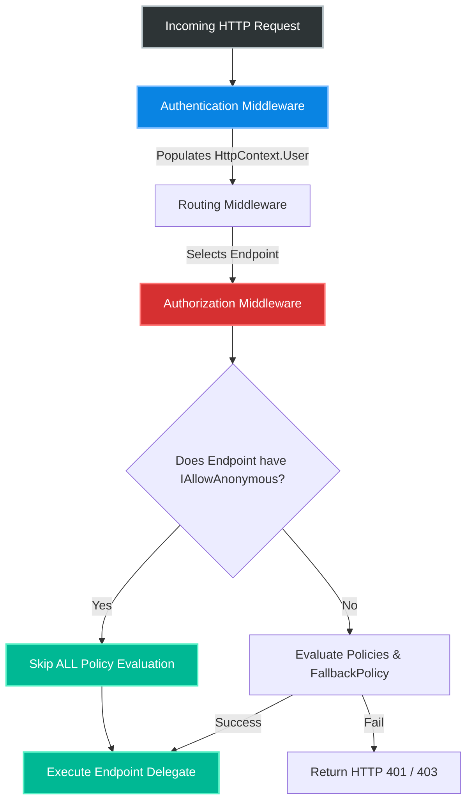

# 4.165 — [AllowAnonymous]: Bypassing Global Authorization Cleanly

## PART 0 — Navigation & Context

```text
ASP.NET Core Domain Hierarchy
├── Security & Identity
│   ├── 4.154 Authorization Architecture
│   ├── 4.163 Minimal API Metadata
│   └── 4.165 [AllowAnonymous] ◄ YOU ARE HERE
└── Infrastructure & Integration
    └── Kubernetes Probes & Webhooks
```

**What you need before this:**
- A solid understanding of the ASP.NET Core Authorization Middleware pipeline [[4.154 — Authorization Architecture: Middleware, Policy Evaluation, and Requirements]].
- Familiarity with the `FallbackPolicy` and how it implements Zero-Trust architectures [[4.156 — Policy-Based Authorization: AddPolicy, IAuthorizationRequirement]].
- Experience configuring Endpoint Metadata using fluent APIs in Minimal APIs [[4.163 — Authorization in Minimal APIs: RequireAuthorization and Metadata]].

**What this unlocks after:**
- Successfully deploying heavily secured applications to Kubernetes without breaking liveness/readiness probes.
- Safely integrating third-party systems like Stripe or GitHub using unauthenticated webhooks.
- Designing APIs that gracefully handle both anonymous guests and authenticated users on the exact same endpoint (e.g., E-Commerce personalized catalogs).

**Why this matters to a production engineer at scale:**
When enterprise security teams mandate a "Zero Trust" architecture, they typically enforce it by setting the `FallbackPolicy` in ASP.NET Core. This guarantees that every single endpoint, current and future, strictly requires a valid authentication token.
However, a 100% locked-down API is a dead API. Users cannot hit the `/auth/login` endpoint if it requires them to already be logged in. Kubernetes will ruthlessly kill your Pods if the `/health` liveness probe returns HTTP 401 Unauthorized. External providers like Stripe cannot deliver payment webhooks to your `/webhooks/stripe` endpoint if they are blocked by your global JWT rules.
`[AllowAnonymous]` (or `.AllowAnonymous()`) is the surgical scalpel used to cut holes in a Zero-Trust architecture. It allows you to expose specifically targeted endpoints to the public internet while keeping the rest of the application completely locked down. Understanding its exact behavior—specifically the fact that it disables *Authorization* but NOT *Authentication*—is critical for building secure, functioning microservices.

---

## PART 1 — The Core Mental Model

> **The Fundamental Rule**
> **When the `AuthorizationMiddleware` detects `IAllowAnonymous` metadata on a requested endpoint, it completely skips the evaluation of all authorization policies (including the `FallbackPolicy` and any inherited policies from groups). The request is allowed to proceed to the endpoint delegate, regardless of the user's authentication state.**

**The Plain-Language Analogy**
Imagine a highly secure military base. 
The Base Commander has issued a global mandate: "Every single person entering any room must show a valid Top Secret security clearance badge." (This is the `FallbackPolicy`).
If a civilian tries to enter the cafeteria, they are blocked (HTTP 401). If an enlisted soldier with only Secret clearance tries to enter, they are blocked (HTTP 403).
However, the base has a Visitor Center where recruits come to enlist. The Base Commander puts a sign on the Visitor Center door: **[AllowAnonymous]**. 
When the base guards (Authorization Middleware) see this sign, they stop checking for Top Secret badges. They let anyone walk through the door.
Crucially, if a General in uniform walks into the Visitor Center, the guards still recognize him as a General (Authentication still ran), but he wasn't *required* to prove his clearance just to enter the room.

**The Taxonomy Diagram**



---

## PART 2 — Deep Mechanics

### 2.1 — Pipeline Positioning (Authentication vs Authorization)
The most misunderstood aspect of `AllowAnonymous` is that it **does not skip Authentication**.

```
──► AuthenticationMiddleware (Reads JWT, populates context.User)
    ──► RoutingMiddleware
        ──► AuthorizationMiddleware (Sees AllowAnonymous -> Skips policies)
            ──► Endpoint
```

Because `AuthenticationMiddleware` runs *before* authorization, if a user sends a valid JWT Bearer token to an `[AllowAnonymous]` endpoint, ASP.NET Core will still validate the signature and populate `HttpContext.User`. 
The `AllowAnonymous` metadata simply tells the Authorization Middleware: "Do not enforce any rules."
This allows you to write endpoints that behave differently if the user happens to be logged in, without *requiring* them to be logged in.

### 2.2 — Interaction with FallbackPolicy
The `FallbackPolicy` is applied to endpoints that do not have any explicit authorization metadata (like `[Authorize]`).
When you apply `AllowAnonymous`, you are explicitly opting that endpoint out of the global default. The framework sees the metadata, bypasses the `FallbackPolicy`, and allows the request through. This is the only way to expose public endpoints in a secure-by-default application.

### 2.3 — Interaction with MapGroup and Route Hierarchies
In Minimal APIs, authorization policies combine hierarchically. If a `MapGroup` requires "Admin" and a child endpoint requires "Finance", the user needs both.
However, `AllowAnonymous` is an absolute override. If a `MapGroup` requires "Admin", and a child endpoint explicitly specifies `.AllowAnonymous()`, the child endpoint is completely open to the public. It does not inherit the "Admin" requirement. The `IAllowAnonymous` metadata acts as a universal short-circuit for the authorization engine.

### 2.4 — MVC Controller-Level vs Action-Level Precedence
In legacy MVC architecture, you can place attributes on the Controller class and on the Action methods.
If you put `[Authorize]` on the Controller, and `[AllowAnonymous]` on the `Login` Action, the `Login` action is public. The narrower scope (Action) overrides the broader scope (Controller).
If you put `[AllowAnonymous]` on the Controller, and `[Authorize]` on a specific Action, the specific action is SECURED. The presence of `[Authorize]` on the narrower scope overrides the `[AllowAnonymous]` on the broader scope. The metadata system is smart enough to resolve the closest intent.

---

## PART 3 — Production Code Patterns

### Pattern 1: Kubernetes Health Probes and Secure Defaults
When building a microservice, you configure a `FallbackPolicy` so developers cannot accidentally expose new endpoints. You must punch holes for Kubernetes.

```csharp
var builder = WebApplication.CreateBuilder(args);

// 1. Lock down the entire application by default
builder.Services.AddAuthorization(options =>
{
    options.FallbackPolicy = new AuthorizationPolicyBuilder()
        .RequireAuthenticatedUser()
        .Build();
});

// 2. Add Health Checks
builder.Services.AddHealthChecks();

var app = builder.Build();

// 3. Expose Health Checks to Kubernetes without requiring JWTs
app.MapHealthChecks("/health/live").AllowAnonymous();
app.MapHealthChecks("/health/ready").AllowAnonymous();

// 4. Standard business endpoints are secured implicitly by the FallbackPolicy
app.MapGet("/api/secure-data", () => "Sensitive Data"); 

app.Run();
```

### Pattern 2: The E-Commerce Webhook (Stripe/GitHub)
Third-party webhooks do not send JWTs. They send raw POST payloads with cryptographic signatures in the headers (HMAC). The Authorization Middleware only knows how to evaluate policies (usually based on claims). Therefore, you must bypass the global authorization, let the payload into the endpoint, and perform imperative signature validation inside the lambda.

```csharp
app.MapPost("/webhooks/stripe", async (HttpRequest req, ILogger<Program> logger) =>
{
    // 1. Read the raw payload
    var json = await new StreamReader(req.Body).ReadToEndAsync();
    var signatureHeader = req.Headers["Stripe-Signature"];

    try
    {
        // 2. Imperative Security: Validate the HMAC signature provided by Stripe
        var stripeEvent = EventUtility.ConstructEvent(
            json, 
            signatureHeader, 
            "whsec_YourSecretKeyHere"
        );

        // 3. Process the event securely
        if (stripeEvent.Type == Events.PaymentIntentSucceeded)
        {
            logger.LogInformation("Payment succeeded!");
        }

        return Results.Ok();
    }
    catch (StripeException e)
    {
        // 4. Return 401 Unauthorized manually if the signature is invalid
        logger.LogWarning("Invalid Stripe webhook signature.");
        return Results.Unauthorized(); 
    }
})
// 5. Critical: Bypass the ASP.NET Core Authorization Middleware
.AllowAnonymous(); 
```

### Pattern 3: Dual-Mode Endpoints (Personalized Public Catalog)
An e-commerce site allows anyone to view the product catalog. However, if a user happens to be logged in, the catalog should display their personalized discounts.

```csharp
app.MapGet("/api/products", (ClaimsPrincipal user, IProductRepository repo) =>
{
    // Because Authentication Middleware still runs, we can check if they sent a token
    if (user.Identity?.IsAuthenticated == true)
    {
        var userId = user.FindFirstValue(ClaimTypes.NameIdentifier);
        // Load personalized catalog with user-specific discounts
        var customProducts = repo.GetProductsForUser(userId);
        return Results.Ok(customProducts);
    }
    else
    {
        // Anonymous user - load standard catalog
        var standardProducts = repo.GetStandardProducts();
        return Results.Ok(standardProducts);
    }
})
.AllowAnonymous(); // Required so anonymous users don't get 401'd by the FallbackPolicy
```

### Pattern 4: Legacy MVC Controllers
The exact same concepts apply to Controller-based architectures using Attributes.

```csharp
// The whole controller requires authentication by default
[Authorize] 
[ApiController]
[Route("api/[controller]")]
public class AuthController : ControllerBase
{
    // Override the class-level Authorize for this specific action
    [AllowAnonymous]
    [HttpPost("login")]
    public IActionResult Login([FromBody] LoginDto request)
    {
        // Generate and return JWT
        return Ok(new { Token = "eyJhbG..." });
    }

    [HttpPost("change-password")]
    public IActionResult ChangePassword([FromBody] PasswordDto request)
    {
        // Requires authentication due to class-level attribute
        return Ok();
    }
}
```

---

## PART 4 — Gotchas & Anti-Patterns

### Gotcha 1: Health Check 401 Loop of Death (Kubernetes)
If you enable `FallbackPolicy` and forget to append `.AllowAnonymous()` to your `/health` endpoint, disaster strikes.

// ⚠️ WRONG CODE
```csharp
app.MapHealthChecks("/health");
```

// HTTP consequence (wrong path):
// The Kubernetes Kubelet periodically sends an anonymous GET request to `/health`. Because there is no `AllowAnonymous` metadata, the `AuthorizationMiddleware` evaluates the request against the `FallbackPolicy`. The `FallbackPolicy` requires an authenticated user. The middleware returns an HTTP 401 Unauthorized.
// Kubernetes interprets HTTP 401 as a probe failure. After 3 failures, Kubernetes assumes the Pod is broken, kills it, and restarts it. The new Pod comes up, fails the probe, and is killed again. Your application enters an infinite CrashLoopBackOff and your production environment goes dark.

### Gotcha 2: Assuming `AllowAnonymous` Disables Authentication
Developers often use `AllowAnonymous` on a Login page, and then write code assuming the `HttpContext.User` is completely empty.

// ⚠️ WRONG CODE
```csharp
[AllowAnonymous]
public IActionResult Login()
{
    // ❌ DANGEROUS ASSUMPTION:
    // "Since this is anonymous, the user definitely isn't logged in."
    
    // If the user's browser sends an old cookie or JWT, 
    // User.Identity.IsAuthenticated will be TRUE!
}
```

// THE FIX:
// Always check the actual authentication state if you need to redirect already-logged-in users away from the login page.
```csharp
[AllowAnonymous]
public IActionResult Login()
{
    if (User.Identity?.IsAuthenticated == true)
    {
        return Redirect("/dashboard");
    }
    return View();
}
```

### Gotcha 3: The Public Webhook Without HMAC Validation
A developer uses `.AllowAnonymous()` to expose a webhook for a partner integration, but forgets that bypassing ASP.NET Core's authorization means *anyone on the internet* can hit that endpoint.

// ⚠️ WRONG CODE
```csharp
app.MapPost("/webhooks/inventory", (InventoryUpdateDto dto) => {
    // ❌ FATAL SECURITY FLAW: 
    // Absolutely no signature or API key verification.
    db.Inventory.Update(dto); 
}).AllowAnonymous();
```

// HTTP consequence (wrong path):
// A malicious actor discovers the `/webhooks/inventory` endpoint and sends an anonymous POST request setting the price of an iPhone to $1.00. Because the endpoint is `AllowAnonymous` and lacks internal HMAC validation, the attack succeeds. 
// **Rule:** If you use `AllowAnonymous` on an endpoint that mutates data, you MUST validate cryptographic signatures (like Stripe) or check custom API keys directly inside the delegate.

### Gotcha 4: Swagger / OpenAPI Metadata Confusion
When you apply `.AllowAnonymous()`, OpenAPI generator libraries (like Swashbuckle) read the metadata and remove the little "Padlock" icon from the Swagger UI for that specific endpoint.
If you use the Dual-Mode Endpoint pattern (Pattern 3), where an endpoint acts differently for authenticated vs anonymous users, the Swagger UI will mark it as completely public. Users reading your API documentation won't know they can send a Bearer token to get personalized data unless you explicitly annotate the Swagger schema.

---

## PART 5 — Performance Implications

### Request Pipeline Characteristics

| Execution Type | Latency | Explanation |
|---|---|---|
| Policy Evaluation | ~0.1ms | Standard authorization logic executing against claims. |
| AllowAnonymous Override | Near Zero | The Authorization Middleware detects the `IAllowAnonymous` metadata (O(1) lookup in the metadata collection) and immediately returns `Task.CompletedTask`. |

**Performance Verdict:**
Applying `.AllowAnonymous()` is technically faster than running an authorization policy because it short-circuits the pipeline. However, the performance gain (~0.1ms) is utterly negligible. You use `AllowAnonymous` for functional and architectural correctness (exposing public routes), never as a micro-optimization strategy.

---

## PART 6 — Interview Arsenal

### A. The Question Bank

**Question 1:** "Our enterprise architecture mandates that we configure a global `FallbackPolicy` requiring authentication for all endpoints. However, we just integrated Stripe, and Stripe is unable to send webhooks to our API. They report receiving HTTP 401 errors. How do we fix this securely?"
- **Average Answer:** "You have to remove the FallbackPolicy."
- **Why That's Insufficient:** Removing the global security policy to accommodate one webhook is an architectural regression that opens the entire app to vulnerabilities.
- **Great Answer:** "Because Stripe sends webhooks anonymously and relies on cryptographic HMAC signatures rather than JWT Bearer tokens, the global `FallbackPolicy` is intercepting and rejecting their requests. To fix this, we chain `.AllowAnonymous()` directly onto the Minimal API definition for the Stripe webhook. This instructs the Authorization Middleware to skip the FallbackPolicy for that specific route. Inside the webhook's delegate, we must then imperatively hash the payload and verify the Stripe signature to ensure the request is actually from Stripe."

**Question 2:** "If I apply `[AllowAnonymous]` to a Controller Action, does the ASP.NET Core pipeline completely skip the Authentication Middleware?"
- **Average Answer:** "Yes, it skips authentication and authorization."
- **Why That's Insufficient:** Demonstrates a fundamental misunderstanding of the ASP.NET Core pipeline ordering.
- **Great Answer:** "No, it does not skip Authentication. The Authentication Middleware runs *before* the Authorization Middleware. If the client sends a valid JWT or Cookie with their request, the Authentication Middleware will still validate it and populate the `HttpContext.User` property. The `[AllowAnonymous]` attribute only affects the Authorization Middleware, instructing it to skip policy enforcement. This is why you can have a public endpoint that still knows who the user is if they happen to be logged in."

**Question 3:** "If I create a `MapGroup` and apply `.RequireAuthorization("AdminOnly")` to the group, but then map a specific endpoint inside that group and apply `.AllowAnonymous()`, what happens if a completely anonymous user hits that specific endpoint?"
- **Average Answer:** "They get a 403 Forbidden because the group requires Admin."
- **Why That's Insufficient:** Fails to understand the override precedence of endpoint metadata.
- **Great Answer:** "The anonymous user will successfully access the endpoint and receive an HTTP 200 OK. In ASP.NET Core Endpoint Routing, while authorization policies combine hierarchically, `IAllowAnonymous` metadata acts as an absolute short-circuit. Its presence anywhere on the specific endpoint's metadata tree instructs the Authorization Middleware to bypass all policy evaluation entirely, overriding the group-level Admin requirement."

### B. The Trick Questions

**Trick Question:** "I have a legacy MVC Controller. I put `[AllowAnonymous]` on the Controller class itself. Then, I put `[Authorize(Roles = "Admin")]` on a specific Action method inside it. Does the specific Action allow anonymous users?"
- **The Trap:** Assuming `AllowAnonymous` is an absolute override regardless of where it is placed.
- **The Correct Answer:** "No, the specific action is secured and requires the Admin role. While `AllowAnonymous` acts as an override, the ASP.NET Core metadata resolution system prioritizes the most *specific* metadata. Because the `[Authorize]` attribute is on the Action method (narrower scope), it overrides the `[AllowAnonymous]` attribute on the Controller class (broader scope)."

### C. Red Flags to Avoid
- 🚩 **"I use `AllowAnonymous` to disable CORS."** (CORS and Authorization are two completely separate middlewares. `AllowAnonymous` has zero effect on cross-origin browser policies).
- 🚩 **"I put `AllowAnonymous` on my API because I couldn't get the JWT to validate."** (Using `AllowAnonymous` as a debugging crutch in production leads to catastrophic data breaches. Fix the AuthN issues instead).

---

## PART 7 — Decision Framework

```mermaid
graph TD
    A[New Endpoint Created] --> B{Is a FallbackPolicy enabled?}
    
    B -->|Yes| C{Does this endpoint serve public data?}
    C -->|No| D[Do Nothing. Inherits secure default.]
    C -->|Yes| E[Append .AllowAnonymous]
    
    B -->|No| F{Are you using a secure MapGroup?}
    
    F -->|Yes| G{Is this specific route public?}
    G -->|Yes| H[Append .AllowAnonymous to punch a hole]
    G -->|No| I[Do Nothing. Inherits Group Security.]
    
    F -->|No| J[Endpoint is inherently public. Consider adding a FallbackPolicy.]
    
    E --> K{Does the public endpoint mutate data?}
    K -->|Yes - Webhook| L[Enforce HMAC/Signature inside delegate]
    K -->|Yes - Login| M[Validate Database Credentials]
    K -->|No - Health/Read| N[Safe to leave fully open]
    
    style A fill:#2d3436,stroke:#fff
    style D fill:#0984e3,stroke:#fff
    style E fill:#00b894,stroke:#fff
    style H fill:#00b894,stroke:#fff
    style L fill:#d63031,stroke:#fff
    style M fill:#d63031,stroke:#fff
```



---

## PART 8 — Self-Check

### A. Conceptual Questions
1. How does `IAllowAnonymous` affect the execution of the `FallbackPolicy`?
2. Does `AllowAnonymous` prevent the `AuthenticationMiddleware` from parsing a JWT?
3. Why is it critical to apply `.AllowAnonymous()` to Kubernetes liveness and readiness probes when a Fallback Policy is active?
4. If a webhook is marked `AllowAnonymous`, how do you secure it against malicious traffic?
5. What happens if you chain `.RequireAuthorization()` AND `.AllowAnonymous()` on the exact same Minimal API endpoint?
6. In a Dual-Mode endpoint (Pattern 3), how do you determine if the user is a logged-in customer or an anonymous guest?
7. Explain the precedence between an Action-level `[Authorize]` and a Controller-level `[AllowAnonymous]`.
8. How does `AllowAnonymous` affect OpenAPI (Swagger) documentation generation?

### B. Code Puzzles

**Puzzle 1: The Group Override**
```csharp
var group = app.MapGroup("/api").RequireAuthorization("SuperAdmin");
group.MapGet("/status", () => "OK").AllowAnonymous();
```
*Scenario:* A user with the "Basic" role makes a GET request to `/api/status`. What is the HTTP response?
<details>
<summary>Answer</summary>
**HTTP 200 OK**. The `AllowAnonymous` metadata on the child endpoint completely bypasses the `SuperAdmin` requirement inherited from the parent group.
</details>

**Puzzle 2: The Redundant Middleware**
```csharp
app.UseAuthorization();
app.UseAuthentication(); // Swapped order!

app.MapGet("/public", () => "Data").AllowAnonymous();
```
*Scenario:* A developer swapped the middleware order. Does `/public` still work for anonymous users?
<details>
<summary>Answer</summary>
Yes, `/public` will return HTTP 200 OK because `AuthorizationMiddleware` sees `AllowAnonymous` and succeeds. However, if the user *did* send a token, `HttpContext.User` would be empty inside the delegate, because Authorization ran before Authentication could process the token. (Note: .NET 8 analyzers will warn/fail on this swapped middleware order).
</details>

**Puzzle 3: The Forgotten Signature**
```csharp
app.MapPost("/webhooks/github", (GitHubPushEvent payload) => {
    // trigger CI/CD pipeline
    return Results.Ok();
}).AllowAnonymous();
```
*Scenario:* Identify the catastrophic security flaw.
<details>
<summary>Answer</summary>
Because the endpoint is `AllowAnonymous`, it is open to the entire internet. The developer failed to validate the `X-Hub-Signature-256` header from GitHub. A malicious actor can easily construct a fake JSON payload, POST it to this URL, and trigger fraudulent CI/CD pipelines or deployments.
</details>

---

## PART 9 — Connections & Resources

### A. Related Topics Table

| Topic | Why It Connects |
|---|---|
| [[4.154 — Authorization Architecture: Middleware, Policy Evaluation, and Requirements]] | The middleware that detects the `IAllowAnonymous` metadata and halts policy execution. |
| [[4.156 — Policy-Based Authorization: AddPolicy, IAuthorizationRequirement]] | Where the `FallbackPolicy` is defined, which creates the need for `AllowAnonymous`. |
| [[4.163 — Authorization in Minimal APIs: RequireAuthorization and Metadata]] | The opposite action: applying secure metadata vs removing it. |

### B. Books

| Book | Chapters | Why These Chapters |
|---|---|---|
| ASP.NET Core in Action, 3rd Ed | Chapter 15: Advanced Authorization | Covers the interaction between Fallback Policies and AllowAnonymous. |
| Microservices Security in Action | Chapter 3: Securing Service-to-Service | Discusses webhook patterns and HMAC verification. |

### C. Essential Articles & Docs
- [Microsoft Docs: Allow anonymous access](https://learn.microsoft.com/en-us/aspnet/core/security/authorization/allowanonymous)
- [Microsoft Docs: Fallback Policy](https://learn.microsoft.com/en-us/aspnet/core/security/authorization/policies#fallback-policy)
- [Stripe Docs: Verifying Webhook Signatures](https://stripe.com/docs/webhooks/signatures)

> [!NOTE]
> **Template Meta-Note**
> Part 0: Context & Prerequisites. Part 1: Core Mental Model. Part 2: Deep Mechanics & Pipeline. Part 3: Production Code. Part 4: Gotchas. Part 5: Performance. Part 6: Interview Arsenal. Part 7: Decision Framework. Part 8: Puzzles. Part 9: Resources.
