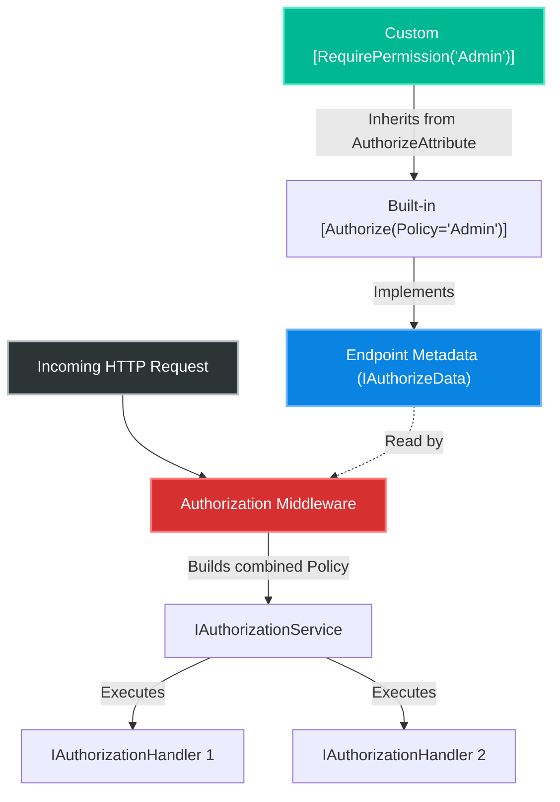

# 4.166 — Custom [Authorize] Attributes: AuthorizeAttribute Subclassing

## PART 0 — Navigation & Context

```text
ASP.NET Core Domain Hierarchy
├── Security & Identity
│   ├── 4.154 Authorization Architecture
│   ├── 4.156 Policy-Based Authorization
│   ├── 4.161 Permission-Based Authorization
│   └── 4.166 Custom [Authorize] Attributes ◄ YOU ARE HERE
└── Cross-Cutting Concerns
    └── Refactoring & Metadata DRY Patterns
```

**What you need before this:**
- A deep understanding of how Policy-Based Authorization works under the hood [[4.156 — Policy-Based Authorization: AddPolicy, IAuthorizationRequirement]].
- Knowledge of how the `AuthorizationMiddleware` evaluates endpoint metadata (`IAuthorizeData`) to build an overarching policy [[4.154 — Authorization Architecture: Middleware, Policy Evaluation, and Requirements]].
- Familiarity with Permission-Based Authorization strings (e.g., `"perm:orders:refund"`) [[4.161 — Permission-Based Authorization: Fine-Grained Action Permissions]].

**What this unlocks after:**
- Refactoring massive, string-heavy codebases to use highly discoverable, strongly-typed authorization attributes.
- Writing code that prevents "Magic String" typos from causing catastrophic security breaches or 403 Forbidden errors in production.
- Implementing clean, domain-driven security policies across large MVC Controller architectures.

**Why this matters to a production engineer at scale:**
When you build a large enterprise system with hundreds of API endpoints, security cannot rely on developers perfectly typing magic strings like `[Authorize(Policy = "Permission:Treasury:WireTransfer")]`. If a developer typoes it as `[Authorize(Policy = "Permission:Teasury:Wire")]`, ASP.NET Core might fail closed (throwing an exception because the policy doesn't exist), or worse, fail open if improperly configured in an older framework version. 
By subclassing the `AuthorizeAttribute`, you completely eliminate magic strings from your Controllers. You create a strongly typed security language tailored precisely to your domain (`[RequirePermission(Permission.Treasury.WireTransfer)]`). Furthermore, custom attributes act purely as *metadata providers*, meaning they seamlessly integrate into the highly-optimized ASP.NET Core Authorization Middleware pipeline without introducing the severe performance or lifecycle bugs associated with custom MVC Action Filters.

---

## PART 1 — The Core Mental Model

> **The Fundamental Rule**
> **Subclassing `AuthorizeAttribute` is exclusively about providing strongly-typed metadata; it is NOT about writing custom execution logic. When you subclass `AuthorizeAttribute`, you simply set the `Policy`, `Roles`, or `AuthenticationSchemes` properties in the constructor. The ASP.NET Core `AuthorizationMiddleware` reads your custom attribute exactly the same way it reads the built-in `[Authorize]` attribute because they both implement the `IAuthorizeData` interface.**

**The Plain-Language Analogy**
Imagine an office building with hundreds of restricted rooms.
Using standard `[Authorize(Policy = "...")]` is like having an office manager write "Requires Level 3 Clearance" on a blank sticky note and slapping it on every door. It's tedious, and if they spell "Clearance" wrong, the security guards get confused.
Creating a custom `[RequireClearance(3)]` attribute is like ordering high-quality, pre-printed, permanent metal plaques from a factory. You just screw the plaque onto the door.
**Critically:** The plaque itself does not physically lock the door. The plaque just tells the building's central security guard (the `AuthorizationMiddleware`) what to do. You don't build a lock into the plaque; you just build a better label.

**The Taxonomy Diagram**



---

## PART 2 — Deep Mechanics

### 2.1 — The Anatomy of `AuthorizeAttribute`
To understand how to subclass it, you must look at how Microsoft built the base class.

```csharp
// Simplified ASP.NET Core Source Code
[AttributeUsage(AttributeTargets.Class | AttributeTargets.Method, AllowMultiple = true, Inherited = true)]
public class AuthorizeAttribute : Attribute, IAuthorizeData
{
    public AuthorizeAttribute() { }

    public AuthorizeAttribute(string policy)
    {
        Policy = policy;
    }

    public string? Policy { get; set; }
    public string? Roles { get; set; }
    public string? AuthenticationSchemes { get; set; }
}
```

Notice that there are absolutely no methods like `OnAuthorization()` or `ExecuteAsync()`. The `AuthorizeAttribute` is nothing but a property bag. It is a vessel designed specifically to carry strings (`Policy`, `Roles`, `Schemes`) from the compiled code (the Controller Action) to the runtime reflection system (Endpoint Metadata).

### 2.2 — How the Middleware Reads It
During application startup, ASP.NET Core Endpoint Routing scans all Controllers and Minimal API definitions. It looks for any attribute that implements `IAuthorizeData`.

When it finds your custom attribute, it extracts the `Policy` string you defined.
Later, when an HTTP request arrives, the `AuthorizationMiddleware`:
1. Retrieves the `IAuthorizeData` collection from the active endpoint.
2. Combines all the `Policy` strings into a single overarching `AuthorizationPolicy`.
3. Passes that policy to the `IAuthorizationService`.
4. The `IAuthorizationService` runs the underlying `IAuthorizationHandler` logic.

### 2.3 — The Subclass Implementation (Permission-Based)
If your application uses a finely-grained permission system (e.g., checking if the user's JWT has a claim `permissions: [ "invoice:delete" ]`), you would normally write:

```csharp
[Authorize(Policy = "Permission:invoice:delete")]
```

By subclassing, you encapsulate the magic prefix:

```csharp
[AttributeUsage(AttributeTargets.Class | AttributeTargets.Method, AllowMultiple = true, Inherited = true)]
public sealed class RequirePermissionAttribute : AuthorizeAttribute
{
    // The constructor takes the exact domain requirement
    public RequirePermissionAttribute(string permission)
    {
        // We set the underlying base.Policy string, ensuring the prefix is always perfectly matched
        Policy = $"Permission:{permission}";
    }
}
```

### 2.4 — Multiple Attributes vs Multiple Requirements
What happens if a developer stacks the attribute?

```csharp
[RequirePermission("orders:read")]
[RequirePermission("orders:refund")]
public IActionResult RefundOrder() { ... }
```

Because the base `AuthorizeAttribute` has `[AttributeUsage(AllowMultiple = true)]`, ASP.NET Core allows this. The `AuthorizationMiddleware` will read *both* metadata entries, create two separate policy requirements, and evaluate them via a logical **AND**. The user MUST have both permissions to execute the action.

### 2.5 — The "Scheme Override" Attribute
Sometimes, you have a globally configured authentication scheme (e.g., Cookies for a web frontend), but you have specific API endpoints that must ONLY accept JWT Bearer tokens from mobile apps.

Normally:
```csharp
[Authorize(AuthenticationSchemes = JwtBearerDefaults.AuthenticationScheme)]
```

Subclassed:
```csharp
public sealed class ApiTokenOnlyAttribute : AuthorizeAttribute
{
    public ApiTokenOnlyAttribute()
    {
        AuthenticationSchemes = JwtBearerDefaults.AuthenticationScheme;
    }
}
```

This prevents developers from accidentally allowing Cookie-based CSRF attacks on a sensitive programmatic API.

---

## PART 3 — Production Code Patterns

### Pattern 1: The Enterprise Permission Enum Pattern
Passing strings into attributes is better than full policies, but it still allows typos (`[RequirePermission("order:rfd")]`). In enterprise codebases, we use `enum` or static constants.

```csharp
// 1. Define strongly-typed permissions
public static class Permissions
{
    public const string OrdersRefund = "orders:refund";
    public const string OrdersRead = "orders:read";
}

// 2. The custom attribute accepts the constant
[AttributeUsage(AttributeTargets.Class | AttributeTargets.Method, AllowMultiple = true, Inherited = true)]
public sealed class RequirePermissionAttribute : AuthorizeAttribute
{
    public RequirePermissionAttribute(string permission)
    {
        Policy = $"perm:{permission}";
    }
}

// 3. The Controller is completely strongly-typed, preventing compile-time typos
public class OrdersController : ControllerBase
{
    [RequirePermission(Permissions.OrdersRefund)]
    [HttpPost("{id}/refund")]
    public IActionResult Refund() { ... }
}
```

### Pattern 2: Dynamic Policy Providers (The Infinite Policy Pattern)
When you use a custom attribute like `[RequirePermission(Permissions.OrdersRefund)]`, it sets `Policy = "perm:orders:refund"`. 
However, ASP.NET Core normally requires you to register every single policy at startup via `services.AddAuthorization(o => o.AddPolicy(...))`. If you have 500 permissions, registering 500 policies at startup is a nightmare.
Instead, we combine Custom Attributes with an `IAuthorizationPolicyProvider`.

```csharp
public class PermissionPolicyProvider : DefaultAuthorizationPolicyProvider
{
    public PermissionPolicyProvider(IOptions<AuthorizationOptions> options) : base(options) { }

    // This method is called dynamically by the middleware when it sees a policy string it doesn't recognize
    public override async Task<AuthorizationPolicy?> GetPolicyAsync(string policyName)
    {
        // Fallback to default registered policies first
        var policy = await base.GetPolicyAsync(policyName);
        if (policy != null) return policy;

        // If the policy string starts with our custom prefix (generated by our custom attribute)
        if (policyName.StartsWith("perm:", StringComparison.OrdinalIgnoreCase))
        {
            var permissionName = policyName.Substring("perm:".Length);
            
            // Build and return the policy dynamically on-the-fly!
            return new AuthorizationPolicyBuilder()
                .AddRequirements(new PermissionRequirement(permissionName))
                .Build();
        }

        return null;
    }
}

// Register it in Program.cs
builder.Services.AddSingleton<IAuthorizationPolicyProvider, PermissionPolicyProvider>();
```
**The Result:** You can invent new permissions in your Controllers using `[RequirePermission("new_feature")]` and the system will automatically handle it without you ever needing to call `AddPolicy()` manually.

### Pattern 3: Component-Specific Authorize Attributes
In multi-tenant or massive applications, different subsystems might have completely different authorization mechanisms.

```csharp
// For the internal Admin Dashboard (Requires Cookies and Admin Role)
public sealed class AdminDashboardAttribute : AuthorizeAttribute
{
    public AdminDashboardAttribute()
    {
        AuthenticationSchemes = CookieAuthenticationDefaults.AuthenticationScheme;
        Roles = "SuperAdmin,SupportLead";
    }
}

// For the public-facing Webhook API (Requires API Keys)
public sealed class WebhookEndpointAttribute : AuthorizeAttribute
{
    public WebhookEndpointAttribute()
    {
        AuthenticationSchemes = "ApiKeyScheme";
    }
}
```
This isolates the security configurations into single, discoverable classes.

### Pattern 4: Minimal APIs and `IAuthorizeData`
Custom attributes work perfectly on MVC Controllers, but what about Minimal APIs?
Technically, you can put attributes on lambdas, but it's ugly and historically had edge cases in earlier .NET versions. The canonical pattern for Minimal APIs is to create fluent extension methods that push your custom `IAuthorizeData` into the endpoint metadata.

```csharp
// 1. Create a custom class that implements IAuthorizeData
public class PermissionAuthorizeData : IAuthorizeData
{
    public string Policy { get; set; }
    public string Roles { get; set; }
    public string AuthenticationSchemes { get; set; }

    public PermissionAuthorizeData(string permission)
    {
        Policy = $"perm:{permission}";
    }
}

// 2. Create the Fluent Extension Method
public static class AuthorizationExtensions
{
    public static RouteHandlerBuilder RequirePermission(this RouteHandlerBuilder builder, string permission)
    {
        // Push the custom metadata onto the endpoint
        return builder.WithMetadata(new PermissionAuthorizeData(permission));
    }
}

// 3. Usage in Minimal APIs
app.MapPost("/api/orders/{id}/refund", RefundOrder)
   .RequirePermission(Permissions.OrdersRefund); // Clean, fluent, strongly-typed!
```

---

## PART 4 — Gotchas & Anti-Patterns

### Gotcha 1: Implementing Business Logic inside the Attribute
This is the single most common and destructive mistake developers make coming from ASP.NET MVC 5 (the old .NET Framework). In the old framework, you overrode `OnAuthorization`. In ASP.NET Core, attempting to do this breaks the architecture.

// ⚠️ FATAL ANTI-PATTERN
```csharp
public class DbCheckAuthorizeAttribute : AuthorizeAttribute, IAsyncAuthorizationFilter
{
    public async Task OnAuthorizationAsync(AuthorizationFilterContext context)
    {
        // ❌ FATAL ERROR 1: Injecting dependencies via HttpContext inside an attribute
        var db = context.HttpContext.RequestServices.GetRequiredService<AppDbContext>();
        
        // ❌ FATAL ERROR 2: Executing database queries in a filter instead of a Policy Handler
        var isAllowed = await db.CheckUserPermissionAsync(context.HttpContext.User);
        
        if (!isAllowed) {
            context.Result = new ForbidResult();
        }
    }
}
```

// HTTP consequence (wrong path):
// 1. This completely bypasses the centralized `AuthorizationMiddleware`.
// 2. It only works on MVC Controllers. It will silently fail to execute on Minimal APIs or SignalR Hubs, leaving them completely unprotected and open to attack.
// 3. It violates Dependency Injection best practices.

// ✅ CORRECT CODE
// The Attribute MUST be completely passive (a dumb property bag setting `Policy` strings). 
// The actual database query logic MUST be placed inside an `IAuthorizationHandler<TRequirement>`.

### Gotcha 2: Unregistered Policies causing 500/403 Errors
If you create a custom attribute like `[RequireTenantId]` that sets `Policy = "TenantCheck"`, but you forget to register `"TenantCheck"` via `services.AddAuthorization(o => o.AddPolicy(...))`, what happens?

// HTTP consequence (wrong path):
// In earlier versions of .NET Core, this could cause confusing 403s. In modern .NET 8+, ASP.NET Core will actively throw an `InvalidOperationException: The AuthorizationPolicy named: 'TenantCheck' was not found.` during the request, resulting in an HTTP 500 error. The fix is to either register the policy explicitly or implement an `IAuthorizationPolicyProvider` (Pattern 2).

### Gotcha 3: The `AllowMultiple = false` Trap
If you define your custom attribute but forget to inherit the `[AttributeUsage]` from the base class, or explicitly set `AllowMultiple = false`:

// ⚠️ WRONG CODE
```csharp
[AttributeUsage(AttributeTargets.Method, AllowMultiple = false)]
public class RequirePermissionAttribute : AuthorizeAttribute { ... }

// Usage:
[RequirePermission("orders:read")]
[RequirePermission("orders:write")] // 💥 Compiler Error!
public IActionResult ManageOrders() { ... }
```

// ✅ CORRECT CODE
// Always ensure `AllowMultiple = true` is set, because enterprise security frequently requires intersecting multiple distinct permissions to access a single highly-secure endpoint.

### Gotcha 4: Forgetting `Inherited = true`
If a developer applies your custom attribute to a Base Controller class, they expect all derived controllers to automatically inherit that security requirement. If you set `Inherited = false` on your `AttributeUsage`, the derived controllers will be completely public and unprotected, leading to a catastrophic data breach.

### Gotcha 5: Minimal API Attribute Ignorance
In very specific edge cases in older versions, putting a custom attribute directly on a lambda could result in the metadata being ignored if not handled carefully by the compiler. Always prefer the `.WithMetadata()` or `.RequireAuthorization()` fluent extensions for Minimal APIs to ensure 100% reliability.

---

## PART 5 — Performance Implications

### Request Pipeline Characteristics

| Approach | Latency | Memory Allocation | Explanation |
|---|---|---|---|
| Inline `[Authorize(Policy="...")]` | 0ms | Minimal | The standard approach. |
| Custom `[RequirePermission]` Attribute | 0ms | Minimal | Absolutely zero overhead compared to the standard approach. The framework is just reading a string from an `IAuthorizeData` instance at application startup or route matching. |
| Custom `IAuthorizationFilter` Attribute | High | High | Anti-pattern. Bypasses optimized caching in the middleware, creates extra DI scopes, and disrupts the unified security pipeline. |

**Performance Verdict:**
Subclassing `AuthorizeAttribute` has absolutely zero performance penalty. The string generation in the constructor happens during metadata resolution. The evaluation speed is identical to using the built-in attributes. It is a pure architectural win with no downsides.

---

## PART 6 — Interview Arsenal

### A. The Question Bank

**Question 1:** "In legacy ASP.NET MVC 5, developers often overrode the `OnAuthorization` method inside custom `AuthorizeAttribute` subclasses to hit the database. Why is doing this in ASP.NET Core considered a severe anti-pattern?"
- **Average Answer:** "Because ASP.NET Core uses Dependency Injection, and you can't inject a DbContext into an Attribute constructor."
- **Why That's Insufficient:** While technically true about constructor injection, it misses the architectural shift of the entire framework.
- **Great Answer:** "In ASP.NET Core, authorization has been completely decoupled from the MVC pipeline. It is now handled by the `AuthorizationMiddleware` globally. An `AuthorizeAttribute` is no longer an executable filter; it is strictly a passive metadata provider implementing `IAuthorizeData`. If you try to force executable logic into an attribute by implementing `IAsyncAuthorizationFilter`, you are bypassing the global middleware pipeline. This means your security logic will only protect MVC Controllers, and will completely fail to protect Minimal APIs, gRPC endpoints, or SignalR Hubs, resulting in massive security vulnerabilities. Executable logic must always be placed inside an `IAuthorizationHandler`."

**Question 2:** "If I create a custom attribute `[RequirePermission("DeleteUser")]`, how does the ASP.NET Core middleware know what to do with it if I haven't registered 'DeleteUser' in `AddPolicy`?"
- **Average Answer:** "It will throw an exception saying the policy isn't found."
- **Why That's Insufficient:** It answers the 'what', but not the 'how to fix it at scale'.
- **Great Answer:** "By default, the middleware will throw an `InvalidOperationException` because the required policy string does not exist in the registered options. To resolve this at scale without manually registering hundreds of policies, we implement a custom `IAuthorizationPolicyProvider`. This provider acts as a dynamic factory; when the middleware asks for a policy named 'DeleteUser', our provider detects the prefix, dynamically instantiates an `AuthorizationPolicyBuilder`, attaches the correct custom `IAuthorizationRequirement`, and returns it to the middleware on the fly."

**Question 3:** "If I apply `[RequirePermission("A")]` and `[RequirePermission("B")]` to the exact same controller action, does the user need Permission A OR Permission B?"
- **Average Answer:** "They need both."
- **Why That's Insufficient:** Doesn't explain the underlying middleware mechanics.
- **Great Answer:** "They need both (Logical AND). When the `AuthorizationMiddleware` inspects the endpoint metadata, it retrieves an `IEnumerable<IAuthorizeData>`. It combines every policy string it finds into a single, unified `AuthorizationPolicy`. The user's `ClaimsPrincipal` must satisfy every single requirement within that combined policy to successfully pass the authorization check."

### B. The Trick Questions

**Trick Question:** "I wrote a Minimal API: `app.MapGet("/data", [RequirePermission("Read")] () => "secret");`. I tested it without a token and it returned the secret data! Why did my custom attribute fail?"
- **The Trap:** Assuming Minimal API lambdas process attributes the exact same way MVC Controllers do across all versions.
- **The Correct Answer:** "Depending on the exact .NET version and how the lambda is compiled, attributes applied directly to inline lambdas can sometimes be dropped from the generated endpoint metadata. The framework-supported, bulletproof way to secure Minimal APIs is to use the fluent API: `app.MapGet(...).WithMetadata(new RequirePermissionAttribute("Read"))` or a custom extension method like `.RequirePermission("Read")`. Never rely on lambda attributes for security unless strictly validated by your .NET 8+ tooling."

**Trick Question:** "If I subclass `AuthorizeAttribute`, do I need to register my new attribute in the `IServiceCollection` in `Program.cs`?"
- **The Trap:** Confusing attributes (metadata) with services (DI components).
- **The Correct Answer:** "No. Attributes are compiled directly into the assembly metadata. They are instantiated by the .NET runtime's reflection engine, not the Dependency Injection container. Therefore, you never register attributes in `IServiceCollection`. You only register the `IAuthorizationHandler` that executes the logic for the policy string the attribute generates."

### C. Red Flags to Avoid
- 🚩 **"I use `HttpContext.RequestServices.GetService()` inside my custom authorize attribute to read the database."** (Instant fail. Shows a complete lack of understanding of modern ASP.NET Core architecture).
- 🚩 **"I don't use Custom Attributes because standard `[Authorize(Policy="...")]` is faster."** (Demonstrates ignorance of how the reflection and metadata pipeline works under the hood).

---

## PART 7 — Decision Framework

```mermaid
graph TD
    A[Need to secure a route] --> B{Is it a simple Role check?}
    
    B -->|Yes| C["Use [Authorize(Roles = 'Admin')]"]
    
    B -->|No - Complex Domain Logic| D{Do you have more than 5 distinct policies?}
    
    D -->|No| E["Use [Authorize(Policy = 'FeatureX')]"]
    
    D -->|Yes| F[Create Custom Subclass]
    
    F --> G{MVC or Minimal API?}
    
    G -->|MVC Controllers| H["Apply Custom [RequirePermission] Attribute"]
    
    G -->|Minimal API| I["Create .RequirePermission() fluent extension"]
    
    H --> J[Implement IAuthorizationPolicyProvider to dynamically resolve strings]
    I --> J
    
    style A fill:#2d3436,stroke:#fff
    style C fill:#0984e3,stroke:#fff
    style E fill:#0984e3,stroke:#fff
    style H fill:#00b894,stroke:#fff
    style I fill:#00b894,stroke:#fff
    style J fill:#d63031,stroke:#fff
```



---

## PART 8 — Self-Check

### A. Conceptual Questions
1. Why is it an architectural mistake to implement `IAsyncAuthorizationFilter` on a custom `AuthorizeAttribute` in ASP.NET Core?
2. What three string properties exist on the base `AuthorizeAttribute`?
3. How does the `AuthorizationMiddleware` interact with `IAuthorizeData`?
4. If you have 1,000 distinct permissions in your domain, how do you avoid calling `services.AddPolicy()` 1,000 times in `Program.cs`?
5. What is the difference between setting `Policy` vs setting `AuthenticationSchemes` in a custom attribute constructor?
6. Why must you ensure `Inherited = true` is set on your custom attribute's `[AttributeUsage]`?
7. Explain the Logical AND behavior when stacking multiple custom authorization attributes on a single endpoint.
8. How do you apply custom authorization metadata to a Minimal API endpoint cleanly?

### B. Code Puzzles

**Puzzle 1: The Missing Interface**
```csharp
public class RequireAdminAttribute : Attribute 
{
    public string Policy { get; set; } = "AdminOnly";
}

[RequireAdmin]
public class AdminController : ControllerBase { ... }
```
*Scenario:* Anonymous users can access the `AdminController`. Why?
<details>
<summary>Answer</summary>
The custom attribute inherits from `Attribute`, but it completely fails to implement `IAuthorizeData` (or inherit from `AuthorizeAttribute` which implements it). The `AuthorizationMiddleware` scans the endpoint, finds no `IAuthorizeData` instances, assumes the endpoint is public, and allows the anonymous request through.
*Fix:* Inherit from `AuthorizeAttribute` or explicitly implement `IAuthorizeData`.
</details>

**Puzzle 2: The Logic Leak**
```csharp
public class VerifyOwnershipAttribute : AuthorizeAttribute, IAuthorizationFilter
{
    public void OnAuthorization(AuthorizationFilterContext context)
    {
        var resourceId = context.RouteData.Values["id"];
        // Check ownership...
    }
}
```
*Scenario:* The developer migrated this code directly from ASP.NET MVC 5. It works locally for their Web API. Six months later, the team adds a SignalR Hub. The developer applies `[VerifyOwnership]` to a SignalR Hub method. What happens?
<details>
<summary>Answer</summary>
The SignalR Hub method will be completely unprotected. SignalR does not run through the MVC Filter pipeline; it only uses the global `AuthorizationMiddleware`. Because the actual logic is trapped inside an MVC-specific `IAuthorizationFilter`, SignalR ignores the logic entirely.
*Fix:* Move the ownership logic into an `IAuthorizationHandler` and let the attribute act purely as a metadata marker.
</details>

**Puzzle 3: The Broken Scheme**
```csharp
public class MobileApiAttribute : AuthorizeAttribute
{
    public MobileApiAttribute()
    {
        AuthenticationSchemes = "Bearer";
        Policy = "MobileUser";
    }
}
```
*Scenario:* The team changes their JWT library, and the new library registers the authentication scheme as `"JwtBearer"`. All mobile APIs immediately start throwing HTTP 401s.
<details>
<summary>Answer</summary>
The developer hardcoded the magic string `"Bearer"` into the attribute constructor. The middleware tries to challenge the `"Bearer"` scheme, which no longer exists.
*Fix:* Always use the framework constants: `AuthenticationSchemes = JwtBearerDefaults.AuthenticationScheme;`.
</details>

---

## PART 9 — Connections & Resources

### A. Related Topics Table

| Topic | Why It Connects |
|---|---|
| [[4.156 — Policy-Based Authorization: AddPolicy, IAuthorizationRequirement]] | Explains where the Policy strings generated by the attribute are actually registered and handled. |
| [[4.161 — Permission-Based Authorization: Fine-Grained Action Permissions]] | The primary use-case for subclassing attributes (to encapsulate permission strings). |
| [[4.154 — Authorization Architecture: Middleware, Policy Evaluation, and Requirements]] | The engine that reads `IAuthorizeData` metadata and evaluates the policies. |
| [[4.163 — Authorization in Minimal APIs: RequireAuthorization and Metadata]] | How to apply this exact same metadata logic without using Attributes in Minimal APIs. |

### B. Books

| Book | Chapters | Why These Chapters |
|---|---|---|
| ASP.NET Core in Action, 3rd Ed | Chapter 15: Advanced Authorization | Discusses creating custom policies and dynamically providing them based on metadata. |
| Microservices Security in Action | Chapter 4: Access Control | Covers scaling permission-based architectures cleanly. |

### C. Essential Articles & Docs
- [Microsoft Docs: Custom Authorization Attributes](https://learn.microsoft.com/en-us/aspnet/core/security/authorization/custom-roles#custom-authorization-attributes)
- [Microsoft Docs: Custom Authorization Policy Providers](https://learn.microsoft.com/en-us/aspnet/core/security/authorization/iauthorizationpolicyprovider)
- [Andrew Lock: Creating Custom Authorization Attributes](https://andrewlock.net/custom-authorisation-policies-and-requirements-in-asp-net-core/)

> [!NOTE]
> **Template Meta-Note**
> Part 0: Context & Prerequisites. Part 1: Core Mental Model. Part 2: Deep Mechanics & Pipeline. Part 3: Production Code. Part 4: Gotchas. Part 5: Performance. Part 6: Interview Arsenal. Part 7: Decision Framework. Part 8: Puzzles. Part 9: Resources.
