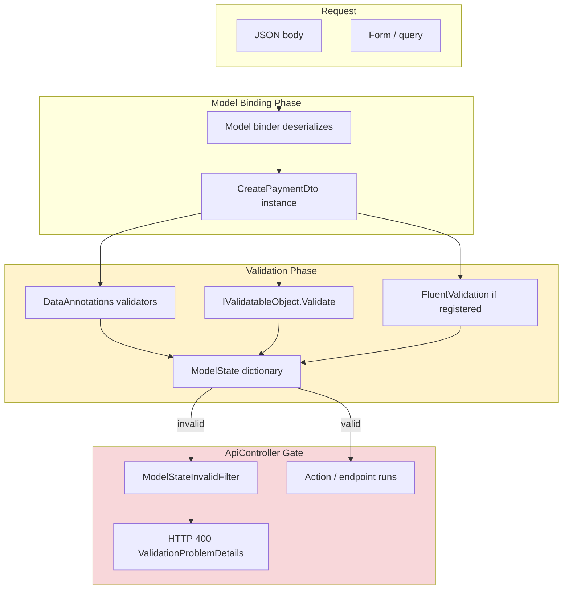
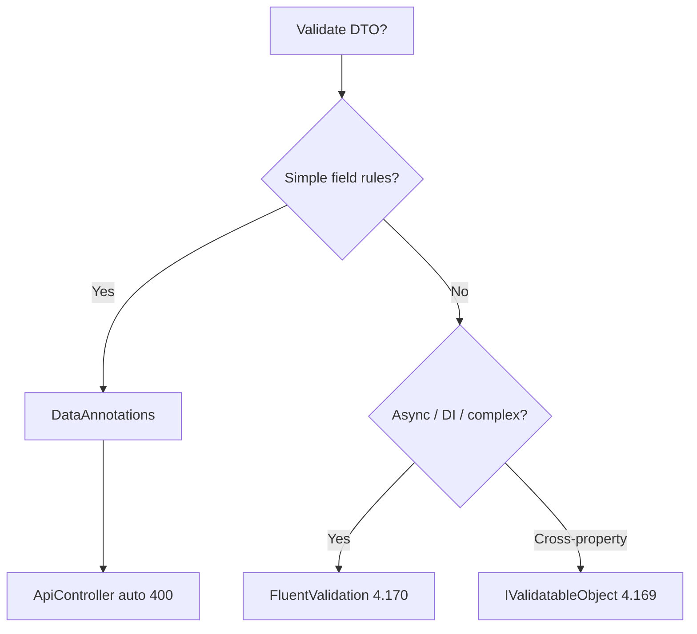

> [!success] Mastery Check
> - [ ] **Studied Well**
> - [ ] **Can explain the concept without notes**
> - [ ] **Can answer interview questions confidently**
> - [ ] **Can implement it in a real project**

# 4.167 — DataAnnotations Validation in ASP.NET Core

---

## PART 0 — Navigation & Context

### Where This Fits in the ASP.NET Core Domain Hierarchy

```
ASP.NET Core Mastery
│
├── Model Binding (4.100–4.102)
│   └── 4.102 — Model Validation: DataAnnotations and ModelState
│
├── MVC & Controllers (4.098+)
│   └── 4.101 — [ApiController] automatic 400 on invalid ModelState
│
└── Validation (4.167–4.176)
    ├── ► 4.167 — DataAnnotations ◄ YOU ARE HERE
    │           [Required], [StringLength], [Range], [EmailAddress]
    │           System.ComponentModel.DataAnnotations
    ├── 4.168 — ModelState errors and custom responses
    ├── 4.169 — Custom ValidationAttribute / IValidatableObject
    ├── 4.170 — FluentValidation (replacement for complex rules)
    └── 4.174 — SuppressModelStateInvalidFilter
```

### What You Need Before This

| Prerequisite | Why You Need It |
|---|---|
| [[4.100 — Model Binding]] | Validation runs **after** deserialization into the model — binding failures are separate from validation failures |
| [[4.101 — ApiController]] | `[ApiController]` registers `ModelStateInvalidFilter` that returns HTTP 400 before the action when `ModelState.IsValid == false` |
| [[4.102 — Model Validation]] | Overview of how validators plug into the MVC object model validator |

### What This Unlocks After

| Next Topic | Dependency |
|---|---|
| [[4.168 — ModelState]] | Reading errors, customizing `InvalidModelStateResponseFactory` |
| [[4.170 — FluentValidation]] | When DataAnnotations are insufficient — async, DI, complex rules |
| [[4.169 — IValidatableObject]] | Cross-property rules beyond single-property attributes |

### Why This Matters at Scale

> **DataAnnotations are the zero-dependency validation layer on every DTO — when `[Required]` on a non-nullable `int` silently accepts `0`, or when teams skip server validation because "the SPA validates," invalid payment amounts and SQL injection payloads reach your domain at 10k req/s; `[ApiController]` turns every ModelState failure into HTTP 400 `ValidationProblemDetails` before your handler runs — if ModelState was populated correctly.**

---

## PART 1 — The Core Mental Model

### The Fundamental Rule

> **DataAnnotations `ValidationAttribute` subclasses on model properties execute during ASP.NET Core's model validation phase immediately after model binding — each failure adds a `ModelError` to `ModelState` keyed by property name, and with `[ApiController]`, an invalid `ModelState` short-circuits the pipeline to HTTP 400 with a structured `errors` dictionary before the action or Minimal API delegate executes.**

### The Plain-Language Analogy

The HTTP request arrives with a **customs declaration form** (JSON body deserialized to a CTO). DataAnnotations are the **printed rules on the form margin**: "amount required," "email format," "quantity 1–999." Customs officers (the validation infrastructure) stamp red marks next to fields before you enter the country (business logic). With `[ApiController]`, the airport has a policy: **any form with red marks is automatically turned away at the desk** — you never reach the gate agent. The officer doesn't call your accountant (database) — everything is synchronous and local to the form.

### The Taxonomy Diagram



---

## PART 2 — Deep Mechanics

### 2.1 — Pipeline Position

```
──► Routing ──► Authentication ──► Authorization
    ──► Endpoint invocation begins
    ──► Model binding (read body → object)
    ──► Object model validation ◄── DataAnnotations run here
    ──► ModelStateInvalidFilter ([ApiController])
    ──► Action filter pipeline / route delegate
```

**Pipeline position annotation:**

```
// For POST /api/payments:
// Binding: JsonInputFormatter deserializes body
// Validation: DefaultObjectValidator visits each property attribute
// BEFORE: first line of PaymentController.Create() executes
```

**ASP.NET Core internally (approximate):**

```csharp
// DefaultObjectValidator.Validate(...)
//   foreach property with ValidationAttribute
//     attribute.GetValidationResult(value, validationContext)
//     if invalid → ModelState.AddModelError(propertyName, message)
// Class: Microsoft.AspNetCore.Mvc.ModelBinding.Validation.DefaultObjectValidator
```

**Runtime cost:** `~0.01–0.1ms` per property attribute; sync only; no DI.

---

### 2.2 — HTTP Wire Format on Validation Failure

```
// HTTP request (approximate):
// POST /api/payments HTTP/1.1
// Content-Type: application/json
//
// { "amount": -5, "currency": "US", "payerEmail": "not-an-email" }

// HTTP response (approximate):
// HTTP/1.1 400 Bad Request
// Content-Type: application/problem+json; charset=utf-8
//
// {
//   "type": "https://tools.ietf.org/html/rfc9110#section-15.5.1",
//   "title": "One or more validation errors occurred.",
//   "status": 400,
//   "errors": {
//     "Amount": ["The field Amount must be between 0.01 and 1000000."],
//     "Currency": ["The field Currency must be a string with a minimum length of 3 and a maximum length of 3."],
//     "PayerEmail": ["The PayerEmail field is not a valid e-mail address."]
//   }
// }
```

**Failure mode:** Action never runs — no side effects, no database writes.

---

### 2.3 — Common Built-In Attributes

| Attribute | Validates | Typical HTTP error key |
|---|---|---|
| `[Required]` | non-null, non-empty string | `PropertyName` |
| `[StringLength(max)]` | string length | `PropertyName` |
| `[Range(min,max)]` | numeric range | `PropertyName` |
| `[EmailAddress]` | email format | `PropertyName` |
| `[RegularExpression]` | regex match | `PropertyName` |
| `[Compare("Other")]` | two properties equal | `PropertyName` |
| `[CreditCard]` | Luhn check | `PropertyName` |
| `[Phone]` | phone format | `PropertyName` |
| `[Url]` | URL format | `PropertyName` |

**Edge case:** `[Required]` on `string?` — null fails; empty string `""` fails; whitespace **passes** unless `[MinLength(1)]`.

---

### 2.4 — Nullable Reference Types and Value Types

```csharp
// C# 11+ with nullable reference types enabled:
public class OrderDto
{
    public int Id { get; set; }           // missing JSON → 0, [Required] ineffective
    public int? OptionalId { get; set; }  // missing → null, [Required] fails
    public string Sku { get; set; } = ""; // non-nullable reference — compiler warning if not set
}
```

**HTTP:** POST `{}` with `int Id` → binds `Id=0` → **200 if no other checks** — classic bug.

**Mitigation:** `int?` + `[Required]`, or FluentValidation `.GreaterThan(0)`.

---

### 2.5 — Minimal APIs and DataAnnotations

```csharp
app.MapPost("/api/orders", (CreateOrderDto dto) => Results.Created(...));
// With [ApiController] equivalent: AddControllers or ConfigureApiBehaviorOptions on minimal APIs (.NET 7+)
// Validation runs on bound complex types when metadata present
```

**Cost:** Same validation pass as controllers when automatic validation enabled.

---

### 2.6 — Localization

```csharp
[Required(ErrorMessage = "Amount is required.")]
[Display(Name = "Payment Amount")]
public decimal Amount { get; set; }

// Or resource types:
[Required(ErrorMessageResourceType = typeof(ValidationResources),
          ErrorMessageResourceName = "AmountRequired")]
```

**HTTP:** Error strings in `errors` dictionary reflect culture if request localization configured.

---

## PART 3 — Production Code Patterns

### Pattern 1: Fintech Create Payment DTO

```csharp
public sealed class CreatePaymentDto
{
    [Required]
    [Range(0.01, 1_000_000)]
    public decimal Amount { get; set; }

    [Required]
    [StringLength(3, MinimumLength = 3)]
    [RegularExpression("^[A-Z]{3}$")]
    public string Currency { get; set; } = "";

    [Required]
    [EmailAddress]
    public string PayerEmail { get; set; } = "";

    [StringLength(140)]
    public string? Memo { get; set; }
}

[ApiController]
[Route("api/payments")]
public class PaymentsController : ControllerBase
{
    [HttpPost]
    public IActionResult Create([FromBody] CreatePaymentDto dto)
    {
        // Only reached if ModelState valid — HTTP would already be 400
        return Ok();
    }
}
```

### Pattern 2: E-Commerce Order Line Validation

```csharp
public sealed class OrderLineDto
{
    [Required]
    [StringLength(32, MinimumLength = 3)]
    public string Sku { get; set; } = "";

    [Range(1, 999)]
    public int Quantity { get; set; }

    [Range(typeof(decimal), "0.01", "99999.99")]
    public decimal UnitPrice { get; set; }
}
```

### Pattern 3: ⚠️ WRONG — Manual BadRequest in Action

```csharp
// ⚠️ WRONG:
[HttpPost]
public IActionResult Create(CreatePaymentDto dto)
{
    if (dto.Amount <= 0)
        return BadRequest("bad amount"); // inconsistent shape, not ValidationProblemDetails
}

// HTTP consequence (wrong path):
// HTTP/1.1 400 Bad Request
// Content-Type: text/plain
// bad amount
```

```csharp
// ✅ CORRECT: rely on DataAnnotations + ApiController
// HTTP consequence (correct path):
// application/problem+json with errors dictionary
```

### Pattern 4: Healthcare Patient Intake — Compare Attribute

```csharp
public class PatientRegistrationDto
{
    [Required]
    [EmailAddress]
    public string Email { get; set; } = "";

    [Required]
    [Compare(nameof(Email))]
    public string ConfirmEmail { get; set; } = "";
}
// Mismatch → HTTP 400 errors on ConfirmEmail
```

### Pattern 5: Logistics Shipment — Display Names for Client Errors

```csharp
[Display(Name = "Delivery Window Start")]
[Required]
public DateTime? WindowStart { get; set; }
```

### Pattern 6: Record Types with Attributes

```csharp
public record CreateShipmentRequest(
    [property: Required] string OriginHubCode,
    [property: Range(1, 500)] int PackageCount);
```

### Pattern 7: Minimal API with ValidationProblem

```csharp
app.MapPost("/api/orders", (CreateOrderDto dto, HttpContext ctx) =>
{
    if (!ctx.ModelState.IsValid)
        return Results.ValidationProblem(ctx.ModelState);
    return Results.Ok();
});
```

---

## PART 4 — Gotchas & Anti-Patterns

### Gotcha 1: [Required] on Non-Nullable int

```csharp
// ⚠️ WRONG:
[Required]
public int ProductId { get; set; }

// POST {} → ProductId = 0 → validation passes
// HTTP: 200 — invalid product 0 processed
```

```csharp
// ✅ CORRECT:
[Range(1, int.MaxValue)]
public int ProductId { get; set; }
// or public int? ProductId with [Required]
```

**WHY:** Value types always have a value; `[Required]` allows 0.

---

### Gotcha 2: Whitespace-Only Strings Pass [Required]

```csharp
[Required]
public string Name { get; set; } = "";

// POST { "name": "   " } → passes Required
```

```csharp
// ✅ CORRECT:
[Required]
[MinLength(1)]
// or trim in setter / use FluentValidation .NotEmpty()
```

---

### Gotcha 3: Async Database Validation in Attribute

```csharp
// ⚠️ WRONG: impossible — ValidationAttribute.IsValid is synchronous
```

```csharp
// ✅ CORRECT: FluentValidation MustAsync (4.171) or service-layer check
```

---

### Gotcha 4: No DI in ValidationAttribute

```csharp
// ⚠️ WRONG: constructor inject ICountryService — not called by DI
```

```csharp
// ✅ CORRECT: IValidatableObject with validationContext.GetService(typeof(ICountryService))
// or FluentValidation with constructor injection
```

---

### Gotcha 5: Client-Side Only Validation

```csharp
// SPA validates with JavaScript only — attacker sends curl without validation
// HTTP: 200 if server has no DataAnnotations
```

**WHY:** Server must always validate; client validation is UX only.

---

## PART 5 — Performance Implications

| Scenario | Allocations | Latency | Recommendation |
|---|---|---|---|
| 5 attributes on DTO | ~0 | ~0.05ms | Default |
| 30 properties × 2 attributes | ~few | ~0.3ms | Fine |
| 200 properties | moderate | ~2ms | Split DTOs or FluentValidation |
| Regex attribute on hot path | ~1 per check | ~0.1ms | Precompile pattern |
| IValidatableObject sync DB | N/A in attribute | — | Don't — use async FV |
| Validation vs binding | binding dominates | JSON parse cost >> validation |

### BenchmarkDotNet

```csharp
[MemoryDiagnoser]
public class DataAnnotationsBenchmark
{
    private CreatePaymentDto _valid = new()
    {
        Amount = 100, Currency = "USD", PayerEmail = "a@b.com"
    };

    [Benchmark]
    public bool ManualRangeCheck()
        => _valid.Amount >= 0.01m && _valid.Amount <= 1_000_000m;

    [Benchmark]
    public ValidationResult? RequiredAttributeCheck()
    {
        var attr = new RequiredAttribute();
        return attr.GetValidationResult(_valid.PayerEmail, new ValidationContext(_valid));
    }
}
// Expected: both ~50-200ns — validation not the bottleneck; JSON deserialization is.
```

### When to Care / Ignore

**Care:** Huge DTOs with regex on every field at 50k req/s.

**Ignore:** Typical REST DTOs with <20 attributes.

---

## PART 6 — Interview Arsenal

**Q1: When do DataAnnotations run in the pipeline?**

> **Great Answer:** After model binding deserializes the body into the DTO, before the action runs. Failures go into ModelState. With ApiController, invalid ModelState returns HTTP 400 ValidationProblemDetails automatically — the client sees an errors object keyed by property name. My action code never runs on invalid input.

**Q2: Why doesn't [Required] work on int?**

> **Great Answer:** Non-nullable value types default to 0 when JSON omits the field — Required considers 0 a value. I use Range(1, int.MaxValue) or int? with Required.

**Trick:** "DataAnnotations can call the database" — false synchronously; use FluentValidation async.

**Red flags:** "We validate in the Angular app only"; "Required on int prevents missing IDs".

---

## PART 7 — Decision Framework



---

## PART 8 — Self-Check

1. What HTTP status does ApiController return on invalid ModelState?
2. Does validation run before or after model binding?
3. Why does POST `{}` pass `int Id` with [Required]?

**Puzzle:**

```csharp
public class Dto { [Required] public int Qty { get; set; } }
// POST { } → Qty?
```

<details><summary>Answer</summary>Qty=0, validation passes, likely **200** — Required ineffective.</details>

---

## PART 9 — Connections & Resources

| Topic | Why |
|---|---|
| [[4.168 — ModelState]] | Error dictionary |
| [[4.170 — FluentValidation]] | Complex rules |
| [[4.101 — ApiController]] | Auto 400 |

- [Model validation in ASP.NET Core](https://learn.microsoft.com/en-us/aspnet/core/mvc/models/validation)

> [!NOTE] Parts 0–9: DataAnnotations at binding/validation boundary, HTTP 400 shape, value-type Required trap.
