# 4.167 — IHostedService vs BackgroundService: The Lifecycle

## PART 0 — Navigation & Context

```text
ASP.NET Core Domain Hierarchy
├── Web Hosting & Startup
│   ├── 4.030 The Generic Host Builder
│   └── 4.033 Kestrel Web Server
├── Background Tasks
│   ├── 4.167 IHostedService vs BackgroundService ◄ YOU ARE HERE
│   └── 4.168 Hangfire & Distributed Task Queues
└── Architecture
```

**What you need before this:**
- [[4.030 — The Generic Host Builder]] — Understanding how the modern .NET application boots and manages lifetimes.
- `Task` and `CancellationToken` (Threading fundamentals).

**What this unlocks after:**
- Implementing Kafka / RabbitMQ consumer loops.
- Running CRON jobs and scheduled cleanup tasks directly inside the API.
- Graceful shutdown sequences (draining connections before shutting down Kestrel).

**Why this matters to a production engineer at scale:**
Most developers assume ASP.NET Core is just for HTTP requests. But in modern microservices, an API often needs to run background loops—like pulling messages off a Kafka topic or flushing telemetry batches to disk every 5 seconds. If you just spin up a `Task.Run()` in `Program.cs`, the task has no awareness of the application lifecycle. When Kubernetes sends a SIGTERM to scale down your pod, your background task gets brutally terminated mid-execution, causing data corruption. `IHostedService` integrates your background work directly into the Host Lifecycle, guaranteeing graceful startup and coordinated, safe shutdowns.

---

## PART 1 — The Core Mental Model

> **The Fundamental Rule**
> **`IHostedService` is the lowest-level contract that hooks into the Host's Start/Stop lifecycle, blocking application startup until `StartAsync` completes; whereas `BackgroundService` is an abstract base class built on top of it that provides a safe, fire-and-forget `ExecuteAsync` loop, explicitly preventing your long-running work from blocking the Kestrel web server from booting.**

**The Plain-Language Analogy**
Imagine a theater putting on a play (the Application).
**`IHostedService` (The Stage Crew):** Their job is setting up the stage before the curtain rises (`StartAsync`) and tearing it down after the audience leaves (`StopAsync`). The play *cannot begin* (HTTP traffic cannot be accepted) until the stage crew finishes setting up.
**`BackgroundService` (The Spotlight Operator):** They turn on the machine before the play, but their main job is a continuous, never-ending loop (following the actors with the light) *while* the play is happening (`ExecuteAsync`). They run concurrently with the actors (the HTTP requests).

**The Taxonomy Diagram**

```mermaid
graph TD
    A[Generic Host Boots Up] --> B{IHostedService Implementations}
    
    B -->|StartAsync() executes| C[Cache Pre-Warmer IHostedService]
    B -->|StartAsync() executes| D[BackgroundService Wrapper]
    
    C -->|Blocks boot until finished| E[Host continues...]
    
    D -->|Fires ExecuteAsync() onto ThreadPool| F[ExecuteAsync Loop]
    D -->|Returns immediately| E
    
    E --> G[Kestrel Starts Accepting HTTP Requests]
    
    F -.->|Runs Concurrently| G
    
    H[SIGTERM Received] --> I[Host calls StopAsync()]
    I -->|Signals CancellationToken| F
    I -->|Graceful Teardown| C
    
    style A fill:#2d3436,stroke:#b2bec3,stroke-width:2px,color:#fff
    style C fill:#0984e3,stroke:#74b9ff,stroke-width:2px,color:#fff
    style D fill:#00b894,stroke:#55efc4,stroke-width:2px,color:#fff
    style G fill:#d63031,stroke:#ff7675,stroke-width:2px,color:#fff
```

---

## PART 2 — Deep Mechanics

### 1. The Host Boot Sequence

When `builder.Build().Run()` executes in `Program.cs`, the Generic Host (`IHost`) coordinates startup:

1. Triggers `IHostedService.StartAsync()` on every registered hosted service, **in the order they were registered**.
2. If any `StartAsync` returns an incomplete `Task` (meaning it yielded/awaited something), the Host **waits** for it to complete before moving to the next one.
3. Kestrel (the web server) is itself implemented as an `IHostedService`. It is generally started *last*.
4. Once all `StartAsync` methods finish, the app logs: "Application started. Press Ctrl+C to shut down."

### 2. The Danger of IHostedService

If you implement a never-ending `while(true)` loop directly inside `IHostedService.StartAsync()`, the method will never return a completed `Task`. The Host boot sequence blocks forever. Kestrel never starts. Your API is dead on arrival.

```csharp
// ⚠️ DEADLY IHostedService
public async Task StartAsync(CancellationToken cancellationToken)
{
    while (!cancellationToken.IsCancellationRequested) // Infinite loop!
    {
        await ProcessQueue(); 
    }
}
```

### 3. The Brilliance of BackgroundService

Microsoft created the `BackgroundService` abstract class to solve the infinite-loop problem. 

```csharp
// Framework Source Behavior (Simplified BackgroundService)
public abstract class BackgroundService : IHostedService, IDisposable
{
    private Task _executingTask;
    private readonly CancellationTokenSource _cts = new();

    protected abstract Task ExecuteAsync(CancellationToken stoppingToken);

    public virtual Task StartAsync(CancellationToken cancellationToken)
    {
        // 1. Fire and forget the long-running work
        _executingTask = ExecuteAsync(_cts.Token);

        // 2. If the work is already done, return the completed task
        if (_executingTask.IsCompleted) return _executingTask;

        // 3. ✅ Return a COMPLETED task immediately so the Host can continue booting!
        return Task.CompletedTask; 
    }

    public virtual async Task StopAsync(CancellationToken cancellationToken)
    {
        // Cancel the token to break the while() loop in ExecuteAsync
        _cts.Cancel();
        
        // Wait for the long-running work to finish cleaning up (Graceful Shutdown)
        await Task.WhenAny(_executingTask, Task.Delay(Timeout.Infinite, cancellationToken));
    }
}
```

### 4. The Graceful Shutdown Sequence

When the OS sends a termination signal (SIGTERM, Ctrl+C):
1. Kestrel stops accepting new HTTP connections immediately.
2. The Host triggers `IHostedService.StopAsync()` on all services **in reverse order of registration**.
3. It passes a `CancellationToken` to `StopAsync` that usually expires after **5 seconds** (configurable via `HostOptions.ShutdownTimeout`).
4. If your `BackgroundService` doesn't exit its `while` loop within 5 seconds, the Host forcefully abandons it and terminates the process. Data in memory is lost.

---

## PART 3 — Production Code Patterns

### Pattern 1: The Standard BackgroundService Loop
The workhorse of modern ASP.NET Core background processing (Queues, CRONs).

```csharp
public class EmailQueueWorker : BackgroundService
{
    private readonly ILogger<EmailQueueWorker> _logger;

    public EmailQueueWorker(ILogger<EmailQueueWorker> logger) => _logger = logger;

    // ✅ CORRECT: The single method you must implement
    protected override async Task ExecuteAsync(CancellationToken stoppingToken)
    {
        _logger.LogInformation("Email Worker starting.");

        // Loop runs continuously until shutdown is requested
        while (!stoppingToken.IsCancellationRequested)
        {
            try
            {
                // Must pass the stoppingToken to all async methods!
                await ProcessEmailsAsync(stoppingToken); 
            }
            catch (Exception ex)
            {
                // ✅ CORRECT: Catch exceptions inside the loop so the worker doesn't die forever
                _logger.LogError(ex, "Error processing emails.");
            }

            // Yield the thread to prevent CPU pegging
            await Task.Delay(5000, stoppingToken);
        }

        _logger.LogInformation("Email Worker stopping gracefully.");
    }

    private async Task ProcessEmailsAsync(CancellationToken ct) { /* I/O Work */ }
}

// Program.cs
builder.Services.AddHostedService<EmailQueueWorker>();
```

### Pattern 2: The Setup/Teardown IHostedService (No Loops)
When you need to execute one-off logic *before* the application accepts traffic (e.g., creating database tables, warming up a Redis cache). Do not use `BackgroundService` for this.

```csharp
public class CachePreWarmerService : IHostedService
{
    private readonly IRedisCache _cache;
    private readonly ILogger<CachePreWarmerService> _logger;

    public CachePreWarmerService(IRedisCache cache, ILogger<CachePreWarmerService> logger)
    {
        _cache = cache;
        _logger = logger;
    }

    public async Task StartAsync(CancellationToken cancellationToken)
    {
        _logger.LogInformation("Warming up cache. HTTP server is blocked until this finishes.");
        
        // Simulating heavy DB query to warm cache
        var data = await FetchDataAsync(cancellationToken);
        await _cache.SetAsync("global_data", data, cancellationToken);
        
        _logger.LogInformation("Cache warmed. Allowing HTTP server to boot.");
    }

    public Task StopAsync(CancellationToken cancellationToken)
    {
        // Cleanup if necessary (e.g., closing manual connections)
        return Task.CompletedTask;
    }
}

// Program.cs
// Registration order matters! Register this BEFORE Kestrel/other services
builder.Services.AddHostedService<CachePreWarmerService>();
```

### Pattern 3: Scoped Service Resolution inside Background Tasks
`IHostedService` / `BackgroundService` are registered as **Singletons**. If you inject a Scoped service (like `ApplicationDbContext`), the application will crash. You must create a manual scope.

```csharp
public class DatabaseCleanupWorker : BackgroundService
{
    private readonly IServiceProvider _serviceProvider;

    public DatabaseCleanupWorker(IServiceProvider serviceProvider)
    {
        _serviceProvider = serviceProvider;
    }

    protected override async Task ExecuteAsync(CancellationToken stoppingToken)
    {
        while (!stoppingToken.IsCancellationRequested)
        {
            // ✅ CORRECT: Create a scope per iteration (or per batch)
            using (var scope = _serviceProvider.CreateScope())
            {
                // Resolve Scoped dependencies from the manual scope
                var dbContext = scope.ServiceProvider.GetRequiredService<ApplicationDbContext>();
                
                await dbContext.Database.ExecuteSqlRawAsync(
                    "DELETE FROM Logs WHERE Created < GETDATE() - 30", stoppingToken);
            }

            await Task.Delay(TimeSpan.FromHours(1), stoppingToken);
        }
    }
}
```

### Pattern 4: Extending Shutdown Time
If your background task takes 30 seconds to safely flush a batch of telemetry to disk, the default 5-second shutdown timeout will brutally kill it. You must configure the host.

```csharp
// Program.cs
builder.Services.Configure<HostOptions>(options =>
{
    // ✅ CORRECT: Gives BackgroundServices 30 seconds to finish their current loop iteration
    // before forcefully killing the process.
    options.ShutdownTimeout = TimeSpan.FromSeconds(30);
});
```

### Pattern 5: Concurrent Queued Background Tasks
If you want the API to accept an HTTP request, push the work to a background thread, and return 202 Accepted immediately, you use a `Channel<T>` combined with a `BackgroundService` consumer.

```csharp
// 1. Singleton Channel wrapper
public class BackgroundTaskQueue
{
    private readonly Channel<Func<CancellationToken, Task>> _queue;

    public BackgroundTaskQueue()
    {
        var options = new BoundedChannelOptions(100) { FullMode = BoundedChannelFullMode.Wait };
        _queue = Channel.CreateBounded<Func<CancellationToken, Task>>(options);
    }

    public async ValueTask QueueBackgroundWorkItemAsync(Func<CancellationToken, Task> workItem) =>
        await _queue.Writer.WriteAsync(workItem);

    public async ValueTask<Func<CancellationToken, Task>> DequeueAsync(CancellationToken ct) =>
        await _queue.Reader.ReadAsync(ct);
}

// 2. The BackgroundService Consumer
public class QueuedHostedService : BackgroundService
{
    private readonly BackgroundTaskQueue _taskQueue;

    public QueuedHostedService(BackgroundTaskQueue taskQueue) => _taskQueue = taskQueue;

    protected override async Task ExecuteAsync(CancellationToken stoppingToken)
    {
        // Loop reads from the Channel asynchronously. Yields thread if empty.
        while (!stoppingToken.IsCancellationRequested)
        {
            var workItem = await _taskQueue.DequeueAsync(stoppingToken);

            try { await workItem(stoppingToken); }
            catch (Exception ex) { /* Log */ }
        }
    }
}

// 3. The Controller (Producer)
[HttpPost("generate-report")]
public async Task<IActionResult> GenerateReport([FromServices] BackgroundTaskQueue queue)
{
    await queue.QueueBackgroundWorkItemAsync(async token => 
    {
        // Heavy CPU work done in the background
        await _reportService.GenerateAsync(token);
    });

    return Accepted("Report generation started in background.");
}
```

---

## PART 4 — Gotchas & Anti-Patterns

### Gotcha 1: Blocking ExecuteAsync Synchronously
`ExecuteAsync` fires synchronously until the very first `await`. If you put heavy synchronous CPU work before the first `await`, you block the Host boot sequence!

// ⚠️ WRONG CODE
```csharp
protected override Task ExecuteAsync(CancellationToken stoppingToken)
{
    // Synchronous blocking work!
    Thread.Sleep(5000); 
    
    while (!stoppingToken.IsCancellationRequested) { ... }
}
```

// HTTP consequence (wrong path):
// The web server refuses to boot for 5 seconds because `StartAsync` calls `ExecuteAsync` synchronously.

// ✅ CORRECT CODE
```csharp
protected override async Task ExecuteAsync(CancellationToken stoppingToken)
{
    // The very first line should yield control back to the Host!
    await Task.Yield(); 
    
    // Now you are on a background thread
    Thread.Sleep(5000); 
    while (!stoppingToken.IsCancellationRequested) { ... }
}
```

### Gotcha 2: Unhandled Exceptions in ExecuteAsync
Prior to .NET 6, an unhandled exception in `ExecuteAsync` would silently kill the background worker, but the ASP.NET Core API would stay alive, leaving developers completely unaware that background jobs stopped running weeks ago.
In .NET 6+, an unhandled exception inside a `BackgroundService` **crashes the entire application process**.

// ⚠️ WRONG CODE
```csharp
protected override async Task ExecuteAsync(CancellationToken stoppingToken)
{
    while (!stoppingToken.IsCancellationRequested)
    {
        // If this throws, the entire API shuts down!
        await ProcessMessageAsync(); 
    }
}
```

// ✅ CORRECT CODE
```csharp
protected override async Task ExecuteAsync(CancellationToken stoppingToken)
{
    while (!stoppingToken.IsCancellationRequested)
    {
        try { await ProcessMessageAsync(); }
        catch (Exception ex) { _logger.LogError(ex, "Caught exception, continuing loop"); }
    }
}
```
*Note: If you WANT the pre-.NET 6 behavior (silent death without crashing the API), configure `HostOptions.BackgroundServiceExceptionBehavior = BackgroundServiceExceptionBehavior.Ignore`.*

### Gotcha 3: Captive Dependencies (Injecting Scoped into Singleton)
This is the #1 mistake developers make with background services.

// ⚠️ WRONG CODE
```csharp
public class Worker : BackgroundService
{
    // ApplicationDbContext is Scoped! Worker is Singleton!
    public Worker(ApplicationDbContext dbContext) { } 
}
```

// HTTP consequence (wrong path):
// System.InvalidOperationException at application startup: Cannot consume scoped service 'ApplicationDbContext' from singleton 'Worker'.

// ✅ CORRECT CODE
```csharp
// Inject IServiceProvider, and use using var scope = _provider.CreateScope(); inside ExecuteAsync.
```

### Gotcha 4: Ignoring the CancellationToken
When scaling down Kubernetes pods, you get 5 seconds to gracefully stop. If your work ignores the cancellation token, the process is SIGKILL'd forcefully.

// ⚠️ WRONG CODE
```csharp
while (!stoppingToken.IsCancellationRequested)
{
    // The HTTP call takes 10 seconds and doesn't accept the token
    var response = await _httpClient.GetAsync("http://slow-api.com"); 
}
```

// HTTP consequence (wrong path):
// If the app receives a shutdown signal during the 10-second HTTP call, it cannot abort it. 5 seconds later, the OS forcefully terminates the process.

// ✅ CORRECT CODE
```csharp
// Pass the stoppingToken down the ENTIRE async call stack!
var response = await _httpClient.GetAsync("http://slow-api.com", stoppingToken); 
```

### Gotcha 5: Starting Background Services in IIS In-Process
If you host ASP.NET Core in IIS In-Process, IIS suspends application pools if there is no HTTP traffic.
If your `BackgroundService` is doing CRON-like tasks, it will completely stop running on weekends or nights when nobody is visiting the website.

// ✅ CORRECT CODE
```csharp
// If you rely on BackgroundServices for CRON jobs, you MUST configure the IIS Application Pool 
// 'Start Mode' to 'AlwaysRunning', and 'Idle Time-out' to 0. 
// Alternatively, move critical background tasks to a dedicated Windows Service or Linux Daemon.
```

---

## PART 5 — Performance Implications

### Request Pipeline Characteristics

| Scenario | Pipeline Depth | Allocations | Approx Latency Impact | Recommendation |
|---|---|---|---|---|
| `IHostedService.StartAsync` | Startup | N/A | Variable | Blocks Kestrel boot. Good for pre-warm. |
| `BackgroundService` loop | Background | Low | 0ms | Runs concurrently. Use `Task.Yield()`. |
| `Channel<T>` Queue | Background | Low | ~0.1ms dispatch | Perfect for fire-and-forget API responses. |

### BenchmarkDotNet Code

*(Benchmarking a background infinite loop directly is counterproductive, but we can benchmark the dispatch overhead of a `Channel<T>` vs `Task.Run()`)*

```csharp
using BenchmarkDotNet.Attributes;
using System.Threading.Channels;

[MemoryDiagnoser]
public class BackgroundDispatchBenchmark
{
    private Channel<int> _channel;

    [GlobalSetup]
    public void Setup()
    {
        _channel = Channel.CreateUnbounded<int>();
        // Fire consumer
        _ = Task.Run(async () => {
            await foreach(var _ in _channel.Reader.ReadAllAsync()) { }
        });
    }

    [Benchmark(Baseline = true)]
    public Task FireAndForgetTaskRun()
    {
        // Spawns a new state machine on the ThreadPool
        return Task.Run(() => { /* work */ });
    }

    [Benchmark]
    public ValueTask WriteToChannel()
    {
        // Writes to queue, picked up by existing BackgroundService
        return _channel.Writer.WriteAsync(1);
    }
}

// Expected output (approximate, .NET 8, x64, local):
// Method               | Mean      | Error     | StdDev    | Gen0   | Allocated |
// -------------------- |----------:|----------:|----------:|-------:|----------:|
// FireAndForgetTaskRun | 450.2 ns  |  8.2 ns   |  7.6 ns   | 0.0315 |     192 B |
// WriteToChannel       |  65.1 ns  |  1.5 ns   |  1.4 ns   | 0.0100 |      72 B |
```

**When to Care:** If an API receives 5,000 RPS and fires off a background task for every request (e.g., logging/telemetry), doing `Task.Run` 5,000 times a second creates massive ThreadPool contention. Writing to an in-memory `Channel` consumed by a single `BackgroundService` is 7x faster and heavily reduces GC allocations.

---

## PART 6 — Interview Arsenal

### A. The Question Bank

**Question 1:** "What is the architectural difference between implementing `IHostedService` directly versus inheriting from `BackgroundService`?"
- **Average Answer:** "`BackgroundService` is easier because you just write one method."
- **Why That's Insufficient:** Misses the critical concept of blocking startup.
- **Great Answer:** "`IHostedService` exposes `StartAsync` and `StopAsync`. The Generic Host boots synchronously through all registered hosted services. If you put a long-running loop directly in `StartAsync`, the Host will block forever, and your web server will never start. `BackgroundService` is an abstract class that implements `IHostedService` for you. Inside its `StartAsync`, it fires your `ExecuteAsync` implementation onto the ThreadPool and immediately returns a completed Task, allowing the Host to continue booting Kestrel while your background loop runs concurrently."

**Question 2:** "You have a `BackgroundService` that processes messages from Azure Service Bus. You need to write the message to SQL Server using Entity Framework Core. How do you inject `ApplicationDbContext` into the worker?"
- **Average Answer:** "Inject it through the constructor of the BackgroundService."
- **Why That's Insufficient:** Generates a Captive Dependency Exception and crashes on startup.
- **Great Answer:** "Because `BackgroundService` is a Singleton, you cannot inject `ApplicationDbContext`, which is Scoped. If you do, the DI container throws a Captive Dependency exception. Instead, you must inject `IServiceProvider`. Inside the `ExecuteAsync` loop, you use `_serviceProvider.CreateScope()` to manually create a new scope for every message (or batch of messages). You then resolve the `ApplicationDbContext` from that scope, process the data, and dispose the scope when the iteration completes."

**Question 3:** "During a deployment, Kubernetes sends a SIGTERM to your API to scale it down. Your `BackgroundService` is in the middle of a 20-second API call. What happens, and how do you ensure the API call finishes safely?"
- **Average Answer:** "The app shuts down instantly. There's nothing you can do."
- **Why That's Insufficient:** Misses graceful shutdown configuration and `CancellationToken` usage.
- **Great Answer:** "When SIGTERM is received, the Host triggers `StopAsync` and signals the `CancellationToken` passed to `ExecuteAsync`. By default, the Host waits exactly 5 seconds for background tasks to complete before forcefully terminating the process. To ensure safety: 1. You must pass the `CancellationToken` down to the `HttpClient` so it can abort if safe, or 2. Catch the cancellation, finish the critical write, and exit cleanly. If 20 seconds is fundamentally required, you must override `HostOptions.ShutdownTimeout` in `Program.cs` to give the Host more than 5 seconds to drain its background workers gracefully."

### B. The Trick Questions

**Trick Question:** "If I throw an exception inside my `BackgroundService`'s `ExecuteAsync` method in .NET 8, what happens to the rest of the application?"
- **The Trap:** Legacy .NET Core 3.1 behavior vs Modern .NET behavior.
- **The Correct Answer:** "In modern .NET (6+), an unhandled exception inside a `BackgroundService` will crash the entire Host process. Your web server will go down. This was a deliberate design change by Microsoft to prevent silent failures where APIs stayed alive but stopped processing background queues. You must wrap your `while` loop logic in a robust `try/catch` block."

**Trick Question:** "I registered `builder.Services.AddHostedService<MyWorker>()` AFTER I registered `builder.WebHost.UseKestrel()`. Does it start before or after the web server?"
- **The Trap:** Thinking registration order doesn't matter.
- **The Correct Answer:** "Hosted services are executed sequentially in the exact order they are registered in the DI container. Kestrel is registered internally as an `IHostedService` (via `AddControllers`/`AddRouting` pipeline). If you register your worker *after* the web framework infrastructure, it will start *after* Kestrel starts accepting HTTP requests. If you want it to pre-warm caches before traffic arrives, it must be registered first."

### C. Red Flags to Avoid
- 🚩 **"I just use `Task.Run` in my controllers instead of `BackgroundService`."** (Fire-and-forget tasks in controllers have zero awareness of application shutdown and will be instantly killed mid-execution when the app restarts).
- 🚩 **"I use `BackgroundService` for my hourly CRON jobs on an IIS Server."** (IIS suspends inactive application pools, rendering background CRONs unreliable without explicit configuration).

---

## PART 7 — Decision Framework

```mermaid
graph TD
    A[Background Work Requirement] --> B{Does it run continuously?}
    
    B -->|Yes| C[Use BackgroundService]
    B -->|No, one-off at startup| D[Use IHostedService]
    
    C --> E{Does it process HTTP payloads?}
    E -->|Yes| F[Controller writes to Channel, Worker reads]
    E -->|No, pulls from Kafka/Rabbit| G[Worker polls directly]
    
    D --> H{Can Kestrel accept traffic before it finishes?}
    H -->|Yes| I[Run logic in Task.Run inside StartAsync]
    H -->|No e.g. Cache warmup| J[AWAIT logic in StartAsync]
    
    style A fill:#2d3436,stroke:#fff
    style C fill:#0984e3,stroke:#fff
    style D fill:#0984e3,stroke:#fff
    style F fill:#00b894,stroke:#fff
    style J fill:#d63031,stroke:#fff
```



---

## PART 8 — Self-Check

### A. Conceptual Questions
1. Why does an infinite loop inside `IHostedService.StartAsync` break the application?
2. How does `BackgroundService` solve the blocking startup problem?
3. What is the default shutdown timeout for ASP.NET Core hosted services?
4. How do you safely consume a Scoped service (like `DbContext`) inside a `BackgroundService`?
5. What happens to the Host process in .NET 8 if an unhandled exception occurs in `ExecuteAsync`?
6. Why is a `Channel<T>` preferred over `Task.Run()` for offloading work from an HTTP Controller?
7. In what order are `IHostedService.StartAsync()` and `StopAsync()` executed relative to DI registration?
8. Why is hosting a `BackgroundService` inside IIS potentially unreliable?

### B. Code Puzzles

**Puzzle 1: The Deadlock**
```csharp
public async Task StartAsync(CancellationToken token) {
    _workerTask = ExecuteAsync();
    _workerTask.Wait(); // 💥
}
```
*Scenario:* A developer writes their own `BackgroundService` base class. 
<details>
<summary>Answer</summary>
Calling `.Wait()` synchronously blocks the thread executing `StartAsync` until the infinite worker loop finishes (which is never). The application deadlocks on startup. 
*Fix:* Do not await or wait on the execution task. Store the `Task` in a variable and return `Task.CompletedTask` immediately.
</details>

**Puzzle 2: The Eager Cancellation**
```csharp
protected override async Task ExecuteAsync(CancellationToken stoppingToken) {
    while (true) {
        await DoWorkAsync(stoppingToken); // If cancelled, this throws TaskCanceledException
    }
}
```
*Scenario:* The app receives a shutdown signal. What happens?
<details>
<summary>Answer</summary>
When shutdown begins, `stoppingToken` is canceled. `DoWorkAsync` throws an unhandled `OperationCanceledException` (or `TaskCanceledException`). In .NET 6+, this unhandled exception crashes the app aggressively rather than allowing a clean exit.
*Fix:* Change the loop condition to `while (!stoppingToken.IsCancellationRequested)` AND wrap the internal work in a `try/catch(OperationCanceledException)`.
</details>

**Puzzle 3: The Ghost Tasks**
```csharp
[HttpPost]
public IActionResult Fire() {
    Task.Run(async () => await _emailService.SendAsync());
    return Ok();
}
```
*Scenario:* The server restarts exactly 1 ms after `return Ok();` executes.
<details>
<summary>Answer</summary>
The `Task.Run` is completely disconnected from the ASP.NET Core application lifecycle. When the server restarts, the OS tears down the process memory. The email is never sent. 
*Fix:* Use `IHostedService` combined with `Channel<T>` for reliable background queuing that can drain cleanly on shutdown.
</details>

**Puzzle 4: The Abandoned Await**
```csharp
protected override async Task ExecuteAsync(CancellationToken ct) {
    await Task.Yield();
    await _bus.StartProcessingAsync(); // RabbitMQ listener, returns immediately
    
    // Missing loop?
}
```
*Scenario:* The worker uses a third-party event-based library (like MassTransit or RabbitMQ).
<details>
<summary>Answer</summary>
If `StartProcessingAsync` returns immediately and operates on its own internal threads, `ExecuteAsync` will reach the end of the method and complete. The `BackgroundService` is functionally finished, but the process stays alive. This is generally fine, but to keep the worker semantically "alive" until shutdown, developers often add `await Task.Delay(Timeout.Infinite, ct);` at the end.
</details>

---

## PART 9 — Connections & Resources

### A. Related Topics Table

| Topic | Why It Connects |
|---|---|
| [[4.030 — The Generic Host Builder]] | The engine that orchestrates the Start/Stop sequences of these services. |
| [[4.168 — Hangfire & Distributed Task Queues]] | The next evolution. When `BackgroundService` isn't enough because you need persistence and retries across multiple server nodes. |

### B. Books

| Book | Chapters | Why These Chapters |
|---|---|---|
| ASP.NET Core in Action, 3rd Ed | Chapter 21: Background tasks | Complete breakdown of `IHostedService` vs `BackgroundService`. |
| Concurrency in C# Cookbook | Chapter 12: Synchronization | Deep dive into `Channel<T>` for producer/consumer queues. |

### C. Essential Articles & Docs
- [Microsoft Docs: Background tasks with hosted services](https://learn.microsoft.com/en-us/aspnet/core/fundamentals/host/hosted-services)
- [Stephen Cleary: Background Tasks, Microservices, and IHostedService](https://blog.stephencleary.com/2020/05/background-tasks.html)

> [!NOTE]
> **Template Meta-Note**
> Part 0: Context & Prerequisites. Part 1: Core Mental Model. Part 2: Deep Mechanics & Pipeline. Part 3: Production Code. Part 4: Gotchas. Part 5: Performance. Part 6: Interview Arsenal. Part 7: Decision Framework. Part 8: Puzzles. Part 9: Resources.
