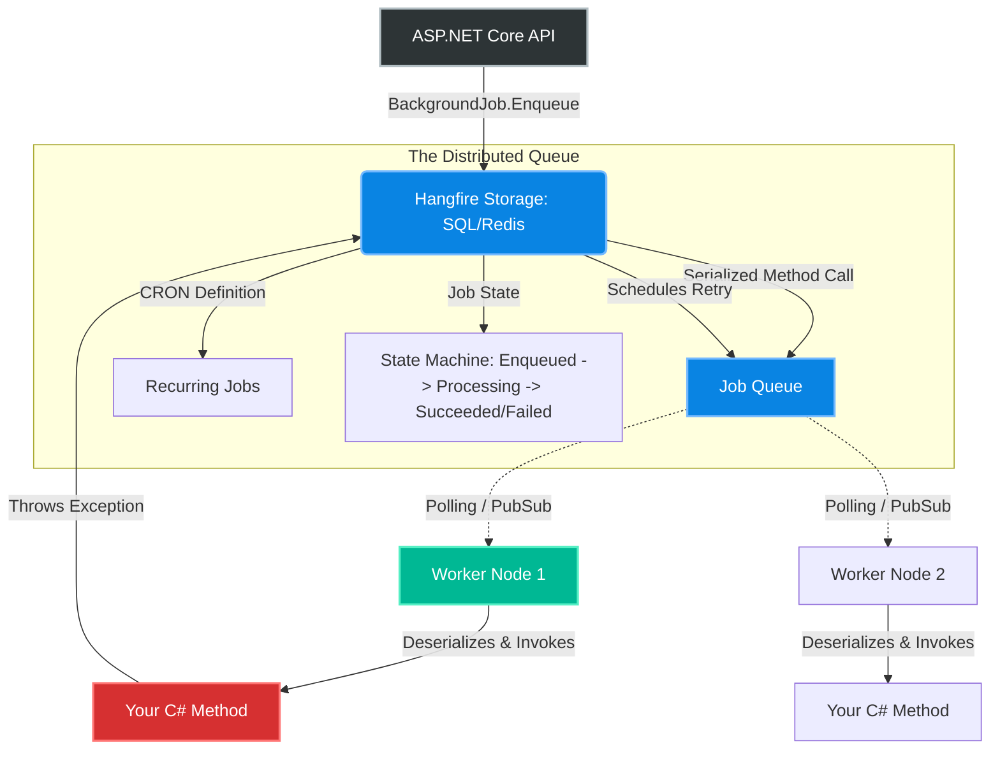

# 4.168 — Hangfire & Distributed Task Queues

## PART 0 — Navigation & Context

```text
ASP.NET Core Domain Hierarchy
├── Background Tasks
│   ├── 4.167 IHostedService vs BackgroundService
│   ├── 4.168 Hangfire & Distributed Task Queues ◄ YOU ARE HERE
│   └── 4.169 Worker Services Project Template
└── Microservices Architecture
    └── Event-Driven Architecture (RabbitMQ/Kafka)
```

**What you need before this:**
- [[4.167 — IHostedService vs BackgroundService The Lifecycle]] — Understanding why in-memory background tasks die when the server restarts.
- Basic knowledge of SQL Server or Redis.

**What this unlocks after:**
- Building resilient batch processing systems (e.g., end-of-month invoicing).
- Scheduling recurring CRON jobs that execute exactly once across a cluster.

**Why this matters to a production engineer at scale:**
If you use a simple `BackgroundService` or `Task.Run` to generate a 5-minute PDF report, and your Kubernetes cluster scales down or restarts the pod mid-generation, that task is lost forever. The user never gets their PDF. If you have 5 load-balanced instances of your API running a `BackgroundService` that fires a "Send Weekly Newsletter" CRON job at 9 AM, your users will receive 5 duplicate emails. 
Hangfire solves both problems by persisting the task state to a database (SQL Server/Redis/Postgres). It guarantees **At-Least-Once execution**, enables **distributed locking** (so a task only runs on one node), and provides automatic retries upon failure. It is the gold standard for robust background processing in the .NET ecosystem short of a full message broker like RabbitMQ.

---

## PART 1 — The Core Mental Model

> **The Fundamental Rule**
> **In-memory background tasks are volatile and local to a single process; Hangfire extracts the *intent* to execute a method, serializes its arguments into a persistent Database Queue, and relies on distributed worker threads to dequeue and execute that method safely, guaranteeing execution even if the web server violently crashes.**

**The Plain-Language Analogy**
Imagine a kitchen with 5 chefs (Your Web Servers).
**In-Memory Tasks:** A waiter tells Chef A, "Make a steak." Chef A starts making it. Suddenly, Chef A has a heart attack (Server Crash). The steak is never finished, and the waiter forgot who ordered it. If the waiter yells "It's 9 PM, everyone clean the floor!", all 5 chefs start cleaning the floor at the same time (Duplicated CRON execution).
**Hangfire:** The waiter writes "Make a steak" on a sticky note and puts it on a central corkboard (The SQL Database). Chef A takes the note and starts cooking. If Chef A has a heart attack, Chef B notices the steak wasn't finished within the timeout, takes the note back, and cooks it. If the note says "Clean the floor at 9 PM," whoever grabs the note first does it; the others see it's already taken.

**The Taxonomy Diagram**



---

## PART 2 — Deep Mechanics

### 1. Job Serialization

When you call `BackgroundJob.Enqueue(() => Console.WriteLine("Hello"))`, Hangfire doesn't pass a memory pointer. It uses Reflection to extract the `Type` (`System.Console`), the `MethodInfo` (`WriteLine`), and serializes the arguments (`"Hello"`) into JSON. 
This JSON is saved to the database.

// Database Record Example:
```json
{
  "Type": "MyAssembly.EmailService, MyAssembly",
  "Method": "SendAsync",
  "ParameterTypes": "[\"System.Int32\"]",
  "Arguments": "[\"123\"]"
}
```

### 2. Distributed Locks

To prevent two worker nodes from picking up the exact same job from the SQL table simultaneously, Hangfire implements Distributed Locks natively within the storage provider (e.g., `sp_getapplock` in SQL Server). 
This guarantees that across 100 Kubernetes pods, exactly ONE pod will execute the job.

### 3. The Hangfire Server (Worker)

The "Server" is the component that pulls jobs from the database and executes them. It runs inside the ASP.NET Core process (usually hooked into the `IHostedService` lifecycle). You can run the Server in the same API process that enqueues the jobs (simplest), or in completely separate, headless Worker services (most scalable).

### 4. Automatic Retries and State Machines

When a method throws an unhandled exception, Hangfire intercepts it. It changes the Job State from `Processing` to `Failed`. A background monitor then moves it back to `Enqueued` with an exponential backoff timer. By default, it retries 10 times over roughly 3 days. If it fails 10 times, it moves to `Deleted`.

---

## PART 3 — Production Code Patterns

### Pattern 1: Setup and Configuration
Configuring Hangfire with SQL Server in an ASP.NET Core 8 application.

```csharp
// Program.cs
// 1. Add Hangfire Storage
builder.Services.AddHangfire(configuration => configuration
    .SetDataCompatibilityLevel(CompatibilityLevel.Version_180)
    .UseSimpleAssemblyNameTypeSerializer()
    .UseRecommendedSerializerSettings()
    .UseSqlServerStorage(builder.Configuration.GetConnectionString("DefaultConnection")));

// 2. Add the Hangfire Server (Worker)
builder.Services.AddHangfireServer(options => {
    // Determine how many concurrent jobs this specific instance can handle
    options.WorkerCount = Environment.ProcessorCount * 5; 
});

var app = builder.Build();

// 3. Add the Dashboard UI (Critical feature of Hangfire)
app.UseHangfireDashboard("/hangfire", new DashboardOptions
{
    // Secure the dashboard in production!
    Authorization = new[] { new HangfireAuthorizationFilter() } 
});
```

### Pattern 2: Fire-and-Forget Jobs
Execute a task in the background immediately, but guarantee it finishes even if the API restarts.

```csharp
[HttpPost("process-image")]
public IActionResult ProcessImage([FromBody] ImageRequest req)
{
    // ✅ CORRECT: Enqueue the ID, NOT the massive Base64 payload!
    // Enqueue returns instantly.
    var jobId = BackgroundJob.Enqueue<IImageProcessor>(x => x.ApplyFilterAsync(req.ImageId));

    return Accepted(new { JobId = jobId });
}

// The Worker Class (Resolved via standard ASP.NET Core DI!)
public class ImageProcessor : IImageProcessor
{
    private readonly ApplicationDbContext _db;
    
    // Scoped dependencies are safely resolved automatically by Hangfire per-job
    public ImageProcessor(ApplicationDbContext db) => _db = db;

    public async Task ApplyFilterAsync(int imageId)
    {
        var image = await _db.Images.FindAsync(imageId);
        // ... heavy processing ...
    }
}
```

### Pattern 3: Delayed Jobs
Execute a task at a specific time in the future.

```csharp
[HttpPost("send-reminder")]
public IActionResult SendReminder(int userId)
{
    // Send email 24 hours from now
    BackgroundJob.Schedule<IEmailService>(
        x => x.SendFollowUpAsync(userId), 
        TimeSpan.FromHours(24));

    return Ok();
}
```

### Pattern 4: Recurring Jobs (CRON)
The replacement for Windows Scheduled Tasks and `IHostedService` loops.

```csharp
public static class JobScheduler
{
    public static void RegisterRecurringJobs()
    {
        // Executes exactly once across the entire server cluster at midnight UTC.
        RecurringJob.AddOrUpdate<IInvoiceGenerator>(
            recurringJobId: "monthly-invoices",
            methodCall: x => x.GenerateAllAsync(),
            cronExpression: Cron.Monthly());
    }
}

// In Program.cs
app.UseHangfireDashboard();
JobScheduler.RegisterRecurringJobs();
```

### Pattern 5: Continuations
Execute a job only when a parent job successfully finishes.

```csharp
var parentId = BackgroundJob.Enqueue<IReportService>(x => x.BuildReportAsync(reportId));

// Will not run until parentId succeeds. If parent fails, this is aborted.
BackgroundJob.ContinueJobWith<IEmailService>(
    parentId, 
    x => x.SendReportReadyEmailAsync(reportId));
```

### Pattern 6: Securing the Dashboard
By default, the Hangfire dashboard is only accessible to local requests (`localhost`). In production, you must explicitly authorize users to view it.

```csharp
public class HangfireAuthorizationFilter : IDashboardAuthorizationFilter
{
    public bool Authorize(DashboardContext context)
    {
        var httpContext = context.GetHttpContext();

        // ✅ CORRECT: Require authentication and a specific role
        return httpContext.User.Identity?.IsAuthenticated == true &&
               httpContext.User.IsInRole("SystemAdmin");
    }
}
```

---

## PART 4 — Gotchas & Anti-Patterns

### Gotcha 1: Passing Large Objects as Arguments
Developers often pass full Domain Entities or large DTOs into the Hangfire method call.

// ⚠️ WRONG CODE
```csharp
var customer = await _db.Customers.FindAsync(123);
// Serializes the entire Customer object (and all its navigation properties!) into the database
BackgroundJob.Enqueue<IEmailService>(x => x.SendWelcomeEmail(customer));
```

// HTTP consequence (wrong path):
// 1. Massive database bloat (Megabytes of JSON in the Hangfire tables per job).
// 2. Data Staleness. If the job executes 5 hours later (due to a queue backlog or retries), it uses the 5-hour-old serialized state of the Customer, ignoring any updates made in the database meanwhile.

// ✅ CORRECT CODE
```csharp
// Pass primitive IDs only!
BackgroundJob.Enqueue<IEmailService>(x => x.SendWelcomeEmail(customer.Id));
```

// Inside `SendWelcomeEmail(int id)`, fetch the absolute latest customer data from the database.

### Gotcha 2: Non-Reentrant / Non-Idempotent Methods
Because Hangfire guarantees *At-Least-Once* execution, a job might execute halfway, throw an exception (or the server crashes), and then Hangfire retries it from the beginning.

// ⚠️ WRONG CODE
```csharp
public async Task ChargeCreditCard(int orderId)
{
    await _stripe.ChargeAsync(100); // Charges the card
    
    // Server crashes EXACTLY HERE before saving to DB
    
    var order = await _db.Orders.FindAsync(orderId);
    order.Status = "Paid";
    await _db.SaveChangesAsync();
}
```

// HTTP consequence (wrong path):
// The job failed because of the crash. Hangfire retries the job. The customer is charged $100 *again*.

// ✅ CORRECT CODE
```csharp
public async Task ChargeCreditCard(int orderId)
{
    var order = await _db.Orders.FindAsync(orderId);
    if (order.Status == "Paid") return; // Idempotency check!

    var idempotencyKey = $"order_charge_{orderId}";
    await _stripe.ChargeAsync(100, new ChargeOptions { IdempotencyKey = idempotencyKey });
    
    order.Status = "Paid";
    await _db.SaveChangesAsync();
}
```

// ALWAYS design background jobs to be completely Idempotent. They must be safe to execute 100 times.

### Gotcha 3: DbContext Lifetime Scopes
Developers coming from older .NET Framework DI setups often misconfigure DbContext injection inside Hangfire jobs.

// ⚠️ WRONG CODE (If DbContext is a Singleton or statically shared)
// Hangfire jobs will use the same DbContext concurrently, throwing threading exceptions.

// ✅ CORRECT CODE
// In ASP.NET Core, Hangfire explicitly creates a new DI `IServiceScope` for EVERY job execution. 
// Standard `AddDbContext` (which is Scoped) works perfectly out of the box. Each job gets its own isolated DbContext.

### Gotcha 4: Abandoning the DI Container
Calling static methods or instantiating services manually inside the Enqueue lambda.

// ⚠️ WRONG CODE
```csharp
// The lambda is executed immediately to extract the expression tree.
// The actual execution happens on a different server, without DI.
BackgroundJob.Enqueue(() => new EmailService().SendAsync(id));
```

// ✅ CORRECT CODE
```csharp
// Let Hangfire use the DI container to resolve the target type
BackgroundJob.Enqueue<IEmailService>(x => x.SendAsync(id));
```

### Gotcha 5: Hangfire SQL Polling Impact
By default, Hangfire SQL Server storage polls the database every 15 seconds to look for new jobs. If you have 50 worker nodes, that's 50 queries every 15 seconds. This is fine. But some developers tune this down to 1 second to make jobs start faster.

// HTTP consequence (wrong path):
// The database is crushed under the weight of thousands of idle polling queries.

// ✅ CORRECT CODE
```csharp
// If you need sub-second dispatch latency, do NOT use SQL Server storage.
// Switch to Hangfire.Redis or Hangfire.Pro (which uses SQL Server Service Broker for push-notifications instead of polling).
```

---

## PART 5 — Performance Implications

### Request Pipeline Characteristics

| Scenario | Pipeline Depth | Allocations | Approx Latency Impact | Recommendation |
|---|---|---|---|---|
| Enqueue Job (SQL) | External I/O | Medium | 2ms - 10ms | Very fast. Safe for APIs. |
| Job Execution | Background | Varies | N/A | Offloads CPU work entirely. |
| Dashboard UI | Admin Only | High | 50ms | Do not expose to public traffic. |

### Architecture Scaling

When a monolith outgrows its compute capacity:
1. **Phase 1:** API + Hangfire Server running in the same process.
2. **Phase 2:** API instance only calls `Enqueue`. Hangfire Server is disabled in the API (`Remove HangfireServer()`). A separate Docker container (Worker Service) boots up, connects to the same SQL database, enables `AddHangfireServer()`, and processes the jobs. You can scale the Web nodes to 10 and the Worker nodes to 50 independently based on CPU load.

---

## PART 6 — Interview Arsenal

### A. The Question Bank

**Question 1:** "We have a 3-node web farm. We need to run a cleanup task every night at 3 AM. If we use a `BackgroundService` with a `Task.Delay` loop, what will go wrong?"
- **Average Answer:** "It will run 3 times."
- **Why That's Insufficient:** Doesn't explain how to solve the distributed lock problem.
- **Great Answer:** "Because all 3 nodes run identical code independently, the `BackgroundService` will fire the cleanup task 3 times simultaneously. Furthermore, if a deployment happens exactly at 3 AM and the pods restart, the task might skip a day entirely. To solve this, we should use a distributed task queue like Hangfire. We register it as a `RecurringJob`. Hangfire stores the CRON schedule in SQL Server. At 3 AM, the 3 nodes attempt to grab the job, but Hangfire uses a distributed database lock (like `sp_getapplock`) to guarantee that exactly one node acquires and executes the job. It also tracks the execution, ensuring it isn't skipped during a deployment."

**Question 2:** "What does it mean for a background job to be 'Idempotent', and why is it critical when using Hangfire?"
- **Average Answer:** "It means you can run it twice without breaking things."
- **Why That's Insufficient:** Needs to tie idempotency directly to Hangfire's At-Least-Once guarantee and retry mechanisms.
- **Great Answer:** "Idempotency means that executing an operation multiple times yields the same state as executing it once. This is absolutely critical in Hangfire because Hangfire guarantees *At-Least-Once* execution. If your job talks to a payment gateway, and the API pod crashes immediately after the payment succeeds but before Hangfire updates the job state to 'Success' in the DB, Hangfire will think the job failed. When the pod restarts, Hangfire will retry the job. If the job is not idempotent, the customer is double-charged. The code must check the database state (or pass idempotency keys to external APIs) before mutating state."

**Question 3:** "Why should you pass primitive IDs (like `userId`) to `BackgroundJob.Enqueue` instead of the whole C# `User` object?"
- **Average Answer:** "Because passing the object makes the database big."
- **Why That's Insufficient:** Misses the functional bug of data staleness.
- **Great Answer:** "Hangfire serializes the arguments into JSON and stores them in the database. First, serializing a large entity graph bloats the Hangfire storage tables and hurts performance. Second, and more importantly, it causes Data Staleness. If the job is delayed by 4 hours, and you serialized the `User` object, your job will execute using the 4-hour-old state of the user. If the user changed their email address in the meantime, your background job will send an email to the old address. Passing just the `userId` forces the worker to query the absolute latest state from the database at the exact moment of execution."

### B. The Trick Questions

**Trick Question:** "If I enqueue a job inside a database transaction, and the transaction rolls back, does the job still execute?"
- **The Trap:** Assuming Hangfire magically hooks into EF Core's transactions.
- **The Correct Answer:** "By default, yes, the job still executes. Hangfire writes to its own tables immediately when you call `Enqueue`. If your EF Core transaction rolls back, the Hangfire job is already in the queue. When the job runs, it will try to look up the database record you inserted, fail to find it, and throw an exception. To fix this, you must either enqueue the job *after* `SaveChanges` succeeds, or use Hangfire's Outbox pattern integrations which enlist the Hangfire write into your EF Core transaction."

**Trick Question:** "Does Hangfire require RabbitMQ or Kafka?"
- **The Trap:** Confusing Task Queues with Message Brokers.
- **The Correct Answer:** "No. Hangfire is a Task Queue that uses persistent storage like SQL Server, Postgres, or Redis to manage state. It handles the queuing, polling, and locking internally. RabbitMQ and Kafka are Message Brokers designed for high-throughput event-driven pub/sub. While you can use Hangfire alongside them, Hangfire is explicitly designed to work without them."

### C. Red Flags to Avoid
- 🚩 **"I write my own background threading loops using `ConcurrentQueue<T>` in memory to avoid the database overhead."** (You have built an unreliable, non-distributed queue that loses data on every deployment. Classic junior over-engineering).
- 🚩 **"I use Hangfire to handle real-time chat messages."** (Hangfire is for background jobs, not real-time pub/sub. Use SignalR or RabbitMQ for real-time streams).

---

## PART 7 — Decision Framework

```mermaid
graph TD
    A[Background Task] --> B{Does it need to survive a server crash?}
    
    B -->|No| C[IHostedService / Channel<T>]
    B -->|Yes| D{Does it execute across multiple nodes?}
    
    D -->|Yes e.g. CRON| E[Use Hangfire]
    D -->|No| F{Are you already using a Message Broker?}
    
    F -->|Yes e.g. RabbitMQ| G[Publish Event to Queue, consume with MassTransit]
    F -->|No| E
    
    E --> H{Throughput requirements?}
    H -->|< 100 jobs/sec| I[Hangfire with SQL Server]
    H -->|> 1000 jobs/sec| J[Hangfire with Redis / Pro]
    
    style A fill:#2d3436,stroke:#fff
    style C fill:#0984e3,stroke:#fff
    style E fill:#00b894,stroke:#fff
    style G fill:#0984e3,stroke:#fff
    style I fill:#00b894,stroke:#fff
    style J fill:#d63031,stroke:#fff
```



---

## PART 8 — Self-Check

### A. Conceptual Questions
1. Why is an in-memory `BackgroundService` dangerous for processing financial transactions?
2. How does Hangfire prevent two instances of your API from executing the same CRON job at 3 AM?
3. What is the Data Staleness problem when serializing method arguments?
4. How does Hangfire know what code to execute on the worker node?
5. What is Idempotency, and why does Hangfire's retry mechanism mandate it?
6. How do you separate the API processing power from the Background Task processing power?
7. What happens if a Hangfire job throws an unhandled exception?
8. How does Hangfire resolve scoped dependencies (like `DbContext`) for a job?

### B. Code Puzzles

**Puzzle 1: The Missing State**
```csharp
[HttpPost]
public IActionResult Upload(IFormFile file) {
    BackgroundJob.Enqueue<IFileParser>(x => x.ParseAsync(file));
    return Ok();
}
```
*Scenario:* Crash at runtime.
<details>
<summary>Answer</summary>
You cannot serialize an `IFormFile` (which represents an active HTTP request stream) into JSON and save it in a database. When the worker tries to deserialize it later, the HTTP request is long gone.
*Fix:* Save the file to disk/Azure Blob Storage synchronously, get the `filePath`/`blobId`, and pass the `blobId` string to `BackgroundJob.Enqueue`.
</details>

**Puzzle 2: The Double Dip**
```csharp
var email = new Email { To = "user@demo.com", Sent = false };
_db.Emails.Add(email);

BackgroundJob.Enqueue(() => SendEmailAndMarkSent(email.Id));

// Wait, the DB transaction hasn't committed yet!
await _db.SaveChangesAsync();
```
*Scenario:* The background job throws "Email with ID 0 not found".
<details>
<summary>Answer</summary>
`Enqueue` writes to Hangfire immediately. The Hangfire worker picks it up instantly (sub-millisecond). The worker tries to find Email ID 0 (or the auto-increment ID hasn't been generated yet). It fails because `SaveChangesAsync` hasn't committed the transaction on the main thread yet.
*Fix:* Always `Enqueue` AFTER `SaveChangesAsync()` completes.
</details>

**Puzzle 3: The Infinite Retry Loop**
```csharp
public void ProcessPayment() {
    throw new CriticalConfigurationException("Stripe API Key is completely missing.");
}
```
*Scenario:* Hangfire retries this 10 times over 3 days, polluting the logs.
<details>
<summary>Answer</summary>
Some exceptions are transient (Network timeout), some are fatal (Missing API key). Retrying a missing API key 10 times won't fix it.
*Fix:* You can decorate the method or exception to prevent retries: `[AutomaticRetry(Attempts = 0)]` on the method, or handle fatal logic explicitly.
</details>

**Puzzle 4: The Shared Instance**
```csharp
var service = new ReportGenerator();
BackgroundJob.Enqueue(() => service.Run());
```
*Scenario:* The job is executed by a separate worker service running on a different machine.
<details>
<summary>Answer</summary>
You captured the specific memory instance of `ReportGenerator` instantiated on the API node. Hangfire will attempt to serialize the state of that object. 
*Fix:* Rely on DI. `BackgroundJob.Enqueue<IReportGenerator>(x => x.Run())`.
</details>

---

## PART 9 — Connections & Resources

### A. Related Topics Table

| Topic | Why It Connects |
|---|---|
| [[4.167 — IHostedService vs BackgroundService The Lifecycle]] | Explains the underlying framework mechanics that host the Hangfire Server. |
| [[4.169 — Worker Services Project Template]] | The ideal project structure for hosting headless Hangfire workers. |
| [[4.043 — Scoped vs Transient vs Singleton]] | Critical for understanding how Hangfire resolves dependencies per job. |

### B. Books

| Book | Chapters | Why These Chapters |
|---|---|---|
| ASP.NET Core in Action, 3rd Ed | Chapter 21: Background Tasks | Briefly mentions persistent queues as the evolution of HostedServices. |

### C. Essential Articles & Docs
- [Hangfire Official Documentation](https://docs.hangfire.io/)
- [Microsoft Docs: Background tasks with Hangfire](https://learn.microsoft.com/en-us/aspnet/core/fundamentals/host/hosted-services)
- [Code Maze: ASP.NET Core and Hangfire](https://code-maze.com/hangfire-with-asp-net-core/)

> [!NOTE]
> **Template Meta-Note**
> Part 0: Context & Prerequisites. Part 1: Core Mental Model. Part 2: Deep Mechanics & Pipeline. Part 3: Production Code. Part 4: Gotchas. Part 5: Performance. Part 6: Interview Arsenal. Part 7: Decision Framework. Part 8: Puzzles. Part 9: Resources.
