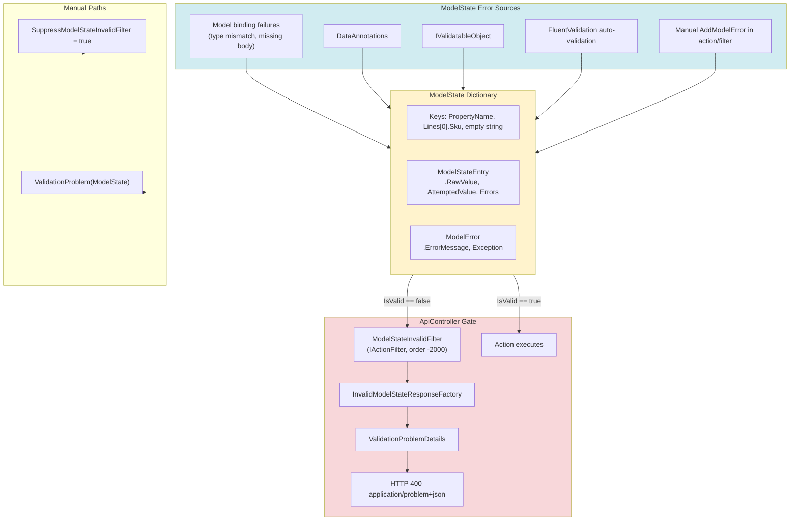
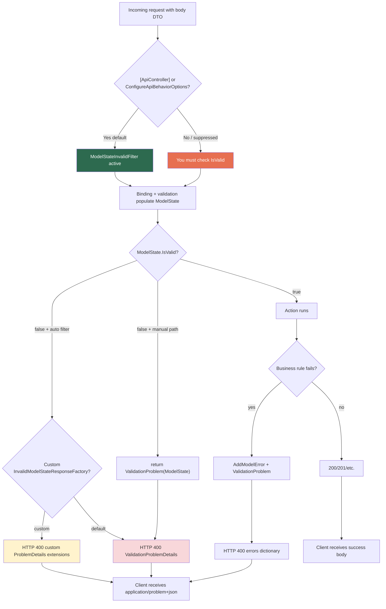

> [!success] Mastery Check
> - [ ] **Studied Well**
> - [ ] **Can explain the concept without notes**
> - [ ] **Can answer interview questions confidently**
> - [ ] **Can implement it in a real project**

# 4.168 — ModelState: Checking Validity, Reading Errors, Custom Responses

---

## PART 0 — Navigation & Context

### Where This Fits in the ASP.NET Core Domain Hierarchy

```
ASP.NET Core Mastery
│
├── Model Binding (4.100–4.102)
│   └── 4.102 — Model Validation: DataAnnotations and ModelState
│
├── MVC & Controllers (4.098+)
│   └── 4.101 — [ApiController] automatic 400 on invalid ModelState
│
├── Validation (4.167–4.176)
│   ├── 4.167 — DataAnnotations (populates ModelState)
│   ├── ► 4.168 — ModelState ◄ YOU ARE HERE
│   │           IsValid, AddModelError, InvalidModelStateResponseFactory
│   ├── 4.169 — Custom ValidationAttribute / IValidatableObject
│   ├── 4.170 — FluentValidation (also populates ModelState)
│   └── 4.174 — SuppressModelStateInvalidFilter
│
└── Error Handling (4.177–4.185)
    └── 4.179 — Problem Details (ValidationProblemDetails shape)
```

### What You Need Before This

| Prerequisite | Why You Need It |
|---|---|
| [[4.167 — DataAnnotations Validation]] | DataAnnotations failures are the most common source of `ModelState` entries — you must know what populates the dictionary |
| [[4.101 — ApiController]] | `[ApiController]` registers `ModelStateInvalidFilter` — the automatic HTTP 400 gate tied to `ModelState.IsValid` |
| [[4.100 — Model Binding]] | Binding failures (type conversion, missing required body) also write to `ModelState` before validation runs |

### What This Unlocks After

| Next Topic | Dependency |
|---|---|
| [[4.174 — SuppressModelStateInvalidFilter]] | Turning off the auto-filter requires you to manually check `ModelState` and return `ValidationProblem` |
| [[4.179 — Problem Details]] | `ValidationProblemDetails` is the RFC 7807 type behind the default 400 response |
| [[4.170 — FluentValidation]] | FluentValidation auto-validation merges failures into the same `ModelState` dictionary |

### Why This Matters at Scale

> **`ModelState` is the per-request error ledger that decides whether your payment, order, or patient-intake handler runs at all — `[ApiController]` converts any invalid ledger to HTTP 400 `application/problem+json` before your code executes; customizing `InvalidModelStateResponseFactory` is how you ship a stable validation contract to mobile apps and partner APIs at 10k req/s without every team inventing a different error JSON shape.**

---

## PART 1 — The Core Mental Model

### The Fundamental Rule

> **`ModelState` is a per-request `Dictionary<string, ModelStateEntry>` that aggregates binding failures and validation failures keyed by property path — `ModelState.IsValid` is false when any entry has errors, and with `[ApiController]`, the `ModelStateInvalidFilter` short-circuits the pipeline to HTTP 400 `ValidationProblemDetails` before the action method's first line executes.**

### The Plain-Language Analogy

Every inbound HTTP request carries a **customs declaration form** (the bound DTO). `ModelState` is the **stamp pad** next to the officer's desk: binding puts "could not read this field" stamps; DataAnnotations and FluentValidation put "rule violated" stamps. `IsValid` asks a single question — **any stamps?** With `[ApiController]`, airport policy says: if there are stamps, the traveler is **turned away at the desk** with a standardized rejection slip (`ValidationProblemDetails`) listing every stamped field — the gate agent (your action method) never sees them. You can customize the rejection slip format (`InvalidModelStateResponseFactory`) or add stamps yourself in the action (`AddModelError`) when a business rule fails after the form looked valid on the surface.

### The Taxonomy Diagram



---

## PART 2 — Deep Mechanics

### 2.1 — Pipeline Position: When ModelState Is Populated and Checked

```
──► Kestrel ──► ExceptionHandler ──► Routing ──► Auth ──► Authorization
    ──► Endpoint selected
    ──► Resource filters (authorization filters, etc.)
    ──► Model binding ◄── binding errors → ModelState
    ──► Model validation ◄── DataAnnotations / FV → ModelState
    ──► ModelStateInvalidFilter ◄── [ApiController] checks IsValid HERE
    │       ├─ invalid → HTTP 400 (short-circuit, action NEVER runs)
    │       └─ valid   → continue
    ──► Action filters → Action method → Result filters
```

**Pipeline position annotation:**

```
// For POST /api/payments with invalid JSON field types:
// 1. JsonInputFormatter binds body → ModelState may get binding errors
// 2. DefaultObjectValidator runs → adds validation errors
// 3. ModelStateInvalidFilter.OnActionExecuting → returns 400 if !IsValid
// BEFORE: PaymentsController.Create() first line
```

**ASP.NET Core internally (approximate):**

```csharp
// ModelStateInvalidFilter.OnActionExecuting (ApiBehaviorApplicationModelProvider)
public void OnActionExecuting(ActionExecutingContext context)
{
    if (!context.ModelState.IsValid)
    {
        context.Result = _apiBehaviorOptions.InvalidModelStateResponseFactory(context);
        // Default factory builds ValidationProblemDetails from ModelState
    }
}
// Class: Microsoft.AspNetCore.Mvc.Infrastructure.ModelStateInvalidFilter
// Registered only when [ApiController] is on controller or assembly
```

**Runtime cost:** `ModelState.IsValid` is O(1) cached flag after mutations; building `ValidationProblemDetails` is O(n) over error count — typically **~0.01–0.1ms**, negligible vs JSON deserialization.

---

### 2.2 — ModelState Dictionary Structure

```csharp
// ControllerBase exposes:
public ModelStateDictionary ModelState { get; }

// Typical keys after validating nested DTO:
// "Amount"
// "Lines[0].Sku"
// "Lines[1].Quantity"
// ""  ← model-level error (IValidatableObject or AddModelError with empty key)

foreach (var (key, entry) in ModelState)
{
    object? raw = entry.RawValue;           // bound value (may be partial)
    string? attempted = entry.AttemptedValue; // string from request
    foreach (var error in entry.Errors)
    {
        string userMessage = error.ErrorMessage;     // show to client
        Exception? ex = error.Exception;             // binding exception — don't expose
    }
}
```

**Edge case:** Same key can accumulate **multiple** `ModelError` objects — `errors` JSON array may have several strings per property.

**HTTP:** Client receives keys exactly as stored (PascalCase by default from property names unless customized).

---

### 2.3 — HTTP Wire Format: Default ValidationProblemDetails

```
// HTTP request (approximate):
// POST /api/payments HTTP/1.1
// Host: api.fintech.example
// Content-Type: application/json
// Authorization: Bearer eyJhbGci...
//
// {
//   "amount": -100,
//   "currency": "US",
//   "payerEmail": "not-valid"
// }

// HTTP response (approximate) — ModelStateInvalidFilter, default factory:
// HTTP/1.1 400 Bad Request
// Content-Type: application/problem+json; charset=utf-8
// Cache-Control: no-cache, no-store
//
// {
//   "type": "https://tools.ietf.org/html/rfc9110#section-15.5.1",
//   "title": "One or more validation errors occurred.",
//   "status": 400,
//   "errors": {
//     "Amount": [
//       "The field Amount must be between 0.01 and 1000000."
//     ],
//     "Currency": [
//       "The field Currency must be a string with a minimum length of 3 and a maximum length of 3."
//     ],
//     "PayerEmail": [
//       "The PayerEmail field is not a valid e-mail address."
//     ]
//   },
//   "traceId": "00-abc123..."
// }
```

**Failure mode:** Action method **never invoked** — no database write, no message publish, no audit log from handler (unless filter/middleware logs).

---

### 2.4 — Binding Errors vs Validation Errors (Same Dictionary)

```
// HTTP request (approximate):
// POST /api/orders HTTP/1.1
// Content-Type: application/json
//
// { "quantity": "not-a-number", "sku": "ABC" }

// ModelState after binding (before validation):
// Key "Quantity": Error "The value 'not-a-number' is not valid."
// Key "Sku": valid

// HTTP response:
// HTTP/1.1 400 Bad Request
// errors: { "Quantity": ["The value 'not-a-number' is not valid."] }
```

**ASP.NET Core internally:** `ModelBindingResult` with `ModelBindingResult.Failed` calls `ModelState.TryAddModelException` or `AddModelError`.

**Edge case:** If binding fails completely for a complex type, **validation may not run** for that subtree — `IValidatableObject.Validate` skipped when model is null.

---

### 2.5 — InvalidModelStateResponseFactory Customization

```csharp
builder.Services.AddControllers()
    .ConfigureApiBehaviorOptions(options =>
    {
        options.InvalidModelStateResponseFactory = context =>
        {
            var problem = new ValidationProblemDetails(context.ModelState)
            {
                Type = "https://api.shop.example/problems/validation",
                Title = "Request validation failed",
                Status = StatusCodes.Status400BadRequest,
                Instance = context.HttpContext.Request.Path
            };
            problem.Extensions["traceId"] = context.HttpContext.TraceIdentifier;
            problem.Extensions["correlationId"] =
                context.HttpContext.Request.Headers["X-Correlation-Id"].FirstOrDefault()
                ?? context.HttpContext.TraceIdentifier;

            return new BadRequestObjectResult(problem);
        };
    });
```

**Pipeline position:** Factory runs **inside** `ModelStateInvalidFilter` — only when `!IsValid`.

**Cost:** One `ValidationProblemDetails` allocation + string dictionary for errors — **~1–3 KB** response body typical.

---

### 2.6 — Manual ModelState Checks and AddModelError

```csharp
// Without [ApiController] OR with SuppressModelStateInvalidFilter = true:
[HttpPost("transfer")]
public IActionResult Transfer([FromBody] TransferFundsDto dto)
{
    if (dto.Amount > _limits.GetDailyLimit(User))
        ModelState.AddModelError(nameof(dto.Amount), "Exceeds daily transfer limit.");

    if (!ModelState.IsValid)
        return ValidationProblem(ModelState);  // same shape as auto 400

    // business logic...
    return Ok();
}
```

```
// HTTP response after manual ValidationProblem:
// HTTP/1.1 400 Bad Request
// Content-Type: application/problem+json
// errors: { "Amount": ["Exceeds daily transfer limit."] }
```

**`ValidationProblem(ModelState)`** on `ControllerBase` delegates to `ValidationProblemDetails` — same contract as `[ApiController]` auto path.

---

## PART 3 — Production Code Patterns

### Pattern 1: Fintech — Global Custom Validation Error Contract

```csharp
// Why: mobile app expects stable error codes + traceId on every 400
builder.Services.AddControllers()
    .ConfigureApiBehaviorOptions(o =>
    {
        o.InvalidModelStateResponseFactory = ctx =>
        {
            var errors = ctx.ModelState
                .Where(e => e.Value?.Errors.Count > 0)
                .ToDictionary(
                    e => ToCamelCase(e.Key),
                    e => e.Value!.Errors.Select(x => x.ErrorMessage).ToArray());

            var problem = new ValidationProblemDetails(errors)
            {
                Title = "validation_failed",
                Status = 400,
                Type = "https://payments.example/errors/validation"
            };
            problem.Extensions["traceId"] = ctx.HttpContext.TraceIdentifier;
            return new BadRequestObjectResult(problem);
        };
    });
```

```
// HTTP wire format (approximate):
// HTTP/1.1 400 Bad Request
// Content-Type: application/problem+json
// { "title": "validation_failed", "status": 400, "errors": { "amount": ["..."] }, "traceId": "..." }
```

---

### Pattern 2: E-Commerce — Business Rule After Surface Validation

```csharp
[ApiController]
[Route("api/carts/{cartId}/lines")]
public class CartLinesController : ControllerBase
{
    [HttpPost]
    public async Task<IActionResult> AddLine(
        Guid cartId,
        [FromBody] AddCartLineDto dto,
        CancellationToken ct)
    {
        // DataAnnotations already passed — ModelState was valid at filter time
        if (!await _inventory.SkuIsActiveAsync(dto.Sku, ct))
            ModelState.AddModelError(nameof(dto.Sku), $"SKU '{dto.Sku}' is discontinued.");

        if (!ModelState.IsValid)
            return ValidationProblem(ModelState);

        await _cartService.AddLineAsync(cartId, dto, ct);
        return Ok();
    }
}
```

> [!WARNING] With default `[ApiController]`, the action **does run** when only DataAnnotations passed — manual `AddModelError` + `ValidationProblem` is correct for post-validation business rules.

```
// HTTP when SKU inactive:
// HTTP/1.1 400 Bad Request
// errors: { "Sku": ["SKU 'OLD-SKU-99' is discontinued."] }
```

---

### Pattern 3: ⚠️ WRONG — Inconsistent BadRequest String vs ValidationProblemDetails

```csharp
// ⚠️ WRONG — fintech payment API:
[HttpPost]
public IActionResult CreatePayment([FromBody] CreatePaymentDto dto)
{
    if (dto.Currency != "USD" && dto.Currency != "EUR")
        return BadRequest("unsupported currency");  // plain text, no errors dict
}
```

```
// HTTP consequence (wrong path):
// HTTP/1.1 400 Bad Request
// Content-Type: text/plain; charset=utf-8
// unsupported currency
```

```csharp
// ✅ CORRECT:
if (dto.Currency is not ("USD" or "EUR"))
    ModelState.AddModelError(nameof(dto.Currency), "Currency must be USD or EUR.");
if (!ModelState.IsValid)
    return ValidationProblem(ModelState);
```

```
// HTTP consequence (correct path):
// HTTP/1.1 400 Bad Request
// Content-Type: application/problem+json
// { "errors": { "Currency": ["Currency must be USD or EUR."] }, "status": 400 }
```

---

### Pattern 4: Healthcare — Model-Level Error with Empty Key

```csharp
public IActionResult RegisterPatient([FromBody] PatientRegistrationDto dto)
{
    if (dto.AppointmentDate < DateOnly.FromDateTime(DateTime.UtcNow))
        ModelState.AddModelError(string.Empty, "Appointment date cannot be in the past.");

    if (!ModelState.IsValid)
        return ValidationProblem(ModelState);
    // ...
}
```

```
// HTTP wire format:
// errors: { "": ["Appointment date cannot be in the past."] }
// Mobile clients must handle empty-string key for form-level errors
```

---

### Pattern 5: Logistics — Reading ModelState for Structured Logging

```csharp
if (!ModelState.IsValid)
{
    var fieldErrors = ModelState
        .Where(kv => kv.Value?.Errors.Count > 0)
        .ToDictionary(
            kv => kv.Key,
            kv => kv.Value!.Errors.Select(e => e.ErrorMessage).ToList());

    _logger.LogWarning(
        "Shipment booking validation failed for hub {HubCode}: {@FieldErrors}",
        hubCode,
        fieldErrors);

    return ValidationProblem(ModelState);
}
```

**Why:** Operations team correlates bad client payloads without exposing `Exception` details from binding.

---

### Pattern 6: Minimal API — Results.ValidationProblem

```csharp
app.MapPost("/api/shipments", async (
    CreateShipmentDto dto,
    IValidator<CreateShipmentDto> validator,
    HttpContext http) =>
{
    var result = await validator.ValidateAsync(dto);
    if (!result.IsValid)
    {
        foreach (var failure in result.Errors)
            http.ModelState.AddModelError(failure.PropertyName, failure.ErrorMessage);

        return Results.ValidationProblem(http.ModelState);
    }
    return Results.Created($"/api/shipments/{Guid.NewGuid()}", dto);
});
```

```
// HTTP: same application/problem+json as MVC ApiController path
```

---

### Pattern 7: Flatten Nested Keys for Legacy Mobile Clients

```csharp
o.InvalidModelStateResponseFactory = ctx =>
{
    var flat = new Dictionary<string, string[]>();
    foreach (var (key, entry) in ctx.ModelState.Where(e => e.Value?.Errors.Count > 0))
    {
        var mobileKey = key
            .Replace("[", ".")
            .Replace("]", "")
            .ToLowerInvariant();
        flat[mobileKey] = entry!.Errors.Select(e => e.ErrorMessage).ToArray();
    }
    return new BadRequestObjectResult(new ValidationProblemDetails(flat));
};
```

```
// Lines[0].Sku → lines.0.sku in JSON errors object
```

---

## PART 4 — Gotchas & Anti-Patterns

### Gotcha 1: Assuming Action Never Runs When ModelState Is Invalid — Only True Before Action Starts

With `[ApiController]`, **automatic** filter blocks invalid state from binding/validation. But you can add errors **inside** the action — the action **already ran**; you must return `ValidationProblem` yourself.

```csharp
// ⚠️ WRONG — e-commerce order API:
[HttpPost]
public IActionResult PlaceOrder(PlaceOrderDto dto)
{
    if (!_catalog.Exists(dto.Sku))
        ModelState.AddModelError(nameof(dto.Sku), "Unknown SKU");
    // Forgot return ValidationProblem — continues with invalid SKU
    return Ok(_orders.Place(dto));  // HTTP 200 with bad data
}
```

```
// HTTP consequence (wrong path):
// HTTP/1.1 200 OK — order placed for nonexistent SKU
```

```csharp
// ✅ CORRECT:
if (!_catalog.Exists(dto.Sku))
    ModelState.AddModelError(nameof(dto.Sku), "Unknown SKU");
if (!ModelState.IsValid)
    return ValidationProblem(ModelState);
return Ok(_orders.Place(dto));
```

```
// HTTP consequence (correct path):
// HTTP/1.1 400 Bad Request
// errors: { "Sku": ["Unknown SKU"] }
```

**WHY:** `ModelStateInvalidFilter` runs **once** before the action — it does not re-run after `AddModelError` inside the action.

---

### Gotcha 2: Exposing Binding Exception Messages to Clients

```csharp
// ⚠️ WRONG — returning raw exception text:
var errors = ModelState.Values
    .SelectMany(v => v.Errors)
    .Select(e => e.Exception?.Message ?? e.ErrorMessage);
return BadRequest(string.Join(", ", errors));
```

```
// HTTP consequence (wrong path):
// HTTP/1.1 400 Bad Request
// "Error parsing value 'abc' at Path 'amount', line 1, position 15..."
// Leaks internal JSON path details
```

```csharp
// ✅ CORRECT:
return ValidationProblem(ModelState);  // uses ErrorMessage, not Exception
// Or map binding errors to generic "Invalid format" in custom factory
```

```
// HTTP consequence (correct path):
// errors: { "Amount": ["The field Amount must be a number."] }
```

**WHY:** `ModelError.Exception` is for diagnostics; `ValidationProblemDetails` serializer uses `ErrorMessage` by default.

---

### Gotcha 3: Duplicate Manual IsValid Check with ApiController (Redundant but Harmless)

```csharp
// ⚠️ WRONG mental model — dead code:
[ApiController]
[HttpPost]
public IActionResult Create(CreatePaymentDto dto)
{
    if (!ModelState.IsValid)  // never true here — filter already returned 400
        return BadRequest();
    return Ok();
}
```

```
// HTTP: invalid requests never reach this line — already 400 from filter
```

```csharp
// ✅ CORRECT: remove redundant check OR suppress filter (4.174) if you need custom flow
```

**WHY:** Filter order guarantees invalid ModelState short-circuits before action.

---

### Gotcha 4: Wrong Property Key in AddModelError Breaks Client Field Mapping

```csharp
// ⚠️ WRONG:
ModelState.AddModelError("sku", "Required");  // lowercase — client expects "Sku"
```

```
// HTTP errors: { "sku": ["Required"] } — SPA binding to PascalCase keys fails
```

```csharp
// ✅ CORRECT:
ModelState.AddModelError(nameof(dto.Sku), "SKU is required.");
```

```
// HTTP errors: { "Sku": ["SKU is required."] }
```

**WHY:** Keys must match DataAnnotations / JSON property naming convention your API documents.

---

### Gotcha 5: SuppressModelStateInvalidFilter Without Manual Return

```csharp
// ⚠️ WRONG:
builder.Services.AddControllers()
    .ConfigureApiBehaviorOptions(o => o.SuppressModelStateInvalidFilter = true);

[HttpPost]
public IActionResult Create(CreatePaymentDto dto)
{
    // No IsValid check — invalid payments reach service layer
    _payments.Process(dto);
    return Ok();
}
```

```
// HTTP consequence (wrong path):
// HTTP/1.1 200 OK — negative amounts processed
```

```csharp
// ✅ CORRECT (see 4.174):
if (!ModelState.IsValid)
    return ValidationProblem(ModelState);
```

```
// HTTP consequence (correct path):
// HTTP/1.1 400 Bad Request with errors dictionary
```

**WHY:** Suppressing the filter removes the automatic gate — you own the HTTP 400 contract.

---

## PART 5 — Performance Implications

| Scenario | Pipeline Depth | Allocations Per Request | Approx Latency Impact | Recommendation |
|---|---|---|---|---|
| IsValid check (valid request) | +1 filter | ~0 | ~0.01ms | Default — keep |
| Default ValidationProblemDetails (3 errors) | filter + factory | ~1–2 KB response | ~0.05ms | Default |
| Custom factory with LINQ over all keys | same | +few small arrays | ~0.1ms | Fine for APIs |
| 50 field errors on huge DTO | same | ~5–10 KB JSON | ~0.3ms | Flatten or cap error count for UX |
| Manual AddModelError in action | no extra filter | ~1 string | ~0 | Normal for business rules |
| Logging all ModelState on every 400 | +logging | log payload size | varies | Sample or structured log only |
| FluentValidation + DataAnnotations duplicate | validation ×2 | 2× rule eval | ~0.2–2ms | Disable duplicate DA when using FV |
| ModelState on Minimal API without validation | none | 0 | 0 | Explicitly validate |

### BenchmarkDotNet

```csharp
using BenchmarkDotNet.Attributes;
using Microsoft.AspNetCore.Mvc.ModelBinding;

[MemoryDiagnoser]
public class ModelStateBenchmark
{
    private ModelStateDictionary _valid = new();
    private ModelStateDictionary _invalid = new();

    [GlobalSetup]
    public void Setup()
    {
        _valid.AddModelError("x", "err"); // force recalc then clear — use fresh valid
        _valid.Clear();
        for (int i = 0; i < 20; i++)
            _invalid.AddModelError($"Field{i}", $"Error message {i}");
    }

    [Benchmark(Baseline = true)]
    public bool CheckIsValid_Valid() => _valid.IsValid;

    [Benchmark]
    public bool CheckIsValid_Invalid20() => _invalid.IsValid;

    [Benchmark]
    public Dictionary<string, string[]> BuildErrorDictionary()
    {
        return _invalid
            .Where(e => e.Value?.Errors.Count > 0)
            .ToDictionary(
                e => e.Key,
                e => e.Value!.Errors.Select(x => x.ErrorMessage).ToArray());
    }
}
// Expected output (approximate, .NET 8, x64):
// CheckIsValid_Valid: ~15ns
// CheckIsValid_Invalid20: ~80ns
// BuildErrorDictionary: ~800ns, ~2KB allocated
// Profile real APIs with dotnet-counters (Microsoft.AspNetCore.Hosting requests/sec)
// and MiniProfiler for per-request validation phase timing.
```

### When to Care

High-throughput APIs (>10k req/s) with custom factories that LINQ-scan huge ModelState on every 400; logging full error dictionaries to Splunk on every validation failure.

### When to Ignore

Typical REST DTOs with <15 fields; standard `InvalidModelStateResponseFactory` with traceId extension.

---

## PART 6 — Interview Arsenal

### A. Question Bank

**Q1: What is ModelState and when is it checked?**

**Average Answer:** It's a dictionary of validation errors. The controller checks `IsValid`.

**Why That's Insufficient:** Doesn't mention binding errors, filter timing, or HTTP 400 auto-response.

> **Great Answer:** ModelState is a per-request dictionary mapping property paths to lists of errors from binding, DataAnnotations, FluentValidation, or manual `AddModelError`. With `[ApiController]`, `ModelStateInvalidFilter` runs after model validation and before my action — if `IsValid` is false, the client gets HTTP 400 `application/problem+json` with an `errors` object and my action never runs. If I add errors inside the action, I have to return `ValidationProblem` myself because the filter already passed.

**Q2: How do you customize the 400 validation response shape?**

**Average Answer:** Return BadRequest from the action.

**Why That's Insufficient:** Misses global factory and inconsistent contracts.

> **Great Answer:** I configure `InvalidModelStateResponseFactory` in `ConfigureApiBehaviorOptions` so every automatic 400 uses the same `ValidationProblemDetails` extensions — traceId, correlationId, camelCase keys. That runs inside `ModelStateInvalidFilter`, so I don't duplicate checks in every action. For business rules after validation, I still use `AddModelError` plus `ValidationProblem` in the action.

**Q3: What's the difference between binding and validation errors in ModelState?**

> **Great Answer:** Binding errors happen when the framework can't convert the incoming string to the property type — like quantity `"abc"`. Validation errors happen when the value bound successfully but broke a rule — like negative amount. Both land in the same ModelState keys and produce the same HTTP 400 shape from the client's perspective, but binding errors may have an inner `Exception` I must not expose.

**Q4: Does ModelStateInvalidFilter run for Minimal APIs?**

> **Great Answer:** Not automatically the same way — `[ApiController]` is controller-specific. Minimal APIs need explicit validation — I call `IValidator.ValidateAsync`, push failures into `HttpContext.ModelState`, and return `Results.ValidationProblem`. The HTTP body shape can match MVC if I use the same ModelState dictionary.

### B. Trick Questions

1. **"If ModelState is invalid, does the action always skip?"** — Only when `ModelStateInvalidFilter` is active (default `[ApiController]`). With `SuppressModelStateInvalidFilter`, action runs unless you check manually.

2. **"Can I inject services into ModelState?"** — No. ModelState is a dictionary, not a validator. Use `IValidatableObject.GetService` or FluentValidation DI.

3. **"Is ValidationProblemDetails only for validation?"** — It's the standard type for **model** validation failures (400). Other problem types use `ProblemDetails` with different status codes (404, 409).

### C. Red Flags to Avoid

1. "We return `BadRequest("invalid")` for validation" — unstructured, breaks API contracts.
2. "ModelState is only for DataAnnotations" — ignores binding and FluentValidation.
3. "I check `IsValid` at the start of every action with ApiController" — shows misunderstanding of filter order.
4. "We expose `Exception.Message` from ModelState to users" — information disclosure.
5. "Client-side validation replaces ModelState" — security hole.
6. "Empty key errors are a bug" — they're valid for model-level messages.
7. "400 vs 422 — ASP.NET Core uses 400 for ModelState by default" — arguing 422 without team convention.

---

## PART 7 — Decision Framework



---

## PART 8 — Self-Check

### A. Conceptual Questions

1. What three sources populate `ModelState` before your action runs?
2. What HTTP status and content type does default `[ApiController]` return on invalid ModelState?
3. What happens if you `AddModelError` in the action but forget to return `ValidationProblem`?
4. What is the difference between `ModelError.ErrorMessage` and `ModelError.Exception`?
5. What does an empty-string key in the `errors` JSON object mean?
6. **What happens to the HTTP request if** binding fails for one property but others are valid?
7. **What happens to the HTTP request if** `SuppressModelStateInvalidFilter` is true and you don't check `IsValid`?
8. Where in the filter pipeline does `ModelStateInvalidFilter` run relative to model binding?
9. How does `ValidationProblem(ModelState)` differ from `BadRequest(ModelState)`?
10. Can nested collection errors appear as `Lines[0].Sku` in the response?

### B. Code Puzzles

**Puzzle 1:**

```csharp
[ApiController]
[HttpPost("/api/pay")]
public IActionResult Pay(PaymentDto dto) => Ok();
// POST body: { "amount": -1 } with [Range(0.01, 999)] on Amount
// What HTTP response?
```

<details><summary>Answer</summary>

**HTTP 400** `application/problem+json` with `errors.Amount`. Action never runs — `ModelStateInvalidFilter` short-circuits.

</details>

**Puzzle 2:**

```csharp
[ApiController]
[HttpPost]
public IActionResult Create(OrderDto dto)
{
    ModelState.AddModelError("Sku", "bad");
    return Ok();
}
// ModelState was valid at filter time. Response?
```

<details><summary>Answer</summary>

**HTTP 200 OK** — filter already ran; manual error ignored without `ValidationProblem`. Classic bug.

</details>

**Puzzle 3:**

```csharp
// No [ApiController]
[HttpPost]
public IActionResult Create(OrderDto dto)
{
    if (!ModelState.IsValid) return ValidationProblem(ModelState);
    return Ok();
}
// Invalid DTO. Response?
```

<details><summary>Answer</summary>

**HTTP 400** ValidationProblemDetails — manual check required without ApiController filter.

</details>

**Puzzle 4:**

```csharp
o.SuppressModelStateInvalidFilter = true;
[ApiController]
[HttpPost]
public IActionResult Create(PaymentDto dto) => Ok(_svc.Process(dto));
// Invalid PaymentDto. Response?
```

<details><summary>Answer</summary>

Likely **HTTP 200** with invalid data processed — filter suppressed, no manual check. Most common SuppressModelState misunderstanding.

</details>

**Puzzle 5:**

```csharp
// POST { "qty": "x" } to int Qty
// Does [Range(1,10)] on Qty run?
```

<details><summary>Answer</summary>

Binding fails first — **HTTP 400** with binding error on `Qty`. Range validation typically does not run for unbound value.

</details>

---

## PART 9 — Connections & Resources

### A. Related Topics Table

| Topic | Why It Connects |
|---|---|
| [[4.167 — DataAnnotations]] | Primary source of validation entries in ModelState |
| [[4.170 — FluentValidation]] | Merges async/sync rule failures into the same ModelState |
| [[4.174 — SuppressModelStateInvalidFilter]] | Disables auto gate — manual ModelState handling required |
| [[4.179 — Problem Details]] | `ValidationProblemDetails` extends `ProblemDetails` for 400 errors |
| [[4.101 — ApiController]] | Registers `ModelStateInvalidFilter` and default response factory |
| [[4.102 — Model Validation]] | Overview of validation phase that populates ModelState |

### B. Books

| Book | Chapters | Why These Chapters |
|---|---|---|
| *ASP.NET Core in Action* (Andrew Lock) | Ch. 17–18 | Model binding, validation, and ApiController behavior |
| *Pro ASP.NET Core MVC* | Validation chapter | ModelStateDictionary and filter pipeline |
| *RESTful Web APIs with ASP.NET Core* | Error handling | Consistent 400 problem details for clients |

### C. Essential Articles & Docs

- [Model validation in ASP.NET Core](https://learn.microsoft.com/en-us/aspnet/core/mvc/models/validation)
- [ApiBehaviorOptions.InvalidModelStateResponseFactory](https://learn.microsoft.com/en-us/dotnet/api/microsoft.aspnetcore.mvc.apibehavioroptions.invalidmodelstateresponsefactory)
- [ValidationProblemDetails](https://learn.microsoft.com/en-us/dotnet/api/microsoft.aspnetcore.mvc.validationproblemdetails)
- [RFC 7807 Problem Details](https://www.rfc-editor.org/rfc/rfc7807)
- [Andrew Lock — Model binding and validation](https://andrewlock.net/)

### D. Template Meta-Note

> [!NOTE] **Part 0** orients ModelState in the validation subsystem. **Part 1** anchors IsValid + ApiController short-circuit. **Part 2** traces pipeline position, dictionary structure, and HTTP wire format. **Part 3** shows production factories and manual AddModelError. **Part 4** covers filter timing and SuppressModelState traps. **Part 5** quantifies cost of building error dictionaries. **Part 6** prepares interview narratives around HTTP 400 contracts. **Part 7** flowchart for auto vs manual validation responses. **Part 8** puzzles on filter vs action timing. **Part 9** links to Problem Details and FluentValidation.
