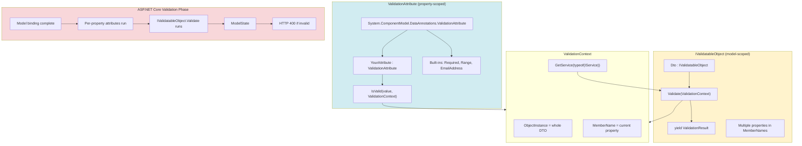
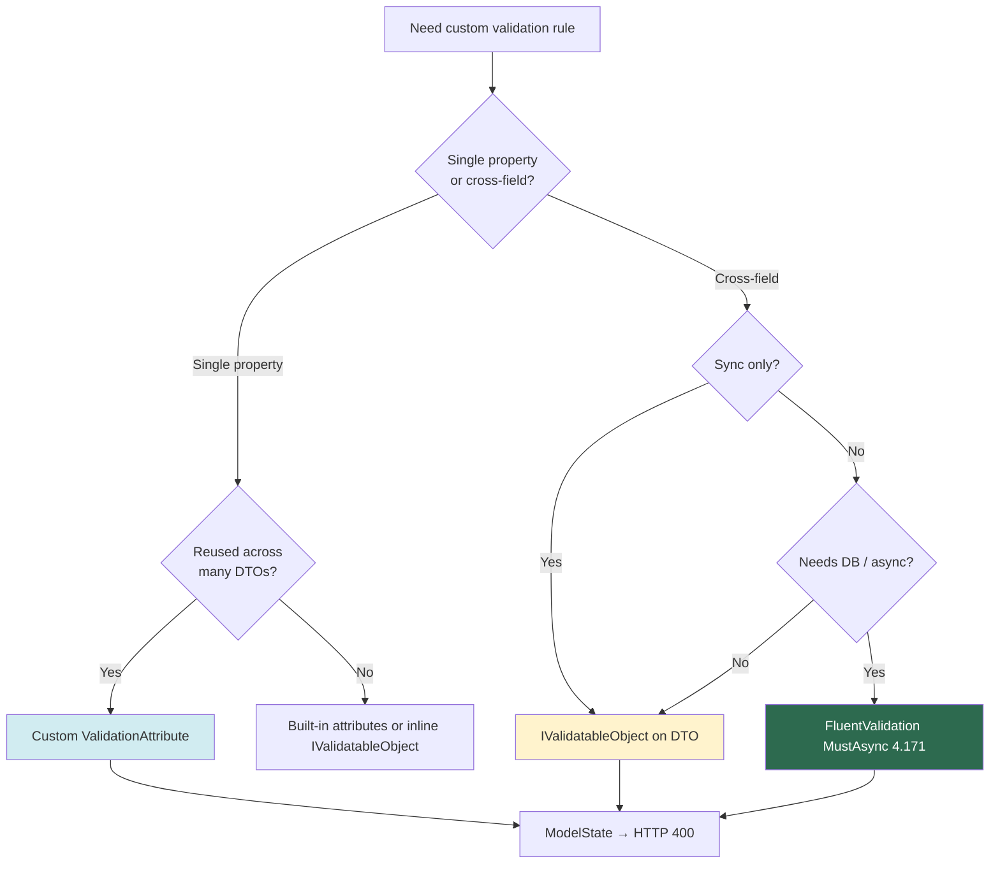

> [!success] Mastery Check
> - [ ] **Studied Well**
> - [ ] **Can explain the concept without notes**
> - [ ] **Can answer interview questions confidently**
> - [ ] **Can implement it in a real project**

# 4.169 — Custom Validation Attributes: ValidationAttribute and IValidatableObject

---

## PART 0 — Navigation & Context

### Where This Fits in the ASP.NET Core Domain Hierarchy

```
ASP.NET Core Mastery
│
└── Validation (4.167–4.176)
    ├── 4.167 — Built-in DataAnnotations
    ├── 4.168 — ModelState (receives custom validation errors)
    ├── ► 4.169 — Custom ValidationAttribute / IValidatableObject ◄ YOU ARE HERE
    ├── 4.170 — FluentValidation (preferred for complex/async rules)
    ├── 4.171 — FluentValidation async DB validation
    └── 4.175 — Validation across HTTP vs domain layers
```

### What You Need Before This

| Prerequisite | Why You Need It |
|---|---|
| [[4.167 — DataAnnotations]] | Custom attributes **subclass** `ValidationAttribute` — same pipeline as built-ins |
| [[4.168 — ModelState]] | Failures from `IsValid` and `Validate()` become `ModelState` entries → HTTP 400 |
| [[4.034 — DI Container]] | `IValidatableObject` can resolve services via `ValidationContext.GetService` — scoped per request |

### What This Unlocks After

| Next Topic | Dependency |
|---|---|
| [[4.170 — FluentValidation]] | When custom attributes + `IValidatableObject` aren't enough (async, DI constructors, rule composition) |
| [[4.171 — Async Validators]] | Database uniqueness checks that `ValidationAttribute` cannot do |
| [[4.175 — Validation Across Layers]] | Deciding DTO validation vs domain entity invariants |

### Why This Matters at Scale

> **Custom `ValidationAttribute` and `IValidatableObject` are the built-in extension points for reusable validation without a third-party library — cross-field shipment windows, payment amount/currency pairs, and healthcare date ranges all land in `ModelState` and trigger HTTP 400 before business logic runs; misusing them for async database checks blocks threads and breaks at scale.**

---

## PART 1 — The Core Mental Model

### The Fundamental Rule

> **Custom `ValidationAttribute` subclasses validate a single property synchronously during the model validation phase after binding; `IValidatableObject.Validate` runs afterward on the whole model for cross-property rules — both add `ModelError` entries to `ModelState`, and with `[ApiController]` invalid state becomes HTTP 400 `ValidationProblemDetails` before the action executes.**

### The Plain-Language Analogy

Built-in DataAnnotations are **pre-printed stamps** on the customs form ("email format", "required"). A custom `ValidationAttribute` is a **department-issued stamp** your team designs once and applies to many forms ("hub code must match regex `^[A-Z]{3}$`"). `IValidatableObject` is the **supervisor who reads the entire form** and checks relationships between boxes: "delivery date must be after pickup date," "confirm email must match email." The supervisor runs **after** individual field stamps — if a field couldn't be read (binding failed), the supervisor may not review that section. Neither the custom stamp nor the supervisor can **call overseas** (async database) during the stamp line — that's FluentValidation's job (4.171).

### The Taxonomy Diagram



---

## PART 2 — Deep Mechanics

### 2.1 — Pipeline Position and Execution Order

```
──► Routing ──► Auth ──► Endpoint
    ──► Model binding (JSON → DTO instance)
    ──► Object model validation:
    │       1. For each property: all ValidationAttributes on that property (order not guaranteed)
    │       2. IValidatableObject.Validate(validationContext) on the model type
    │       3. FluentValidation if registered (4.170)
    ──► ModelState populated
    ──► ModelStateInvalidFilter → HTTP 400 if !IsValid
    ──► Action method
```

**ASP.NET Core internally (approximate):**

```csharp
// DefaultObjectValidator.Validate(...)
//   Visit each property → run ValidationAttribute.GetValidationResult
//   If model implements IValidatableObject → call Validate()
// Class: Microsoft.AspNetCore.Mvc.ModelBinding.Validation.DefaultObjectValidator
```

**Runtime cost:** Sync only — **~0.01–0.1ms** per custom rule; `GetService` is O(1) DI lookup.

---

### 2.2 — Custom ValidationAttribute

```csharp
[AttributeUsage(AttributeTargets.Property | AttributeTargets.Field | AttributeTargets.Parameter)]
public sealed class FutureUtcDateAttribute : ValidationAttribute
{
    public FutureUtcDateAttribute() : base("Date must be in the future (UTC).") { }

    protected override ValidationResult? IsValid(object? value, ValidationContext validationContext)
    {
        if (value is null)
            return ValidationResult.Success; // use [Required] separately

        if (value is DateTime dt)
        {
            if (dt.Kind == DateTimeKind.Unspecified)
                dt = DateTime.SpecifyKind(dt, DateTimeKind.Utc);
            if (dt <= DateTime.UtcNow)
                return new ValidationResult(ErrorMessage ?? FormatErrorMessage(validationContext.DisplayName));
        }
        return ValidationResult.Success;
    }
}
```

```
// HTTP request (approximate):
// POST /api/shipments HTTP/1.1
// { "scheduledPickupUtc": "2020-01-01T00:00:00Z" }

// HTTP response:
// HTTP/1.1 400 Bad Request
// errors: { "ScheduledPickupUtc": ["Date must be in the future (UTC)."] }
```

**Edge case:** `ValidationAttribute` is **not** constructed by DI — no constructor injection of `ICountryService`.

---

### 2.3 — IValidatableObject for Cross-Property Rules

```csharp
public sealed class TransferFundsDto : IValidatableObject
{
    public string SourceAccountId { get; set; } = "";
    public string DestinationAccountId { get; set; } = "";
    public decimal Amount { get; set; }
    public string Currency { get; set; } = "";

    public IEnumerable<ValidationResult> Validate(ValidationContext validationContext)
    {
        if (SourceAccountId == DestinationAccountId)
            yield return new ValidationResult(
                "Source and destination accounts must differ.",
                new[] { nameof(DestinationAccountId), nameof(SourceAccountId) });

        if (Amount > 10_000 && Currency != "USD")
            yield return new ValidationResult(
                "Transfers over 10,000 require USD.",
                new[] { nameof(Amount), nameof(Currency) });
    }
}
```

```
// HTTP when same source/dest:
// errors: {
//   "DestinationAccountId": ["Source and destination accounts must differ."],
//   "SourceAccountId": ["Source and destination accounts must differ."]
// }
```

**MemberNames** controls which keys receive the error in `ModelState` — can list multiple properties.

---

### 2.4 — GetService for Light Sync Lookups

```csharp
public IEnumerable<ValidationResult> Validate(ValidationContext validationContext)
{
    var countries = (ICountryListService?)validationContext.GetService(typeof(ICountryListService));
    if (countries is not null && !countries.IsValidIsoCode(CountryCode))
        yield return new ValidationResult("Invalid country code.", new[] { nameof(CountryCode) });
}
```

**Pipeline position:** Runs in **scoped** request context — `GetService` resolves from `HttpContext.RequestServices`.

**Edge case:** Heavy or async DB work here **blocks the request thread** — use FluentValidation `MustAsync` (4.171).

---

### 2.5 — Validation Order and Binding Failures

```
// POST { "pickup": "not-a-date", "delivery": "2026-12-01" }
// Binding fails on Pickup → may skip property validators on Pickup
// IValidatableObject may still run if instance created with partial data
```

**Failure mode:** Cross-property rules comparing two bad bindings can see `default(DateTime)` — validate cautiously.

---

### 2.6 — Client-Side Unobtrusive Validation

Custom attributes can implement `IClientModelValidator` for Razor `data-val-*` attributes (see 4.176). API-only projects skip this.

**Cost:** Server validation always runs regardless of client attributes.

---

## PART 3 — Production Code Patterns

### Pattern 1: Logistics — Future Pickup Window Attribute

```csharp
public sealed class BookShipmentDto
{
    [Required]
    [FutureUtcDate]
    public DateTime ScheduledPickupUtc { get; set; }

    [Required]
    [StringLength(3, MinimumLength = 3)]
    public string OriginHubCode { get; set; } = "";
}
```

```
// Invalid past date → HTTP 400 on ScheduledPickupUtc before shipment service called
```

---

### Pattern 2: Fintech — Cross-Field Transfer Validation

```csharp
public sealed class WireTransferDto : IValidatableObject
{
    [Required]
    public decimal Amount { get; set; }

    [Required]
    [StringLength(3, MinimumLength = 3)]
    public string Currency { get; set; } = "";

    public bool IsExpress { get; set; }

    public IEnumerable<ValidationResult> Validate(ValidationContext ctx)
    {
        if (IsExpress && Amount > 50_000)
            yield return new ValidationResult(
                "Express wires are limited to 50,000.",
                new[] { nameof(Amount), nameof(IsExpress) });
    }
}
```

---

### Pattern 3: ⚠️ WRONG — Async Database in ValidationAttribute

```csharp
// ⚠️ WRONG — e-commerce SKU uniqueness:
public class UniqueSkuAttribute : ValidationAttribute
{
    protected override ValidationResult? IsValid(object? value, ValidationContext ctx)
    {
        var db = (ProductDbContext?)ctx.GetService(typeof(ProductDbContext));
        // Cannot await — blocks thread if .Result used
        if (db!.Products.Any(p => p.Sku == (string)value!))
            return new ValidationResult("SKU exists");
        return ValidationResult.Success;
    }
}
```

```
// HTTP consequence (wrong path):
// Sync EF query on hot path — thread pool starvation at scale
// Or deadlock if .Result on async API
```

```csharp
// ✅ CORRECT — FluentValidation MustAsync (4.171):
RuleFor(x => x.Sku).MustAsync(async (sku, ct) => !await _repo.ExistsAsync(sku, ct));
```

```
// HTTP: same 400 shape, async DB on thread pool properly
```

---

### Pattern 4: Healthcare — Appointment Range via IValidatableObject

```csharp
public sealed class ScheduleAppointmentDto : IValidatableObject
{
    public DateOnly Date { get; set; }
    public TimeOnly StartTime { get; set; }
    public TimeOnly EndTime { get; set; }

    public IEnumerable<ValidationResult> Validate(ValidationContext ctx)
    {
        if (EndTime <= StartTime)
            yield return new ValidationResult(
                "End time must be after start time.",
                new[] { nameof(EndTime), nameof(StartTime) });

        if (Date < DateOnly.FromDateTime(DateTime.UtcNow))
            yield return new ValidationResult(
                "Appointment cannot be in the past.",
                new[] { nameof(Date) });
    }
}
```

---

### Pattern 5: E-Commerce — Attribute with Configurable Parameters

```csharp
public sealed class AllowedPaymentMethodsAttribute : ValidationAttribute
{
    private readonly string _methods;

    public AllowedPaymentMethodsAttribute(string methods) => _methods = methods;

    protected override ValidationResult? IsValid(object? value, ValidationContext ctx)
    {
        var allowed = _methods.Split(',', StringSplitOptions.TrimEntries);
        if (value is string method && !allowed.Contains(method, StringComparer.OrdinalIgnoreCase))
            return new ValidationResult($"Payment method must be one of: {_methods}");
        return ValidationResult.Success;
    }
}

public class CheckoutDto
{
    [AllowedPaymentMethods("card,paypal,wallet")]
    public string PaymentMethod { get; set; } = "";
}
```

---

### Pattern 6: Reusable Attribute on Record Positional Parameters

```csharp
public record CreateHubRequest(
    [property: Required]
    [RegularExpression("^[A-Z]{3}$", ErrorMessage = "Hub code must be 3 uppercase letters.")]
    string Code,

    [property: Range(1, 500)]
    int DailyCapacity);
```

---

### Pattern 7: Unit Testing Without HTTP Pipeline

```csharp
[Fact]
public void TransferDto_RejectsSameAccounts()
{
    var dto = new TransferFundsDto
    {
        SourceAccountId = "A1",
        DestinationAccountId = "A1",
        Amount = 100,
        Currency = "USD"
    };
    var results = dto.Validate(new ValidationContext(dto)).ToList();
    Assert.Contains(results, r => r.ErrorMessage!.Contains("must differ"));
}
```

**Why:** Validates rules without spinning Kestrel — fast CI for cross-property logic.

---

## PART 4 — Gotchas & Anti-Patterns

### Gotcha 1: Constructor Injection on ValidationAttribute

```csharp
// ⚠️ WRONG:
public class CountryCodeAttribute : ValidationAttribute
{
    private readonly ICountryService _svc;
    public CountryCodeAttribute(ICountryService svc) => _svc = svc;
    // Framework uses new CountryCodeAttribute() — _svc is null
}
```

```
// HTTP: invalid country codes pass — attribute never wired
```

```csharp
// ✅ CORRECT:
protected override ValidationResult? IsValid(object? value, ValidationContext ctx)
{
    var svc = (ICountryService?)ctx.GetService(typeof(ICountryService));
}
```

**WHY:** Attributes are metadata — instantiated by reflection, not DI container.

---

### Gotcha 2: IValidatableObject Not Running When Model Is Null

```csharp
// POST with missing body or wrong Content-Type
// Model parameter null → no IValidatableObject.Validate call
```

```
// HTTP: 400 from [ApiController] binding failure, not cross-field rules
```

```csharp
// ✅ CORRECT: [Required] on body parameter type, or [FromBody] non-nullable with nullable reference types
```

---

### Gotcha 3: Returning null Instead of ValidationResult.Success

```csharp
// ⚠️ WRONG:
protected override ValidationResult? IsValid(object? value, ValidationContext ctx)
{
    if (IsOk(value)) return null;  // ambiguous — use Success
}
```

```csharp
// ✅ CORRECT:
return ValidationResult.Success;
```

---

### Gotcha 4: Duplicate Validation in DTO and Domain Entity

```csharp
// ⚠️ WRONG: same rules in TransferFundsDto and TransferFunds entity
// Drift when one updates, other doesn't
```

```csharp
// ✅ CORRECT: DTO = HTTP contract (format, ranges); domain = invariants (4.175)
```

---

### Gotcha 5: Compare Attribute vs IValidatableObject for Complex Rules

```csharp
// ⚠️ WRONG: five chained [Compare] attributes for multi-field password policy
```

```csharp
// ✅ CORRECT: IValidatableObject or FluentValidation RuleFor with custom Must
```

```
// HTTP: single clear error message vs confusing multiple Compare failures
```

---

## PART 5 — Performance Implications

| Scenario | Pipeline Depth | Allocations | Latency | Recommendation |
|---|---|---|---|---|
| Simple custom attribute | validation phase | ~0 | ~50ns | Default |
| IValidatableObject 3 rules | +1 pass | ~1 ValidationResult | ~100ns | Fine |
| GetService + in-memory lookup | +DI resolve | ~0 | ~0.01ms | OK for static lists |
| GetService + sync EF query | +DB | query alloc | ~5–50ms | Avoid — use FV async |
| 20 custom attributes on DTO | validation | few | ~0.2ms | Prefer one IValidatableObject |
| Attribute on hot list endpoint | per item if misapplied | N×rules | N×cost | Validate collection items with RuleForEach |

### BenchmarkDotNet

```csharp
[MemoryDiagnoser]
public class CustomValidationBenchmark
{
    private BookShipmentDto _invalid = new()
    {
        ScheduledPickupUtc = DateTime.UtcNow.AddDays(-1),
        OriginHubCode = "JFK"
    };

    [Benchmark]
    public List<ValidationResult> IValidatableObjectOnly()
    {
        var dto = new TransferFundsDto
        {
            SourceAccountId = "x", DestinationAccountId = "x",
            Amount = 1, Currency = "USD"
        };
        return dto.Validate(new ValidationContext(dto)).ToList();
    }

    [Benchmark]
    public ValidationResult? AttributeOnly()
    {
        var attr = new FutureUtcDateAttribute();
        return attr.GetValidationResult(
            _invalid.ScheduledPickupUtc,
            new ValidationContext(_invalid) { MemberName = nameof(BookShipmentDto.ScheduledPickupUtc) });
    }
}
// Expected: both < 1µs — not the bottleneck; JSON parse dominates.
```

### When to Care

Sync EF in `IsValid` or `Validate()` on high-traffic endpoints.

### When to Ignore

Few cross-field rules on admin DTOs with low QPS.

---

## PART 6 — Interview Arsenal

**Q1: When do you use custom ValidationAttribute vs IValidatableObject vs FluentValidation?**

> **Great Answer:** I use a custom `ValidationAttribute` for a reusable single-property rule I want on many DTOs — like a hub code format. I use `IValidatableObject` when one DTO needs cross-property rules synchronously — delivery after pickup, amount vs currency. I reach for FluentValidation when I need async database checks, constructor DI, or composable rule chains. All three populate ModelState and produce the same HTTP 400 shape under ApiController.

**Q2: Can ValidationAttribute use dependency injection?**

> **Great Answer:** Not via constructor injection — the framework instantiates attributes without DI. I use `validationContext.GetService` inside `IsValid` for request-scoped services, but only for fast in-memory lookups. For database validation I use FluentValidation `MustAsync` so I don't block threads.

**Q3: What order do validators run?**

> **Great Answer:** After model binding, property-level attributes run per property, then `IValidatableObject.Validate` on the whole instance, then FluentValidation if registered. Binding failures can prevent some property validators from running. The client still gets HTTP 400 with errors keyed by property path.

### Trick Questions

1. **"IValidatableObject can await the database"** — False; interface is synchronous `IEnumerable<ValidationResult>`.
2. **"Custom attributes run before binding"** — False; they need bound values.
3. **"Compare attribute validates three fields"** — Only two properties; use IValidatableObject for more.

### Red Flags

- "I inject DbContext into my attribute constructor"
- "Cross-field validation belongs only in the service layer" — HTTP contract still needs 400
- "IValidatableObject replaces FluentValidation for all apps"
- "Validation attributes run on GET query parameters" — they can, but know binding source

---

## PART 7 — Decision Framework



---

## PART 8 — Self-Check

1. Can `ValidationAttribute` constructor receive `IHttpContextAccessor` via DI?
2. What HTTP response when `IValidatableObject` yields two `MemberNames`?
3. Does `Validate()` run if `[Required]` failed on a property?
4. **What happens to the HTTP request if** custom attribute throws an exception in `IsValid`?
5. How do you test cross-property rules without MVC?

**Puzzle:**

```csharp
public class Dto : IValidatableObject
{
    [Range(1, 10)] public int A { get; set; }
    public int B { get; set; }
    public IEnumerable<ValidationResult> Validate(ValidationContext c)
    {
        if (B < A) yield return new ValidationResult("B must be >= A", new[] { nameof(B) });
    }
}
// POST { "a": 5, "b": 3 } → HTTP?
```

<details><summary>Answer</summary>**HTTP 400** with errors on `B` (and possibly `A` if Range also failed). Action does not run.</details>

**Puzzle 2:** Custom attribute with `.Result` on async DB call in `IsValid` — production symptom?

<details><summary>Answer</summary>Thread pool starvation, deadlocks under load, P99 latency spikes — not a specific HTTP code change.</details>

---

## PART 9 — Connections & Resources

| Topic | Why It Connects |
|---|---|
| [[4.167 — DataAnnotations]] | Custom attributes extend same base class |
| [[4.168 — ModelState]] | Destination for all validation failures |
| [[4.170 — FluentValidation]] | Upgrade path for complex validation |
| [[4.176 — Client-Side Validation]] | `IClientModelValidator` for custom attributes in Razor |

- [ValidationAttribute class](https://learn.microsoft.com/en-us/dotnet/api/system.componentmodel.dataannotations.validationattribute)
- [IValidatableObject](https://learn.microsoft.com/en-us/dotnet/api/system.componentmodel.dataannotations.ivalidatableobject)
- [Model validation in ASP.NET Core](https://learn.microsoft.com/en-us/aspnet/core/mvc/models/validation)

> [!NOTE] Parts 0–9: extension points between built-in DataAnnotations and FluentValidation; sync cross-field rules; HTTP 400 via ModelState.
