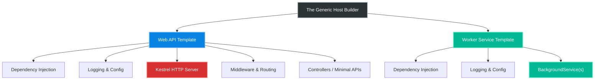

# 4.169 — Worker Services Project Template

## PART 0 — Navigation & Context

```text
ASP.NET Core Domain Hierarchy
├── Web Hosting & Startup
│   ├── 4.030 The Generic Host Builder
│   └── 4.033 Kestrel Web Server
├── Background Tasks
│   ├── 4.167 IHostedService vs BackgroundService
│   ├── 4.168 Hangfire & Distributed Task Queues
│   └── 4.169 Worker Services Project Template ◄ YOU ARE HERE
└── Deployment
    └── Windows Services & Linux Daemons
```

**What you need before this:**
- [[4.167 — IHostedService vs BackgroundService The Lifecycle]] — You must know how `BackgroundService` executes loops and handles cancellation.
- [[4.030 — The Generic Host Builder]] — Understanding the `IHost` abstraction.

**What this unlocks after:**
- Deploying .NET applications as Windows Services or Linux `systemd` Daemons.
- Building decoupled Event-Driven architectures (e.g., RabbitMQ consumers).

**Why this matters to a production engineer at scale:**
When you build a Web API, you use the "ASP.NET Core Web API" project template. This includes Kestrel, Routing, Controllers, and Middleware. But what if you are building a microservice that *only* consumes RabbitMQ messages? It never receives an HTTP request. If you use the Web API template, you waste memory booting Kestrel, opening HTTP ports, and configuring Swagger. The **Worker Service** project template is ASP.NET Core stripped down to its bare metal: It is just Dependency Injection, Logging, Configuration, and the Generic Host. It is the perfect, lightweight vessel for headless microservices.

---

## PART 1 — The Core Mental Model

> **The Fundamental Rule**
> **A Worker Service is an ASP.NET Core application with the HTTP Web Server (Kestrel) entirely ripped out; it relies on the same Generic Host, DI Container, and `appsettings.json` configuration, but exclusively executes `IHostedService` implementations for headless, long-running background workloads.**

**The Plain-Language Analogy**
Imagine a car chassis (The Generic Host).
If you build a **Web API**, you put a passenger cabin, seats, and doors on the chassis. The car accepts passengers (HTTP Requests), routes them to their destinations (Endpoints), and drops them off (HTTP Responses).
If you build a **Worker Service**, you put a flatbed trailer and a crane on the identical chassis. It doesn't accept passengers. It just drives around picking up heavy cargo (Messages from a queue) and dropping it off. It uses the same engine (DI), the same fuel (Configuration), and the same dashboard (Logging), but its body is built for a completely different purpose.

**The Taxonomy Diagram**



---

## PART 2 — Deep Mechanics

### 1. The Absence of IApplicationBuilder
In a Web API, `Program.cs` contains two distinct phases:
1. `builder.Services` (DI registration).
2. `app.Use...` (Middleware pipeline configuration via `IApplicationBuilder`).

In a Worker Service, there is no HTTP pipeline. There are no requests, no responses, no headers, no status codes. Therefore, there is no `IApplicationBuilder`. There is only DI registration.

### 2. Host.CreateApplicationBuilder
In .NET 6/7/8, Microsoft unified the startup code. A Worker Service uses `Host.CreateApplicationBuilder()`, whereas a Web API uses `WebApplication.CreateBuilder()`.

```csharp
// Worker Service Program.cs
var builder = Host.CreateApplicationBuilder(args);
builder.Services.AddHostedService<Worker>();
var host = builder.Build();
host.Run();
```

### 3. Execution Lifecycle
1. The host boots.
2. It parses `appsettings.json` and Environment Variables.
3. It configures the standard `ILogger`.
4. It calls `StartAsync` sequentially on all registered `IHostedService` classes.
5. It sits idle, keeping the process alive, while the `ExecuteAsync` loops run on the ThreadPool.
6. When Ctrl+C or SIGTERM is received, it calls `StopAsync` on all services, drains, and exits.

---

## PART 3 — Production Code Patterns

### Pattern 1: Creating a Worker Service
Use the CLI to create the stripped-down project.

```bash
dotnet new worker -n MyHeadlessMicroservice
```
This generates two files: `Program.cs` and `Worker.cs`.

### Pattern 2: RabbitMQ Consumer (Headless Microservice)
This is the primary use case for a Worker Service. It boots, connects to a message broker, and listens forever.

```csharp
public class RabbitMqConsumerWorker : BackgroundService
{
    private readonly ILogger<RabbitMqConsumerWorker> _logger;
    private readonly string _connectionString;

    public RabbitMqConsumerWorker(
        ILogger<RabbitMqConsumerWorker> logger, 
        IConfiguration config)
    {
        _logger = logger;
        _connectionString = config.GetConnectionString("RabbitMQ");
    }

    protected override async Task ExecuteAsync(CancellationToken stoppingToken)
    {
        _logger.LogInformation("Connecting to RabbitMQ...");
        // 1. Establish connection (abstracted)
        using var connection = Connect(_connectionString);
        using var channel = connection.CreateChannel();

        // 2. Setup Async Consumer
        var consumer = new AsyncEventingBasicConsumer(channel);
        consumer.Received += async (model, ea) =>
        {
            var body = ea.Body.ToArray();
            var message = Encoding.UTF8.GetString(body);
            
            _logger.LogInformation("Received {Message}", message);
            
            // 3. Process data (pass the stoppingToken!)
            await ProcessMessageAsync(message, stoppingToken);
            
            // 4. Acknowledge message
            channel.BasicAck(ea.DeliveryTag, false);
        };

        channel.BasicConsume(queue: "task_queue", autoAck: false, consumer: consumer);

        // ✅ CORRECT: Keep the worker alive forever, or until shutdown is requested
        // Without this, ExecuteAsync would finish and the worker would stop listening.
        await Task.Delay(Timeout.Infinite, stoppingToken);
    }
    
    private async Task ProcessMessageAsync(string msg, CancellationToken ct) { ... }
}
```

### Pattern 3: Hosting as a Windows Service
To deploy a Worker Service to an on-premise Windows Server as a true Windows Service (manageable via `services.msc`), you need an extension package.

```bash
dotnet add package Microsoft.Extensions.Hosting.WindowsServices
```

```csharp
// Program.cs
var builder = Host.CreateApplicationBuilder(args);

// ✅ CORRECT: Hooks into the Service Control Manager (SCM)
builder.Services.AddWindowsService(options =>
{
    options.ServiceName = "My Enterprise Queue Processor";
});

builder.Services.AddHostedService<Worker>();
var host = builder.Build();
host.Run();
```
*Deployment:* Compile, copy to server, run `sc create "MyWorker" binpath="C:\Path\To\MyWorker.exe"`.

### Pattern 4: Hosting as a Linux Systemd Daemon
To deploy to a Linux server and manage it via `systemctl`.

```bash
dotnet add package Microsoft.Extensions.Hosting.Systemd
```

```csharp
// Program.cs
var builder = Host.CreateApplicationBuilder(args);

// ✅ CORRECT: Hooks into systemd journald logging and lifecycle
builder.Services.AddSystemd();

builder.Services.AddHostedService<Worker>();
var host = builder.Build();
host.Run();
```

### Pattern 5: Dependency Injection Scopes
Because the Worker Service has no HTTP request boundaries, you must manually manage Scoped dependencies for your background iterations.

```csharp
protected override async Task ExecuteAsync(CancellationToken stoppingToken)
{
    while (!stoppingToken.IsCancellationRequested)
    {
        // Example: Pull batch from API
        var items = await FetchBatchAsync();

        foreach (var item in items)
        {
            // ✅ CORRECT: Create a scope per item processed
            using var scope = _serviceProvider.CreateScope();
            var dbContext = scope.ServiceProvider.GetRequiredService<AppDbContext>();
            
            dbContext.Records.Add(new Record { Data = item });
            await dbContext.SaveChangesAsync(stoppingToken);
        }

        await Task.Delay(1000, stoppingToken);
    }
}
```

---

## PART 4 — Gotchas & Anti-Patterns

### Gotcha 1: Using the Web API Template for Headless Tasks
Developers often use `dotnet new webapi`, delete the `Controllers` folder, and add a `BackgroundService`.

// ⚠️ WRONG CODE
```csharp
var builder = WebApplication.CreateBuilder(args);
builder.Services.AddHostedService<MyWorker>();
var app = builder.Build();
app.Run(); // Boots Kestrel!
```

// HTTP consequence (wrong path):
// The application allocates memory for Kestrel, binds to TCP port 5000/5001, and exposes an attack surface. If you deploy two of these to the same server, the second one crashes immediately with "Port 5000 is already in use".

// ✅ CORRECT CODE
```csharp
// Use Host.CreateApplicationBuilder(args). It does not reference Microsoft.AspNetCore at all.
```

### Gotcha 2: Returning from ExecuteAsync Prematurely
If you set up an event-based listener (like RabbitMQ) and allow `ExecuteAsync` to hit the bottom bracket.

// ⚠️ WRONG CODE
```csharp
protected override async Task ExecuteAsync(CancellationToken stoppingToken)
{
    _channel.BasicConsume(..., consumer);
    // Method ends here!
}
```

// HTTP consequence (wrong path):
// `ExecuteAsync` returns a completed Task. The Host assumes the background work is completely finished. It does *not* exit the application, but it logs that the worker stopped. If this was the only thing keeping your mental model straight, it's misleading. 

// ✅ CORRECT CODE
```csharp
protected override async Task ExecuteAsync(CancellationToken stoppingToken)
{
    _channel.BasicConsume(..., consumer);
    // Block the completion of ExecuteAsync until the application is shutting down
    await Task.Delay(Timeout.Infinite, stoppingToken);
}
```

### Gotcha 3: Failing to Halt the Host on Exceptions
If your background worker crashes, by default in .NET Core 3.1 through .NET 5, the exception was swallowed. The worker died, but the Host stayed alive in a zombie state.
In .NET 6+, Microsoft changed the default behavior: if a `BackgroundService` throws an unhandled exception, the Host process crashes. **This is good.** It allows Kubernetes/systemd to restart the process.

If you specifically want to control the exit code:

// ✅ CORRECT CODE
```csharp
protected override async Task ExecuteAsync(CancellationToken stoppingToken)
{
    try 
    { 
        await DoWorkAsync(); 
    }
    catch (Exception ex)
    {
        _logger.LogCritical(ex, "Fatal error. Requesting host shutdown.");
        // Manually trigger the host to shutdown
        _hostApplicationLifetime.StopApplication();
    }
}
```

### Gotcha 4: Captive Logging Contexts
If you use `ILogger.BeginScope` inside the `while` loop but forget the `using` block, the log scope leaks and bloats memory forever.

// ⚠️ WRONG CODE
```csharp
while (!stoppingToken.IsCancellationRequested)
{
    var batchId = Guid.NewGuid();
    _logger.BeginScope("Batch {BatchId}", batchId); // Memory leak!
    await ProcessBatch();
}
```

// ✅ CORRECT CODE
```csharp
while (!stoppingToken.IsCancellationRequested)
{
    var batchId = Guid.NewGuid();
    using (_logger.BeginScope("Batch {BatchId}", batchId))
    {
        await ProcessBatch();
    } // Disposed properly
}
```

---

## PART 5 — Performance Implications

### Request Pipeline Characteristics

| Scenario | Memory Footprint | CPU Idle Cost | Recommendation |
|---|---|---|---|
| Web API Template | ~40-60 MB | Low | Do not use for pure headless tasks. |
| Worker Service | ~15-20 MB | Zero | Perfect for headless tasks. |
| Native AOT Worker | ~5-10 MB | Zero | The ultimate optimization for container density. |

### BenchmarkDotNet Code

*(Benchmarking startup time and memory footprint of the Host itself)*

If you compile a Worker Service with **Native AOT** (.NET 8+), it strips out the JIT compiler entirely. A headless Worker Service container can boot in under **50 milliseconds** and consume just **10MB of RAM**. This makes Worker Services the undisputed king of cloud-native density when you need to deploy hundreds of queue consumers.

```xml
<!-- In the Worker Service .csproj -->
<PropertyGroup>
  <PublishAot>true</PublishAot>
</PropertyGroup>
```

---

## PART 6 — Interview Arsenal

### A. The Question Bank

**Question 1:** "We have a requirement to build a microservice that reads files from an FTP server every 10 minutes and inserts them into SQL Server. Which ASP.NET Core project template should we use, and why?"
- **Average Answer:** "Use the Web API template and add a BackgroundService."
- **Why That's Insufficient:** Ignores the overhead of Kestrel.
- **Great Answer:** "We should use the Worker Service template. The application has no requirement to accept HTTP requests, so booting the Kestrel web server via the Web API template would be a waste of memory and expose an unnecessary network port. The Worker Service template provides the exact same Dependency Injection, configuration (`appsettings.json`), and logging infrastructure as a Web API, but stripped down to pure execution of `IHostedService` interfaces. It is extremely lightweight and container-friendly."

**Question 2:** "If you deploy a Worker Service to a Linux server, how do you ensure it starts automatically when the server reboots?"
- **Average Answer:** "Put it in a bash script."
- **Why That's Insufficient:** Doesn't leverage the native OS service manager.
- **Great Answer:** "You configure it as a `systemd` daemon. In the code, you add the `Microsoft.Extensions.Hosting.Systemd` NuGet package and call `builder.Services.AddSystemd()` in `Program.cs`. This integrates the .NET Host lifecycle with the Linux systemd manager, allowing it to correctly signal startup and pipe its logs directly into `journald`. Then, you create a `.service` definition file in `/etc/systemd/system/` and run `systemctl enable` so the OS automatically monitors and restarts it on failure or reboot."

**Question 3:** "In a Web API, EF Core's `DbContext` is injected into Controllers cleanly. How do you inject and use a `DbContext` safely inside a Worker Service's `ExecuteAsync` loop?"
- **Average Answer:** "You inject it into the Worker's constructor."
- **Why That's Insufficient:** Captive dependency crash.
- **Great Answer:** "You cannot inject a `DbContext` into the Worker's constructor because the Worker is a Singleton and the `DbContext` is Scoped. Doing so causes a DI exception at startup. Because there are no HTTP requests in a Worker Service, there are no automatic DI Scopes. You must inject `IServiceProvider` into the constructor, and inside your `while` loop (or for each batch of work), manually call `using var scope = _serviceProvider.CreateScope()`. You then resolve the `DbContext` from that explicit scope, ensuring the connection is cleanly closed and garbage collected when the iteration finishes."

### B. The Trick Questions

**Trick Question:** "If a Worker Service is deployed to a Docker container, do I still need to use `AddWindowsService()` or `AddSystemd()`?"
- **The Trap:** Conflating physical OS daemons with container orchestration.
- **The Correct Answer:** "No. When deployed in Docker or Kubernetes, the container acts as the process boundary. The container orchestrator (Docker daemon or Kubelet) acts as the service manager. It will automatically restart the process if it exits, and it captures `stdout` logs directly. You only use `AddWindowsService` or `AddSystemd` when deploying directly to virtual machines or bare-metal operating systems."

**Trick Question:** "Can a Worker Service expose a health-check HTTP endpoint so Kubernetes knows it is alive?"
- **The Trap:** Believing Worker Services absolutely cannot open ports.
- **The Correct Answer:** "Yes, but you have to specifically add Kestrel back into the host. While the default Worker template removes it, you can call `builder.WebHost.ConfigureKestrel(...)` and `UseHealthChecks()` if you explicitly need an HTTP ping. However, a lighter alternative in Kubernetes is to have the worker periodically touch a file on disk (liveness probe via `cat /tmp/healthy`), avoiding Kestrel entirely."

### C. Red Flags to Avoid
- 🚩 **"I use `Console.ReadLine()` to keep my worker running."** (Prevents graceful shutdown signals from propagating. The Host handles keeping the process alive automatically).
- 🚩 **"I put `Thread.Sleep` in my loop."** (Blocks thread pool threads. Always use `await Task.Delay`).

---

## PART 7 — Decision Framework

```mermaid
graph TD
    A[New Microservice] --> B{Does it receive HTTP requests?}
    
    B -->|Yes| C[Use Web API Template]
    B -->|No| D[Use Worker Service Template]
    
    D --> E{Deployment Target?}
    E -->|Docker / Kubernetes| F[Standard Worker Program.cs]
    E -->|Windows Server VM| G[AddWindowsService()]
    E -->|Linux Bare Metal| H[AddSystemd()]
    
    F --> I{Needs sub-50ms boot & low RAM?}
    I -->|Yes| J[Compile with Native AOT]
    I -->|No| K[Standard JIT deployment]
    
    style A fill:#2d3436,stroke:#fff
    style C fill:#0984e3,stroke:#fff
    style D fill:#00b894,stroke:#fff
    style J fill:#00b894,stroke:#fff
    style K fill:#00b894,stroke:#fff
```

---

## PART 8 — Self-Check

### A. Conceptual Questions
1. What is the fundamental difference between `WebApplication.CreateBuilder` and `Host.CreateApplicationBuilder`?
2. Why is there no `IApplicationBuilder` (`app.Use...`) in a Worker Service?
3. How do you integrate a .NET Worker Service with Linux `journald` logging?
4. What happens if a Worker Service throws an unhandled exception in .NET 8?
5. Why must you manually manage DI Scopes in a Worker Service?
6. When should you use `AddWindowsService()`?
7. What is Native AOT, and why is it highly beneficial for Worker Services?
8. How do you keep an event-based `BackgroundService` alive if its setup code finishes instantly?

### B. Code Puzzles

**Puzzle 1: The Zombie Loop**
```csharp
protected override async Task ExecuteAsync(CancellationToken stoppingToken) {
    while (true) {
        await DoWorkAsync();
        await Task.Delay(1000); // Wait 1 second
    }
}
```
*Scenario:* A SIGTERM is sent.
<details>
<summary>Answer</summary>
The loop ignores `stoppingToken`. The delay doesn't observe it either. The host waits 5 seconds for a graceful shutdown, gets frustrated, and forcefully kills the process (SIGKILL).
*Fix:* `while (!stoppingToken.IsCancellationRequested)` and `await Task.Delay(1000, stoppingToken)`.
</details>

**Puzzle 2: The Eager Constructor**
```csharp
public class MyWorker : BackgroundService {
    public MyWorker() {
        Task.Run(async () => await ProcessQueue());
    }
    protected override Task ExecuteAsync(CancellationToken ct) => Task.CompletedTask;
}
```
*Scenario:* The developer starts the work in the constructor.
<details>
<summary>Answer</summary>
The work begins before the generic host has fully booted. It bypasses the safety guarantees of `StartAsync`, it doesn't receive the `CancellationToken`, and if it throws an exception, it crashes the app during DI resolution.
*Fix:* Put the work inside `ExecuteAsync`.
</details>

**Puzzle 3: The Missing WebHost**
```csharp
var builder = Host.CreateApplicationBuilder(args);
builder.Services.AddControllers();
// Wait, how do I MapControllers?
```
*Scenario:* The developer tries to add an API endpoint to a Worker Service.
<details>
<summary>Answer</summary>
A Worker Service has no Kestrel web server. `AddControllers` adds services, but there is no pipeline to route TCP requests to them.
*Fix:* If you need HTTP, you must convert the project back to a Web API by using `WebApplication.CreateBuilder` instead.
</details>

---

## PART 9 — Connections & Resources

### A. Related Topics Table

| Topic | Why It Connects |
|---|---|
| [[4.167 — IHostedService vs BackgroundService The Lifecycle]] | The exact base classes used inside the Worker Service template. |
| [[4.030 — The Generic Host Builder]] | The architectural chassis that makes both Web APIs and Worker Services possible. |
| [[4.168 — Hangfire & Distributed Task Queues]] | Hangfire workers are often deployed using the Worker Service template. |

### B. Books

| Book | Chapters | Why These Chapters |
|---|---|---|
| ASP.NET Core in Action, 3rd Ed | Chapter 21: Background tasks | Deep dive into deploying Worker Services. |
| Architecting Cloud Native .NET Apps | Chapter 4: Cloud-Native Apps | Discusses deploying stateless worker microservices. |

### C. Essential Articles & Docs
- [Microsoft Docs: Worker Services in .NET](https://learn.microsoft.com/en-us/dotnet/core/extensions/workers)
- [Microsoft Docs: Host ASP.NET Core in a Windows Service](https://learn.microsoft.com/en-us/aspnet/core/host-and-deploy/windows-service)
- [Microsoft Docs: Host ASP.NET Core on Linux with systemd](https://learn.microsoft.com/en-us/aspnet/core/host-and-deploy/linux-nginx)

> [!NOTE]
> **Template Meta-Note**
> Part 0: Context & Prerequisites. Part 1: Core Mental Model. Part 2: Deep Mechanics & Pipeline. Part 3: Production Code. Part 4: Gotchas. Part 5: Performance. Part 6: Interview Arsenal. Part 7: Decision Framework. Part 8: Puzzles. Part 9: Resources.
