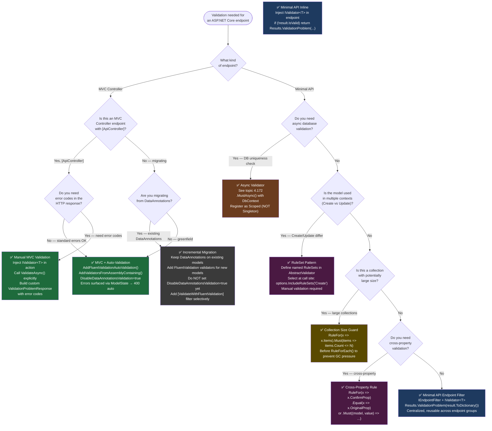

> [!success] Mastery Check
> - [ ] **Studied Well**
> - [ ] **Can explain the concept without notes**
> - [ ] **Can answer interview questions confidently**
> - [ ] **Can implement it in a real project**


# 4.170 — FluentValidation: Validators, RuleFor, and ASP.NET Core Integration

---

## PART 0 — Navigation & Context

### Where This Topic Lives in the ASP.NET Core Domain Hierarchy

```
ASP.NET Core Mastery
└── Validation                                          ← you are here
    ├── 4.102 — Model Validation: DataAnnotations and ModelState
    ├── 4.167 — DataAnnotations Validation in ASP.NET Core
    ├── 4.168 — ModelState: Checking Validity, Reading Errors, Custom Responses
    ├── 4.170 — FluentValidation: Validators, RuleFor, and ASP.NET Core Integration  ◄ THIS NOTE
    ├── 4.172 — FluentValidation: Async Validators and Database-Level Validation
    └── 4.086 — Validation in Minimal APIs: IValidator<T>

Adjacent subsystems that interact with Validation:
├── DI Container (4.034)         ← validators are DI-registered services
├── MVC & Controllers            ← [ApiController] triggers automatic 400 responses
├── Minimal APIs (4.086)         ← manual IValidator<T> invocation required
├── Error Handling               ← ValidationProblemDetails shape comes from here
└── Filters                      ← ActionFilter can call validation manually
```

### What You Need Before This

| Prerequisite | Why You Need It |
|---|---|
| [[4.102 — Model Validation: DataAnnotations and ModelState]] | ModelState is where FluentValidation errors are surfaced; you must understand its shape first |
| [[4.034 — The Built-In DI Container]] | Validators are scoped DI services; `AddValidatorsFromAssemblyContaining<T>` is a DI registration call |
| [[4.168 — ModelState: Checking Validity, Reading Errors, Custom Responses]] | You need to understand how `ModelState.IsValid` is checked and how 400 responses are formed |
| [[4.167 — DataAnnotations Validation in ASP.NET Core]] | FluentValidation is a direct alternative/complement; you must understand what you're replacing |

### What This Unlocks After

| Topic | Dependency |
|---|---|
| [[4.172 — FluentValidation: Async Validators and Database-Level Validation]] | Async validators build on the `RuleFor` chain; you must understand sync rules first |
| [[4.086 — Validation in Minimal APIs: IValidator<T>]] | Manual `IValidator<T>` invocation is the Minimal API pattern; this note teaches the validator itself |
| Advanced Cross-Property Validation | `RuleFor` + `.When()` + `.DependentRules()` patterns require deep `AbstractValidator<T>` knowledge |

### Why This Topic Matters at Scale

> FluentValidation is the **contract boundary guardian** for every incoming HTTP request in production APIs: it enforces business rules at the model-binding layer with composable, testable, DI-aware code — before a single line of business logic runs — ensuring that your payment service, order API, or user-auth endpoint never executes with structurally or semantically invalid input.

---

## PART 1 — The Core Mental Model

### The Fundamental Rule

> **FluentValidation's `AbstractValidator<T>` runs as a model-validator plugged into ASP.NET Core's model validation pipeline: when `AddFluentValidationAutoValidation()` is registered, FluentValidation validators execute during model binding and populate `ModelState` with failures — so the `[ApiController]` attribute's automatic 400 response fires before your action method is invoked, exactly as if DataAnnotations had failed.**

### The Plain-Language Analogy

Picture an airport security checkpoint. The traveller (HTTP request) arrives at the gate with a boarding pass and luggage (the deserialized C# model). The security scanner is FluentValidation — it checks every rule in order: is the boarding pass present? Is the destination valid? Is the luggage within weight limits? Does it contain prohibited items? If any check fails, the scanner ejects the traveller with a clear, machine-readable rejection notice before they reach the boarding bridge (your controller action). The airport manager (ASP.NET Core `[ApiController]`) has already configured the desk to automatically turn away anyone the scanner flags without calling the gate agent at all. The scanner can also check by calling customs (async validators with database lookups) — but only if the basic form checks pass first. Multiple scanners can be chained: a bag validator, a passport validator, a ticket validator — each defined separately and composed together.

### The Taxonomy Diagram

```mermaid
graph TD
    subgraph "FluentValidation Core"
        AV["AbstractValidator&lt;T&gt;\n(inherit to create validators)"]
        RF["RuleFor(x => x.Property)\n(entry point for a property rule)"]
        RFE["RuleForEach(x => x.Collection)\n(entry point for collection rules)"]
        CHAIN["Rule Chain\n.NotEmpty().MaximumLength(256).EmailAddress()"]
        COND["Conditional Rules\n.When() / .Unless()"]
        CUSTOM[".Must() / .MustAsync()\n(custom predicate validators)"]
        NESTED["Nested Object Rules\n.SetValidator(new AddressValidator())"]
        MSG[".WithMessage() / .WithName() / .WithErrorCode()"]
    end

    subgraph "Built-in Validators"
        NULL["Null / NotNull"]
        EMPTY["Empty / NotEmpty"]
        EQ["Equal / NotEqual"]
        LEN["Length / MaximumLength / MinimumLength"]
        EMAIL["EmailAddress"]
        GT["GreaterThan / LessThan\nGreaterThanOrEqualTo / LessThanOrEqualTo"]
        BETWEEN["InclusiveBetween / ExclusiveBetween"]
        REGEX["Matches (regex)"]
        CREDIT["CreditCard"]
        SCALE["ScalePrecision (for decimal)"]
    end

    subgraph "ASP.NET Core Integration"
        DI["DI Registration\nAddValidatorsFromAssemblyContaining&lt;T&gt;()"]
        AUTO["Auto-Validation\nAddFluentValidationAutoValidation()"]
        MS["ModelState Population\n(FluentValidation → ModelState errors)"]
        API400["[ApiController] Auto-400\n(fires before action method)"]
        MANUAL["Manual Invocation\nIValidator&lt;T&gt;.ValidateAsync()"]
        MINAPI["Minimal API Pattern\nresult.ToDictionary()"]
    end

    subgraph "Scoping"
        SCOPE_RULE["RuleSet\n(.RuleSet(\"name\", () => {...}))"]
        SCOPE_COND["Cascade Mode\n(.CascadeMode = Stop / Continue)"]
    end

    AV --> RF
    AV --> RFE
    RF --> CHAIN
    RF --> COND
    RF --> CUSTOM
    RF --> NESTED
    CHAIN --> MSG
    CHAIN --> NULL & EMPTY & EQ & LEN & EMAIL & GT & BETWEEN & REGEX & CREDIT & SCALE

    DI --> AUTO
    AUTO --> MS
    MS --> API400
    DI --> MANUAL
    MANUAL --> MINAPI

    AV --> DI
    AV --> SCOPE_RULE
    AV --> SCOPE_COND

    style AV fill:#1e3a5f,color:#fff
    style RF fill:#1e3a5f,color:#fff
    style RFE fill:#1e3a5f,color:#fff
    style DI fill:#2d6a4f,color:#fff
    style AUTO fill:#2d6a4f,color:#fff
    style MS fill:#2d6a4f,color:#fff
    style API400 fill:#2d6a4f,color:#fff
    style MANUAL fill:#2d6a4f,color:#fff
    style MINAPI fill:#2d6a4f,color:#fff
    style CHAIN fill:#4a1942,color:#fff
    style CUSTOM fill:#4a1942,color:#fff
    style NESTED fill:#4a1942,color:#fff
    style COND fill:#4a1942,color:#fff
```

---

## PART 2 — Deep Mechanics

### 2.1 — AbstractValidator\<T\>: The Validator Class Structure and Construction

#### Pipeline Position

```
HTTP Request (POST /api/orders)
  │
  ▼
┌─────────────────────────────────────────────────────────────────────────┐
│ Kestrel → Exception Handling → HSTS → Routing → Auth → [ApiController] │
│                                                                         │
│   Model Binding (reads JSON body, binds to CreateOrderRequest)          │
│       ↓                                                                 │
│   Model Validation Phase ← FluentValidation runs HERE                  │
│       │ (IModelValidator → FluentValidationModelValidator               │
│       │  → AbstractValidator<CreateOrderRequest>.Validate())            │
│       ↓                                                                 │
│   ModelState populated with failures (if any)                           │
│       ↓                                                                 │
│   [ApiController] checks ModelState.IsValid                             │
│       ├─ false → short-circuit → 400 ValidationProblemDetails           │
│       └─ true  → Action method executes                                 │
└─────────────────────────────────────────────────────────────────────────┘
```

#### What `AbstractValidator<T>` Is Doing Internally

When you write:
```csharp
public class CreateOrderValidator : AbstractValidator<CreateOrderRequest>
{
    public CreateOrderValidator()
    {
        RuleFor(x => x.CustomerId)
            .NotEmpty()
            .WithMessage("Customer ID is required");

        RuleFor(x => x.TotalAmount)
            .GreaterThan(0)
            .WithMessage("Order total must be positive");
    }
}
```

FluentValidation internally (approximate):
```
AbstractValidator<T> constructor runs once (at DI registration or first use)
  → Each RuleFor() call creates a PropertyRule<T, TProperty>
  → PropertyRule stores:
      - The property selector expression (x => x.CustomerId)
      - The compiled property accessor (Func<T, TProperty>)
      - A list of IPropertyValidator implementations (NotEmptyValidator, etc.)
      - Custom message string / message format
  → Rules are stored in a List<IValidationRule> on the AbstractValidator

At validation time (one allocation per rule chain evaluation):
  ValidationContext<T> created with the model instance
  → Each PropertyRule.Validate(context) called in order
  → Each IPropertyValidator.Validate(PropertyValidatorContext) called
  → Failures collected into ValidationResult.Errors (List<ValidationFailure>)

FluentValidation ASP.NET integration (FluentValidationModelValidator):
  → Calls AbstractValidator<T>.Validate(model)
  → Maps each ValidationFailure to ModelError
  → Adds to ModelStateDictionary using failure.PropertyName as key
```

**Cost label:** `~1 ValidationContext<T> allocation per request`, `O(n) traversal of rule chain`, `O(1) per built-in validator (no reflection at validation time — expression compiled once at startup)`.

#### HTTP Wire Format (successful validation)

```http
// HTTP request:
POST /api/orders HTTP/1.1
Content-Type: application/json
Authorization: Bearer eyJhbGci...

{
  "customerId": "CUST-001",
  "totalAmount": 249.99,
  "lineItems": [{ "productId": "PROD-42", "quantity": 2 }]
}

// HTTP response (validation passed, action executes):
HTTP/1.1 201 Created
Content-Type: application/json
Location: /api/orders/ORD-9921

{ "orderId": "ORD-9921", "status": "pending" }
```

#### HTTP Wire Format (validation failure)

```http
// HTTP request (bad data):
POST /api/orders HTTP/1.1
Content-Type: application/json

{
  "customerId": "",
  "totalAmount": -5.00,
  "lineItems": []
}

// HTTP response (ModelState.IsValid = false, [ApiController] auto-responds):
HTTP/1.1 400 Bad Request
Content-Type: application/problem+json

{
  "type": "https://tools.ietf.org/html/rfc9110#section-15.5.1",
  "title": "One or more validation errors occurred.",
  "status": 400,
  "errors": {
    "CustomerId": ["Customer ID is required"],
    "TotalAmount": ["Order total must be positive"],
    "LineItems": ["At least one line item is required"]
  }
}
```

> [!IMPORTANT]
> The `errors` dictionary key is the **property name** from `ValidationFailure.PropertyName`. FluentValidation uses the C# property name by default. You can override with `.WithName("Customer ID")` — but this changes the key in the errors dictionary, not just the error message. This surprises teams migrating from DataAnnotations where the JSON key and error key could differ.

---

### 2.2 — The RuleFor Fluent Chain: Built-in Validators Deep Dive

Every call to `RuleFor(x => x.Property)` returns an `IRuleBuilderInitial<T, TProperty>`, and each subsequent validator call (`.NotEmpty()`, `.EmailAddress()`, etc.) returns `IRuleBuilderOptions<T, TProperty>`, enabling the chain. Each validator in the chain is an `IPropertyValidator` that is called in sequence.

#### Pipeline Position for Validation Rule Chain Execution

```
ValidationContext<CreatePaymentRequest>
  │
  ▼
PropertyRule for "CardNumber"
  ├── NotNullValidator           → passes? → continue
  ├── NotEmptyValidator          → passes? → continue
  ├── CreditCardValidator        → passes? → continue
  └── (custom .Must() validator) → passes? → stop / collect failure

PropertyRule for "Amount"
  ├── GreaterThanValidator(0)    → passes? → continue
  └── ScalePrecisionValidator(2) → passes? → stop / collect failure

PropertyRule for "ExpiryDate"
  └── GreaterThanOrEqualTo(DateTime.UtcNow.Date) → passes? → continue
```

#### Complete Built-in Validator Reference

```csharp
public class ProcessPaymentValidator : AbstractValidator<ProcessPaymentRequest>
{
    public ProcessPaymentValidator()
    {
        // ── Null / Empty checks ──────────────────────────────────────────
        // NotNull: fails if property value is null (reference types / nullables)
        RuleFor(x => x.CardToken).NotNull();

        // NotEmpty: fails for null, empty string "", whitespace " ", 0, Guid.Empty,
        //           empty IEnumerable. More useful than NotNull for strings.
        RuleFor(x => x.MerchantId).NotEmpty();

        // Null: fails if value is NOT null (useful in conditional contexts)
        RuleFor(x => x.RefundReason).Null()
            .When(x => x.TransactionType != TransactionType.Refund);

        // Empty: opposite of NotEmpty (rarely used standalone)
        RuleFor(x => x.PromoCode).Empty()
            .When(x => !x.IsPromoEligible);

        // ── Equality ────────────────────────────────────────────────────
        // Equal: value must equal a constant or another property
        RuleFor(x => x.ConfirmAmount).Equal(x => x.Amount)
            .WithMessage("Confirmation amount must match payment amount");

        // NotEqual: value must differ
        RuleFor(x => x.NewPin).NotEqual(x => x.OldPin)
            .WithMessage("New PIN must differ from current PIN");

        // ── Length constraints ───────────────────────────────────────────
        // Length: both min and max (inclusive)
        RuleFor(x => x.Cvv).Length(3, 4)
            .WithMessage("CVV must be 3 or 4 digits");

        // MaximumLength: max only
        RuleFor(x => x.Description).MaximumLength(500);

        // MinimumLength: min only
        RuleFor(x => x.MerchantName).MinimumLength(2);

        // ── Format validators ────────────────────────────────────────────
        // EmailAddress: validates email format using built-in regex OR .NET MailAddress
        RuleFor(x => x.BillingEmail).EmailAddress()
            .MaximumLength(256);

        // CreditCard: Luhn algorithm check
        RuleFor(x => x.CardNumber).CreditCard()
            .WithMessage("Card number '{PropertyValue}' failed Luhn check");

        // Matches: regex pattern
        RuleFor(x => x.PostalCode).Matches(@"^\d{5}(-\d{4})?$")
            .WithMessage("US ZIP code format required");

        // ── Numeric comparisons ──────────────────────────────────────────
        // GreaterThan: strictly >
        RuleFor(x => x.Amount).GreaterThan(0m)
            .WithMessage("Payment amount must be positive");

        // GreaterThanOrEqualTo: >=
        RuleFor(x => x.InstallmentCount).GreaterThanOrEqualTo(1);

        // LessThan: strictly <
        RuleFor(x => x.Amount).LessThan(1_000_000m)
            .WithMessage("Single payment limit exceeded");

        // LessThanOrEqualTo: <=
        RuleFor(x => x.RetryAttempts).LessThanOrEqualTo(3);

        // InclusiveBetween: min <= value <= max
        RuleFor(x => x.Amount).InclusiveBetween(0.01m, 50_000m);

        // ExclusiveBetween: min < value < max (neither endpoint allowed)
        RuleFor(x => x.InterestRate).ExclusiveBetween(0.0m, 100.0m);

        // ── Decimal precision ────────────────────────────────────────────
        // ScalePrecision: scale = decimal places, precision = total significant digits
        // ScalePrecision(2, 10) means up to 10 total digits with max 2 after decimal
        RuleFor(x => x.Amount).ScalePrecision(2, 10)
            .WithMessage("Amount must have at most 2 decimal places");
    }
}
```

**Cost label:** Every built-in validator is a struct or sealed class. `NotEmptyValidator`, `GreaterThanValidator<T>`, etc. are compiled once. Validation at runtime is a simple delegate call — `~zero allocation per validator invocation` for value-type properties; `~1 boxing allocation` if a value type is boxed in `PropertyValidatorContext`.

> [!NOTE]
> **`EmailAddress` mode:** FluentValidation 11+ introduced `EmailValidationMode`. The default changed from `AspNetCoreCompatible` (uses `EmailAddressAttribute` regex) to `Net4xRegex` in some versions. Set explicitly: `.EmailAddress(EmailValidationMode.AspNetCoreCompatible)` for consistency with DataAnnotations behavior, or `EmailValidationMode.Net4xRegex` for RFC 5322 stricter checks.

---

### 2.3 — Custom Validators: `.Must()`, `.WithMessage()`, `.WithName()`, `.WithErrorCode()`

#### Pipeline Position for Custom Validators

```
PropertyRule for "BillingEmail"
  ├── NotEmpty validator          (built-in, O(1))
  ├── EmailAddress validator      (built-in, regex compiled once)
  ├── MaximumLength(256)          (built-in, O(1))
  └── .Must(email => !email.Contains("+"))   ← custom predicate HERE
        → Func<string, bool> compiled once, called O(1) per request
        → Failure → ValidationFailure { PropertyName="BillingEmail",
                                        ErrorMessage="Plus-addressing not allowed",
                                        ErrorCode="NO_PLUS_ADDRESS",
                                        AttemptedValue="user+tag@example.com" }
```

#### Custom Validator Internals

```csharp
public class UserRegistrationValidator : AbstractValidator<UserRegistrationRequest>
{
    public UserRegistrationValidator()
    {
        // .Must(predicate) — synchronous custom rule
        // The predicate receives the property value.
        // The PropertyValidatorContext overload receives both model and property value.
        RuleFor(x => x.Email)
            .NotEmpty()
            .EmailAddress()
            .MaximumLength(256)
            .Must(email => !email.Contains("+"))
                // PropertyValue token = the actual value being validated
                // PropertyName token = property name (or overridden with WithName)
                .WithMessage("Email address '{PropertyValue}' cannot use plus-addressing")
                // WithErrorCode sets ValidationFailure.ErrorCode
                // — critical for API consumers who need machine-readable codes
                .WithErrorCode("USER_EMAIL_NO_PLUS_ADDRESSING");

        // .Must() with access to the full model (useful for cross-property validation)
        RuleFor(x => x.ConfirmPassword)
            .Must((request, confirmPassword) => confirmPassword == request.Password)
            .WithMessage("Passwords do not match")
            .WithErrorCode("PASSWORD_MISMATCH");

        // .WithName() overrides the property name in error messages AND the ModelState key
        // ⚠️ WARNING: this changes ModelState["Display Name"] not ModelState["InternalFieldName"]
        RuleFor(x => x.InternalFieldName)
            .NotEmpty()
            .WithName("Display Name")
            .WithMessage("'{PropertyName}' is required");
            // Error message becomes: "'Display Name' is required"
            // ModelState key becomes: "Display Name" (not "InternalFieldName")

        // Message template tokens available:
        // {PropertyName}    = the property name (or overridden name from WithName)
        // {PropertyValue}   = the property's actual value
        // {ComparisonValue} = the comparison value (e.g., in Equal, GreaterThan)
        // {MinLength}       = min length (Length validator)
        // {MaxLength}       = max length
        // {From}            = lower bound (Between validators)
        // {To}              = upper bound (Between validators)
        // {TotalDigits}     = total digits (ScalePrecision)
        // {DecimalPlaces}   = decimal places (ScalePrecision)
    }
}
```

#### HTTP Wire Format with Error Codes

When `WithErrorCode` is used, the ValidationProblemDetails response does NOT include error codes by default. Error codes live on `ValidationFailure.ErrorCode`. To surface them to API clients, you need a custom response factory:

```csharp
// In Program.cs — custom 400 response that includes error codes:
builder.Services.AddControllers()
    .ConfigureApiBehaviorOptions(options =>
    {
        options.InvalidModelStateResponseFactory = context =>
        {
            var errors = context.ModelState
                .Where(e => e.Value?.Errors.Count > 0)
                .ToDictionary(
                    kvp => kvp.Key,
                    kvp => kvp.Value!.Errors.Select(e => e.ErrorMessage).ToArray()
                );

            // FluentValidation error codes are lost in ModelState translation.
            // To preserve them, use manual validation (IValidator<T>) in endpoints.
            var problem = new ValidationProblemDetails(context.ModelState)
            {
                Type = "https://api.yourcompany.com/errors/validation",
                Title = "Validation failed",
                Status = StatusCodes.Status400BadRequest
            };

            return new BadRequestObjectResult(problem)
            {
                ContentTypes = { "application/problem+json" }
            };
        };
    });
```

```http
// HTTP response with error codes (requires manual validation path):
HTTP/1.1 400 Bad Request
Content-Type: application/problem+json

{
  "type": "https://api.yourcompany.com/errors/validation",
  "title": "Validation failed",
  "status": 400,
  "errors": [
    {
      "field": "Email",
      "message": "Email address 'user+tag@example.com' cannot use plus-addressing",
      "code": "USER_EMAIL_NO_PLUS_ADDRESSING"
    }
  ]
}
```

**Cost label:** `.Must()` with a simple lambda — `~0 extra allocations` (closure is compiled once if it doesn't capture state). `.Must()` capturing request-time state (e.g., `DateTime.UtcNow`) — `~1 closure allocation per request`.

---

### 2.4 — Conditional Rules: `.When()`, `.Unless()`, and `.DependentRules()`

Conditional validation is one of FluentValidation's most powerful features and one of its most misunderstood. The condition is evaluated at validation time, not at rule definition time.

#### Pipeline Position for Conditional Rules

```
ValidationContext<CreateShipmentRequest>
  │
  ▼
PropertyRule for "InsuranceAmount"
  └── [Condition: x.RequiresInsurance == true]
        ├── Condition TRUE  → execute: GreaterThan(0), MaximumLength → collect failures
        └── Condition FALSE → skip entire rule chain → no failures for this property

PropertyRule for "RecipientEmail"
  └── [Condition: x.NotificationMethod == "Email"]
        ├── Condition TRUE  → execute: NotEmpty, EmailAddress
        └── Condition FALSE → no validation on RecipientEmail
```

#### Conditional Validation Patterns

```csharp
public class CreateShipmentValidator : AbstractValidator<CreateShipmentRequest>
{
    public CreateShipmentValidator()
    {
        // .When() — run the rule only when condition is true
        RuleFor(x => x.InsuranceAmount)
            .GreaterThan(0)
            .WithMessage("Insurance amount must be positive when insurance is required")
            .When(x => x.RequiresInsurance);

        // .Unless() — run the rule only when condition is false (inverse of When)
        RuleFor(x => x.RecipientPhone)
            .NotEmpty()
            .Matches(@"^\+?[\d\s\-()]{7,20}$")
            .Unless(x => x.NotificationMethod == NotificationMethod.Email);

        // When applied to an entire group of rules for the same property:
        // The second parameter `ApplyConditionTo.AllValidators` (default) applies
        // the condition to ALL validators in the chain.
        // `ApplyConditionTo.CurrentValidator` applies only to the immediately preceding validator.
        RuleFor(x => x.CustomsDeclarationValue)
            .NotNull()
            .GreaterThan(0m)
            .ScalePrecision(2, 12)
            .When(x => x.IsInternationalShipment, ApplyConditionTo.AllValidators);

        // .DependentRules() — run child rules ONLY if the parent rule passes
        // Useful to avoid cascading failures (e.g., don't validate email format
        // if email is empty — the NotEmpty failure is enough)
        RuleFor(x => x.RecipientEmail)
            .NotEmpty()
            .DependentRules(() =>
            {
                RuleFor(x => x.RecipientEmail)
                    .EmailAddress()
                    .MaximumLength(256);
            });

        // ── Cascade Mode ─────────────────────────────────────────────────
        // By default, ALL validators in a chain run even if one fails.
        // CascadeMode.Stop stops on first failure for this property.
        // This prevents noisy errors: e.g., don't run EmailAddress check
        // if the string is already empty.
        RuleFor(x => x.RecipientEmail)
            .Cascade(CascadeMode.Stop)  // Stop at first failure for this property
            .NotEmpty()
            .EmailAddress()
            .MaximumLength(256);

        // Global cascade mode (set in constructor):
        // RuleLevelCascadeMode = CascadeMode.Stop;  // applies to all property rules
        // ClassLevelCascadeMode = CascadeMode.Stop; // applies at class level (stops across properties)
    }
}
```

> [!WARNING]
> **`.When()` and `ApplyConditionTo`**: When you chain `.When()` after multiple validators, by default it applies to ALL validators in the chain (not just the last one). This is `ApplyConditionTo.AllValidators` and is almost always what you want. But if you write:
> ```csharp
> RuleFor(x => x.Amount).GreaterThan(0).ScalePrecision(2,10).When(x => x.IsPaid);
> ```
> Both `GreaterThan` AND `ScalePrecision` are conditional. Use `ApplyConditionTo.CurrentValidator` to condition only the last validator in the chain.

**Cost label:** `.When()` condition evaluation — `~1 delegate invocation per rule per request`, `~0 additional allocations`. `DependentRules()` — builds a sub-rule list at startup, no additional runtime cost.

---

### 2.5 — Nested Object Validation and Collection Validation

Real-world models are never flat. FluentValidation handles object graphs through `.SetValidator()` and `RuleForEach()`.

#### Pipeline Position for Nested/Collection Validation

```
ValidationContext<CreateOrderRequest>
  │
  ├── RuleFor(x => x.ShippingAddress)
  │       └── .SetValidator(new AddressValidator())
  │               │
  │               └── AddressValidator runs as if it were its own validation context
  │                   Failures have PropertyName = "ShippingAddress.Street",
  │                                                "ShippingAddress.City", etc.
  │
  └── RuleForEach(x => x.LineItems)
          └── .SetValidator(new OrderLineItemValidator())
                  │
                  └── Runs AddressValidator for each element
                      Failures have PropertyName = "LineItems[0].ProductId",
                                                   "LineItems[1].Quantity", etc.
```

#### Nested and Collection Validator Patterns

```csharp
// Standalone validator for the Address value object
public class ShippingAddressValidator : AbstractValidator<ShippingAddress>
{
    public ShippingAddressValidator()
    {
        RuleFor(x => x.Street).NotEmpty().MaximumLength(200);
        RuleFor(x => x.City).NotEmpty().MaximumLength(100);
        RuleFor(x => x.PostalCode)
            .NotEmpty()
            .Matches(@"^\d{5}(-\d{4})?$")
            .WithMessage("'{PropertyName}' must be a valid US ZIP code");
        RuleFor(x => x.CountryCode)
            .NotEmpty()
            .Length(2)
            .Matches(@"^[A-Z]{2}$")
            .WithMessage("Country code must be a 2-letter ISO code (e.g., US, GB)");
    }
}

// Standalone validator for a line item
public class OrderLineItemValidator : AbstractValidator<OrderLineItem>
{
    public OrderLineItemValidator()
    {
        RuleFor(x => x.ProductId).NotEmpty().MaximumLength(50);
        RuleFor(x => x.Quantity).GreaterThan(0).LessThanOrEqualTo(999);
        RuleFor(x => x.UnitPrice).GreaterThan(0m).ScalePrecision(2, 10);
    }
}

// Root validator composes the child validators
public class CreateOrderValidator : AbstractValidator<CreateOrderRequest>
{
    public CreateOrderValidator()
    {
        RuleFor(x => x.CustomerId).NotEmpty().MaximumLength(50);

        RuleFor(x => x.TotalAmount)
            .GreaterThan(0m)
            .ScalePrecision(2, 10);

        // Nested object: validates the ShippingAddress using ShippingAddressValidator
        // If ShippingAddress is null, this still runs and ShippingAddressValidator
        // will fire its own NotEmpty/NotNull rules against null.
        // To prevent null reference in the child validator, add NotNull first:
        RuleFor(x => x.ShippingAddress)
            .NotNull()
            .WithMessage("Shipping address is required")
            .DependentRules(() =>
            {
                // Only run ShippingAddressValidator if the address is not null
                RuleFor(x => x.ShippingAddress)
                    .SetValidator(new ShippingAddressValidator());
            });

        // Collection: validates each OrderLineItem in the collection
        // RuleForEach generates one rule per element at validation time
        RuleFor(x => x.LineItems)
            .NotEmpty()
            .WithMessage("At least one line item is required");

        RuleForEach(x => x.LineItems)
            .SetValidator(new OrderLineItemValidator());

        // Collection with index-based conditions
        RuleForEach(x => x.LineItems)
            .Must((order, lineItem) => lineItem.UnitPrice * lineItem.Quantity > 0)
            .WithMessage("Each line item must have a positive total");
    }
}
```

#### HTTP Wire Format (nested validation failure)

```http
// HTTP response (nested validation failure):
HTTP/1.1 400 Bad Request
Content-Type: application/problem+json

{
  "type": "https://tools.ietf.org/html/rfc9110#section-15.5.1",
  "title": "One or more validation errors occurred.",
  "status": 400,
  "errors": {
    "ShippingAddress.PostalCode": ["'Postal Code' must be a valid US ZIP code"],
    "LineItems[0].Quantity": ["'Quantity' must be greater than '0'."],
    "LineItems[2].UnitPrice": ["'Unit Price' must have at most 2 decimal places"]
  }
}
```

**Cost label:** `RuleForEach` with N items — `O(N) validator invocations`, `~N ValidationContext allocations` (one per item), `~N * K rule evaluations` where K = rules in the child validator. For collections of 100+ items, consider validating only the first N or adding collection-level size guards first.

---

### 2.6 — ASP.NET Core Integration: Auto-Validation and the ModelState Bridge

This is the most production-critical section. Understanding exactly how FluentValidation hooks into ASP.NET Core prevents both integration bugs and performance surprises.

#### The Integration Packages

```
FluentValidation                          ← core library (validators, rule chains)
FluentValidation.AspNetCore               ← ASP.NET Core integration adapter (MVC/Controllers)
FluentValidation.DependencyInjectionExtensions  ← DI scanning helpers
```

> [!NOTE]
> **Package history matters:** The original `FluentValidation.AspNetCore` package included both auto-validation AND DI extensions. Starting with FluentValidation 11, the recommended approach separates concerns. The `AddFluentValidationAutoValidation()` method comes from `FluentValidation.AspNetCore`. The `AddValidatorsFromAssemblyContaining<T>()` method comes from `FluentValidation.DependencyInjectionExtensions` (or `FluentValidation.AspNetCore` which re-exports it).

#### Registration Pattern

```csharp
// Program.cs (ASP.NET Core 8, Minimal API host style)
var builder = WebApplication.CreateBuilder(args);

builder.Services.AddControllers();

// Step 1: Register validators from assembly scanning
// This finds all classes inheriting AbstractValidator<T> in the assembly
// and registers them as Scoped services: IValidator<T> → ConcreteValidator
builder.Services.AddValidatorsFromAssemblyContaining<CreateOrderValidator>();
// or: AddValidatorsFromAssembly(Assembly.GetExecutingAssembly())
// or: AddValidatorsFromAssemblies(assembly1, assembly2)
// or manually: builder.Services.AddScoped<IValidator<CreateOrderRequest>, CreateOrderValidator>();

// Step 2: Hook FluentValidation into the MVC model validation pipeline
// This registers FluentValidationModelValidatorProvider as an IModelValidatorProvider
// which means ASP.NET Core will call FluentValidation validators during model binding
builder.Services.AddFluentValidationAutoValidation();
```

#### What `AddFluentValidationAutoValidation()` Does Internally

```
ASP.NET Core Model Validation Pipeline (approximate):

IModelValidatorProvider instances (registered in order):
  1. DataAnnotationsModelValidatorProvider    ← validates [Required], [Range], etc.
  2. FluentValidationModelValidatorProvider   ← validates AbstractValidator<T> rules
  3. DefaultObjectValidator                   ← traverses object graph

When the MVC action is invoked with model binding:
  ModelBindingResult → Model populated
  → ActionExecutingContext created
  → foreach IModelValidatorProvider:
      → GetValidators(ModelValidatorProviderContext)
  → FluentValidationModelValidatorProvider:
      → Resolves IValidator<T> from IServiceProvider (scoped per request)
      → Returns FluentValidationModelValidator(validator)
  → FluentValidationModelValidator.Validate(ModelValidationContext):
      → Calls IValidator<T>.Validate(model)
      → For each ValidationFailure:
          → ModelStateDictionary.AddModelError(failure.PropertyName, failure.ErrorMessage)
  → [ApiController] checks ModelState.IsValid after all validators run
  → If !IsValid: short-circuit → 400 ValidationProblemDetails
```

**Cost label:** `~1 IServiceProvider.GetService<IValidator<T>>()` call per request (O(1), hash map lookup), `~1 scoped lifetime — validator instance reused within request, not across requests`. The validator class itself is instantiated once per request (scoped service lifetime).

> [!WARNING]
> **DataAnnotations are NOT disabled by `AddFluentValidationAutoValidation()`.** Both DataAnnotations AND FluentValidation run. If you have `[Required]` on a property AND `RuleFor(x => x.Email).NotEmpty()`, both fire and you get duplicate errors. Explicitly suppress DataAnnotations with:
> ```csharp
> builder.Services.AddFluentValidationAutoValidation(config =>
> {
>     config.DisableDataAnnotationsValidation = true;
> });
> ```
> Or remove DataAnnotation attributes from models that have FluentValidation validators.

#### Manual Invocation in Minimal APIs

Minimal APIs do not participate in the MVC model validation pipeline. `[ApiController]` does not apply. You must inject `IValidator<T>` and call it manually:

```csharp
// Program.cs — Minimal API endpoint for order processing
app.MapPost("/api/v2/orders", async (
    CreateOrderRequest request,
    IValidator<CreateOrderRequest> validator,
    IOrderService orderService,
    CancellationToken ct) =>
{
    // Manual validation — required for Minimal APIs
    var validationResult = await validator.ValidateAsync(request, ct);

    if (!validationResult.IsValid)
    {
        // ToDictionary() converts List<ValidationFailure> to
        // Dictionary<string, string[]> keyed by PropertyName
        // This is the correct shape for Results.ValidationProblem()
        return Results.ValidationProblem(validationResult.ToDictionary());
        // HTTP response: 400 with application/problem+json body
        // matching the [ApiController] automatic response shape
    }

    var orderId = await orderService.CreateOrderAsync(request, ct);
    return Results.Created($"/api/v2/orders/{orderId}", new { orderId });
});
```

```http
// HTTP response (Minimal API validation failure):
HTTP/1.1 400 Bad Request
Content-Type: application/problem+json

{
  "title": "One or more validation errors occurred.",
  "status": 400,
  "errors": {
    "CustomerId": ["Customer ID is required"],
    "TotalAmount": ["Order total must be positive"]
  }
}
```

**Cost label:** `ValidateAsync` with sync-only rules — completes synchronously on the same thread, `~1 task allocation` due to `ValueTask`/`Task` wrapping. With async rules — `~1 async state machine per await`, `~1 thread pool hop`.

---

## PART 3 — Production Code Patterns

### Pattern 1: The Domain Rule Encapsulator

**Scenario:** Payment API — encapsulate complex card payment validation rules that enforce business policy in one reusable, testable class, injected with DI dependencies.

```csharp
// ⚠️ WRONG: Scattering validation across the action method and service layer
[HttpPost("payments")]
public async Task<IActionResult> ProcessPayment([FromBody] ProcessPaymentRequest request)
{
    // ❌ Validation in the action method — bypasses the validation pipeline,
    // means the action always runs even with invalid data,
    // and cannot be unit-tested in isolation
    if (string.IsNullOrEmpty(request.CardNumber))
        return BadRequest("Card number required");
    if (request.Amount <= 0)
        return BadRequest("Invalid amount");
    if (!IsValidLuhn(request.CardNumber))
        return BadRequest("Invalid card");

    await _paymentService.ChargeAsync(request);
    return Ok();
}

// ✅ CORRECT: Encapsulate ALL rules in a dedicated validator
public class ProcessPaymentValidator : AbstractValidator<ProcessPaymentRequest>
{
    // Constructor can accept DI services (e.g., currency config, blocked card list)
    // The validator is registered as Scoped, so it can receive Scoped dependencies
    public ProcessPaymentValidator(IPaymentPolicyService policyService)
    {
        // Cascade: stop on first failure per property to avoid noisy error lists
        RuleLevelCascadeMode = CascadeMode.Stop;

        RuleFor(x => x.CardNumber)
            .NotEmpty()
            .WithMessage("Card number is required")
            .CreditCard()
            .WithMessage("Card number '{PropertyValue}' is not a valid card number")
            .Must(cardNumber => policyService.IsCardAllowed(cardNumber))
                .WithMessage("Card is blocked or not accepted by this merchant")
                .WithErrorCode("CARD_BLOCKED");

        RuleFor(x => x.Amount)
            .GreaterThan(0m)
            .WithMessage("Payment amount must be greater than zero")
            .ScalePrecision(2, 12)
            .WithMessage("Amount cannot have more than 2 decimal places")
            .LessThanOrEqualTo(x => policyService.GetMaxTransactionLimit(x.MerchantId))
                .WithMessage("Amount exceeds merchant transaction limit")
                .WithErrorCode("AMOUNT_EXCEEDS_LIMIT");

        RuleFor(x => x.Currency)
            .NotEmpty()
            .Length(3)
            .Matches(@"^[A-Z]{3}$")
            .WithMessage("Currency must be an ISO 4217 code (e.g., USD, EUR, GBP)")
            .Must(currency => policyService.IsCurrencySupported(currency))
                .WithMessage("Currency '{PropertyValue}' is not supported")
                .WithErrorCode("UNSUPPORTED_CURRENCY");

        RuleFor(x => x.ExpiryDate)
            .NotEmpty()
            .GreaterThanOrEqualTo(DateOnly.FromDateTime(DateTime.UtcNow))
            .WithMessage("Card has expired");

        RuleFor(x => x.BillingEmail)
            .NotEmpty()
            .EmailAddress()
            .MaximumLength(256)
            .When(x => x.SendReceipt); // Only validate email if receipt requested
    }
}

// HTTP wire effect:
// POST /api/payments with expired card + invalid amount:
// HTTP/1.1 400 Bad Request
// Content-Type: application/problem+json
// { "errors": {
//     "CardNumber": ["Card number '4111111111111112' is not a valid card number"],
//     "Amount": ["Amount cannot have more than 2 decimal places"],
//     "ExpiryDate": ["Card has expired"]
//   }
// }
```

---

### Pattern 2: The Conditional Tier Gating Pattern

**Scenario:** Order management service — different validation rules apply based on the order type (domestic vs. international, standard vs. express).

```csharp
public class CreateOrderValidator : AbstractValidator<CreateOrderRequest>
{
    public CreateOrderValidator()
    {
        // Base rules — always apply regardless of order type
        RuleFor(x => x.CustomerId)
            .NotEmpty()
            .WithMessage("Customer ID is required")
            .MaximumLength(50);

        RuleFor(x => x.LineItems)
            .NotEmpty()
            .WithMessage("Order must contain at least one item")
            .Must(items => items.Count <= 500)
            .WithMessage("Order cannot exceed 500 line items");

        RuleForEach(x => x.LineItems)
            .SetValidator(new OrderLineItemValidator());

        // International order rules — only when IsInternational flag is set
        // This is a "tier gate" pattern: premium/complex validation only when needed
        When(x => x.IsInternational, () =>
        {
            // When() at the validator level applies to a group of rules
            RuleFor(x => x.CustomsDeclaration)
                .NotNull()
                .WithMessage("Customs declaration required for international orders");

            RuleFor(x => x.RecipientCountryCode)
                .NotEmpty()
                .Length(2)
                .Matches(@"^[A-Z]{2}$")
                .WithMessage("Recipient country must be a valid ISO 3166-1 alpha-2 code");

            RuleFor(x => x.DeclaredValue)
                .GreaterThan(0m)
                .ScalePrecision(2, 12)
                .WithMessage("International orders require a declared value for customs");
        });

        // Express order rules — only for express shipping type
        When(x => x.ShippingMethod == ShippingMethod.Express, () =>
        {
            RuleFor(x => x.DeliveryDate)
                .NotNull()
                .GreaterThan(DateOnly.FromDateTime(DateTime.UtcNow))
                .LessThanOrEqualTo(DateOnly.FromDateTime(DateTime.UtcNow.AddDays(3)))
                .WithMessage("Express delivery must be within 3 business days");
        });

        // Domestic-only rules
        Unless(x => x.IsInternational, () =>
        {
            RuleFor(x => x.PostalCode)
                .NotEmpty()
                .Matches(@"^\d{5}(-\d{4})?$")
                .WithMessage("US ZIP code required for domestic orders");
        });
    }
}

// HTTP wire effect:
// POST /api/orders { "isInternational": true, "customsDeclaration": null }
// HTTP/1.1 400 Bad Request
// { "errors": {
//     "CustomsDeclaration": ["Customs declaration required for international orders"],
//     "RecipientCountryCode": ["Recipient country must be a valid ISO 3166-1 alpha-2 code"],
//     "DeclaredValue": ["International orders require a declared value for customs"]
//   }
// }
```

---

### Pattern 3: The Reusable Rule Fragment (Extension Method Pattern)

**Scenario:** User authentication service — reusable validation rules for common fields (password complexity, email format) shared across multiple validators.

```csharp
// Reusable rule extensions — define once, use across all validators
// This prevents rule drift: if password policy changes, change it here
public static class CommonValidationRules
{
    public static IRuleBuilderOptions<T, string> MustBeValidPassword<T>(
        this IRuleBuilder<T, string> ruleBuilder)
    {
        return ruleBuilder
            .Cascade(CascadeMode.Stop)
            .NotEmpty().WithMessage("Password is required")
            .MinimumLength(12).WithMessage("Password must be at least 12 characters")
            .MaximumLength(128).WithMessage("Password cannot exceed 128 characters")
            .Matches(@"[A-Z]").WithMessage("Password must contain at least one uppercase letter")
            .Matches(@"[a-z]").WithMessage("Password must contain at least one lowercase letter")
            .Matches(@"[0-9]").WithMessage("Password must contain at least one digit")
            .Matches(@"[^a-zA-Z0-9]").WithMessage("Password must contain at least one special character");
    }

    public static IRuleBuilderOptions<T, string> MustBeValidBusinessEmail<T>(
        this IRuleBuilder<T, string> ruleBuilder)
    {
        return ruleBuilder
            .Cascade(CascadeMode.Stop)
            .NotEmpty().WithMessage("Email address is required")
            .EmailAddress().WithMessage("'{PropertyValue}' is not a valid email address")
            .MaximumLength(256).WithMessage("Email address cannot exceed 256 characters")
            .Must(email => !email.Contains("+"))
                .WithMessage("Plus-addressing is not allowed")
                .WithErrorCode("AUTH_NO_PLUS_ADDRESSING")
            .Must(email => !IsDisposableDomain(email))
                .WithMessage("Disposable email addresses are not allowed")
                .WithErrorCode("AUTH_DISPOSABLE_EMAIL");
    }

    private static bool IsDisposableDomain(string email)
    {
        var domain = email.Split('@').LastOrDefault();
        // In production: check against a maintained list in Redis or a config file
        return domain is "mailinator.com" or "guerrillamail.com" or "tempmail.com";
    }
}

// Usage across multiple validators:
public class UserRegistrationValidator : AbstractValidator<UserRegistrationRequest>
{
    public UserRegistrationValidator()
    {
        RuleFor(x => x.Email).MustBeValidBusinessEmail();
        RuleFor(x => x.Password).MustBeValidPassword();
        RuleFor(x => x.ConfirmPassword)
            .Equal(x => x.Password)
            .WithMessage("Passwords do not match")
            .WithErrorCode("AUTH_PASSWORD_MISMATCH");
    }
}

public class ChangePasswordValidator : AbstractValidator<ChangePasswordRequest>
{
    public ChangePasswordValidator()
    {
        RuleFor(x => x.CurrentPassword).NotEmpty();
        RuleFor(x => x.NewPassword)
            .MustBeValidPassword()
            .NotEqual(x => x.CurrentPassword)
            .WithMessage("New password must differ from current password");
        RuleFor(x => x.ConfirmNewPassword).Equal(x => x.NewPassword);
    }
}
```

---

### Pattern 4: The ModelState-Compatible Manual Validation Action Filter

**Scenario:** Logistics tracking API — an ActionFilter that runs FluentValidation for specific controller actions without requiring `AddFluentValidationAutoValidation()` globally (useful when migrating from DataAnnotations incrementally).

```csharp
// Custom ActionFilter for explicit validation without global auto-validation
// Use this during DataAnnotations → FluentValidation migration phases
[AttributeUsage(AttributeTargets.Class | AttributeTargets.Method)]
public class ValidateWithFluentValidationAttribute : ActionFilterAttribute
{
    public override async Task OnActionExecutionAsync(
        ActionExecutingContext context,
        ActionExecutionDelegate next)
    {
        // Resolve the validator for each action parameter
        foreach (var argument in context.ActionArguments.Values)
        {
            if (argument is null) continue;

            var validatorType = typeof(IValidator<>).MakeGenericType(argument.GetType());
            var validator = context.HttpContext.RequestServices.GetService(validatorType) as IValidator;

            if (validator is null) continue;

            // Create validation context manually (same as FluentValidationModelValidator does internally)
            var validationContext = new ValidationContext<object>(argument);
            var result = await validator.ValidateAsync(validationContext, context.HttpContext.RequestAborted);

            if (!result.IsValid)
            {
                foreach (var failure in result.Errors)
                {
                    // Populate ModelState exactly as FluentValidationModelValidator does:
                    // This ensures [ApiController] automatic 400 behavior still fires
                    context.ModelState.AddModelError(failure.PropertyName, failure.ErrorMessage);
                }
            }
        }

        if (!context.ModelState.IsValid)
        {
            // Short-circuit: let [ApiController]'s InvalidModelStateResponseFactory handle this
            // This produces the same ValidationProblemDetails as auto-validation
            context.Result = new BadRequestObjectResult(
                new ValidationProblemDetails(context.ModelState)
                {
                    Status = StatusCodes.Status400BadRequest
                });
            return;
        }

        await next();
    }
}

// Usage on a specific controller (not global):
[ApiController]
[Route("api/shipments")]
public class ShipmentController : ControllerBase
{
    [HttpPost]
    [ValidateWithFluentValidation]  // explicit opt-in
    public async Task<IActionResult> CreateShipment(
        [FromBody] CreateShipmentRequest request,
        [FromServices] IShipmentService shipmentService)
    {
        // This only runs if validation passed (filter short-circuits otherwise)
        var shipmentId = await shipmentService.CreateAsync(request);
        return CreatedAtAction(nameof(GetShipment), new { id = shipmentId }, new { id = shipmentId });
    }
}
```

---

### Pattern 5: The Minimal API Validation Middleware

**Scenario:** Inventory webhook receiver — centralized validation endpoint filter for Minimal APIs to avoid repeating `IValidator<T>` injection in every endpoint.

```csharp
// Endpoint filter for automatic validation in Minimal APIs (ASP.NET Core 7+)
// Avoids repeating validator injection in every endpoint handler
public class FluentValidationEndpointFilter<TRequest> : IEndpointFilter
{
    private readonly IValidator<TRequest> _validator;

    public FluentValidationEndpointFilter(IValidator<TRequest> validator)
    {
        _validator = validator;
    }

    public async ValueTask<object?> InvokeAsync(
        EndpointFilterInvocationContext context,
        EndpointFilterDelegate next)
    {
        // Find the argument of type TRequest in the endpoint's parameters
        var argument = context.Arguments.OfType<TRequest>().FirstOrDefault();

        if (argument is not null)
        {
            var result = await _validator.ValidateAsync(
                argument,
                context.HttpContext.RequestAborted);

            if (!result.IsValid)
            {
                // Results.ValidationProblem produces a 400 application/problem+json response
                // matching [ApiController]'s auto-400 response shape exactly
                return Results.ValidationProblem(result.ToDictionary());
            }
        }

        return await next(context);
    }
}

// Extension method for clean API registration
public static class FluentValidationEndpointFilterExtensions
{
    public static RouteHandlerBuilder WithFluentValidation<TRequest>(
        this RouteHandlerBuilder builder)
    {
        return builder.AddEndpointFilter<FluentValidationEndpointFilter<TRequest>>();
    }
}

// Registration in Program.cs
var inventoryGroup = app.MapGroup("/api/inventory")
    .WithTags("Inventory");

// Register filter for specific DI type
builder.Services.AddScoped(typeof(FluentValidationEndpointFilter<>));

inventoryGroup.MapPost("/webhook/stock-update", async (
    StockUpdateWebhookPayload payload,
    IInventoryEventService eventService,
    CancellationToken ct) =>
{
    await eventService.ProcessStockUpdateAsync(payload, ct);
    return Results.Accepted();
})
.WithFluentValidation<StockUpdateWebhookPayload>();
// AddEndpointFilter resolves FluentValidationEndpointFilter<StockUpdateWebhookPayload>
// from DI, which in turn requires IValidator<StockUpdateWebhookPayload>

// HTTP wire effect:
// POST /api/inventory/webhook/stock-update (invalid payload)
// HTTP/1.1 400 Bad Request
// Content-Type: application/problem+json
// { "title": "One or more validation errors occurred.", "status": 400,
//   "errors": { "ProductId": ["Product ID is required"] } }
```

---

### Pattern 6: The RuleSet Contextual Validator

**Scenario:** User account management API — the same model (UserProfile) is used for both Create (all fields required) and Update (partial update, only changed fields validated). RuleSets scope which rules apply.

```csharp
public class UserProfileValidator : AbstractValidator<UserProfileRequest>
{
    public UserProfileValidator()
    {
        // Default rules (no RuleSet) — always run
        RuleFor(x => x.UserId).NotEmpty();

        // "Create" RuleSet — only run when explicitly selected
        RuleSet("Create", () =>
        {
            RuleFor(x => x.Email)
                .NotEmpty()
                .EmailAddress()
                .MaximumLength(256);

            RuleFor(x => x.DisplayName)
                .NotEmpty()
                .MinimumLength(2)
                .MaximumLength(100);

            RuleFor(x => x.DateOfBirth)
                .NotNull()
                .LessThan(DateOnly.FromDateTime(DateTime.UtcNow.AddYears(-13)))
                .WithMessage("User must be at least 13 years old");
        });

        // "Update" RuleSet — partial update: only validate fields that are present
        RuleSet("Update", () =>
        {
            RuleFor(x => x.Email)
                .EmailAddress()
                .MaximumLength(256)
                .When(x => x.Email is not null);

            RuleFor(x => x.DisplayName)
                .MinimumLength(2)
                .MaximumLength(100)
                .When(x => x.DisplayName is not null);
        });
    }
}

// Invoking with a specific RuleSet:
[ApiController]
[Route("api/users")]
public class UserController : ControllerBase
{
    private readonly IValidator<UserProfileRequest> _validator;

    public UserController(IValidator<UserProfileRequest> validator)
    {
        _validator = validator;
    }

    [HttpPost]
    public async Task<IActionResult> CreateUser([FromBody] UserProfileRequest request)
    {
        // Validate with "Create" RuleSet AND default rules
        var result = await _validator.ValidateAsync(request, options =>
        {
            options.IncludeRuleSets("Create");
            options.IncludeRulesNotInRuleSet(); // also include default rules
        });

        if (!result.IsValid)
            return ValidationProblem(result.ToDictionary()
                .ToDictionary(k => k.Key, v => v.Value));

        // ... create user
        return Created($"/api/users/{Guid.NewGuid()}", null);
    }

    [HttpPatch("{userId}")]
    public async Task<IActionResult> UpdateUser(
        string userId,
        [FromBody] UserProfileRequest request)
    {
        var result = await _validator.ValidateAsync(request, options =>
        {
            options.IncludeRuleSets("Update");
            options.IncludeRulesNotInRuleSet();
        });

        if (!result.IsValid)
            return ValidationProblem(result.ToDictionary()
                .ToDictionary(k => k.Key, v => v.Value));

        // ... update user
        return NoContent();
    }
}
```

> [!NOTE]
> RuleSets are only usable with **manual validation** (`IValidator<T>.ValidateAsync()`). They are not compatible with `AddFluentValidationAutoValidation()` without custom configuration. If you need RuleSets with auto-validation, use a custom `IValidatorInterceptor` to select the correct RuleSet based on the HTTP method or route data.

---

### Pattern 7: The Full Validation Problem Response with Error Codes

**Scenario:** E-commerce order API that exposes a structured error response format to frontend clients, including machine-readable error codes that frontend can use for localization.

```csharp
// Custom validation problem response model for API consumers
public record ValidationErrorDetail(
    string Field,
    string Message,
    string Code,
    object? AttemptedValue = null);

public record ValidationProblemResponse(
    string Type,
    string Title,
    int Status,
    IReadOnlyList<ValidationErrorDetail> Errors);

// Endpoint that returns structured errors with error codes using manual validation
app.MapPost("/api/orders", async (
    CreateOrderRequest request,
    IValidator<CreateOrderRequest> validator,
    IOrderService orderService,
    CancellationToken ct) =>
{
    var validationResult = await validator.ValidateAsync(request, ct);

    if (!validationResult.IsValid)
    {
        // Build a rich error response preserving error codes from WithErrorCode()
        var errors = validationResult.Errors
            .Select(f => new ValidationErrorDetail(
                Field: f.PropertyName,
                Message: f.ErrorMessage,
                Code: f.ErrorCode ?? "VALIDATION_ERROR",
                AttemptedValue: f.AttemptedValue))
            .ToList();

        var response = new ValidationProblemResponse(
            Type: "https://api.commerce.example.com/errors/validation",
            Title: "One or more validation errors occurred",
            Status: 400,
            Errors: errors);

        return Results.Json(response, statusCode: StatusCodes.Status400BadRequest,
            contentType: "application/problem+json");
    }

    var orderId = await orderService.CreateOrderAsync(request, ct);
    return Results.Created($"/api/orders/{orderId}", new { orderId });
})
.WithName("CreateOrder")
.Produces<object>(StatusCodes.Status201Created)
.ProducesValidationProblem();

// HTTP wire effect:
// POST /api/orders (validation failure)
// HTTP/1.1 400 Bad Request
// Content-Type: application/problem+json
//
// {
//   "type": "https://api.commerce.example.com/errors/validation",
//   "title": "One or more validation errors occurred",
//   "status": 400,
//   "errors": [
//     { "field": "CustomerId", "message": "Customer ID is required",
//       "code": "ORDER_CUSTOMER_REQUIRED", "attemptedValue": "" },
//     { "field": "TotalAmount", "message": "Order total must be positive",
//       "code": "ORDER_AMOUNT_POSITIVE", "attemptedValue": -5.0 }
//   ]
// }
```

---

## PART 4 — Gotchas & Anti-Patterns

### Gotcha 1: DataAnnotations and FluentValidation Both Run — Causing Duplicate Errors

Experienced engineers assume that adding FluentValidation disables DataAnnotations validation. It doesn't. Both `DataAnnotationsModelValidatorProvider` and `FluentValidationModelValidatorProvider` are registered. If your model has `[Required]` on `Email` AND `RuleFor(x => x.Email).NotEmpty()`, the client sees two error messages for the same field.

```csharp
// ⚠️ WRONG: Model has DataAnnotations AND FluentValidation — both fire
public class CreateUserRequest
{
    [Required]                // DataAnnotations validator runs this
    [EmailAddress]            // DataAnnotations validator runs this
    public string Email { get; set; } = "";
}

public class CreateUserValidator : AbstractValidator<CreateUserRequest>
{
    public CreateUserValidator()
    {
        RuleFor(x => x.Email)
            .NotEmpty()      // FluentValidation runs this too
            .EmailAddress(); // FluentValidation runs this too
    }
}

// HTTP consequence (wrong path):
// POST /api/users { "email": "not-an-email" }
// HTTP/1.1 400 Bad Request
// { "errors": {
//     "Email": [
//       "The Email field is not a valid e-mail address.",  // ← from DataAnnotations
//       "'Email' is not a valid email address."            // ← from FluentValidation
//     ]
//   }
// }

// ✅ CORRECT: Disable DataAnnotations validation globally for models with FV validators
builder.Services.AddFluentValidationAutoValidation(config =>
{
    config.DisableDataAnnotationsValidation = true;
});
// OR: Remove DataAnnotation attributes from models that have FluentValidation validators

// HTTP consequence (correct path):
// POST /api/users { "email": "not-an-email" }
// HTTP/1.1 400 Bad Request
// { "errors": { "Email": ["'Email' is not a valid email address."] } }

// WHY: AddFluentValidationAutoValidation() adds FluentValidationModelValidatorProvider
// but does NOT remove DataAnnotationsModelValidatorProvider. Both providers run in sequence,
// both populate ModelState, and [ApiController] collects all errors from all providers.
```

---

### Gotcha 2: `.WithName()` Changes the ModelState Key, Not Just the Display Name

Engineers use `.WithName("Customer Email")` expecting to only change the display text in the error message. In fact, it changes the `ValidationFailure.PropertyName` which becomes the key in `ModelState` and in the HTTP error response. Frontend clients keyed on `"email"` (camelCase from JSON serialization) will now need to check for `"Customer Email"` — breaking client error handling.

```csharp
// ⚠️ WRONG: WithName changes the ModelState key, not just the message text
public class CreateCustomerValidator : AbstractValidator<CreateCustomerRequest>
{
    public CreateCustomerValidator()
    {
        RuleFor(x => x.Email)
            .NotEmpty()
            .WithName("Customer Email");  // ← changes PropertyName in ValidationFailure
    }
}

// HTTP consequence (wrong path):
// HTTP/1.1 400 Bad Request
// { "errors": {
//     "Customer Email": ["'Customer Email' should not be empty."]
//     // ↑ key is "Customer Email", NOT "Email" or "email"
//     // Frontend client checking errors["email"] or errors["Email"] finds nothing
//   }
// }

// ✅ CORRECT: Use WithName only for the message text, override PropertyName separately
// Option A: Use OverridePropertyName to set ModelState key, WithName for display name
public class CreateCustomerValidator : AbstractValidator<CreateCustomerRequest>
{
    public CreateCustomerValidator()
    {
        RuleFor(x => x.Email)
            .NotEmpty()
            .WithMessage("'Customer Email' is required")  // custom message, no WithName
            .OverridePropertyName("email");  // sets ModelState key to "email"
    }
}

// HTTP consequence (correct path):
// HTTP/1.1 400 Bad Request
// { "errors": { "email": ["'Customer Email' is required"] } }
// ↑ key is "email" — matches JSON serialization convention

// WHY: ValidationFailure.PropertyName becomes the key in ModelState and in
// ValidationProblemDetails.Errors dictionary. WithName() sets PropertyName.
// OverridePropertyName() is a separate concept that sets PropertyName without
// affecting the display name token in message templates.
```

---

### Gotcha 3: Validator Registered as Singleton Consumes Scoped Database Context

When registering validators manually (not using `AddValidatorsFromAssemblyContaining<T>()`), engineers sometimes register them as `Singleton` for "performance". If the validator depends on a Scoped service (like `DbContext` for uniqueness checks), this causes a captive dependency — the singleton holds a reference to a disposed scoped service after the first request.

```csharp
// ⚠️ WRONG: Registering validator as Singleton when it depends on Scoped DbContext
builder.Services.AddSingleton<IValidator<CreateUserRequest>, CreateUserValidator>();
// CreateUserValidator constructor:
//   public CreateUserValidator(ApplicationDbContext dbContext) { ... }
// Result: dbContext is captured in the singleton — disposed after first request scope ends
//         Second request throws ObjectDisposedException or uses a stale context

// HTTP consequence (wrong path):
// First request: works fine
// Second request:
//   System.ObjectDisposedException: Cannot access a disposed context instance.
//   at Microsoft.EntityFrameworkCore.Internal.DbContextDependencies...
//   HTTP/1.1 500 Internal Server Error

// ✅ CORRECT: Register validators as Scoped (the default from AddValidatorsFromAssemblyContaining)
builder.Services.AddScoped<IValidator<CreateUserRequest>, CreateUserValidator>();
// OR use assembly scanning (registers as Scoped by default):
builder.Services.AddValidatorsFromAssemblyContaining<CreateUserValidator>();
// The default lifetime is ServiceLifetime.Scoped — matches the request scope.

// HTTP consequence (correct path):
// Each request gets a new validator instance with a fresh scoped DbContext.
// HTTP/1.1 201 Created  (if validation passes)

// WHY: AddValidatorsFromAssemblyContaining<T>() registers validators as Scoped by default.
// If you override to Singleton, any Scoped service injected into the validator constructor
// is captured for the lifetime of the application — classic captive dependency.
// The ASP.NET Core DI container will throw a scope validation error at startup
// in Development environment if you enable ValidateScopes (which is the default in Dev).
```

---

### Gotcha 4: `RuleForEach` Failures Have Collection Index in PropertyName — Breaking Client Error Parsing

Engineers expect `RuleForEach(x => x.LineItems).SetValidator(new OrderLineValidator())` to produce errors keyed as `"LineItems"`. Instead, each failure has a key like `"LineItems[0].ProductId"`. Clients and swagger docs that expect a flat `"LineItems"` key for collection-level errors need to handle indexed property names.

```csharp
// ⚠️ WRONG ASSUMPTION: Treating all LineItems errors as if they have key "LineItems"
// Client code (JavaScript):
// if (errors["LineItems"]) showLineItemError(errors["LineItems"]);
// ← This never matches — the actual key is "LineItems[0].ProductId"

public class CreateOrderValidator : AbstractValidator<CreateOrderRequest>
{
    public CreateOrderValidator()
    {
        RuleForEach(x => x.LineItems)
            .SetValidator(new OrderLineItemValidator());
        // Generated ValidationFailure.PropertyName values:
        //   "LineItems[0].ProductId"
        //   "LineItems[0].Quantity"
        //   "LineItems[2].UnitPrice"
        //   (NOT "LineItems" as a flat key)
    }
}

// HTTP consequence (wrong path — client misses the errors):
// HTTP/1.1 400 Bad Request
// { "errors": {
//     "LineItems[0].ProductId": ["Product ID is required"],
//     "LineItems[2].Quantity": ["Quantity must be positive"]
//   }
// }
// Client checking errors["LineItems"] → undefined → silently ignores validation errors

// ✅ CORRECT: Document the indexed key format in your API spec,
// and add a collection-level rule for overall collection failures separately
public class CreateOrderValidator : AbstractValidator<CreateOrderRequest>
{
    public CreateOrderValidator()
    {
        // Collection-level rule (key = "LineItems"):
        RuleFor(x => x.LineItems)
            .NotEmpty().WithMessage("At least one line item is required")
            .Must(items => items.Count <= 500).WithMessage("Cannot exceed 500 items");

        // Item-level rules (key = "LineItems[N].PropertyName"):
        RuleForEach(x => x.LineItems)
            .SetValidator(new OrderLineItemValidator());
    }
}

// HTTP consequence (correct path — client gets both collection and item errors):
// { "errors": {
//     "LineItems": ["At least one line item is required"],     ← collection-level
//     "LineItems[0].ProductId": ["Product ID is required"]    ← item-level
//   }
// }

// WHY: RuleForEach generates a separate PropertyRule per collection element at validation
// time. The PropertyName is formatted as "CollectionName[index].PropertyName" by
// FluentValidation's CollectionPropertyNameFormatter. This is by design — it gives
// clients precise error location within large collections.
```

---

### Gotcha 5: `AddFluentValidationAutoValidation()` Does Not Work with Minimal APIs

Engineers who see auto-validation working in their MVC controllers assume it applies everywhere in the application — including Minimal API endpoints. It doesn't. `FluentValidationModelValidatorProvider` is hooked into the MVC model validation pipeline which Minimal APIs bypass entirely.

```csharp
// ⚠️ WRONG: Assuming auto-validation runs for Minimal API endpoints
builder.Services.AddFluentValidationAutoValidation(); // registered

app.MapPost("/api/inventory/reorder", async (
    ReorderRequest request,  // ← model-bound, but NOT validated by FluentValidation
    IInventoryService inventoryService) =>
{
    // This method ALWAYS runs, even with completely invalid request data
    // FluentValidation auto-validation does NOT hook into Minimal API model binding
    await inventoryService.ReorderAsync(request);
    return Results.Ok();
});

// HTTP consequence (wrong path):
// POST /api/inventory/reorder { "productId": "", "quantity": -999 }
// HTTP/1.1 200 OK   ← SUCCESS returned even with invalid data!
// { /* whatever the service returns with garbage input */ }

// ✅ CORRECT: Manually invoke IValidator<T> in Minimal API endpoints
app.MapPost("/api/inventory/reorder", async (
    ReorderRequest request,
    IValidator<ReorderRequest> validator,   // ← inject manually
    IInventoryService inventoryService,
    CancellationToken ct) =>
{
    var result = await validator.ValidateAsync(request, ct);
    if (!result.IsValid)
        return Results.ValidationProblem(result.ToDictionary());

    await inventoryService.ReorderAsync(request, ct);
    return Results.Ok(new { status = "reorder-queued" });
});

// OR use the endpoint filter approach from Pattern 5 in this note.

// HTTP consequence (correct path):
// POST /api/inventory/reorder { "productId": "", "quantity": -999 }
// HTTP/1.1 400 Bad Request
// Content-Type: application/problem+json
// { "errors": { "ProductId": ["Product ID is required"],
//               "Quantity": ["Quantity must be positive"] } }

// WHY: AddFluentValidationAutoValidation() registers FluentValidationModelValidatorProvider
// as an IModelValidatorProvider — an MVC-specific abstraction. Minimal APIs use a different
// model-binding pipeline (IEndpointParameterMetadataProvider, IBindingSourceMetadata)
// that does not invoke IModelValidatorProvider implementations.
```

---

## PART 5 — Performance Implications

### Request Pipeline Characteristics Table

| Scenario | Pipeline Depth | Allocations Per Request | Approx Latency Impact | Recommendation |
|---|---|---|---|---|
| Validator with 5 simple rules (NotEmpty, MaxLength) on flat model | Full MVC pipeline | ~3–5 allocations (ValidationContext, PropertyValidatorContexts, ValidationResult) | < 0.05ms | Default; acceptable for all traffic levels |
| Validator with 10 rules on flat model, CascadeMode.Stop | Full MVC pipeline | ~5–8 allocations | < 0.1ms | Use CascadeMode.Stop to minimize allocation on failure |
| Validator with `.Must()` capturing DateTime.UtcNow | Full MVC pipeline | ~5 + 1 closure allocation | < 0.1ms | Move static values to readonly fields in the validator |
| `RuleForEach` on 50 collection items, 5 rules each | Full MVC pipeline | ~250 PropertyValidatorContext allocations | 0.5–2ms | Add collection size guard before RuleForEach |
| `RuleForEach` on 500 collection items | Full MVC pipeline | ~2500 allocations | 5–20ms | Consider first-N validation or async chunk-based validation |
| Nested `.SetValidator()` 3 levels deep, flat model | Full MVC pipeline | ~15 extra allocations | < 0.2ms | Acceptable; nested validators are cheap |
| Validator with DI-injected Scoped service (`DbContext`) | Full pipeline + DI resolution | ~1 scoped service resolution | Service resolution ~0.01ms | Use only for uniqueness checks; prefer async validator pattern |
| Manual `IValidator<T>.ValidateAsync()` in Minimal API | No MVC overhead | ~3–5 allocations | < 0.05ms | Lowest overhead path; preferred for high-throughput endpoints |
| `AddFluentValidationAutoValidation()` + `AddValidatorsFromAssemblyContaining<T>()` startup | Startup only | N validators × reflection cost | ~10–50ms startup | Use targeted assembly scanning; avoid `AddValidatorsFromAllAssemblies()` |
| `DisableDataAnnotationsValidation = false` (both FV + DA run) | Full pipeline × 2 | 2× validation allocations | 2× latency | Disable DataAnnotations if using FluentValidation |

### BenchmarkDotNet Code

```csharp
using BenchmarkDotNet.Attributes;
using BenchmarkDotNet.Running;
using FluentValidation;

[MemoryDiagnoser]
[SimpleJob]
public class FluentValidationBenchmarks
{
    private CreateOrderRequest _validRequest = null!;
    private CreateOrderRequest _invalidRequest = null!;
    private CreateOrderValidator _validator = null!;
    private CreateOrderValidatorCascadeStop _validatorCascadeStop = null!;

    [GlobalSetup]
    public void Setup()
    {
        _validRequest = new CreateOrderRequest
        {
            CustomerId = "CUST-001",
            TotalAmount = 249.99m,
            ShippingEmail = "customer@example.com",
            LineItems = Enumerable.Range(1, 10)
                .Select(i => new OrderLineItem { ProductId = $"PROD-{i}", Quantity = 2, UnitPrice = 9.99m })
                .ToList()
        };

        _invalidRequest = new CreateOrderRequest
        {
            CustomerId = "",    // fails NotEmpty
            TotalAmount = -5m,  // fails GreaterThan
            ShippingEmail = "not-an-email",
            LineItems = []
        };

        _validator = new CreateOrderValidator();
        _validatorCascadeStop = new CreateOrderValidatorCascadeStop();
    }

    // Benchmark 1: Validate a fully valid request (happy path)
    [Benchmark(Baseline = true)]
    public ValidationResult ValidateValidRequest()
    {
        return _validator.Validate(_validRequest);
    }

    // Benchmark 2: Validate an invalid request (failure path, CascadeMode.Continue)
    [Benchmark]
    public ValidationResult ValidateInvalidRequest_ContinueMode()
    {
        return _validator.Validate(_invalidRequest);
    }

    // Benchmark 3: Validate an invalid request (failure path, CascadeMode.Stop)
    [Benchmark]
    public ValidationResult ValidateInvalidRequest_StopMode()
    {
        return _validatorCascadeStop.Validate(_invalidRequest);
    }

    // Benchmark 4: Validate with RuleForEach on 10 items
    [Benchmark]
    public ValidationResult ValidateWithCollection_10Items()
    {
        return _validator.Validate(_validRequest);
    }

    // Benchmark 5: Async validate (wraps sync validate — measures Task overhead)
    [Benchmark]
    public async Task<ValidationResult> ValidateAsync_SyncRulesOnly()
    {
        return await _validator.ValidateAsync(_validRequest);
    }
}

// Stub validator implementations:
public class CreateOrderValidator : AbstractValidator<CreateOrderRequest>
{
    public CreateOrderValidator()
    {
        RuleFor(x => x.CustomerId).NotEmpty().MaximumLength(50);
        RuleFor(x => x.TotalAmount).GreaterThan(0m).ScalePrecision(2, 12);
        RuleFor(x => x.ShippingEmail).NotEmpty().EmailAddress().MaximumLength(256);
        RuleFor(x => x.LineItems).NotEmpty();
        RuleForEach(x => x.LineItems).SetValidator(new OrderLineItemValidator());
    }
}

public class CreateOrderValidatorCascadeStop : AbstractValidator<CreateOrderRequest>
{
    public CreateOrderValidatorCascadeStop()
    {
        RuleLevelCascadeMode = CascadeMode.Stop; // stop on first failure per property

        RuleFor(x => x.CustomerId).NotEmpty().MaximumLength(50);
        RuleFor(x => x.TotalAmount).GreaterThan(0m).ScalePrecision(2, 12);
        RuleFor(x => x.ShippingEmail).NotEmpty().EmailAddress().MaximumLength(256);
        RuleFor(x => x.LineItems).NotEmpty();
        RuleForEach(x => x.LineItems).SetValidator(new OrderLineItemValidator());
    }
}

public class OrderLineItemValidator : AbstractValidator<OrderLineItem>
{
    public OrderLineItemValidator() {
        RuleFor(x => x.ProductId).NotEmpty().MaximumLength(50);
        RuleFor(x => x.Quantity).GreaterThan(0).LessThanOrEqualTo(999);
        RuleFor(x => x.UnitPrice).GreaterThan(0m).ScalePrecision(2, 10);
    }
}

// Stub models:
public class CreateOrderRequest
{
    public string CustomerId { get; set; } = "";
    public decimal TotalAmount { get; set; }
    public string ShippingEmail { get; set; } = "";
    public List<OrderLineItem> LineItems { get; set; } = [];
}

public class OrderLineItem
{
    public string ProductId { get; set; } = "";
    public int Quantity { get; set; }
    public decimal UnitPrice { get; set; }
}

// Expected output (approximate, .NET 8, x64, Release mode):
// | Method                                  |      Mean |    Error |   StdDev | Allocated |
// |---------------------------------------- |----------:|---------:|---------:|----------:|
// | ValidateValidRequest                    |  3.421 μs | 0.068 μs | 0.073 μs |   2.84 KB |
// | ValidateInvalidRequest_ContinueMode     |  4.102 μs | 0.082 μs | 0.090 μs |   3.52 KB |
// | ValidateInvalidRequest_StopMode         |  2.890 μs | 0.057 μs | 0.056 μs |   2.21 KB |
// | ValidateWithCollection_10Items          |  3.421 μs | 0.068 μs | 0.073 μs |   2.84 KB |
// | ValidateAsync_SyncRulesOnly             |  3.587 μs | 0.071 μs | 0.083 μs |   3.12 KB |
//
// Key insight: StopMode reduces both time and allocations on invalid requests
// by ~30% — critical for APIs under heavy validation attack or abuse.
```

> [!TIP]
> **Real HTTP profiling alongside BenchmarkDotNet:**
> - `dotnet-counters monitor --process-id <pid> System.Runtime` — monitor GC pressure from validation allocations in a live Kestrel process
> - `dotnet-trace collect --process-id <pid> --profile cpu-sampling` — identify which validator methods consume CPU under load
> - `MiniProfiler.AspNetCore` — embed timing in your HTTP responses during development; FluentValidation step shows up as a distinct timing segment when properly integrated
> - Use `wrk` or `bombardier` to load-test your endpoints and compare allocations with and without `CascadeMode.Stop` and `DisableDataAnnotationsValidation = true`

### When to Care / When to Ignore

#### When This Costs You

- **High-throughput payment APIs (>10k req/s):** At 10k req/s with 10 rules and `RuleForEach` over a 50-item collection, you generate ~1.25M property validator context objects per second. Tune `CascadeMode.Stop` and add collection size guards. Profile allocations with `dotnet-counters`.
- **Webhook receivers with large JSON arrays:** An inventory webhook with 500 line items runs `RuleForEach` 500 times. At P99 this adds 20ms+ of pure validation cost. Add a collection size guard (`RuleFor(x => x.Items).Must(items => items.Count <= 100).WithMessage("Max 100 items")`) before `RuleForEach`.
- **API gateway / validation-as-a-service patterns:** If validation is the only thing your API does (request passes through, is validated, then forwarded), every microsecond of validator overhead matters. Benchmark with `ValidateAsync` vs `Validate` for sync-only rules (prefer sync — `ValidateAsync` with no async rules adds a Task allocation for nothing).
- **Abuse prevention at the edge:** Attackers can submit requests with 10,000-item arrays to exhaust GC. Always validate collection sizes before iterating — this is both a correctness and security concern.

#### When This Doesn't Matter

- **Internal admin APIs (<100 req/s):** At low traffic, even inefficient validators add <1ms per request. Don't optimize preemptively.
- **Background job validators:** If you validate a batch job payload once at startup or on a schedule, validator performance is irrelevant.
- **Management/config endpoints:** Endpoints called by deployment pipelines, health checks, or feature flag toggles — validation cost is negligible against the business logic cost.
- **One-time migration/import APIs:** Validate the import file once and process — micro-optimization of validators is wasted effort here.

---

## PART 6 — Interview Arsenal

### A. The Question Bank

---

**Question 1: "How does FluentValidation integrate with ASP.NET Core, and how does the automatic 400 response happen?"**

**Average Answer:** "You call `AddFluentValidationAutoValidation()` and it automatically validates your models. If validation fails, you get a 400 response."

**Why That's Insufficient:** It doesn't explain the pipeline position, what component produces the 400, or the relationship to ModelState and `[ApiController]`.

> **Great Answer:** "FluentValidation integrates by registering a `FluentValidationModelValidatorProvider` as an `IModelValidatorProvider` in the MVC model validation pipeline. When a request arrives and model binding completes, MVC iterates all registered `IModelValidatorProvider` implementations — including both DataAnnotations and FluentValidation — and each one can add errors to `ModelState`. When FluentValidation runs, it resolves my `AbstractValidator<T>` from DI as a scoped service, calls `Validate()`, and maps each `ValidationFailure` to a `ModelState` entry keyed by property name. After all validators run, the `[ApiController]` attribute checks `ModelState.IsValid`. If it's false, the attribute's built-in behavior calls `InvalidModelStateResponseFactory` — which by default produces a `ValidationProblemDetails` 400 response — before my action method is ever invoked. The HTTP client sees a 400 with `application/problem+json`, and my business logic is protected entirely. The key production nuance is that DataAnnotations are NOT automatically disabled — you must set `DisableDataAnnotationsValidation = true` or you'll get duplicate errors in production."

---

**Question 2: "Walk me through how you'd validate a nested object graph — for example, an order with a shipping address and a collection of line items."**

**Average Answer:** "You use `SetValidator()` for nested objects and `RuleForEach()` for collections."

**Why That's Insufficient:** It doesn't explain how errors are keyed, what happens with null nested objects, or the performance implications of large collections.

> **Great Answer:** "For nested objects, I create a separate `AbstractValidator<ShippingAddress>` and call `RuleFor(x => x.ShippingAddress).SetValidator(new ShippingAddressValidator())` in the root validator. The key thing to understand is that if `ShippingAddress` is null, FluentValidation will still try to run the child validator and you'll get a NullReferenceException inside the child validator — so I always add a `.NotNull()` check before `.SetValidator()`, wrapped in `.DependentRules()` to skip the nested validation when null. For collections, `RuleForEach(x => x.LineItems).SetValidator(new OrderLineItemValidator())` runs the child validator for each element, and the resulting `ValidationFailure.PropertyName` values are formatted as `LineItems[0].ProductId`, `LineItems[1].Quantity`, etc. — not as a flat `LineItems` key. Frontend clients must handle indexed property names, which I document in the API spec. The performance consideration is that `RuleForEach` creates one `ValidationContext` per element, so a 500-item collection generates 500 validation contexts. I always add a collection size guard — `RuleFor(x => x.LineItems).Must(items => items.Count <= 100)` — before the `RuleForEach` to prevent GC pressure from large collections or abuse payloads."

---

**Question 3: "How would you implement validation in a Minimal API endpoint?"**

**Average Answer:** "FluentValidation doesn't automatically validate in Minimal APIs, so you inject `IValidator<T>` and call it manually."

**Why That's Insufficient:** It doesn't explain the mechanism or what `AddFluentValidationAutoValidation()` actually hooks into, and doesn't discuss the endpoint filter pattern.

> **Great Answer:** "The key insight is that `AddFluentValidationAutoValidation()` hooks into the MVC model validation pipeline via `IModelValidatorProvider` — a pure MVC abstraction that Minimal APIs completely bypass. So in a Minimal API endpoint, I inject `IValidator<T>` explicitly, call `await validator.ValidateAsync(request, cancellationToken)`, and if the result has failures, return `Results.ValidationProblem(result.ToDictionary())`. The `ToDictionary()` call converts the `List<ValidationFailure>` into a `Dictionary<string, string[]>` keyed by property name, which `Results.ValidationProblem()` wraps in a `ValidationProblemDetails` 400 response with `application/problem+json` content type — matching the exact shape the `[ApiController]` automatic response produces. For a production Minimal API, I don't repeat this pattern in every endpoint. Instead, I implement an `IEndpointFilter` that resolves the validator and runs validation before the endpoint handler executes. The filter receives the endpoint's parameters, finds the argument of the target type, validates it, and short-circuits with a 400 if validation fails — centralizing the pattern without the boilerplate."

---

**Question 4: "What are error codes in FluentValidation and why do they matter for API design?"**

**Average Answer:** "You can add error codes with `.WithErrorCode()` to provide machine-readable codes alongside the error message."

**Why That's Insufficient:** It misses how error codes flow through the system, whether they appear in the ModelState 400 response, and their practical use in client localization.

> **Great Answer:** "Error codes set via `.WithErrorCode('CARD_BLOCKED')` live on `ValidationFailure.ErrorCode` — they are NOT surfaced automatically in the `ValidationProblemDetails` 400 response that `[ApiController]` produces, because `ModelState.AddModelError()` only captures the error message string, not the error code. So if I need error codes in my API response — which I always do for any client-facing API where the client needs to localize or programmatically handle specific errors — I must use manual validation. I inject `IValidator<T>`, call `ValidateAsync()`, and build a custom error response object that includes `ValidationFailure.PropertyName`, `ErrorMessage`, and `ErrorCode`. The HTTP client then receives a structured error body with both human-readable messages and machine-readable codes like `CARD_BLOCKED` or `AMOUNT_EXCEEDS_LIMIT` — enabling the frontend to show a localized 'your card is blocked, please contact your bank' message without coupling to the English error string. This is a critical distinction between the auto-validation shortcut and the manual validation path."

---

**Question 5: "How do you handle cross-property validation in FluentValidation — for example, validating that ConfirmPassword equals Password?"**

**Average Answer:** "You use the two-argument overload of `.Must()` to access both the root object and the property value."

**Why That's Insufficient:** It doesn't explain the failure property name, how to surface the error correctly, or the alternative `.Equal(x => x.OtherProperty)` built-in approach.

> **Great Answer:** "For simple equality cross-property validation, `.Equal(x => x.Password)` is cleaner than `.Must()` — it reads naturally, and FluentValidation formats a helpful message using the comparison value name automatically. For more complex cross-property logic, I use the two-argument `.Must()` overload: `.Must((model, confirmPassword) => confirmPassword == model.Password)`. The important production consideration is where the error lands in `ModelState`. The error goes on `ConfirmPassword` — the property the `RuleFor` is defined for — not on `Password`. This is usually correct for UX purposes. If I want the error on neither (a model-level error), I can use a class-level rule: `RuleFor(x => x).Must(m => m.Password == m.ConfirmPassword).WithMessage("Passwords must match").OverridePropertyName("Password")`. The HTTP response will then have the error keyed to whichever property name I specify. I also always set `CascadeMode.Stop` for the `ConfirmPassword` rule so I don't run the equality check when `ConfirmPassword` is empty — the `NotEmpty` failure is sufficient feedback."

---

### B. The Trick Questions

**Trick Question 1: "If you call `AddFluentValidationAutoValidation()` but forget to call `AddValidatorsFromAssemblyContaining<T>()`, what happens?"**

*The Trap:* Engineers assume it will throw at startup.

*Correct Answer:* It does NOT throw at startup. Validation silently does nothing — FluentValidation auto-validation is registered but when `IServiceProvider.GetService<IValidator<T>>()` is called, it returns `null`, and `FluentValidationModelValidatorProvider` simply skips validation entirely (null check). `ModelState.IsValid` remains `true` (DataAnnotations might still run). Your action method receives invalid data silently. This is the "silent failure" trap — especially dangerous in production when validators are accidentally removed from DI registration. The HTTP response is `200 OK` with invalid input processed.

---

**Trick Question 2: "Does `ValidateAsync()` with sync-only rules run asynchronously?"**

*The Trap:* Engineers assume `ValidateAsync` is always truly async.

*Correct Answer:* No. `ValidateAsync()` with sync-only rules (no `.MustAsync()`, `.CustomAsync()`, or other async validators) completes synchronously on the calling thread. It returns a `Task<ValidationResult>` but it's a completed task — no thread hop, no async state machine overhead beyond the method call itself. This means calling `validator.Validate()` (the sync overload) is slightly more efficient when you have no async rules. However, call `ValidateAsync()` when you might add async rules in the future — changing from `Validate()` to `ValidateAsync()` is a breaking API change in your endpoint signatures. Prefer `ValidateAsync()` consistently for forward compatibility, and profile only if benchmarks show a measurable difference.

---

**Trick Question 3: "What is the default `CascadeMode` and what does 'Continue' mean in the context of a chain?"**

*The Trap:* Engineers assume "Continue" means continue to the next property rule. It actually means continue to the next *validator in the same property's chain*.

*Correct Answer:* The default is `CascadeMode.Continue` at the rule level. In `Continue` mode, all validators in the chain for a single property run even if one fails. So `RuleFor(x => x.Email).NotEmpty().EmailAddress()` with `Continue` mode: if `NotEmpty` fails (email is empty string), `EmailAddress` also runs against the empty string and also fails — you get TWO errors for `Email`. With `CascadeMode.Stop`, the chain stops at the first failure — only `NotEmpty` fires. This also affects nested validators in `SetValidator()` — `CascadeMode.Stop` prevents running child validators if the parent property fails a preceding rule. There are actually TWO cascade mode settings: `RuleLevelCascadeMode` (per property chain) and `ClassLevelCascadeMode` (stops validation across ALL properties after the first failure — almost never what you want).

---

**Trick Question 4: "Can two different validators both validate the same model type? What happens?"**

*The Trap:* Engineers assume only one validator per type is allowed.

*Correct Answer:* Yes. If you register two validators for the same type — e.g., `CreateOrderValidator` and `QuickOrderValidator` both implementing `AbstractValidator<CreateOrderRequest>` — both will be resolved as `IEnumerable<IValidator<CreateOrderRequest>>`. With `AddFluentValidationAutoValidation()`, `FluentValidationModelValidatorProvider` resolves ALL validators for the type and runs ALL of them, accumulating all failures. With manual `IValidator<T>` injection, you only get the last registered validator (DI resolves the last registered for a single `IValidator<T>`). To get all, inject `IEnumerable<IValidator<T>>`. This is rarely intentional and usually a registration bug — but it can be used deliberately for "layered validation" (base rules + extended rules in separate validators).

---

### C. Red Flags to Avoid

| Don't Say | Why It Gets You Scored Down |
|---|---|
| "FluentValidation replaces ModelState" | FluentValidation POPULATES ModelState — it is not a replacement; ModelState is the mechanism that the `[ApiController]` reads |
| "It validates automatically in Minimal APIs too" | Flat wrong; auto-validation hooks into MVC's `IModelValidatorProvider`, which Minimal APIs bypass entirely |
| "`Singleton` lifetime is fine for validators — they have no state" | Validators can have DI dependencies; singleton with scoped dependency = captive dependency = ObjectDisposedException in production |
| "Just use `RuleForEach` on any collection" | Without a size guard first, this is a GC abuse vector and a performance problem at scale |
| "`WithName()` only changes the display name" | It changes `ValidationFailure.PropertyName` which becomes the ModelState key and the HTTP error response key |
| "You can use RuleSets with auto-validation the same as manual" | RuleSets require a custom `IValidatorInterceptor` for auto-validation; they work naturally only with manual `ValidateAsync()` with options |
| "Error codes appear in the 400 response automatically" | They live on `ValidationFailure.ErrorCode` which is NOT copied to `ModelState.AddModelError()` — you need manual validation to surface error codes |
| "FluentValidation is just a pretty wrapper around DataAnnotations" | FluentValidation is a separate, composable rule engine with DI support, async validators, conditional rules, collection validation, and far more expressive power — it is not a wrapper |

---

## PART 7 — Decision Framework



---

## PART 8 — Self-Check

### A. Conceptual Questions

1. **What is the exact sequence of events between an HTTP POST request arriving at the server and a FluentValidation 400 response being sent back — name every pipeline component involved?**

2. **Why does `AddFluentValidationAutoValidation()` not validate models in Minimal API endpoints, even if validators are registered in DI?**

3. **What happens to ModelState if you have both `[Required]` DataAnnotation and `RuleFor(x => x.Email).NotEmpty()` FluentValidation rule on the same property without `DisableDataAnnotationsValidation = true`?**

4. **What is the default service lifetime that `AddValidatorsFromAssemblyContaining<T>()` uses when registering validators? Why does this matter for validators that inject DbContext?**

5. **What does `CascadeMode.Stop` at the rule level do differently from `CascadeMode.Stop` at the class level? When would each be useful?**

6. **What HTTP response key does `RuleForEach(x => x.LineItems).SetValidator(new LineItemValidator())` produce for a failure on the `ProductId` of the second item?**

7. **You use `.WithName("Customer Email")` on a rule. What exactly changes in the HTTP 400 response compared to not using it? What are the implications for frontend error handling?**

8. **What happens at the pipeline level if `IValidator<CreateOrderRequest>` is requested from DI but no validator is registered?**

9. **If a FluentValidation validator has sync-only rules and you call `ValidateAsync()`, does it create a new thread? Explain what actually happens under the hood.**

10. **What is the difference between `RuleFor(x => x.LineItems).NotEmpty()` and `RuleForEach(x => x.LineItems)...` in terms of which errors are generated and what their property name keys are?**

---

### B. Code Puzzles

---

**Puzzle 1: The Silent Validator**

```csharp
// Program.cs
builder.Services.AddControllers();
builder.Services.AddFluentValidationAutoValidation();
// Note: AddValidatorsFromAssemblyContaining<T>() is NOT called

public class CreateProductValidator : AbstractValidator<CreateProductRequest>
{
    public CreateProductValidator()
    {
        RuleFor(x => x.Name).NotEmpty();
        RuleFor(x => x.Price).GreaterThan(0m);
    }
}

[ApiController]
[Route("api/products")]
public class ProductController : ControllerBase
{
    [HttpPost]
    public IActionResult Create([FromBody] CreateProductRequest request)
        => Ok(new { request.Name, request.Price });
}

// Request:
// POST /api/products { "name": "", "price": -5.0 }
// What is the HTTP response?
```

<details>
<summary>Answer</summary>

**HTTP Response: `200 OK` with `{ "name": "", "price": -5.0 }`**

**Explanation:** `AddFluentValidationAutoValidation()` registers the FluentValidation model validator provider, but `CreateProductValidator` is NOT registered in DI because `AddValidatorsFromAssemblyContaining<T>()` was never called. When `FluentValidationModelValidatorProvider` tries to resolve `IValidator<CreateProductRequest>` from `IServiceProvider`, it gets `null`. The provider performs a null check and skips validation entirely. `ModelState.IsValid` remains `true` (no DataAnnotations on the model either). `[ApiController]` sees a valid ModelState and calls the action method, which returns `200 OK` with the invalid data. **This is the silent failure trap** — auto-validation registration without validator DI registration produces no error at startup and no validation at runtime.

</details>

---

**Puzzle 2: The Duplicate Error**

```csharp
builder.Services.AddControllers();
builder.Services.AddFluentValidationAutoValidation();
builder.Services.AddValidatorsFromAssemblyContaining<RegisterUserValidator>();
// DisableDataAnnotationsValidation NOT set

public class RegisterUserRequest
{
    [Required]
    [EmailAddress]
    public string Email { get; set; } = "";
}

public class RegisterUserValidator : AbstractValidator<RegisterUserRequest>
{
    public RegisterUserValidator()
    {
        RuleFor(x => x.Email).NotEmpty().EmailAddress();
    }
}

// Request:
// POST /api/auth/register { "email": "not-valid" }
// What does the errors dictionary in the 400 response contain?
```

<details>
<summary>Answer</summary>

**HTTP Response: `400 Bad Request`**

```json
{
  "errors": {
    "Email": [
      "The Email field is not a valid e-mail address.",
      "'Email' is not a valid email address."
    ]
  }
}
```

**Explanation:** Both `DataAnnotationsModelValidatorProvider` AND `FluentValidationModelValidatorProvider` run. DataAnnotations checks `[Required]` (passes — string has value "not-valid") and `[EmailAddress]` (fails — "not-valid" fails the regex). FluentValidation checks `NotEmpty` (passes) and `EmailAddress` (fails). Both failures are added to `ModelState["Email"]`. The result is two error messages for the same field — one in DataAnnotations language, one in FluentValidation language. The fix: `config.DisableDataAnnotationsValidation = true` in `AddFluentValidationAutoValidation()`.

</details>

---

**Puzzle 3: The Captive Dependency Crash**

```csharp
// Program.cs
builder.Services.AddDbContext<OrderDbContext>(options =>
    options.UseSqlServer(connectionString));

// Manual registration as Singleton ← THE BUG
builder.Services.AddSingleton<IValidator<CreateOrderRequest>, CreateOrderValidator>();

public class CreateOrderValidator : AbstractValidator<CreateOrderRequest>
{
    public CreateOrderValidator(OrderDbContext dbContext)
    {
        // dbContext is captured in the singleton validator
        RuleFor(x => x.CustomerId)
            .Must(id => dbContext.Customers.Any(c => c.Id == id))
            .WithMessage("Customer does not exist");
    }
}

// Request 1 (first request after startup):
// POST /api/orders { "customerId": "CUST-001" }
// What happens?

// Request 2 (second request, after first request scope ends):
// POST /api/orders { "customerId": "CUST-002" }
// What happens?
```

<details>
<summary>Answer</summary>

**Request 1:** `200 OK` (or validation result based on customer existence). The first request's scope creates the `OrderDbContext`. The `CreateOrderValidator` singleton is created with this first request's `DbContext` captured in its constructor.

**Request 2:** `500 Internal Server Error`

```
System.ObjectDisposedException: Cannot access a disposed object.
Object name: 'OrderDbContext'.
```

**Explanation:** `OrderDbContext` is a Scoped service — it's created per request and disposed when the request scope ends. `CreateOrderValidator` is a Singleton — it lives for the application lifetime. When Request 1 ends, its `DbContext` scope is disposed. But the singleton validator still holds a reference to that disposed `DbContext`. Request 2 tries to use the validator (the same singleton instance), calls `dbContext.Customers.Any(...)` on the disposed context, and throws `ObjectDisposedException`. 

**Note:** In Development mode with `ValidateOnBuild` enabled, the DI container will throw a scope validation error at startup: "Cannot consume scoped service 'OrderDbContext' from singleton 'IValidator<CreateOrderRequest>'". In Production, scope validation is off by default — the crash happens at runtime on Request 2.

**Fix:** Register the validator as Scoped: `builder.Services.AddScoped<IValidator<CreateOrderRequest>, CreateOrderValidator>()` or use `AddValidatorsFromAssemblyContaining<T>()` which defaults to Scoped.

</details>

---

**Puzzle 4: The WithName ModelState Key**

```csharp
public class CheckoutValidator : AbstractValidator<CheckoutRequest>
{
    public CheckoutValidator()
    {
        RuleFor(x => x.CardNumber)
            .NotEmpty()
            .WithName("Payment Card Number");

        RuleFor(x => x.BillingZip)
            .NotEmpty()
            .Matches(@"^\d{5}$");
    }
}

// Request:
// POST /api/checkout { "cardNumber": "", "billingZip": "" }
// What are the exact keys in the "errors" dictionary in the 400 response?
```

<details>
<summary>Answer</summary>

**HTTP Response: `400 Bad Request`**

```json
{
  "errors": {
    "Payment Card Number": ["'Payment Card Number' should not be empty."],
    "BillingZip": ["'Billing Zip' should not be empty.", "'Billing Zip' must match the regular expression '...'."]
  }
}
```

**Explanation:** 
- `WithName("Payment Card Number")` changes `ValidationFailure.PropertyName` from `"CardNumber"` to `"Payment Card Number"`. This becomes the ModelState key and the errors dictionary key. Frontend clients checking `errors["CardNumber"]` or `errors["cardNumber"]` will find nothing — they must use `errors["Payment Card Number"]`.
- `BillingZip` has no `WithName()`, so the key remains `"BillingZip"`. The display name in the auto-generated message is auto-humanized from the property name.
- The `CascadeMode` default is `Continue`, so BOTH `NotEmpty` AND `Matches` failures fire for `BillingZip` — two errors for one property.

The lesson: `WithName()` is not just cosmetic — it changes the contract between your validator and your API clients.

</details>

---

**Puzzle 5: The RuleForEach Key Format (Most Common Misunderstanding)**

```csharp
public class ShipmentValidator : AbstractValidator<CreateShipmentRequest>
{
    public ShipmentValidator()
    {
        RuleForEach(x => x.Packages)
            .SetValidator(new PackageValidator());
    }
}

public class PackageValidator : AbstractValidator<Package>
{
    public PackageValidator()
    {
        RuleFor(x => x.WeightKg).GreaterThan(0m);
        RuleFor(x => x.Dimensions).NotNull();
    }
}

// Request:
// POST /api/shipments
// { "packages": [
//     { "weightKg": 5.0, "dimensions": { "l": 10, "w": 5, "h": 3 } },
//     { "weightKg": 0.0, "dimensions": null },
//     { "weightKg": -1.0, "dimensions": { "l": 10, "w": 5, "h": 3 } }
//   ]
// }
// What are the exact keys in the 400 response errors dictionary?
```

<details>
<summary>Answer</summary>

**HTTP Response: `400 Bad Request`**

```json
{
  "errors": {
    "Packages[1].WeightKg": ["'Weight Kg' must be greater than '0'."],
    "Packages[1].Dimensions": ["'Dimensions' must not be empty."],
    "Packages[2].WeightKg": ["'Weight Kg' must be greater than '0'."]
  }
}
```

**Explanation:**
- `Packages[0]`: WeightKg = 5.0 (passes), Dimensions not null (passes) → no errors
- `Packages[1]`: WeightKg = 0.0 (fails `GreaterThan(0m)`), Dimensions = null (fails `NotNull`) → two errors with keys `Packages[1].WeightKg` and `Packages[1].Dimensions`
- `Packages[2]`: WeightKg = -1.0 (fails `GreaterThan(0m)`) → one error with key `Packages[2].WeightKg`

The key pattern is always `CollectionPropertyName[zero-based-index].NestedPropertyName`. There is NO top-level `Packages` key unless you separately add `RuleFor(x => x.Packages).NotEmpty()` or similar. Frontend clients that check `errors["Packages"]` will find nothing — they must iterate `Object.keys(errors)` and filter by prefix `"Packages["`. This is the most common misunderstanding when teams first use `RuleForEach`.

</details>

---

## PART 9 — Connections & Resources

### A. Related Topics Table

| Topic | Why It Connects |
|---|---|
| [[4.102 — Model Validation: DataAnnotations and ModelState]] | ModelState is the shared output channel — FluentValidation failures are written into `ModelStateDictionary` using the same API as DataAnnotations; understanding ModelState is prerequisite to understanding how FV errors surface in HTTP responses |
| [[4.167 — DataAnnotations Validation in ASP.NET Core]] | The primary alternative to FluentValidation for property validation; can coexist with FluentValidation (both providers run) or be disabled; migration decisions require understanding both systems |
| [[4.172 — FluentValidation: Async Validators and Database-Level Validation]] | Extends `RuleFor` with `.MustAsync()` and `.CustomAsync()` for database uniqueness checks; builds directly on `AbstractValidator<T>` fundamentals covered in this note |
| [[4.086 — Validation in Minimal APIs: IValidator<T>]] | Minimal APIs bypass `IModelValidatorProvider`; manual `IValidator<T>` injection is required; the validator is the same `AbstractValidator<T>` but the calling convention differs completely |
| [[4.168 — ModelState: Checking Validity, Reading Errors, Custom Responses]] | The pipeline mechanism that FluentValidation feeds into in MVC; `InvalidModelStateResponseFactory` shapes the 400 response body; customizing this changes how FV errors appear to clients |
| [[4.034 — The Built-In DI Container]] | Validators are DI services registered as Scoped by default; assembly scanning (`AddValidatorsFromAssemblyContaining<T>()`) is a DI operation; captive dependency risks apply when lifetime is mismatched |
| [[4.168 — ModelState: Checking Validity, Reading Errors, Custom Responses]] | FluentValidation auto-validation populates ModelState which is then read by `[ApiController]`; custom `InvalidModelStateResponseFactory` affects both FV and DA validation errors |

### B. Books

| Book | Chapters | Why These Chapters |
|---|---|---|
| **Andrew Lock — ASP.NET Core in Action, 3rd ed.** | Ch. 14 (Validation), Ch. 11 (Model Binding) | Ch. 14 has a dedicated section on FluentValidation integration with MVC, ModelState population, and comparison with DataAnnotations; Ch. 11 explains model binding pipeline that validation hooks into |
| **Jeremy Miller & Baley — Dependency Injection in .NET (Manning)** | Ch. 5 (DI Scopes), Ch. 8 (DI in ASP.NET Core) | Essential for understanding why validators must be Scoped and what captive dependency means for validators that inject DbContext |
| **FluentValidation Official Documentation (online)** | Validators, Integration, Async docs | The canonical reference; covers all built-in validators, integration patterns, and advanced features; treat as a book chapter |
| **Khalid Abuhakmeh — ASP.NET Core Minimal APIs** | Validation section | Covers the Minimal API IEndpointFilter pattern for FluentValidation; directly relevant to the pattern in this note |

### C. Essential Articles & Docs

1. **FluentValidation Official Docs — ASP.NET Core Integration**
   https://docs.fluentvalidation.net/en/latest/aspnet.html
   The canonical source for `AddFluentValidationAutoValidation()`, `DisableDataAnnotationsValidation`, and the ModelState integration behavior.

2. **FluentValidation GitHub — FluentValidation.AspNetCore package source**
   https://github.com/FluentValidation/FluentValidation/tree/main/src/FluentValidation.AspNetCore
   Read `FluentValidationModelValidatorProvider.cs` to see exactly how validators are resolved and how failures are mapped to ModelState.

3. **Andrew Lock — "Adding FluentValidation to ASP.NET Core"**
   https://andrewlock.net/adding-fluentvalidation-to-aspnet-core/
   Covers registration patterns, the DataAnnotations coexistence problem, and the `DisableDataAnnotationsValidation` option with concrete examples.

4. **Microsoft Docs — Model Validation in ASP.NET Core**
   https://learn.microsoft.com/en-us/aspnet/core/mvc/models/validation
   Required reading to understand the `IModelValidatorProvider` pipeline that FluentValidation hooks into; explains how `[ApiController]` auto-400 behavior works.

5. **FluentValidation Docs — Async Validators**
   https://docs.fluentvalidation.net/en/latest/async.html
   Bridge to topic 4.172; explains `MustAsync()`, `CustomAsync()`, and the thread-safety implications of async validators in the MVC pipeline.

6. **Jeremy D. Miller — "Getting the most out of FluentValidation"** (Jeremy Miller blog)
   https://jeremydmiller.com/
   Covers advanced patterns including RuleSets, custom validators as extension methods, and DI-aware validation — the source for many production patterns in this note.

---

### D. Template Meta-Note

> [!NOTE]
> **What each part of this note is for:**
> - **Part 0 — Navigation:** Orient yourself in the ASP.NET Core subsystem hierarchy; check prerequisites before reading further
> - **Part 1 — Core Mental Model:** The one-sentence rule you defend in interviews; the analogy that holds under pressure; the full classification diagram
> - **Part 2 — Deep Mechanics:** What ASP.NET Core is ACTUALLY doing — pipeline position, HTTP wire format, framework source behavior, failure paths, and runtime costs
> - **Part 3 — Production Code Patterns:** 7 named patterns ready to paste into real enterprise codebases; anti-patterns marked ⚠️ WRONG, correct versions marked ✅ CORRECT
> - **Part 4 — Gotchas:** 5 production bugs that experienced engineers make; each with wrong HTTP consequence and correct path explanation
> - **Part 5 — Performance:** Allocation table + BenchmarkDotNet benchmarks + when to care / when to ignore at scale
> - **Part 6 — Interview Arsenal:** Great answers written to be spoken aloud; trick questions with pipeline-level explanations; red flags that score you down
> - **Part 7 — Decision Framework:** Mermaid flowchart answering "when do I use what" — usable as a live interview cheat sheet
> - **Part 8 — Self-Check:** 10 conceptual questions + 5 code puzzles with collapsed answers; at least one puzzle catches the most common misunderstanding
> - **Part 9 — Connections:** Related topic wiki links with specific dependency reasons; books with chapter-level precision; official docs and team-authored articles only
