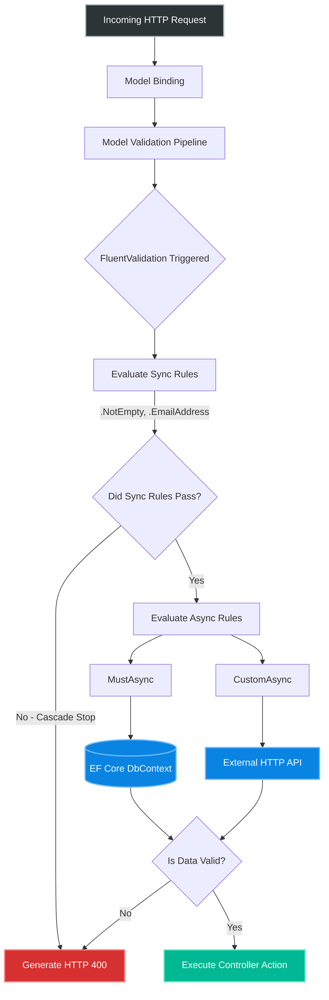

# 4.171 — FluentValidation: Async Validators and Database-Level Validation

## PART 0 — Navigation & Context

```text
ASP.NET Core Domain Hierarchy
├── Cross-Cutting Concerns
│   ├── Validation Pipeline
│   │   ├── 4.170 FluentValidation Synchronous Rules
│   │   ├── 4.171 Async Validators & DB Validation ◄ YOU ARE HERE
│   │   └── 4.172 Conditional Rules & Severity
└── Data Access
    └── Entity Framework Core Concurrency
```

**What you need before this:**
- Mastery of standard synchronous FluentValidation setup and syntax [[4.170 — FluentValidation: Validators, RuleFor, and ASP.NET Core Integration]].
- A solid understanding of the ASP.NET Core Dependency Injection lifecycle (especially Scoped vs Singleton) [[4.034 — The Built-In DI Container Service Registration]].
- Understanding of how validation failures are translated into HTTP 400 Bad Request responses via `ModelState` [[4.168 — ModelState: Checking Validity, Reading Errors, Custom Responses]].

**What this unlocks after:**
- Properly separating HTTP validation rules from deep domain invariances [[4.175 — Validation Across Layers: Where Validation Lives (HTTP vs Domain)]].
- Creating high-performance API endpoints that reject invalid or duplicate data *before* the request ever hits the Controller action.

**Why this matters to a production engineer at scale:**
Standard validation is trivial—checking if an email string has an `@` symbol takes microseconds and uses zero network resources. However, real-world business requirements often demand validation against the external world: "Is this Email already taken in the database?", "Does this Product SKU actually exist in the external inventory service?", or "Is this Promo Code currently active in Redis?"
Executing I/O-bound (database or HTTP) queries during the model validation phase introduces massive complexity. Standard .NET `[ValidationAttribute]`s are strictly synchronous; trying to run an EF Core query inside one will either block the thread pool (causing Thread Pool Starvation under high load) or throw an exception.
FluentValidation solves this elegantly with `MustAsync`. However, running database queries *before* the Controller action executes means you are paying a massive latency tax (10ms+ DB round-trips) before your business logic even begins. A senior engineer must understand how to inject Scoped repositories into validators safely, how to cascade rules so you don't hit the database if the string is empty, and why async validation is *not* a substitute for a unique SQL database constraint when handling race conditions.

---

## PART 1 — The Core Mental Model

> **The Fundamental Rule**
> **FluentValidation's `MustAsync`, `CustomAsync`, and `ValidateAsync` methods allow you to execute asynchronous I/O operations (like database queries) entirely within the ASP.NET Core Model Validation pipeline. If auto-validation is enabled, these rules await external systems *before* your Controller Action runs. If the external system indicates the data is invalid, the pipeline aborts and immediately returns an HTTP 400 ValidationProblemDetails response, identical in shape to synchronous validation failures.**

**The Plain-Language Analogy**
Imagine standard synchronous validation as a **TSA Agent checking your physical passport**. They look at the expiration date, ensure the photo matches your face, and check that the MRZ code follows the correct format. This is fast, local, and requires no outside help.
Async validation is the **TSA Agent picking up the phone and calling the FBI database** to see if the passport number was reported stolen. 
The passenger (the HTTP request) is still standing at the desk. The agent cannot let them through the gate (the Controller Action) until the phone call finishes. If the FBI says the passport is stolen, the agent rejects the passenger immediately (HTTP 400). You never want the agent to call the FBI if the passport is obviously expired or physically torn in half (Cascading rules). You only make the expensive phone call once all the fast, local checks pass.

**The Taxonomy Diagram**



---

## PART 2 — Deep Mechanics

### 2.1 — Pipeline Positioning & State Machines
When you register FluentValidation with ASP.NET Core auto-validation (or manually call `ValidateAsync` in a Minimal API), the validation engine spins up a C# asynchronous state machine.

```
──► Routing Middleware
    ──► Authentication
        ──► Endpoint (Controller or Minimal API)
            ──► 1. Model Binding (JSON -> C# POCO)
            ──► 2. Model Validation
                ├── DataAnnotations (Synchronous only)
                └── FluentValidation (Synchronous + Asynchronous) ◄── MustAsync runs here
            ──► 3. ModelStateInvalidFilter (Returns 400 if validation failed)
            ──► 4. Controller Action (Only executes if everything passed)
```

Because `MustAsync` runs at step 2, the HTTP request incurs the latency of the database query *before* your primary business logic begins.

### 2.2 — The `MustAsync` Syntax
`MustAsync` is an extension method chained onto `RuleFor`. It expects a predicate that returns a `Task<bool>`. If the task returns `true`, validation passes. If it returns `false`, validation fails and the specified message is added to the `ModelState`.

```csharp
public sealed class RegisterUserValidator : AbstractValidator<RegisterUserDto>
{
    // The Validator must be registered in DI so it can receive the Scoped Repository!
    public RegisterUserValidator(IUserRepository userRepository)
    {
        RuleFor(x => x.Email)
            .MustAsync(async (email, cancellationToken) => 
            {
                // Returns TRUE if the email is NOT taken (i.e., it is valid to register)
                bool exists = await userRepository.EmailExistsAsync(email, cancellationToken);
                return !exists; 
            })
            .WithMessage("A user with this email address already exists.");
    }
}
```

### 2.3 — Injecting Dependencies into Validators
For async validation to work against a database, the Validator must have access to the database.
In FluentValidation, Validators are resolved from the ASP.NET Core Dependency Injection container exactly like Controllers.

```csharp
// Program.cs
// 1. Register your repositories (Scoped)
builder.Services.AddScoped<IUserRepository, UserRepository>();

// 2. Register all validators in the assembly
builder.Services.AddValidatorsFromAssemblyContaining<RegisterUserValidator>();

// 3. Enable auto-validation (if using MVC/Controllers)
builder.Services.AddFluentValidationAutoValidation();
```

Because Validators are resolved per-request by default, it is perfectly safe to inject a Scoped `DbContext` or `IUserRepository` into the Validator constructor. The Validator will use the exact same `DbContext` instance that your Controller will eventually use, meaning they share the same EF Core Change Tracker and database connection.

### 2.4 — `CustomAsync` for Complex Multi-Field Rules
While `MustAsync` evaluates a simple true/false boolean on a specific property, sometimes you need to evaluate multiple properties together and generate complex errors. `CustomAsync` gives you direct access to the `ValidationContext`.

```csharp
RuleFor(x => x)
    .CustomAsync(async (dto, context, cancellationToken) =>
    {
        var conflict = await _schedulingService.HasConflictAsync(dto.DoctorId, dto.AppointmentTime, cancellationToken);
        
        if (conflict)
        {
            // We can dynamically attach the failure to specific properties
            context.AddFailure(nameof(dto.AppointmentTime), "This doctor is already booked at this time.");
            context.AddFailure(nameof(dto.DoctorId), "Please select a different doctor or time.");
        }
    });
```

### 2.5 — Cancellation Tokens
HTTP Requests can be aborted by the client at any time. Because async validation hits the database, it must respect the `CancellationToken`. 
FluentValidation automatically passes the `HttpContext.RequestAborted` token into your `MustAsync` lambda. You MUST pass this token down to your EF Core or Dapper queries. If you drop the token, a disconnected client will leave an orphaned database query executing on your SQL Server.

---

## PART 3 — Production Code Patterns

### Pattern 1: E-Commerce — The "SKU Exists" Check
When a user attempts to add an item to their cart, you shouldn't rely on the Controller to check if the SKU is valid. Validate it at the boundary.

```csharp
public class AddToCartDto
{
    public string SkuCode { get; set; }
    public int Quantity { get; set; }
}

public class AddToCartValidator : AbstractValidator<AddToCartDto>
{
    public AddToCartValidator(IInventoryRepository inventory)
    {
        RuleFor(x => x.Quantity).GreaterThan(0);

        RuleFor(x => x.SkuCode)
            .NotEmpty()
            // Cascading ensures we don't hit the DB with an empty string
            .MustAsync(async (sku, ct) => await inventory.IsValidSkuAsync(sku, ct))
            .WithMessage("The specified SKU '{PropertyValue}' does not exist in our catalog.");
    }
}
```

### Pattern 2: The Cascading Stop (Saving DB Loads)
If you do not specify a `CascadeMode`, FluentValidation evaluates ALL rules for a property, even if earlier ones failed. If the `Email` is an empty string, the `.EmailAddress()` check fails, but then `MustAsync` *still runs*, sending an empty string query to the database!

```csharp
public class CreateTenantValidator : AbstractValidator<CreateTenantDto>
{
    public CreateTenantValidator(ITenantRepository repo)
    {
        // ✅ CORRECT: StopOnFirstFailure prevents the DB query if the string is empty or malformed
        RuleLevelCascadeMode = CascadeMode.Stop;

        RuleFor(x => x.Subdomain)
            .NotEmpty()
            .Matches("^[a-z0-9-]+$").WithMessage("Subdomain can only contain lowercase letters, numbers, and hyphens.")
            .MustAsync(async (subdomain, ct) => !await repo.SubdomainTakenAsync(subdomain, ct))
            .WithMessage("This subdomain is already taken. Please choose another.");
    }
}
```

### Pattern 3: Validating Updates (Excluding the Current Entity)
When updating a user's profile, they might submit their form without changing their email. If you use a simple `MustAsync(EmailExists)`, the validation will fail because *their own* email is already in the database!
You must use the `MustAsync` overload that provides access to the root DTO object.

```csharp
public class UpdateProfileDto
{
    public Guid UserId { get; set; }
    public string NewEmail { get; set; }
}

public class UpdateProfileValidator : AbstractValidator<UpdateProfileDto>
{
    public UpdateProfileValidator(IUserRepository repo)
    {
        RuleFor(x => x.NewEmail)
            .NotEmpty()
            .EmailAddress()
            // Provide the root DTO (model) so we can access UserId
            .MustAsync(async (model, email, ct) => 
            {
                // Returns TRUE if the email is taken by a DIFFERENT user
                bool takenByOther = await repo.IsEmailTakenByOtherUserAsync(email, model.UserId, ct);
                return !takenByOther;
            })
            .WithMessage("This email is already in use by another account.");
    }
}
```

### Pattern 4: Minimal API Manual Validation Integration
In modern Minimal APIs, `AddFluentValidationAutoValidation` is not supported out-of-the-box by Microsoft. You must inject the `IValidator<T>` and call it manually. Because we are using `MustAsync`, we MUST await `ValidateAsync`.

```csharp
app.MapPost("/api/merchants", async (
    [FromBody] CreateMerchantDto dto,
    [FromServices] IValidator<CreateMerchantDto> validator,
    CancellationToken ct) =>
{
    // 1. Manually invoke ValidateAsync, passing the Cancellation Token
    var validationResult = await validator.ValidateAsync(dto, ct);

    // 2. Check if valid
    if (!validationResult.IsValid)
    {
        // 3. Return the standard RFC 7807 ValidationProblemDetails response
        return Results.ValidationProblem(validationResult.ToDictionary());
    }

    // 4. Safe to proceed with business logic
    return Results.Ok("Merchant created!");
});
```

### Pattern 5: High-Performance Cache-Aside Validation
If you have a high-traffic endpoint (like submitting analytics events) that must validate an API Key against a database, running `MustAsync` against SQL Server 5,000 times a second will destroy your database. You must wrap the database call in a Redis or `IMemoryCache` lookup inside the validator.

```csharp
RuleFor(x => x.ApiKey)
    .MustAsync(async (apiKey, ct) =>
    {
        string cacheKey = $"apikey_valid:{apiKey}";
        
        // 1. Check ultra-fast memory cache
        if (_memoryCache.TryGetValue(cacheKey, out bool isValid))
        {
            return isValid;
        }

        // 2. Fallback to database
        isValid = await _database.ValidateApiKeyAsync(apiKey, ct);

        // 3. Store in cache for 5 minutes
        _memoryCache.Set(cacheKey, isValid, TimeSpan.FromMinutes(5));

        return isValid;
    })
    .WithMessage("Invalid API Key.");
```

---

## PART 4 — Gotchas & Anti-Patterns

### Gotcha 1: Synchronous `.Result` Deadlocks
A junior developer doesn't want to refactor their validator to be async, so they force the async database call to run synchronously.

// ⚠️ FATAL ANTI-PATTERN
```csharp
RuleFor(x => x.Email)
    // ❌ WRONG: Using standard .Must with .Result blocks the thread!
    .Must(email => _userRepo.EmailExistsAsync(email).Result) 
    .WithMessage("Email taken");
```

// HTTP consequence (wrong path):
// If the application is under heavy load, calling `.Result` on an async Task blocks a ThreadPool thread. This rapidly leads to ThreadPool Starvation. The entire API stops responding to requests, resulting in HTTP 503 Service Unavailable timeouts across the board.

// ✅ CORRECT CODE
// Always use `.MustAsync` and `await`. Let the C# state machine yield the thread back to the pool while the database executes the query.

### Gotcha 2: Believing `MustAsync` Prevents Database Race Conditions
This is the most dangerous misconception in API design. Developers believe that because they wrote a `MustAsync(EmailIsUnique)` validator, they don't need a `UNIQUE` constraint in SQL Server.

// ⚠️ THE RACE CONDITION
// Request A and Request B arrive at the server at the exact same millisecond.
// Request A hits `MustAsync`. Queries the DB. Email "test@test.com" does not exist. Passes validation.
// Request B hits `MustAsync`. Queries the DB. Email "test@test.com" does not exist (Request A hasn't INSERTED yet!). Passes validation.
// Both requests proceed to the Controller.
// Both requests execute `INSERT INTO Users (Email) VALUES ('test@test.com')`.
// RESULT: Duplicate emails in the database!

// ✅ THE FIX
// 1. You MUST have a `UNIQUE INDEX` in your SQL database schema. The database is the only absolute source of truth for concurrency.
// 2. `MustAsync` is a UX/Performance optimization. It catches 99% of duplicates cleanly and returns a nice HTTP 400.
// 3. For the 1% race condition, your Controller/Service layer must catch the `DbUpdateException` (Entity Framework unique constraint violation) and translate it into an HTTP 409 Conflict.

### Gotcha 3: Singletons Capturing Scoped Repositories
If you register your Validator as a Singleton (perhaps by accident, or to save instantiation time), but you inject a Scoped `DbContext` into it, you create a Captive Dependency.

// HTTP consequence (wrong path):
// The application throws a DI exception at startup. If you circumvented DI checks, the Singleton Validator captures the very first `DbContext` created. That `DbContext` stays alive forever. Because EF Core's `DbContext` is not thread-safe, when concurrent requests hit the validator, they will both try to use the same `DbContext` simultaneously, resulting in `InvalidOperationException: A second operation was started on this context before a previous operation completed.`

// ✅ THE FIX:
// FluentValidation's `AddValidatorsFromAssembly` registers validators as Scoped or Transient by default. Leave them that way. Never register a validator that relies on a database as a Singleton.

### Gotcha 4: Data Leakage via Validation Timing Attacks
If you use `MustAsync` to validate that a `PatientId` exists before allowing an operation, you might accidentally reveal to an attacker that a specific patient exists in your system.

// ⚠️ WRONG CODE
```csharp
RuleFor(x => x.TargetUserId)
    .MustAsync(async (id, ct) => await db.Users.AnyAsync(u => u.Id == id, ct))
    .WithMessage("User exists"); // Returns 400 immediately
```

// HTTP consequence (wrong path):
// An attacker enumerates IDs. If they get a 400 "User exists", they know the ID is valid. This is a data leak.

// ✅ THE FIX:
// Validation should check the shape and format of data. Checking if a user *exists and the current user has permission to interact with them* is an Authorization concern, not a Validation concern. Move existence/ownership checks to an `IAuthorizationHandler` or into your Domain Service, where you can return a secure HTTP 404 Not Found (or 403 Forbidden) instead of an HTTP 400.

---

## PART 5 — Performance Implications

### Pipeline Request Impact

| Validation Type | Network RTTs | Typical Latency Impact | Recommendation |
|---|---|---|---|
| Pure Sync Rules (`.NotEmpty()`) | 0 | < 0.1ms | Always use heavily. |
| `MustAsync` (SQL Query) | 1 | +5ms to 20ms | Use for unique checks. Ensure database columns are Indexed! |
| `MustAsync` (External API Call) | 1 | +50ms to 300ms | Extremely dangerous. If the 3rd party API is slow, your entire API slows down. Wrap in a Circuit Breaker or Cache. |
| `MustAsync` with MemoryCache | 0 (on hit) | < 0.5ms | Industry standard for high-throughput ID validation. |

### The Database Index Mandate
If you write `.MustAsync(email => db.Users.AnyAsync(u => u.Email == email))`, that query will be executed on **every single registration request**.
If the `Email` column in SQL Server does not have a Non-Clustered Index, this query performs a Full Table Scan. As your database grows to 1,000,000 rows, this validation step will suddenly take 500ms, completely destroying your API's throughput. 
**Rule:** Any column queried inside a `MustAsync` rule MUST be backed by a database index.

---

## PART 6 — Interview Arsenal

### A. The Question Bank

**Question 1:** "If you need to ensure an email address isn't already taken when a user registers, where should you put that logic, and why?"
- **Average Answer:** "I check it in the Controller before saving to the database."
- **Why That's Insufficient:** Clutters the controller, mixes HTTP/Business concerns.
- **Great Answer:** "I approach this in three layers. First, I use FluentValidation's `MustAsync` to query the database during the model validation phase. This keeps my Controller clean and automatically returns a standardized HTTP 400 if the email is taken. Second, because `MustAsync` cannot prevent race conditions on concurrent requests, I ensure the SQL Database has a `UNIQUE INDEX` on the Email column. Finally, my Domain/Service layer wraps the EF Core `SaveChanges` in a try/catch. If the unique constraint violation occurs during a race condition, it catches the `DbUpdateException` and translates it into an HTTP 409 Conflict."

**Question 2:** "What happens if a client cancels their HTTP request while a FluentValidation `MustAsync` rule is currently querying the database?"
- **Average Answer:** "The request stops."
- **Why That's Insufficient:** Ignores the mechanics of CancellationToken propagation.
- **Great Answer:** "If the client disconnects, ASP.NET Core trips the `HttpContext.RequestAborted` cancellation token. FluentValidation automatically detects this and passes the token into the `MustAsync` lambda. However, if I don't explicitly pass that token down into my EF Core `.AnyAsync(ct)` call, the SQL Server query will continue running as an orphaned process, wasting database CPU. If I pass it correctly, EF Core intercepts the cancellation and issues a kill command to the SQL Server, freeing up resources immediately."

**Question 3:** "I wrote a `MustAsync` rule that hits my database. Suddenly, my API is crashing under load with Thread Pool Starvation. What did I do wrong?"
- **Average Answer:** "You hit the database too many times."
- **Why That's Insufficient:** Doesn't identify the mechanical deadlock issue.
- **Great Answer:** "You likely used the synchronous `.Must()` method instead of `.MustAsync()`, and forced the async database call to resolve by calling `.Result` or `.GetAwaiter().GetResult()`. Because the validation pipeline runs on ASP.NET Core ThreadPool threads, blocking the thread synchronously while waiting for network I/O exhausts the pool rapidly under load, causing starvation. You must switch to `.MustAsync` and `await` the call."

### B. The Trick Questions

**Trick Question:** "I have a rule: `RuleFor(x => x.Email).NotEmpty().EmailAddress().MustAsync(CheckUniqueDb)`. When I submit an empty string, the DB is still queried, throwing an exception! How do I fix this?"
- **The Trap:** Assuming FluentValidation short-circuits execution by default like C#'s `&&` operator.
- **The Correct Answer:** "By default, FluentValidation evaluates all rules in the chain to collect as many errors as possible. To prevent the expensive database call when the string is empty, you must configure the cascade mode. You should add `.Cascade(CascadeMode.Stop)` at the rule level, or set `RuleLevelCascadeMode = CascadeMode.Stop` globally in the validator constructor. This tells it to abort further validation on that property if `NotEmpty` fails."

**Trick Question:** "Can I use standard ASP.NET Core `[ValidationAttribute]` (Data Annotations) to check the database asynchronously instead of FluentValidation?"
- **The Trap:** Not knowing the limitations of the built-in validation system.
- **The Correct Answer:** "No. The `ValidationAttribute` base class in .NET only exposes synchronous `IsValid` methods. There is no `IsValidAsync`. If you attempt to run a database query inside a custom Data Annotation, you are forced to use "sync-over-async" (`.Result`), which causes thread pool starvation. Async validation is one of the primary reasons enterprises abandon Data Annotations in favor of FluentValidation."

### C. Red Flags to Avoid
- 🚩 **"I use `MustAsync` to check if the user is an Admin before allowing the request."** (Conflating Model Validation with Authorization. Use `IAuthorizationHandler`).
- 🚩 **"I don't need SQL Unique constraints because my `MustAsync` is bulletproof."** (Displays a dangerous lack of understanding regarding web server concurrency and race conditions).

---

## PART 7 — Decision Framework

```mermaid
graph TD
    A[Validating Data] --> B{Does the validation require external I/O?}
    
    B -->|No - Format/Length| C[Use standard Sync RuleFor]
    
    B -->|Yes - Database/API| D{Is it verifying existence/format or permissions?}
    
    D -->|Permissions / Ownership| E[Do NOT use FluentValidation. Use IAuthorizationHandler.]
    
    D -->|Existence / Uniqueness| F{Is it a high-traffic endpoint?}
    
    F -->|No| G[Use MustAsync + Direct EF Core Query]
    
    F -->|Yes| H[Use MustAsync + IMemoryCache/Redis lookup]
    
    G --> I[Mandatory: Add UNIQUE INDEX to Database Schema]
    H --> I
    
    style A fill:#2d3436,stroke:#fff
    style C fill:#00b894,stroke:#fff
    style E fill:#d63031,stroke:#fff
    style G fill:#0984e3,stroke:#fff
    style H fill:#0984e3,stroke:#fff
    style I fill:#d63031,stroke:#fff
```



---

## PART 8 — Self-Check

### A. Conceptual Questions
1. Why does FluentValidation offer `MustAsync`, whereas Data Annotations do not?
2. At what stage in the ASP.NET Core request pipeline do `MustAsync` rules execute?
3. How does `CascadeMode.Stop` save database CPU cycles when combined with `MustAsync`?
4. If two identical requests hit a `MustAsync(Uniqueness)` check at the exact same time, what happens?
5. Why must you pass the `CancellationToken` from the `MustAsync` lambda into your EF Core query?
6. How do you inject a Scoped `DbContext` into a FluentValidator?
7. In a Minimal API, how do you manually execute an async validation rule and return an HTTP 400?
8. What is the danger of using `.Result` inside a synchronous `.Must()` rule instead of using `.MustAsync()`?

### B. Code Puzzles

**Puzzle 1: The Invisible Await**
```csharp
RuleFor(x => x.Username)
    .MustAsync((username, ct) => _userRepo.IsUniqueAsync(username, ct))
    .WithMessage("Username taken.");
```
*Scenario:* The compiler accepts this code. Is it executing correctly asynchronously?
<details>
<summary>Answer</summary>
Yes. Because `IsUniqueAsync` returns a `Task<bool>`, you can omit the `async/await` keywords and directly return the Task from the lambda. FluentValidation will await the returned Task internally. This is slightly more memory-efficient as it avoids generating a redundant async state machine.
</details>

**Puzzle 2: The Self-Collision**
```csharp
public class UpdateDocValidator : AbstractValidator<UpdateDocumentDto> {
    public UpdateDocValidator(IDocRepo repo) {
        RuleFor(x => x.Title)
            .MustAsync(async (title, ct) => !await repo.TitleExistsAsync(title, ct))
            .WithMessage("Title taken");
    }
}
```
*Scenario:* A user edits their document, changes the content, but leaves the `Title` the same. They submit the update, but get a 400 Bad Request saying "Title taken".
<details>
<summary>Answer</summary>
The query checked if the title existed anywhere in the database. Since the user's *own* document already has that title, the query returns true, failing the validation.
*Fix:* Use the `MustAsync` overload that provides the root DTO: `.MustAsync(async (dto, title, ct) => !await repo.TitleTakenByOtherDocAsync(title, dto.DocId, ct))`
</details>

**Puzzle 3: The Minimal API Trap**
```csharp
app.MapPost("/data", async (MyDto dto, IValidator<MyDto> val) => {
    var result = val.Validate(dto); // Synchronous call!
    if (!result.IsValid) return Results.ValidationProblem(result.ToDictionary());
    return Results.Ok();
});
```
*Scenario:* `MyDto` has a `MustAsync` rule configured. What happens when this Minimal API executes?
<details>
<summary>Answer</summary>
FluentValidation will throw an `AsyncValidatorInvokedSynchronouslyException`. If a validator contains asynchronous rules, you MUST invoke it using `.ValidateAsync(dto, ct)`. Calling the synchronous `.Validate()` method on an async validator is forbidden to prevent thread deadlocks.
*Fix:* Change it to `await val.ValidateAsync(dto, ct);`
</details>

---

## PART 9 — Connections & Resources

### A. Related Topics Table

| Topic | Why It Connects |
|---|---|
| [[4.170 — FluentValidation: Validators, RuleFor, and ASP.NET Core Integration]] | The synchronous foundation required before learning async rules. |
| [[4.175 — Validation Across Layers: Where Validation Lives (HTTP vs Domain)]] | Discusses when to use `MustAsync` versus handling the invariant deep in the Domain Model. |
| [[4.168 — ModelState: Checking Validity, Reading Errors, Custom Responses]] | How the failures generated by `MustAsync` are packaged into the final HTTP 400 response. |
| [[4.042 — The Captive Dependency Problem]] | The DI bug you cause if you register a Validator as a Singleton but inject a Scoped DbContext. |

### B. Books

| Book | Chapters | Why These Chapters |
|---|---|---|
| Clean Architecture in .NET | Chapter 6: Validation | Discusses the architectural boundaries of doing DB queries inside input validation. |
| ASP.NET Core in Action, 3rd Ed | Chapter 14: Validating input | Covers the mechanics of auto-validation in the MVC pipeline. |

### C. Essential Articles & Docs
- [FluentValidation Official Docs: Asynchronous Validation](https://docs.fluentvalidation.net/en/latest/async.html)
- [Microsoft Docs: Concurrency conflicts in EF Core](https://learn.microsoft.com/en-us/ef/core/saving/concurrency) (Why MustAsync isn't enough for Race Conditions)
- [Vladimir Khorikov: Validation and DDD](https://enterprisecraftsmanship.com/posts/validation-and-ddd/) (Philosophical discussion on database validation)

> [!NOTE]
> **Template Meta-Note**
> Part 0: Context & Prerequisites. Part 1: Core Mental Model. Part 2: Deep Mechanics & Pipeline. Part 3: Production Code. Part 4: Gotchas. Part 5: Performance. Part 6: Interview Arsenal. Part 7: Decision Framework. Part 8: Puzzles. Part 9: Resources.
