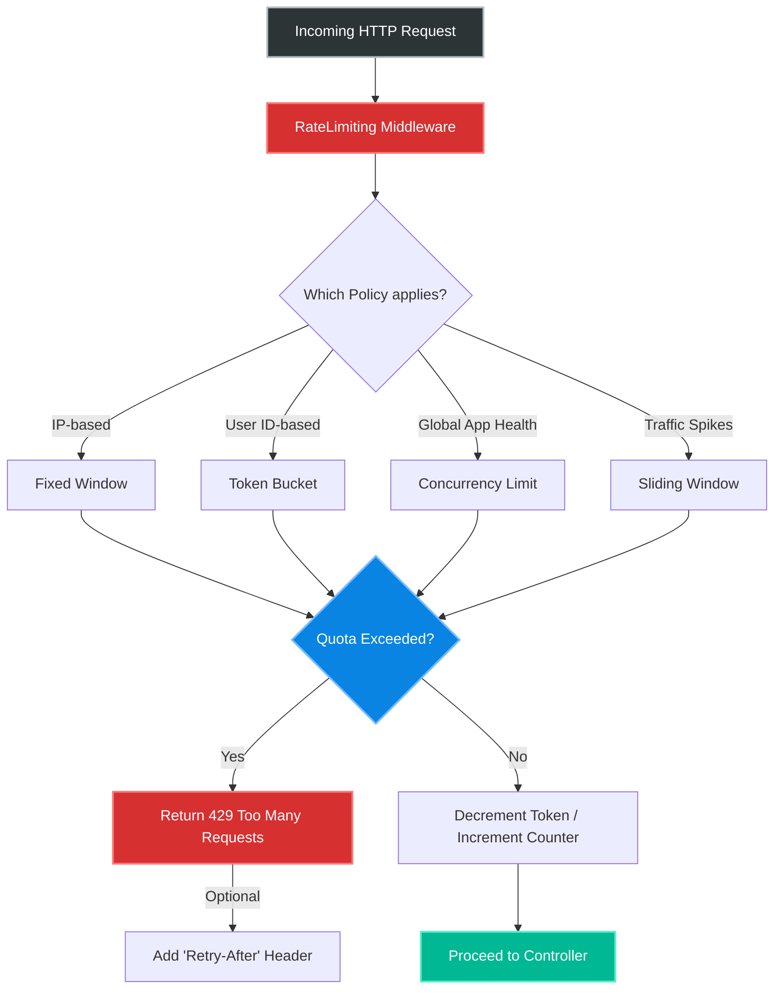

# 4.171 — Rate Limiting & Throttling Architecture

## PART 0 — Navigation & Context

```text
ASP.NET Core Domain Hierarchy
├── Performance & Reliability
│   ├── 4.171 Rate Limiting & Throttling Architecture ◄ YOU ARE HERE
│   ├── 4.172 Response Caching
│   └── 4.173 Output Caching
└── Middleware Pipeline
    └── 4.050 Writing Middleware
```

**What you need before this:**
- [[4.050 — Writing Middleware]] — Understanding how requests are intercepted and short-circuited in the HTTP pipeline.
- Basic understanding of HTTP status codes (specifically `429 Too Many Requests`).

**What this unlocks after:**
- Protecting APIs from Denial of Service (DoS) attacks and brute force attempts.
- Implementing tiered SaaS monetization strategies (e.g., Free tier = 100 req/day, Pro tier = 10,000 req/day).

**Why this matters to a production engineer at scale:**
If your API scales perfectly, it will happily consume infinite CPU and Database I/O to serve incoming traffic. If a malicious user writes a script to query your `/api/search` endpoint 50,000 times a second, your database will collapse, taking the entire system down for all legitimate users. Even non-malicious users (like a partner integrating with your API using an infinite `while` loop bug) can accidentally execute a DDoS attack. Rate limiting is the firewall for your compute resources. In .NET 7/8, Microsoft introduced a native, highly performant rate limiting middleware that replaces massive third-party libraries (like `AspNetCoreRateLimit`) with allocation-free algorithmic protection.

---

## PART 1 — The Core Mental Model

> **The Fundamental Rule**
> **Rate Limiting protects application resources by enforcing mathematical algorithms (Tokens, Windows, Concurrency) on incoming requests; if a client exceeds their allocated mathematical quota within a specific timeframe, the middleware intercepts the request immediately and returns a `429 Too Many Requests`, sparing the downstream CPU, memory, and database.**

**The Plain-Language Analogy**
Imagine an exclusive nightclub (The API).
**Concurrency Limit:** The fire marshal says only 100 people can be inside at one time. If the club is full, the bouncer makes the 101st person wait outside until someone leaves.
**Fixed Window:** The bartender says you can only order 3 drinks per hour. From 8:00 to 8:59, you order 3. If you ask for a 4th at 8:45, you are rejected. At 9:00, your count resets to 0.
**Token Bucket:** The arcade gives you a bucket of 10 tokens. Every time you play a game, you spend 1 token. A machine drops 1 new token into your bucket every minute. If you play 10 games instantly, your bucket is empty. You must wait 1 minute to play again.

**The Taxonomy Diagram**



---

## PART 2 — Deep Mechanics

### 1. The Four Native Algorithms

.NET 7+ provides four built-in algorithms in the `System.Threading.RateLimiting` namespace:

1. **Concurrency Limiter:** Restricts how many requests can process *simultaneously*. (E.g., Max 10 active requests). Doesn't care about time.
2. **Fixed Window:** Divides time into exact chunks (e.g., 10:00 to 10:01). Allows $N$ requests per chunk. Hard reset at the chunk boundary. (Prone to burst spikes at the exact minute rollover).
3. **Sliding Window:** Divides time into segments to smooth out the bursts. If you allow 100 requests per minute with 2 segments, it looks at the last 30 seconds and the current 30 seconds.
4. **Token Bucket:** The most versatile. You start with a full bucket (e.g., 100). Tokens are replenished at a constant rate (e.g., 10 per minute). Allows for sudden bursts (up to 100), but sustains a steady average rate over time.

### 2. Partitions (The Key to Multi-Tenancy)

A policy must be applied to a specific entity. If you apply a global limit of 100 req/min, your entire application can only serve 100 req/min total across all users.
**Partitions** isolate the limits. You partition by a `string` (usually IP Address, User ID, or Tenant ID). 
If partitioned by IP, User A gets 100 req/min, and User B gets their own separate 100 req/min.

### 3. The Queueing Mechanism

What happens when the limit is hit?
1. **Reject Immediately:** Return `429` instantly.
2. **Queue:** Hold the request in memory (pause the HTTP thread asynchronously) until a token becomes available.
If you configure a Queue of length 5, the first 5 people over the limit will wait. The 6th person will get a `429`. Queueing smooths out minor microsecond traffic spikes, but uses server memory.

### 4. Distributed vs Local State

The native .NET 7/8 Rate Limiter stores state **in memory**. If you have 5 Kubernetes pods, a "100 req/min per IP" limit actually allows the user 500 req/min if the load balancer distributes their requests perfectly across all 5 pods.
For strict distributed rate limiting (where all pods share the same token bucket), you must implement a Redis-backed rate limiter.

---

## PART 3 — Production Code Patterns

### Pattern 1: Basic Fixed Window by IP Address
The most common anti-abuse mechanism for public APIs.

```csharp
// Program.cs
builder.Services.AddRateLimiter(options =>
{
    // Return standard 429 status code
    options.RejectionStatusCode = StatusCodes.Status429TooManyRequests;

    // Define the policy named "fixed-ip"
    options.AddPolicy("fixed-ip", httpContext =>
    {
        // Resolve the Partition Key (IP Address). Fallback to "anonymous" if missing.
        var ipAddress = httpContext.Connection.RemoteIpAddress?.ToString() ?? "anonymous";

        return RateLimitPartition.GetFixedWindowLimiter(
            partitionKey: ipAddress,
            factory: partition => new FixedWindowRateLimiterOptions
            {
                PermitLimit = 100,             // Max 100 requests
                Window = TimeSpan.FromMinutes(1), // Per 1 minute
                QueueProcessingOrder = QueueProcessingOrder.OldestFirst,
                QueueLimit = 0                 // Fail instantly, don't queue
            });
    });
});

var app = builder.Build();

// Must be AFTER routing, BEFORE endpoints!
app.UseRouting();
app.UseRateLimiter(); 

// Apply to a specific endpoint
app.MapGet("/api/data", () => "Hello").RequireRateLimiting("fixed-ip");
```

### Pattern 2: Token Bucket for SaaS Tiers
Applying different limits based on the user's subscription tier.

```csharp
builder.Services.AddRateLimiter(options =>
{
    options.RejectionStatusCode = StatusCodes.Status429TooManyRequests;

    options.AddPolicy("tenant-tier", httpContext =>
    {
        // Extract Tenant ID and Tier from JWT claims
        var tenantId = httpContext.User.FindFirstValue("TenantId") ?? "anonymous";
        var tier = httpContext.User.FindFirstValue("Tier") ?? "Free";

        // Determine bucket size based on tier
        var bucketCapacity = tier switch {
            "Premium" => 1000,
            "Standard" => 100,
            _ => 10 // Free
        };

        return RateLimitPartition.GetTokenBucketLimiter(
            partitionKey: tenantId,
            factory: partition => new TokenBucketRateLimiterOptions
            {
                TokenLimit = bucketCapacity, // Max burst size
                ReplenishmentPeriod = TimeSpan.FromMinutes(1), // Add tokens every minute
                TokensPerPeriod = bucketCapacity / 2, // Replenish half the bucket
                AutoReplenishment = true,
                QueueLimit = 2 // Allow a tiny queue for micro-bursts
            });
    });
});
```

### Pattern 3: Global Concurrency Limiter
Protecting the database from total collapse under extreme load, regardless of who is calling.

```csharp
builder.Services.AddRateLimiter(options =>
{
    // A global limiter that applies to EVERY request before policies are even checked
    options.GlobalLimiter = PartitionedRateLimiter.Create<HttpContext, string>(context =>
    {
        return RateLimitPartition.GetConcurrencyLimiter(
            partitionKey: "global", // Single partition for the whole app
            factory: partition => new ConcurrencyLimiterOptions
            {
                PermitLimit = 1000, // Absolutely no more than 1000 active requests
                QueueProcessingOrder = QueueProcessingOrder.OldestFirst,
                QueueLimit = 100 // Queue up to 100, reject the rest
            });
    });
});
```

### Pattern 4: Handling Rejections Cleanly
Returning a custom JSON payload and a `Retry-After` header when a user is throttled.

```csharp
builder.Services.AddRateLimiter(options =>
{
    options.RejectionStatusCode = StatusCodes.Status429TooManyRequests;

    options.OnRejected = async (context, token) =>
    {
        // 1. Calculate Retry-After header if the algorithm provides it
        if (context.Lease.TryGetMetadata(MetadataName.RetryAfter, out var retryAfter))
        {
            context.HttpContext.Response.Headers.RetryAfter = 
                ((int)retryAfter.TotalSeconds).ToString();
        }

        // 2. Return standard ProblemDetails JSON
        context.HttpContext.Response.ContentType = "application/problem+json";
        var problem = new ProblemDetails
        {
            Status = 429,
            Title = "Too Many Requests",
            Detail = "You have exceeded your API quota. Please back off."
        };

        await context.HttpContext.Response.WriteAsJsonAsync(problem, token);
    };
});
```

### Pattern 5: Bypassing Rate Limits for Internal Traffic
Allowing health checks or internal microservice traffic to bypass limits entirely.

```csharp
options.AddPolicy("public-api", httpContext =>
{
    var ip = httpContext.Connection.RemoteIpAddress;
    
    // ✅ CORRECT: Bypass rate limiting by returning 'NoLimiter'
    if (IPAddress.IsLoopback(ip) || IsInternalSubnet(ip))
    {
        return RateLimitPartition.GetNoLimiter(IPAddress.Loopback.ToString());
    }

    return RateLimitPartition.GetFixedWindowLimiter(...);
});
```

---

## PART 4 — Gotchas & Anti-Patterns

### Gotcha 1: Reverse Proxies Hiding the Real IP
If your ASP.NET Core app sits behind an NGINX reverse proxy, an AWS Application Load Balancer, or Cloudflare, `httpContext.Connection.RemoteIpAddress` will return the IP of the *Load Balancer*, not the user.

// ⚠️ WRONG CODE
```csharp
var ip = httpContext.Connection.RemoteIpAddress.ToString(); // Returns 10.0.0.5 (NGINX)
```

// HTTP consequence (wrong path):
// ALL users share the exact same rate limit partition (NGINX's IP). When User A hits the limit, Users B, C, and D are all blocked! The entire API goes down for everyone.

// ✅ CORRECT CODE
```csharp
// 1. Ensure UseForwardedHeaders middleware is configured in Program.cs
app.UseForwardedHeaders(new ForwardedHeadersOptions
{
    ForwardedHeaders = ForwardedHeaders.XForwardedFor | ForwardedHeaders.XForwardedProto
});

// 2. Now RemoteIpAddress will correctly reflect the original client IP.
// Alternatively, parse the header manually if not using ForwardedHeaders middleware:
var ip = httpContext.Request.Headers["X-Forwarded-For"].FirstOrDefault() ?? ...
```

### Gotcha 2: High Queue Limits
Queueing requests sounds polite ("Wait here, we'll serve you in a millisecond"), but it consumes memory and keeps HTTP connections open.

// ⚠️ WRONG CODE
```csharp
new FixedWindowRateLimiterOptions
{
    PermitLimit = 10,
    QueueLimit = 10000 // Massive queue!
}
```

// HTTP consequence (wrong path):
// During a DDoS attack, 10,000 requests are accepted and queued. 10,000 ThreadPool threads are blocked or state machines allocated. Server memory exhausts, `OutOfMemoryException`, process crashes. 

// ✅ CORRECT CODE
```csharp
// Keep QueueLimit low (e.g., 0 to 100). Rate limiting is designed to SHED load aggressively. 
// Returning 429 instantly is much cheaper than holding 10,000 requests in memory.
```

### Gotcha 3: The Fixed Window Burst Problem
The Fixed Window algorithm divides time strictly by the clock (e.g., Minute 1, Minute 2).

// Scenario: Limit is 100 req / minute.
// At 10:00:59, attacker sends 100 requests. Accepted.
// At 10:01:00, the window resets instantly.
// At 10:01:01, attacker sends 100 requests. Accepted.

// HTTP consequence (wrong path):
// The API just processed 200 requests within a 2-second span, defeating the purpose of the 100 req/min limit.

// ✅ CORRECT CODE
```csharp
// If burst spikes are fatal to your database, use GetSlidingWindowLimiter or GetTokenBucketLimiter.
// Sliding windows interpolate the previous window's capacity, smoothing out the edge spikes.
```

### Gotcha 4: Middleware Pipeline Order
`UseRateLimiter()` must be placed carefully.

// ⚠️ WRONG CODE
```csharp
app.UseRateLimiter(); // Placed before UseRouting
app.UseRouting();
```

// HTTP consequence (wrong path):
// `RequireRateLimiting("policy")` applied to specific controller endpoints will not work because the Rate Limiter executes before the framework knows which endpoint is being executed.

// ✅ CORRECT CODE
```csharp
app.UseRouting();
app.UseAuthentication(); // Auth must execute before rate limiting if partitioning by User Claims!
app.UseRateLimiter(); 
app.UseAuthorization();
app.MapControllers();
```

### Gotcha 5: Distributed vs Local Confusion
Developers apply a "10 req/min" limit, deploy to Kubernetes with 10 replicas, and customers complain they are getting 100 req/min.

// ⚠️ WRONG CODE
// Using the native in-memory rate limiter in a clustered environment and expecting strict global limits.

// ✅ CORRECT CODE
// To enforce strict global cluster limits, you must use a Distributed Rate Limiter.
// As of .NET 8, you can implement a Redis-backed `RateLimiter` or use a reverse proxy like Envoy / YARP (Yet Another Reverse Proxy) which handles rate limiting centrally before traffic hits the pod cluster.

---

## PART 5 — Performance Implications

### Request Pipeline Characteristics

| Scenario | Pipeline Depth | Allocations | Approx Latency Impact | Recommendation |
|---|---|---|---|---|
| In-Memory Rate Limiter | Early | ~0 | < 0.05ms | Extreme performance. Native .NET 7+. |
| Redis Distributed Limiter| Early | Low | 1ms - 5ms (Network I/O) | Necessary for strict SaaS limits. |
| YARP Gateway Limiter | External | N/A | N/A | Best for offloading compute from API nodes. |

### BenchmarkDotNet Code

*(Benchmarking the raw cost of evaluating a Token Bucket limiter in memory)*

```csharp
using System.Threading.RateLimiting;
using BenchmarkDotNet.Attributes;

[MemoryDiagnoser]
public class RateLimiterBenchmark
{
    private TokenBucketRateLimiter _limiter;

    [GlobalSetup]
    public void Setup()
    {
        _limiter = new TokenBucketRateLimiter(new TokenBucketRateLimiterOptions
        {
            TokenLimit = 1000,
            TokensPerPeriod = 10,
            ReplenishmentPeriod = TimeSpan.FromSeconds(1)
        });
    }

    [Benchmark]
    public bool AcquireLease()
    {
        // Simulates the middleware asking for permission to proceed
        using var lease = _limiter.AttemptAcquire(1);
        return lease.IsAcquired;
    }
}

// Expected output (approximate, .NET 8, x64, local):
// Method       | Mean      | Error     | StdDev    | Gen0   | Allocated |
// ------------ |----------:|----------:|----------:|-------:|----------:|
// AcquireLease | 25.4 ns   | 0.15 ns   | 0.14 ns   | 0.0000 |       0 B |
```

**When to Care:** The native .NET 7+ rate limiter is an engineering marvel. It is lock-free, highly optimized, and allocates **zero bytes** on the happy path. It takes 25 nanoseconds. You can safely apply it to APIs receiving hundreds of thousands of RPS without measurable compute overhead.

---

## PART 6 — Interview Arsenal

### A. The Question Bank

**Question 1:** "Our database goes down occasionally because customers hit our search endpoint too aggressively. We want to limit each customer to 5 searches per second. How do you implement this in ASP.NET Core?"
- **Average Answer:** "I'll download a NuGet package to check their IP and block them."
- **Why That's Insufficient:** Relies on legacy third-party libs, misunderstands IP vs User partitioning.
- **Great Answer:** "I would use the native .NET 7/8 Rate Limiting middleware. I would configure a `TokenBucketLimiter` because it allows for slight micro-bursts while maintaining an average rate of 5 requests per second. Crucially, I would partition the rate limiter by the `UserId` claim extracted from their JWT token, not their IP address, because many customers might share a corporate NAT/IP. I'd attach this specific policy to the search endpoint using `.RequireRateLimiting()`, ensuring that if they exceed the limit, the middleware returns a fast 429 response without ever touching the database."

**Question 2:** "What is the difference between a Fixed Window and a Sliding Window algorithm?"
- **Average Answer:** "Fixed is a set time, sliding moves."
- **Why That's Insufficient:** Fails to explain the boundary burst vulnerability of Fixed Window.
- **Great Answer:** "A Fixed Window divides time into rigid segments (e.g., 10:00 to 10:01). The problem with Fixed Window is that an attacker can send 100 requests at 10:00:59, and another 100 requests at 10:01:01. The API processes 200 requests in 2 seconds, destroying the database. A Sliding Window solves this by maintaining segments (e.g., tracking the previous minute and the current minute) and interpolating the capacity mathematically. It smooths out edge bursts, providing much safer protection against traffic spikes."

**Question 3:** "If we have our ASP.NET Core API deployed across 5 load-balanced servers, and we apply an in-memory 100 req/min rate limit by IP, what is the actual limit the user experiences?"
- **Average Answer:** "100 requests per minute."
- **Why That's Insufficient:** Fundamentally misunderstands distributed architecture state.
- **Great Answer:** "Because the native rate limiter stores state in-memory on the local server, the limit is isolated to each instance. If the load balancer uses round-robin routing, the user could hit all 5 servers equally. Therefore, the actual limit they experience is roughly 500 requests per minute. If we need a strict, global limit of 100 req/min across the entire cluster, we must use a distributed rate limiter backed by Redis, or push the rate limiting up the stack to an API Gateway like YARP or AWS API Gateway."

### B. The Trick Questions

**Trick Question:** "I configured my Rate Limiter to queue up to 50,000 requests so nobody gets a 429 error. But now my server crashes during high traffic. Why?"
- **The Trap:** Thinking queues are a free lunch.
- **The Correct Answer:** "Queuing 50,000 requests means Kestrel is holding 50,000 active HTTP connections in memory, waiting for tokens to replenish. This allocates massive amounts of memory, exhausts ThreadPool resources, and eventually causes an `OutOfMemoryException`. Rate limiting is designed for *load shedding*. You should keep queues extremely small (e.g., 10) to handle micro-bursts, and aggressively return 429s for the rest to protect the server."

**Trick Question:** "I added `app.UseRateLimiter()` at the very top of `Program.cs`, but my policy that partitions by `User.Identity.Name` is failing. Why?"
- **The Trap:** Middleware pipeline ordering.
- **The Correct Answer:** "Because `UseRateLimiter` is placed before `UseAuthentication`. At the top of the pipeline, the HTTP request hasn't been authenticated yet, so the JWT hasn't been parsed, and `User.Identity` is null. The rate limiter groups everyone into the null/anonymous partition. You must place `UseRateLimiter` AFTER `UseAuthentication` and `UseRouting`."

### C. Red Flags to Avoid
- 🚩 **"I write my own rate limiter using `ConcurrentDictionary` and `Task.Delay`."** (You will introduce memory leaks, race conditions, and massive lock contention. Use the native highly-optimized namespace).
- 🚩 **"I rate limit based on the `X-Forwarded-For` header without verifying it."** (Attackers can easily spoof this header if your load balancer isn't configured to strip/override it, bypassing your IP rate limits completely).

---

## PART 7 — Decision Framework

```mermaid
graph TD
    A[Protect API Resources] --> B{Do you need strict Global limits across pods?}
    
    B -->|Yes| C[Use Redis-backed Distributed Limiter OR API Gateway]
    B -->|No, local shedding is fine| D[Use Native In-Memory RateLimiter]
    
    D --> E{What are you protecting against?}
    
    E -->|Total server collapse| F[Concurrency Limiter Global]
    E -->|Malicious IP scraping| G[Fixed/Sliding Window by IP]
    E -->|SaaS Tier Enforcement| H[Token Bucket by TenantId]
    
    G --> I[Set Queue to 0 - Reject instantly]
    H --> J[Set Queue to 5 - Smooth micro-bursts]
    
    style A fill:#2d3436,stroke:#fff
    style C fill:#0984e3,stroke:#fff
    style D fill:#00b894,stroke:#fff
    style F fill:#00b894,stroke:#fff
    style H fill:#d63031,stroke:#fff
```



---

## PART 8 — Self-Check

### A. Conceptual Questions
1. How does a Token Bucket algorithm handle sudden bursts of traffic compared to a Concurrency Limiter?
2. Why is it dangerous to partition by `RemoteIpAddress` without checking for Reverse Proxies?
3. What is the boundary burst problem in the Fixed Window algorithm?
4. What HTTP status code is universally used to indicate a rate limit rejection?
5. Why must `UseRateLimiter()` appear after `UseRouting()`?
6. In a multi-pod Kubernetes environment, what happens to in-memory limits?
7. What is the risk of setting a very large `QueueLimit`?
8. How do you bypass rate limiting for internal health checks?

### B. Code Puzzles

**Puzzle 1: The Invisible Wall**
```csharp
app.UseRouting();
app.UseRateLimiter(); // Global Concurrency Limit: 100
app.UseEndpoints(e => e.MapControllers());
```
*Scenario:* Your `/health` endpoint is used by Kubernetes to check if the pod is alive. During a traffic spike, Kubernetes kills the pod.
<details>
<summary>Answer</summary>
The global concurrency limit applies to ALL requests, including `/health`. During a spike, the queue fills up, `/health` gets a 429 or times out in the queue. Kubernetes thinks the pod is dead and forcefully restarts it, making the outage worse.
*Fix:* Create a partition that bypasses the limiter for the `/health` route, or place `MapHealthChecks` before `UseRateLimiter` (though routing complexities apply).
</details>

**Puzzle 2: The Shared Bucket**
```csharp
options.AddPolicy("user-limit", ctx => 
    RateLimitPartition.GetFixedWindowLimiter("global", _ => new FixedWindowRateLimiterOptions { ... })
);
```
*Scenario:* The intent is 100 req/min per user. But when User A makes 100 requests, User B gets blocked.
<details>
<summary>Answer</summary>
The `partitionKey` is hardcoded to `"global"`. Every single user is placed into the exact same partition, sharing the same 100 limit. 
*Fix:* Change `"global"` to `ctx.User.Identity.Name` or IP address.
</details>

**Puzzle 3: The Ghost Auth**
```csharp
app.UseRateLimiter();
app.UseAuthentication();
app.MapGet("/", () => "Hi").RequireRateLimiting("jwt-policy");
```
*Scenario:* The policy groups everyone into the anonymous bucket.
<details>
<summary>Answer</summary>
Rate limiting runs before Authentication. The `HttpContext.User` is empty.
*Fix:* Swap the middleware order.
</details>

**Puzzle 4: The Endless Wait**
```csharp
new ConcurrencyLimiterOptions {
    PermitLimit = 10,
    QueueLimit = 10,
    QueueProcessingOrder = QueueProcessingOrder.OldestFirst
}
```
*Scenario:* An attacker opens 10 connections and sends a gigabyte of data extremely slowly (Slowloris attack). Legitimate users wait in the queue.
<details>
<summary>Answer</summary>
The attacker holds the 10 concurrent permits indefinitely. The 10 legitimate users queue up. The 11th legitimate user gets a 429. Rate limiting by concurrency alone cannot defeat slow-connection attacks.
*Fix:* You must combine Rate Limiting with Kestrel connection timeouts (`MinRequestBodyDataRate`) to forcefully drop slow connections.
</details>

---

## PART 9 — Connections & Resources

### A. Related Topics Table

| Topic | Why It Connects |
|---|---|
| [[4.050 — Writing Middleware]] | Explains how the request pipeline physically executes this logic. |
| [[4.033 — Kestrel Web Server]] | Understanding connection limits at the Kestrel level vs logical Rate Limits. |
| [[4.250 — SaaS Application Patterns]] | Rate limiting is the foundation of tiered pricing architectures. |

### B. Books

| Book | Chapters | Why These Chapters |
|---|---|---|
| ASP.NET Core in Action, 3rd Ed | Chapter 18: Security | Excellent section on the new native Rate Limiting middleware. |

### C. Essential Articles & Docs
- [Microsoft Docs: Rate limiting middleware in ASP.NET Core](https://learn.microsoft.com/en-us/aspnet/core/performance/rate-limit)
- [Maarten Balliauw: Rate Limiting in .NET 7](https://blog.maartenballiauw.be/post/2022/09/26/aspnet-core-rate-limiting-middleware.html)

> [!NOTE]
> **Template Meta-Note**
> Part 0: Context & Prerequisites. Part 1: Core Mental Model. Part 2: Deep Mechanics & Pipeline. Part 3: Production Code. Part 4: Gotchas. Part 5: Performance. Part 6: Interview Arsenal. Part 7: Decision Framework. Part 8: Puzzles. Part 9: Resources.
