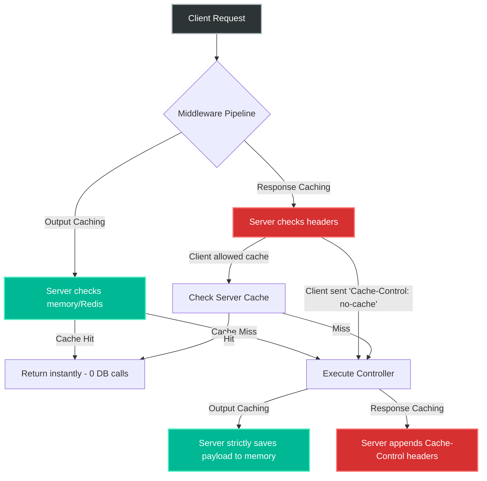

# 4.172 — Response Caching vs Output Caching

## PART 0 — Navigation & Context

```text
ASP.NET Core Domain Hierarchy
├── Performance & Reliability
│   ├── 4.171 Rate Limiting & Throttling
│   ├── 4.172 Response Caching vs Output Caching ◄ YOU ARE HERE
│   ├── 4.173 Output Caching Deep Dive (NET 7+)
│   └── 4.174 IDistributedCache Redis Integration
└── Middleware Pipeline
```

**What you need before this:**
- [[4.050 — Writing Middleware]] — Understanding how HTTP requests flow through the pipeline.
- Basic understanding of HTTP Headers (specifically `Cache-Control`).

**What this unlocks after:**
- Implementing high-performance Output Caching to handle 100,000+ RPS.
- Distributing cached payloads across a cluster using Redis.

**Why this matters to a production engineer at scale:**
If your home page requires 15 database queries to render, and 50,000 users visit your site simultaneously, your database will collapse. Caching the generated HTML/JSON response is the single most effective performance optimization in web development. However, ASP.NET Core has a confusing history here. Prior to .NET 7, we only had **Response Caching**, which was fundamentally flawed for modern REST APIs because it relied entirely on the *client's* browser to respect HTTP headers. In .NET 7, Microsoft introduced **Output Caching**, which enforces caching *server-side*. Knowing the architectural difference between these two middlewares is the difference between a secure, blazingly fast API and a fragile system that collapses under load.

---

## PART 1 — The Core Mental Model

> **The Fundamental Rule**
> **Response Caching is an HTTP-compliant, client-driven contract that politely asks the browser or downstream proxy to cache the payload based on HTTP headers; Output Caching is a strict, server-driven mechanism that aggressively caches the payload in server memory (or Redis) and completely ignores the client's HTTP headers.**

**The Plain-Language Analogy**
Imagine a popular bakery (The Server) selling a complex custom cake (The Database Query).
**Response Caching:** A customer buys the cake. The baker hands it to them with a sticker that says: *"This cake is good for 10 minutes. Don't come back and ask for another one until 10 minutes have passed."* If the customer is polite (like Chrome/Edge), they wait. But if a malicious customer simply rips the sticker off (modifies their HTTP headers), they can ask the baker to bake 1,000 cakes in a row, exhausting the bakery's resources.
**Output Caching:** The baker bakes one cake, takes a high-quality photograph of it, and puts the photo on the front window. When *any* customer walks up and asks to see the cake, the baker just points to the window. The baker doesn't care what the customer asks for or what sticker they have; the baker refuses to bake a second cake until they decide the photo is too old.

**The Taxonomy Diagram**



---

## PART 2 — Deep Mechanics

### 1. The Flaw in Response Caching
Response Caching implements the `Cache-Control` HTTP 1.1 specification.
If the client sends `Authorization` headers, Response Caching immediately disables itself (to prevent leaking private data). 
If the client sends `Cache-Control: no-cache`, Response Caching forces a cache miss.

Why is this bad for modern APIs?
1. Nearly all REST APIs use `Authorization: Bearer ...`. Therefore, Response Caching is useless for authenticated APIs.
2. An attacker can execute a DDoS attack simply by adding `Cache-Control: no-cache` to their HTTP requests, bypassing the cache entirely and forcing your database to execute queries.

### 2. The Power of Output Caching (.NET 7+)
Output Caching doesn't care about HTTP specifications. It is a server-side performance mechanism.
1. It caches authenticated responses (you must explicitly configure it to do so, partitioned by user).
2. It completely ignores `Cache-Control: no-cache` sent by the client. The server is the boss.
3. It supports **Cache Eviction** (Tags). When an entity is updated in the database, you can forcefully evict specific cached payloads by tag. Response Caching cannot do this (because you can't force a browser to clear its cache remotely).
4. It supports Distributed Storage (Redis), whereas Response Caching is strictly in-memory.

### 3. When to use Response Caching
You should use Response Caching for public, static assets (like images, CSS, or public marketing pages) where you *want* the CDN (Cloudflare) or the user's browser to hold the data, saving you network bandwidth.

### 4. When to use Output Caching
You should use Output Caching for expensive API endpoints, database-heavy queries, and authenticated payloads where the server must retain absolute control over resource consumption.

---

## PART 3 — Production Code Patterns

### Pattern 1: Response Caching (The Old Way)
Configuring HTTP-compliant caching. This instructs the browser to hold the data.

```csharp
// Program.cs
builder.Services.AddResponseCaching();

var app = builder.Build();
app.UseResponseCaching(); // Must be before routing

// Controller
[ApiController]
[Route("api/[controller]")]
public class ProductsController : ControllerBase
{
    // ✅ CORRECT: Sets "Cache-Control: public, max-age=60" in the HTTP Response header.
    // The browser (or CDN) will cache this.
    [HttpGet]
    [ResponseCache(Duration = 60, Location = ResponseCacheLocation.Any)]
    public IActionResult GetProducts()
    {
        var data = _db.Products.ToList(); // Heavy query
        return Ok(data);
    }
}
```

### Pattern 2: Output Caching (The New Way, .NET 7+)
Configuring server-driven caching. The server holds the data in memory.

```csharp
// Program.cs
builder.Services.AddOutputCache(options =>
{
    // Define a base policy that applies globally (optional)
    options.AddBasePolicy(builder => builder
        .Expire(TimeSpan.FromSeconds(10)));
        
    // Define named policies for specific scenarios
    options.AddPolicy("ExpensiveQuery", builder => builder
        .Expire(TimeSpan.FromMinutes(5))
        .SetVaryByQuery("categoryId")); // Cache a separate copy per category
});

var app = builder.Build();

app.UseRouting();
// ✅ CORRECT: Must be between UseRouting and UseAuthorization
app.UseOutputCache(); 
app.UseAuthorization();

// Minimal API Example
app.MapGet("/api/catalog/{categoryId}", async (int categoryId, DbContext db) => 
{
    return await db.Catalog.Where(c => c.Id == categoryId).ToListAsync();
})
.CacheOutput("ExpensiveQuery"); // Apply the named policy

// MVC Controller Example
[HttpGet("{categoryId}")]
[OutputCache(PolicyName = "ExpensiveQuery")]
public IActionResult GetCatalog(int categoryId) { ... }
```

### Pattern 3: Caching Authenticated Endpoints (Output Caching)
By default, Output Caching does *not* cache requests with an `Authorization` header to prevent leaking User A's data to User B. To safely cache authenticated data, you must vary by the user ID.

```csharp
builder.Services.AddOutputCache(options =>
{
    options.AddPolicy("UserDashboard", builder =>
    {
        builder.Expire(TimeSpan.FromMinutes(1));
        
        // 1. Explicitly allow authenticated requests to be cached
        builder.Cache() 
               .With(c => c.HttpContext.Request.Headers.ContainsKey("Authorization"));

        // 2. ✅ CORRECT: You MUST vary by User ID, otherwise data leaks between users!
        builder.SetVaryByValue(context => 
            new KeyValuePair<string, string>(
                "UserId", 
                context.User.FindFirstValue(ClaimTypes.NameIdentifier) ?? ""
            ));
    });
});
```

### Pattern 4: Cache Eviction by Tag (Output Caching)
The killer feature of Output Caching. When a product is updated, instantly invalidate the cached catalog.

```csharp
// 1. Tag the GET endpoint
app.MapGet("/api/products", async (DbContext db) => {
    return await db.Products.ToListAsync();
})
.CacheOutput(c => c.Expire(TimeSpan.FromHours(1)).Tag("products-list"));

// 2. Evict the tag in the PUT endpoint
app.MapPut("/api/products/{id}", async (int id, Product dto, IOutputCacheStore cacheStore) => {
    // ... update database ...

    // ✅ CORRECT: Forcefully clear all caches tagged with "products-list"
    await cacheStore.EvictByTagAsync("products-list", default);
    
    return Results.Ok();
});
```

---

## PART 4 — Gotchas & Anti-Patterns

### Gotcha 1: Response Caching vs HTTP Headers
Developers add `[ResponseCache]` and expect the server to protect the database.

// ⚠️ WRONG CODE
```csharp
[HttpGet("heavy-report")]
[ResponseCache(Duration = 300)]
public IActionResult GetReport() { ... }
```

// HTTP consequence (wrong path):
// The developer hits F5 repeatedly in Chrome. Every time, the breakpoint in the controller is hit. The database executes the query every time. Why? Because when you hit F5, Chrome sends `Cache-Control: max-age=0`. The Response Caching middleware respects the browser and skips the cache.

// ✅ CORRECT CODE
```csharp
// Use [OutputCache] to ignore the browser and enforce the cache server-side.
```

### Gotcha 2: Output Caching Memory Leaks (VaryByQuery)
If you vary the cache by a query string parameter that has infinite possibilities, you will exhaust server memory.

// ⚠️ WRONG CODE
```csharp
// Attacker queries: /api/search?q=a, /api/search?q=b, /api/search?q=c... 100,000 times.
app.MapGet("/api/search", (string q) => ...)
   .CacheOutput(c => c.SetVaryByQuery("q"));
```

// HTTP consequence (wrong path):
// Output Caching allocates memory for every unique query string. 100,000 unique queries = 100,000 cached JSON payloads. Server crashes with `OutOfMemoryException`.

// ✅ CORRECT CODE
```csharp
// Never use SetVaryByQuery on unconstrained user input.
// Only use it for constrained enums (e.g., sort=asc|desc) or combine it with Rate Limiting.
```

### Gotcha 3: Caching the Wrong Status Codes
By default, Output Caching only caches HTTP 200 (OK).

// ⚠️ WRONG CODE
```csharp
app.MapGet("/api/user/{id}", async (int id) => {
    var user = await GetUser(id);
    if (user == null) return Results.NotFound(); // Not cached!
    return Results.Ok(user);
});
```

// HTTP consequence (wrong path):
// An attacker repeatedly queries `/api/user/999999`. Because it returns a 404, the Output Caching middleware refuses to cache it. The database executes a query on every request. This is a "Cache Penetration" vulnerability.

// ✅ CORRECT CODE
```csharp
// Configure the policy to cache 404s as well.
builder.Services.AddOutputCache(options => {
    options.AddPolicy("Cache404", builder => {
        builder.SetVaryByRouteValue("id");
        builder.CacheResponsesWithStatusCode((int)HttpStatusCode.NotFound);
    });
});
```

### Gotcha 4: Response Caching with Authentication
Applying `[ResponseCache]` to a controller that also has `[Authorize]`.

// ⚠️ WRONG CODE
```csharp
[Authorize]
[HttpGet("my-profile")]
[ResponseCache(Duration = 60)]
public IActionResult GetProfile() { ... }
```

// HTTP consequence (wrong path):
// The Response Caching middleware detects the `Authorization` header on the incoming request and instantly disables itself. The cache is never utilized.

// ✅ CORRECT CODE
```csharp
// Use Output Caching with `SetVaryByValue(context.User.Identity.Name)` as shown in Pattern 3.
```

### Gotcha 5: Form Bodies and Caching
Output caching does not vary by the HTTP Request Body (POST requests) by default.

// HTTP consequence (wrong path):
// If you apply `[OutputCache]` to a POST endpoint, and User A posts `{ "id": 1 }`, the result is cached. When User B posts `{ "id": 2 }`, they receive the cached result for User A!

// ✅ CORRECT CODE
```csharp
// By default, Output Caching ONLY caches GET and HEAD requests.
// Do not override this to cache POSTs unless you explicitly write a custom cache key generator that hashes the request body.
```

---

## PART 5 — Performance Implications

### Request Pipeline Characteristics

| Scenario | Pipeline Depth | Allocations | Approx Latency Impact | Recommendation |
|---|---|---|---|---|
| Response Cache (Browser hit) | N/A | 0 | 0ms | Network traffic eliminated entirely. |
| Output Cache (Memory hit) | Shallow | Low | < 0.1ms | Short-circuits MVC pipeline. Huge DB savings. |
| Output Cache (Redis hit) | Shallow | Medium | ~2ms | Perfect for multi-node web farms. |

### BenchmarkDotNet Code

*(Simulating the impact of short-circuiting a Controller vs Cache Hit)*

```csharp
using BenchmarkDotNet.Attributes;
using Microsoft.AspNetCore.Http;
using System.Text.Json;

[MemoryDiagnoser]
public class OutputCacheBenchmark
{
    private byte[] _cachedPayload = JsonSerializer.SerializeToUtf8Bytes(new { Name = "Test", Value = 123 });

    [Benchmark(Baseline = true)]
    public async Task ControllerExecution()
    {
        // Simulates JSON serialization and DB access overhead
        var data = new { Name = "Test", Value = 123 };
        var json = JsonSerializer.Serialize(data);
        await Task.Yield(); // Simulating DB I/O
    }

    [Benchmark]
    public Task OutputCacheHit()
    {
        // Simulates the middleware writing raw bytes directly to response stream
        // (Mocking the stream write for benchmark purposes)
        var stream = Stream.Null; 
        return stream.WriteAsync(_cachedPayload, 0, _cachedPayload.Length);
    }
}

// Expected output (approximate, .NET 8, x64, local):
// Method              | Mean        | Error     | StdDev    | Gen0   | Allocated |
// ------------------- |------------:|----------:|----------:|-------:|----------:|
// ControllerExecution | 1,240.1 ns  |  15.2 ns  |  14.5 ns  | 0.3201 |   1.34 KB |
// OutputCacheHit      |    15.0 ns  |   0.2 ns  |   0.2 ns  | 0.0000 |       0 B |
```

**When to Care:** Output caching is approximately 100x faster than executing an empty controller that simply serializes an object. When you add actual database latency (e.g., 20ms), Output Caching is literally the difference between an API that supports 500 RPS and an API that supports 100,000 RPS.

---

## PART 6 — Interview Arsenal

### A. The Question Bank

**Question 1:** "We added `[ResponseCache(Duration = 60)]` to our API endpoint, but during load testing using Postman, the database is still being hit on every request. Why?"
- **Average Answer:** "Response caching is broken in .NET."
- **Why That's Insufficient:** Doesn't understand HTTP header negotiation.
- **Great Answer:** "Response Caching relies entirely on the client respecting the HTTP `Cache-Control` headers. Postman (and many load testing tools) often send `Cache-Control: no-cache` by default on every request to ensure fresh results. When the Response Caching middleware sees this header, it skips the cache and executes the controller. To protect the server regardless of what the client asks for, we must migrate to Output Caching (.NET 7+), which enforces caching server-side and ignores client header overrides."

**Question 2:** "If you apply Output Caching to an endpoint that requires Authentication, what is the most critical misconfiguration that could cause a massive security breach?"
- **Average Answer:** "Forgetting to turn on authentication."
- **Why That's Insufficient:** Misses the cache key collision vulnerability.
- **Great Answer:** "If you configure Output Caching to explicitly allow authenticated requests to be cached, but you forget to add `SetVaryByValue` based on the user's ID or Tenant ID, you will cause a Cross-User Data Leak. User A hits `/api/dashboard`. The server generates their private dashboard and caches it. User B hits `/api/dashboard`. The cache key matches (same URL), so the Output Cache immediately returns User A's private dashboard to User B. You MUST include the User ID in the cache key generation."

**Question 3:** "How do you invalidate or clear the Output Cache when data changes in the database?"
- **Average Answer:** "You can't, you just wait for it to expire."
- **Why That's Insufficient:** Ignores the Tagging feature, which is the primary reason Output Caching is superior to Response Caching.
- **Great Answer:** "Unlike Response Caching (which lives in the browser), Output Caching lives on the server, making it fully controllable. You configure Cache Eviction by assigning a Tag to the cached endpoint (e.g., `builder.Tag(\"catalog\")`). In your HTTP POST/PUT/DELETE endpoints that mutate the database, you inject `IOutputCacheStore` and call `await cacheStore.EvictByTagAsync(\"catalog\")`. This instantly clears the cache, ensuring users see the updated data on their next request."

### B. The Trick Questions

**Trick Question:** "I added `app.UseOutputCache()` right before `app.Run()`. Why isn't it working?"
- **The Trap:** Middleware ordering.
- **The Correct Answer:** "The Output Cache middleware must intercept the request *before* it reaches the endpoints. If you put it at the very end of the pipeline, the endpoints have already executed and generated the response. Furthermore, it must be placed *after* `UseRouting` (so it knows which endpoint is matched to read its metadata) and *before* `UseAuthorization` (so it can short-circuit the pipeline without paying the cost of complex authorization checks, provided it's configured safely)."

**Trick Question:** "If I use Output Caching, does it cache the `Authorization` header in the response, leaking the token?"
- **The Trap:** Misunderstanding what part of the HTTP payload is cached.
- **The Correct Answer:** "No. The middleware caches the Response Body, the Response Status Code, and specific safe Response Headers (like `Content-Type`). It does not cache the incoming Request headers, nor does it arbitrarily cache sensitive security headers."

### C. Red Flags to Avoid
- 🚩 **"I use `[ResponseCache]` for everything."** (Indicates the candidate's knowledge froze at .NET 5. They do not know how to build secure, server-enforced APIs).
- 🚩 **"I use `SetVaryByQuery` on a free-text search parameter."** (They will introduce a severe memory-exhaustion DDoS vulnerability).

---

## PART 7 — Decision Framework

```mermaid
graph TD
    A[Caching Strategy] --> B{Are you caching public, static assets?}
    
    B -->|Yes e.g. Images/CSS| C[Response Caching / CDN]
    B -->|No, Dynamic API Data| D{Do you need to protect the DB from spikes?}
    
    D -->|Yes| E[Output Caching]
    
    E --> F{Does it require Authentication?}
    F -->|No| G[Standard Output Cache Policy]
    F -->|Yes| H[Output Cache WITH VaryByValue UserID]
    
    H --> I{Does data mutate frequently?}
    G --> I
    
    I -->|No| J[Time-based expiration 1 hour]
    I -->|Yes| K[Tag-based Eviction]
    
    style A fill:#2d3436,stroke:#fff
    style C fill:#0984e3,stroke:#fff
    style E fill:#00b894,stroke:#fff
    style H fill:#d63031,stroke:#fff
    style K fill:#00b894,stroke:#fff
```



---

## PART 8 — Self-Check

### A. Conceptual Questions
1. Why is `[ResponseCache]` ineffective against malicious DDoS attacks?
2. How does Output Caching differ fundamentally from Response Caching regarding HTTP specs?
3. What is Cache Penetration, and how does caching 404 status codes prevent it?
4. Why must Output Caching be placed *after* `UseRouting` in the middleware pipeline?
5. How do you prevent Cross-User Data Leaks when using Output Caching on authenticated endpoints?
6. What is the purpose of `IOutputCacheStore.EvictByTagAsync`?
7. Why is `SetVaryByQuery` dangerous when applied to unconstrained input strings?
8. By default, which HTTP methods (GET, POST, PUT) does Output Caching apply to?

### B. Code Puzzles

**Puzzle 1: The Anonymous Leak**
```csharp
app.MapGet("/api/data", () => GetSecureData())
   .RequireAuthorization()
   .CacheOutput(); // Default policy
```
*Scenario:* The developer expects the data to be cached per user.
<details>
<summary>Answer</summary>
The default policy explicitly refuses to cache requests that contain an `Authorization` header. The data will not be cached at all. If the developer forces it to cache without adding a `VaryBy`, they will leak data.
*Fix:* Create a custom policy that allows auth AND uses `SetVaryByValue` on the User ID.
</details>

**Puzzle 2: The Un-Evictable Cache**
```csharp
app.MapGet("/items", () => GetItems()).CacheOutput(c => c.Tag("items"));
app.MapPut("/items", async (IOutputCacheStore cache) => {
    await cache.EvictByTagAsync("Items", default);
});
```
*Scenario:* The PUT executes, but the GET still returns stale data.
<details>
<summary>Answer</summary>
Tags are case-sensitive. The GET endpoint tagged it `"items"`, but the PUT endpoint tried to evict `"Items"`.
*Fix:* Use string constants for tags: `public const string ItemsTag = "items";`.
</details>

**Puzzle 3: The Broken Header Check**
```csharp
[HttpGet]
[ResponseCache(Duration = 60)]
public IActionResult GetData() {
    Response.Headers.Add("Cache-Control", "no-cache");
    return Ok();
}
```
*Scenario:* A developer mixes manual headers with the attribute.
<details>
<summary>Answer</summary>
The `[ResponseCache]` attribute modifies the `Cache-Control` header just before the response is written to the client. Manual manipulation inside the controller can lead to duplicate headers or being overwritten, resulting in undefined browser behavior.
*Fix:* Stick to one mechanism (preferably Output Caching anyway).
</details>

**Puzzle 4: The Pagination Trap**
```csharp
app.MapGet("/users", (int page) => GetUsers(page)).CacheOutput();
```
*Scenario:* User requests `/users?page=1`. Then User requests `/users?page=2`. The second request returns Page 1 data.
<details>
<summary>Answer</summary>
Output caching does not automatically vary by query string parameters unless explicitly told to. Both requests match the route `/users`, so the second request gets the cached result of the first request.
*Fix:* `.CacheOutput(c => c.SetVaryByQuery("page"))`. (This is safe because `page` is an integer, so the memory footprint is naturally constrained).
</details>

---

## PART 9 — Connections & Resources

### A. Related Topics Table

| Topic | Why It Connects |
|---|---|
| [[4.173 — Output Caching Deep Dive (NET 7+)]] | A more advanced dive into creating custom IOutputCachePolicy implementations. |
| [[4.174 — IDistributedCache Redis Integration]] | Explains how to store the Output Cache payloads in Redis instead of local RAM. |
| [[4.171 — Rate Limiting & Throttling Architecture]] | The companion performance middleware. Cache first, rate limit second. |

### B. Books

| Book | Chapters | Why These Chapters |
|---|---|---|
| ASP.NET Core in Action, 3rd Ed | Chapter 17: Performance | Covers the transition from Response to Output Caching in .NET 7. |

### C. Essential Articles & Docs
- [Microsoft Docs: Output caching middleware in ASP.NET Core](https://learn.microsoft.com/en-us/aspnet/core/performance/caching/output)
- [Microsoft Docs: Response caching middleware in ASP.NET Core](https://learn.microsoft.com/en-us/aspnet/core/performance/caching/middleware)
- [Nick Chapsas: The New Output Caching in .NET 7](https://www.youtube.com/watch?v=1TIO2oM0w-U)

> [!NOTE]
> **Template Meta-Note**
> Part 0: Context & Prerequisites. Part 1: Core Mental Model. Part 2: Deep Mechanics & Pipeline. Part 3: Production Code. Part 4: Gotchas. Part 5: Performance. Part 6: Interview Arsenal. Part 7: Decision Framework. Part 8: Puzzles. Part 9: Resources.
