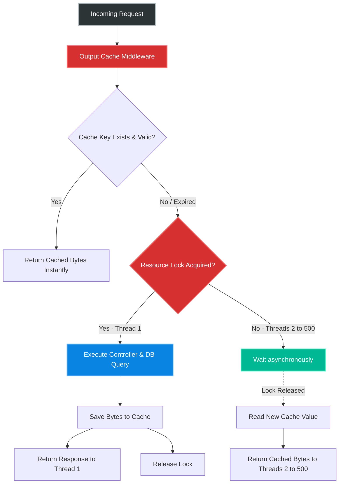

# 4.173 — Output Caching Deep Dive (NET 7+)

## PART 0 — Navigation & Context

```text
ASP.NET Core Domain Hierarchy
├── Performance & Reliability
│   ├── 4.171 Rate Limiting & Throttling
│   ├── 4.172 Response Caching vs Output Caching
│   ├── 4.173 Output Caching Deep Dive (NET 7+) ◄ YOU ARE HERE
│   └── 4.174 IDistributedCache Redis Integration
└── Database & EF Core
```

**What you need before this:**
- [[4.172 — Response Caching vs Output Caching]] — You must understand why Output Caching replaced Response Caching.
- Understanding of HTTP Headers, specifically how cache keys might be formulated based on headers like `Accept-Language`.

**What this unlocks after:**
- Customizing cache key generation (e.g., caching differently for GraphQL queries).
- Implementing Cache Lock (Stampede Protection) to save the database during viral traffic spikes.

**Why this matters to a production engineer at scale:**
When you apply a basic `[OutputCache]` attribute, the framework handles the basics perfectly. But at scale, edge cases emerge. What happens if a massive cache expires exactly when 10,000 users request the endpoint? All 10,000 requests miss the cache simultaneously, hitting the database at the exact same millisecond. This is called a "Cache Stampede", and it will instantly take down your SQL Server. The .NET Output Caching middleware natively solves this via Resource Locking. Furthermore, mastering custom `IOutputCachePolicy` implementations allows you to cache complex scenarios, such as GraphQL POST requests, which standard caching middlewares usually ignore.

---

## PART 1 — The Core Mental Model

> **The Fundamental Rule**
> **Output Caching is a highly extensible state machine; by implementing custom policies, you control exactly *what* constitutes a unique cache key, *who* is allowed to read from it, and *when* the cache is violently evicted, all while relying on the framework's native Cache Stampede protection to serialize database access.**

**The Plain-Language Analogy**
Imagine a popular museum with a highly detailed, 10-hour documentary playing in a private theater (The Database).
**Standard Caching:** The museum records the documentary to a DVD (The Cache) and plays it on a TV in the lobby.
**Cache Stampede:** The DVD breaks. At that exact moment, 500 visitors demand to see the documentary. Without protection, the museum tries to build 500 private theaters simultaneously to show it to each of them. The museum goes bankrupt.
**Output Caching (Stampede Protection):** The DVD breaks. 500 visitors demand to see it. The museum manager says: "Visitor #1, go into the private theater to watch it. I will record it to a new DVD while you watch. Visitors 2 through 500, please wait here in the lobby." When the DVD is finished, the 499 waiting visitors watch the new DVD together. The private theater was only used *once*.

**The Taxonomy Diagram**



---

## PART 2 — Deep Mechanics

### 1. The Anatomy of a Cache Key

When the middleware decides to cache a response, it must uniquely identify that response. The Default Policy generates a key based on:
1. HTTP Method (e.g., `GET`)
2. Scheme (e.g., `https`)
3. Host (e.g., `api.example.com`)
4. Path (e.g., `/api/products`)

If you configure `SetVaryByQuery("categoryId")`, the key generation mutates to include the value of `?categoryId=X`. 
If you configure `SetVaryByHeader("Accept-Language")`, the key branches based on `en-US` vs `es-ES`.

### 2. Cache Stampede Protection (Resource Locking)

This is the most critical feature of Output Caching.
When a cache key is missing or expired, the middleware acquires an asynchronous lock for that specific cache key. 
The *first* request acquires the lock, executes the controller, hits the database, and generates the response.
While that is happening, the 2nd, 3rd, and 10,000th requests for the *exact same key* arrive. The middleware sees the lock is held. It pauses the HTTP threads for those 9,999 requests. 
When the 1st request finishes and populates the cache, the lock is released. The 9,999 waiting requests immediately read the newly cached data from memory and return it. The database was hit exactly **once**.

### 3. IOutputCachePolicy Extensibility

If you don't like the Default Policy (e.g., it refuses to cache POST requests, or refuses to cache authenticated requests), you don't use the fluent builder. You implement `IOutputCachePolicy` manually.

The interface requires you to define three phases:
- `CacheRequestAsync`: Decides if the request *should* be cached, and generates the key.
- `ServeFromCacheAsync`: Modifies how a cache hit is returned (rarely overridden).
- `ServeResponseAsync`: Intercepts the generated response from the controller *before* it is written to the cache (e.g., deciding not to cache it if the content length is zero).

---

## PART 3 — Production Code Patterns

### Pattern 1: Cache Eviction Architecture (Tags)
To build a highly reactive API, you cache heavily but evict violently when data changes.

```csharp
// Program.cs
builder.Services.AddOutputCache();

// 1. Tag the query endpoint
app.MapGet("/api/users", async (AppDbContext db) => await db.Users.ToListAsync())
   .CacheOutput(c => c
       .Expire(TimeSpan.FromDays(1)) // Cache essentially forever...
       .Tag("users-list", "global-data")); // ...but apply tags!

// 2. The mutation endpoint
app.MapPost("/api/users", async (UserDto dto, AppDbContext db, IOutputCacheStore cache) => 
{
    db.Users.Add(new User { Name = dto.Name });
    await db.SaveChangesAsync();

    // ✅ CORRECT: Evict the tag. The very next GET request will rebuild the cache.
    await cache.EvictByTagAsync("users-list", default);
    
    return Results.Created();
});
```

### Pattern 2: Custom IOutputCachePolicy (Caching GraphQL / POSTs)
By default, POST requests are never cached because POST implies a state mutation. But GraphQL sends queries via POST. To cache GraphQL, we must implement a custom policy.

```csharp
public class GraphQLOutputCachePolicy : IOutputCachePolicy
{
    public ValueTask CacheRequestAsync(OutputCacheContext context, CancellationToken ct)
    {
        var request = context.HttpContext.Request;

        // 1. Only apply to GraphQL POST requests
        if (!HttpMethods.IsPost(request.Method) || !request.Path.StartsWithSegments("/graphql"))
        {
            return ValueTask.CompletedTask;
        }

        // 2. Enable caching for this request
        context.EnableOutputCaching = true;
        context.AllowCacheLookup = true;
        context.AllowCacheStorage = true;
        context.AllowLocking = true; // Enable Stampede Protection!

        // 3. ✅ CORRECT: The cache key MUST vary by the POST body!
        // (Note: Reading the body requires request stream buffering)
        context.CacheVaryByRules.VaryByValues.Add("RequestBody", ReadBodyHash(request));

        return ValueTask.CompletedTask;
    }

    public ValueTask ServeFromCacheAsync(OutputCacheContext context, CancellationToken ct) 
        => ValueTask.CompletedTask;

    public ValueTask ServeResponseAsync(OutputCacheContext context, CancellationToken ct)
    {
        // Don't cache if the GraphQL execution returned errors (even if HTTP 200)
        // You would inspect the context.HttpContext.Response here.
        return ValueTask.CompletedTask;
    }
    
    private string ReadBodyHash(HttpRequest req) { /* Hash the stream */ return "hash"; }
}

// Registration
builder.Services.AddOutputCache(options => {
    options.AddPolicy("GraphQLPolicy", new GraphQLOutputCachePolicy());
});
```

### Pattern 3: ETags and Not Modified (304)
Output Caching natively supports HTTP ETags. If the client sends `If-None-Match`, and the ETag in the Output Cache matches, the middleware sends a `304 Not Modified` with an empty body, saving massive network bandwidth.

```csharp
builder.Services.AddOutputCache(options =>
{
    // ETags are enabled by default for Output Caching!
    // No explicit code is needed to enable it, but you should understand how it saves bandwidth.
});

app.MapGet("/api/large-dataset", () => Get10MBDataset())
   .CacheOutput(); 

// HTTP Flow:
// Request 1: Client gets 10MB payload + ETag: "W/12345"
// Request 2: Client sends If-None-Match: "W/12345". 
// Output Cache intercepts, compares ETag, returns HTTP 304 (0 bytes).
```

### Pattern 4: Vary By Header (Multi-Language APIs)
If your API returns different localized strings based on the `Accept-Language` header, you must vary the cache key by that header.

```csharp
builder.Services.AddOutputCache(options =>
{
    options.AddPolicy("LocalizedData", builder => builder
        .Expire(TimeSpan.FromHours(1))
        // ✅ CORRECT: Creates separate cached payloads for "en-US", "fr-FR", etc.
        .SetVaryByHeader("Accept-Language")); 
});
```

### Pattern 5: Caching Minimal API IResult streams
If your endpoint streams data (like a file download or a very large `IAsyncEnumerable`), Output Caching handles buffering the stream into memory automatically.

```csharp
app.MapGet("/api/report/download", () => 
{
    var stream = File.OpenRead("large_report.pdf");
    // ✅ CORRECT: The middleware intercepts the FileStreamHttpResult, 
    // reads it into the cache, and then serves it from memory on subsequent hits.
    return Results.File(stream, "application/pdf");
})
.CacheOutput(c => c.Expire(TimeSpan.FromMinutes(30)));
```

---

## PART 4 — Gotchas & Anti-Patterns

### Gotcha 1: Deadlocking with OutputCache and Request Body
If you write a custom `IOutputCachePolicy` to cache POST requests, you must read the HTTP Request Body to generate the cache key.

// ⚠️ WRONG CODE
```csharp
public ValueTask CacheRequestAsync(OutputCacheContext context, CancellationToken ct) {
    var bodyReader = new StreamReader(context.HttpContext.Request.Body);
    var body = bodyReader.ReadToEnd(); // Reads and CONSUMES the stream
    context.CacheVaryByRules.VaryByValues.Add("Body", body);
}
```

// HTTP consequence (wrong path):
// The request stream is consumed by the policy. When the middleware passes execution down to the Controller/Minimal API, the Model Binder tries to read the body to deserialize the JSON. The stream is empty. The Model Binder throws an exception.

// ✅ CORRECT CODE
```csharp
// You must enable buffering so the stream can be read twice.
context.HttpContext.Request.EnableBuffering();
var body = await new StreamReader(context.HttpContext.Request.Body).ReadToEndAsync();
context.HttpContext.Request.Body.Position = 0; // Reset the stream for the Model Binder!
```

### Gotcha 2: Tagging by Dynamic Variables (Memory Leak)
Tags are designed to be known, finite categories (e.g., "products", "users"). Developers sometimes tag by dynamic IDs.

// ⚠️ WRONG CODE
```csharp
app.MapGet("/api/products/{id}", (int id) => ...)
   .CacheOutput(c => c.Tag($"product-{id}"));
```

// HTTP consequence (wrong path):
// If you have 10,000,000 products, you just created 10,000,000 unique tags in the cache index dictionary. The internal data structures of the Output Cache will bloat, causing severe GC pressure.

// ✅ CORRECT CODE
```csharp
// Only use Tags for broad eviction sets. 
// For specific IDs, rely on the base Route/URL variation natively handled by the cache key.
```

### Gotcha 3: Caching the `User` Object incorrectly
When caching authenticated endpoints, varying by `User.Identity.Name` is common, but what if claims change?

// ⚠️ WRONG CODE
```csharp
builder.SetVaryByValue(context => new KeyValuePair<string, string>("User", context.User.Identity.Name));
```

// HTTP consequence (wrong path):
// A user pays for a subscription. Their database record updates. They hit `/api/profile`. The cache returns the free tier profile because the cache key is just their Name.

// ✅ CORRECT CODE
```csharp
// If caching user profiles, ensure the mutation endpoint (e.g., Payment success) 
// evicts the cache by a specific User ID tag!
```

### Gotcha 4: Bypassing Stampede Protection
Stampede protection is enabled by default. But some developers disable it to "speed things up".

// ⚠️ WRONG CODE
```csharp
builder.Services.AddOutputCache(options => {
    options.AddBasePolicy(b => b.SetLocking(false)); // Disabled locking!
});
```

// HTTP consequence (wrong path):
// If a viral tweet hits your API, 100,000 requests arrive. The cache is empty. Because locking is disabled, ALL 100,000 requests pass through the middleware and hit the database simultaneously. Database goes offline.

// ✅ CORRECT CODE
```csharp
// Leave locking enabled. It is the primary architectural benefit of Output Caching.
```

### Gotcha 5: Assuming Tags Evict Distributed Caches Instantly
If you use a Distributed Cache (Redis) for Output Caching, `EvictByTagAsync` is executed via Redis Pub/Sub or Lua scripts. It is fast, but it is not synchronous across a 50-node web farm. There is a tiny eventual consistency window (milliseconds) where Node B might still serve the old cache before receiving the Redis eviction notice.

---

## PART 5 — Performance Implications

### Request Pipeline Characteristics

| Scenario | Pipeline Depth | Allocations | Approx Latency Impact | Recommendation |
|---|---|---|---|---|
| Cache Hit | Shallow | Low | < 0.1ms | O(1) Dictionary lookup in memory. |
| Cache Miss (Lock acquired) | Medium | Medium | DB Latency | Only 1 thread pays this cost. |
| Cache Miss (Waiting on Lock) | Shallow | Low | DB Latency | Thread suspended safely via `await`. |

### BenchmarkDotNet Code

*(Demonstrating the impact of Resource Locking / Stampede Protection under heavy concurrency)*

```csharp
using BenchmarkDotNet.Attributes;
using System.Threading;

[MemoryDiagnoser]
public class CacheStampedeBenchmark
{
    private int _dbHitCount = 0;
    private SemaphoreSlim _lock = new SemaphoreSlim(1, 1);
    private string _cachedValue;

    [Benchmark]
    public async Task SimulateNoLocking_100ConcurrentRequests()
    {
        _dbHitCount = 0; _cachedValue = null;
        var tasks = Enumerable.Range(0, 100).Select(async _ =>
        {
            if (_cachedValue == null) {
                Interlocked.Increment(ref _dbHitCount); // Simulating DB hit
                await Task.Delay(10); // Simulating DB Latency
                _cachedValue = "Data";
            }
            return _cachedValue;
        });
        await Task.WhenAll(tasks);
        // Result: _dbHitCount will be close to 100. Database crushed.
    }

    [Benchmark]
    public async Task SimulateOutputCacheLocking_100ConcurrentRequests()
    {
        _dbHitCount = 0; _cachedValue = null;
        var tasks = Enumerable.Range(0, 100).Select(async _ =>
        {
            if (_cachedValue != null) return _cachedValue;
            
            await _lock.WaitAsync(); // Output Cache Stampede Protection
            try {
                if (_cachedValue == null) {
                    Interlocked.Increment(ref _dbHitCount);
                    await Task.Delay(10); 
                    _cachedValue = "Data";
                }
                return _cachedValue;
            } finally { _lock.Release(); }
        });
        await Task.WhenAll(tasks);
        // Result: _dbHitCount is exactly 1. Database protected.
    }
}
```

**When to Care:** If your application experiences massive traffic spikes (e.g., Ticketmaster sales, viral news), Stampede Protection is the only thing standing between your API and catastrophic failure.

---

## PART 6 — Interview Arsenal

### A. The Question Bank

**Question 1:** "What is a Cache Stampede, and how does the .NET Output Caching middleware prevent it?"
- **Average Answer:** "A stampede is when lots of people hit the cache. Output cache handles it."
- **Why That's Insufficient:** Doesn't explain the mechanics of resource locking.
- **Great Answer:** "A Cache Stampede occurs when a highly trafficked cache key expires, causing hundreds of concurrent requests to experience a cache miss simultaneously. Without protection, all those requests would query the database at the exact same millisecond, likely causing a database outage. The Output Caching middleware prevents this using Resource Locking. When a cache miss occurs, the middleware acquires an asynchronous lock for that specific key. The first request is allowed through to query the database. All subsequent requests for that key are safely paused (awaiting the lock). Once the first request finishes and populates the cache, the lock is released, and all waiting requests are served directly from the newly populated cache. The database is queried exactly once."

**Question 2:** "Can you use Output Caching to cache a GraphQL endpoint?"
- **Average Answer:** "No, because GraphQL uses HTTP POST."
- **Why That's Insufficient:** Ignores the extensibility of `IOutputCachePolicy`.
- **Great Answer:** "By default, Output Caching ignores POST requests because they imply state mutation. However, we can cache GraphQL by implementing a custom `IOutputCachePolicy`. Inside `CacheRequestAsync`, we check if the request is a POST to `/graphql`. If so, we enable caching and lock acquisition. The critical step is that we must read the HTTP Request Body (the GraphQL query string), hash it, and add that hash to `context.CacheVaryByRules.VaryByValues`. This ensures that different GraphQL queries generate different cache keys."

**Question 3:** "If we have an endpoint that returns a list of Products, and an Admin edits a Product, how do we ensure the users see the update immediately without waiting 60 minutes for the cache to expire?"
- **Average Answer:** "Change the cache duration to 1 minute."
- **Why That's Insufficient:** Sacrifices 59 minutes of cache performance to solve a mutation problem.
- **Great Answer:** "We use Cache Tagging and Eviction. When configuring the Output Cache policy for the GET endpoint, we assign a tag like `builder.Tag(\"products-list\")`. We can set the expiration to something very long, like 24 hours, ensuring massive read performance. In the Admin PUT endpoint that edits the product, we inject the `IOutputCacheStore` service. After saving to the database, we call `await cacheStore.EvictByTagAsync(\"products-list\")`. This instantly invalidates the cached payload, ensuring the very next GET request reads fresh data from the database."

### B. The Trick Questions

**Trick Question:** "If I configure Output Caching to use Redis as the backing store, does the Resource Locking (Stampede Protection) work across multiple different servers?"
- **The Trap:** Assuming distributed caching implies distributed locking out of the box.
- **The Correct Answer:** "Yes! As of .NET 8, when you configure Output Caching to use Redis (`AddStackExchangeRedisOutputCache`), the middleware utilizes Redis features (specifically Lua scripts or RedLock concepts under the hood) to enforce the lock in the distributed cache. This means if Server A and Server B both experience a cache miss at the exact same time, the Redis lock ensures only one server executes the database query, protecting the database globally across the entire web farm."

**Trick Question:** "If I use `.SetVaryByQuery(\"id\")`, but the client doesn't provide an `id` query parameter, what does the Output Cache do?"
- **The Trap:** Assuming it crashes or bypasses the cache.
- **The Correct Answer:** "It handles it safely. The absence of the query string parameter simply means the key generation uses an empty value for that variable. It will cache the response. If another request comes in *without* the parameter, it hits that cache. If a request comes in *with* `?id=5`, it generates a new cache key and executes the controller."

### C. Red Flags to Avoid
- 🚩 **"I disabled Locking because `SemaphoreSlim` uses too much CPU."** (Premature optimization that will cause a catastrophic database outage under load).
- 🚩 **"I use Output Caching for my `/login` POST endpoint to make login faster."** (Caching security tokens or authentication handshakes is a massive security vulnerability. Output Caching is for idempotent data retrieval).

---

## PART 7 — Decision Framework

```mermaid
graph TD
    A[Output Caching Advanced] --> B{Are you caching a POST request?}
    
    B -->|Yes e.g. GraphQL| C[Create custom IOutputCachePolicy]
    C --> C1[EnableBuffering on Request]
    C --> C2[Add Body Hash to VaryByValues]
    
    B -->|No, standard GET| D{How is the cache invalidated?}
    
    D -->|Time-based| E[Set Expire TimeSpan]
    D -->|Event-based e.g. DB Update| F[Use Tags]
    
    F --> F1[Tag GET endpoint]
    F --> F2[EvictByTag in PUT/POST endpoint]
    
    D -->|Never| G[Never cache indefinitely without a Tag]
    
    style A fill:#2d3436,stroke:#fff
    style C fill:#0984e3,stroke:#fff
    style F fill:#00b894,stroke:#fff
    style G fill:#d63031,stroke:#fff
```



---

## PART 8 — Self-Check

### A. Conceptual Questions
1. How does Resource Locking prevent a Cache Stampede?
2. What are the three primary methods required when implementing a custom `IOutputCachePolicy`?
3. Why is it dangerous to vary a cache key by the entire HTTP Request Body without hashing it first?
4. How does `IOutputCacheStore.EvictByTagAsync` interact with a multi-node Redis setup?
5. Why must you enable request buffering if your custom policy reads the HTTP Request stream?
6. How does Output Caching native support for HTTP ETags save network bandwidth?
7. If `SetVaryByQuery` is applied to a string parameter, why is an unconstrained string dangerous?
8. In what scenario would you explicitly set `context.AllowLocking = false`?

### B. Code Puzzles

**Puzzle 1: The Infinite Tags**
```csharp
app.MapGet("/articles/{authorId}", (int authorId) => GetArticles())
   .CacheOutput(c => c.Tag(authorId.ToString()));
```
*Scenario:* The API has 5 million authors. 
<details>
<summary>Answer</summary>
This creates 5 million unique tags in the Output Cache registry. Tagging is for broad categories (e.g., "articles"), not for instance IDs. The cache key automatically varies by the URL (`/articles/5`), so instance-level caching is already handled. Tags are solely for eviction.
*Fix:* Remove the dynamic tag. If you must evict a single author's cache, you usually rely on the URL path, or wait for time-expiration.
</details>

**Puzzle 2: The Double Read**
```csharp
var reader = new StreamReader(req.Body);
var body = await reader.ReadToEndAsync();
req.Body.Position = 0; // Reset
```
*Scenario:* The custom policy resets the position, but the Model Binder still throws "Cannot read stream".
<details>
<summary>Answer</summary>
The request body stream is not seekable by default in Kestrel. Setting `Position = 0` on a forward-only network stream throws a `NotSupportedException`.
*Fix:* You must call `req.EnableBuffering()` before reading the stream. This copies the network stream into a seekable `MemoryStream`.
</details>

**Puzzle 3: The Broken Auth Cache**
```csharp
builder.AddPolicy("AuthCache", b => b.Cache().SetVaryByHeader("Authorization"));
```
*Scenario:* Developer tries to cache authenticated requests by varying by the exact JWT token.
<details>
<summary>Answer</summary>
Technically it works, but JWTs rotate, expire, or might have slightly different signatures (e.g., issue time) even for the same user. This fragments the cache heavily.
*Fix:* Extract the discrete User ID from the `ClaimsPrincipal` inside `SetVaryByValue` instead of using the raw HTTP header.
</details>

**Puzzle 4: The 304 Anomaly**
```csharp
// Client Request 1: GET /api/data
// Server Response 1: 200 OK, ETag: "123"

// Client Request 2: GET /api/data (If-None-Match: "123")
// Server Response 2: 304 Not Modified
```
*Scenario:* The developer deletes the Output Cache middleware but leaves Response Caching. Client Request 2 still happens. What does the server do?
<details>
<summary>Answer</summary>
Without Output Caching (or explicit ETag middleware), the server doesn't automatically know how to evaluate `If-None-Match`. It will execute the controller, serialize the data, and return a 200 OK with the full payload, wasting bandwidth. Output Caching handles ETags seamlessly.
</details>

---

## PART 9 — Connections & Resources

### A. Related Topics Table

| Topic | Why It Connects |
|---|---|
| [[4.172 — Response Caching vs Output Caching]] | The foundational explanation of why Output Caching was introduced. |
| [[4.174 — IDistributedCache Redis Integration]] | How to switch the Output Caching storage mechanism from local Memory to Redis. |
| [[4.050 — Writing Middleware]] | Understanding the context and request/response flow. |

### B. Books

| Book | Chapters | Why These Chapters |
|---|---|---|
| ASP.NET Core in Action, 3rd Ed | Chapter 17: Performance | Detailed examples of custom Output Caching policies. |

### C. Essential Articles & Docs
- [Microsoft Docs: Output Caching Middleware](https://learn.microsoft.com/en-us/aspnet/core/performance/caching/output)
- [Marc Gravell: Distributed Caching and Output Caching in .NET 8](https://blog.marcgravell.com/)
- [NDepend Blog: Cache Stampede in .NET](https://blog.ndepend.com/)

> [!NOTE]
> **Template Meta-Note**
> Part 0: Context & Prerequisites. Part 1: Core Mental Model. Part 2: Deep Mechanics & Pipeline. Part 3: Production Code. Part 4: Gotchas. Part 5: Performance. Part 6: Interview Arsenal. Part 7: Decision Framework. Part 8: Puzzles. Part 9: Resources.
