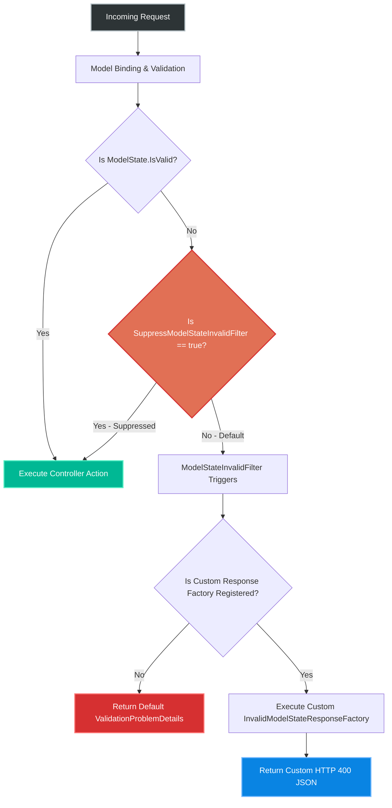

# 4.174 — Global Validation: SuppressModelStateInvalidFilter and Custom Factory

## PART 0 — Navigation & Context

```text
ASP.NET Core Domain Hierarchy
├── Cross-Cutting Concerns
│   ├── Validation Pipeline
│   │   ├── 4.168 ModelState
│   │   ├── 4.170 FluentValidation
│   │   └── 4.174 Global Validation Config ◄ YOU ARE HERE
└── API Design
    └── 4.179 RFC 7807 Problem Details
```

**What you need before this:**
- A deep understanding of how `ModelState` accumulates errors during the model binding and validation phases [[4.168 — ModelState: Checking Validity, Reading Errors, Custom Responses]].
- Knowledge of the `[ApiController]` attribute and the automatic behaviors it injects into MVC Controllers [[4.101 — ApiController Attribute: Automatic 400 on Invalid ModelState]].
- Familiarity with the RFC 7807 standard for API Error Responses (`ProblemDetails`).

**What this unlocks after:**
- Completely customizing the shape of all HTTP 400 validation errors globally across your entire application, ensuring 100% adherence to your corporate API design guidelines.
- Safely integrating CQRS/MediatR pipelines that require absolute control over validation execution timing without fighting the ASP.NET Core framework.

**Why this matters to a production engineer at scale:**
Out of the box, ASP.NET Core intercepts requests with invalid payloads and immediately returns an HTTP 400 response. This is highly convenient. However, at enterprise scale, convenience often becomes a barrier.
If your mobile team requires validation errors to include specific "Error Codes" (e.g., `ERR_INVALID_EMAIL`) instead of just human-readable strings, or if your logging system requires every HTTP 400 to include an explicit `TraceId`, the default ASP.NET Core response shape is inadequate.
Furthermore, if you adopt a strict MediatR architecture where validation is handled deep inside MediatR Pipeline Behaviors, the default ASP.NET Core validation filter will hijack your request before it ever reaches MediatR.
Understanding `ConfigureApiBehaviorOptions`—specifically `SuppressModelStateInvalidFilter` and `InvalidModelStateResponseFactory`—is the key to taking back control of the request pipeline. If you configure these incorrectly, you risk either returning inconsistent API contracts to your clients, or worse, accidentally letting fundamentally invalid data pass directly into your production business logic, resulting in catastrophic database corruption or NullReferenceExceptions.

---

## PART 1 — The Core Mental Model

> **The Fundamental Rule**
> **The `[ApiController]` attribute automatically registers the `ModelStateInvalidFilter`. This filter checks `ModelState.IsValid` and short-circuits the pipeline if false, executing the `InvalidModelStateResponseFactory` to generate the HTTP 400 response. Setting `SuppressModelStateInvalidFilter = true` completely destroys the filter, allowing invalid payloads to reach your Controller. Overriding the `InvalidModelStateResponseFactory` keeps the filter intact but completely rewrites the shape of the HTTP 400 response it generates.**

**The Plain-Language Analogy**
Imagine a highly secure nightclub (Your API).
The **`[ApiController]` attribute** is the nightclub's Owner. The Owner hires a **Bouncer (`ModelStateInvalidFilter`)** to stand at the door.
The Bouncer's job is simple: check IDs (`ModelState.IsValid`). If an ID is fake, the Bouncer hands the person a **Rejection Slip (`InvalidModelStateResponseFactory`)** and kicks them out.
- Overriding the `InvalidModelStateResponseFactory` is like telling the Bouncer: *"Keep kicking out people with fake IDs, but instead of using the standard rejection slip, use this custom pink slip with our company logo and the manager's phone number on it."*
- Setting `SuppressModelStateInvalidFilter = true` is like telling the Bouncer: *"Go home. You're fired."* If you fire the Bouncer, people with fake IDs will walk straight into the club (Your Controller). If you fire the Bouncer, you **must** have another layer of security inside the club (like a MediatR pipeline) to catch them, otherwise your club will be destroyed.

**The Taxonomy Diagram**



---

## PART 2 — Deep Mechanics

### 2.1 — The Source of the Filter
When you decorate a Controller with `[ApiController]`, ASP.NET Core applies several conventions via the `ApiBehaviorApplicationModelProvider`. One of these conventions is silently appending the `ModelStateInvalidFilter` to the Controller's filter pipeline.

```csharp
// Internal ASP.NET Core Source Code representation
public class ModelStateInvalidFilter : IActionFilter, IOrderedFilter
{
    // Executes just before the Controller Action runs
    public void OnActionExecuting(ActionExecutingContext context)
    {
        if (!context.ModelState.IsValid)
        {
            // Short-circuit the pipeline using the configured Factory!
            context.Result = _apiBehaviorOptions.InvalidModelStateResponseFactory(context);
        }
    }
}
```

### 2.2 — `ConfigureApiBehaviorOptions`
To modify this behavior globally, you hook into `ApiBehaviorOptions` during application startup. This is chained directly onto `AddControllers()`.

```csharp
builder.Services.AddControllers()
    .ConfigureApiBehaviorOptions(options =>
    {
        // 1. The Nuclear Option: Fire the Bouncer
        options.SuppressModelStateInvalidFilter = false; 

        // 2. The Customization Option: Change the Rejection Slip
        options.InvalidModelStateResponseFactory = context => 
        {
            return new BadRequestObjectResult(...);
        };
    });
```

### 2.3 — The Mechanics of the Factory
The `InvalidModelStateResponseFactory` is simply a delegate (`Func<ActionContext, IActionResult>`). It receives the current `ActionContext`, which gives you access to:
1. `context.ModelState`: The dictionary containing all the validation errors.
2. `context.HttpContext`: Access to the Request, Response, and crucial tracing properties like `TraceIdentifier`.
It expects you to return an `IActionResult`, typically a `BadRequestObjectResult` wrapping a `ValidationProblemDetails` object.

### 2.4 — The Mechanics of Suppression
If you set `options.SuppressModelStateInvalidFilter = true`, the framework actively skips adding the `ModelStateInvalidFilter` to the pipeline.
**Critical Consequence:** The `InvalidModelStateResponseFactory` will NEVER execute, because the filter that calls it no longer exists. Furthermore, your Controller Action will execute immediately, even if the payload is completely malformed or violates dozens of Validation rules.

### 2.5 — Interaction with Minimal APIs
`ConfigureApiBehaviorOptions` is strictly a feature of the MVC/Controller pipeline (`AddControllers`).
Minimal APIs do not use `ApiBehaviorOptions`. Minimal APIs do not have automatic validation out-of-the-box (unless using .NET 7/8 endpoint filters specifically designed for it). If you want global custom validation shapes in Minimal APIs, you must implement an `IEndpointFilter` globally.

---

## PART 3 — Production Code Patterns

### Pattern 1: The Global API Contract Customization (Keep Filter, Change Factory)
This is the most common pattern. You want the framework to continue automatically rejecting bad requests, but your mobile team demands that all 400 responses include a `traceId` and a specific `errorCode` for telemetry parsing.

```csharp
builder.Services.AddControllers()
    .ConfigureApiBehaviorOptions(options =>
    {
        // We DO NOT suppress the filter. Let the framework do the heavy lifting.
        
        options.InvalidModelStateResponseFactory = context =>
        {
            // 1. Create the standard RFC 7807 wrapper
            var problemDetails = new ValidationProblemDetails(context.ModelState)
            {
                Type = "https://api.mycompany.com/errors/validation",
                Title = "Validation Failed",
                Status = StatusCodes.Status400BadRequest,
                Detail = "See the errors property for details."
            };

            // 2. Inject distributed tracing identifiers
            problemDetails.Extensions.Add("traceId", context.HttpContext.TraceIdentifier);

            // 3. Inject a custom timestamp
            problemDetails.Extensions.Add("timestamp", DateTimeOffset.UtcNow);

            // 4. Return the result
            return new BadRequestObjectResult(problemDetails)
            {
                ContentTypes = { "application/problem+json" }
            };
        };
    });
```
*HTTP Result:* Whenever FluentValidation or DataAnnotations fail, the client receives this exact, enriched JSON structure automatically. You never have to write `if (!ModelState.IsValid)` in your controllers again.

### Pattern 2: The CQRS/MediatR Suppression Pattern
In a strict Clean Architecture, HTTP Controllers should be completely "dumb". They shouldn't do validation; validation is a Domain or Application concern. You configure MediatR `IPipelineBehavior` to run FluentValidation rules right before the Command Handler executes.
Because you moved validation into MediatR, you MUST suppress the ASP.NET Core filter. If you don't, the framework will intercept the request before MediatR even gets a chance to see it.

```csharp
// Program.cs
builder.Services.AddControllers()
    .ConfigureApiBehaviorOptions(options =>
    {
        // 1. SUPPRESS the ASP.NET Core filter.
        // We are taking absolute responsibility for validation.
        options.SuppressModelStateInvalidFilter = true;
    });

// 2. Register MediatR Pipeline Behavior
builder.Services.AddTransient(typeof(IPipelineBehavior<,>), typeof(ValidationBehavior<,>));
```

```csharp
// MediatR Pipeline Behavior (ValidationBehavior.cs)
public class ValidationBehavior<TRequest, TResponse> : IPipelineBehavior<TRequest, TResponse>
{
    private readonly IEnumerable<IValidator<TRequest>> _validators;

    public ValidationBehavior(IEnumerable<IValidator<TRequest>> validators) => _validators = validators;

    public async Task<TResponse> Handle(TRequest request, RequestHandlerDelegate<TResponse> next, CancellationToken ct)
    {
        // 3. Execute all FluentValidation rules
        var failures = _validators
            .Select(v => v.Validate(request))
            .SelectMany(result => result.Errors)
            .Where(f => f != null)
            .ToList();

        if (failures.Count != 0)
        {
            // 4. Throw a custom exception (or return a Result object)
            throw new ValidationException(failures);
        }

        return await next();
    }
}
```
*Result:* The Controller action runs, dispatches the Command to MediatR, MediatR runs validation, and throws an exception which is caught by a Global Exception Handler middleware. Absolute decoupling from ASP.NET Core MVC.

### Pattern 3: Extracting FluentValidation Error Codes in the Factory
FluentValidation allows you to set `.WithErrorCode("ERR_123")` on rules. By default, `ModelState` discards these error codes, keeping only the error messages. We can use the custom factory to dig into the raw validation state and expose them.

```csharp
options.InvalidModelStateResponseFactory = context =>
{
    var problemDetails = new ValidationProblemDetails(context.ModelState);
    var errorCodesDictionary = new Dictionary<string, string[]>();

    // ModelState contains a raw, untyped property bag called 'Errors'
    foreach (var keyModelStatePair in context.ModelState)
    {
        var key = keyModelStatePair.Key;
        var errors = keyModelStatePair.Value.Errors;
        var codes = new List<string>();

        foreach (var error in errors)
        {
            // FluentValidation sometimes tucks the ErrorCode into the Exception property or we can map it manually
            // (Note: In production, it is often easier to configure FluentValidation to inject the error code into the string message, or use a custom interceptor, but this demonstrates the concept of extracting rich data from ModelState).
            codes.Add(GetErrorCode(error)); 
        }
        errorCodesDictionary[key] = codes.ToArray();
    }

    problemDetails.Extensions["errorCodes"] = errorCodesDictionary;
    return new BadRequestObjectResult(problemDetails);
};
```

### Pattern 4: Suppressing Implicit Required Attributes
ASP.NET Core 3.0+ introduced a feature where non-nullable properties (like `int`, `Guid`, `DateTime`) are automatically treated as `[Required]`. If they are missing from the JSON, `ModelState` fails before FluentValidation even runs. You can suppress this specific behavior without suppressing the whole filter.

```csharp
builder.Services.AddControllers(options =>
{
    // Stops ASP.NET Core from magically rejecting missing non-nullable types,
    // allowing your FluentValidation rules to handle them explicitly.
    options.SuppressImplicitRequiredAttributeForNonNullableReferenceTypes = true;
});
```

---

## PART 4 — Gotchas & Anti-Patterns

### Gotcha 1: The "Suppress and Forget" Catastrophe
The most dangerous anti-pattern in ASP.NET Core validation. A developer reads a tutorial on MediatR, copies a line of code setting `SuppressModelStateInvalidFilter = true`, but forgets to actually implement the MediatR validation pipeline.

// ⚠️ FATAL ANTI-PATTERN
```csharp
builder.Services.AddControllers()
    .ConfigureApiBehaviorOptions(o => o.SuppressModelStateInvalidFilter = true);

// Controller
[HttpPost]
public IActionResult CreateUser(UserDto dto)
{
    // ❌ NO VALIDATION CHECK!
    _db.Users.Add(dto); 
    _db.SaveChanges();
    return Ok();
}
```

// HTTP consequence (wrong path):
// The client submits a payload with an empty email, an age of -500, and a 2-character password.
// Because the filter is suppressed, ASP.NET Core ignores the validation failures. The Controller executes. The invalid data is directly inserted into the database. Data corruption occurs instantly.

// ✅ CORRECT CODE
// If you set `SuppressModelStateInvalidFilter = true`, you must take a blood oath that EVERY SINGLE ACTION in your application either manually checks `if (!ModelState.IsValid)` or is guarded by a robust MediatR/Filter pipeline.

### Gotcha 2: Returning HTTP 200 from the Response Factory
Developers sometimes try to use the Response Factory to "fix" validation errors by returning `Ok()`.

// ⚠️ WRONG CODE
```csharp
options.InvalidModelStateResponseFactory = context =>
{
    // ❌ Never return HTTP 200 for a validation failure!
    return new OkObjectResult(new { Success = false, Errors = context.ModelState });
};
```

// HTTP consequence (wrong path):
// This breaks REST semantics and violates HTTP standards. Proxies, CDNs, and client libraries will cache or process the response as if it succeeded, leading to massive logic errors in the frontend SPA.
// Always return a 4xx status code (400 Bad Request, or 422 Unprocessable Entity) for validation failures.

### Gotcha 3: Factory Fails on Minimal APIs
A developer spends hours perfectly crafting an `InvalidModelStateResponseFactory` in `Program.cs`. They then write a new Minimal API endpoint:

```csharp
app.MapPost("/minimal", (MyDto dto) => "Success");
```
When they submit invalid data to the Minimal API, they get the default framework response, not their custom factory shape.
**Why?** `ConfigureApiBehaviorOptions` is explicitly bound to MVC Controllers. Minimal APIs do not use it. If you mix MVC and Minimal APIs in the same project, you must duplicate your global validation logic using an `IEndpointFilter`.

### Gotcha 4: Suppressing the Filter Disables the Factory
A developer wants to customize the error response, AND they want to handle validation manually in the Controller.

```csharp
options.SuppressModelStateInvalidFilter = true;
options.InvalidModelStateResponseFactory = ctx => new BadRequestObjectResult("Custom Format");

// Controller
if (!ModelState.IsValid) return BadRequest(ModelState);
```
**Why this fails:** If you suppress the filter, the factory is never invoked by the framework. The Controller's manual `BadRequest(ModelState)` call will return the default ASP.NET Core format, completely ignoring your custom factory. The factory and the filter are a package deal.

---

## PART 5 — Performance Implications

### Request Pipeline Characteristics

| Configuration | Execution Path | Latency Impact | Recommendation |
|---|---|---|---|
| Default Configuration | Internal Framework Filter | `~0.01ms` | Baseline. |
| Custom `InvalidModelStateResponseFactory` | Internal Filter -> Custom Delegate | `~0.05ms` to `0.2ms` | Excellent. Negligible overhead for formatting dictionaries. |
| `SuppressModelStateInvalidFilter = true` | Filter Skipped -> Controller Executed | `0ms` (Skipped) | Fastest, but shifts the execution cost to your custom pipeline. |

**Performance Verdict:**
Customizing the Response Factory introduces almost zero performance penalty. The framework still short-circuits the pipeline before the heavy Controller Action or Database queries execute. Formatting a dictionary into a custom JSON object takes fractions of a millisecond. Never hesitate to customize the factory if it improves your API contract.

---

## PART 6 — Interview Arsenal

### A. The Question Bank

**Question 1:** "In ASP.NET Core, how do you globally change the JSON structure of validation errors returned when an incoming DTO is invalid, without modifying every single Controller?"
- **Average Answer:** "You write a custom exception middleware."
- **Why That's Insufficient:** Validation failures don't throw exceptions by default; they return HTTP 400s via filters.
- **Great Answer:** "Because Controllers decorated with `[ApiController]` automatically use the `ModelStateInvalidFilter`, I would hook into the `ConfigureApiBehaviorOptions` during `AddControllers` registration. I would override the `InvalidModelStateResponseFactory` property with a custom delegate. Inside this delegate, I can extract the `ModelState` dictionary, wrap it in a custom `ValidationProblemDetails` object, inject additional properties like `TraceId` or specific Error Codes, and return a `BadRequestObjectResult`. This cleanly centralizes the API contract shape globally."

**Question 2:** "Our team uses MediatR. We implemented FluentValidation inside a MediatR Pipeline Behavior so validation occurs just before the Command Handler runs. However, the MediatR behavior is never being triggered when data is invalid; the API just returns a standard 400. What is causing this?"
- **Average Answer:** "The MediatR pipeline is configured incorrectly."
- **Why That's Insufficient:** Misses the interaction between MVC Filters and MediatR.
- **Great Answer:** "The ASP.NET Core `ModelStateInvalidFilter` is intercepting the request before the Controller Action ever executes, meaning the MediatR `Send()` method is never called. To fix this, you must set `options.SuppressModelStateInvalidFilter = true` in `ConfigureApiBehaviorOptions`. This disables the automatic framework validation gate, allowing the request to pass into the Controller, dispatch to MediatR, and successfully trigger your custom validation pipeline behavior."

**Question 3:** "If I set `SuppressModelStateInvalidFilter = true`, but forget to add any validation checks in my Controller, what HTTP status code does an invalid payload return?"
- **Average Answer:** "HTTP 500."
- **Why That's Insufficient:** Assumes the framework protects you.
- **Great Answer:** "It will return an HTTP 200 OK (assuming the action executes successfully), or potentially an HTTP 500 if the invalid data causes a database or null reference crash deeper in the code. Because you suppressed the automatic 400 gate, the action executes normally. This is a severe bug that allows corrupt data into the system."

### B. The Trick Questions

**Trick Question:** "I configured an amazing `InvalidModelStateResponseFactory` in `Program.cs`. I then wrote a custom Action Filter on a specific Controller that checks `if(!ModelState.IsValid) return BadRequest();`. Will this Action Filter use my amazing custom factory format?"
- **The Trap:** Assuming `BadRequest()` implicitly calls the global factory.
- **The Correct Answer:** "No, it will not. The `InvalidModelStateResponseFactory` is exclusively executed by the framework's automatic `ModelStateInvalidFilter`. If you manually return `BadRequest()` inside a custom action filter or a controller action, it generates the standard ASP.NET Core response format, bypassing your custom factory entirely."

### C. Red Flags to Avoid
- 🚩 **"I use `SuppressModelStateInvalidFilter` to disable validation because validation is too slow."** (Validation is microsecond fast. Disabling it to improve performance is insane and guarantees data corruption).
- 🚩 **"I put my database connection string inside the `InvalidModelStateResponseFactory` to log errors."** (The factory should strictly shape the response. Logging should happen in a separate diagnostic interceptor or middleware).

---

## PART 7 — Decision Framework

```mermaid
graph TD
    A[Designing the Validation Architecture] --> B{Do you use MediatR or Custom Pipelines for Validation?}
    
    B -->|Yes - Clean Architecture| C[Set SuppressModelStateInvalidFilter = true]
    C --> D[Framework allows request to hit Controller]
    D --> E[MediatR Pipeline runs validation and throws Exception]
    
    B -->|No - Standard MVC Controllers| F{Do you like the default RFC 7807 JSON shape?}
    
    F -->|Yes| G[Do nothing. Let the framework handle it automatically.]
    
    F -->|No - Require Custom Shape| H[Override InvalidModelStateResponseFactory]
    H --> I[Extract ModelState dictionary]
    I --> J[Build custom JSON payload with TraceId/ErrorCodes]
    J --> K[Return custom BadRequestObjectResult]
    
    style A fill:#2d3436,stroke:#fff
    style C fill:#d63031,stroke:#fff
    style G fill:#0984e3,stroke:#fff
    style H fill:#00b894,stroke:#fff
    style E fill:#00b894,stroke:#fff
    style K fill:#00b894,stroke:#fff
```



---

## PART 8 — Self-Check

### A. Conceptual Questions
1. What attribute automatically injects the `ModelStateInvalidFilter` into an ASP.NET Core Controller?
2. What are the two primary properties available on `ApiBehaviorOptions` for configuring validation?
3. If you set `SuppressModelStateInvalidFilter = true`, what happens to the `InvalidModelStateResponseFactory`?
4. Why must you implement your own validation logic if you suppress the default filter?
5. How do you inject a distributed tracing ID (TraceId) into a custom validation response factory?
6. Does `ConfigureApiBehaviorOptions` affect Minimal APIs? Why or why not?
7. Explain the architectural scenario where suppressing the model state filter is actually the correct design choice.
8. What is the standard HTTP status code that should be returned from an `InvalidModelStateResponseFactory`?

### B. Code Puzzles

**Puzzle 1: The Ignored Factory**
```csharp
builder.Services.AddControllers()
    .ConfigureApiBehaviorOptions(options => {
        options.SuppressModelStateInvalidFilter = true;
        options.InvalidModelStateResponseFactory = ctx => new BadRequestObjectResult("CUSTOM ERROR");
    });

[HttpPost]
public IActionResult Save(Dto input) {
    if (!ModelState.IsValid) return BadRequest("Standard Error");
    return Ok();
}
```
*Scenario:* When invalid data is submitted, the client receives "Standard Error", not "CUSTOM ERROR". Why?
<details>
<summary>Answer</summary>
Because `SuppressModelStateInvalidFilter = true` is set, the automatic framework filter is destroyed. The factory is only ever executed by that framework filter. The controller's manual `BadRequest` call completely ignores the factory.
*Fix:* Remove the suppression flag and remove the manual `if` statement from the controller.
</details>

**Puzzle 2: The Implicit 400**
```csharp
public class ProductDto {
    public int CategoryId { get; set; } // Note: non-nullable int
}

// FluentValidation
RuleFor(x => x.CategoryId).GreaterThan(0).WithMessage("Must be positive.");
```
*Scenario:* A client submits JSON completely missing the `CategoryId` property. The API returns a 400 with the message "The CategoryId field is required", NOT "Must be positive". Where did this message come from?
<details>
<summary>Answer</summary>
In modern .NET, non-nullable reference/value types are implicitly treated as `[Required]` by the Model Binder. The Model Binder fails and populates `ModelState` before FluentValidation even runs.
*Fix:* Set `options.SuppressImplicitRequiredAttributeForNonNullableReferenceTypes = true;` in `AddControllers` to disable this magic behavior and let FluentValidation handle it.
</details>

**Puzzle 3: The Broken Contract**
```csharp
options.InvalidModelStateResponseFactory = context =>
{
    // Developer thinks 422 is better than 400
    return new ObjectResult(context.ModelState) { StatusCode = 422 };
};
```
*Scenario:* Mobile clients crash when they receive this response. Why?
<details>
<summary>Answer</summary>
The custom factory returned raw `ModelState` (which is a dictionary) instead of an RFC 7807 `ValidationProblemDetails` object. The mobile clients were programmed to expect the standard `{"errors": {"Field": ["Message"]}}` shape defined by the Problem Details RFC. Returning raw objects breaks API contracts.
*Fix:* Always wrap the output in a `ValidationProblemDetails` instance.
</details>

---

## PART 9 — Connections & Resources

### A. Related Topics Table

| Topic | Why It Connects |
|---|---|
| [[4.168 — ModelState: Checking Validity, Reading Errors, Custom Responses]] | Explains exactly what data the custom factory receives in the `context.ModelState` object. |
| [[4.101 — ApiController Attribute: Automatic 400 on Invalid ModelState]] | Explains the source of the automatic validation filter that we are modifying or suppressing. |
| [[4.179 — Problem Details RFC 7807: IProblemDetailsService]] | The standard API error shape that your custom factory should strive to emit. |
| [[4.170 — FluentValidation: Validators, RuleFor, and ASP.NET Core Integration]] | The library that generates the errors that end up in the `ModelState` pipeline. |

### B. Books

| Book | Chapters | Why These Chapters |
|---|---|---|
| ASP.NET Core in Action, 3rd Ed | Chapter 5: Handling Requests | Excellent explanation of the `[ApiController]` behavior options. |
| Clean Architecture in .NET | Chapter 6: Validation | Discusses suppressing the filter to allow MediatR to take control of validation. |

### C. Essential Articles & Docs
- [Microsoft Docs: Automatic HTTP 400 responses](https://learn.microsoft.com/en-us/aspnet/core/web-api/#automatic-http-400-responses)
- [Microsoft Docs: Customize the automatic 400 response](https://learn.microsoft.com/en-us/aspnet/core/web-api/#customize-the-automatic-400-response)
- [RFC 7807: Problem Details for HTTP APIs](https://datatracker.ietf.org/doc/html/rfc7807)

> [!NOTE]
> **Template Meta-Note**
> Part 0: Context & Prerequisites. Part 1: Core Mental Model. Part 2: Deep Mechanics & Pipeline. Part 3: Production Code. Part 4: Gotchas. Part 5: Performance. Part 6: Interview Arsenal. Part 7: Decision Framework. Part 8: Puzzles. Part 9: Resources.
