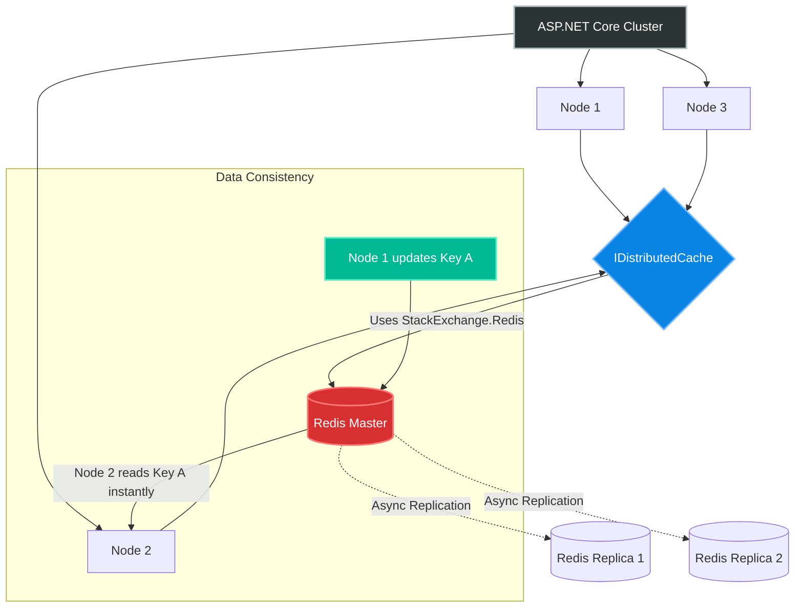

# 4.174 — IDistributedCache: Redis Integration

## PART 0 — Navigation & Context

```text
ASP.NET Core Domain Hierarchy
├── Performance & Reliability
│   ├── 4.172 Response Caching vs Output Caching
│   ├── 4.173 Output Caching Deep Dive (NET 7+)
│   └── 4.174 IDistributedCache Redis Integration ◄ YOU ARE HERE
└── Microservices Architecture
    └── Session State & Distributed Storage
```

**What you need before this:**
- Caching Fundamentals.
- Basic understanding of what Redis is (an in-memory, key-value data structure store).

**What this unlocks after:**
- Sharing Session State across a multi-node Kubernetes cluster.
- Distributed Rate Limiting and Output Caching.
- High-performance, highly available read models for Microservices.

**Why this matters to a production engineer at scale:**
If you have a 10-node Web API cluster, and you use `IMemoryCache` (local RAM caching), you have a severe fragmentation problem. Node A queries the database and caches the result. If the next 9 requests hit Nodes B through J, they *all* execute the exact same database query, caching 10 identical copies of the data across the cluster. When the data updates, you must figure out how to invalidate 10 separate local caches simultaneously (which is nearly impossible). `IDistributedCache` backed by Redis solves this. All 10 nodes talk to a single, central, sub-millisecond Redis server. One node queries the DB, writes to Redis, and the other 9 nodes instantly read the cached data. Your database load drops by 90%, and cache invalidation becomes atomic.

---

## PART 1 — The Core Mental Model

> **The Fundamental Rule**
> **`IMemoryCache` is isolated to the RAM of a single process; `IDistributedCache` is an abstraction that allows an entire cluster of microservices to read and write to a centralized, highly-available external memory store (typically Redis) using a consistent interface, ensuring Cache Coherence across the web farm.**

**The Plain-Language Analogy**
Imagine a team of 5 accountants working in the same office.
**`IMemoryCache`:** Each accountant has a personal notebook on their desk. When a client calls to ask for their account balance, the accountant calculates it, writes it in their own notebook, and tells the client. If the client calls back and gets a different accountant, the new accountant has to recalculate it from scratch because they can't see the first accountant's notebook.
**`IDistributedCache`:** The accountants share a massive whiteboard in the middle of the room. When the first accountant calculates the balance, they write it on the whiteboard. When the client calls back, regardless of which accountant picks up the phone, they just look at the whiteboard. The math is only done once.

**The Taxonomy Diagram**



---

## PART 2 — Deep Mechanics

### 1. The IDistributedCache Abstraction

Microsoft provides `IDistributedCache` in the `Microsoft.Extensions.Caching.Abstractions` namespace. It exposes very simple methods:
- `GetAsync(string key)` -> returns `byte[]`
- `SetAsync(string key, byte[] value, DistributedCacheEntryOptions options)`
- `RefreshAsync(string key)`
- `RemoveAsync(string key)`

It forces you to work with `byte[]` arrays. Unlike `IMemoryCache` which can store live C# object references (like a `DbContext`), a distributed cache *must* serialize data over the network.

### 2. StackExchange.Redis

To make `IDistributedCache` talk to Redis, Microsoft provides the `Microsoft.Extensions.Caching.StackExchangeRedis` package. Under the hood, this uses the famous `StackExchange.Redis` library (built by Stack Overflow). It uses a highly optimized, thread-safe, multiplexed connection to Redis. 

**Multiplexing:** You do *not* create a connection per HTTP request. The library uses a single, persistent TCP connection and interleaves thousands of concurrent requests over that single pipe to Redis, relying on Redis's single-threaded, non-blocking event loop to process them insanely fast.

### 3. Expiration Policies

When setting a cache key, you define its lifetime using `DistributedCacheEntryOptions`:
- **Absolute Expiration:** The data dies exactly at X time, regardless of how often it is accessed.
- **Sliding Expiration:** The data dies if it is *not accessed* for X time. If someone reads it, the timer resets. (Redis natively supports this via the `EXPIRE` command sent automatically during `Get` or `Refresh` calls).

### 4. Hybrid Caching (L1 + L2)

Redis is fast (1ms network hop), but Local RAM is faster (0.0001ms). 
In extreme high-performance systems, developers use Hybrid Caching (sometimes called L1/L2 caching or Two-Tier caching). 
- **L1 (IMemoryCache):** Holds data for 10 seconds locally.
- **L2 (Redis):** Holds data for 1 hour.
This prevents the network from being saturated by millions of Redis requests for highly "hot" keys, while still maintaining distributed consistency after the short 10-second window.

---

## PART 3 — Production Code Patterns

### Pattern 1: Wiring up Redis Configuration
Installing the package and configuring the dependency injection.

```bash
dotnet add package Microsoft.Extensions.Caching.StackExchangeRedis
```

```csharp
// Program.cs
builder.Services.AddStackExchangeRedisCache(options =>
{
    // The connection string (e.g., "localhost:6379,abortConnect=false")
    options.Configuration = builder.Configuration.GetConnectionString("Redis");
    
    // Optional: Adds a prefix to all keys to prevent collisions with other apps using the same Redis instance
    options.InstanceName = "MyApp_"; 
});
```

### Pattern 2: The Extension Method Helper (Serialization)
Because `IDistributedCache` forces you to use `byte[]`, you should write a generic extension method to handle JSON serialization automatically.

```csharp
public static class DistributedCacheExtensions
{
    public static async Task<T?> GetRecordAsync<T>(
        this IDistributedCache cache, 
        string recordId, 
        CancellationToken ct = default)
    {
        var jsonData = await cache.GetStringAsync(recordId, ct);
        if (jsonData is null) return default;
        return JsonSerializer.Deserialize<T>(jsonData);
    }

    public static async Task SetRecordAsync<T>(
        this IDistributedCache cache,
        string recordId,
        T data,
        TimeSpan? absoluteExpireTime = null,
        TimeSpan? slidingExpireTime = null,
        CancellationToken ct = default)
    {
        var options = new DistributedCacheEntryOptions
        {
            AbsoluteExpirationRelativeToNow = absoluteExpireTime ?? TimeSpan.FromMinutes(60),
            SlidingExpiration = slidingExpireTime
        };

        var jsonData = JsonSerializer.Serialize(data);
        await cache.SetStringAsync(recordId, jsonData, options, ct);
    }
}
```

### Pattern 3: The Cache-Aside Pattern
The most standard caching architecture. Read from Cache -> If Miss -> Read from DB -> Write to Cache -> Return.

```csharp
public class ProductService
{
    private readonly IDistributedCache _cache;
    private readonly ApplicationDbContext _db;

    public ProductService(IDistributedCache cache, ApplicationDbContext db)
    {
        _cache = cache;
        _db = db;
    }

    public async Task<ProductDto> GetProductAsync(int id, CancellationToken ct)
    {
        string cacheKey = $"Product_{id}";

        // 1. Attempt Cache Read
        var cachedProduct = await _cache.GetRecordAsync<ProductDto>(cacheKey, ct);
        if (cachedProduct is not null)
        {
            return cachedProduct; // Cache Hit!
        }

        // 2. Cache Miss: Read from Database
        var product = await _db.Products
            .Where(p => p.Id == id)
            .Select(p => new ProductDto { Id = p.Id, Name = p.Name })
            .FirstOrDefaultAsync(ct);

        if (product is not null)
        {
            // 3. Populate Cache
            await _cache.SetRecordAsync(
                recordId: cacheKey, 
                data: product, 
                absoluteExpireTime: TimeSpan.FromMinutes(5), 
                ct: ct);
        }

        return product;
    }
}
```

### Pattern 4: Using Redis for Output Caching (.NET 8+)
In .NET 8, Microsoft allowed the Output Caching middleware to natively use Redis instead of local RAM, enforcing Stampede Protection globally across the cluster!

```bash
dotnet add package Microsoft.AspNetCore.OutputCaching.StackExchangeRedis
```

```csharp
// Program.cs
builder.Services.AddOutputCache();

// ✅ CORRECT: Overrides the default local memory storage with Redis
builder.Services.AddStackExchangeRedisOutputCache(options =>
{
    options.Configuration = builder.Configuration.GetConnectionString("Redis");
});

var app = builder.Build();
app.UseOutputCache();

app.MapGet("/api/expensive", () => ...).CacheOutput();
```

### Pattern 5: Health Checks for Redis
If Redis goes down, your app should know.

```bash
dotnet add package AspNetCore.HealthChecks.Redis
```

```csharp
// Program.cs
builder.Services.AddHealthChecks()
    .AddRedis(builder.Configuration.GetConnectionString("Redis"), name: "RedisStore");

// Expose /health endpoint
app.MapHealthChecks("/health");
```

---

## PART 4 — Gotchas & Anti-Patterns

### Gotcha 1: Connection Multiplexer Exhaustion
If you bypass `IDistributedCache` and use `StackExchange.Redis.ConnectionMultiplexer` directly, you MUST register it as a Singleton.

// ⚠️ WRONG CODE
```csharp
public class RedisService
{
    public void DoWork() {
        // Creates a NEW TCP connection to Redis every HTTP request!
        using var redis = ConnectionMultiplexer.Connect("localhost"); 
        var db = redis.GetDatabase();
    }
}
```

// HTTP consequence (wrong path):
// The application opens 5,000 TCP connections to Redis in one second. Redis maxes out its connection limit (`maxclients`). The server runs out of ephemeral TCP ports. Socket Exhaustion crashes the API.

// ✅ CORRECT CODE
```csharp
// IDistributedCache handles this perfectly for you internally by making the multiplexer a Singleton.
// If using the raw driver, register it in DI:
builder.Services.AddSingleton<IConnectionMultiplexer>(sp => 
    ConnectionMultiplexer.Connect("localhost"));
```

### Gotcha 2: The `abortConnect=false` Parameter
If Redis is down when your ASP.NET Core application *starts*, the `ConnectionMultiplexer` will throw an exception during DI resolution, preventing the application from booting.

// ⚠️ WRONG CODE
```json
// appsettings.json
"ConnectionStrings": {
  "Redis": "redis-cluster.internal.net:6379"
}
```

// HTTP consequence (wrong path):
// Redis restarts for a 5-second patch exactly when Kubernetes restarts your API pods. The APIs fail to connect to Redis on boot, throw an exception, and crash loop permanently.

// ✅ CORRECT CODE
```json
// appsettings.json
"ConnectionStrings": {
  "Redis": "redis-cluster.internal.net:6379,abortConnect=false"
}
```
// WHY: `abortConnect=false` tells the Multiplexer: "If Redis is down, boot the API anyway. I will throw exceptions when you call Get/Set, but I will secretly keep trying to reconnect in the background so the app recovers automatically when Redis comes back online."

### Gotcha 3: Caching Entity Framework Tracking Objects
You cannot serialize an EF Core entity that has cyclic references or proxy proxies.

// ⚠️ WRONG CODE
```csharp
var order = await _db.Orders.Include(o => o.Customer).FirstAsync();
await _cache.SetRecordAsync($"order_{id}", order);
```

// HTTP consequence (wrong path):
// `JsonException: A possible object cycle was detected.` `Order.Customer.Order.Customer...`

// ✅ CORRECT CODE
```csharp
// ALWAYS map EF Core entities to flat DTOs (Data Transfer Objects) BEFORE serializing to Redis.
var dto = new OrderDto { Id = order.Id, CustomerName = order.Customer.Name };
await _cache.SetRecordAsync($"order_{id}", dto);
```

### Gotcha 4: Missing Cache Fallback (Fail-Open vs Fail-Closed)
If Redis goes down, `_cache.GetStringAsync` throws a `RedisConnectionException`. Should your API crash, or should it query the database?

// ⚠️ WRONG CODE
```csharp
// If Redis throws, the API returns HTTP 500.
var cached = await _cache.GetStringAsync("key"); 
```

// ✅ CORRECT CODE
```csharp
string cached = null;
try {
    cached = await _cache.GetStringAsync("key", ct);
} catch (RedisConnectionException ex) {
    _logger.LogWarning(ex, "Redis is down. Falling back to database.");
}
// Proceed to database query
```
*Note: If your database CANNOT handle the full un-cached load, falling back will cause a cascading failure (Redis dies -> Database crushed -> Entire system dies). In high-scale systems, sometimes returning an HTTP 503 (Fail-Closed) is safer than falling back to the DB.*

### Gotcha 5: Large Payloads
Redis is blazing fast because it is single-threaded and keeps everything in RAM.

// ⚠️ WRONG CODE
```csharp
// Developer caches a 50MB JSON array of all historical transactions
await _cache.SetStringAsync("AllTransactions", massiveJson);
```

// HTTP consequence (wrong path):
// Storing 50MB in Redis blocks the single thread while allocating network buffers. During this time, NO OTHER request can read or write to Redis. You create artificial latency spikes across the entire microservice architecture.

// ✅ CORRECT CODE
```csharp
// Cache payloads should be small (ideally < 100KB, strictly < 1MB). 
// If you need to cache large files/reports, use Azure Blob Storage or AWS S3, and cache the *URL* to the blob in Redis.
```

---

## PART 5 — Performance Implications

### Request Pipeline Characteristics

| Scenario | Network Hop | Allocations | Approx Latency Impact | Recommendation |
|---|---|---|---|---|
| `IMemoryCache` | None | Low | < 0.01ms | Fastest, but lacks cluster consistency. |
| `IDistributedCache` (Redis) | Yes | Medium (JSON) | 1ms - 3ms | Standard for microservice state. |
| DB Query (No Cache) | Yes | High | 20ms - 200ms | Bottleneck. Must be protected. |

### BenchmarkDotNet Code

*(Benchmarking MemoryCache vs DistributedCache serialization overhead)*

```csharp
using BenchmarkDotNet.Attributes;
using Microsoft.Extensions.Caching.Memory;
using Microsoft.Extensions.Caching.Distributed;
using System.Text.Json;

[MemoryDiagnoser]
public class CacheTypeBenchmark
{
    private IMemoryCache _memoryCache;
    private MemoryDistributedCache _distributedCache; // Mocking Redis network overhead out
    private MyDto _data = new MyDto { Name = "Test" };

    public class MyDto { public string Name { get; set; } }

    [GlobalSetup]
    public void Setup()
    {
        _memoryCache = new MemoryCache(new MemoryCacheOptions());
        _distributedCache = new MemoryDistributedCache(new OptionsWrapper<MemoryDistributedCacheOptions>(new MemoryDistributedCacheOptions()));
        
        _memoryCache.Set("key", _data);
        _distributedCache.Set("key", JsonSerializer.SerializeToUtf8Bytes(_data));
    }

    [Benchmark(Baseline = true)]
    public MyDto MemoryCacheHit()
    {
        // 0 allocations, returns exact memory pointer
        return _memoryCache.Get<MyDto>("key"); 
    }

    [Benchmark]
    public MyDto DistributedCacheHit()
    {
        // Allocates byte array, parses JSON
        var bytes = _distributedCache.Get("key");
        return JsonSerializer.Deserialize<MyDto>(bytes);
    }
}

// Expected output (approximate, .NET 8, x64, local):
// Method               | Mean       | Error     | StdDev    | Gen0   | Allocated |
// -------------------- |-----------:|----------:|----------:|-------:|----------:|
// MemoryCacheHit       |  12.5 ns   |  0.15 ns  |  0.14 ns  | 0.0000 |       0 B |
// DistributedCacheHit  | 240.1 ns   |  2.50 ns  |  2.20 ns  | 0.0315 |     184 B |
```

**When to Care:** `IDistributedCache` incurs the cost of JSON Serialization/Deserialization and a network hop (usually ~1ms in Azure/AWS). It is roughly 20x slower than `IMemoryCache` from a compute perspective, but infinitely faster than hitting SQL Server. You use Redis not for raw compute speed, but for **Cluster Consistency**.

---

## PART 6 — Interview Arsenal

### A. The Question Bank

**Question 1:** "We have an API scaled to 10 instances behind a load balancer. We use `IMemoryCache` to store product details. When an Admin updates a product's price, users are complaining they still see the old price. What is happening and how do we fix it?"
- **Average Answer:** "The cache hasn't expired yet. Clear the cache."
- **Why That's Insufficient:** Doesn't address the distributed system fragmentation.
- **Great Answer:** "This is Cache Fragmentation. `IMemoryCache` stores data in the local RAM of each individual instance. When the Admin updates the price, they hit Instance 1, updating the DB and clearing Instance 1's cache. However, Instances 2 through 10 still hold the old price in their local RAM. The load balancer sends subsequent user requests to Instances 2-10, serving stale data. To fix this, we must migrate from `IMemoryCache` to `IDistributedCache` backed by Redis. This moves the cache out of local RAM and into a centralized, highly-available cluster. When the Admin updates the price, the API overwrites the Redis key. Instantly, all 10 API instances will read the new price."

**Question 2:** "Why does `IDistributedCache` force you to work with `byte[]` arrays or strings, whereas `IMemoryCache` lets you store full C# objects?"
- **Average Answer:** "Because Redis only supports bytes."
- **Why That's Insufficient:** Needs to explain the physical boundary of processes.
- **Great Answer:** "`IMemoryCache` lives inside the same CLR process as the application. When you put an object into it, it just holds a memory pointer reference to that object on the managed heap. `IDistributedCache` communicates with an external process (like Redis) over a TCP network. You cannot send a C# memory pointer over a network. The object must be serialized into a platform-agnostic format (like JSON or Protobuf, which are ultimately just `byte[]`) before transmission, and deserialized on the other side."

**Question 3:** "If Redis crashes, our application throws exceptions on every request because `await _cache.GetAsync()` fails. How do you design the caching layer to be resilient against Redis outages?"
- **Average Answer:** "Wrap it in a try/catch block."
- **Why That's Insufficient:** Needs to address the architectural choice of Fallback vs Circuit Breaker.
- **Great Answer:** "First, we add `abortConnect=false` to the Redis connection string so the app boots even if Redis is down. Second, we wrap `GetAsync` in a `try/catch(RedisConnectionException)`. When caught, we log a warning and fall back to querying the primary database. However, this introduces a new risk: if Redis was shielding the DB from 10,000 RPS, falling back will instantly crush the DB. To prevent a cascading failure, we should implement a Polly Circuit Breaker around the database fallback, shedding excess load and returning 503 Service Unavailable if the DB cannot handle the uncached traffic."

### B. The Trick Questions

**Trick Question:** "I added `services.AddDistributedMemoryCache()` in `Program.cs`. Now I can share cache state across my 5 Kubernetes pods without paying for Redis, right?"
- **The Trap:** Misunderstanding the mock provider.
- **The Correct Answer:** "No. `AddDistributedMemoryCache()` is a mock implementation provided by Microsoft strictly for local development and unit testing. It implements the `IDistributedCache` interface but stores the data in the local RAM of the process. It does absolutely nothing to share state across pods. In production, you MUST swap it out for `AddStackExchangeRedisCache()`."

**Trick Question:** "Can I use `IDistributedCache` to store the user's uploaded image file (5MB) temporarily before saving it to S3?"
- **The Trap:** Redis payload limits and thread blocking.
- **The Correct Answer:** "You can, but you absolutely shouldn't. Redis operates on a single-threaded event loop. If you send a 5MB payload over the network, Redis must allocate buffers and process that 5MB payload, blocking that single thread from processing any other micro-requests (like auth token checks) during that time. Large payloads cause severe latency spikes across the entire architecture. Store large files locally on disk or directly to S3, and cache only the metadata or the URL."

### C. Red Flags to Avoid
- 🚩 **"I instantiate a new `ConnectionMultiplexer` every time I need to talk to Redis."** (Causes socket exhaustion and brings down the API within minutes under load).
- 🚩 **"I serialize my EF Core DbContext entities into Redis."** (Leads to cycle exceptions, lazy loading bugs, and massive JSON payloads).

---

## PART 7 — Decision Framework

```mermaid
graph TD
    A[Caching Strategy] --> B{Do you have more than 1 Web API instance?}
    
    B -->|No - Monolith| C[Use IMemoryCache]
    
    B -->|Yes - Cluster| D{Is the data mutable and user-facing?}
    
    D -->|No - Static Lookup Data| E[IMemoryCache with short TTL]
    
    D -->|Yes - e.g., Pricing/Cart| F[Use IDistributedCache Redis]
    
    F --> G{Payload Size?}
    G -->|< 100 KB| H[Serialize to JSON and store in Redis]
    G -->|> 1 MB| I[Store in Blob Storage, store URL in Redis]
    
    style A fill:#2d3436,stroke:#fff
    style C fill:#0984e3,stroke:#fff
    style E fill:#0984e3,stroke:#fff
    style F fill:#00b894,stroke:#fff
    style H fill:#00b894,stroke:#fff
    style I fill:#d63031,stroke:#fff
```



---

## PART 8 — Self-Check

### A. Conceptual Questions
1. How does `IDistributedCache` solve the Cache Coherence problem in a web farm?
2. Why is JSON serialization mandatory when moving from `IMemoryCache` to `IDistributedCache`?
3. What is the purpose of the `abortConnect=false` parameter in the Redis connection string?
4. Why is `AddDistributedMemoryCache` dangerous if accidentally deployed to production?
5. How does a single-threaded Redis instance handle 100,000 requests per second?
6. What is the danger of falling back to the database when a Redis connection fails?
7. How do you implement Redis as the backing store for ASP.NET Core Output Caching?
8. What is the difference between Absolute Expiration and Sliding Expiration?

### B. Code Puzzles

**Puzzle 1: The Infinite Cache**
```csharp
await _cache.SetStringAsync("key", "value");
```
*Scenario:* The developer forgot to pass `DistributedCacheEntryOptions`.
<details>
<summary>Answer</summary>
By default, if you omit expiration options, the cache key lives indefinitely (until Redis runs out of RAM and evicts it based on its LRU policy). You should always provide an absolute or sliding expiration.
</details>

**Puzzle 2: The Socket Killer**
```csharp
public async Task<string> GetConfig() {
    var redis = await ConnectionMultiplexer.ConnectAsync("localhost");
    var db = redis.GetDatabase();
    return await db.StringGetAsync("config");
}
```
*Scenario:* An API uses this method on every request.
<details>
<summary>Answer</summary>
It opens a new TCP connection on every request and never disposes of it. Ports are exhausted, memory leaks, and Redis hits its connection limit.
*Fix:* Inject `IDistributedCache`, which manages a Singleton multiplexer internally.
</details>

**Puzzle 3: The Cyclic Json**
```csharp
var company = await _db.Companies.Include(c => c.Employees).FirstAsync();
await _cache.SetRecordAsync("comp", company);
```
*Scenario:* `Employee` has a navigation property back to `Company`.
<details>
<summary>Answer</summary>
The JSON serializer detects an infinite loop: Company -> Employee -> Company. It throws a `JsonException`.
*Fix:* Map the EF Core entity to a flat DTO (Data Transfer Object) before serializing.
</details>

**Puzzle 4: The Stale Session**
```csharp
var opts = new DistributedCacheEntryOptions { SlidingExpiration = TimeSpan.FromMinutes(20) };
await _cache.SetStringAsync("Session_123", "data", opts);

// 15 minutes later...
var data = await _db.QueryAsync("SELECT * ..."); // Direct DB query bypassing cache
```
*Scenario:* The user is actively using the app, but after 20 minutes, their session drops.
<details>
<summary>Answer</summary>
Sliding expiration only resets when the item is *read* from the cache (`GetAsync` or `RefreshAsync`). If the app performs other actions without querying that specific cache key, the 20-minute timer expires, and Redis deletes the data.
*Fix:* Ensure critical middleware reads/refreshes the session token on every HTTP request, or use Absolute Expiration with manual updates.
</details>

---

## PART 9 — Connections & Resources

### A. Related Topics Table

| Topic | Why It Connects |
|---|---|
| [[4.173 — Output Caching Deep Dive (NET 7+)]] | Relies on Redis to enforce Stampede Protection across a multi-node cluster. |
| [[4.171 — Rate Limiting & Throttling Architecture]] | Distributed Rate Limiters use Redis to enforce global quotas. |
| [[4.250 — Microservices Architecture]] | Redis is the backbone of state sharing between stateless microservices. |

### B. Books

| Book | Chapters | Why These Chapters |
|---|---|---|
| ASP.NET Core in Action, 3rd Ed | Chapter 17: Performance | Excellent breakdown of configuring the `ConnectionMultiplexer`. |
| Pro ASP.NET Core 6 | Chapter 21: Advanced Features | Covers `IDistributedCache` abstractions and Fallback patterns. |

### C. Essential Articles & Docs
- [Microsoft Docs: Distributed caching in ASP.NET Core](https://learn.microsoft.com/en-us/aspnet/core/performance/caching/distributed)
- [StackExchange.Redis Documentation](https://stackexchange.github.io/StackExchange.Redis/)
- [Marc Gravell (Creator of Dapper/SE.Redis): Redis best practices](https://blog.marcgravell.com/)

> [!NOTE]
> **Template Meta-Note**
> Part 0: Context & Prerequisites. Part 1: Core Mental Model. Part 2: Deep Mechanics & Pipeline. Part 3: Production Code. Part 4: Gotchas. Part 5: Performance. Part 6: Interview Arsenal. Part 7: Decision Framework. Part 8: Puzzles. Part 9: Resources.
