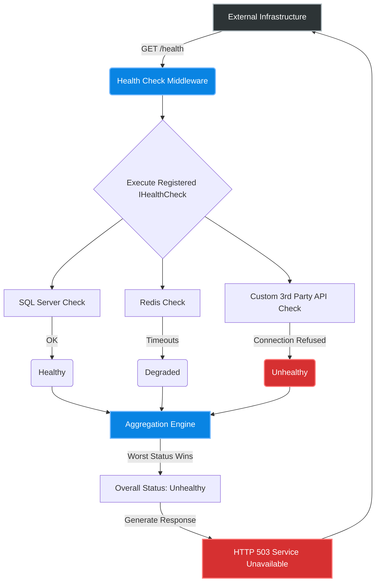

# 4.175 — Health Checks Architecture

## PART 0 — Navigation & Context

```text
ASP.NET Core Domain Hierarchy
├── Observability & Telemetry
│   ├── 4.175 Health Checks Architecture ◄ YOU ARE HERE
│   ├── 4.176 Kubernetes Liveness & Readiness Probes
│   └── 4.177 Serilog & Structured Logging
└── Deployment & Operations
```

**What you need before this:**
- Basic understanding of what a Load Balancer (like NGINX, AWS ALB) or Container Orchestrator (Kubernetes) does.
- Familiarity with Dependency Injection (`IServiceCollection`).

**What this unlocks after:**
- Configuring Kubernetes Liveness and Readiness probes to enable zero-downtime deployments.
- Building custom circuit breakers that respond to degraded dependencies.
- Creating unified status dashboards for microservice ecosystems.

**Why this matters to a production engineer at scale:**
If your API relies on SQL Server, and SQL Server crashes, your API will start returning HTTP 500 errors to every single user. The load balancer (AWS ALB) doesn't inherently know your API is broken; it just sees an API that accepts TCP connections and returns HTTP responses. It will happily keep sending traffic to the broken nodes. 
Health Checks provide a standardized, lightweight HTTP endpoint (e.g., `/health`) that load balancers and orchestrators ping constantly. If the API returns a `200 OK`, the load balancer sends it traffic. If the API returns a `503 Service Unavailable` (because its health check detected that SQL Server is down), the load balancer instantly removes the node from the rotation. It is the fundamental mechanism that prevents cascading failures and enables self-healing infrastructure.

---

## PART 1 — The Core Mental Model

> **The Fundamental Rule**
> **A Health Check is not just a ping to see if the HTTP server is alive; it is an extensible evaluation pipeline where an application actively probes its own critical dependencies (Databases, Redis, external APIs), aggregates their statuses into a single verdict (Healthy, Degraded, or Unhealthy), and exposes that verdict to external infrastructure managers.**

**The Plain-Language Analogy**
Imagine a Restaurant (The API).
**No Health Checks:** The front door is unlocked. A customer walks in, sits down, and orders a steak. The waiter walks to the kitchen, discovers the stove is broken, and comes back 10 minutes later to tell the customer they can't eat. The customer is furious. Meanwhile, the hostess keeps seating new customers.
**With Health Checks:** Before unlocking the door, the Restaurant Manager (The Infrastructure) asks the Chef (The Health Check Middleware), "Are you ready?" The Chef checks the stove (SQL Server), the fridge (Redis), and the delivery truck (External API). If the stove is broken, the Chef says "Unhealthy". The Manager locks the door and puts up a "Closed for Maintenance" sign. No customers are seated, and no time is wasted.

**The Taxonomy Diagram**



---

## PART 2 — Deep Mechanics

### 1. The Three States
The `HealthStatus` enum defines three exact states:
- **Healthy (200 OK):** The component is fully functional.
- **Degraded (200 OK):** The component is functioning, but slowly or with issues. (e.g., Query took 2 seconds instead of 10ms. Still usable, but needs attention).
- **Unhealthy (503 Service Unavailable):** The component is completely broken or inaccessible.

When the middleware aggregates multiple checks, the **worst status wins**. If 99 checks are Healthy and 1 is Unhealthy, the overall status is Unhealthy.

### 2. The Abstraction: IHealthCheck
Every check implements `IHealthCheck`, requiring a single method: `CheckHealthAsync`. It returns a `HealthCheckResult`.
The ASP.NET Core ecosystem relies heavily on the open-source library `AspNetCore.Diagnostics.HealthChecks`, which provides pre-built `IHealthCheck` implementations for almost every database and service in existence (SQL Server, Postgres, Redis, RabbitMQ, Kafka, AWS S3, etc.).

### 3. Caching and Throttling (The Observer Effect)
If a load balancer pings `/health` every 5 seconds, and you have 10 nodes, that's 2 database queries per second just for health checks. If you have 100 nodes, that's 20 queries/sec.
Health checks can inadvertently DDoS your own database. To prevent this, health checks must be fast, lightweight (e.g., `SELECT 1` in SQL), and often wrapped in caching layers if queried aggressively by external monitors like Prometheus.

---

## PART 4 — Production Code Patterns

### Pattern 1: Basic Setup & Pre-built Checks
Using the community `AspNetCore.Diagnostics.HealthChecks` packages to monitor SQL Server and Redis without writing any custom logic.

```bash
dotnet add package AspNetCore.HealthChecks.SqlServer
dotnet add package AspNetCore.HealthChecks.Redis
```

```csharp
// Program.cs
builder.Services.AddHealthChecks()
    // 1. Add SQL Server check (Executes 'SELECT 1;')
    .AddSqlServer(
        connectionString: builder.Configuration.GetConnectionString("DefaultDB"),
        name: "sql_database",
        failureStatus: HealthStatus.Unhealthy,
        tags: new[] { "db", "sql", "ready" })
        
    // 2. Add Redis check (Executes 'PING')
    .AddRedis(
        redisConnectionString: builder.Configuration.GetConnectionString("Redis"),
        name: "redis_cache",
        tags: new[] { "cache", "ready" });

var app = builder.Build();

// 3. Map the endpoint
// This handles GET requests to /health and returns "Healthy" or "Unhealthy" (plaintext)
app.MapHealthChecks("/health");

app.Run();
```

### Pattern 2: Custom IHealthCheck Implementation
When you depend on a niche 3rd party REST API (e.g., a payment gateway), you must write your own logic to determine if it is healthy.

```csharp
public class PaymentGatewayHealthCheck : IHealthCheck
{
    private readonly HttpClient _httpClient;

    public PaymentGatewayHealthCheck(IHttpClientFactory httpClientFactory)
    {
        _httpClient = httpClientFactory.CreateClient("PaymentGateway");
    }

    public async Task<HealthCheckResult> CheckHealthAsync(
        HealthCheckContext context, 
        CancellationToken cancellationToken = default)
    {
        try
        {
            // E.g., hitting the Stripe or PayPal status endpoint
            var response = await _httpClient.GetAsync("/api/status", cancellationToken);

            if (response.IsSuccessStatusCode)
            {
                return HealthCheckResult.Healthy("Payment Gateway is reachable.");
            }

            return HealthCheckResult.Degraded(
                $"Payment Gateway returned {response.StatusCode}. Payments may fail.");
        }
        catch (Exception ex)
        {
            // Complete network failure
            return new HealthCheckResult(
                context.Registration.FailureStatus, 
                description: "Cannot connect to Payment Gateway.", 
                exception: ex);
        }
    }
}

// Program.cs
builder.Services.AddHttpClient("PaymentGateway", client => 
    client.BaseAddress = new Uri("https://api.stripe.com"));

builder.Services.AddHealthChecks()
    .AddCheck<PaymentGatewayHealthCheck>(
        "stripe_gateway",
        failureStatus: HealthStatus.Degraded, // Don't take down the WHOLE API just because Stripe is down!
        tags: new[] { "external", "payments" });
```

### Pattern 3: Rich JSON Responses
By default, `/health` just returns the plaintext word `"Healthy"`. Modern monitoring systems (like Datadog or Prometheus) expect JSON payloads detailing *which* specific component failed.

```csharp
using Microsoft.AspNetCore.Diagnostics.HealthChecks;
using Microsoft.Extensions.Diagnostics.HealthChecks;
using System.Text.Json;

app.MapHealthChecks("/health/detail", new HealthCheckOptions
{
    // Write a custom JSON response format
    ResponseWriter = async (context, report) =>
    {
        context.Response.ContentType = "application/json";
        
        var response = new
        {
            Status = report.Status.ToString(),
            TotalDurationMs = report.TotalDuration.TotalMilliseconds,
            Dependencies = report.Entries.Select(e => new
            {
                Name = e.Key,
                Status = e.Value.Status.ToString(),
                DurationMs = e.Value.Duration.TotalMilliseconds,
                Error = e.Value.Exception?.Message
            })
        };

        await JsonSerializer.SerializeAsync(context.Response.Body, response);
    }
});
```

*Sample JSON Output:*
```json
{
  "Status": "Unhealthy",
  "TotalDurationMs": 150.5,
  "Dependencies": [
    {
      "Name": "sql_database",
      "Status": "Healthy",
      "DurationMs": 12.2,
      "Error": null
    },
    {
      "Name": "redis_cache",
      "Status": "Unhealthy",
      "DurationMs": 138.3,
      "Error": "No connection is available to service this operation: PING"
    }
  ]
}
```

### Pattern 4: Segregation via Tags (Liveness vs Readiness)
A critical pattern for Kubernetes.
- **Liveness (`/health/live`):** Is the app process running? (CPU isn't deadlocked). If this fails, Kubernetes *restarts* the container.
- **Readiness (`/health/ready`):** Is the app ready to process traffic? (Database is connected). If this fails, Kubernetes *stops sending traffic* to the pod, but does NOT restart it.

```csharp
// Program.cs
builder.Services.AddHealthChecks()
    // Liveness checks should be extremely lightweight. No DB connections!
    .AddCheck("self", () => HealthCheckResult.Healthy(), tags: new[] { "live" })
    
    // Readiness checks evaluate dependencies
    .AddSqlServer(..., tags: new[] { "ready" });

var app = builder.Build();

// Endpoint 1: For Kubernetes Liveness Probe
app.MapHealthChecks("/health/live", new HealthCheckOptions
{
    Predicate = check => check.Tags.Contains("live")
});

// Endpoint 2: For Kubernetes Readiness Probe
app.MapHealthChecks("/health/ready", new HealthCheckOptions
{
    Predicate = check => check.Tags.Contains("ready")
});
```

### Pattern 5: Health Checks UI Dashboard
For human-readable dashboards, use the `AspNetCore.HealthChecks.UI` package.

```bash
dotnet add package AspNetCore.HealthChecks.UI
dotnet add package AspNetCore.HealthChecks.UI.Client
dotnet add package AspNetCore.HealthChecks.UI.InMemory.Storage
```

```csharp
// Program.cs
// 1. Add the UI Services
builder.Services.AddHealthChecksUI(setup =>
{
    setup.AddHealthCheckEndpoint("My API", "/health/detail");
    // Can add multiple microservices here!
})
.AddInMemoryStorage(); // Where UI history is stored

var app = builder.Build();

// 2. The API must output the specific format the UI expects
app.MapHealthChecks("/health/detail", new HealthCheckOptions
{
    Predicate = _ => true,
    ResponseWriter = UIResponseWriter.WriteHealthCheckUIResponse
});

// 3. Map the actual dashboard UI at /health-ui
app.MapHealthChecksUI(options =>
{
    options.UIPath = "/health-ui";
});
```

---

## PART 4 — Gotchas & Anti-Patterns

### Gotcha 1: Fatal Dependencies vs Optional Dependencies
A common mistake is marking a non-critical dependency as `FailureStatus = HealthStatus.Unhealthy`.

// Scenario: Your API is an E-Commerce store. It relies on SQL Server (Critical) and a Marketing Mailchimp API (Optional).

// ⚠️ WRONG CODE
```csharp
builder.Services.AddHealthChecks()
    .AddSqlServer(...)
    .AddCheck<MailchimpHealthCheck>("mailchimp"); // Default failure status is Unhealthy!
```

// HTTP consequence (wrong path):
// Mailchimp goes down for 5 minutes. The health check evaluates Mailchimp as Unhealthy. The overall API status becomes `Unhealthy` (503). The Load Balancer removes all your nodes from rotation. Your entire E-Commerce store goes completely offline and stops accepting orders, just because the marketing newsletter service had a blip.

// ✅ CORRECT CODE
```csharp
builder.Services.AddHealthChecks()
    .AddSqlServer(...)
    .AddCheck<MailchimpHealthCheck>("mailchimp", failureStatus: HealthStatus.Degraded);
// If Mailchimp fails, the API status is Degraded (200 OK). Load balancer keeps sending traffic.
```

### Gotcha 2: Heavy Database Queries
Writing a custom SQL health check that runs a complex join to ensure data integrity.

// ⚠️ WRONG CODE
```csharp
var count = await dbContext.Orders.CountAsync(); // Counts 50 million rows!
return count > 0 ? HealthCheckResult.Healthy() : HealthCheckResult.Unhealthy();
```

// HTTP consequence (wrong path):
// The load balancer pings this every 5 seconds. The database is constantly table-scanning 50 million rows, burning 100% CPU.

// ✅ CORRECT CODE
```csharp
// The AddSqlServer community package automatically executes "SELECT 1;".
// Health checks should test *Connectivity*, not *Data Integrity*.
```

### Gotcha 3: Health Checks causing Application Restarts
Mixing up Liveness and Readiness tags in Kubernetes.

// ⚠️ WRONG CODE
// Developer sets the Kubernetes Liveness Probe to hit `/health`, which checks SQL Server.

// HTTP consequence (wrong path):
// SQL Server is rebooted for patching (takes 30 seconds). 
// The API health check fails. 
// Kubernetes sees the *Liveness* probe fail. It assumes the API process has deadlocked. It forcibly kills and restarts the API pod. It boots, fails again, restarts again (CrashLoopBackOff). When SQL Server comes back online, the API pods are dead and take several minutes to recover.

// ✅ CORRECT CODE
// Liveness probes should ONLY check if the CLR/Process is responsive (Pattern 4).
// Readiness probes check dependencies. If SQL goes down, Readiness fails, traffic is paused, but the pod stays alive waiting for SQL to return.

### Gotcha 4: Exposing Health Checks to the Public Internet
`/health/detail` often outputs database names, connection server IPs, and internal stack traces.

// ⚠️ WRONG CODE
```csharp
app.MapHealthChecks("/health/detail"); // Publicly accessible to anyone!
```

// HTTP consequence (wrong path):
// Attacker queries `/health/detail` and discovers you are using an outdated version of Redis at `10.0.5.42`.

// ✅ CORRECT CODE
```csharp
// Bind health checks to a specific administrative port that is NOT exposed to the internet.
app.MapHealthChecks("/health/detail").RequireHost("localhost", "10.0.*"); 

// OR, require authorization (though load balancers usually can't send JWTs easily)
app.MapHealthChecks("/health/detail").RequireAuthorization("AdminPolicy");
```

---

## PART 5 — Performance Implications

### Request Pipeline Characteristics

| Scenario | Network Hop | Allocations | Approx Latency Impact | Recommendation |
|---|---|---|---|---|
| Liveness Ping (`self`) | None | 0 | < 1ms | Run every 5-10 seconds. |
| Readiness Ping (`db`) | Yes | Low | DB Ping Latency (~2ms) | Run every 10-30 seconds. |
| Deep API Health Check | Yes | Medium | > 100ms | Run infrequently (every 5 mins). |

### BenchmarkDotNet Code

*(Benchmarking the overhead of the Health Check Engine itself)*

```csharp
using BenchmarkDotNet.Attributes;
using Microsoft.Extensions.Diagnostics.HealthChecks;

[MemoryDiagnoser]
public class HealthCheckBenchmark
{
    private DefaultHealthCheckService _service;

    [GlobalSetup]
    public void Setup()
    {
        var services = new ServiceCollection();
        services.AddLogging();
        services.AddHealthChecks()
                .AddCheck("FastCheck", () => HealthCheckResult.Healthy());
        
        var provider = services.BuildServiceProvider();
        _service = (DefaultHealthCheckService)provider.GetRequiredService<HealthCheckService>();
    }

    [Benchmark]
    public async Task RunChecks()
    {
        // Simulates the internal engine aggregating results
        var report = await _service.CheckHealthAsync();
    }
}

// Expected output (approximate, .NET 8, x64, local):
// Method    | Mean      | Error     | StdDev    | Gen0   | Allocated |
// --------- |----------:|----------:|----------:|-------:|----------:|
// RunChecks |  2.45 us  |  0.02 us  |  0.02 us  | 0.1144 |     960 B |
```

**When to Care:** The internal engine overhead is negligible (microseconds). The performance risk of Health Checks lies *entirely* in what the individual `IHealthCheck` implementations actually do.

---

## PART 6 — Interview Arsenal

### A. The Question Bank

**Question 1:** "We have an API that connects to SQL Server. When SQL Server goes down, users start seeing HTTP 500 errors. How can we configure our infrastructure so that the load balancer stops sending traffic to the API during the outage, but resumes automatically when SQL Server comes back?"
- **Average Answer:** "Write a script that pings the database."
- **Why That's Insufficient:** Ignores the built-in ASP.NET Core Health Checks standard.
- **Great Answer:** "We implement ASP.NET Core Health Checks. We add the `AspNetCore.HealthChecks.SqlServer` package and register it in `Program.cs`. We map this to an endpoint like `/health/ready`. When SQL Server is down, the middleware intercepts the check and aggregates the status to `Unhealthy`, returning an HTTP 503. We configure the AWS ALB (or Kubernetes Readiness Probe) to ping `/health/ready` every 10 seconds. When it sees the 503, it automatically removes the node from the routing pool. The node continues to poll SQL Server in the background. Once SQL recovers, `/health/ready` returns 200 OK, and the load balancer automatically adds the node back into rotation."

**Question 2:** "What is the difference between a Liveness Probe and a Readiness Probe in Kubernetes, and how do you configure ASP.NET Core to support both?"
- **Average Answer:** "Liveness means it's alive, Readiness means it's ready. You map two endpoints."
- **Why That's Insufficient:** Doesn't explain *how* to separate the checks using Tags, nor the catastrophic consequences of mixing them up.
- **Great Answer:** "A Liveness probe tells Kubernetes if the application process is deadlocked and needs to be forcefully restarted. A Readiness probe tells Kubernetes if the app is ready to process traffic (e.g., its DB connections are established). If a Readiness probe fails, traffic is paused, but the pod is NOT restarted. To support this, we use Health Check Tags. We register a simple 'self' check tagged as `live`, and we register our database/Redis checks tagged as `ready`. We then map two separate endpoints using `HealthCheckOptions.Predicate`, filtering by tag. If we accidentally put the database check in the Liveness probe, a temporary database outage will cause Kubernetes to massacre all our API pods in an infinite restart loop."

**Question 3:** "If you have 10 separate `IHealthCheck` registrations, and 9 return `Healthy`, but 1 returns `Degraded`, what is the final HTTP Status Code returned to the load balancer?"
- **Average Answer:** "It returns 500."
- **Why That's Insufficient:** Doesn't know the difference between Degraded and Unhealthy mapping.
- **Great Answer:** "The Health Check engine uses a 'worst status wins' aggregation. The worst status here is `Degraded`. By default, the middleware maps `Degraded` to an HTTP 200 OK (just like `Healthy`), but the JSON/Text body will indicate the degraded state. It does this because 'Degraded' means the application is still functioning, so the load balancer should *not* remove it from the pool. If that 1 check had returned `Unhealthy`, the engine would map it to an HTTP 503 Service Unavailable."

### B. The Trick Questions

**Trick Question:** "I wrote an `IHealthCheck` that queries a 3rd party API. The 3rd party API threw a `TaskCanceledException` (Timeout) during the check. Does my application crash?"
- **The Trap:** Believing unhandled exceptions in Health Checks crash the Host.
- **The Correct Answer:** "No. The Health Check engine wraps all `IHealthCheck.CheckHealthAsync` executions in a try/catch block. If an unhandled exception occurs inside your custom check, the engine catches it, logs it, and automatically converts that specific check's status to `Unhealthy` (or whatever the configured `FailureStatus` is), safely generating the 503 response without crashing the application process."

### C. Red Flags to Avoid
- 🚩 **"I put `[AllowAnonymous]` on my health checks so pinging services can reach it."** (While necessary, if you don't restrict it by Port or Host, you leak internal infrastructure details to the public internet).
- 🚩 **"My database health check calls a Stored Procedure that runs business logic to ensure the data is correct."** (Health checks should test connectivity (`SELECT 1`), not business logic. Heavy logic causes DDoS).

---

## PART 7 — Decision Framework

```mermaid
graph TD
    A[Add Dependency to API] --> B{Is it strictly required for the API to function?}
    
    B -->|Yes e.g. Primary DB| C[Register Check with FailureStatus = Unhealthy]
    B -->|No e.g. Marketing API| D[Register Check with FailureStatus = Degraded]
    
    C --> E{Apply Tags}
    D --> E
    
    E --> F[Tag as 'ready']
    
    G[Add Basic Self Check] --> H[Tag as 'live']
    
    F --> I[Map /health/ready endpoint]
    H --> J[Map /health/live endpoint]
    
    I --> K[Configure Load Balancer / K8s Readiness]
    J --> L[Configure K8s Liveness Probe]
    
    style A fill:#2d3436,stroke:#fff
    style C fill:#d63031,stroke:#fff
    style D fill:#00b894,stroke:#fff
    style I fill:#0984e3,stroke:#fff
    style J fill:#0984e3,stroke:#fff
```



---

## PART 8 — Self-Check

### A. Conceptual Questions
1. Why does an API need a Health Check endpoint if a Load Balancer can already test if TCP port 80/443 is open?
2. What are the three possible `HealthStatus` values?
3. How do you prevent a secondary/optional dependency from taking your API offline when it fails?
4. What is the fundamental difference between Liveness and Readiness tags?
5. How does the Health Checks middleware map `HealthStatus.Degraded` to an HTTP status code by default?
6. Why is it dangerous to execute heavy `COUNT(*)` queries in a health check?
7. How does an `IHealthCheck` behave if it throws an unhandled exception?
8. What library is the industry standard for pre-built .NET health checks?

### B. Code Puzzles

**Puzzle 1: The Invisible Check**
```csharp
builder.Services.AddHealthChecks().AddSqlServer("...");
// ...
app.MapGet("/health", () => "I am alive!");
```
*Scenario:* Load balancer pings `/health` and gets 200 OK. Later, SQL Server dies. Load balancer still gets 200 OK.
<details>
<summary>Answer</summary>
The developer mapped a standard minimal API GET endpoint to `/health` instead of calling `app.MapHealthChecks("/health")`. The application is completely ignoring the registered `AddSqlServer` health check logic.
</details>

**Puzzle 2: The Eager Readiness**
```csharp
app.MapHealthChecks("/ready", new HealthCheckOptions {
    Predicate = _ => true
});
```
*Scenario:* Kubernetes is configured to hit `/ready` for readiness, and `/live` for liveness. The developer used `Predicate = _ => true` for both.
<details>
<summary>Answer</summary>
`_ => true` means "Run ALL registered checks". This defeats the purpose of tagging. The Liveness probe will evaluate the Database. When the DB restarts, the Liveness probe fails, and Kubernetes kills the pod.
*Fix:* Use `Predicate = check => check.Tags.Contains("ready")`.
</details>

**Puzzle 3: The Hanging Ping**
```csharp
public async Task<HealthCheckResult> CheckHealthAsync(HealthCheckContext context, CancellationToken ct) {
    // 3rd party API is frozen and not responding to TCP handshakes
    var result = await _httpClient.GetAsync("http://frozen-api.com"); 
    return HealthCheckResult.Healthy();
}
```
*Scenario:* The `GetAsync` call hangs indefinitely because there is no timeout configured on `HttpClient`.
<details>
<summary>Answer</summary>
If the health check hangs indefinitely, the `/health` endpoint never returns a response to the load balancer. The load balancer eventually times out the HTTP request (usually after 30-60s). This is actually fine (it counts as a failure), but it consumes ThreadPool resources.
*Fix:* ALWAYS pass the `CancellationToken ct` down to `GetAsync(..., ct)`. The Health Check engine has a configurable timeout (default usually 30s) and will cancel the token automatically.
</details>

---

## PART 9 — Connections & Resources

### A. Related Topics Table

| Topic | Why It Connects |
|---|---|
| [[4.176 — Kubernetes Liveness & Readiness Probes]] | The primary consumer of the endpoints built in this topic. |
| [[4.050 — Writing Middleware]] | Health Checks are executed via Terminal Middleware. |
| [[4.177 — Serilog & Structured Logging]] | Health check failures are often logged as critical events. |

### B. Books

| Book | Chapters | Why These Chapters |
|---|---|---|
| ASP.NET Core in Action, 3rd Ed | Chapter 19: Building custom components | Excellent chapter covering custom IHealthCheck creation. |
| Pro ASP.NET Core 6 | Chapter 23: Application Diagnostics | Covers the UI Dashboard integration. |

### C. Essential Articles & Docs
- [Microsoft Docs: Health checks in ASP.NET Core](https://learn.microsoft.com/en-us/aspnet/core/host-and-deploy/health-checks)
- [Xabaril AspNetCore.Diagnostics.HealthChecks (GitHub)](https://github.com/Xabaril/AspNetCore.Diagnostics.HealthChecks)
- [Kubernetes Docs: Configure Liveness, Readiness and Startup Probes](https://kubernetes.io/docs/tasks/configure-pod-container/configure-liveness-readiness-startup-probes/)

> [!NOTE]
> **Template Meta-Note**
> Part 0: Context & Prerequisites. Part 1: Core Mental Model. Part 2: Deep Mechanics & Pipeline. Part 3: Production Code. Part 4: Gotchas. Part 5: Performance. Part 6: Interview Arsenal. Part 7: Decision Framework. Part 8: Puzzles. Part 9: Resources.
