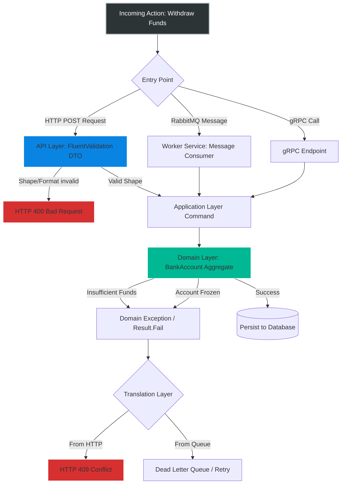

# 4.175 — Validation Across Layers: Where Validation Lives (HTTP vs Domain)

## PART 0 — Navigation & Context

```text
ASP.NET Core Domain Hierarchy
├── Cross-Cutting Concerns
│   ├── Validation Pipeline
│   │   ├── 4.170 FluentValidation
│   │   ├── 4.171 Async Validators
│   │   └── 4.175 Validation Across Layers ◄ YOU ARE HERE
└── Architecture & Design Patterns
    └── Domain-Driven Design (DDD) Integration
```

**What you need before this:**
- A strong grasp of FluentValidation and DataAnnotations for DTO validation [[4.170 — FluentValidation: Validators, RuleFor, and ASP.NET Core Integration]].
- An understanding of asynchronous validation and database uniqueness checks [[4.171 — FluentValidation: Async Validators and Database-Level Validation]].
- Familiarity with the `ModelState` dictionary and HTTP 400 generation [[4.168 — ModelState: Checking Validity, Reading Errors, Custom Responses]].

**What this unlocks after:**
- Designing enterprise-grade Clean Architectures where core business rules are completely decoupled from ASP.NET Core HTTP transport concerns.
- Eliminating "Anemic Domain Models" by pushing invariant logic into rich Domain Entities and Value Objects.
- Accurately mapping business failures to HTTP 409 Conflict vs HTTP 400 Bad Request.

**Why this matters to a production engineer at scale:**
In a junior-level application, all validation is lumped into the API Controller or a single FluentValidation class. If the `Amount` is negative, FluentValidation catches it. If the `AccountStatus` isn't `Active` before a withdrawal, FluentValidation catches it. 
However, at enterprise scale, HTTP APIs are rarely the only entry point into a system. You will have background workers (Hangfire/Quartz) processing messages from a Service Bus, gRPC internal microservice calls, and automated reconciliation jobs. If your business rules (e.g., "Cannot withdraw from a frozen account") only live inside your HTTP FluentValidation DTOs, those background jobs will bypass the rules entirely, leading to catastrophic database corruption.
A senior engineer must draw a hard architectural boundary: **HTTP Validation (DTOs)** enforces the *shape and contract* of the incoming message. **Domain Validation (Entities/Aggregates)** enforces the *business invariants and physics* of the application. Understanding where to place a specific rule, how to prevent duplication between layers, and how to map domain failures back to proper HTTP status codes is the hallmark of professional API design.

---

## PART 1 — The Core Mental Model

> **The Fundamental Rule**
> **HTTP-layer validation (DataAnnotations or FluentValidation on DTOs) enforces the API contract—checking shapes, lengths, ranges, and cheap existence checks—producing an HTTP 400 Bad Request before the Controller action executes. Domain-layer validation enforces absolute business invariants inside Aggregates and Value Objects, completely independent of the transport layer. Domain validation must execute regardless of whether the command arrived via HTTP, a RabbitMQ message, or a background CRON job. When Domain validation fails, it throws a DomainException (or returns a failed Result), which the API layer translates into an HTTP 409 Conflict or HTTP 422 Unprocessable Entity.**

**The Plain-Language Analogy**
Imagine a high-security bank vault.
**HTTP Validation** is the **Front Door Security Guard**. They check your ID, make sure your paperwork is filled out correctly (Shape), verify you aren't carrying weapons (Sanitization), and ensure you exist in the visitor log (Async Existence Check). If you fail, they turn you away immediately (HTTP 400).
**Domain Validation** is the **Vault Door Mechanism**. Even if the Front Door Guard lets you in, the Vault Door has its own unchangeable physics. It requires two keys turned simultaneously, and it will not open if the internal temperature is too high. The Vault Door doesn't care if you walked through the front door, snuck in through the roof, or arrived via an underground tunnel (RabbitMQ message). Its rules are absolute and cannot be bypassed. If the Vault rejects you, it's a conflict of physics (HTTP 409).

**The Taxonomy Diagram**



---

## PART 2 — Deep Mechanics

### 2.1 — The HTTP/DTO Validation Layer
This layer lives at the very edge of your application. It uses tools like FluentValidation or DataAnnotations.
**What belongs here:**
- **Shape & Syntax:** Is the email formatted correctly? Is the name under 50 characters? Is the age > 0?
- **Transport Constraints:** Is the uploaded file < 5MB? Is the content-type correct?
- **Cheap Existence Checks:** (via `MustAsync`): Does the `UserId` referenced in the JSON actually exist in the lookup table?

**The Output:** Standard RFC 7807 `ValidationProblemDetails` with an HTTP 400 Bad Request status code.

### 2.2 — The Application/Service Layer
This layer orchestrates the transaction. It fetches entities from the database, executes domain logic, and saves them back.
**What belongs here:**
- **Authorization:** Does the current user have permission to modify this specific Order? (Note: Authorization is NOT validation).
- **Concurrency Checks:** Did someone else modify this Order while I was looking at it?

### 2.3 — The Domain Layer (Entities, Aggregates, Value Objects)
This is the pure C# heart of your system. It has absolutely zero knowledge of ASP.NET Core, HTTP, JSON, or Entity Framework.
**What belongs here:**
- **Invariants:** A bank account balance can never drop below zero. An Order cannot transition from "Pending" to "Shipped" without being "Paid". A User cannot register if they are under 18.
- **Value Objects:** An `Address` requires a Zip Code if the Country is "US". A `Money` object requires an Amount and a Currency.

**The Output:** If an invariant is violated, the Domain either throws a custom `DomainException` or returns a `Result.Failure(Error)`.

### 2.4 — Mapping Domain Failures to HTTP
If your core C# Domain throws an `InsufficientFundsException`, how does the client know?
You must use a Global Exception Handler (Middleware or `.NET 8 IExceptionHandler`) to catch that specific domain exception and map it to the correct HTTP status code.
**HTTP 400 Bad Request:** "You sent me malformed garbage."
**HTTP 409 Conflict:** "Your syntax was perfect, but the current state of the business prevents me from doing this right now."
**HTTP 422 Unprocessable Entity:** "Your syntax was perfect, but the semantic meaning of your data is unprocessable." (Often used interchangeably with 409 depending on team conventions).

### 2.5 — The Anti-Pattern: Anemic Domain Models
If you put your business invariants (e.g., `Balance > 0`) inside your FluentValidation DTO, and leave your C# `BankAccount` class with public getters and setters (`public decimal Balance { get; set; }`), you have created an Anemic Domain Model. Any developer can inject the `DbContext` anywhere in the app, fetch the account, do `account.Balance = -500`, and call `SaveChanges()`. The database is now corrupted because the HTTP validation layer was bypassed.

---

## PART 3 — Production Code Patterns

### Pattern 1: Fintech — The Value Object
Never use primitive types (`decimal`, `string`) for core domain concepts. Encapsulate them in Value Objects that validate themselves upon creation.

```csharp
// 1. DOMAIN LAYER (Pure C#, No ASP.NET Core dependencies)
public record Money
{
    public decimal Amount { get; }
    public string Currency { get; }

    // The Value Object enforces its own physics. It is impossible to create an invalid Money object.
    public Money(decimal amount, string currency)
    {
        if (amount < 0) throw new InvalidDomainStateException("Money amount cannot be negative.");
        if (string.IsNullOrWhiteSpace(currency)) throw new InvalidDomainStateException("Currency is required.");
        
        Amount = amount;
        Currency = currency.ToUpperInvariant();
    }
}
```

```csharp
// 2. HTTP LAYER (ASP.NET Core FluentValidation)
public class TransferDtoValidator : AbstractValidator<TransferDto>
{
    public TransferDtoValidator()
    {
        // We validate the raw primitive shapes at the edge so we can return nice HTTP 400s
        RuleFor(x => x.Amount).GreaterThan(0).WithMessage("Amount must be greater than zero.");
        RuleFor(x => x.Currency).Length(3).WithMessage("Currency must be 3 letters.");
    }
}
```

```csharp
// 3. APPLICATION LAYER (Controller / MediatR)
public async Task<IActionResult> Transfer(TransferDto dto)
{
    // DTO is guaranteed valid shape by FluentValidation.
    // Now we instantiate the Domain concept.
    var money = new Money(dto.Amount, dto.Currency); 
    
    await _transferService.ExecuteAsync(money);
    return Ok();
}
```

### Pattern 2: E-Commerce — The Aggregate Root State Machine
Business rules involving state transitions MUST live in the Domain Aggregate, not in FluentValidation.

```csharp
// DOMAIN LAYER
public class Order
{
    public OrderState State { get; private set; } // Private setter!

    public void Ship()
    {
        // Business Invariant: You cannot ship an unpaid order.
        if (State != OrderState.Paid)
        {
            throw new DomainConflictException("Cannot ship an order that has not been paid.");
        }
        
        State = OrderState.Shipped;
    }
}
```

If a background cron job runs `order.Ship()`, it is protected. If an API endpoint calls it, it is protected. The validation lives exactly where the data changes.

### Pattern 3: Global Exception Mapping (The Translation Layer)
When `DomainConflictException` is thrown, we must catch it and translate it to HTTP 409.

```csharp
// NET 8 IExceptionHandler
public class DomainExceptionHandler : IExceptionHandler
{
    public async ValueTask<bool> TryHandleAsync(HttpContext httpContext, Exception exception, CancellationToken cancellationToken)
    {
        if (exception is DomainConflictException domainEx)
        {
            var problemDetails = new ProblemDetails
            {
                Status = StatusCodes.Status409Conflict,
                Title = "Business Rule Violation",
                Detail = domainEx.Message
            };

            httpContext.Response.StatusCode = problemDetails.Status.Value;
            await httpContext.Response.WriteAsJsonAsync(problemDetails, cancellationToken);
            
            return true; // Exception handled
        }

        return false;
    }
}
```

### Pattern 4: The Functional "Result" Pattern (Avoiding Exceptions)
Many teams consider Exceptions for business validation to be "control flow via exceptions" (an anti-pattern). Instead, they use a `Result` wrapper.

```csharp
// DOMAIN LAYER
public Result Ship()
{
    if (State != OrderState.Paid)
        return Result.Fail(new Error("Order.NotPaid", "Cannot ship unpaid order."));
        
    State = OrderState.Shipped;
    return Result.Ok();
}

// HTTP LAYER (Controller)
public IActionResult ShipOrder(Guid id)
{
    var order = _repo.Get(id);
    var result = order.Ship();
    
    if (result.IsFailure)
    {
        // Translate functional failure to HTTP 409
        return Conflict(new { error = result.Error.Message });
    }
    
    _repo.Save(order);
    return Ok();
}
```

### Pattern 5: Duplication Avoidance (The DRY Dilemma)
**The Problem:** If you check `Amount > 0` in FluentValidation (for nice 400s) AND `Amount < 0 throw` in the Domain (for invariants), you have duplicated logic.
**The Solution:** This is widely accepted as **Good Duplication**. 
- The FluentValidation check exists to provide a stellar UX/DX (Developer Experience) with perfectly formatted RFC 7807 dictionary errors targeting specific JSON fields.
- The Domain check exists to provide absolute data integrity physics.
Do not try to share the exact same code file between the two layers. Their purposes and error output formats are fundamentally different.

---

## PART 4 — Gotchas & Anti-Patterns

### Gotcha 1: Skipping Domain Validation entirely
The most catastrophic anti-pattern.

// ⚠️ FATAL ANTI-PATTERN
```csharp
// FluentValidation
RuleFor(x => x.Quantity).GreaterThan(0);

// Domain Entity
public class OrderItem {
    public int Quantity { get; set; } // Completely unprotected!
}

// Background Worker (Consuming from RabbitMQ)
public void HandleMessage(OrderMessage msg) {
    var item = new OrderItem { Quantity = msg.Qty }; // msg.Qty is -50!
    _db.Save(item); // Database is now corrupted.
}
```

// ✅ CORRECT CODE
// The Domain Entity MUST protect itself.
```csharp
public class OrderItem {
    public int Quantity { get; private set; }
    public OrderItem(int qty) {
        if (qty <= 0) throw new Exception("Qty must be positive");
        Quantity = qty;
    }
}
```

### Gotcha 2: FluentValidation reaching into the Domain
If you try to inject Domain Entities into your FluentValidation DTO validator to run complex business rules, you are leaking Domain concerns into the HTTP boundary. Keep FluentValidation focused strictly on the incoming primitive DTO properties and basic existence checks.

### Gotcha 3: Returning HTTP 400 for Domain Invariants
If the JSON payload is perfectly valid (`{ "accountId": 123, "amount": 50 }`), but the account has insufficient funds, returning an HTTP 400 Bad Request is semantically incorrect. 
HTTP 400 means "You formatted this wrong, do not retry without changing your syntax."
HTTP 409 Conflict means "Your syntax is perfect, but the current state of the server prevents this action."
Always map Domain rule failures to 409 Conflict (or 422 Unprocessable Entity).

### Gotcha 4: Entity Framework Configuration as "Validation"
Some developers think `builder.Property(x => x.Name).HasMaxLength(50)` in EF Core is sufficient validation.
**Reality:** EF Core constraints are the LAST line of defense. If you rely on EF Core, your app will throw a `DbUpdateException` (HTTP 500) when it tries to save. You must validate the length in FluentValidation (to return 400) or in the Domain (to throw a clean DomainException) *before* it ever hits the database.

---

## PART 5 — Performance Implications

### Layer Performance Execution

| Layer | Execution Speed | I/O Bound? | Purpose |
|---|---|---|---|
| FluentValidation (Shape) | < 0.1ms | No | Catch garbage fast before allocating Domain objects. |
| FluentValidation (MustAsync) | 5ms - 20ms | Yes (DB/Cache) | Catch duplicates before instantiating heavy Domain logic. |
| Domain Validation | < 0.1ms | No | Pure CPU/Memory logic. Extremely fast. Protects integrity. |
| Database Constraints | Variable | Yes (Disk) | Absolute final guarantee against race conditions. |

**Performance Verdict:**
Layered validation does not impact performance negatively; it *improves* it. By executing cheap, fast shape validation at the edge (FluentValidation), you reject 90% of malicious or broken requests before you ever expend CPU cycles fetching Domain aggregates from the database.

---

## PART 6 — Interview Arsenal

### A. The Question Bank

**Question 1:** "You need to ensure that a 'Withdrawal' amount is greater than zero, and that the account actually has enough funds. Where do you write this validation logic?"
- **Average Answer:** "I put both checks in my FluentValidation class for the API."
- **Why That's Insufficient:** Ignores the Domain layer and leaves the system open to corruption from background jobs.
- **Great Answer:** "I split these concerns. The rule 'Amount must be greater than zero' is a basic format and shape rule. I put that in the FluentValidation DTO validator so it returns a clean HTTP 400. However, the rule 'Account must have sufficient funds' requires evaluating the current business state. That is a Domain invariant. I place that logic inside the `BankAccount` aggregate root method (`Withdraw(decimal amount)`). If the domain rule fails, it throws a `DomainConflictException` or returns a failed Result, which my API layer translates into an HTTP 409 Conflict."

**Question 2:** "Isn't it a violation of the DRY (Don't Repeat Yourself) principle to check `Amount > 0` in both your API Validator and your Domain Value Object?"
- **Average Answer:** "Yes, so I only put it in the Domain to avoid repetition."
- **Why That's Insufficient:** Ruins the API consumer experience by returning generic 500s or 409s instead of formatted 400s.
- **Great Answer:** "It is technical duplication, but it is not a violation of DRY because the *reason for change* and the *output format* are different. The API validator exists to provide a fast, field-specific RFC 7807 dictionary response (HTTP 400) to guide frontend developers. The Domain check exists as absolute physics to prevent data corruption from internal processes or message queues. Removing either compromises either Developer Experience or Data Integrity."

**Question 3:** "Our application processes commands from a RabbitMQ queue. We currently use FluentValidation on the API controllers. How do we ensure the queue messages are validated?"
- **Average Answer:** "We run FluentValidation on the queue messages before processing them."
- **Why That's Insufficient:** While validating message shape is good, it still assumes Anemic Domain Models if business invariants are left in the validators.
- **Great Answer:** "We should use a library like MassTransit to apply FluentValidation to the incoming queue messages to ensure message shape. However, the ultimate safety net is ensuring our Domain Entities (Aggregates) encapsulate their own invariants. No matter where the data comes from—HTTP or RabbitMQ—the Aggregate should refuse to enter an invalid state. If a queue message violates a Domain invariant, the Domain throws, and the message is routed to a Dead Letter Queue for inspection."

### B. The Trick Questions

**Trick Question:** "I have a rule that a User's Username must be unique in the database. Is this an HTTP validation rule or a Domain invariant?"
- **The Trap:** Uniqueness spans across aggregates, which makes it a tricky DDD concept.
- **The Correct Answer:** "Uniqueness is technically an application/domain concern, but for UX reasons, it is usually validated at the HTTP boundary using FluentValidation's `MustAsync` to provide an instant 400 error. However, because concurrent requests can bypass `MustAsync` race conditions, the absolute invariant must be enforced by a Unique Index constraint in the SQL database, which the Application layer catches and translates to an HTTP 409 Conflict."

### C. Red Flags to Avoid
- 🚩 **"I put all my business logic in FluentValidation so it's all in one place."** (Screams junior developer who has never built a system with background workers or complex domains).
- 🚩 **"My Domain entities have public `get; set;` properties so Entity Framework can map them easily."** (Anemic Domain Model. The entities have no encapsulation and cannot protect their own invariants).

---

## PART 7 — Decision Framework

```mermaid
graph TD
    A[New Validation Rule] --> B{Does it check the Shape, Format, or Type of the input?}
    
    B -->|Yes - E.g. String Length| C[FluentValidation / DataAnnotations]
    C --> D[Returns HTTP 400]
    
    B -->|No - Requires Business State| E{Does it require querying a single Entity's state?}
    
    E -->|Yes - E.g. Balance > Amount| F[Domain Aggregate Root Method]
    F --> G[Throws DomainException / Returns Result]
    G --> H[Global Handler translates to HTTP 409]
    
    E -->|No - Spans multiple aggregates| I{Is it a uniqueness check?}
    
    I -->|Yes| J[FluentValidation MustAsync AND Database Unique Index]
    
    I -->|No - Complex cross-aggregate rule| K[Domain Service / Application Layer]
    K --> G
    
    style A fill:#2d3436,stroke:#fff
    style C fill:#0984e3,stroke:#fff
    style D fill:#0984e3,stroke:#fff
    style F fill:#00b894,stroke:#fff
    style H fill:#00b894,stroke:#fff
    style J fill:#d63031,stroke:#fff
```



---

## PART 8 — Self-Check

### A. Conceptual Questions
1. Why is relying exclusively on API-layer validation dangerous in a microservice architecture?
2. What HTTP status code should be returned when a payload is perfectly formatted but violates a business rule?
3. Define an "Anemic Domain Model" in the context of validation.
4. Why is duplicating a simple rule (like `Amount > 0`) in both the DTO and the Domain Value Object considered acceptable?
5. Where should a database uniqueness check (e.g., Email is unique) physically live to prevent race conditions?
6. How does the Functional "Result" pattern differ from throwing `DomainExceptions`?
7. If a Domain Entity throws a `DomainConflictException`, what ASP.NET Core mechanism is responsible for turning that into an HTTP response?
8. What is the difference between validating an API Contract and validating a Business Invariant?

### B. Code Puzzles

**Puzzle 1: The Bypassed Rule**
```csharp
// Controller
[HttpPost]
public IActionResult UpdateAge(UpdateAgeDto dto) {
    if (dto.Age < 18) return BadRequest("Too young.");
    var user = _db.Users.Find(dto.Id);
    user.Age = dto.Age;
    _db.SaveChanges();
    return Ok();
}

// Background Worker
public void ProcessImport(ImportRecord record) {
    var user = _db.Users.Find(record.Id);
    user.Age = record.Age;
    _db.SaveChanges();
}
```
*Scenario:* A bug in the import file sets a user's age to 5. The database accepts it. Why?
<details>
<summary>Answer</summary>
The validation rule (`Age < 18`) only exists in the HTTP Controller. The background worker interacts directly with the Anemic Domain Model (`user.Age = ...`), bypassing the HTTP layer entirely.
*Fix:* Move the rule into the Domain: `user.SetAge(record.Age);` where `SetAge` throws if `< 18`.
</details>

**Puzzle 2: The Meaningless 400**
```csharp
RuleFor(x => x.OrderId).MustAsync(async (id, ct) => {
    var order = await _db.Orders.FindAsync(id);
    return order.Status == OrderStatus.Pending;
}).WithMessage("Order has already shipped.");
```
*Scenario:* A client submits a perfectly valid JSON payload with an OrderId. They get a 400 Bad Request with "Order has already shipped." Why is this semantically wrong?
<details>
<summary>Answer</summary>
HTTP 400 implies the client's request syntax is malformed. The syntax is fine; the business state of the server prevents the action. This is a Conflict.
*Fix:* Move the check out of FluentValidation. Let the Controller/Application fetch the order, call `order.Cancel()`, and have the Domain throw a `ConflictException` mapped to HTTP 409.
</details>

**Puzzle 3: The Value Object Safety Net**
```csharp
public class Dimensions {
    public int Length { get; set; }
    public int Width { get; set; }
}
```
*Scenario:* Refactor this to be a true DDD Value Object that protects its invariants (length and width must be > 0).
<details>
<summary>Answer</summary>
```csharp
public record Dimensions {
    public int Length { get; }
    public int Width { get; }
    public Dimensions(int length, int width) {
        if (length <= 0 || width <= 0) throw new ArgumentException("Dimensions must be positive.");
        Length = length;
        Width = width;
    }
}
```
</details>

---

## PART 9 — Connections & Resources

### A. Related Topics Table

| Topic | Why It Connects |
|---|---|
| [[4.170 — FluentValidation: Validators, RuleFor, and ASP.NET Core Integration]] | The exact syntax for the HTTP edge-layer validation discussed in this topic. |
| [[4.182 — Global Exception Handler (.NET 8): IExceptionHandler Interface]] | The modern ASP.NET Core mechanism used to map Domain exceptions to HTTP 409/422 responses. |
| [[4.179 — Problem Details RFC 7807: IProblemDetailsService]] | The standard JSON format that both your FluentValidation 400s and your Domain 409s should adhere to. |

### B. Books

| Book | Chapters | Why These Chapters |
|---|---|---|
| Domain-Driven Design (Eric Evans) | Chapter 5: A Model Expressed in Software | The definitive text on Aggregates, Value Objects, and protecting invariants. |
| Clean Architecture (Robert C. Martin) | Chapter 22: The Clean Architecture | Explains the boundary between the Web layer (HTTP) and the Use Case / Entity layers. |

### C. Essential Articles & Docs
- [Vladimir Khorikov: Validation and DDD](https://enterprisecraftsmanship.com/posts/validation-and-ddd/) (The absolute best philosophical breakdown of this topic).
- [Microsoft Docs: Design a microservice domain model](https://learn.microsoft.com/en-us/dotnet/architecture/microservices/microservice-ddd-cqrs-patterns/microservice-domain-model)

> [!NOTE]
> **Template Meta-Note**
> Part 0: Context & Prerequisites. Part 1: Core Mental Model. Part 2: Deep Mechanics & Pipeline. Part 3: Production Code. Part 4: Gotchas. Part 5: Performance. Part 6: Interview Arsenal. Part 7: Decision Framework. Part 8: Puzzles. Part 9: Resources.
