# 4.176 — Client-Side Validation Coordination: data-val Attributes in Razor

## PART 0 — Navigation & Context

```text
ASP.NET Core Domain Hierarchy
├── Frontend Integration
│   ├── Razor Pages & MVC Views
│   ├── 4.176 Client-Side Validation ◄ YOU ARE HERE
│   └── Tag Helpers
└── Cross-Cutting Concerns
    └── Validation Pipeline (Server-Side)
```

**What you need before this:**
- A solid understanding of Server-Side DataAnnotations (`[Required]`, `[EmailAddress]`) and how they generate `ModelState` errors [[4.167 — DataAnnotations Validation in ASP.NET Core]].
- Basic familiarity with Razor syntax and Tag Helpers (like `asp-for` and `asp-validation-summary`).
- Understanding of the fundamental security rule: The client environment (browser) is inherently untrusted.

**What this unlocks after:**
- Building highly responsive, zero-latency user interfaces in MVC and Razor Pages that guide users through form completion without forcing them to wait for full page reloads.
- Creating custom validation attributes that automatically emit JavaScript rules, keeping the server and client perfectly synchronized without duplicating code.

**Why this matters to a production engineer at scale:**
In a traditional server-rendered application (MVC or Razor Pages), every time a user submits a form with a typo, the server has to receive the request, process the validation, re-render the entire HTML page, and send it back over the network. If the server is under heavy load, or the user is on a slow 3G mobile connection, this round-trip might take 2 seconds just to tell them they forgot an `@` symbol in their email.
Client-side validation solves this UX nightmare. By emitting `data-val-*` attributes directly into the HTML, ASP.NET Core automatically instructs the browser's JavaScript to validate the form *instantly* before the POST request is even fired. 
However, the single greatest security trap for junior developers is believing that Client-Side validation replaces Server-Side validation. It absolutely does not. An attacker can trivially bypass JavaScript using tools like Postman or cURL. A senior engineer knows how to seamlessly coordinate both layers: using Unobtrusive Validation for immediate UX feedback, while enforcing an impenetrable Server-Side `ModelState` wall for true data security.

---

## PART 1 — The Core Mental Model

> **The Fundamental Rule**
> **ASP.NET Core Razor Tag Helpers (`asp-for`) automatically translate your server-side DataAnnotations (like `[Required]`) into HTML5 `data-val-*` attributes on the rendered `<input>` elements. The `jquery.validate.unobtrusive.js` library reads these attributes and intercepts form submissions in the browser, providing instant, zero-latency feedback to the user if the input is invalid. This is purely a UX optimization. The server ALWAYS runs the exact same validation pipeline again upon receiving the HTTP request, because client-side restrictions can be bypassed by malicious actors.**

**The Plain-Language Analogy**
Imagine applying for a passport at the post office.
**Client-Side Validation** is the **helpful desk clerk** standing next to the forms. When you finish writing your address, the clerk glances at it and says, "Hey, you forgot to write your zip code." You fix it instantly. The clerk saves the post office time and saves you the frustration of having your application rejected weeks later.
However, you can completely ignore the clerk, put your incomplete form in an envelope, and drop it directly into the mail slot outside.
**Server-Side Validation** is the **official government processor** in the back room. They don't care if the desk clerk checked it or not. They put the form under a microscope, verify every single field against federal law, and if it's missing a zip code, they stamp it REJECTED and mail it back to you. The clerk is for UX; the processor is for Security.

**The Taxonomy Diagram**

```mermaid
graph TD
    A[C# View Model] -->|Contains [Required]| B[Razor Tag Helper: asp-for]
    
    B -->|Renders| C["HTML: <input data-val='true' data-val-required='...'>"]
    
    C --> D[User interacts with Form]
    
    D --> E{jQuery Unobtrusive Intercept}
    
    E -->|Validation Fails| F[Prevent POST, show error span instantly]
    
    E -->|Validation Passes or JS Disabled| G[Execute HTTP POST to Server]
    
    G --> H[ASP.NET Core Model Binding]
    H --> I[Execute Server-Side DataAnnotations]
    
    I -->|Validation Fails| J[Return 400 or Re-render View with ModelState errors]
    I -->|Validation Passes| K[Execute Controller Action]
    
    style A fill:#0984e3,stroke:#74b9ff,stroke-width:2px,color:#fff
    style C fill:#00b894,stroke:#55efc4,stroke-width:2px,color:#fff
    style E fill:#fdcb6e,stroke:#ffeaa7,stroke-width:2px,color:#333
    style G fill:#d63031,stroke:#ff7675,stroke-width:2px,color:#fff
    style I fill:#2d3436,stroke:#b2bec3,stroke-width:2px,color:#fff
```

---

## PART 2 — Deep Mechanics

### 2.1 — The Translation Pipeline
When you write a View Model in C#, you decorate properties with attributes:
```csharp
public class RegisterViewModel
{
    [Required(ErrorMessage = "Please enter an email.")]
    [EmailAddress(ErrorMessage = "Invalid email format.")]
    public string Email { get; set; }
}
```

When you bind this to a Razor view using the `asp-for` Tag Helper:
```html
<input asp-for="Email" class="form-control" />
<span asp-validation-for="Email" class="text-danger"></span>
```

ASP.NET Core's rendering engine intercepts the `asp-for`, inspects the Reflection metadata of the `Email` property, sees the attributes, and **translates them into HTML5 Data Attributes**:
```html
<input type="email" id="Email" name="Email" class="form-control" 
       data-val="true" 
       data-val-required="Please enter an email." 
       data-val-email="Invalid email format." />
<span class="field-validation-valid text-danger" data-valmsg-for="Email" data-valmsg-replace="true"></span>
```

### 2.2 — The JavaScript Triad
For the HTML above to actually *do* anything, the browser needs specific JavaScript libraries loaded in the correct order. ASP.NET Core relies on three layers:

1. **jQuery:** The foundational DOM manipulation library.
2. **jQuery Validate (`jquery.validate.js`):** A generic plugin that handles form validation rules, but usually requires you to write custom JS objects configuring those rules.
3. **jQuery Validation Unobtrusive (`jquery.validate.unobtrusive.js`):** Microsoft's custom bridge. It scans the DOM on page load, finds elements with `data-val="true"`, reads the `data-val-*` rules, and automatically configures the underlying jQuery Validate engine. You write **zero JavaScript**.

### 2.3 — `IClientModelValidator` (Custom Attributes)
If you write a custom server-side `[ValidationAttribute]` (e.g., `[MustBeFutureDate]`), the Tag Helper does not know how to translate it to `data-val`. By default, custom attributes only validate on the server.
To make a custom attribute work on the client, you must implement `IClientModelValidator`.

```csharp
public class MustBeFutureDateAttribute : ValidationAttribute, IClientModelValidator
{
    protected override ValidationResult IsValid(object value, ValidationContext context) { ... } // Server logic

    public void AddValidation(ClientModelValidationContext context)
    {
        // 1. Tell Unobtrusive JS to watch this field
        context.Attributes.TryAdd("data-val", "true");
        // 2. Define the custom rule name (e.g., 'futuredate') and the error message
        context.Attributes.TryAdd("data-val-futuredate", ErrorMessage ?? "Date must be in the future.");
    }
}
```
*Note: Implementing this interface only emits the HTML attributes. You must still write a custom jQuery Validate adapter in your JavaScript file to actually execute the date-checking logic in the browser.*

### 2.4 — Remote Validation
Sometimes, client-side JS cannot validate a rule (e.g., "Is this Username already taken in the database?"). You don't want the user to submit the whole form to find out.
ASP.NET Core provides `[Remote]`.
```csharp
[Remote(action: "VerifyUsername", controller: "Users")]
public string Username { get; set; }
```
This generates `data-val-remote="url"`. When the user types, Unobtrusive JS intercepts the keystrokes and fires a tiny AJAX background `GET` request to your controller. The controller returns `true` or `"Username taken"`. It looks like client-side validation, but it's actually micro-server-side validation.

---

## PART 3 — Production Code Patterns

### Pattern 1: Standard MVC Form Setup
A production-ready Razor form includes the anti-forgery token, the input fields, the validation spans, and the partial view containing the required scripts.

```html
@model LoginViewModel

<form asp-action="Login" method="post">
    <!-- Server-side errors that don't map to a specific field go here -->
    <div asp-validation-summary="ModelOnly" class="text-danger"></div>

    <div class="form-group">
        <label asp-for="Email"></label>
        <input asp-for="Email" class="form-control" />
        <!-- Client-side errors (and server field errors) appear here -->
        <span asp-validation-for="Email" class="text-danger"></span>
    </div>

    <button type="submit">Log In</button>
</form>

@section Scripts {
    <!-- Injects the jQuery Validate triad -->
    <partial name="_ValidationScriptsPartial" />
}
```

### Pattern 2: Dynamic Forms and Unobtrusive Parsing
If you load a form into the DOM dynamically via an AJAX call (e.g., a modal popup), the Unobtrusive JS engine does not know about the new HTML, because it only scans the DOM on initial page load. The validation will fail to fire.
You must manually instruct the library to re-parse the newly injected HTML.

```javascript
// User clicks "Load Form"
$.get('/api/get-modal-form', function (html) {
    $('#modal-body').html(html);
    
    // ✅ REQUIRED: Tell Microsoft's unobtrusive library to scan the new HTML
    // Without this line, client-side validation on the modal will not work!
    $.validator.unobtrusive.parse('#modal-body');
});
```

### Pattern 3: Disabling Client Validation on Specific Fields
Sometimes, a specific validation rule is incredibly complex and you only want the server to handle it. You can manually override the Tag Helper's behavior by overriding the HTML attribute.

```html
<!-- The server will still validate [Required], but the client will ignore it -->
<input asp-for="CouponCode" data-val="false" class="form-control" />
```

### Pattern 4: The Minimal API / SPA Architecture Paradigm
If you are building an SPA (React, Angular, Vue) backed by an ASP.NET Core JSON API, **`data-val` attributes are completely useless to you.**
The `data-val` ecosystem is strictly coupled to Razor Server-Side Rendering.
For SPAs, you must validate on the client using a JS-native library (like Zod or Yup), and then validate *again* on the server using FluentValidation. Keeping the two in sync requires careful architectural discipline or schema generation tools (like OpenAPI/Swagger to TypeScript generators).

---

## PART 4 — Gotchas & Anti-Patterns

### Gotcha 1: The "JavaScript is Security" Illusion
The most dangerous anti-pattern for a junior developer is testing a form, seeing the red text appear preventing submission, and concluding the application is secure.

// ⚠️ FATAL ANTI-PATTERN
```csharp
[HttpPost]
public IActionResult SubmitForm(DataModel model)
{
    // ❌ Fails to check ModelState.IsValid!
    // Assumes the client-side validation guarantees the data is perfect.
    _db.Save(model); 
    return Ok();
}
```

// HTTP consequence (wrong path):
// An attacker opens Developer Tools, deletes `data-val="true"` from the HTML, and hits Submit. The browser bypasses jQuery validation and sends the raw, malicious HTTP POST. The controller accepts it blindly, corrupting the database.

// ✅ CORRECT CODE
// The server MUST act as if client-side validation does not exist.
```csharp
[HttpPost]
public IActionResult SubmitForm(DataModel model)
{
    if (!ModelState.IsValid) 
    {
        // Re-render the form with errors
        return View(model); 
    }
    _db.Save(model);
    return RedirectToAction("Success");
}
```

### Gotcha 2: Missing `_ValidationScriptsPartial`
You add `[Required]` to your View Model. You write the `asp-for` tags. You load the page, leave the field blank, and click Submit. The page reloads entirely, taking 2 seconds, before showing the error.
**Why?** You forgot to include `@section Scripts { <partial name="_ValidationScriptsPartial" /> }` at the bottom of your Razor view. The `data-val` attributes were generated in the HTML, but without the JavaScript files loaded, the browser didn't know what to do with them, so it fell back to standard HTTP POST server-side validation.

### Gotcha 3: Complex `IValidatableObject` Cross-Field Rules
If your model implements `IValidatableObject` to do complex cross-field validation (e.g., "EndDate must be after StartDate"), this logic is purely C#. It **cannot** be translated to `data-val` automatically.
This means cross-field validation will ONLY happen on the server. If a user enters an invalid date range, they will experience a full page reload before seeing the error. (To fix this, you must write custom jQuery rules manually).

### Gotcha 4: Remote Validation Race Conditions
If you use `[Remote]` validation for a Username check, and the user types very fast and immediately clicks "Submit" before the AJAX call returns, the form might submit invalid data. The server MUST have a duplicate standard validation rule backing up the `[Remote]` attribute.

---

## PART 5 — Performance Implications

### Request Pipeline Characteristics

| Validation Strategy | Latency to User Feedback | Server CPU Overhead | Network Traffic |
|---|---|---|---|
| Server-Side Only (No JS) | High (Full Network Round Trip) | High (Re-renders full HTML) | High (Full POST & HTML Response) |
| Client-Side (`data-val`) | **Instant (< 1ms)** | **Zero (Handled by Browser)** | **Zero** |
| Remote Validation (AJAX) | Medium (~50ms - 200ms) | Low (Tiny JSON response) | Low (Micro-GET requests) |

**Performance Verdict:**
Client-Side validation is one of the most effective ways to reduce load on a traditional MVC/Razor Pages web server. By preventing invalid submissions from ever crossing the network, you save significant CPU cycles that would otherwise be wasted deserializing bad payloads and re-rendering massive HTML strings.

---

## PART 6 — Interview Arsenal

### A. The Question Bank

**Question 1:** "We added `[Required]` to our View Model properties, but when testing the form, the page still performs a full POST and refresh to show the error message. We want the error to appear instantly without a reload. What are we missing?"
- **Average Answer:** "You need to write some JavaScript to check the fields."
- **Why That's Insufficient:** Ignores the built-in unobtrusive framework.
- **Great Answer:** "The server is successfully adding the `data-val` HTML attributes via the Tag Helpers, but the browser doesn't have the engine to process them. You need to include the Unobtrusive Validation scripts. Typically, this is done by adding the `_ValidationScriptsPartial` within the `@section Scripts` block at the bottom of your Razor View. Once jQuery, jQuery Validate, and Unobtrusive are loaded, they will intercept the form submission instantly."

**Question 2:** "If we have robust client-side validation ensuring users can't submit bad data, do we still need to write `if (!ModelState.IsValid)` in our Controller Actions?"
- **Average Answer:** "Yes, just in case."
- **Why That's Insufficient:** Doesn't explain the security boundary.
- **Great Answer:** "Absolutely, it is mandatory for security. Client-side validation is strictly a UX optimization to provide fast feedback. Because it runs in the user's browser, it is completely outside our control. An attacker can disable JavaScript, use cURL, or manipulate the DOM to bypass the validation entirely. The server must always treat incoming data as hostile and strictly enforce `ModelState` validation."

**Question 3:** "We have a modal popup that loads a form via AJAX. The form has `asp-for` tags, and the scripts are loaded on the main page, but the client-side validation doesn't trigger when submitting the modal. Why?"
- **Average Answer:** "Because the DOM changed."
- **Why That's Insufficient:** Lacks the mechanical solution.
- **Great Answer:** "The Unobtrusive Validation library only scans the DOM for `data-val` attributes once, during the initial page load. When you inject new HTML via AJAX, the library is unaware of the new form elements. You must manually invoke `$.validator.unobtrusive.parse('#your-modal-id')` in your AJAX success callback to force the engine to wire up validation for the newly injected HTML."

### B. The Trick Questions

**Trick Question:** "I wrote a custom `[MustBeEvenNumber]` ValidationAttribute. It works perfectly on the server, but it doesn't stop the form submission on the client side like `[Required]` does. Why not?"
- **The Trap:** Assuming custom C# attributes magically generate JavaScript equivalents.
- **The Correct Answer:** "ASP.NET Core knows how to translate built-in attributes (like Required and StringLength) into HTML attributes, but it doesn't know how to translate your custom C# logic into JavaScript. To make it work on the client, your attribute must implement `IClientModelValidator` to emit a custom `data-val-evennumber` attribute, and you must write a corresponding adapter function in jQuery Validate to execute the math logic in the browser."

### C. Red Flags to Avoid
- 🚩 **"I use `data-val` for my React/Angular API so the frontend knows what rules to follow."** (Demonstrates a fundamental misunderstanding of what `data-val` is. It is specific to Razor HTML rendering, not JSON APIs).
- 🚩 **"I rely on `data-val-remote` to securely verify passwords."** (Remote validation sends keystrokes over the wire; be extremely careful about triggering remote validation on highly sensitive fields or fields that cause expensive database locks).

---

## PART 7 — Decision Framework

```mermaid
graph TD
    A[Building a UI Form] --> B{What Frontend Tech are you using?}
    
    B -->|React / Vue / Angular| C[Use Frontend Lib e.g., Zod/Yup]
    C --> D[Ignore data-val completely]
    D --> E[Server enforces via API FluentValidation]
    
    B -->|Razor Pages / MVC Views| F{Does the rule involve complex C# cross-field logic?}
    
    F -->|Yes| G[IValidatableObject]
    G --> H[Server-Side Only Validation. Client reloads page on failure.]
    
    F -->|No - Standard Rules| I[DataAnnotations on ViewModel]
    I --> J[Use asp-for Tag Helpers]
    J --> K[Render data-val attributes]
    K --> L[Include _ValidationScriptsPartial]
    L --> M[Instant Client-Side UX Feedback]
    
    M --> N[MANDATORY: Server still checks ModelState.IsValid on POST]
    
    style A fill:#2d3436,stroke:#fff
    style C fill:#0984e3,stroke:#fff
    style G fill:#0984e3,stroke:#fff
    style I fill:#00b894,stroke:#fff
    style N fill:#d63031,stroke:#fff
```



---

## PART 8 — Self-Check

### A. Conceptual Questions
1. How does an `[EmailAddress]` C# attribute physically turn into client-side validation logic?
2. Why is Client-Side validation considered a UX feature rather than a Security feature?
3. What three JavaScript libraries must be loaded for ASP.NET Core unobtrusive validation to work?
4. If you load a form via AJAX, what JavaScript command must you run to activate validation?
5. How does the `[Remote]` attribute differ from standard `data-val` rules?
6. If a user bypasses client-side validation and submits a bad payload, what mechanism catches it on the server?
7. What interface must a custom C# ValidationAttribute implement to emit `data-val` tags?
8. Are `data-val` attributes relevant when building a JSON REST API? Why or why not?

### B. Code Puzzles

**Puzzle 1: The Missing Feedback**
```html
<form method="post">
    <input asp-for="Username" />
    <button type="submit">Submit</button>
</form>
```
*Scenario:* `Username` has `[Required]`. When the user leaves it blank and hits submit, the page correctly prevents the POST. But no error message appears anywhere on the screen. Why?
<details>
<summary>Answer</summary>
The Tag Helper generated the `data-val` attributes, and the JS library intercepted the submit, but the developer forgot to include the `<span asp-validation-for="Username"></span>` element. Unobtrusive JS has nowhere to inject the red error text.
</details>

**Puzzle 2: The Double Standard**
```csharp
// API Controller
[HttpPost("api/users")]
public IActionResult Create(UserDto dto) { ... }
```
*Scenario:* A developer wants the mobile app developers to have client-side validation. The backend developer adds `IClientModelValidator` to their DTO attributes so the API returns `data-val` attributes in the JSON.
<details>
<summary>Answer</summary>
This is fundamental misunderstanding of the framework. `IClientModelValidator` strictly instructs the Razor View Engine how to render HTML tags. It does nothing to JSON serialization. Mobile apps cannot read `data-val`. The mobile app must implement its own native validation logic, while the API enforces the rules server-side.
</details>

**Puzzle 3: The Stubborn Modal**
```javascript
function openModal() {
    $.get('/admin/edit-user-form', function(data) {
        $('#modalContainer').html(data);
        $('#myModal').modal('show');
    });
}
```
*Scenario:* The user clicks "Edit", the modal opens with the form. They clear out required fields and click submit. The form posts to the server, failing server-side, and forcing a full page reload instead of showing instant red text.
<details>
<summary>Answer</summary>
The injected HTML contains `data-val` attributes, but because it was injected *after* page load, the validation engine didn't wire it up.
*Fix:* Add `$.validator.unobtrusive.parse('#modalContainer');` inside the `$.get` success callback.
</details>

---

## PART 9 — Connections & Resources

### A. Related Topics Table

| Topic | Why It Connects |
|---|---|
| [[4.167 — DataAnnotations Validation in ASP.NET Core]] | The server-side attributes that form the source of truth for the `data-val` generator. |
| [[4.168 — ModelState: Checking Validity, Reading Errors, Custom Responses]] | The server-side execution phase that acts as the ultimate security wall if the client bypasses the JS. |
| [[4.169 — Custom Validation Attributes: ValidationAttribute and IValidatableObject]] | Where `IClientModelValidator` fits in when extending the validation framework. |

### B. Books

| Book | Chapters | Why These Chapters |
|---|---|---|
| Pro ASP.NET Core 6 | Chapter 29: Model Validation | Thorough walkthrough of how Tag Helpers interact with the Unobtrusive JavaScript engine. |
| ASP.NET Core in Action, 3rd Ed | Chapter 14: Validating user input | Covers integrating `_ValidationScriptsPartial` into layouts cleanly. |

### C. Essential Articles & Docs
- [Microsoft Docs: Client-side validation in ASP.NET Core](https://learn.microsoft.com/en-us/aspnet/core/mvc/models/validation#client-side-validation)
- [Microsoft Docs: Remote Validation](https://learn.microsoft.com/en-us/aspnet/core/mvc/models/validation#remote-attribute)

> [!NOTE]
> **Template Meta-Note**
> Part 0: Context & Prerequisites. Part 1: Core Mental Model. Part 2: Deep Mechanics & Pipeline. Part 3: Production Code. Part 4: Gotchas. Part 5: Performance. Part 6: Interview Arsenal. Part 7: Decision Framework. Part 8: Puzzles. Part 9: Resources.
