# 4.176 — Kubernetes Liveness & Readiness Probes

## PART 0 — Navigation & Context

```text
ASP.NET Core Domain Hierarchy
├── Observability & Telemetry
│   ├── 4.175 Health Checks Architecture
│   ├── 4.176 Kubernetes Liveness & Readiness Probes ◄ YOU ARE HERE
│   └── 4.177 Serilog & Structured Logging
└── Containerization & Cloud Native
```

**What you need before this:**
- [[4.175 — Health Checks Architecture]] — You absolutely must understand how to create `/health/live` and `/health/ready` endpoints in ASP.NET Core.
- Basic understanding of what Docker containers and Kubernetes Pods are.

**What this unlocks after:**
- Zero-Downtime Deployments (Rolling Updates) in Kubernetes.
- Self-healing microservice clusters that recover automatically from deadlocks.
- Preventing cascading failures during database outages.

**Why this matters to a production engineer at scale:**
Kubernetes (K8s) is the de-facto operating system of the cloud. It manages thousands of containers automatically. But K8s is blind to what happens *inside* your ASP.NET Core container. If your API throws a `StackOverflowException` and the process crashes, the container exits, and K8s knows to restart it. But what if your API suffers a thread-pool starvation event? The TCP port remains open, the process is technically running, but it cannot process any HTTP requests. K8s thinks everything is fine. 
To solve this, K8s requires your application to expose **Probes** (endpoints it can ping). If you misconfigure these probes (e.g., pointing a Liveness probe at a database check), a 30-second database hiccup will cause K8s to brutally murder every single one of your API pods, causing a massive, unrecoverable system outage. Mastering probes is the line between a resilient system and a fragile one.

---

## PART 1 — The Core Mental Model

> **The Fundamental Rule**
> **A Liveness Probe answers the question "Is the application process completely deadlocked and in need of a violent restart?", while a Readiness Probe answers the question "Is the application currently capable of accepting HTTP traffic and communicating with its dependencies?"**

**The Plain-Language Analogy**
Imagine an Employee (The ASP.NET Core Pod) and a Manager (Kubernetes).
**Liveness:** The Manager walks by the Employee's desk. "Are you awake and breathing?" 
- If the Employee says "Yes" (HTTP 200), the Manager walks away. 
- If the Employee doesn't answer because they are unconscious (Deadlock / HTTP Timeout), the Manager fires them immediately and hires a replacement (Restarts the Pod).
**Readiness:** The Manager asks, "Are you ready to take a phone call from a customer?"
- If the Employee says "Yes, my computer is on" (HTTP 200), the Manager routes a call to them.
- If the Employee says "No, the database login is down right now" (HTTP 503), the Manager says, "Okay, I won't send you any calls, but I won't fire you. Let me know when you're ready."

**The Taxonomy Diagram**

```mermaid
graph TD
    A[Kubernetes Kubelet] -->|Ping /health/live| B{Liveness Probe}
    A -->|Ping /health/ready| C{Readiness Probe}
    A -->|Ping /health/startup| D{Startup Probe}
    
    B -->|HTTP 500 or Timeout| E[Kill Container (SIGKILL) & Restart]
    B -->|HTTP 200| F[Do Nothing]
    
    C -->|HTTP 503| G[Remove Pod from K8s Service Endpoints]
    G --> H[Stop sending user traffic to this Pod]
    C -->|HTTP 200| I[Add Pod back to Service Endpoints]
    
    D -->|HTTP 200| J[Disable Startup Probe, Start Liveness/Readiness]
    D -->|Timeout| K[Kill Container & Restart]
    
    style A fill:#2d3436,stroke:#b2bec3,stroke-width:2px,color:#fff
    style B fill:#d63031,stroke:#ff7675,stroke-width:2px,color:#fff
    style C fill:#0984e3,stroke:#74b9ff,stroke-width:2px,color:#fff
    style E fill:#d63031,stroke:#ff7675,stroke-width:2px,color:#fff
    style G fill:#0984e3,stroke:#74b9ff,stroke-width:2px,color:#fff
```

---

## PART 2 — Deep Mechanics

### 1. The Three K8s Probes
Modern Kubernetes defines three distinct probes:
1. **LivenessProbe:** Kills the pod if it fails. Used to break out of unrecoverable deadlocks.
2. **ReadinessProbe:** Removes the pod from the network load balancer if it fails. Used during rolling deployments to ensure a new pod is warm, and during runtime to pause traffic during temporary DB outages.
3. **StartupProbe (Newer K8s feature):** Used for legacy apps or heavy caches that take 3 minutes to boot. It suppresses Liveness/Readiness probes until the app successfully boots, preventing K8s from killing the pod while it's still warming up.

### 2. ASP.NET Core Tags Mapping
In ASP.NET Core, we map K8s probes to Health Check Tags:
- **Liveness:** Mapped to a tag like `"live"`. This check MUST NOT connect to a database or external service. It should just return `HealthCheckResult.Healthy()`. It proves Kestrel and the ThreadPool are breathing.
- **Readiness:** Mapped to a tag like `"ready"`. This check MUST evaluate critical dependencies (SQL Server, Redis). 

### 3. Kubernetes Probe Configuration
In your `deployment.yaml`, K8s allows you to configure:
- `initialDelaySeconds`: How long to wait before the first ping.
- `periodSeconds`: How often to ping (e.g., every 10s).
- `timeoutSeconds`: If the ASP.NET Core app doesn't respond in X seconds, count it as a failure.
- `failureThreshold`: How many consecutive failures are required before taking action (e.g., 3 failures = 30 seconds of downtime).

---

## PART 3 — Production Code Patterns

### Pattern 1: The ASP.NET Core Setup (Review)
Setting up the endpoints to support Kubernetes probes safely.

```csharp
// Program.cs
builder.Services.AddHealthChecks()
    // LIVENESS: A simple boolean "I am breathing"
    .AddCheck("self", () => HealthCheckResult.Healthy(), tags: new[] { "live" })
    
    // READINESS: A deep dependency check
    .AddSqlServer(
        connectionString: builder.Configuration.GetConnectionString("DB"),
        name: "sql_db",
        tags: new[] { "ready" });

var app = builder.Build();

app.MapHealthChecks("/health/live", new HealthCheckOptions {
    Predicate = r => r.Tags.Contains("live")
});

app.MapHealthChecks("/health/ready", new HealthCheckOptions {
    Predicate = r => r.Tags.Contains("ready")
});
```

### Pattern 2: The Kubernetes Deployment YAML
This is how DevOps configures K8s to consume the endpoints you built.

```yaml
apiVersion: apps/v1
kind: Deployment
metadata:
  name: my-aspnet-api
spec:
  replicas: 3
  template:
    spec:
      containers:
      - name: aspnet-api
        image: my-registry/my-api:1.0.0
        ports:
        - containerPort: 8080
        
        # ✅ LIVENESS PROBE (Will KILL the pod if it fails)
        livenessProbe:
          httpGet:
            path: /health/live
            port: 8080
          # Check every 15 seconds
          periodSeconds: 15
          # Give up if HTTP response takes > 5s (implies ThreadPool starvation)
          timeoutSeconds: 5
          # Requires 3 consecutive failures to execute a kill
          failureThreshold: 3

        # ✅ READINESS PROBE (Will PAUSE traffic if it fails)
        readinessProbe:
          httpGet:
            path: /health/ready
            port: 8080
          periodSeconds: 10
          timeoutSeconds: 5
          failureThreshold: 2
```

### Pattern 3: Zero-Downtime Deployments (Rolling Updates)
Readiness probes are the magic behind zero-downtime CI/CD.
1. K8s starts spinning up Pod v2.0. 
2. Pod v1.0 is still serving traffic.
3. K8s pings `/health/ready` on Pod v2.0.
4. Pod v2.0 is running Entity Framework Core Migrations, so it returns `503 Unhealthy`.
5. K8s waits. It does NOT route user traffic to v2.0 yet.
6. Migrations finish. `/health/ready` returns `200 OK`.
7. K8s instantly routes traffic to v2.0, and gracefully shuts down v1.0. No user experiences an error.

### Pattern 4: The Startup Probe for Heavy Warmups
If your ASP.NET Core app takes 60 seconds to warm up a Redis cache before it can serve traffic, the Liveness probe might time out and kill it before it finishes booting!

```yaml
        # ✅ STARTUP PROBE (Protects the pod during long boots)
        startupProbe:
          httpGet:
            path: /health/live
            port: 8080
          failureThreshold: 30
          periodSeconds: 10
          # Gives the app 30 * 10 = 300 seconds (5 minutes) to boot.
          # Once this succeeds ONCE, K8s switches to standard Liveness/Readiness.
```

---

## PART 4 — Gotchas & Anti-Patterns

### Gotcha 1: The Cascading Death Spiral (Database in Liveness)
This is the #1 mistake developers make when migrating to Kubernetes.

// ⚠️ WRONG CODE & YAML
```csharp
// ASP.NET Code
app.MapHealthChecks("/health"); // Evaluates SQL Server
```
```yaml
# K8s Config
livenessProbe:
  httpGet:
    path: /health # Checks SQL Server!
```

// HTTP consequence (wrong path):
// 1. The DBA restarts SQL Server for a patch. It will be offline for 45 seconds.
// 2. K8s pings `/health` on all 50 of your API pods.
// 3. SQL is down, so `/health` returns 503.
// 4. The Liveness probe fails 3 times in a row.
// 5. K8s assumes all 50 API pods are deadlocked. It violently SIGKILLs all 50 pods.
// 6. K8s tries to start 50 new pods. They boot, hit SQL, fail, and are killed again (CrashLoopBackOff).
// 7. SQL comes back online. But your APIs are stuck in a CrashLoop. The outage is prolonged by 5 minutes while K8s slowly recovers the pods.

// ✅ CORRECT CODE
// The Liveness Probe must NEVER check external dependencies. It must only check `self`. 

### Gotcha 2: Kestrel Overload and Probe Timeouts
If your API receives a massive traffic spike, all Kestrel thread pool threads might be busy processing user requests.
When K8s sends the Liveness Probe HTTP request, it sits in the queue.
If K8s waits longer than `timeoutSeconds` (e.g., 3s), K8s marks it as a failure. K8s might kill your pod simply because it was busy!

// ✅ CORRECT CODE
```csharp
// In ASP.NET Core 8+, you can configure the health check endpoint to use a dedicated, isolated HTTP port
// that does not share the main Kestrel connection queue, ensuring K8s can always ping it instantly.
builder.WebHost.ConfigureKestrel(options =>
{
    // App traffic on 8080
    options.ListenAnyIP(8080);
    // Health Checks on 8081 (Isolated)
    options.ListenAnyIP(8081);
});

// Configure K8s to ping port 8081 for probes.
```

### Gotcha 3: Readiness Probe Flapping
If your readiness probe connects to a flaky API that drops packets every 5 seconds, K8s will constantly remove and add your pod to the load balancer (Flapping).

// ✅ CORRECT CODE
// Adjust `failureThreshold` in the K8s yaml. Set it to 3 or 5 so that a single network blip doesn't remove the pod. Require sustained failure before pausing traffic.

### Gotcha 4: IHostedService Blocking Startup
If you use an `IHostedService` to pre-warm a cache, and it takes 30 seconds, Kestrel will not boot. The `/health/live` endpoint won't exist yet.

// HTTP consequence (wrong path):
// K8s Liveness probe fails because connection is refused (Kestrel isn't listening). K8s kills the pod.

// ✅ CORRECT CODE
// Use a `startupProbe` in K8s to give the `IHostedService` time to finish its `StartAsync` blocking work.

---

## PART 5 — Performance Implications

### Request Pipeline Characteristics

| Scenario | Network Hop | K8s Load | Approx Latency | Recommendation |
|---|---|---|---|---|
| Liveness Probe (`/live`) | Local Container | Negligible | < 1ms | Keep it simple. No DB access. |
| Readiness Probe (`/ready`) | External (DB) | Moderate | 2-5ms | Execute every 10s-15s. |
| Startup Probe | Local Container | Negligible | < 1ms | Use only for slow-booting apps. |

### The Kubelet Polling Cost
If you have 100 pods, and Readiness pings the DB every 5 seconds, that is 20 queries per second generated entirely by K8s. If you have 5 microservices doing this, that's 100 QPS hitting your database doing nothing but `SELECT 1`.
Always configure `periodSeconds` to be reasonable (e.g., 10-15 seconds) to avoid crushing your own infrastructure with telemetry.

---

## PART 6 — Interview Arsenal

### A. The Question Bank

**Question 1:** "During a database outage, Kubernetes suddenly started killing all our ASP.NET Core pods, resulting in a CrashLoopBackOff. What architectural mistake caused this?"
- **Average Answer:** "The pods crashed because they couldn't connect to the database."
- **Why That's Insufficient:** ASP.NET Core does not crash on a failed DB connection (it just returns 500s). The failure is in the K8s configuration.
- **Great Answer:** "This is the classic Liveness Probe misconfiguration. Someone mapped the Kubernetes Liveness Probe to a health check endpoint that evaluates the database connection. When the database went down, the health check returned a 503. Because it was the Liveness probe, Kubernetes interpreted the 503 as 'This pod is deadlocked and unrecoverable', and sent a SIGKILL to terminate the container. Liveness probes should ONLY check local process health (`self`). Database checks must be mapped strictly to the Readiness Probe, which simply removes the pod from the load balancer without killing it."

**Question 2:** "We have a massive legacy data-loading process in `Program.cs` that takes 2 minutes before the app starts accepting HTTP requests. Kubernetes keeps killing the pod after 30 seconds. How do we fix this?"
- **Average Answer:** "Increase the Liveness probe timeout to 3 minutes."
- **Why That's Insufficient:** If you increase the Liveness timeout to 3 minutes, then during normal runtime, if the app deadlocks, K8s will wait 3 minutes before restarting it, causing a massive outage.
- **Great Answer:** "We should use a Kubernetes `StartupProbe`. The Startup Probe is designed specifically for slow-booting applications. We configure the Startup Probe to ping `/health/live` with a high `failureThreshold` (e.g., 30 attempts * 10 seconds = 5 minutes). While the Startup Probe is running, K8s disables the Liveness and Readiness probes. Once the Startup Probe succeeds, it disables itself permanently, and the normal, fast-reacting Liveness probe takes over for the remainder of the pod's life."

**Question 3:** "How does the Readiness Probe enable Zero-Downtime deployments?"
- **Average Answer:** "It tells K8s when the pod is ready."
- **Why That's Insufficient:** Doesn't explain the rolling update mechanism and traffic routing.
- **Great Answer:** "During a deployment, Kubernetes spins up a new pod alongside the old one. The new pod might still be JIT compiling, running EF migrations, or warming up a cache. During this time, its Readiness probe returns 503 Unhealthy. K8s observes this and intentionally excludes the new pod from the internal Service load balancer. All user traffic continues to flow to the old pod. Only when the new pod's Readiness probe returns 200 OK does K8s flip the traffic to the new pod and send a graceful SIGTERM to the old pod, ensuring users never see a dropped connection or an un-warmed cache."

### B. The Trick Questions

**Trick Question:** "If I use a `BackgroundService` that consumes Kafka messages, do I still need a Readiness Probe?"
- **The Trap:** Believing K8s only manages HTTP traffic.
- **The Correct Answer:** "Readiness probes primarily control HTTP ingress traffic via K8s Services. If your worker is purely headless (only consuming Kafka), a Readiness probe will not stop Kafka from sending messages to it. However, it is still best practice to implement a Liveness probe to restart the worker if the background thread deadlocks."

**Trick Question:** "If my API throws an unhandled exception during a user's HTTP request, does the Liveness probe fail?"
- **The Trap:** Conflating application bugs with process health.
- **The Correct Answer:** "No. An unhandled exception during a request results in an HTTP 500 for that specific user, but the Kestrel web server catches it and keeps the process running. The `/health/live` endpoint will continue to return 200 OK. Liveness probes detect fundamental infrastructure failures (e.g., ThreadPool starvation, OutOfMemory conditions), not logic bugs."

### C. Red Flags to Avoid
- 🚩 **"I use the exact same `/health` endpoint for both Liveness and Readiness."** (This guarantees a cascading system outage the moment any external dependency flickers).
- 🚩 **"I put heavy DB queries in my probes."** (K8s will execute a DDoS attack against your own database).

---

## PART 7 — Decision Framework

```mermaid
graph TD
    A[Design K8s Probes] --> B{Does the API process HTTP traffic?}
    
    B -->|Yes| C[Configure Liveness & Readiness]
    B -->|No, headless worker| D[Configure Liveness only]
    
    C --> E{Does app take > 30s to boot?}
    
    E -->|Yes e.g. EF Migrations| F[Add StartupProbe]
    E -->|No| G[Standard Probes]
    
    G --> H[Liveness = /health/live]
    G --> I[Readiness = /health/ready]
    
    H -.->|Checks| J[Return 200 OK instantly]
    I -.->|Checks| K[Ping SQL Server & Redis]
    
    style A fill:#2d3436,stroke:#fff
    style C fill:#0984e3,stroke:#fff
    style E fill:#00b894,stroke:#fff
    style F fill:#d63031,stroke:#fff
    style J fill:#00b894,stroke:#fff
    style K fill:#0984e3,stroke:#fff
```



---

## PART 8 — Self-Check

### A. Conceptual Questions
1. Why does K8s need probes if it can already monitor if the Docker container process is running?
2. What K8s action is triggered when a Liveness probe fails?
3. What K8s action is triggered when a Readiness probe fails?
4. Why is placing a database check inside a Liveness probe an architectural disaster?
5. How does a Startup probe differ from a Liveness probe?
6. How does the Readiness probe facilitate Rolling Updates (Zero-Downtime Deployments)?
7. How can you prevent Kestrel ThreadPool exhaustion from causing false-positive Liveness failures?
8. What is the danger of setting `timeoutSeconds` too high on a Liveness probe?

### B. Code Puzzles

**Puzzle 1: The Panic Restart**
```yaml
livenessProbe:
  httpGet:
    path: /health/live
  periodSeconds: 2
  failureThreshold: 1
```
*Scenario:* The API runs perfectly, but K8s restarts it randomly twice a day.
<details>
<summary>Answer</summary>
The configuration is far too aggressive. It pings every 2 seconds and kills the pod if it fails exactly once. A tiny CPU garbage collection pause or network micro-blip will cause an immediate termination.
*Fix:* Increase `failureThreshold` to at least 3, and `periodSeconds` to 10-15.
</details>

**Puzzle 2: The Eager Readiness**
```csharp
app.MapHealthChecks("/ready", new HealthCheckOptions {
    Predicate = _ => true
});
```
*Scenario:* The developer mapped `/ready` to evaluate everything. 
<details>
<summary>Answer</summary>
If `Predicate = _ => true`, it includes the `live` tags as well. While not catastrophic for Readiness (it's safe to pause traffic if liveness is failing), it breaks the separation of concerns.
*Fix:* `Predicate = r => r.Tags.Contains("ready")`.
</details>

**Puzzle 3: The Ghost Traffic**
```yaml
readinessProbe:
  httpGet:
    path: /health/ready
  periodSeconds: 60
  failureThreshold: 5
```
*Scenario:* The database crashes. The API starts throwing 500s. K8s keeps sending traffic to the API for 5 full minutes before stopping.
<details>
<summary>Answer</summary>
The readiness probe takes 60 seconds to fire, and requires 5 consecutive failures. `60 * 5 = 300 seconds` (5 minutes). K8s is too slow to react to the database outage.
*Fix:* Lower `periodSeconds` to 10, and `failureThreshold` to 2 or 3.
</details>

---

## PART 9 — Connections & Resources

### A. Related Topics Table

| Topic | Why It Connects |
|---|---|
| [[4.175 — Health Checks Architecture]] | The .NET Code required to expose the endpoints K8s interacts with. |
| [[4.167 — IHostedService vs BackgroundService The Lifecycle]] | Explains background work that might delay the Readiness probe. |
| [[4.169 — Worker Services Project Template]] | Deploying headless background workers that rely strictly on Liveness probes. |

### B. Books

| Book | Chapters | Why These Chapters |
|---|---|---|
| Kubernetes in Action | Chapter 4: Replication and other controllers | Essential understanding of Pod lifecycles and probes. |
| ASP.NET Core in Action, 3rd Ed | Chapter 22: Deployment | Covers deploying ASP.NET Core to K8s with probe configuration. |

### C. Essential Articles & Docs
- [Kubernetes Docs: Liveness, Readiness and Startup Probes](https://kubernetes.io/docs/tasks/configure-pod-container/configure-liveness-readiness-startup-probes/)
- [Microsoft Docs: ASP.NET Core Health Checks in Kubernetes](https://learn.microsoft.com/en-us/dotnet/architecture/microservices/implement-resilient-applications/monitor-app-health)
- [Andrew Lock: Using Liveness and Readiness health checks in K8s](https://andrewlock.net/deploying-asp-net-core-applications-to-kubernetes-part-6-adding-health-checks-with-liveness-readiness-and-startup-probes/)

> [!NOTE]
> **Template Meta-Note**
> Part 0: Context & Prerequisites. Part 1: Core Mental Model. Part 2: Deep Mechanics & Pipeline. Part 3: Production Code. Part 4: Gotchas. Part 5: Performance. Part 6: Interview Arsenal. Part 7: Decision Framework. Part 8: Puzzles. Part 9: Resources.
