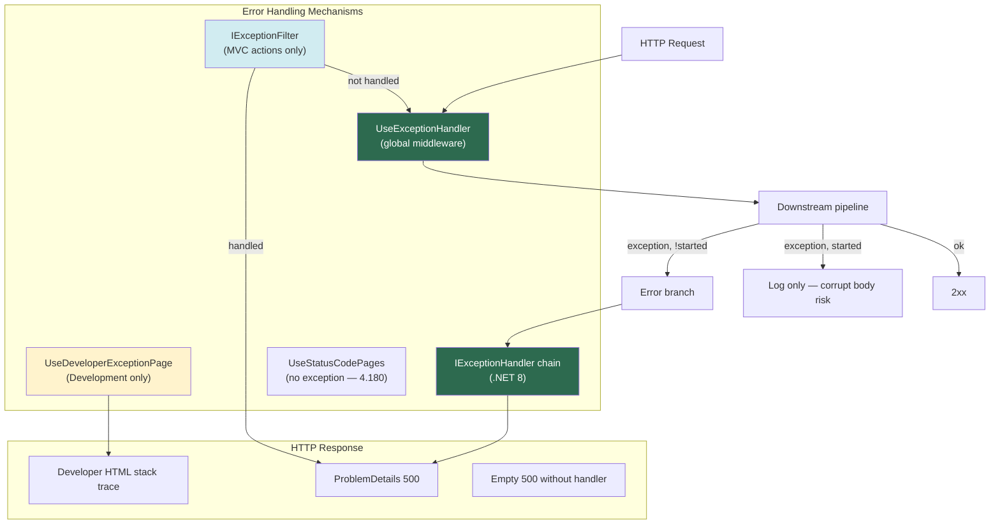
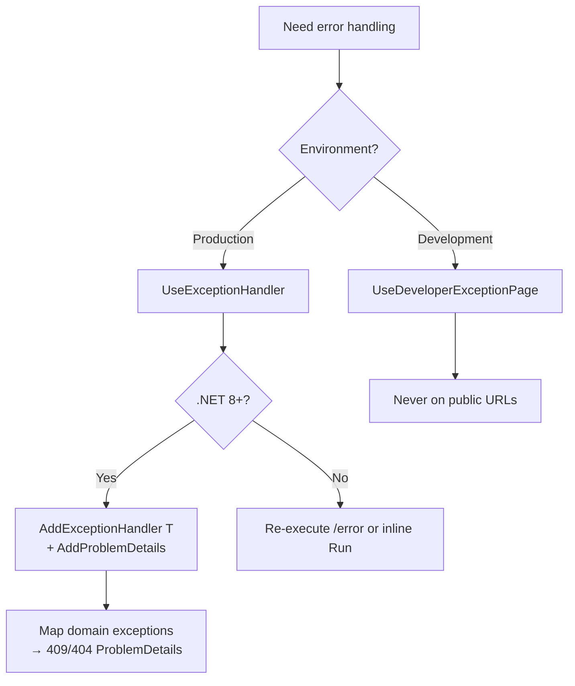

> [!success] Mastery Check
> - [ ] **Studied Well**
> - [ ] **Can explain the concept without notes**
> - [ ] **Can answer interview questions confidently**
> - [ ] **Can implement it in a real project**

# 4.177 — Exception Handling Middleware: UseExceptionHandler and Error Pipelines

---

## PART 0 — Navigation & Context

### Domain Hierarchy

```
ASP.NET Core Mastery
├── Middleware (4.049–4.063)
│   └── 4.052 — Canonical ordering (exception handler FIRST)
│
└── Error Handling (4.177–4.185)
    ├── ► 4.177 — UseExceptionHandler ◄ YOU ARE HERE
    ├── 4.178 — Developer Exception Page (Development only)
    ├── 4.179 — Problem Details (response shape)
    ├── 4.180 — Status Code Pages (non-exception 404/405)
    ├── 4.181 — Exception Filters (MVC actions only)
    ├── 4.182 — IExceptionHandler (.NET 8 typed handlers)
    ├── 4.183 — Correlation IDs in error responses
    └── 4.184 — Error monitoring (Sentry, App Insights)
```

### Prerequisites

| Prerequisite | Why |
|---|---|
| [[4.052 — Middleware Ordering]] | `UseExceptionHandler` must be **outermost** — it wraps the entire downstream pipeline |
| [[4.049 — Middleware Pipeline]] | Understand `next()`, short-circuit, and `HttpContext` features |
| [[4.003 — IWebHostEnvironment]] | Development vs Production determines Developer Page vs Exception Handler |

### What This Unlocks

| Topic | Dependency |
|---|---|
| [[4.182 — IExceptionHandler]] | Modern replacement for inline error path lambdas |
| [[4.179 — Problem Details]] | Standard JSON body written by exception handler |
| [[4.184 — Error Monitoring]] | Log/capture in handler before writing safe client response |

### Why This Matters at Scale

> **An unhandled exception in payment capture middleware at 2am must not return a blank HTTP 500 or a Kestrel stack trace to a mobile client — `UseExceptionHandler` as the first middleware catches failures from routing, auth, binding, and endpoints, logs with trace ID, and writes RFC 7807 Problem Details; if you register it after `UseRouting`, exceptions in earlier middleware never reach it.**

---

## PART 1 — The Core Mental Model

### The Fundamental Rule

> **`UseExceptionHandler` registers the outermost middleware that wraps all downstream components in a try/catch — when any unhandled exception propagates and the response has not started, ASP.NET Core branches to an error handler path (re-execute or inline delegate) that produces a new HTTP response, typically `application/problem+json` with status 500, without rethrowing to Kestrel.**

### The Plain-Language Analogy

The pipeline is a **hospital ward chain** — triage, labs, surgery, billing. `UseExceptionHandler` is the **central rapid-response team stationed at the hospital entrance**: no matter which ward throws a crisis (unhandled exception), the team takes over the case, writes a **standard incident report for the family** (Problem Details JSON for the HTTP client), and logs the full chart internally. If the patient was already wheeled into the ambulance with paperwork half-signed (**response started**), the team cannot rewrite the discharge summary — they can only document what happened.

### Taxonomy Diagram



---

## PART 2 — Deep Mechanics

### 2.1 — Pipeline Position (MUST BE FIRST)

```
──► UseExceptionHandler          ◄── OUTERMOST (wraps everything below)
    ──► UseHsts
    ──► UseHttpsRedirection
    ──► UseStaticFiles
    ──► UseRouting
    ──► UseCors
    ──► UseAuthentication
    ──► UseAuthorization
    ──► Custom middleware
    ──► Endpoints / MapControllers
```

**Wrong order consequence:**

```
──► UseRouting
    ──► UseExceptionHandler   ◄── WRONG: exceptions in Routing/Auth above never caught
```

**ASP.NET Core internally (approximate):**

```csharp
// ExceptionHandlerMiddleware.Invoke
try
{
    await _next(context);
}
catch (Exception ex)
{
    if (context.Response.HasStarted)
        throw; // cannot recover
    context.Features.Set<IExceptionHandlerFeature>(new ExceptionHandlerFeature { Error = ex, ... });
    await _errorHandler(context); // re-execute or custom pipeline
}
// Microsoft.AspNetCore.Diagnostics.ExceptionHandlerMiddleware
```

**Cost:** Zero on happy path — one try/catch frame; cold path allocates Problem Details (~1–2 KB).

---

### 2.2 — HTTP Wire Format (Production)

```
// HTTP request (approximate):
// POST /api/payments/capture HTTP/1.1
// Authorization: Bearer eyJ...
// Content-Type: application/json
// { "paymentId": "pay_123" }
//
// Downstream: NullReferenceException in PaymentCaptureService

// HTTP response (approximate) — UseExceptionHandler + AddProblemDetails:
// HTTP/1.1 500 Internal Server Error
// Content-Type: application/problem+json; charset=utf-8
// Cache-Control: no-cache, no-store
//
// {
//   "type": "https://tools.ietf.org/html/rfc9110#section-15.6.1",
//   "title": "An error occurred while processing your request.",
//   "status": 500,
//   "traceId": "00-7f3c2a1b9e8d4f6a5c3b2a1098765432-abcdef1234567890-00"
// }
```

**Client does NOT receive:** stack trace, connection string, internal type names (if handler configured correctly).

---

### 2.3 — Re-Execute Pattern

```csharp
var builder = WebApplication.CreateBuilder(args);
builder.Services.AddProblemDetails();

var app = builder.Build();

if (!app.Environment.IsDevelopment())
{
    app.UseExceptionHandler("/error");
    app.UseHsts();
}
else
{
    app.UseDeveloperExceptionPage();
}

app.Map("/error", (HttpContext httpContext) =>
{
    var feature = httpContext.Features.Get<IExceptionHandlerFeature>();
    var ex = feature?.Error;

    return Results.Problem(
        title: "An unexpected error occurred",
        statusCode: StatusCodes.Status500InternalServerError,
        extensions: new Dictionary<string, object?>
        {
            ["traceId"] = httpContext.TraceIdentifier
        });
});
```

**Pipeline behavior:** Original path `/api/payments/capture` fails → server **internally re-runs** pipeline for `/error` with same `HttpContext` but exception stored in `IExceptionHandlerFeature`.

**Edge case:** Error endpoint must not throw — infinite loop risk if `/error` itself fails.

---

### 2.4 — Inline Handler (No Re-Execute)

```csharp
app.UseExceptionHandler(errorApp =>
{
    errorApp.Run(async context =>
    {
        var feature = context.Features.Get<IExceptionHandlerFeature>();
        var logger = context.RequestServices.GetRequiredService<ILogger<Program>>();
        logger.LogError(feature?.Error, "Unhandled exception");

        await Results.Problem(statusCode: 500).ExecuteAsync(context);
    });
});
```

**Cost:** No second full pipeline traversal — **~0.1ms faster** than re-execute.

---

### 2.5 — Response Has Started

```
// Scenario: exception after response headers/body partially written
// e.g. streaming large export, failure mid-chunk

// HTTP client may see:
// HTTP/1.1 200 OK (already sent!)
// ... partial JSON ...
// connection reset or truncated body

// Server: ExceptionHandlerMiddleware rethrows — only logging possible
```

**Detection:** `context.Response.HasStarted == true`

---

### 2.6 — Exception Filters vs Global Handler

| Source | Caught by Exception Filter? | Caught by UseExceptionHandler? |
|---|---|---|
| Controller action | Yes (if not handled) | Yes (if filter doesn't handle) |
| Middleware before MVC | **No** | Yes |
| Minimal API delegate | **No** | Yes |
| Background thread | **No** | **No** |

---

### 2.7 — .NET 8 IExceptionHandler Integration

```csharp
builder.Services.AddExceptionHandler<PaymentExceptionHandler>();
builder.Services.AddProblemDetails();
app.UseExceptionHandler(); // dispatches to IExceptionHandler chain
```

See [[4.182 — IExceptionHandler]] — preferred for typed domain exception mapping.

---

## PART 3 — Production Code Patterns

### Pattern 1: Fintech — Standard Production Bootstrap

```csharp
if (app.Environment.IsDevelopment())
    app.UseDeveloperExceptionPage();
else
{
    app.UseExceptionHandler();
    app.UseHsts();
}

builder.Services.AddProblemDetails(options =>
{
    options.CustomizeProblemDetails = ctx =>
    {
        ctx.ProblemDetails.Extensions["traceId"] = ctx.HttpContext.TraceIdentifier;
    };
});
```

```
// Production unhandled exception → HTTP 500 application/problem+json + traceId
// Development → HTML page with stack trace at same failure point
```

---

### Pattern 2: E-Commerce — Map Domain Exceptions in Handler

```csharp
public sealed class CommerceExceptionHandler : IExceptionHandler
{
    public async ValueTask<bool> TryHandleAsync(
        HttpContext ctx, Exception ex, CancellationToken ct)
    {
        if (ex is InsufficientStockException stock)
        {
            await Results.Problem(
                title: "insufficient_stock",
                statusCode: StatusCodes.Status409Conflict,
                detail: stock.Message).ExecuteAsync(ctx);
            return true;
        }
        return false; // next handler or default 500
    }
}
```

```
// HTTP/1.1 409 Conflict
// Content-Type: application/problem+json
// { "title": "insufficient_stock", "status": 409, "detail": "SKU WIDGET-9: 2 requested, 1 available" }
```

---

### Pattern 3: ⚠️ WRONG — Exception Handler Not First

```csharp
// ⚠️ WRONG:
app.UseRouting();
app.UseAuthentication();
app.UseExceptionHandler(); // too late
app.MapControllers();
```

```
// HTTP: exception in UseAuthentication → Kestrel default 500, no Problem Details
// May leak Server: Kestrel bare response
```

```csharp
// ✅ CORRECT:
app.UseExceptionHandler();
app.UseRouting();
app.UseAuthentication();
```

---

### Pattern 4: Healthcare — Log Before Write, Never Throw in Handler

```csharp
errorApp.Run(async context =>
{
    var ex = context.Features.Get<IExceptionHandlerFeature>()?.Error;
    _logger.LogError(ex, "Unhandled error on {Path}", context.Request.Path);

    try
    {
        await _problemDetailsService.WriteAsync(new ProblemDetailsContext
        {
            HttpContext = context,
            ProblemDetails = { Status = 500, Title = "Server error" }
        });
    }
    catch (Exception handlerEx)
    {
        _logger.LogCritical(handlerEx, "Exception handler failed");
        context.Response.StatusCode = 500;
    }
});
```

---

### Pattern 5: Logistics — Correlation ID in Error Response (4.183)

```csharp
options.CustomizeProblemDetails = ctx =>
{
    var correlationId = ctx.HttpContext.Request.Headers["X-Correlation-Id"].FirstOrDefault()
        ?? ctx.HttpContext.TraceIdentifier;
    ctx.ProblemDetails.Extensions["correlationId"] = correlationId;
};
```

---

### Pattern 6: ⚠️ WRONG — Developer Page in Production

```csharp
// ⚠️ WRONG — staging slot with ASPNETCORE_ENVIRONMENT=Development on public URL
app.UseDeveloperExceptionPage();
```

```
// HTTP 500 HTML with full stack trace, connection strings in inner exceptions — CVE-class leak
```

---

### Pattern 7: Minimal API — Same Global Handler

```csharp
app.MapGet("/api/shipments/{id}", (Guid id, ShipmentService svc) =>
    svc.GetOrThrow(id)); // throws → UseExceptionHandler catches

// No exception filter — middleware is the only net
```

---

## PART 4 — Gotchas & Anti-Patterns

### Gotcha 1: Response Started — Cannot Fix Status Code

```csharp
// ⚠️ WRONG mental model: "exception handler always returns 500"
await response.WriteAsync(part); // headers sent
throw new Exception("late failure");
```

```
// HTTP consequence: client may have 200 + partial body — handler logs and rethrows
```

```csharp
// ✅ CORRECT: check HasStarted; use IAsyncEnumerable try/finally; or don't start response until ready
```

**WHY:** HTTP status line sent before exception — protocol forbids changing code mid-body.

---

### Gotcha 2: Throwing Inside Exception Handler

```csharp
// ⚠️ WRONG:
app.UseExceptionHandler(app => app.Run(ctx => throw new Exception("handler failed")));
```

```
// Unhandled secondary exception — process-level failure risk, undefined HTTP response
```

```csharp
// ✅ CORRECT: catch in handler, log, write minimal 500
```

---

### Gotcha 3: Relying on MVC Exception Filters for Middleware Errors

```csharp
// Exception in custom rate-limit middleware — IExceptionFilter never runs
```

```
// HTTP: only UseExceptionHandler saves you
```

---

### Gotcha 4: Re-Execute `/error` Requires Endpoint Registered

```csharp
app.UseExceptionHandler("/error");
// Forgot Map("/error") → secondary failure
```

---

### Gotcha 5: Double Exception Handling (Filter + Handler)

```csharp
// Filter sets ExceptionHandled = true with ProblemDetails
// Global handler never runs — OK
// Filter sets result but ExceptionHandled = false → exception propagates → double log
```

---

## PART 5 — Performance Implications

| Scenario | Pipeline Depth | Allocations | Latency | Recommendation |
|---|---|---|---|---|
| Happy path | +1 try frame | 0 | ~0 | Always use handler |
| Unhandled 500 | error branch | ~2 KB JSON | ~1–5ms | Log async |
| Re-execute `/error` | 2× pipeline | higher | ~2–10ms | Prefer inline or IExceptionHandler |
| Response started failure | N/A | 0 | 0 | Prevent early flush |
| Developer page | HTML gen | ~10 KB | ~5ms | Dev only |
| IExceptionHandler chain | 1 handler match | small | ~0.5ms | .NET 8 default |

### BenchmarkDotNet

```csharp
// Exception path is cold — benchmark happy path middleware overhead only
// Expected: ExceptionHandlerMiddleware adds ~10-30ns vs bare pipeline
// Profile production with dotnet-counters: exception-thrown rate
```

### When to Care

High exception rates (buggy deploy) — handler + logging saturation.

### When to Ignore

Overhead on success path — negligible vs business logic.

---

## PART 6 — Interview Arsenal

**Q1: Where do you put UseExceptionHandler and why?**

**Average:** "At the start of Program.cs."

> **Great Answer:** First middleware — outermost wrapper. It catches unhandled exceptions from routing, auth, my custom middleware, and endpoints. Production writes Problem Details 500 with traceId; Development uses DeveloperExceptionPage. If the response already started, I can't change the status — I design streaming endpoints to fail before flushing headers. MVC exception filters only cover controller actions; Minimal API and middleware need this global handler.

**Q2: Difference between UseExceptionHandler and UseStatusCodePages?**

> Exception handler catches **thrown exceptions**. Status code pages handle **empty-body error status codes** like 404 from routing with no exception — different pipeline paths (4.180).

**Trick:** "Exception filters replace global handler" — false for middleware/Minimal API.

**Red flags:** Developer page in production; handler registered after routing; exposing `exception.Message` in `detail` for 500s.

---

## PART 7 — Decision Framework



---

## PART 8 — Self-Check

1. What happens if exception occurs after `Response.HasStarted`?
2. Does `IExceptionFilter` catch Minimal API exceptions?
3. What feature holds the caught exception on re-execute?
4. **What HTTP status/body** for unhandled exception in Production with `AddProblemDetails`?
5. Why must `/error` endpoint not throw?

**Puzzle:**

```csharp
app.UseRouting();
app.UseExceptionHandler();
app.MapGet("/boom", () => { throw new Exception(); });
// Unhandled exception — Problem Details?
```

<details><summary>Answer</summary>Routing runs before handler in this order — **depends on where throw occurs**. If throw in endpoint after routing, handler catches it. If throw in middleware registered **before** UseExceptionHandler (there is none above), handler catches. **UseRouting before handler is WRONG** for middleware exceptions above handler — endpoint throw still caught. Middleware **between** routing and handler: not caught if above handler. Canonical fix: handler **first**.</details>

---

## PART 9 — Connections & Resources

| Topic | Why |
|---|---|
| [[4.182 — IExceptionHandler]] | Typed .NET 8 handler chain |
| [[4.179 — Problem Details]] | Response body format |
| [[4.178 — Developer Page]] | Development alternative |
| [[4.052 — Middleware Ordering]] | Must be first |

- [Handle errors in ASP.NET Core](https://learn.microsoft.com/en-us/aspnet/core/fundamentals/error-handling)
- [ExceptionHandlerMiddleware](https://learn.microsoft.com/en-us/dotnet/api/microsoft.aspnetcore.diagnostics.exceptionhandlermiddleware)

> [!NOTE] Part 0–9: outermost exception middleware, Problem Details 500, response-started edge case, filters vs global scope.
