# 4.177 — Serilog & Structured Logging

## PART 0 — Navigation & Context

```text
ASP.NET Core Domain Hierarchy
├── Observability & Telemetry
│   ├── 4.175 Health Checks Architecture
│   ├── 4.176 Kubernetes Liveness & Readiness Probes
│   ├── 4.177 Serilog & Structured Logging ◄ YOU ARE HERE
│   └── 4.220 OpenTelemetry Integration
└── Infrastructure
```

**What you need before this:**
- Familiarity with the built-in ASP.NET Core `ILogger<T>`.
- Understanding of Dependency Injection.

**What this unlocks after:**
- Centralized log aggregation in ElasticSearch, Seq, or Datadog.
- Building custom Correlation ID middleware to trace requests across microservices.
- Setting up OpenTelemetry traces.

**Why this matters to a production engineer at scale:**
When you build a monolith on your laptop, reading raw text from the Console window is fine. When you deploy 50 microservices to a Kubernetes cluster, generating 10,000 log lines per second, text logs become completely useless. If a customer says "My payment failed", you cannot `grep` across 50 servers for the word "payment error". 
**Structured Logging** treats logs not as strings of text, but as JSON objects containing highly queryable properties (e.g., `{"UserId": 123, "Action": "Payment", "Status": "Failed"}`). Serilog is the absolute gold standard for structured logging in the .NET ecosystem. Replacing the default Microsoft logger with Serilog is one of the very first things a senior engineer does when bootstrapping a new .NET microservice.

---

## PART 1 — The Core Mental Model

> **The Fundamental Rule**
> **String-based logging flattens critical variables into unqueryable text sentences; Structured Logging extracts those variables, preserves their data types, and writes the log as a structured JSON document, allowing modern aggregators (ElasticSearch, Splunk) to filter, group, and alert on exact properties with zero text parsing.**

**The Plain-Language Analogy**
Imagine taking inventory of a warehouse.
**String Logging (The Old Way):** You write an essay: *"On Tuesday, John counted 50 boxes of Apples in Aisle 4. They are red."* Later, your boss asks: "How many total boxes are in Aisle 4?" You have to read 1,000 essays, find the word "Aisle 4", and manually extract the number next to the word "boxes".
**Structured Logging (Serilog):** You fill out a spreadsheet form. `[Date: Tuesday, Worker: John, Item: Apples, Quantity: 50, Aisle: 4]`. When your boss asks the same question, they just write a SQL query: `SELECT SUM(Quantity) FROM Inventory WHERE Aisle = 4`. The answer is instantaneous.

**The Taxonomy Diagram**

```mermaid
graph TD
    A[ASP.NET Core Application] -->|Injects| B(ILogger<T>)
    
    B -->|Calls LogInformation| C{String Interpolation vs Message Templates}
    
    C -->|$"User {id} logged in"| D[Flattens to pure String]
    C -->|"User {UserId} logged in", id| E[Extracts structured properties]
    
    D --> F[Serilog Pipeline]
    E --> F
    
    F -->|Enrichers| G[Add CorrelationId, MachineName]
    
    G --> H{Sinks - Destinations}
    
    H --> I[Console Sink]
    I -->|Renders| J[Text: User 123 logged in]
    
    H --> K[Seq / ElasticSearch Sink]
    K -->|Renders| L[JSON: { "MessageTemplate": "...", "UserId": 123, "CorrelationId": "abc" }]
    
    style A fill:#2d3436,stroke:#b2bec3,stroke-width:2px,color:#fff
    style B fill:#0984e3,stroke:#74b9ff,stroke-width:2px,color:#fff
    style F fill:#00b894,stroke:#55efc4,stroke-width:2px,color:#fff
    style E fill:#00b894,stroke:#55efc4,stroke-width:2px,color:#fff
    style L fill:#d63031,stroke:#ff7675,stroke-width:2px,color:#fff
```

---

## PART 2 — Deep Mechanics

### 1. Message Templates (The Secret Sauce)
The entire foundation of structured logging relies on **Message Templates** instead of standard C# String Interpolation (`$""`).

- **String Interpolation (Bad for Logging):** `_logger.LogInformation($"Order {order.Id} failed");`
  The compiler converts this into the literal string `"Order 123 failed"`. The logging framework has no idea what `123` is. It's just text.
- **Message Template (Good):** `_logger.LogInformation("Order {OrderId} failed", order.Id);`
  Serilog parses the template. It extracts the value of `order.Id` and attaches it to a strongly-typed property named `OrderId`.

### 2. Sinks (Destinations)
Serilog refers to log destinations as **Sinks**. 
- `Console`: Writes to stdout (Standard Output).
- `File`: Writes to disk with rolling policies (e.g., new file every day).
- `Seq`: A structured log server popular in the .NET world.
- `ElasticSearch` / `Datadog` / `ApplicationInsights`: Cloud-scale aggregators.
You can configure Serilog to write to multiple sinks simultaneously.

### 3. Enrichers
Enrichers automatically attach global context to *every* log line without you having to write it.
- `ThreadId`: Attaches the managed thread ID.
- `MachineName`: Attaches the Kubernetes Pod name.
- **LogContext:** Allows you to push variables (like `CorrelationId` or `TenantId`) into a scope. Every log written within that HTTP request automatically inherits those variables.

### 4. Replacing the Default Logger
ASP.NET Core comes with a built-in logging system. While it technically supports structured logging, Serilog's ecosystem of Enrichers, Sinks, and Configuration is vastly superior. By calling `builder.Host.UseSerilog()`, you completely override the built-in Microsoft logger, routing all internal framework logs (e.g., Kestrel, EF Core) through Serilog's pipeline.

---

## PART 3 — Production Code Patterns

### Pattern 1: Bootstrapping Serilog (Two-Stage Initialization)
The absolute best practice for setting up Serilog is "Two-Stage Initialization". This ensures that if the ASP.NET Core DI container crashes during startup (e.g., a bad appsettings.json), the fatal error is actually logged.

```bash
dotnet add package Serilog.AspNetCore
```

```csharp
// Program.cs
using Serilog;

// STAGE 1: Setup a bare-minimum Serilog instance immediately to catch boot errors
Log.Logger = new LoggerConfiguration()
    .WriteTo.Console()
    .CreateBootstrapLogger();

try
{
    Log.Information("Starting web application");
    var builder = WebApplication.CreateBuilder(args);

    // STAGE 2: Replace the bootstrap logger with the fully configured logger
    // which can read from appsettings.json and use DI services.
    builder.Host.UseSerilog((context, services, configuration) => configuration
        .ReadFrom.Configuration(context.Configuration)
        .ReadFrom.Services(services)
        .Enrich.FromLogContext()
        .WriteTo.Console(outputTemplate: "[{Timestamp:HH:mm:ss} {Level:u3}] {Message:lj} <s:{SourceContext}>{NewLine}{Exception}"));

    var app = builder.Build();
    
    // Add Serilog Request Logging (logs 1 line per HTTP request instead of ASP.NET's messy 10 lines)
    app.UseSerilogRequestLogging(); 

    app.MapGet("/", () => "Hello World");
    app.Run();
}
catch (Exception ex)
{
    // Catches DI failures, database migration crashes, etc.
    Log.Fatal(ex, "Application terminated unexpectedly");
}
finally
{
    // Ensure all buffered logs are flushed to network/disk before process dies
    Log.CloseAndFlush();
}
```

### Pattern 2: Capturing Objects with the `@` Operator
If you pass a complex C# object to Serilog, it calls `.ToString()`, which usually just prints the class name. To force Serilog to serialize the object into JSON, prepend the property name with `@` (Destructuring).

```csharp
var user = new { Id = 123, Name = "Alice", Role = "Admin" };

// ✅ CORRECT: The @ operator tells Serilog to serialize the object
_logger.LogInformation("User created: {@User}", user);

// Result in ElasticSearch/Seq:
// {
//   "MessageTemplate": "User created: {@User}",
//   "User": { "Id": 123, "Name": "Alice", "Role": "Admin" }
// }
```

### Pattern 3: Correlation IDs using LogContext
When Microservice A calls Microservice B, you need to tie their logs together. You generate a Correlation ID, pass it via HTTP headers, and use `LogContext.PushProperty` in middleware.

```csharp
// 1. Ensure Enrich.FromLogContext() is configured in Program.cs!

// 2. Correlation Middleware
public class CorrelationIdMiddleware
{
    private readonly RequestDelegate _next;

    public CorrelationIdMiddleware(RequestDelegate next) => _next = next;

    public async Task InvokeAsync(HttpContext context)
    {
        // Check if caller sent an ID, otherwise generate one
        var correlationId = context.Request.Headers["X-Correlation-ID"].FirstOrDefault() 
                            ?? Guid.NewGuid().ToString();

        // Pushes the property into the Serilog AsyncLocal context.
        // EVERY log written during this request will now contain "CorrelationId": "..."
        using (LogContext.PushProperty("CorrelationId", correlationId))
        {
            context.Response.Headers.Append("X-Correlation-ID", correlationId);
            await _next(context);
        }
    }
}
```

### Pattern 4: Configuration via appsettings.json
Hardcoding Sinks in C# requires recompiling when you move from Dev (Console) to Prod (ElasticSearch). Using `Serilog.Settings.Configuration` is vastly preferred.

```json
{
  "Serilog": {
    "Using": [ "Serilog.Sinks.Console", "Serilog.Sinks.Seq" ],
    "MinimumLevel": {
      "Default": "Information",
      "Override": {
        "Microsoft.AspNetCore": "Warning", // Silence Kestrel spam
        "Microsoft.EntityFrameworkCore.Database.Command": "Warning" // Silence SQL queries
      }
    },
    "Enrich": [ "FromLogContext", "WithMachineName", "WithThreadId" ],
    "WriteTo": [
      { "Name": "Console" },
      {
        "Name": "Seq",
        "Args": { "serverUrl": "http://seq:5341" }
      }
    ]
  }
}
```

### Pattern 5: Serilog Request Logging
By default, ASP.NET Core logs about 5-8 lines of text for a single HTTP request (Routing, Executing, Executed, etc.). This pollutes your log server. 
Calling `app.UseSerilogRequestLogging()` condenses the entire HTTP request lifecycle into a **single, highly structured log event**.

```csharp
// Program.cs
app.UseSerilogRequestLogging(options =>
{
    // Attach custom properties to the summary log
    options.EnrichDiagnosticContext = (diagnosticContext, httpContext) =>
    {
        diagnosticContext.Set("RequestHost", httpContext.Request.Host.Value);
        diagnosticContext.Set("UserAgent", httpContext.Request.Headers["User-Agent"].FirstOrDefault());
        
        if (httpContext.User.Identity?.IsAuthenticated == true)
        {
            diagnosticContext.Set("UserId", httpContext.User.Identity.Name);
        }
    };
});
```

---

## PART 4 — Gotchas & Anti-Patterns

### Gotcha 1: String Interpolation (The Ultimate Sin)
Developers used to `Console.WriteLine` will instinctively use `$""`.

// ⚠️ WRONG CODE
```csharp
_logger.LogInformation($"Processed order {order.Id} for user {user.Name}");
```

// HTTP consequence (wrong path):
// The log aggregator receives `"Processed order 123 for user Alice"`. You cannot query your database for `OrderId = 123` because Serilog never captured `OrderId` as a property. It was destroyed by the C# compiler before Serilog ever saw it.

// ✅ CORRECT CODE
```csharp
_logger.LogInformation("Processed order {OrderId} for user {UserName}", order.Id, user.Name);
// Now you can query: SELECT * FROM Logs WHERE OrderId = 123
```

### Gotcha 2: High Cardinality Message Templates
If you use variables *inside* the message template definition, Serilog treats every variation as a unique template. Log servers group logs by the Message Template hash. If the template is constantly changing, you break the grouping algorithm and bloat the log server.

// ⚠️ WRONG CODE
```csharp
// This creates a NEW message template for every user!
_logger.LogInformation("User " + user.Name + " logged in"); 
```

// ✅ CORRECT CODE
```csharp
// Creates exactly ONE template hash: "User {UserName} logged in"
_logger.LogInformation("User {UserName} logged in", user.Name);
```

### Gotcha 3: Destructuring Massive Objects
Using the `@` operator on an EF Core Entity that has cyclic navigation properties.

// ⚠️ WRONG CODE
```csharp
var customer = await _db.Customers.Include(c => c.Orders).FirstAsync();
_logger.LogInformation("Loaded customer {@Customer}", customer);
```

// HTTP consequence (wrong path):
// Serilog's destructuring engine attempts to serialize the `Customer`. It navigates to `Orders`. Each `Order` navigates back to `Customer`. Serilog detects a cycle (or reaches its depth limit), throws exceptions, or generates massive 5MB log payloads that crash your network stack and incur massive AWS bandwidth costs.

// ✅ CORRECT CODE
```csharp
// ONLY destructure flat DTOs, or log specific primitive properties.
_logger.LogInformation("Loaded customer {CustomerId} with {OrderCount} orders", 
    customer.Id, customer.Orders.Count);
```

### Gotcha 4: Forgetting Log.CloseAndFlush()
When an application crashes or shuts down, Serilog usually has logs sitting in an asynchronous memory buffer waiting to be sent over the network to Seq or ElasticSearch.

// ⚠️ WRONG CODE
// Letting `Main()` end without calling flush.

// HTTP consequence (wrong path):
// The application crashes due to a fatal DB error. The log detailing the fatal error is put in the buffer. The process exits. The buffer is destroyed. You never see the fatal error log.

// ✅ CORRECT CODE
```csharp
// See Pattern 1: Always put Log.CloseAndFlush() in a finally block in Program.cs.
```

### Gotcha 5: Logging PII and Passwords
Blindly logging incoming HTTP request bodies.

// ⚠️ WRONG CODE
```csharp
_logger.LogInformation("Received payload: {@Payload}", requestDto);
```

// HTTP consequence (wrong path):
// If `requestDto` is a Login model, you just logged plaintext user passwords into ElasticSearch. Anyone with access to Splunk/Datadog can steal customer passwords.

// ✅ CORRECT CODE
// Use Serilog Destructuring Policies (`Destructure.ByTransforming<LoginRequest>(r => new { r.Username, Password = "***" })`) to mask sensitive fields automatically.

---

## PART 5 — Performance Implications

### Request Pipeline Characteristics

| Scenario | Network Hop | Allocations | Approx Latency Impact | Recommendation |
|---|---|---|---|---|
| String Interpolation | None | High | < 1ms | Anti-pattern. Avoid. |
| Message Templates | None | Low | < 0.1ms | Serilog's parser is highly cached. |
| Async Sink (e.g. Seq) | Background | Medium | 0ms (Non-blocking) | Always use Async wrappers for network sinks. |

### BenchmarkDotNet Code

*(Benchmarking String Interpolation vs Structured Logging)*

```csharp
using BenchmarkDotNet.Attributes;
using Microsoft.Extensions.Logging;

[MemoryDiagnoser]
public class SerilogAllocationBenchmark
{
    private ILogger<SerilogAllocationBenchmark> _logger;
    private int _userId = 12345;

    [GlobalSetup]
    public void Setup()
    {
        // Setup mock logger
        var factory = LoggerFactory.Create(b => b.AddSerilog());
        _logger = factory.CreateLogger<SerilogAllocationBenchmark>();
    }

    [Benchmark]
    public void BadStringInterpolation()
    {
        // Allocates a new string immediately
        _logger.LogInformation($"User {_userId} logged in");
    }

    [Benchmark]
    public void GoodStructuredTemplate()
    {
        // Passes the primitive int. Serilog boxes it, but caches the template.
        _logger.LogInformation("User {UserId} logged in", _userId);
    }
}
```

**When to Care:** Serilog is incredibly fast. The primary performance risk is not CPU, but **Network I/O** and **Log Server Cost**. If you log 1,000 lines per request (e.g., inside a `foreach` loop), you will saturate your network adapters sending JSON payloads to ElasticSearch, and Datadog will bill you thousands of dollars a month for ingestion. Control your `MinimumLevel` via `appsettings.json`.

---

## PART 6 — Interview Arsenal

### A. The Question Bank

**Question 1:** "What is the difference between writing `_logger.LogInformation($\"Order {orderId} created\")` and `_logger.LogInformation(\"Order {OrderId} created\", orderId)`?"
- **Average Answer:** "The first one is string interpolation, the second is structured."
- **Why That's Insufficient:** Fails to explain *why* it matters to the log aggregator.
- **Great Answer:** "The first approach uses C# string interpolation. The compiler flattens the variable into a string before the logging framework even sees it. The log aggregator just receives a flat text sentence. You cannot easily query or filter by the Order ID. The second approach uses a Message Template. Serilog parses the template, extracts the `OrderId` value, and attaches it as a strongly-typed, discrete property in the resulting JSON document. This allows us to use SQL-like queries in ElasticSearch or Seq to filter logs specifically where `OrderId == 123`."

**Question 2:** "Our microservice architecture processes a single user request across 4 different APIs. When a failure occurs in API #4, how can we easily find the logs from API #1, #2, and #3 that led up to the failure?"
- **Average Answer:** "Search by the user's name in the logs."
- **Why That's Insufficient:** Users might have hundreds of concurrent requests. It doesn't group the specific transaction.
- **Great Answer:** "We need to implement a Correlation ID. At the entry point (API #1), we generate a unique `Guid` and push it into the Serilog `LogContext` (using `Enrich.FromLogContext()`). This attaches the Correlation ID to every log line generated by API #1. When API #1 makes an HTTP call to API #2, we pass the Correlation ID in an HTTP Header (e.g., `X-Correlation-ID`). API #2 reads the header via middleware and pushes it into its own `LogContext`. If API #4 fails, we take the Correlation ID from the error log, paste it into Seq/ElasticSearch, and we instantly see the sequential timeline of every log line across all 4 microservices for that specific transaction."

**Question 3:** "Why do we use the Two-Stage Initialization pattern with `Log.Logger = new LoggerConfiguration().CreateBootstrapLogger()` in `Program.cs`?"
- **Average Answer:** "Because the docs say so."
- **Why That's Insufficient:** Misses the critical concept of catching DI crashes.
- **Great Answer:** "If we rely solely on `builder.Host.UseSerilog()`, Serilog is only instantiated *after* the ASP.NET Core DI container is built. If our application crashes before or during DI compilation (for example, due to a malformed `appsettings.json` or a failed database connection during startup), the application will exit silently, and no logs will be sent to our aggregator. By setting up a Bootstrap Logger in a `try/catch` block wrapping `Program.cs`, we ensure that fatal startup exceptions are guaranteed to be captured and logged."

### B. The Trick Questions

**Trick Question:** "If I use `_logger.LogInformation(\"Data: {@Payload}\", largeObject)`, but `largeObject` is an Entity Framework object with cyclic navigation properties, what happens?"
- **The Trap:** Believing the `@` operator is perfectly safe.
- **The Correct Answer:** "The `@` destructuring operator instructs Serilog to reflect over the object and serialize it into JSON. If the object has cyclic references (like Customer -> Orders -> Customer), Serilog will encounter a cycle. While Serilog has internal depth limits to prevent infinite loops, it will still generate a massive, deeply nested JSON document, heavily allocating memory and potentially filling up log storage. You should only destructure flat DTOs or specific primitive properties."

**Trick Question:** "Does Serilog replace the `ILogger<T>` interface in our controllers?"
- **The Trap:** Thinking you have to inject `Serilog.ILogger`.
- **The Correct Answer:** "No. Serilog integrates seamlessly into the Microsoft.Extensions.Logging infrastructure. You continue to inject the standard `ILogger<T>` into your controllers. `builder.Host.UseSerilog()` simply reroutes all calls made to `ILogger<T>` down into the Serilog pipeline. This prevents vendor lock-in within your business logic."

### C. Red Flags to Avoid
- 🚩 **"I just log everything to a text file on the server."** (Text files on ephemeral Docker containers are deleted when the container restarts. You must log to `stdout` or network sinks).
- 🚩 **"I use `Log.Information(...)` statically inside my services instead of injecting `ILogger<T>`."** (Makes unit testing difficult and breaks the abstraction layer).

---

## PART 7 — Decision Framework

```mermaid
graph TD
    A[Setup Logging] --> B{Log Destination?}
    
    B -->|Local Dev| C[Console Sink]
    B -->|Kubernetes| D[Console Sink to stdout --> FluentBit --> ElasticSearch]
    B -->|Cloud PaaS| E[Seq / Application Insights Sink]
    
    C --> F{Do you need to group requests?}
    D --> F
    E --> F
    
    F -->|Yes| G[Add CorrelationId Middleware & LogContext Enricher]
    
    G --> H{Are you logging objects?}
    
    H -->|Yes| I[Use @ operator on DTOs]
    H -->|No| J[Use standard Message Templates]
    
    style A fill:#2d3436,stroke:#fff
    style D fill:#0984e3,stroke:#fff
    style G fill:#00b894,stroke:#fff
    style I fill:#d63031,stroke:#fff
```



---

## PART 8 — Self-Check

### A. Conceptual Questions
1. Why is structured logging superior to string concatenation for production troubleshooting?
2. What does the `@` operator do in a Serilog message template?
3. What is the purpose of `app.UseSerilogRequestLogging()`?
4. How do you silence the massive amount of `Microsoft.AspNetCore` routing logs using `appsettings.json`?
5. Why is `Log.CloseAndFlush()` necessary in `Program.cs`?
6. How does `LogContext.PushProperty` enable distributed tracing?
7. Why must Serilog Destructuring be used carefully with Entity Framework Core models?
8. What is the Two-Stage Initialization pattern?

### B. Code Puzzles

**Puzzle 1: The Invisible Variable**
```csharp
var status = "Success";
_logger.LogInformation("Database update finished with status {Status}");
```
*Scenario:* The log appears in Seq, but the `Status` property is missing.
<details>
<summary>Answer</summary>
The developer put `{Status}` in the template but forgot to pass the variable as an argument to the method. Serilog treats it as literal text `{Status}`.
*Fix:* `_logger.LogInformation("...", status);`
</details>

**Puzzle 2: The Splintered Template**
```csharp
string[] errors = { "DB Offline", "Timeout" };
foreach(var err in errors) {
    _logger.LogError("Critical failure: " + err);
}
```
*Scenario:* The log aggregator shows two completely separate error groups instead of grouping them together.
<details>
<summary>Answer</summary>
String concatenation dynamically generates the template: `"Critical failure: DB Offline"` and `"Critical failure: Timeout"`. The log server treats them as different message templates entirely.
*Fix:* `_logger.LogError("Critical failure: {ErrorDetails}", err);`. Now they both group under the same `"Critical failure: {ErrorDetails}"` template hash.
</details>

**Puzzle 3: The Context Leak**
```csharp
LogContext.PushProperty("UserId", 123);
await _next(context);
```
*Scenario:* User A logs in. Then User B logs in. User B's logs show `UserId: 123`.
<details>
<summary>Answer</summary>
`PushProperty` returns an `IDisposable`. If you don't wrap it in a `using` statement, the property leaks into the `AsyncLocal` context and pollutes threads reused by the ThreadPool.
*Fix:* `using (LogContext.PushProperty(...)) { ... }`
</details>

---

## PART 9 — Connections & Resources

### A. Related Topics Table

| Topic | Why It Connects |
|---|---|
| [[4.050 — Writing Middleware]] | Explains how Correlation ID and Serilog Request Logging middleware work. |
| [[4.220 — OpenTelemetry Integration]] | The modern evolution. Moving beyond correlated logs into Distributed Traces and Spans. |
| [[4.060 — Exception Handling Middleware]] | Global error handlers rely heavily on Serilog to capture StackTraces. |

### B. Books

| Book | Chapters | Why These Chapters |
|---|---|---|
| ASP.NET Core in Action, 3rd Ed | Chapter 18: Logging and tracing | The definitive guide to setting up Serilog with seq. |
| Pro ASP.NET Core 6 | Chapter 23: Application Diagnostics | Compares ILogger with Serilog. |

### C. Essential Articles & Docs
- [Serilog Official Documentation](https://github.com/serilog/serilog/wiki)
- [Nicholas Blumhardt (Creator of Serilog/Seq): Blog](https://nblumhardt.com/)
- [Microsoft Docs: Logging in C# and .NET](https://learn.microsoft.com/en-us/dotnet/core/extensions/logging)

> [!NOTE]
> **Template Meta-Note**
> Part 0: Context & Prerequisites. Part 1: Core Mental Model. Part 2: Deep Mechanics & Pipeline. Part 3: Production Code. Part 4: Gotchas. Part 5: Performance. Part 6: Interview Arsenal. Part 7: Decision Framework. Part 8: Puzzles. Part 9: Resources.
