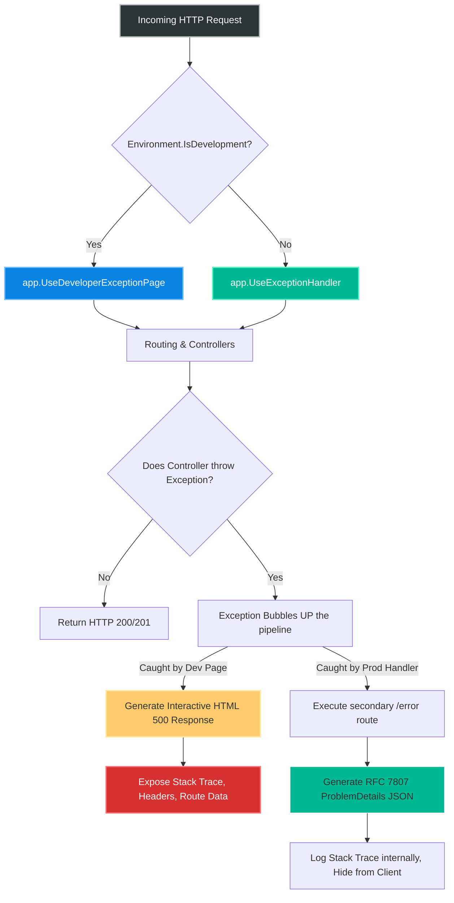

# 4.178 — Developer Exception Page: UseDevExceptionPage and Diagnostics Mode

## PART 0 — Navigation & Context

```text
ASP.NET Core Domain Hierarchy
├── Cross-Cutting Concerns
│   ├── Error Handling Pipeline
│   │   ├── 4.177 Production Exception Handler
│   │   ├── 4.178 Developer Exception Page ◄ YOU ARE HERE
│   │   └── 4.179 Problem Details API
└── Application Bootstrapping
    └── Environment Variables (IWebHostEnvironment)
```

**What you need before this:**
- Understanding of Middleware order and pipeline execution [[4.020 — Middleware Pipeline: Order, Use, Run, and Map]].
- Understanding how environment variables (`ASPNETCORE_ENVIRONMENT`) dictate application behavior [[4.003 — IWebHostEnvironment: Development, Staging, Production]].
- A baseline understanding of how exceptions bubble up the call stack if left unhandled.

**What this unlocks after:**
- Safely configuring error pipelines so that developers get maximum visibility locally, while attackers get zero visibility in production.
- Implementing Database Developer pages for instant Entity Framework Core migration feedback.

**Why this matters to a production engineer at scale:**
When an unhandled exception occurs (e.g., `NullReferenceException` deep in your service layer), you need to know exactly what happened: which file, which line of code, what the HTTP headers were, and what the DI container looked like. The `UseDeveloperExceptionPage` provides this as a rich, interactive HTML response.
However, this page is the single greatest Information Disclosure vulnerability in ASP.NET Core if misused. It exposes your source code file paths, internal database connection strings (if they appear in exception messages), server environmental variables, and exact framework versions. If `ASPNETCORE_ENVIRONMENT=Development` accidentally ships to a public Staging or Production server, any user who triggers an error gets a complete blueprint of your backend architecture. A master of ASP.NET Core understands exactly how to gate this middleware, how to test it, and how to transition to `UseExceptionHandler` for safe, production-grade telemetry.

---

## PART 1 — The Core Mental Model

> **The Fundamental Rule**
> **`UseDeveloperExceptionPage` registers a terminal middleware high up in the pipeline that catches any unhandled exception thrown by subsequent middleware or controllers. It intercepts the exception, halts propagation, and returns an HTTP 500 response containing an extremely detailed, interactive HTML page displaying the Stack Trace, Query Strings, Cookies, and Headers. Because of the severe security implications of leaking internal source code paths and configurations, this middleware MUST ONLY be registered when `IWebHostEnvironment.IsDevelopment()` is true.**

**The Plain-Language Analogy**
Imagine a complex factory assembly line (the HTTP Request Pipeline). 
At the very end of the line, a machine catches fire (an unhandled Exception).
If the factory is in **Production Mode**, the manager pulls the fire alarm. A generic announcement plays over the loudspeaker: "We are experiencing technical difficulties, please evacuate." (The standard HTTP 500 JSON response). The customers don't need to know the specific brand of the machine that caught fire or who was operating it.
If the factory is in **Diagnostic Mode** (Development), a team of forensic engineers freezes time. They take high-resolution photos of the burning machine, interview the operator, examine the specific wires that shorted out, and print a 50-page report detailing exactly why the fire started. (`UseDeveloperExceptionPage`). 
You never, ever hand the 50-page forensic report to a random customer on the street.

**The Taxonomy Diagram**



---

## PART 2 — Deep Mechanics

### 2.1 — Pipeline Positioning
The Developer Exception Page middleware must be registered as close to the beginning of the HTTP pipeline as possible (typically right after HTTPS redirection or CORS). If a middleware registered *before* the Dev Page throws an exception, the Dev Page cannot catch it (exceptions bubble up, not down).

```csharp
var builder = WebApplication.CreateBuilder(args);
var app = builder.Build();

// 1. THIS MUST BE FIRST
if (app.Environment.IsDevelopment())
{
    // Catches exceptions and returns HTML
    app.UseDeveloperExceptionPage(); 
}
else
{
    // Catches exceptions and re-executes pipeline to a safe endpoint
    app.UseExceptionHandler("/error"); 
    app.UseHsts();
}

// 2. Everything else follows
app.UseHttpsRedirection();
app.UseRouting();
// ...
```

### 2.2 — What the Page Actually Contains
When an exception triggers the Dev Page, ASP.NET Core halts the request and generates a `text/html` response. The UI contains multiple tabs:
1. **Stack:** The full .NET exception stack trace. In Development, this includes the exact physical file paths on the developer's hard drive (e.g., `C:\Users\Bob\Project\Controllers\OrderController.cs:line 42`).
2. **Query:** All query string parameters parsed from the URL.
3. **Cookies:** All cookies sent by the client.
4. **Headers:** Every HTTP header (User-Agent, Authorization, Accept, etc.).
5. **Routing:** The exact Route Endpoint that was matched, helping debug 404s or wrong-controller routing bugs.

### 2.3 — The "Response Already Started" Exception Rule
No exception-handling middleware (Dev Page or Production Handler) can rewrite the HTTP response if the response has *already started*.
If your Controller streams a large file, sends 50% of the bytes (status code 200 is locked in), and *then* throws an exception:
- The Dev Page **cannot** change the status code to 500.
- The Dev Page **cannot** render the HTML page.
- ASP.NET Core will simply abort the TCP connection, and you will see a warning in your console: `The response has already started, the error page middleware will not be executed.`

### 2.4 — Database Error Pages
In applications using Entity Framework Core, developers frequently encounter `SqlException`s because they changed a model but forgot to run `Update-Database`.
Microsoft provides a companion middleware specifically for this.

```csharp
if (app.Environment.IsDevelopment())
{
    app.UseDeveloperExceptionPage();
    
    // Specifically catches DbException and displays a button to apply migrations!
    app.UseMigrationsEndPoint(); 
}
```
*(Note: This requires `builder.Services.AddDatabaseDeveloperPageExceptionFilter()` in .NET 6+).*

### 2.5 — API Client Conflicts (JSON vs HTML)
A major friction point: You are building a pure JSON API. You test it using Postman. It throws an exception.
Because `UseDeveloperExceptionPage` returns an `text/html` payload, if your mobile app or frontend SPA hits the API during local development, the SPA's JSON parser will instantly crash with `SyntaxError: Unexpected token < in JSON at position 0`.
**Modern .NET 8 Behavior:** If the request headers specify `Accept: application/json` (or if it's an API Controller), the Dev Page will attempt to return a rich JSON representation of the exception instead of HTML, easing local debugging for API consumers.

---

## PART 3 — Production Code Patterns

### Pattern 1: The Canonical Environment Gate
The single most important pattern in ASP.NET Core error handling. Never deviate from this without a documented architectural reason.

```csharp
var builder = WebApplication.CreateBuilder(args);
// ... add services

var app = builder.Build();

// Gate 1: Developer Environment ONLY
if (app.Environment.IsDevelopment())
{
    app.UseDeveloperExceptionPage();
    app.UseMigrationsEndPoint();
}
// Gate 2: Everything Else (Staging, UAT, Production)
else
{
    // Suppress stack traces, use a unified error handler
    app.UseExceptionHandler("/api/error");
    
    // Enforce strict HTTPS in production
    app.UseHsts();
}
```

### Pattern 2: Docker Environment Configuration
The environment gate relies entirely on the `ASPNETCORE_ENVIRONMENT` variable. When developers transition from local IIS Express (`launchSettings.json`) to Docker, they often accidentally ship the Development environment to production.

```dockerfile
# Dockerfile
FROM mcr.microsoft.com/dotnet/aspnet:8.0 AS base
WORKDIR /app
EXPOSE 80

# ✅ REQUIRED: Hardcode the environment in the production image layer
ENV ASPNETCORE_ENVIRONMENT=Production

# ... build steps
```

### Pattern 3: Debugging Staging (Without the Dev Page)
A junior developer deploys to the Staging server. An error occurs. They can't see the stack trace because Staging runs `UseExceptionHandler`. They propose changing Staging to `ASPNETCORE_ENVIRONMENT=Development` so they can see the Dev Page.
**Do not do this.** Staging is often accessible via the public internet.
Instead, use **Structured Logging** (Serilog/Application Insights) to capture the stack trace on the server, while keeping the HTTP response safe.

```csharp
// The client gets a safe ProblemDetails response with a TraceId.
// The developer searches Datadog/AppInsights for that TraceId to find the full Stack Trace.
```

### Pattern 4: Manual Exception Interception (The Middle Ground)
If you are developing an API and the Dev Page HTML is annoying your automated Postman test suites even in Development, you can bypass the Dev Page and use a custom Development Exception Filter or the new .NET 8 `IExceptionHandler` to format exceptions as JSON Problem Details with stack traces appended conditionally.

```csharp
// Custom API Error Handler (.NET 8)
public async ValueTask<bool> TryHandleAsync(HttpContext ctx, Exception ex, CancellationToken ct)
{
    var problemDetails = new ProblemDetails
    {
        Status = 500,
        Title = "Server Error"
    };

    // Append Stack Trace ONLY if Development, but keep it as JSON!
    if (_env.IsDevelopment())
    {
        problemDetails.Extensions["stackTrace"] = ex.StackTrace;
    }

    ctx.Response.StatusCode = 500;
    await ctx.Response.WriteAsJsonAsync(problemDetails, ct);
    return true;
}
```

---

## PART 4 — Gotchas & Anti-Patterns

### Gotcha 1: Registering Both Middlewares
A developer accidentally copies and pastes code from two different tutorials and registers both handlers sequentially.

// ⚠️ FATAL ANTI-PATTERN
```csharp
app.UseExceptionHandler("/error");
app.UseDeveloperExceptionPage(); 
```

// HTTP consequence (wrong path):
// The pipeline executes from top to bottom, but exceptions bubble from bottom to top. 
// When the controller throws, it hits `UseDeveloperExceptionPage` first. The Dev Page handles the exception and writes the HTML response. The `UseExceptionHandler` never sees the exception. 
// If this deploys to Production, you just leaked your source code to the internet. Always use mutually exclusive `if/else` blocks.

### Gotcha 2: Swallowing Exceptions Before the Dev Page
If you write a custom middleware that wraps `next()` in a `try/catch` block, but fails to rethrow the exception, the Dev Page will never trigger.

```csharp
app.Use(async (context, next) =>
{
    try {
        await next();
    } catch (Exception) {
        context.Response.StatusCode = 500;
        // ❌ Forgot 'throw;'! The exception stops here.
        // The Dev Page never sees it. Developer is confused why the screen is blank.
    }
});
```

### Gotcha 3: Information Disclosure via `Exception.Message`
The Developer Exception Page displays `ex.Message` prominently.
If your code throws: `throw new Exception($"Failed to connect to DB using password: {Config["DbPassword"]}");`
You have just leaked your production database password to anyone who can trigger the error. Never include secrets in exception strings, even if you think the code only runs in Development.

### Gotcha 4: Assuming "Staging" is "Development"
By default, `app.Environment.IsDevelopment()` is ONLY true if the string is exactly `"Development"`. If your CI/CD pipeline sets the variable to `"Staging"` or `"UAT"`, the `if` statement evaluates to `false`. The application will fall back to `UseExceptionHandler`. Do not write `if (IsDevelopment() || IsStaging()) { UseDeveloperExceptionPage(); }` if Staging is public-facing.

---

## PART 5 — Performance Implications

### Request Pipeline Characteristics

| Middleware | Execution Path (Happy Path) | Execution Path (Exception Path) |
|---|---|---|
| `UseDeveloperExceptionPage` | ~0ms (Just adds to call stack) | ~10ms - 20ms (Heavy reflection, file IO for source code, HTML string generation) |
| `UseExceptionHandler` | ~0ms | ~5ms (Re-executes routing pipeline internally) |

**Performance Verdict:**
The performance of the Developer Exception Page is completely irrelevant because it should never be active in a production load-bearing environment. Generating the rich HTML view is memory and CPU intensive, which is perfectly acceptable for a single developer's local machine debugging a crash.

---

## PART 6 — Interview Arsenal

### A. The Question Bank

**Question 1:** "We deployed our ASP.NET Core API to a UAT server, but when an error occurs, the browser shows a white screen with just the text 'HTTP 500 Internal Server Error'. Locally, we see a beautiful formatted page with stack traces. What is happening?"
- **Average Answer:** "The server doesn't have the developer page enabled."
- **Why That's Insufficient:** Doesn't explain the mechanical trigger.
- **Great Answer:** "In `Program.cs`, the `UseDeveloperExceptionPage` middleware is conditionally registered inside an `if (app.Environment.IsDevelopment())` block. Locally, Visual Studio's `launchSettings.json` sets the `ASPNETCORE_ENVIRONMENT` variable to `Development`. Your UAT server likely has this variable set to `UAT` or `Production`, so the `if` block evaluates to false, skipping the developer page. This is the correct, secure behavior. You should check the server logs (like Application Insights) to view the stack trace, rather than exposing it over HTTP."

**Question 2:** "If a Controller method throws an exception after writing 1MB of a 5MB file download to the `HttpResponse`, will the Developer Exception Page show the HTML error screen?"
- **Average Answer:** "Yes, it catches all exceptions."
- **Why That's Insufficient:** Demonstrates a lack of understanding of HTTP protocol mechanics.
- **Great Answer:** "No, it will not. In HTTP, once the headers are sent and the body begins streaming, the status code (e.g., 200 OK) is locked in. The `HttpResponse` is marked as 'Started'. If an exception occurs after this point, the Developer Exception Page cannot change the status code to 500 or inject HTML into the middle of a binary file stream. The framework will simply abort the connection, and the client will experience a truncated/failed download."

**Question 3:** "Our React SPA hits our local Development API. When the API throws an exception, the React app crashes trying to parse the response. How do we fix this while keeping stack traces?"
- **Average Answer:** "Just look at the Visual Studio console instead."
- **Why That's Insufficient:** Modern .NET offers better solutions.
- **Great Answer:** "The Developer Exception Page returns `text/html`, which crashes the SPA's `JSON.parse()`. In modern .NET 8, if the client sends an `Accept: application/json` header, the Dev Page automatically negotiates and returns the stack trace formatted as JSON. We just need to ensure our React `fetch` or `axios` interceptor explicitly sends the correct `Accept` header. Alternatively, we can use an `IExceptionHandler` to always return RFC 7807 Problem Details and conditionally attach the stack trace to the JSON `Extensions` dictionary if `IsDevelopment()` is true."

### B. The Trick Questions

**Trick Question:** "I want my testers to be able to see stack traces on the Staging server so they can copy-paste them to Jira. Should I change the `ASPNETCORE_ENVIRONMENT` variable to `Development` on the Staging server?"
- **The Trap:** Prioritizing tester convenience over basic application security.
- **The Correct Answer:** "Absolutely not. Staging environments are often accessible via the internet or wide corporate networks. Exposing stack traces, file paths, and potentially connection strings is a critical Information Disclosure vulnerability. Instead, testers should be given access to a centralized logging dashboard (like Seq, Kibana, or AppInsights), and the API should return a safe `ProblemDetails` response containing a `TraceId`. The tester pastes the `TraceId` into Jira, and developers look it up securely in the logs."

### C. Red Flags to Avoid
- 🚩 **"I use `UseDeveloperExceptionPage` in Production but I secure it by putting an authentication middleware before it."** (Exceptions bypass standard request flow. Furthermore, developers misconfigure middleware order constantly. Never deploy the Dev Page to Production).

---

## PART 7 — Decision Framework

```mermaid
graph TD
    A[Configuring Error Pipeline] --> B{What is the target environment?}
    
    B -->|Local Machine / VS Code| C[ASPNETCORE_ENVIRONMENT = Development]
    C --> D[app.UseDeveloperExceptionPage]
    D --> E[Enable app.UseMigrationsEndPoint]
    
    B -->|Staging / UAT / Production| F[ASPNETCORE_ENVIRONMENT = Production]
    F --> G[app.UseExceptionHandler]
    G --> H[app.UseHsts]
    G --> I[Enable Centralized Logging Serilog/AppInsights]
    
    E --> J[End Configuration]
    I --> J
    
    style A fill:#2d3436,stroke:#fff
    style C fill:#0984e3,stroke:#fff
    style D fill:#00b894,stroke:#fff
    style F fill:#d63031,stroke:#fff
    style G fill:#00b894,stroke:#fff
```



---

## PART 8 — Self-Check

### A. Conceptual Questions
1. Why must `UseDeveloperExceptionPage` be registered as early in the middleware pipeline as possible?
2. What are three pieces of sensitive information that the Developer Exception Page exposes to the client?
3. How does the pipeline behave if you register both `UseExceptionHandler` and `UseDeveloperExceptionPage` without an `if` statement?
4. What happens if an exception is thrown after the response body has started streaming?
5. How does a developer locally debugging an Entity Framework application benefit from `UseMigrationsEndPoint()`?
6. Why does the Dev Page cause JSON parsing errors in frontend SPAs during local development?
7. In a Docker container, how do you explicitly prevent the Development environment from accidentally activating?
8. Explain the concept of "Information Disclosure" as it relates to stack traces on a public server.

### B. Code Puzzles

**Puzzle 1: The Invisible Exception**
```csharp
app.UseRouting();
app.UseEndpoints(endpoints => { /* ... */ });

if (app.Environment.IsDevelopment()) {
    app.UseDeveloperExceptionPage();
}
```
*Scenario:* An exception is thrown inside a Controller action. The console shows an error, but the browser just shows a generic 500 error instead of the rich HTML Developer Page. Why?
<details>
<summary>Answer</summary>
Middleware order matters. The exception was thrown inside `UseEndpoints`. Because `UseDeveloperExceptionPage` was registered *after* routing, it never wrapped the endpoint execution. Exceptions bubble UP the pipeline to middleware registered earlier. The Dev Page must be registered at the very top.
</details>

**Puzzle 2: The Staging Leak**
```csharp
if (app.Environment.IsDevelopment() || app.Environment.IsStaging())
{
    app.UseDeveloperExceptionPage();
}
```
*Scenario:* A security audit flags this code as a High-Severity Vulnerability. Why?
<details>
<summary>Answer</summary>
Staging servers are frequently exposed to the public internet or external clients for UAT testing. Activating the Developer Exception Page on Staging leaks full source code paths and internal stack traces to anyone who can trigger an error. Staging should mimic Production security perfectly.
</details>

**Puzzle 3: The Broken JSON API**
```csharp
// API Controller
[HttpGet("data")]
public IActionResult GetData() { throw new Exception("DB Down"); }
```
*Scenario:* You hit this API using a React SPA locally. The SPA's `fetch(url).then(res => res.json())` crashes because the API returned an HTML webpage. How do you fix the SPA so the API returns JSON even with the Dev Page active?
<details>
<summary>Answer</summary>
The Dev Page respects content negotiation. If the React `fetch` request explicitly includes the header `Accept: application/json`, modern ASP.NET Core will format the Developer Exception Page data as a JSON object instead of an HTML document, preventing the parsing crash.
</details>

---

## PART 9 — Connections & Resources

### A. Related Topics Table

| Topic | Why It Connects |
|---|---|
| [[4.003 — IWebHostEnvironment: Development, Staging, Production]] | The mechanism used to control the `if` statement that gates this middleware. |
| [[4.177 — Exception Handling Middleware: UseExceptionHandler and Error Pipelines]] | The production counterpart to the Developer Exception page. |
| [[4.020 — Middleware Pipeline: Order, Use, Run, and Map]] | Explains why the Dev Page must be registered at the very beginning of the pipeline. |

### B. Books

| Book | Chapters | Why These Chapters |
|---|---|---|
| ASP.NET Core in Action, 3rd Ed | Chapter 3: The Middleware Pipeline | Detailed explanation of how exceptions bubble up and are caught by terminal error middleware. |
| Pro ASP.NET Core 6 | Chapter 14: Error Handling | Contrasts development vs production error strategies. |

### C. Essential Articles & Docs
- [Microsoft Docs: Handle errors in ASP.NET Core](https://learn.microsoft.com/en-us/aspnet/core/fundamentals/error-handling)
- [Microsoft Docs: Use multiple environments in ASP.NET Core](https://learn.microsoft.com/en-us/aspnet/core/fundamentals/environments)

> [!NOTE]
> **Template Meta-Note**
> Part 0: Context & Prerequisites. Part 1: Core Mental Model. Part 2: Deep Mechanics & Pipeline. Part 3: Production Code. Part 4: Gotchas. Part 5: Performance. Part 6: Interview Arsenal. Part 7: Decision Framework. Part 8: Puzzles. Part 9: Resources.
