# 4.178 — Metrics & System.Diagnostics.Metrics

## PART 0 — Navigation & Context

```text
ASP.NET Core Domain Hierarchy
├── Observability & Telemetry
│   ├── 4.175 Health Checks Architecture
│   ├── 4.176 K8s Liveness & Readiness Probes
│   ├── 4.177 Serilog & Structured Logging
│   ├── 4.178 Metrics & System.Diagnostics.Metrics ◄ YOU ARE HERE
│   └── 4.220 OpenTelemetry Integration
└── Performance & Reliability
```

**What you need before this:**
- Understanding the difference between a Log (an event that happened) and a Metric (a numerical measurement over time).

**What this unlocks after:**
- Building Prometheus scraping endpoints.
- Creating Grafana dashboards for real-time API monitoring.
- Configuring Kubernetes Horizontal Pod Autoscalers (HPA) based on custom business metrics.

**Why this matters to a production engineer at scale:**
Logs are fantastic for debugging a specific user's error. But if you try to use logs to answer the question, *"What is our 99th percentile response time for the Checkout API over the last hour?"*, your log server (ElasticSearch) will have to scan, parse, and aggregate 50 million text records. It will be slow and expensive. 
**Metrics** are pre-aggregated numerical values stored in memory (e.g., counters, histograms). Instead of writing 50 million log lines, a metric just increments a single integer in RAM 50 million times. A monitoring system (like Prometheus) scrapes that single integer every 10 seconds. Metrics provide near-instantaneous visibility into system health, throughput, and latency with essentially zero compute overhead. In .NET 6+, Microsoft introduced `System.Diagnostics.Metrics`, a highly optimized, native implementation of the OpenTelemetry Metrics API, making custom metrics a first-class citizen in ASP.NET Core.

---

## PART 1 — The Core Mental Model

> **The Fundamental Rule**
> **Logs tell the *story* of a single request; Metrics measure the *shape* of the entire system. By utilizing `System.Diagnostics.Metrics`, developers can expose numerical aggregations (Counters, Gauges, Histograms) that are highly optimized for in-memory recording and periodic scraping by external time-series databases like Prometheus.**

**The Plain-Language Analogy**
Imagine running a highway toll booth.
**Logging:** Every time a car passes, the attendant writes down: *"At 10:01 AM, a Blue Ford passed through Booth 3."* To know how many cars passed today, you have to read the entire notebook.
**Metrics:** The attendant has a mechanical clicker. Every time a car passes, they click it once. The number goes from 100 to 101. To know how many cars passed today, you just look at the number on the clicker. It takes 1 millisecond and uses no paper.

**The Taxonomy Diagram**

```mermaid
graph TD
    A[ASP.NET Core Process] -->|Creates| B(Meter)
    
    B -->|Creates Instruments| C{Instrument Types}
    
    C -->|Counts things going UP| D[Counter]
    C -->|Current Value up/down| E[Gauge / ObservableGauge]
    C -->|Distribution of Values| F[Histogram]
    
    D -->|Add 1| G[In-Memory Aggregation State]
    E -->|Observe 50| G
    F -->|Record 120ms| G
    
    G -.->|Scraped every 10s| H[Prometheus Endpoint /metrics]
    H --> I[(Prometheus Time-Series DB)]
    
    I -->|Query: rate(orders_total[5m])| J[Grafana Dashboard]
    
    style A fill:#2d3436,stroke:#b2bec3,stroke-width:2px,color:#fff
    style B fill:#0984e3,stroke:#74b9ff,stroke-width:2px,color:#fff
    style G fill:#00b894,stroke:#55efc4,stroke-width:2px,color:#fff
    style I fill:#d63031,stroke:#ff7675,stroke-width:2px,color:#fff
```

---

## PART 2 — Deep Mechanics

### 1. The Anatomy of System.Diagnostics.Metrics

The .NET metrics API is built on three core concepts:
1. **Meter:** The grouping mechanism. Usually named after your assembly or feature area (e.g., `MyApp.PaymentGateway`).
2. **Instrument:** The specific metric being recorded (e.g., `orders_processed`, `payment_latency`).
3. **Measurement:** The actual value recorded, accompanied by **Tags** (Dimensions).

### 2. Instrument Types

- **Counter (`Counter<T>`):** A value that strictly increases. Used for measuring rates over time. (e.g., Total HTTP requests, Total Orders Placed, Total Exceptions thrown).
- **UpDownCounter (`UpDownCounter<T>`):** A value that can go up and down. Used for tracking active items. (e.g., Active WebSocket connections, Items currently in queue).
- **ObservableGauge (`ObservableGauge<T>`):** An async callback that is fired *only when the metric is scraped*. Used for expensive or absolute values (e.g., Current CPU usage, Available Disk Space).
- **Histogram (`Histogram<T>`):** Records a distribution of values into buckets. Extremely critical for measuring Latency and calculating Percentiles (p95, p99).

### 3. Tags (Dimensions)

Metrics become powerful through Tags (also called Labels or Dimensions).
Instead of creating three counters (`orders_card`, `orders_paypal`, `orders_crypto`), you create one counter (`orders_total`) and pass a Tag when recording:
`counter.Add(1, new KeyValuePair<string, object>("payment_method", "paypal"))`.
Prometheus can then query the total sum, or group by the `payment_method` tag.

*Warning: High Cardinality Tags (like `UserId = 12345`) will destroy a Time-Series database. Tags must be finite, bounded enumerations.*

### 4. Built-in ASP.NET Core .NET 8 Metrics

As of .NET 8, Kestrel and ASP.NET Core automatically emit dozens of rich metrics natively via `System.Diagnostics.Metrics`. You no longer need to write custom middleware to track HTTP request duration.
- `http.server.request.duration` (Histogram)
- `http.server.active_requests` (UpDownCounter)
- `kestrel.connection.duration` (Histogram)

---

## PART 3 — Production Code Patterns

### Pattern 1: Defining a Custom Meter & Instruments
Best practice is to encapsulate your custom metrics in a Singleton class.

```csharp
using System.Diagnostics.Metrics;

public class PaymentMetrics
{
    public const string MeterName = "MyApp.Payments";
    private readonly Meter _meter;
    
    // Instruments
    private readonly Counter<int> _paymentsProcessedCounter;
    private readonly Histogram<double> _paymentLatencyHistogram;

    public PaymentMetrics(IMeterFactory meterFactory)
    {
        // ✅ CORRECT: Use IMeterFactory in .NET 8 for proper DI and testing isolation
        _meter = meterFactory.Create(new MeterOptions(MeterName) { Version = "1.0" });

        _paymentsProcessedCounter = _meter.CreateCounter<int>(
            name: "payments.processed.total",
            unit: "Payments",
            description: "Total number of payments processed");

        _paymentLatencyHistogram = _meter.CreateHistogram<double>(
            name: "payments.latency",
            unit: "ms",
            description: "Latency of the 3rd party payment gateway");
    }

    public void RecordPayment(string gateway, string status)
    {
        // Add 1 to the counter, tagged with the gateway and status
        _paymentsProcessedCounter.Add(1, 
            new KeyValuePair<string, object?>("gateway", gateway),
            new KeyValuePair<string, object?>("status", status));
    }

    public void RecordLatency(double milliseconds, string gateway)
    {
        _paymentLatencyHistogram.Record(milliseconds, 
            new KeyValuePair<string, object?>("gateway", gateway));
    }
}
```

### Pattern 2: Injecting and Using the Metrics Class
Register the class as a Singleton and inject it into your services.

```csharp
// Program.cs
builder.Services.AddSingleton<PaymentMetrics>();

// PaymentService.cs
public class PaymentService
{
    private readonly PaymentMetrics _metrics;

    public PaymentService(PaymentMetrics metrics) => _metrics = metrics;

    public async Task ProcessAsync(Order order)
    {
        var sw = Stopwatch.StartNew();
        try
        {
            await _gateway.ChargeAsync(order);
            
            // Record Success Metric
            _metrics.RecordPayment("stripe", "success");
        }
        catch
        {
            // Record Failure Metric
            _metrics.RecordPayment("stripe", "failed");
            throw;
        }
        finally
        {
            // Record Latency Distribution
            _metrics.RecordLatency(sw.Elapsed.TotalMilliseconds, "stripe");
        }
    }
}
```

### Pattern 3: Observable Gauges (Polling)
For metrics that don't happen via an event, but represent a current state (like the size of an in-memory queue), use an Observable Gauge.

```csharp
public class QueueMetrics
{
    private readonly Meter _meter;
    private readonly ConcurrentQueue<string> _backgroundQueue;

    public QueueMetrics(IMeterFactory factory, ConcurrentQueue<string> queue)
    {
        _meter = factory.Create("MyApp.BackgroundWorkers");
        _backgroundQueue = queue;

        // ✅ CORRECT: The callback is ONLY executed when Prometheus scrapes the /metrics endpoint
        _meter.CreateObservableGauge(
            name: "queue.depth",
            observeValue: () => _backgroundQueue.Count,
            unit: "messages",
            description: "Number of messages waiting in the background queue");
    }
}
```

### Pattern 4: Exposing Metrics via OpenTelemetry to Prometheus
Metrics sitting in RAM are useless unless a Time-Series Database collects them. The industry standard is Prometheus. We use OpenTelemetry to expose a `/metrics` HTTP endpoint that Prometheus scrapes.

```bash
dotnet add package OpenTelemetry.Exporter.Prometheus.AspNetCore
dotnet add package OpenTelemetry.Extensions.Hosting
```

```csharp
// Program.cs
builder.Services.AddOpenTelemetry()
    .WithMetrics(metrics =>
    {
        metrics
            // 1. Subscribe to the built-in ASP.NET Core metrics!
            .AddAspNetCoreInstrumentation()
            .AddHttpClientInstrumentation()
            .AddRuntimeInstrumentation() // CPU, GC, Memory
            
            // 2. Subscribe to our CUSTOM application metrics
            .AddMeter("MyApp.Payments")
            .AddMeter("MyApp.BackgroundWorkers")
            
            // 3. Expose them via a Prometheus scraper endpoint
            .AddPrometheusExporter();
    });

var app = builder.Build();

// 4. Map the /metrics endpoint
// This endpoint outputs the OpenMetrics text format that Prometheus understands.
app.MapPrometheusScrapingEndpoint("/metrics"); 

app.Run();
```

---

## PART 4 — Gotchas & Anti-Patterns

### Gotcha 1: High Cardinality Tags (The Database Killer)
The most destructive mistake a developer can make when writing metrics.

// ⚠️ WRONG CODE
```csharp
_loginCounter.Add(1, new KeyValuePair<string, object?>("UserId", user.Id));
```

// HTTP consequence (wrong path):
// In Prometheus, every unique combination of tags creates a new Time-Series stream in memory. If you have 500,000 users, you just forced Prometheus to create and track 500,000 distinct time-series arrays for a single counter. Prometheus will run out of RAM and crash (OOMKilled).

// ✅ CORRECT CODE
```csharp
// Only use low-cardinality tags (e.g., Enums, Status Codes, HTTP Methods).
// If you need to track specific User IDs, use Structured Logging (Serilog), NOT Metrics!
_loginCounter.Add(1, new KeyValuePair<string, object?>("Role", user.Role.ToString()));
```

### Gotcha 2: Using UpDownCounter for Rates
If you want to know how many orders are placed per second, you should NOT try to maintain the current rate in your application code.

// ⚠️ WRONG CODE
// Developer tries to use a Gauge or UpDownCounter and manually calculates orders/sec on a background thread.

// ✅ CORRECT CODE
// Use a standard `Counter<T>`. It just counts `1, 2, 3, 4, 5...` forever.
// Let Prometheus do the math. In Grafana, you write the query: `rate(orders_processed_total[1m])`. Prometheus automatically looks at how much the counter increased over the last minute and calculates the exact per-second rate.

### Gotcha 3: Creating Instruments inside Loops
`_meter.CreateCounter` is an expensive setup operation that registers the instrument globally in the OpenTelemetry registry.

// ⚠️ WRONG CODE
```csharp
public void Process(Order order) {
    // Creating the instrument dynamically inside the hot path!
    var counter = _meter.CreateCounter<int>($"order.{order.Type}");
    counter.Add(1);
}
```

// HTTP consequence (wrong path):
// Massive memory leak and CPU degradation. The registry bloats with duplicate instruments.

// ✅ CORRECT CODE
// See Pattern 1. Always create the instrument ONCE in the constructor of a Singleton class, and reuse the instance. Use Tags to differentiate data, not dynamic instrument names.

### Gotcha 4: Forgetting IMeterFactory in .NET 8
Prior to .NET 8, developers used `new Meter("Name")`. This created static, global meters that made unit testing completely impossible, because tests running in parallel would conflict over the static metric state.

// ⚠️ WRONG CODE
```csharp
// Pre-.NET 8 Legacy code
public PaymentMetrics() {
    _meter = new Meter("MyApp.Payments"); // Global static state!
}
```

// ✅ CORRECT CODE
```csharp
// .NET 8+ Dependency Injection
public PaymentMetrics(IMeterFactory factory) {
    _meter = factory.Create("MyApp.Payments"); // Scoped to the DI container!
}
```

---

## PART 5 — Performance Implications

### Request Pipeline Characteristics

| Scenario | Network Hop | Allocations | Approx Latency Impact | Recommendation |
|---|---|---|---|---|
| Increment `Counter.Add()` | None | 0 bytes | ~10-20 nanoseconds | Extremely fast. Safe in hot loops. |
| Record `Histogram.Record()` | None | 0 bytes | ~20-50 nanoseconds | Thread-safe bucket arithmetic. |
| Prometheus Scrape `/metrics` | None (from API) | Low | ~1ms | Handled by a background OTel thread. |

### BenchmarkDotNet Code

*(Benchmarking the cost of adding a tag to a Counter)*

```csharp
using BenchmarkDotNet.Attributes;
using System.Diagnostics.Metrics;

[MemoryDiagnoser]
public class MetricsBenchmark
{
    private Meter _meter;
    private Counter<int> _counter;
    private KeyValuePair<string, object?> _tag;

    [GlobalSetup]
    public void Setup()
    {
        _meter = new Meter("Benchmark");
        _counter = _meter.CreateCounter<int>("bench_counter");
        _tag = new KeyValuePair<string, object?>("status", "success");
        
        // Note: Unless a listener (OpenTelemetry) is subscribed, 
        // the API no-ops. We assume a listener is attached for real-world cost.
    }

    [Benchmark]
    public void AddCounterWithoutTags()
    {
        _counter.Add(1);
    }

    [Benchmark]
    public void AddCounterWithTags()
    {
        // Uses struct-based KeyValuePair, zero allocations!
        _counter.Add(1, _tag);
    }
}
```

**When to Care:** The `System.Diagnostics.Metrics` API is specifically designed by Microsoft to be used in the absolute hottest paths of the Kestrel web server. It uses advanced thread-local storage and lock-free arithmetic to aggregate data. You can call `.Add(1)` millions of times per second without impacting your application's CPU or GC.

---

## PART 6 — Interview Arsenal

### A. The Question Bank

**Question 1:** "We want to track the latency of our database queries. Should we log the execution time of every query using Serilog, or should we use `System.Diagnostics.Metrics`? What is the architectural difference?"
- **Average Answer:** "Use Metrics because it's faster."
- **Why That's Insufficient:** Doesn't explain the compute cost of aggregation.
- **Great Answer:** "We should use a Metric, specifically a `Histogram<double>`. If we log every database query time via Serilog, an API doing 10,000 queries per second will generate 10,000 log lines per second. Our log aggregator (ElasticSearch) will have to parse and store gigabytes of text. If we want the 99th percentile (p99) latency, ElasticSearch has to scan millions of records. 
If we use a `Histogram`, the .NET process simply drops the latency value into pre-defined memory buckets. It requires zero string allocations. Prometheus scrapes those bucket counts every 10 seconds. We get instant, highly accurate p99 latency calculations in Grafana with almost zero network or compute overhead."

**Question 2:** "What is Cardinality in the context of Metrics, and why is high cardinality dangerous?"
- **Average Answer:** "Cardinality is how many tags you have. Too many slows it down."
- **Why That's Insufficient:** Misses the impact on the Time-Series Database (TSDB).
- **Great Answer:** "Cardinality refers to the number of unique combinations of Tags (Dimensions) assigned to a metric. If you tag a Counter with `HttpMethod` (GET, POST, PUT), the cardinality is very low (3 time-series streams). This is perfectly safe. High cardinality occurs when you tag a metric with an unbounded value, like a `UserId` or `Guid`. If you have 1 million users, the Time-Series Database (like Prometheus) must create and track 1 million independent time-series arrays in memory for that single Counter. This will cause Prometheus to exhaust its RAM and crash. Metrics are for aggregate trends; high-cardinality tracing belongs in Logs or Distributed Traces."

**Question 3:** "If I want to monitor the current number of active SignalR WebSocket connections, which Metric Instrument should I use?"
- **Average Answer:** "A Counter."
- **Why That's Insufficient:** Standard Counters only go up.
- **Great Answer:** "You should use an `UpDownCounter<int>`. When a client connects, you call `_counter.Add(1)`. When the client disconnects, you call `_counter.Add(-1)`. This allows the metric to accurately reflect the current active connection count. Alternatively, if the SignalR hub manager exposes a property like `ActiveConnections.Count`, you could use an `ObservableGauge<int>`, which executes a callback to read that property only when Prometheus scrapes the endpoint."

### B. The Trick Questions

**Trick Question:** "If my application crashes and restarts, what happens to the value of my `TotalOrdersPlaced` counter?"
- **The Trap:** Thinking the .NET app persists the metric.
- **The Correct Answer:** "The counter resets to 0. Metrics in `System.Diagnostics.Metrics` are strictly in-memory state for the current process lifecycle. However, this is expected behavior. Time-Series databases like Prometheus are designed to handle counter resets seamlessly. When you use the `rate()` or `increase()` functions in PromQL, Prometheus automatically detects the drop from a high number to 0 and adjusts the mathematical calculation so the graph doesn't show a negative spike."

**Trick Question:** "Do I need to run a background thread to calculate my `orders per second` rate?"
- **The Trap:** Attempting to do TSDB math in the application code.
- **The Correct Answer:** "No, absolutely not. The application's only job is to increment a standard Counter. Calculating rates, moving averages, and percentiles is the job of the monitoring system (Prometheus/Grafana). Doing it in the application is an anti-pattern."

### C. Red Flags to Avoid
- 🚩 **"I created a custom metric called `CPU_Usage`."** (Don't reinvent the wheel. .NET 8 `AddRuntimeInstrumentation()` handles CPU, Memory, GC, and ThreadPool metrics out of the box).
- 🚩 **"I use `lock` around my counter updates to make them thread-safe."** (The `Counter.Add()` method is already lock-free and highly optimized for concurrency. Adding a `lock` destroys its performance).

---

## PART 7 — Decision Framework

```mermaid
graph TD
    A[Monitor a System Behavior] --> B{Do you need to debug a specific user's issue?}
    
    B -->|Yes| C[Use Structured Logging Serilog]
    
    B -->|No, aggregate trends| D{What is the behavior?}
    
    D -->|Counting occurrences e.g. Errors| E[Counter]
    D -->|Tracking active items e.g. Queues| F[UpDownCounter]
    D -->|Measuring distributions e.g. Latency| G[Histogram]
    D -->|Polling an expensive state e.g. Disk| H[ObservableGauge]
    
    E --> I{Do you need Tags?}
    F --> I
    G --> I
    
    I -->|Yes| J{Is the Tag value unbounded e.g. UserID?}
    
    J -->|Yes| K[STOP. High Cardinality. Use Logs.]
    J -->|No e.g. StatusCode| L[Add Tag to Metric]
    I -->|No| M[Record Metric]
    
    style A fill:#2d3436,stroke:#fff
    style C fill:#0984e3,stroke:#fff
    style K fill:#d63031,stroke:#fff
    style L fill:#00b894,stroke:#fff
    style M fill:#00b894,stroke:#fff
```



---

## PART 8 — Self-Check

### A. Conceptual Questions
1. Why are Metrics vastly more performant than Logs for calculating request latency percentiles?
2. What are the 4 primary instruments in `System.Diagnostics.Metrics`?
3. How does Prometheus extract metric data from an ASP.NET Core application?
4. What is High Cardinality, and why does it crash Time-Series Databases?
5. Why must `IMeterFactory` be used in .NET 8 instead of `new Meter()`?
6. How does an `ObservableGauge` differ from a standard `Gauge` regarding execution timing?
7. What happens to a Counter value when the ASP.NET Core pod restarts?
8. Why should you never calculate "Requests Per Second" manually in C# code?

### B. Code Puzzles

**Puzzle 1: The Memory Leak**
```csharp
public void LogError(string errorMsg) {
    var counter = _meter.CreateCounter<int>("errors");
    counter.Add(1, new KeyValuePair<string, object?>("msg", errorMsg));
}
```
*Scenario:* This is called thousands of times.
<details>
<summary>Answer</summary>
Two severe errors. 1) It calls `CreateCounter` inside the method. Instrument creation is expensive and should only happen once in the constructor. 2) It tags the counter with the exact `errorMsg` string. Error messages often contain dynamic data (like IDs or timestamps). This creates unbounded High Cardinality.
</details>

**Puzzle 2: The Eager Gauge**
```csharp
_meter.CreateObservableGauge("memory", () => {
    return Process.GetCurrentProcess().WorkingSet64;
});
```
*Scenario:* The developer worries this will slow down the application by constantly polling the OS memory.
<details>
<summary>Answer</summary>
It will not slow down the application during normal execution. `ObservableGauge` callbacks are strictly executed *only* when the metric is scraped (e.g., when Prometheus hits `/metrics` every 15 seconds). It does not run in a continuous loop.
</details>

**Puzzle 3: The Missing Middleware**
```csharp
// Program.cs
builder.Services.AddOpenTelemetry().WithMetrics(b => b.AddPrometheusExporter());
var app = builder.Build();
app.Run();
```
*Scenario:* Prometheus gets a 404 Not Found when trying to scrape `/metrics`.
<details>
<summary>Answer</summary>
The exporter was added to the DI container, but the actual HTTP endpoint was never mapped into the Kestrel routing pipeline.
*Fix:* You must add `app.MapPrometheusScrapingEndpoint();` before `app.Run()`.
</details>

---

## PART 9 — Connections & Resources

### A. Related Topics Table

| Topic | Why It Connects |
|---|---|
| [[4.220 — OpenTelemetry Integration]] | Metrics are one of the three pillars of OpenTelemetry (Logs, Metrics, Traces). |
| [[4.177 — Serilog & Structured Logging]] | The counterpart to Metrics. Use logs for High Cardinality, metrics for Low Cardinality. |
| [[4.175 — Health Checks Architecture]] | Prometheus often scrapes `/health` and `/metrics` simultaneously. |

### B. Books

| Book | Chapters | Why These Chapters |
|---|---|---|
| ASP.NET Core in Action, 3rd Ed | Chapter 18: Observability | Discusses the migration to `System.Diagnostics.Metrics`. |
| Cloud Native Patterns | Chapter 8: Observability | Explains the philosophy of Time-Series databases. |

### C. Essential Articles & Docs
- [Microsoft Docs: System.Diagnostics.Metrics in .NET](https://learn.microsoft.com/en-us/dotnet/core/diagnostics/metrics)
- [OpenTelemetry .NET GitHub](https://github.com/open-telemetry/opentelemetry-dotnet)
- [Prometheus Official Documentation: Data Model & Metric Types](https://prometheus.io/docs/concepts/metric_types/)

> [!NOTE]
> **Template Meta-Note**
> Part 0: Context & Prerequisites. Part 1: Core Mental Model. Part 2: Deep Mechanics & Pipeline. Part 3: Production Code. Part 4: Gotchas. Part 5: Performance. Part 6: Interview Arsenal. Part 7: Decision Framework. Part 8: Puzzles. Part 9: Resources.
