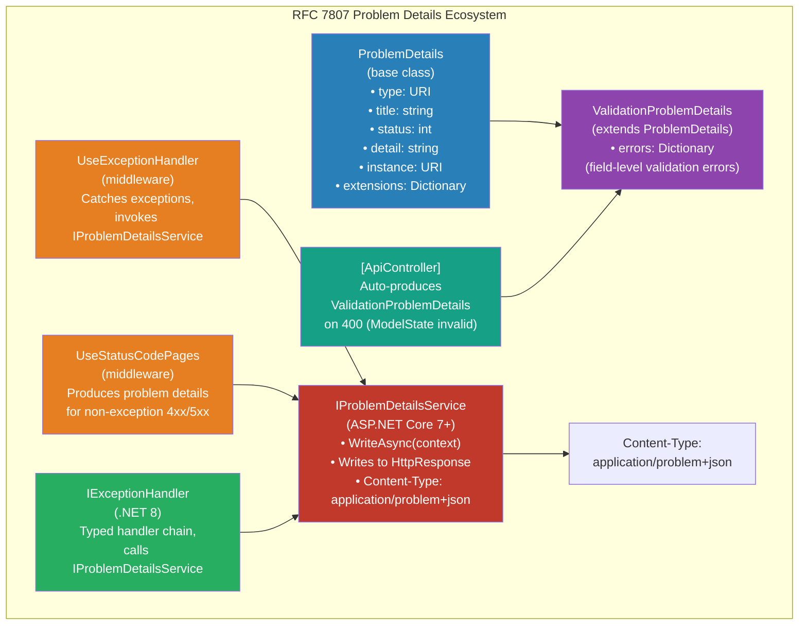
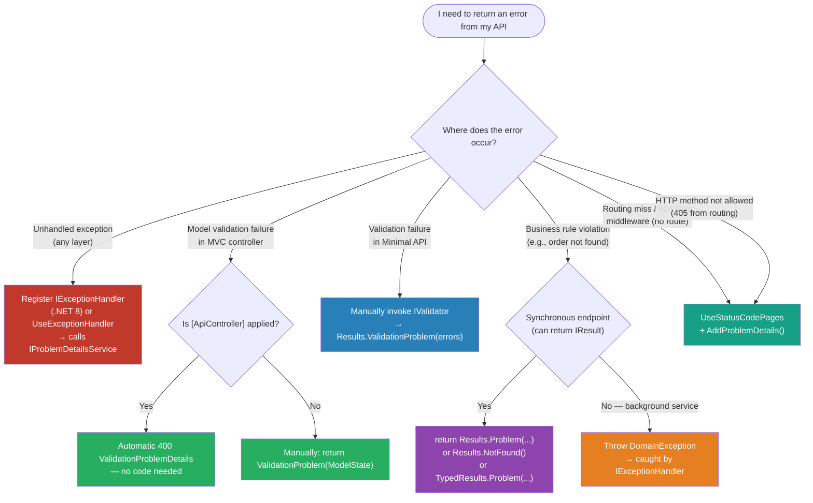

> [!success] Mastery Check
> - [ ] **Studied Well**
> - [ ] **Can explain the concept without notes**
> - [ ] **Can answer interview questions confidently**
> - [ ] **Can implement it in a real project**


# 4.179 — Problem Details (RFC 7807): IProblemDetailsService in ASP.NET Core

## PART 0 — Navigation & Context

### Where This Topic Lives

```
ASP.NET Core Mastery
│
├── A. Host & Application Lifecycle        (4.001–4.010)
├── B. Configuration System                (4.011–4.022)
├── C. Logging & Diagnostics               (4.023–4.033)
├── D. Dependency Injection                (4.034–4.048)
├── E. Middleware Pipeline                 (4.049–4.063)
├── F. Routing System                      (4.064–4.077)
├── G. Minimal APIs                        (4.078–4.097)
├── H. MVC & Controllers                   (4.098–4.133)
├── I. Authentication                      (4.134–4.153)
├── J. Authorization                       (4.154–4.165)
├── K. Validation                          (4.166–4.175)
├── L. Error Handling & Problem Details    (4.176–4.185)
│   ├── 4.177  Exception Handling Middleware: UseExceptionHandler
│   ├── 4.178  Developer Exception Page
│   ├── ▶▶▶ 4.179  Problem Details RFC 7807: IProblemDetailsService  ◀◀◀
│   ├── 4.180  Status Code Pages Middleware
│   ├── 4.181  Exception Filters in MVC
│   ├── 4.182  Global Exception Handler (.NET 8): IExceptionHandler
│   ├── 4.183  Correlation IDs
│   └── 4.185  Custom Error Responses
└── ...
```

### What You Need Before This

- **[[4.052 — Middleware Ordering]]** — Problem details is produced by the exception handler middleware; its position in the pipeline is governed by ordering rules.
- **[[4.049 — The Middleware Pipeline]]** — The HTTP response is written by IProblemDetailsService as part of the middleware response path.
- **[[4.101 — ApiController Attribute]]** — `[ApiController]` automatically produces `ValidationProblemDetails` on model validation failure; understanding [ApiController] is a prerequisite.

### What This Unlocks After

- **[[4.182 — Global Exception Handler (.NET 8)]]** — `IExceptionHandler` calls `IProblemDetailsService.WriteAsync()` to write RFC 7807 responses.
- **[[4.183 — Correlation IDs]]** — Correlation ID is embedded in problem details via the `Extensions` dictionary.
- **[[4.185 — Custom Error Responses]]** — Custom error shapes extend `ProblemDetails` for domain-specific error envelopes.

### Why This Matters at Scale

In a microservices architecture with 20 services, each with its own error format, client teams spend weeks writing deserializers for every service's error schema. RFC 7807 is the W3C standard for HTTP error responses — every service that follows it produces errors with the same JSON structure, same field names, same rules. Clients write one error deserializer and it works across all services. ASP.NET Core 7+ has first-class support for RFC 7807 via `IProblemDetailsService`. This topic is **critical** because it is the error contract for every API you will ever build.

---

## PART 1 — The Core Mental Model

### The Fundamental Rule

> **RFC 7807 defines a standard JSON structure for HTTP error responses. In ASP.NET Core 7+, `IProblemDetailsService` is the central component that writes RFC 7807 responses from anywhere in the pipeline — exception handlers, status code pages, and endpoint handlers. Register it with `services.AddProblemDetails()`. Every 4xx and 5xx response your API produces should be a `ProblemDetails` object, not a custom `{ "error": "message" }` shape.**

### The Plain-Language Analogy

Think of RFC 7807 as the international standard for airport error announcements. Before the standard, every airline had its own format: Air France would say "vol annulé, raison: météo," United would say "flight canceled, code UA-301, contact desk 14," and Lufthansa would project a cryptic code on a screen. International travelers needed a translator for every airline's error format. RFC 7807 is like ICAO's standard: every airline says the same five things (flight number, destination, status, reason, reference desk) in the same order. Your API clients are the international travelers. They should only need to know one error format.

### The Taxonomy Diagram



---

## PART 2 — Deep Mechanics

### 2.1 — The RFC 7807 Specification: What the Standard Requires

RFC 7807 (and its successor RFC 9457) defines a JSON structure for HTTP error responses. The five standard fields:

| Field | Type | Required | Semantics |
|---|---|---|---|
| `type` | URI | Optional | URI reference that identifies the problem type. SHOULD dereference to human-readable documentation. `about:blank` is the default (means: use the HTTP status title). |
| `title` | string | Optional | Short, human-readable summary of the problem type. SHOULD NOT change between occurrences of the same problem. |
| `status` | integer | Optional | The HTTP status code. Mirrors the HTTP response status line — included in the body so clients can see it without parsing headers. |
| `detail` | string | Optional | Human-readable explanation specific to this occurrence. MAY differ between occurrences of the same problem (includes instance-specific data). |
| `instance` | URI | Optional | URI reference identifying the specific occurrence (e.g., `/errors/abc123` linking to a log entry). |
| Extensions | any | Allowed | Additional members. MUST NOT redefine the five standard fields. Common extensions: `traceId`, `errors` (validation), `correlationId`. |

**HTTP wire format — minimal:**
```http
HTTP/1.1 404 Not Found
Content-Type: application/problem+json
Content-Length: 142

{
  "type": "https://tools.ietf.org/html/rfc7807#section-3.1",
  "title": "The requested resource was not found.",
  "status": 404,
  "detail": "Order with ID 9978 was not found in the system.",
  "instance": "/api/orders/9978"
}
```

**HTTP wire format — validation error (ValidationProblemDetails):**
```http
HTTP/1.1 400 Bad Request
Content-Type: application/problem+json

{
  "type": "https://tools.ietf.org/html/rfc7807",
  "title": "One or more validation errors occurred.",
  "status": 400,
  "traceId": "00-5d2e48c2a0c5c21c4d6acf1b3e9c2e5f-31f69e7a2a8e4c1d-00",
  "errors": {
    "Email": ["The Email field is required.", "The Email field is not a valid e-mail address."],
    "Amount": ["The Amount field must be between 0.01 and 1000000."]
  }
}
```

**Cost label:** Writing a problem details response adds ~2 µs overhead vs a raw `context.Response.WriteAsync()` call — negligible; it runs only on error paths.

### 2.2 — IProblemDetailsService: The ASP.NET Core 7+ Central API

```csharp
// Registration — Program.cs
builder.Services.AddProblemDetails();                      // Registers IProblemDetailsService
// Optional: customize what is written to the response
builder.Services.AddProblemDetails(options =>
{
    options.CustomizeProblemDetails = ctx =>
    {
        // ctx.ProblemDetails is the ProblemDetails object about to be written
        // ctx.HttpContext is the current HttpContext
        // ctx.Exception is the Exception if triggered by exception handling (may be null)
        ctx.ProblemDetails.Extensions["traceId"] =
            Activity.Current?.TraceId.ToString() ?? ctx.HttpContext.TraceIdentifier;
        ctx.ProblemDetails.Extensions["nodeId"] =
            Environment.MachineName;
        // In development: include the exception message
        if (ctx.HttpContext.RequestServices
                .GetRequiredService<IWebHostEnvironment>().IsDevelopment()
            && ctx.Exception is not null)
        {
            ctx.ProblemDetails.Extensions["exception"] = ctx.Exception.Message;
        }
    };
});
```

**What `AddProblemDetails()` registers:**
- `IProblemDetailsService` → `ProblemDetailsService` (the default implementation)
- The service integrates with `UseExceptionHandler` and `UseStatusCodePages` automatically when both are registered

**The `IProblemDetailsService` interface:**
```csharp
// Source: Microsoft.AspNetCore.Http
public interface IProblemDetailsService
{
    ValueTask WriteAsync(ProblemDetailsContext context);
}

public class ProblemDetailsContext
{
    public required HttpContext HttpContext { get; init; }
    public ProblemDetails ProblemDetails { get; init; } = new();
    public Exception? Exception { get; init; }
    public EndpointMetadataCollection? AdditionalMetadata { get; init; }
}
```

**ASP.NET Core internally:** `ProblemDetailsService.WriteAsync` iterates all registered `IProblemDetailsWriter` implementations, calls the first one that can write the response (`CanWrite` returns true). The default writer checks `Content-Type` negotiation and writes JSON.

### 2.3 — ProblemDetails vs ValidationProblemDetails

| | `ProblemDetails` | `ValidationProblemDetails` |
|---|---|---|
| **Use case** | Any non-validation error (404, 500, 409, etc.) | Model validation failures (400) |
| **Extends** | Nothing (base class) | `ProblemDetails` |
| **Extra field** | None | `errors: Dictionary<string, string[]>` |
| **Status code** | Any | 400 Bad Request |
| **Produced by** | Exception handlers, endpoint handlers | `[ApiController]` automatic 400, `Results.ValidationProblem()` |
| **Content-Type** | `application/problem+json` | `application/problem+json` |

```csharp
// Producing ProblemDetails manually from a Minimal API endpoint
app.MapGet("/api/orders/{id:int}", async (int id, IOrderRepository repo) =>
{
    var order = await repo.FindByIdAsync(id);
    if (order is null)
    {
        // ✅ Results.Problem() produces a ProblemDetails response
        return Results.Problem(
            detail: $"Order {id} was not found.",
            instance: $"/api/orders/{id}",
            statusCode: 404,
            title: "Order Not Found",
            type: "https://api.example.com/errors/order-not-found"
        );
    }
    return Results.Ok(order);
});

// HTTP response:
// HTTP/1.1 404 Not Found
// Content-Type: application/problem+json
// {"type":"https://api.example.com/errors/order-not-found","title":"Order Not Found",
//  "status":404,"detail":"Order 42 was not found.","instance":"/api/orders/42"}
```

```csharp
// ValidationProblemDetails from a Minimal API endpoint
app.MapPost("/api/orders", async (CreateOrderRequest request, IValidator<CreateOrderRequest> validator) =>
{
    var result = await validator.ValidateAsync(request);
    if (!result.IsValid)
    {
        // ✅ Results.ValidationProblem() produces ValidationProblemDetails
        return Results.ValidationProblem(
            errors: result.ToDictionary(),
            title: "Order validation failed",
            type: "https://api.example.com/errors/validation"
        );
    }
    // ...
});
```

### 2.4 — The [ApiController] Automatic 400 Behavior

When `[ApiController]` is applied to a controller, ASP.NET Core automatically returns a `ValidationProblemDetails` response (HTTP 400) when `ModelState.IsValid` is false — *before the action method runs*.

```csharp
[ApiController]
[Route("api/[controller]")]
public class PaymentController : ControllerBase
{
    [HttpPost]
    public async Task<IActionResult> CreatePayment([FromBody] CreatePaymentRequest request)
    {
        // ⚠️ This line is NEVER REACHED if request fails DataAnnotations validation
        // [ApiController] intercepts before the action method
        var payment = await _paymentService.CreateAsync(request);
        return Created($"/api/payments/{payment.Id}", payment);
    }
}

public class CreatePaymentRequest
{
    [Required]
    [StringLength(50)]
    public string OrderId { get; set; } = "";

    [Required]
    [Range(0.01, 1_000_000)]
    public decimal Amount { get; set; }

    [Required]
    [StringLength(3, MinimumLength = 3)]
    public string Currency { get; set; } = "";
}

// HTTP request with invalid body:
// POST /api/payments
// {"orderId": "", "amount": -5, "currency": "USDX"}

// HTTP response (automatic — action never runs):
// HTTP/1.1 400 Bad Request
// Content-Type: application/problem+json
// {
//   "type": "https://tools.ietf.org/html/rfc7807",
//   "title": "One or more validation errors occurred.",
//   "status": 400,
//   "traceId": "00-abc123...",
//   "errors": {
//     "OrderId": ["The OrderId field is required."],
//     "Amount": ["The field Amount must be between 0.01 and 1000000."],
//     "Currency": ["The field Currency must be a string with a maximum length of 3."]
//   }
// }
```

**ASP.NET Core internally (the automatic 400 filter):**
```csharp
// ModelStateInvalidFilter — runs before the action method
public class ModelStateInvalidFilter : IActionFilter, IOrderedFilter
{
    public void OnActionExecuting(ActionExecutingContext context)
    {
        if (!context.ModelState.IsValid)
        {
            var factory = context.HttpContext.RequestServices
                .GetRequiredService<ProblemDetailsFactory>();
            // Creates a ValidationProblemDetails from ModelState
            var problemDetails = factory.CreateValidationProblemDetails(
                context.HttpContext, context.ModelState);
            context.Result = new BadRequestObjectResult(problemDetails)
            {
                ContentTypes = { "application/problem+json" }
            };
        }
    }

    public void OnActionExecuted(ActionExecutedContext context) { }
}
```

### 2.5 — Customizing the Automatic 400 Response Factory

```csharp
// Replacing the default ValidationProblemDetails factory with a custom shape
builder.Services.Configure<ApiBehaviorOptions>(options =>
{
    options.InvalidModelStateResponseFactory = context =>
    {
        var factory = context.HttpContext.RequestServices
            .GetRequiredService<ProblemDetailsFactory>();
        var problemDetails = factory.CreateValidationProblemDetails(
            context.HttpContext,
            context.ModelState,
            statusCode: StatusCodes.Status422UnprocessableEntity,   // RFC: 422 for semantic errors
            title: "Request validation failed",
            type: "https://api.example.com/errors/validation-failed"
        );
        // Add correlation ID to every validation error response
        var correlationId = context.HttpContext.Request.Headers["X-Correlation-Id"].ToString();
        if (!string.IsNullOrEmpty(correlationId))
            problemDetails.Extensions["correlationId"] = correlationId;

        return new UnprocessableEntityObjectResult(problemDetails)
        {
            ContentTypes = { "application/problem+json" }
        };
    };
});
```

### 2.6 — IProblemDetailsService.WriteAsync: Manual Invocation

```csharp
// Calling WriteAsync directly from a custom exception handler
app.UseExceptionHandler(exApp =>
{
    exApp.Run(async context =>
    {
        var exceptionHandlerFeature = context.Features.Get<IExceptionHandlerPathFeature>();
        var exception = exceptionHandlerFeature?.Error;

        var problemDetailsService = context.RequestServices
            .GetRequiredService<IProblemDetailsService>();

        var (statusCode, title, type) = exception switch
        {
            OrderNotFoundException e => (404, "Order Not Found", "https://api.example.com/errors/order-not-found"),
            PaymentDeclinedException e => (402, "Payment Required", "https://api.example.com/errors/payment-declined"),
            InventoryException e => (409, "Inventory Conflict", "https://api.example.com/errors/inventory-conflict"),
            _ => (500, "An unexpected error occurred.", "https://tools.ietf.org/html/rfc7807")
        };

        context.Response.StatusCode = statusCode;

        await problemDetailsService.WriteAsync(new ProblemDetailsContext
        {
            HttpContext = context,
            Exception = exception,
            ProblemDetails =
            {
                Status = statusCode,
                Title = title,
                Type = type,
                Detail = exception?.Message,
                Instance = context.Request.Path,
                Extensions =
                {
                    ["traceId"] = Activity.Current?.TraceId.ToString() ?? context.TraceIdentifier,
                    ["timestamp"] = DateTimeOffset.UtcNow.ToString("o")
                }
            }
        });
    });
});
```

### 2.7 — IExceptionHandler (.NET 8): The Structured Alternative

```csharp
// .NET 8 IExceptionHandler — the recommended approach for typed exception handling
public class DomainExceptionHandler(IProblemDetailsService problemDetailsService) : IExceptionHandler
{
    public async ValueTask<bool> TryHandleAsync(
        HttpContext httpContext,
        Exception exception,
        CancellationToken cancellationToken)
    {
        // Return false to pass to the next handler
        if (exception is not DomainException domainException) return false;

        httpContext.Response.StatusCode = domainException.HttpStatusCode;

        await problemDetailsService.WriteAsync(new ProblemDetailsContext
        {
            HttpContext = httpContext,
            Exception = exception,
            ProblemDetails =
            {
                Status = domainException.HttpStatusCode,
                Title = domainException.ErrorTitle,
                Type = domainException.ProblemType,
                Detail = exception.Message,
                Instance = httpContext.Request.Path,
                Extensions =
                {
                    ["errorCode"] = domainException.ErrorCode,
                    ["traceId"] = Activity.Current?.TraceId.ToString()
                }
            }
        });

        return true;    // Handled — do not invoke further handlers
    }
}

// Registration (multiple handlers evaluated in order):
builder.Services.AddExceptionHandler<DomainExceptionHandler>();
builder.Services.AddExceptionHandler<GlobalFallbackExceptionHandler>();   // Catches remaining exceptions
builder.Services.AddProblemDetails();

app.UseExceptionHandler();   // UseExceptionHandler() with no args uses the IExceptionHandler chain
```

### 2.8 — UseStatusCodePages: Problem Details for Non-Exception HTTP Errors

`UseStatusCodePages` produces problem details responses for HTTP status codes where the response body is empty — typically 404s and other 4xx/5xx produced by middleware (not exceptions).

```csharp
// A request to /nonexistent-endpoint (no route matches) produces a bare 404 with no body
// UseStatusCodePages adds a problem details body to these bare status code responses

app.UseStatusCodePages();   // Default: adds text/plain body

// Better: produce problem details
app.UseStatusCodePages(async statusCodeContext =>
{
    var response = statusCodeContext.HttpContext.Response;
    response.ContentType = "application/problem+json";

    var problemDetails = new ProblemDetails
    {
        Status = response.StatusCode,
        Title = response.StatusCode switch
        {
            404 => "The requested resource was not found.",
            405 => "The HTTP method is not allowed for this resource.",
            _ => "An error occurred."
        },
        Instance = statusCodeContext.HttpContext.Request.Path
    };

    await response.WriteAsJsonAsync(problemDetails);
});

// HTTP request to non-existent route without UseStatusCodePages:
// GET /api/nonexistent
// HTTP/1.1 404 Not Found
// Content-Length: 0   ← No body — client gets no information

// HTTP request with UseStatusCodePages producing problem details:
// HTTP/1.1 404 Not Found
// Content-Type: application/problem+json
// {"status":404,"title":"The requested resource was not found.","instance":"/api/nonexistent"}
```

**Cost label:** UseStatusCodePages adds ~1–2 µs per error response. It never runs on successful 2xx responses.

---

## PART 3 — Production Code Patterns

### Pattern 1: The Comprehensive Problem Details Registration

```csharp
// Program.cs — complete production problem details setup for a payment processing API
builder.Services.AddProblemDetails(options =>
{
    options.CustomizeProblemDetails = ctx =>
    {
        var httpContext = ctx.HttpContext;
        var env = httpContext.RequestServices.GetRequiredService<IWebHostEnvironment>();

        // Always include trace ID for log correlation
        ctx.ProblemDetails.Extensions["traceId"] =
            Activity.Current?.TraceId.ToString() ?? httpContext.TraceIdentifier;

        // Include correlation ID if provided by client or gateway
        var correlationId = httpContext.Request.Headers["X-Correlation-ID"].ToString();
        if (!string.IsNullOrEmpty(correlationId))
            ctx.ProblemDetails.Extensions["correlationId"] = correlationId;

        // Node/instance identification for debugging multi-pod issues
        ctx.ProblemDetails.Extensions["nodeId"] = Environment.MachineName;

        // In development: expose exception details (never in production)
        if (env.IsDevelopment() && ctx.Exception is not null)
        {
            ctx.ProblemDetails.Extensions["exceptionType"] = ctx.Exception.GetType().FullName;
            ctx.ProblemDetails.Extensions["exceptionMessage"] = ctx.Exception.Message;
            ctx.ProblemDetails.Extensions["stackTrace"] = ctx.Exception.StackTrace;
        }
    };
});

// Exception handlers (evaluated in order):
builder.Services.AddExceptionHandler<DomainExceptionHandler>();
builder.Services.AddExceptionHandler<ValidationExceptionHandler>();
builder.Services.AddExceptionHandler<GlobalFallbackExceptionHandler>();

var app = builder.Build();
app.UseExceptionHandler();   // Invokes IExceptionHandler chain → IProblemDetailsService
app.UseStatusCodePages();    // Adds problem details body to bare 4xx/5xx responses
// ... rest of pipeline
```

### Pattern 2: The Domain Exception Hierarchy with HTTP Mapping

```csharp
// Domain exceptions carry their own HTTP semantics
// This keeps HTTP concerns out of domain logic while enabling clean mapping

public abstract class DomainException(string message, string errorCode, string problemType) : Exception(message)
{
    public string ErrorCode { get; } = errorCode;
    public string ProblemType { get; } = problemType;
    public abstract int HttpStatusCode { get; }
    public abstract string ErrorTitle { get; }
}

public class OrderNotFoundException(int orderId)
    : DomainException($"Order {orderId} was not found.", "ORDER_NOT_FOUND", "https://api.example.com/errors/order-not-found")
{
    public int OrderId { get; } = orderId;
    public override int HttpStatusCode => 404;
    public override string ErrorTitle => "Order Not Found";
}

public class InsufficientInventoryException(string productId, int requested, int available)
    : DomainException($"Product {productId} has {available} units but {requested} were requested.", "INSUFFICIENT_INVENTORY", "https://api.example.com/errors/insufficient-inventory")
{
    public string ProductId { get; } = productId;
    public int Requested { get; } = requested;
    public int Available { get; } = available;
    public override int HttpStatusCode => 409;
    public override string ErrorTitle => "Inventory Conflict";
}

public class PaymentDeclinedException(string reason, string gatewayCode)
    : DomainException($"Payment was declined: {reason}", "PAYMENT_DECLINED", "https://api.example.com/errors/payment-declined")
{
    public string GatewayCode { get; } = gatewayCode;
    public override int HttpStatusCode => 402;
    public override string ErrorTitle => "Payment Required";
}

// IExceptionHandler that maps DomainException to problem details:
public class DomainExceptionHandler(
    IProblemDetailsService problemDetailsService,
    ILogger<DomainExceptionHandler> logger) : IExceptionHandler
{
    public async ValueTask<bool> TryHandleAsync(
        HttpContext httpContext, Exception exception, CancellationToken ct)
    {
        if (exception is not DomainException domainException) return false;

        // 4xx are client errors — log as Warning (expected, not a server failure)
        logger.LogWarning(exception,
            "Domain exception {ErrorCode} occurred for request {Path}",
            domainException.ErrorCode, httpContext.Request.Path);

        httpContext.Response.StatusCode = domainException.HttpStatusCode;

        await problemDetailsService.WriteAsync(new ProblemDetailsContext
        {
            HttpContext = httpContext,
            Exception = exception,
            ProblemDetails =
            {
                Status = domainException.HttpStatusCode,
                Title = domainException.ErrorTitle,
                Type = domainException.ProblemType,
                Detail = exception.Message,
                Instance = httpContext.Request.Path,
                Extensions = { ["errorCode"] = domainException.ErrorCode }
            }
        });

        return true;
    }
}
```

### Pattern 3: Consuming Problem Details in API Clients

```csharp
// HTTP client that deserializes problem details and throws typed exceptions
public class OrderApiClient(HttpClient httpClient)
{
    public async Task<Order> GetOrderAsync(int orderId, CancellationToken ct = default)
    {
        var response = await httpClient.GetAsync($"/api/orders/{orderId}", ct);

        if (response.IsSuccessStatusCode)
        {
            return await response.Content.ReadFromJsonAsync<Order>(ct)
                ?? throw new InvalidOperationException("Empty response body");
        }

        // Deserialize problem details from any error response
        var contentType = response.Content.Headers.ContentType?.MediaType;
        if (contentType == "application/problem+json")
        {
            var problem = await response.Content.ReadFromJsonAsync<ProblemDetails>(ct);
            throw response.StatusCode switch
            {
                HttpStatusCode.NotFound => new OrderNotFoundException(orderId),
                HttpStatusCode.Conflict => new OrderConflictException(problem?.Detail ?? "Conflict"),
                HttpStatusCode.UnprocessableEntity => new ValidationException(problem?.Extensions.GetValueOrDefault("errors")?.ToString() ?? ""),
                _ => new ApiException(problem?.Title ?? "API error", (int)response.StatusCode)
            };
        }

        response.EnsureSuccessStatusCode();   // Fallback for non-problem-details errors
        return null!;
    }
}
```

### Pattern 4: ValidationProblemDetails from FluentValidation in Minimal APIs

```csharp
// Minimal API + FluentValidation → ValidationProblemDetails
// FluentValidation doesn't auto-integrate with Minimal APIs; must be called manually

app.MapPost("/api/inventory/adjustments", async (
    AdjustInventoryRequest request,
    IValidator<AdjustInventoryRequest> validator,
    IInventoryService inventoryService) =>
{
    var validationResult = await validator.ValidateAsync(request);
    if (!validationResult.IsValid)
    {
        // ✅ Convert FluentValidation errors to RFC 7807 ValidationProblemDetails
        return Results.ValidationProblem(
            errors: validationResult.ToDictionary(),   // Dictionary<string, string[]>
            title: "Inventory adjustment request is invalid",
            type: "https://api.example.com/errors/invalid-adjustment",
            statusCode: 422
        );
    }

    var result = await inventoryService.AdjustAsync(request);
    return Results.Created($"/api/inventory/{request.ProductId}", result);
});

// HTTP response:
// HTTP/1.1 422 Unprocessable Entity
// Content-Type: application/problem+json
// {
//   "type": "https://api.example.com/errors/invalid-adjustment",
//   "title": "Inventory adjustment request is invalid",
//   "status": 422,
//   "errors": {
//     "Quantity": ["Quantity must be between -10000 and 10000."],
//     "ProductId": ["ProductId must be a valid SKU format."]
//   }
// }
```

### Pattern 5: Problem Details in MVC Controllers (ControllerBase Helpers)

```csharp
[ApiController]
[Route("api/[controller]")]
public class ShipmentController : ControllerBase
{
    [HttpGet("{trackingId}")]
    [ProducesResponseType(typeof(Shipment), StatusCodes.Status200OK)]
    [ProducesResponseType(typeof(ProblemDetails), StatusCodes.Status404NotFound)]
    public async Task<ActionResult<Shipment>> GetShipment(string trackingId)
    {
        var shipment = await _shipmentService.FindAsync(trackingId);
        if (shipment is null)
        {
            // ✅ ControllerBase.Problem() produces ProblemDetails
            return Problem(
                detail: $"No shipment with tracking ID '{trackingId}' was found.",
                instance: $"/api/shipments/{trackingId}",
                statusCode: 404,
                title: "Shipment Not Found",
                type: "https://api.example.com/errors/shipment-not-found"
            );
        }
        return Ok(shipment);
    }

    [HttpPost]
    public async Task<ActionResult<Shipment>> CreateShipment([FromBody] CreateShipmentRequest request)
    {
        // ✅ ControllerBase.ValidationProblem() produces ValidationProblemDetails from ModelState
        if (!ModelState.IsValid)
            return ValidationProblem(ModelState);   // Rarely needed — [ApiController] handles this

        // ✅ Manual conflict response with problem details
        if (await _shipmentService.ExistsAsync(request.OrderId))
        {
            ModelState.AddModelError("OrderId", "A shipment already exists for this order.");
            return Conflict(ValidationProblem(ModelState));
        }

        var shipment = await _shipmentService.CreateAsync(request);
        return CreatedAtAction(nameof(GetShipment), new { trackingId = shipment.TrackingId }, shipment);
    }
}
```

### Pattern 6: Problem Details with OpenAPI Documentation

```csharp
// Documenting problem details responses in OpenAPI/Swagger
builder.Services.AddSwaggerGen(options =>
{
    // Map all ProblemDetails types to their OpenAPI schemas
    options.MapType<ProblemDetails>(() => new OpenApiSchema
    {
        Type = "object",
        Properties = new Dictionary<string, OpenApiSchema>
        {
            ["type"] = new() { Type = "string", Format = "uri" },
            ["title"] = new() { Type = "string" },
            ["status"] = new() { Type = "integer" },
            ["detail"] = new() { Type = "string" },
            ["instance"] = new() { Type = "string", Format = "uri" }
        }
    });
});

// On endpoint:
app.MapGet("/api/orders/{id:int}", GetOrder)
    .WithName("GetOrder")
    .Produces<Order>(200)
    .ProducesProblem(404)       // Documents ProblemDetails for 404
    .ProducesProblem(500)       // Documents ProblemDetails for 500
    .ProducesValidationProblem(); // Documents ValidationProblemDetails for 400
```

### Pattern 7: Testing Problem Details Responses

```csharp
// Integration test verifying RFC 7807 problem details shape
public class OrderApiTests(WebApplicationFactory<Program> factory)
    : IClassFixture<WebApplicationFactory<Program>>
{
    [Fact]
    public async Task GetOrder_NotFound_ReturnsProblemDetails()
    {
        var client = factory.CreateClient();

        var response = await client.GetAsync("/api/orders/99999");

        response.StatusCode.Should().Be(HttpStatusCode.NotFound);
        response.Content.Headers.ContentType?.MediaType
            .Should().Be("application/problem+json");

        var problem = await response.Content.ReadFromJsonAsync<ProblemDetails>();
        problem.Should().NotBeNull();
        problem!.Status.Should().Be(404);
        problem.Title.Should().Be("Order Not Found");
        problem.Type.Should().Contain("order-not-found");
        problem.Instance.Should().Be("/api/orders/99999");
        // Verify traceId extension is always present
        problem.Extensions.Should().ContainKey("traceId");
    }

    [Fact]
    public async Task CreateOrder_InvalidRequest_Returns422ValidationProblemDetails()
    {
        var client = factory.CreateClient();
        var invalidRequest = new { Amount = -100 };   // Missing required fields

        var response = await client.PostAsJsonAsync("/api/orders", invalidRequest);

        response.StatusCode.Should().Be(HttpStatusCode.UnprocessableEntity);

        var problem = await response.Content.ReadFromJsonAsync<ValidationProblemDetails>();
        problem.Should().NotBeNull();
        problem!.Errors.Should().ContainKey("CustomerId");
        problem.Errors["CustomerId"].Should().Contain("The CustomerId field is required.");
    }
}
```

---

## PART 4 — Gotchas & Anti-Patterns

### Gotcha 1: Returning Custom `{ "error": "message" }` Instead of RFC 7807

The most common error handling anti-pattern in ASP.NET Core APIs:

```csharp
// ⚠️ WRONG: every service has its own error schema — clients need per-service deserializers
app.MapGet("/api/orders/{id:int}", async (int id, IOrderRepository repo) =>
{
    var order = await repo.FindByIdAsync(id);
    if (order is null)
        return Results.Json(new { error = "Order not found", code = "ORDER_404" }, statusCode: 404);
    return Results.Ok(order);
});

// HTTP response (wrong path):
// HTTP/1.1 404 Not Found
// Content-Type: application/json
// {"error":"Order not found","code":"ORDER_404"}

// ✅ CORRECT: RFC 7807
if (order is null)
    return Results.Problem(
        detail: $"Order {id} was not found.",
        instance: $"/api/orders/{id}",
        statusCode: 404,
        title: "Order Not Found",
        type: "https://api.example.com/errors/order-not-found"
    );

// HTTP response (correct path):
// HTTP/1.1 404 Not Found
// Content-Type: application/problem+json
// {"type":"...","title":"Order Not Found","status":404,"detail":"...","instance":"..."}

// WHY: RFC 7807 is the HTTP standard. Every OpenAPI client generator, API gateway,
// and monitoring tool understands application/problem+json. Custom schemas are bespoke
// contracts that every consumer must implement separately.
```

### Gotcha 2: Forgetting to Register AddProblemDetails() — Silent Fallback

`IProblemDetailsService` is NOT registered by default. If you call `UseExceptionHandler()` or `UseStatusCodePages()` without `AddProblemDetails()`, the exception handler falls back to a minimal response with no body.

```csharp
// ⚠️ WRONG: IProblemDetailsService is not registered
// UseExceptionHandler has no IProblemDetailsService to call → bare response
var app = builder.Build();
app.UseExceptionHandler("/error");
// ... (no services.AddProblemDetails() in Program.cs)

// HTTP consequence (wrong path — unhandled exception):
// HTTP/1.1 500 Internal Server Error
// Content-Length: 0   ← No body — client has no information

// ✅ CORRECT
builder.Services.AddProblemDetails();   // Must be called BEFORE builder.Build()
var app = builder.Build();
app.UseExceptionHandler();   // Now has IProblemDetailsService available

// HTTP consequence (correct path):
// HTTP/1.1 500 Internal Server Error
// Content-Type: application/problem+json
// {"status":500,"title":"An error occurred.","traceId":"00-abc..."}

// WHY: AddProblemDetails() registers IProblemDetailsService in the DI container.
// Without it, the exception handler middleware has no service to delegate to.
```

### Gotcha 3: Exception Details Leaking in Production

`CustomizeProblemDetails` that includes `exception.Message` or stack traces without environment checks leaks internal implementation details.

```csharp
// ⚠️ WRONG: exception details leaked in production
builder.Services.AddProblemDetails(options =>
{
    options.CustomizeProblemDetails = ctx =>
    {
        // NEVER do this without an environment check:
        ctx.ProblemDetails.Extensions["exception"] = ctx.Exception?.Message;
        ctx.ProblemDetails.Extensions["stackTrace"] = ctx.Exception?.StackTrace;
        // Leaks: SQL connection strings, internal class names, server paths
    };
});

// HTTP response in production (wrong path):
// {"status":500,"exception":"Connection string 'Server=prod-db01;Password=Secret123'..."}

// ✅ CORRECT: gate on development environment
builder.Services.AddProblemDetails(options =>
{
    options.CustomizeProblemDetails = ctx =>
    {
        var env = ctx.HttpContext.RequestServices.GetRequiredService<IWebHostEnvironment>();
        if (env.IsDevelopment() && ctx.Exception is not null)
        {
            ctx.ProblemDetails.Extensions["exceptionMessage"] = ctx.Exception.Message;
        }
        // Always safe to include:
        ctx.ProblemDetails.Extensions["traceId"] = Activity.Current?.TraceId.ToString();
    };
});
```

### Gotcha 4: Response.HasStarted — Cannot Write Problem Details After Headers Are Sent

If the response has started (headers sent, streaming started), `IProblemDetailsService.WriteAsync` cannot change the status code or set the Content-Type header.

```csharp
// ⚠️ DANGEROUS: streaming response that throws mid-stream
app.MapGet("/api/reports/stream", async (HttpContext context) =>
{
    context.Response.StatusCode = 200;
    context.Response.ContentType = "application/json";

    // ← Headers are sent when we first write to the response
    await context.Response.WriteAsync("[");
    for (int i = 0; i < 1000; i++)
    {
        var record = await FetchRecord(i);   // ← What if this throws on record 500?
        await context.Response.WriteAsync(JsonSerializer.Serialize(record));
    }
    await context.Response.WriteAsync("]");
    // If FetchRecord throws, exception handler cannot produce a proper 500 response
    // because headers were already sent with status 200!
});

// ✅ CORRECT: check HasStarted in exception handlers
app.UseExceptionHandler(exApp =>
{
    exApp.Run(async context =>
    {
        if (context.Response.HasStarted)
        {
            // Headers already sent — cannot modify status code or Content-Type
            // Log the error; do not attempt to write a problem details response
            var logger = context.RequestServices.GetRequiredService<ILogger<Program>>();
            logger.LogError("Exception after response started — client received partial response");
            return;
        }

        // Safe to write problem details
        context.Response.StatusCode = 500;
        await context.RequestServices
            .GetRequiredService<IProblemDetailsService>()
            .WriteAsync(new ProblemDetailsContext { HttpContext = context, ProblemDetails = { Status = 500 } });
    });
});
```

### Gotcha 5: Using `UseStatusCodePages` Before `UseExceptionHandler` — Intercepts Exception 500s

`UseStatusCodePages` intercepts any response with a 4xx/5xx status code *and no body*. If the exception handler writes a 500 with no body (e.g., it fails to produce problem details), UseStatusCodePages will intercept it and try to produce its own response — potentially causing double-write issues.

```csharp
// ⚠️ WRONG ordering: status code pages BEFORE exception handler
app.UseStatusCodePages();      // Intercepts 500 with no body
app.UseExceptionHandler();     // Produces a 500 with no body (if IProblemDetailsService unavailable)
// ← UseStatusCodePages intercepts the 500 and tries to write AGAIN → response already started

// ✅ CORRECT: exception handler first (outermost), status code pages second
app.UseExceptionHandler();     // Catches exceptions → writes 500 with problem details body
app.UseStatusCodePages();      // Only intercepts responses with no body (routing 404s, method not allowed, etc.)
                               // ← Won't intercept exception responses because they already have a body

// WHY: UseStatusCodePages's condition is "status >= 400 AND response body is empty."
// If UseExceptionHandler successfully writes a problem details body, UseStatusCodePages
// sees a non-empty body and passes through. The exception handler must be outermost
// so it runs first (catches exceptions), and UseStatusCodePages follows to handle
// non-exception status codes (routing misses, wrong HTTP method, etc.).
```

---

## PART 5 — Performance Implications

### 5.1 — Problem Details Pipeline Characteristics

| Scenario | Path Frequency | Allocations | Latency | Recommendation |
|---|---|---|---|---|
| Successful request (2xx) | 95%+ of requests | 0 — problem details code never runs | 0 overhead | AddProblemDetails has zero happy-path cost |
| Validation 400 (ModelState) | ~2–5% of requests | `ValidationProblemDetails` + Dictionary + JSON write | ~10–20 µs | Acceptable — only for invalid requests |
| Domain exception (4xx) | ~1–2% of requests | `ProblemDetails` + JSON serialization | ~15–30 µs | Acceptable — error paths are rare |
| Unhandled exception (500) | <0.1% of requests | `ProblemDetails` + Exception object | ~50–100 µs | Acceptable — 500s should be rare by design |
| UseStatusCodePages (routing 404) | ~1–5% of requests (depends on API) | `ProblemDetails` + JSON write | ~10–20 µs | Acceptable |
| `CustomizeProblemDetails` with IWebHostEnvironment resolution | Every error | GetRequiredService<> call | +1–2 µs | Cache the environment check |

### 5.2 — BenchmarkDotNet: Problem Details Writing

```csharp
using BenchmarkDotNet.Attributes;
using Microsoft.AspNetCore.Http;
using Microsoft.AspNetCore.Mvc;

[MemoryDiagnoser]
[SimpleJob]
public class ProblemDetailsWritingBenchmarks
{
    private WebApplication _app = null!;
    private IProblemDetailsService _service = null!;
    private DefaultHttpContext _httpContext = null!;

    [GlobalSetup]
    public void Setup()
    {
        var builder = WebApplication.CreateBuilder();
        builder.Services.AddProblemDetails();
        _app = builder.Build();
        _app.StartAsync().GetAwaiter().GetResult();

        _service = _app.Services.GetRequiredService<IProblemDetailsService>();
    }

    [Benchmark(Baseline = true)]
    public async Task WriteRaw500_NoBody()
    {
        _httpContext = new DefaultHttpContext();
        _httpContext.Response.Body = Stream.Null;
        _httpContext.Response.StatusCode = 500;
        // Raw: no body, no content-type, nothing — fastest but useless for clients
        await Task.CompletedTask;
    }

    [Benchmark]
    public async Task WriteProblemDetails_500()
    {
        _httpContext = new DefaultHttpContext();
        _httpContext.Response.Body = Stream.Null;
        _httpContext.RequestServices = _app.Services;

        await _service.WriteAsync(new ProblemDetailsContext
        {
            HttpContext = _httpContext,
            ProblemDetails = { Status = 500, Title = "An error occurred." }
        });
    }

    [Benchmark]
    public async Task WriteValidationProblemDetails_400()
    {
        _httpContext = new DefaultHttpContext();
        _httpContext.Response.Body = Stream.Null;
        _httpContext.RequestServices = _app.Services;

        await _service.WriteAsync(new ProblemDetailsContext
        {
            HttpContext = _httpContext,
            ProblemDetails = new ValidationProblemDetails(new Dictionary<string, string[]>
            {
                ["Email"] = ["The Email field is required.", "Invalid format."],
                ["Amount"] = ["Amount must be positive."]
            })
            { Status = 400 }
        });
    }
}

// Expected output (approximate, .NET 8, x64):
// | Method                              | Mean     | Gen0   | Allocated |
// |-------------------------------------|----------|--------|-----------|
// | WriteRaw500_NoBody                  | 0.5 ns   | -      | -         |
// | WriteProblemDetails_500             | 18.4 µs  | 0.08   | 1.8 KB    |
// | WriteValidationProblemDetails_400   | 24.7 µs  | 0.14   | 3.1 KB    |
// These run only on error paths — the overhead is irrelevant for production APIs
// where error rates should be below 1% of requests.
```

### 5.3 — When to Care / When to Ignore

**When this costs you:**
- **You should never optimize error paths** at the expense of correctness or observability. A 24 µs error response is infinitely faster than an engineer debugging a bare `500 Content-Length: 0` at 3 AM.
- If your application genuinely produces 400s on >50% of requests, you have a frontend validation problem, not a server performance problem. Fix the client.
- `CustomizeProblemDetails` callbacks that make database calls or expensive external lookups add real latency to every error response — keep them fast.

**When this doesn't matter:**
- Performance is never the reason to skip RFC 7807. The overhead is measurable in microseconds on error paths.
- In APIs where 400s are rare (internal microservices with validated clients), problem details add zero observable overhead.

---

## PART 6 — Interview Arsenal

### A. The Question Bank

**Q1: What is RFC 7807 and why does it matter for ASP.NET Core APIs?**

> **Great Answer:** "RFC 7807 is the W3C standard for HTTP error response bodies. It defines five standard JSON fields: `type` (a URI identifying the error type), `title` (short description), `status` (HTTP status code), `detail` (instance-specific explanation), and `instance` (URI for this specific error occurrence). It matters for APIs because without it, every team invents their own error schema — `{ 'error': 'message' }`, `{ 'message': 'err', 'code': 42 }`, custom XML — and every API consumer needs a different error deserializer. RFC 7807 is the shared contract that lets clients write one error handler for all services. ASP.NET Core 7+ has first-class support via `IProblemDetailsService`, which is wired into exception handling, status code pages, and the [ApiController] automatic 400 behavior. In practice, I always call `services.AddProblemDetails()` and `app.UseExceptionHandler()` together — they're a package deal. The `CustomizeProblemDetails` hook lets me add `traceId` and `correlationId` to every error response, which is essential for production debugging."

---

**Q2: What is the difference between `ProblemDetails` and `ValidationProblemDetails`?**

> **Great Answer:** "`ProblemDetails` is the base class for all RFC 7807 error responses. `ValidationProblemDetails` extends it with an `errors` dictionary — it maps field names to arrays of error messages, like `{ 'Email': ['required', 'invalid format'], 'Amount': ['must be positive'] }`. `ProblemDetails` is for any error: 404, 409, 500. `ValidationProblemDetails` is specifically for 400 validation failures. In ASP.NET Core, the `[ApiController]` attribute automatically produces `ValidationProblemDetails` when `ModelState.IsValid` is false — before the action method even runs. For Minimal APIs, there's no automatic integration, so I call `Results.ValidationProblem(errors)` manually after running FluentValidation. Both produce `Content-Type: application/problem+json` — clients can use the same deserializer and check the `errors` field to distinguish them."

---

**Q3: How does `IProblemDetailsService` relate to `UseExceptionHandler`?**

> **Great Answer:** "`UseExceptionHandler` catches exceptions thrown during request processing. In .NET 7+, when `AddProblemDetails()` is registered, the exception handler middleware automatically delegates to `IProblemDetailsService.WriteAsync()` to produce the response body. I don't have to write the JSON myself — I just register both services and the wiring happens automatically. In .NET 8, I prefer using `IExceptionHandler` — a typed interface where I implement `TryHandleAsync`, return `true` to handle the exception, and call `IProblemDetailsService.WriteAsync()` explicitly. Multiple `IExceptionHandler` implementations are evaluated in registration order: my domain exception handler handles `OrderNotFoundException` and returns true; my global fallback handler catches everything else and returns true with a 500. If none handle it, UseExceptionHandler's built-in fallback produces a generic problem details response."

---

**Q4: What HTTP status code does `[ApiController]` return for validation failures?**

> **Great Answer:** "400 Bad Request with a `ValidationProblemDetails` body, served with `Content-Type: application/problem+json`. The `[ApiController]` attribute registers a `ModelStateInvalidFilter` that runs before the action method. When `ModelState.IsValid` is false — because DataAnnotations validation failed during model binding — the filter short-circuits and returns the 400 without calling the action. The response body is a `ValidationProblemDetails` object with an `errors` dictionary mapping each invalid field to its validation error messages. I can customize this behavior with `services.Configure<ApiBehaviorOptions>(o => o.InvalidModelStateResponseFactory = ctx => ...)` — for example, to return 422 instead of 400, or to include a correlation ID in every validation error response."

---

**Q5: What is `CustomizeProblemDetails` and when do you use it?**

> **Great Answer:** "`CustomizeProblemDetails` is a callback in `ProblemDetailsOptions` that fires for every problem details response — whether it's a 404, a 500, a validation 400, or anything else. I use it to add fields that should appear in every error response: `traceId` from `Activity.Current?.TraceId` for distributed tracing, `correlationId` from the request headers for cross-service correlation, `nodeId` (machine name) for identifying which pod produced the error in multi-instance deployments. I always gate exception details — stack traces, exception messages — behind an environment check. In development I include `exceptionMessage` and `exceptionType`; in production I include only the trace ID. The callback receives `ProblemDetailsContext` which has the `HttpContext`, the `ProblemDetails` object being built, and the `Exception` if one was caught."

---

### B. The Trick Questions

**Trick Q1: "If I don't call `AddProblemDetails()`, does `UseExceptionHandler()` still produce a JSON error response?"**

*Trap:* Engineers assume ASP.NET Core always produces JSON errors.

*Correct Answer:* No — without `AddProblemDetails()`, `IProblemDetailsService` is not registered. `UseExceptionHandler` has no service to delegate to and produces a bare HTTP response with an empty body (or a redirect to the error path if you specify one). Some engineers are confused because they see a JSON error response in development — that's from `UseDeveloperExceptionPage`, not from problem details. In production without `AddProblemDetails()`, unhandled exceptions produce `500 Content-Length: 0`.

---

**Trick Q2: "Does `UseStatusCodePages` affect successful 200 responses?"**

*Trap:* Engineers worry about performance overhead.

*Correct Answer:* No. `UseStatusCodePages` only runs when the response status code is >= 400 AND the response body is empty. For any 2xx response, it calls `next()` without doing anything. The performance cost is effectively zero on the happy path.

---

**Trick Q3: "If `Response.HasStarted` is true in my exception handler, what should I do?"**

*Trap:* Engineers try to write error details anyway.

*Correct Answer:* You cannot write a proper error response — the HTTP headers (including status code and Content-Type) are already sent to the client. The only correct action is to log the error internally and return without writing anything. The client has already received a partial response that may appear successful. This scenario typically occurs when streaming large responses that fail mid-stream.

---

**Trick Q4: "Can a 200 response have `Content-Type: application/problem+json`?"**

*Trap:* Engineers think problem+json implies an error.

*Correct Answer:* Technically yes — `Content-Type: application/problem+json` is a media type and has no inherent semantic binding to HTTP error status codes. However, RFC 7807 defines it specifically for error responses. Using it on a 200 response would be non-standard and confusing. The standard says: the problem details media type should be used with HTTP status codes indicating an error (4xx, 5xx). Using it on 200 would violate the intent of the standard and confuse RFC-compliant clients.

---

**Trick Q5: "Will `ValidationProblemDetails` work automatically in Minimal APIs without [ApiController]?"**

*Trap:* Engineers assume Minimal APIs have the same automatic validation behavior.

*Correct Answer:* No. `[ApiController]`'s automatic 400 behavior (`ModelStateInvalidFilter`) only applies to controllers that use the MVC pipeline. Minimal API endpoints do not have `ModelState` at all — they use direct parameter binding. To produce validation errors from Minimal APIs, you must manually invoke a validator (FluentValidation `IValidator<T>`) and call `Results.ValidationProblem(errors)` yourself. There is no automatic integration — this is by design, as Minimal APIs optimize for explicit, visible code.

---

### C. Red Flags to Avoid

1. **Returning `{ "error": "..." }` instead of RFC 7807** — immediately marks you as someone who has not designed APIs for interoperability.
2. **"I just return 500 with no body on errors"** — correct in minimal terms but provides zero information to clients and monitoring systems.
3. **Including stack traces in production error responses** — a security vulnerability (information disclosure); CWE-209.
4. **Not including `traceId` in error responses** — makes production debugging of distributed errors nearly impossible.
5. **Using `ValidationProblemDetails` for non-validation errors** — 409 Conflict should use `ProblemDetails`, not `ValidationProblemDetails`.
6. **Forgetting that `[ApiController]` automatic 400 runs before the action method** — writing `if (!ModelState.IsValid) return BadRequest(...)` inside a controller with `[ApiController]` is dead code.
7. **Not testing the `Content-Type: application/problem+json` header** — clients that check content type for deserialization will fail if you return `application/json` for errors.
8. **Using `UseStatusCodePages` before `UseExceptionHandler`** — can cause double-write issues for exception-generated status codes.

---

## PART 7 — Decision Framework



---

## PART 8 — Self-Check

### A. Conceptual Questions

1. What are the five standard fields defined by RFC 7807? What is the purpose of each field?

2. What HTTP `Content-Type` header value does ASP.NET Core use for problem details responses, and why is it different from `application/json`?

3. Explain the relationship between `AddProblemDetails()`, `UseExceptionHandler()`, and `IProblemDetailsService`. What happens if you call `UseExceptionHandler()` without `AddProblemDetails()`?

4. Why does `[ApiController]` automatically return 400 before the action method runs? What mechanism implements this behavior?

5. What is the difference between `ProblemDetails.detail` and `ProblemDetails.title` according to RFC 7807?

6. In .NET 8, you register three `IExceptionHandler` implementations: `DomainExceptionHandler`, `ValidationExceptionHandler`, and `GlobalFallbackHandler`. A `DomainException` is thrown. `DomainExceptionHandler.TryHandleAsync` returns `false`. What happens next?

7. A request to `/api/users/99999` returns `200 OK` with an empty body instead of `404 Not Found`. You add `UseStatusCodePages()`. Does this fix it? Why or why not?

8. What does `Response.HasStarted` mean, and why does it prevent writing problem details?

9. Explain the `CustomizeProblemDetails` callback. When does it fire? What can and cannot be changed in it?

10. Your API receives 5,000 requests/second. 2% are validation failures returning `ValidationProblemDetails`. Is this a performance concern? What is the actual problem?

---

### B. Code Puzzles

**Puzzle 1: Will this produce RFC 7807 problem details?**

```csharp
var builder = WebApplication.CreateBuilder();
// AddProblemDetails() is NOT called
var app = builder.Build();
app.UseExceptionHandler("/error");
app.MapGet("/error", (IExceptionHandlerFeature feature) =>
    Results.Problem(detail: feature.Error?.Message, statusCode: 500));
app.MapGet("/api/data", (int x) => x / 0);  // Throws DivideByZeroException
app.Run();
```

<details>
<summary>Answer</summary>

**Yes — but via a different mechanism.**

There are two separate things happening:

1. `app.UseExceptionHandler("/error")` — when an exception occurs, ASP.NET Core re-executes the request on the `/error` path.
2. The `/error` endpoint manually calls `Results.Problem(...)` — this creates a `ProblemDetails` object and writes it as `application/problem+json`.

`Results.Problem()` does NOT use `IProblemDetailsService` — it directly constructs a `ProblemDetails` response. So even without `AddProblemDetails()`, this works.

However, `CustomizeProblemDetails` will NOT fire (it requires `IProblemDetailsService`). The `traceId` extension, node ID, and any other customizations won't be applied.

**Conclusion:** Produces RFC 7807, but without customizations. Add `AddProblemDetails()` for full customization support.

</details>

---

**Puzzle 2: What is wrong with this exception handler?**

```csharp
builder.Services.AddProblemDetails();
var app = builder.Build();

app.UseExceptionHandler(exApp =>
{
    exApp.Run(async context =>
    {
        var exception = context.Features.Get<IExceptionHandlerFeature>()?.Error;
        var problemDetails = new ProblemDetails
        {
            Status = 500,
            Title = "Server error",
            Detail = exception?.Message
        };
        context.Response.StatusCode = 500;
        await context.Response.WriteAsJsonAsync(problemDetails);
    });
});
```

<details>
<summary>Answer</summary>

**Two issues:**

1. **Wrong `Content-Type`**: `WriteAsJsonAsync` writes `Content-Type: application/json`, not `Content-Type: application/problem+json`. RFC 7807 requires `application/problem+json`. Fix: use `IProblemDetailsService.WriteAsync()` or explicitly set `context.Response.ContentType = "application/problem+json"` before writing.

2. **Bypasses `CustomizeProblemDetails`**: By writing `ProblemDetails` directly with `WriteAsJsonAsync`, the `CustomizeProblemDetails` callback registered with `AddProblemDetails()` never fires. The `traceId`, `correlationId`, and other custom extensions are not added. Fix: use `IProblemDetailsService.WriteAsync()` instead, which will invoke all registered callbacks.

**Fix:**
```csharp
var problemDetailsService = context.RequestServices.GetRequiredService<IProblemDetailsService>();
context.Response.StatusCode = 500;
await problemDetailsService.WriteAsync(new ProblemDetailsContext
{
    HttpContext = context,
    Exception = exception,
    ProblemDetails = { Status = 500, Title = "Server error", Detail = exception?.Message }
});
```

</details>

---

**Puzzle 3: Is this dead code?**

```csharp
[ApiController]
[Route("api/[controller]")]
public class InvoiceController : ControllerBase
{
    [HttpPost]
    public IActionResult CreateInvoice([FromBody] CreateInvoiceRequest request)
    {
        if (!ModelState.IsValid)
        {
            return BadRequest(new ValidationProblemDetails(ModelState));
        }

        var invoice = _invoiceService.Create(request);
        return Created($"/api/invoices/{invoice.Id}", invoice);
    }
}
```

<details>
<summary>Answer</summary>

**Yes — the `if (!ModelState.IsValid)` block is dead code.**

The `[ApiController]` attribute registers `ModelStateInvalidFilter` which runs before the action method. When model binding produces validation errors (from DataAnnotations), the filter intercepts the request and returns a `400 ValidationProblemDetails` response **before** `CreateInvoice` is called. The `if (!ModelState.IsValid)` check inside the action method is never reached for invalid requests.

This is not harmful — the dead code just never executes. However, it suggests the developer didn't know about the automatic behavior, which is a common misconception. 

**When would you disable this and need explicit checks?** When you call `services.Configure<ApiBehaviorOptions>(o => o.SuppressModelStateInvalidFilter = true)` — this disables the automatic 400, and your manual check becomes necessary again.

</details>

---

**Puzzle 4: What status code does this Minimal API return for invalid input?**

```csharp
app.MapPost("/api/shipments", async (
    [FromBody] CreateShipmentRequest request,
    IValidator<CreateShipmentRequest> validator) =>
{
    var validationResult = await validator.ValidateAsync(request);
    if (!validationResult.IsValid)
        return Results.BadRequest(new { errors = validationResult.Errors.Select(e => e.ErrorMessage) });

    // process shipment...
    return Results.Created("/api/shipments/new", null);
});
```

<details>
<summary>Answer</summary>

**400 Bad Request — but with the wrong response body.**

The status code is correct (400). But `Results.BadRequest(new { errors = ... })` produces:
- `Content-Type: application/json`
- Body: `{"errors":["Error 1","Error 2"]}` — a flat array of strings

This is NOT RFC 7807. The correct approach:

```csharp
if (!validationResult.IsValid)
    return Results.ValidationProblem(validationResult.ToDictionary());
```

This produces:
- `Content-Type: application/problem+json`
- Status: 400
- Body: `{"type":"...","title":"One or more validation errors occurred.","status":400,"errors":{"FieldName":["Error message"]}}`

The field-keyed dictionary format (`errors: { "FieldName": ["msg"] }`) is essential for clients to know *which* field failed.

</details>

---

**Puzzle 5: What does the client receive?**

```csharp
builder.Services.AddProblemDetails();
var app = builder.Build();

app.UseExceptionHandler();
app.UseStatusCodePages();
app.UseRouting();
app.MapGet("/api/products/{id}", (int id) => TypedResults.Ok(new { Id = id }));
app.Run();

// Client sends: GET /api/products   (missing id — no route match)
```

<details>
<summary>Answer</summary>

**404 Not Found with a `ProblemDetails` body.**

The route `/api/products/{id}` requires a route segment after `/api/products/`. The request `GET /api/products` has no route match. The routing system (after `UseRouting()`) produces a bare `404 Not Found` response with no body.

`UseStatusCodePages` then intercepts: status >= 400 AND body is empty → writes a problem details response.

The response:
```http
HTTP/1.1 404 Not Found
Content-Type: application/problem+json
{"status":404,"title":"Not Found"}
```

Note: `UseStatusCodePages` and `UseExceptionHandler` are placed before routing in the canonical order — but they still intercept on the **response path** (as the response travels back up through the middleware chain). `UseStatusCodePages` runs on the way back up and catches the bare 404.

</details>

---

## PART 9 — Connections & Resources

### A. Related Topics Table

| Topic | Why It Connects |
|---|---|
| [[4.177 — Exception Handling Middleware: UseExceptionHandler]] | UseExceptionHandler invokes IProblemDetailsService to produce the error body; they work as a pair |
| [[4.182 — Global Exception Handler (.NET 8): IExceptionHandler]] | IExceptionHandler is the typed, composable alternative to a single UseExceptionHandler catch-all; it calls IProblemDetailsService explicitly |
| [[4.183 — Correlation IDs: Request Tracing]] | Correlation ID is added to ProblemDetails.Extensions via CustomizeProblemDetails — connecting errors to distributed traces |
| [[4.101 — ApiController Attribute]] | [ApiController] automatic 400 produces ValidationProblemDetails; understanding both is needed to know when automatic vs manual validation applies |
| [[4.102 — Model Validation: DataAnnotations and ModelState]] | ModelState is the source of validation errors that become ValidationProblemDetails in MVC controllers |
| [[4.170 — FluentValidation Integration]] | FluentValidation errors must be manually converted to Results.ValidationProblem() in Minimal APIs |
| [[4.052 — Middleware Ordering]] | Exception handler and status code pages must be in the correct order for problem details to work correctly |
| [[4.297 — Activity API and Distributed Tracing]] | Activity.Current.TraceId is the W3C-standard trace ID included in every problem details Extensions dictionary |

### B. Books

| Book | Chapters | Why These Chapters |
|---|---|---|
| *ASP.NET Core in Action* (3rd ed.) — Andrew Lock | Ch. 19 (Handling errors) | RFC 7807 integration, IProblemDetailsService, IExceptionHandler patterns |
| *Pro ASP.NET Core 8* — Adam Freeman | Ch. 22 (HTTP error responses) | Comprehensive ProblemDetails and validation error handling |
| *REST API Design Rulebook* — Mark Masse | Ch. 7 (Error representation) | The architectural reasoning behind standardized error responses |

### C. Essential Articles & Docs

1. **[Problem Details middleware — Microsoft Docs](https://learn.microsoft.com/en-us/aspnet/core/fundamentals/error-handling#problem-details)** — Official reference for `AddProblemDetails()`, `IProblemDetailsService`, `IExceptionHandler`
2. **[RFC 7807 — Problem Details for HTTP APIs](https://datatracker.ietf.org/doc/html/rfc7807)** — The specification itself; short and worth reading
3. **[RFC 9457 — Problem Details for HTTP APIs (successor)](https://datatracker.ietf.org/doc/html/rfc9457)** — Updated RFC with clarifications
4. **[Andrew Lock — Handling errors in ASP.NET Core 8 with IExceptionHandler](https://andrewlock.net/adding-exception-handling-middleware-in-asp-net-core-8/)** — The best community explanation of the .NET 8 IExceptionHandler
5. **[Khalid Abuhakmeh — Problem Details in ASP.NET Core 7](https://khalidabuhakmeh.com/problem-details-in-aspnet-core-7)** — Practical patterns for `CustomizeProblemDetails`
6. **[Minimal APIs — Handle errors](https://learn.microsoft.com/en-us/aspnet/core/fundamentals/minimal-apis/handle-errors)** — Minimal API-specific error handling patterns

### D. Template Meta-Note

> [!NOTE]
> **Revision history:** Created 2026-06 as part of ASP.NET Core Mastery domain build-out. RFC 9457 superseded RFC 7807 in 2023 — both define the same JSON structure; 9457 clarifies extension field naming and updates IANA media type registration. ASP.NET Core's `ProblemDetails` class implements both.
