# 4.180 — Status Code Pages and Custom HTTP Error Response Shaping

## PART 0 — Navigation & Context

```text
ASP.NET Core Domain Hierarchy
├── Cross-Cutting Concerns
│   ├── Error Handling Pipeline
│   │   ├── 4.177 UseExceptionHandler (Catches Thrown Exceptions)
│   │   ├── 4.179 Problem Details API
│   │   └── 4.180 Status Code Pages ◄ YOU ARE HERE
└── Request Routing
    └── 4.064 Endpoint Routing (404 / 405 Generation)
```

**What you need before this:**
- A clear understanding of the difference between an Exception crashing the server vs an HTTP Response completing normally with a 4xx status [[4.177 — Exception Handling Middleware: UseExceptionHandler and Error Pipelines]].
- Familiarity with the RFC 7807 Problem Details standard [[4.179 — Problem Details RFC 7807: IProblemDetailsService]].
- Understanding of how the Routing middleware generates 404 (Not Found) or 405 (Method Not Allowed) statuses [[4.064 — Endpoint Routing: The Modern Routing Architecture]].

**What this unlocks after:**
- Guaranteeing 100% consistent API error payloads for your frontend clients, regardless of whether the error was a framework routing issue or a domain exception.
- Creating elegant, user-friendly HTML "404 Not Found" pages for server-rendered web applications instead of showing a blank white screen.

**Why this matters to a production engineer at scale:**
When building an API, consistency is everything. If a client sends an invalid payload, they get a JSON `ValidationProblemDetails` (400). If the server crashes, they get a JSON `ProblemDetails` (500). But what happens if the client accidentally sends a `GET` request to `api/users/not-a-route`? 
By default, the ASP.NET Core Routing Middleware sets the status code to 404, but it leaves the response body completely empty. The client's HTTP library receives an empty string instead of JSON, attempts to call `JSON.parse()`, and the frontend application crashes.
`UseStatusCodePages` intercepts these empty-body 4xx and 5xx responses as they leave the pipeline and fills them in. Whether you are generating RFC 7807 Problem Details for a JSON API, or re-executing the pipeline to render a beautiful HTML 404 page for a marketing site, mastering this middleware is the final step to a flawless error handling architecture.

---

## PART 1 — The Core Mental Model

> **The Fundamental Rule**
> **`UseStatusCodePages` runs on the *outbound* response path. It intercepts the HTTP response ONLY IF two conditions are met: (1) The HTTP Status Code is between 400 and 599, AND (2) The response body is completely empty. If both are true, it either generates a body dynamically (e.g., standard Problem Details JSON) or it re-executes the pipeline pointing to a specific error route to render an HTML view. It is completely separate from `UseExceptionHandler`, which only handles unhandled code Exceptions.**

**The Plain-Language Analogy**
Imagine a Post Office (the HTTP Pipeline).
**`UseExceptionHandler`** is the **Fire Department**. If a postal worker's mail-sorting machine explodes (an Exception), the fire department rushes in, puts out the fire, and sends a formal apology letter to the customer (HTTP 500 JSON).
**`UseStatusCodePages`** is the **Quality Assurance Inspector** standing right at the loading dock before trucks leave. They watch the envelopes going out. If they see an envelope marked "Undeliverable / Return to Sender" (HTTP 404), but notice that the envelope is completely empty inside, they stop it. They insert a pre-printed form explaining *why* it was undeliverable ("No such address exists"), and then put it on the truck. They don't care about fires; they only care about making sure error envelopes aren't empty.

**The Taxonomy Diagram**

```mermaid
graph TD
    A[Incoming Request] --> B[Middleware Pipeline]
    
    B --> C[Endpoint Routing]
    
    C -->|Route Found| D[Controller Action]
    C -->|Route NOT Found| E[Set Status 404, Body = Empty]
    
    D -->|Action Returns Ok()| F[Set Status 200, Body = JSON]
    D -->|Action Returns NotFound()| G[Set Status 404, Body = Empty]
    D -->|Action Returns NotFound(obj)| H[Set Status 404, Body = JSON]
    D -->|Action Throws Exception| I[Caught by UseExceptionHandler]
    
    E --> J{Outbound Path: UseStatusCodePages}
    F --> J
    G --> J
    H --> J
    
    J -->|Status 200| K[Pass Through to Client]
    J -->|Status 404, Body NOT Empty| K
    
    J -->|Status 404, Body IS Empty| L[Intercept!]
    
    L --> M[Generate ProblemDetails JSON OR Re-execute HTML Route]
    M --> N[Send Formatted 404 to Client]
    
    style A fill:#2d3436,stroke:#b2bec3,stroke-width:2px,color:#fff
    style J fill:#d63031,stroke:#ff7675,stroke-width:2px,color:#fff
    style L fill:#fdcb6e,stroke:#ffeaa7,stroke-width:2px,color:#333
    style M fill:#00b894,stroke:#55efc4,stroke-width:2px,color:#fff
```

---

## PART 2 — Deep Mechanics

### 2.1 — Pipeline Positioning
Because `UseStatusCodePages` inspects the response as it flows *out* of the server, it should be placed early in the pipeline configuration (before Routing and Endpoints), usually right alongside `UseExceptionHandler`.

```csharp
var app = builder.Build();

// 1. Fire Department (catches throws)
app.UseExceptionHandler(); 

// 2. QA Inspector (fills empty 404/405 envelopes)
app.UseStatusCodePages(); 

// 3. Routing & Logic
app.UseRouting();
app.UseAuthentication();
app.MapControllers();
```

### 2.2 — The Three Variants of Status Code Pages
Microsoft provides three main ways to use this middleware depending on whether you are building an API or a Server-Rendered HTML app.

**Variant 1: Default / Problem Details (For APIs)**
```csharp
app.UseStatusCodePages();
```
If `.AddProblemDetails()` is registered in DI (standard in .NET 7+), this automatically generates an RFC 7807 JSON response. If not, it outputs simple plaintext: `Status Code: 404; Not Found`.

**Variant 2: Re-Execute (For MVC / Razor Pages HTML)**
```csharp
app.UseStatusCodePagesWithReExecute("/error/{0}");
```
This intercepts the empty 404, leaves the URL in the user's browser unchanged, and internally loops the request back through the pipeline targeting the `/error/404` route, allowing your MVC Controller to render a beautiful `404.cshtml` view.

**Variant 3: Redirect (Legacy / Avoid)**
```csharp
app.UseStatusCodePagesWithRedirects("/error/{0}");
```
This forces the browser to issue a completely new HTTP GET request (via 302 Redirect) to `/error/404`. This is bad for SEO and bad for REST APIs. Prefer `ReExecute`.

### 2.3 — The Emptiness Check
The middleware explicitly checks `Response.HasStarted` and `Response.ContentLength`. 
If your Controller action does this:
`return NotFound(new { message = "User not found" });`
The body is NOT empty. `UseStatusCodePages` sees the body and completely ignores the response, letting your custom JSON flow to the client.

### 2.4 — Customizing Problem Details
When building modern APIs, you want the default `UseStatusCodePages` to output Problem Details, but you might want to add custom correlation IDs to it.

```csharp
builder.Services.AddProblemDetails(options =>
{
    options.CustomizeProblemDetails = context =>
    {
        // Add a trace ID to every 404/405 generated by the framework
        context.ProblemDetails.Extensions["traceId"] = context.HttpContext.TraceIdentifier;
        
        if (context.HttpContext.Response.StatusCode == 404)
        {
            context.ProblemDetails.Title = "Resource Not Found";
            context.ProblemDetails.Detail = "The requested URL or endpoint does not exist on this server.";
        }
    };
});
```

---

## PART 3 — Production Code Patterns

### Pattern 1: The Bulletproof API Setup (.NET 7+)
This is the modern industry standard for JSON APIs. It guarantees that whether the app crashes, validation fails, or a route is missing, the client ALWAYS receives an `application/problem+json` object.

```csharp
var builder = WebApplication.CreateBuilder(args);
builder.Services.AddControllers();

// 1. Enable standard Problem Details generation
builder.Services.AddProblemDetails(); 

var app = builder.Build();

// 2. Format unhandled exceptions as Problem Details (500)
app.UseExceptionHandler(); 

// 3. Format empty routing errors as Problem Details (404, 405, 406)
app.UseStatusCodePages(); 

app.MapControllers();
app.Run();
```

### Pattern 2: Server-Rendered HTML (MVC / Razor Pages)
If you are building a website (not an API) where users click links, a JSON 404 response is useless. You want to show them a styled "Page Not Found" screen.

```csharp
var app = builder.Build();

if (!app.Environment.IsDevelopment())
{
    app.UseExceptionHandler("/Home/Error");
    app.UseHsts();
}

// Intercept empty 4xx/5xx and render custom views.
// {0} injects the status code.
app.UseStatusCodePagesWithReExecute("/Home/Status", "?code={0}");

app.UseRouting();
app.MapControllerRoute(name: "default", pattern: "{controller=Home}/{action=Index}/{id?}");
```

```csharp
// HomeController.cs
public IActionResult Status(int code)
{
    if (code == 404) return View("NotFound404");
    if (code == 401) return View("Unauthorized401");
    return View("GenericError");
}
```

### Pattern 3: Explicit API Endpoints (Bypassing Status Code Pages)
If a user requests a specific domain resource (e.g., `GET /users/99`), and user 99 doesn't exist, you shouldn't rely on global middleware to format the response. The endpoint should explicitly return domain-specific Problem Details.

```csharp
app.MapGet("/api/users/{id}", async (int id, DbContext db) => 
{
    var user = await db.Users.FindAsync(id);
    if (user == null) 
    {
        // Explicitly set the body. UseStatusCodePages will IGNORE this response.
        return Results.Problem(
            statusCode: 404, 
            title: "User Not Found", 
            detail: $"No user exists with ID {id}."
        );
    }
    return Results.Ok(user);
});
```

### Pattern 4: Hybrid Apps (API + MVC)
If your app serves both HTML pages and JSON API routes, configuring Status Code Pages is tricky. You don't want to serve an HTML 404 page to a mobile app hitting `/api/missing`.

```csharp
// Branch the pipeline based on the request path
app.UseWhen(context => context.Request.Path.StartsWithSegments("/api"), apiBranch =>
{
    // API gets JSON Problem Details
    apiBranch.UseStatusCodePages();
});

app.UseWhen(context => !context.Request.Path.StartsWithSegments("/api"), htmlBranch =>
{
    // Web pages get HTML views
    htmlBranch.UseStatusCodePagesWithReExecute("/Home/Status", "?code={0}");
});
```

---

## PART 4 — Gotchas & Anti-Patterns

### Gotcha 1: The Infinite Re-Execute Loop
A developer configures `app.UseStatusCodePagesWithReExecute("/error/404");`.
However, they forget to actually create the `/error/404` route in their Controllers.
When a user hits a missing page, the middleware re-executes the pipeline looking for `/error/404`. It doesn't find it. That generates a *new* 404. The middleware intercepts it again, looping until the server crashes with a `StackOverflowException` or terminates the request.
**Fix:** Always ensure the route provided to `ReExecute` exists and does not itself throw exceptions or return empty 404s.

### Gotcha 2: Re-Execute vs Redirect and SEO
If you use `UseStatusCodePagesWithRedirects`, the server responds to the missing page with a `302 Found` redirecting to `/404`. 
This is disastrous for Search Engine Optimization (SEO). Googlebot requests `/deleted-page`. It gets a 302, follows it, and gets a 200 OK on the `/404` page. Google thinks the deleted page moved and is perfectly healthy!
**Fix:** ALWAYS use `UseStatusCodePagesWithReExecute`. It internally renders the HTML view but preserves the original `404 Not Found` HTTP status code, ensuring Google drops the page from its index.

### Gotcha 3: The Authentication 401 Body Override
When a user attempts to access an `[Authorize]` endpoint without a token, the Authentication middleware intercepts the request and sets the status to `401 Unauthorized`.
Depending on your authentication scheme (like Identity or Cookies), the framework might generate an HTML redirect body to a login page. If the body is populated, `UseStatusCodePages` will ignore it. If you expected a JSON Problem Details 401, you might be surprised to see an HTML redirect instead.
**Fix:** API Authentication handlers (like JWT Bearer) typically leave the body empty, allowing `UseStatusCodePages` to generate the Problem Details.

### Gotcha 4: Manual Exception Throwing for 404s
Some developers try to trigger 404s by throwing exceptions:
`throw new Exception("404 Not Found");`
This is completely wrong. Exceptions are for unexpected system crashes (500s). `UseStatusCodePages` will not catch this. `UseExceptionHandler` will catch it and return a 500.
**Fix:** Use standard HTTP flow control. Return `NotFound()`. Let `UseStatusCodePages` fill the body.

---

## PART 5 — Performance Implications

### Request Pipeline Characteristics

| Scenario | Execution Cost | Recommendation |
|---|---|---|
| Happy Path (200 OK) | 0ms | Middleware inspects status code and passes through instantly. |
| Missing API Route (404) | ~0.05ms | Middleware generates JSON string. Negligible overhead. |
| HTML Re-Execute (404) | ~5ms - 20ms | Pipeline loops back through Routing, MVC, and Razor compilation. Slower, but acceptable for error paths. |

**Performance Verdict:**
`UseStatusCodePages` introduces zero performance penalty on the happy path. Re-executing the pipeline for HTML views has a measurable cost, but it only happens when a user explicitly hits a broken link, which should be rare. It is an architectural necessity.

---

## PART 6 — Interview Arsenal

### A. The Question Bank

**Question 1:** "If you request a route that doesn't exist in a default ASP.NET Core API, what does the HTTP response look like, and how do you change it to return JSON Problem Details?"
- **Average Answer:** "It returns a 404 HTML page. You write a fallback route to fix it."
- **Why That's Insufficient:** Doesn't understand the raw HTTP spec or middleware.
- **Great Answer:** "By default, ASP.NET Core Endpoint Routing detects the missing route and returns a raw HTTP 404 status code with a completely empty body. If a frontend expects JSON, this empty body causes parsing errors. To fix it, you add `builder.Services.AddProblemDetails()` and inject the `app.UseStatusCodePages()` middleware. This middleware intercepts empty 4xx responses as they leave the server and dynamically injects an `application/problem+json` payload."

**Question 2:** "What is the difference between `UseExceptionHandler` and `UseStatusCodePages`?"
- **Average Answer:** "One is for 500 errors and one is for 404 errors."
- **Why That's Insufficient:** Technically inaccurate; exceptions can be mapped to 400s, and Status Code pages can map 500s.
- **Great Answer:** "The difference lies in the trigger mechanism. `UseExceptionHandler` is essentially a giant `try/catch` block. It ONLY triggers when your code explicitly throws an unhandled `Exception`. `UseStatusCodePages` does not catch exceptions. It inspects the outbound HTTP response. If a Controller gracefully returns `NotFound()` (which sets the status to 404 but doesn't throw), or if routing fails, `UseStatusCodePages` detects the empty body and fills it. They work together: one handles crashes, the other handles empty HTTP envelopes."

**Question 3:** "For a server-rendered MVC website, why must you use `UseStatusCodePagesWithReExecute` instead of `UseStatusCodePagesWithRedirects` for your 404 pages?"
- **Average Answer:** "ReExecute is faster because it doesn't make the browser do another request."
- **Why That's Insufficient:** Misses the critical SEO impact.
- **Great Answer:** "While ReExecute is faster by avoiding a network round-trip, the critical reason is SEO and HTTP semantics. `Redirects` returns a 302 Found, telling the browser/crawler to go to the `/error` URL, which then returns a 200 OK. Search engines will think the broken URL is actually valid and just redirects. `ReExecute` keeps the original broken URL in the address bar and returns the HTML error view while strictly maintaining the 404 Not Found status code, ensuring crawlers correctly de-index the dead link."

### B. The Trick Questions

**Trick Question:** "I have `app.UseStatusCodePages()` configured. Inside my controller, I wrote `return NotFound(new { error = "User missing" });`. Will the middleware overwrite my custom JSON with standard Problem Details?"
- **The Trap:** Assuming the middleware forcefully overwrites all 4xx responses.
- **The Correct Answer:** "No, it will not. `UseStatusCodePages` has a strict conditional check: it only executes if the response body is empty (`Response.HasStarted == false` and `ContentLength == null/0`). Because you explicitly provided a body in your `NotFound` result, the middleware will ignore the response and allow your custom JSON to pass through to the client."

### C. Red Flags to Avoid
- 🚩 **"I catch 404s by adding a catch-all route at the bottom of my controllers like `[Route("{*url}")]`."** (A messy anti-pattern that bypasses framework routing mechanics and makes endpoint matching incredibly confusing. Use the middleware designed specifically for this).

---

## PART 7 — Decision Framework

```mermaid
graph TD
    A[Handling HTTP Errors] --> B{Are you building a JSON API or HTML Web App?}
    
    B -->|JSON API| C[builder.Services.AddProblemDetails]
    C --> D[app.UseStatusCodePages]
    D --> E[Client receives application/problem+json]
    
    B -->|HTML MVC / Razor Pages| F[Create an ErrorController with Views]
    F --> G[app.UseStatusCodePagesWithReExecute]
    G --> H[Client receives stylized HTML View with 404 status]
    
    B -->|Hybrid App| I[app.UseWhen branching by Route Prefix]
    I -->|/api| D
    I -->|/*| G
    
    style A fill:#2d3436,stroke:#fff
    style C fill:#0984e3,stroke:#fff
    style D fill:#0984e3,stroke:#fff
    style G fill:#00b894,stroke:#fff
    style I fill:#fdcb6e,stroke:#333
```



---

## PART 8 — Self-Check

### A. Conceptual Questions
1. What two specific conditions must an HTTP response meet for `UseStatusCodePages` to intercept it?
2. Why does ASP.NET Core return an empty body for a 404 by default if this middleware is omitted?
3. What is the fundamental difference between `UseExceptionHandler` and `UseStatusCodePages`?
4. Explain why `UseStatusCodePagesWithRedirects` is an anti-pattern for Search Engine Optimization.
5. If a Controller action returns `NotFound(new { Details = "Missing" })`, does `UseStatusCodePages` activate? Why or why not?
6. How does `UseStatusCodePages` integrate with RFC 7807 in .NET 7+?
7. Where in the middleware pipeline should `UseStatusCodePages` be registered relative to `UseRouting`?
8. How would you configure an application that serves both MVC web pages and a JSON REST API to use different 404 responses depending on the requested path?

### B. Code Puzzles

**Puzzle 1: The Missing Details**
```csharp
var builder = WebApplication.CreateBuilder(args);
var app = builder.Build();

app.UseStatusCodePages();
app.MapGet("/api/hello", () => "Hello");
```
*Scenario:* You hit `/api/missing`. The browser shows plaintext: `Status Code: 404; Not Found`. You wanted JSON Problem Details. What is missing?
<details>
<summary>Answer</summary>
You forgot to register the Problem Details services in the DI container. Add `builder.Services.AddProblemDetails();` before `builder.Build()`. Without the service, `UseStatusCodePages` falls back to generating basic plaintext.
</details>

**Puzzle 2: The Double 404**
```csharp
app.UseStatusCodePagesWithReExecute("/errors/{0}");
app.MapControllers();
```
```csharp
// ErrorController
[Route("error/{code}")]
public IActionResult HandleError(int code) {
    return View();
}
```
*Scenario:* A user hits a missing page. Instead of the custom view, the browser receives a completely empty 404 response. Why did ReExecute fail?
<details>
<summary>Answer</summary>
The route configured in the middleware (`/errors/{0}`) has a typo. It is plural. The controller route is singular (`/error/{code}`). The middleware re-executed the pipeline looking for `/errors/404`, which didn't exist, generating a *second* empty 404 which passed through to the client.
</details>

**Puzzle 3: The Premature Write**
```csharp
app.Use(async (context, next) => {
    await context.Response.WriteAsync("Oops ");
    context.Response.StatusCode = 404;
    // Don't call next()
});
app.UseStatusCodePages();
```
*Scenario:* Does `UseStatusCodePages` run here?
<details>
<summary>Answer</summary>
No. The custom middleware wrote "Oops " to the response stream. This means `Response.HasStarted` is true, and the body is not empty. `UseStatusCodePages` strictly ignores responses that have already begun sending content.
</details>

---

## PART 9 — Connections & Resources

### A. Related Topics Table

| Topic | Why It Connects |
|---|---|
| [[4.064 — Endpoint Routing: The Modern Routing Architecture]] | Explains the underlying system that detects missing routes and generates the empty 404s that this middleware catches. |
| [[4.179 — Problem Details RFC 7807: IProblemDetailsService]] | The standard JSON structure that the API variants of `UseStatusCodePages` generate. |
| [[4.177 — Exception Handling Middleware: UseExceptionHandler and Error Pipelines]] | The other half of the error-handling puzzle. Handles crashes, whereas this handles logical routing failures. |

### B. Books

| Book | Chapters | Why These Chapters |
|---|---|---|
| ASP.NET Core in Action, 3rd Ed | Chapter 3: The Middleware Pipeline | Demonstrates the order of operations for error handling middlewares. |
| Pro ASP.NET Core 6 | Chapter 14: Error Handling | Details the ReExecute vs Redirect patterns for MVC websites. |

### C. Essential Articles & Docs
- [Microsoft Docs: Status Code Pages](https://learn.microsoft.com/en-us/aspnet/core/fundamentals/error-handling#usestatuscodepages)
- [Microsoft Docs: Problem details service](https://learn.microsoft.com/en-us/aspnet/core/fundamentals/error-handling#problem-details)

> [!NOTE]
> **Template Meta-Note**
> Part 0: Context & Prerequisites. Part 1: Core Mental Model. Part 2: Deep Mechanics & Pipeline. Part 3: Production Code. Part 4: Gotchas. Part 5: Performance. Part 6: Interview Arsenal. Part 7: Decision Framework. Part 8: Puzzles. Part 9: Resources.
