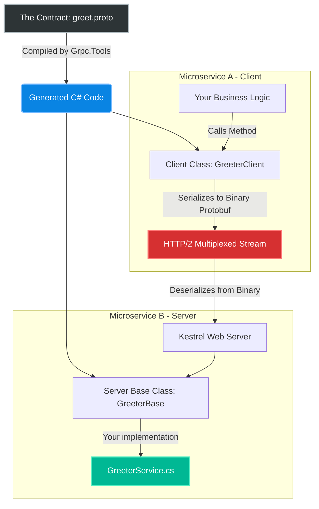

# 4.180 — gRPC Fundamentals & Protobuf

## PART 0 — Navigation & Context

```text
ASP.NET Core Domain Hierarchy
├── RPC & Messaging
│   ├── 4.180 gRPC Fundamentals & Protobuf ◄ YOU ARE HERE
│   ├── 4.181 gRPC Server Implementation
│   └── 4.182 gRPC Client Factory
└── Core Architecture
    └── 4.015 Minimal APIs vs MVC Controllers
```

**What you need before this:**
- A solid understanding of traditional REST APIs and JSON payload serialization.
- Familiarity with HTTP/1.1 vs HTTP/2 mechanics (multiplexing).

**What this unlocks after:**
- Building high-performance, strictly-typed microservice-to-microservice communication channels.
- Supporting bi-directional streaming between client and server.
- Implementing [[4.181 — gRPC Server Implementation]].

**Why this matters to a production engineer at scale:**
REST APIs using JSON over HTTP/1.1 are fantastic for public-facing web applications. However, inside a massive corporate data center where Microservice A talks to Microservice B 50,000 times a second, JSON becomes a severe bottleneck. JSON is plain text. The CPU wastes immense resources parsing strings into C# objects and vice versa. Furthermore, HTTP/1.1 limits concurrent requests. 
**gRPC** (gRPC Remote Procedure Calls) is Google's open-source framework designed for extreme performance. It uses **HTTP/2** (for multiplexed, binary framing) and **Protocol Buffers (Protobuf)** (a heavily compressed binary serialization format). It allows Microservice A to call a method on Microservice B as if it were a local C# method call, strongly typed, and up to 10x faster than REST. In .NET Core 3.0+, Microsoft baked gRPC natively into Kestrel, making C# one of the fastest gRPC implementations in the world.

---

## PART 1 — The Core Mental Model

> **The Fundamental Rule**
> **Unlike REST, which relies on loose HTTP verbs (GET/POST) and dynamic JSON structures, gRPC relies on a strict, language-agnostic contract (the `.proto` file) that automatically generates the C# boilerplate code for both the Server and the Client, utilizing binary serialization over HTTP/2 for maximum efficiency.**

**The Plain-Language Analogy**
Imagine sending a physical letter (A REST JSON Request).
**REST:** You write an essay on a piece of paper: *"Hello, my name is John. My age is 30."* You put it in an envelope. The receiver opens it, reads the English text, figures out what you mean, and writes an essay back. It's flexible, anyone can read it, but it takes time to write and read.
**gRPC & Protobuf:** Both you and the receiver agree beforehand on a rigid decoder ring (The `.proto` file). You don't send English words. You just send the numbers `[1][John][2][30]`. The receiver puts it through their decoder ring and instantly knows Field 1 is the Name and Field 2 is the Age. Because you removed all the English fluff (brackets, quotes, property names), the envelope is tiny, and it takes zero mental effort to decode.

**The Taxonomy Diagram**



---

## PART 2 — Deep Mechanics

### 1. Protocol Buffers (Protobuf)
Protobuf is the Interface Definition Language (IDL) and the binary serialization format used by gRPC. 
You define your service and messages in a `.proto` file. This file is platform-agnostic. You can share the exact same `.proto` file with a Java, Go, or Python team, and they can generate their own native clients.
Unlike JSON, Protobuf does not send property names over the wire. It uses assigned integers (tags).

```proto
// JSON: { "FirstName": "John", "Age": 30 }
// Protobuf Payload just contains the data mapped to Tag 1 and Tag 2.
message User {
  string first_name = 1; // 1 is the Tag, NOT the value!
  int32 age = 2;         // 2 is the Tag.
}
```

### 2. HTTP/2 and Multiplexing
REST (usually HTTP/1.1) suffers from Head-of-Line Blocking. If you send 5 requests on one connection, Request #2 must wait for Request #1 to finish.
gRPC strictly requires HTTP/2. HTTP/2 allows **Multiplexing**—sending hundreds of parallel requests back and forth over a single, persistent TCP connection. This drastically reduces the overhead of TCP handshakes and SSL negotiation.

### 3. The Four gRPC Communication Patterns
REST only has Request/Response. gRPC has four capabilities:
1. **Unary:** Standard Request/Response. (Client sends 1 message, Server returns 1 message).
2. **Server Streaming:** Client sends 1 request, Server returns a continuous stream of messages (e.g., live stock ticker).
3. **Client Streaming:** Client streams multiple messages to the Server, Server processes them and returns 1 response (e.g., uploading a massive file in chunks).
4. **Bi-directional Streaming:** Client and Server send streams of messages to each other concurrently, independently over the same connection (e.g., live chat, multiplayer game state).

---

## PART 3 — Production Code Patterns

### Pattern 1: Defining the `.proto` Contract
The first step of any gRPC project is writing the Protobuf contract.

```protobuf
syntax = "proto3";

// C# namespace for the generated code
option csharp_namespace = "MyApp.Protos";

// The Service Definition (The Interface)
service InventoryService {
  // Unary (Standard)
  rpc GetStock (StockRequest) returns (StockReply);
  
  // Server Streaming (Note the 'stream' keyword)
  rpc SubscribeStockUpdates (StockRequest) returns (stream StockReply);
}

// The Message Definitions (The DTOs)
message StockRequest {
  string product_id = 1;  // Tag 1
}

message StockReply {
  string product_id = 1;
  int32 quantity = 2;
  bool is_in_stock = 3;
}
```

### Pattern 2: C# MSBuild Integration (Code Generation)
You do not parse the `.proto` file yourself. You add a NuGet package that automatically generates the C# classes when you click "Build" in Visual Studio or run `dotnet build`.

```xml
<!-- In your .csproj file -->
<ItemGroup>
  <PackageReference Include="Grpc.AspNetCore" Version="2.60.0" />
</ItemGroup>

<ItemGroup>
  <!-- Tells the compiler to generate Server code from this file -->
  <Protobuf Include="Protos\inventory.proto" GrpcServices="Server" />
</ItemGroup>
```

### Pattern 3: Protobuf Data Types
Protobuf is highly efficient but has a limited set of native primitive types. You must know how they map to C#.

| Protobuf Type | C# Type | Notes |
|---|---|---|
| `double` | `double` | 64-bit float |
| `float` | `float` | 32-bit float |
| `int32` | `int` | Standard variable-length integer |
| `int64` | `long` | Variable-length integer |
| `bool` | `bool` | Standard boolean |
| `string` | `string` | UTF-8 encoded text |
| `bytes` | `ByteString` | Arbitrary byte array (e.g., images) |

### Pattern 4: Handling Dates, Nulls, and Decimals (Well-Known Types)
Protobuf doesn't natively support `DateTime`, `decimal`, or `null`. You must use Google's "Well-Known Types" wrappers.

```protobuf
syntax = "proto3";
import "google/protobuf/timestamp.proto";
import "google/protobuf/wrappers.proto";

message Order {
  // DateTime mapping
  google.protobuf.Timestamp order_date = 1; 
  
  // Nullable string mapping (string? in C#)
  google.protobuf.StringValue optional_notes = 2;
  
  // Decimals don't exist natively. Common workaround: use a custom message or double.
  double price_approx = 3; 
}
```

### Pattern 5: Enum Definitions
Enums are natively supported, but the first value (Tag 0) MUST be the default value.

```protobuf
enum OrderStatus {
  ORDER_STATUS_UNKNOWN = 0; // Required Tag 0 default
  ORDER_STATUS_PENDING = 1;
  ORDER_STATUS_SHIPPED = 2;
}

message Order {
  OrderStatus status = 1;
}
```

---

## PART 4 — Gotchas & Anti-Patterns

### Gotcha 1: Changing or Deleting Tags (Breaking Changes)
In JSON/REST, if you rename a property from `firstName` to `first_name`, you break the API. 
In gRPC, property names don't matter over the wire! **The integer Tag is the only thing that matters.**

// ⚠️ WRONG CODE
```protobuf
// V1 Contract
message User {
  string email = 1;
}

// V2 Contract (Developer thinks 'email' is no longer needed, removes it, and reuses tag 1)
message User {
  string username = 1; // BROKEN!
}
```

// HTTP consequence (wrong path):
// The V1 Client sends "john@demo.com" into Tag 1. The V2 Server reads Tag 1 and maps it to `username`. Silent data corruption occurs!

// ✅ CORRECT CODE
```protobuf
// If you deprecate a field, NEVER reuse its tag number.
message User {
  reserved 1; // Ensures no future developer accidentally reuses Tag 1
  reserved "email";
  
  string username = 2; // Always increment tags!
}
```

### Gotcha 2: Returning Nulls in gRPC
In REST, an API might return `null` for a missing property.
In Protobuf v3, **nulls do not exist** for primitive types. Everything has a default value. If a string is omitted, it defaults to `""` (empty string). If an integer is omitted, it defaults to `0`.

// ⚠️ WRONG CODE
// C# Developer checks if `request.Name == null`.

// HTTP consequence (wrong path):
// `request.Name` will never be null. It will be `""`. The validation logic fails.

// ✅ CORRECT CODE
// Use `string.IsNullOrEmpty(request.Name)`.
// Or, if you MUST explicitly know if a value is null vs 0, use the `google.protobuf.Int32Value` wrapper, or the `optional` keyword introduced in modern Protobuf v3.

### Gotcha 3: Load Balancing gRPC
This is the most infamous DevOps gotcha for gRPC.

// Scenario: You deploy 5 gRPC Server pods to Kubernetes. You use a standard Layer 4 TCP Load Balancer (like AWS Network Load Balancer). 
// You have 1 Client. The Client establishes a TCP connection. Because gRPC uses HTTP/2 multiplexing, the Client keeps that SINGLE TCP connection open forever, sending all requests through it.

// HTTP consequence (wrong path):
// All 50,000 requests from the Client go to exactly ONE server pod. The other 4 server pods sit completely idle. The overloaded pod crashes. The TCP connection drops, reconnects to another pod, and crashes that one.

// ✅ CORRECT CODE
// You MUST use a Layer 7 (HTTP/2 aware) Load Balancer (like NGINX ingress, Envoy, YARP, or AWS ALB). A Layer 7 load balancer terminates the single HTTP/2 connection from the client, reads the multiplexed frames, and distributes the individual frames across the 5 backend pods.

### Gotcha 4: Missing the HTTP/2 Requirement
If you deploy an ASP.NET Core gRPC server to Azure App Service or IIS on an older Windows Server version that doesn't fully support HTTP/2 trailing headers.

// HTTP consequence (wrong path):
// The client connects but immediately receives `PROTOCOL_ERROR` or `HTTP/1.1 Required`.

// ✅ CORRECT CODE
// gRPC strictly requires HTTP/2. In Kestrel, this is enabled by default in .NET Core 3.0+. However, if your reverse proxy (NGINX/IIS) downgrades the connection to HTTP/1.1 before it reaches Kestrel, gRPC will fail. Ensure end-to-end HTTP/2. (Note: Microsoft released `grpc-web` to allow browser clients to use HTTP/1.1, but pure gRPC requires HTTP/2).

---

## PART 5 — Performance Implications

### Request Pipeline Characteristics

| Metric | REST (JSON / HTTP 1.1) | gRPC (Protobuf / HTTP 2) | Difference |
|---|---|---|---|
| Payload Size | Large (Plain text) | Tiny (Binary bytes) | gRPC is ~30-50% smaller. |
| Parsing Speed | Slow (String regex/tokens) | Instant (Bit-shifting) | gRPC is ~5-10x faster. |
| Connections | 1 connection per request | 1 connection total | gRPC eliminates TCP handshake overhead. |

### BenchmarkDotNet Concept

*(If you benchmarked JSON vs Protobuf serialization in .NET)*
Serializing a complex Object with 50 properties:
- `System.Text.Json`: ~5,000 ns, allocating 3KB of string memory.
- `Protobuf`: ~500 ns, allocating a 300-byte array. 

**When to Care:** gRPC is not meant for public-facing websites where human browsers fetch HTML/JSON. It is designed for **Backend-to-Backend** communication. If Microservice A calls Microservice B 100 times per second, the compute savings of gRPC translate directly to lowering your AWS/Azure cloud compute bills by requiring fewer servers to handle the serialization overhead.

---

## PART 6 — Interview Arsenal

### A. The Question Bank

**Question 1:** "What are the primary differences between gRPC and REST?"
- **Average Answer:** "gRPC is faster and uses Protobuf instead of JSON."
- **Why That's Insufficient:** Ignores the networking layer and the contract-driven design.
- **Great Answer:** "There are three major differences. First, the Contract: REST is loose and dynamically typed, whereas gRPC requires a strict `.proto` contract used to generate strongly-typed C# client and server code. Second, the Protocol: REST typically uses HTTP/1.1 and plain-text JSON, while gRPC strictly requires HTTP/2 and binary Protobuf. Finally, Capabilities: REST is limited to Request/Response, whereas gRPC supports Unary, Client Streaming, Server Streaming, and Bi-directional Streaming over a single multiplexed TCP connection."

**Question 2:** "Why is it dangerous to change the integer tags in a `.proto` file once an API is in production?"
- **Average Answer:** "Because the client won't know the new tag."
- **Why That's Insufficient:** Needs to explain how Protobuf serialization actually works over the wire.
- **Great Answer:** "Unlike JSON, Protobuf does not send property names (like 'FirstName') over the network. It only sends the integer Tag and the binary value. If a V1 client sends the name using Tag 1, and the backend developer modifies the `.proto` file to assign Tag 1 to the 'Age' property, the gRPC server will successfully deserialize the payload, but it will put the string name into the integer age field, causing immediate data corruption or casting exceptions. Once a tag is used, you can never reuse it for a different property; you must use the `reserved` keyword."

**Question 3:** "If Protobuf doesn't support `DateTime` or `decimal` natively, how do you handle financial dates and money in a gRPC contract?"
- **Average Answer:** "You just use strings."
- **Why That's Insufficient:** Using strings destroys the performance benefits of binary serialization.
- **Great Answer:** "For `DateTime`, you import Google's Well-Known Types and use `google.protobuf.Timestamp`, which maps directly to C#'s `DateTime` or `DateTimeOffset` in the generated code. For `decimal`, since Protobuf doesn't have an exact 128-bit decimal type, you should not use `double` because of floating-point precision loss in finance. The standard practice is to create a custom `DecimalValue` message containing two `int64` fields: one for the unscaled units, and one for the precision/nanos, ensuring perfect financial accuracy over the wire."

### B. The Trick Questions

**Trick Question:** "Can a React/Angular Single Page Application (SPA) in the browser call a standard gRPC server directly?"
- **The Trap:** Browsers do not expose raw HTTP/2 framing controls to JavaScript.
- **The Correct Answer:** "No, not directly. Standard gRPC relies on strict HTTP/2 trailing headers, which browser JavaScript APIs (`fetch` / `XMLHttpRequest`) do not fully expose or support. To allow a browser to call a gRPC server, you must use **gRPC-Web**. This is a protocol extension that translates standard gRPC into a format compatible with HTTP/1.1 and browser capabilities, requiring either a proxy (like Envoy) or the native `Grpc.AspNetCore.Web` middleware in .NET."

**Trick Question:** "If an integer is null in my database, how do I send that null integer back to the gRPC client?"
- **The Trap:** Protobuf v3 eliminated nulls.
- **The Correct Answer:** "In standard Protobuf v3, primitive types like `int32` cannot be null; they default to `0`. If you absolutely must differentiate between `0` and `null`, you have two options. You can use the Well-Known Type `google.protobuf.Int32Value` which is an object wrapper (and therefore can be null), or you can use the newer `optional int32` keyword introduced recently in Protobuf, which generates a `HasValue` checker in C#."

### C. Red Flags to Avoid
- 🚩 **"I write the gRPC C# classes manually."** (You should NEVER write gRPC stubs manually. Always rely on the `.proto` file and the MSBuild code generator to ensure the protocol math is flawless).
- 🚩 **"I use gRPC for my public facing APIs."** (Public APIs should almost always be REST/GraphQL because external developers don't want to compile `.proto` files just to query your data. gRPC is for internal microservices).

---

## PART 7 — Decision Framework

```mermaid
graph TD
    A[New API Communication] --> B{Who is consuming this API?}
    
    B -->|Public Internet / 3rd Parties| C[REST API with Swagger / JSON]
    B -->|Browser SPA| D[REST API or gRPC-Web]
    B -->|Internal Microservice| E{Is performance / latency critical?}
    
    E -->|No| F[REST API or HTTP Client]
    E -->|Yes| G[gRPC]
    
    G --> H{Does K8s Load Balancer support HTTP/2?}
    H -->|Yes| I[Deploy gRPC]
    H -->|No| J[Must upgrade to L7 Load Balancer or Envoy]
    
    style A fill:#2d3436,stroke:#fff
    style C fill:#0984e3,stroke:#fff
    style G fill:#00b894,stroke:#fff
    style I fill:#00b894,stroke:#fff
    style J fill:#d63031,stroke:#fff
```



---

## PART 8 — Self-Check

### A. Conceptual Questions
1. Why is gRPC significantly faster than REST/JSON?
2. What happens to the `.proto` file when you build your .NET Core project?
3. Why does gRPC specifically require HTTP/2?
4. What is Head-of-Line blocking, and how does HTTP/2 multiplexing fix it?
5. Why are property names in a `.proto` file irrelevant to the network payload?
6. What is the `reserved` keyword used for in a `.proto` file?
7. Why does standard Layer 4 load balancing fail terribly for gRPC connections?
8. What are the four types of streaming supported by gRPC?

### B. Code Puzzles

**Puzzle 1: The Missing Null**
```protobuf
message CreateUserRequest {
  string first_name = 1;
  string last_name = 2; // Optional in UI
}
```
*Scenario:* The user leaves `last_name` blank. The C# server checks `if (request.LastName == null)`.
<details>
<summary>Answer</summary>
The condition will never be true. In Protobuf v3, unassigned strings are initialized to `""` (empty string), not `null`.
*Fix:* Check `if (string.IsNullOrEmpty(request.LastName))`.
</details>

**Puzzle 2: The Tag Re-use Disaster**
```protobuf
// V1
message Product {
  string sku = 1;
  string description = 2;
}

// V2 (Description removed, price added)
message Product {
  string sku = 1;
  double price = 2; // Used Tag 2!
}
```
*Scenario:* V1 client sends a description. V2 server receives it.
<details>
<summary>Answer</summary>
The V2 server expects Tag 2 to be a 64-bit float (`double`). The V1 client sends a UTF-8 string over Tag 2. The Protobuf deserializer on the server will fail to parse the bytes and throw a wire-format exception.
*Fix:* `reserved 2;` and `double price = 3;`.
</details>

**Puzzle 3: The Build Error**
```xml
<Protobuf Include="Protos\inventory.proto" />
```
*Scenario:* You try to inherit from the generated `InventoryBase` class, but it doesn't exist.
<details>
<summary>Answer</summary>
You must explicitly tell the Grpc.Tools compiler what type of code to generate (Server vs Client).
*Fix:* `<Protobuf Include="Protos\inventory.proto" GrpcServices="Server" />`.
</details>

---

## PART 9 — Connections & Resources

### A. Related Topics Table

| Topic | Why It Connects |
|---|---|
| [[4.181 — gRPC Server Implementation]] | The immediate next step: writing the actual C# code that inherits from the generated Protobuf classes. |
| [[4.033 — Kestrel Web Server]] | Understanding how Kestrel handles HTTP/2 multiplexing limits. |

### B. Books

| Book | Chapters | Why These Chapters |
|---|---|---|
| gRPC for WCF Developers | Whole Book | Microsoft's official free e-book for migrating legacy WCF to gRPC. |
| ASP.NET Core in Action, 3rd Ed | Chapter 23: RPC with gRPC | Great overview of defining `.proto` files in .NET. |

### C. Essential Articles & Docs
- [Microsoft Docs: Introduction to gRPC on .NET](https://learn.microsoft.com/en-us/aspnet/core/grpc/)
- [Protobuf Official Language Guide (proto3)](https://protobuf.dev/programming-guides/proto3/)

> [!NOTE]
> **Template Meta-Note**
> Part 0: Context & Prerequisites. Part 1: Core Mental Model. Part 2: Deep Mechanics & Pipeline. Part 3: Production Code. Part 4: Gotchas. Part 5: Performance. Part 6: Interview Arsenal. Part 7: Decision Framework. Part 8: Puzzles. Part 9: Resources.
