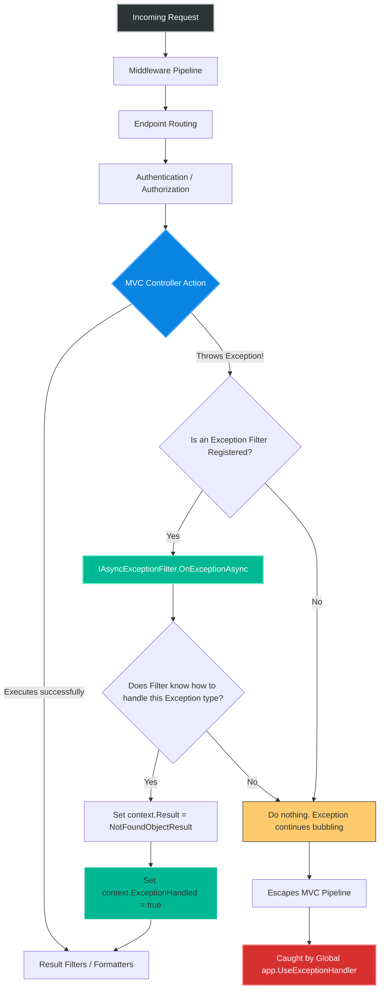

# 4.181 — Exception Filters: Controller-Scoped Exception Interception

## PART 0 — Navigation & Context

```text
ASP.NET Core Domain Hierarchy
├── Cross-Cutting Concerns
│   ├── Error Handling Pipeline
│   │   ├── 4.177 UseExceptionHandler
│   │   ├── 4.181 Exception Filters ◄ YOU ARE HERE
│   │   └── 4.182 IExceptionHandler (.NET 8+)
└── Request Routing
    └── 4.110 The MVC Filter Pipeline
```

**What you need before this:**
- A deep understanding of the MVC Filter Pipeline execution order (Action Filters vs Result Filters vs Exception Filters) [[4.110 — The MVC Filter Pipeline: Order and Execution]].
- Knowledge of the global Exception Handling Middleware [[4.177 — Exception Handling Middleware: UseExceptionHandler and Error Pipelines]].
- Understanding of how to generate RFC 7807 JSON responses [[4.179 — Problem Details RFC 7807: IProblemDetailsService]].

**What this unlocks after:**
- Intercepting specific Domain Exceptions thrown inside a Controller Action and seamlessly translating them into precise HTTP status codes (e.g., translating `OrderNotFoundException` into an HTTP 404 response).
- Isolating error-handling logic for a specific subset of Controllers without polluting the global `UseExceptionHandler` middleware.

**Why this matters to a production engineer at scale:**
In a Clean Architecture, your core Domain or Application layers will frequently throw business-specific exceptions: `InsufficientFundsException`, `UserNotFoundException`, `InventoryLockedException`. If you let these bubble up unhandled, ASP.NET Core's global `UseExceptionHandler` will catch them and return a generic HTTP 500 Internal Server Error. 
While you *could* put a giant `switch` statement in your global exception middleware to map these to 409 Conflict or 404 Not Found, that creates a massive, tightly-coupled bottleneck.
Exception Filters allow you to intercept exceptions *immediately* after the Controller Action throws them. You can apply an Exception Filter globally, to a single Controller, or even to a single Action method. This allows teams managing specific API modules to handle their own domain exceptions locally, formatting beautiful `ProblemDetails` responses before the framework ever realizes an error occurred. However, a senior engineer must understand the limitations: Exception Filters *only* run within the MVC pipeline. If an authentication middleware throws, or a Minimal API throws, the filter is completely blind.

---

## PART 1 — The Core Mental Model

> **The Fundamental Rule**
> **`IExceptionFilter` (and `IAsyncExceptionFilter`) runs exclusively within the MVC Filter Pipeline. It is invoked ONLY when an unhandled exception escapes a Controller Action, a Razor Page handler, or a preceding Action Filter. Inside the filter, you evaluate the exception. If you assign an `IActionResult` (e.g., `NotFoundObjectResult`) to `context.Result` and set `context.ExceptionHandled = true`, the exception stops bubbling. The pipeline skips straight to Result Execution, returning your custom response to the client. If you do not handle it, the exception escapes the MVC pipeline and bubbles up to the global middleware (`UseExceptionHandler`).**

**The Plain-Language Analogy**
Imagine a Hospital (The HTTP Pipeline).
A patient (The Request) walks in. They go through Triage (Authentication Middleware) and get sent to a specific Surgeon in an Operating Room (The Controller Action).
During the surgery, something goes wrong (An Exception is thrown).
**The Exception Filter** is the **Surgeon's Assistant** standing right next to the table. If it's a minor complication they know how to fix (e.g., `OrderNotFoundException`), they handle it immediately, stitch up the patient (Return HTTP 404), and the hospital administration never hears about the mistake.
However, if the power goes out in the entire hospital (a Middleware crash), the Assistant can't help. Or, if the Assistant doesn't know how to fix the complication, they step back and hit the **Code Blue Alarm**. The exception leaves the room and summons the **Hospital Crash Team** (Global `UseExceptionHandler`), who rushes in, takes over, and issues a generic "The surgery failed" report to the family (HTTP 500).

**The Taxonomy Diagram**



---

## PART 2 — Deep Mechanics

### 2.1 — The MVC Filter Pipeline Position
Exception filters do not wrap the entire HTTP request. They wrap a specific subset of the MVC execution flow.

```
──► Routing / Auth Middleware
    ──► Resource Filters
        ──► Model Binding
            ──► Action Filters (OnActionExecuting)
                ──► CONTROLLER ACTION EXECUTES ◄── Exception Source
            ──► Action Filters (OnActionExecuted)
        ──► EXCEPTION FILTERS ◄── Catches exceptions from Action or ActionFilters
    ──► Result Filters
    ──► Result Execution (Formatting JSON)
```
**Critical Boundary:** If an exception is thrown during Model Binding, or inside a Result Filter while formatting the JSON response, the Exception Filter WILL NOT catch it. It strictly catches exceptions generated during the execution of the Action itself (or Action Filters).

### 2.2 — Implementing `IExceptionFilter` (Synchronous)
The synchronous interface is simple. You check the exception type and construct an `IActionResult`.

```csharp
public sealed class DomainExceptionFilter : IExceptionFilter
{
    public void OnException(ExceptionContext context)
    {
        // 1. Check if this is the specific exception we want to intercept
        if (context.Exception is OrderNotFoundException notFoundEx)
        {
            // 2. Create the RFC 7807 standard Problem Details object
            var problemDetails = new ProblemDetails
            {
                Type = "https://api.mycompany.com/errors/not-found",
                Title = "Resource Not Found",
                Status = StatusCodes.Status404NotFound,
                Detail = notFoundEx.Message,
                Instance = context.HttpContext.Request.Path
            };

            // 3. Set the Result. This short-circuits the pipeline.
            context.Result = new NotFoundObjectResult(problemDetails);
            
            // 4. M A N D A T O R Y : Tell the framework you handled it!
            context.ExceptionHandled = true;
        }
    }
}
```

### 2.3 — Implementing `IAsyncExceptionFilter`
If your error handling requires asynchronous operations (e.g., logging the error to a database, calling an external telemetry service), you must use the async variant. Do not use `.Result` or `.Wait()` inside a sync filter.

```csharp
public sealed class AsyncTelemetryExceptionFilter : IAsyncExceptionFilter
{
    private readonly ITelemetryService _telemetry;
    public AsyncTelemetryExceptionFilter(ITelemetryService telemetry) => _telemetry = telemetry;

    public async Task OnExceptionAsync(ExceptionContext context)
    {
        if (context.Exception is PaymentDeclinedException paymentEx)
        {
            // Log asynchronously
            await _telemetry.TrackPaymentFailureAsync(paymentEx.TransactionId);

            context.Result = new ObjectResult(new ProblemDetails 
            { 
                Title = "Payment Declined", 
                Status = 402 
            }) { StatusCode = 402 };

            context.ExceptionHandled = true;
        }
    }
}
```

### 2.4 — Registration Scopes
Exception Filters are incredibly flexible because they hook into the MVC attribute routing system.

**Scope 1: Action Level (Narrowest)**
Only applies to this specific method.
```csharp
[TypeFilter(typeof(DomainExceptionFilter))]
[HttpGet("{id}")]
public IActionResult GetOrder(int id) { ... }
```

**Scope 2: Controller Level**
Applies to all actions in the controller.
```csharp
[TypeFilter(typeof(DomainExceptionFilter))]
public class OrdersController : ControllerBase { ... }
```

**Scope 3: Global MVC Scope (Widest)**
Applies to every controller in the application.
```csharp
builder.Services.AddControllers(options => 
{
    options.Filters.Add<DomainExceptionFilter>();
});
```

### 2.5 — The `.NET 8` Shift: `IExceptionHandler` vs Filters
In .NET 8, Microsoft introduced `IExceptionHandler`. This is a *middleware-level* interface that integrates directly with `UseExceptionHandler`.
- **Exception Filters:** Only catch MVC/Razor exceptions. Can be scoped to a single Controller. Support `[Attribute]` usage.
- **`IExceptionHandler`:** Catches MVC, Minimal APIs, and Middleware exceptions. Strictly global. Preferred for modern applications unless you specifically need Controller-level scoping.

---

## PART 3 — Production Code Patterns

### Pattern 1: The Unified Domain Exception Base Class
Instead of writing 50 different `if` statements for `UserNotFoundException`, `OrderNotFoundException`, etc., enterprise apps use a base class or an interface (`IStatusException`) mapped dynamically by the filter.

```csharp
// 1. The Domain Base Exception
public abstract class DomainException : Exception
{
    public int StatusCode { get; }
    protected DomainException(string message, int statusCode) : base(message) 
    {
        StatusCode = statusCode;
    }
}

public class ConflictException : DomainException {
    public ConflictException(string msg) : base(msg, 409) { }
}
public class NotFoundException : DomainException {
    public NotFoundException(string msg) : base(msg, 404) { }
}
```

```csharp
// 2. The Universal Filter
public class UniversalDomainExceptionFilter : IExceptionFilter
{
    public void OnException(ExceptionContext context)
    {
        if (context.Exception is DomainException domainEx)
        {
            var problem = new ProblemDetails
            {
                Title = "Domain Rule Violation",
                Detail = domainEx.Message,
                Status = domainEx.StatusCode
            };

            context.Result = new ObjectResult(problem) { StatusCode = domainEx.StatusCode };
            context.ExceptionHandled = true;
        }
    }
}
```

### Pattern 2: Logging with `ILogger`
When you set `ExceptionHandled = true`, ASP.NET Core assumes the error was safely resolved (like returning a 404). It will NOT log an Error to the console or Application Insights by default. If you are catching a critical 409 Conflict and want it logged as a Warning, you must inject `ILogger` and log it manually.

```csharp
public void OnException(ExceptionContext context)
{
    if (context.Exception is InsufficientFundsException ex)
    {
        // Explicitly log the business failure before hiding the exception
        _logger.LogWarning(ex, "Transaction failed: Insufficient Funds for user {User}", context.HttpContext.User.Identity.Name);

        context.Result = new ConflictObjectResult(new { error = ex.Message });
        context.ExceptionHandled = true;
    }
}
```

### Pattern 3: Minimal API Bridging (Why Filters Fail)
If your team mixes MVC Controllers and Minimal APIs, applying a Global Exception Filter via `AddControllers` is a trap.

```csharp
// Program.cs
builder.Services.AddControllers(options => options.Filters.Add<DomainExceptionFilter>());

// Controller
[HttpGet("api/c/users/{id}")] // ◄ Filter Works here!
public IActionResult GetC(int id) { throw new NotFoundException("x"); }

// Minimal API
app.MapGet("api/m/users/{id}", (int id) => { throw new NotFoundException("x"); }); // ◄ Filter FAILS here!
```
*Result:* The Minimal API endpoint throws the exception straight to the global middleware, returning a 500 Internal Server Error, breaking the API contract consistency. If using Minimal APIs, migrate mapping logic to `IExceptionHandler` (.NET 8).

### Pattern 4: Injecting Dependencies via `[ServiceFilter]`
If your custom exception filter requires constructor injection (like an `ILogger` or an `IDbContext`), you cannot simply write `[CustomExceptionFilter]` above your controller. Attributes require parameterless constructors at compile time.

```csharp
// 1. Register the filter itself in DI
builder.Services.AddScoped<DatabaseLoggingExceptionFilter>();

// 2. Apply it using ServiceFilter
[ServiceFilter(typeof(DatabaseLoggingExceptionFilter))]
public class SecureController : ControllerBase { ... }
```
Alternatively, `[TypeFilter(typeof(DatabaseLoggingExceptionFilter))]` uses the DI container to instantiate it without requiring explicit registration in `Program.cs`.

---

## PART 4 — Gotchas & Anti-Patterns

### Gotcha 1: Forgetting `ExceptionHandled = true`
The most common mistake when writing a custom filter.

// ⚠️ WRONG CODE
```csharp
public void OnException(ExceptionContext context)
{
    if (context.Exception is TimeoutException) {
        context.Result = new StatusCodeResult(503);
        // ❌ Forgot context.ExceptionHandled = true!
    }
}
```

// HTTP consequence (wrong path):
// Even though you carefully constructed the `503 Service Unavailable` result, because you didn't tell the pipeline the exception was handled, ASP.NET Core completely discards your `Result`. The exception continues bubbling up to `UseExceptionHandler`, resulting in a generic 500 error. 

// ✅ CORRECT CODE
// Always append `context.ExceptionHandled = true;` inside the conditional block.

### Gotcha 2: Throwing Exceptions INSIDE the Exception Filter
An exception filter is a catch block. If you write code that throws a `NullReferenceException` *inside* the `OnException` method, behavior becomes chaotic. The framework will usually catch the secondary exception and propagate it instead of the original one, completely destroying the original stack trace and blinding you to the actual root cause of the bug. Always wrap dangerous operations inside a filter with `try/catch`.

### Gotcha 3: The Filter Ordering Trap
If you register multiple exception filters globally, they execute in a specific order (based on Scope, then `Order` property).
If `FilterA` catches an exception and sets `ExceptionHandled = true`, `FilterB` is STILL invoked! However, `FilterB` will see `context.ExceptionHandled == true`. 

```csharp
public void OnException(ExceptionContext context)
{
    // Always check if someone else handled it first to avoid overwriting their result!
    if (context.ExceptionHandled) return; 

    // Handle exception...
}
```

### Gotcha 4: Returning Raw Strings instead of Problem Details
If your API standardized on RFC 7807 Problem Details (which it should), returning `context.Result = new BadRequestObjectResult("Domain Error")` breaks the JSON contract your mobile clients expect.
Always return a formatted `ProblemDetails` object from your filters to maintain API consistency.

---

## PART 5 — Performance Implications

### Request Pipeline Characteristics

| Scenario | Execution Speed | Pipeline Impact |
|---|---|---|
| Happy Path (No Exception) | 0ms | Filters check an internal list; `OnException` is never invoked. Zero impact. |
| Exception Thrown | < 0.1ms | Faster than global `UseExceptionHandler` because it avoids re-executing the routing pipeline. Resolves instantly in-memory. |

**Performance Verdict:**
Exception filters are incredibly lightweight. Because they only execute on the unhappy path, they have zero impact on your application's maximum throughput. If a known business exception occurs, resolving it via a Filter is technically slightly faster than letting it bubble to the global middleware.

---

## PART 6 — Interview Arsenal

### A. The Question Bank

**Question 1:** "If you have a global `UseExceptionHandler` configured in `Program.cs`, and an `[ExceptionFilter]` applied to a Controller, which one executes first when an exception is thrown inside the controller action?"
- **Average Answer:** "The Exception Filter executes first."
- **Why That's Insufficient:** Answers the 'what', but misses the 'why' and the exact hand-off mechanic.
- **Great Answer:** "The Exception Filter executes first because it sits deep within the MVC filter pipeline, wrapped immediately around the Controller Action execution. When the action throws, the filter intercepts it immediately. If the filter successfully maps the error, sets a custom `IActionResult`, and marks `ExceptionHandled = true`, the exception is neutralized and never leaves the MVC pipeline. The global `UseExceptionHandler` middleware—which sits far above MVC near the start of the HTTP request—will never even know an exception occurred."

**Question 2:** "What happens if a JSON Serialization error occurs while writing the response to the client *after* the Controller action has returned successfully? Will the Exception Filter catch it?"
- **Average Answer:** "Yes, it catches all errors in the Controller."
- **Why That's Insufficient:** Demonstrates a lack of understanding of the MVC pipeline execution order.
- **Great Answer:** "No, it will not. Exception Filters strictly wrap the execution of Action Filters and the Action Method itself. Serialization and formatting happen during 'Result Execution', which occurs *after* Exception Filters have completed their phase in the pipeline. If a serialization error occurs, it bypasses Exception Filters completely and bubbles up to the global exception middleware."

**Question 3:** "Why would you choose to implement a custom `IExceptionFilter` rather than just using a giant `try/catch` block inside your Controller Action?"
- **Average Answer:** "To keep the controller code clean."
- **Why That's Insufficient:** Mentions clean code, but misses the architectural DRY benefits and separation of concerns.
- **Great Answer:** "Using `try/catch` blocks in every action violates the Single Responsibility Principle and creates massive code duplication. The controller's job is to orchestrate input and output, not to handle HTTP error mapping. By using an Exception Filter, we centralize the translation of Domain Exceptions (like `InventoryLockedException`) to HTTP responses (like `409 Conflict`). We can apply this filter at the controller level or globally via `AddControllers`, ensuring 100% consistent API error payloads without polluting our business logic."

### B. The Trick Questions

**Trick Question:** "We built a Minimal API application. I added a custom Exception Filter by calling `builder.Services.AddControllers(options => options.Filters.Add<MyFilter>())`. However, the filter is completely ignoring the exceptions thrown by my Minimal API endpoints. Why?"
- **The Trap:** Assuming `AddControllers` configuration applies globally to the entire ASP.NET Core runtime.
- **The Correct Answer:** "Filters are an exclusive feature of the MVC/Razor Pages architecture. Minimal APIs do not use the MVC pipeline, do not use Controllers, and do not execute MVC Filters. To handle exceptions globally across both MVC and Minimal APIs, you must use middleware (like `UseExceptionHandler`) or the new .NET 8 `IExceptionHandler` interface."

### C. Red Flags to Avoid
- 🚩 **"I use an Exception Filter to catch SQL Connection errors and retry the database query."** (Exception Filters sit far too high in the stack for this. Retries should happen via Polly inside the data access layer. By the time an exception hits a filter, the HTTP response must be finalized).

---

## PART 7 — Decision Framework

```mermaid
graph TD
    A[Need to Handle an Exception] --> B{Does it apply globally to ALL endpoints?}
    
    B -->|Yes| C[Use IExceptionHandler .NET 8]
    C --> D[Catches MVC, Minimal APIs, and Middleware]
    
    B -->|No| E{Is it specific to a single Controller/Action?}
    
    E -->|Yes| F[Create custom IExceptionFilter]
    F --> G[Apply via Attribute e.g., TypeFilter]
    
    E -->|No, but we only use MVC| H[Register IExceptionFilter globally in AddControllers]
    
    G --> I[Inside Filter: Map Exception to IActionResult]
    I --> J[Set ExceptionHandled = true]
    J --> K[Return ProblemDetails to Client]
    
    style A fill:#2d3436,stroke:#fff
    style C fill:#0984e3,stroke:#fff
    style F fill:#00b894,stroke:#fff
    style H fill:#fdcb6e,stroke:#333
    style J fill:#00b894,stroke:#fff
```



---

## PART 8 — Self-Check

### A. Conceptual Questions
1. Where does the Exception Filter sit relative to Action Filters and Result Filters in the MVC pipeline?
2. What are the two mandatory properties you must set on `ExceptionContext` to successfully short-circuit the exception?
3. Why will an Exception Filter fail to catch an exception thrown inside a custom Authentication Middleware?
4. What is the difference between `[ServiceFilter]` and `[TypeFilter]` when applying an Exception Filter to a controller?
5. How does the .NET 8 `IExceptionHandler` interface differ from an MVC Exception Filter?
6. If an Exception Filter successfully handles an exception, what does the global `UseExceptionHandler` middleware do?
7. Why is it dangerous to throw a new Exception inside an Exception Filter?
8. If multiple exception filters are registered, what property should you check first inside `OnException`?

### B. Code Puzzles

**Puzzle 1: The Bubbling Conflict**
```csharp
public void OnException(ExceptionContext context) {
    if (context.Exception is AccountLockedException) {
        context.Result = new ConflictResult();
    }
}
```
*Scenario:* A user triggers the `AccountLockedException`. Instead of receiving a 409 Conflict, they receive a 500 Internal Server Error. Why?
<details>
<summary>Answer</summary>
The developer forgot to add `context.ExceptionHandled = true;`. Setting the `Result` alone is not enough; the framework assumes the exception is still active and continues bubbling it out of the MVC pipeline to the global handler.
</details>

**Puzzle 2: The Blind Spot**
```csharp
public class AuditFilter : IActionFilter {
    public void OnActionExecuting(ActionExecutingContext context) {
        throw new Exception("Audit Database Offline");
    }
}
```
*Scenario:* An Exception Filter is registered globally to catch `Exception` and return a 400 Bad Request. Does it catch the exception thrown by `AuditFilter`?
<details>
<summary>Answer</summary>
Yes. Exception Filters wrap both the execution of the Controller Action AND the execution of Action Filters (`OnActionExecuting` / `OnActionExecuted`). The filter successfully catches the audit failure.
</details>

**Puzzle 3: The Silent Logger**
```csharp
public void OnException(ExceptionContext context) {
    context.Result = new BadRequestResult();
    context.ExceptionHandled = true;
}
```
*Scenario:* You deploy this filter. The client gets nice 400 Bad Request errors. However, your Application Insights / Serilog dashboard shows zero exceptions occurring. You have no idea what exceptions are triggering this. Why?
<details>
<summary>Answer</summary>
When you set `ExceptionHandled = true`, you tell ASP.NET Core "I took care of this, everything is fine." The framework considers the request resolved successfully and does not log the exception. If you want the exception logged, you MUST inject `ILogger` into your filter and manually call `_logger.LogError(context.Exception, "...")` before setting `ExceptionHandled`.
</details>

---

## PART 9 — Connections & Resources

### A. Related Topics Table

| Topic | Why It Connects |
|---|---|
| [[4.110 — The MVC Filter Pipeline: Order and Execution]] | The overarching framework that dictates exactly when and where `IExceptionFilter` runs. |
| [[4.177 — Exception Handling Middleware: UseExceptionHandler and Error Pipelines]] | The global middleware that acts as the final safety net if the Exception Filter fails to handle the error. |
| [[4.182 — Global Exception Handler (.NET 8): IExceptionHandler Interface]] | The modern, middleware-based alternative to Exception Filters that supports Minimal APIs. |

### B. Books

| Book | Chapters | Why These Chapters |
|---|---|---|
| ASP.NET Core in Action, 3rd Ed | Chapter 13: Filters | Provides visual diagrams of the MVC filter pipeline and exception propagation. |
| Pro ASP.NET Core 6 | Chapter 31: Filters | Detailed examples of creating and scoping custom Exception Filters. |

### C. Essential Articles & Docs
- [Microsoft Docs: Filters in ASP.NET Core (Exception Filters)](https://learn.microsoft.com/en-us/aspnet/core/mvc/controllers/filters#exception-filters)
- [Microsoft Docs: Error Handling (IExceptionHandler vs Filters)](https://learn.microsoft.com/en-us/aspnet/core/fundamentals/error-handling)

> [!NOTE]
> **Template Meta-Note**
> Part 0: Context & Prerequisites. Part 1: Core Mental Model. Part 2: Deep Mechanics & Pipeline. Part 3: Production Code. Part 4: Gotchas. Part 5: Performance. Part 6: Interview Arsenal. Part 7: Decision Framework. Part 8: Puzzles. Part 9: Resources.
